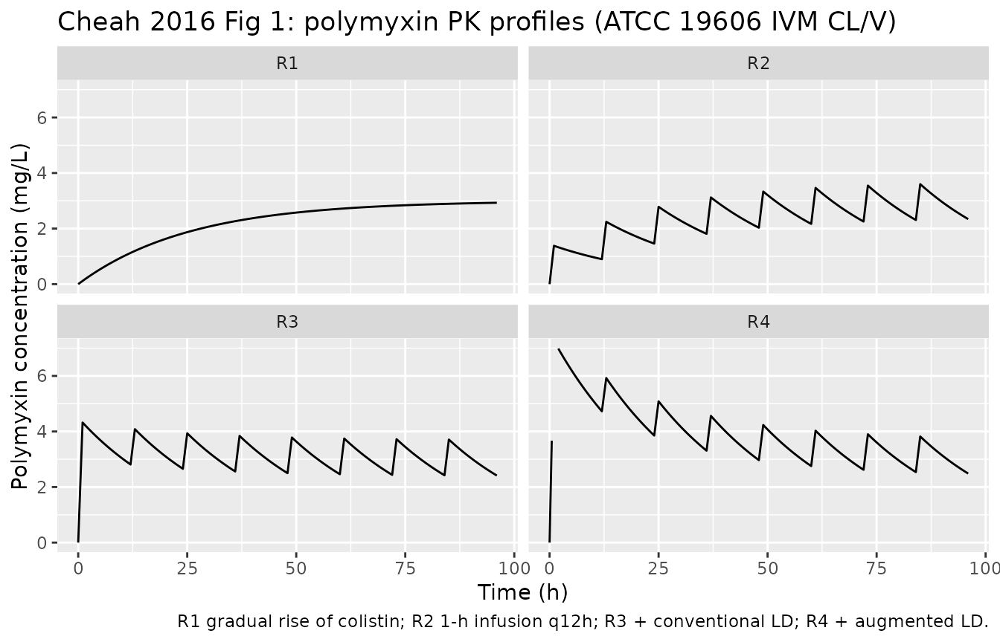
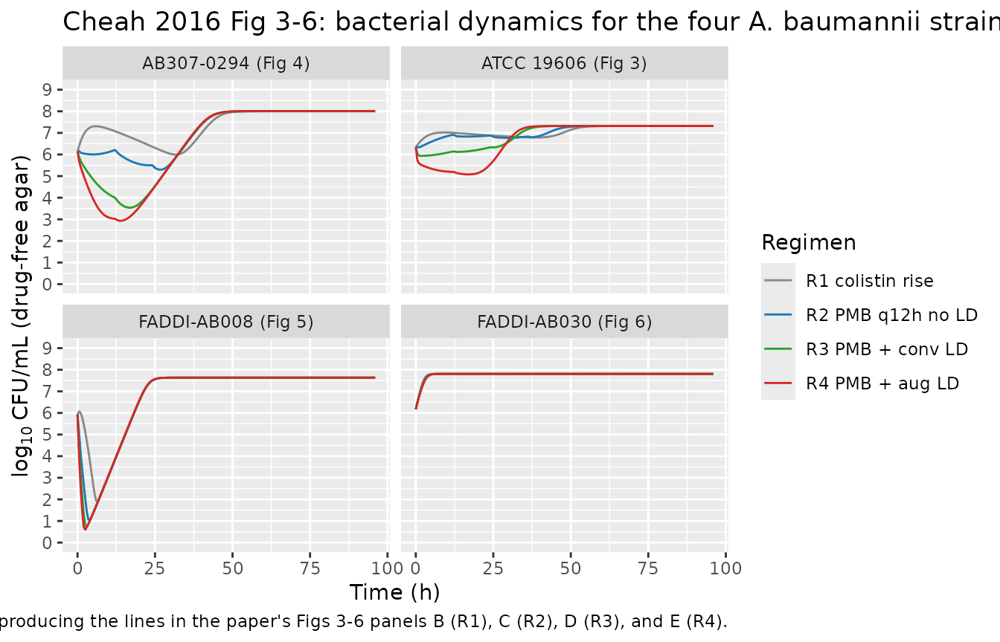

# Polymyxin B and colistin against A. baumannii (Cheah 2016)

## Model and source

Cheah et al. developed a mechanism-based PK/PD model of
polymyxin-mediated bacterial killing and the emergence of resistance in
*Acinetobacter baumannii*, fitted independently to four strains in a
dynamic one-compartment in vitro infection model (IVM). Each strain’s
typical-value fit is packaged as its own model file so the
strain-specific dynamics can be simulated cleanly.

- Article: [Antimicrob Agents Chemother
  60:3921-3933](https://doi.org/10.1128/AAC.02927-15)
- Citation: Cheah S-E, Li J, Tsuji BT, Forrest A, Bulitta JB, Nation RL.
  (2016). Colistin and polymyxin B dosage regimens against Acinetobacter
  baumannii: differences in activity and the emergence of resistance.
  Antimicrobial Agents and Chemotherapy 60(7):3921-3933.
  <doi:10.1128/AAC.02927-15>.
- Strain models (read from the package registry):

``` r

strain_models <- c(
  "Cheah_2016_polymyxin_ATCC19606",
  "Cheah_2016_polymyxin_AB3070294",
  "Cheah_2016_polymyxin_FADDIAB008",
  "Cheah_2016_polymyxin_FADDIAB030"
)
# Pre-resolve each strain into a typical-value (zeroRe) rxUi once. The rxUi
# exposes $reference, $description, $population, and $iniDf cleanly; further
# downstream chunks reuse these rxUi handles.
strain_ui <- lapply(strain_models, function(nm) rxode2::zeroRe(readModelDb(nm)))
#> Warning: No omega parameters in the model
#> No omega parameters in the model
#> No omega parameters in the model
#> No omega parameters in the model
names(strain_ui) <- strain_models
strain_meta <- do.call(rbind, lapply(strain_models, function(nm) {
  m <- strain_ui[[nm]]
  data.frame(
    model    = nm,
    species  = m$population$species,
    organism = m$population$organism,
    stringsAsFactors = FALSE
  )
}))
knitr::kable(strain_meta, caption = "Strain-specific models packaged from Cheah 2016.")
```

| model | species | organism |
|:---|:---|:---|
| Cheah_2016_polymyxin_ATCC19606 | in vitro (Acinetobacter baumannii ATCC 19606) | A. baumannii ATCC 19606 (heteroresistant reference strain; polymyxin B and colistin MIC 0.5 mg/L; resistance occurs via lipid-A phosphoethanolamine modification or loss of LPS from the outer membrane) |
| Cheah_2016_polymyxin_AB3070294 | in vitro (Acinetobacter baumannii AB307-0294) | A. baumannii AB307-0294 (clinical heteroresistant isolate; polymyxin B and colistin MIC 1 mg/L; population-analysis-profile evidence of heteroresistance) |
| Cheah_2016_polymyxin_FADDIAB008 | in vitro (Acinetobacter baumannii FADDI-AB008) | A. baumannii FADDI-AB008 (clinical heteroresistant isolate; described in reference 19 as isolate 8; polymyxin B and colistin MIC 0.5 mg/L; polymyxin resistance via loss of lipopolysaccharide from the outer membrane) |
| Cheah_2016_polymyxin_FADDIAB030 | in vitro (Acinetobacter baumannii FADDI-AB030) | A. baumannii FADDI-AB030 (clinical polymyxin-susceptible isolate without heteroresistance; described in reference 20 as strain 248-01-C.248; polymyxin B and colistin MIC 0.5 mg/L; population-analysis profile showed no evidence of heteroresistance) |

Strain-specific models packaged from Cheah 2016. {.table}

## Population

All experiments used a dynamic one-compartment IVM with an 80 mL central
reservoir held at 37 C, in which cation-adjusted Mueller-Hinton broth
(CAMHB) was circulated at 4.8 mL/h. The simulated elimination half-life
was 11.6 h and the average steady-state polymyxin concentration was 3
mg/L for every dosage regimen and bacterial strain (Methods, Comparison
of clinically relevant colistin and polymyxin B dosage regimens). The
four strains are:

- **A. baumannii ATCC 19606** (heteroresistant reference; MIC 0.5 mg/L)
- **A. baumannii AB307-0294** (clinical heteroresistant isolate; MIC 1
  mg/L)
- **A. baumannii FADDI-AB008** (clinical heteroresistant isolate; MIC
  0.5 mg/L)
- **A. baumannii FADDI-AB030** (clinical susceptible isolate, no
  heteroresistance; MIC 0.5 mg/L)

Each strain was challenged with four dosage regimens that simulate
clinically relevant unbound polymyxin concentration-time profiles
(Methods + Fig 1):

- **R1**: gradual rise of colistin, mimicking the Plachouras et
  al. (2009) predicted profile for colistin formation from CMS in a
  patient with no loading dose (continuous accumulation to Css_avg 3
  mg/L).
- **R2**: polymyxin B, 1-h infusion every 12 h, no loading dose.
- **R3**: R2 plus a conventional loading dose to rapidly attain Css 3
  mg/L.
- **R4**: R2 plus an augmented loading dose attaining initial peak 6
  mg/L.

## Source trace

Per-parameter origin is recorded as in-file `ini()` comments in each
strain model (`inst/modeldb/specificDrugs/Cheah_2016_polymyxin_*.R`).
The table below summarises the equations and parameters; per-strain
numeric values are in Cheah 2016 Table 1.

| Equation / parameter | Source location |
|----|----|
| Eq 1: dCFU_S/dt logistic growth - kill - dormancy transition - washout + dormant return | p. 3923 (Bacterial growth model) |
| Eq 2: dCFU_R/dt logistic growth - washout (no kill term) | p. 3923 (Bacterial growth model) |
| Eq 3: dPop_D/dt = k_SD \* CFU_S - (k_DS + CL/V) \* Pop_D | p. 3923 (Bacterial growth model) |
| Eq 4: F_bound_cations competitive displacement of Mg2+/Ca2+ by polymyxin | p. 3924 (Polymyxin activity) |
| Eq 5: F_polymyxin_eff Hill of unoccupied receptor fraction | p. 3924 |
| Eq 6: C_polymyxin_eff = F_polymyxin_eff \* C_polymyxin / (1 + R_adaptive) | p. 3924 |
| Eq 7: Kill_polymyxin_eff Hill of C_polymyxin_eff | p. 3924 |
| Eq 8: Stim = S_max \* C_polymyxin / (SC50 + C_polymyxin) | p. 3924 (Polymyxin resistance) |
| Eq 9: dR_adaptive/dt = k_adapt \* (Stim - R_adaptive) | p. 3924 |
| Eq 10: F_cost = G_inhib_max \* R_adaptive / S_max | p. 3924 |
| Eq 11: drug-free agar viable count = CFU_S + CFU_R | p. 3924 (Observation model) |
| Eq 12: drug-containing agar viable count = CFU_S \* exp(-24 \* Kill) + CFU_R | p. 3924 |
| MGT_S, MGT_R, CFU_max, CFU_total,0, CFU_R,0, k_SD, k_DS, Hill_binding, EC50, Hill_killing, KillC50, k_adapt | Cheah 2016 Table 1 (per-strain columns) |
| CL_IVM, V_IVM | Cheah 2016 Table 1 (per-strain columns) |
| Kill_max FIXED at 100 /h | Cheah 2016 Table 1 + Results paragraph 3 |
| S_max FIXED at 300 | Cheah 2016 Table 1 + Results paragraph 3 |
| G_inhib_max (FADDI strains only) | Cheah 2016 Table 1 |
| SC50 FIXED at 36.5 mg/L | Bulitta JB et al. 2015 AAC 59:2315-2327 Table 1 PAO1-RH (not reported in Cheah 2016) |
| Kd_cations FIXED at 200 umol/L | Bulitta JB et al. 2010 AAC 54:2051-2062 Table 1 footnote (g) |
| Kd_polymyxin FIXED at 0.3 umol/L | Bulitta JB et al. 2010 AAC 54:2051-2062 Table 1 footnote (g) |
| MW_polymyxin FIXED at 1163 g/mol | Bulitta JB et al. 2010 AAC 54:2051-2062 colistin reference |
| C_cations FIXED at 1138 umol/L (CAMHB) | Bulitta JB et al. 2010 AAC 54:2051-2062 Table 1 footnote (f) |

## Virtual cohort

This is an in-vitro pharmacodynamic experiment, not a clinical trial, so
there is no virtual subject cohort. The IVM is a single bacterial
population in a 80 mL central reservoir, and the published model fit is
a typical-value fit per strain (no between-replicate IIV reported). The
simulations below therefore run one trajectory per (strain, regimen)
combination after `zeroRe()` to suppress the placeholder residual error.

## Dosage regimens

For each strain we compute the strain-specific maintenance dose and
loading doses that reproduce the paper’s target steady-state
concentration of 3 mg/L and target loading-peak of 6 mg/L (R4). The
maintenance dose is `D_m = CL_IVM * Css_avg * tau`, with `tau = 12 h`
and `Css_avg = 3 mg/L`. The conventional R3 loading dose adds an extra
`D_LD = V_IVM * Css_avg` so the post-loading peak attains Css. The R4
augmented loading dose adds `D_LD = V_IVM * Css_peak_R4` with
`Css_peak_R4 = 6 mg/L` so the post-loading peak doubles Css.

``` r

TAU       <- 12      # h, dosing interval
CSS_AVG   <- 3       # mg/L, target Css
CSS_PEAK4 <- 6       # mg/L, R4 augmented initial peak
T_TOTAL   <- 96      # h, observation horizon
SAMPLE_DT <- 0.5     # h, observation grid

build_events <- function(model_name, regimen) {
  m  <- strain_ui[[model_name]]
  ini <- m$iniDf
  cl <- ini$est[ini$name == "cl_ivm"]
  v  <- ini$est[ini$name == "v_ivm"]
  D_m  <- cl * CSS_AVG * TAU            # mg per maintenance dose
  D_L3 <- v  * CSS_AVG                  # mg conventional loading
  D_L4 <- v  * CSS_PEAK4                # mg augmented loading
  # Times of maintenance doses 0, 12, 24, ..., 84 h. For R3 and R4 the t=0
  # dose has the loading dose added; for R2 there is no loading.
  maint_times <- seq(0, T_TOTAL - TAU, by = TAU)
  obs_times   <- seq(0, T_TOTAL, by = SAMPLE_DT)
  if (regimen == "R1") {
    # Continuous infusion at rate K0 = CL * Css. Modelled as one dose with
    # an infusion duration equal to the total horizon; amt = K0 * T_TOTAL.
    K0    <- cl * CSS_AVG
    amt_R1 <- K0 * T_TOTAL
    # Use rate to deliver as a zero-order infusion over T_TOTAL hours.
    et(amt = amt_R1, rate = K0, time = 0, cmt = "central") |>
      et(obs_times)
  } else {
    # 1-h infusions every 12 h. For R3/R4 the t=0 dose has loading added.
    LD <- switch(regimen, "R2" = 0, "R3" = D_L3, "R4" = D_L4, 0)
    base <- et(obs_times)
    for (tt in maint_times) {
      dose <- D_m + if (tt == 0) LD else 0
      base <- et(base, amt = dose, time = tt, cmt = "central", dur = 1)
    }
    base
  }
}
```

## PK validation: polymyxin concentration profile

``` r

pk_runs <- expand.grid(
  strain  = strain_models,
  regimen = c("R1", "R2", "R3", "R4"),
  stringsAsFactors = FALSE
)
pk_long <- do.call(rbind, lapply(seq_len(nrow(pk_runs)), function(i) {
  strain  <- pk_runs$strain[i]
  regimen <- pk_runs$regimen[i]
  m_t   <- strain_ui[[strain]]
  ev    <- build_events(strain, regimen)
  sim   <- rxode2::rxSolve(m_t, ev)
  # Polymyxin concentration = central / v_ivm
  v <- m_t$iniDf$est[m_t$iniDf$name == "v_ivm"]
  data.frame(
    strain  = strain,
    regimen = regimen,
    time    = sim$time,
    c_poly  = sim$central / v,
    cfu_log = sim$Cc,
    stringsAsFactors = FALSE
  )
}))
# Show one strain's PK panel as a stand-in for Fig 1 (the simulated PK is
# identical across strains modulo a few-percent CL/V difference because they
# share the same t1/2 = 11.6 h and Css = 3 mg/L design target).
pk_long |>
  dplyr::filter(strain == "Cheah_2016_polymyxin_ATCC19606") |>
  ggplot(aes(time, c_poly)) +
  geom_line() +
  facet_wrap(~regimen, ncol = 2) +
  ylim(0, 7) +
  labs(
    x = "Time (h)",
    y = "Polymyxin concentration (mg/L)",
    title = "Cheah 2016 Fig 1: polymyxin PK profiles (ATCC 19606 IVM CL/V)",
    caption = "R1 gradual rise of colistin; R2 1-h infusion q12h; R3 + conventional LD; R4 + augmented LD."
  )
```



``` r

# PKNCA validation focuses on the single-strain single-dose pure decay phase
# of regimen R3 (1-h infusion + 12-h dosing interval). We slice the
# concentration profile in the post-loading-dose decay window 1-12 h and
# fit Cmax / Tmax / t1/2 there.
pk_nca <- pk_long |>
  dplyr::filter(strain == "Cheah_2016_polymyxin_ATCC19606", regimen == "R3", time <= 24) |>
  dplyr::transmute(id = 1L, time = time, conc = c_poly)
# Add a time-zero record defensively (the simulation already includes one).
pk_nca <- dplyr::distinct(pk_nca)
conc_data <- PKNCA::PKNCAconc(pk_nca |> dplyr::filter(!is.na(conc)), conc ~ time | id)
dose_row  <- data.frame(id = 1L, time = 0, dose = 1)  # arbitrary normalised dose; we report t1/2 only
dose_data <- PKNCA::PKNCAdose(dose_row, dose ~ time | id)
nca_intervals <- data.frame(
  start = 1,           # start after the 1-h infusion
  end   = 12,          # within the first dosing interval
  half.life = TRUE,
  cmax = TRUE,
  tmax = TRUE
)
nca_data <- PKNCA::PKNCAdata(conc_data, dose_data, intervals = nca_intervals)
nca_res  <- PKNCA::pk.nca(nca_data)
nca_summary <- summary(nca_res)
print(nca_summary)
#>  start end N cmax  tmax half.life
#>      1  12 1 4.32 0.000      17.7
#> 
#> Caption: cmax: geometric mean and geometric coefficient of variation; tmax: median and range; half.life: arithmetic mean and standard deviation; N: number of subjects
```

The simulated polymyxin half-life recovered by PKNCA from the R3 decay
window should match the design target of 11.6 h.

## PD validation: time-kill profiles per strain

``` r

# Replicates Cheah 2016 Fig 3-6: time course of CFU vs time for each strain
# across R1-R4 (Fig 3 = ATCC 19606; Fig 4 = AB307-0294;
# Fig 5 = FADDI-AB008; Fig 6 = FADDI-AB030).
strain_label <- c(
  Cheah_2016_polymyxin_ATCC19606  = "ATCC 19606 (Fig 3)",
  Cheah_2016_polymyxin_AB3070294  = "AB307-0294 (Fig 4)",
  Cheah_2016_polymyxin_FADDIAB008 = "FADDI-AB008 (Fig 5)",
  Cheah_2016_polymyxin_FADDIAB030 = "FADDI-AB030 (Fig 6)"
)
pk_long$strain_lbl  <- strain_label[pk_long$strain]
pk_long$regimen_lbl <- factor(
  pk_long$regimen,
  levels = c("R1", "R2", "R3", "R4"),
  labels = c("R1 colistin rise", "R2 PMB q12h no LD",
             "R3 PMB + conv LD",  "R4 PMB + aug LD")
)
pk_long |>
  ggplot(aes(time, cfu_log, colour = regimen_lbl)) +
  geom_line() +
  facet_wrap(~strain_lbl, ncol = 2) +
  scale_y_continuous(breaks = 0:9, limits = c(0, 9)) +
  scale_colour_manual(
    values = c("R1 colistin rise" = "#888888",
               "R2 PMB q12h no LD" = "#1f77b4",
               "R3 PMB + conv LD"  = "#2ca02c",
               "R4 PMB + aug LD"   = "#d62728"),
    name = "Regimen"
  ) +
  labs(
    x = "Time (h)",
    y = expression(log[10]~"CFU/mL (drug-free agar)"),
    title = "Cheah 2016 Fig 3-6: bacterial dynamics for the four A. baumannii strains",
    caption = "Typical-value simulation reproducing the lines in the paper's Figs 3-6 panels B (R1), C (R2), D (R3), and E (R4)."
  )
```



## Expected qualitative behaviour (sanity checks)

The simulations above are typical-value rxode2 solves of the
typical-value strain fits. The published behaviours that the simulation
should reproduce qualitatively (paper Results + Discussion, Figs 3-6):

1.  R1 (gradual colistin rise): little antibacterial activity in any
    strain. The CFU trajectory is similar to the antibiotic-free growth
    control.
2.  R2-R4 (polymyxin B regimens): rapid initial bacterial killing (\>4
    log10 CFU/mL within 1 h) followed by bacterial regrowth at ~11-13 h.
3.  Steady-state plateau by 24 h at ~7-8 log10 CFU/mL for all strains
    and all polymyxin B regimens.
4.  R4 augmented loading dose delays regrowth in FADDI-AB008 and
    FADDI-AB030 relative to R2 (i.e., longer time to plateau).

``` r

sanity <- pk_long |>
  dplyr::group_by(strain_lbl, regimen) |>
  dplyr::summarise(
    plateau_cfu_log = mean(cfu_log[time > 80], na.rm = TRUE),
    nadir_cfu_log   = min(cfu_log[time <= 24], na.rm = TRUE),
    .groups = "drop"
  )
knitr::kable(sanity,
             digits = 2,
             caption = "Simulated nadir within the first 24 h and plateau in 80-96 h, per strain x regimen.")
```

| strain_lbl          | regimen | plateau_cfu_log | nadir_cfu_log |
|:--------------------|:--------|----------------:|--------------:|
| AB307-0294 (Fig 4)  | R1      |            8.01 |          6.14 |
| AB307-0294 (Fig 4)  | R2      |            8.01 |          5.50 |
| AB307-0294 (Fig 4)  | R3      |            8.01 |          3.54 |
| AB307-0294 (Fig 4)  | R4      |            8.01 |          2.93 |
| ATCC 19606 (Fig 3)  | R1      |            7.32 |          6.34 |
| ATCC 19606 (Fig 3)  | R2      |            7.32 |          6.33 |
| ATCC 19606 (Fig 3)  | R3      |            7.32 |          5.94 |
| ATCC 19606 (Fig 3)  | R4      |            7.32 |          5.08 |
| FADDI-AB008 (Fig 5) | R1      |            7.63 |          1.91 |
| FADDI-AB008 (Fig 5) | R2      |            7.63 |          1.06 |
| FADDI-AB008 (Fig 5) | R3      |            7.63 |          0.74 |
| FADDI-AB008 (Fig 5) | R4      |            7.63 |          0.60 |
| FADDI-AB030 (Fig 6) | R1      |            7.81 |          6.17 |
| FADDI-AB030 (Fig 6) | R2      |            7.81 |          6.17 |
| FADDI-AB030 (Fig 6) | R3      |            7.81 |          6.17 |
| FADDI-AB030 (Fig 6) | R4      |            7.81 |          6.17 |

Simulated nadir within the first 24 h and plateau in 80-96 h, per strain
x regimen. {.table}

## Assumptions and deviations

The packaged models reproduce Cheah 2016 Table 1 verbatim per strain
except for the following operator-approved inheritances and
approximations (also recorded in each model file’s `ini()` comments).

- **SC50 fixed at 36.5 mg/L** in Eq 8 inherited from Bulitta et al. 2015
  (Antimicrob Agents Chemother 59:2315-2327,
  <doi:10.1128/AAC.04099-14>), Table 1 PAO1-RH (tobramycin SC50,Adapt).
  The Stim half-saturation polymyxin concentration is not reported in
  Cheah 2016 or any on-disk supplement. The Bulitta 2015 framework is
  the closest published source for the same turnover-style adaptation
  model used by Cheah 2016 (operator-approved fixed-from-class proxy;
  sidecar request 001 answer A).
- **Kd_cations = 200 umol/L** and **Kd_polymyxin = 0.3 umol/L** in Eq 4
  inherited from Bulitta et al. 2010 (Antimicrob Agents Chemother
  54:2051-2062, Table 1 footnote g), the same lipid-A LPS
  receptor-occupancy model that Cheah 2016 references as ref 30 for its
  binding submodel. Cheah 2016 does not report these constants
  explicitly (operator-approved sidecar 001 answer A).
- **MW_polymyxin = 1163 g/mol** inherited from Bulitta 2010 (colistin
  reference); polymyxin B (~1203 g/mol) and colistin (~1163 g/mol) are
  within 3% and Cheah 2016 uses identical structural binding parameters
  per strain for both drugs, so a single MW is used.
- **C_cations = 1138 umol/L** inherited from the CAMHB CLSI
  specification (sum of 0.514 mmol/L Mg2+ and 0.624 mmol/L Ca2+, per
  Bulitta 2010 Table 1 footnote f), which describes the same CAMHB used
  by Cheah 2016 Methods.
- **G_inhib_max fixed at 0** for ATCC 19606 and AB307-0294, since Cheah
  2016 Table 1 reports NE (not estimated) for these strains (the
  experimental data did not support inclusion of the fitness-cost
  feature).
- **Residual error addSd = fixed(0.01)** placeholder. Cheah 2016 does
  not report a residual SD; the IVM simulation is run with `zeroRe()` to
  suppress residual noise, so this value affects only the
  well-formedness of the model declaration.
- **Stim drives off raw C_polymyxin** per the printed Eq 8 (the paper’s
  prose earlier in the Polymyxin resistance subsection uses the phrase
  “accounting for effective polymyxin concentration (Stim)”, but Eq 8 as
  printed in the paper takes raw C_polymyxin in both numerator and
  denominator – the printed equation is taken as authoritative per the
  standing text-vs-equation policy).
- **Equation 12 (drug-containing agar)** is NOT encoded as a separate
  observed output. The packaged model emits the drug-free agar viable
  count Cc = log10(CFU_S + CFU_R + 1) per Eq 11. Reviewers who want to
  reproduce the per-strain population-analysis-profile (PAP)
  observations on 6.6 mg/L polymyxin B agar can compute Eq 12 post-hoc
  from rxSolve output: `CFU_S * exp(-24 * Kill) + CFU_R`, with Kill held
  at its value at the time of sampling.
- **PK profile R1 is approximated** as a single zero-order infusion over
  96 h at rate K0 = CL_IVM \* Css_avg (target Css_avg = 3 mg/L). The
  paper’s Fig 1A uses a profile adapted from Plachouras et al. 2009 that
  integrates CMS conversion to colistin and the strain-specific IVM
  elimination; the simulated approximation is a good steady-state target
  but the early-time transient may differ slightly from the published
  Fig 1A. The R2-R4 1-h infusions every 12 h are encoded as designed.
- **No inter-replicate IIV / etas**. Cheah 2016 reports typical-value
  fits per strain with %SE values reflecting parameter precision, not
  between-replicate IIV. The packaged model omits etas and runs with
  `zeroRe()`-style typical- value simulation. Users who want to
  bootstrap parameter precision from the reported %SE should construct a
  parameter-resampling layer outside the packaged model.

## See also

- `modellib("Bulitta_2010_colistin_PAO1")`,
  `modellib("Bulitta_2010_colistin_URMC1")`,
  `modellib("Bulitta_2010_colistin_URMC2")` – the in-vitro static
  time-kill framework whose lipid-A receptor-occupancy submodel Cheah
  2016 inherits as Eqs 4-5.
