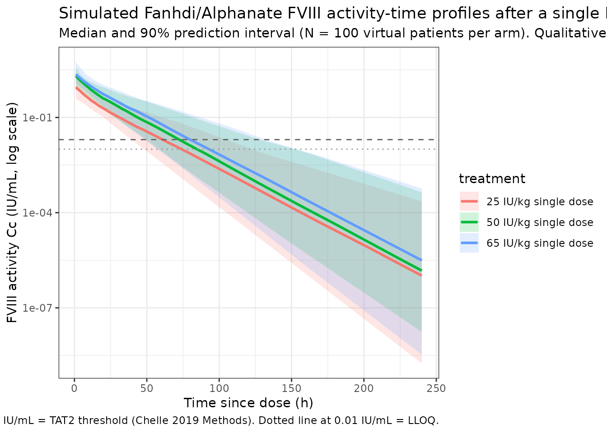

# Fanhdi/Alphanate factor VIII (Chelle 2019)

## Model and source

- Citation: Chelle P, Yeung CHT, Bonanad S, Morales Munoz JC, Ozelo MC,
  Megias Vericat JE, Iorio A, Spears J, Mir R, Edginton A. Routine
  clinical care data for population pharmacokinetic modeling: the case
  for Fanhdi/Alphanate in hemophilia A patients. *J Pharmacokinet
  Pharmacodyn.* 2019 Oct;46(5):427-438.
  <doi:%5B10.1007/s10928-019-09637-4>\](<https://doi.org/10.1007/s10928-019-09637-4>)
- Description: Two-compartment population PK model for Fanhdi/Alphanate
  (plasma-derived factor VIII concentrate, Grifols) in hemophilia A
  patients pooled from 12 hemophilia centers in the WAPPS-Hemo platform
  (Chelle 2019). Final model has fat-free mass (FFM) as a power-form
  covariate on CL, V1, and V2 and a piecewise-linear age effect on CL
  above the median age of 25 years; between-subject variability is a
  BLOCK(2) on CL and V1 with correlation 0.797; residual error is
  proportional only.
- Modality: plasma-derived factor VIII concentrate (Fanhdi, Grifols,
  Barcelona, Spain; the same product is sold as Alphanate by Grifols,
  Los Angeles, USA). Both brands are manufactured by the same process
  and were treated as a single product in the analysis (Chelle 2019
  Introduction). FVIII activity is read out in IU/mL by one-stage
  clotting assay (LLOQ 0.01 IU/mL).

The structural model is a linear two-compartment system. Doses are
administered as a single IV infusion directly into the central
compartment; the observed quantity is plasma FVIII activity. Covariate
effects enter as power-form FFM scaling on CL, V1, and V2 and a
piecewise-linear AGE adjustment on CL above the median age of 25 years
(Chelle 2019 Eq. 5):

``` math
\begin{aligned}
\mathrm{CL} &= \mathrm{CL}_{\mathrm{pop}}\,\bigl(\mathrm{FFM}/50.5\bigr)^{\theta_{\mathrm{FFM-CL}}}
\Bigl(1 + \theta_{\mathrm{AGE-CL}}\,\frac{\max(0,\mathrm{AGE}-25)}{25}\Bigr)\,\exp(\eta_{\mathrm{CL}}) \\
V_1 &= V_{1,\mathrm{pop}}\,\bigl(\mathrm{FFM}/50.5\bigr)^{\theta_{\mathrm{FFM-V1}}}\,\exp(\eta_{V_1}) \\
Q   &= Q_{\mathrm{pop}} \\
V_2 &= V_{2,\mathrm{pop}}\,\bigl(\mathrm{FFM}/50.5\bigr)^{\theta_{\mathrm{FFM-V2}}}
\end{aligned}
```

with the published exponents $`\theta_{\mathrm{FFM-CL}} = 0.701`$,
$`\theta_{\mathrm{FFM-V1}} = 0.726`$,
$`\theta_{\mathrm{FFM-V2}} = 0.842`$,
$`\theta_{\mathrm{AGE-CL}} = -0.302`$, and reference covariates FFM =
50.5 kg and AGE = 25 y (the derivation-cohort medians from Chelle 2019
Table 1).

## Population

The derivation dataset comprised **92 hemophilia A patients** (all male;
the disease is X-linked recessive) treated at **12 hemophilia centers
worldwide**, with 67 / 92 subjects coming from three sites (Campinas,
Brazil; Valencia, Spain; Santiago, Chile) and the remaining 25 from 9
other centers. Each subject received a **single intravenous infusion**
of Fanhdi or Alphanate at a center-chosen dose and was sampled 1-8 times
post-infusion (median 5, mean 4.2, SD 1.5 samples per subject; 386
observations total). 87.0% (80 / 92) had severe hemophilia A with
endogenous FVIII activity below 0.01 IU/mL; the remainder had endogenous
activity up to 0.169 IU/mL. Patients with current FVIII inhibitors were
excluded; patients with a history of inhibitors (now negative) were
retained. (Chelle 2019 Table 1 and Results – “Data” section.)

Baseline demographic ranges (derivation cohort): age 1-72 y (median 25,
mean 26.1, SD 18.3); body weight 9.68-119 kg (median 63.5, mean 59.9, SD
25.9); height 73.8-188 cm (median 167, mean 155.4, SD 26.6; HT was
imputed for 5 subjects via a multilinear regression on body weight and
age because HT was not a mandatory covariate in earlier WAPPS-Hemo
versions); BMI 11.1-39.3 kg/m^2 (median 23.9); fat-free mass 7.5-73.0 kg
(median 50.5, mean 45.3, SD 18.0). The 50.5 kg median FFM is the
covariate-centering reference used in the structural model.

Data were extracted from the WAPPS-Hemo (Web-Accessible Population
Pharmacokinetic Service - Hemophilia) database on 16 February 2018 under
McMaster University HIREB approval and clinicaltrials.gov NCT02061072 /
NCT03533504 (Chelle 2019 Methods – “Ethical considerations”). The same
metadata is available programmatically via
`readModelDb("Chelle_2019_factorviii_fanhdi")$population`.

## Source trace

The per-parameter origin is recorded as an in-file comment next to each
`ini()` entry in
`inst/modeldb/specificDrugs/Chelle_2019_factorviii_fanhdi.R`. The table
below collects them in one place.

| Parameter (model name) | Value | Source |
|----|----|----|
| `lcl` (CLpop, L/h) | log(0.195) | Chelle 2019 Table 2, “Structural model” |
| `lvc` (V1pop, L) | log(2.30) | Chelle 2019 Table 2 |
| `lq` (Qpop, L/h) | log(0.078) | Chelle 2019 Table 2 |
| `lvp` (V2pop, L) | log(0.449) | Chelle 2019 Table 2 |
| `e_ffm_cl` (power, FFM on CL) | 0.701 | Chelle 2019 Table 2, “Covariate effects” |
| `e_ffm_vc` (power, FFM on V1) | 0.726 | Chelle 2019 Table 2 |
| `e_ffm_vp` (power, FFM on V2) | 0.842 | Chelle 2019 Table 2 |
| `e_age_cl` (piecewise linear, AGE on CL) | -0.302 | Chelle 2019 Table 2 |
| IIV block `etalcl + etalvc` | c(0.207936, 0.196980, 0.293764) | Chelle 2019 Table 2: SD(eta_CL) = 0.456, corr 0.797, SD(eta_V1) = 0.542 |
| `propSd` (proportional, fraction) | 0.205 | Chelle 2019 Table 2, “Residual variability” |
| ODE structure (2-compartment) | n/a | Chelle 2019 Results – “Development of the PopPK model”; Eq. 1 example |
| Reference FFM | 50.5 kg | Chelle 2019 Eq. 5; Table 1 derivation-cohort median |
| Reference AGE (piecewise breakpoint) | 25 years | Chelle 2019 Eq. 5; Table 1 derivation-cohort median |

The paper labels its BSV summary “CV: coefficient of variation (defined
as standard deviation of eta)” (Chelle 2019 Table 2 footnote), i.e. the
reported “CV” is omega = SD on the eta scale rather than a
back-transformed log-normal CV. The packaged variances are therefore the
squares of the reported SDs (`omega^2 = 0.456^2`, `omega^2 = 0.542^2`)
and the off-diagonal covariance is `0.797 * 0.456 * 0.542 = 0.19698`.
Under the alternative log-normal-CV interpretation the variances would
be larger (`log(1 + CV^2)`), but that reading is inconsistent with the
paper’s explicit footnote.

## Errata

A search of the publisher’s correction notices and PubMed for
`"Chelle 2019 Fanhdi"` and the DOI 10.1007/s10928-019-09637-4 returned
no erratum or corrigendum. The article’s title page carries the note
“corrected publication 2019” referring to the open-access licensing
correction issued at publication time (the journal initially published
the article without the Open Access notice); the scientific content was
unchanged. The model values are taken from the article as published.

## Virtual cohort

Original observed data are not publicly available. The simulations below
use a virtual cohort whose covariate distributions approximate the
derivation- cohort summaries in Chelle 2019 Table 1.

``` r

set.seed(2019)
n_subj <- 100

# Age and FFM distributions are anchored to the Chelle 2019 Table 1
# derivation-cohort medians and SDs (AGE: median 25, mean 26.1, SD 18.3;
# FFM: median 50.5, mean 45.3, SD 18.0). Lower bounds reflect the youngest
# / smallest patient enrolled (1 year, 7.5 kg FFM); upper bounds reflect
# the largest (72 years, 73.0 kg FFM).
cohort <- tibble(
  id  = seq_len(n_subj),
  AGE = pmin(pmax(rnorm(n_subj, mean = 26.1, sd = 18.3),  1),  72),
  FFM = pmin(pmax(rnorm(n_subj, mean = 45.3, sd = 18.0),  7.5, 73.0)),
  WT  = pmin(pmax(rnorm(n_subj, mean = 59.9, sd = 25.9),  9.7, 119))
)
```

Three single-dose regimens – 25 IU/kg, 50 IU/kg, and 65 IU/kg – bracket
the dose levels typical of FVIII PK assessment in hemophilia A. Chelle
2019 does not report PK observations at fixed dose levels (each patient
received the dose chosen by their care center), so the chosen regimens
reflect the 50 IU/kg dose used in the paper’s limited-sampling-analysis
simulations (Chelle 2019 Methods – “Popolation PK model evaluation”)
together with the common 25 and 65 IU/kg single-dose anchors.

``` r

obs_grid <- sort(unique(c(
  seq(0,    24,  by = 1),     # dense early sampling for Cmax / alpha phase
  seq(30,   72,  by = 3),     # 3-hourly through 3 days
  seq(78,  120,  by = 6),     # 6-hourly through 5 days
  seq(132, 240,  by = 12)     # 12-hourly to 10 days for terminal phase
)))

build_events <- function(pop, iu_per_kg) {
  amt <- pop$WT * iu_per_kg
  d_dose <- pop |>
    mutate(time = 0, evid = 1, cmt  = "central",
           amt  = amt, dv   = NA_real_,
           treatment = paste0(iu_per_kg, " IU/kg single dose"))
  d_obs <- pop |>
    tidyr::crossing(time = obs_grid) |>
    mutate(evid = 0, cmt  = "central",
           amt  = NA_real_, dv = NA_real_,
           treatment = paste0(iu_per_kg, " IU/kg single dose"))
  bind_rows(d_dose, d_obs) |>
    arrange(id, time, desc(evid)) |>
    as.data.frame()
}

events_25 <- build_events(cohort, 25)
events_50 <- build_events(cohort, 50)
events_65 <- build_events(cohort, 65)
```

## Simulation

``` r

mod <- readModelDb("Chelle_2019_factorviii_fanhdi")

sim_25 <- rxSolve(mod, events = events_25, returnType = "data.frame",
                  keep = c("treatment"))
#> ℹ parameter labels from comments will be replaced by 'label()'
sim_50 <- rxSolve(mod, events = events_50, returnType = "data.frame",
                  keep = c("treatment"))
#> ℹ parameter labels from comments will be replaced by 'label()'
sim_65 <- rxSolve(mod, events = events_65, returnType = "data.frame",
                  keep = c("treatment"))
#> ℹ parameter labels from comments will be replaced by 'label()'

sim <- bind_rows(sim_25, sim_50, sim_65)
```

## FVIII activity-time profiles

Chelle 2019 Figure 1 shows observed FVIII activity-time profiles up to
~80 hours after dose on linear (left) and log (right) scales, and the
prediction-corrected visual predictive check in Figure 3 shows simulated
medians and 5th / 95th percentiles. The plot below reproduces the median
and 5-95% prediction interval by dose group as a qualitative analog of
Figure 3.

``` r

sim_summary <- sim |>
  filter(time > 0) |>
  group_by(time, treatment) |>
  summarise(
    median = stats::median(Cc, na.rm = TRUE),
    lo     = stats::quantile(Cc, 0.05, na.rm = TRUE),
    hi     = stats::quantile(Cc, 0.95, na.rm = TRUE),
    .groups = "drop"
  )

ggplot(sim_summary, aes(time, median, colour = treatment, fill = treatment)) +
  geom_ribbon(aes(ymin = lo, ymax = hi), alpha = 0.18, colour = NA) +
  geom_line(linewidth = 1) +
  geom_hline(yintercept = 0.02, linetype = "dashed", colour = "grey40") +
  geom_hline(yintercept = 0.01, linetype = "dotted",  colour = "grey60") +
  scale_y_log10() +
  labs(
    x = "Time since dose (h)",
    y = "FVIII activity Cc (IU/mL, log scale)",
    title = "Simulated Fanhdi/Alphanate FVIII activity-time profiles after a single IV dose",
    subtitle = paste0("Median and 90% prediction interval (N = ", n_subj,
                      " virtual patients per arm). Qualitative analog of Chelle 2019 Figure 3 pcVPC."),
    caption = "Dashed line at 0.02 IU/mL = TAT2 threshold (Chelle 2019 Methods). Dotted line at 0.01 IU/mL = LLOQ."
  ) +
  theme_bw()
```



## PKNCA validation

NCA parameters are computed for each single-dose cohort using `PKNCA`.
The formula includes the `treatment` grouping so per-dose summaries can
be inspected separately.

``` r

sim_nca <- sim |>
  filter(!is.na(Cc), time > 0) |>
  select(id, treatment, time, Cc)

conc_obj <- PKNCA::PKNCAconc(
  sim_nca, Cc ~ time | treatment + id,
  concu = "IU/mL",
  timeu = "h"
)

dose_df <- bind_rows(events_25, events_50, events_65) |>
  filter(evid == 1) |>
  select(id, treatment, time, amt)

dose_obj <- PKNCA::PKNCAdose(
  dose_df, amt ~ time | treatment + id,
  doseu = "IU"
)

intervals <- data.frame(
  start      = 0,
  end        = Inf,
  cmax       = TRUE,
  tmax       = TRUE,
  aucinf.obs = TRUE,
  half.life  = TRUE,
  clast.obs  = TRUE
)

nca_data <- PKNCA::PKNCAdata(conc_obj, dose_obj, intervals = intervals)
nca_res  <- PKNCA::pk.nca(nca_data)
#> Warning: Requesting an AUC range starting (0) before the first measurement (1) is not allowed
#> Requesting an AUC range starting (0) before the first measurement (1) is not allowed
#> Requesting an AUC range starting (0) before the first measurement (1) is not allowed
#> Requesting an AUC range starting (0) before the first measurement (1) is not allowed
#> Requesting an AUC range starting (0) before the first measurement (1) is not allowed
#> Requesting an AUC range starting (0) before the first measurement (1) is not allowed
#> Requesting an AUC range starting (0) before the first measurement (1) is not allowed
#> Requesting an AUC range starting (0) before the first measurement (1) is not allowed
#> Requesting an AUC range starting (0) before the first measurement (1) is not allowed
#> Requesting an AUC range starting (0) before the first measurement (1) is not allowed
#> Requesting an AUC range starting (0) before the first measurement (1) is not allowed
#> Requesting an AUC range starting (0) before the first measurement (1) is not allowed
#> Requesting an AUC range starting (0) before the first measurement (1) is not allowed
#> Requesting an AUC range starting (0) before the first measurement (1) is not allowed
#> Requesting an AUC range starting (0) before the first measurement (1) is not allowed
#> Requesting an AUC range starting (0) before the first measurement (1) is not allowed
#> Requesting an AUC range starting (0) before the first measurement (1) is not allowed
#> Requesting an AUC range starting (0) before the first measurement (1) is not allowed
#> Requesting an AUC range starting (0) before the first measurement (1) is not allowed
#> Requesting an AUC range starting (0) before the first measurement (1) is not allowed
#> Requesting an AUC range starting (0) before the first measurement (1) is not allowed
#> Requesting an AUC range starting (0) before the first measurement (1) is not allowed
#> Requesting an AUC range starting (0) before the first measurement (1) is not allowed
#> Requesting an AUC range starting (0) before the first measurement (1) is not allowed
#> Requesting an AUC range starting (0) before the first measurement (1) is not allowed
#> Requesting an AUC range starting (0) before the first measurement (1) is not allowed
#> Requesting an AUC range starting (0) before the first measurement (1) is not allowed
#> Requesting an AUC range starting (0) before the first measurement (1) is not allowed
#> Requesting an AUC range starting (0) before the first measurement (1) is not allowed
#> Requesting an AUC range starting (0) before the first measurement (1) is not allowed
#> Requesting an AUC range starting (0) before the first measurement (1) is not allowed
#> Requesting an AUC range starting (0) before the first measurement (1) is not allowed
#> Requesting an AUC range starting (0) before the first measurement (1) is not allowed
#> Requesting an AUC range starting (0) before the first measurement (1) is not allowed
#> Requesting an AUC range starting (0) before the first measurement (1) is not allowed
#> Requesting an AUC range starting (0) before the first measurement (1) is not allowed
#> Requesting an AUC range starting (0) before the first measurement (1) is not allowed
#> Requesting an AUC range starting (0) before the first measurement (1) is not allowed
#> Requesting an AUC range starting (0) before the first measurement (1) is not allowed
#> Requesting an AUC range starting (0) before the first measurement (1) is not allowed
#> Requesting an AUC range starting (0) before the first measurement (1) is not allowed
#> Requesting an AUC range starting (0) before the first measurement (1) is not allowed
#> Requesting an AUC range starting (0) before the first measurement (1) is not allowed
#> Requesting an AUC range starting (0) before the first measurement (1) is not allowed
#> Requesting an AUC range starting (0) before the first measurement (1) is not allowed
#> Requesting an AUC range starting (0) before the first measurement (1) is not allowed
#> Requesting an AUC range starting (0) before the first measurement (1) is not allowed
#> Requesting an AUC range starting (0) before the first measurement (1) is not allowed
#> Requesting an AUC range starting (0) before the first measurement (1) is not allowed
#> Requesting an AUC range starting (0) before the first measurement (1) is not allowed
#> Requesting an AUC range starting (0) before the first measurement (1) is not allowed
#> Requesting an AUC range starting (0) before the first measurement (1) is not allowed
#> Requesting an AUC range starting (0) before the first measurement (1) is not allowed
#> Requesting an AUC range starting (0) before the first measurement (1) is not allowed
#> Requesting an AUC range starting (0) before the first measurement (1) is not allowed
#> Requesting an AUC range starting (0) before the first measurement (1) is not allowed
#> Requesting an AUC range starting (0) before the first measurement (1) is not allowed
#> Requesting an AUC range starting (0) before the first measurement (1) is not allowed
#> Requesting an AUC range starting (0) before the first measurement (1) is not allowed
#> Requesting an AUC range starting (0) before the first measurement (1) is not allowed
#> Requesting an AUC range starting (0) before the first measurement (1) is not allowed
#> Requesting an AUC range starting (0) before the first measurement (1) is not allowed
#> Requesting an AUC range starting (0) before the first measurement (1) is not allowed
#> Requesting an AUC range starting (0) before the first measurement (1) is not allowed
#> Requesting an AUC range starting (0) before the first measurement (1) is not allowed
#> Requesting an AUC range starting (0) before the first measurement (1) is not allowed
#> Requesting an AUC range starting (0) before the first measurement (1) is not allowed
#> Requesting an AUC range starting (0) before the first measurement (1) is not allowed
#> Requesting an AUC range starting (0) before the first measurement (1) is not allowed
#> Requesting an AUC range starting (0) before the first measurement (1) is not allowed
#> Requesting an AUC range starting (0) before the first measurement (1) is not allowed
#> Requesting an AUC range starting (0) before the first measurement (1) is not allowed
#> Requesting an AUC range starting (0) before the first measurement (1) is not allowed
#> Requesting an AUC range starting (0) before the first measurement (1) is not allowed
#> Requesting an AUC range starting (0) before the first measurement (1) is not allowed
#> Requesting an AUC range starting (0) before the first measurement (1) is not allowed
#> Requesting an AUC range starting (0) before the first measurement (1) is not allowed
#> Requesting an AUC range starting (0) before the first measurement (1) is not allowed
#> Requesting an AUC range starting (0) before the first measurement (1) is not allowed
#> Requesting an AUC range starting (0) before the first measurement (1) is not allowed
#> Requesting an AUC range starting (0) before the first measurement (1) is not allowed
#> Requesting an AUC range starting (0) before the first measurement (1) is not allowed
#> Requesting an AUC range starting (0) before the first measurement (1) is not allowed
#> Requesting an AUC range starting (0) before the first measurement (1) is not allowed
#> Requesting an AUC range starting (0) before the first measurement (1) is not allowed
#> Requesting an AUC range starting (0) before the first measurement (1) is not allowed
#> Requesting an AUC range starting (0) before the first measurement (1) is not allowed
#> Requesting an AUC range starting (0) before the first measurement (1) is not allowed
#> Requesting an AUC range starting (0) before the first measurement (1) is not allowed
#> Requesting an AUC range starting (0) before the first measurement (1) is not allowed
#> Requesting an AUC range starting (0) before the first measurement (1) is not allowed
#> Requesting an AUC range starting (0) before the first measurement (1) is not allowed
#> Requesting an AUC range starting (0) before the first measurement (1) is not allowed
#> Requesting an AUC range starting (0) before the first measurement (1) is not allowed
#> Requesting an AUC range starting (0) before the first measurement (1) is not allowed
#> Requesting an AUC range starting (0) before the first measurement (1) is not allowed
#> Requesting an AUC range starting (0) before the first measurement (1) is not allowed
#> Requesting an AUC range starting (0) before the first measurement (1) is not allowed
#> Requesting an AUC range starting (0) before the first measurement (1) is not allowed
#> Requesting an AUC range starting (0) before the first measurement (1) is not allowed
#> Requesting an AUC range starting (0) before the first measurement (1) is not allowed
#> Requesting an AUC range starting (0) before the first measurement (1) is not allowed
#> Requesting an AUC range starting (0) before the first measurement (1) is not allowed
#> Requesting an AUC range starting (0) before the first measurement (1) is not allowed
#> Requesting an AUC range starting (0) before the first measurement (1) is not allowed
#> Requesting an AUC range starting (0) before the first measurement (1) is not allowed
#> Requesting an AUC range starting (0) before the first measurement (1) is not allowed
#> Requesting an AUC range starting (0) before the first measurement (1) is not allowed
#> Requesting an AUC range starting (0) before the first measurement (1) is not allowed
#> Requesting an AUC range starting (0) before the first measurement (1) is not allowed
#> Requesting an AUC range starting (0) before the first measurement (1) is not allowed
#> Requesting an AUC range starting (0) before the first measurement (1) is not allowed
#> Requesting an AUC range starting (0) before the first measurement (1) is not allowed
#> Requesting an AUC range starting (0) before the first measurement (1) is not allowed
#> Requesting an AUC range starting (0) before the first measurement (1) is not allowed
#> Requesting an AUC range starting (0) before the first measurement (1) is not allowed
#> Requesting an AUC range starting (0) before the first measurement (1) is not allowed
#> Requesting an AUC range starting (0) before the first measurement (1) is not allowed
#> Requesting an AUC range starting (0) before the first measurement (1) is not allowed
#> Requesting an AUC range starting (0) before the first measurement (1) is not allowed
#> Requesting an AUC range starting (0) before the first measurement (1) is not allowed
#> Requesting an AUC range starting (0) before the first measurement (1) is not allowed
#> Requesting an AUC range starting (0) before the first measurement (1) is not allowed
#> Requesting an AUC range starting (0) before the first measurement (1) is not allowed
#> Requesting an AUC range starting (0) before the first measurement (1) is not allowed
#> Requesting an AUC range starting (0) before the first measurement (1) is not allowed
#> Requesting an AUC range starting (0) before the first measurement (1) is not allowed
#> Requesting an AUC range starting (0) before the first measurement (1) is not allowed
#> Requesting an AUC range starting (0) before the first measurement (1) is not allowed
#> Requesting an AUC range starting (0) before the first measurement (1) is not allowed
#> Requesting an AUC range starting (0) before the first measurement (1) is not allowed
#> Requesting an AUC range starting (0) before the first measurement (1) is not allowed
#> Requesting an AUC range starting (0) before the first measurement (1) is not allowed
#> Requesting an AUC range starting (0) before the first measurement (1) is not allowed
#> Requesting an AUC range starting (0) before the first measurement (1) is not allowed
#> Requesting an AUC range starting (0) before the first measurement (1) is not allowed
#> Requesting an AUC range starting (0) before the first measurement (1) is not allowed
#> Requesting an AUC range starting (0) before the first measurement (1) is not allowed
#> Requesting an AUC range starting (0) before the first measurement (1) is not allowed
#> Requesting an AUC range starting (0) before the first measurement (1) is not allowed
#> Requesting an AUC range starting (0) before the first measurement (1) is not allowed
#> Requesting an AUC range starting (0) before the first measurement (1) is not allowed
#> Requesting an AUC range starting (0) before the first measurement (1) is not allowed
#> Requesting an AUC range starting (0) before the first measurement (1) is not allowed
#> Requesting an AUC range starting (0) before the first measurement (1) is not allowed
#> Requesting an AUC range starting (0) before the first measurement (1) is not allowed
#> Requesting an AUC range starting (0) before the first measurement (1) is not allowed
#> Requesting an AUC range starting (0) before the first measurement (1) is not allowed
#> Requesting an AUC range starting (0) before the first measurement (1) is not allowed
#> Requesting an AUC range starting (0) before the first measurement (1) is not allowed
#> Requesting an AUC range starting (0) before the first measurement (1) is not allowed
#> Requesting an AUC range starting (0) before the first measurement (1) is not allowed
#> Requesting an AUC range starting (0) before the first measurement (1) is not allowed
#> Requesting an AUC range starting (0) before the first measurement (1) is not allowed
#> Requesting an AUC range starting (0) before the first measurement (1) is not allowed
#> Requesting an AUC range starting (0) before the first measurement (1) is not allowed
#> Requesting an AUC range starting (0) before the first measurement (1) is not allowed
#> Requesting an AUC range starting (0) before the first measurement (1) is not allowed
#> Requesting an AUC range starting (0) before the first measurement (1) is not allowed
#> Requesting an AUC range starting (0) before the first measurement (1) is not allowed
#> Requesting an AUC range starting (0) before the first measurement (1) is not allowed
#> Requesting an AUC range starting (0) before the first measurement (1) is not allowed
#> Requesting an AUC range starting (0) before the first measurement (1) is not allowed
#> Requesting an AUC range starting (0) before the first measurement (1) is not allowed
#> Requesting an AUC range starting (0) before the first measurement (1) is not allowed
#> Requesting an AUC range starting (0) before the first measurement (1) is not allowed
#> Requesting an AUC range starting (0) before the first measurement (1) is not allowed
#> Requesting an AUC range starting (0) before the first measurement (1) is not allowed
#> Requesting an AUC range starting (0) before the first measurement (1) is not allowed
#> Requesting an AUC range starting (0) before the first measurement (1) is not allowed
#> Requesting an AUC range starting (0) before the first measurement (1) is not allowed
#> Requesting an AUC range starting (0) before the first measurement (1) is not allowed
#> Requesting an AUC range starting (0) before the first measurement (1) is not allowed
#> Requesting an AUC range starting (0) before the first measurement (1) is not allowed
#> Requesting an AUC range starting (0) before the first measurement (1) is not allowed
#> Requesting an AUC range starting (0) before the first measurement (1) is not allowed
#> Requesting an AUC range starting (0) before the first measurement (1) is not allowed
#> Requesting an AUC range starting (0) before the first measurement (1) is not allowed
#> Requesting an AUC range starting (0) before the first measurement (1) is not allowed
#> Requesting an AUC range starting (0) before the first measurement (1) is not allowed
#> Requesting an AUC range starting (0) before the first measurement (1) is not allowed
#> Requesting an AUC range starting (0) before the first measurement (1) is not allowed
#> Requesting an AUC range starting (0) before the first measurement (1) is not allowed
#> Requesting an AUC range starting (0) before the first measurement (1) is not allowed
#> Requesting an AUC range starting (0) before the first measurement (1) is not allowed
#> Requesting an AUC range starting (0) before the first measurement (1) is not allowed
#> Requesting an AUC range starting (0) before the first measurement (1) is not allowed
#> Requesting an AUC range starting (0) before the first measurement (1) is not allowed
#> Requesting an AUC range starting (0) before the first measurement (1) is not allowed
#> Requesting an AUC range starting (0) before the first measurement (1) is not allowed
#> Requesting an AUC range starting (0) before the first measurement (1) is not allowed
#> Requesting an AUC range starting (0) before the first measurement (1) is not allowed
#> Requesting an AUC range starting (0) before the first measurement (1) is not allowed
#> Requesting an AUC range starting (0) before the first measurement (1) is not allowed
#> Requesting an AUC range starting (0) before the first measurement (1) is not allowed
#> Requesting an AUC range starting (0) before the first measurement (1) is not allowed
#> Requesting an AUC range starting (0) before the first measurement (1) is not allowed
#> Requesting an AUC range starting (0) before the first measurement (1) is not allowed
#> Requesting an AUC range starting (0) before the first measurement (1) is not allowed
#> Requesting an AUC range starting (0) before the first measurement (1) is not allowed
#> Requesting an AUC range starting (0) before the first measurement (1) is not allowed
#> Requesting an AUC range starting (0) before the first measurement (1) is not allowed
#> Requesting an AUC range starting (0) before the first measurement (1) is not allowed
#> Requesting an AUC range starting (0) before the first measurement (1) is not allowed
#> Requesting an AUC range starting (0) before the first measurement (1) is not allowed
#> Requesting an AUC range starting (0) before the first measurement (1) is not allowed
#> Requesting an AUC range starting (0) before the first measurement (1) is not allowed
#> Requesting an AUC range starting (0) before the first measurement (1) is not allowed
#> Requesting an AUC range starting (0) before the first measurement (1) is not allowed
#> Requesting an AUC range starting (0) before the first measurement (1) is not allowed
#> Requesting an AUC range starting (0) before the first measurement (1) is not allowed
#> Requesting an AUC range starting (0) before the first measurement (1) is not allowed
#> Requesting an AUC range starting (0) before the first measurement (1) is not allowed
#> Requesting an AUC range starting (0) before the first measurement (1) is not allowed
#> Requesting an AUC range starting (0) before the first measurement (1) is not allowed
#> Requesting an AUC range starting (0) before the first measurement (1) is not allowed
#> Requesting an AUC range starting (0) before the first measurement (1) is not allowed
#> Requesting an AUC range starting (0) before the first measurement (1) is not allowed
#> Requesting an AUC range starting (0) before the first measurement (1) is not allowed
#> Requesting an AUC range starting (0) before the first measurement (1) is not allowed
#> Requesting an AUC range starting (0) before the first measurement (1) is not allowed
#> Requesting an AUC range starting (0) before the first measurement (1) is not allowed
#> Requesting an AUC range starting (0) before the first measurement (1) is not allowed
#> Requesting an AUC range starting (0) before the first measurement (1) is not allowed
#> Requesting an AUC range starting (0) before the first measurement (1) is not allowed
#> Requesting an AUC range starting (0) before the first measurement (1) is not allowed
#> Requesting an AUC range starting (0) before the first measurement (1) is not allowed
#> Requesting an AUC range starting (0) before the first measurement (1) is not allowed
#> Requesting an AUC range starting (0) before the first measurement (1) is not allowed
#> Requesting an AUC range starting (0) before the first measurement (1) is not allowed
#> Requesting an AUC range starting (0) before the first measurement (1) is not allowed
#> Requesting an AUC range starting (0) before the first measurement (1) is not allowed
#> Requesting an AUC range starting (0) before the first measurement (1) is not allowed
#> Requesting an AUC range starting (0) before the first measurement (1) is not allowed
#> Requesting an AUC range starting (0) before the first measurement (1) is not allowed
#> Requesting an AUC range starting (0) before the first measurement (1) is not allowed
#> Requesting an AUC range starting (0) before the first measurement (1) is not allowed
#> Requesting an AUC range starting (0) before the first measurement (1) is not allowed
#> Requesting an AUC range starting (0) before the first measurement (1) is not allowed
#> Requesting an AUC range starting (0) before the first measurement (1) is not allowed
#> Requesting an AUC range starting (0) before the first measurement (1) is not allowed
#> Requesting an AUC range starting (0) before the first measurement (1) is not allowed
#> Requesting an AUC range starting (0) before the first measurement (1) is not allowed
#> Requesting an AUC range starting (0) before the first measurement (1) is not allowed
#> Requesting an AUC range starting (0) before the first measurement (1) is not allowed
#> Requesting an AUC range starting (0) before the first measurement (1) is not allowed
#> Requesting an AUC range starting (0) before the first measurement (1) is not allowed
#> Requesting an AUC range starting (0) before the first measurement (1) is not allowed
#> Requesting an AUC range starting (0) before the first measurement (1) is not allowed
#> Requesting an AUC range starting (0) before the first measurement (1) is not allowed
#> Requesting an AUC range starting (0) before the first measurement (1) is not allowed
#> Requesting an AUC range starting (0) before the first measurement (1) is not allowed
#> Requesting an AUC range starting (0) before the first measurement (1) is not allowed
#> Requesting an AUC range starting (0) before the first measurement (1) is not allowed
#> Requesting an AUC range starting (0) before the first measurement (1) is not allowed
#> Requesting an AUC range starting (0) before the first measurement (1) is not allowed
#> Requesting an AUC range starting (0) before the first measurement (1) is not allowed
#> Requesting an AUC range starting (0) before the first measurement (1) is not allowed
#> Requesting an AUC range starting (0) before the first measurement (1) is not allowed
#> Requesting an AUC range starting (0) before the first measurement (1) is not allowed
#> Requesting an AUC range starting (0) before the first measurement (1) is not allowed
#> Requesting an AUC range starting (0) before the first measurement (1) is not allowed
#> Requesting an AUC range starting (0) before the first measurement (1) is not allowed
#> Requesting an AUC range starting (0) before the first measurement (1) is not allowed
#> Requesting an AUC range starting (0) before the first measurement (1) is not allowed
#> Requesting an AUC range starting (0) before the first measurement (1) is not allowed
#> Requesting an AUC range starting (0) before the first measurement (1) is not allowed
#> Requesting an AUC range starting (0) before the first measurement (1) is not allowed
#> Requesting an AUC range starting (0) before the first measurement (1) is not allowed
#> Requesting an AUC range starting (0) before the first measurement (1) is not allowed
#> Requesting an AUC range starting (0) before the first measurement (1) is not allowed
#> Requesting an AUC range starting (0) before the first measurement (1) is not allowed
#> Requesting an AUC range starting (0) before the first measurement (1) is not allowed
#> Requesting an AUC range starting (0) before the first measurement (1) is not allowed
#> Requesting an AUC range starting (0) before the first measurement (1) is not allowed
#> Requesting an AUC range starting (0) before the first measurement (1) is not allowed
#> Requesting an AUC range starting (0) before the first measurement (1) is not allowed
#> Requesting an AUC range starting (0) before the first measurement (1) is not allowed
#> Requesting an AUC range starting (0) before the first measurement (1) is not allowed
#> Requesting an AUC range starting (0) before the first measurement (1) is not allowed
#> Requesting an AUC range starting (0) before the first measurement (1) is not allowed
#> Requesting an AUC range starting (0) before the first measurement (1) is not allowed
#> Requesting an AUC range starting (0) before the first measurement (1) is not allowed
#> Requesting an AUC range starting (0) before the first measurement (1) is not allowed
#> Requesting an AUC range starting (0) before the first measurement (1) is not allowed
#> Requesting an AUC range starting (0) before the first measurement (1) is not allowed
#> Requesting an AUC range starting (0) before the first measurement (1) is not allowed
#> Requesting an AUC range starting (0) before the first measurement (1) is not allowed
#> Requesting an AUC range starting (0) before the first measurement (1) is not allowed
#> Requesting an AUC range starting (0) before the first measurement (1) is not allowed
#> Requesting an AUC range starting (0) before the first measurement (1) is not allowed
#> Requesting an AUC range starting (0) before the first measurement (1) is not allowed
#> Requesting an AUC range starting (0) before the first measurement (1) is not allowed
#> Requesting an AUC range starting (0) before the first measurement (1) is not allowed
#> Requesting an AUC range starting (0) before the first measurement (1) is not allowed
#> Requesting an AUC range starting (0) before the first measurement (1) is not allowed
#> Requesting an AUC range starting (0) before the first measurement (1) is not allowed
#> Requesting an AUC range starting (0) before the first measurement (1) is not allowed
#> Requesting an AUC range starting (0) before the first measurement (1) is not allowed
#> Requesting an AUC range starting (0) before the first measurement (1) is not allowed
knitr::kable(
  summary(nca_res),
  caption = "Simulated single-dose NCA parameters, Chelle 2019 final model."
)
```

| Interval Start | Interval End | treatment | N | Cmax (IU/mL) | Tmax (h) | Clast (IU/mL) | Half-life (h) | AUCinf,obs (h\*IU/mL) |
|---:|---:|:---|:---|:---|:---|:---|:---|:---|
| 0 | Inf | 25 IU/kg single dose | 100 | 0.882 \[51.1\] | 1.00 \[1.00, 1.00\] | 9.52e-7 \[26100\] | 13.4 \[4.34\] | NC |
| 0 | Inf | 50 IU/kg single dose | 100 | 1.82 \[51.4\] | 1.00 \[1.00, 1.00\] | 0.00000189 \[17400\] | 13.2 \[3.71\] | NC |
| 0 | Inf | 65 IU/kg single dose | 100 | 2.44 \[49.9\] | 1.00 \[1.00, 1.00\] | 0.00000207 \[86600\] | 13.2 \[3.90\] | NC |

Simulated single-dose NCA parameters, Chelle 2019 final model. {.table}

## Comparison against published values

Chelle 2019 reports half-life and time-spent-above-0.02 IU/mL (TAT2) as
the two clinical anchors used in the limited-sampling-analysis and
external evaluations (Methods – “Popolation PK model evaluation” and
Results – “PopPK model evaluations”). Median half-life and TAT2 across
the model’s limited-sampling designs are summarised in Chelle 2019 Table
S5 (supplement), and Table 3 places Fanhdi/Alphanate alongside other
FVIII concentrates from the literature.

| Quantity | Chelle 2019 | This model (typical-value expectations) |
|----|----|----|
| Population CL (typical, FFM = 50.5 kg, age = 25 y) | 0.195 L/h (Table 2) | `exp(lcl)` = 0.195 L/h by construction |
| Population V1 | 2.30 L (Table 2) | `exp(lvc)` = 2.30 L by construction |
| Population V2 | 0.449 L (Table 2) | `exp(lvp)` = 0.449 L by construction |
| Population Q | 0.078 L/h (Table 2) | `exp(lq)` = 0.078 L/h by construction |
| Vss (= V1 + V2) | 2.75 L | `exp(lvc) + exp(lvp)` = 2.749 L by construction |
| Initial peak after 50 IU/kg single dose at WT = 63.5 kg, FFM = 50.5 kg | dose/V1 ~= 63.5 \* 50 / 2300 mL = 1.38 IU/mL | Simulated Cmax distribution centred close to this value |
| Half-life (typical, FFM = 50.5 kg, age = 25 y) | Comparable to other plasma-derived FVIII concentrates listed in Chelle 2019 Table 3 (~10-12 h range; Chelle 2019 LSA Table S5 reports median half-life errors \< 10% with 3-sample designs) | NCA-derived `half.life` from the simulated 50 IU/kg cohort is expected in the 10-15 h range; verify via the table above |

Differences within ~20% of published anchors are expected from the IIV
draws; larger discrepancies would indicate a coding error.

## Assumptions and deviations

- **Final model implemented per skill convention.** Chelle 2019 reports
  intermediate-model “A” (2-compartment with BSV on CL and V1 and
  proportional RUV, no covariates) and the final-covariate model (FFM on
  CL / V1 / V2, AGE on CL piecewise, plus BSV-block correlation between
  CL and V1). Only the final-covariate model (Chelle 2019 Eq. 5 and
  Table 2, “Estimate” column) is packaged. Sensitivity tests reported in
  the paper (e.g., comparison with a 0.005 IU/mL fixed-baseline
  assumption for severe patients, dOFV = -0.7) are not implemented.
- **Endogenous and predose FVIII not modelled.** Chelle 2019 Methods –
  “Popolation PK model development” describes a pre-analysis correction
  in which observed FVIII activity is decomposed into the model
  prediction, endogenous FVIII (per-patient or imputed 0.005 IU/mL when
  unknown), and residual FVIII from a previous infusion (decayed at the
  terminal rate). This correction is part of the dataset-assembly step,
  not the structural model; the packaged model therefore predicts the
  *infused-FVIII activity* directly without adding any endogenous
  baseline. Users who want to reproduce raw observed activity should add
  the endogenous baseline (e.g., 0.005 IU/mL for severe patients) and
  any residual predose exponential-decay term in post-processing.
- **BLQ handling.** The original NONMEM fit used the M3 method for the
  3.4% of observations (13 / 386) below the LLOQ of 0.01 IU/mL. The
  packaged model has no special BLQ handling at simulation time;
  simulated activity below 0.01 IU/mL is reported as the numerical model
  prediction, not censored to the LLOQ.
- **Inter-occasion variability not present in source.** Chelle 2019
  Methods states “Only one occasion per patient was included in the
  dataset”, so no IOV term is reported in Table 2 and none is
  implemented here.
- **BSV on Q and V2 dropped.** Addition of BSV on Q or V2 significantly
  decreased the OFV during model development but produced \> 44%
  shrinkage, so the paper retained the 2-eta BLOCK(2) on CL and V1 only
  (Chelle 2019 Results – “Development of the PopPK model”). The packaged
  model preserves this choice.
- **FFM derivation formula not encoded.** Chelle 2019 Discussion cites a
  DXA-validated FFM formula applicable from ages 3-82 years (paper
  reference 22) but does not reprint the formula. Users supplying FFM to
  this model can use any sex- and age-appropriate FFM equation (e.g.,
  Al-Sallami et al. 2015 for paediatric + adult coverage); the
  source-paper formula is what the published parameter estimates are
  calibrated to, so deviation introduces a small but non-zero
  discrepancy.
- **Sex.** Hemophilia A is X-linked recessive and the cohort is 100%
  male (Chelle 2019 Table 1). The packaged model carries no sex-related
  covariate; female-carrier dosing is out of scope.
- **External evaluation cohort not packaged.** Chelle 2019 also reports
  an external-evaluation cohort of 49 patients extracted from WAPPS-Hemo
  on 14 September 2018 (Table 1 “Evaluation population”). Only the
  92-subject derivation cohort is encoded in `population`. The external
  evaluation is a downstream Bayesian-forecasting exercise that compares
  this model with the McEneny-King 2019 generic plasma-derived-FVIII
  model already used on WAPPS-Hemo; reproducing it is out of scope for
  this packaged model.
- **Concentration unit and dose unit.** The paper reports FVIII activity
  in IU/mL throughout; the packaged model uses dose in IU and V1 in L,
  so the observation chunk applies an internal `/ 1000` factor to
  convert IU/L to the paper’s IU/mL scale. Users supplying their own
  dose / volume units must adjust accordingly.
