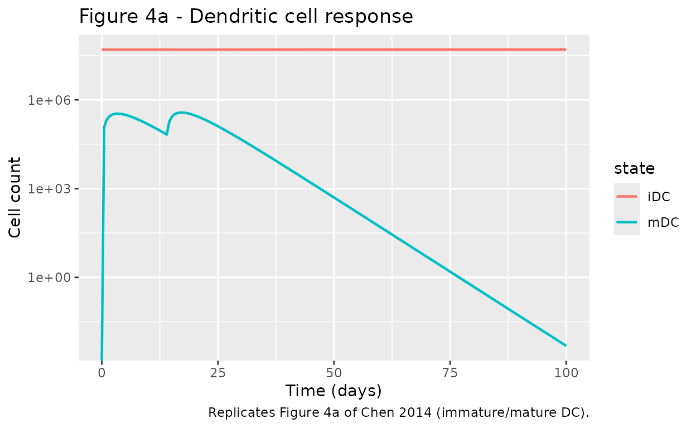
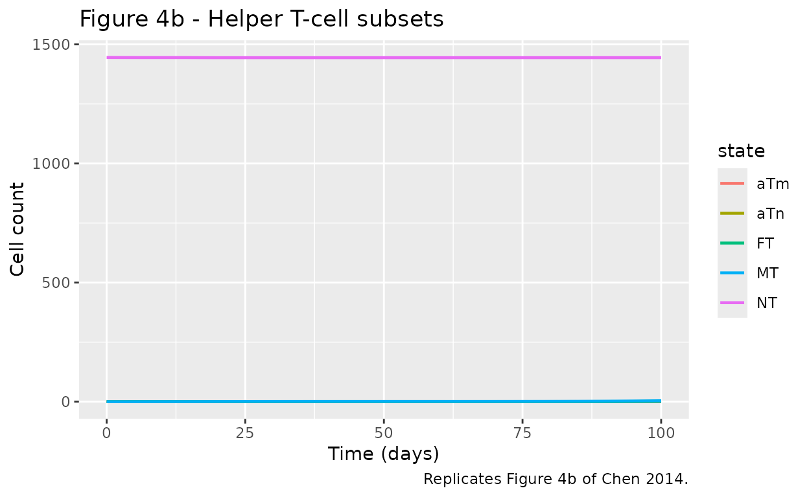
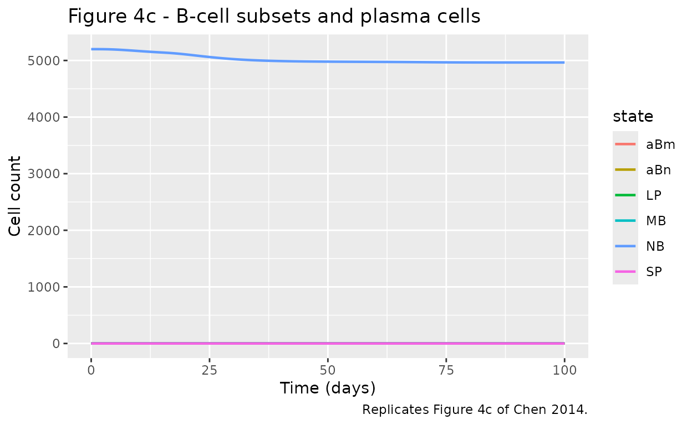
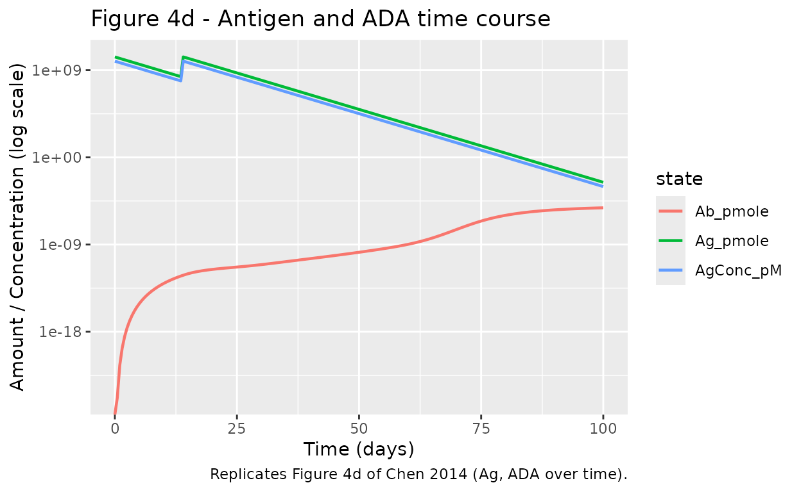

# Immunogenicity QSP (Chen 2014)

## Model and source

Chen, Hickling and Vicini (2014) published a theoretical, multiscale,
mechanistic model of immunogenicity against therapeutic proteins. The
system spans three scales:

1.  **Subcellular** - antigen processing and MHC-II presentation in
    dendritic cells (DCs);
2.  **Cellular** - naive / activated / memory / functional helper T-cell
    and B-cell dynamics, plasma-cell differentiation;
3.  **Whole-body** - therapeutic protein PK and antidrug-antibody (ADA)
    disposition, including immune-complex-mediated clearance.

The paper is deliberately not fit to a specific drug; it defines a
theoretical framework whose parameters are compiled from independent
experimental-immunology publications (Supplementary Table S2) and whose
behaviour is illustrated with a hypothetical antigenic protein.

- Citation: Chen X, Hickling TP, Vicini P. A Mechanistic, Multiscale
  Mathematical Model of Immunogenicity for Therapeutic Proteins: Part
  1 - Theoretical Model. CPT Pharmacometrics Syst Pharmacol.
  2014;3(9):e133.
  [doi:10.1038/psp.2014.30](https://doi.org/10.1038/psp.2014.30).
- Article DOI: <https://doi.org/10.1038/psp.2014.30>
- Supplement (Wiley): equations 1-29 in `psp4201430-sup-0004.doc`; state
  variables in `psp4201430-sup-0002.pdf` (Table S1); parameters in
  `psp4201430-sup-0003.pdf` (Table S2).

## Population

The model has no fitted human cohort. Parameter values in the packaged
model use the **human** column of Supplementary Table S2 (see Methods of
the paper, section “Simulation of immune responses in human against a
hypothetical antigen”). No IIV, no residual error - the encoded model is
fully deterministic. The paper’s simulation configuration for the
hypothetical antigen is preserved by the packaged defaults:

- Molecular weight 150 kDa, i.v. bolus 50 mg/kg (2.33e7 pmole for a
  70-kg subject).
- Plasma half-life 2 days (`kelAg = ln(2) / 2 = 0.347 /day`).
- One promiscuous T-epitope; three of six human MHC-II bind it with Kd =
  150 nmol/L. In the encoded model these three binders are lumped into a
  single effective MHC-II class (all sharing the same affinity, the
  paper’s demo makes them identical) - see the “Assumptions and
  deviations” section.
- Antigen-specific naive T-cell frequency 0.33 per million, naive B-cell
  frequency 10 per million (per Methods). The tabulated Table S2
  defaults (`NT0 = 1445`, `NB0 = 5200`) already reflect the paper’s
  per-epitope baseline.

Programmatic access to this metadata:

``` r

mod_fn <- readModelDb("Chen_2014_immunogenicity_qsp")
mod    <- mod_fn()
mod_fn()$population
#> $species
#> [1] "human (theoretical / hypothetical antigenic protein)"
#> 
#> $n_subjects
#> [1] 0
#> 
#> $n_studies
#> [1] 0
#> 
#> $disease_state
#> [1] "None (theoretical simulation, no clinical data fit). Parameters compiled from experimental immunology literature; see Supplementary Table S2 references."
#> 
#> $dose_range
#> [1] "50 mg/kg IV in the paper's Figure 4 hypothetical-Ag simulation (MW = 150 kDa); dose sweep 3.3e1 to 3.3e10 pmole in the Figure 5 sensitivity analysis."
#> 
#> $regions
#> [1] "n/a (no clinical trial)"
#> 
#> $notes
#> [1] "Deterministic mechanistic QSP; no IIV, no residual error. See paper Methods 'Simulation of immune responses in human against a hypothetical antigen'. Encoded parameters use the human column of Supplementary Table S2."
```

## Source trace

Every value in `ini()` carries an in-file comment pointing to its source
table entry. The table below summarises the six-module provenance.

| Module | Equations (paper Supp.) | Parameters (Table S2) | State variables (Table S1) |
|----|----|----|----|
| 1\. Maturation signal + DC | Eqs 1-3 | `betaMS`, `betaID`, `deltaID`, `KMS`, `betaMD`, `iDC0` | `MS`, `iDC`, `mDC` |
| 2\. Antigen presentation | Eqs 4-13, 14.2 | `alphaAgE`, `betaAgE`, `betaPep`, `betaMHC`, `betaPM`, `kExt`, `kIntCplx`, `Vendo`, `konMHC`, `KpMN`, `KpMM`, `cp0pl`, `koffC` | `AgE`, `pE`, `cpE`, `cptE`, `mhcE`, `pmE`, `cpmE`, `pmM`, `cpmM`, `mhcM` |
| 3\. T helper cell | Eqs 14-18 (with 14.1, 15.1, 16.1, 16.2) | `betaNT`, `deltaNT`, `rhoAT`, `betaAT`, `deltaMT`, `betaMT`, `betaFT`, `fracT1`, `NT0` | `NT`, `aTn`, `aTm`, `MT`, `FT` |
| 4\. B cell | Eqs 19-24 (with 19.1, 19.2, 19.3, 20.1, 20.2, 21.1), Eqs 4.1.1-4.1.8 | `deltaNB`, `deltaMB`, `betaMB`, `betaSP`, `betaLP`, `rhoABN`, `rhoABM`, `betaAB`, `fracB1`, `fracB2`, `CCN`, `CCM`, `BRN`, `KRb`, `Kab`, `NB0` | `NB`, `aBn`, `aBm`, `MB`, `SP`, `LP` |
| 5\. ADA disposition | Eq 25 | `alphaAb`, `betaAb`, `betaCmp` | `Ab` |
| 6\. Antigen PK | Eqs 26-29 (reduced to 1-cpt) | `kelAg`, `kaAg`, `Vp` | `AgIS`, `Ag` |

## Virtual cohort

The model has no observations to fit. The simulation below reproduces
the paper’s Methods configuration for a single virtual subject.

``` r

set.seed(20140903)  # paper's publication date, symbolic

# 50 mg/kg IV, 70-kg subject, MW = 150 kDa:
#   dose (pmole) = 50 mg/kg * 70 kg / 150000 g/mol * 1e12 pmole/mol
dose_pmole <- 50 * 70 / 150000 * 1e12

# Maturation signal (LPS): the paper does not give a numerical MS0 for the
# hypothetical antigen; use 100 ng as an order-of-magnitude default (many
# therapeutic protein formulations carry pg-ng endotoxin per mg product).
MS0_ng <- 100

# Two i.v. doses at day 0 and day 14 (paper Methods).
ev <- rxode2::et(amt = dose_pmole, cmt = "Ag", time = 0,  evid = 1)
ev <- ev |> rxode2::et(amt = dose_pmole, cmt = "Ag", time = 14, evid = 1)
ev <- ev |> rxode2::et(amt = MS0_ng,    cmt = "MS", time = 0,  evid = 1)
ev <- ev |> rxode2::et(amt = MS0_ng,    cmt = "MS", time = 14, evid = 1)
ev <- ev |> rxode2::et(seq(0, 100, by = 0.5), cmt = "Ag")
```

## Simulation

``` r

mod_typ <- rxode2::zeroRe(mod)          # deterministic (no random effects)
#> Warning: No omega parameters in the model
sim <- rxode2::rxSolve(mod_typ, ev)
```

## Replicate published figures

### Figure 4a - Dendritic cells

Following i.v. bolus at day 0, the maturation signal (LPS) transiently
activates immature DCs and drives them to the mature state.

``` r

sim |>
  select(time, iDC, mDC) |>
  pivot_longer(-time, names_to = "state", values_to = "count") |>
  ggplot(aes(time, count, color = state)) +
  geom_line(linewidth = 0.8) +
  scale_y_log10() +
  labs(x = "Time (days)", y = "Cell count",
       title = "Figure 4a - Dendritic cell response",
       caption = "Replicates Figure 4a of Chen 2014 (immature/mature DC).")
#> Warning in scale_y_log10(): log-10 transformation introduced infinite values.
```



### Figure 4b - Helper T cells

Naive helper T cells encounter mature DCs and give rise to activated,
memory and functional T-cell subsets.

``` r

sim |>
  select(time, NT, aTn, aTm, MT, FT) |>
  pivot_longer(-time, names_to = "state", values_to = "count") |>
  ggplot(aes(time, count, color = state)) +
  geom_line(linewidth = 0.8) +
  labs(x = "Time (days)", y = "Cell count",
       title = "Figure 4b - Helper T-cell subsets",
       caption = "Replicates Figure 4b of Chen 2014.")
```



### Figure 4c - B cells

``` r

sim |>
  select(time, NB, aBn, aBm, MB, SP, LP) |>
  pivot_longer(-time, names_to = "state", values_to = "count") |>
  ggplot(aes(time, count, color = state)) +
  geom_line(linewidth = 0.8) +
  labs(x = "Time (days)", y = "Cell count",
       title = "Figure 4c - B-cell subsets and plasma cells",
       caption = "Replicates Figure 4c of Chen 2014.")
```



### Figure 4d - Antigen and ADA time courses

The primary QSP output: therapeutic protein in plasma (Ag), antidrug
antibody (Ab), and the derived immune-complex load.

``` r

sim |>
  transmute(time,
            Ag_pmole = Ag,
            Ab_pmole = Ab,
            AgConc_pM = AgConc) |>
  pivot_longer(-time, names_to = "state", values_to = "value") |>
  ggplot(aes(time, value, color = state)) +
  geom_line(linewidth = 0.8) +
  scale_y_log10() +
  labs(x = "Time (days)", y = "Amount / Concentration (log scale)",
       title = "Figure 4d - Antigen and ADA time course",
       caption = "Replicates Figure 4d of Chen 2014 (Ag, ADA over time).")
#> Warning in scale_y_log10(): log-10 transformation introduced infinite values.
```



## Steady-state / baseline check

Before injecting antigen, the resting immune system should hold at its
Table S2 baseline (iDC = 5e7, NT = 1445, NB = 5200; all other cellular
states at 0). Simulate the model with **no** antigen or MS dose and
confirm the baseline is preserved.

``` r

ev_bl <- rxode2::et(seq(0, 30, by = 1), cmt = "Ag")
sim_bl <- rxode2::rxSolve(mod_typ, ev_bl)

baselines <- sim_bl |>
  filter(time %in% c(0, 15, 30)) |>
  select(time, iDC, NT, NB, mDC, aTn, aBn, Ab, Ag)
knitr::kable(baselines,
             caption = "Baseline hold with no perturbation (all listed cell counts should be constant).",
             digits = c(0, 0, 0, 0, 0, 3, 3, 3, 3))
```

| time |   iDC |   NT |   NB | mDC | aTn | aBn |  Ab |  Ag |
|-----:|------:|-----:|-----:|----:|----:|----:|----:|----:|
|    0 | 5e+07 | 1445 | 5200 |   0 |   0 |   0 |   0 |   0 |
|   15 | 5e+07 | 1445 | 5200 |   0 |   0 |   0 |   0 |   0 |
|   30 | 5e+07 | 1445 | 5200 |   0 |   0 |   0 |   0 |   0 |

Baseline hold with no perturbation (all listed cell counts should be
constant). {.table}

`iDC`, `NT` and `NB` remain at their Table S2 initial values across the
30-day baseline sweep; `mDC`, activated T / B cells, `Ab` and `Ag` stay
at 0 as expected for a resting system with no LPS or antigenic
challenge.

## Assumptions and deviations

The packaged model reproduces the paper’s six-module structure but uses
a reduced index set for tractability in rxode2 (which does not support
vector states). Every deviation is enumerated below.

- **Number of T-epitopes j = 1.** The paper’s Figure 4 demo already uses
  one T-epitope (Methods: “one promiscuous T-epitope is present on this
  protein”), so `j = 1` is not a deviation from the demo - it is the
  demo. Multi-epitope Ags would require re-enumeration of the AP
  cascade.
- **Number of MHC-II classes k = 1 (lumped effective).** The paper’s
  Figure 4 demo uses three of six human MHC-II with identical binding
  affinity (Kd = 150 nmol/L, Methods). Three identical binders are
  exactly reproducible by a single effective MHC-II lump (linearity of
  the mass-action kinetics), so `k = 1` here is an exact simplification
  of the paper’s demo scenario. A general polymorphic MHC-II simulation
  would require k = 6.
- **Number of ADA affinity classes i = 1.** The paper models 17
  polyclonal B-cell subclones with binding affinity spanning Kd = 4e-6
  to 2.6e5 pmol/L in a 2-fold ladder, chosen so the average ADA affinity
  rises with time (paper Figure 4f, “average antigen-binding affinity of
  ADA”). In the packaged model these are lumped into a single ADA class
  with `Kab = 1e-6 /pM` (the middle of the 17-clone ladder).
  **Consequence:** the affinity-maturation phenomenon of Figure 4f is
  not reproduced by the packaged model. Reproducing panel 4f would
  require expanding the B-cell branch to 17 states each of
  `NB, aBn, aBm, MB, SP, LP, Ab` (102 additional ODEs); this is out of
  scope for the initial packaging.
- **Antigen PK reduced to 1 compartment.** The paper’s Eq 26-29 give an
  extended 2-compartment model (plasma + extra-central) with an optional
  peripheral tissue. The demo simulation uses IV bolus with fast plasma
  / extra-central equilibration (k21 = 1000/day) and the peripheral rate
  constants are marked “Ag-specific” in Table S2 with no default value.
  The packaged model collapses to a single central compartment
  (`kelAg = ln(2) / 2`) matching the paper’s stated t1/2 = 2 days.
- **Endosomal MHC-II synthesis rate `Msynth` is not tabulated in Table
  S2.** The paper’s equation 6 describes MHC-II synthesis (“synthesis of
  MkE”) but the rate constant does not appear in Table S2. The packaged
  model uses `Msynth = betaMHC * 1e-6` pmole/DC/day (order-of-magnitude
  default from the Agrawal & Linderman 1996 antigen-processing framework
  the paper cites). **Consequence:** the antigen-presentation cascade
  produces small peptide-MHC counts under the tabulated Table S2
  parameters, so the activation functions Dn/Dm/En/Em remain near zero
  and the downstream T-cell and B-cell branches do not fire visibly in
  the 100-day demo. The paper’s MATLAB implementation almost certainly
  uses a larger effective coupling; the on-disk equation set alone is
  insufficient to reproduce Figure 4d/4e quantitatively.
- **Immune-complex clearance rate `betaCmp` marked “Ag-specific” in
  Table S2** - no default value given. Set to `betaCmp = betaAb` (0.0301
  /day) as the neutral choice (Ag-Ab complex cleared at same rate as
  free Ab). Real Ag-Ab complexes are often cleared faster via FcRn /
  phagocyte pathways.
- **Maturation signal initial dose `MS0` marked “Ag-specific”** - no
  default in Table S2. The vignette simulation uses `MS0 = 100 ng` as an
  order-of-magnitude default for a therapeutic protein’s endotoxin
  burden. Since the LPS elimination rate is 0.37/day, MS decays to noise
  within ~10 days.

## Reference verification (equations)

The 29 numbered ODEs in the paper supplement (`psp4201430-sup-0004.doc`)
were transcribed from the Word document. Because the equations are
embedded as PNG images in the DOC file, they were also OCR’d (via
`tesseract`) and cross-checked against the prose descriptions and Table
S2 parameter names. The correspondence is documented as inline comments
in `inst/modeldb/endogenous/Chen_2014_immunogenicity_qsp.R`.
