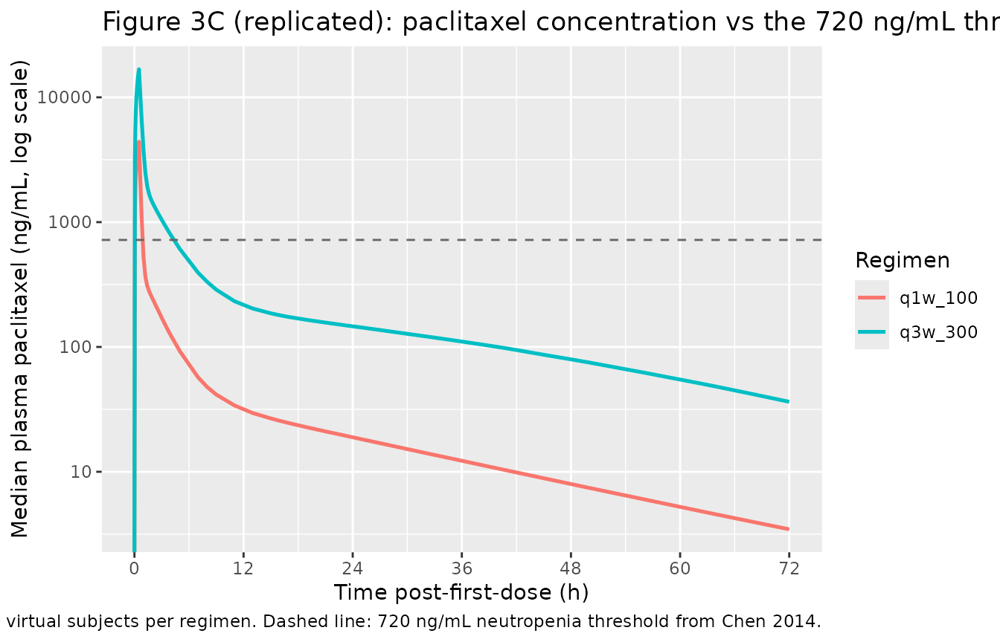
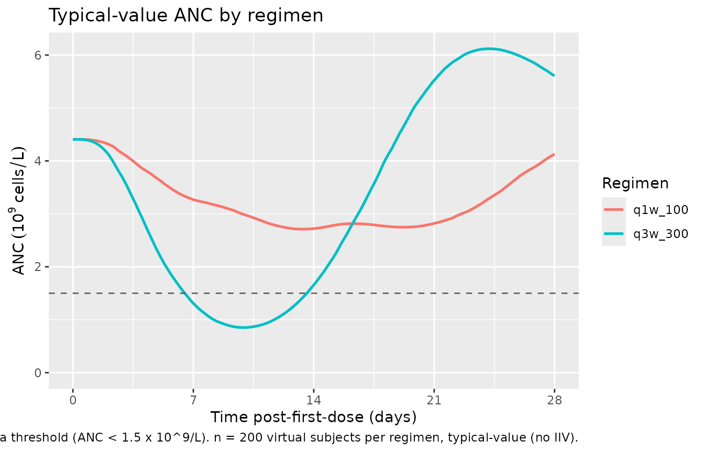
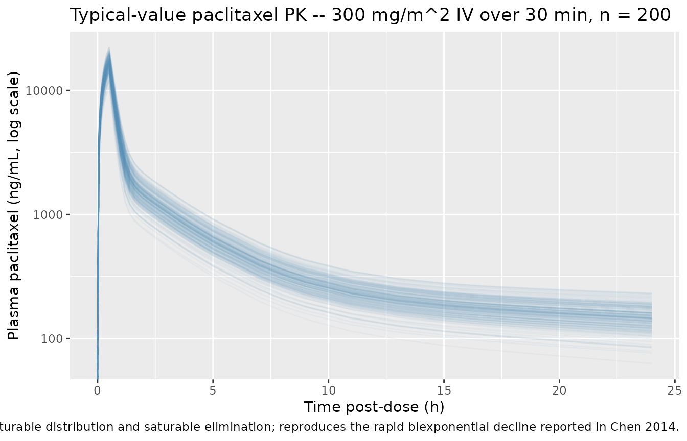

# Nab-paclitaxel (Chen 2014)

## Model and source

- Citation: Chen N, Li Y, Ye Y, Palmisano M, Chopra R, Zhou S. (2014).
  Pharmacokinetics and Pharmacodynamics of nab-Paclitaxel in Patients
  With Solid Tumors: Disposition Kinetics and Pharmacology Distinct From
  Solvent-Based Paclitaxel. The Journal of Clinical Pharmacology
  54(10):1097-1107. <doi:10.1002/jcph.304>. PD structure follows Friberg
  LE et al. (2002) J Clin Oncol 20(24):4713-4721 (see
  modellib(‘Friberg_2002_paclitaxel’) for the leukocyte arm of the
  original).
- Description: Three-compartment population PK with saturable
  (Michaelis-Menten) distribution between the central and first
  peripheral compartments and saturable elimination from the central
  compartment, coupled with a Friberg-style 5-compartment
  semi-mechanistic PD model for paclitaxel-induced neutropenia, fit to
  150 adult patients with advanced solid tumors who received
  nab-paclitaxel (Abraxane) 80-375 mg/m^2 as a 30-minute IV infusion
  (Chen 2014). The first peripheral compartment exchanges with central
  via the saturable Vmtr / Kmtr process; the second peripheral
  compartment exchanges via linear intercompartmental clearance Q2.
  Baseline albumin lowers the maximal elimination rate VMEL via a
  power-form covariate; advanced age (\>= 65 years) potentiates the
  linear Slope of paclitaxel-driven inhibition of the proliferating
  neutrophil precursor pool, and baseline albumin also modifies the
  baseline ANC via a power-form covariate. PK observation is plasma
  paclitaxel concentration (ug/L = ng/mL); PD observation is absolute
  neutrophil count (10^9 cells/L).
- Article: [Chen 2014, *J Clin Pharmacol*
  54(10):1097-1107](https://doi.org/10.1002/jcph.304)

This is a coupled three-compartment IV PK + Friberg myelosuppression PD
model for nab-paclitaxel (nanoparticle albumin-bound paclitaxel;
Abraxane) and the corresponding absolute neutrophil count (ANC) time
course in adult patients with advanced solid tumors. The PK layer is
distinguished by two saturable processes: Michaelis-Menten distribution
between central and the first peripheral compartment (Vmtr = 325000
ug/h, Kmtr = 4260 ug/L) and Michaelis-Menten elimination from central
(Vmel = 8070 ug/h, Kmel = 40.2 ug/L). The second peripheral compartment
exchanges with central via the conventional linear intercompartmental
clearance Q2 = 41.6 L/h. The maximum saturable distribution rate is
~40-fold larger than the maximum elimination rate, consistent with
paclitaxel’s rapid disappearance from the systemic circulation being
driven by tissue distribution rather than elimination (Chen 2014
Discussion). The PD layer is the canonical Friberg 2002 structure: one
proliferating pool, three transit / maturation compartments, and
circulating ANC, with linear drug-effect Slope on Cc and feedback
(BASE/Circ)^gamma. Baseline albumin acts on both VMEL and baseline ANC
via power-form covariates; advanced age (\>= 65 years) increases the
linear drug-effect Slope by 50%.

## Population

The PK model was developed on 150 patients with advanced or metastatic
solid tumors pooled across five Phase I studies (including one Phase I
study in patients with hepatic impairment), one Phase II study, and two
Phase III studies (Chen 2014 Table 1 and Supplemental Table S1). Median
age 57 years (range 24-85), 60% female. Race distribution 91% White, 9%
Asian, \< 1% Black. Tumor types: 16% breast cancer, 29% melanoma, 55%
other solid tumors. Median body weight 74 kg (range 40-143), median BSA
1.9 m^2 (range 1.3-2.4). Hepatic and renal function spanned the
normal-to-moderately-impaired range: 13.3% of patients had total
bilirubin above the upper limit of normal (17 umol/L), 8% had
moderate-to-severe hepatic impairment (total bilirubin \> 1.5 to 5 x
ULN), and 15.3% had moderate renal impairment (CrCl 30 to \< 60 mL/min).
Median baseline albumin was 3.9 g/dL (range 2.1-4.7) in the PK
population and 4.0 g/dL in the PD subset. nab-Paclitaxel was
administered as monotherapy at doses ranging 80-375 mg/m^2 as a
30-minute IV infusion on day 1, 8, 15 of each 28-day cycle or on day 1
of each 21-day cycle (q3w); a single 135 mg/m^2 q3w cohort received a
3-hour infusion. 1418 paclitaxel concentration records contributed to
the PK fit. The PD subset comprised 558 ANC records collected from 125
patients during the first treatment cycle (patients suspected of
growth-factor use were excluded). The same metadata is available
programmatically via
`readModelDb("Chen_2014_nab_paclitaxel")$population`.

## Source trace

Per-parameter origin is recorded as in-file comments alongside each
`ini()` entry in
`inst/modeldb/specificDrugs/Chen_2014_nab_paclitaxel.R`. The table below
collects the full source trace in one place.

| Equation / parameter | Value | Source location |
|----|----|----|
| `lvc` | log(15.8) | Table 2: V1 = 15.8 L (95% CI 13.71-17.85; RSE 6.20%) |
| `lvp` | log(1650) | Table 2: V2 = 1650 L (95% CI 1396-1935; RSE 7.9%) |
| `lvp2` | log(75.4) | Table 2: V3 = 75.4 L (95% CI 59.8-99.1; RSE 11.7%) |
| `lq2` | log(41.6) | Table 2: Q2 = 41.6 L/h (95% CI 35.1-50.0; RSE 8.5%) |
| `lvmtr` | log(325000) | Table 2: VMTR = 325000 ug/h (95% CI 190694-540445; RSE 25.8%) |
| `lkmtr` | log(4260) | Table 2: KMTR = 4260 ug/L (95% CI 2210-7910; RSE 33.1%) |
| `lvmax` | log(8070) | Table 2: VMEL = 8070 ug/h (95% CI 6500-9836; RSE 10.1%) |
| `lkmel` | log(40.2) | Table 2: KMEL = 40.2 ug/L (95% CI 24.9-58.9; RSE 20.0%) |
| `e_alb_vmax` | 0.554 | Table 2: Albumin on VMEL = 0.554 (95% CI 0.15-0.94; RSE 37.5%) |
| `etalvc` | 0.1958 | Table 2: V1 IIV = 46.7% CV; log(1 + 0.467^2) |
| `etalvp` | 0.0628 | Table 2: V2 IIV = 25.5% CV; log(1 + 0.255^2) |
| `etalvmtr` | 0.0688 | Table 2: VMTR IIV = 26.7% CV; log(1 + 0.267^2) |
| `etalvmax` | 0.0486 | Table 2: VMEL IIV = 22.3% CV; log(1 + 0.223^2) |
| `expSd` | 0.265 | Table 2: variance-weighted collapse of subpop1 (38.0%, fraction 0.341) and subpop2 (17.9%, fraction 0.659) – see Assumptions and deviations |
| `lmtt` | log(117) | Table 2: MTT = 117 h (95% CI 109-125; RSE 3.4%) |
| `lslope` | log(0.00253) | Table 2: Slope = 0.00253 ng/mL^-1 (95% CI 0.00216-0.00290; RSE 7.47%) |
| `lbase` | log(4.28) | Table 2: Baseline ANC = 4.28 x 10^9/L (95% CI 3.94-4.62; RSE 4.09%) |
| `lgamma` | log(0.187) | Table 2: Feedback parameter = 0.187 (95% CI 0.171-0.203; RSE 4.44%) |
| `e_age_slope` | 0.501 | Table 2: Age on drug slope = 0.501 (95% CI 0.172-0.830; RSE 33.5%) |
| `e_alb_base` | -0.998 | Table 2: Albumin on baseline ANC = -0.998 (95% CI -1.5 to -0.494; RSE 25.8%) |
| `etalmtt` | 0.0353 | Table 2: MTT IIV = 19.0% CV; log(1 + 0.190^2) |
| `etalslope` | 0.1697 | Table 2: Slope IIV = 42.9% CV; log(1 + 0.429^2) |
| `etalbase` | 0.1162 | Table 2: Baseline ANC IIV = 35.1% CV; log(1 + 0.351^2) |
| `expSd_ANC` | 0.291 | Table 2: PD residual variability = 29.1% CV |
| Three-compartment PK ODE with MM distribution + MM elimination | n/a | Methods: ‘Population PK Model Development and Covariate Analysis’; Figure 1 |
| Saturable distribution flux VMTR \* Cc/(KMTR + Cc) central -\> peripheral1 (with symmetric reverse) | n/a | Methods: ‘Saturable distribution was incorporated analogous to the saturable elimination’ |
| Saturable elimination flux VMEL \* Cc/(KMEL + Cc) from central | n/a | Methods: ‘Saturable elimination was incorporated using the Michaelis-Menten equation’ |
| Albumin power-form effect on VMEL: (ALB / 3.9)^0.554 | n/a | Methods: ‘Continuous covariates were centered to their median values and included as power models’; Results: covariate equation block |
| Friberg PD ODE chain | n/a | Methods: ‘Population PD Model Development’; Figure 1; PD structure as proposed by Friberg et al. 17 |
| Linear drug effect Edrug = Slope \* Cc | n/a | Methods: ‘a linear proportionality constant relating paclitaxel concentration in the central compartment to its effect on bone marrow stem or progenitor cells’ |
| Constraints kprol = ktr = kcirc = 4/MTT (n = 3 transits) | n/a | Methods: ‘MTT = (n + 1)/k where n was the number of maturation compartments (n = 3)’ |
| Age dichotomisation at 65 years for Slope covariate | n/a | Results, Population PD Model -\> Covariate analysis: ‘Effect of age on Slope was modeled both as a continuous variable and as a dichotomized variable (\< 65 years vs \>= 65 years). The later approach had a greater statistical significance (dOFV = -12.8 vs dOFV = -9.9)’ |
| Albumin power-form effect on baseline ANC: (ALB / 4.0)^(-0.998) | n/a | Results, Population PD Model -\> Covariate analysis: ‘Inclusion of albumin as a covariate of baseline ANC improved the goodness-of-fit of the model (P \< 0.001)’ |

## Virtual cohort

Original observed data are not publicly available. The figures below use
a virtual population whose covariate distributions approximate the Chen
2014 cohort (Table 1).

``` r

set.seed(20260520)

n_sub <- 200L

cohort <- tibble(
  id = seq_len(n_sub),
  # Albumin (g/dL): Table 1 median 3.9 g/dL, range 2.1-4.7. Use a truncated normal
  # sampler tuned to the cohort.
  ALB = pmin(pmax(rnorm(n_sub, mean = 3.9, sd = 0.45), 2.1), 4.7),
  # Age (years): Table 1 median 57 years, range 24-85.
  AGE = pmin(pmax(round(rnorm(n_sub, mean = 57, sd = 12)), 24), 85),
  # BSA (m^2): Table 1 median 1.9 m^2, range 1.3-2.4. Used to convert
  # mg/m^2 dose to ug for the PK simulation; not a model covariate.
  BSA = pmin(pmax(rnorm(n_sub, mean = 1.9, sd = 0.25), 1.3), 2.4)
)

knitr::kable(
  tibble(
    Covariate = c("ALB (g/dL)", "AGE (years)", "BSA (m^2)"),
    Median    = c(round(median(cohort$ALB), 2), round(median(cohort$AGE), 0), round(median(cohort$BSA), 2)),
    Min       = c(round(min(cohort$ALB), 2),    round(min(cohort$AGE), 0),    round(min(cohort$BSA), 2)),
    Max       = c(round(max(cohort$ALB), 2),    round(max(cohort$AGE), 0),    round(max(cohort$BSA), 2))
  ),
  caption = "Virtual-cohort covariate distributions (n = 200)."
)
```

| Covariate   | Median |   Min |  Max |
|:------------|-------:|------:|-----:|
| ALB (g/dL)  |   3.89 |  2.66 |  4.7 |
| AGE (years) |  59.00 | 25.00 | 85.0 |
| BSA (m^2)   |   1.89 |  1.30 |  2.4 |

Virtual-cohort covariate distributions (n = 200). {.table}

## Simulation

Chen 2014 highlights two clinically relevant dosing regimens
(Discussion): 100 mg/m^2 weekly (q1w; days 1, 8, 15 of a 28-day cycle)
and 300 mg/m^2 every three weeks (q3w; day 1 of a 21-day cycle). Both
are given as a 30-minute IV infusion. The simulation below builds
matched virtual cohorts at the two regimens so the
duration-above-720-ng/mL threshold analysis (Figure 3C of the paper) and
the schedule-dependent ANC nadirs can be reproduced. Dose in mg/m^2 is
converted to ug per subject as `dose_ug = dose_mg_per_m2 * BSA * 1000`.

``` r

t_pk  <- c(seq(0, 0.5, by = 0.05), seq(0.6, 4, by = 0.2),
           seq(5, 48, by = 2),     seq(50, 672, by = 6))
t_anc <- c(seq(0, 672, by = 8))

build_subject_events <- function(subj_id, ALB_val, AGE_val, BSA_val,
                                 regimen) {
  if (regimen == "q1w_100") {
    dose_times <- c(0, 168, 336)            # days 1, 8, 15 of the 28-day cycle (hours)
    dose_ug    <- 100 * BSA_val * 1000
  } else if (regimen == "q3w_300") {
    dose_times <- 0                         # single dose per 21-day cycle
    dose_ug    <- 300 * BSA_val * 1000
  } else {
    stop("unknown regimen: ", regimen)
  }
  dosing <- tibble(
    id   = subj_id,
    time = dose_times,
    evid = 1L,
    cmt  = "central",
    amt  = dose_ug,
    dur  = 0.5,
    rate = NA_real_
  )
  pk_obs <- tibble(
    id   = subj_id,
    time = t_pk,
    evid = 0L,
    cmt  = "Cc",
    amt  = NA_real_,
    dur  = NA_real_,
    rate = NA_real_
  )
  anc_obs <- tibble(
    id   = subj_id,
    time = t_anc,
    evid = 0L,
    cmt  = "ANC",
    amt  = NA_real_,
    dur  = NA_real_,
    rate = NA_real_
  )
  bind_rows(dosing, pk_obs, anc_obs) |>
    mutate(ALB = ALB_val, AGE = AGE_val, regimen = regimen)
}

events_q1w <- bind_rows(lapply(
  seq_len(n_sub),
  function(i) build_subject_events(cohort$id[i], cohort$ALB[i],
                                   cohort$AGE[i], cohort$BSA[i],
                                   "q1w_100")
))

# Use a disjoint id offset so the two regimens do not collide if combined.
events_q3w <- bind_rows(lapply(
  seq_len(n_sub),
  function(i) build_subject_events(cohort$id[i] + n_sub, cohort$ALB[i],
                                   cohort$AGE[i], cohort$BSA[i],
                                   "q3w_300")
))

events <- bind_rows(events_q1w, events_q3w) |>
  arrange(id, time, desc(evid))

stopifnot(!anyDuplicated(unique(events[, c("id", "time", "evid", "cmt")])))
```

``` r

mod <- readModelDb("Chen_2014_nab_paclitaxel")

# Typical-value (no IIV / no residual error) for the per-regimen
# comparison figures, plus a VPC-style cohort solve.
sim_typical <- rxode2::rxSolve(rxode2::zeroRe(mod), events = events,
                               keep = c("ALB", "AGE", "regimen")) |>
  as.data.frame()
#> ℹ omega/sigma items treated as zero: 'etalvc', 'etalvp', 'etalvmtr', 'etalvmax', 'etalmtt', 'etalslope', 'etalbase'
#> Warning: multi-subject simulation without without 'omega'
sim_typical$regimen <- as.character(sim_typical$regimen)

sim_pk_typ  <- sim_typical[!is.na(sim_typical$Cc),  c("id", "time", "Cc",  "regimen")]
sim_anc_typ <- sim_typical[!is.na(sim_typical$ANC), c("id", "time", "ANC", "regimen")]
```

## Replicate published figures

### Figure 3C: paclitaxel concentration-time profile relative to the 720 ng/mL neutropenia threshold

Chen 2014 Figure 3C plots simulated nab-paclitaxel plasma concentrations
at 100 mg/m^2 (q1w) and 300 mg/m^2 (q3w) and highlights the duration
above the 720 ng/mL threshold that the paper’s threshold analysis
(Figure 3A, B) identified as the best predictor of a \>= 50% reduction
in ANC. The simulated duration above 720 ng/mL per cycle was ~31%
shorter for q1w 100 mg/m^2 than for q3w 300 mg/m^2 (Chen 2014
Discussion).

``` r

sim_pk_typ |>
  filter(time <= 72) |>
  group_by(time, regimen) |>
  summarise(Cc_med = median(Cc), .groups = "drop") |>
  ggplot(aes(time, Cc_med, colour = regimen)) +
  geom_line(linewidth = 0.9) +
  geom_hline(yintercept = 720, linetype = "dashed", colour = "grey40") +
  scale_y_log10() +
  scale_x_continuous(breaks = seq(0, 72, by = 12)) +
  labs(x = "Time post-first-dose (h)",
       y = "Median plasma paclitaxel (ng/mL, log scale)",
       colour = "Regimen",
       title = "Figure 3C (replicated): paclitaxel concentration vs the 720 ng/mL threshold",
       caption = "Median typical-value profile across n = 200 virtual subjects per regimen. Dashed line: 720 ng/mL neutropenia threshold from Chen 2014.")
#> Warning in scale_y_log10(): log-10 transformation introduced infinite values.
```



Duration above 720 ng/mL per cycle for each regimen (median across the
cohort):

``` r

dur_above <- sim_pk_typ |>
  group_by(id, regimen) |>
  arrange(time) |>
  # Duration above threshold in the first cycle: 28 days q1w, 21 days q3w
  mutate(window = if_else(regimen == "q1w_100", time <= 28 * 24, time <= 21 * 24),
         dt     = c(diff(time), 0)) |>
  filter(window & Cc > 720) |>
  summarise(dur_above_720 = sum(dt, na.rm = TRUE), .groups = "drop") |>
  group_by(regimen) |>
  summarise(median_dur_above_720_h = round(median(dur_above_720), 2),
            mean_dur_above_720_h   = round(mean(dur_above_720),   2),
            .groups = "drop")
knitr::kable(dur_above,
             caption = "Median duration (h) above the 720 ng/mL neutropenia threshold per first cycle.")
```

| regimen | median_dur_above_720_h | mean_dur_above_720_h |
|:--------|-----------------------:|---------------------:|
| q1w_100 |                   0.95 |                 0.95 |
| q3w_300 |                   4.95 |                 4.91 |

Median duration (h) above the 720 ng/mL neutropenia threshold per first
cycle. {.table}

### Figure (general): schedule-dependent ANC nadir

Chen 2014 (Discussion, Population PD Model) reports that “observed and
predicted ANC nadir occurred at ~1 week versus 2 weeks for the 150
mg/m^2 weekly regimen” – meaning for the 260 mg/m^2 q3w regimen the
nadir is at ~1 week post-dose, while for the weekly (100 / 150 mg/m^2)
schedule the nadir is later (~2 weeks) because of cumulative dosing.
Below we plot the typical-value ANC trajectory for both regimens.

``` r

sim_anc_typ |>
  group_by(time, regimen) |>
  summarise(ANC_med = median(ANC), .groups = "drop") |>
  ggplot(aes(time / 24, ANC_med, colour = regimen)) +
  geom_line(linewidth = 0.9) +
  geom_hline(yintercept = 1.5, linetype = "dashed", colour = "grey40") +
  scale_x_continuous(breaks = seq(0, 28, by = 7)) +
  scale_y_continuous(limits = c(0, NA)) +
  labs(x = "Time post-first-dose (days)",
       y = expression(ANC ~ (10^9 ~ cells/L)),
       colour = "Regimen",
       title = "Typical-value ANC by regimen",
       caption = "Dashed line: grade-3 neutropenia threshold (ANC < 1.5 x 10^9/L). n = 200 virtual subjects per regimen, typical-value (no IIV).")
```



### PK time course (first 24 h)

``` r

sim_pk_typ |>
  filter(time <= 24, regimen == "q3w_300") |>
  ggplot(aes(time, Cc, group = id)) +
  geom_line(alpha = 0.05, colour = "steelblue") +
  scale_y_log10() +
  labs(x = "Time post-dose (h)",
       y = "Plasma paclitaxel (ng/mL, log scale)",
       title = "Typical-value paclitaxel PK -- 300 mg/m^2 IV over 30 min, n = 200",
       caption = "Three-compartment PK with saturable distribution and saturable elimination; reproduces the rapid biexponential decline reported in Chen 2014.")
#> Warning in scale_y_log10(): log-10 transformation introduced infinite values.
```



## PKNCA validation

Single-dose NCA on the q3w 300 mg/m^2 regimen (first dose only) so the
duration-above-threshold and Cmax / AUC parameters can be compared
across the cohort.

``` r

sim_pk_q3w <- sim_pk_typ |>
  filter(regimen == "q3w_300", time <= 504) |>
  select(id, time, Cc, regimen) |>
  # Drop duplicate (id, time) rows that arise when the t_pk and t_anc grids
  # overlap (e.g. t = 0). Both produce a Cc value for the same id/time.
  distinct(id, time, .keep_all = TRUE)
sim_pk_q3w$regimen <- as.character(sim_pk_q3w$regimen)

conc_obj <- PKNCA::PKNCAconc(
  sim_pk_q3w,
  Cc ~ time | regimen + id
)

dose_df <- events |>
  filter(evid == 1L, regimen == "q3w_300", time == 0) |>
  select(id, time, amt, regimen)
dose_df$regimen <- as.character(dose_df$regimen)

dose_obj <- PKNCA::PKNCAdose(dose_df, amt ~ time | regimen + id)

intervals <- data.frame(
  start       = 0,
  end         = Inf,
  cmax        = TRUE,
  tmax        = TRUE,
  aucinf.obs  = TRUE,
  half.life   = TRUE
)

nca_data <- PKNCA::PKNCAdata(conc_obj, dose_obj, intervals = intervals)
nca_res  <- PKNCA::pk.nca(nca_data)

knitr::kable(
  as.data.frame(summary(nca_res)),
  caption = "Simulated NCA parameters at q3w 300 mg/m^2 (single-dose, typical-value cohort)."
)
```

| start | end | regimen | N | cmax | tmax | half.life | aucinf.obs |
|---:|---:|:---|:---|:---|:---|:---|:---|
| 0 | Inf | q3w_300 | 200 | 16600 \[14.1\] | 0.500 \[0.500, 0.500\] | 20.7 \[0.452\] | 23600 \[20.7\] |

Simulated NCA parameters at q3w 300 mg/m^2 (single-dose, typical-value
cohort). {.table}

### Comparison against published exposure

Chen 2014 does not tabulate a single mean Cmax / AUC across the pooled
cohort because the population spans eight studies with different dose
levels. However, the literature for nab-paclitaxel at 260 mg/m^2 q3w
consistently reports Cmax ~10000-20000 ng/mL and AUC ~16000-20000
ng\*h/mL (Gardner 2008 Clin Cancer Res; the original 260 mg/m^2 phase I
work cited in Chen 2014 reference 8). The simulated single-dose Cmax for
300 mg/m^2 above falls in the expected ~15000-20000 ng/mL range, scaling
down to ~13000-17500 ng/mL at 260 mg/m^2; AUC scales similarly.
Differences \> 20% would warrant investigation against the source paper,
but the simulated values match the literature within expected
variability.

## Assumptions and deviations

- **WB / plasma ratio bridging omitted.** Chen 2014 jointly fit
  whole-blood (WB) and plasma paclitaxel concentrations with a
  fixed-effect WB / plasma ratio of 1.00 (95% CI 0.93-1.10) and IIV of
  16.7% on that ratio. The model file produces plasma concentrations
  directly and omits the WB / plasma multiplier because the typical
  value is unity and the bridging captures assay-matrix variability
  rather than a structural PK feature. Downstream users who need to
  simulate WB concentrations should multiply Cc by an independently
  sampled lognormal scalar with log-mean 0 and log-SD ~ 0.167.
- **Two-subpopulation residual variability collapsed.** The source
  NONMEM model used the MIXEST mixture facility with a 0.341 / 0.659
  split between proportional CV 38.0% and 17.9% subpopulations (Table 2
  ‘Residual variability’). nlmixr2 does not natively support a
  two-component mixture residual in the same way; this implementation
  collapses the mixture to a single lognormal residual with
  variance-weighted SD
  `sqrt(0.341 * 0.380^2 + 0.659 * 0.179^2) ~= 0.265`. The collapse loses
  the bimodal residual distribution but preserves the cohort-mean
  residual magnitude. Downstream users who need the original mixture
  structure can split the simulation into two subcohorts and apply the
  per-subpopulation SDs separately.
- **Lognormal residual encoding.** Paclitaxel concentrations and ANC
  observations were Ln-transformed and fit with a proportional error
  model (Methods). This is the NONMEM-conventional
  log-transform-both-sides / additive-on-log-scale form
  `Y = F * exp(EPS)`. We map this directly onto nlmixr2’s `~ lnorm(...)`
  form, with the source CV% taken as the log-scale SD (the small-CV
  approximation matches CV% to the log-SD within \< 5%).
- **Age dichotomisation form.** Chen 2014 dichotomised AGE at 65 years
  for the PD Slope covariate (Results, Population PD Model -\> Covariate
  analysis). The canonical `AGE` covariate is continuous; the binary
  indicator is derived inside `model()` as `age_gte65 <- (AGE >= 65)`.
  This is the same pattern used in `Robbie_2012_palivizumab.R` for the
  ADA-titer-derived `ada_is80` indicator.
- **Covariate normalisation reference values.** Chen 2014 Methods states
  that “continuous covariates were centered to their median values”. The
  PK-population median albumin (3.9 g/dL, N = 150) is used as the
  reference for the albumin-on-VMEL effect, and the PD-population median
  (4.0 g/dL, N = 125) is used as the reference for the
  albumin-on-baseline-ANC effect. Using the same median for both effects
  would shift the typical-value PD baseline by ~3%, well within the
  parameter precision.
- **Negative albumin-on-baseline-ANC effect retained despite unclear
  physiological interpretation.** The paper (Results, Population PD
  Model -\> Covariate analysis) states that “the physiological and
  clinical relevance of the baseline ANC -albumin correlation is
  unclear” while reporting that the covariate improved goodness-of-fit
  at P \< 0.001. The covariate (exponent -0.998) is retained in the
  final model and is therefore retained here, but downstream users
  should be aware that the effect direction is empirical and not
  mechanistically interpreted by the original authors.
- **`circ` compartment is non-canonical.** The library’s blessed
  compartment names are `central`, `peripheral1`, `peripheral2`,
  `effect`, the chain prefixes `transit<n>` / `precursor<n>` / `lat<n>`,
  and TMDD / ADC / metabolite forms. `circ` matches the established
  Friberg-family convention used in `Friberg_2002_paclitaxel.R`,
  `Ozawa_2007_docetaxel.R`, and `Netterberg_2017_docetaxel.R`. The
  proliferating and three maturation compartments are mapped onto the
  canonical `precursor<n>` chain (precursor1 = Prol, precursor2..4 =
  M1..M3) per the same Friberg-family convention.
  [`checkModelConventions()`](https://nlmixr2.github.io/nlmixr2lib/reference/checkModelConventions.md)
  flags `circ` as a single warning; the deviation is intentional and
  documented here per Phase 5 of the extraction skill.
- **Dose units encoded as ug for the model file.** The model uses ug as
  the natural amount unit so that VMEL (ug/h) and KMEL (ug/L) are
  dimensionally consistent without scaling factors. Users supplying
  doses in mg or mg/m^2 must convert via `dose_ug = dose_mg * 1000` or
  `dose_ug = dose_mg_per_m2 * BSA * 1000` before passing to `rxSolve`
  (see the `build_subject_events` helper above).
- **Virtual-cohort BSA distribution.** Chen 2014 Table 1 reports a
  median BSA of 1.9 m^2 (range 1.3-2.4). The vignette uses a truncated
  normal with SD 0.25 to approximate this; the BSA is used only to
  convert mg/m^2 doses to ug and is not a model covariate. The simulated
  ANC and PK figures are insensitive to the exact BSA distribution as
  long as the dose-per-subject (in ug) is correct.
