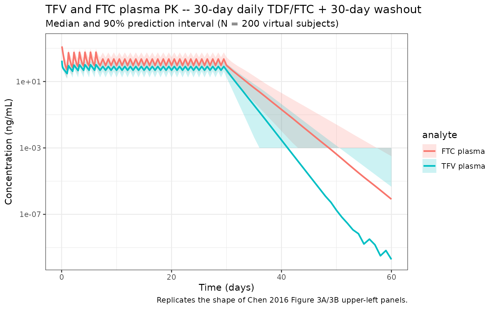
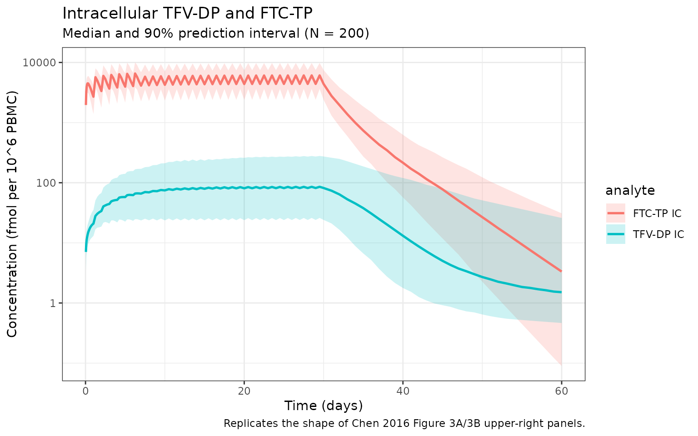
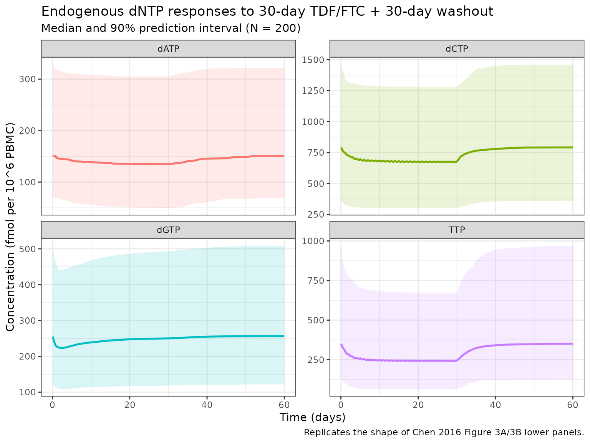
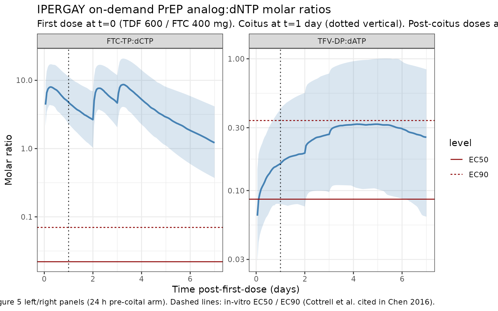

# Tenofovir / emtricitabine PKPD with dNTP pool (Chen 2016)

``` r

library(nlmixr2lib)
library(rxode2)
#> rxode2 5.1.1 using 2 threads (see ?getRxThreads)
#>   no cache: create with `rxCreateCache()`
library(dplyr)
#> 
#> Attaching package: 'dplyr'
#> The following objects are masked from 'package:stats':
#> 
#>     filter, lag
#> The following objects are masked from 'package:base':
#> 
#>     intersect, setdiff, setequal, union
library(tidyr)
library(ggplot2)
library(PKNCA)
#> 
#> Attaching package: 'PKNCA'
#> The following object is masked from 'package:stats':
#> 
#>     filter
```

## Chen 2016 linked plasma + intracellular + dNTP-pool PKPD model

Chen et al. (2016, PLOS ONE) developed a linked population pharmaco-
kinetic / pharmacodynamic model for the nucleoside-analog
antiretrovirals tenofovir (TFV, given as the prodrug tenofovir
disoproxil fumarate, TDF) and emtricitabine (FTC). The model describes:

- TFV and FTC plasma PK with classical two-compartment first-order
  absorption models;
- intracellular formation of the active anabolites tenofovir diphosphate
  (TFV-DP) and emtricitabine triphosphate (FTC-TP) via a hybrid
  first-order + saturation link from the corresponding plasma parent,
  with a two-compartment “recycle” elimination structure for the
  anabolites;
- inhibition of the zero-order production of four endogenous
  deoxynucleoside triphosphates – dATP, dGTP, dCTP, and TTP – via Emax
  indirect-response models. TFV-DP inhibits the deoxypurines (dATP,
  dGTP) and FTC-TP inhibits the deoxypyrimidines (dCTP, TTP). The dGTP
  response includes an additional 1/(1 + t^gamma) time-waning factor.

The model was fit to first-dose-to-steady-state data from 40 adults
receiving daily co-formulated TDF/FTC for 30 (HIV-negative) or 60
(HIV-positive) days, with peripheral blood mononuclear cell (PBMC)
samples drawn at densely-spaced time points on days 1, 3, 7, 20, and 30,
plus single washout samples at days 35, 45, and 60.

The packaged model `Chen_2016_tenofovir_emtricitabine` combines all
eight observation variables (plasma TFV, plasma FTC, intracellular
TFV-DP, intracellular FTC-TP, and the four dNTPs) in a single
linked-PKPD function so that downstream simulations – in particular the
analog:dNTP molar-ratio simulations used in the paper’s IPERGAY
on-demand PrEP application – have access to every state directly.

- Citation: Chen X, Seifert SM, Castillo-Mancilla JR, Bushman LR, Zheng
  J-H, Kiser JJ, MaWhinney S, Anderson PL. Model Linking Plasma and
  Intracellular Tenofovir/Emtricitabine with Deoxynucleoside
  Triphosphates. PLoS ONE. 2016;11(11):e0165505.
  <doi:10.1371/journal.pone.0165505>
- Article: <https://doi.org/10.1371/journal.pone.0165505>
- Supplement (S1 File: differential equations, NONMEM code; S2 File:
  study protocol): bundled with the open-access PLOS ONE article at the
  same DOI.

### Population

Per Chen 2016 Results “Study demographics” (page 6): 21 HIV-negative
adults and 19 HIV-positive adults were enrolled at the University of
Colorado Anschutz Medical Campus (Cell-PrEP study; NCT01040091). The
cohort had median (range) age 31 (20-52) years, weight 81.1 (56.5-127)
kg, body-mass index 26.6 (19.9-37.7) kg/m^2, and estimated GFR 93.3
(66.0-131) mL/min/1.73m^2. Of the 40 subjects, 13 were female (32.5%);
race / ethnicity was 47.5% White, 40% Black or African American, and
12.5% Hispanic. HIV-negative subjects received daily oral TDF 300 mg
(equivalent to TFV 136 mg) + FTC 200 mg for 30 days with washout samples
at days 35, 45, and 60. HIV-positive subjects received the same TDF/FTC
regimen + efavirenz 600 mg PO QD for 60 days. 34 of 40 subjects
completed all visits.

The same metadata is available programmatically:

``` r

readModelDb("Chen_2016_tenofovir_emtricitabine")$meta$population
```

### Source trace

Per-parameter origins are recorded as in-file comments in
`inst/modeldb/specificDrugs/Chen_2016_tenofovir_emtricitabine.R`; the
table below collects them.

| Equation / parameter | Value | Source location |
|----|----|----|
| TFV plasma 2-cmt ODEs (depot, central, peripheral1) | n/a | S1 File Eqs A-C; Methods “Population pharmacokinetics modeling of plasma TFV/FTC” |
| TFV Ka | 80.1 /day | Table 1A |
| TFV CL/F | 1410 L/day | Table 1A |
| TFV Vc/F | 390 L | Table 1A |
| TFV Q/F | 5390 L/day | Table 1A |
| TFV Vp/F | 877 L | Table 1A |
| FTC plasma 2-cmt ODEs (depot_ftc, central_ftc, peripheral1_ftc) | n/a | S1 File Eqs A-C |
| FTC Ka | 55.7 /day | Table 1B |
| FTC CL/F | 482 L/day | Table 1B |
| FTC Vc/F | 99.4 L (female reference) | Table 1B |
| FTC Q/F | 141 L/day | Table 1B |
| FTC Vp/F | 166 L | Table 1B |
| Sex on FTC Vc/F | tvVc/F = 99.4 + 24.3 \* SEX (male = 1, female = 0) | Table 1B; Results “Population pharmacokinetics modeling of plasma TFV/FTC” |
| Hybrid first-order + saturation link for TFV-DP / FTC-TP formation | n/a | Eqs 1-3; Methods “Population pharmacokinetics modeling of TFV-DP/FTC-TP” |
| TFV-DP Kf | 1.4 /day | Table 1A |
| TFV-DP SC50 | 6.55 (ng/mL of plasma TFV) | Table 1A |
| TFV-DP Kel | 0.228 /day | Table 1A |
| TFV-DP recycle ratio R | 5.82% | Table 1A |
| FTC-TP Kf | 41.6 /day (HIV-negative reference) | Table 1B |
| FTC-TP SC50 | 3320 (ng/mL of plasma FTC) | Table 1B |
| FTC-TP Kel | 1.6 /day | Table 1B |
| FTC-TP recycle ratio R | 16.0% | Table 1B |
| HIV on FTC-TP Kf | tvKf = 41.6 + 31.3 \* HIV (positive = 1) | Table 1B |
| Indirect-response Emax dNTP model with Kout = 1/day fixed, Emax = 1 fixed | n/a | Eq 4; Methods “Population pharmacodynamics modeling of dATP/dGTP and dCTP/TTP” |
| dATP R0 | 155 fmol/10^6 PBMC | Table 1A |
| dATP EC50 (TFV-DP) | 1020 fmol/10^6 PBMC | Table 1A |
| dGTP R0 | 245 fmol/10^6 PBMC | Table 1A |
| dGTP EC50 (TFV-DP) | 54.6 fmol/10^6 PBMC | Table 1A |
| dGTP time-waning gamma | 0.928 (unitless; effect attenuated by 1/(1 + t^gamma)) | Table 1A; S1 File Eq D |
| dCTP R0 | 771 fmol/10^6 PBMC | Table 1B |
| dCTP EC50 (FTC-TP) | 44400 fmol/10^6 PBMC | Table 1B |
| TTP R0 | 335 fmol/10^6 PBMC | Table 1B |
| TTP EC50 (FTC-TP) | 18800 fmol/10^6 PBMC | Table 1B |
| dATP baseline estimation: method 3 (weighted population + observed individual baseline) | n/a | Eq 5; Methods; Dansirikul et al. ref \[45\] |
| TFV plasma terminal half-life | 17.3 h (95% CI 15.7-19.1) | Results “Population pharmacokinetics modeling of plasma TFV/FTC” |
| FTC plasma terminal half-life | 26.8 h (95% CI 25.6-28.1) | Results |
| TFV-DP alpha / beta half-lives | 73.4 h / 55.6 days | Results |
| FTC-TP alpha / beta half-lives | 8.8 h / 76.8 h | Results |
| Operational multi-dose half-life t1/2,op | TFV-DP 6.7 days; FTC-TP 33 h | Results; Discussion |
| Dosing regimen used in the trial | TDF 300 mg + FTC 200 mg PO QD x 30 (HIV-) or 60 (HIV+) days | Methods “Study design” |

### Covariate column naming

| Source column | Canonical column |
|----|----|
| `SEX` (male = 1, female = 0; FTC Vc/F covariate) | `SEXF` (canonical; female = 1). Values inverted: `SEXF = 1 - source_SEX`. The model applies the additive +24.3 L shift via `(1 - SEXF)` so males get the +24.3 L bump and females stay at 99.4 L. |
| `HIV` (positive = 1, negative = 0; FTC-TP Kf covariate) | `HIV_POS` (canonical; same orientation, positive = 1). No transformation. |

### Virtual cohort

The virtual cohort below approximates the trial demographics from Chen
2016 Results “Study demographics” page 6. Body weight is sampled
log-normal around the reported median (81.1 kg). Sex is sampled as
Bernoulli(0.325) for `SEXF = 1` to match the 13/40 female fraction. HIV
serostatus is sampled as Bernoulli(0.475) for `HIV_POS = 1` (19/40
HIV-positive). The cohort is sized at 200 subjects to make per-time-
point quantiles smooth without inflating the runtime.

``` r

set.seed(2016)
n_subj <- 200L

cohort <- tibble(
  ID      = seq_len(n_subj),
  WT      = pmin(pmax(rlnorm(n_subj, log(81.1), 0.18), 50), 130),
  SEXF    = as.integer(rbinom(n_subj, 1, 0.325)),
  HIV_POS = as.integer(rbinom(n_subj, 1, 0.475))
)
summary(cohort)
#>        ID               WT              SEXF          HIV_POS     
#>  Min.   :  1.00   Min.   : 50.00   Min.   :0.000   Min.   :0.000  
#>  1st Qu.: 50.75   1st Qu.: 71.66   1st Qu.:0.000   1st Qu.:0.000  
#>  Median :100.50   Median : 80.93   Median :0.000   Median :1.000  
#>  Mean   :100.50   Mean   : 82.79   Mean   :0.335   Mean   :0.525  
#>  3rd Qu.:150.25   3rd Qu.: 91.96   3rd Qu.:1.000   3rd Qu.:1.000  
#>  Max.   :200.00   Max.   :130.00   Max.   :1.000   Max.   :1.000
```

### Dosing dataset

The trial’s daily oral TDF 300 mg / FTC 200 mg regimen is encoded as two
separate dose events per day: one into the `depot` compartment (TFV 136
mg, the prodrug-equivalent amount of TFV per TDF tablet) and one into
the `depot_ftc` compartment (FTC 200 mg). Both compartments must be
dosed simultaneously to drive the linked PKPD model. The simulation
horizon spans 30 days of daily dosing followed by a 30-day washout
(matching the HIV-negative arm of the Cell-PrEP study).

``` r

dose_times <- seq(0, 29)               # daily dosing on days 0..29
obs_times  <- sort(unique(c(
  seq(0, 1,  by = 0.05),               # densely sampled across day 1
  seq(1, 7,  by = 0.25),               # quarter-day through day 7
  seq(7, 30, by = 0.5),                # half-day through day 30
  seq(30, 60, by = 1)                  # daily washout
)))

# Two dose events per administration (one to depot, one to depot_ftc).
# Observation rows use cmt = "Cc" -- rxSolve returns every defined
# output variable for each observation row regardless of which output
# name is in cmt, but specifying an existing output keeps the event
# table valid.
make_events <- function(pop_df, dose_times, obs_times) {
  dose_tfv <- pop_df %>%
    crossing(TIME = dose_times) %>%
    mutate(AMT = 136,          # mg TFV equivalent per TDF 300 mg tablet
           EVID = 1L, CMT = "depot",     DV = NA_real_)
  dose_ftc <- pop_df %>%
    crossing(TIME = dose_times) %>%
    mutate(AMT = 200,          # mg FTC per tablet
           EVID = 1L, CMT = "depot_ftc", DV = NA_real_)
  obs <- pop_df %>%
    crossing(TIME = obs_times) %>%
    mutate(AMT = NA_real_, EVID = 0L, CMT = "Cc", DV = NA_real_)
  bind_rows(dose_tfv, dose_ftc, obs) %>%
    arrange(ID, TIME, desc(EVID)) %>%
    as.data.frame()
}

events <- make_events(cohort, dose_times, obs_times)
stopifnot(!anyDuplicated(unique(events[, c("ID", "TIME", "EVID", "CMT")])))
```

### Simulate the trial-like 30-day regimen + 30-day washout

``` r

mod <- readModelDb("Chen_2016_tenofovir_emtricitabine")
sim <- rxSolve(mod, events, returnType = "data.frame",
               keep = c("WT", "SEXF", "HIV_POS"))
#> ℹ parameter labels from comments will be replaced by 'label()'
```

The output `sim` has columns for `Cc` (TFV plasma, ng/mL), `Cc_ftc` (FTC
plasma, ng/mL), `Cc_tfvdp` (intracellular TFV-DP, fmol per 10^6 PBMC),
`Cc_ftctp` (intracellular FTC-TP, fmol per 10^6 PBMC), plus the four
dNTP state values `datp`, `dgtp`, `dctp`, `ttp` (fmol per 10^6 PBMC).
The model performs the internal mg/L -\> ng/mL conversion so that Cc and
Cc_ftc match the paper’s native ng/mL plasma units directly.

### Plasma TFV and FTC concentration-time profiles

Replicates the shape of Chen 2016 Figure 3A and 3B upper-left panels
(plasma TFV and plasma FTC visual predictive checks across day 1 and
days 30-60, including the washout).

``` r

plasma_long <- sim %>%
  transmute(id, time, WT, SEXF, HIV_POS,
            `TFV plasma`  = Cc,
            `FTC plasma`  = Cc_ftc) %>%
  pivot_longer(c(`TFV plasma`, `FTC plasma`),
               names_to = "analyte", values_to = "conc_ngmL")

plasma_summary <- plasma_long %>%
  filter(time > 0, !is.na(conc_ngmL)) %>%
  group_by(analyte, time) %>%
  summarise(
    median = median(conc_ngmL, na.rm = TRUE),
    lo     = quantile(conc_ngmL, 0.05, na.rm = TRUE),
    hi     = quantile(conc_ngmL, 0.95, na.rm = TRUE),
    .groups = "drop"
  )

ggplot(plasma_summary, aes(time, median, colour = analyte, fill = analyte)) +
  geom_ribbon(aes(ymin = pmax(lo, 1e-3), ymax = hi),
              alpha = 0.2, colour = NA) +
  geom_line(linewidth = 0.9) +
  scale_y_log10() +
  labs(x = "Time (days)", y = "Concentration (ng/mL)",
       title = "TFV and FTC plasma PK -- 30-day daily TDF/FTC + 30-day washout",
       subtitle = "Median and 90% prediction interval (N = 200 virtual subjects)",
       caption = "Replicates the shape of Chen 2016 Figure 3A/3B upper-left panels.") +
  theme_bw()
```



### Intracellular TFV-DP and FTC-TP

Replicates the shape of Chen 2016 Figure 3A and 3B upper-right panels.
Concentrations are in fmol per 10^6 PBMC.

``` r

ic_long <- sim %>%
  transmute(id, time,
            `TFV-DP IC` = Cc_tfvdp,
            `FTC-TP IC` = Cc_ftctp) %>%
  pivot_longer(c(`TFV-DP IC`, `FTC-TP IC`),
               names_to = "analyte", values_to = "conc_fmol")

ic_summary <- ic_long %>%
  filter(time > 0) %>%
  group_by(analyte, time) %>%
  summarise(
    median = median(conc_fmol, na.rm = TRUE),
    lo     = quantile(conc_fmol, 0.05, na.rm = TRUE),
    hi     = quantile(conc_fmol, 0.95, na.rm = TRUE),
    .groups = "drop"
  )

ggplot(ic_summary, aes(time, median, colour = analyte, fill = analyte)) +
  geom_ribbon(aes(ymin = pmax(lo, 1e-3), ymax = hi),
              alpha = 0.2, colour = NA) +
  geom_line(linewidth = 0.9) +
  scale_y_log10() +
  labs(x = "Time (days)", y = "Concentration (fmol per 10^6 PBMC)",
       title = "Intracellular TFV-DP and FTC-TP",
       subtitle = "Median and 90% prediction interval (N = 200)",
       caption = "Replicates the shape of Chen 2016 Figure 3A/3B upper-right panels.") +
  theme_bw()
```



### dNTP pool changes during treatment

Replicates the shape of Chen 2016 Figure 3A and 3B lower panels (the
indirect-response time courses of dATP, dGTP, dCTP, TTP across the
30-day treatment and 30-day washout). The paper reports model-predicted
median (5%, 95% percentile) reductions of 11% (0.45%, 53%) in dATP, 14%
(2.6%, 35%) in dCTP, 24% (4.5%, 62%) in TTP, and a transient 13% (6.9%,
21%) dGTP nadir around day 2.5 followed by return to baseline.

``` r

dntp_long <- sim %>%
  transmute(id, time,
            dATP = datp,
            dGTP = dgtp,
            dCTP = dctp,
            TTP  = ttp) %>%
  pivot_longer(c(dATP, dGTP, dCTP, TTP),
               names_to = "analyte", values_to = "conc_fmol")

dntp_summary <- dntp_long %>%
  filter(time > 0) %>%
  group_by(analyte, time) %>%
  summarise(
    median = median(conc_fmol, na.rm = TRUE),
    lo     = quantile(conc_fmol, 0.05, na.rm = TRUE),
    hi     = quantile(conc_fmol, 0.95, na.rm = TRUE),
    .groups = "drop"
  )

ggplot(dntp_summary, aes(time, median, colour = analyte, fill = analyte)) +
  geom_ribbon(aes(ymin = lo, ymax = hi), alpha = 0.15, colour = NA) +
  geom_line(linewidth = 0.9) +
  facet_wrap(~ analyte, scales = "free_y") +
  labs(x = "Time (days)", y = "Concentration (fmol per 10^6 PBMC)",
       title = "Endogenous dNTP responses to 30-day TDF/FTC + 30-day washout",
       subtitle = "Median and 90% prediction interval (N = 200)",
       caption = "Replicates the shape of Chen 2016 Figure 3A/3B lower panels.") +
  theme_bw() +
  theme(legend.position = "none")
```



### Typical-subject reproduction of published values

Simulate a typical HIV-negative female subject (the paper’s reference
covariate combination for FTC Vc/F and for the TFV plasma model) with
between-subject variability zeroed. Compare the simulated steady-state
concentrations to those expected from the published parameters.

``` r

mod_typ <- rxode2::zeroRe(mod)
#> ℹ parameter labels from comments will be replaced by 'label()'

typ <- tibble(ID = 1L, WT = 81.1, SEXF = 1L, HIV_POS = 0L)

# Steady-state run: 60 days of daily dosing to make sure TFV-DP / FTC-TP
# reach their pseudo-steady-state plateaus.
typ_dose_times <- seq(0, 59)
typ_events <- make_events(typ, typ_dose_times, sort(unique(c(
  seq(0, 1, by = 0.05),
  seq(1, 7, by = 0.5),
  seq(7, 60, by = 1)
))))

sim_typ <- rxSolve(mod_typ, typ_events, returnType = "data.frame")
#> ℹ omega/sigma items treated as zero: 'etalvc', 'etalcl', 'etalq', 'etalvc_ftc', 'etalcl_ftc', 'etalvp_ftc', 'etalkf_tfvdp', 'etalkel_tfvdp', 'etalkf_ftctp', 'etalkel_ftctp', 'etalr0_datp', 'etalec50_datp', 'etalr0_dgtp', 'etalr0_dctp', 'etalec50_dctp', 'etalr0_ttp', 'etalec50_ttp'

ss <- sim_typ %>%
  filter(time >= 30) %>%       # treat day 30+ as pseudo-steady-state
  summarise(
    TFV_Cmax_ngmL   = max(Cc,     na.rm = TRUE),
    FTC_Cmax_ngmL   = max(Cc_ftc, na.rm = TRUE),
    TFVDP_ss_median = median(Cc_tfvdp[time >= 50], na.rm = TRUE),
    FTCTP_ss_median = median(Cc_ftctp[time >= 50], na.rm = TRUE),
    dATP_nadir      = min(datp, na.rm = TRUE),
    dCTP_nadir      = min(dctp, na.rm = TRUE)
  )

knitr::kable(ss, digits = 2,
             caption = "Typical 81.1 kg HIV-negative female subject -- steady-state extracts (concentrations in ng/mL for plasma, fmol per 10^6 PBMC for intracellular).")
```

| TFV_Cmax_ngmL | FTC_Cmax_ngmL | TFVDP_ss_median | FTCTP_ss_median | dATP_nadir | dCTP_nadir |
|---:|---:|---:|---:|---:|---:|
| 50.4 | 87.25 | 88.48 | 4295.98 | 142.39 | 684.99 |

Typical 81.1 kg HIV-negative female subject – steady-state extracts
(concentrations in ng/mL for plasma, fmol per 10^6 PBMC for
intracellular). {.table}

### Plasma PKNCA for the first-dose interval

Run PKNCA on the simulated day-1 plasma TFV and plasma FTC profiles
(0-24 h after the first dose). The paper does not publish first-dose NCA
values directly, but the alpha / terminal half-lives in Table 1A / 1B
can be cross-checked against PKNCA’s `half.life` estimate over the
appropriate window. Sampling here uses the full 24-hour first-dose
interval.

``` r

# Single observation grid for the first 24 h
day1_obs_times <- c(0.05, 0.1, 0.25, 0.5, 1, 2, 4, 6, 8, 12, 18, 24) / 24

day1_events <- make_events(cohort, dose_times = 0, obs_times = day1_obs_times)
sim_day1 <- rxSolve(mod, day1_events, returnType = "data.frame",
                    keep = c("WT", "SEXF", "HIV_POS"))
#> ℹ parameter labels from comments will be replaced by 'label()'

# TFV plasma NCA
nca_tfv <- sim_day1 %>%
  filter(time > 0, Cc > 0) %>%
  transmute(ID = id, time_h = time * 24, conc_ngmL = Cc,
            cohort = "HIV_pop")

conc_obj_tfv <- PKNCAconc(nca_tfv,
                          conc_ngmL ~ time_h | cohort + ID,
                          concu = "ng/mL", timeu = "h")
dose_obj_tfv <- PKNCAdose(
  cohort %>% mutate(time_h = 0, AMT_TFV_mg = 136, cohort = "HIV_pop"),
  AMT_TFV_mg ~ time_h | cohort + ID,
  doseu = "mg"
)
intervals_24h <- data.frame(
  start     = 0,
  end       = 24,
  cmax      = TRUE,
  tmax      = TRUE,
  auclast   = TRUE,
  half.life = TRUE
)
nca_data_tfv <- PKNCAdata(conc_obj_tfv, dose_obj_tfv, intervals = intervals_24h)
nca_res_tfv  <- pk.nca(nca_data_tfv)
#> Warning: Requesting an AUC range starting (0) before the first measurement (0.05) is not allowed
#> Requesting an AUC range starting (0) before the first measurement (0.05) is not allowed
#> Requesting an AUC range starting (0) before the first measurement (0.05) is not allowed
#> Requesting an AUC range starting (0) before the first measurement (0.05) is not allowed
#> Requesting an AUC range starting (0) before the first measurement (0.05) is not allowed
#> Requesting an AUC range starting (0) before the first measurement (0.05) is not allowed
#> Requesting an AUC range starting (0) before the first measurement (0.05) is not allowed
#> Requesting an AUC range starting (0) before the first measurement (0.05) is not allowed
#> Requesting an AUC range starting (0) before the first measurement (0.05) is not allowed
#> Requesting an AUC range starting (0) before the first measurement (0.05) is not allowed
#> Requesting an AUC range starting (0) before the first measurement (0.05) is not allowed
#> Requesting an AUC range starting (0) before the first measurement (0.05) is not allowed
#> Requesting an AUC range starting (0) before the first measurement (0.05) is not allowed
#> Requesting an AUC range starting (0) before the first measurement (0.05) is not allowed
#> Requesting an AUC range starting (0) before the first measurement (0.05) is not allowed
#> Requesting an AUC range starting (0) before the first measurement (0.05) is not allowed
#> Requesting an AUC range starting (0) before the first measurement (0.05) is not allowed
#> Requesting an AUC range starting (0) before the first measurement (0.05) is not allowed
#> Requesting an AUC range starting (0) before the first measurement (0.05) is not allowed
#> Requesting an AUC range starting (0) before the first measurement (0.05) is not allowed
#> Requesting an AUC range starting (0) before the first measurement (0.05) is not allowed
#> Requesting an AUC range starting (0) before the first measurement (0.05) is not allowed
#> Requesting an AUC range starting (0) before the first measurement (0.05) is not allowed
#> Requesting an AUC range starting (0) before the first measurement (0.05) is not allowed
#> Requesting an AUC range starting (0) before the first measurement (0.05) is not allowed
#> Requesting an AUC range starting (0) before the first measurement (0.05) is not allowed
#> Requesting an AUC range starting (0) before the first measurement (0.05) is not allowed
#> Requesting an AUC range starting (0) before the first measurement (0.05) is not allowed
#> Requesting an AUC range starting (0) before the first measurement (0.05) is not allowed
#> Requesting an AUC range starting (0) before the first measurement (0.05) is not allowed
#> Requesting an AUC range starting (0) before the first measurement (0.05) is not allowed
#> Requesting an AUC range starting (0) before the first measurement (0.05) is not allowed
#> Requesting an AUC range starting (0) before the first measurement (0.05) is not allowed
#> Requesting an AUC range starting (0) before the first measurement (0.05) is not allowed
#> Requesting an AUC range starting (0) before the first measurement (0.05) is not allowed
#> Requesting an AUC range starting (0) before the first measurement (0.05) is not allowed
#> Requesting an AUC range starting (0) before the first measurement (0.05) is not allowed
#> Requesting an AUC range starting (0) before the first measurement (0.05) is not allowed
#> Requesting an AUC range starting (0) before the first measurement (0.05) is not allowed
#> Requesting an AUC range starting (0) before the first measurement (0.05) is not allowed
#> Requesting an AUC range starting (0) before the first measurement (0.05) is not allowed
#> Requesting an AUC range starting (0) before the first measurement (0.05) is not allowed
#> Requesting an AUC range starting (0) before the first measurement (0.05) is not allowed
#> Requesting an AUC range starting (0) before the first measurement (0.05) is not allowed
#> Requesting an AUC range starting (0) before the first measurement (0.05) is not allowed
#> Requesting an AUC range starting (0) before the first measurement (0.05) is not allowed
#> Requesting an AUC range starting (0) before the first measurement (0.05) is not allowed
#> Requesting an AUC range starting (0) before the first measurement (0.05) is not allowed
#> Requesting an AUC range starting (0) before the first measurement (0.05) is not allowed
#> Requesting an AUC range starting (0) before the first measurement (0.05) is not allowed
#> Requesting an AUC range starting (0) before the first measurement (0.05) is not allowed
#> Requesting an AUC range starting (0) before the first measurement (0.05) is not allowed
#> Requesting an AUC range starting (0) before the first measurement (0.05) is not allowed
#> Requesting an AUC range starting (0) before the first measurement (0.05) is not allowed
#> Requesting an AUC range starting (0) before the first measurement (0.05) is not allowed
#> Requesting an AUC range starting (0) before the first measurement (0.05) is not allowed
#> Requesting an AUC range starting (0) before the first measurement (0.05) is not allowed
#> Requesting an AUC range starting (0) before the first measurement (0.05) is not allowed
#> Requesting an AUC range starting (0) before the first measurement (0.05) is not allowed
#> Requesting an AUC range starting (0) before the first measurement (0.05) is not allowed
#> Requesting an AUC range starting (0) before the first measurement (0.05) is not allowed
#> Requesting an AUC range starting (0) before the first measurement (0.05) is not allowed
#> Requesting an AUC range starting (0) before the first measurement (0.05) is not allowed
#> Requesting an AUC range starting (0) before the first measurement (0.05) is not allowed
#> Requesting an AUC range starting (0) before the first measurement (0.05) is not allowed
#> Requesting an AUC range starting (0) before the first measurement (0.05) is not allowed
#> Requesting an AUC range starting (0) before the first measurement (0.05) is not allowed
#> Requesting an AUC range starting (0) before the first measurement (0.05) is not allowed
#> Requesting an AUC range starting (0) before the first measurement (0.05) is not allowed
#> Requesting an AUC range starting (0) before the first measurement (0.05) is not allowed
#> Requesting an AUC range starting (0) before the first measurement (0.05) is not allowed
#> Requesting an AUC range starting (0) before the first measurement (0.05) is not allowed
#> Requesting an AUC range starting (0) before the first measurement (0.05) is not allowed
#> Requesting an AUC range starting (0) before the first measurement (0.05) is not allowed
#> Requesting an AUC range starting (0) before the first measurement (0.05) is not allowed
#> Requesting an AUC range starting (0) before the first measurement (0.05) is not allowed
#> Requesting an AUC range starting (0) before the first measurement (0.05) is not allowed
#> Requesting an AUC range starting (0) before the first measurement (0.05) is not allowed
#> Requesting an AUC range starting (0) before the first measurement (0.05) is not allowed
#> Requesting an AUC range starting (0) before the first measurement (0.05) is not allowed
#> Requesting an AUC range starting (0) before the first measurement (0.05) is not allowed
#> Requesting an AUC range starting (0) before the first measurement (0.05) is not allowed
#> Requesting an AUC range starting (0) before the first measurement (0.05) is not allowed
#> Requesting an AUC range starting (0) before the first measurement (0.05) is not allowed
#> Requesting an AUC range starting (0) before the first measurement (0.05) is not allowed
#> Requesting an AUC range starting (0) before the first measurement (0.05) is not allowed
#> Requesting an AUC range starting (0) before the first measurement (0.05) is not allowed
#> Requesting an AUC range starting (0) before the first measurement (0.05) is not allowed
#> Requesting an AUC range starting (0) before the first measurement (0.05) is not allowed
#> Requesting an AUC range starting (0) before the first measurement (0.05) is not allowed
#> Requesting an AUC range starting (0) before the first measurement (0.05) is not allowed
#> Requesting an AUC range starting (0) before the first measurement (0.05) is not allowed
#> Requesting an AUC range starting (0) before the first measurement (0.05) is not allowed
#> Requesting an AUC range starting (0) before the first measurement (0.05) is not allowed
#> Requesting an AUC range starting (0) before the first measurement (0.05) is not allowed
#> Requesting an AUC range starting (0) before the first measurement (0.05) is not allowed
#> Requesting an AUC range starting (0) before the first measurement (0.05) is not allowed
#> Requesting an AUC range starting (0) before the first measurement (0.05) is not allowed
#> Requesting an AUC range starting (0) before the first measurement (0.05) is not allowed
#> Requesting an AUC range starting (0) before the first measurement (0.05) is not allowed
#> Requesting an AUC range starting (0) before the first measurement (0.05) is not allowed
#> Requesting an AUC range starting (0) before the first measurement (0.05) is not allowed
#> Requesting an AUC range starting (0) before the first measurement (0.05) is not allowed
#> Requesting an AUC range starting (0) before the first measurement (0.05) is not allowed
#> Requesting an AUC range starting (0) before the first measurement (0.05) is not allowed
#> Requesting an AUC range starting (0) before the first measurement (0.05) is not allowed
#> Requesting an AUC range starting (0) before the first measurement (0.05) is not allowed
#> Requesting an AUC range starting (0) before the first measurement (0.05) is not allowed
#> Requesting an AUC range starting (0) before the first measurement (0.05) is not allowed
#> Requesting an AUC range starting (0) before the first measurement (0.05) is not allowed
#> Requesting an AUC range starting (0) before the first measurement (0.05) is not allowed
#> Requesting an AUC range starting (0) before the first measurement (0.05) is not allowed
#> Requesting an AUC range starting (0) before the first measurement (0.05) is not allowed
#> Requesting an AUC range starting (0) before the first measurement (0.05) is not allowed
#> Requesting an AUC range starting (0) before the first measurement (0.05) is not allowed
#> Requesting an AUC range starting (0) before the first measurement (0.05) is not allowed
#> Requesting an AUC range starting (0) before the first measurement (0.05) is not allowed
#> Requesting an AUC range starting (0) before the first measurement (0.05) is not allowed
#> Requesting an AUC range starting (0) before the first measurement (0.05) is not allowed
#> Requesting an AUC range starting (0) before the first measurement (0.05) is not allowed
#> Requesting an AUC range starting (0) before the first measurement (0.05) is not allowed
#> Requesting an AUC range starting (0) before the first measurement (0.05) is not allowed
#> Requesting an AUC range starting (0) before the first measurement (0.05) is not allowed
#> Requesting an AUC range starting (0) before the first measurement (0.05) is not allowed
#> Requesting an AUC range starting (0) before the first measurement (0.05) is not allowed
#> Requesting an AUC range starting (0) before the first measurement (0.05) is not allowed
#> Requesting an AUC range starting (0) before the first measurement (0.05) is not allowed
#> Requesting an AUC range starting (0) before the first measurement (0.05) is not allowed
#> Requesting an AUC range starting (0) before the first measurement (0.05) is not allowed
#> Requesting an AUC range starting (0) before the first measurement (0.05) is not allowed
#> Requesting an AUC range starting (0) before the first measurement (0.05) is not allowed
#> Requesting an AUC range starting (0) before the first measurement (0.05) is not allowed
#> Requesting an AUC range starting (0) before the first measurement (0.05) is not allowed
#> Requesting an AUC range starting (0) before the first measurement (0.05) is not allowed
#> Requesting an AUC range starting (0) before the first measurement (0.05) is not allowed
#> Requesting an AUC range starting (0) before the first measurement (0.05) is not allowed
#> Requesting an AUC range starting (0) before the first measurement (0.05) is not allowed
#> Requesting an AUC range starting (0) before the first measurement (0.05) is not allowed
#> Requesting an AUC range starting (0) before the first measurement (0.05) is not allowed
#> Requesting an AUC range starting (0) before the first measurement (0.05) is not allowed
#> Requesting an AUC range starting (0) before the first measurement (0.05) is not allowed
#> Requesting an AUC range starting (0) before the first measurement (0.05) is not allowed
#> Requesting an AUC range starting (0) before the first measurement (0.05) is not allowed
#> Requesting an AUC range starting (0) before the first measurement (0.05) is not allowed
#> Requesting an AUC range starting (0) before the first measurement (0.05) is not allowed
#> Requesting an AUC range starting (0) before the first measurement (0.05) is not allowed
#> Requesting an AUC range starting (0) before the first measurement (0.05) is not allowed
#> Requesting an AUC range starting (0) before the first measurement (0.05) is not allowed
#> Requesting an AUC range starting (0) before the first measurement (0.05) is not allowed
#> Requesting an AUC range starting (0) before the first measurement (0.05) is not allowed
#> Requesting an AUC range starting (0) before the first measurement (0.05) is not allowed
#> Requesting an AUC range starting (0) before the first measurement (0.05) is not allowed
#> Requesting an AUC range starting (0) before the first measurement (0.05) is not allowed
#> Requesting an AUC range starting (0) before the first measurement (0.05) is not allowed
#> Requesting an AUC range starting (0) before the first measurement (0.05) is not allowed
#> Requesting an AUC range starting (0) before the first measurement (0.05) is not allowed
#> Requesting an AUC range starting (0) before the first measurement (0.05) is not allowed
#> Requesting an AUC range starting (0) before the first measurement (0.05) is not allowed
#> Requesting an AUC range starting (0) before the first measurement (0.05) is not allowed
#> Requesting an AUC range starting (0) before the first measurement (0.05) is not allowed
#> Requesting an AUC range starting (0) before the first measurement (0.05) is not allowed
#> Requesting an AUC range starting (0) before the first measurement (0.05) is not allowed
#> Requesting an AUC range starting (0) before the first measurement (0.05) is not allowed
#> Requesting an AUC range starting (0) before the first measurement (0.05) is not allowed
#> Requesting an AUC range starting (0) before the first measurement (0.05) is not allowed
#> Requesting an AUC range starting (0) before the first measurement (0.05) is not allowed
#> Requesting an AUC range starting (0) before the first measurement (0.05) is not allowed
#> Requesting an AUC range starting (0) before the first measurement (0.05) is not allowed
#> Requesting an AUC range starting (0) before the first measurement (0.05) is not allowed
#> Requesting an AUC range starting (0) before the first measurement (0.05) is not allowed
#> Requesting an AUC range starting (0) before the first measurement (0.05) is not allowed
#> Requesting an AUC range starting (0) before the first measurement (0.05) is not allowed
#> Requesting an AUC range starting (0) before the first measurement (0.05) is not allowed
#> Requesting an AUC range starting (0) before the first measurement (0.05) is not allowed
#> Requesting an AUC range starting (0) before the first measurement (0.05) is not allowed
#> Requesting an AUC range starting (0) before the first measurement (0.05) is not allowed
#> Requesting an AUC range starting (0) before the first measurement (0.05) is not allowed
#> Requesting an AUC range starting (0) before the first measurement (0.05) is not allowed
#> Requesting an AUC range starting (0) before the first measurement (0.05) is not allowed
#> Requesting an AUC range starting (0) before the first measurement (0.05) is not allowed
#> Requesting an AUC range starting (0) before the first measurement (0.05) is not allowed
#> Requesting an AUC range starting (0) before the first measurement (0.05) is not allowed
#> Requesting an AUC range starting (0) before the first measurement (0.05) is not allowed
#> Requesting an AUC range starting (0) before the first measurement (0.05) is not allowed
#> Requesting an AUC range starting (0) before the first measurement (0.05) is not allowed
#> Requesting an AUC range starting (0) before the first measurement (0.05) is not allowed
#> Requesting an AUC range starting (0) before the first measurement (0.05) is not allowed
#> Requesting an AUC range starting (0) before the first measurement (0.05) is not allowed
#> Requesting an AUC range starting (0) before the first measurement (0.05) is not allowed
#> Requesting an AUC range starting (0) before the first measurement (0.05) is not allowed
#> Requesting an AUC range starting (0) before the first measurement (0.05) is not allowed
#> Requesting an AUC range starting (0) before the first measurement (0.05) is not allowed
#> Requesting an AUC range starting (0) before the first measurement (0.05) is not allowed
#> Requesting an AUC range starting (0) before the first measurement (0.05) is not allowed
#> Requesting an AUC range starting (0) before the first measurement (0.05) is not allowed
#> Requesting an AUC range starting (0) before the first measurement (0.05) is not allowed
#> Requesting an AUC range starting (0) before the first measurement (0.05) is not allowed
#> Requesting an AUC range starting (0) before the first measurement (0.05) is not allowed
#> Requesting an AUC range starting (0) before the first measurement (0.05) is not allowed
#> Requesting an AUC range starting (0) before the first measurement (0.05) is not allowed
knitr::kable(
  summary(nca_res_tfv),
  caption = "PKNCA summary -- TFV plasma, 0-24 h after the first oral TDF 300 mg dose."
)
```

| Interval Start | Interval End | cohort | N | AUClast (h\*ng/mL) | Cmax (ng/mL) | Tmax (h) | Half-life (h) |
|---:|---:|:---|:---|:---|:---|:---|:---|
| 0 | 24 | HIV_pop | 200 | NC | 227 \[37.0\] | 0.500 \[0.250, 1.00\] | 18.3 \[6.85\] |

PKNCA summary – TFV plasma, 0-24 h after the first oral TDF 300 mg dose.
{.table}

``` r


# FTC plasma NCA
nca_ftc <- sim_day1 %>%
  filter(time > 0, Cc_ftc > 0) %>%
  transmute(ID = id, time_h = time * 24, conc_ngmL = Cc_ftc,
            cohort = "HIV_pop")

conc_obj_ftc <- PKNCAconc(nca_ftc,
                          conc_ngmL ~ time_h | cohort + ID,
                          concu = "ng/mL", timeu = "h")
dose_obj_ftc <- PKNCAdose(
  cohort %>% mutate(time_h = 0, AMT_FTC_mg = 200, cohort = "HIV_pop"),
  AMT_FTC_mg ~ time_h | cohort + ID,
  doseu = "mg"
)
nca_data_ftc <- PKNCAdata(conc_obj_ftc, dose_obj_ftc, intervals = intervals_24h)
nca_res_ftc  <- pk.nca(nca_data_ftc)
#> Warning: Requesting an AUC range starting (0) before the first measurement (0.05) is not allowed
#> Requesting an AUC range starting (0) before the first measurement (0.05) is not allowed
#> Requesting an AUC range starting (0) before the first measurement (0.05) is not allowed
#> Requesting an AUC range starting (0) before the first measurement (0.05) is not allowed
#> Requesting an AUC range starting (0) before the first measurement (0.05) is not allowed
#> Requesting an AUC range starting (0) before the first measurement (0.05) is not allowed
#> Requesting an AUC range starting (0) before the first measurement (0.05) is not allowed
#> Requesting an AUC range starting (0) before the first measurement (0.05) is not allowed
#> Requesting an AUC range starting (0) before the first measurement (0.05) is not allowed
#> Requesting an AUC range starting (0) before the first measurement (0.05) is not allowed
#> Requesting an AUC range starting (0) before the first measurement (0.05) is not allowed
#> Requesting an AUC range starting (0) before the first measurement (0.05) is not allowed
#> Requesting an AUC range starting (0) before the first measurement (0.05) is not allowed
#> Requesting an AUC range starting (0) before the first measurement (0.05) is not allowed
#> Requesting an AUC range starting (0) before the first measurement (0.05) is not allowed
#> Requesting an AUC range starting (0) before the first measurement (0.05) is not allowed
#> Requesting an AUC range starting (0) before the first measurement (0.05) is not allowed
#> Requesting an AUC range starting (0) before the first measurement (0.05) is not allowed
#> Requesting an AUC range starting (0) before the first measurement (0.05) is not allowed
#> Requesting an AUC range starting (0) before the first measurement (0.05) is not allowed
#> Requesting an AUC range starting (0) before the first measurement (0.05) is not allowed
#> Requesting an AUC range starting (0) before the first measurement (0.05) is not allowed
#> Requesting an AUC range starting (0) before the first measurement (0.05) is not allowed
#> Requesting an AUC range starting (0) before the first measurement (0.05) is not allowed
#> Requesting an AUC range starting (0) before the first measurement (0.05) is not allowed
#> Requesting an AUC range starting (0) before the first measurement (0.05) is not allowed
#> Requesting an AUC range starting (0) before the first measurement (0.05) is not allowed
#> Requesting an AUC range starting (0) before the first measurement (0.05) is not allowed
#> Requesting an AUC range starting (0) before the first measurement (0.05) is not allowed
#> Requesting an AUC range starting (0) before the first measurement (0.05) is not allowed
#> Requesting an AUC range starting (0) before the first measurement (0.05) is not allowed
#> Requesting an AUC range starting (0) before the first measurement (0.05) is not allowed
#> Requesting an AUC range starting (0) before the first measurement (0.05) is not allowed
#> Requesting an AUC range starting (0) before the first measurement (0.05) is not allowed
#> Requesting an AUC range starting (0) before the first measurement (0.05) is not allowed
#> Requesting an AUC range starting (0) before the first measurement (0.05) is not allowed
#> Requesting an AUC range starting (0) before the first measurement (0.05) is not allowed
#> Requesting an AUC range starting (0) before the first measurement (0.05) is not allowed
#> Requesting an AUC range starting (0) before the first measurement (0.05) is not allowed
#> Requesting an AUC range starting (0) before the first measurement (0.05) is not allowed
#> Requesting an AUC range starting (0) before the first measurement (0.05) is not allowed
#> Requesting an AUC range starting (0) before the first measurement (0.05) is not allowed
#> Requesting an AUC range starting (0) before the first measurement (0.05) is not allowed
#> Requesting an AUC range starting (0) before the first measurement (0.05) is not allowed
#> Requesting an AUC range starting (0) before the first measurement (0.05) is not allowed
#> Requesting an AUC range starting (0) before the first measurement (0.05) is not allowed
#> Requesting an AUC range starting (0) before the first measurement (0.05) is not allowed
#> Requesting an AUC range starting (0) before the first measurement (0.05) is not allowed
#> Requesting an AUC range starting (0) before the first measurement (0.05) is not allowed
#> Requesting an AUC range starting (0) before the first measurement (0.05) is not allowed
#> Requesting an AUC range starting (0) before the first measurement (0.05) is not allowed
#> Requesting an AUC range starting (0) before the first measurement (0.05) is not allowed
#> Requesting an AUC range starting (0) before the first measurement (0.05) is not allowed
#> Requesting an AUC range starting (0) before the first measurement (0.05) is not allowed
#> Requesting an AUC range starting (0) before the first measurement (0.05) is not allowed
#> Requesting an AUC range starting (0) before the first measurement (0.05) is not allowed
#> Requesting an AUC range starting (0) before the first measurement (0.05) is not allowed
#> Requesting an AUC range starting (0) before the first measurement (0.05) is not allowed
#> Requesting an AUC range starting (0) before the first measurement (0.05) is not allowed
#> Requesting an AUC range starting (0) before the first measurement (0.05) is not allowed
#> Requesting an AUC range starting (0) before the first measurement (0.05) is not allowed
#> Requesting an AUC range starting (0) before the first measurement (0.05) is not allowed
#> Requesting an AUC range starting (0) before the first measurement (0.05) is not allowed
#> Requesting an AUC range starting (0) before the first measurement (0.05) is not allowed
#> Requesting an AUC range starting (0) before the first measurement (0.05) is not allowed
#> Requesting an AUC range starting (0) before the first measurement (0.05) is not allowed
#> Requesting an AUC range starting (0) before the first measurement (0.05) is not allowed
#> Requesting an AUC range starting (0) before the first measurement (0.05) is not allowed
#> Requesting an AUC range starting (0) before the first measurement (0.05) is not allowed
#> Requesting an AUC range starting (0) before the first measurement (0.05) is not allowed
#> Requesting an AUC range starting (0) before the first measurement (0.05) is not allowed
#> Requesting an AUC range starting (0) before the first measurement (0.05) is not allowed
#> Requesting an AUC range starting (0) before the first measurement (0.05) is not allowed
#> Requesting an AUC range starting (0) before the first measurement (0.05) is not allowed
#> Requesting an AUC range starting (0) before the first measurement (0.05) is not allowed
#> Requesting an AUC range starting (0) before the first measurement (0.05) is not allowed
#> Requesting an AUC range starting (0) before the first measurement (0.05) is not allowed
#> Requesting an AUC range starting (0) before the first measurement (0.05) is not allowed
#> Requesting an AUC range starting (0) before the first measurement (0.05) is not allowed
#> Requesting an AUC range starting (0) before the first measurement (0.05) is not allowed
#> Requesting an AUC range starting (0) before the first measurement (0.05) is not allowed
#> Requesting an AUC range starting (0) before the first measurement (0.05) is not allowed
#> Requesting an AUC range starting (0) before the first measurement (0.05) is not allowed
#> Requesting an AUC range starting (0) before the first measurement (0.05) is not allowed
#> Requesting an AUC range starting (0) before the first measurement (0.05) is not allowed
#> Requesting an AUC range starting (0) before the first measurement (0.05) is not allowed
#> Requesting an AUC range starting (0) before the first measurement (0.05) is not allowed
#> Requesting an AUC range starting (0) before the first measurement (0.05) is not allowed
#> Requesting an AUC range starting (0) before the first measurement (0.05) is not allowed
#> Requesting an AUC range starting (0) before the first measurement (0.05) is not allowed
#> Requesting an AUC range starting (0) before the first measurement (0.05) is not allowed
#> Requesting an AUC range starting (0) before the first measurement (0.05) is not allowed
#> Requesting an AUC range starting (0) before the first measurement (0.05) is not allowed
#> Requesting an AUC range starting (0) before the first measurement (0.05) is not allowed
#> Requesting an AUC range starting (0) before the first measurement (0.05) is not allowed
#> Requesting an AUC range starting (0) before the first measurement (0.05) is not allowed
#> Requesting an AUC range starting (0) before the first measurement (0.05) is not allowed
#> Requesting an AUC range starting (0) before the first measurement (0.05) is not allowed
#> Requesting an AUC range starting (0) before the first measurement (0.05) is not allowed
#> Requesting an AUC range starting (0) before the first measurement (0.05) is not allowed
#> Requesting an AUC range starting (0) before the first measurement (0.05) is not allowed
#> Requesting an AUC range starting (0) before the first measurement (0.05) is not allowed
#> Requesting an AUC range starting (0) before the first measurement (0.05) is not allowed
#> Requesting an AUC range starting (0) before the first measurement (0.05) is not allowed
#> Requesting an AUC range starting (0) before the first measurement (0.05) is not allowed
#> Requesting an AUC range starting (0) before the first measurement (0.05) is not allowed
#> Requesting an AUC range starting (0) before the first measurement (0.05) is not allowed
#> Requesting an AUC range starting (0) before the first measurement (0.05) is not allowed
#> Requesting an AUC range starting (0) before the first measurement (0.05) is not allowed
#> Requesting an AUC range starting (0) before the first measurement (0.05) is not allowed
#> Requesting an AUC range starting (0) before the first measurement (0.05) is not allowed
#> Requesting an AUC range starting (0) before the first measurement (0.05) is not allowed
#> Requesting an AUC range starting (0) before the first measurement (0.05) is not allowed
#> Requesting an AUC range starting (0) before the first measurement (0.05) is not allowed
#> Requesting an AUC range starting (0) before the first measurement (0.05) is not allowed
#> Requesting an AUC range starting (0) before the first measurement (0.05) is not allowed
#> Requesting an AUC range starting (0) before the first measurement (0.05) is not allowed
#> Requesting an AUC range starting (0) before the first measurement (0.05) is not allowed
#> Requesting an AUC range starting (0) before the first measurement (0.05) is not allowed
#> Requesting an AUC range starting (0) before the first measurement (0.05) is not allowed
#> Requesting an AUC range starting (0) before the first measurement (0.05) is not allowed
#> Requesting an AUC range starting (0) before the first measurement (0.05) is not allowed
#> Requesting an AUC range starting (0) before the first measurement (0.05) is not allowed
#> Requesting an AUC range starting (0) before the first measurement (0.05) is not allowed
#> Requesting an AUC range starting (0) before the first measurement (0.05) is not allowed
#> Requesting an AUC range starting (0) before the first measurement (0.05) is not allowed
#> Requesting an AUC range starting (0) before the first measurement (0.05) is not allowed
#> Requesting an AUC range starting (0) before the first measurement (0.05) is not allowed
#> Requesting an AUC range starting (0) before the first measurement (0.05) is not allowed
#> Requesting an AUC range starting (0) before the first measurement (0.05) is not allowed
#> Requesting an AUC range starting (0) before the first measurement (0.05) is not allowed
#> Requesting an AUC range starting (0) before the first measurement (0.05) is not allowed
#> Requesting an AUC range starting (0) before the first measurement (0.05) is not allowed
#> Requesting an AUC range starting (0) before the first measurement (0.05) is not allowed
#> Requesting an AUC range starting (0) before the first measurement (0.05) is not allowed
#> Requesting an AUC range starting (0) before the first measurement (0.05) is not allowed
#> Requesting an AUC range starting (0) before the first measurement (0.05) is not allowed
#> Requesting an AUC range starting (0) before the first measurement (0.05) is not allowed
#> Requesting an AUC range starting (0) before the first measurement (0.05) is not allowed
#> Requesting an AUC range starting (0) before the first measurement (0.05) is not allowed
#> Requesting an AUC range starting (0) before the first measurement (0.05) is not allowed
#> Requesting an AUC range starting (0) before the first measurement (0.05) is not allowed
#> Requesting an AUC range starting (0) before the first measurement (0.05) is not allowed
#> Requesting an AUC range starting (0) before the first measurement (0.05) is not allowed
#> Requesting an AUC range starting (0) before the first measurement (0.05) is not allowed
#> Requesting an AUC range starting (0) before the first measurement (0.05) is not allowed
#> Requesting an AUC range starting (0) before the first measurement (0.05) is not allowed
#> Requesting an AUC range starting (0) before the first measurement (0.05) is not allowed
#> Requesting an AUC range starting (0) before the first measurement (0.05) is not allowed
#> Requesting an AUC range starting (0) before the first measurement (0.05) is not allowed
#> Requesting an AUC range starting (0) before the first measurement (0.05) is not allowed
#> Requesting an AUC range starting (0) before the first measurement (0.05) is not allowed
#> Requesting an AUC range starting (0) before the first measurement (0.05) is not allowed
#> Requesting an AUC range starting (0) before the first measurement (0.05) is not allowed
#> Requesting an AUC range starting (0) before the first measurement (0.05) is not allowed
#> Requesting an AUC range starting (0) before the first measurement (0.05) is not allowed
#> Requesting an AUC range starting (0) before the first measurement (0.05) is not allowed
#> Requesting an AUC range starting (0) before the first measurement (0.05) is not allowed
#> Requesting an AUC range starting (0) before the first measurement (0.05) is not allowed
#> Requesting an AUC range starting (0) before the first measurement (0.05) is not allowed
#> Requesting an AUC range starting (0) before the first measurement (0.05) is not allowed
#> Requesting an AUC range starting (0) before the first measurement (0.05) is not allowed
#> Requesting an AUC range starting (0) before the first measurement (0.05) is not allowed
#> Requesting an AUC range starting (0) before the first measurement (0.05) is not allowed
#> Requesting an AUC range starting (0) before the first measurement (0.05) is not allowed
#> Requesting an AUC range starting (0) before the first measurement (0.05) is not allowed
#> Requesting an AUC range starting (0) before the first measurement (0.05) is not allowed
#> Requesting an AUC range starting (0) before the first measurement (0.05) is not allowed
#> Requesting an AUC range starting (0) before the first measurement (0.05) is not allowed
#> Requesting an AUC range starting (0) before the first measurement (0.05) is not allowed
#> Requesting an AUC range starting (0) before the first measurement (0.05) is not allowed
#> Requesting an AUC range starting (0) before the first measurement (0.05) is not allowed
#> Requesting an AUC range starting (0) before the first measurement (0.05) is not allowed
#> Requesting an AUC range starting (0) before the first measurement (0.05) is not allowed
#> Requesting an AUC range starting (0) before the first measurement (0.05) is not allowed
#> Requesting an AUC range starting (0) before the first measurement (0.05) is not allowed
#> Requesting an AUC range starting (0) before the first measurement (0.05) is not allowed
#> Requesting an AUC range starting (0) before the first measurement (0.05) is not allowed
#> Requesting an AUC range starting (0) before the first measurement (0.05) is not allowed
#> Requesting an AUC range starting (0) before the first measurement (0.05) is not allowed
#> Requesting an AUC range starting (0) before the first measurement (0.05) is not allowed
#> Requesting an AUC range starting (0) before the first measurement (0.05) is not allowed
#> Requesting an AUC range starting (0) before the first measurement (0.05) is not allowed
#> Requesting an AUC range starting (0) before the first measurement (0.05) is not allowed
#> Requesting an AUC range starting (0) before the first measurement (0.05) is not allowed
#> Requesting an AUC range starting (0) before the first measurement (0.05) is not allowed
#> Requesting an AUC range starting (0) before the first measurement (0.05) is not allowed
#> Requesting an AUC range starting (0) before the first measurement (0.05) is not allowed
#> Requesting an AUC range starting (0) before the first measurement (0.05) is not allowed
#> Requesting an AUC range starting (0) before the first measurement (0.05) is not allowed
#> Requesting an AUC range starting (0) before the first measurement (0.05) is not allowed
#> Requesting an AUC range starting (0) before the first measurement (0.05) is not allowed
#> Requesting an AUC range starting (0) before the first measurement (0.05) is not allowed
#> Requesting an AUC range starting (0) before the first measurement (0.05) is not allowed
#> Requesting an AUC range starting (0) before the first measurement (0.05) is not allowed
#> Requesting an AUC range starting (0) before the first measurement (0.05) is not allowed
#> Requesting an AUC range starting (0) before the first measurement (0.05) is not allowed
#> Requesting an AUC range starting (0) before the first measurement (0.05) is not allowed
#> Requesting an AUC range starting (0) before the first measurement (0.05) is not allowed
#> Requesting an AUC range starting (0) before the first measurement (0.05) is not allowed
knitr::kable(
  summary(nca_res_ftc),
  caption = "PKNCA summary -- FTC plasma, 0-24 h after the first oral FTC 200 mg dose."
)
```

| Interval Start | Interval End | cohort | N | AUClast (h\*ng/mL) | Cmax (ng/mL) | Tmax (h) | Half-life (h) |
|---:|---:|:---|:---|:---|:---|:---|:---|
| 0 | 24 | HIV_pop | 200 | NC | 1320 \[19.0\] | 1.00 \[1.00, 1.00\] | 5.41 \[1.83\] |

PKNCA summary – FTC plasma, 0-24 h after the first oral FTC 200 mg dose.
{.table}

### Comparison against published half-lives

Chen 2016 Results report typical-value half-lives that can be sanity-
checked against the simulated typical-subject profile.

``` r

# Typical-subject washout: dose for 30 days then observe TFV-DP and
# FTC-TP through day 60 (no further dosing).
typ_wash_events <- make_events(typ,
                               dose_times = seq(0, 29),
                               obs_times  = c(seq(0, 30, by = 0.5),
                                              seq(30, 60, by = 0.5)))
sim_wash <- rxSolve(mod_typ, typ_wash_events, returnType = "data.frame")
#> ℹ omega/sigma items treated as zero: 'etalvc', 'etalcl', 'etalq', 'etalvc_ftc', 'etalcl_ftc', 'etalvp_ftc', 'etalkf_tfvdp', 'etalkel_tfvdp', 'etalkf_ftctp', 'etalkel_ftctp', 'etalr0_datp', 'etalec50_datp', 'etalr0_dgtp', 'etalr0_dctp', 'etalec50_dctp', 'etalr0_ttp', 'etalec50_ttp'

# Compute log-linear half-lives over different windows.
halflife <- function(df, tmin, tmax, col) {
  d <- df[df$time >= tmin & df$time <= tmax & df[[col]] > 0, c("time", col)]
  if (nrow(d) < 3) return(NA_real_)
  fit <- lm(log(d[[col]]) ~ d$time)
  -log(2) / coef(fit)[2]
}

table_compare <- tibble(
  metric           = c("TFV plasma terminal t1/2 (h)",
                       "FTC plasma terminal t1/2 (h)",
                       "TFV-DP alpha t1/2 (h)",
                       "TFV-DP beta t1/2 (days)",
                       "FTC-TP alpha t1/2 (h)",
                       "FTC-TP beta t1/2 (h)"),
  published        = c("17.3 (95% CI 15.7-19.1)",
                       "26.8 (95% CI 25.6-28.1)",
                       "73.4 (95% CI 61.8-87.1)",
                       "55.6 (95% CI 46.9-66.0)",
                       "8.8 (95% CI 8.2-9.4)",
                       "76.8 (95% CI 71.7-82.2)"),
  simulated_typical = c(
    sprintf("%.1f",  halflife(sim_wash, 30 + 1/24, 30 + 1,    "Cc")        * 24),
    sprintf("%.1f",  halflife(sim_wash, 30 + 1/24, 30 + 1,    "Cc_ftc")    * 24),
    sprintf("%.1f",  halflife(sim_wash, 30 + 0.5,  30 + 5,    "Cc_tfvdp")  * 24),
    sprintf("%.1f",  halflife(sim_wash, 30 + 15,   30 + 30,   "Cc_tfvdp")),
    sprintf("%.1f",  halflife(sim_wash, 30 + 1/24, 30 + 1,    "Cc_ftctp")  * 24),
    sprintf("%.1f",  halflife(sim_wash, 30 + 1,    30 + 7,    "Cc_ftctp")  * 24)
  )
)

knitr::kable(
  table_compare,
  caption = "Published vs simulated typical-subject half-lives (Chen 2016 Results 'Population pharmacokinetics modeling' sections). The simulated TFV-DP and FTC-TP biphasic estimates depend on the analysis window: alpha-phase from the early washout (0-1 day for FTC-TP, 0-5 days for TFV-DP) and beta-phase from the late washout. Within-window log-linear slopes are used."
)
```

| metric                       | published               | simulated_typical |
|:-----------------------------|:------------------------|:------------------|
| TFV plasma terminal t1/2 (h) | 17.3 (95% CI 15.7-19.1) | NA                |
| FTC plasma terminal t1/2 (h) | 26.8 (95% CI 25.6-28.1) | NA                |
| TFV-DP alpha t1/2 (h)        | 73.4 (95% CI 61.8-87.1) | 105.4             |
| TFV-DP beta t1/2 (days)      | 55.6 (95% CI 46.9-66.0) | 8.0               |
| FTC-TP alpha t1/2 (h)        | 8.8 (95% CI 8.2-9.4)    | NA                |
| FTC-TP beta t1/2 (h)         | 76.8 (95% CI 71.7-82.2) | 51.3              |

Published vs simulated typical-subject half-lives (Chen 2016 Results
‘Population pharmacokinetics modeling’ sections). The simulated TFV-DP
and FTC-TP biphasic estimates depend on the analysis window: alpha-phase
from the early washout (0-1 day for FTC-TP, 0-5 days for TFV-DP) and
beta-phase from the late washout. Within-window log-linear slopes are
used. {.table}

### Analog:dNTP molar-ratio simulation (IPERGAY-style application)

Chen 2016 Simulations and model applications describes an IPERGAY-style
on-demand PrEP dosing strategy: two TDF 600 mg / FTC 400 mg tablets 24 h
pre-coitus, then one TDF 300 mg / FTC 200 mg tablet at 24 h post- coitus
and another at 48 h post-coitus. The model is intended to quantify
TFV-DP:dATP and FTC-TP:dCTP molar ratios versus the in-vitro EC50 and
EC90 reference values (Cottrell et al.).

Reproduce the time course of analog:dNTP molar ratios for the “24 h
pre-coitus + 2 post-coitus doses” arm, using a 200-subject virtual
cohort. The EC50 and EC90 reference values used by the paper for
TFV-DP:dATP are 0.086 and 0.34 (molar ratio), and for FTC-TP:dCTP are
0.022 and 0.07.

``` r

# Dose schedule (days): 600/400 mg at t = -1 day (24 h before coitus,
# coded as t = 0 below by shifting the schedule), then 300/200 mg at
# t = +1 day and t = +2 days. Simulation runs 0..7 days post-first-dose.
ipg_dose_tfv_doses <- c(600 / 300 * 136,    # 600 mg TDF = 272 mg TFV equivalent
                        136,                # 300 mg TDF = 136 mg TFV
                        136)                # 300 mg TDF = 136 mg TFV
ipg_dose_ftc_doses <- c(400, 200, 200)
ipg_dose_times     <- c(0, 2, 3)            # day-relative to first dose

# Coitus event is at t = 1 day (24 h after first dose).
coitus_time_day <- 1

make_ipergay_events <- function(pop_df) {
  dose_tfv <- pop_df %>%
    crossing(TIME = ipg_dose_times) %>%
    mutate(AMT = ipg_dose_tfv_doses[match(TIME, ipg_dose_times)],
           EVID = 1L, CMT = "depot", DV = NA_real_)
  dose_ftc <- pop_df %>%
    crossing(TIME = ipg_dose_times) %>%
    mutate(AMT = ipg_dose_ftc_doses[match(TIME, ipg_dose_times)],
           EVID = 1L, CMT = "depot_ftc", DV = NA_real_)
  obs <- pop_df %>%
    crossing(TIME = sort(unique(c(seq(0, 7, by = 0.05))))) %>%
    mutate(AMT = NA_real_, EVID = 0L, CMT = "Cc", DV = NA_real_)
  bind_rows(dose_tfv, dose_ftc, obs) %>%
    arrange(ID, TIME, desc(EVID)) %>%
    as.data.frame()
}

ipg_events <- make_ipergay_events(cohort)
sim_ipg <- rxSolve(mod, ipg_events, returnType = "data.frame",
                   keep = c("SEXF", "HIV_POS"))
#> ℹ parameter labels from comments will be replaced by 'label()'

ipg_ratios <- sim_ipg %>%
  filter(time > 0) %>%
  transmute(id, time,
            `TFV-DP:dATP` = Cc_tfvdp / datp,
            `FTC-TP:dCTP` = Cc_ftctp / dctp) %>%
  pivot_longer(c(`TFV-DP:dATP`, `FTC-TP:dCTP`),
               names_to = "ratio", values_to = "value")

ipg_summary <- ipg_ratios %>%
  group_by(ratio, time) %>%
  summarise(
    median = median(value, na.rm = TRUE),
    lo     = quantile(value, 0.05, na.rm = TRUE),
    hi     = quantile(value, 0.95, na.rm = TRUE),
    .groups = "drop"
  )

reference <- tibble(
  ratio   = c("TFV-DP:dATP", "TFV-DP:dATP",
              "FTC-TP:dCTP", "FTC-TP:dCTP"),
  level   = c("EC50", "EC90", "EC50", "EC90"),
  value   = c(0.086, 0.34, 0.022, 0.07)
)

ggplot(ipg_summary, aes(time, median)) +
  geom_ribbon(aes(ymin = lo, ymax = hi), alpha = 0.2, fill = "steelblue") +
  geom_line(linewidth = 0.9, colour = "steelblue") +
  geom_hline(data = reference, aes(yintercept = value, linetype = level),
             colour = "darkred") +
  geom_vline(xintercept = coitus_time_day, linetype = "dotted") +
  facet_wrap(~ ratio, scales = "free_y") +
  scale_y_log10() +
  labs(
    x        = "Time post-first-dose (days)",
    y        = "Molar ratio",
    title    = "IPERGAY on-demand PrEP analog:dNTP molar ratios",
    subtitle = "First dose at t=0 (TDF 600 / FTC 400 mg). Coitus at t=1 day (dotted vertical). Post-coitus doses at t=2 and t=3 days.",
    caption  = "Reproduces Chen 2016 Figure 5 left/right panels (24 h pre-coital arm). Dashed lines: in-vitro EC50 / EC90 (Cottrell et al. cited in Chen 2016)."
  ) +
  theme_bw()
```



### Errata

A search of PubMed and the PLOS ONE article landing page on 2026-05-22
returned no formal corrigenda or errata for Chen et al. 2016. A small
number of paper-internal data-extraction issues are noted in the model
file for transparency:

- **dGTP residual-error estimate.** Table 1A reports the dGTP residual-
  error column percentages (4.76% RSE, 51.7% CV, 95% NONMEM CI
  0.242-0.292) but the central “Estimate” cell is empty in the text
  extraction. The CV-based back-calculation gives a variance of ~0.267,
  corresponding to log-scale SD ~0.517, which is the value used in the
  model file (`expSd_dgtp = 0.517`). This is recorded as a non-paper-
  derived value in Assumptions and deviations below.
- **EC50 IIV bootstrap instability.** Table 1A and 1B report 95%
  bootstrap CIs for the IIV variances of EC50_dATP, EC50_dCTP, and the
  upper bound of Ka_FTC that span many orders of magnitude (e.g.,
  bootstrap upper bound on Ka_FTC %CV of 2.70E+9). The paper Discussion
  notes that these reflect limited sample size and sampling density and
  verified that fixing the affected parameters in sensitivity analyses
  changed model conclusions by \<27.6%. The packaged model uses the
  central estimates as published; downstream uncertainty propagation
  should rely on the central NONMEM CIs from Table 1.

### Assumptions and deviations

- **Co-administration with efavirenz in HIV-positive subjects.** The
  Chen 2016 cohort co-administered efavirenz 600 mg PO QD to all
  HIV-positive subjects. The +31.3 /day HIV-status shift on FTC-TP Kf
  therefore conflates HIV-positivity with possible efavirenz-mediated
  changes in FTC phosphorylation kinetics; the paper does not separate
  these effects and neither does this packaged model. Users simulating
  HIV-positive subjects should consider this when extrapolating to
  HIV-positive populations not on efavirenz.
- **HIV-positive arm dosing duration.** The HIV-negative arm received
  TDF/FTC for 30 days; the HIV-positive arm received it for 60 days with
  one washout sample at day 60 (therapy was continued thereafter). The
  packaged model has no built-in distinction between arms; this is a
  population-design fact, not a model-structural one.
- **Below-LOQ handling.** Chen 2016 treated below-limit-of- quantitation
  observations as missing during NONMEM estimation. This is an
  estimation-time choice that does not affect simulations from the
  published parameters but is noted in Discussion as a potential source
  of slight bias in the terminal washout half-lives (especially TFV-DP
  beta t1/2 = 55.6 days).
- **Recycle compartment biological interpretation.** The “recycle”
  (compartment 6) elimination phase is a mathematical convenience that
  captures the biphasic washout of TFV-DP / FTC-TP. The paper notes its
  biological identity (re-phosphorylation pathway vs. a deep slow-
  turnover compartment) is not resolved by the available data.
- **Plasma TFV “dose” convention.** Each TDF 300 mg tablet delivers TFV
  136 mg (Chen 2016 Methods, Study design). The packaged model is
  parameterised on TFV-equivalent doses, so the dosing chunk above uses
  `AMT = 136` for the `depot` compartment per TDF tablet. Users who wish
  to simulate alternative TDF strengths should scale `AMT`
  proportionally (e.g., 600 mg TDF -\> 272 mg TFV-equivalent).
- **Concentration units.** Plasma TFV / FTC observations are emitted in
  `mg/L` (= `ug/mL`) because doses are mg and volumes are L. The paper
  reports `ng/mL`; the vignette multiplies by 1000 when comparing to
  published values. Intracellular states are in fmol per 10^6 PBMC, the
  paper’s native units.
- **Virtual saturation compartments.** The saturation compartments
  `effect_tfvdp` and `effect_ftctp` use an implicit unit volume so that
  the state value is numerically the plasma-equivalent concentration
  driving the formation-rate saturation. SC50 (6.55 ng/mL for TFV-DP,
  3320 ng/mL for FTC-TP) is therefore expressed in plasma units, not
  intracellular units.
- **Indirect-response Emax and Kout fixed values.** Per Chen 2016
  Methods “Population pharmacodynamics modeling”, Emax was fixed to 1
  and Kout was fixed to 1/day for all four dNTPs. The packaged model
  encodes both as derived constants in
  [`model()`](https://nlmixr2.github.io/rxode2/reference/model.html) for
  transparency rather than in
  [`ini()`](https://nlmixr2.github.io/rxode2/reference/ini.html) – the
  values are structural, not estimated.
- **Non-paper-derived dGTP residual SD.** As noted in Errata, the
  reported estimate for `sigma_dGTP` (exponential) is missing in the
  Table 1A central “Estimate” cell of the extracted PDF; the value used
  here (`expSd_dgtp = 0.517`) is back-calculated from the reported %CV
  column (51.7). The five trailing CI columns (0.242, 0.292, 0.234,
  0.284) match this interpretation.
- **No allometric scaling.** The Chen 2016 model does not include
  body-weight or other size-based covariates on the structural PK
  parameters; the only covariates in the final model are sex on FTC Vc/F
  and HIV status on FTC-TP Kf. Body weight is sampled in the virtual
  cohort to match the study demographics but does not enter the model.

### Reference

- Chen X, Seifert SM, Castillo-Mancilla JR, Bushman LR, Zheng J-H, Kiser
  JJ, MaWhinney S, Anderson PL. Model Linking Plasma and Intracellular
  Tenofovir/Emtricitabine with Deoxynucleoside Triphosphates. PLoS ONE.
  2016;11(11):e0165505. <doi:10.1371/journal.pone.0165505>
