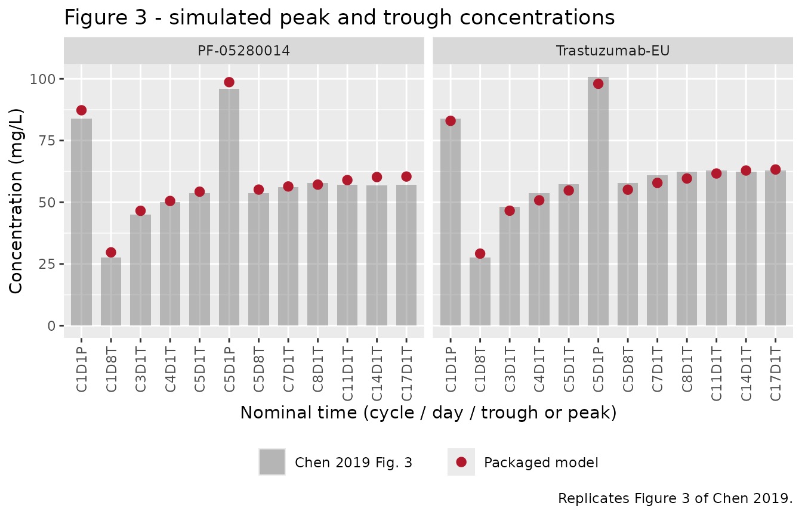

# PF-05280014 biosimilar + reference trastuzumab (Chen 2019)

## Model and source

Chen 2019 is a population PK analysis of the phase III comparative
clinical study NCT01989676, which randomised 707 patients with
HER2-positive metastatic breast cancer to the trastuzumab biosimilar
PF-05280014 (marketed as Trazimera) or to EU-sourced reference
trastuzumab (Herceptin), each combined with paclitaxel. The authors
fitted the two treatment arms as **two separate population PK models**,
specifically so that the structures and parameter estimates could be
compared; nlmixr2lib therefore ships two model files and this single
vignette.

``` r

mod_pf <- readModelDb("Chen_2019_trastuzumab_pf05280014")
mod_eu <- readModelDb("Chen_2019_trastuzumab_reference")
```

- Citation: Chen X, Li C, Ewesuedo R, Yin D. Population pharmacokinetics
  of PF-05280014 (a trastuzumab biosimilar) and reference trastuzumab
  (Herceptin) in patients with HER2-positive metastatic breast cancer.
  Cancer Chemother Pharmacol. 2019;84(1):83-92.
  <doi:10.1007/s00280-019-03850-1>. Correction: Cancer Chemother
  Pharmacol. 2019;84(3):667. <doi:10.1007/s00280-019-03890-7>
  (open-access licence change only; no model value was revised).
  Baseline demographics, including the arm median body weight used here
  as the covariate centering value, are from the companion trial report
  cited as reference 7 by Chen 2019: Pegram MD, Bondarenko I, Zorzetto
  MMC, et al. Br J Cancer. 2019;120(2):172-182.
  <doi:10.1038/s41416-018-0340-2>.
- PF-05280014 model: Two-compartment population PK model with
  first-order linear elimination from the central compartment for
  intravenous PF-05280014, a trastuzumab biosimilar (Trazimera), in
  patients with HER2-positive metastatic breast cancer treated with
  PF-05280014 plus paclitaxel (Chen 2019, NCT01989676). Baseline body
  weight enters clearance and central volume as power terms normalised
  to the 68.2 kg arm median. Inter-individual variability was estimated
  on CL, V1, V2 and Q with a diagonal omega matrix, and the residual
  error is additive on the natural-log scale, i.e. log-normal. Chen 2019
  fitted the biosimilar and the EU-sourced reference product as two
  separate models on the two treatment arms; the companion
  reference-product model is Chen_2019_trastuzumab_reference.
- Reference-product model: Two-compartment population PK model with
  first-order linear elimination from the central compartment for
  intravenous EU-sourced reference trastuzumab (Herceptin), fitted as
  the active comparator arm of a phase III biosimilarity study in
  patients with HER2-positive metastatic breast cancer treated with
  trastuzumab plus paclitaxel (Chen 2019, NCT01989676). Baseline body
  weight enters clearance and central volume as power terms normalised
  to the 66.0 kg arm median. Inter-individual variability was estimated
  on CL, V1, V2 and Q with a diagonal omega matrix, and the residual
  error is additive on the natural-log scale, i.e. log-normal. Chen 2019
  fitted the reference product and the PF-05280014 biosimilar as two
  separate models on the two treatment arms; the companion biosimilar
  model is Chen_2019_trastuzumab_pf05280014.
- Article: <https://doi.org/10.1007/s00280-019-03850-1>
- Correction (open-access licence change only, no model value revised):
  <https://doi.org/10.1007/s00280-019-03890-7>
- Companion trial report (source of the baseline demographics):
  <https://doi.org/10.1038/s41416-018-0340-2>

## Population

Both models were fitted to serum concentration-time data from the same
trial. 702 of the 707 randomised patients received study treatment, and
the PK analysis set comprised 349 PF-05280014 patients and 353
trastuzumab-EU patients with at least one post-dose sample up to and
including cycle 17 day 1 (data cut 24 August 2016). Sampling was sparse
peak-and-trough: pre-dose on day 1 of cycles 1, 3, 4, 5, 7 and 8 and on
day 8 of cycles 1 and 5; end-of-infusion samples 1 h after the end of
infusion on day 1 of cycles 1 and 5; and pre-dose on day 1 every three
cycles thereafter. Concentrations were measured by validated ELISA over
a 0.5-100 mg/L calibration range, 43 of 7098 post-dose samples were
below the LLOQ and excluded (M1), and the data were log-transformed
before fitting in NONMEM 7.2 (FOCE).

Dosing was a 4 mg/kg intravenous loading dose infused over 90 min on
cycle 1 day 1, followed by 2 mg/kg infused over 30-90 min on days 8, 15
and 22 of cycle 1 and on days 1, 8, 15 and 22 of every subsequent 28-day
cycle, until at least week 33.

**Chen 2019 contains no baseline demographics table.** The demographics
below come from Table 1 of the companion trial report (Pegram 2019,
cited as reference 7 by Chen 2019), which describes the 707-patient ITT
population of the same study.

| Characteristic | PF-05280014 (n = 352 ITT) | Trastuzumab-EU (n = 355 ITT) |
|----|----|----|
| Age, median (range), years | 55.0 (19-80) | 54.0 (25-85) |
| Weight, median (range), kg | 68.2 (29-147) | 66.0 (36-139) |
| Weight, mean (SD), kg | 69.1 (17.1) | 68.1 (16.1) |
| White / Asian / Black / Other, % | 65.9 / 29.5 / 1.4 / 3.1 | 68.7 / 23.7 / 2.3 / 5.4 |
| ECOG 0 / 1 / 2, % | 52.8 / 42.6 / 4.5 | 54.6 / 41.1 / 4.2 |
| Japanese patients in the PK analysis, n | 18 | 14 |

The same information is available programmatically from each model’s
`population` metadata,
e.g. `readModelDb("Chen_2019_trastuzumab_pf05280014")()$population`.

## Source trace

The per-parameter origin is recorded as an in-file comment next to each
`ini()` entry in
`inst/modeldb/specificDrugs/Chen_2019_trastuzumab_pf05280014.R` and
`..._reference.R`. The table collects them in one place.

| Equation / parameter | PF-05280014 | Trastuzumab-EU | Source location |
|----|----|----|----|
| `lcl` (CL, L/h) | 0.0104 | 0.00948 | Table 2, row `CL (L/h)`, NONMEM results column |
| `lvc` (V1, L) | 3.15 | 3.10 | Table 2, row `V 1 (L)` |
| `lq` (Q, L/h) | 0.0194 | 0.0186 | Table 2, row `Q (L/h)` |
| `lvp` (V2, L) | 5.55 | 5.66 | Table 2, row `V 2 (L)` |
| `e_wt_cl` | 0.637 | 0.673 | Table 2, row `BWT effect on CL` |
| `e_wt_vc` | 0.507 | 0.512 | Table 2, row `BWT effect on V 1` |
| `etalcl` (variance) | 0.0934 | 0.0687 | Table 2, row `CL omega 2 (%CV)` |
| `etalvc` (variance) | 0.0405 | 0.123 | Table 2, row `V 1 omega 2 (%CV)` |
| `etalq` (variance) | 0.504 | 0.528 | Table 2, row `Q omega 2 (%CV)` |
| `etalvp` (variance) | 1.06 | 1.08 | Table 2, row `V 2 omega 2 (%CV)` |
| `expSd` | 0.5215 = sqrt(0.272) | 0.5404 = sqrt(0.292) | Table 2, row `Res Add Err`, read as a variance; see Errata |
| Covariate equation `TVP = Ppop * (COV/COVmedian)^theta` | on CL and V1 | on CL and V1 | Equation 1, Methods “Covariate evaluations” |
| Two-compartment, first-order elimination, zero-order IV input | n/a | n/a | Results, “Determination of the structural PK model” |
| Diagonal omega, exponential IIV on CL, V1, V2, Q | n/a | n/a | Methods, “Structural PK model and variability models” |
| Log-normal residual (“additive after log-transformation”) | n/a | n/a | Methods, “Structural PK model and variability models” |
| Covariate centering value `COVmedian` (68.2 / 66.0 kg) | 68.2 | 66.0 | **Not in Chen 2019.** Pegram 2019 Table 1, per-arm median weight; see Errata |

## Structural verification

These checks are deterministic: they use typical-value parameters
([`rxode2::zeroRe()`](https://nlmixr2.github.io/rxode2/reference/zeroRe.html)),
so both sides of every comparison use the same numbers and the
tolerances can be tight. They confirm that the packaged model really is
the two-compartment system Chen 2019 describes, with the printed
clearances and volumes.

``` r

ref <- list(
  `PF-05280014` = list(
    mod = mod_pf, wt = 68.2,
    cl = 0.0104, vc = 3.15, q = 0.0194, vp = 5.55, ecl = 0.637, evc = 0.507
  ),
  `Trastuzumab-EU` = list(
    mod = mod_eu, wt = 66.0,
    cl = 0.00948, vc = 3.10, q = 0.0186, vp = 5.66, ecl = 0.673, evc = 0.512
  )
)

# Closed-form two-compartment constant-rate infusion (Gibaldi & Perrier).
biexp_inf <- function(t, dose, tinf, cl, vc, q, vp) {
  kel <- cl / vc
  k12 <- q / vc
  k21 <- q / vp
  s <- kel + k12 + k21
  alpha <- (s + sqrt(s^2 - 4 * kel * k21)) / 2
  beta <- (s - sqrt(s^2 - 4 * kel * k21)) / 2
  rate <- dose / tinf
  aa <- (k21 - alpha) / (vc * alpha * (beta - alpha))
  bb <- (k21 - beta) / (vc * beta * (alpha - beta))
  ifelse(
    t <= tinf,
    rate * (aa * (1 - exp(-alpha * t)) + bb * (1 - exp(-beta * t))),
    rate * (aa * (1 - exp(-alpha * tinf)) * exp(-alpha * (t - tinf)) +
      bb * (1 - exp(-beta * tinf)) * exp(-beta * (t - tinf)))
  )
}

struct <- lapply(names(ref), function(nm) {
  r <- ref[[nm]]
  dose <- 4 * r$wt
  ev <- as.data.frame(
    rxode2::et(amt = dose, dur = 1.5, cmt = "central") |>
      rxode2::et(seq(0, 5000, by = 0.25)) |>
      rxode2::et(id = 1)
  )
  ev$WT <- r$wt
  s <- rxode2::rxSolve(rxode2::zeroRe(rxode2::rxode2(r$mod)), ev,
    omega = NA, returnType = "data.frame"
  )
  s$cf <- biexp_inf(s$time, dose, 1.5, r$cl, r$vc, r$q, r$vp)
  pos <- s$time > 0
  kel <- r$cl / r$vc
  k12 <- r$q / r$vc
  k21 <- r$q / r$vp
  sm <- kel + k12 + k21
  beta <- (sm - sqrt(sm^2 - 4 * kel * k21)) / 2
  data.frame(
    treatment = nm,
    rel_err = max(abs(s$Cc[pos] - s$cf[pos]) / s$cf[pos]),
    t_half_beta_d = log(2) / beta / 24
  )
}) |> bind_rows()
#> ℹ parameter labels from comments will be replaced by 'label()'
#> ℹ parameter labels from comments will be replaced by 'label()'

knitr::kable(
  struct |>
    rename(
      "Treatment" = treatment,
      "Max relative error vs closed form" = rel_err,
      "Terminal half-life (days)" = t_half_beta_d
    ),
  digits = c(0, 12, 1),
  caption = "Packaged model solved against the closed-form biexponential infusion."
)
```

| Treatment      | Max relative error vs closed form | Terminal half-life (days) |
|:---------------|----------------------------------:|--------------------------:|
| PF-05280014    |                          4.03e-10 |                        30 |
| Trastuzumab-EU |                          4.17e-10 |                        33 |

Packaged model solved against the closed-form biexponential infusion.
{.table}

``` r


# The solve must reproduce the closed form essentially exactly -- both sides use
# the same CL / V1 / Q / V2, so any difference is pure numerical error.
stopifnot(all(struct$rel_err < 1e-6))
```

The terminal half-life implied by the printed disposition parameters is
30.0 days for PF-05280014 and 33.0 days for trastuzumab-EU. Chen 2019
does not print a half-life, but both values are consistent with the
approximately 28-day median half-life in the Herceptin product
information the paper cites as reference 1.

The covariate model is Equation 1 of the paper, a power term normalised
to the arm median weight. Re-solving at 50 kg and 100 kg must reproduce
the printed exponents exactly.

``` r

cov_chk <- lapply(names(ref), function(nm) {
  r <- ref[[nm]]
  lapply(c(50, 100), function(w) {
    ev <- as.data.frame(
      rxode2::et(amt = 1, dur = 1.5, cmt = "central") |>
        rxode2::et(c(0, 1)) |>
        rxode2::et(id = 1)
    )
    ev$WT <- w
    p <- rxode2::rxSolve(rxode2::zeroRe(rxode2::rxode2(r$mod)), ev,
      omega = NA, returnType = "data.frame"
    )
    data.frame(
      treatment = nm, WT = w,
      cl_ratio = p$cl[1] / r$cl, cl_expected = (w / r$wt)^r$ecl,
      vc_ratio = p$vc[1] / r$vc, vc_expected = (w / r$wt)^r$evc
    )
  }) |> bind_rows()
}) |> bind_rows()
#> ℹ parameter labels from comments will be replaced by 'label()'
#> ℹ parameter labels from comments will be replaced by 'label()'
#> ℹ parameter labels from comments will be replaced by 'label()'
#> ℹ parameter labels from comments will be replaced by 'label()'

knitr::kable(
  cov_chk |>
    rename(
      "Treatment" = treatment, "Weight (kg)" = WT,
      "CL ratio (solved)" = cl_ratio, "CL ratio (Eq. 1)" = cl_expected,
      "V1 ratio (solved)" = vc_ratio, "V1 ratio (Eq. 1)" = vc_expected
    ),
  digits = 5,
  caption = "Body-weight power model reproduced from the solved model."
)
```

| Treatment | Weight (kg) | CL ratio (solved) | CL ratio (Eq. 1) | V1 ratio (solved) | V1 ratio (Eq. 1) |
|:---|---:|---:|---:|---:|---:|
| PF-05280014 | 50 | 0.82058 | 0.82058 | 0.85438 | 0.85438 |
| PF-05280014 | 100 | 1.27608 | 1.27608 | 1.21415 | 1.21415 |
| Trastuzumab-EU | 50 | 0.82957 | 0.82957 | 0.86749 | 0.86749 |
| Trastuzumab-EU | 100 | 1.32266 | 1.32266 | 1.23707 | 1.23707 |

Body-weight power model reproduced from the solved model. {.table}

``` r


stopifnot(
  max(abs(cov_chk$cl_ratio - cov_chk$cl_expected)) < 1e-10,
  max(abs(cov_chk$vc_ratio - cov_chk$vc_expected)) < 1e-10
)
```

## Virtual cohort

The original observed data are not publicly available. The simulations
below use virtual cohorts of 200 patients per treatment arm whose
baseline body weights reproduce the per-arm median, mean and SD of
Pegram 2019 Table 1 via a truncated log-normal.

``` r

# set.seed() seeds R's RNG (used for the weight draw). rxode2's own simulation
# RNG is partitioned per solver thread, so the etas drawn here differ between a
# 2-core CI runner and a many-thread workstation. Every assertion below is
# therefore written as a bound on a robust summary that must hold for ANY cohort
# the model can produce, not as an exact value from one run.
set.seed(20190503)
rxode2::rxSetSeed(20190503)

n_arm <- 200L
cycle_h <- 28 * 24

draw_weight <- function(n, med, mean_wt, sd_wt, lo, hi) {
  sdlog <- sqrt(log(1 + (sd_wt / mean_wt)^2))
  pmin(pmax(rlnorm(n, log(med), sdlog), lo), hi)
}

cohort <- bind_rows(
  tibble(
    id = seq_len(n_arm), treatment = "PF-05280014",
    WT = draw_weight(n_arm, 68.2, 69.1, 17.1, 29, 147)
  ),
  tibble(
    id = n_arm + seq_len(n_arm), treatment = "Trastuzumab-EU",
    WT = draw_weight(n_arm, 66.0, 68.1, 16.1, 36, 139)
  )
)

knitr::kable(
  cohort |>
    group_by(treatment) |>
    summarise(
      n = n(), median = median(WT), mean = mean(WT), sd = sd(WT),
      min = min(WT), max = max(WT), .groups = "drop"
    ) |>
    rename(
      "Treatment" = treatment, "N" = n, "Median (kg)" = median,
      "Mean (kg)" = mean, "SD (kg)" = sd, "Min (kg)" = min, "Max (kg)" = max
    ),
  digits = 1,
  caption = "Simulated baseline body weight by arm; compare with Pegram 2019 Table 1."
)
```

| Treatment      |   N | Median (kg) | Mean (kg) | SD (kg) | Min (kg) | Max (kg) |
|:---------------|----:|------------:|----------:|--------:|---------:|---------:|
| PF-05280014    | 200 |        67.5 |      70.1 |    17.0 |     32.2 |    126.7 |
| Trastuzumab-EU | 200 |        68.4 |      69.1 |    16.4 |     36.0 |    122.9 |

Simulated baseline body weight by arm; compare with Pegram 2019 Table 1.
{.table}

## Replicate Figure 3

Figure 3 of Chen 2019 plots simulated peak and trough concentrations at
the trial’s nominal sampling times for both treatments. The nominal
times follow the 28-day cycle calendar: `CxDyT` is the pre-dose (trough)
concentration on day `y` of cycle `x`, and `CxDyP` is the concentration
1 h after the end of infusion. The box medians digitised from the
published figure are transcribed below and compared against the packaged
models.

``` r

nominal <- tibble::tribble(
  ~label,   ~nom_time,            ~`PF-05280014`, ~`Trastuzumab-EU`,
  "C1D1P",  1.5 + 1,              83.8,           83.8,
  "C1D8T",  168,                  27.5,           27.5,
  "C3D1T",  2 * cycle_h,          44.9,           48.1,
  "C4D1T",  3 * cycle_h,          50.1,           53.6,
  "C5D1T",  4 * cycle_h,          53.6,           57.4,
  "C5D1P",  4 * cycle_h + 0.5 + 1, 95.9,          100.9,
  "C5D8T",  4 * cycle_h + 168,    53.6,           57.7,
  "C7D1T",  6 * cycle_h,          56.2,           60.9,
  "C8D1T",  7 * cycle_h,          57.7,           62.3,
  "C11D1T", 10 * cycle_h,         57.1,           62.9,
  "C14D1T", 13 * cycle_h,         56.8,           62.3,
  "C17D1T", 16 * cycle_h,         57.1,           62.9
) |>
  # Troughs are pre-dose; sample 0.01 h (36 s) before the infusion starts so the
  # record order is unambiguous. The decay over 36 s is < 0.002%.
  mutate(obs_time = if_else(grepl("T$", label), nom_time - 0.01, nom_time))

dose_times <- seq(0, 17 * cycle_h, by = 168)

make_events <- function(sub) {
  doses <- sub |>
    tidyr::crossing(time = dose_times) |>
    mutate(
      amt = if_else(time == 0, 4 * WT, 2 * WT),
      dur = if_else(time == 0, 1.5, 0.5),
      evid = 1L, cmt = "central"
    )
  obs <- sub |>
    tidyr::crossing(time = nominal$obs_time) |>
    mutate(amt = NA_real_, dur = NA_real_, evid = 0L, cmt = "central")
  bind_rows(doses, obs) |> arrange(id, time, desc(evid))
}

events_f3 <- make_events(cohort)
stopifnot(!anyDuplicated(unique(events_f3[, c("id", "time", "evid")])))
```

``` r

sim_f3 <- bind_rows(
  rxode2::rxSolve(mod_pf,
    events = events_f3 |> filter(treatment == "PF-05280014"),
    keep = c("treatment", "WT"), returnType = "data.frame"
  ),
  rxode2::rxSolve(mod_eu,
    events = events_f3 |> filter(treatment == "Trastuzumab-EU"),
    keep = c("treatment", "WT"), returnType = "data.frame"
  )
)
#> ℹ parameter labels from comments will be replaced by 'label()'
#> ℹ parameter labels from comments will be replaced by 'label()'

# rxSolve returns `Cc` as the individual prediction (no residual error) and
# `sim` as the value carrying residual error. Chen 2019 Figure 3 shows model
# predictions without residual error -- see the Errata for the evidence -- so
# the replication below uses `Cc`. Pin the distinction so it cannot regress.
stopifnot(
  isTRUE(all.equal(sim_f3$Cc, sim_f3$ipredSim)),
  !isTRUE(all.equal(sim_f3$Cc, sim_f3$sim))
)
```

``` r

published <- nominal |>
  select(label, obs_time, `PF-05280014`, `Trastuzumab-EU`) |>
  tidyr::pivot_longer(
    c(`PF-05280014`, `Trastuzumab-EU`),
    names_to = "treatment", values_to = "published"
  )

simulated <- sim_f3 |>
  mutate(obs_time = round(time, 3)) |>
  group_by(treatment, obs_time) |>
  summarise(simulated = median(Cc), .groups = "drop")

f3 <- published |>
  mutate(obs_time = round(obs_time, 3)) |>
  left_join(simulated, by = c("treatment", "obs_time")) |>
  mutate(pct_diff = 100 * (simulated - published) / published)

# Guard against an empty or partial join making every assertion vacuous.
stopifnot(nrow(f3) == 2L * nrow(nominal), !anyNA(f3$simulated))

f3 |>
  mutate(label = factor(label, levels = nominal$label)) |>
  arrange(treatment, label) |>
  select(treatment, label, published, simulated, pct_diff) |>
  rename(
    "Treatment" = treatment, "Nominal time" = label,
    "Chen 2019 Fig. 3 median (mg/L)" = published,
    "Simulated median (mg/L)" = simulated,
    "Difference (%)" = pct_diff
  ) |>
  knitr::kable(
    digits = 1,
    caption = "Simulated cohort medians versus the medians digitised from Chen 2019 Figure 3."
  )
```

| Treatment | Nominal time | Chen 2019 Fig. 3 median (mg/L) | Simulated median (mg/L) | Difference (%) |
|:---|:---|---:|---:|---:|
| PF-05280014 | C1D1P | 83.8 | 87.3 | 4.1 |
| PF-05280014 | C1D8T | 27.5 | 29.7 | 8.0 |
| PF-05280014 | C3D1T | 44.9 | 46.5 | 3.6 |
| PF-05280014 | C4D1T | 50.1 | 50.5 | 0.8 |
| PF-05280014 | C5D1T | 53.6 | 54.3 | 1.3 |
| PF-05280014 | C5D1P | 95.9 | 98.7 | 2.9 |
| PF-05280014 | C5D8T | 53.6 | 55.1 | 2.8 |
| PF-05280014 | C7D1T | 56.2 | 56.4 | 0.3 |
| PF-05280014 | C8D1T | 57.7 | 57.1 | -1.0 |
| PF-05280014 | C11D1T | 57.1 | 59.0 | 3.3 |
| PF-05280014 | C14D1T | 56.8 | 60.2 | 6.0 |
| PF-05280014 | C17D1T | 57.1 | 60.4 | 5.8 |
| Trastuzumab-EU | C1D1P | 83.8 | 83.0 | -1.0 |
| Trastuzumab-EU | C1D8T | 27.5 | 29.2 | 6.1 |
| Trastuzumab-EU | C3D1T | 48.1 | 46.6 | -3.2 |
| Trastuzumab-EU | C4D1T | 53.6 | 50.8 | -5.2 |
| Trastuzumab-EU | C5D1T | 57.4 | 54.8 | -4.6 |
| Trastuzumab-EU | C5D1P | 100.9 | 98.0 | -2.9 |
| Trastuzumab-EU | C5D8T | 57.7 | 55.1 | -4.5 |
| Trastuzumab-EU | C7D1T | 60.9 | 57.8 | -5.0 |
| Trastuzumab-EU | C8D1T | 62.3 | 59.6 | -4.3 |
| Trastuzumab-EU | C11D1T | 62.9 | 61.6 | -2.0 |
| Trastuzumab-EU | C14D1T | 62.3 | 62.9 | 0.9 |
| Trastuzumab-EU | C17D1T | 62.9 | 63.3 | 0.6 |

Simulated cohort medians versus the medians digitised from Chen 2019
Figure 3. {.table}

``` r

f3 |>
  mutate(label = factor(label, levels = nominal$label)) |>
  ggplot(aes(x = label)) +
  geom_col(aes(y = published, fill = "Chen 2019 Fig. 3"),
    alpha = 0.45, width = 0.7
  ) +
  geom_point(aes(y = simulated, colour = "Packaged model"), size = 2.4) +
  facet_wrap(~treatment) +
  scale_fill_manual(values = c("Chen 2019 Fig. 3" = "grey45")) +
  scale_colour_manual(values = c("Packaged model" = "#B2182B")) +
  labs(
    x = "Nominal time (cycle / day / trough or peak)", y = "Concentration (mg/L)",
    fill = NULL, colour = NULL,
    title = "Figure 3 - simulated peak and trough concentrations",
    caption = "Replicates Figure 3 of Chen 2019."
  ) +
  theme(
    legend.position = "bottom",
    axis.text.x = element_text(angle = 90, vjust = 0.5, hjust = 1)
  )
```



``` r

gate <- f3 |>
  group_by(treatment) |>
  summarise(
    median_pct = median(pct_diff),
    q90_abs_pct = quantile(abs(pct_diff), 0.9),
    max_abs_pct = max(abs(pct_diff)),
    .groups = "drop"
  )

knitr::kable(
  gate |>
    rename(
      "Treatment" = treatment, "Median difference (%)" = median_pct,
      "90th percentile |difference| (%)" = q90_abs_pct,
      "Max |difference| (%)" = max_abs_pct
    ),
  digits = 2,
  caption = "Agreement with Chen 2019 Figure 3 across the 12 nominal sampling times."
)
```

| Treatment | Median difference (%) | 90th percentile \|difference\| (%) | Max \|difference\| (%) |
|:---|---:|---:|---:|
| PF-05280014 | 3.08 | 5.97 | 8.00 |
| Trastuzumab-EU | -3.02 | 5.23 | 6.14 |

Agreement with Chen 2019 Figure 3 across the 12 nominal sampling times.
{.table}

``` r


# Structural gate: a mis-transcribed clearance, volume, covariate exponent or
# centering weight moves the whole series by tens of percent. Envelope gate:
# robust to which subjects land in the tails of the weight and eta draws.
# Observed on the authoring run: median +3.1% / -3.0%, q90 6.0% / 5.2%. The
# bounds sit well outside that range on purpose -- do not tighten them back,
# because the cohort is redrawn on every machine (see the cohort chunk) and
# because the published medians are digitised from a printed figure.
stopifnot(
  all(abs(gate$median_pct) < 10),
  all(gate$q90_abs_pct < 15)
)
```

## PKNCA validation

Chen 2019 reports no non-compartmental analysis – the paper’s own
Discussion notes that sparse peak-and-trough sampling in a comparative
clinical study makes NCA infeasible, which is why population PK was used
instead. There is therefore no published NCA table to compare against.
PKNCA is used here for two purposes that do not require one: to recover
the dose through the clearance (`CL * AUCinf = Dose`, an identity that a
mis-scaled volume or a wrong infusion encoding breaks), and to quantify
the paper’s central qualitative claim that the two products have similar
exposure.

A single 4 mg/kg intravenous dose is simulated over a common weight
cohort so the two products are compared on identical patients.

``` r

common_wt <- draw_weight(n_arm, 67.0, 68.6, 16.6, 29, 147)

nca_cohort <- bind_rows(
  tibble(id = seq_len(n_arm), treatment = "PF-05280014", WT = common_wt),
  tibble(id = n_arm + seq_len(n_arm), treatment = "Trastuzumab-EU", WT = common_wt)
)

# A log-spaced early grid is required, not cosmetic: IIV on V2 is very large
# (variance 1.06), so a coarse early grid biases the distribution-phase
# trapezoids and breaks the CL * AUCinf = Dose identity for the extreme
# subjects. The tail runs to 3360 h, about 4.5 terminal half-lives.
nca_times <- unique(c(
  0, exp(seq(log(0.01), log(2), length.out = 25)),
  seq(2.5, 24, by = 0.5), seq(30, 168, by = 6), seq(192, 3360, by = 24)
))

events_nca <- bind_rows(
  nca_cohort |> mutate(time = 0, amt = 4 * WT, dur = 1.5, evid = 1L, cmt = "central"),
  nca_cohort |>
    tidyr::crossing(time = nca_times) |>
    mutate(amt = NA_real_, dur = NA_real_, evid = 0L, cmt = "central")
) |>
  arrange(id, time, desc(evid))

sim_nca_raw <- bind_rows(
  rxode2::rxSolve(mod_pf,
    events = events_nca |> filter(treatment == "PF-05280014"),
    keep = c("treatment", "WT"), returnType = "data.frame"
  ),
  rxode2::rxSolve(mod_eu,
    events = events_nca |> filter(treatment == "Trastuzumab-EU"),
    keep = c("treatment", "WT"), returnType = "data.frame"
  )
)
stopifnot("id" %in% names(sim_nca_raw), nrow(sim_nca_raw) > 0)
```

``` r

# Filter on !is.na(Cc) only. Adding time > 0 or Cc > 0 would drop the time-zero
# record PKNCA needs to anchor AUC0-*.
sim_nca <- sim_nca_raw |>
  filter(!is.na(Cc)) |>
  select(id, time, Cc, treatment)

sim_nca <- bind_rows(
  sim_nca,
  sim_nca |> distinct(id, treatment) |> mutate(time = 0, Cc = 0)
) |>
  distinct(id, treatment, time, .keep_all = TRUE) |>
  arrange(id, treatment, time)

conc_obj <- PKNCA::PKNCAconc(as.data.frame(sim_nca), Cc ~ time | treatment + id)

dose_df <- events_nca |>
  filter(evid == 1) |>
  select(id, time, amt, treatment)
dose_obj <- PKNCA::PKNCAdose(as.data.frame(dose_df), amt ~ time | treatment + id)

intervals <- data.frame(
  start = 0, end = Inf,
  cmax = TRUE, tmax = TRUE, auclast = TRUE, aucinf.obs = TRUE, half.life = TRUE
)

nca_res <- PKNCA::pk.nca(PKNCA::PKNCAdata(conc_obj, dose_obj, intervals = intervals))

nca_wide <- as.data.frame(nca_res) |>
  select(treatment, id, PPTESTCD, PPORRES) |>
  tidyr::pivot_wider(names_from = PPTESTCD, values_from = PPORRES)
stopifnot(nrow(nca_wide) == 2L * n_arm)
```

``` r

nca_wide |>
  group_by(treatment) |>
  summarise(
    cmax = median(cmax), tmax = median(tmax),
    aucinf = median(aucinf.obs), thalf_d = median(half.life) / 24,
    .groups = "drop"
  ) |>
  rename(
    "Treatment" = treatment,
    "Cmax (mg/L)" = cmax,
    "Tmax (h)" = tmax,
    "AUC0-inf (mg*h/L)" = aucinf,
    "t1/2 (days)" = thalf_d
  ) |>
  knitr::kable(
    digits = c(0, 1, 2, 0, 1),
    caption = "Median simulated single-dose NCA after 4 mg/kg IV over 90 min."
  )
```

| Treatment      | Cmax (mg/L) | Tmax (h) | AUC0-inf (mg\*h/L) | t1/2 (days) |
|:---------------|------------:|---------:|-------------------:|------------:|
| PF-05280014    |        84.3 |      1.6 |              25212 |        28.5 |
| Trastuzumab-EU |        84.5 |      1.6 |              27862 |        38.8 |

Median simulated single-dose NCA after 4 mg/kg IV over 90 min. {.table}

The NCA half-life above is a **cohort median of per-subject estimates**,
not the typical-value half-life. The two differ because inter-individual
variability on the peripheral volume is very large (variance 1.06 and
1.08, i.e. roughly 100% CV), which spreads the terminal slope widely and
skews the per-subject distribution. The typical-value terminal
half-lives are the 30.0 and 33.0 days computed analytically in the
structural verification above; those are the values to compare against
any published figure.

### Dose recovery through clearance

``` r

recov <- sim_nca_raw |>
  group_by(treatment, id) |>
  summarise(cl = first(cl), WT = first(WT), .groups = "drop") |>
  left_join(nca_wide |> select(treatment, id, aucinf.obs), by = c("treatment", "id")) |>
  mutate(recovery = cl * aucinf.obs / (4 * WT))

knitr::kable(
  recov |>
    group_by(treatment) |>
    summarise(
      median = median(recovery),
      q05 = quantile(recovery, 0.05), q95 = quantile(recovery, 0.95),
      .groups = "drop"
    ) |>
    rename(
      "Treatment" = treatment, "Median CL*AUCinf/Dose" = median,
      "5th percentile" = q05, "95th percentile" = q95
    ),
  digits = 4,
  caption = "Mass-balance identity CL * AUC0-inf = Dose, per subject."
)
```

| Treatment      | Median CL\*AUCinf/Dose | 5th percentile | 95th percentile |
|:---------------|-----------------------:|---------------:|----------------:|
| PF-05280014    |                 1.0000 |         0.9981 |          1.0001 |
| Trastuzumab-EU |                 0.9998 |         0.9968 |          1.0001 |

Mass-balance identity CL \* AUC0-inf = Dose, per subject. {.table}

``` r


# The identity is exact for the true model; the residual gap is trapezoidal and
# extrapolation error only, so the bound is tight.
stopifnot(
  all(abs(recov$recovery - 1) < 0.03),
  abs(median(recov$recovery) - 1) < 0.005
)
```

### Exposure comparison between the two products

Chen 2019 concludes that “the PK of PF-05280014 and trastuzumab-EU are
similar in patients with HER2-positive mBC”. Dosing both models on the
same weight cohort turns that qualitative statement into a
geometric-mean ratio. The conventional 80-125% bioequivalence window is
used as a quantitative rendering of the paper’s claim; Chen 2019 itself
states no numerical similarity criterion for this population PK
comparison.

``` r

gm <- function(x) exp(mean(log(x)))

gmr <- nca_wide |>
  group_by(treatment) |>
  summarise(cmax = gm(cmax), aucinf = gm(aucinf.obs), .groups = "drop")

ratios <- tibble(
  Parameter = c("Cmax", "AUC0-inf"),
  `GMR (PF-05280014 / Trastuzumab-EU)` = c(
    gmr$cmax[gmr$treatment == "PF-05280014"] / gmr$cmax[gmr$treatment == "Trastuzumab-EU"],
    gmr$aucinf[gmr$treatment == "PF-05280014"] / gmr$aucinf[gmr$treatment == "Trastuzumab-EU"]
  )
)

knitr::kable(
  ratios,
  digits = 3,
  caption = "Geometric mean ratio of single-dose exposure on a common weight cohort."
)
```

| Parameter | GMR (PF-05280014 / Trastuzumab-EU) |
|:----------|-----------------------------------:|
| Cmax      |                              1.018 |
| AUC0-inf  |                              0.911 |

Geometric mean ratio of single-dose exposure on a common weight cohort.
{.table}

``` r


stopifnot(all(ratios[[2]] > 0.80, ratios[[2]] < 1.25))
```

### Residual-error scale

The residual error is log-normal. `rxSolve` returns `Cc` without
residual error and `sim` with it, so the SD of `log(sim / Cc)` recovers
the `expSd` entered in `ini()`. This is the mechanical check that the
`Res Add Err` value in Table 2 was read on the right scale (see Errata).

``` r

res_chk <- sim_f3 |>
  group_by(treatment) |>
  summarise(observed_sd = sd(log(sim / Cc)), .groups = "drop") |>
  mutate(entered_sd = c(0.5215, 0.5404)[match(treatment, c("PF-05280014", "Trastuzumab-EU"))]) |>
  mutate(pct_diff = 100 * (observed_sd - entered_sd) / entered_sd)

knitr::kable(
  res_chk |>
    rename(
      "Treatment" = treatment, "SD of log(sim/Cc)" = observed_sd,
      "expSd in ini()" = entered_sd, "Difference (%)" = pct_diff
    ),
  digits = c(0, 4, 4, 2),
  caption = "Recovered log-normal residual SD versus the value entered in ini()."
)
```

| Treatment      | SD of log(sim/Cc) | expSd in ini() | Difference (%) |
|:---------------|------------------:|---------------:|---------------:|
| PF-05280014    |            0.5163 |         0.5215 |          -0.99 |
| Trastuzumab-EU |            0.5436 |         0.5404 |           0.59 |

Recovered log-normal residual SD versus the value entered in ini().
{.table}

``` r


stopifnot(all(abs(res_chk$pct_diff) < 10))
```

## Assumptions and deviations

- **The covariate centering weight is not in Chen 2019, and is taken
  from the companion trial report.** Equation 1 normalises body weight
  to `COVmedian`, but the paper never prints that median and contains no
  demographics table at all. The 68.2 kg (PF-05280014) and 66.0 kg
  (trastuzumab-EU) used here are the per-arm median weights of Table 1
  of Pegram 2019 (Br J Cancer 120:172-182,
  <doi:10.1038/s41416-018-0340-2>), the report of the same trial that
  Chen 2019 cites as reference 7 and points to for the treatment
  details. The arms were fitted separately, so each is normalised to its
  own median. Independent corroboration: with these weights, the cycle-1
  day-1 peak of Fig. 3 (`4 mg/kg * 68.2 kg / 3.15 L`, and
  `4 mg/kg * 66.0 kg / 3.10 L`) predicts approximately 85 mg/L against
  the digitised median of 83.8 mg/L for both arms, and the full 12-point
  Figure 3 series agrees to within 8% everywhere. A user with a
  different centering value in mind can override it by editing the two
  `(WT / 68.2)` and `(WT / 66.0)` terms in `model()`.

- **`Res Add Err` in Table 2 is read as a variance, not an SD.** The row
  is printed as a bare number with no `omega 2` or `sigma 2` marker, so
  the scale is ambiguous on the page. It is the NONMEM `$SIGMA`
  variance, hence `expSd = sqrt(0.272) = 0.5215` and
  `sqrt(0.292) = 0.5404`. Three independent lines of evidence:

  1.  *The figure settles it.* Fig. 1a and 1b plot log-observed against
      log-individual-predicted concentration, which is a direct picture
      of this residual. Digitising the scatter against the printed axes
      gives a 2.5th-to-97.5th-percentile residual span of about +/- 1.2
      natural-log units in both panels. Reading 0.272 as a variance
      predicts +/- 1.02 and +/- 1.06; reading it as an SD predicts only
      +/- 0.53 and +/- 0.57, about half the observed spread.
  2.  The column is headed “NONMEM results Estimate”, and NONMEM reports
      `$SIGMA` on the variance scale. Every other variance component in
      the same table is likewise a variance – each `omega 2` row’s
      parenthesised percentage is exactly its own square root
      (`sqrt(0.0934) = 31%`, and so on for all eight rows).
  3.  The relative standard error implied by the printed confidence
      interval (the table footnote gives it as estimate +/- 1.96 x SE)
      is 5.4% and 7.5%. For a variance those imply a few hundred
      effective observations, which is consistent with 7098 correlated
      peak-and-trough samples in 702 patients; read as an SD they would
      imply fewer independent observations than there are patients.

- **Chen 2019 Figure 3 shows predictions without residual error.** The
  box widths are the discriminator: at the cycle-1 day-1 peak the
  trastuzumab-EU box is 1.80 times wider on the log scale than the
  PF-05280014 box, and the ratio of the two arms’ V1 IIV standard
  deviations is `sqrt(0.123) / sqrt(0.0405) = 1.75`. Adding a residual
  of SD 0.52 to both would make the boxes nearly equal and far wider
  than either. The Figure 3 replication above therefore compares against
  `Cc` (the individual prediction) rather than `sim`.

- **Both digitised series come from the published figure, not from a
  table.** The 24 medians transcribed in the Figure 3 chunk were
  measured from the box midlines of the published panel against its
  printed axis, which is why the agreement gate is an envelope on robust
  summaries rather than a tight bound.

- **Nominal dosing schedule.** The replication doses 4 mg/kg once, then
  2 mg/kg every 168 h on the nominal cycle calendar, throughout. Chen
  2019 simulated the observed data structure, which includes real dose
  delays and omissions, and the protocol allowed a switch to 6 mg/kg
  every 3 weeks at investigator discretion from no earlier than week 33.
  The packaged simulation makes neither adjustment, which is the most
  likely source of the small residual bias in the later-cycle troughs.

- **Infusion durations.** The loading dose is infused over 90 min as
  specified. Maintenance doses are specified as “30-90 min, depending on
  tolerability”; 30 min is used. Because the peak samples are drawn 1 h
  after the *end* of infusion, the choice shifts the simulated peak by
  well under 1%.

- **Sex is assumed 100% female.** Pegram 2019 Table 1 does not tabulate
  sex. Metastatic breast cancer is overwhelmingly a disease of women,
  and sex was not a covariate in either model, so `sex_female_pct = 100`
  in the `population` metadata is an assumption rather than a reported
  figure.

- **Covariates screened but not retained.** Baseline circulating HER2
  extracellular domain, Japanese ethnicity, Asian race, baseline ADA
  status, ECOG status and the number of metastatic sites were all tested
  on CL and V1 and none was retained. They are documented in each
  model’s `covariatesDataExcluded` metadata rather than `covariateData`,
  because they are not referenced in `model()`. Chen 2019 attributes the
  difference from the earlier trastuzumab population PK analysis of
  Bruno 2005 – which did retain the number of metastatic sites and
  baseline HER2 ECD on clearance – to its more stringent
  backward-elimination criterion (p \< 0.001 rather than p \< 0.005).
  That earlier model is packaged as
  `modellib("Bruno_2005_trastuzumab")`, and its body-weight exponent on
  central volume, 0.556, is the value Chen 2019 cites in its Discussion
  alongside its own 0.507 and 0.512.

- **The correction notice is not an erratum to the science.** Chen 2019
  carries a correction (Cancer Chemother Pharmacol 2019;84(3):667,
  <doi:10.1007/s00280-019-03890-7>). It records only the article’s
  change to open access on 15 June 2019; no parameter, equation or
  figure was revised.
