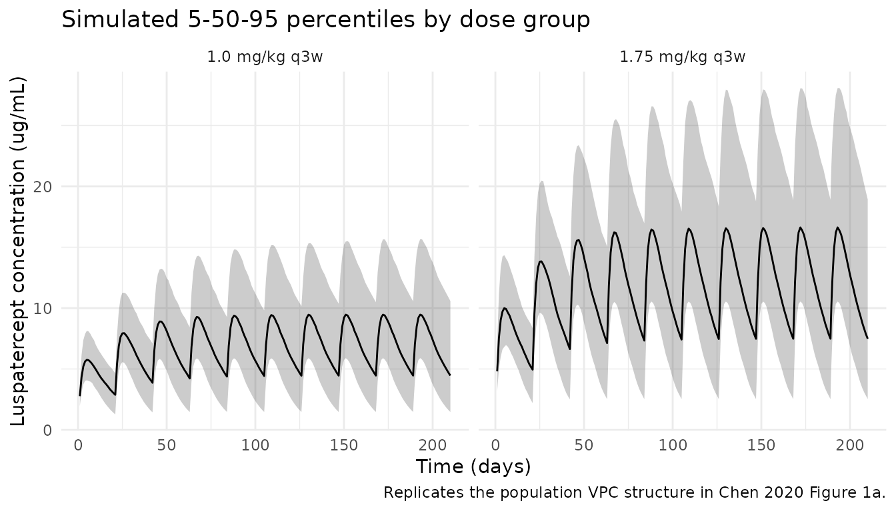

# Chen_2020_luspatercept

## Model and source

- Citation: Chen N, Kassir N, Laadem A, Giuseppi AC, Shetty JK, Maxwell
  SE, Sriraman P, Ritland S, Linde PG, Budda B, Reynolds J, Ramji P,
  Palmisano M, Zhou S. Population Pharmacokinetics and Exposure-Response
  of Luspatercept, an Erythroid Maturation Agent, in Anemic Patients
  With Myelodysplastic Syndromes. CPT Pharmacometrics Syst Pharmacol.
  2020 Oct;9(10):395-404. <doi:10.1002/psp4.12515>
- Description: One-compartment population PK model for luspatercept
  (activin receptor type IIB / IgG1 Fc-fusion) in adults with anemia due
  to myelodysplastic syndromes (Chen 2020), with first-order
  subcutaneous absorption, first-order linear elimination parameterised
  in CL/F and V1/F, body weight + age + baseline albumin power
  covariates on CL/F, and body weight + baseline albumin power
  covariates on V1/F.
- Article: [CPT Pharmacometrics Syst Pharmacol.
  2020;9(10):395-404](https://doi.org/10.1002/psp4.12515)

## Population

The Chen 2020 population PK analysis pooled 260 adult patients with
anemia due to lower-risk myelodysplastic syndromes (MDS) from two
studies: the phase II A536-03 (“PACE-MDS”, NCT01749514, n = 107) and the
pivotal phase III ACE-536-MDS-001 (“MEDALIST”, NCT02631070, n = 153).
All patients received luspatercept subcutaneously every 3 weeks (q3w) at
doses ranging from 0.125 to 1.75 mg/kg. Most patients (91.0%) started at
1.0 mg/kg with stepwise titration to 1.33 or 1.75 mg/kg as needed for
inadequate hemoglobin response or persistent transfusion need.

Baseline demographics (Chen 2020 Table 1): 38.8% female; median age 72
years (range 27-95); median weight 76.3 kg (range 46-124); 82.3% White;
median baseline albumin 44 g/L (range 31.0-52.6); median eGFR 73.1
mL/min/1.73 m^2 (range 29.6-150). 26.9% had no renal impairment, 51.5%
mild, and 21.5% moderate; 59.2% had no hepatic impairment, 31.5% mild,
8.8% moderate, and 0.4% severe. 38.5% received concurrent iron chelation
therapy. 2,403 quantifiable luspatercept concentrations were collected
4-784 days after the first dose using a validated ELISA with assay range
50-600 ng/mL.

The same information is available programmatically via
`readModelDb("Chen_2020_luspatercept")$population`.

## Source trace

Per-parameter origin is recorded as an in-file comment next to each
[`ini()`](https://nlmixr2.github.io/rxode2/reference/ini.html) entry in
`inst/modeldb/specificDrugs/Chen_2020_luspatercept.R`. The table below
collects them for review.

| Equation / parameter         | Value                                                | Source location                                                         |
|------------------------------|------------------------------------------------------|-------------------------------------------------------------------------|
| Structural model             | 1-compartment, first-order absorption + elimination  | Results “Luspatercept population PK model”                              |
| `lcl` (CL/F)                 | `log(0.469)` L/day                                   | Table 2, “CL/F, L/day”                                                  |
| `lvc` (V1/F)                 | `log(9.22)` L                                        | Table 2, “V1/F, L”                                                      |
| `lka` (Ka)                   | `log(0.456)` 1/day                                   | Table 2, “Ka, 1/day”                                                    |
| `e_wt_cl`                    | `0.769`                                              | Table 2, “Weight, kg, on CL/F”                                          |
| `e_age_cl`                   | `-0.534`                                             | Table 2, “Age, years, on CL/F”                                          |
| `e_alb_cl`                   | `-1.17`                                              | Table 2, “Albumin, g/L, on CL/F”                                        |
| `e_wt_vc`                    | `0.877`                                              | Table 2, “Weight, kg, on V1/F”                                          |
| `e_alb_vc`                   | `-0.610`                                             | Table 2, “Albumin, g/L, on V1/F”                                        |
| Final CL/F equation          | `0.469*(WT/70)^0.769*(AGE/72)^-0.534*(ALB/44)^-1.17` | Results, “The final covariate model for CL/F”                           |
| Final V1/F equation          | `9.22*(WT/70)^0.877*(ALB/44)^-0.610`                 | Results, “The final covariate model for V1/F”                           |
| `etalcl` (IIV CL/F)          | variance `0.1325` (sqrt = 36.4%)                     | Table 2, “Interindividual variability of CL/F”                          |
| `etalvc` (IIV V1/F)          | variance `0.0506` (sqrt = 22.5%)                     | Table 2, “Interindividual variability of V1/F”                          |
| `propSd` (residual)          | `0.224`                                              | Table 2, “Residual variability” (log-additive in NONMEM, 22.4%)         |
| Mean t1/2                    | ~13 days                                             | Results, “The mean elimination half-life of luspatercept was ~ 13 days” |
| Mean AUC_ss (1.0-1.75 mg/kg) | 151-264 day\*ug/mL                                   | Results, end of “Exposure-response of efficacy” paragraph 2             |
| AUC_ss IIV                   | 38.0%                                                | Results, “The IIV for AUC ss was 38.0%”                                 |

## Virtual cohort

Original observed data are not publicly available. The cohort below
approximates the Chen 2020 Table 1 demographics: weight, age, and
baseline albumin sampled from log-normal-like distributions matched to
the published medians and ranges, sex sampled at the published 38.8%
female prevalence.

``` r
set.seed(20260425)
n_subj <- 500

# Truncated-normal-style sampler that approximates a population with a given
# median and a published min-max range. Bounded so simulated subjects sit
# inside the trial inclusion envelope.
sample_in_range <- function(n, median, lo, hi, sd) {
  out <- rnorm(n, mean = median, sd = sd)
  pmin(pmax(out, lo), hi)
}

cohort <- tibble::tibble(
  id   = seq_len(n_subj),
  WT   = sample_in_range(n_subj, median = 76.3, lo = 46,   hi = 124,  sd = 17),
  AGE  = sample_in_range(n_subj, median = 72,   lo = 27,   hi = 95,   sd = 9),
  ALB  = sample_in_range(n_subj, median = 44,   lo = 31,   hi = 52.6, sd = 4),
  SEXF = rbinom(n_subj, 1, prob = 0.388)
)

# Two dose groups bracketing the recommended titration range (1.0 mg/kg
# starting and 1.75 mg/kg maximum). Chen 2020 reports mean AUC_ss between
# 151 day*ug/mL (at 1.0 mg/kg) and 264 day*ug/mL (at 1.75 mg/kg).
build_events <- function(cohort, dose_mgkg, n_doses = 10, tau = 21,
                         id_offset = 0L, label) {
  base <- dplyr::mutate(cohort, id = id + id_offset)
  obs_times <- sort(unique(c(seq(0, n_doses * tau, by = 1),
                             (n_doses - 1) * tau + c(0.25, 0.5, 1, 2, 3, 5, 7, 10, 14, 17, 21))))
  doses <- base |>
    tidyr::crossing(time = seq(0, by = tau, length.out = n_doses)) |>
    dplyr::mutate(amt = WT * dose_mgkg, cmt = "depot", evid = 1L,
                  treatment = label)
  obs <- base |>
    tidyr::crossing(time = obs_times) |>
    dplyr::mutate(amt = 0, cmt = NA_character_, evid = 0L,
                  treatment = label)
  dplyr::bind_rows(doses, obs) |>
    dplyr::arrange(id, time, dplyr::desc(evid)) |>
    dplyr::select(id, time, amt, cmt, evid, WT, AGE, ALB, SEXF, treatment)
}

events <- dplyr::bind_rows(
  build_events(cohort, dose_mgkg = 1.00, id_offset =     0L, label = "1.0 mg/kg q3w"),
  build_events(cohort, dose_mgkg = 1.75, id_offset = 1000L, label = "1.75 mg/kg q3w")
)

stopifnot(!anyDuplicated(unique(events[, c("id", "time", "evid")])))
```

## Simulation

``` r
mod <- rxode2::rxode2(readModelDb("Chen_2020_luspatercept"))
sim <- rxode2::rxSolve(mod, events = events,
                       keep = c("WT", "AGE", "ALB", "SEXF", "treatment"))
```

For deterministic replication of typical-subject behaviour (no
between-subject variability), zero out the random effects:

``` r
mod_typical <- mod |> rxode2::zeroRe()

# Reference subject from Chen 2020: 70 kg, 72 yr, 44 g/L albumin.
typical_scenarios <- tibble::tibble(
  id = c(1L, 2L),
  scenario = c("Reference 70 kg @ 1.0 mg/kg", "Reference 70 kg @ 1.75 mg/kg"),
  WT = 70, AGE = 72, ALB = 44, SEXF = 0L,
  dose_mg = c(70 * 1.00, 70 * 1.75)
)

ev_typical <- do.call(rbind, lapply(seq_len(nrow(typical_scenarios)), function(i) {
  ev_i <- rxode2::et(amt = typical_scenarios$dose_mg[i], cmt = "depot",
                     ii = 21, addl = 9) |>
    rxode2::et(seq(0, 210, by = 0.5)) |>
    as.data.frame()
  ev_i$id <- typical_scenarios$id[i]
  ev_i
}))

sim_typical <- rxode2::rxSolve(
  mod_typical, events = ev_typical,
  params = typical_scenarios[, c("id", "WT", "AGE", "ALB", "SEXF")],
  returnType = "tibble"
) |>
  dplyr::left_join(typical_scenarios[, c("id", "scenario")], by = "id")
#> ℹ omega/sigma items treated as zero: 'etalcl', 'etalvc'
#> Warning: multi-subject simulation without without 'omega'
```

## Replicate published figures

### Figure 1a — visual predictive check by dose group

Chen 2020 Figure 1a is a population VPC of luspatercept serum
concentration over time. The simulated cohort below summarises the 5th,
50th, and 95th percentiles of concentration through 10 q3w doses (the
treatment window evaluated in the paper for the primary efficacy
endpoint, weeks 1-24).

``` r
sim |>
  dplyr::filter(!is.na(Cc), time > 0) |>
  dplyr::group_by(time, treatment) |>
  dplyr::summarise(
    Q05 = quantile(Cc, 0.05, na.rm = TRUE),
    Q50 = quantile(Cc, 0.50, na.rm = TRUE),
    Q95 = quantile(Cc, 0.95, na.rm = TRUE),
    .groups = "drop"
  ) |>
  ggplot(aes(time, Q50)) +
  geom_ribbon(aes(ymin = Q05, ymax = Q95), alpha = 0.25) +
  geom_line() +
  facet_wrap(~treatment) +
  labs(x = "Time (days)", y = "Luspatercept concentration (ug/mL)",
       title = "Simulated 5-50-95 percentiles by dose group",
       caption = "Replicates the population VPC structure in Chen 2020 Figure 1a.") +
  theme_minimal()
```



### Figure 1b — clinical relevance of covariates on AUC_ss

Chen 2020 Figure 1b reports the percentage difference in AUC_ss /
Cmax_ss at extreme covariate values relative to “normal” (10th-90th
percentile) covariate values. Body weight + 1.0 mg/kg weight-based
dosing produces a \< 10% AUC_ss difference between heavy and light
patients, while age and albumin produce \< 20% AUC_ss differences. The
chunk below reproduces this sensitivity using simulated typical-subject
AUC_ss across covariate extremes (weight 46-124 kg, age 27-95 years,
albumin 31-53 g/L).

``` r
cov_grid <- tibble::tibble(
  scenario = c("WT low (46 kg)", "WT high (124 kg)",
               "AGE low (27 yr)", "AGE high (95 yr)",
               "ALB low (31 g/L)", "ALB high (53 g/L)",
               "Reference (76.3 kg, 72 yr, 44 g/L)"),
  WT  = c(46, 124, 76.3, 76.3, 76.3, 76.3, 76.3),
  AGE = c(72, 72,    27,   95, 72,   72,   72),
  ALB = c(44, 44,    44,   44, 31,   53,   44),
  SEXF = 0L
) |>
  dplyr::mutate(
    id = dplyr::row_number(),
    dose_mg = WT * 1.0,
    # CL/F at the simulated covariate combination per Chen 2020 Results equation
    cl_pred = 0.469 * (WT/70)^0.769 * (AGE/72)^(-0.534) * (ALB/44)^(-1.17),
    aucss_pred = dose_mg / cl_pred  # day*ug/mL over a 21-day interval
  )
ref_aucss <- cov_grid$aucss_pred[cov_grid$scenario == "Reference (76.3 kg, 72 yr, 44 g/L)"]
cov_grid |>
  dplyr::mutate(pct_diff = 100 * (aucss_pred - ref_aucss) / ref_aucss) |>
  knitr::kable(digits = 2,
    caption = "Predicted AUC_ss across covariate extremes vs. the reference subject (replicates the structure of Chen 2020 Figure 1b for AUC_ss only).")
```

| scenario                           |    WT | AGE | ALB | SEXF |  id | dose_mg | cl_pred | aucss_pred | pct_diff |
|:-----------------------------------|------:|----:|----:|-----:|----:|--------:|--------:|-----------:|---------:|
| WT low (46 kg)                     |  46.0 |  72 |  44 |    0 |   1 |    46.0 |    0.34 |     135.46 |   -11.03 |
| WT high (124 kg)                   | 124.0 |  72 |  44 |    0 |   2 |   124.0 |    0.73 |     170.33 |    11.87 |
| AGE low (27 yr)                    |  76.3 |  27 |  44 |    0 |   3 |    76.3 |    0.85 |      90.18 |   -40.77 |
| AGE high (95 yr)                   |  76.3 |  95 |  44 |    0 |   4 |    76.3 |    0.43 |     176.55 |    15.95 |
| ALB low (31 g/L)                   |  76.3 |  72 |  31 |    0 |   5 |    76.3 |    0.75 |     101.07 |   -33.62 |
| ALB high (53 g/L)                  |  76.3 |  72 |  53 |    0 |   6 |    76.3 |    0.40 |     189.29 |    24.33 |
| Reference (76.3 kg, 72 yr, 44 g/L) |  76.3 |  72 |  44 |    0 |   7 |    76.3 |    0.50 |     152.25 |     0.00 |

Predicted AUC_ss across covariate extremes vs. the reference subject
(replicates the structure of Chen 2020 Figure 1b for AUC_ss only).

## PKNCA validation

Compute Cmax, Tmax, AUC over the last (steady-state) dosing interval,
and terminal half-life using `PKNCA`. Stratify by dose group so results
can be compared against the paper’s reported AUC_ss range and ~13-day
half-life.

``` r
# Restrict to the last (10th) dosing interval as the steady-state interval.
ss_start <- 9 * 21    # day 189
ss_end   <- 10 * 21   # day 210

sim_nca <- sim |>
  dplyr::filter(!is.na(Cc), time >= ss_start, time <= ss_end) |>
  dplyr::mutate(time_ss = time - ss_start) |>
  dplyr::select(id, time_ss, Cc, treatment)

conc_obj <- PKNCA::PKNCAconc(sim_nca, Cc ~ time_ss | treatment + id)

dose_df <- events |>
  dplyr::filter(evid == 1, time == ss_start) |>
  dplyr::mutate(time_ss = 0) |>
  dplyr::select(id, time_ss, amt, treatment)

dose_obj <- PKNCA::PKNCAdose(dose_df, amt ~ time_ss | treatment + id)

intervals <- data.frame(
  start      = 0,
  end        = 21,
  cmax       = TRUE,
  tmax       = TRUE,
  auclast    = TRUE,
  half.life  = TRUE
)

nca_res <- PKNCA::pk.nca(PKNCA::PKNCAdata(conc_obj, dose_obj, intervals = intervals))
#>  ■■■■■                             13% |  ETA: 14s
#>  ■■■■■■■■■■■                       34% |  ETA: 10s
#>  ■■■■■■■■■■■■■■■■■                 55% |  ETA:  7s
#>  ■■■■■■■■■■■■■■■■■■■■■■■           74% |  ETA:  4s
#>  ■■■■■■■■■■■■■■■■■■■■■■■■■■■■■■    96% |  ETA:  1s
summary(nca_res)
#>  start end      treatment   N    auclast        cmax              tmax
#>      0  21  1.0 mg/kg q3w 500 149 [40.3] 9.48 [29.9] 4.00 [3.00, 5.00]
#>      0  21 1.75 mg/kg q3w 500 262 [40.9] 16.7 [31.4] 4.00 [3.00, 5.00]
#>    half.life
#>  14.9 [6.64]
#>  15.1 [7.22]
#> 
#> Caption: auclast, cmax: geometric mean and geometric coefficient of variation; tmax: median and range; half.life: arithmetic mean and standard deviation; N: number of subjects
```

### Comparison against published values

Chen 2020 reports a mean elimination half-life of ~13 days and mean
AUC_ss values of 151-264 day\*ug/mL for the 1.0-1.75 mg/kg dose range
(Results, “Luspatercept population PK model” and “Exposure-response of
efficacy”). The IIV of AUC_ss was 38.0%.

``` r
nca_tbl <- as.data.frame(nca_res$result) |>
  dplyr::filter(PPTESTCD %in% c("auclast", "half.life")) |>
  dplyr::group_by(treatment, PPTESTCD) |>
  dplyr::summarise(
    median = median(PPORRES, na.rm = TRUE),
    cv_pct = 100 * sd(PPORRES, na.rm = TRUE) / mean(PPORRES, na.rm = TRUE),
    .groups = "drop"
  ) |>
  tidyr::pivot_wider(names_from = PPTESTCD, values_from = c(median, cv_pct))

published <- tibble::tribble(
  ~treatment,         ~published_aucss,        ~published_thalf, ~published_cv_aucss,
  "1.0 mg/kg q3w",    "151 day*ug/mL (mean)",  "~13 days",       "38.0%",
  "1.75 mg/kg q3w",   "264 day*ug/mL (mean)",  "~13 days",       "38.0%"
)

dplyr::left_join(published, nca_tbl, by = "treatment") |>
  knitr::kable(digits = 2,
    caption = "Simulated steady-state AUC and terminal t1/2 vs. Chen 2020 Results.")
```

| treatment      | published_aucss       | published_thalf | published_cv_aucss | median_auclast | median_half.life | cv_pct_auclast | cv_pct_half.life |
|:---------------|:----------------------|:----------------|:-------------------|---------------:|-----------------:|---------------:|-----------------:|
| 1.0 mg/kg q3w  | 151 day\*ug/mL (mean) | ~13 days        | 38.0%              |         150.33 |            13.59 |          38.62 |            44.68 |
| 1.75 mg/kg q3w | 264 day\*ug/mL (mean) | ~13 days        | 38.0%              |         257.36 |            13.30 |          40.99 |            47.79 |

Simulated steady-state AUC and terminal t1/2 vs. Chen 2020 Results.

## Assumptions and deviations

- Original individual-level data are not public. The virtual cohort uses
  truncated-normal sampling to match the Chen 2020 Table 1 medians and
  ranges for weight, age, and baseline albumin. Race distribution (82.3%
  White) is documented in the population metadata but not used by the
  model: race was tested as a candidate covariate in Chen 2020 and was
  not retained.
- Chen 2020 fitted log-transformed luspatercept concentrations with an
  additive residual error model in NONMEM. This is equivalent to a
  proportional residual error in linear (concentration) space; the
  reported 22.4% maps directly to `propSd = 0.224` in nlmixr2.
- IIV was reported as the square root of `omega^2` expressed as a
  percentage (the standard NONMEM exponential-IIV reporting). The
  cross-check is the AUC_ss IIV of 38.0% reported in Results: with
  `sqrt(omega^2_CL) = 0.364`, the predicted log-normal CV% on AUC is
  `100 * sqrt(exp(0.364^2) - 1) = 37.7%`, which agrees with the
  published 38.0%.
- No IIV on Ka. Chen 2020 Methods state that “Inclusion of IIV for
  absorption rate constant led to large shrinkage”, so this random
  effect was excluded by the original authors.
- The model is parameterised in apparent CL/F and V1/F. Absolute
  bioavailability is not estimated; the full subcutaneous dose enters
  the depot compartment and the apparent volume / clearance absorb F.
- Steady-state AUC is computed from the 10th dosing interval (days
  189-210) of a 10-dose q3w regimen. With a typical CL/F of 0.469 L/day
  and an apparent half-life of ~13 days, accumulation at q3w is modest
  and steady state is essentially reached by the 5th-6th dose.
- The Figure 1b reproduction uses an analytical AUC_ss prediction (dose
  / CL/F) at the typical-subject level for clarity; this is the same
  calculation Chen 2020 used in their Monte Carlo covariate sensitivity
  analysis but without the additional sources of variability (IIV,
  residual error, random sampling) that contribute to the published
  Figure 1b error bars.
