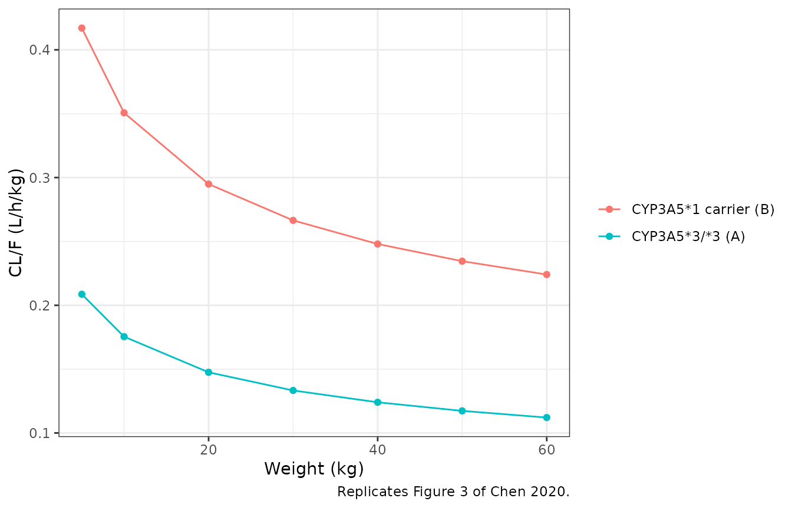
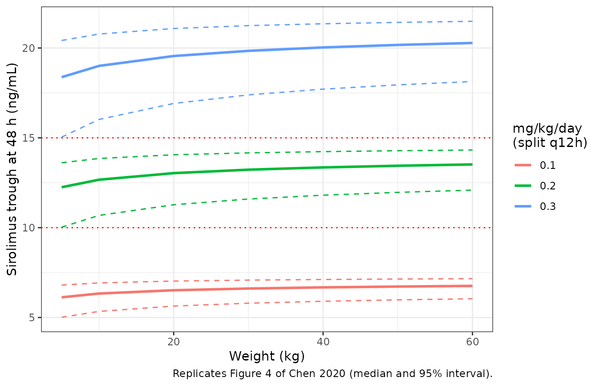
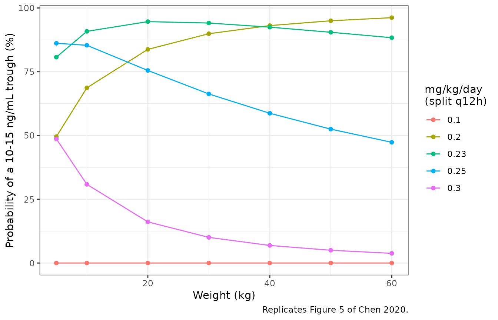
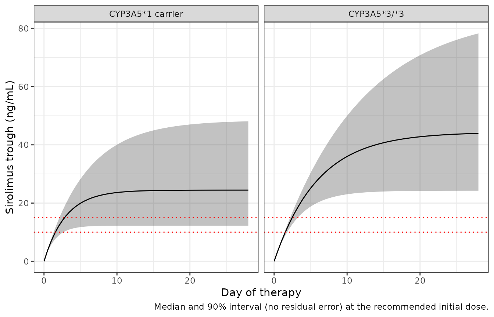

# Sirolimus (Chen 2020)

## Model and source

- Citation: Chen X, Wang DD, Xu H, Li ZP. Initial dose recommendation
  for sirolimus in paediatric kaposiform haemangioendothelioma patients
  based on population pharmacokinetics and pharmacogenomics. J Int Med
  Res. 2020;48(8):300060520947627. <doi:10.1177/0300060520947627>
- Description: One-compartment population PK model with first-order
  absorption for oral sirolimus in Chinese children with kaposiform
  haemangioendothelioma, developed from routine
  therapeutic-drug-monitoring trough concentrations (Chen 2020).
  Apparent clearance CL/F scales with body weight by a fixed allometric
  exponent of 0.75 and is 1.999-fold higher in CYP3A5*1 carriers
  (expressers) than in CYP3A5*3/\*3 nonexpressers; apparent volume V/F
  scales linearly with body weight. Both are normalized to a 70 kg
  standard weight. The absorption rate constant is fixed at 0.485 per
  hour from the group’s earlier paediatric sirolimus model.
  Inter-individual variability is on CL/F only and the residual error is
  proportional.
- Article: <https://doi.org/10.1177/0300060520947627>

Chen and colleagues fit a one-compartment model with first-order
absorption to routine trough concentrations of oral sirolimus from 14
Chinese children with kaposiform haemangioendothelioma, screening
laboratory values, co-medications and an eight-gene pharmacogenomic
panel. Body weight (with fixed allometric exponents) and CYP3A5 genotype
were retained on apparent clearance. The paper’s practical output is a
Monte Carlo initial-dose recommendation by CYP3A5 genotype and body
weight (Figures 4 and 5) against a trough target of 10-15 ng/mL.

## Population

A single-centre retrospective cohort treated at the Children’s Hospital
of Fudan University, Shanghai, between March 2016 and July 2019 (Chen
2020 Table 1): 14 patients (9 male / 5 female), age 1.53 +/- 1.40 years
and body weight 8.87 +/- 4.12 kg (mean +/- SD; ranges and medians were
not reported). Oral sirolimus doses ranged 0.16-1.5 mg/day, adjusted by
efficacy, adverse effects and therapeutic drug monitoring. Every
concentration is a pre-dose trough, measured with the Emit 2000
Sirolimus Assay (linear range 3.5-30 ng/mL). One patient received
phenobarbitone and two omeprazole.

CYP3A5 genotypes (Table 2) were \*1/\*1 in 1, \*1/\*3 in 6 and \*3/\*3
in 7 patients, so half the cohort are CYP3A5 expressers. ABCB1, ABCC4,
ABCC8, CYP2C19, CYP3A4, UGT1A1 and UGT1A8 variants were also genotyped
and screened, but not retained.

The same information is available programmatically via the model’s
`population` metadata
(`readModelDb("Chen_2020_sirolimus")()$population`).

## Source trace

| Equation / parameter | Value | Source location |
|----|----|----|
| `lcl` (CL/F at 70 kg, CYP3A5\*3/\*3) | 7.55 L/h | Table 3 (SE 15.2%); Equation vi |
| `lvc` (V/F at 70 kg) | 1840 L | Table 3 (SE 12.7%); Equation vii |
| `lka` (Ka) | 0.485 1/h, fixed | Table 3; Methods “Population pharmacokinetics model” |
| `e_wt_cl` | 0.75, fixed | Methods “Covariate model”, Equation iii; Equation vi |
| `e_wt_vc` | 1, fixed | Methods “Covariate model”, Equation iii; Equation vii |
| `e_cyp3a5_cl` | -0.999 | Table 3 (SE 40.3%); Equation vi |
| `etalcl` | 0.121104 (omega = 0.348) | Table 3; Methods Equation i |
| `propSd` | 0.390 | Table 3 (SE 7.3%); Methods Equation ii |
| Standard weight | 70 kg | Methods “Covariate model” (WTstd) |
| `CL/F = 7.55 * (WT/70)^0.75 * (1 - (-0.999) * CYP3A5)` | n/a | Equation vi (Results “Modelling and validation”) |
| `V/F = 1840 * (WT/70)` | n/a | Equation vii |
| CYP3A5 = 1 for a \*1 carrier, 0 for \*3/\*3 | n/a | Results, text below Equation vii |
| Exponential IIV on CL/F only | n/a | Methods Equation i; Table 3 |
| Proportional residual error `C = (1 + eps1) * Y` | n/a | Methods Equation ii; Table 3 footnote |

``` r

mod <- readModelDb("Chen_2020_sirolimus")
ui <- rxode2::rxode(mod)
#> ℹ parameter labels from comments will be replaced by 'label()'
theta <- ui$theta
CL_70 <- exp(theta[["lcl"]])
V_70 <- exp(theta[["lvc"]])
KA <- exp(theta[["lka"]])
CYP_FOLD <- 1 - theta[["e_cyp3a5_cl"]]
OMEGA_SD <- sqrt(ui$omega["etalcl", "etalcl"])
c(CL_70 = CL_70, V_70 = V_70, ka = KA, cyp3a5_fold = CYP_FOLD, omega_sd = OMEGA_SD)
#>       CL_70        V_70          ka cyp3a5_fold    omega_sd 
#>       7.550    1840.000       0.485       1.999       0.348
```

## Replicate Figure 3: typical CL/F per kg

Figure 3 of Chen 2020 plots the typical apparent clearance per kilogram
against body weight for each genotype. It is pure arithmetic on Equation
vi.

``` r

fig3 <- expand.grid(WT = c(5, 10, 20, 30, 40, 50, 60), CYP3A5_EXPR = 0:1) |>
  mutate(
    cl = CL_70 * (WT / 70)^theta[["e_wt_cl"]] * (1 - theta[["e_cyp3a5_cl"]] * CYP3A5_EXPR),
    cl_per_kg = cl / WT,
    genotype = ifelse(CYP3A5_EXPR == 1, "CYP3A5*1 carrier (B)", "CYP3A5*3/*3 (A)")
  )

ggplot(fig3, aes(WT, cl_per_kg, colour = genotype)) +
  geom_line() +
  geom_point() +
  labs(x = "Weight (kg)", y = "CL/F (L/h/kg)", colour = NULL,
       caption = "Replicates Figure 3 of Chen 2020.") +
  theme_bw()
```



``` r


# Values read off Figure 3 (curve A, CYP3A5*3/*3) by the maintainers.
fig3_digitised <- c(0.208, 0.175, 0.147, 0.133, 0.123, 0.116, 0.111)
fig3_a <- fig3$cl_per_kg[fig3$CYP3A5_EXPR == 0]
fig3_b <- fig3$cl_per_kg[fig3$CYP3A5_EXPR == 1]
stopifnot(
  max(abs(fig3_a / fig3_digitised - 1)) < 0.02,
  # Results: "CL ... in CYP3A5*3/*3 and CYP3A5*1 were 1:1.999".
  all(abs(fig3_b / fig3_a - 1.999) < 1e-9)
)
```

## Replicate Figures 4 and 5: the initial-dose simulations

Chen 2020 does not state the time point at which its initial-dose Monte
Carlo evaluates the trough. The typical-value curves of Figure 4
identify it: the trough immediately before the fifth dose of a
twice-daily regimen (48 h after the first dose) reproduces the printed
curves to within the reading precision of the figure, while the troughs
one dosing day earlier or later are roughly half and 1.4-fold as large.
This is consistent with the paper’s framing of an *initial* dose. Note
that the apparent half-life implied by the model is long (about 100 h
for a CYP3A5\*3/\*3 child of the cohort’s mean weight), so this 48 h
trough is far below steady state; see the steady-state section below.

Because the model is linear in dose and the trough is a monotone
function of `etalcl`, the percentiles and the probability of target
attainment in Figures 4 and 5 can be computed without sampling: the
2.5th and 97.5th percentiles of the trough are the troughs at
`etalcl = +/- 1.96 * omega`, and the probability of a trough in 10-15
ng/mL is the normal probability of the `etalcl` interval that maps onto
it. This removes Monte Carlo noise from the comparison entirely.

``` r

# Trough 48 h after the first of four q12h doses, 1 mg per dose, on a fine eta
# grid; any mg/kg/day dose is then a linear rescale.
m0 <- rxode2::zeroRe(ui)
eta_grid <- seq(-5, 5, by = 0.01) * 0.6
ev1 <- rxode2::et(amt = 1, ii = 12, addl = 3, cmt = "depot") |>
  rxode2::et(48) |>
  as.data.frame()

trough_unit <- function(wt, cyp) {
  ev <- bind_rows(lapply(seq_along(eta_grid), function(i) {
    mutate(ev1, id = i, WT = wt, CYP3A5_EXPR = cyp)
  }))
  # zeroRe() removes the random effects, so rxode2 notes that a multi-subject
  # simulation has no omega; the etas are supplied explicitly in `params`.
  s <- suppressWarnings(rxode2::rxSolve(
    m0, ev, params = data.frame(etalcl = eta_grid), returnType = "data.frame"
  ))
  s <- s[s$time == 48, ]
  data.frame(WT = wt, CYP3A5_EXPR = cyp, eta = eta_grid[s$id], c_per_mg = s$Cc)
}
unit <- bind_rows(lapply(c(5, 10, 20, 30, 40, 50, 60), function(w) {
  bind_rows(trough_unit(w, 0), trough_unit(w, 1))
}))

# Trough at a given eta, by linear interpolation on the grid.
trough_at <- function(d, eta) approx(d$eta, d$c_per_mg, xout = eta)$y

band <- function(omega_sd, mgkgd) {
  unit |>
    group_by(WT, CYP3A5_EXPR) |>
    summarise(
      dose_mg = mgkgd * first(WT) / 2,
      median = dose_mg * trough_at(pick(everything()), 0),
      lo = dose_mg * trough_at(pick(everything()), 1.96 * omega_sd),
      hi = dose_mg * trough_at(pick(everything()), -1.96 * omega_sd),
      .groups = "drop"
    ) |>
    mutate(mgkgd = mgkgd)
}

# Probability that the 48 h trough is within 10-15 ng/mL. The trough falls as
# eta rises, so C >= 10 <=> eta <= eta(10) and C <= 15 <=> eta >= eta(15).
pta <- function(omega_sd, mgkgd) {
  unit |>
    group_by(WT, CYP3A5_EXPR) |>
    summarise(
      c = list(mgkgd * first(WT) / 2 * c_per_mg), eta = list(eta),
      .groups = "drop"
    ) |>
    rowwise() |>
    mutate(
      eta_hi = approx(rev(c), rev(eta), xout = 10, rule = 2)$y,
      eta_lo = approx(rev(c), rev(eta), xout = 15, rule = 2)$y,
      pta = 100 * max(0, pnorm(eta_hi / omega_sd) - pnorm(eta_lo / omega_sd))
    ) |>
    ungroup() |>
    transmute(WT, CYP3A5_EXPR, mgkgd = mgkgd, pta)
}
```

### Figure 4: CYP3A5\*3/\*3

``` r

fig4 <- bind_rows(lapply(c(0.10, 0.20, 0.30), function(d) band(OMEGA_SD, d))) |>
  filter(CYP3A5_EXPR == 0)

ggplot(fig4, aes(WT, median, colour = factor(mgkgd))) +
  geom_line(linewidth = 1) +
  geom_line(aes(y = lo), linetype = "dashed") +
  geom_line(aes(y = hi), linetype = "dashed") +
  geom_hline(yintercept = c(10, 15), colour = "red", linetype = "dotted") +
  labs(x = "Weight (kg)", y = "Sirolimus trough at 48 h (ng/mL)",
       colour = "mg/kg/day\n(split q12h)",
       caption = "Replicates Figure 4 of Chen 2020 (median and 95% interval).") +
  theme_bw()
```



The table below compares the curves at the two ends of the weight axis
with the values the maintainers read off Figure 4.

``` r

fig4_digitised <- tribble(
  ~mgkgd, ~WT, ~median, ~lo, ~hi,
  0.10, 5, 6.10, 4.95, 6.80,
  0.10, 60, 6.75, 6.00, 7.15,
  0.20, 5, 12.25, 9.95, 13.65,
  0.20, 60, 13.50, 12.05, 14.35,
  0.30, 5, 18.40, 14.90, 20.50,
  0.30, 60, 20.30, 18.05, 21.50
) |>
  pivot_longer(c(median, lo, hi), names_to = "quantity", values_to = "published")

fig4_cmp <- fig4 |>
  select(mgkgd, WT, median, lo, hi) |>
  pivot_longer(c(median, lo, hi), names_to = "quantity", values_to = "simulated") |>
  inner_join(fig4_digitised, by = c("mgkgd", "WT", "quantity")) |>
  mutate(pct_diff = 100 * (simulated / published - 1))

fig4_cmp |>
  rename(
    "Dose (mg/kg/day)" = mgkgd, "Weight (kg)" = WT, "Quantity" = quantity,
    "Model (ng/mL)" = simulated, "Figure 4 (ng/mL)" = published,
    "% difference" = pct_diff
  ) |>
  knitr::kable(digits = 2)
```

| Dose (mg/kg/day) | Weight (kg) | Quantity | Model (ng/mL) | Figure 4 (ng/mL) | % difference |
|---:|---:|:---|---:|---:|---:|
| 0.1 | 5 | median | 6.13 | 6.10 | 0.41 |
| 0.1 | 5 | lo | 5.01 | 4.95 | 1.28 |
| 0.1 | 5 | hi | 6.81 | 6.80 | 0.09 |
| 0.1 | 60 | median | 6.76 | 6.75 | 0.14 |
| 0.1 | 60 | lo | 6.04 | 6.00 | 0.75 |
| 0.1 | 60 | hi | 7.16 | 7.15 | 0.16 |
| 0.2 | 5 | median | 12.25 | 12.25 | 0.00 |
| 0.2 | 5 | lo | 10.03 | 9.95 | 0.77 |
| 0.2 | 5 | hi | 13.61 | 13.65 | -0.28 |
| 0.2 | 60 | median | 13.52 | 13.50 | 0.14 |
| 0.2 | 60 | lo | 12.09 | 12.05 | 0.33 |
| 0.2 | 60 | hi | 14.32 | 14.35 | -0.19 |
| 0.3 | 5 | median | 18.38 | 18.40 | -0.13 |
| 0.3 | 5 | lo | 15.04 | 14.90 | 0.94 |
| 0.3 | 5 | hi | 20.42 | 20.50 | -0.40 |
| 0.3 | 60 | median | 20.28 | 20.30 | -0.10 |
| 0.3 | 60 | lo | 18.13 | 18.05 | 0.47 |
| 0.3 | 60 | hi | 21.48 | 21.50 | -0.07 |

``` r


# Deterministic (no sampling): the only error is reading the figure.
stopifnot(nrow(fig4_cmp) == 18, max(abs(fig4_cmp$pct_diff)) < 3)
```

### Figure 5: CYP3A5\*1 carriers

``` r

fig5 <- bind_rows(lapply(c(0.10, 0.20, 0.23, 0.25, 0.30), function(d) {
  pta(OMEGA_SD, d)
})) |>
  filter(CYP3A5_EXPR == 1)

ggplot(fig5, aes(WT, pta, colour = factor(mgkgd))) +
  geom_line() +
  geom_point() +
  labs(x = "Weight (kg)", y = "Probability of a 10-15 ng/mL trough (%)",
       colour = "mg/kg/day\n(split q12h)",
       caption = "Replicates Figure 5 of Chen 2020.") +
  theme_bw()
```



``` r


# Values read off Figure 5 by the maintainers.
fig5_digitised <- tribble(
  ~mgkgd, ~`5`, ~`10`, ~`20`, ~`30`, ~`40`, ~`50`, ~`60`,
  0.10, 0, 0, 0, 0, 0, 0, 0,
  0.20, 51, 71, 85, 90, 93, 94.5, 95.5,
  0.23, 83, 91, 93, 92, 91, 88, 86,
  0.25, 84.5, 82, 73, 64, 56, 51, 46,
  0.30, 47, 29, 15, 10, 7, 5.5, 4.5
) |>
  pivot_longer(-mgkgd, names_to = "WT", values_to = "published") |>
  mutate(WT = as.numeric(WT))

fig5_cmp <- inner_join(fig5, fig5_digitised, by = c("mgkgd", "WT")) |>
  mutate(diff = pta - published)

fig5_cmp |>
  select(mgkgd, WT, pta, published, diff) |>
  rename(
    "Dose (mg/kg/day)" = mgkgd, "Weight (kg)" = WT, "Model PTA (%)" = pta,
    "Figure 5 PTA (%)" = published, "Difference (points)" = diff
  ) |>
  knitr::kable(digits = c(2, 0, 1, 1, 1))
```

| Dose (mg/kg/day) | Weight (kg) | Model PTA (%) | Figure 5 PTA (%) | Difference (points) |
|---:|---:|---:|---:|---:|
| 0.10 | 5 | 0.0 | 0.0 | 0.0 |
| 0.10 | 10 | 0.0 | 0.0 | 0.0 |
| 0.10 | 20 | 0.0 | 0.0 | 0.0 |
| 0.10 | 30 | 0.0 | 0.0 | 0.0 |
| 0.10 | 40 | 0.0 | 0.0 | 0.0 |
| 0.10 | 50 | 0.0 | 0.0 | 0.0 |
| 0.10 | 60 | 0.0 | 0.0 | 0.0 |
| 0.20 | 5 | 49.6 | 51.0 | -1.4 |
| 0.20 | 10 | 68.7 | 71.0 | -2.3 |
| 0.20 | 20 | 83.8 | 85.0 | -1.2 |
| 0.20 | 30 | 89.9 | 90.0 | -0.1 |
| 0.20 | 40 | 93.1 | 93.0 | 0.1 |
| 0.20 | 50 | 95.0 | 94.5 | 0.5 |
| 0.20 | 60 | 96.2 | 95.5 | 0.7 |
| 0.23 | 5 | 80.7 | 83.0 | -2.3 |
| 0.23 | 10 | 90.8 | 91.0 | -0.2 |
| 0.23 | 20 | 94.6 | 93.0 | 1.6 |
| 0.23 | 30 | 94.1 | 92.0 | 2.1 |
| 0.23 | 40 | 92.5 | 91.0 | 1.5 |
| 0.23 | 50 | 90.5 | 88.0 | 2.5 |
| 0.23 | 60 | 88.4 | 86.0 | 2.4 |
| 0.25 | 5 | 86.2 | 84.5 | 1.7 |
| 0.25 | 10 | 85.4 | 82.0 | 3.4 |
| 0.25 | 20 | 75.5 | 73.0 | 2.5 |
| 0.25 | 30 | 66.3 | 64.0 | 2.3 |
| 0.25 | 40 | 58.7 | 56.0 | 2.7 |
| 0.25 | 50 | 52.5 | 51.0 | 1.5 |
| 0.25 | 60 | 47.3 | 46.0 | 1.3 |
| 0.30 | 5 | 48.7 | 47.0 | 1.7 |
| 0.30 | 10 | 30.8 | 29.0 | 1.8 |
| 0.30 | 20 | 16.1 | 15.0 | 1.1 |
| 0.30 | 30 | 10.1 | 10.0 | 0.1 |
| 0.30 | 40 | 6.9 | 7.0 | -0.1 |
| 0.30 | 50 | 5.0 | 5.5 | -0.5 |
| 0.30 | 60 | 3.8 | 4.5 | -0.7 |

``` r


# The paper's own curve used 1000 random subjects per point, so its values carry
# a few points of Monte Carlo noise; the model here has none.
stopifnot(
  nrow(fig5_cmp) == 35,
  abs(median(fig5_cmp$diff)) < 2,
  quantile(abs(fig5_cmp$diff), 0.9) < 5
)
```

### What Figures 4 and 5 say about the scale of omega

Table 3 prints `omega CL/F = 0.348` without saying whether this is the
NONMEM variance or its square root. The Methods define the variance as
omega squared, which suggests an SD, and the paper’s own simulations
settle it: the 95% bands of Figure 4 and the target-attainment curve of
Figure 5 are reproduced above with an SD of 0.348, whereas reading 0.348
as a variance (SD 0.590) widens the Figure 4 bands well past what is
printed.

``` r

alt <- band(sqrt(0.348), 0.20) |> filter(CYP3A5_EXPR == 0, WT %in% c(5, 60))
chosen <- band(OMEGA_SD, 0.20) |> filter(CYP3A5_EXPR == 0, WT %in% c(5, 60))
published_lo <- c(9.95, 12.05)
tibble(
  `Weight (kg)` = c(5, 60),
  `Figure 4 lower bound` = published_lo,
  `omega as SD (0.348)` = chosen$lo,
  `omega as variance (SD 0.590)` = alt$lo
) |>
  knitr::kable(digits = 2)
```

| Weight (kg) | Figure 4 lower bound | omega as SD (0.348) | omega as variance (SD 0.590) |
|---:|---:|---:|---:|
| 5 | 9.95 | 10.03 | 7.96 |
| 60 | 12.05 | 12.09 | 10.59 |

``` r


stopifnot(
  max(abs(chosen$lo / published_lo - 1)) < 0.03,
  min(abs(alt$lo / published_lo - 1)) > 0.10
)
```

## Virtual cohort

A cohort matching Table 1: body weight normal with mean 8.87 kg and SD
4.12 kg, redrawn (not clamped) outside 3-20 kg, and CYP3A5 expressers at
the observed 50%. Each child receives the paper’s recommended initial
dose for their genotype and weight: 0.20 mg/kg/day for CYP3A5\*3/\*3 and
0.23 mg/kg/day for CYP3A5\*1 carriers below 30 kg, split every 12 h.

``` r

set.seed(2020)
rxode2::rxSetSeed(2020)
N_SUBJ <- 200
draw_wt <- function(n) {
  out <- numeric(0)
  while (length(out) < n) {
    x <- rnorm(n, 8.87, 4.12)
    out <- c(out, x[x >= 3 & x <= 20])
  }
  out[seq_len(n)]
}
cohort <- tibble(
  id = seq_len(N_SUBJ),
  WT = draw_wt(N_SUBJ),
  CYP3A5_EXPR = rbinom(N_SUBJ, 1, 0.5)
) |>
  mutate(mgkgd = ifelse(CYP3A5_EXPR == 1, 0.23, 0.20), dose = mgkgd * WT / 2)
```

## Simulation: the first four weeks

``` r

TAU <- 12
N_DOSE <- 400 # 200 days: long enough for steady state in the slowest subject
SS_START <- (N_DOSE - 1) * TAU
obs_times <- sort(unique(c(seq(0, 24 * 28, by = 12), SS_START + seq(0, TAU, by = 0.25))))

events <- bind_rows(lapply(seq_len(N_SUBJ), function(i) {
  rxode2::et(amt = cohort$dose[i], ii = TAU, addl = N_DOSE - 1, cmt = "depot") |>
    rxode2::et(obs_times, cmt = "central") |>
    as.data.frame() |>
    mutate(id = i, WT = cohort$WT[i], CYP3A5_EXPR = cohort$CYP3A5_EXPR[i])
}))

sim <- rxode2::rxSolve(mod, events, keep = c("WT", "CYP3A5_EXPR"),
                       returnType = "data.frame") |>
  mutate(genotype = ifelse(CYP3A5_EXPR == 1, "CYP3A5*1 carrier", "CYP3A5*3/*3"))
#> ℹ parameter labels from comments will be replaced by 'label()'
stopifnot(dplyr::n_distinct(sim$id) == N_SUBJ)

sim |>
  filter(time <= 24 * 28, time %% 12 == 0) |>
  group_by(genotype, time) |>
  summarise(
    q05 = quantile(Cc, 0.05), q50 = median(Cc), q95 = quantile(Cc, 0.95),
    .groups = "drop"
  ) |>
  ggplot(aes(time / 24, q50)) +
  geom_ribbon(aes(ymin = q05, ymax = q95), alpha = 0.3) +
  geom_line() +
  geom_hline(yintercept = c(10, 15), colour = "red", linetype = "dotted") +
  facet_wrap(~genotype) +
  labs(x = "Day of therapy", y = "Sirolimus trough (ng/mL)",
       caption = "Median and 90% interval (no residual error) at the recommended initial dose.") +
  theme_bw()
```



The troughs keep rising well after the 48 h point at which the paper
evaluated the dose, because the model’s apparent half-life is about 100
h for a CYP3A5\*3/\*3 child of the cohort’s mean weight (about 50 h in a
CYP3A5\*1 carrier). At the recommended initial doses the median trough
crosses the upper end of the 10-15 ng/mL target within the first week.

## PKNCA validation

The paper reports no non-compartmental analysis, so there is no
published Cmax / AUC table to compare. PKNCA is instead run over the
final dosing interval at steady state and checked against the identity
`AUC0-tau = Dose / CL`, which holds per subject for a linear model.

``` r

conc <- sim |>
  filter(!is.na(Cc), time >= SS_START) |>
  mutate(treatment = sprintf("%.2f mg/kg/day", ifelse(CYP3A5_EXPR == 1, 0.23, 0.20))) |>
  select(id, time, Cc, treatment)
dose <- events |>
  filter(evid == 1) |>
  select(id, amt) |>
  distinct() |>
  mutate(time = SS_START) |>
  left_join(distinct(conc, id, treatment), by = "id")

res <- PKNCA::pk.nca(PKNCA::PKNCAdata(
  PKNCA::PKNCAconc(conc, Cc ~ time | treatment + id, concu = "ng/mL", timeu = "h"),
  PKNCA::PKNCAdose(dose, amt ~ time | treatment + id, doseu = "mg"),
  intervals = data.frame(start = SS_START, end = SS_START + TAU,
                         cmax = TRUE, cmin = TRUE, cav = TRUE, auclast = TRUE)
))
nca <- as.data.frame(res$result)

nca |>
  group_by(treatment, PPTESTCD) |>
  summarise(median = median(PPORRES), .groups = "drop") |>
  pivot_wider(names_from = PPTESTCD, values_from = median) |>
  rename(
    "Treatment" = treatment,
    "AUC0-tau,ss (ng*h/mL)" = auclast,
    "Cmax,ss (ng/mL)" = cmax,
    "Cmin,ss (ng/mL)" = cmin,
    "Cavg,ss (ng/mL)" = cav
  ) |>
  knitr::kable(digits = 1, caption = "Median steady-state exposure at the recommended initial doses.")
```

| Treatment | AUC0-tau,ss (ng\*h/mL) | Cavg,ss (ng/mL) | Cmax,ss (ng/mL) | Cmin,ss (ng/mL) |
|:---|---:|---:|---:|---:|
| 0.20 mg/kg/day | 547.2 | 45.6 | 46.4 | 44.4 |
| 0.23 mg/kg/day | 310.6 | 25.9 | 26.8 | 24.5 |

Median steady-state exposure at the recommended initial doses. {.table}

``` r


auc_chk <- nca |>
  filter(PPTESTCD == "auclast") |>
  select(id, auc = PPORRES) |>
  left_join(sim |> distinct(id, cl), by = "id") |>
  left_join(cohort |> select(id, dose), by = "id") |>
  mutate(pct_diff = 100 * (auc * cl / 1000 / dose - 1))

stopifnot(
  nrow(auc_chk) == N_SUBJ,
  # 200 days is > 12 half-lives for the slowest simulated subject and the
  # trapezoid on a 15-minute grid is near exact, so this is tight.
  abs(median(auc_chk$pct_diff)) < 0.5,
  quantile(abs(auc_chk$pct_diff), 0.9) < 1
)
```

## Assumptions and deviations

- **Simulation time point of Figures 4 and 5.** Not stated in the paper.
  The trough 48 h after the first of four twice-daily doses reproduces
  the Figure 4 typical-value curves to within the precision of reading
  the figure; that time point is used for the replication. The model
  parameters were not adjusted.
- **Scale of omega.** Table 3 prints `omega CL/F = 0.348`. It is taken
  as an SD (variance 0.348^2 = 0.121104) because the Methods define the
  variance as omega squared and because only this reading reproduces the
  95% bands of Figure 4 and the probabilities of Figure 5 (section
  above).
- **Scale of the residual error.** `sigma 1 = 0.390` is printed in the
  same notation as the omega row and is taken likewise as an SD (39%
  proportional). No figure in the paper independently discriminates
  this, and the residual error does not enter the paper’s dose
  simulations.
- **CYP3A5 coefficient sign.** Equation vi prints
  `(1 - (-0.999) * CYP3A5)` and Table 3 prints -0.999; the model keeps
  the printed coefficient and form, which gives the 1:1.999 clearance
  ratio the Results state.
- **Whole-blood matrix.** The paper names the Emit 2000 assay but not
  the matrix; the assay is a whole-blood method, as for the other
  sirolimus models in this library.
- **Steady state versus the initial-dose target.** With V/F = 1840 L at
  70 kg the model’s apparent half-life is about 100 h in a 9 kg
  CYP3A5\*3/\*3 child, so troughs at the recommended initial doses rise
  several-fold beyond the 48 h value before reaching steady state. The
  paper’s recommendations concern the first days of therapy; subsequent
  dose adjustment by therapeutic drug monitoring is assumed.
- **Figure 2 (prediction-corrected VPC)** is not reproduced: the
  individual dosing histories over up to about 40,000 h of therapy are
  not available.
- **Virtual cohort.** Weight ranges were not reported; weights were
  drawn from a normal distribution with the Table 1 mean and SD,
  restricted to 3-20 kg.
