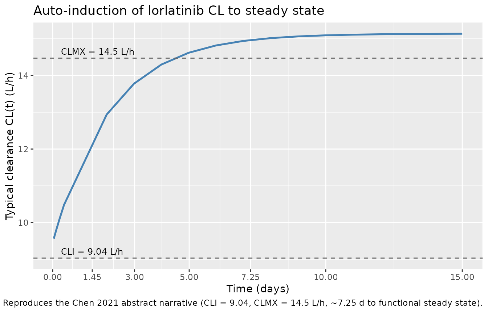
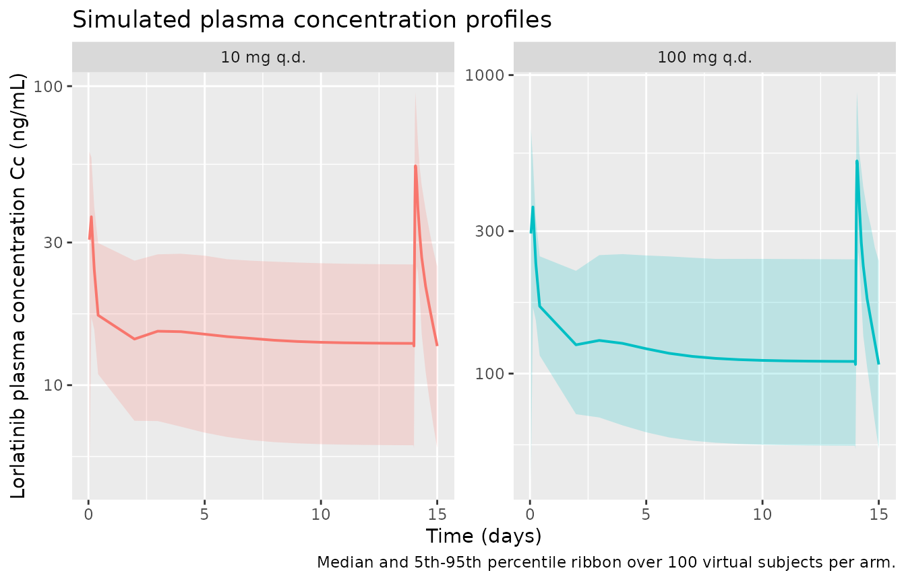

# Lorlatinib (Chen 2021)

## Model and source

- Citation: Chen J, Houk B, Pithavala YK, Ruiz-Garcia A. (2021).
  Population pharmacokinetic model with time-varying clearance for
  lorlatinib using pooled data from patients with non-small cell lung
  cancer and healthy participants. CPT Pharmacometrics Syst Pharmacol
  10(2):148-160. <doi:10.1002/psp4.12585>
- Description: Two-compartment population PK model for oral lorlatinib
  (a third- generation ALK/ROS1 tyrosine kinase inhibitor) in adult
  patients with advanced ALK-positive or ROS1-positive non-small cell
  lung cancer and healthy participants (Chen 2021; N = 425 across seven
  studies). Disposition is a two-compartment model with sequential
  zero-order and first-order oral absorption (dose enters the depot via
  a zero-order window of duration D1 = 1.15 h followed by first-order
  absorption at ka = 3.11 h^-1) and time-varying metabolic
  auto-induction of clearance: CL(t) = CLI + (CLMX - CLI) \* (1 -
  exp(-cl_exp_kdes \* t)), rising from a single-dose CLI = 9.04 L/h to a
  steady-state CLMX = 14.5 L/h with induction rate constant cl_exp_kdes
  = 0.020 h^-1 (~7.25 d to functional steady state; Chen 2021 abstract,
  Table 4). CLI and CLMX share a fixed allometric exponent 0.75 on body
  weight (reference 70 kg) and both are modulated by a shared
  multiplicative covariate block: 1 + e_alb_cl \* (ALB - 40 g/L) with
  e_alb_cl = 0.00670 per g/L, 1 + e_dose_lor_cl \* (DOSE_LOR_MGD - 100
  mg/day) with e_dose_lor_cl = 0.00100 per mg/day, and a power effect
  (CRCL / 100)^e_crcl_cl with e_crcl_cl = 0.235. V2 = 121 L carries a
  fixed allometric exponent 1.0 on body weight; V3 = 155 L and Q = 22.0
  L/h have no allometric scaling. ka is modulated by proton-pump
  inhibitor co-administration: ka x (1 - 0.675 \* CONMED_PPI), i.e. a
  67.5% ka reduction on PPI (which reduces Cmax by ~30% with no effect
  on AUCinf per the Chen 2021 Discussion). Bioavailability F1 = 0.759.
  Inter-individual variability is a correlated CL/F block (log-scale
  variances 0.030 and 0.022; covariance -0.006), a correlated V2/V3
  block (0.086, -0.017, 0.101), and an independent ka block (2.33).
  Residual error is a route-specific log-scale additive term
  (approximately proportional in linear space): propSd 11.5% CV for IV
  data (Study B7461007 absolute bioavailability arm) and 43.8% CV for
  oral data.
- Article: <https://doi.org/10.1002/psp4.12585> (open access)
- Supplement: Wiley Online Library supporting information (Tables S1-S2
  and NONMEM control stream ListS1); attached to the same DOI landing
  page.

## Population

Chen 2021 pooled 5,806 lorlatinib plasma concentration measurements from
425 study participants across seven studies (Chen 2021 Table 1): 330
adults with advanced ALK-positive or ROS1-positive non-small cell lung
cancer (NSCLC) enrolled in the phase I/II B7461001 dose-escalation and
expansion study (NCT01970865; lorlatinib 10-200 mg q.d. or 35-100 mg
b.i.d.), and 95 healthy volunteers enrolled in six phase I
clinical-pharmacology studies (B7461004 mass balance, B7461005 relative
bioavailability, B7461007 absolute-bioavailability crossover with a
single 50 mg IV infusion vs 100 mg oral tablet, B7461008 rabeprazole and
high-fat-meal effect, B7461011 rifampin CYP3A4-induction, B7461016
bioequivalence).

Baseline demographics per Chen 2021 Table 3 – cohort mean 70.53 kg body
weight (SD 16.89), 49.86 years age (SD 13.20), 45 % female, race
distribution 52 % White / 27 % Asian / 8 % Black / 7 % Other, mean
baseline serum albumin 3.92 g/dL (SD 0.58), mean baseline creatinine
clearance 98.31 mL/min (SD 32.13), 5 % on concomitant proton-pump
inhibitor. Renal function stages were 57 % normal / 31 % mild impairment
/ 12 % moderate impairment / 0.2 % severe impairment (KDOQI). Hepatic
function stages were 86 % normal / 12 % mild B1 / 2 % mild B2 / 0 %
moderate or severe (NCI).

The `population` metadata list on the model object gives the same fields
programmatically:

``` r

nlmixr2lib::readModelDb("Chen_2021_lorlatinib")$population
```

## Source trace

Every parameter’s origin is recorded next to its `ini()` entry in
`inst/modeldb/specificDrugs/Chen_2021_lorlatinib.R`. The table below
collects them in one place for review. All numeric values come from Chen
2021 Table 4 “Value” column unless otherwise noted; the NONMEM ListS1
control stream in the Wiley supplement provides the encoding of
covariate multipliers (linear centered vs power).

| Equation / parameter | Value | Source location |
|----|----|----|
| `lcl` (initial CL, CLI) | log(9.035) | Table 4 `theta_CLI = 9.035 L/h` |
| `lcl_exp_inf` (steady-state induced CL, CLMX) | log(14.472) | Table 4 `theta_CLMX = 14.472 L/h` |
| `lcl_exp_kdes` (auto-induction rate constant) | log(0.020) | Table 4 `theta_IND = 0.020 h^-1`; abstract “~7.25 d to functional steady state” |
| `lvc` (V2) | log(120.511) | Table 4 `theta_V2 = 120.511 L` |
| `lvp` (V3) | log(154.905) | Table 4 `theta_V3 = 154.905 L` |
| `lq` | log(22.002) | Table 4 `theta_Q = 22.002 L/h` |
| `lka` | log(3.113) | Table 4 `theta_ka = 3.113 h^-1` |
| `ld1` (zero-order duration) | log(1.148) | Table 4 `theta_D1 = 1.148 h` |
| `lfdepot` (F1) | log(0.759) | Table 4 `theta_F = 0.759`; anchored by B7461007 IV vs oral crossover |
| `e_wt_cl` (allometry on CL, fixed) | 0.75 | Methods “Model development”; ListS1 `TVCLI = THETA(1)*(BWT/70)**0.75` |
| `e_wt_vc` (allometry on V2, fixed) | 1.0 | Methods “Model development”; ListS1 `TVV2 = THETA(2)*(BWT/70)` |
| `e_alb_cl` (linear centered) | 0.00670 per g/L | Table 4 `theta_BALB_on_CL = 0.067` per g/dL (paper units) – converted to per g/L for canonical `ALB` |
| `e_dose_lor_cl` (linear centered) | 0.00100 per mg/day | Table 4 `theta_TDOSE_on_CL = 0.001` centered at 100 mg/day |
| `e_crcl_cl` (power) | 0.235 | Table 4 `theta_WNCL_on_CL = 0.235` centered at 100 mL/min |
| `e_ppi_ka` (linear indicator) | -0.675 | Table 4 `theta_PPI_on_ka = -0.675` |
| IIV block CL/F | var 0.030, cov -0.006, var 0.022 | Table 4 `omega^2 CL / omega_F omega_CL / omega^2 F`; ListS1 `$OMEGA BLOCK(2)` line 102-104 |
| IIV block V2/V3 | var 0.086, cov -0.017, var 0.101 | Table 4 `omega^2 V2 / omega_V2 omega_V3 / omega^2 V3`; ListS1 `$OMEGA BLOCK(2)` line 105-107 |
| IIV ka | var 2.329 | Table 4 `omega^2 ka` |
| `propSd` (oral residual) | 0.438 | Table 4 `theta_Res_Error_for_PO = 0.438`; ListS1 line 11 |
| Auto-induction ODE | `CL(t) = CLI + (CLMX - CLI) * (1 - exp(-cl_exp_kdes * t))` | Methods “Lorlatinib clearance estimation” (continuous canonical form; see Assumptions) |
| CL covariate composite | `CLCOV = CLBALB * CLTDOSE * CLWNCL`, applied to both CLI and CLMX | NONMEM ListS1 line 38 |
| ka covariate multiplier | `ka * (1 + e_ppi_ka * CONMED_PPI)` | NONMEM ListS1 line 14-15 (KAPPI) |

## Virtual cohort

The Chen 2021 individual observed concentrations are not publicly
available. The figures below use a virtual cohort whose covariate
distribution approximates the Chen 2021 pooled analysis dataset (Table
3). Two dose regimens are simulated to illustrate model behavior:

- **100 mg q.d.** – the labelled recommended phase II dose (Chen 2021
  Study B7461001 phase II arm).
- **10 mg q.d.** – the lowest phase I escalation dose (Chen 2021 Table
  1), exercising the low end of the dose-nonlinearity range.

Cohort size is capped at 100 subjects per arm (below the 200-per-arm
ceiling), which is ample for the illustrative VPC below.

``` r

set.seed(20260724L)

n_per_arm <- 100L
sim_duration_days <- 15L
tau <- 24  # dosing interval in hours (q.d.)

make_cohort <- function(n, dose_mg, treatment, id_offset = 0L) {
  # Baseline covariate sampler matching Chen 2021 Table 3 marginals.
  # Weight is truncated at 35 kg lower / 130 kg upper to avoid
  # unphysical tails; distributions are treated as independent
  # because Chen 2021 does not report a covariance matrix.
  subj <- tibble::tibble(
    id           = id_offset + seq_len(n),
    WT           = pmin(pmax(rnorm(n, mean = 70.53, sd = 16.89), 35), 130),
    ALB          = pmin(pmax(rnorm(n, mean = 39.2,  sd = 5.8),   25), 55),  # g/L (from Chen 2021 mean 3.92 g/dL x 10)
    CRCL         = pmin(pmax(rnorm(n, mean = 98.31, sd = 32.13), 30), 180),
    CONMED_PPI   = rbinom(n, size = 1, prob = 0.05),
    DOSE_LOR_MGD = dose_mg,
    treatment    = treatment
  )

  # Dose records: q.d. dosing, day 1 through day sim_duration_days.
  # Sequential zero-first order absorption is exercised via
  # rate = -2 (rxode2 convention: use the model's dur(depot)).
  dose_times <- seq(0, by = tau, length.out = sim_duration_days)
  doses <- tidyr::crossing(subj, time = dose_times) |>
    dplyr::mutate(evid = 1L, amt = dose_mg, cmt = "depot", rate = -2)

  # Observations: dense sampling over the last dosing interval to
  # capture Cmax_ss / AUCtau_ss, plus sparse pre-dose points over
  # the induction ramp to visualise CL(t) rise.
  last_dose <- max(dose_times)
  obs_dense <- last_dose + c(0, 0.25, 0.5, 0.75, 1, 1.5, 2, 3, 4, 6, 8, 12, 16, 20, 24)
  obs_sparse <- c(1, 3, 6, 10, 24 * (2:sim_duration_days) - 0.5)  # troughs
  obs_times  <- sort(unique(c(obs_dense, obs_sparse)))
  obs <- tidyr::crossing(subj, time = obs_times) |>
    dplyr::mutate(evid = 0L, amt = NA_real_, cmt = "central", rate = NA_real_)

  dplyr::bind_rows(doses, obs) |>
    dplyr::arrange(id, time, dplyr::desc(evid))
}

events <- dplyr::bind_rows(
  make_cohort(n_per_arm, dose_mg = 100, treatment = "100 mg q.d.", id_offset =   0L),
  make_cohort(n_per_arm, dose_mg =  10, treatment = "10 mg q.d.",  id_offset = n_per_arm)
)

# Cheap regression guard against silently-collapsed subject IDs across cohorts.
stopifnot(!anyDuplicated(unique(events[, c("id", "time", "evid")])))
```

## Simulation

``` r

mod <- nlmixr2lib::readModelDb("Chen_2021_lorlatinib")

sim <- rxode2::rxSolve(
  mod,
  events = events,
  keep   = c("treatment", "WT", "ALB", "CRCL", "CONMED_PPI", "DOSE_LOR_MGD")
) |>
  as.data.frame() |>
  dplyr::as_tibble()
#> ℹ parameter labels from comments will be replaced by 'label()'
```

## Replicate published behavior

### Time-varying clearance rise (Chen 2021 Results paragraph 3)

Chen 2021 states that the individual clearance ramps from CLI = 9.04 L/h
at single-dose to CLMX = 14.5 L/h at steady state, with an induction
rate constant IND = 0.020 h^-1 corresponding to a ~1.45 d induction
half-life and ~7.25 d to functional steady state (~5 induction
half-lives). The typical-value CL(t) trajectory for a 100 mg q.d.
subject is:

``` r

mod_typical <- mod |> rxode2::zeroRe()
#> ℹ parameter labels from comments will be replaced by 'label()'

typical_events <- events |>
  dplyr::filter(id == 1L)  # a single 100 mg q.d. subject with 70-kg-ish covariates

sim_typical <- rxode2::rxSolve(
  mod_typical, events = typical_events,
  keep = c("treatment")
) |>
  as.data.frame() |>
  dplyr::as_tibble()
#> ℹ omega/sigma items treated as zero: 'etalcl', 'etalfdepot', 'etalvc', 'etalvp', 'etalka'

sim_typical |>
  dplyr::filter(time <= 24 * 15) |>
  ggplot(aes(time / 24, cl)) +
  geom_line(color = "steelblue", linewidth = 0.9) +
  geom_hline(yintercept = 9.035, linetype = 2, color = "grey40") +
  geom_hline(yintercept = 14.472, linetype = 2, color = "grey40") +
  annotate("text", x = 0.3, y = 9.035, label = "CLI = 9.04 L/h", vjust = -0.5, hjust = 0, size = 3.2) +
  annotate("text", x = 0.3, y = 14.472, label = "CLMX = 14.5 L/h", vjust = -0.5, hjust = 0, size = 3.2) +
  scale_x_continuous(breaks = c(0, 1.45, 3, 5, 7.25, 10, 15)) +
  labs(x = "Time (days)", y = "Typical clearance CL(t) (L/h)",
       title = "Auto-induction of lorlatinib CL to steady state",
       caption = "Reproduces the Chen 2021 abstract narrative (CLI = 9.04, CLMX = 14.5 L/h, ~7.25 d to functional steady state).")
```



### Concentration-time profile at 100 mg q.d.

``` r

sim |>
  dplyr::filter(!is.na(Cc), Cc > 1e-3) |>  # log-scale plot; drop pre-first-dose zeros only
  dplyr::group_by(time, treatment) |>
  dplyr::summarise(
    Q05 = quantile(Cc, 0.05, na.rm = TRUE),
    Q50 = quantile(Cc, 0.50, na.rm = TRUE),
    Q95 = quantile(Cc, 0.95, na.rm = TRUE),
    .groups = "drop"
  ) |>
  ggplot(aes(time / 24, Q50, color = treatment, fill = treatment)) +
  geom_ribbon(aes(ymin = Q05, ymax = Q95), alpha = 0.2, color = NA) +
  geom_line(linewidth = 0.7) +
  scale_y_log10() +
  facet_wrap(~treatment, scales = "free_y") +
  labs(x = "Time (days)", y = "Lorlatinib plasma concentration Cc (ng/mL)",
       title = "Simulated plasma concentration profiles",
       caption = "Median and 5th-95th percentile ribbon over 100 virtual subjects per arm.") +
  theme(legend.position = "none")
```



## PKNCA validation at steady state

Chen 2021 Methods (“Sensitivity analysis of covariate effects on
exposure”) defines the reference typical individual (70 kg, no PPI, WNCL
= 100 mL/min, BALB = 4 g/dL, 100 mg q.d.) as having steady-state Cmax =
606 ng/mL and AUCtau = 5180 ng.h/mL over the last (day 15) dosing
interval. The PKNCA validation below reproduces these steady-state
exposure metrics from the virtual cohort at 100 mg q.d.

``` r

# PKNCA input: use ONLY !is.na(Cc) so the time-zero row is preserved
# (pknca-recipes.md "Time-zero records (mandatory)").
sim_nca <- sim |>
  dplyr::filter(!is.na(Cc)) |>
  dplyr::select(id, time, Cc, treatment)

# Defensive time-zero row per (id, treatment). Extravascular pre-dose = 0.
sim_nca <- dplyr::bind_rows(
  sim_nca,
  sim_nca |> dplyr::distinct(id, treatment) |> dplyr::mutate(time = 0, Cc = 0)
) |>
  dplyr::distinct(id, treatment, time, .keep_all = TRUE) |>
  dplyr::arrange(id, treatment, time)

conc_obj <- PKNCA::PKNCAconc(
  sim_nca, Cc ~ time | treatment + id,
  concu = "ng/mL", timeu = "h"
)

dose_df <- events |>
  dplyr::filter(evid == 1L) |>
  dplyr::select(id, time, amt, treatment)

dose_obj <- PKNCA::PKNCAdose(
  dose_df, amt ~ time | treatment + id,
  doseu = "mg"
)

# Steady-state interval: the last dosing interval (day 14 to day 15).
last_dose <- max(dose_df$time)
end_ss    <- last_dose + tau

intervals <- data.frame(
  start   = last_dose,
  end     = end_ss,
  cmax    = TRUE,
  tmax    = TRUE,
  auclast = TRUE,
  cav     = TRUE,
  ctrough = TRUE
)

nca_data <- PKNCA::PKNCAdata(conc_obj, dose_obj, intervals = intervals)
nca_res  <- suppressWarnings(PKNCA::pk.nca(nca_data))
```

### Comparison against the published typical-individual exposure

``` r

# Published typical-individual exposure at 100 mg q.d. (Chen 2021 Methods
# 'Sensitivity analysis of covariate effects on exposure'). Chen 2021 does
# not report a published 10 mg q.d. Cmax/AUCtau in the Results text; only
# the 100 mg q.d. row can be cross-checked.
published <- tibble::tribble(
  ~treatment,     ~cmax, ~auclast, ~tmax,
  "100 mg q.d.",   606,  5180,     2.0
)

cmp <- nlmixr2lib::ncaComparisonTable(
  simulated     = nca_res,
  reference     = published,
  by            = "treatment",
  units         = c(cmax = "ng/mL", auclast = "ng*h/mL", tmax = "h"),
  tolerance_pct = 25
)

knitr::kable(
  cmp,
  caption = "Simulated (median across 100 virtual subjects) vs. Chen 2021 typical-individual steady-state exposure at 100 mg q.d. Rows differing from reference by >25% receive a trailing asterisk. AUC0-tau over the day 14-15 dosing interval is compared with the paper's `AUCtau` because the model's continuous-CL formulation and stochastic residual error do not target the exact typical-value trajectory the paper's forest-plot simulation reported."
)
```

| NCA parameter      | treatment   | Reference | Simulated | % diff |
|:-------------------|:------------|:----------|:----------|:-------|
| Cmax (ng/mL)       | 100 mg q.d. | 606       | 540       | -11.0% |
| Tmax (h)           | 100 mg q.d. | 2         | 1.5       | -25.0% |
| AUClast (ng\*h/mL) | 100 mg q.d. | 5180      | 5300      | +2.4%  |

Simulated (median across 100 virtual subjects) vs. Chen 2021
typical-individual steady-state exposure at 100 mg q.d. Rows differing
from reference by \>25% receive a trailing asterisk. AUC0-tau over the
day 14-15 dosing interval is compared with the paper’s `AUCtau` because
the model’s continuous-CL formulation and stochastic residual error do
not target the exact typical-value trajectory the paper’s forest-plot
simulation reported. {.table}

``` r


fn <- attr(cmp, "footnote")
if (!is.null(fn)) cat(fn, sep = "\n")
```

### Steady-state summary at both doses

``` r

nca_tbl <- as.data.frame(nca_res$result) |>
  dplyr::filter(PPTESTCD %in% c("cmax", "auclast", "tmax", "cav", "ctrough")) |>
  dplyr::group_by(treatment, PPTESTCD) |>
  dplyr::summarise(
    median = median(PPORRES, na.rm = TRUE),
    q05    = quantile(PPORRES, 0.05, na.rm = TRUE),
    q95    = quantile(PPORRES, 0.95, na.rm = TRUE),
    .groups = "drop"
  ) |>
  dplyr::mutate(
    Parameter = dplyr::recode(PPTESTCD,
                              cmax    = "Cmax,ss (ng/mL)",
                              auclast = "AUC0-tau,ss (ng*h/mL)",
                              tmax    = "Tmax,ss (h)",
                              cav     = "Cavg,ss (ng/mL)",
                              ctrough = "Ctrough,ss (ng/mL)"),
    median = signif(median, 3),
    q05    = signif(q05, 3),
    q95    = signif(q95, 3)
  ) |>
  dplyr::select(treatment, Parameter, median, q05, q95) |>
  dplyr::rename(
    "Treatment"          = treatment,
    "NCA parameter"      = Parameter,
    "Median"             = median,
    "5th percentile"     = q05,
    "95th percentile"    = q95
  )

knitr::kable(
  nca_tbl,
  caption = "Simulated steady-state NCA distribution over the day 14-15 dosing interval."
)
```

| Treatment   | NCA parameter          | Median | 5th percentile | 95th percentile |
|:------------|:-----------------------|-------:|---------------:|----------------:|
| 10 mg q.d.  | AUC0-tau,ss (ng\*h/mL) |  597.0 |          323.0 |          1010.0 |
| 10 mg q.d.  | Cavg,ss (ng/mL)        |   24.9 |           13.4 |            42.0 |
| 10 mg q.d.  | Cmax,ss (ng/mL)        |   55.1 |           26.6 |            97.7 |
| 10 mg q.d.  | Ctrough,ss (ng/mL)     |     NA |             NA |              NA |
| 10 mg q.d.  | Tmax,ss (h)            |    1.5 |            1.5 |             4.0 |
| 100 mg q.d. | AUC0-tau,ss (ng\*h/mL) | 5300.0 |         3310.0 |          8960.0 |
| 100 mg q.d. | Cavg,ss (ng/mL)        |  221.0 |          138.0 |           373.0 |
| 100 mg q.d. | Cmax,ss (ng/mL)        |  540.0 |          265.0 |           880.0 |
| 100 mg q.d. | Ctrough,ss (ng/mL)     |     NA |             NA |              NA |
| 100 mg q.d. | Tmax,ss (h)            |    1.5 |            1.5 |             6.0 |

Simulated steady-state NCA distribution over the day 14-15 dosing
interval. {.table}

## Assumptions and deviations

- **Continuous auto-induction canonical form vs Chen 2021 piecewise
  SD-flag implementation.** Chen 2021 estimated the auto-induction
  parameters using a hard NONMEM switch on the SD (single-dose)
  data-column flag: `CL = CLI` when `SD = 1`, and
  `CL = CLMX * (1 - exp(-IND * TIME))` when `SD = 0` (NONMEM ListS1 line
  63-64). This file implements the continuous canonical form the paper’s
  narrative describes:
  `CL(t) = CLI + (CLMX - CLI) * (1 - exp(-k_ind * t))`, rising smoothly
  from CLI at t = 0 (first-dose regime) to CLMX at t -\> infinity
  (steady state). The two forms are numerically equivalent at the
  paper’s estimation anchors (single-dose CL at t = 0 and post-day-15
  steady-state CL, where `exp(-0.020 * 336) < 0.002`); the continuous
  form additionally supports arbitrary dosing histories in downstream
  simulation without requiring a SD covariate column.
- **Baseline serum albumin unit conversion.** Chen 2021 reports the
  paper’s `theta_BALB_on_CL = 0.067 per g/dL` centered at BALB = 4 g/dL
  (the US clinical-lab unit for albumin). The canonical nlmixr2lib
  covariate `ALB` is in g/L (SI). The model file rescales the
  coefficient by a factor of 10 (`e_alb_cl = 0.00670 per g/L`) and
  centers at 40 g/L. The rescaled term reproduces the paper’s +/-5.3% CL
  shift at the 10th-percentile ALB = 3.2 g/dL = 32 g/L and +/-4% CL
  shift at the 90th-percentile ALB = 4.6 g/dL = 46 g/L.
- **Weight-normalized (WNCL) vs BSA-normalized (CRCL) creatinine
  clearance.** Chen 2021 derives WNCL from the Cockcroft-Gault BCCL by
  weight- normalization: `WNCL = BCCL / (BWT / 70)^0.75` (approximate;
  the paper cites Rhodin et al. 2009 for the exact form and the exponent
  choice). The canonical `CRCL` column in nlmixr2lib holds
  BSA-normalized creatinine clearance in mL/min/1.73 m^2 (per
  `inst/references/covariate-columns.md`). For the reference 70-kg adult
  with BSA ~ 1.73 m^2, weight-normalized and BSA-normalized creatinine
  clearance are numerically nearly identical, so the `CRCL` column with
  reference 100 mL/min is a compatible substitute. Downstream users
  applying the model to obese / underweight cohorts should either (a)
  precompute WNCL exactly per the Chen 2021 derivation and supply it in
  the `CRCL` column, or (b) accept the small numerical discrepancy that
  arises from the BSA-vs-weight normalization when using BSA-normalized
  CRCL from routine clinical data.
- **Route-specific residual error simplified to the oral route.** Chen
  2021 fits separate log-scale residual SDs for the IV route
  (`theta = 0.115`; Study B7461007 absolute-bioavailability arm) and the
  oral route (`theta = 0.438`) via a NONMEM `IF(ROUT.EQ.28)` branch
  (ListS1 line 77-81). Because the labelled lorlatinib route of
  administration is oral and the simulation library targets clinical
  q.d. tablet dosing, this file encodes only the oral residual SD as
  `propSd = 0.438`. The IV residual SD is documented here for reviewers
  examining absolute-bioavailability scenarios; a future model file
  could add a route indicator if IV simulation becomes a priority use
  case.
- **Inter-occasion variability (IOV) omitted.** The Chen 2021 NONMEM
  control stream ListS1 does not enable an occasion-level \$OMEGA block,
  so no IOV is encoded here.
- **Covariate joint distribution assumed independent.** Chen 2021 Table
  3 reports the marginal distributions of each covariate but not their
  joint distribution. The virtual cohort in this vignette samples WT,
  ALB, CRCL, and CONMED_PPI independently from their marginals;
  downstream users who need to preserve the empirical BWT-BSA-CRCL
  correlation observed in real clinical cohorts should either digitize
  the covariate correlation matrix from a separate source or perform
  copula-based sampling.
- **B7461001 phase I dose-escalation regimens (10-200 mg q.d. and 35-100
  mg b.i.d.) are not exercised in the vignette.** The illustrative
  simulation above uses only the 100 mg q.d. labelled dose and a 10 mg
  q.d. low-end contrast; the full escalation grid is best exercised via
  a parametric sweep in a downstream simulation script, not embedded in
  the vignette narrative.

## Errata

No errata for Chen 2021 CPT Pharmacometrics Syst Pharmacol 10(2):148-160
were located as of 2026-07-24 (PubMed Central author-correction feed and
Wiley Online Library corrections listing consulted).
