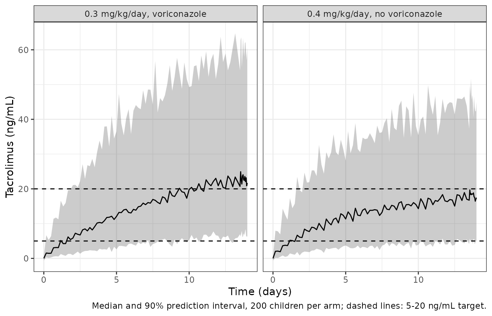

# Tacrolimus (Chen 2021a)

## Model and source

- Citation: Chen X, Wang D, Lan J, Wang G, Zhu L, Xu X, Zhai X, Xu H,
  Li Z. Effects of voriconazole on population pharmacokinetics and
  optimization of the initial dose of tacrolimus in children with
  chronic granulomatous disease undergoing hematopoietic stem cell
  transplantation. Ann Transl Med. 2021;9(18):1477.
  <doi:10.21037/atm-21-4124>.
- Description: One-compartment population PK model with first-order
  absorption for oral tacrolimus whole-blood concentrations in children
  with chronic granulomatous disease (CGD) undergoing haematopoietic
  stem cell transplantation at a single centre in China (Chen 2021). The
  absorption rate constant ka is fixed at 4.48 1/h from the literature.
  Apparent oral clearance CL/F is allometrically scaled by body weight
  (fixed exponent 0.75, reference 70 kg) and reduced by 61.2% with
  concomitant voriconazole; apparent volume V/F is scaled linearly by
  body weight (fixed exponent 1). Exponential IIV on CL/F and V/F;
  combined proportional + additive residual error.
- Article: <https://doi.org/10.21037/atm-21-4124> (open access,
  PMC8506700)

Chen et al. (2021) fitted a one-compartment model with first-order
absorption to routine therapeutic-drug-monitoring concentrations of oral
tacrolimus in children with chronic granulomatous disease (CGD)
undergoing haematopoietic stem cell transplantation (HSCT). Body weight
(fixed allometric exponents, 70 kg reference) and concomitant
voriconazole were retained; voriconazole lowers CL/F to 38.8% of its
value without the azole. The absorption rate constant was fixed at 4.48
1/h from two earlier paediatric tacrolimus models (the paper’s
references 24 and 25). The paper then used Monte Carlo simulation to
recommend weight-banded initial doses.

## Population

Thirty-four children (33 boys, 1 girl) treated at the Children’s
Hospital of Fudan University between May 2016 and January 2021
contributed 293 whole-blood tacrolimus concentrations (mean 8.6 per
child), measured by the Emit 2000 immunoassay. From Table 1: age median
1.41 (range 0.38-9.28) years and weight median 10.00 (6.30-24.80) kg.
Co-medication was heavy and near-universal: voriconazole 32/34,
omeprazole 34/34, isoniazid 31/34, ethambutol 26/34, glucocorticoids
23/34, caspofungin 21/34. Only voriconazole was retained as a covariate.
The same information is stored in the model metadata:

``` r

str(rxode2::rxode(readModelDb("Chen_2021a_tacrolimus"))$population)
#> ℹ parameter labels from comments will be replaced by 'label()'
#> List of 13
#>  $ species         : chr "human"
#>  $ n_subjects      : int 34
#>  $ n_studies       : int 1
#>  $ n_concentrations: int 293
#>  $ age_range       : chr "0.38-9.28 years (median 1.41; mean +/- SD 2.29 +/- 1.89)"
#>  $ weight_range    : chr "6.30-24.80 kg (median 10.00; mean +/- SD 11.17 +/- 3.77)"
#>  $ sex_female_pct  : num 2.9
#>  $ race_ethnicity  : chr "Not reported (single centre in Shanghai, China)"
#>  $ disease_state   : chr "Chronic granulomatous disease (CGD) undergoing haematopoietic stem cell transplantation (HSCT), paediatric"
#>  $ dose_range      : chr "Oral tacrolimus; administered dose range not reported. Simulations used 0.1-0.8 mg/kg/day divided into two doses."
#>  $ regions         : chr "China (single centre: Children's Hospital of Fudan University, Shanghai)"
#>  $ sampling_design : chr "Retrospective routine TDM, May 2016 - January 2021; 293 whole-blood concentrations (mean 8.6 per patient) measu"| __truncated__
#>  $ notes           : chr "33 boys and 1 girl. Estimated in NONMEM 7 by FOCE-I; 1000-replicate bootstrap and pcVPC. Co-medications (Table "| __truncated__
```

## Source trace

| Element | Value | Source |
|----|----|----|
| Structure: 1-compartment, first-order absorption and elimination | – | Methods, ‘Population pharmacokinetic model’ (CL/F, V/F, Ka) |
| `lka` | 4.48 1/h (fixed) | Methods; Table 2 (refs 24-25) |
| `lcl` | 35.4 L/h | Table 2; Results equation 6 |
| `lvc` | 5970 L | Table 2 (59.7 x 10^2 L); Results equation 7 |
| `e_wt_cl` | 0.75 (fixed), reference 70 kg | Methods equation 3 |
| `e_wt_vc` | 1 (fixed), reference 70 kg | Methods equation 3; Results equation 7 |
| `e_conmed_voriconazole_cl` | -0.612 | Table 2; Results equation 6 |
| Voriconazole form `(1 + theta * VRC)` | – | Methods equation 5; Results equation 6 |
| Exponential IIV `S = TV(S) * exp(eta)` | – | Methods equation 1 |
| `etalcl` | 0.525^2 = 0.275625 | Table 2 (omega CL/F = 0.525, read as SD; see below) |
| `etalvc` | 0.825^2 = 0.680625 | Table 2 (omega V/F = 0.825, read as SD; see below) |
| Residual `O = IPC * (1 + eps1) + eps2` | – | Methods equation 2 |
| `propSd` | 0.386 | Table 2 (sigma1, proportional) |
| `addSd` | 0.354 ng/mL | Table 2 (sigma2, additive) |

## Figure 3: typical CL/F per kilogram

Figure 3 plots the typical tacrolimus CL/F (L/h/kg) against body weight,
with and without voriconazole, at 5-kg steps from 5 to 25 kg. The
maintainers digitised the marker centres from the figure. The model’s
typical-value `cl` divided by weight should reproduce them, and the
voriconazole curve should be 38.8% of the other at every weight.

``` r

mod <- readModelDb("Chen_2021a_tacrolimus")
m0 <- rxode2::zeroRe(mod)
#> ℹ parameter labels from comments will be replaced by 'label()'

# Typical-value solves use the model with its random effects zeroed. With
# several subjects rxode2 warns that there is no omega, which is intended here
# (the eta values, where used, are supplied as data columns).
solve_typical <- function(events, ...) {
  withCallingHandlers(
    rxode2::rxSolve(m0, events = events, returnType = "data.frame", ...),
    warning = function(w) {
      if (grepl("omega", conditionMessage(w))) invokeRestart("muffleWarning")
    }
  )
}

fig3_digitised <- tibble::tribble(
  ~WT, ~CONMED_VORICONAZOLE, ~digitised,
  5,  0, 0.9775,
  10, 0, 0.8225,
  15, 0, 0.7443,
  20, 0, 0.6917,
  25, 0, 0.6553,
  5,  1, 0.3789,
  10, 1, 0.3182,
  15, 1, 0.2872,
  20, 1, 0.2656,
  25, 1, 0.2521
)

ev3 <- fig3_digitised |>
  mutate(id = row_number(), time = 1, evid = 0L, amt = 0, cmt = "central") |>
  select(id, time, evid, amt, cmt, WT, CONMED_VORICONAZOLE)
sim3 <- solve_typical(ev3, keep = c("WT", "CONMED_VORICONAZOLE"))
#> ℹ omega/sigma items treated as zero: 'etalcl', 'etalvc'
fig3 <- fig3_digitised |>
  left_join(
    sim3 |> transmute(WT, CONMED_VORICONAZOLE, model = cl / WT),
    by = c("WT", "CONMED_VORICONAZOLE")
  ) |>
  mutate(pct_diff = 100 * (model / digitised - 1))

fig3 |>
  mutate(
    Voriconazole = ifelse(CONMED_VORICONAZOLE == 1, "yes", "no"),
    across(c(digitised, model), ~ signif(.x, 3)),
    pct_diff = round(pct_diff, 2)
  ) |>
  select(WT, Voriconazole, digitised, model, pct_diff) |>
  rename(
    "Weight (kg)" = WT,
    "Figure 3 (L/h/kg)" = digitised,
    "Model (L/h/kg)" = model,
    "Difference (%)" = pct_diff
  ) |>
  knitr::kable()
```

| Weight (kg) | Voriconazole | Figure 3 (L/h/kg) | Model (L/h/kg) | Difference (%) |
|------------:|:-------------|------------------:|---------------:|---------------:|
|           5 | no           |             0.978 |          0.978 |           0.07 |
|          10 | no           |             0.822 |          0.823 |           0.01 |
|          15 | no           |             0.744 |          0.743 |          -0.14 |
|          20 | no           |             0.692 |          0.692 |           0.00 |
|          25 | no           |             0.655 |          0.654 |          -0.17 |
|           5 | yes          |             0.379 |          0.380 |           0.17 |
|          10 | yes          |             0.318 |          0.319 |           0.30 |
|          15 | yes          |             0.287 |          0.288 |           0.42 |
|          20 | yes          |             0.266 |          0.268 |           1.05 |
|          25 | yes          |             0.252 |          0.254 |           0.68 |

``` r


stopifnot(
  nrow(fig3) == 10L,
  !anyNA(fig3$model),
  # Deterministic typical values against a digitisation that reads to about
  # one pixel (0.003 L/h/kg, i.e. ~1% on the voriconazole curve). Realised
  # maximum 1.0%. A wrong allometric exponent (1 instead of 0.75) flattens the
  # curve and misses by >20% at 5 or 25 kg; a mis-read theta_VRC moves the
  # whole lower curve.
  max(abs(fig3$pct_diff)) < 2.5
)
```

``` r

wt_grid <- seq(5, 25, by = 0.5)
ev3c <- expand.grid(WT = wt_grid, CONMED_VORICONAZOLE = c(0, 1)) |>
  mutate(id = row_number(), time = 1, evid = 0L, amt = 0, cmt = "central")
curve3 <- solve_typical(ev3c, keep = c("WT", "CONMED_VORICONAZOLE"))
#> ℹ omega/sigma items treated as zero: 'etalcl', 'etalvc'
ggplot() +
  geom_line(
    data = curve3,
    aes(WT, cl / WT, colour = factor(CONMED_VORICONAZOLE))
  ) +
  geom_point(
    data = fig3,
    aes(WT, digitised, colour = factor(CONMED_VORICONAZOLE))
  ) +
  scale_colour_manual(
    values = c("0" = "#1b9e77", "1" = "#d95f02"),
    labels = c("0" = "without voriconazole", "1" = "with voriconazole"),
    name = NULL
  ) +
  scale_y_continuous(limits = c(0, 1.2)) +
  labs(x = "Weight (kg)", y = "CL/F (L/h/kg)") +
  theme_bw()
```


Replicates Figure 3 of Chen 2021: typical CL/F per kilogram against
weight. Lines are the model; points are digitised from the figure.

## Figure 5: probability of target attainment

Figure 5 reports, for 1,000 virtual children per scenario, the
percentage of tacrolimus concentrations within 5-20 ng/mL at body
weights of 5-25 kg and initial doses of 0.1-0.8 mg/kg/day divided into
two doses (every 12 h), with (panel B) and without (panel A)
voriconazole. The maintainers digitised the 80 plotted points; two
points in panel A are hidden under other markers and are left missing.

Figure 5 is also the best evidence for the scale of Table 2’s
variability rows. Table 2 prints omega CL/F = 0.525 and omega V/F =
0.825 without saying whether they are standard deviations or variances,
and siblings from the same group have been read both ways. The
target-attainment percentage depends directly on that spread, so we
compute it under both readings.

The figure’s sampling time is not stated. We compute every 12-h trough
from 12 h to 240 h and let the figure pick the time, separately for each
reading, so the comparison does not depend on assuming a time.

To make the result exact and machine-independent, the virtual children
are a deterministic 30 x 30 quantile grid of (eta CL/F, eta V/F) passed
as data to the model with its random effects zeroed, rather than random
draws. The model is linear in dose, so one solve at 0.1 mg/kg/day is
scaled to the other seven doses.

``` r

fig5_digitised <- tibble::tribble(
  ~dose, ~`5`, ~`10`, ~`15`, ~`20`, ~`25`, ~CONMED_VORICONAZOLE,
  0.1, 3.4, 4.7, 6.1, 7.8, 8.5, 0,
  0.2, 32.0, 38.6, 41.5, 43.3, 45.2, 0,
  0.3, 61.0, 65.2, 67.9, 67.5, NA, 0,
  0.4, 75.4, 77.2, NA, 75.8, 76.6, 0,
  0.5, 80.8, 78.5, 77.2, 76.4, 75.5, 0,
  0.6, 77.5, 73.5, 71.9, 69.9, 68.9, 0,
  0.7, 72.4, 67.3, 63.5, 61.1, 59.5, 0,
  0.8, 64.8, 58.8, 56.1, 53.9, 52.1, 0,
  0.1, 17.0, 19.5, 21.0, 21.9, 22.5, 1,
  0.2, 53.8, 57.1, 57.3, 57.1, 57.1, 1,
  0.3, 69.3, 70.3, 69.5, 68.6, 68.5, 1,
  0.4, 70.8, 68.6, 67.3, 66.6, 66.1, 1,
  0.5, 64.0, 61.4, 59.7, 59.0, 58.2, 1,
  0.6, 55.9, 53.7, 52.7, 51.4, 50.7, 1,
  0.7, 48.3, 45.7, 45.5, 44.8, 44.1, 1,
  0.8, 41.8, 39.8, 38.9, 38.3, 38.0, 1
) |>
  pivot_longer(c(`5`, `10`, `15`, `20`, `25`), names_to = "WT", values_to = "published") |>
  mutate(WT = as.numeric(WT))
stopifnot(nrow(fig5_digitised) == 80L, sum(is.na(fig5_digitised$published)) == 2L)
```

``` r

ng <- 30
zq <- qnorm((seq_len(ng) - 0.5) / ng)
eta_grid <- expand.grid(zc = zq, zv = zq)
trough_times <- seq(12, 240, by = 12)
scenarios <- expand.grid(WT = c(5, 10, 15, 20, 25), CONMED_VORICONAZOLE = c(0, 1))

# Omega read as the SD (encoded) or as the variance (rejected alternative).
readings <- list(
  SD = c(cl = 0.525, v = 0.825),
  variance = sqrt(c(cl = 0.525, v = 0.825))
)

build_grid_events <- function(om, reading, id0) {
  arms <- vector("list", nrow(scenarios))
  for (s in seq_len(nrow(scenarios))) {
    subj <- data.frame(
      id = id0 + (s - 1) * nrow(eta_grid) + seq_len(nrow(eta_grid)),
      WT = scenarios$WT[s],
      CONMED_VORICONAZOLE = scenarios$CONMED_VORICONAZOLE[s],
      etalcl = om[["cl"]] * eta_grid$zc,
      etalvc = om[["v"]] * eta_grid$zv,
      reading = reading
    )
    # 0.1 mg/kg/day divided into two doses every 12 h
    dose <- tidyr::crossing(subj, time = seq(0, max(trough_times) - 12, by = 12)) |>
      mutate(evid = 1L, amt = 0.1 * WT / 2, cmt = "depot")
    obs <- tidyr::crossing(subj, time = trough_times) |>
      mutate(evid = 0L, amt = 0, cmt = "central")
    arms[[s]] <- bind_rows(dose, obs)
  }
  bind_rows(arms)
}

ev5 <- bind_rows(
  build_grid_events(readings$SD, "SD", 0L),
  build_grid_events(readings$variance, "variance", 100000L)
) |>
  arrange(id, time, desc(evid))

sim5 <- solve_typical(ev5, keep = c("WT", "CONMED_VORICONAZOLE", "reading"))
#> ℹ omega/sigma items treated as zero: 'etalcl', 'etalvc'
#> [====|====|====|====|====|====|====|====|====|====] 0:00:16
stopifnot(
  !anyNA(sim5$Cc),
  nrow(sim5) == 2L * nrow(scenarios) * nrow(eta_grid) * length(trough_times)
)

ruv <- rxode2::rxode(mod)$iniDf
#> ℹ parameter labels from comments will be replaced by 'label()'
prop_sd <- ruv$est[ruv$name == "propSd"]
add_sd <- ruv$est[ruv$name == "addSd"]

pta <- sim5 |>
  tidyr::crossing(dose = seq(0.1, 0.8, by = 0.1)) |>
  mutate(
    conc = Cc * dose / 0.1,
    in_ipred = conc >= 5 & conc <= 20,
    res_sd = sqrt(add_sd^2 + (prop_sd * conc)^2),
    in_obs = pnorm(20, conc, res_sd) - pnorm(5, conc, res_sd)
  ) |>
  group_by(reading, time, WT, CONMED_VORICONAZOLE, dose) |>
  summarise(
    pta_ipred = 100 * mean(in_ipred),
    pta_obs = 100 * mean(in_obs),
    .groups = "drop"
  ) |>
  mutate(dose = round(dose, 1))

scored <- pta |>
  inner_join(fig5_digitised, by = c("WT", "CONMED_VORICONAZOLE", "dose")) |>
  filter(!is.na(published)) |>
  group_by(reading, time) |>
  summarise(
    n = n(),
    rmse_ipred = sqrt(mean((pta_ipred - published)^2)),
    rmse_obs = sqrt(mean((pta_obs - published)^2)),
    .groups = "drop"
  )
stopifnot(all(scored$n == 78L))
```

``` r

best <- scored |>
  group_by(reading) |>
  summarise(
    best_time_ipred = time[which.min(rmse_ipred)],
    best_rmse_ipred = min(rmse_ipred),
    best_time_obs = time[which.min(rmse_obs)],
    best_rmse_obs = min(rmse_obs),
    .groups = "drop"
  )
best |>
  mutate(across(starts_with("best_rmse"), ~ round(.x, 2))) |>
  rename(
    "Omega read as" = reading,
    "Best trough time, no residual (h)" = best_time_ipred,
    "RMSE, no residual (points)" = best_rmse_ipred,
    "Best trough time, with residual (h)" = best_time_obs,
    "RMSE, with residual (points)" = best_rmse_obs
  ) |>
  knitr::kable()
```

| Omega read as | Best trough time, no residual (h) | RMSE, no residual (points) | Best trough time, with residual (h) | RMSE, with residual (points) |
|:---|---:|---:|---:|---:|
| SD | 72 | 1.05 | 72 | 6.00 |
| variance | 72 | 4.05 | 72 | 9.08 |

``` r


rmse_at <- function(rd, t, col) {
  v <- scored[[col]][scored$reading == rd & scored$time == t]
  if (length(v) != 1L) stop("no unique score for ", rd, " at ", t, " h")
  v
}
peaks <- pta |>
  filter(time == 72) |>
  group_by(reading, CONMED_VORICONAZOLE) |>
  summarise(peak = max(pta_ipred), .groups = "drop") |>
  pivot_wider(names_from = reading, values_from = peak) |>
  inner_join(
    fig5_digitised |>
      group_by(CONMED_VORICONAZOLE) |>
      summarise(published = max(published, na.rm = TRUE), .groups = "drop"),
    by = "CONMED_VORICONAZOLE"
  )
peaks |>
  mutate(Panel = ifelse(CONMED_VORICONAZOLE == 1, "B (voriconazole)", "A (no voriconazole)")) |>
  select(Panel, published, SD, variance) |>
  rename(
    "Figure 5 peak (%)" = published,
    "Omega as SD (%)" = SD,
    "Omega as variance (%)" = variance
  ) |>
  knitr::kable(digits = 1)
```

| Panel               | Figure 5 peak (%) | Omega as SD (%) | Omega as variance (%) |
|:--------------------|------------------:|----------------:|----------------------:|
| A (no voriconazole) |              80.8 |            80.9 |                  71.0 |
| B (voriconazole)    |              70.8 |            71.1 |                  67.1 |

``` r


sd_72 <- rmse_at("SD", 72, "rmse_ipred")
sd_72_obs <- rmse_at("SD", 72, "rmse_obs")
var_best <- min(scored$rmse_ipred[scored$reading == "variance"])
var_best_obs <- min(scored$rmse_obs[scored$reading == "variance"])

stopifnot(
  # The SD reading, without residual error, at the trough just before the
  # seventh dose (72 h) reproduces all 78 visible points. Realised RMSE 1.05
  # percentage points, about the precision of the digitisation. The grid is
  # deterministic, so this does not vary between machines.
  best$best_time_ipred[best$reading == "SD"] == 72,
  sd_72 < 2,
  # The variance reading cannot reach that at ANY trough time, with or without
  # residual error (realised best 4.05 and 9.08 points). Swapping the readings
  # in the model turns these assertions red.
  var_best > 3,
  var_best_obs > 3,
  # The paper's percentages are of individual predictions: adding the
  # residual error to the SD reading lowers the peaks and misses (realised
  # 6.00 points).
  sd_72_obs > 4
)
```

The standard-deviation reading, at the trough just before the seventh
dose (72 h, i.e. after three days of dosing), reproduces the figure to
about one percentage point (RMSE 1.05 over 78 points), which is about
the precision of the digitisation. The variance reading misses by four
times as much (RMSE 4.05) even at its own best-fitting time, because its
wider spread lowers the peaks of the curves: 71.0% and 67.1% against the
figure’s 80.8% and 70.8%, which the SD reading reproduces (80.9% and
71.1%). Adding residual error to the SD reading also misses (RMSE 6.00),
so Figure 5 was computed from individual predictions. The
standard-deviation reading is encoded in the model. The Table 2 standard
errors point the same way: 15.2% and 14.9% for the two omegas are below
`sqrt(2/34)` = 24.3%, the smallest relative standard error a variance
estimated from 34 children can have.

``` r

pta72 <- pta |> filter(reading == "SD", time == 72)
ggplot() +
  geom_line(
    data = pta72,
    aes(WT, pta_ipred, colour = factor(dose), group = dose)
  ) +
  geom_point(
    data = fig5_digitised |> filter(!is.na(published)),
    aes(WT, published, colour = factor(dose))
  ) +
  facet_wrap(
    ~CONMED_VORICONAZOLE,
    ncol = 1,
    labeller = as_labeller(c(
      "0" = "A: without voriconazole",
      "1" = "B: with voriconazole"
    ))
  ) +
  labs(
    x = "Weight (kg)",
    y = "Probability within 5-20 ng/mL (%)",
    colour = "Dose (mg/kg/day)"
  ) +
  theme_bw()
```


Replicates Figure 5 of Chen 2021: probability that the 72-h trough is
within 5-20 ng/mL (A, without voriconazole; B, with voriconazole). Lines
are the model (omega read as SD, no residual error); points are
digitised from the figure.

The paper’s recommendations follow from this figure: without
voriconazole, 0.5 mg/kg/day for 5-10 kg and 0.4 mg/kg/day for 10-25 kg;
with voriconazole, 0.3 mg/kg/day for 5-25 kg. In the model the 0.4 and
0.5 mg/kg/day curves without voriconazole are within about two points of
each other from 10 to 25 kg, as they are in the figure, so the switch at
10 kg is a near-tie rather than a sharp optimum.

## Stochastic simulation of the recommended regimens

A 10-kg child (the cohort median weight) receives the recommended
initial dose for 14 days: 0.4 mg/kg/day without voriconazole and 0.3
mg/kg/day with it, each as two doses 12 h apart. There are 200 virtual
children per arm and residual error is included.

``` r

nsub <- 200
arms <- tibble::tribble(
  ~arm, ~CONMED_VORICONAZOLE, ~mgkgday,
  "0.4 mg/kg/day, no voriconazole", 0, 0.4,
  "0.3 mg/kg/day, voriconazole", 1, 0.3
)
wt_vpc <- 10
obs_times <- sort(unique(c(seq(0, 336, by = 4), seq(324, 336, by = 1))))
ev_vpc <- bind_rows(lapply(seq_len(nrow(arms)), function(i) {
  ids <- (i - 1) * nsub + seq_len(nsub)
  subj <- data.frame(
    id = ids,
    WT = wt_vpc,
    CONMED_VORICONAZOLE = arms$CONMED_VORICONAZOLE[i],
    arm = arms$arm[i]
  )
  dose <- tidyr::crossing(subj, time = seq(0, 324, by = 12)) |>
    mutate(evid = 1L, amt = arms$mgkgday[i] * wt_vpc / 2, cmt = "depot")
  obs <- tidyr::crossing(subj, time = obs_times) |>
    mutate(evid = 0L, amt = 0, cmt = "central")
  bind_rows(dose, obs)
})) |>
  arrange(id, time, desc(evid))

rxode2::rxSetSeed(2021)
sim_vpc <- rxode2::rxSolve(mod, events = ev_vpc, keep = c("arm"), returnType = "data.frame")
#> ℹ parameter labels from comments will be replaced by 'label()'

vpc_sum <- sim_vpc |>
  group_by(arm, time) |>
  summarise(
    p05 = quantile(sim, 0.05),
    p50 = quantile(sim, 0.5),
    p95 = quantile(sim, 0.95),
    .groups = "drop"
  )

ggplot(vpc_sum, aes(time / 24, p50)) +
  geom_ribbon(aes(ymin = p05, ymax = p95), alpha = 0.25) +
  geom_line() +
  geom_hline(yintercept = c(5, 20), linetype = "dashed") +
  facet_wrap(~arm) +
  labs(
    x = "Time (days)",
    y = "Tacrolimus (ng/mL)",
    caption = "Median and 90% prediction interval, 200 children per arm; dashed lines: 5-20 ng/mL target."
  ) +
  theme_bw()
```



``` r

# The model-true median of the 72-h individual prediction comes from the
# deterministic eta grid of the Figure 5 section (10 kg, omega as SD, scaled
# from 0.1 mg/kg/day to each arm's dose). It is not the typical-value
# prediction: at 72 h the concentration is not log-symmetric in eta V/F.
grid_median <- sim5 |>
  filter(reading == "SD", time == 72, WT == wt_vpc) |>
  group_by(CONMED_VORICONAZOLE) |>
  summarise(grid_med_per_01 = median(Cc), .groups = "drop")
chk <- sim_vpc |>
  filter(time == 72) |>
  group_by(arm) |>
  summarise(median_sim = median(Cc), .groups = "drop") |>
  inner_join(arms, by = "arm") |>
  inner_join(grid_median, by = "CONMED_VORICONAZOLE") |>
  mutate(
    median_grid = grid_med_per_01 * mgkgday / 0.1,
    pct_diff = 100 * (median_sim / median_grid - 1)
  )
chk |>
  select(arm, median_sim, median_grid, pct_diff) |>
  rename(
    "Arm" = arm,
    "Simulated median at 72 h (ng/mL)" = median_sim,
    "Deterministic median at 72 h (ng/mL)" = median_grid,
    "Difference (%)" = pct_diff
  ) |>
  knitr::kable(digits = 2)
```

| Arm | Simulated median at 72 h (ng/mL) | Deterministic median at 72 h (ng/mL) | Difference (%) |
|:---|---:|---:|---:|
| 0.3 mg/kg/day, voriconazole | 8.42 | 8.73 | -3.53 |
| 0.4 mg/kg/day, no voriconazole | 8.56 | 8.45 | 1.31 |

``` r

stopifnot(
  nrow(chk) == 2L,
  # 200 children per arm with a log-SD near 0.6 give the sample median a
  # standard error of about 5%; 15% is three of them. A dose, unit or clearance
  # error moves the median by tens of percent. Realised +1.3% and -3.5%.
  all(abs(chk$pct_diff) < 15)
)
```

## PKNCA: single-dose typical-value check

The paper reports no non-compartmental results, so there is no published
NCA table to compare against. As an internal check, a single 0.2-mg/kg
dose to a typical 10-kg child is solved for 3,000 h (more than ten
half-lives with voriconazole) and PKNCA’s AUC0-inf should equal
Dose/(CL/F).

``` r

nca_times <- sort(unique(c(0, 0.05, 0.1, 0.2, 0.3, 0.5, 0.75, 1, 1.5, 2, 3, 4, 6, 8, 12, seq(24, 3000, by = 24))))
ev_nca <- bind_rows(lapply(c(0, 1), function(v) {
  id <- v + 1L
  bind_rows(
    data.frame(id = id, time = 0, evid = 1L, amt = 0.2 * 10, cmt = "depot"),
    data.frame(id = id, time = nca_times, evid = 0L, amt = 0, cmt = "central")
  ) |>
    mutate(
      WT = 10,
      CONMED_VORICONAZOLE = v,
      treatment = ifelse(v == 1, "voriconazole", "no voriconazole")
    )
})) |>
  arrange(id, time, desc(evid))
sim_nca <- solve_typical(ev_nca, keep = c("treatment"), rtol = 1e-10, atol = 1e-12)
#> ℹ omega/sigma items treated as zero: 'etalcl', 'etalvc'
stopifnot(all(sim_nca$Cc >= -1e-6 * max(sim_nca$Cc)))

conc_nca <- sim_nca |>
  filter(!is.na(Cc)) |>
  mutate(Cc = pmax(Cc, 0)) |>
  select(id, time, Cc, treatment)
dose_nca <- ev_nca |>
  filter(evid == 1) |>
  select(id, time, amt, treatment)

o_conc <- PKNCA::PKNCAconc(conc_nca, Cc ~ time | treatment + id)
o_dose <- PKNCA::PKNCAdose(dose_nca, amt ~ time | treatment + id)
o_data <- PKNCA::PKNCAdata(
  o_conc,
  o_dose,
  intervals = data.frame(
    start = 0,
    end = Inf,
    cmax = TRUE,
    tmax = TRUE,
    aucinf.obs = TRUE,
    half.life = TRUE
  )
)
o_nca <- PKNCA::pk.nca(o_data)

nca_wide <- as.data.frame(o_nca$result) |>
  filter(PPTESTCD %in% c("cmax", "tmax", "aucinf.obs", "half.life")) |>
  select(treatment, PPTESTCD, PPORRES) |>
  pivot_wider(names_from = PPTESTCD, values_from = PPORRES)

typ <- sim_nca |>
  distinct(treatment, cl, vc)
nca_chk <- nca_wide |>
  inner_join(typ, by = "treatment") |>
  mutate(
    # dose mg / (L/h) = mg*h/L; x1000 to ng*h/mL
    auc_expected = 1000 * 0.2 * 10 / cl,
    thalf_expected = log(2) * vc / cl,
    auc_pct = 100 * (aucinf.obs / auc_expected - 1),
    thalf_pct = 100 * (half.life / thalf_expected - 1)
  )

nca_chk |>
  select(treatment, cmax, tmax, aucinf.obs, auc_expected, auc_pct, half.life, thalf_expected, thalf_pct) |>
  rename(
    "Treatment" = treatment,
    "Cmax (ng/mL)" = cmax,
    "Tmax (h)" = tmax,
    "AUC0-inf (ng*h/mL)" = aucinf.obs,
    "Dose/(CL/F)" = auc_expected,
    "AUC diff (%)" = auc_pct,
    "t1/2 (h)" = half.life,
    "ln(2)*V/CL (h)" = thalf_expected,
    "t1/2 diff (%)" = thalf_pct
  ) |>
  knitr::kable(digits = 2)
```

| Treatment | Cmax (ng/mL) | Tmax (h) | AUC0-inf (ng\*h/mL) | Dose/(CL/F) | AUC diff (%) | t1/2 (h) | ln(2)\*V/CL (h) | t1/2 diff (%) |
|:---|---:|---:|---:|---:|---:|---:|---:|---:|
| no voriconazole | 2.31 | 1.5 | 243.12 | 243.14 | -0.01 | 71.87 | 71.87 | 0 |
| voriconazole | 2.33 | 1.5 | 626.62 | 626.64 | 0.00 | 185.22 | 185.22 | 0 |

``` r


stopifnot(
  nrow(nca_chk) == 2L,
  # Deterministic typical-value solve; the trapezoid error on a 24-h grid of a
  # curve with a 70-190 h half-life is well below 1%.
  all(abs(nca_chk$auc_pct) < 1),
  all(abs(nca_chk$thalf_pct) < 1)
)
```

The half-life is about 72 h without voriconazole and about 185 h with it
in a 10-kg child, because V/F is very large relative to CL/F (V/F = 5970
L at 70 kg). This is why the figure’s 72-h trough, three days into
dosing, is far from steady state, and why Figure 5’s optimal dose shifts
less between the two panels than the 1:0.388 clearance ratio would
suggest.

## Assumptions and deviations

- **Omega scale.** Table 2 does not say whether omega CL/F = 0.525 and
  omega V/F = 0.825 are standard deviations or variances. They are
  encoded as SDs (variances 0.275625 and 0.680625). Two independent
  pieces of evidence support this: the standard errors (15.2%, 14.9%)
  are below the `sqrt(2/N)` = 24.3% floor for a variance from 34
  children, and the SD reading reproduces Figure 5 with an RMSE of 1.05
  percentage points while the variance reading cannot do better than
  4.05 at any trough time (both asserted above).
- **Residual-error scale.** sigma1 = 0.386 (proportional) and sigma2 =
  0.354 ng/mL (additive) are read as SDs, on the same convention as the
  omega rows of the same table. Figure 5 is residual-free and cannot
  test this, and the sigma1 standard error (10.1% on 293 concentrations)
  does not discriminate. Read as variances they would be SDs of 0.621
  and 0.595 ng/mL. The additive term is poorly estimated in the paper
  (SE 116.4%).
- **Residual-error form.** Methods equation 2,
  `O = IPC * (1 + eps1) + eps2` with separate epsilons, is encoded as
  `add(addSd) + prop(propSd)`, nlmixr2’s default combined form, in which
  the two variances add.
- **Figure 5 sampling time.** The paper does not state when the
  simulated concentration was taken. The 72-h trough (before the seventh
  12-hourly dose) is the best-fitting 12-h trough between 12 and 240 h
  for the SD reading; this is a property of the paper’s simulation
  design, not a model parameter.
- **Voriconazole indicator.** The paper does not say whether VRC was
  allowed to change within a child over time; it is encoded as a
  per-record covariate so either use is possible.
- **Screened covariates.** Sex, age, the liver and renal laboratory
  values, the haematology indices and the other co-medications were
  collected but not retained. They are listed in the model’s
  `covariatesDataExcluded` with their Table 1 summaries; the paper does
  not report a per-covariate screening table.
- **Race.** The paper does not report race or ethnicity. The children
  were treated at a single centre in Shanghai, China.
- **Absorption rate.** Ka = 4.48 1/h is fixed from the literature (the
  paper’s references 24 and 25, both paediatric tacrolimus models).
- **Errata.** A Crossref check (2026-09-29) found no correction notice
  for this article.
