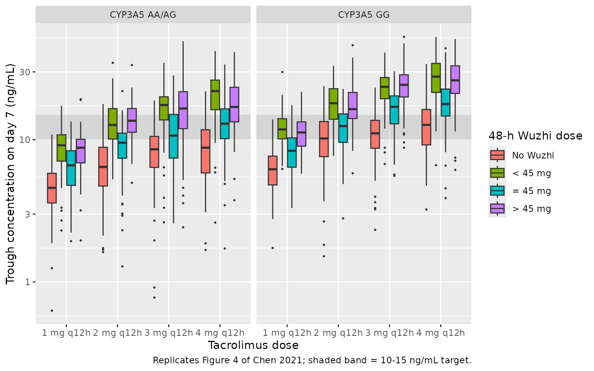

# Tacrolimus with Wuzhi capsule (Chen 2021b)

## Model and source

``` r

ui <- rxode2::rxode(readModelDb("Chen_2021b_tacrolimus"))
#> ℹ parameter labels from comments will be replaced by 'label()'
# zeroRe() warns that there are no sigma parameters: the residual SDs are
# ordinary thetas combined per centre in model(), so there is nothing to zero.
mod_typ <- suppressWarnings(rxode2::zeroRe(ui))
```

- Citation: Chen L, Yang Y, Wang X, Wang C, Lin W, Jiao Z, Wang Z
  (2021). Wuzhi Capsule Dosage Affects Tacrolimus Elimination in Adult
  Kidney Transplant Recipients, as Determined by a Population
  Pharmacokinetics Analysis. Pharmgenomics Pers Med 14:1093-1106.
  <doi:10.2147/PGPM.S321997>.
- Description: One-compartment population PK model with first-order
  absorption and elimination for oral tacrolimus in Chinese adult kidney
  transplant recipients during the first 90 postoperative days, pooled
  from two centres (Chen 2021 Pharmgenomics Pers Med, NONMEM 7.4).
  Apparent oral clearance CL/F carries median-normalised power effects
  of Cockcroft-Gault creatinine clearance, haematocrit (inverse ratio)
  and the daily tacrolimus dose, a 1.29-fold CYP3A5\*1-carrier
  (expresser) multiplier, and a four-level multiplier for the 48-hour
  cumulative Wuzhi capsule dose (0 mg reference; below 45 mg 0.566;
  exactly 45 mg 0.783; above 45 mg 0.598). Absorption rate constant
  fixed at 3.09 1/h from a previous analysis because only trough
  concentrations were available; no covariate on Vd/F. Exponential IIV
  on CL/F and Vd/F; exponential (log-normal) residual error estimated
  separately for each centre.
- Article: <https://doi.org/10.2147/PGPM.S321997>

## Population

Chen 2021 pooled 1378 whole-blood tacrolimus trough concentrations from
142 Chinese adult kidney transplant recipients followed to
post-operative day 90 at two Shanghai centres: 90 patients (758 troughs,
2016, CMIA assay) from Changhai Hospital and 52 patients (620 troughs,
2009-2013, EMIT assay converted to CMIA equivalents with
`CMIA = 0.93 * EMIT + 0.36`) from Huashan Hospital. Table 1: 96 men and
46 women, median age 40 years (20-67), median weight 60.1 kg (36-86.7),
median haematocrit 28.9 % (17.6-48.2), median Cockcroft-Gault creatinine
clearance 45.5 mL/min (4.9-123.9), median daily tacrolimus dose 5 mg
(1-11). CYP3A5 rs776746 genotype AA/AG/GG was 12/48/82, so 60 recipients
were CYP3A5 expressers. All patients received tacrolimus + mycophenolic
acid + corticosteroid; only Changhai patients received the Wuzhi capsule
(*Schisandra sphenanthera* extract), at 11.25 mg once, twice or three
times daily or 22.5 mg twice or three times daily.

The same information is available programmatically:

``` r

str(ui$population, max.level = 1)
#> List of 14
#>  $ species         : chr "human"
#>  $ n_subjects      : int 142
#>  $ n_studies       : int 2
#>  $ n_concentrations: int 1378
#>  $ age_range       : chr "20-67 years (Table 1 pooled median 40.0)"
#>  $ weight_range    : chr "36-86.7 kg (Table 1 pooled median 60.1)"
#>  $ sex_female_pct  : num 32.4
#>  $ race_ethnicity  : Named num 100
#>   ..- attr(*, "names")= chr "Asian"
#>  $ disease_state   : chr "Chinese adult kidney transplant recipients followed to post-operative day 90 on triple immunosuppression (tacro"| __truncated__
#>  $ dose_range      : chr "Oral tacrolimus twice daily, titrated to trough targets; daily dose median 5 mg (range 1-11). Changhai initial "| __truncated__
#>  $ regions         : chr "China (Shanghai: Changhai Hospital and Huashan Hospital)"
#>  $ sampling_design : chr "1378 whole-blood trough concentrations (C0), 758 from 90 Changhai patients (March-September 2016, CMIA, LLOQ 1."| __truncated__
#>  $ cyp3a5_genotype : Named num [1:3] 8.45 33.8 57.75
#>   ..- attr(*, "names")= chr [1:3] "*1/*1 (AA)" "*1/*3 (AG)" "*3/*3 (GG)"
#>  $ notes           : chr "Table 1 (pooled): 96 male / 46 female; haematocrit median 28.9 % (17.6-48.2); Cockcroft-Gault creatinine cleara"| __truncated__
```

## Source trace

Every `ini()` value carries an in-file comment pointing to its source in
`inst/modeldb/specificDrugs/Chen_2021b_tacrolimus.R`. Collected here:

| Equation / parameter | Value | Source location |
|----|----|----|
| `lka` | `fixed(log(3.09))` | Table 2 ’Ka\*’ (footnote: fixed to the published value); Methods ‘Base Model Development’ (Zuo 2013) |
| `lcl` | `log(14.4)` | Table 2 ‘CL/F (L/h)’, final model |
| `lvc` | `log(275)` | Table 2 ‘Vd/F (L)’, final model; Results ‘Vd/F = 275’ |
| `e_crcl_cl` | 0.179 | Table 2 ‘Creatinine clearance rate’; Results CL/F equation `(CCR/45.5)^0.179` |
| `e_hct_cl` | 0.503 | Table 2 ‘Haematocrit’; Results CL/F equation `(28.9/HCT)^0.503` |
| `e_dose_tac_cl` | 0.351 | Table 2 ‘DOSE’; Results CL/F equation `(DOSE/5)^0.351` |
| `e_cyp3a5_expr_cl` | 1.29 | Table 2 ‘CYP3A5*1/*1 and *1/*3’ |
| `e_wuzhi_lt45_cl` | 0.566 | Table 2 ‘WZ\<45mg’ |
| `e_wuzhi_eq45_cl` | 0.783 | Table 2 ‘WZ=45mg’ |
| `e_wuzhi_gt45_cl` | 0.598 | Table 2 ‘WZ\>45mg’ (reference ‘WZ=0mg’ = 1) |
| `etalcl` | 0.0625 | Table 2 BSV ‘CL/F(%)’ 25.4 %, as `log(0.254^2 + 1)` |
| `etalvc` | 0.2354 | Table 2 BSV ‘V/F(%)’ 51.5 %, as `log(0.515^2 + 1)` |
| `expSd_changhai` | 0.2462 | Table 2 ‘CH exponential error’ 0.0606 (variance), `sqrt(0.0606)` |
| `expSd_huashan` | 0.2978 | Table 2 ‘HS exponential error’ 0.0887 (variance), `sqrt(0.0887)` |
| CL/F covariate equation | n/a | Results, ‘The final popPK model included the following parameter-covariate relations’ |
| One-compartment, first-order absorption | n/a | Methods ‘Base Model Development’; Results ‘Population Pharmacokinetic Modeling’ |
| Exponential residual error per centre | n/a | Results ‘The residual error model was selected using an exponential method’; Table 2 |

## Verification gate 1: the published CL/F equation

Chen 2021 prints the final model as

`CL/F = 14.4 x (CCR/45.5)^0.179 x (28.9/HCT)^0.503 x (DOSE/5)^0.351 x 1.29 (CYP3A5*1 carriers) x 0.566 / 0.783 / 0.598 / 1 (48-h Wuzhi dose < 45 / = 45 / > 45 / 0 mg)`.

The typical-value model’s `cl` is compared with that closed form over a
grid spanning every covariate level. Both sides use the same parameter
values, so the only difference is arithmetic and the bound is tight.

``` r

grid <- expand.grid(
  CYP3A5_EXPR = 0:1,
  DOSE_WUZHI_MG48H = c(0, 22.5, 45, 67.5, 135),
  CRCL = c(10, 45.5, 110),
  HCT = c(20, 28.9, 45),
  DOSE_TAC_MGD = c(2, 5, 10)
)
grid$id <- seq_len(nrow(grid))

ev_grid <- grid |>
  mutate(time = 1, evid = 0, amt = 0, cmt = "central", STUDY_HUASHAN = 0)

sim_grid <- rxode2::rxSolve(mod_typ, ev_grid, returnType = "data.frame")
#> ℹ omega/sigma items treated as zero: 'etalcl', 'etalvc'
#> Warning: multi-subject simulation without without 'omega'

wz_mult <- function(d) {
  ifelse(d == 0, 1, ifelse(d < 45, 0.566, ifelse(d == 45, 0.783, 0.598)))
}
check_cl <- grid |>
  mutate(
    cl_paper = 14.4 * (CRCL / 45.5)^0.179 * (28.9 / HCT)^0.503 *
      (DOSE_TAC_MGD / 5)^0.351 * ifelse(CYP3A5_EXPR == 1, 1.29, 1) *
      wz_mult(DOSE_WUZHI_MG48H),
    cl_model = sim_grid$cl[match(id, sim_grid$id)],
    rel_err = cl_model / cl_paper - 1
  )

stopifnot(
  nrow(check_cl) == 2 * 5 * 3 * 3 * 3,
  !anyNA(check_cl$cl_model),
  max(abs(check_cl$rel_err)) < 1e-10,
  # The Discussion's reference subject: CYP3A5*3/*3, 5 mg/day, no Wuzhi,
  # CRCL 45.5 mL/min, HCT 28.9 % -> 14.4 L/h.
  abs(check_cl$cl_model[check_cl$CYP3A5_EXPR == 0 & check_cl$DOSE_WUZHI_MG48H == 0 &
    check_cl$CRCL == 45.5 & check_cl$HCT == 28.9 & check_cl$DOSE_TAC_MGD == 5] - 14.4) < 1e-8
)
```

All 270 covariate combinations reproduce the printed equation (maximum
relative error 5.4e-15).

## Verification gate 2: steady-state mass balance (PKNCA)

At steady state the AUC over one dosing interval satisfies
`CL/F x AUCtau = Dose`. A typical CYP3A5 non-expresser at the covariate
medians receives 3 mg q12h under each Wuzhi arm for 30 days (at least 20
half-lives in every arm), and PKNCA computes AUC over the last interval
on a dense grid.

``` r

wz_arms <- tibble(
  treatment = c("No Wuzhi", "Wuzhi < 45 mg/48 h", "Wuzhi = 45 mg/48 h", "Wuzhi > 45 mg/48 h"),
  DOSE_WUZHI_MG48H = c(0, 22.5, 45, 90)
)
tau <- 12
n_dose <- 60
t_last <- tau * n_dose
obs_t <- sort(unique(c(seq(t_last - tau, t_last, by = 0.05))))

ev_ss <- bind_rows(lapply(seq_len(nrow(wz_arms)), function(i) {
  bind_rows(
    tibble(id = i, time = seq(0, t_last - tau, by = tau), evid = 1, amt = 3, cmt = "depot"),
    tibble(id = i, time = obs_t, evid = 0, amt = 0, cmt = "central")
  ) |>
    mutate(
      treatment = wz_arms$treatment[i],
      DOSE_WUZHI_MG48H = wz_arms$DOSE_WUZHI_MG48H[i],
      CYP3A5_EXPR = 0, CRCL = 45.5, HCT = 28.9, DOSE_TAC_MGD = 6, STUDY_HUASHAN = 0
    )
}))

sim_ss <- rxode2::rxSolve(mod_typ, ev_ss, keep = "treatment", returnType = "data.frame") |>
  mutate(tad = time - (t_last - tau))
#> ℹ omega/sigma items treated as zero: 'etalcl', 'etalvc'
#> Warning: multi-subject simulation without without 'omega'

conc_ss <- sim_ss |>
  filter(!is.na(Cc)) |>
  select(id, treatment, tad, Cc)
dose_ss <- conc_ss |>
  distinct(id, treatment) |>
  mutate(tad = 0, amt = 3)

nca_ss <- PKNCA::pk.nca(PKNCA::PKNCAdata(
  PKNCA::PKNCAconc(conc_ss, Cc ~ tad | treatment + id),
  PKNCA::PKNCAdose(dose_ss, amt ~ tad | treatment + id),
  intervals = data.frame(start = 0, end = tau, auclast = TRUE, cmax = TRUE, cmin = TRUE, tmax = TRUE)
))

nca_wide <- as.data.frame(nca_ss) |>
  select(treatment, PPTESTCD, PPORRES) |>
  pivot_wider(names_from = PPTESTCD, values_from = PPORRES)

mb <- nca_wide |>
  left_join(sim_ss |> distinct(treatment, cl), by = "treatment") |>
  mutate(cl_x_auc_ug = cl * auclast, dose_ug = 3000, rel_err = cl_x_auc_ug / dose_ug - 1)

stopifnot(nrow(mb) == 4, !anyNA(mb$rel_err), max(abs(mb$rel_err)) < 0.005)

mb |>
  mutate(across(c(cmax, cmin, auclast, cl, rel_err), ~ signif(.x, 4))) |>
  select(treatment, tmax, cmax, cmin, auclast, cl, rel_err) |>
  dplyr::rename(
    "Wuzhi arm" = treatment, "Tmax (h)" = tmax, "Cmax,ss (ng/mL)" = cmax,
    "Ctrough,ss (ng/mL)" = cmin, "AUCtau (ng*h/mL)" = auclast,
    "CL/F (L/h)" = cl, "CL/F x AUCtau / Dose - 1" = rel_err
  ) |>
  knitr::kable(caption = "Typical CYP3A5 non-expresser, 3 mg q12h at steady state.")
```

| Wuzhi arm | Tmax (h) | Cmax,ss (ng/mL) | Ctrough,ss (ng/mL) | AUCtau (ng\*h/mL) | CL/F (L/h) | CL/F x AUCtau / Dose - 1 |
|:---|---:|---:|---:|---:|---:|---:|
| No Wuzhi | 1.1 | 21.03 | 11.65 | 195.4 | 15.350 | -3.66e-05 |
| Wuzhi \< 45 mg/48 h | 1.1 | 33.37 | 23.91 | 345.3 | 8.689 | -2.05e-05 |
| Wuzhi = 45 mg/48 h | 1.1 | 25.47 | 16.05 | 249.6 | 12.020 | -2.85e-05 |
| Wuzhi \> 45 mg/48 h | 1.1 | 31.84 | 22.38 | 326.8 | 9.180 | -2.17e-05 |

Typical CYP3A5 non-expresser, 3 mg q12h at steady state. {.table}

Chen 2021 reports no NCA parameters, so there is no published NCA table
to set beside these values; the mass balance is the structural check.

## Verification gate 3: the paper’s dosing statements

The Results section (‘Dosing Selection Strategies’) states the regimens
that reach the 10-15 ng/mL trough target after 7 days of dosing. The
typical-value model (covariate medians CRCL 45.5 mL/min, HCT 28.9 %,
Changhai residual irrelevant at zero variability) is solved for 7 days
of q12h dosing with the trough taken just before the 15th dose.

``` r

scen <- expand.grid(
  CYP3A5_EXPR = 0:1,
  DOSE_WUZHI_MG48H = c(0, 22.5, 45, 90),
  mg_q12h = 1:4
)
scen$id <- seq_len(nrow(scen))

make_day7 <- function(s) {
  bind_rows(
    tibble(id = s$id, time = seq(0, 156, by = 12), evid = 1, amt = s$mg_q12h, cmt = "depot"),
    tibble(id = s$id, time = c(84, 168), evid = 0, amt = 0, cmt = "central")
  ) |>
    mutate(
      CYP3A5_EXPR = s$CYP3A5_EXPR, DOSE_WUZHI_MG48H = s$DOSE_WUZHI_MG48H,
      DOSE_TAC_MGD = 2 * s$mg_q12h, CRCL = 45.5, HCT = 28.9, STUDY_HUASHAN = 0
    )
}
ev_d7 <- bind_rows(lapply(split(scen, scen$id), make_day7))
sim_d7 <- rxode2::rxSolve(mod_typ, ev_d7, returnType = "data.frame")
#> ℹ omega/sigma items treated as zero: 'etalcl', 'etalvc'
#> Warning: multi-subject simulation without without 'omega'

trough_typ <- scen |>
  left_join(sim_d7 |> filter(time == 168) |> select(id, C0 = Cc), by = "id")

c0 <- function(expr, wz, mg) {
  trough_typ$C0[trough_typ$CYP3A5_EXPR == expr & trough_typ$DOSE_WUZHI_MG48H == wz &
    trough_typ$mg_q12h == mg]
}
in_target <- function(x) x >= 10 & x <= 15

stopifnot(
  nrow(trough_typ) == 32, !anyNA(trough_typ$C0),
  # CYP3A5 non-expresser, tacrolimus alone: '>= 3.0 mg q12h'.
  c0(0, 0, 2) < 10, in_target(c0(0, 0, 3)),
  # CYP3A5 expresser, tacrolimus alone: 'the current dosage seemed insufficient'.
  c0(1, 0, 4) < 10,
  # Non-expresser with Wuzhi < 45 mg/48 h: '1.0-2.0 mg q12h'.
  in_target(c0(0, 22.5, 1)),
  # With Wuzhi: '2.0-3.0 mg q12h'.
  in_target(c0(0, 45, 2)), in_target(c0(1, 45, 3))
)

trough_typ |>
  mutate(
    CYP3A5 = ifelse(CYP3A5_EXPR == 1, "expresser (AA/AG)", "non-expresser (GG)"),
    C0 = round(C0, 1)
  ) |>
  select(CYP3A5, DOSE_WUZHI_MG48H, mg_q12h, C0) |>
  pivot_wider(names_from = mg_q12h, values_from = C0, names_prefix = "q12h mg ") |>
  dplyr::rename("Wuzhi (mg/48 h)" = DOSE_WUZHI_MG48H) |>
  knitr::kable(caption = "Typical-value trough (ng/mL) on day 7 by tacrolimus dose (mg q12h).")
```

| CYP3A5             | Wuzhi (mg/48 h) | q12h mg 1 | q12h mg 2 | q12h mg 3 | q12h mg 4 |
|:-------------------|----------------:|----------:|----------:|----------:|----------:|
| non-expresser (GG) |             0.0 |       6.4 |       9.4 |      11.6 |      13.5 |
| expresser (AA/AG)  |             0.0 |       4.6 |       6.7 |       8.1 |       9.3 |
| non-expresser (GG) |            22.5 |      12.1 |      18.7 |      23.8 |      28.2 |
| expresser (AA/AG)  |            22.5 |       9.2 |      13.9 |      17.5 |      20.6 |
| non-expresser (GG) |            45.0 |       8.5 |      12.8 |      16.0 |      18.8 |
| expresser (AA/AG)  |            45.0 |       6.3 |       9.3 |      11.5 |      13.3 |
| non-expresser (GG) |            90.0 |      11.4 |      17.5 |      22.3 |      26.3 |
| expresser (AA/AG)  |            90.0 |       8.7 |      13.0 |      16.3 |      19.1 |

Typical-value trough (ng/mL) on day 7 by tacrolimus dose (mg q12h).
{.table style="width:100%;"}

A typical non-expresser on tacrolimus alone needs 3 mg q12h (11.6 ng/mL;
2 mg q12h gives 9.4), an expresser stays below target even at 4 mg q12h
(9.3), and 1 mg q12h reaches the target with Wuzhi below 45 mg per 48 h
(12.1), matching the paper’s statements.

## Virtual cohort and Figure 4

Figure 4 of Chen 2021 shows box plots of simulated day-7 troughs for
CYP3A5 expressers and non-expressers under each Wuzhi arm and 1-4 mg
q12h tacrolimus. The paper resampled its own dataset for covariates;
that dataset is not public, so creatinine clearance and haematocrit are
drawn here from distributions matching the Table 1 medians and ranges
(values outside the observed range are redrawn, not clamped). All
subjects are assigned to the Changhai centre, which is where Wuzhi was
used. Each of the 32 arms has 100 subjects.

``` r

set.seed(20210903)
rxode2::rxSetSeed(20210903)
n_per_arm <- 100

draw_in_range <- function(n, rfun, lo, hi) {
  out <- rfun(n)
  bad <- out < lo | out > hi
  while (any(bad)) {
    out[bad] <- rfun(sum(bad))
    bad <- out < lo | out > hi
  }
  out
}

arms <- expand.grid(
  CYP3A5_EXPR = 0:1,
  DOSE_WUZHI_MG48H = c(0, 22.5, 45, 90),
  mg_q12h = 1:4
)
arms$arm <- seq_len(nrow(arms))

subj <- arms[rep(arms$arm, each = n_per_arm), ] |>
  mutate(
    id = seq_len(n()),
    CRCL = draw_in_range(n(), function(k) rlnorm(k, log(45.5), 0.55), 4.9, 123.9),
    HCT = draw_in_range(n(), function(k) rnorm(k, 29.2, 5.4), 17.6, 48.2)
  )

ev_cohort <- bind_rows(
  subj |> tidyr::crossing(time = seq(0, 156, by = 12)) |>
    mutate(evid = 1, amt = mg_q12h, cmt = "depot"),
  subj |> tidyr::crossing(time = c(84, 168)) |>
    mutate(evid = 0, amt = 0, cmt = "central")
) |>
  mutate(DOSE_TAC_MGD = 2 * mg_q12h, STUDY_HUASHAN = 0) |>
  arrange(id, time, desc(evid))

stopifnot(max(table(subj$arm)) <= 200)
```

``` r

sim <- rxode2::rxSolve(
  ui, ev_cohort,
  keep = c("arm", "CYP3A5_EXPR", "DOSE_WUZHI_MG48H", "mg_q12h"),
  returnType = "data.frame"
)
c0_sim <- sim |> filter(time == 168)

stopifnot(nrow(c0_sim) == nrow(subj), !anyNA(c0_sim$Cc), all(c0_sim$Cc > 0))

# Centre check against the typical-value trough of each arm: the cohort
# median should sit near it (covariate spread and log-normal IIV move it by a
# few percent, a mis-specified parameter would move it by tens of percent).
centre <- c0_sim |>
  group_by(CYP3A5_EXPR, DOSE_WUZHI_MG48H, mg_q12h) |>
  summarise(med = median(Cc), .groups = "drop") |>
  left_join(trough_typ, by = c("CYP3A5_EXPR", "DOSE_WUZHI_MG48H", "mg_q12h")) |>
  mutate(log_ratio = log(med / C0))
stopifnot(abs(median(centre$log_ratio)) < 0.2)
```

``` r

c0_sim |>
  mutate(
    CYP3A5 = ifelse(CYP3A5_EXPR == 1, "CYP3A5 AA/AG", "CYP3A5 GG"),
    Wuzhi = factor(
      DOSE_WUZHI_MG48H,
      levels = c(0, 22.5, 45, 90),
      labels = c("No Wuzhi", "< 45 mg", "= 45 mg", "> 45 mg")
    ),
    dose = factor(paste(mg_q12h, "mg q12h"))
  ) |>
  ggplot(aes(dose, Cc, fill = Wuzhi)) +
  annotate("rect", xmin = -Inf, xmax = Inf, ymin = 10, ymax = 15, alpha = 0.15) +
  geom_boxplot(outlier.size = 0.4) +
  facet_wrap(~CYP3A5) +
  scale_y_log10() +
  labs(
    x = "Tacrolimus dose", y = "Trough concentration on day 7 (ng/mL)",
    fill = "48-h Wuzhi dose",
    caption = "Replicates Figure 4 of Chen 2021; shaded band = 10-15 ng/mL target."
  )
```



## Assumptions and deviations

- **IIV scale.** Table 2 prints between-subject variability as a
  percentage (CL/F 25.4 %, V/F 51.5 %) without stating the conversion.
  It is read as a log-normal CV and converted with
  `omega^2 = log(CV^2 + 1)` (0.0625, 0.2354). Reading the percentage as
  `100 * omega` instead would give 0.0645 and 0.265; the CL/F value
  barely changes, the V/F value by 13 %.
- **Residual error scale.** Table 2 prints the exponential residual
  errors as 0.0606 (Changhai) and 0.0887 (Huashan) without a scale. They
  are read as NONMEM SIGMA variances because
  `estimate +/- 1.96 x RSE x estimate` reproduces the printed bootstrap
  95 % intervals (0.044-0.077 against 0.048-0.075; 0.075-0.103 against
  0.075-0.102). The log-scale SDs are therefore `sqrt(0.0606) = 0.246`
  and `sqrt(0.0887) = 0.298`; read as SDs directly they would imply an
  implausibly small 6-9 % residual for immunoassay trough data. Encoded
  as `lnorm()`.
- **Centre indicator.** The residual error differs by centre, so the
  model needs `STUDY_HUASHAN` (1 = Huashan, 0 = Changhai). It has no
  structural effect. Predictions are on the CMIA scale for both centres,
  because the Huashan EMIT values were converted to CMIA equivalents
  before fitting.
- **Wuzhi covariate.** The paper bins the 48-h cumulative Wuzhi capsule
  dose into four categories. The model takes the dose itself
  (`DOSE_WUZHI_MG48H`, mg per 48 h) and bins it internally; the “= 45
  mg” bin uses a 0.01 mg tolerance. The bins are non-monotone (the
  lowest dose gives the largest reduction in CL/F), as the paper
  reports; only 22.5, 45, 67.5, 90 and 135 mg per 48 h occurred in the
  data.
- **Discussion wording.** The Discussion describes the Wuzhi multipliers
  as CL/F values “of 0.566 L/h”, “0.783 L/h” and “0.598 L/h”; they are
  dimensionless multipliers on the 14.4 L/h typical value (Table 2 and
  the Results equation). The Discussion also says that “patients with a
  lower creatinine clearance rate had a higher CL/F”, which contradicts
  the positive exponent in both Table 2 and the Results equation; the
  equation is followed.
- **Absorption.** Ka is fixed at 3.09 1/h from Zuo 2013 (same
  population) with no IIV, as in the paper. Trough-only sampling means
  the absorption phase and Tmax in the steady-state table are not
  informed by Chen 2021’s data.
- **Covariates used in Figure 4.** The paper resampled its own data;
  here creatinine clearance is log-normal around the 45.5 mL/min median
  and haematocrit normal around the 29.2 % mean (SD 5.4), both redrawn
  into the Table 1 ranges. Wuzhi arms are represented by 22.5, 45 and 90
  mg per 48 h.
- **Dose covariate.** `DOSE_TAC_MGD` is the total daily dose and must
  equal twice the q12h `amt` in any simulation; in a trough-titrated
  cohort a dose-on-clearance effect is partly a surrogate for
  fast-clearance characteristics (see the covariate register).
- No errata were found for this article (PubMed checked 2026-09-29).
