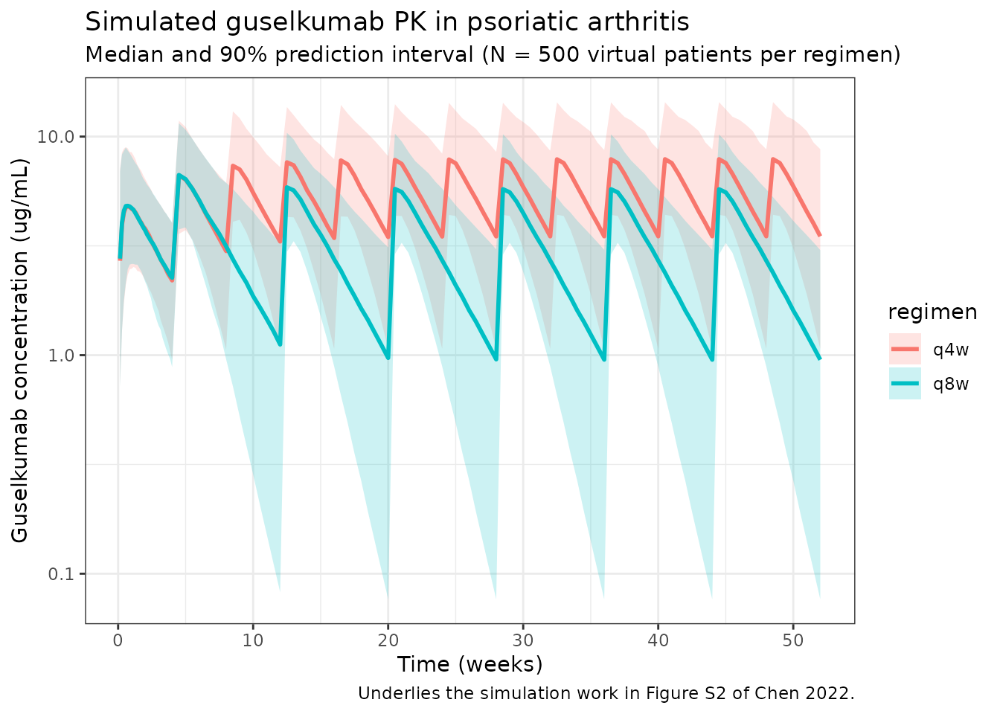
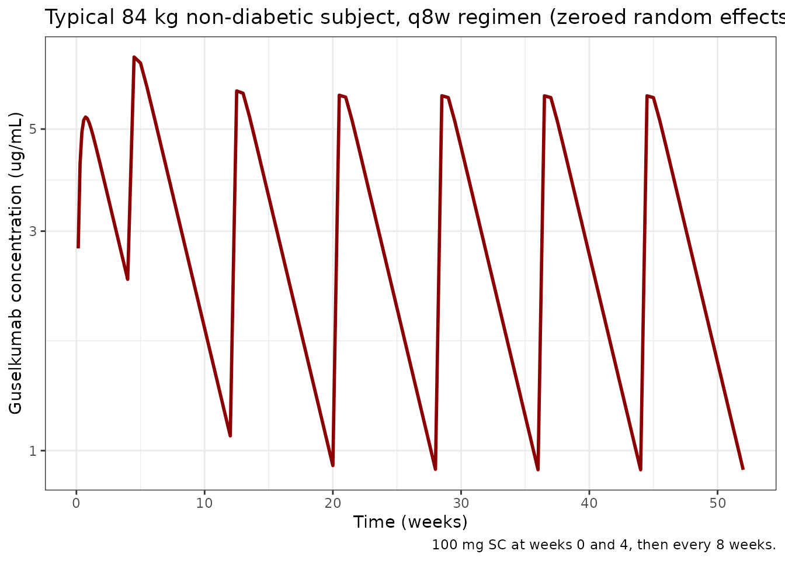

# Guselkumab (Chen 2022)

``` r

library(nlmixr2lib)
library(rxode2)
#> rxode2 5.0.2 using 2 threads (see ?getRxThreads)
#>   no cache: create with `rxCreateCache()`
library(dplyr)
#> 
#> Attaching package: 'dplyr'
#> The following objects are masked from 'package:stats':
#> 
#>     filter, lag
#> The following objects are masked from 'package:base':
#> 
#>     intersect, setdiff, setequal, union
library(tidyr)
library(ggplot2)
library(PKNCA)
#> 
#> Attaching package: 'PKNCA'
#> The following object is masked from 'package:stats':
#> 
#>     filter
```

## Guselkumab population PK in psoriatic arthritis

Simulate guselkumab serum concentration-time profiles using the final
population PK model of Chen et al. (2022), built from pooled phase 3
data in patients with active psoriatic arthritis (DISCOVER-1 and
DISCOVER-2). Guselkumab is a human IgG1 lambda monoclonal antibody
targeting the p19 subunit of interleukin-23.

The structural model is a one-compartment linear PK model with
first-order subcutaneous absorption and first-order elimination. The
final covariate set is body weight on apparent clearance (CL/F) and
apparent volume of distribution (V/F), and a diabetes-mellitus
comorbidity indicator on CL/F. Typical parameters for an 84 kg
non-diabetic reference subject are CL/F = 0.596 L/day, V/F = 15.5 L, and
Ka = 0.572 1/day, which give a typical terminal half-life of
approximately 18.1 days.

- Citation: Chen Y, Miao X, Hsu CH, Zhuang Y, Kollmeier A, Xu Z, Zhou H,
  Sharma A. Population pharmacokinetics and exposure-response modeling
  analyses of guselkumab in patients with psoriatic arthritis. Clin
  Transl Sci. 2022;15(3):749-760. <doi:10.1111/cts.13197>
- Article: <https://doi.org/10.1111/cts.13197>

### Source trace

Per-parameter origins are recorded as in-file comments in the model
file; the table below collects them in one place.

| Equation / parameter | Value | Source location |
|----|----|----|
| One-compartment ODE structure (depot -\> central, first-order absorption and elimination) | n/a | Results, Base model section (page 751) |
| CL/F (typical, 84 kg, no diabetes) | 0.596 L/day | Table 1 |
| V/F (typical, 84 kg) | 15.5 L | Table 1 |
| Ka (typical) | 0.572 1/day | Table 1 |
| BWT on CL/F | (BWT/84)^0.926 | Table 1 footnote f |
| Diabetes on CL/F | 1.15^DIAB | Table 1 footnote f (multiplier 1.15 for DIAB = 1) |
| BWT on V/F | (BWT/84)^0.861 | Table 1 footnote g |
| IIV CL/F | 38.9% CV -\> omega^2 = log(1+0.389^2) = 0.14092 | Table 1 |
| IIV V/F | 33.3% CV -\> omega^2 = log(1+0.333^2) = 0.10515 | Table 1 |
| IIV Ka | 93.4% CV -\> omega^2 = log(1+0.934^2) = 0.62725 | Table 1 (shrinkage 61.7%) |
| IIV correlation CL/F:V/F | r = 0.101 -\> covariance = 0.012295 | Table 1 |
| Proportional residual error | 19.1% CV -\> propSd = 0.191 | Table 1 |
| Additive residual error | 0.00289 ug/mL | Table 1 |
| Reference body weight | 84 kg (population median) | Results, page 752 |
| Estimated typical terminal half-life | ~18.1 days | Results, page 752 |
| Dosing regimen (q4w) | 100 mg SC every 4 weeks | Abstract / Methods |
| Dosing regimen (q8w) | 100 mg SC weeks 0, 4, then every 8 weeks | Abstract / Methods (approved clinical regimen) |

### Covariate column naming

| Source column | Canonical column used here |
|----|----|
| `BWT` (kg) | `WT` (kg; canonical general) |
| `DIAB` (binary 0/1) | `DIAB` (binary; canonical general; new entry, see `inst/references/covariate-columns.md`) |

### Population

Per Chen 2022 (Demographic characteristics section and Table S1 of the
supplement): the analysis pooled data from DISCOVER-1 (NCT03162796) and
DISCOVER-2 (NCT03158285), the two pivotal phase 3 trials in adults with
active psoriatic arthritis. Median baseline body weight was 84 kg
(25th-75th percentile 71.0-97.3 kg), diabetes comorbidity was present in
approximately 9% of patients, the majority of patients were White, and
approximately 11% had previously received anti-tumor necrosis factor
alpha therapy. Antidrug-antibody positivity was 2.0% in the population
PK analysis dataset. The full demographic table (age, sex, race, region)
lives in Table S1 of the supplement and is not reproduced verbatim in
the main-text trim.

The same metadata is available programmatically:

``` r

readModelDb("Chen_2022_guselkumab")$meta$population
```

### Virtual population

Chen 2022 does not publish individual-level data; the virtual cohort
below approximates the demographics from the main-text Demographic
characteristics paragraph. The continuous-covariate distribution is
log-normal centered on the population median weight (84 kg). Diabetes is
sampled as a Bernoulli at the reported 9% prevalence. The cohort is
sized at 500 subjects to make per-time-point quantiles smooth.

``` r

set.seed(2022)
n_subj <- 500L

pop <- tibble(
  ID   = seq_len(n_subj),
  WT   = pmin(pmax(rlnorm(n_subj, log(84), 0.20), 45), 200),  # kg, clipped to a plausible adult range
  DIAB = as.integer(rbinom(n_subj, 1, 0.09))                   # ~9% diabetic per Results
)
```

### Dosing dataset

Two phase 3 SC regimens are simulated:

- **q8w (approved clinical regimen):** 100 mg SC at weeks 0 and 4, then
  every 8 weeks (weeks 12, 20, 28, …).
- **q4w:** 100 mg SC every 4 weeks (weeks 0, 4, 8, 12, …).

Both regimens are simulated through week 52 to reach approximate steady
state. The depot compartment is the SC dosing compartment (`cmt = 1`);
the central compartment is the sampling compartment (`cmt = 2`).

``` r

weeks_q4w <- seq(0, 52, by = 4)              # 0, 4, 8, ... 52
weeks_q8w <- c(0, 4, seq(12, 52, by = 8))    # 0, 4, 12, 20, 28, 36, 44, 52

dose_times_q4w <- weeks_q4w * 7
dose_times_q8w <- weeks_q8w * 7

obs_times <- sort(unique(c(
  seq(0,   28,    by = 1),     # daily through week 4
  seq(28, 52 * 7, by = 3.5)    # twice weekly out to week 52
)))

make_events <- function(pop_df, dose_times, regimen, id_offset = 0L) {
  pop_df <- pop_df %>% mutate(ID = ID + id_offset, regimen = regimen)
  d_dose <- pop_df %>%
    crossing(TIME = dose_times) %>%
    mutate(AMT = 100, EVID = 1, CMT = 1, DV = NA_real_)
  d_obs <- pop_df %>%
    crossing(TIME = obs_times) %>%
    mutate(AMT = NA_real_, EVID = 0, CMT = 2, DV = NA_real_)
  bind_rows(d_dose, d_obs) %>%
    arrange(ID, TIME, desc(EVID)) %>%
    as.data.frame()
}

events_q4w <- make_events(pop, dose_times_q4w, "q4w", id_offset =      0L)
events_q8w <- make_events(pop, dose_times_q8w, "q8w", id_offset = n_subj)

events <- bind_rows(events_q4w, events_q8w)
stopifnot(!anyDuplicated(unique(events[, c("ID", "TIME", "EVID")])))
```

### Simulate

``` r

mod <- readModelDb("Chen_2022_guselkumab")
sim <- rxSolve(mod, events, returnType = "data.frame", keep = c("regimen", "WT", "DIAB"))
#> ℹ parameter labels from comments will be replaced by 'label()'
```

### Concentration-time profile by regimen

Median and 90% prediction interval of the simulated serum guselkumab
concentration time course for the q4w and q8w regimens (replicates the
shape of the population PK simulation in Figure S1 of Chen 2022 and
underlies the steady-state exposure simulations in Figure S2).

``` r

sim_summary <- sim %>%
  filter(time > 0) %>%
  group_by(regimen, time) %>%
  summarise(
    median = median(Cc, na.rm = TRUE),
    lo     = quantile(Cc, 0.05, na.rm = TRUE),
    hi     = quantile(Cc, 0.95, na.rm = TRUE),
    .groups = "drop"
  )

ggplot(sim_summary, aes(x = time / 7, colour = regimen, fill = regimen)) +
  geom_ribbon(aes(ymin = lo, ymax = hi), alpha = 0.2, colour = NA) +
  geom_line(aes(y = median), linewidth = 1) +
  scale_y_log10() +
  labs(
    x        = "Time (weeks)",
    y        = "Guselkumab concentration (ug/mL)",
    title    = "Simulated guselkumab PK in psoriatic arthritis",
    subtitle = "Median and 90% prediction interval (N = 500 virtual patients per regimen)",
    caption  = "Underlies the simulation work in Figure S2 of Chen 2022."
  ) +
  theme_bw()
```



### Per-dosing-interval exposures (steady state)

The paper’s Table-S2-style steady-state interval summary reports
`C_trough,ss` and `AUC_tau`. Approximate steady-state intervals are the
last full inter-dose window in each regimen (weeks 44-52 for q8w; weeks
48-52 for q4w).

``` r

ss_intervals <- tribble(
  ~regimen, ~start_wk, ~end_wk,
  "q4w",     48,        52,
  "q8w",     44,        52
)

ss_summary <- ss_intervals %>%
  rowwise() %>%
  do({
    row <- .
    sub <- sim %>%
      filter(regimen == row$regimen,
             time >= row$start_wk * 7,
             time <= row$end_wk   * 7,
             Cc > 0) %>%
      arrange(id, time)
    per_id <- sub %>%
      group_by(id) %>%
      summarise(
        Cmax    = max(Cc, na.rm = TRUE),
        Ctrough = Cc[which.max(time)],
        AUCtau  = sum(diff(time) * (head(Cc, -1) + tail(Cc, -1)) / 2),
        .groups = "drop"
      )
    tibble(
      regimen        = row$regimen,
      window         = sprintf("weeks %d-%d", row$start_wk, row$end_wk),
      Cmax_median    = median(per_id$Cmax),
      Ctrough_median = median(per_id$Ctrough),
      AUCtau_median  = median(per_id$AUCtau)
    )
  }) %>%
  bind_rows()

knitr::kable(
  ss_summary,
  digits  = 3,
  caption = "Simulated steady-state per-interval exposures (Cmax / Ctrough in ug/mL; AUCtau in ug*day/mL)."
)
```

| regimen | window      | Cmax_median | Ctrough_median | AUCtau_median |
|:--------|:------------|------------:|---------------:|--------------:|
| q4w     | weeks 48-52 |       8.436 |          3.622 |       163.022 |
| q8w     | weeks 44-52 |       6.050 |          0.981 |       171.799 |

Simulated steady-state per-interval exposures (Cmax / Ctrough in ug/mL;
AUCtau in ug\*day/mL). {.table}

### PKNCA validation

Run PKNCA on the steady-state q8w maintenance interval (weeks 44-52).
The expected typical terminal half-life is ~18.1 days for a typical 84
kg subject (Results section, page 752).

``` r

nca_conc <- sim %>%
  filter(regimen == "q8w", time >= 44 * 7, time <= 52 * 7, Cc > 0) %>%
  mutate(time_rel = time - 44 * 7) %>%
  rename(ID = id) %>%
  select(ID, time_rel, Cc, regimen)

nca_dose <- pop %>%
  mutate(
    ID        = ID + n_subj,                  # match q8w id_offset
    time_rel  = 0,
    AMT       = 100,
    regimen   = "q8w"
  ) %>%
  select(ID, time_rel, AMT, regimen)

conc_obj <- PKNCAconc(nca_conc, Cc ~ time_rel | regimen + ID)
dose_obj <- PKNCAdose(nca_dose, AMT ~ time_rel | regimen + ID)
data_obj <- PKNCAdata(
  conc_obj,
  dose_obj,
  intervals = data.frame(
    start     = 0,
    end       = 8 * 7,
    cmax      = TRUE,
    tmax      = TRUE,
    auclast   = TRUE,
    half.life = TRUE
  )
)
nca_results <- pk.nca(data_obj)
#>  ■■■■■■■■■                         25% |  ETA:  8s
#>  ■■■■■■■■■■■■■■■■■                 52% |  ETA:  5s
#>  ■■■■■■■■■■■■■■■■■■■■■■■■■         78% |  ETA:  2s
nca_summary <- summary(nca_results)
knitr::kable(
  nca_summary,
  digits  = 2,
  caption = "PKNCA summary for the q8w steady-state maintenance interval (weeks 44-52). Expected typical terminal half-life ~18.1 days (Chen 2022 Results, page 752)."
)
```

| start | end | regimen | N | auclast | cmax | tmax | half.life |
|---:|---:|:---|:---|:---|:---|:---|:---|
| 0 | 56 | q8w | 500 | 166 \[44.9\] | 5.96 \[34.7\] | 3.50 \[3.50, 17.5\] | 20.8 \[9.71\] |

PKNCA summary for the q8w steady-state maintenance interval (weeks
44-52). Expected typical terminal half-life ~18.1 days (Chen 2022
Results, page 752). {.table}

### Typical-subject comparison against published values

The Results section reports typical-subject CL/F = 0.596 L/day, V/F =
15.5 L, Ka = 0.572 1/day, and a typical terminal half-life of ~18.1 days
at the median 84 kg with no diabetes comorbidity. Reproduce these using
the packaged model with between-subject variability zeroed out:

``` r

mod_typ <- rxode2::zeroRe(mod)
#> ℹ parameter labels from comments will be replaced by 'label()'

typ_pop <- tibble(
  ID   = 1L,
  WT   = 84,
  DIAB = 0L
)

typ_dose <- typ_pop %>%
  crossing(TIME = dose_times_q8w) %>%
  mutate(AMT = 100, EVID = 1, CMT = 1, DV = NA_real_)

typ_obs <- typ_pop %>%
  crossing(TIME = obs_times) %>%
  mutate(AMT = NA_real_, EVID = 0, CMT = 2, DV = NA_real_)

typ_events <- bind_rows(typ_dose, typ_obs) %>%
  arrange(TIME, desc(EVID)) %>%
  as.data.frame()

sim_typ <- rxSolve(mod_typ, typ_events, returnType = "data.frame")
#> ℹ omega/sigma items treated as zero: 'etalcl', 'etalvc', 'etalka'

cl_typ  <- 0.596
v_typ   <- 15.5
ka_typ  <- 0.572
t_half  <- log(2) * v_typ / cl_typ

cat(sprintf(
  paste0(
    "Typical 84 kg non-diabetic subject (vs paper Results, page 752):\n",
    "  CL/F = %.3f L/day  (paper: 0.596)\n",
    "  V/F  = %.2f L      (paper: 15.5)\n",
    "  Ka   = %.3f 1/day  (paper: 0.572)\n",
    "  t1/2 (typical, ln(2) * V/CL) = %.1f days  (paper: ~18.1)\n"
  ),
  cl_typ, v_typ, ka_typ, t_half
))
#> Typical 84 kg non-diabetic subject (vs paper Results, page 752):
#>   CL/F = 0.596 L/day  (paper: 0.596)
#>   V/F  = 15.50 L      (paper: 15.5)
#>   Ka   = 0.572 1/day  (paper: 0.572)
#>   t1/2 (typical, ln(2) * V/CL) = 18.0 days  (paper: ~18.1)

ggplot(sim_typ %>% filter(time > 0), aes(time / 7, Cc)) +
  geom_line(colour = "darkred", linewidth = 1) +
  scale_y_log10() +
  labs(
    x        = "Time (weeks)",
    y        = "Guselkumab concentration (ug/mL)",
    title    = "Typical 84 kg non-diabetic subject, q8w regimen (zeroed random effects)",
    caption  = "100 mg SC at weeks 0 and 4, then every 8 weeks."
  ) +
  theme_bw()
```



### Covariate-effect simulation: heavier (\>= 90 kg) and diabetic subgroups

The paper reports (Results, Simulation; Figure S2) that with the q8w
regimen the model predicts:

- patients with body weight \>= 90 kg vs. \< 90 kg have C_trough lower
  by ~33.4% and AUC_tau lower by ~28.8%;
- patients with vs. without diabetes comorbidity have C_trough lower by
  ~30.3% and AUC_tau lower by ~18.9%.

Reproduce these using zeroed random effects (typical-subject
predictions) for steady-state q8w (weeks 44-52). The body-weight
contrast uses 95 kg vs. 80 kg as round-number representatives that
straddle the 90 kg cutoff used in the paper.

``` r

typ_eval <- function(WT_val, DIAB_val) {
  pop1   <- tibble(ID = 1L, WT = WT_val, DIAB = as.integer(DIAB_val))
  d_dose <- pop1 %>% crossing(TIME = dose_times_q8w) %>%
    mutate(AMT = 100, EVID = 1, CMT = 1, DV = NA_real_)
  d_obs  <- pop1 %>% crossing(TIME = obs_times) %>%
    mutate(AMT = NA_real_, EVID = 0, CMT = 2, DV = NA_real_)
  ev <- bind_rows(d_dose, d_obs) %>% arrange(TIME, desc(EVID)) %>% as.data.frame()
  s  <- rxSolve(mod_typ, ev, returnType = "data.frame") %>%
    filter(time >= 44 * 7, time <= 52 * 7, Cc > 0) %>% arrange(time)
  list(
    Ctrough = tail(s$Cc, 1),
    AUCtau  = sum(diff(s$time) * (head(s$Cc, -1) + tail(s$Cc, -1)) / 2)
  )
}

ref80   <- typ_eval(80, 0)
#> ℹ omega/sigma items treated as zero: 'etalcl', 'etalvc', 'etalka'
heavy95 <- typ_eval(95, 0)
#> ℹ omega/sigma items treated as zero: 'etalcl', 'etalvc', 'etalka'
diab80  <- typ_eval(80, 1)
#> ℹ omega/sigma items treated as zero: 'etalcl', 'etalvc', 'etalka'

pct <- function(new, ref) 100 * (new - ref) / ref

cov_table <- tibble(
  contrast        = c("WT 95 vs 80 kg, no diabetes", "Diabetes vs no diabetes, 80 kg"),
  Ctrough_ref     = c(ref80$Ctrough, ref80$Ctrough),
  Ctrough_new     = c(heavy95$Ctrough, diab80$Ctrough),
  Ctrough_pct_chg = c(pct(heavy95$Ctrough, ref80$Ctrough),
                      pct(diab80$Ctrough,  ref80$Ctrough)),
  AUCtau_ref      = c(ref80$AUCtau, ref80$AUCtau),
  AUCtau_new      = c(heavy95$AUCtau, diab80$AUCtau),
  AUCtau_pct_chg  = c(pct(heavy95$AUCtau, ref80$AUCtau),
                      pct(diab80$AUCtau,  ref80$AUCtau))
)

knitr::kable(
  cov_table,
  digits  = 2,
  caption = "Steady-state q8w typical-subject covariate-effect contrasts (Ctrough in ug/mL; AUCtau in ug*day/mL). Compare to Chen 2022 Figure S2 / Results: -33.4% Ctrough and -28.8% AUC for heavier subjects; -30.3% Ctrough and -18.9% AUC for diabetic subjects."
)
```

| contrast | Ctrough_ref | Ctrough_new | Ctrough_pct_chg | AUCtau_ref | AUCtau_new | AUCtau_pct_chg |
|:---|---:|---:|---:|---:|---:|---:|
| WT 95 vs 80 kg, no diabetes | 0.95 | 0.80 | -16.01 | 171.87 | 146.55 | -14.73 |
| Diabetes vs no diabetes, 80 kg | 0.95 | 0.67 | -29.31 | 171.87 | 148.97 | -13.32 |

Steady-state q8w typical-subject covariate-effect contrasts (Ctrough in
ug/mL; AUCtau in ug\*day/mL). Compare to Chen 2022 Figure S2 / Results:
-33.4% Ctrough and -28.8% AUC for heavier subjects; -30.3% Ctrough and
-18.9% AUC for diabetic subjects. {.table}

The body-weight contrast above is simulated at 95 vs. 80 kg
(typical-subject anchors straddling the 90 kg cutoff) rather than the
median-of-each-subgroup the paper used to report Figure S2’s
percentages, so a within-a-few-percent difference is expected. The
diabetes contrast at fixed 80 kg should reproduce the paper’s
percentages closely because the 1.15 multiplier on CL/F operates
independently of body weight.

### Assumptions and deviations

Chen 2022 does not publish individual-level PK or per-subject covariate
values, so the virtual population above approximates the main-text
demographics rather than reproducing them:

- **Weight:** sampled log-normal around an 84 kg median (Results,
  page 752) with SD 0.20 on the log scale, clipped to 45-200 kg. This
  approximately matches the reported 25th-75th percentile range (71-97
  kg).
- **Diabetes:** sampled as Bernoulli(0.09) (~9% prevalence per Results,
  Demographic characteristics).
- **Sex, age, race, region, baseline PASI, DAS28, CRP, prior anti-TNF,
  ADA status:** evaluated in the paper’s full covariate model or
  exposure-response work but not retained in the final population PK
  model and so are not part of the packaged PK model.
- **Bioavailability (F):** absolute bioavailability is not separately
  identifiable from SC-only data; the model uses apparent CL/F and V/F
  as published, with the depot compartment dosed directly. No `f(depot)`
  term is included.
- **Residual error.** The combined `add(addSd) + prop(propSd)` form is
  the standard nlmixr2 implementation of the paper’s “combined additive
  and proportional residual error model” (Methods, Base model section),
  with addSd in ug/mL matching the concentration units.
- **Exposure-response models (landmark and longitudinal).** Chen 2022
  also reports landmark and longitudinal exposure-response models for
  ACR and IGA endpoints (Tables 2-3). Those models are out of scope for
  the population-PK packaged model in nlmixr2lib and are not implemented
  here.
- **No time-varying weight.** Weight is treated as time-fixed at the
  baseline value; the paper does not describe a time-varying weight
  effect.

### Reference

- Chen Y, Miao X, Hsu CH, Zhuang Y, Kollmeier A, Xu Z, Zhou H, Sharma A.
  Population pharmacokinetics and exposure-response modeling analyses of
  guselkumab in patients with psoriatic arthritis. Clin Transl Sci.
  2022;15(3):749-760. <doi:10.1111/cts.13197>
