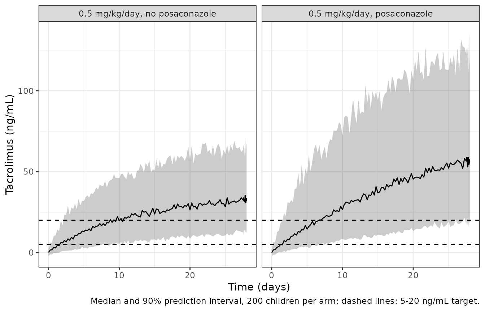

# Tacrolimus with posaconazole (Chen 2022)

## Model and source

- Citation: Chen X, Wang D, Zheng F, Zhu L, Huang Y, Zhu Y, Huang Y, Xu
  H, Li Z. Effects of posaconazole on tacrolimus population
  pharmacokinetics and initial dose in children with Crohn’s disease
  undergoing hematopoietic stem cell transplantation. Front Pharmacol.
  2022;13:758524. <doi:10.3389/fphar.2022.758524>.
- Description: One-compartment population PK model with first-order
  absorption for oral tacrolimus whole-blood concentrations in children
  with Crohn’s disease undergoing haematopoietic stem cell
  transplantation at a single centre in China (Chen 2022). The
  absorption rate constant ka is fixed at 4.48 1/h from the literature.
  Apparent oral clearance CL/F is allometrically scaled by body weight
  (fixed exponent 0.75, reference 70 kg) and reduced by 57% with
  concomitant posaconazole; apparent volume V/F is scaled linearly by
  body weight (fixed exponent 1). Exponential IIV on CL/F and V/F;
  combined proportional + additive residual error.
- Article: <https://doi.org/10.3389/fphar.2022.758524> (open access,
  PMC9043134)

Chen et al. (2022) fitted a one-compartment model with first-order
absorption to routine therapeutic-drug-monitoring trough concentrations
of oral tacrolimus in children with Crohn’s disease undergoing
haematopoietic stem cell transplantation (HSCT). Body weight (fixed
allometric exponents, 70 kg reference) and concomitant posaconazole were
retained; posaconazole lowers CL/F to 43% of its value without the
azole. Because every sample was a trough, the absorption rate constant
was fixed at 4.48 1/h from earlier paediatric tacrolimus models. The
paper then used Monte Carlo simulation to recommend weight-banded
initial doses with and without posaconazole.

The same group published a structurally identical model for children
with chronic granulomatous disease co-treated with voriconazole
(`Chen_2021a_tacrolimus`); its vignette uses the same validation
approach.

## Population

Fifty-one children (32 boys, 19 girls) treated at the Children’s
Hospital of Fudan University between October 2017 and December 2020
contributed 424 whole-blood tacrolimus trough concentrations (about
eight per child), measured by the Emit 2000 immunoassay. From Table 1:
age median 1.36 (range 0.27-7.58) years and weight median 9.50
(3.70-20.60) kg. Twelve children received posaconazole; glucocorticoids
(40/51), omeprazole (41/51) and mycophenolic acid (26/51) were also
common but were not retained as covariates. The same information is
stored in the model metadata:

``` r

str(rxode2::rxode(readModelDb("Chen_2022_tacrolimus"))$population)
#> ℹ parameter labels from comments will be replaced by 'label()'
#> List of 14
#>  $ species         : chr "human"
#>  $ n_subjects      : int 51
#>  $ n_studies       : int 1
#>  $ n_concentrations: int 424
#>  $ age_range       : chr "0.27-7.58 years (median 1.36; mean +/- SD 1.86 +/- 1.38)"
#>  $ weight_range    : chr "3.70-20.60 kg (median 9.50; mean +/- SD 9.85 +/- 3.41)"
#>  $ sex_female_pct  : num 37.3
#>  $ race_ethnicity  : chr "Not reported (single centre in Shanghai, China)"
#>  $ disease_state   : chr "Crohn's disease undergoing haematopoietic stem cell transplantation (HSCT), paediatric"
#>  $ dose_range      : chr "Oral tacrolimus, initial dose 0.33-2 mg/day, then adjusted by TDM. Simulations used 0.1-0.8 mg/kg/day divided into two doses."
#>  $ regions         : chr "China (single centre: Children's Hospital of Fudan University, Shanghai)"
#>  $ co_medication   : chr "Posaconazole 12/51, glucocorticoids 40/51, omeprazole 41/51, mycophenolic acid 26/51 (Table 1)."
#>  $ sampling_design : chr "Retrospective routine TDM, October 2017 - December 2020; 424 whole-blood trough concentrations (about eight per"| __truncated__
#>  $ notes           : chr "32 boys and 19 girls. Estimated in NONMEM 7 by FOCE-I; 1000-replicate bootstrap and pcVPC. All concentrations w"| __truncated__
```

## Source trace

| Element | Value | Source |
|----|----|----|
| Structure: 1-compartment, first-order absorption and elimination | – | Methods, ‘PPK Model’ (CL/F, V/F, Ka) |
| `lka` | 4.48 1/h (fixed) | Methods ‘PPK Model’; Table 2 (Yang 2015; Wang 2019) |
| `lcl` | 19.8 L/h | Table 2; Results equation 6 |
| `lvc` | 11300 L | Table 2 (113 x 10^2 L); Results equation 7 |
| `e_wt_cl` | 0.75 (fixed), reference 70 kg | Methods equation 3; Results equation 6 |
| `e_wt_vc` | 1 (fixed), reference 70 kg | Methods equation 3; Results equation 7 |
| `e_conmed_posaconazole_cl` | -0.57 | Table 2 (theta POS); Results equation 6 |
| Posaconazole form `(1 + theta * POS)` | – | Methods equation 5; Results equation 6 |
| Exponential IIV `P = TV(P) * exp(eta)` | – | Methods equation 1 |
| `etalcl` | 0.349^2 = 0.121801 | Table 2 (omega CL/F = 0.349, read as SD; see below) |
| `etalvc` | 0.859^2 = 0.737881 | Table 2 (omega V/F = 0.859, read as SD; see below) |
| Residual `O = IP * (1 + eps1) + eps2` | – | Methods equation 2 |
| `propSd` | 0.259 | Table 2 (sigma1, proportional) |
| `addSd` | 1.353 ng/mL | Table 2 (sigma2, additive) |

## Figure 3: typical CL/F per kilogram

Figure 3 plots the typical tacrolimus CL/F (L/h/kg) against body weight
from 5 to 20 kg, without (a) and with (b) posaconazole. The maintainers
digitised the curves at 5, 10, 15 and 20 kg from the pixel centroid of
each line. The model’s typical-value `cl` divided by weight should
reproduce them, and the posaconazole curve should be 43% of the other at
every weight.

``` r

mod <- readModelDb("Chen_2022_tacrolimus")
m0 <- rxode2::zeroRe(mod)
#> ℹ parameter labels from comments will be replaced by 'label()'

# Typical-value solves use the model with its random effects zeroed. With
# several subjects rxode2 warns that there is no omega, which is intended here
# (the eta values, where used, are supplied as data columns).
solve_typical <- function(events, ...) {
  withCallingHandlers(
    rxode2::rxSolve(m0, events = events, returnType = "data.frame", ...),
    warning = function(w) {
      if (grepl("omega", conditionMessage(w))) invokeRestart("muffleWarning")
    }
  )
}

fig3_digitised <- tibble::tribble(
  ~WT, ~CONMED_POSACONAZOLE, ~digitised,
  5,  0, 0.5476,
  10, 0, 0.4604,
  15, 0, 0.4157,
  20, 0, 0.3872,
  5,  1, 0.2351,
  10, 1, 0.1977,
  15, 1, 0.1789,
  20, 1, 0.1662
)

ev3 <- fig3_digitised |>
  mutate(id = row_number(), time = 1, evid = 0L, amt = 0, cmt = "central") |>
  select(id, time, evid, amt, cmt, WT, CONMED_POSACONAZOLE)
sim3 <- solve_typical(ev3, keep = c("WT", "CONMED_POSACONAZOLE"))
#> ℹ omega/sigma items treated as zero: 'etalcl', 'etalvc'
fig3 <- fig3_digitised |>
  left_join(
    sim3 |> transmute(WT, CONMED_POSACONAZOLE, model = cl / WT),
    by = c("WT", "CONMED_POSACONAZOLE")
  ) |>
  mutate(pct_diff = 100 * (model / digitised - 1))

fig3 |>
  mutate(
    Posaconazole = ifelse(CONMED_POSACONAZOLE == 1, "yes", "no"),
    across(c(digitised, model), ~ signif(.x, 3)),
    pct_diff = round(pct_diff, 2)
  ) |>
  select(WT, Posaconazole, digitised, model, pct_diff) |>
  rename(
    "Weight (kg)" = WT,
    "Figure 3 (L/h/kg)" = digitised,
    "Model (L/h/kg)" = model,
    "Difference (%)" = pct_diff
  ) |>
  knitr::kable()
```

| Weight (kg) | Posaconazole | Figure 3 (L/h/kg) | Model (L/h/kg) | Difference (%) |
|------------:|:-------------|------------------:|---------------:|---------------:|
|           5 | no           |             0.548 |          0.547 |          -0.08 |
|          10 | no           |             0.460 |          0.460 |          -0.07 |
|          15 | no           |             0.416 |          0.416 |           0.01 |
|          20 | no           |             0.387 |          0.387 |          -0.08 |
|           5 | yes          |             0.235 |          0.235 |           0.07 |
|          10 | yes          |             0.198 |          0.198 |           0.07 |
|          15 | yes          |             0.179 |          0.179 |          -0.07 |
|          20 | yes          |             0.166 |          0.166 |           0.10 |

``` r


stopifnot(
  nrow(fig3) == 8L,
  !anyNA(fig3$model),
  # Deterministic typical values against a pixel-centroid digitisation that
  # reads to about 0.0015 L/h/kg (~0.8% on the posaconazole curve). Realised
  # maximum 0.1%. A wrong allometric exponent (1 instead of 0.75) flattens the
  # curve and misses by >30% at 5 or 20 kg; a mis-read theta_POS moves the
  # whole lower curve.
  max(abs(fig3$pct_diff)) < 2
)
```

``` r

wt_grid <- seq(5, 20, by = 0.5)
ev3c <- expand.grid(WT = wt_grid, CONMED_POSACONAZOLE = c(0, 1)) |>
  mutate(id = row_number(), time = 1, evid = 0L, amt = 0, cmt = "central")
curve3 <- solve_typical(ev3c, keep = c("WT", "CONMED_POSACONAZOLE"))
#> ℹ omega/sigma items treated as zero: 'etalcl', 'etalvc'
ggplot() +
  geom_line(
    data = curve3,
    aes(WT, cl / WT, colour = factor(CONMED_POSACONAZOLE))
  ) +
  geom_point(
    data = fig3,
    aes(WT, digitised, colour = factor(CONMED_POSACONAZOLE))
  ) +
  scale_colour_manual(
    values = c("0" = "#1b9e77", "1" = "#d95f02"),
    labels = c("0" = "without posaconazole", "1" = "with posaconazole"),
    name = NULL
  ) +
  scale_y_continuous(limits = c(0, 0.7)) +
  labs(x = "Weight (kg)", y = "CL/F (L/h/kg)") +
  theme_bw()
```


Replicates Figure 3 of Chen 2022: typical CL/F per kilogram against
weight. Lines are the model; points are digitised from the figure.

## Figures 5 and 6: target attainment and concentration percentiles

Figures 5 (without posaconazole) and 6 (with posaconazole) report, for
1,000 virtual children per scenario, the percentage of simulated
tacrolimus concentrations within 5-20 ng/mL (panel A) at body weights of
5, 10, 15 and 20 kg and initial doses of 0.1-0.8 mg/kg/day divided into
two doses (every 12 h). Panels B-I show the median and the 5th and 95th
percentiles of the simulated concentration for each dose. The
maintainers digitised all 64 points of the two panel A plots, and the
three percentiles at 5 and 20 kg from panel B (0.1 mg/kg/day) of each
figure. Panels C-I are panel B scaled by the dose (their digitised
medians at 0.8 mg/kg/day are eight times those at 0.1 mg/kg/day to
within 0.5%), so they add no further information.

These figures are also the best evidence for the scale of Table 2’s
variability rows. Table 2 prints omega CL/F = 0.349 and omega V/F =
0.859 without saying whether they are standard deviations or variances.
The spread of the simulated concentrations depends directly on that
choice, so we compute everything under both readings.

The paper calls these “steady-state” concentrations but does not state
the sampling time. With V/F = 11300 L at 70 kg the tacrolimus half-life
in these children is 10 days or more, so a true steady state would not
be reached for weeks. We therefore compute every 12-h trough from 12 h
to 120 h and let the figures pick the time, separately for each reading.

To make the result exact and machine-independent, the virtual children
are a deterministic 30 x 30 quantile grid of (eta CL/F, eta V/F) passed
as data to the model with its random effects zeroed, rather than random
draws. The model is linear in dose, so one solve at 0.1 mg/kg/day is
scaled to the other seven doses.

``` r

pta_digitised <- tibble::tribble(
  ~dose, ~`5`, ~`10`, ~`15`, ~`20`, ~CONMED_POSACONAZOLE,
  0.1, 2.9, 4.4, 5.0, 5.5, 0,
  0.2, 26.1, 28.1, 29.4, 29.2, 0,
  0.3, 46.9, 48.1, 48.2, 48.1, 0,
  0.4, 59.6, 59.1, 59.0, 58.5, 0,
  0.5, 65.7, 66.2, 65.2, 64.8, 0,
  0.6, 67.5, 65.4, 63.9, 63.8, 0,
  0.7, 65.8, 63.3, 62.4, 61.9, 0,
  0.8, 62.8, 61.0, 59.6, 59.8, 0,
  0.1, 8.1, 8.6, 8.7, 8.8, 1,
  0.2, 32.3, 33.1, 33.2, 33.4, 1,
  0.3, 49.2, 49.0, 48.9, 48.9, 1,
  0.4, 57.6, 57.2, 57.5, 57.4, 1,
  0.5, 62.6, 62.3, 61.8, 61.5, 1,
  0.6, 61.1, 60.5, 59.8, 59.7, 1,
  0.7, 59.8, 59.3, 58.6, 58.4, 1,
  0.8, 56.9, 55.9, 55.8, 55.5, 1
) |>
  pivot_longer(c(`5`, `10`, `15`, `20`), names_to = "WT", values_to = "published") |>
  mutate(WT = as.numeric(WT))

# Panel B of each figure: concentrations (ng/mL) at 0.1 mg/kg/day
pct_digitised <- tibble::tribble(
  ~CONMED_POSACONAZOLE, ~WT, ~p05, ~p50, ~p95,
  0, 5,  0.45, 1.60, 4.55,
  0, 20, 0.47, 1.67, 5.05,
  1, 5,  0.45, 1.75, 5.78,
  1, 20, 0.45, 1.78, 6.23
)
stopifnot(nrow(pta_digitised) == 64L, !anyNA(pta_digitised$published))
```

``` r

ng <- 30
zq <- qnorm((seq_len(ng) - 0.5) / ng)
eta_grid <- expand.grid(zc = zq, zv = zq)
trough_times <- seq(12, 120, by = 12)
scenarios <- expand.grid(WT = c(5, 10, 15, 20), CONMED_POSACONAZOLE = c(0, 1))

# "SD" is the eta SD the model file encodes (sqrt of its omega diagonal), so a
# model that encoded the other reading would fail the assertions below.
# "variance" is the rejected alternative: Table 2's printed value (0.349,
# 0.859) taken as a variance, i.e. the square root of the printed value.
omega_model <- rxode2::rxode(mod)$omega
#> ℹ parameter labels from comments will be replaced by 'label()'
sd_encoded <- sqrt(diag(omega_model))[c("etalcl", "etalvc")]
stopifnot(isTRUE(all.equal(unname(sd_encoded), c(0.349, 0.859))))
readings <- list(
  SD = c(cl = unname(sd_encoded[["etalcl"]]), v = unname(sd_encoded[["etalvc"]])),
  variance = sqrt(c(cl = 0.349, v = 0.859))
)

build_grid_events <- function(om, reading, id0) {
  arms <- vector("list", nrow(scenarios))
  for (s in seq_len(nrow(scenarios))) {
    subj <- data.frame(
      id = id0 + (s - 1) * nrow(eta_grid) + seq_len(nrow(eta_grid)),
      WT = scenarios$WT[s],
      CONMED_POSACONAZOLE = scenarios$CONMED_POSACONAZOLE[s],
      etalcl = om[["cl"]] * eta_grid$zc,
      etalvc = om[["v"]] * eta_grid$zv,
      reading = reading
    )
    # 0.1 mg/kg/day divided into two doses every 12 h
    dose <- tidyr::crossing(subj, time = seq(0, max(trough_times) - 12, by = 12)) |>
      mutate(evid = 1L, amt = 0.1 * WT / 2, cmt = "depot")
    obs <- tidyr::crossing(subj, time = trough_times) |>
      mutate(evid = 0L, amt = 0, cmt = "central")
    arms[[s]] <- bind_rows(dose, obs)
  }
  bind_rows(arms)
}

ev56 <- bind_rows(
  build_grid_events(readings$SD, "SD", 0L),
  build_grid_events(readings$variance, "variance", 100000L)
) |>
  arrange(id, time, desc(evid))

sim56 <- solve_typical(ev56, keep = c("WT", "CONMED_POSACONAZOLE", "reading"))
#> ℹ omega/sigma items treated as zero: 'etalcl', 'etalvc'
#> [====|====|====|====|====|====|====|====|====|====] 0:00:06
stopifnot(
  !anyNA(sim56$Cc),
  nrow(sim56) == 2L * nrow(scenarios) * nrow(eta_grid) * length(trough_times)
)

ruv <- rxode2::rxode(mod)$iniDf
#> ℹ parameter labels from comments will be replaced by 'label()'
prop_sd <- ruv$est[ruv$name == "propSd"]
add_sd <- ruv$est[ruv$name == "addSd"]

pta <- sim56 |>
  tidyr::crossing(dose = seq(0.1, 0.8, by = 0.1)) |>
  mutate(
    conc = Cc * dose / 0.1,
    in_ipred = conc >= 5 & conc <= 20,
    res_sd = sqrt(add_sd^2 + (prop_sd * conc)^2),
    in_obs = pnorm(20, conc, res_sd) - pnorm(5, conc, res_sd)
  ) |>
  group_by(reading, time, WT, CONMED_POSACONAZOLE, dose) |>
  summarise(
    pta_ipred = 100 * mean(in_ipred),
    pta_obs = 100 * mean(in_obs),
    .groups = "drop"
  ) |>
  mutate(dose = round(dose, 1))

pct_model <- sim56 |>
  group_by(reading, time, WT, CONMED_POSACONAZOLE) |>
  summarise(
    m05 = unname(quantile(Cc, 0.05)),
    m50 = median(Cc),
    m95 = unname(quantile(Cc, 0.95)),
    .groups = "drop"
  )

scored <- pta |>
  inner_join(pta_digitised, by = c("WT", "CONMED_POSACONAZOLE", "dose")) |>
  group_by(reading, time) |>
  summarise(
    n = n(),
    rmse_ipred = sqrt(mean((pta_ipred - published)^2)),
    rmse_obs = sqrt(mean((pta_obs - published)^2)),
    .groups = "drop"
  ) |>
  inner_join(
    pct_model |>
      inner_join(pct_digitised, by = c("WT", "CONMED_POSACONAZOLE")) |>
      group_by(reading, time) |>
      summarise(
        err_p05 = 100 * max(abs(m05 / p05 - 1)),
        err_p50 = 100 * max(abs(m50 / p50 - 1)),
        err_p95 = 100 * max(abs(m95 / p95 - 1)),
        .groups = "drop"
      ),
    by = c("reading", "time")
  )
stopifnot(all(scored$n == 64L), nrow(scored) == 2L * length(trough_times))
```

``` r

scored |>
  filter(time %in% c(48, 60, 72, 84, 96)) |>
  mutate(across(c(rmse_ipred, rmse_obs, starts_with("err_")), ~ round(.x, 2))) |>
  rename(
    "Omega read as" = reading,
    "Trough time (h)" = time,
    "Panel A RMSE, no residual (points)" = rmse_ipred,
    "Panel A RMSE, with residual (points)" = rmse_obs,
    "Max error 5th pct (%)" = err_p05,
    "Max error median (%)" = err_p50,
    "Max error 95th pct (%)" = err_p95
  ) |>
  knitr::kable()
```

| Omega read as | Trough time (h) | n | Panel A RMSE, no residual (points) | Panel A RMSE, with residual (points) | Max error 5th pct (%) | Max error median (%) | Max error 95th pct (%) |
|:---|---:|---:|---:|---:|---:|---:|---:|
| SD | 48 | 64 | 10.38 | 10.09 | 36.92 | 33.14 | 27.98 |
| SD | 60 | 64 | 4.72 | 5.02 | 21.42 | 17.09 | 14.62 |
| SD | 72 | 64 | 0.70 | 2.65 | 6.03 | 1.30 | 4.44 |
| SD | 84 | 64 | 3.75 | 4.63 | 15.91 | 15.07 | 17.09 |
| SD | 96 | 64 | 7.31 | 7.52 | 32.27 | 30.40 | 29.80 |
| variance | 48 | 64 | 10.96 | 10.87 | 43.47 | 33.69 | 22.13 |
| variance | 60 | 64 | 5.55 | 6.38 | 29.55 | 17.51 | 9.16 |
| variance | 72 | 64 | 2.55 | 4.39 | 15.72 | 3.33 | 10.24 |
| variance | 84 | 64 | 4.16 | 5.38 | 3.81 | 14.27 | 23.28 |
| variance | 96 | 64 | 6.79 | 7.60 | 18.49 | 29.96 | 36.60 |

``` r


score_at <- function(rd, t, col) {
  v <- scored[[col]][scored$reading == rd & scored$time == t]
  if (length(v) != 1L) stop("no unique score for ", rd, " at ", t, " h")
  v
}
best_time <- scored |>
  group_by(reading) |>
  summarise(t = time[which.min(rmse_ipred)], rmse = min(rmse_ipred), .groups = "drop")
best_time |>
  rename("Omega read as" = reading, "Best trough time (h)" = t, "Panel A RMSE (points)" = rmse) |>
  knitr::kable(digits = 2)
```

| Omega read as | Best trough time (h) | Panel A RMSE (points) |
|:--------------|---------------------:|----------------------:|
| SD            |                   72 |                  0.70 |
| variance      |                   72 |                  2.55 |

``` r


sd_72 <- score_at("SD", 72, "rmse_ipred")
sd_72_obs <- score_at("SD", 72, "rmse_obs")
var_72 <- scored |> filter(reading == "variance", time == 72)

stopifnot(
  # The SD reading, without residual error, at the trough just before the
  # seventh dose (72 h) reproduces all 64 panel A points. The grid is
  # deterministic, so this does not vary between machines. Realised RMSE
  # about 0.7 percentage points, the precision of the digitisation.
  best_time$t[best_time$reading == "SD"] == 72,
  sd_72 < 1.5,
  # ... and the panel B percentiles: realised worst-case errors 1.3%
  # (median), 4.4% (95th) and 6.0% (5th, which is read off a 0-6 ng/mL axis at
  # 0.45 ng/mL, so one pixel is several percent).
  score_at("SD", 72, "err_p50") < 3,
  score_at("SD", 72, "err_p95") < 7,
  score_at("SD", 72, "err_p05") < 10,
  # The variance reading spreads the concentrations too widely: at the same
  # time (also its own best) its panel A RMSE is 2.55 points and its 95th and
  # 5th percentiles miss by 10.2% and 15.7%. Swapping the readings in the
  # model turns these red.
  var_72$rmse_ipred > 1.5,
  var_72$err_p95 > 7,
  var_72$err_p05 > 10,
  # The paper's percentages are of individual predictions: adding the
  # residual error to the SD reading misses by several times as much
  # (realised 2.65 points).
  sd_72_obs > 2 * sd_72
)
```

The standard-deviation reading, at the trough just before the seventh
dose (72 h, after three days of dosing), reproduces both figures: panel
A to about 0.7 percentage points over 64 points and the panel B median
to within 1.5%. The variance reading, at the same or any other trough
time, is worse on every measure, most visibly in the 95th percentile,
because its wider spread puts too many children above 20 ng/mL. Adding
residual error to the SD reading also misses, so the paper’s figures
were computed from individual predictions. The standard-deviation
reading is encoded in the model. The Table 2 standard errors point the
same way: 15.8% and 14.7% for the two omegas are below `sqrt(2/51)` =
19.8%, the smallest relative standard error a variance estimated from 51
children can have.

``` r

pta72 <- pta |> filter(reading == "SD", time == 72)
ggplot() +
  geom_line(
    data = pta72,
    aes(WT, pta_ipred, colour = factor(dose), group = dose)
  ) +
  geom_point(
    data = pta_digitised,
    aes(WT, published, colour = factor(dose))
  ) +
  facet_wrap(
    ~CONMED_POSACONAZOLE,
    ncol = 1,
    labeller = as_labeller(c(
      "0" = "Figure 5A: without posaconazole",
      "1" = "Figure 6A: with posaconazole"
    ))
  ) +
  labs(
    x = "Weight (kg)",
    y = "Probability within 5-20 ng/mL (%)",
    colour = "Dose (mg/kg/day)"
  ) +
  theme_bw()
```


Replicates Figures 5A and 6A of Chen 2022: probability that the 72-h
trough is within 5-20 ng/mL without (Figure 5A) and with (Figure 6A)
posaconazole. Lines are the model (omega read as SD, no residual error);
points are digitised from the figures.

``` r

pct72 <- pct_model |>
  filter(reading == "SD", time == 72) |>
  pivot_longer(c(m05, m50, m95), names_to = "stat", values_to = "conc") |>
  mutate(stat = sub("^m", "p", stat))
pct_pts <- pct_digitised |>
  pivot_longer(c(p05, p50, p95), names_to = "stat", values_to = "conc")
ggplot() +
  geom_line(data = pct72, aes(WT, conc, colour = stat)) +
  geom_point(data = pct_pts, aes(WT, conc, colour = stat)) +
  facet_wrap(
    ~CONMED_POSACONAZOLE,
    labeller = as_labeller(c(
      "0" = "Figure 5B: without posaconazole",
      "1" = "Figure 6B: with posaconazole"
    ))
  ) +
  scale_colour_manual(
    values = c(p05 = "#d95f02", p50 = "#1f78b4", p95 = "#33a02c"),
    labels = c(p05 = "5th percentile", p50 = "median", p95 = "95th percentile"),
    name = NULL
  ) +
  labs(x = "Weight (kg)", y = "Tacrolimus (ng/mL)") +
  theme_bw()
```


Replicates panel B of Figures 5 and 6 of Chen 2022: median and 5th/95th
percentiles of the 72-h trough at 0.1 mg/kg/day. Lines are the model
(omega read as SD); points are digitised from the figures.

The paper’s recommendations follow from these figures: without
posaconazole, 0.6 mg/kg/day for 5-8.2 kg and 0.5 mg/kg/day for 8.2-20
kg; with posaconazole, 0.5 mg/kg/day for 5-20 kg. At 72 h the
concentration is governed mostly by the very large V/F, so the 57%
reduction in CL/F changes the median by only about 10% (1.60 against
1.75 ng/mL per 0.1 mg/kg/day at 5 kg); the interaction grows as dosing
continues (next section).

## Stochastic simulation of the recommended regimens

A 10-kg child (close to the cohort median weight) receives the
recommended initial dose of 0.5 mg/kg/day, as two doses 12 h apart, for
28 days, with and without posaconazole. There are 200 virtual children
per arm and residual error is included.

``` r

nsub <- 200
arms <- tibble::tribble(
  ~arm, ~CONMED_POSACONAZOLE, ~mgkgday,
  "0.5 mg/kg/day, no posaconazole", 0, 0.5,
  "0.5 mg/kg/day, posaconazole", 1, 0.5
)
wt_vpc <- 10
obs_times <- sort(unique(c(seq(0, 672, by = 6), seq(660, 672, by = 1))))
ev_vpc <- bind_rows(lapply(seq_len(nrow(arms)), function(i) {
  ids <- (i - 1) * nsub + seq_len(nsub)
  subj <- data.frame(
    id = ids,
    WT = wt_vpc,
    CONMED_POSACONAZOLE = arms$CONMED_POSACONAZOLE[i],
    arm = arms$arm[i]
  )
  dose <- tidyr::crossing(subj, time = seq(0, 660, by = 12)) |>
    mutate(evid = 1L, amt = arms$mgkgday[i] * wt_vpc / 2, cmt = "depot")
  obs <- tidyr::crossing(subj, time = obs_times) |>
    mutate(evid = 0L, amt = 0, cmt = "central")
  bind_rows(dose, obs)
})) |>
  arrange(id, time, desc(evid))

rxode2::rxSetSeed(2022)
sim_vpc <- rxode2::rxSolve(mod, events = ev_vpc, keep = c("arm"), returnType = "data.frame")
#> ℹ parameter labels from comments will be replaced by 'label()'

vpc_sum <- sim_vpc |>
  group_by(arm, time) |>
  summarise(
    p05 = quantile(sim, 0.05),
    p50 = quantile(sim, 0.5),
    p95 = quantile(sim, 0.95),
    .groups = "drop"
  )

ggplot(vpc_sum, aes(time / 24, p50)) +
  geom_ribbon(aes(ymin = p05, ymax = p95), alpha = 0.25) +
  geom_line() +
  geom_hline(yintercept = c(5, 20), linetype = "dashed") +
  facet_wrap(~arm) +
  labs(
    x = "Time (days)",
    y = "Tacrolimus (ng/mL)",
    caption = "Median and 90% prediction interval, 200 children per arm; dashed lines: 5-20 ng/mL target."
  ) +
  theme_bw()
```



``` r

# The model-true median of the 72-h individual prediction comes from the
# deterministic eta grid of the Figures 5 and 6 section (10 kg, omega as SD,
# scaled from 0.1 mg/kg/day to each arm's dose). It is not the typical-value
# prediction: at 72 h the concentration is not log-symmetric in eta V/F.
grid_median <- sim56 |>
  filter(reading == "SD", time == 72, WT == wt_vpc) |>
  group_by(CONMED_POSACONAZOLE) |>
  summarise(grid_med_per_01 = median(Cc), .groups = "drop")
chk <- sim_vpc |>
  filter(time == 72) |>
  group_by(arm) |>
  summarise(median_sim = median(Cc), .groups = "drop") |>
  inner_join(arms, by = "arm") |>
  inner_join(grid_median, by = "CONMED_POSACONAZOLE") |>
  mutate(
    median_grid = grid_med_per_01 * mgkgday / 0.1,
    pct_diff = 100 * (median_sim / median_grid - 1)
  )
chk |>
  select(arm, median_sim, median_grid, pct_diff) |>
  rename(
    "Arm" = arm,
    "Simulated median at 72 h (ng/mL)" = median_sim,
    "Deterministic median at 72 h (ng/mL)" = median_grid,
    "Difference (%)" = pct_diff
  ) |>
  knitr::kable(digits = 2)
```

| Arm | Simulated median at 72 h (ng/mL) | Deterministic median at 72 h (ng/mL) | Difference (%) |
|:---|---:|---:|---:|
| 0.5 mg/kg/day, no posaconazole | 8.64 | 8.20 | 5.29 |
| 0.5 mg/kg/day, posaconazole | 9.57 | 8.74 | 9.47 |

``` r

stopifnot(
  nrow(chk) == 2L,
  # 200 children per arm with a log-SD near 0.86 at 72 h give the sample median
  # a standard error of about 8%; 25% is three of them. A dose, unit or volume
  # error moves the median by tens of percent. Realised +5.3% and +9.5%.
  all(abs(chk$pct_diff) < 25)
)

# By day 28 the posaconazole effect on clearance has had time to act: the
# median trough ratio (with / without posaconazole) is well above the 72-h
# ratio of about 1.1. The 1/0.43 = 2.3 clearance ratio is the steady-state limit.
late <- sim_vpc |>
  filter(time == 660) |>
  group_by(arm) |>
  summarise(median_cc = median(Cc), .groups = "drop") |>
  inner_join(arms, by = "arm")
ratio_late <- late$median_cc[late$CONMED_POSACONAZOLE == 1] /
  late$median_cc[late$CONMED_POSACONAZOLE == 0]
ratio_late
#> [1] 1.804809
stopifnot(
  length(ratio_late) == 1L,
  # Realised 1.80 (the typical-value ratio at 660 h is about 1.5; the cohort
  # median sits higher because accumulation is nonlinear in eta). Each sample
  # median carries ~8% error, so the ratio carries ~11%; 1.15 (near the 72-h
  # ratio) is more than three of those below, and 1/0.43 is the steady-state
  # ceiling.
  ratio_late > 1.15,
  ratio_late < 1 / 0.43
)
```

## PKNCA: single-dose typical-value check

The paper reports no non-compartmental results, so there is no published
NCA table to compare against. As an internal check, a single 0.2-mg/kg
dose to a typical 10-kg child is solved for 8,000 h (more than ten
half-lives with posaconazole) and PKNCA’s AUC0-inf should equal
Dose/(CL/F).

``` r

nca_times <- sort(unique(c(0, 0.05, 0.1, 0.2, 0.3, 0.5, 0.75, 1, 1.5, 2, 3, 4, 6, 8, 12, seq(24, 8000, by = 24))))
ev_nca <- bind_rows(lapply(c(0, 1), function(p) {
  id <- p + 1L
  bind_rows(
    data.frame(id = id, time = 0, evid = 1L, amt = 0.2 * 10, cmt = "depot"),
    data.frame(id = id, time = nca_times, evid = 0L, amt = 0, cmt = "central")
  ) |>
    mutate(
      WT = 10,
      CONMED_POSACONAZOLE = p,
      treatment = ifelse(p == 1, "posaconazole", "no posaconazole")
    )
})) |>
  arrange(id, time, desc(evid))
sim_nca <- solve_typical(ev_nca, keep = c("treatment"), rtol = 1e-10, atol = 1e-12)
#> ℹ omega/sigma items treated as zero: 'etalcl', 'etalvc'
stopifnot(all(sim_nca$Cc >= -1e-6 * max(sim_nca$Cc)))

conc_nca <- sim_nca |>
  filter(!is.na(Cc)) |>
  mutate(Cc = pmax(Cc, 0)) |>
  select(id, time, Cc, treatment)
dose_nca <- ev_nca |>
  filter(evid == 1) |>
  select(id, time, amt, treatment)

o_conc <- PKNCA::PKNCAconc(conc_nca, Cc ~ time | treatment + id)
o_dose <- PKNCA::PKNCAdose(dose_nca, amt ~ time | treatment + id)
o_data <- PKNCA::PKNCAdata(
  o_conc,
  o_dose,
  intervals = data.frame(
    start = 0,
    end = Inf,
    cmax = TRUE,
    tmax = TRUE,
    aucinf.obs = TRUE,
    half.life = TRUE
  )
)
o_nca <- PKNCA::pk.nca(o_data)

nca_wide <- as.data.frame(o_nca$result) |>
  filter(PPTESTCD %in% c("cmax", "tmax", "aucinf.obs", "half.life")) |>
  select(treatment, PPTESTCD, PPORRES) |>
  pivot_wider(names_from = PPTESTCD, values_from = PPORRES)

typ <- sim_nca |>
  distinct(treatment, cl, vc)
nca_chk <- nca_wide |>
  inner_join(typ, by = "treatment") |>
  mutate(
    # dose mg / (L/h) = mg*h/L; x1000 to ng*h/mL
    auc_expected = 1000 * 0.2 * 10 / cl,
    thalf_expected = log(2) * vc / cl,
    auc_pct = 100 * (aucinf.obs / auc_expected - 1),
    thalf_pct = 100 * (half.life / thalf_expected - 1)
  )

nca_chk |>
  select(treatment, cmax, tmax, aucinf.obs, auc_expected, auc_pct, half.life, thalf_expected, thalf_pct) |>
  rename(
    "Treatment" = treatment,
    "Cmax (ng/mL)" = cmax,
    "Tmax (h)" = tmax,
    "AUC0-inf (ng*h/mL)" = aucinf.obs,
    "Dose/(CL/F)" = auc_expected,
    "AUC diff (%)" = auc_pct,
    "t1/2 (h)" = half.life,
    "ln(2)*V/CL (h)" = thalf_expected,
    "t1/2 diff (%)" = thalf_pct
  ) |>
  knitr::kable(digits = 2)
```

| Treatment | Cmax (ng/mL) | Tmax (h) | AUC0-inf (ng\*h/mL) | Dose/(CL/F) | AUC diff (%) | t1/2 (h) | ln(2)\*V/CL (h) | t1/2 diff (%) |
|:---|---:|---:|---:|---:|---:|---:|---:|---:|
| no posaconazole | 1.23 | 1.5 | 434.69 | 434.70 | 0 | 243.20 | 243.20 | 0 |
| posaconazole | 1.24 | 2.0 | 1010.92 | 1010.93 | 0 | 565.58 | 565.58 | 0 |

``` r


stopifnot(
  nrow(nca_chk) == 2L,
  # Deterministic typical-value solve; the trapezoid error on a 24-h grid of a
  # curve with a 240-570 h half-life is well below 1%.
  all(abs(nca_chk$auc_pct) < 1),
  all(abs(nca_chk$thalf_pct) < 1)
)
```

The half-life is about 240 h without posaconazole and about 570 h with
it in a 10-kg child, because V/F is very large relative to CL/F (V/F =
11300 L at 70 kg). This is why the figures’ 72-h trough, three days into
dosing, is far from steady state, and why the dose recommendations
differ much less between Figures 5 and 6 than the 1:0.43 clearance ratio
would suggest.

## Assumptions and deviations

- **Omega scale.** Table 2 does not say whether omega CL/F = 0.349 and
  omega V/F = 0.859 are standard deviations or variances. They are
  encoded as SDs (variances 0.121801 and 0.737881). Two independent
  pieces of evidence support this: the standard errors (15.8%, 14.7%)
  are below the `sqrt(2/N)` = 19.8% floor for a variance from 51
  children, and the SD reading reproduces Figures 5 and 6 (target
  attainment and percentiles) while the variance reading does not (both
  asserted above). The same group’s `Chen_2021a_tacrolimus` model was
  resolved the same way.
- **Residual-error scale.** sigma1 = 0.259 (proportional) and sigma2 =
  1.353 ng/mL (additive) are read as SDs, on the same convention as the
  omega rows of the same table. Figures 5 and 6 are residual-free and
  cannot test this. Read as variances they would be SDs of 0.509 and
  1.163 ng/mL.
- **Residual-error form.** Methods equation 2,
  `O = IP * (1 + eps1) + eps2` with separate epsilons, is encoded as
  `add(addSd) + prop(propSd)`, nlmixr2’s default combined form, in which
  the two variances add.
- **Figure 5 and 6 sampling time.** The paper calls the simulated values
  steady-state concentrations but does not state when they were taken.
  The 72-h trough (before the seventh 12-hourly dose) is the
  best-fitting 12-h trough between 12 and 120 h for the SD reading; with
  half-lives of 10 days or more, these are not steady-state values. This
  is a property of the paper’s simulation design, not a model parameter.
- **Posaconazole indicator.** The paper does not report the posaconazole
  formulation or dose, nor whether POS was allowed to change within a
  child over time; it is encoded as a per-record covariate so either use
  is possible.
- **Screened covariates.** Sex, age, the liver and renal laboratory
  values, the haematology indices and the other co-medications were
  screened but not retained. They are listed in the model’s
  `covariatesDataExcluded` with their Table 1 summaries; the stepwise
  screening table (Supplementary Table S2) was not needed to build the
  final model.
- **Race.** The paper does not report race or ethnicity. The children
  were treated at a single centre in Shanghai, China.
- **Absorption rate.** Ka = 4.48 1/h is fixed from the literature (Yang
  2015 and Wang 2019, both paediatric tacrolimus models).
- **Errata.** A Crossref check (2026-10-01) found no correction notice
  for this article.
