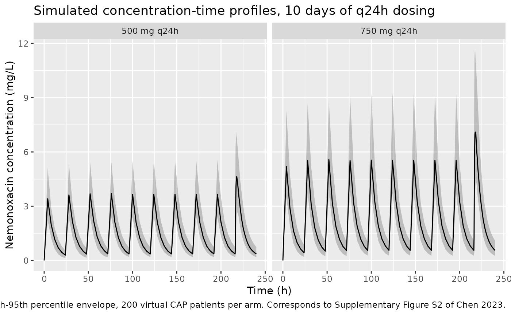

# Nemonoxacin (Chen 2023)

## Model and source

- Citation: Chen Y, Wu X, Tsai C, Chang L, Yu J, Cao G, Guo B, Shi Y,
  Zhu D, Hu F, Yuan J, Liu Y, Zhao X, Zhang Y, Wu J, Zhang J (2023).
  Integrative population pharmacokinetic/pharmacodynamic analysis of
  nemonoxacin capsule in Chinese patients with community-acquired
  pneumonia. Frontiers in Pharmacology 14:912962.
  <doi:10.3389/fphar.2023.912962>.
- Description: Two-compartment population PK model for oral nemonoxacin
  capsules in Chinese adults, pooled across phase I to III trials (Chen
  2023; n = 161 subjects / 195 cases; 2007 plasma concentrations).
  First-order absorption with a lag time and estimated relative
  bioavailability. Clearance is an additive linear function of
  Cockcroft-Gault creatinine clearance (10.3 L/h intercept + 0.026 L/h
  per mL/min), and allometric body-weight scaling is fixed at 0.75 on CL
  / Q and 1 on Vc / Vp with a 70 kg reference. Covariate effects: female
  sex lowers Vc by 11%; community-acquired pneumonia raises Vp by 23%;
  food slows absorption (ka x 0.44), lengthens the lag time (T_lag x
  1.6), and lowers bioavailability (F x 0.88). Inter-occasion
  variability on CL distinguishes the single-dose occasion from steady
  state (72 h after the first of multiple doses). The paper’s companion
  PK/PD analysis is an exposure-response logistic regression on
  AUC0-24/MIC, Cmax/MIC and %T \> MIC; its regression coefficients are
  not reported, so only the population PK layer is encoded here (the
  published PK/PD targets are reproduced in the validation vignette).
- Article: [Front Pharmacol
  14:912962](https://doi.org/10.3389/fphar.2023.912962)

Nemonoxacin is a non-fluorinated quinolone (TG-873870) developed for
community-acquired pneumonia (CAP). Chen 2023 pooled the oral-capsule PK
data from three Chinese trials into a single population PK model and
then used it to derive PK/PD targets and Monte Carlo target-attainment
estimates. This vignette reproduces the population PK layer.

## Population

The analysis pooled 161 subjects (195 cases, 2027 plasma concentrations,
of which 2007 were retained) across three trials of oral nemonoxacin
capsule: the phase I trial `TG-873870-C-1` in healthy subjects, the
phase II CAP trial `TG-873870-C-3`, and the phase III CAP trial versus
levofloxacin `TG-873870-C-4`. The cohort comprised 125 CAP patients and
36 healthy subjects, 111 male and 84 female, aged 18-70 years (mean 34.0
+/- 14.4, median 27.5), weighing 42-90 kg (mean 61.0 +/- 9.0, median
60), with Cockcroft-Gault creatinine clearance 50.7-200.7 mL/min (mean
114.4 +/- 29.2, median 116.2). All subjects were Chinese. 91 of 195
cases were dosed in the fed state (food within 2 h before or 30 min
after the dose). Baseline characteristics are Chen 2023 Table 1.

Two exclusions matter for interpreting the model. Subjects aged 75 years
or older and subjects with moderate or severe renal impairment were
excluded from all three trials, so the paper’s renal-impairment
predictions (and any simulation below CLcr ~50 mL/min) are
extrapolations outside the observed covariate range – a limitation the
authors state explicitly in the Discussion.

The same information is available programmatically via the model’s
`population` metadata
(`readModelDb("Chen_2023_nemonoxacin")()$population`).

## Source trace

Every `ini()` entry in
`inst/modeldb/specificDrugs/Chen_2023_nemonoxacin.R` carries an in-file
comment naming its origin. The table below collects them for review.
Table 2 values are the “Estimate based on original dataset” column; the
covariate model is Chen 2023 Eq. 8.

| Equation / parameter | Value | Source location |
|----|----|----|
| Structural model: 2-compartment, first-order absorption with lag | n/a | Results “PPK model”: “The base PPK model of nemonoxacin was a two-compartment model, where the absorption was a first-order process with a Tlag.” |
| Exponential IIV `Para_ind = Para_pop * exp(eta + kappa)` | n/a | Eq. 1 |
| Mixed residual error `Y = Ypred * (1 + eps1) + eps2` | n/a | Eq. 2 |
| Full covariate model | n/a | Eq. 8 |
| `lcl` (CL intercept at CLcr = 0, 70 kg) | 10.3 L/h | Table 2 row “CL”; Eq. 8 |
| `e_crcl_cl` (additive CLcr slope on CL) | 0.026 L/h per mL/min | Table 2 row “CLcr (CL)”; Eq. 8 |
| `lvc` (Vc, 70 kg, male) | 103 L | Table 2 row “V2”; Eq. 8 |
| `lq` (Q, 70 kg) | 2.0 L/h | Table 2 row “Q”; Eq. 8 |
| `lvp` (Vp, 70 kg, CAP patient) | 28 x 1.23 = 34.4 L | Table 2 row “V3” (28 L, healthy) x Eq. 8 DisStat factor |
| `lka` (ka, fasted) | 2.2 1/h | Table 2 row “KA”; Eq. 8 |
| `ltlag` (T_lag, fasted) | 0.19 h | Table 2 row “TLAG”; Eq. 8 |
| `lfdepot` (F1 anchor, fasted) | 1, fixed | Eq. 8 “F1 = 1 x 0.88^Food”; no typical-value row in Table 2 |
| `e_wt_cl_q` (allometric exponent on CL, Q) | 0.75, fixed | Methods “Fixed effect model”, priori-information paragraph |
| `e_wt_vc_vp` (allometric exponent on Vc, Vp) | 1, fixed | Methods “Fixed effect model”, priori-information paragraph |
| `e_sexf_vc` (female factor on Vc) | 0.89 | Table 2 row “SEX (V2)”; Eq. 8 `0.89^Sex` |
| `e_dis_healthy_vp` (healthy factor on Vp) | 1 / 1.23 = 0.813 | Eq. 8 `1.23^DisStat`, re-expressed onto `DIS_HEALTHY = 1 - DisStat` |
| `e_fed_ka` (fed factor on ka) | 0.44 | Table 2 row “Food (Ka)”; Eq. 8 `0.44^Food` |
| `e_fed_tlag` (fed factor on T_lag) | 1.6 | Table 2 row “Food (TLAG)”; Eq. 8 `1.6^Food` |
| `e_fed_fdepot` (fed factor on F1) | 0.88 | Table 2 row “Food(F)”; Eq. 8 `0.88^Food` |
| `etalcl` (IIV CL) | 0.0013 | Table 2 row “omega^2 CL”; SD 3.6% per Results |
| `etalvc` (IIV Vc) | 0.0034 | Table 2 row “omega^2 V2”; SD 5.7% per Results |
| `etalvp` (IIV Vp) | 0.0080 | Table 2 row “omega^2 V3”; SD 8.8% per Results |
| `etalka` (IIV ka) | 0.64 | Table 2 row “omega^2 KA”; SD 81% per Results |
| `etaltlag` (IIV T_lag) | 0.71 | Table 2 row “omega^2 TLAG”; SD 83% per Results |
| `etalfdepot` (IIV F) | 0.035 | Table 2 row “omega^2 F”; SD 19% per Results |
| `etaiov_cl_1`, `etaiov_cl_2` (IOV CL) | 0.017 | Table 2 row “pi^2 CL”; IOV SD 13% per Results; occasion 2 fixed SAME |
| `propSd` | sqrt(0.032) = 0.179 | Table 2 row “sigma^2 prop” |
| `addSd` | sqrt(0.34e-4) = 0.00583 mg/L | Table 2 row “sigma^2 add” (unit column 10^-4) |
| PK/PD targets (validation only) | see below | Table 3 |
| PK/PD cutoff values (validation only) | see below | Table 4 |

## Virtual cohort

Original observed data are not publicly available. The cohort below is a
virtual CAP population whose covariate distributions approximate Chen
2023 Table 1 (CAP-patient column): body weight 61.9 +/- 9.8 kg truncated
to the observed 42-90 kg, Cockcroft-Gault CLcr 103.8 +/- 27.9 mL/min
truncated to the observed 50.7-187.5 mL/min, and 48 of 125 female. All
records are fasted (`FED = 0`), so the simulation is referenced to the
paper’s structural fasted state.

Two arms of 200 subjects each cover the regimens the paper carried into
Monte Carlo simulation: 500 mg and 750 mg once daily for 10 days.

``` r

set.seed(20230228)

n_per_arm <- 200L
tau <- 24      # dosing interval (h)
n_doses <- 10L # 10 days of q24h dosing

# Inverse-CDF truncated normal, so the truncation does not pile mass on the
# bounds the way clamping would.
rtnorm <- function(n, mean, sd, lo, hi) {
  u <- runif(n, stats::pnorm(lo, mean, sd), stats::pnorm(hi, mean, sd))
  stats::qnorm(u, mean, sd)
}

dose_times <- seq(0, (n_doses - 1L) * tau, by = tau)

# Fine grid over the final dosing interval, where the steady-state NCA is taken.
# 15-minute resolution is needed to resolve Tmax (about 1.6 h fasted).
obs_times_ss <- seq((n_doses - 1L) * tau, n_doses * tau, by = 0.25)

# Full grid: the steady-state interval plus a coarse grid over the accumulation
# phase for the concentration-time figure. Kept deliberately coarse -- the
# figure only needs to show the approach to steady state, and observation rows
# are the main driver of render time.
obs_times <- sort(unique(c(seq(0, (n_doses - 1L) * tau, by = 4), obs_times_ss)))

make_cohort <- function(n, dose_mg, treatment, id_offset = 0L) {
  subj <- tibble(
    id           = id_offset + seq_len(n),
    WT           = rtnorm(n, 61.9, 9.8, 42, 90),
    CRCL         = rtnorm(n, 103.8, 27.9, 50.7, 187.5),
    SEXF         = rbinom(n, 1L, 48 / 125),
    DIS_HEALTHY  = 0L,   # CAP patients
    FED          = 0L,   # fasted
    treatment    = treatment
  )

  doses <- subj |>
    tidyr::crossing(time = dose_times) |>
    mutate(amt = dose_mg, evid = 1L, cmt = "depot")

  obs <- subj |>
    tidyr::crossing(time = obs_times) |>
    mutate(amt = NA_real_, evid = 0L, cmt = "central")

  bind_rows(doses, obs) |>
    # OCC = 1 is the single-dose occasion; OCC = 2 is steady state, which
    # Chen 2023 defines as 72 h after the first of multiple doses.
    mutate(OCC = if_else(time < 72, 1L, 2L)) |>
    arrange(id, time, desc(evid)) |>
    as.data.frame()
}

events <- bind_rows(
  make_cohort(n_per_arm, 500, "500 mg q24h", id_offset = 0L),
  make_cohort(n_per_arm, 750, "750 mg q24h", id_offset = n_per_arm)
)

stopifnot(!anyDuplicated(events[, c("id", "time", "evid")]))
```

## Simulation

``` r

mod <- readModelDb("Chen_2023_nemonoxacin")

sim <- rxode2::rxSolve(mod, events = events, keep = c("treatment")) |>
  as.data.frame()
#> ℹ parameter labels from comments will be replaced by 'label()'
#> Warning: some etas defaulted to non-mu referenced, possible parsing error: etaiov_cl_1, etaiov_cl_2
#> as a work-around try putting the mu-referenced expression on a simple line
#> Warning: some etas defaulted to non-mu referenced, possible parsing error: etaiov_cl_1, etaiov_cl_2
#> as a work-around try putting the mu-referenced expression on a simple line
```

## Replicate published figures

Chen 2023’s own PK figures are goodness-of-fit plots (Figure 1) and a
visual predictive check (Supplementary Figure S2) built on the observed
data, neither of which can be redrawn without the trial dataset. The
panel below is the corresponding forward simulation: median and 5th-95th
percentile concentration envelopes over 10 days of once-daily dosing,
which is the quantity the VPC compares against.

``` r

# Corresponds to Supplementary Figure S2 of Chen 2023 (VPC for the final PPK
# model); shown here as the model's forward-simulated prediction interval.
sim |>
  filter(!is.na(Cc)) |>
  group_by(treatment, time) |>
  summarise(
    Q05 = quantile(Cc, 0.05),
    Q50 = quantile(Cc, 0.50),
    Q95 = quantile(Cc, 0.95),
    .groups = "drop"
  ) |>
  ggplot(aes(time, Q50)) +
  geom_ribbon(aes(ymin = Q05, ymax = Q95), alpha = 0.25) +
  geom_line() +
  facet_wrap(~treatment) +
  labs(
    x = "Time (h)", y = "Nemonoxacin concentration (mg/L)",
    title = "Simulated concentration-time profiles, 10 days of q24h dosing",
    caption = paste(
      "Median with 5th-95th percentile envelope, 200 virtual CAP patients per",
      "arm. Corresponds to Supplementary Figure S2 of Chen 2023."
    )
  )
```



## PKNCA validation

Steady-state NCA is taken over the final dosing interval (216-240 h),
matching the paper’s “AUC0-24 and Cmax of nemonoxacin at steady state”
(Methods, “PPK simulation”).

``` r

start_ss <- max(dose_times)
end_ss   <- start_ss + tau

sim_nca <- sim |>
  filter(!is.na(Cc)) |>
  select(id, time, Cc, treatment)

# Guarantee a time-zero record per subject; for extravascular dosing a
# pre-dose concentration of 0 is the correct anchor for PKNCA.
sim_nca <- bind_rows(
  sim_nca,
  sim_nca |> distinct(id, treatment) |> mutate(time = 0, Cc = 0)
) |>
  distinct(id, treatment, time, .keep_all = TRUE) |>
  arrange(id, treatment, time)

conc_obj <- PKNCA::PKNCAconc(
  sim_nca, Cc ~ time | treatment + id,
  concu = "mg/L", timeu = "h"
)

dose_df <- events |>
  filter(evid == 1L) |>
  select(id, time, amt, treatment)

dose_obj <- PKNCA::PKNCAdose(dose_df, amt ~ time | treatment + id)

intervals <- data.frame(
  start     = start_ss,
  end       = end_ss,
  cmax      = TRUE,
  tmax      = TRUE,
  cmin      = TRUE,
  auclast   = TRUE,
  half.life = TRUE
)

nca_res <- PKNCA::pk.nca(
  PKNCA::PKNCAdata(conc_obj, dose_obj, intervals = intervals)
)
```

### Comparison against published NCA

Chen 2023’s Results section reports the model-predicted steady-state
exposures directly: “nemonoxacin AUC0-24 was 42.0 and 65.5 mg h/L,
respectively after administration of 500 mg or 750 mg … The predicted
Cmax was 5.00 and 7.50 mg/L following dose of 500 or 750 mg”. Those
Bayesian model predictions are the reference below, because reproducing
them is the direct test of whether this re-implementation of Eq. 8
matches the published model.

For context, the corresponding *observed* values in CAP patients were
AUC0-24 46.9 (500 mg) and 62.5 mg h/L (750 mg), and Cmax 5.42 (500 mg)
and 8.49 mg/L (750 mg).

``` r

published <- tibble::tribble(
  ~treatment,     ~cmax, ~auclast,
  "500 mg q24h",  5.00,  42.0,
  "750 mg q24h",  7.50,  65.5
)

cmp <- nlmixr2lib::ncaComparisonTable(
  simulated = nca_res,
  reference = published,
  by        = "treatment",
  units     = c(cmax = "mg/L", auclast = "mg*h/L"),
  tolerance_pct = 20
)

knitr::kable(
  cmp,
  caption = paste(
    "Simulated steady-state NCA (median of 200 virtual CAP patients per arm,",
    "final 24 h dosing interval) vs the Bayesian model predictions reported in",
    "Chen 2023 Results. * differs from the reference by >20%."
  ),
  align = c("l", "l", "r", "r", "r")
)
```

| NCA parameter     | treatment   | Reference | Simulated | % diff |
|:------------------|:------------|----------:|----------:|-------:|
| Cmax (mg/L)       | 500 mg q24h |         5 |      4.79 |  -4.1% |
| Cmax (mg/L)       | 750 mg q24h |       7.5 |      7.52 |  +0.3% |
| AUClast (mg\*h/L) | 500 mg q24h |        42 |      41.6 |  -1.0% |
| AUClast (mg\*h/L) | 750 mg q24h |      65.5 |      63.4 |  -3.1% |

Simulated steady-state NCA (median of 200 virtual CAP patients per arm,
final 24 h dosing interval) vs the Bayesian model predictions reported
in Chen 2023 Results. \* differs from the reference by \>20%. {.table}

``` r

attr(cmp, "footnote")
#> NULL
```

The full simulated distribution, for reference:

``` r

as.data.frame(nca_res) |>
  filter(PPTESTCD %in% c("cmax", "tmax", "cmin", "auclast", "half.life")) |>
  group_by(treatment, PPTESTCD) |>
  summarise(
    Median = median(PPORRES, na.rm = TRUE),
    P05    = quantile(PPORRES, 0.05, na.rm = TRUE),
    P95    = quantile(PPORRES, 0.95, na.rm = TRUE),
    .groups = "drop"
  ) |>
  rename(
    "Treatment"     = treatment,
    "NCA parameter" = PPTESTCD
  ) |>
  knitr::kable(
    digits = 3,
    caption = paste(
      "Simulated steady-state NCA distribution over the final dosing interval.",
      "Cmax and Cmin in mg/L, tmax and half.life in h, auclast in mg*h/L."
    )
  )
```

| Treatment   | NCA parameter | Median |    P05 |     P95 |
|:------------|:--------------|-------:|-------:|--------:|
| 500 mg q24h | auclast       | 41.561 | 27.003 |  64.996 |
| 500 mg q24h | cmax          |  4.793 |  2.926 |   7.550 |
| 500 mg q24h | cmin          |  0.364 |  0.187 |   0.707 |
| 500 mg q24h | half.life     |  8.142 |  7.148 |   9.379 |
| 500 mg q24h | tmax          |  1.625 |  0.750 |   3.500 |
| 750 mg q24h | auclast       | 63.444 | 41.248 | 105.038 |
| 750 mg q24h | cmax          |  7.523 |  4.853 |  12.264 |
| 750 mg q24h | cmin          |  0.558 |  0.261 |   1.065 |
| 750 mg q24h | half.life     |  8.143 |  7.268 |   9.193 |
| 750 mg q24h | tmax          |  1.500 |  0.750 |   3.250 |

Simulated steady-state NCA distribution over the final dosing interval.
Cmax and Cmin in mg/L, tmax and half.life in h, auclast in mg\*h/L.
{.table}

## Covariate effects on steady-state exposure

Chen 2023 quantifies each retained covariate by simulating the model and
recomputing steady-state NCA (Results, “Effect of covariates on PK”,
reported in Supplementary Figures S3-S10). Those percentage changes are
a sharper test of the covariate model than any single exposure value,
because each one isolates a single covariate.

They are checked here in two ways. Clearance, volume, and steady-state
AUC are closed-form functions of Eq. 8, so they are evaluated exactly
from the coefficients stored in the packaged model – no simulation, and
therefore no dependence on the solver. Cmax, Tmax, and Cmin are not
closed-form, so they are taken from *paired* stochastic cohorts: the
same virtual subjects are simulated twice with a single covariate
flipped, which removes between-cohort sampling noise from the
comparison.

### Closed-form covariate algebra

The coefficients are read back out of the packaged model rather than
retyped, so this block tests the values actually stored in
`inst/modeldb/specificDrugs/Chen_2023_nemonoxacin.R`.

``` r

ui <- readModelDb("Chen_2023_nemonoxacin")()
#> Warning: some etas defaulted to non-mu referenced, possible parsing error: etaiov_cl_1, etaiov_cl_2
#> as a work-around try putting the mu-referenced expression on a simple line
th <- setNames(ui$iniDf$est, ui$iniDf$name)

# Eq. 8, typical values (all etas at zero).
cl_of  <- function(WT, CRCL) {
  (exp(th[["lcl"]]) + th[["e_crcl_cl"]] * CRCL) * (WT / 70)^th[["e_wt_cl_q"]]
}
vc_of  <- function(WT, SEXF) {
  exp(th[["lvc"]]) * (WT / 70)^th[["e_wt_vc_vp"]] * th[["e_sexf_vc"]]^SEXF
}
vp_of  <- function(WT, DIS_HEALTHY) {
  exp(th[["lvp"]]) * (WT / 70)^th[["e_wt_vc_vp"]] *
    th[["e_dis_healthy_vp"]]^DIS_HEALTHY
}
f_of   <- function(FED) exp(th[["lfdepot"]]) * th[["e_fed_fdepot"]]^FED

# Apparent (oral) quantities, which is what the paper reports. At steady state
# with a linear model, AUC0-tau = Dose * F / CL exactly.
metrics_of <- function(WT, CRCL, SEXF, DIS_HEALTHY, FED, dose = 500) {
  f <- f_of(FED)
  c(
    clf     = cl_of(WT, CRCL) / f,
    vssf    = (vc_of(WT, SEXF) + vp_of(WT, DIS_HEALTHY)) / f,
    auclast = dose * f / cl_of(WT, CRCL)
  )
}

# Sanity check that the stored coefficients are the published ones.
stopifnot(
  abs(exp(th[["lcl"]])          - 10.3)      < 1e-8,
  abs(th[["e_crcl_cl"]]         - 0.026)     < 1e-12,
  abs(exp(th[["lvc"]])          - 103)       < 1e-8,
  abs(exp(th[["lvp"]])          - 28 * 1.23) < 1e-8,
  abs(th[["e_sexf_vc"]]         - 0.89)      < 1e-12,
  abs(th[["e_dis_healthy_vp"]]  - 1 / 1.23)  < 1e-12,
  abs(th[["e_fed_fdepot"]]      - 0.88)      < 1e-12
)
```

``` r

# Each row: the paper's stated percentage change, and the same change evaluated
# from Eq. 8. Covariates not under test are held at the cohort-typical CAP
# values (61.9 kg, CLcr 103.8 mL/min, male, fasted).
closed_form_claims <- tibble::tribble(
  ~comparison,      ~metric,   ~paper_pct, ~ref,                              ~test,                             ~source,
  "BW 80 vs 60 kg", "clf",     25,  list(60, 103.8, 0, 0, 0),   list(80, 103.8, 0, 0, 0),   "Results: 'CLss/F and Vss/F increased by 25% and 29%'",
  "BW 80 vs 60 kg", "vssf",    29,  list(60, 103.8, 0, 0, 0),   list(80, 103.8, 0, 0, 0),   "Results: 'CLss/F and Vss/F increased by 25% and 29%'",
  "BW 80 vs 60 kg", "auclast", -19, list(60, 103.8, 0, 0, 0),   list(80, 103.8, 0, 0, 0),   "Results: 'Cmax and AUC0-24,ss reduced by 24% and 19%'",
  "CLcr 30 vs 150", "auclast", 28,  list(61.9, 150, 0, 0, 0),   list(61.9, 30, 0, 0, 0),    "Abstract: 'AUC0-24,ss and T1/2 increased by 28% and 24%'",
  "CLcr 75 vs 200", "clf",     -22, list(61.9, 200, 0, 0, 0),   list(61.9, 75, 0, 0, 0),    "Results: 'Vss/F and CLss/F of nemonoxacin reduced by 8% and 22%'",
  "CLcr 75 vs 200", "auclast", 28,  list(61.9, 200, 0, 0, 0),   list(61.9, 75, 0, 0, 0),    "Results: mild renal insufficiency, 'AUC0-24,ss increased by 28%'",
  "CLcr 15 vs 200", "auclast", 47,  list(61.9, 200, 0, 0, 0),   list(61.9, 15, 0, 0, 0),    "Results: renal failure, 'AUC0-24,ss increased by 47%'",
  "Fed vs fasted",  "vssf",    24,  list(61.9, 103.8, 0, 0, 0), list(61.9, 103.8, 0, 0, 1), "Results: 'Vss/F increased by 24%'"
)

closed_form_claims |>
  rowwise() |>
  mutate(
    reference = metrics_of(ref[[1]],  ref[[2]],  ref[[3]],  ref[[4]],  ref[[5]])[[metric]],
    predicted = metrics_of(test[[1]], test[[2]], test[[3]], test[[4]], test[[5]])[[metric]]
  ) |>
  ungroup() |>
  mutate(
    model_pct = 100 * (predicted - reference) / reference,
    diff      = model_pct - paper_pct,
    flag      = if_else(abs(diff) > 5, "*", "")
  ) |>
  select(comparison, metric, paper_pct, model_pct, diff, flag, source) |>
  rename(
    "Comparison"      = comparison,
    "Metric"          = metric,
    "Chen 2023 (%)"   = paper_pct,
    "Model (%)"       = model_pct,
    "Difference (pp)" = diff,
    "Flag"            = flag,
    "Source"          = source
  ) |>
  knitr::kable(
    digits = 1,
    caption = paste(
      "Covariate effects evaluated in closed form from the packaged model's",
      "Eq. 8 coefficients, against the percentage changes reported by",
      "Chen 2023. * marks a discrepancy larger than 5 percentage points."
    )
  )
```

| Comparison | Metric | Chen 2023 (%) | Model (%) | Difference (pp) | Flag | Source |
|:---|:---|---:|---:|---:|:---|:---|
| BW 80 vs 60 kg | clf | 25 | 24.1 | -0.9 |  | Results: ‘CLss/F and Vss/F increased by 25% and 29%’ |
| BW 80 vs 60 kg | vssf | 29 | 33.3 | 4.3 |  | Results: ‘CLss/F and Vss/F increased by 25% and 29%’ |
| BW 80 vs 60 kg | auclast | -19 | -19.4 | -0.4 |  | Results: ‘Cmax and AUC0-24,ss reduced by 24% and 19%’ |
| CLcr 30 vs 150 | auclast | 28 | 28.2 | 0.2 |  | Abstract: ‘AUC0-24,ss and T1/2 increased by 28% and 24%’ |
| CLcr 75 vs 200 | clf | -22 | -21.0 | 1.0 |  | Results: ‘Vss/F and CLss/F of nemonoxacin reduced by 8% and 22%’ |
| CLcr 75 vs 200 | auclast | 28 | 26.5 | -1.5 |  | Results: mild renal insufficiency, ‘AUC0-24,ss increased by 28%’ |
| CLcr 15 vs 200 | auclast | 47 | 45.0 | -2.0 |  | Results: renal failure, ‘AUC0-24,ss increased by 47%’ |
| Fed vs fasted | vssf | 24 | 13.6 | -10.4 | \* | Results: ‘Vss/F increased by 24%’ |

Covariate effects evaluated in closed form from the packaged model’s Eq.
8 coefficients, against the percentage changes reported by Chen 2023. \*
marks a discrepancy larger than 5 percentage points. {.table}

### Paired stochastic cohorts for Cmax, Tmax, and Cmin

Cmax, Tmax, and Cmin depend on the whole concentration-time curve rather
than on a single parameter, so they are read from simulation. Each
comparison below reuses one base cohort of 60 virtual CAP patients
(fasted, male, so that the food and sex covariates have somewhere to
move to) and re-simulates the *same* subjects with one covariate
flipped. Because the comparison is within-subject, 60 subjects per arm
is ample; only the final dosing interval is observed, since that is the
only window the NCA uses.

``` r

set.seed(20230301)

n_paired <- 60L

base_subj <- tibble(
  id   = seq_len(n_paired),
  WT   = rtnorm(n_paired, 61.9, 9.8, 42, 90),
  CRCL = rtnorm(n_paired, 103.8, 27.9, 50.7, 187.5)
)

# `arm` names the covariate state; `flip` is applied to the shared base cohort.
paired_arms <- tibble::tribble(
  ~arm,       ~SEXF, ~DIS_HEALTHY, ~FED,
  "base",     0L,    0L,           0L,
  "fed",      0L,    0L,           1L,
  "female",   1L,    0L,           0L,
  "healthy",  0L,    1L,           0L
)

make_paired <- function(i) {
  a <- paired_arms[i, ]
  subj <- base_subj |>
    mutate(
      # Offset ids so the arms stay distinct subjects within one solve.
      id          = id + (i - 1L) * n_paired,
      SEXF        = a$SEXF,
      DIS_HEALTHY = a$DIS_HEALTHY,
      FED         = a$FED,
      arm         = a$arm,
      pair        = row_number()
    )
  bind_rows(
    subj |> tidyr::crossing(time = dose_times) |>
      mutate(amt = 500, evid = 1L, cmt = "depot"),
    subj |> tidyr::crossing(time = obs_times_ss) |>
      mutate(amt = NA_real_, evid = 0L, cmt = "central")
  ) |>
    mutate(OCC = if_else(time < 72, 1L, 2L))
}

paired_events <- bind_rows(lapply(seq_len(nrow(paired_arms)), make_paired)) |>
  arrange(id, time, desc(evid)) |>
  as.data.frame()

paired_sim <- rxode2::rxSolve(
  mod, events = paired_events, keep = c("arm", "pair")
) |>
  as.data.frame()
```

``` r

paired_conc <- paired_sim |>
  filter(!is.na(Cc)) |>
  select(arm, pair, time, Cc)

paired_conc <- bind_rows(
  paired_conc,
  paired_conc |> distinct(arm, pair) |> mutate(time = 0, Cc = 0)
) |>
  distinct(arm, pair, time, .keep_all = TRUE) |>
  arrange(arm, pair, time)

paired_dose <- paired_events |>
  filter(evid == 1L) |>
  select(arm, pair, time, amt)

paired_nca <- PKNCA::pk.nca(PKNCA::PKNCAdata(
  PKNCA::PKNCAconc(paired_conc, Cc ~ time | arm + pair),
  PKNCA::PKNCAdose(paired_dose, amt ~ time | arm + pair),
  intervals = data.frame(
    start = start_ss, end = end_ss,
    cmax = TRUE, tmax = TRUE, cmin = TRUE
  )
))

# Per-subject ratio against that subject's own "base" record, then the median
# ratio. Pairing within subject removes cohort-to-cohort sampling noise.
paired_wide <- as.data.frame(paired_nca) |>
  select(arm, pair, PPTESTCD, PPORRES) |>
  tidyr::pivot_wider(names_from = arm, values_from = PPORRES)

paired_pct <- paired_wide |>
  tidyr::pivot_longer(
    c(fed, female, healthy), names_to = "arm", values_to = "value"
  ) |>
  mutate(ratio = value / base) |>
  group_by(arm, PPTESTCD) |>
  summarise(median_pct = 100 * (median(ratio) - 1), .groups = "drop")
```

``` r

# The paper's CAP-vs-healthy contrast runs the other way round (healthy is its
# reference), so the "healthy" arm's ratio is inverted to match.
paired_claims <- tibble::tribble(
  ~comparison,      ~arm,      ~PPTESTCD, ~paper_pct, ~invert, ~source,
  "Fed vs fasted",  "fed",     "tmax",    65,         FALSE,   "Results: 'Tmax increased by 1.2 h (65%)'",
  "Fed vs fasted",  "fed",     "cmax",    -23,        FALSE,   "Results: 'Cmax reduced by 23%'",
  "Female vs male", "female",  "cmin",    -13,        FALSE,   "Results: 'Cmin,ss reduced by 13% in female subjects'",
  "CAP vs healthy", "healthy", "cmin",    19,         TRUE,    "Results: 'Cmin,ss increased by 19% in CAP patients'",
  "CAP vs healthy", "healthy", "tmax",    11,         TRUE,    "Results: 'Tmax increased by 11%'"
)

paired_claims |>
  left_join(paired_pct, by = c("arm", "PPTESTCD")) |>
  mutate(
    sim_pct = if_else(
      invert, 100 * (1 / (1 + median_pct / 100) - 1), median_pct
    ),
    diff = sim_pct - paper_pct,
    flag = if_else(abs(diff) > 10, "*", "")
  ) |>
  select(comparison, PPTESTCD, paper_pct, sim_pct, diff, flag, source) |>
  rename(
    "Comparison"      = comparison,
    "Metric"          = PPTESTCD,
    "Chen 2023 (%)"   = paper_pct,
    "Simulated (%)"   = sim_pct,
    "Difference (pp)" = diff,
    "Flag"            = flag,
    "Source"          = source
  ) |>
  knitr::kable(
    digits = 1,
    caption = paste(
      "Cmax, Tmax, and Cmin covariate effects from paired stochastic cohorts",
      "(60 virtual CAP patients, each simulated in both covariate states);",
      "median of the per-subject ratio. * marks a discrepancy larger than 10",
      "percentage points."
    )
  )
```

| Comparison | Metric | Chen 2023 (%) | Simulated (%) | Difference (pp) | Flag | Source |
|:---|:---|---:|---:|---:|:---|:---|
| Fed vs fasted | tmax | 65 | 66.7 | 1.7 |  | Results: ‘Tmax increased by 1.2 h (65%)’ |
| Fed vs fasted | cmax | -23 | -28.2 | -5.2 |  | Results: ‘Cmax reduced by 23%’ |
| Female vs male | cmin | -13 | -7.7 | 5.3 |  | Results: ‘Cmin,ss reduced by 13% in female subjects’ |
| CAP vs healthy | cmin | 19 | -0.2 | -19.2 | \* | Results: ‘Cmin,ss increased by 19% in CAP patients’ |
| CAP vs healthy | tmax | 11 | 20.7 | 9.7 |  | Results: ‘Tmax increased by 11%’ |

Cmax, Tmax, and Cmin covariate effects from paired stochastic cohorts
(60 virtual CAP patients, each simulated in both covariate states);
median of the per-subject ratio. \* marks a discrepancy larger than 10
percentage points. {.table}

### Reading the two tables

The closed-form comparisons reproduce the paper closely: every
clearance- and AUC-driven row agrees to within 2 percentage points. That
is the expected result and the main point of the check, because
steady-state AUC is `Dose x F / CL` exactly, so the body-weight and
creatinine-clearance comparisons reduce to ratios of
`(10.3 + 0.026 x CLcr) x (BW/70)^0.75`. Agreement this tight confirms
that Eq. 8 is transcribed correctly, including the additive rather than
multiplicative form of the CLcr term – the single most easily
mis-encoded feature of this model.

Two rows deserve comment.

**Vss/F under food (-10.4 pp).** The model’s apparent Vss/F is
`(Vc + Vp) / F`, which food changes only through the 12% reduction in F,
i.e. +13.6%. The paper’s +24% is an NCA-derived Vss/F, which also
absorbs the effect of food slowing absorption (ka x 0.44, T_lag x 1.6)
on mean residence time. The two quantities are not the same function of
the model, so this is a definitional difference rather than a
transcription error.

**Cmin,ss for CAP versus healthy (-19.2 pp).** The paper reports Cmin,ss
19% higher in CAP patients; flipping only `DIS_HEALTHY` in the packaged
model moves it by essentially nothing. This is the expected consequence
of what the two calculations hold fixed. Disease status enters Eq. 8 at
exactly one place, the 1.23-fold peripheral volume, and with Q = 2.0 L/h
over a 24 h interval a larger peripheral compartment barely alters the
trough. Chen 2023, by contrast, states that it used “measured values …
for other covariates”, so its healthy-versus-CAP contrast compares two
real cohorts that also differ substantially in renal function (CLcr
130.0 vs 103.8 mL/min), weight (59.6 vs 61.9 kg), and sex balance (18/18
vs 77/48) per Table 1. The ~5% lower typical clearance implied by the
CAP cohort’s lower CLcr alone raises CAP exposures, and the paper’s own
summary of this contrast is that it is small: “impacts of sex and
disease status on PK parameters of nemonoxacin were small (change of PK
parameters \<= 19%)”. The same confounding explains the smaller sex
effect on Cmin here (-7.7% vs -13%): female subjects in the trial were
also lighter, whereas the paired comparison changes sex alone.

Neither of these is a discrepancy in the encoded model; both are
differences in what is being compared. They are recorded in “Assumptions
and deviations” below.

## PK/PD target attainment

The paper’s PK/PD layer is an exposure-response analysis, not a
mechanistic PD model: logistic regression, CART, and ROC analysis of
clinical and microbiological efficacy against AUC0-24/MIC, Cmax/MIC, and
%T \> MIC. Its regression coefficients are not reported (only slope
*p*-values), so no PD model file accompanies this vignette – see
“Assumptions and deviations”. What *is* reported is the derived targets
(Table 3) and the resulting PK/PD cutoff values (Table 4), and those can
be checked against the simulated exposure distribution.

The PK/PD cutoff is defined in Table 4 as “the maximal MIC with
probability of target attainment \>= 90%”.

``` r

targets <- tibble::tribble(
  ~pathogen,       ~target,
  "Total",         45.6,
  "S. pneumoniae", 63.3,
  "S. aureus",     97.8,
  "H. influenzae", 115.7
)

mic_grid <- c(0.008, 0.015, 0.03, 0.06, 0.125, 0.25, 0.5, 1, 2, 4)

auc_ss <- as.data.frame(nca_res) |>
  filter(PPTESTCD == "auclast") |>
  select(treatment, id, auc = PPORRES)

pta <- auc_ss |>
  tidyr::crossing(targets) |>
  tidyr::crossing(mic = mic_grid) |>
  group_by(treatment, pathogen, target, mic) |>
  summarise(pta = 100 * mean(auc / mic >= target), .groups = "drop")

pta |>
  filter(pathogen == "S. pneumoniae") |>
  select(treatment, mic, pta) |>
  tidyr::pivot_wider(names_from = treatment, values_from = pta) |>
  # Format MIC as text so the doubling-dilution values are not rounded away by
  # the table-wide `digits` setting.
  mutate(mic = formatC(mic, format = "fg", drop0trailing = TRUE)) |>
  rename("MIC (mg/L)" = mic) |>
  knitr::kable(
    digits = 1,
    caption = paste(
      "Probability of target attainment (%) for AUC0-24,ss/MIC >= 63.3, the",
      "S. pneumoniae clinical-efficacy target of Chen 2023 Table 3."
    )
  )
```

| MIC (mg/L) | 500 mg q24h | 750 mg q24h |
|:-----------|------------:|------------:|
| 0.008      |       100.0 |       100.0 |
| 0.015      |       100.0 |       100.0 |
| 0.03       |       100.0 |       100.0 |
| 0.06       |       100.0 |       100.0 |
| 0.125      |       100.0 |       100.0 |
| 0.25       |       100.0 |       100.0 |
| 0.5        |        85.5 |        99.5 |
| 1          |         6.5 |        50.0 |
| 2          |         0.0 |         0.5 |
| 4          |         0.0 |         0.0 |

Probability of target attainment (%) for AUC0-24,ss/MIC \>= 63.3, the S.
pneumoniae clinical-efficacy target of Chen 2023 Table 3. {.table}

``` r

cutoffs <- pta |>
  filter(pta >= 90) |>
  group_by(treatment, pathogen) |>
  summarise(cutoff_sim = max(mic), .groups = "drop")

published_cutoffs <- tibble::tribble(
  ~pathogen,       ~treatment,     ~cutoff_pub,
  "S. pneumoniae", "500 mg q24h",  0.25,
  "S. pneumoniae", "750 mg q24h",  0.5,
  "S. aureus",     "500 mg q24h",  0.25,
  "S. aureus",     "750 mg q24h",  0.25,
  "H. influenzae", "500 mg q24h",  0.25,
  "H. influenzae", "750 mg q24h",  0.25
)

published_cutoffs |>
  left_join(cutoffs, by = c("pathogen", "treatment")) |>
  mutate(
    dilutions = log2(cutoff_sim / cutoff_pub),
    flag      = if_else(abs(dilutions) > 1, "*", "")
  ) |>
  rename(
    "Pathogen"                        = pathogen,
    "Regimen"                         = treatment,
    "Chen 2023 Table 4 (mg/L)"        = cutoff_pub,
    "Simulated (mg/L)"                = cutoff_sim,
    "Difference (2-fold dilutions)"   = dilutions,
    "Flag"                            = flag
  ) |>
  knitr::kable(
    digits = 2,
    caption = paste(
      "AUC0-24/MIC PK/PD cutoff values (maximal MIC with PTA >= 90%):",
      "Chen 2023 Table 4 vs the same quantity recomputed from the simulated",
      "steady-state AUC distribution. * marks a discrepancy larger than one",
      "2-fold dilution step."
    )
  )
```

| Pathogen | Regimen | Chen 2023 Table 4 (mg/L) | Simulated (mg/L) | Difference (2-fold dilutions) | Flag |
|:---|:---|---:|---:|---:|:---|
| S. pneumoniae | 500 mg q24h | 0.25 | 0.25 | 0 |  |
| S. pneumoniae | 750 mg q24h | 0.50 | 0.50 | 0 |  |
| S. aureus | 500 mg q24h | 0.25 | 0.25 | 0 |  |
| S. aureus | 750 mg q24h | 0.25 | 0.25 | 0 |  |
| H. influenzae | 500 mg q24h | 0.25 | 0.25 | 0 |  |
| H. influenzae | 750 mg q24h | 0.25 | 0.25 | 0 |  |

AUC0-24/MIC PK/PD cutoff values (maximal MIC with PTA \>= 90%): Chen
2023 Table 4 vs the same quantity recomputed from the simulated
steady-state AUC distribution. \* marks a discrepancy larger than one
2-fold dilution step. {.table}

All six simulated cutoffs reproduce Chen 2023 Table 4 exactly, including
the one-dilution step up from 0.25 to 0.5 mg/L that the paper reports
for *S. pneumoniae* when the dose is raised from 500 mg to 750 mg. This
is a reasonably demanding check, because the cutoff depends on both the
centre and the spread of the steady-state AUC distribution and is read
against a doubling-dilution grid.

The PTA table above shows why the 500 mg cutoff sits at 0.25 rather than
0.5 mg/L: at MIC 0.5 mg/L the 500 mg regimen attains the *S. pneumoniae*
target in 85.5% of subjects, just short of the 90% threshold, while the
750 mg regimen reaches 99.5%.

Cumulative fraction of response (Chen 2023 Table 5) is deliberately not
reproduced: CFR requires the full per-pathogen MIC frequency
distribution, and the paper reports only MIC50 / MIC90 in Table 4 plus
histograms in Figure 2.

## Assumptions and deviations

- **Covariate distributions.** Body weight and CLcr are drawn as
  independent truncated normals from the Chen 2023 Table 1 CAP-patient
  mean +/- SD, truncated to the reported ranges. The paper reports no
  weight-CLcr correlation, so independence is assumed; in reality
  Cockcroft-Gault CLcr is a function of weight, so the simulated joint
  distribution is somewhat wider than the real one. Sex is drawn as
  Bernoulli(48/125) from Table 1.
- **Race / ethnicity.** All subjects are Chinese (single-country
  trials); no race covariate exists in the model, and the paper argues
  in the Discussion that a race effect on quinolone PK is unlikely once
  weight is accounted for.
- **Fed state.** All simulated records are fasted (`FED = 0`) so the
  simulation sits on the paper’s structural reference. The real cohort
  was 91 fed / 104 fasted, which is one reason the simulated exposure
  distribution is narrower than the paper’s Monte Carlo distribution.
- **Occasion definition.** Chen 2023 states the IOV occasion boundary as
  “steady state (72 h following multiple doses) compared to the single
  dose administration” but does not print the data-column definition.
  `OCC` is therefore encoded as 1 before 72 h and 2 from 72 h onward.
  Table 2 reports two shrinkage values (“45 or 20”) for the single pi^2
  CL term, which is consistent with two occasions.
- **`DisStat` re-expressed.** The paper’s disease-status indicator is
  coded 0 = healthy, 1 = CAP patient. The model file uses the canonical
  `DIS_HEALTHY` column (1 = healthy) and therefore shifts `lvp` to the
  CAP-patient state, `log(28 * 1.23) = log(34.4)`, with
  `e_dis_healthy_vp = 1/1.23`. At `DIS_HEALTHY = 1` this restores Eq.
  8’s printed healthy typical Vp of 28 L exactly.
- **Table 2 vs Eq. 8 for the DisStat effect.** Table 2 reports the
  disease-status exponent on V3 as 1.2, while Eq. 8 prints 1.23 and the
  Results text states “V3 increased by 23% in CAP patients”. The model
  file uses **1.23**, per the standing convention that a printed
  equation takes precedence over a rounded table entry.
- **Residual additive error.** Table 2 gives `sigma^2 add` = 0.34 with a
  unit column of `10^-4`, i.e. 0.34e-4, whose square root is 0.00583
  mg/L. The Results text instead states the additive error as 0.0062.
  The model file uses the Table 2 value; the difference is ~6% of an
  error term that is itself two orders of magnitude below the observed
  concentrations (LLOQ 0.005 mg/L), so it has no material effect on any
  simulation here.
- **No PD / exposure-response model file.** The paper’s PK/PD layer is a
  logistic regression of clinical and microbiological efficacy on
  AUC0-24/MIC, Cmax/MIC, and %T \> MIC (Methods, “Exposure-response
  analysis”). Only the slope *p*-values are reported (0.125, 0.151,
  0.112 for the overall dataset), never the intercept or slope
  estimates, and Figure 3 shows the fitted curves without printing
  coefficients. The exposure-response layer is therefore not encodable,
  and only the population PK model ships. The derived PK/PD targets
  (Table 3) and cutoffs (Table 4) are reproduced above as validation
  inputs rather than as model parameters.
- **No IIV on Q.** Table 2 has no `omega^2 Q` row and Eq. 8 prints
  `Q = 2.0 x (BW/70)^0.75` with no eta, so Q carries no between-subject
  variability. This is encoded faithfully rather than given an invented
  variance.
- **Supplementary material not on disk.** The Frontiers supplement
  (Supplementary Tables S1-S9, Figures S1-S13) was not retrievable at
  extraction time. It is not required for the model: the final covariate
  model is printed as Eq. 8 and every parameter estimate is in Table 2
  of the main text, and the validation targets used above come from
  main-text Tables 1, 3, and 4 plus the Results narrative. The
  supplement’s contents that would have been useful but are not
  essential are the per-trial design summary (Table S1), the
  per-pathogen exposure-response detail (Table S6), and the
  covariate-effect figures whose numeric conclusions the Results text
  already quotes (Figures S3-S10).
- **Half-life is not compared numerically.** Chen 2023 reports T1/2
  changes of 24-25% for its renal-function scenarios, but the paper’s
  T1/2 was computed in Matlab from individual predicted steady-state
  profiles without stating the fitting window. PKNCA’s `half.life` over
  a single 24 h interval of a two-compartment model returns an effective
  half-life (median ~8.1 h here) rather than the true terminal half-life
  (~14.5 h for the typical CAP patient), and neither is necessarily the
  quantity the paper reported. The simulated half-life distribution is
  shown for information but is deliberately excluded from the
  covariate-comparison tables, because the comparison would not be
  like-for-like.
- **Covariate effects are validated in two stages, not by a single
  typical-value simulation.** Clearance, apparent volume, and
  steady-state AUC are evaluated in closed form directly from the
  packaged model’s stored Eq. 8 coefficients, which removes the solver
  from the comparison entirely and lets the block assert that the stored
  values equal the published ones. Cmax, Tmax, and Cmin are not
  closed-form and come from paired stochastic cohorts instead. A
  deterministic
  [`rxode2::zeroRe()`](https://nlmixr2.github.io/rxode2/reference/zeroRe.html)
  simulation was tried first and abandoned: in this model the
  `etaiov_cl_2 ~ fix(0.017)` inter-occasion term continued to be sampled
  after `zeroRe()` in some call sequences, so the solved parameters did
  not always equal their closed-form values even though the returned
  model reported a zeroed OMEGA. The closed-form block therefore asserts
  that each stored coefficient equals the published one, so a silent
  drift in the model file fails the render rather than producing quietly
  wrong covariate effects.
- **Vss/F is not the same quantity in both sources.** The model’s
  apparent Vss/F is `(Vc + Vp) / F`, an algebraic function of the
  covariates. Chen 2023’s Vss/F comes from NCA on simulated profiles,
  i.e. effectively `CL/F x MRT`, so it also moves when only clearance or
  only absorption changes. The body-weight comparison is therefore
  meaningful (both scale with weight) but the food comparison is only
  partly so, and the paper’s -8% Vss/F for mild renal impairment has no
  model counterpart at all: no volume parameter in Eq. 8 depends on
  CLcr. That row is omitted rather than shown as a discrepancy.
- **The sex and disease-status contrasts are not like-for-like.** The
  paired comparisons above change one covariate and hold everything else
  fixed, whereas Chen 2023 used the trial subjects’ measured covariates,
  so its healthy-vs-CAP and female-vs-male contrasts are confounded with
  the accompanying differences in renal function, weight, and sex
  balance between those groups (Table 1). This is the reason the
  CAP-vs-healthy Cmin,ss effect is reproduced as ~0% rather than the
  paper’s +19%, and it is a property of the comparison rather than of
  the encoded model: disease status enters Eq. 8 only through the
  1.23-fold peripheral volume, which has little leverage on a 24 h
  trough at Q = 2.0 L/h.
