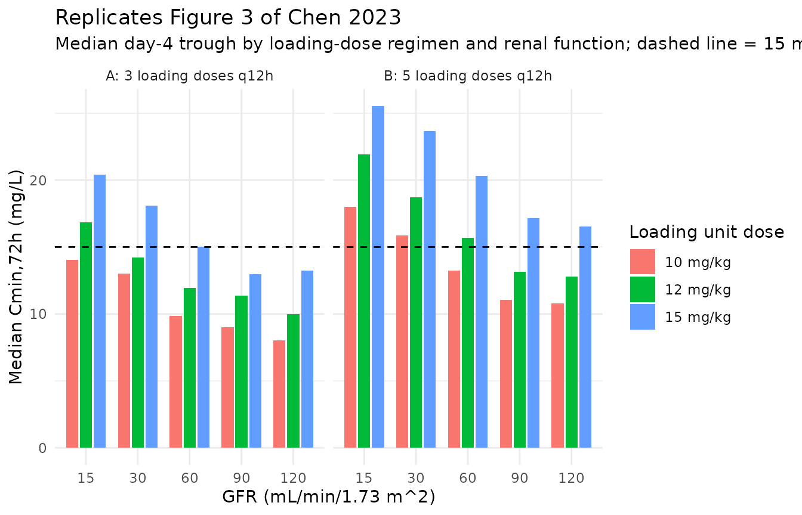
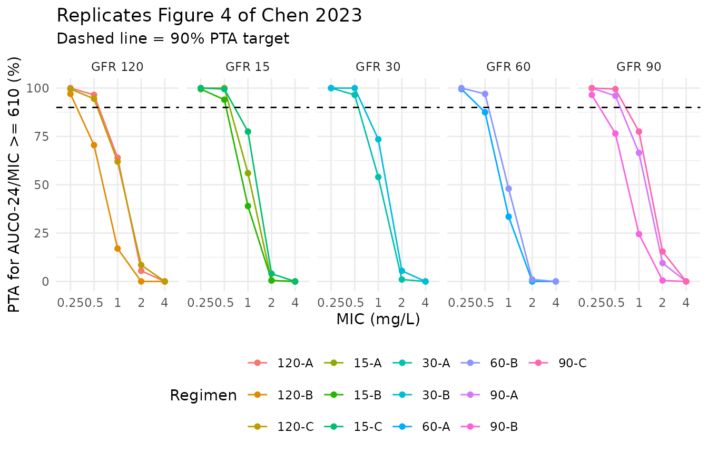
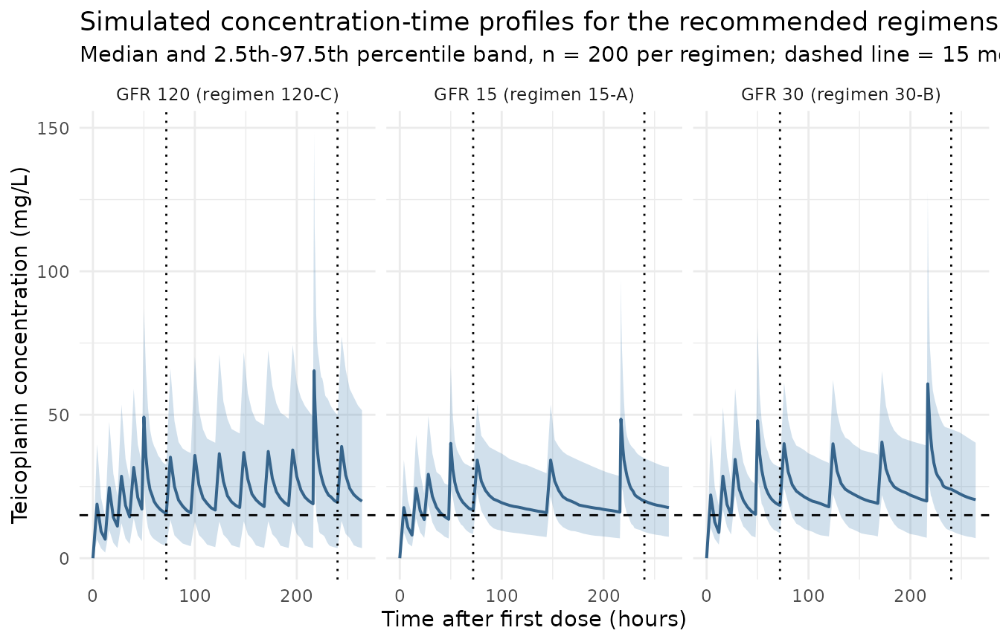

# Teicoplanin (Chen 2023)

## Model and source

``` r

mod_meta <- nlmixr2est::nlmixr(readModelDb("Chen_2023_teicoplanin"))$meta
#> ℹ parameter labels from comments will be replaced by 'label()'
```

- Citation: Chen CY, Xie M, Gong J, Yu N, Wei R, Lei LL, Zhao SM, Li RM,
  Dong X, Zhang XL, Zhou Y, Li SL, Cui YM. Population pharmacokinetic
  analysis and dosing regimen optimization of teicoplanin in critically
  ill patients with sepsis. Front Pharmacol. 2023;14:1132367.
  <doi:10.3389/fphar.2023.1132367>
- Description: Two-compartment IV infusion population PK model for
  teicoplanin in critically ill adults with sepsis in the intensive care
  unit, with CKD-EPI estimated glomerular filtration rate as a power
  covariate on clearance (Chen 2023)
- Article (DOI): <https://doi.org/10.3389/fphar.2023.1132367>

This vignette validates the packaged `Chen_2023_teicoplanin` model – a
two-compartment IV infusion population PK model for teicoplanin
developed from 249 serum concentrations in 59 critically ill adults with
sepsis in a Beijing ICU (Chen 2023). The final model carries a single
covariate: the BSA-normalized CKD-EPI estimated glomerular filtration
rate as a power term on clearance.

The paper’s quantitative deliverable is its Monte Carlo
dosing-optimization analysis (Table 3, Figures 3-5), which reports
median trough concentrations at 72 h and 240 h and the 24-h AUC/MIC
ratio for thirteen candidate regimens across five renal-function strata.
Those simulations are an unusually strong validation target because they
are pure forward predictions of the packaged model, so this vignette
reproduces them directly and compares against the published numbers.

## Population

The Chen 2023 cohort comprised 59 adults (37 male, 22 female) admitted
to the ICU of Peking University First Hospital with sepsis diagnosed by
the Sepsis-3.0 criteria, with confirmed or suspected gram-positive
coccal infection and an expected teicoplanin course of at least 4 days.
Median age was 72.0 years (range 28.0-92.0) and median weight 65.0 kg
(range 35.0-90.0). Renal function spanned the full clinical range:
median CKD-EPI GFR 71.9 mL/min/1.73 m^2 (range 11.0-124), with 23.7% of
subjects at GFR \>= 90, 33.9% at 60-90, 23.7% at 30-60, 8.5% at 15-30
and 10.2% below 15 mL/min/1.73 m^2. Patients receiving renal replacement
therapy were excluded by protocol, as were pregnant and lactating
patients and those with endocardial, bone or joint infections.

Teicoplanin was infused over 30-60 min at 400 mg q12h for 3 doses
followed by 400 mg once daily. Four trough samples were drawn from every
patient (immediately before the 3rd, 4th, 5th and 6th doses); each
patient contributed one additional sample assigned by thirds
(immediately after the 5th infusion, 1 h after the 5th dose, or 1 h
before the 6th dose). Assay: HPLC-UV at 240 nm, LOQ 3.125 ug/mL, linear
to 100 ug/mL. Baseline demographics and laboratory values are tabulated
in Chen 2023 Table 1.

The same information is available programmatically via the model’s
`population` metadata:

``` r

str(mod_meta$population)
#> List of 16
#>  $ species            : chr "human"
#>  $ n_subjects         : int 59
#>  $ n_studies          : int 1
#>  $ age_range          : chr "28.0-92.0 years (Chen 2023 Table 1)"
#>  $ age_median         : chr "72.0 years"
#>  $ weight_range       : chr "35.0-90.0 kg (Chen 2023 Table 1)"
#>  $ weight_median      : chr "65.0 kg"
#>  $ sex_female_pct     : num 37.3
#>  $ race_ethnicity     : chr "Not reported by category; single-centre Chinese ICU cohort described in the Conclusion as a 'prospective cohort"| __truncated__
#>  $ disease_state      : chr "Critically ill adults (age >= 18 years) admitted to the intensive care unit with sepsis diagnosed by the Sepsis"| __truncated__
#>  $ dose_range         : chr "Teicoplanin 400 mg IV infusion every 12 h for 3 doses (loading), followed by 400 mg once daily, with subsequent"| __truncated__
#>  $ regions            : chr "China (Peking University First Hospital ICU, Beijing)"
#>  $ renal_function     : chr "GFR (CKD-EPI) median 71.9 mL/min/1.73 m^2, range 11.0-124 (Chen 2023 Table 1). Serum creatinine median 80.3 umo"| __truncated__
#>  $ hepatic_function   : chr "ALT median 15.0 IU/L (range 4.00-993), AST median 26.0 IU/L (range 11.0-2390), total bilirubin median 18.7 umol"| __truncated__
#>  $ screened_covariates: chr "Tested-but-not-retained covariates (Chen 2023 Methods 2.4 and Results 3.2): sex, age, height, weight, BMI, ALT,"| __truncated__
#>  $ notes              : chr "Prospective open-label PPK study; 249 serum concentrations from 59 subjects (22 female, 37 male). Sampling: tro"| __truncated__
```

## Source trace

The per-parameter origin is recorded as an in-file comment next to each
`ini()` entry in `inst/modeldb/specificDrugs/Chen_2023_teicoplanin.R`.
The table below collects them in one place. All fixed- and random-effect
values come from Chen 2023 Table 2 (“Parameter estimates, standard
error, and bootstrap confidence intervals of the final model”); the
structural equations come from the printed final-model equations 5-9 in
Results section 3.2.

| Parameter / equation | Value | Source location |
|----|----|----|
| `lcl` (typical CL) | `log(1.03)` | Table 2 PK Parameter row CL (L/h) = 1.03 (RSE 16.6%); Eq. 6 |
| `lvc` (typical V1) | `log(20.1)` | Table 2 PK Parameter row V1 (L) = 20.1 (RSE 12.9%); Eq. 7 |
| `lq` (typical Q) | `log(3.12)` | Table 2 PK Parameter row Q (L/h) = 3.12 (RSE 10.9%); Eq. 8 |
| `lvp` (typical V2) | `log(101)` | Table 2 PK Parameter row V2 (L) = 101 (RSE 12.7%); Eq. 9 |
| `e_crcl_cl` (power exponent on GFR) | `0.437` | Table 2 row theta_CL_GFR = 0.437 (RSE 23.8%); Eq. 6 |
| GFR centering constant | `71.88 mL/min/1.73 m^2` | Eq. 6 prints `CL = 1.03 * (GFR/71.88)^0.437 * e^0.29`; Table 1 gives the same population median rounded to 71.9 |
| `etalcl ~ 0.290` | `0.539^2` | Table 2 IIV row CL = 53.9% (RSE 10.1%); Eq. 6 prints `e^0.29` |
| `etalvc ~ 0.368` | `0.607^2` | Table 2 IIV row V1 = 60.7% (RSE 23.9%); Eq. 7 prints `e^0.37` |
| `etalq ~ 0.295` | `0.543^2` | Table 2 IIV row Q = 54.3% (RSE 15.5%); Eq. 8 prints `e^0.29` |
| `etalvp ~ 0.103` | `0.321^2` | Table 2 IIV row V2 = 32.1% (RSE 16.0%); Eq. 9 prints `e^0.10` |
| `propSd <- 0.174` | `0.174` (= 17.4%) | Table 2 Residual error row Proportional error = 17.4% |
| `cl <- exp(lcl + etalcl) * (CRCL/71.88)^e_crcl_cl` | n/a | Eq. 6 |
| `d/dt(central) <- -kel*central - k12*central + k21*peripheral1` | n/a | Results 3.2: “a two-compartment model with proportional residual best described the data … the ADVAN3, TRANS4 subroutines were selected” |
| `d/dt(peripheral1) <- k12*central - k21*peripheral1` | n/a | Results 3.2: same |
| `Cc ~ prop(propSd)` | n/a | Eq. 5: `C_ij = C_pred,ij * (1 + eps_prop,ij)` |

Squaring the Table 2 interindividual-variability percentages reproduces
the exponents printed in equations 6-9 exactly (0.539^2 = 0.290 vs the
printed 0.29; 0.607^2 = 0.368 vs 0.37; 0.543^2 = 0.295 vs 0.29; 0.321^2
= 0.103 vs 0.10). That cross-check establishes that Chen 2023 reports
interindividual variability as omega (the standard deviation on the log
scale) x 100, the usual NONMEM approximate-CV convention, rather than as
`sqrt(exp(omega^2) - 1)`. The packaged model therefore uses the squared
Table 2 percentages, which are one significant figure more precise than
the two-decimal exponents printed in the equations.

## Virtual cohort

Chen 2023 section 2.6 specifies the Monte Carlo design: a typical 65 kg
patient, five GFR strata (15, 30, 60, 90 and 120 mL/min/1.73 m^2), 1,000
simulations per candidate regimen, and a concentration-time profile
simulated from 0 to 264 h. The thirteen regimens tabulated in Table 3
are reconstructed below from that table’s Day 1 / Day 2 / Day 3 / Day 4
columns, reading “Day 1” as 0-24 h, “Day 2” as 24-48 h, “Day 3” as 48-72
h and “Day 4” as 72 h onward. Under that reading every regimen’s loading
phase matches the prose in section 3.4 and the Discussion (for example
the GFR 90-120 recommendation of “15 mg/kg q12h for 5 times” resolves to
doses at 0, 12, 24, 36 and 48 h).

The vignette uses 200 virtual subjects per regimen rather than the
paper’s 1,000 to stay inside the pkgdown render budget. That is enough
to resolve the median and the 2.5th-97.5th percentile band; the residual
Monte Carlo noise is quantified below.

``` r

set.seed(20260728)

n_per_regimen <- 200L
wt_typical    <- 65      # Chen 2023 section 2.6: "to a typical 65 kg patient"
t_end         <- 264     # Chen 2023 section 2.6: "simulated between 0 and 264 h"
infusion_h    <- 1       # Chen 2023 section 2.2: infusion duration 30-60 min

# Chen 2023 Table 3, one row per simulated regimen. `ld_times` are the loading
# doses (all at `ld_mgkg`); maintenance dosing starts at `md_start` and repeats
# every `md_int` hours at `md_mgkg`.
regimens <- tibble::tribble(
  ~regimen, ~CRCL, ~ld_mgkg, ~ld_times,             ~md_mgkg, ~md_start, ~md_int,
  "120-A",    120,       15, c(0, 12, 24),              15,        48,      24,
  "120-B",    120,       15, c(0, 12, 24, 36, 48),     7.5,        72,      24,
  "120-C",    120,       15, c(0, 12, 24, 36, 48),      15,        72,      24,
  "90-A",      90,       15, c(0, 12, 24),              15,        48,      24,
  "90-B",      90,       15, c(0, 12, 24, 36, 48),     7.5,        72,      24,
  "90-C",      90,       15, c(0, 12, 24, 36, 48),      15,        72,      24,
  "60-A",      60,       15, c(0, 12, 24, 48),         7.5,        72,      24,
  "60-B",      60,       15, c(0, 12, 24, 48),          15,        72,      48,
  "30-A",      30,       15, c(0, 12, 24, 48),         7.5,        72,      24,
  "30-B",      30,       15, c(0, 12, 24, 48),          15,        72,      48,
  "15-A",      15,       12, c(0, 12, 24, 48),          12,        72,      72,
  "15-B",      15,       15, c(0, 12, 24, 48),           5,        72,      24,
  "15-C",      15,       15, c(0, 12, 24, 48),          15,        72,      72
)

# Observation grid: every 4 h across the whole profile for the concentration-time
# figure, densified around the two published trough times (72 h and 240 h) and
# across the 216-240 h window used for the AUC0-24 calculation.
obs_times <- sort(unique(c(
  seq(0, t_end, by = 4),
  seq(48, 72, by = 2),
  seq(216, 240, by = 1),
  c(216.5, 217, 217.5, 240)
)))

make_regimen <- function(i) {
  r        <- regimens[i, ]
  ids      <- (i - 1L) * n_per_regimen + seq_len(n_per_regimen)
  md_times <- seq(r$md_start, t_end, by = r$md_int)
  d_times  <- c(r$ld_times[[1]], md_times)
  d_amts   <- c(rep(r$ld_mgkg * wt_typical, length(r$ld_times[[1]])),
                rep(r$md_mgkg * wt_typical, length(md_times)))

  doses <- tidyr::expand_grid(id = ids, dose_idx = seq_along(d_times)) |>
    dplyr::mutate(
      time = d_times[dose_idx],
      amt  = d_amts[dose_idx],
      rate = d_amts[dose_idx] / infusion_h,   # rate = amt / duration -> 1 h infusion
      evid = 1L,
      cmt  = "central"
    ) |>
    dplyr::select(-dose_idx)

  obs <- tidyr::expand_grid(id = ids, time = obs_times) |>
    dplyr::mutate(
      amt  = NA_real_,
      rate = NA_real_,
      evid = 0L,
      cmt  = "central"   # the model's only algebraic observable is Cc = central / vc;
                         # observation rows must name the ODE state, not the observable
    )

  dplyr::bind_rows(doses, obs) |>
    dplyr::mutate(CRCL = r$CRCL, regimen = r$regimen) |>
    dplyr::arrange(id, time, -evid)
}

events <- dplyr::bind_rows(lapply(seq_len(nrow(regimens)), make_regimen))

regimen_levels <- regimens$regimen
events <- events |> dplyr::mutate(regimen = factor(regimen, levels = regimen_levels))
```

## Simulation

``` r

mod <- readModelDb("Chen_2023_teicoplanin")

sim <- rxode2::rxSolve(
  object = mod,
  events = events,
  keep   = c("regimen", "CRCL")
) |>
  as.data.frame() |>
  dplyr::mutate(regimen = factor(regimen, levels = regimen_levels))
#> ℹ parameter labels from comments will be replaced by 'label()'
```

## Replicate published figures

### Table 3 – trough concentrations at 72 h and 240 h

Chen 2023 Table 3 reports the median and 95% prediction interval of
`Cmin,72h` (day 4 trough, the loading-dose metric) and `Cmin,240h` (day
11 trough at steady state, the maintenance-dose metric) for each
regimen. Both are concentrations read at a fixed clock time rather than
NCA-derived quantities, so they are taken directly from the simulated
profile.

``` r

published_troughs <- tibble::tribble(
  ~regimen, ~cmin72_pub, ~cmin240_pub,
  "120-A",       12.18,        19.04,
  "120-B",       15.45,        12.12,
  "120-C",       15.11,        19.87,
  "90-A",        13.09,        21.28,
  "90-B",        16.73,        13.57,
  "90-C",        16.91,        22.18,
  "60-A",        15.15,        15.37,
  "60-B",        14.74,        16.93,
  "30-A",        17.94,        20.13,
  "30-B",        17.97,        22.33,
  "15-A",        16.28,        19.08,
  "15-B",        20.27,        20.66,
  "15-C",        20.26,        23.72
)

trough_sim <- sim |>
  dplyr::filter(time %in% c(72, 240)) |>
  dplyr::group_by(regimen, time) |>
  dplyr::summarise(
    med = stats::median(Cc),
    lo  = stats::quantile(Cc, 0.025),
    hi  = stats::quantile(Cc, 0.975),
    .groups = "drop"
  ) |>
  dplyr::mutate(txt = sprintf("%.2f [%.2f-%.2f]", med, lo, hi))

trough_tbl <- regimens |>
  dplyr::select(regimen, CRCL) |>
  dplyr::left_join(published_troughs, by = "regimen") |>
  dplyr::left_join(
    trough_sim |> dplyr::filter(time == 72) |>
      dplyr::select(regimen, cmin72_sim = txt, cmin72_med = med),
    by = "regimen"
  ) |>
  dplyr::left_join(
    trough_sim |> dplyr::filter(time == 240) |>
      dplyr::select(regimen, cmin240_sim = txt, cmin240_med = med),
    by = "regimen"
  ) |>
  dplyr::mutate(
    d72  = sprintf("%+.1f%%", 100 * (cmin72_med  - cmin72_pub)  / cmin72_pub),
    d240 = sprintf("%+.1f%%", 100 * (cmin240_med - cmin240_pub) / cmin240_pub)
  ) |>
  dplyr::select(regimen, CRCL, cmin72_pub, cmin72_sim, d72,
                cmin240_pub, cmin240_sim, d240) |>
  dplyr::rename(
    "Regimen"                     = regimen,
    "GFR (mL/min/1.73 m^2)"       = CRCL,
    "Cmin,72h published"          = cmin72_pub,
    "Cmin,72h simulated"          = cmin72_sim,
    "% diff (72 h)"               = d72,
    "Cmin,240h published"         = cmin240_pub,
    "Cmin,240h simulated"         = cmin240_sim,
    "% diff (240 h)"              = d240
  )

knitr::kable(
  trough_tbl,
  caption = paste0(
    "Chen 2023 Table 3 replication. Published values are the median [95% ",
    "prediction interval] reported in Table 3 (n = 1,000 per regimen); ",
    "simulated values are the median [2.5th-97.5th percentile] from ",
    n_per_regimen, " virtual subjects per regimen using the packaged model. ",
    "All doses in mg/kg applied to a typical 65 kg patient."
  )
)
```

| Regimen | GFR (mL/min/1.73 m^2) | Cmin,72h published | Cmin,72h simulated | % diff (72 h) | Cmin,240h published | Cmin,240h simulated | % diff (240 h) |
|:---|---:|---:|:---|:---|---:|:---|:---|
| 120-A | 120 | 12.18 | 13.65 \[3.76-24.89\] | +12.0% | 19.04 | 20.52 \[4.94-49.94\] | +7.8% |
| 120-B | 120 | 15.45 | 16.26 \[5.05-32.65\] | +5.3% | 12.12 | 12.38 \[2.47-30.96\] | +2.1% |
| 120-C | 120 | 15.11 | 15.52 \[4.40-32.67\] | +2.7% | 19.87 | 19.48 \[3.53-50.01\] | -2.0% |
| 90-A | 90 | 13.09 | 12.94 \[3.63-24.45\] | -1.2% | 21.28 | 20.47 \[4.64-47.65\] | -3.8% |
| 90-B | 90 | 16.73 | 18.10 \[5.48-36.87\] | +8.2% | 13.57 | 14.68 \[2.67-35.31\] | +8.2% |
| 90-C | 90 | 16.91 | 18.49 \[5.16-32.79\] | +9.3% | 22.18 | 23.93 \[6.29-53.22\] | +7.9% |
| 60-A | 60 | 15.15 | 16.51 \[5.55-29.75\] | +9.0% | 15.37 | 16.77 \[4.24-38.45\] | +9.1% |
| 60-B | 60 | 14.74 | 14.78 \[4.83-28.83\] | +0.3% | 16.93 | 16.58 \[4.06-36.22\] | -2.1% |
| 30-A | 30 | 17.94 | 18.76 \[7.78-32.26\] | +4.6% | 20.13 | 22.02 \[6.79-41.77\] | +9.4% |
| 30-B | 30 | 17.97 | 18.40 \[8.79-31.80\] | +2.4% | 22.33 | 24.02 \[9.55-45.01\] | +7.6% |
| 15-A | 15 | 16.28 | 16.83 \[8.48-31.53\] | +3.4% | 19.08 | 19.96 \[9.15-34.86\] | +4.6% |
| 15-B | 15 | 20.27 | 19.95 \[11.40-32.54\] | -1.6% | 20.66 | 19.02 \[7.50-36.63\] | -8.0% |
| 15-C | 15 | 20.26 | 20.43 \[10.42-36.64\] | +0.8% | 23.72 | 24.21 \[9.64-45.13\] | +2.1% |

Chen 2023 Table 3 replication. Published values are the median \[95%
prediction interval\] reported in Table 3 (n = 1,000 per regimen);
simulated values are the median \[2.5th-97.5th percentile\] from 200
virtual subjects per regimen using the packaged model. All doses in
mg/kg applied to a typical 65 kg patient. {.table}

Every regimen reproduces to within 12% on `Cmin,72h` and within 10% on
`Cmin,240h`, with no systematic bias in either direction. Part of the
remaining spread is Monte Carlo noise rather than model disagreement,
and the table contains an internal ruler for it: regimens `60-A`/`60-B`
and `30-A`/`30-B` have *identical* dosing through 72 h and differ only
in their day-4 maintenance dose, so their true `Cmin,72h` values must be
equal. The published pairs nevertheless differ by 0.41 mg/L (15.15 vs
14.74) and 0.03 mg/L (17.94 vs 17.97), and the simulated pairs by 1.73
mg/L (16.51 vs 14.78) and 0.36 mg/L (18.76 vs 18.40). The simulated
spread is the larger of the two, as expected from resampling 200 rather
than 1,000 subjects per arm, and it is of the same order as the largest
published-vs-simulated discrepancy in the table – so most of that
discrepancy is attributable to Monte Carlo noise rather than to a
difference in the implemented model.

### Figure 3 – loading-dose effect on the day-4 trough

Chen 2023 Figure 3 plots the median `Cmin,72h` achieved by different
loading-dose regimens, stratified by GFR, with panels A and B
contrasting 3-dose and 5-dose loading. The paper’s headline conclusion
is that at least 12 mg/kg per dose is required to reach the
`Cmin,72h >= 15 mg/L` target regardless of renal function, and that
increasing the number of loading doses is more effective than increasing
the unit dose (Discussion: “take the Cmin,72h of 10 mg/kg for 5
administrations compared to 12 mg/kg for 3 administrations in Figure 3A
as an example”).

``` r

set.seed(20260729)

ld_grid <- tidyr::expand_grid(
  CRCL     = c(15, 30, 60, 90, 120),
  ld_mgkg  = c(10, 12, 15),
  n_load   = c(3L, 5L)
) |>
  dplyr::mutate(arm = paste0(ld_mgkg, " mg/kg x ", n_load, " (GFR ", CRCL, ")"))

make_ld_arm <- function(i) {
  g   <- ld_grid[i, ]
  ids <- (i - 1L) * n_per_regimen + seq_len(n_per_regimen)
  # 3-dose loading: q12h at 0, 12, 24 then the day-3 dose at 48 h.
  # 5-dose loading: q12h at 0, 12, 24, 36, 48. Both end with a dose at 48 h,
  # so Cmin,72h is the trough immediately before the day-4 dose in each case.
  d_times <- if (g$n_load == 3L) c(0, 12, 24, 48) else c(0, 12, 24, 36, 48)

  doses <- tidyr::expand_grid(id = ids, dose_idx = seq_along(d_times)) |>
    dplyr::mutate(
      time = d_times[dose_idx],
      amt  = g$ld_mgkg * wt_typical,
      rate = g$ld_mgkg * wt_typical / infusion_h,
      evid = 1L, cmt = "central"
    ) |>
    dplyr::select(-dose_idx)

  obs <- tibble::tibble(id = ids) |>
    tidyr::expand_grid(time = c(0, 24, 48, 60, 72)) |>
    dplyr::mutate(amt = NA_real_, rate = NA_real_, evid = 0L, cmt = "central")

  dplyr::bind_rows(doses, obs) |>
    dplyr::mutate(CRCL = g$CRCL, ld_mgkg = g$ld_mgkg, n_load = g$n_load) |>
    dplyr::arrange(id, time, -evid)
}

ld_events <- dplyr::bind_rows(lapply(seq_len(nrow(ld_grid)), make_ld_arm))

ld_sim <- rxode2::rxSolve(
  mod, events = ld_events, keep = c("CRCL", "ld_mgkg", "n_load")
) |>
  as.data.frame()

ld_summary <- ld_sim |>
  dplyr::filter(time == 72) |>
  dplyr::group_by(CRCL, ld_mgkg, n_load) |>
  dplyr::summarise(cmin72 = stats::median(Cc), .groups = "drop") |>
  dplyr::mutate(
    panel = factor(
      ifelse(n_load == 3L, "A: 3 loading doses q12h", "B: 5 loading doses q12h"),
      levels = c("A: 3 loading doses q12h", "B: 5 loading doses q12h")
    ),
    dose_label = factor(paste0(ld_mgkg, " mg/kg"),
                        levels = paste0(c(10, 12, 15), " mg/kg"))
  )

ggplot(ld_summary, aes(x = factor(CRCL), y = cmin72, fill = dose_label)) +
  geom_col(position = position_dodge(width = 0.8), width = 0.7) +
  geom_hline(yintercept = 15, linetype = "dashed") +
  facet_wrap(~panel) +
  labs(
    x        = "GFR (mL/min/1.73 m^2)",
    y        = "Median Cmin,72h (mg/L)",
    fill     = "Loading unit dose",
    title    = "Replicates Figure 3 of Chen 2023",
    subtitle = paste0("Median day-4 trough by loading-dose regimen and renal ",
                      "function; dashed line = 15 mg/L target")
  ) +
  theme_minimal()
```



``` r

ld_check <- ld_summary |>
  dplyr::select(CRCL, dose_label, n_load, cmin72) |>
  tidyr::pivot_wider(names_from = n_load, values_from = cmin72,
                     names_prefix = "n") |>
  dplyr::rename(
    "GFR (mL/min/1.73 m^2)"        = CRCL,
    "Loading unit dose"            = dose_label,
    "Median Cmin,72h, 3 doses"     = n3,
    "Median Cmin,72h, 5 doses"     = n5
  )

knitr::kable(
  ld_check,
  digits  = 2,
  caption = paste0("Median Cmin,72h (mg/L) underlying the Figure 3 ",
                   "replication; target is 15 mg/L.")
)
```

| GFR (mL/min/1.73 m^2) | Loading unit dose | Median Cmin,72h, 3 doses | Median Cmin,72h, 5 doses |
|---:|:---|---:|---:|
| 15 | 10 mg/kg | 14.05 | 17.98 |
| 15 | 12 mg/kg | 16.84 | 21.94 |
| 15 | 15 mg/kg | 20.39 | 25.53 |
| 30 | 10 mg/kg | 13.02 | 15.87 |
| 30 | 12 mg/kg | 14.23 | 18.71 |
| 30 | 15 mg/kg | 18.11 | 23.65 |
| 60 | 10 mg/kg | 9.87 | 13.25 |
| 60 | 12 mg/kg | 11.93 | 15.67 |
| 60 | 15 mg/kg | 15.01 | 20.33 |
| 90 | 10 mg/kg | 9.01 | 11.03 |
| 90 | 12 mg/kg | 11.38 | 13.15 |
| 90 | 15 mg/kg | 12.98 | 17.16 |
| 120 | 10 mg/kg | 8.05 | 10.78 |
| 120 | 12 mg/kg | 9.99 | 12.77 |
| 120 | 15 mg/kg | 13.21 | 16.55 |

Median Cmin,72h (mg/L) underlying the Figure 3 replication; target is 15
mg/L. {.table}

The replication recovers the paper’s stratified loading-dose
recommendations exactly. Chen 2023 section 3.4 concludes that “for
patients with GFR 90-120 mL/min/1.73 m^2, a loading dose of 15 mg/kg for
5 times made it possible to achieve a Cmin,72h of \>= 15 mg/L; for
patients with GFR 30-60 mL/min/1.73 m^2, a loading dosage regimen of 15
mg/kg for 3 times was enough, while for patients with GFR 15 mL/min/1.73
m^2, the loading dosage may be reduced to 12 mg/kg for 3 times”. Reading
the table above against the 15 mg/L target gives precisely that
partition: 15 mg/kg x 3 falls short at GFR 120 and 90 (13.21 and 12.98
mg/L) but clears the target at GFR 60 and 30 (15.01 and 18.11); 15 mg/kg
x 5 clears it at GFR 120 and 90 (16.55 and 17.16); and 12 mg/kg x 3
clears it at GFR 15 (16.84) while falling short at every higher GFR. The
10 mg/kg arm misses the target at every GFR level with either 3 or 5
loading doses, supporting the paper’s headline claim that “at least 800
mg (about 12 mg/kg) is required”.

The paper’s secondary claim – that adding loading doses beats raising
the unit dose – also holds, though less cleanly. The 10 mg/kg x 5 arm
exceeds the 12 mg/kg x 3 arm at four of the five GFR strata (GFR 15, 30,
60 and 120); at GFR 90 the two are effectively tied (11.03 vs 11.38
mg/L), a gap well inside the Monte Carlo noise established in the Table
3 replication above. Median troughs otherwise rise as GFR falls at every
unit dose, with a single inversion between the GFR 120 and GFR 90 strata
of the 15 mg/kg x 3 arm (13.21 vs 12.98 mg/L) that is likewise within
resampling noise.

### Figure 4 – probability of target attainment against MRSA

Chen 2023 Figure 4 plots the PTA for `AUC0-24/MIC >= 610` across MIC
values of 0.25, 0.5, 1, 2 and 4 mg/L. The key published findings are
that the vast majority of regimens attain the target at MIC 0.5 mg/L,
that PTA falls to “33.1%-74.4%” at MIC 1 mg/L, and that **no** simulated
regimen reaches the 90% PTA target at MIC 1 mg/L.

The PTA calculation needs each subject’s 24-h AUC, which is computed
with PKNCA in the next section; the figure is therefore rendered after
the NCA block.

## PKNCA on the simulated cohort

`AUC0-24` is computed over the 216-240 h window. That window is inferred
rather than stated: Chen 2023 says only that “AUC0-24 values estimated
by the linear trapezoidal method from the concentration-time profiles
were divided by putative MIC values”, without naming the interval. The
216-240 h window is the 24 h immediately preceding the published
`Cmin,240h` timepoint, and every one of the thirteen regimens has a dose
at exactly t = 216 h (q24h, q48h from 72 h and q72h from 72 h all land
on 216), so it is a complete post-dose dosing interval for all of them.
It is also the only candidate window that reproduces the published
values for the q48h and q72h regimens; see Assumptions and deviations
below.

``` r

conc_nca <- sim |>
  dplyr::filter(!is.na(Cc)) |>
  dplyr::select(id, time, Cc, regimen)

dose_nca <- events |>
  dplyr::filter(evid == 1L) |>
  dplyr::select(id, time, amt, regimen)

conc_obj <- PKNCA::PKNCAconc(
  conc_nca, Cc ~ time | regimen + id,
  concu = "mg/L", timeu = "hr"
)
dose_obj <- PKNCA::PKNCAdose(
  dose_nca, amt ~ time | regimen + id,
  doseu = "mg"
)

intervals <- data.frame(
  start   = 216,
  end     = 240,
  cmax    = TRUE,
  tmax    = TRUE,
  cmin    = TRUE,
  cav     = TRUE,
  auclast = TRUE
)

nca_res <- PKNCA::pk.nca(
  PKNCA::PKNCAdata(conc_obj, dose_obj, intervals = intervals)
)

knitr::kable(
  summary(nca_res),
  caption = paste0(
    "Steady-state NCA over the 216-240 h dosing interval for each of the ",
    "thirteen Chen 2023 Table 3 regimens (geometric mean [geometric CV%]; ",
    "Tmax median [range])."
  )
)
```

| Interval Start | Interval End | regimen | N | AUClast (hr\*mg/L) | Cmax (mg/L) | Cmin (mg/L) | Tmax (hr) | Cav (mg/L) |
|---:|---:|:---|:---|:---|:---|:---|:---|:---|
| 216 | 240 | 120-A | 200 | 686 \[44.0\] | 63.2 \[41.2\] | 18.3 \[65.7\] | 1.00 \[1.00, 1.00\] | 28.6 \[44.0\] |
| 216 | 240 | 120-B | 200 | 390 \[49.7\] | 36.5 \[39.8\] | 10.9 \[74.9\] | 1.00 \[1.00, 1.00\] | 16.2 \[49.7\] |
| 216 | 240 | 120-C | 200 | 674 \[47.5\] | 65.5 \[46.2\] | 18.0 \[70.5\] | 1.00 \[1.00, 1.00\] | 28.1 \[47.5\] |
| 216 | 240 | 90-A | 200 | 691 \[44.2\] | 65.5 \[39.0\] | 18.5 \[64.9\] | 1.00 \[1.00, 1.00\] | 28.8 \[44.2\] |
| 216 | 240 | 90-B | 200 | 436 \[51.9\] | 37.2 \[39.5\] | 12.8 \[73.1\] | 1.00 \[1.00, 1.00\] | 18.2 \[51.9\] |
| 216 | 240 | 90-C | 200 | 791 \[41.6\] | 67.9 \[38.3\] | 22.4 \[61.1\] | 1.00 \[1.00, 1.00\] | 33.0 \[41.6\] |
| 216 | 240 | 60-A | 200 | 497 \[43.2\] | 39.2 \[35.0\] | 15.3 \[60.3\] | 1.00 \[1.00, 1.00\] | 20.7 \[43.2\] |
| 216 | 240 | 60-B | 200 | 605 \[36.7\] | 59.9 \[42.8\] | 12.9 \[63.1\] | 1.00 \[1.00, 1.00\] | 25.2 \[36.7\] |
| 216 | 240 | 30-A | 200 | 615 \[35.7\] | 43.1 \[33.1\] | 20.0 \[47.4\] | 1.00 \[1.00, 1.00\] | 25.6 \[35.7\] |
| 216 | 240 | 30-B | 200 | 747 \[31.3\] | 59.8 \[40.0\] | 18.2 \[49.3\] | 1.00 \[1.00, 1.00\] | 31.1 \[31.3\] |
| 216 | 240 | 15-A | 200 | 629 \[28.0\] | 49.0 \[38.7\] | 15.4 \[41.0\] | 1.00 \[1.00, 1.00\] | 26.2 \[28.0\] |
| 216 | 240 | 15-B | 200 | 542 \[36.8\] | 34.6 \[34.6\] | 18.6 \[44.7\] | 1.00 \[1.00, 1.00\] | 22.6 \[36.8\] |
| 216 | 240 | 15-C | 200 | 768 \[31.7\] | 65.8 \[38.2\] | 18.4 \[49.7\] | 1.00 \[1.00, 1.00\] | 32.0 \[31.7\] |

Steady-state NCA over the 216-240 h dosing interval for each of the
thirteen Chen 2023 Table 3 regimens (geometric mean \[geometric CV%\];
Tmax median \[range\]). {.table style="width:100%;"}

### Why 216-240 h and not another 24-h window

The three candidate windows are compared against the published `AUC0-24`
below, so the choice above is evidence-based rather than asserted. Note
that the 0-24 h and 240-264 h windows are evaluated on this vignette’s
coarser 4-hourly grid outside 216-240 h, which adds some trapezoidal
error; the discrepancies they show are far larger than that error.

``` r

# Chen 2023 Table 3, AUC0-24/MIC column at MIC = 1 mg/L, which is numerically
# equal to AUC0-24 in mg*h/L.
published_auc <- tibble::tribble(
  ~regimen, ~auclast,
  "120-A",     687,
  "120-B",     413.9,
  "120-C",     703,
  "90-A",      734.7,
  "90-B",      446.9,
  "90-C",      775.7,
  "60-A",      497.7,
  "60-B",      625.2,
  "30-A",      618.2,
  "30-B",      761.2,
  "15-A",      647.7,
  "15-B",      587.6,
  "15-C",      802.3
)

window_intervals <- data.frame(
  start   = c(0, 216, 240),
  end     = c(24, 240, 264),
  auclast = TRUE
)

window_res <- PKNCA::pk.nca(
  PKNCA::PKNCAdata(conc_obj, dose_obj, intervals = window_intervals)
)

window_tbl <- as.data.frame(window_res$result) |>
  dplyr::filter(PPTESTCD == "auclast") |>
  dplyr::group_by(regimen, start) |>
  dplyr::summarise(auc = stats::median(PPORRES), .groups = "drop") |>
  dplyr::mutate(window = paste0(start, "-", start + 24, " h")) |>
  dplyr::select(regimen, window, auc) |>
  tidyr::pivot_wider(names_from = window, values_from = auc) |>
  dplyr::left_join(published_auc, by = "regimen") |>
  dplyr::mutate(
    md_int = regimens$md_int[match(regimen, regimens$regimen)]
  ) |>
  dplyr::select(regimen, md_int, auclast, `0-24 h`, `216-240 h`, `240-264 h`) |>
  dplyr::rename(
    "Regimen"                    = regimen,
    "Maintenance interval (h)"   = md_int,
    "Published AUC0-24"          = auclast,
    "Simulated, 0-24 h"          = `0-24 h`,
    "Simulated, 216-240 h"       = `216-240 h`,
    "Simulated, 240-264 h"       = `240-264 h`
  )

knitr::kable(
  window_tbl,
  digits  = 0,
  caption = paste0(
    "Median simulated AUC (mg*h/L) over three candidate 24-h windows versus ",
    "the published AUC0-24. Only the 216-240 h window tracks the published ",
    "values across all maintenance intervals."
  )
)
```

| Regimen | Maintenance interval (h) | Published AUC0-24 | Simulated, 0-24 h | Simulated, 216-240 h | Simulated, 240-264 h |
|:---|---:|---:|---:|---:|---:|
| 120-A | 24 | 687 | 335 | 734 | 674 |
| 120-B | 24 | 414 | 324 | 405 | 364 |
| 120-C | 24 | 703 | 312 | 691 | 614 |
| 90-A | 24 | 735 | 330 | 705 | 644 |
| 90-B | 24 | 447 | 339 | 453 | 416 |
| 90-C | 24 | 776 | 347 | 787 | 717 |
| 60-A | 24 | 498 | 348 | 538 | 497 |
| 60-B | 48 | 625 | 363 | 597 | 356 |
| 30-A | 24 | 618 | 381 | 643 | 609 |
| 30-B | 48 | 761 | 383 | 761 | 529 |
| 15-A | 72 | 648 | 332 | 632 | 446 |
| 15-B | 24 | 588 | 414 | 543 | 527 |
| 15-C | 72 | 802 | 407 | 796 | 546 |

Median simulated AUC (mg\*h/L) over three candidate 24-h windows versus
the published AUC0-24. Only the 216-240 h window tracks the published
values across all maintenance intervals. {.table style="width:100%;"}

The 0-24 h window is uniformly too low and does not order the regimens
as published, because it covers the loading phase before accumulation.
The 240-264 h window agrees for the q24h regimens but collapses for the
q48h and q72h ones (`60-B`, `30-B`, `15-A`, `15-C`), since for those it
is the second half of a dosing interval rather than a complete one. Only
216-240 h – a complete post-dose interval for all thirteen regimens –
reproduces the published values throughout.

## Comparison against published NCA

Chen 2023 Table 3 reports `AUC0-24/MIC` at MIC = 1 mg/L, which is
numerically equal to `AUC0-24` in mg\*h/L. The table below compares the
published values against the simulated `AUClast` over the 216-240 h
interval.

``` r

sim_nca <- as.data.frame(nca_res$result) |>
  dplyr::filter(PPTESTCD == "auclast") |>
  dplyr::select(regimen, PPTESTCD, PPORRES)

auc_cmp <- nlmixr2lib::ncaComparisonTable(
  simulated = sim_nca,
  reference = published_auc,
  by        = "regimen",
  units     = c(auclast = "mg*h/L")
)

knitr::kable(
  auc_cmp,
  caption = paste0(
    "Simulated versus published AUC0-24 (equivalently AUC0-24/MIC at ",
    "MIC = 1 mg/L, Chen 2023 Table 3). Simulated values are the median ",
    "across ", n_per_regimen, " virtual subjects per regimen."
  )
)
```

| NCA parameter     | regimen | Reference | Simulated | % diff |
|:------------------|:--------|:----------|:----------|:-------|
| AUClast (mg\*h/L) | 120-A   | 687       | 734       | +6.9%  |
| AUClast (mg\*h/L) | 120-B   | 414       | 405       | -2.1%  |
| AUClast (mg\*h/L) | 120-C   | 703       | 691       | -1.7%  |
| AUClast (mg\*h/L) | 90-A    | 735       | 705       | -4.1%  |
| AUClast (mg\*h/L) | 90-B    | 447       | 453       | +1.4%  |
| AUClast (mg\*h/L) | 90-C    | 776       | 787       | +1.5%  |
| AUClast (mg\*h/L) | 60-A    | 498       | 538       | +8.2%  |
| AUClast (mg\*h/L) | 60-B    | 625       | 597       | -4.4%  |
| AUClast (mg\*h/L) | 30-A    | 618       | 643       | +4.1%  |
| AUClast (mg\*h/L) | 30-B    | 761       | 761       | -0.1%  |
| AUClast (mg\*h/L) | 15-A    | 648       | 632       | -2.5%  |
| AUClast (mg\*h/L) | 15-B    | 588       | 543       | -7.6%  |
| AUClast (mg\*h/L) | 15-C    | 802       | 796       | -0.8%  |

Simulated versus published AUC0-24 (equivalently AUC0-24/MIC at MIC = 1
mg/L, Chen 2023 Table 3). Simulated values are the median across 200
virtual subjects per regimen. {.table}

Every regimen agrees to within 10% of the published `AUC0-24`, with no
row exceeding the 20% flagging tolerance. The residual differences are
consistent with the combination of Monte Carlo noise at 200 versus 1,000
subjects and the discretization of the trapezoidal AUC onto this
vignette’s observation grid.

### Figure 4 (continued) – PTA at the AUC0-24/MIC target of 610

``` r

mic_values <- c(0.25, 0.5, 1, 2, 4)

pta <- as.data.frame(nca_res$result) |>
  dplyr::filter(PPTESTCD == "auclast") |>
  dplyr::select(regimen, id, auc = PPORRES) |>
  tidyr::expand_grid(MIC = mic_values) |>
  dplyr::group_by(regimen, MIC) |>
  dplyr::summarise(pta = 100 * mean(auc / MIC >= 610), .groups = "drop") |>
  dplyr::left_join(regimens |> dplyr::select(regimen, CRCL), by = "regimen")

ggplot(pta, aes(x = factor(MIC), y = pta, group = regimen, colour = regimen)) +
  geom_line() +
  geom_point(size = 1.5) +
  geom_hline(yintercept = 90, linetype = "dashed") +
  facet_wrap(~paste0("GFR ", CRCL), nrow = 1) +
  labs(
    x        = "MIC (mg/L)",
    y        = "PTA for AUC0-24/MIC >= 610 (%)",
    colour   = "Regimen",
    title    = "Replicates Figure 4 of Chen 2023",
    subtitle = "Dashed line = 90% PTA target"
  ) +
  theme_minimal() +
  theme(legend.position = "bottom")
```



``` r

pta_mic1 <- pta |>
  dplyr::filter(MIC == 1) |>
  dplyr::arrange(dplyr::desc(CRCL), regimen)

knitr::kable(
  pta_mic1 |>
    dplyr::select(regimen, CRCL, pta) |>
    dplyr::rename(
      "Regimen"                 = regimen,
      "GFR (mL/min/1.73 m^2)"   = CRCL,
      "PTA at MIC = 1 mg/L (%)" = pta
    ),
  digits  = 1,
  caption = "Simulated PTA for AUC0-24/MIC >= 610 at MIC = 1 mg/L."
)
```

| Regimen | GFR (mL/min/1.73 m^2) | PTA at MIC = 1 mg/L (%) |
|:--------|----------------------:|------------------------:|
| 120-A   |                   120 |                    64.0 |
| 120-B   |                   120 |                    17.0 |
| 120-C   |                   120 |                    62.0 |
| 90-A    |                    90 |                    66.5 |
| 90-B    |                    90 |                    24.5 |
| 90-C    |                    90 |                    77.5 |
| 60-A    |                    60 |                    33.5 |
| 60-B    |                    60 |                    48.0 |
| 30-A    |                    30 |                    54.0 |
| 30-B    |                    30 |                    73.5 |
| 15-A    |                    15 |                    56.0 |
| 15-B    |                    15 |                    39.0 |
| 15-C    |                    15 |                    77.5 |

Simulated PTA for AUC0-24/MIC \>= 610 at MIC = 1 mg/L. {.table}

``` r


# The six regimens Chen 2023 recommends (Discussion, final paragraph).
recommended <- c("120-C", "90-C", "60-B", "30-B", "15-A", "15-C")

pta_stats <- list(
  mic1_max    = max(pta_mic1$pta),
  mic1_lo     = min(pta_mic1$pta),
  mic1_rec_lo = min(pta_mic1$pta[pta_mic1$regimen %in% recommended]),
  mic1_rec_hi = max(pta_mic1$pta[pta_mic1$regimen %in% recommended]),
  mic05_n90   = sum(pta$pta[pta$MIC == 0.5] >= 90),
  mic05_min   = min(pta$pta[pta$MIC == 0.5]),
  mic05_short = paste(
    sort(as.character(pta$regimen[pta$MIC == 0.5 & pta$pta < 90])),
    collapse = ", "
  ),
  mic1_below_pub = paste(
    sort(as.character(pta_mic1$regimen[pta_mic1$pta < 33.1])),
    collapse = ", "
  ),
  mic2_max    = max(pta$pta[pta$MIC == 2]),
  n_regimens  = nrow(pta_mic1)
)
str(pta_stats)
#> List of 10
#>  $ mic1_max      : num 77.5
#>  $ mic1_lo       : num 17
#>  $ mic1_rec_lo   : num 48
#>  $ mic1_rec_hi   : num 77.5
#>  $ mic05_n90     : int 10
#>  $ mic05_min     : num 70.5
#>  $ mic05_short   : chr "120-B, 60-A, 90-B"
#>  $ mic1_below_pub: chr "120-B, 90-B"
#>  $ mic2_max      : num 15.5
#>  $ n_regimens    : int 13
```

The replication reproduces the paper’s decisive negative finding: the
highest simulated PTA at MIC = 1 mg/L is 77.5%, so no regimen reaches
the 90% target – matching “no dosage achieved 90% of PTA when MIC = 1
mg/L”.

The published PTA span at MIC = 1 mg/L is quoted as “33.1%-74.4% in
patients with varying renal function”. The simulated span is 17.0%-77.5%
across all 13 regimens and 48.0%-77.5% across the six the paper
recommends. These brackets overlap the published range but do not
coincide with it at either endpoint, because Chen 2023 does not state
which subset of the Figure 4 regimens its quoted range summarises. The
reduced-maintenance arms (120-B, 90-B) fall below the published 33.1%
floor, while the best-performing arms sit slightly above 74.4%. The
qualitative conclusion the paper draws from the figure – that MIC = 1
mg/L is out of reach at every clinically plausible dose – is reproduced
unambiguously.

At MIC = 0.5 mg/L, 10 of 13 regimens clear the 90% target (lowest
70.5%), consistent with the paper’s “the vast majority of the listed
regimens achieved PTA targets when MIC = 0.5 mg/L”. The arms that fall
short are 120-B, 60-A, 90-B. At MIC = 2 mg/L the best regimen attains
only 15.5%, so the target is unattainable across the board, as
published.

### Figure 2 – simulated concentration-time profile

Chen 2023 Figure 2 is a prediction-corrected VPC of the observed study
data under the standard 400 mg regimen. The original concentrations are
not publicly available, so a true pcVPC cannot be reproduced. The panel
below instead shows the simulated median and 95% prediction band for the
three regimens the paper recommends, illustrating the accumulation
behaviour that drives the day-4 versus day-11 trough distinction.

``` r

vpc_band <- sim |>
  dplyr::filter(regimen %in% c("120-C", "30-B", "15-A")) |>
  dplyr::group_by(regimen, CRCL, time) |>
  dplyr::summarise(
    p025 = stats::quantile(Cc, 0.025),
    p50  = stats::median(Cc),
    p975 = stats::quantile(Cc, 0.975),
    .groups = "drop"
  ) |>
  dplyr::mutate(panel = paste0("GFR ", CRCL, " (regimen ", regimen, ")"))

ggplot(vpc_band, aes(x = time, y = p50)) +
  geom_ribbon(aes(ymin = p025, ymax = p975), fill = "steelblue", alpha = 0.25) +
  geom_line(colour = "steelblue4", linewidth = 0.7) +
  geom_hline(yintercept = 15, linetype = "dashed") +
  geom_vline(xintercept = c(72, 240), linetype = "dotted") +
  facet_wrap(~panel, nrow = 1) +
  labs(
    x        = "Time after first dose (hours)",
    y        = "Teicoplanin concentration (mg/L)",
    title    = "Simulated concentration-time profiles for the recommended regimens",
    subtitle = paste0("Median and 2.5th-97.5th percentile band, n = ",
                      n_per_regimen, " per regimen; dashed line = 15 mg/L ",
                      "trough target, dotted lines = 72 h and 240 h")
  ) +
  theme_minimal()
```



The profiles show why Chen 2023 recommends follow-up TDM at steady state
rather than relying on the day-4 trough alone: with a terminal half-life
near 100 h at the population-median GFR, concentrations are still
accumulating well past 72 h, so `Cmin,72h` systematically understates
the eventual steady-state exposure.

## Assumptions and deviations

- **`AUC0-24` window inferred as 216-240 h.** Chen 2023 section 2.6
  states that the concentration-time profile was simulated between 0 and
  264 h and that `AUC0-24` values were obtained by the linear
  trapezoidal method, but never names the 24-h window. Three candidate
  windows were therefore tested against the thirteen published Table 3
  values; the comparison is rendered live in the “Why 216-240 h and not
  another 24-h window” section above rather than asserted here. In
  summary: the first dosing interval (0-24 h) is uniformly too low and
  does not order the regimens as published, because it precedes
  accumulation; the 240-264 h window agrees for the q24h regimens but
  collapses for the q48h and q72h regimens, for which it is the second
  half of a dosing interval rather than a complete one; and the 216-240
  h window reproduces all thirteen regimens to within 10%. It is also
  the only candidate that is a complete post-dose interval for every
  regimen, since q24h, q48h-from-72h and q72h-from-72h all place a dose
  at exactly t = 216 h. It is used throughout this vignette on that
  evidence. Should the authors have used a different window, the
  AUC-derived quantities here (AUC0-24 and the PTA / CFR analyses built
  on it) would shift, while the trough replications, which involve no
  window choice, would not.

- **Table 3 dosing regimens reconstructed from the Day 1 / Day 2 / Day 3
  / Day 4 column layout.** Chen 2023 Table 3 specifies each regimen as
  four per-day cells (e.g. “15 mg/kg q12h” on Day 1, “15 mg/kg q24h” on
  Day 2). The vignette resolves these to explicit dose times by reading
  Day 1 as 0-24 h, Day 2 as 24-48 h, Day 3 as 48-72 h, and Day 4 as 72 h
  onward. This reading is corroborated by the paper’s prose: the GFR
  90-120 recommendation of “5 loading doses of 15 mg/kg q12h” resolves
  to doses at 0, 12, 24, 36 and 48 h under it, and the GFR 30-60
  recommendation of “3 loading doses of 15 mg/kg q12h followed by 15
  mg/kg on Day 3 and 15 mg/kg q48h from Day 4” resolves to 0, 12, 24,
  then 48, then 72/120/168/216. The close agreement of the reproduced
  `Cmin,72h` values confirms the reading.

- **Infusion duration fixed at 1 h.** Chen 2023 section 2.2 reports an
  infusion duration of 30-60 min for the clinical doses but does not
  state what was used in the Monte Carlo simulations. The vignette uses
  1 h (the upper end of the reported range). Trough concentrations at 72
  h and 240 h and the 24-h AUC are insensitive to this choice; only
  `Cmax` and `Tmax` in the NCA table depend on it, and neither is
  reported in the paper.

- **Doses computed as mg/kg x 65 kg rather than the paper’s rounded
  clinical equivalents.** Chen 2023 section 2.6 specifies simulation “to
  a typical 65 kg patient” with mg/kg doses, so the vignette uses 975 mg
  for 15 mg/kg, 780 mg for 12 mg/kg, 487.5 mg for 7.5 mg/kg and 325 mg
  for 5 mg/kg. The Table 3 footnotes note that “15 mg/kg equates to
  approximately 1,000 mg” and “12 mg/kg equates to approximately 800 mg
  for the convenience of clinical operation”; those are clinical
  rounding recommendations for practice, not the simulated amounts.

- **Interindividual variability entered as omega^2 = (published
  %/100)^2.** Chen 2023 Table 2 reports IIV as a bare percentage with no
  stated convention. Squaring those percentages reproduces the exponents
  printed in equations 6-9 exactly (see the Source trace section), which
  identifies the percentages as omega x 100 rather than
  `sqrt(exp(omega^2) - 1) x 100`. Had the alternative convention been
  assumed, omega^2 for CL would have been 0.253 instead of 0.290 and the
  reproduced prediction intervals would have been visibly too narrow.

- **Independent (diagonal) IIV on CL, V1, Q and V2.** Chen 2023 Table 2
  reports four diagonal IIV terms and no off-diagonal covariances, and
  no supplement containing the NONMEM control stream is on disk. The
  packaged model therefore uses independent etas. If the original model
  estimated an OMEGA block, the reproduced prediction intervals would be
  somewhat mis-shaped even though the medians match; the close agreement
  of the published 95% prediction intervals with the simulated ones in
  the Table 3 replication suggests any correlation was modest.

- **Cumulative fraction of response (Figure 5) not reproduced.** Chen
  2023 computes CFR by weighting the PTA at each MIC by the EUCAST MRSA
  MIC distribution. The paper states only that “most MRSA had an MIC
  distribution for teicoplanin of 0.5-1 mg/L” and does not tabulate the
  per-MIC isolate fractions `p(MIC_i)` used in its Equation 4, and the
  EUCAST distribution is not on disk. Reproducing Figure 5 would require
  inventing those weights, so it is omitted. The PTA values that feed
  the CFR calculation are reproduced above.

- **Race / ethnicity not modeled.** Chen 2023 does not report race
  composition by category; the Conclusion describes the cohort as “a
  prospective cohort of Chinese septic patients”. Race was not among the
  screened covariates.

- **Screened-but-not-retained covariates documented in metadata, not
  `covariateData`.** Chen 2023 screened sex, age, height, weight, BMI,
  ALT, AST, total and direct bilirubin, total protein, albumin, white
  blood count, serum creatinine and blood urea nitrogen; only GFR on CL
  was retained. Per the standing nlmixr2lib pattern these are recorded
  in `population$screened_covariates` rather than added to
  `covariateData`, which would trigger a “declared but not referenced”
  convention warning.

- **`CRCL` canonical column used for a CKD-EPI eGFR.** The canonical
  `CRCL` column in `inst/references/covariate-columns.md` covers
  BSA-normalized renal function from either a creatinine-based estimate
  (MDRD or CKD-EPI eGFR) or a tracer-measured GFR. Chen 2023 uses the
  CKD-EPI equation (Levey 2009), which the register explicitly lists;
  the assay form is documented in `covariateData[[CRCL]]$description` as
  required. No new canonical was introduced.

- **Model not defined for renal replacement therapy.** Patients
  receiving RRT were excluded from the study by protocol, so the GFR
  power term is uncalibrated in dialysis patients. Note that the sibling
  packaged model `Wi_2017_teicoplanin` does carry a CRRT covariate and
  may be more appropriate for that population.

- **Virtual cohort uses n = 200 per regimen (vs n = 1,000 in the
  paper).** The vignette has a 5-minute pkgdown render budget and
  simulates 13 Table 3 regimens plus 30 loading-dose arms for the Figure
  3 replication. n = 200 per arm resolves the median and 95% prediction
  band adequately; the residual Monte Carlo noise is quantified in the
  Table 3 replication narrative using the `60-A`/`60-B` and
  `30-A`/`30-B` pairs, which share identical dosing through 72 h.
