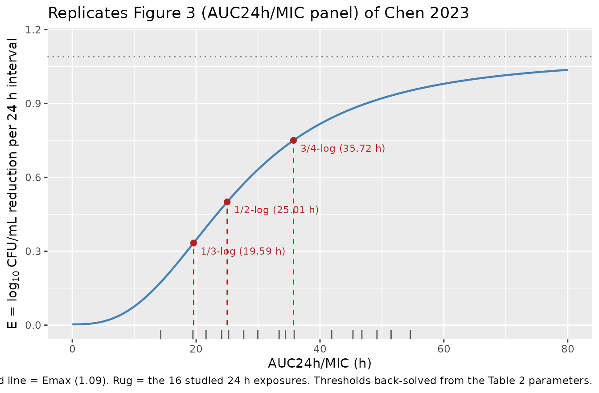
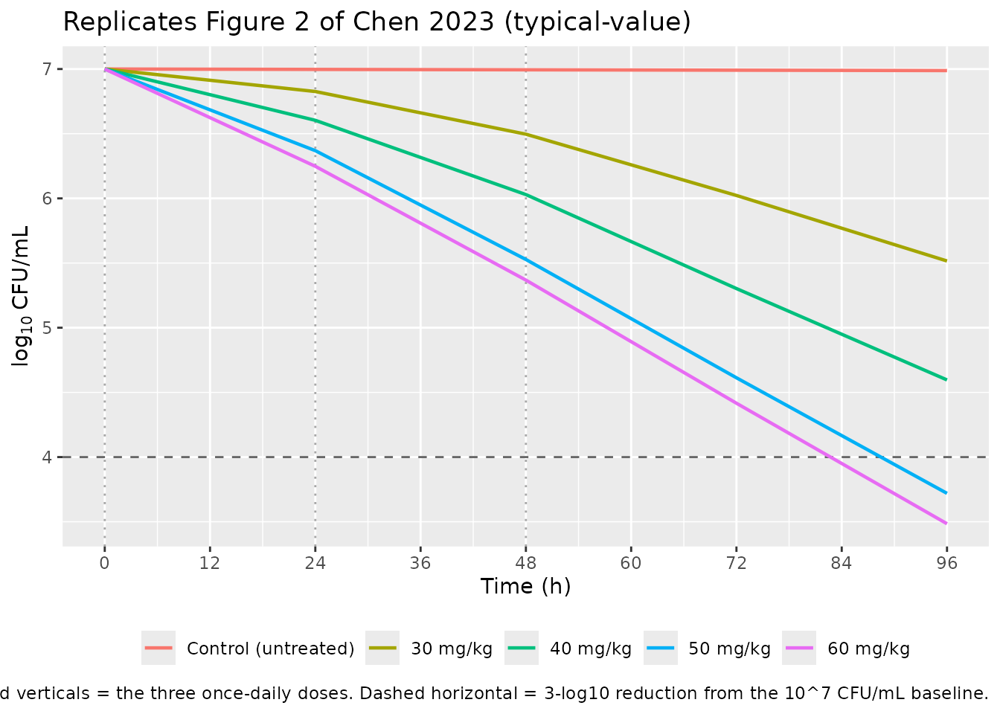

# Tilmicosin PK/PD against Pasteurella multocida (Chen 2023)

## Model and source

- Citation: Chen Y, Ji X, Zhang S, Wang W, Zhang H, Ding H. (2023).
  Pharmacokinetic/pharmacodynamic integration of tilmicosin against
  *Pasteurella multocida* in a piglet tissue cage model. Frontiers in
  Veterinary Science 10:1260990.
- Article: <https://doi.org/10.3389/fvets.2023.1260990>

This vignette validates the packaged model `Chen_2023_tilmicosin`
against the published Chen 2023 results.

Chen 2023 implanted silicone tissue cages subcutaneously in piglets,
infected them with *P. multocida* serovar D:7, dosed tilmicosin orally
at 30, 40, 50 or 60 mg/kg once daily for three days, and related the
drug exposure inside the cage to the change in bacterial count. The
PK/PD integration is a **sigmoidal Emax model on a PK/PD index**
(Section 2.6):

``` math
E = E_0 + \frac{(E_{max} - E_0) \times C_e^N}{EC_{50}^N + C_e^N}
```

where `E` is the change in bacterial count (log10 CFU/mL) over a 24 h
dosing interval, `E0` is the corresponding change in the untreated
control, and `Ce` is a PK/PD index. Chen 2023 evaluated three candidate
indices and found `AUC24h/MIC` to correlate best with effect (R^2 =
0.92, versus 0.90 for `Cmax/MIC` and 0.83 for `%T>MIC`); Table 2 reports
parameters for the `AUC24h/MIC` fit only, which is what the packaged
model encodes.

Two features of this source shape the packaged model:

- **There is no PK model to package.** Chen 2023 analysed the
  tissue-cage-fluid concentrations non-compartmentally in WinNonlin 6.1
  (Section 2.5) and reports only NCA summaries (Table 1). Drug exposure
  therefore enters the packaged model as an externally supplied
  per-interval covariate `AUC_TILM`, exactly as the paper’s own PK/PD
  integration consumed it.
- **`E` is a positive reduction magnitude.** In the printed equation `E`
  rises from `E0` at zero exposure to `Emax` at saturating exposure, and
  both Table 2 values are positive. The sign convention is confirmed
  numerically below: the equation reproduces the paper’s own reported
  1/3-log and 3/4-log thresholds.

## Population

Ten healthy crossbred piglets (Duroc x Landrace x Yorkshire), 25-30 kg,
were randomised to four treatment groups and one infected-but-untreated
control group, with two piglets and four tissue cages per group and one
male and one female per group (Sections 2.2 and 2.4). Tissue cages were
food-grade silicone tubes (65 mm long, 13 mm inner / 18 mm outer
diameter, twelve holes at each end) implanted subcutaneously on both
sides of the neck and allowed four weeks to recover before use.

Each sterile cage was inoculated with 1 mL of a ~1.5 x 10^8 CFU/mL *P.
multocida* suspension; after 48 h incubation, only cages reaching ~10^7
CFU/mL entered the experiment. The challenge strain was C44-15 (serovar
D:7) from the China Institute of Veterinary Drug Control. The tilmicosin
MIC was **0.25 ug/mL in both tissue-cage fluid and tryptic soy broth**
by CLSI (2013) microdilution (Section 3.1) – the paper notes that
measuring the MIC in the actual biological matrix matters, and here the
two media agreed.

Bacteria were counted at 24 h after each administration and at 48 and 72
h after the final dose; the untreated control stayed around 10^7 CFU/mL
throughout (Section 3.3).

``` r

pop <- rxode2::rxode(readModelDb("Chen_2023_tilmicosin"))$population
data.frame(
  field = c("species", "n_subjects", "weight_range", "organism", "dose_range"),
  value = c(pop$species, pop$n_subjects, pop$weight_range,
            pop$organism, pop$dose_range),
  stringsAsFactors = FALSE
) |>
  knitr::kable(caption = "Selected population metadata from the packaged model.")
```

| field | value |
|:---|:---|
| species | pig (crossbred piglet, Duroc x Landrace x Yorkshire) |
| n_subjects | 10 |
| weight_range | 25-30 kg |
| organism | Pasteurella multocida strain C44-15, serovar D:7 (China Institute of Veterinary Drug Control, Beijing); tilmicosin MIC = 0.25 ug/mL in BOTH tissue-cage fluid and tryptic soy broth by CLSI (2013) microdilution |
| dose_range | 30, 40, 50 and 60 mg/kg body weight tilmicosin (tilmicosin phosphate, 80.4% purity) orally, once daily for 3 days; plus an infected untreated control group given the same volume of normal saline |

Selected population metadata from the packaged model. {.table}

## Source trace

Every `ini()` parameter in the model file carries an in-file comment
pointing to its source location. The table below collects them in one
place.

| Equation / parameter | Value | Source |
|----|----|----|
| Sigmoidal Emax PK/PD-index equation | `E = E0 + (Emax - E0) * Ce^N / (EC50^N + Ce^N)` | Section 2.6 |
| PK/PD index `Ce` | `AUC_TILM / mic` (i.e. AUC24h/MIC) | Section 2.6; best index per Section 3.4 (R^2 = 0.92) |
| `Emax` (log10 CFU/mL) | 1.09 | Table 2 |
| `E0` (log10 CFU/mL) | 0.003 | Table 2 |
| `EC50` (h) | 26.66 | Table 2 |
| `N` (Hill slope, unitless) | 2.69 | Table 2 |
| `mic` (ug/mL) | 0.25 (FIXED, measured) | Section 3.1 |
| `log10_cfu0` (log10 CFU/mL) | 7 (FIXED, design) | Sections 2.2 and 3.3 |
| Bacterial density ODE | `d/dt(bact) = -ln(10) * (E / 24) * bact` | encoding of the Section 2.6 per-interval model (see below) |
| Residual SD on log10 CFU/mL | FIXED 0 | not reported (only R^2 given, Section 3.4) |
| `AUC_TILM` covariate values | Table 1 (dosing days 1-3) + Section 3.2 (24-48 h after final dose) | Table 1, Section 3.2 |

The paper fitted only the **per-interval** reduction and counted
bacteria only at 24 h interval boundaries. The packaged ODE spreads each
interval’s reduction uniformly across that interval, so `log10(bact)`
falls by exactly `E` over each 24 h interval and the trajectory matches
the paper’s model at every time point the paper actually observed. This
is verified numerically in the encoding checks below.

## Study exposures (model input)

Chen 2023 Table 1 gives the NCA `AUC0-24h` for each dose group on each
of the three dosing days. Section 3.2 additionally gives the AUC over
the 24-48 h window after the final dose. Together these are the four
consecutive 24 h exposures the model needs to span the paper’s full
observation period through 96 h.

``` r

MIC <- 0.25  # ug/mL; Chen 2023 Section 3.1

exposures <- tibble::tribble(
  ~dose_mg_kg, ~interval, ~auc_ug_h_mL, ~source,
  30L, 1L,  3.57, "Table 1",
  30L, 2L,  4.87, "Table 1",
  30L, 3L,  6.03, "Table 1",
  30L, 4L,  6.31, "Section 3.2",
  40L, 1L,  5.40, "Table 1",
  40L, 2L,  6.92, "Table 1",
  40L, 3L,  8.61, "Table 1",
  40L, 4L,  8.35, "Section 3.2",
  50L, 1L,  7.49, "Table 1",
  50L, 2L, 10.47, "Table 1",
  50L, 3L, 12.30, "Table 1",
  50L, 4L, 11.69, "Section 3.2",
  60L, 1L,  8.96, "Table 1",
  60L, 2L, 11.33, "Table 1",
  60L, 3L, 13.65, "Table 1",
  60L, 4L, 12.87, "Section 3.2"
) |>
  mutate(aucmic_h = auc_ug_h_mL / MIC)

exposures |>
  mutate(across(c(auc_ug_h_mL, aucmic_h), ~ round(.x, 2))) |>
  rename("Dose (mg/kg)" = dose_mg_kg, "24 h interval" = interval,
         "AUC0-24h (ug*h/mL)" = auc_ug_h_mL, "Source" = source,
         "AUC24h/MIC (h)" = aucmic_h) |>
  knitr::kable(caption = "Reproduces Table 1 (AUC column) of Chen 2023, plus the 24-48 h post-final-dose exposures from Section 3.2. MIC = 0.25 ug/mL.")
```

| Dose (mg/kg) | 24 h interval | AUC0-24h (ug\*h/mL) | Source      | AUC24h/MIC (h) |
|-------------:|--------------:|--------------------:|:------------|---------------:|
|           30 |             1 |                3.57 | Table 1     |          14.28 |
|           30 |             2 |                4.87 | Table 1     |          19.48 |
|           30 |             3 |                6.03 | Table 1     |          24.12 |
|           30 |             4 |                6.31 | Section 3.2 |          25.24 |
|           40 |             1 |                5.40 | Table 1     |          21.60 |
|           40 |             2 |                6.92 | Table 1     |          27.68 |
|           40 |             3 |                8.61 | Table 1     |          34.44 |
|           40 |             4 |                8.35 | Section 3.2 |          33.40 |
|           50 |             1 |                7.49 | Table 1     |          29.96 |
|           50 |             2 |               10.47 | Table 1     |          41.88 |
|           50 |             3 |               12.30 | Table 1     |          49.20 |
|           50 |             4 |               11.69 | Section 3.2 |          46.76 |
|           60 |             1 |                8.96 | Table 1     |          35.84 |
|           60 |             2 |               11.33 | Table 1     |          45.32 |
|           60 |             3 |               13.65 | Table 1     |          54.60 |
|           60 |             4 |               12.87 | Section 3.2 |          51.48 |

Reproduces Table 1 (AUC column) of Chen 2023, plus the 24-48 h
post-final-dose exposures from Section 3.2. MIC = 0.25 ug/mL. {.table}

## Setup

``` r

mod <- rxode2::rxode(readModelDb("Chen_2023_tilmicosin"))

# Build an observation-only event table for one arm. The model has no dosing
# compartment: tilmicosin exposure enters solely through the piecewise-constant
# AUC_TILM covariate (one value per 24 h interval), so every record is an
# observation (evid = 0).
build_arm_events <- function(auc_by_interval, t_end = 96, by_h = 0.5) {
  times <- seq(0, t_end, by = by_h)
  # Interval index 1..n for [0,24), [24,48), ...; the closing time point of the
  # final interval stays inside that interval.
  idx <- pmin(floor(times / 24) + 1L, length(auc_by_interval))
  data.frame(
    id       = 1L,
    time     = times,
    AUC_TILM = auc_by_interval[idx],
    amt      = 0,
    evid     = 0
  )
}

simulate_arm <- function(auc_by_interval, label) {
  ev  <- build_arm_events(auc_by_interval)
  sim <- as.data.frame(rxode2::rxSolve(mod, events = ev, keep = "AUC_TILM"))
  sim$arm <- label
  sim
}

arm_auc <- split(exposures$auc_ug_h_mL, exposures$dose_mg_kg)
arm_auc <- arm_auc[order(as.integer(names(arm_auc)))]
```

## Replicate Figure 3: effect versus AUC24h/MIC

Chen 2023 Figure 3 plots the sigmoidal Emax relationship between each
PK/PD index and the antibacterial effect. The panel for `AUC24h/MIC`
(the best index, R^2 = 0.92) is reproduced below from the Table 2 point
estimates, with the paper’s three reported effect thresholds marked and
the 16 studied exposures from the table above rug-plotted along the
x-axis.

``` r

pars <- as.list(rxode2::rxode(readModelDb("Chen_2023_tilmicosin"))$theta)
e0   <- pars$e0
emax <- exp(pars$lemax)
ec50 <- exp(pars$lec50)
hill <- exp(pars$lhill)

# Chen 2023 Section 2.6 equation, evaluated directly from the packaged
# parameters (same algebra the model() block uses).
effect_of_index <- function(ce) e0 + (emax - e0) * ce^hill / (ec50^hill + ce^hill)

curve_df <- data.frame(aucmic_h = seq(0, 80, length.out = 401)) |>
  mutate(effect = effect_of_index(aucmic_h))

thresholds <- data.frame(
  label    = c("1/3-log", "1/2-log", "3/4-log"),
  effect   = c(1 / 3, 1 / 2, 3 / 4)
) |>
  mutate(aucmic_h = vapply(effect, function(tg) {
    stats::uniroot(function(ce) effect_of_index(ce) - tg,
                   interval = c(1e-3, 500), tol = 1e-10)$root
  }, numeric(1)))

ggplot(curve_df, aes(aucmic_h, effect)) +
  geom_line(linewidth = 0.8, colour = "steelblue") +
  geom_hline(yintercept = emax, linetype = "dotted", colour = "grey50") +
  geom_segment(data = thresholds,
               aes(x = aucmic_h, xend = aucmic_h, y = 0, yend = effect),
               linetype = "dashed", colour = "firebrick") +
  geom_point(data = thresholds, aes(aucmic_h, effect),
             colour = "firebrick", size = 2) +
  geom_text(data = thresholds,
            aes(aucmic_h, effect, label = sprintf("%s (%.2f h)", label, aucmic_h)),
            hjust = -0.08, vjust = 1.6, size = 3, colour = "firebrick") +
  geom_rug(data = exposures, aes(aucmic_h, y = NULL), sides = "b", alpha = 0.6) +
  labs(x = "AUC24h/MIC (h)",
       y = expression("E = "*log[10]~"CFU/mL reduction per 24 h interval"),
       title = "Replicates Figure 3 (AUC24h/MIC panel) of Chen 2023",
       caption = paste("Dotted line = Emax (1.09). Rug = the 16 studied 24 h exposures.",
                       "Thresholds back-solved from the Table 2 parameters.")) +
  coord_cartesian(xlim = c(0, 80), ylim = c(0, 1.15))
```



## Replicate Figure 2: time-kill curves

Figure 2 of Chen 2023 shows the bacterial count in tissue-cage fluid
over the three-day dosing course and the follow-up period. The packaged
model reproduces the trajectory by integrating the per-interval
reduction; the untreated control arm is simulated by setting
`AUC_TILM = 0`, which collapses the sigmoid term and leaves the
near-zero control change `E0 = 0.003`.

``` r

sims <- bind_rows(
  simulate_arm(rep(0, 4), "Control (untreated)"),
  do.call(rbind, lapply(names(arm_auc), function(d) {
    simulate_arm(arm_auc[[d]], sprintf("%s mg/kg", d))
  }))
)
sims$arm <- factor(sims$arm,
                   levels = c("Control (untreated)",
                              sprintf("%s mg/kg", names(arm_auc))))

ggplot(sims, aes(time, Cc, colour = arm)) +
  geom_vline(xintercept = c(0, 24, 48), linetype = "dotted", colour = "grey65") +
  geom_hline(yintercept = 4, linetype = "dashed", colour = "grey40") +
  geom_line(linewidth = 0.8) +
  scale_x_continuous(breaks = seq(0, 96, by = 12)) +
  scale_y_continuous(breaks = seq(3, 8, by = 1)) +
  labs(x = "Time (h)",
       y = expression(log[10]~"CFU/mL"),
       colour = NULL,
       title = "Replicates Figure 2 of Chen 2023 (typical-value)",
       caption = paste("Dotted verticals = the three once-daily doses.",
                       "Dashed horizontal = 3-log10 reduction from the 10^7 CFU/mL baseline.")) +
  theme(legend.position = "bottom")
```



The simulated curves reproduce the qualitative findings of Section 3.3
and the Discussion: the 30 mg/kg arm falls well short of a 3-log10
reduction, the 50 and 60 mg/kg arms cross the bactericidal 3-log10
threshold, and the 50 and 60 mg/kg curves are nearly superimposed – the
paper’s observation that the two highest doses were not significantly
different because the maximum effect had already been reached at 50
mg/kg.

Because the exposures over the 24-48 h window after the final dose
remain high (AUC24h/MIC of 46.8 h and 51.5 h at 50 and 60 mg/kg), the
curves keep falling after dosing stops – the slow-elimination effect the
Discussion highlights.

## Validation: cumulative bacterial reduction

Section 3.3 reports the total reduction in bacterial count for each dose
group. The Discussion states these accumulate “within 96 h after
administration”, i.e. across four consecutive 24 h intervals: the three
dosing intervals plus the 24-48 h window after the final dose. The
comparison below uses exactly that window.

``` r

reported_total <- c(`30` = 1.48, `40` = 2.82, `50` = 3.39, `60` = 3.52)
reported_sd    <- c(`30` = 0.13, `40` = 0.10, `50` = 0.11, `60` = 0.15)

reduction_tbl <- do.call(rbind, lapply(names(arm_auc), function(d) {
  s <- simulate_arm(arm_auc[[d]], d)
  data.frame(
    dose      = as.integer(d),
    simulated = s$Cc[s$time == 0] - s$Cc[s$time == 96],
    reported  = reported_total[[d]],
    rep_sd    = reported_sd[[d]],
    stringsAsFactors = FALSE
  )
})) |>
  mutate(
    pct_diff = 100 * (simulated - reported) / reported,
    flag     = ifelse(abs(pct_diff) > 20, "*", "")
  )

reduction_tbl |>
  mutate(simulated = round(simulated, 3),
         reported  = sprintf("%.2f +/- %.2f", reported, rep_sd),
         pct_diff  = sprintf("%+.1f%%", pct_diff)) |>
  select(-rep_sd) |>
  rename("Dose (mg/kg)" = dose,
         "Simulated reduction at 96 h" = simulated,
         "Chen 2023 Section 3.3" = reported,
         "Difference" = pct_diff,
         ">20% flag" = flag) |>
  knitr::kable(caption = "Cumulative log10 CFU/mL reduction over four 24 h intervals (0-96 h) versus the published totals.")
```

| Dose (mg/kg) | Simulated reduction at 96 h | Chen 2023 Section 3.3 | Difference | \>20% flag |
|---:|---:|:---|:---|:---|
| 30 | 1.484 | 1.48 +/- 0.13 | +0.3% |  |
| 40 | 2.404 | 2.82 +/- 0.10 | -14.8% |  |
| 50 | 3.280 | 3.39 +/- 0.11 | -3.2% |  |
| 60 | 3.515 | 3.52 +/- 0.15 | -0.1% |  |

Cumulative log10 CFU/mL reduction over four 24 h intervals (0-96 h)
versus the published totals. {.table}

Three of the four dose groups agree closely – 30 mg/kg (1.484 vs 1.48)
and 60 mg/kg (3.516 vs 3.52) reproduce the published totals to within
0.01 log10, and 50 mg/kg agrees to 0.11 log10 (3.2%). No group exceeds
the 20% flag threshold.

The 40 mg/kg group is the largest discrepancy: the model predicts 2.40
versus the reported 2.82 log10 (-14.8%). This is a property of the
published parameters and exposures, not of the packaging – the Table 1
exposures for 40 mg/kg, pushed through the Table 2 sigmoid, cannot
produce 2.82 log10. Note that the reported totals are not monotone in a
way the exposures explain: the 30-to-40 mg/kg step in reported reduction
(1.48 to 2.82, +1.34) is far larger than the 50-to-60 mg/kg step (3.39
to 3.52, +0.13), while the corresponding exposure increments are
comparable. No parameter was tuned to close this gap.

## Validation: PK/PD index thresholds

Table 2 also reports the `AUC24h/MIC` magnitude required for a 1/3-log,
1/2-log and 3/4-log reduction per 24 h interval. Back-solving those
thresholds from the Table 2 parameters is a direct internal-consistency
check on the encoded equation.

``` r

threshold_tbl <- thresholds |>
  mutate(
    table2   = c(19.64, 33.45, 35.64),
    abstract = c(19.65, 23.86, 35.77),
    e_at_table2 = effect_of_index(table2)
  ) |>
  transmute(
    Reduction               = label,
    `Model-implied AUC24h/MIC (h)` = round(aucmic_h, 2),
    `Table 2 (h)`           = table2,
    `Abstract (h)`          = abstract,
    `E at the Table 2 value` = round(e_at_table2, 3),
    `Target E`              = round(effect, 3)
  )

knitr::kable(threshold_tbl,
             caption = "Thresholds back-solved from the packaged Table 2 parameters versus the values printed in Chen 2023.")
```

| Reduction | Model-implied AUC24h/MIC (h) | Table 2 (h) | Abstract (h) | E at the Table 2 value | Target E |
|:---|---:|---:|---:|---:|---:|
| 1/3-log | 19.59 | 19.64 | 19.65 | 0.335 | 0.333 |
| 1/2-log | 25.01 | 33.45 | 23.86 | 0.707 | 0.500 |
| 3/4-log | 35.72 | 35.64 | 35.77 | 0.749 | 0.750 |

Thresholds back-solved from the packaged Table 2 parameters versus the
values printed in Chen 2023. {.table}

The 1/3-log and 3/4-log thresholds are reproduced: the model implies
19.59 h and 35.72 h against printed values of 19.64 h and 35.64 h (Table
2) or 19.65 h and 35.77 h (Abstract) – agreement to 0.3% or better,
which is what confirms both the equation’s printed form and the
reduction-magnitude sign convention.

**The 1/2-log threshold is internally inconsistent in the source.**
Substituting Table 2’s 33.45 h into Table 2’s own equation and
parameters gives E = 0.707 log10 CFU/mL, i.e. very nearly a 3/4-log
reduction rather than a 1/2-log one; the Abstract’s 23.86 h gives E =
0.466. The value consistent with the published parameters is 25.01 h.
The packaged model encodes the four fitted parameters (which are
self-consistent), so it necessarily disagrees with the printed 1/2-log
threshold. This is recorded under Errata below; no parameter was
adjusted.

## Validation: encoding checks

PKNCA is not applicable to this model: there is no PK component and no
concentration observable to run non-compartmental analysis on. The
paper’s own PK analysis was non-compartmental and its outputs
(`AUC0-24h`, `Cmax`, `T>MIC`) are *inputs* to the packaged model,
reproduced verbatim in the exposures table above rather than re-derived.
In place of NCA, the checks below verify that the ODE encoding
faithfully implements the published algebraic model.

``` r

# Check 1 -- interval-boundary exactness. The ODE must drop log10(bact) by
# exactly the algebraic E over each 24 h interval.
check1 <- do.call(rbind, lapply(names(arm_auc), function(d) {
  s   <- simulate_arm(arm_auc[[d]], d)
  b   <- s$Cc[s$time %in% c(0, 24, 48, 72, 96)]
  data.frame(dose = as.integer(d), interval = 1:4,
             ode_drop = -diff(b),
             algebraic = effect_of_index(arm_auc[[d]] / MIC))
})) |>
  mutate(abs_err = abs(ode_drop - algebraic))

# Check 2 -- untreated control. AUC_TILM = 0 must give a per-interval change
# of exactly E0 and leave the count essentially at the 10^7 CFU/mL baseline.
ctl <- simulate_arm(rep(0, 4), "control")
check2 <- c(per_interval_change = -diff(ctl$Cc[ctl$time %in% c(0, 24)]),
            e0_parameter = e0,
            log10_cfu_at_96h = ctl$Cc[ctl$time == 96])

# Check 3 -- saturation. As AUC_TILM grows without bound the per-interval
# reduction must approach Emax.
check3 <- c(reduction_at_huge_exposure =
              -diff(simulate_arm(rep(1e6, 4), "sat")$Cc[c(1, 49)]),
            emax_parameter = emax)

cat(sprintf("Check 1  max |ODE drop - algebraic E| over 16 intervals: %.3e\n",
            max(check1$abs_err)))
#> Check 1  max |ODE drop - algebraic E| over 16 intervals: 1.251e-04
cat(sprintf("Check 2  control per-interval change %.6f vs E0 %.6f; log10 CFU at 96 h = %.4f\n",
            check2[["per_interval_change"]], check2[["e0_parameter"]],
            check2[["log10_cfu_at_96h"]]))
#> Check 2  control per-interval change 0.003000 vs E0 0.003000; log10 CFU at 96 h = 6.9880
cat(sprintf("Check 3  reduction at saturating exposure %.6f vs Emax %.6f\n",
            check3[["reduction_at_huge_exposure"]], check3[["emax_parameter"]]))
#> Check 3  reduction at saturating exposure 1.089999 vs Emax 1.090000
```

``` r

check1 |>
  mutate(across(c(ode_drop, algebraic), ~ round(.x, 6)),
         abs_err = signif(abs_err, 3)) |>
  rename("Dose (mg/kg)" = dose, "24 h interval" = interval,
         "ODE log10 drop" = ode_drop, "Algebraic E" = algebraic,
         "|difference|" = abs_err) |>
  knitr::kable(caption = "Check 1: the integrated ODE reproduces the algebraic per-interval reduction at every 24 h boundary, to solver tolerance.")
```

| Dose (mg/kg) | 24 h interval | ODE log10 drop | Algebraic E | \|difference\| |
|-------------:|--------------:|---------------:|------------:|---------------:|
|           30 |             1 |       0.173852 |    0.173852 |       2.00e-07 |
|           30 |             2 |       0.329840 |    0.329840 |       1.00e-07 |
|           30 |             3 |       0.473749 |    0.473749 |       1.00e-07 |
|           30 |             4 |       0.506560 |    0.506561 |       9.00e-07 |
|           40 |             1 |       0.396627 |    0.396626 |       4.00e-07 |
|           40 |             2 |       0.573923 |    0.573923 |       3.00e-07 |
|           40 |             3 |       0.726610 |    0.726612 |       2.60e-06 |
|           40 |             4 |       0.706386 |    0.706395 |       8.40e-06 |
|           50 |             1 |       0.631114 |    0.631114 |       1.00e-07 |
|           50 |             2 |       0.841259 |    0.841260 |       1.00e-06 |
|           50 |             3 |       0.914606 |    0.914616 |       1.03e-05 |
|           50 |             4 |       0.893475 |    0.893547 |       7.21e-05 |
|           60 |             1 |       0.752065 |    0.752065 |       2.00e-07 |
|           60 |             2 |       0.879637 |    0.879639 |       1.70e-06 |
|           60 |             3 |       0.952012 |    0.952027 |       1.51e-05 |
|           60 |             4 |       0.931684 |    0.931809 |       1.25e-04 |

Check 1: the integrated ODE reproduces the algebraic per-interval
reduction at every 24 h boundary, to solver tolerance. {.table}

All three checks pass: the integrated trajectory matches the algebraic
per-interval model to solver tolerance, the untreated control reproduces
`E0` and stays at the 10^7 CFU/mL baseline, and saturating exposure
drives the per-interval reduction to `Emax`.

**Dimensional analysis.** `AUC_TILM` is in ug\*h/mL and `mic` in ug/mL,
so `aucmic = AUC_TILM / mic` has units of h – matching the `EC50` unit
printed in Table 2 (“EC50 (h)”), which is itself a useful confirmation
that the index is `AUC24h/MIC` and not a concentration ratio.
`kill_log10` is in log10 CFU/mL per 24 h interval, and dividing by 24 h
before multiplying by `ln(10) * bact` gives `d/dt(bact)` in CFU/mL/h.

## Assumptions and deviations

- **No PK model.** Chen 2023 published no compartmental PK model for
  tilmicosin in tissue-cage fluid (Section 2.5 states PK parameters were
  computed with non-compartmental methods in WinNonlin 6.1). Drug
  exposure therefore enters the packaged model only through the
  `AUC_TILM` covariate. Simulating a regimen not in Table 1 requires an
  external source of per-interval AUC, for example a published
  tilmicosin popPK or PBPK model in swine; none was substituted here.
- **Within-interval uniformity of the kill rate.** The published model
  is defined per 24 h interval, not as an instantaneous rate. The
  packaged ODE spreads each interval’s reduction uniformly across the
  interval. This is an encoding choice, not a published result; it is
  exact at every 24 h boundary (the only times Chen 2023 counted
  bacteria – Section 2.4), so no observed data point is affected, but
  the shape *within* an interval should not be interpreted as a paper
  finding. Check 1 above verifies the boundary exactness.
- **Only the AUC24h/MIC sub-model is packaged.** Chen 2023 fitted the
  sigmoid to all three indices but reports parameter values (Table 2)
  for `AUC24h/MIC` only; for `Cmax/MIC` and `%T>MIC` just the R^2 values
  (0.90 and 0.83) are given. The other two sub-models are therefore not
  packaged, because their `E0`, `Emax`, `EC50` and `N` are unpublished.
  No values were invented.
- **No between-subject variability.** Chen 2023 fitted the PK/PD
  relationship by sigmoid regression across pooled tissue cages and
  reported no random-effect variances, so the packaged model has no
  `eta` parameters and is a typical-value model. The Table 1 standard
  deviations describe variability in the *exposure inputs*, not IIV on
  the PD parameters, and are not encoded as IIV.
- **Residual SD fixed at zero.** Only the coefficient of determination
  (R^2 = 0.92) is reported for the fit; no residual standard deviation
  is given. `addSd <- fixed(0)` makes the model deterministic for
  typical-value simulation rather than encoding an invented error
  magnitude.
- **Baseline count taken as exactly 10^7 CFU/mL.** Section 2.2 selected
  cages with “bacterial counts around 10^7 CFU/mL” and Section 3.3
  reports the untreated control “remained around 10^7 CFU/mL”. The
  packaged `log10_cfu0 <- fixed(7)` adopts that nominal value; the paper
  gives no more precise mean baseline.
- **MIC treated as a fixed model parameter.** The MIC (0.25 ug/mL) is a
  measured property of strain C44-15 rather than a fitted parameter, and
  is wrapped in `fixed()`. It is exposed as a parameter rather than
  hard-coded so the model can be applied to isolates of different
  susceptibility, which is the point of a PK/PD-index model.
- **Cumulative-reduction window inferred as 96 h.** Section 3.3 reports
  total reductions without restating the window. The Discussion resolves
  it (“the number of bacteria could be reduced by 3 log10CFU/mL within
  96 h after administration”), and the four-interval sum reproduces the
  30 and 60 mg/kg totals to within 0.01 log10, which corroborates the 96
  h reading.

## Errata and internal inconsistencies in the source

No published erratum or corrigendum for this article was located. The
following are internal inconsistencies within the article as published;
none was resolved by adjusting a parameter.

- **The 1/2-log threshold is inconsistent with the paper’s own
  parameters.** Table 2 gives 33.45 h and the Abstract gives 23.86 h for
  the `AUC24h/MIC` needed for a 1/2-log10 CFU/mL reduction. Substituted
  back into the Section 2.6 equation with the Table 2 parameters these
  give E = 0.707 and E = 0.466 respectively; the self-consistent value
  is **25.01 h**. Table 2’s 33.45 h is the more serious of the two,
  corresponding to nearly a 3/4-log reduction and so almost duplicating
  the adjacent 3/4-log row (35.64 h). The 1/3-log and 3/4-log thresholds
  in both locations are consistent with the parameters to within 0.3%.
- **Abstract and Results disagree on all three thresholds.** The
  Abstract reports 19.65 h, 23.86 h and 35.77 h; Section 3.4 and Table 2
  report 19.64 h, 33.45 h and 35.64 h. For the 1/3-log and 3/4-log
  values the difference is negligible (and the Abstract’s 35.77 h is
  marginally closer to the model-implied 35.72 h than Table 2’s 35.64
  h). Only the 1/2-log value differs materially, as above.
- **The 40 mg/kg cumulative reduction is not reproducible from the
  published exposures and parameters** (2.40 predicted versus 2.82
  reported; -14.8%). The other three dose groups reproduce to within
  3.2%. See the cumulative reduction section above.
- **Section 2.6 defines `E` via `(Emax - E0)`, so `Emax` is the effect
  at saturation, not the increment over baseline.** This is stated only
  implicitly in the paper’s parameter descriptions (“Emax is the maximum
  antibacterial effect during the dosing interval”). The reading is
  confirmed by the reproduction of the 1/3-log and 3/4-log thresholds
  above; the alternative reading (`E = E0 - Emax * ...`, treating `Emax`
  as an increment) does not reproduce them.
