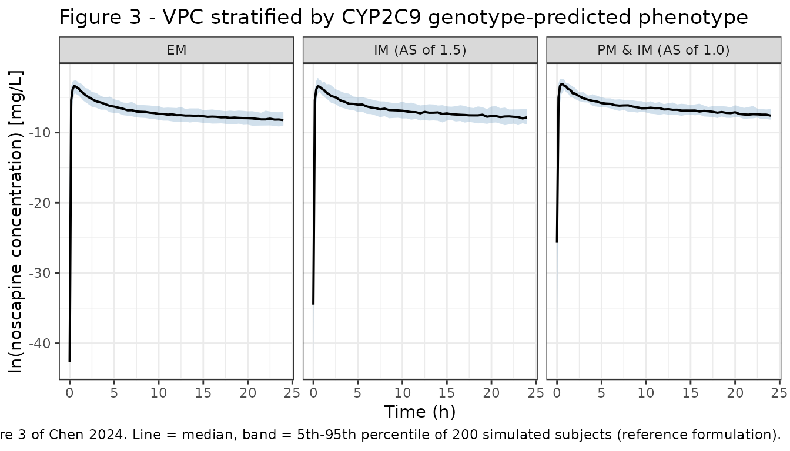
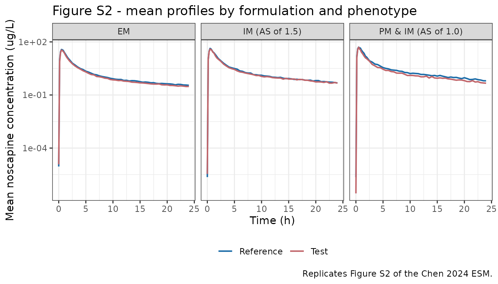

# Noscapine (Chen 2024)

## Model and source

- Citation: Chen Z, Taubert M, Chen C, Boland J, Dong Q, Bilal M, Dokos
  C, Wachall B, Wargenau M, Scheidel B, Wiesen MHJ, Schaeffeler E,
  Tremmel R, Schwab M, Fuhr U (2024). A Semi-Mechanistic Population
  Pharmacokinetic Model of Noscapine in Healthy Subjects Considering
  Hepatic First-Pass Extraction and CYP2C9 Genotypes. Drugs in R&D
  24:187-199. <doi:10.1007/s40268-024-00466-6>.
- Description: Semi-mechanistic population PK model for oral noscapine
  in healthy adults (Chen 2024) with zero-order release into a
  four-compartment transit chain, an explicit liver compartment that
  carries the profound hepatic first-pass extraction (apparent clearance
  CL/F leaves the liver, not the plasma), and three-compartment systemic
  disposition. Liver plasma flow Qh (55 L/h) and liver volume Vh (1.5 L)
  are held fixed at physiologic values. Apparent clearance carries a
  CYP2C9 genotype-predicted-phenotype effect on three levels keyed to
  the CPIC activity score (extensive metabolizer reference 958 L/h;
  intermediate metabolizer with activity score 1.5, 531 L/h; poor and
  intermediate metabolizers with activity score 1.0, 343 L/h) plus a
  total-body-weight power term (exponent 1.34, 77.3 kg reference);
  inter-compartmental clearance to the first peripheral compartment
  carries an age power term (exponent 0.348, 29 year reference).
  Relative bioavailability of the reformulated test suspension is 82.8%
  of the reference suspension. Correlated inter-individual variability
  on absorption duration, CL/F, Vc/F and F1; inter-occasion variability
  on the transit rate and on Qp1/F across the two crossover periods;
  exponential residual error.
- Article: <https://doi.org/10.1007/s40268-024-00466-6> (open access, CC
  BY-NC 4.0)

Noscapine is an opium-poppy alkaloid used as an antitussive, with
ongoing interest in its anti-inflammatory and anti-tumour properties. It
undergoes extensive hepatic first-pass metabolism – oral bioavailability
is around 30% – and CYP2C9 is the dominant metabolising enzyme. Chen
2024 developed a semi-mechanistic population PK model from a two-period
crossover bioequivalence study, using an explicit liver compartment to
carry the first-pass extraction and resolving apparent clearance across
three CYP2C9 genotype-predicted phenotype strata.

## Structure

                                          Qh/Vh
    Oral dose x F1 --Rate--> [t1]->[t2]->[t3]->[t4] --TR--> (Liver) <=======> (Plasma) <=> (Peripheral 1)
                             \___ n = 4 transit ___/            |          Qh/(Vc/F)   <=> (Peripheral 2)
                                                         (CL/F)/Vh

Two features distinguish this from a conventional oral three-compartment
model:

1.  **The absorption chain empties into the liver, not into plasma.**
    Apparent clearance leaves from the liver compartment, so every
    absorbed molecule is subject to hepatic extraction before it can
    reach the sampling compartment. Adding the liver compartment
    improved the fit by `dOFV = -562` (Sect. 3.3.3).
2.  **Absorption is zero-order into a four-compartment transit chain.**
    Zero-order release (duration `D1`) described the input better than
    first-order, and four *manually fixed* transit compartments
    described the delayed gastric emptying better than a lag time or an
    estimated transit number (Sect. 3.3.1).

Liver plasma flow `Qh` (55 L/h) and liver volume `Vh` (1.5 L) are held
fixed at physiologic values. The sensitivity analysis in Table S2 of the
ESM showed that `CL/F`, `F1`, the IIVs and the residual variability were
nearly unchanged across alternative liver settings, which is why the
simpler fixed-constant form was retained.

## Population

The model was fitted to 1920 plasma noscapine concentrations from 48
healthy volunteers (30 men, 18 women; mean age 33 years, range 19–65;
mean total body weight 77.3 kg, range 54.3–107; BMI 18.0–29.5 kg/m^2)
enrolled at the Clinical Pharmacology Unit of the University Hospital of
Cologne (Table 1). Each subject completed both periods of a randomised,
two-period, two-stage crossover bioequivalence study comparing a
reformulated noscapine oral suspension (InfectoPharm, test) against
Nipaxon 5 mg/mL oral suspension (McNeil, reference), 50 mg single oral
dose per period with a 6–14 day washout (DRKS00017760). Samples were
drawn at baseline and 0.17, 0.33, 0.5, 0.67, 0.83, 1, 1.25, 1.5, 1.75,
2, 2.5, 3, 3.5, 4, 6, 9, 12, 16 and 24 h post-dose. Genome-wide
principal-component analysis placed most subjects in European ancestry,
with two clustering to South Asian / American and two to African
populations (Fig. S1 of the ESM).

All 48 subjects were genotyped for CYP2C9, CYP2C19, CYP3A4, CYP3A5 and
CYP2E1 (Table 2). Only CYP2C9 had a significant PK effect. Its three
strata, keyed to the CPIC activity score (AS), are:

| CYP2C9 stratum | Genotypes | n (%) | `CL/F` |
|----|----|----|----|
| Extensive metabolizer (AS 2.0) | `*1/*1` (31), `*1/*9` (1) | 32 (66.7) | 958 L/h |
| Intermediate metabolizer, AS 1.5 | `*1/*2` | 10 (20.8) | 531 L/h |
| Poor & intermediate metabolizer, AS 1.0 | `*1/*3` (3), `*2/*3` (2), `*3/*3` (1) | 6 (12.5) | 343 L/h |

The AS-1.0 stratum deliberately pools poor metabolizers with the
intermediate metabolizers that reach AS 1.0, “because of the limited
sample size of homozygous carriers” (Sect. 3.1).

The same information is available programmatically via
`readModelDb("Chen_2024_noscapine")()$population`.

## Source trace

Every `ini()` entry in
`inst/modeldb/specificDrugs/Chen_2024_noscapine.R` carries an in-file
comment naming its source location. They are collected here for review.

| Equation / parameter | Value | Source location |
|----|----|----|
| `ld1` (absorption duration D1) | 0.0624 h | Table 4 (RSE 28.6%) |
| `lktr` (transit rate TR) | 13.0 1/h | Table 4 (RSE 6.4%) |
| `lcl` (`CL/F`, extensive metabolizer) | 958 L/h | Table 4 `CL/F_EM` (RSE 10.3%) |
| `e_cyp2c9im_as15_lcl` | `log(531/958) = -0.5901` | Table 4 `CL/F_IM_1.5` = 531 L/h (RSE 23.0%) |
| `e_cyp2c9pmim_as10_lcl` | `log(343/958) = -1.0271` | Table 4 `CL/F_PM_IM_1.0` = 343 L/h (RSE 24.8%) |
| `lvc` (`Vc/F`) | 49.7 L | Table 4 (RSE 5.9%) |
| `lq` (`Qp1/F`) | 18.9 L/h | Table 4 (RSE 4.0%) |
| `lvp` (`Vp1/F`) | 243 L | Table 4 (RSE 3.6%) |
| `lq2` (`Qp2/F`) | 25.8 L/h | Table 4 (RSE 4.3%) |
| `lvp2` (`Vp2/F`) | 31.2 L | Table 4 (RSE 4.5%) |
| `lf1` (test-formulation relative F) | 82.8% | Table 4 `F1` (RSE 5.4%) |
| `lqh` (liver plasma flow) | 55 L/h, **fixed** | Fig. 1 caption; Sect. 3.3.3 |
| `lvliver` (liver volume) | 1.5 L, **fixed** | Fig. 1 caption; Sect. 3.3.3 |
| `e_wt_cl` (TBW exponent on `CL/F`) | 1.34 | Table 4 (RSE 35.1%) |
| `e_age_q` (age exponent on `Qp1/F`) | 0.348 | Table 4 (RSE 32.3%) |
| TBW centring value | 77.3 kg (cohort **mean**) | Sect. 3.3.2 equation; Table 1 |
| Age centring value | 29.0 years (cohort **median**) | Sect. 3.3.2 equation; Table 1 |
| IIV `D1` / `CL/F` / `Vc/F` / `F1` | 226 / 57.3 / 28.5 / 34.1 CV% | Table 4, footnote a |
| IIV covariances (`D1`–`CL/F`, `D1`–`V/F`, `D1`–`F1`) | 0.109, -0.175, 0.162 | Table 4, footnote b |
| IOV `TR` / `Qp1/F` | 50.7 / 30.4 CV% | Table 4 |
| `expSd` (residual) | `sqrt(0.0420) = 0.2049` | Table 4, footnote d |
| Transit chain `n = 4`; zero-order input | n/a | Sect. 3.3.1; Fig. 1 |
| Liver / plasma / peripheral ODE topology and rate constants | n/a | Fig. 1 (arrow labels `Qh/Vh`, `Qh/(Vc/F)`, `(CL/F)/Vh`, `(Qp1/F)/(Vc/F)`, …) |
| `Cc ~ lnorm(expSd)` (additive on log scale) | n/a | Sect. 2.4.1; Table 4 footnote d |

## Structural gates

Before comparing against the published NCA, three checks confirm the ODE
system was transcribed correctly. These are exact consequences of the
structure, so they either hold to integrator tolerance or the topology
is wrong.

``` r

mod <- readModelDb("Chen_2024_noscapine")

eta_names <- c("etald1", "etalcl", "etalvc", "etalf1",
               "etaiov_ktr_1", "etaiov_ktr_2", "etaiov_q_1", "etaiov_q_2")

# One typical (all etas zero) subject, dosed into transit1 with rate = -2 so
# rxode2 uses the modelled dur(transit1) = D1.
typical_events <- function(cyp15 = 0, cyp10 = 0, form = 0,
                           wt = 77.3, age = 29, times = seq(0, 480, by = 0.01)) {
  ev <- rxode2::et(amt = 50, cmt = "transit1", rate = -2) |>
    rxode2::et(times)
  d <- as.data.frame(ev)
  d$WT <- wt
  d$AGE <- age
  d$OCC <- 1
  d$CYP2C9_IM_AS15 <- cyp15
  d$CYP2C9_PM_IM_AS10 <- cyp10
  d$FORM_NOSCAPINE_TEST <- form
  for (e in eta_names) d[[e]] <- 0
  d
}

trapz <- function(x, y) sum(diff(x) * (head(y, -1) + tail(y, -1)) / 2)
```

### Gate 1 – the AUC identity `AUC_inf = Dose * F / (CL/F)`

Total exposure is fixed by apparent clearance alone. Over `[0, Inf)` the
entire dose leaves as `(CL/F)/Vh * liver`, and the plasma compartment’s
inflow `Qh/Vh * liver` must exactly balance its outflow
`Qh/(Vc/F) * central`; the two `Qh` terms cancel, leaving
`AUC_central = Dose * F / (CL/F)` independent of `Qh`, `Vh`, the transit
chain and the peripheral compartments. This is the sharpest available
end-to-end test of the liver arm: get the topology or the rate constants
wrong and the ratio departs from 1.

``` r

gate_arms <- tibble::tribble(
  ~arm,                          ~cyp15, ~cyp10, ~form, ~cl_pub,
  "EM, reference",                     0,      0,     0,     958,
  "IM AS 1.5, reference",              1,      0,     0,     531,
  "PM & IM AS 1.0, reference",         0,      1,     0,     343,
  "EM, test",                          0,      0,     1,     958
)

gate1 <- gate_arms |>
  rowwise() |>
  mutate(
    .sol = list(rxode2::rxSolve(
      mod, typical_events(cyp15, cyp10, form),
      omega = NA, returnType = "data.frame", atol = 1e-10, rtol = 1e-10
    )),
    auc_sim = trapz(.sol$time, .sol$Cc),
    auc_exp = 50 * ifelse(form == 1, 0.828, 1) / cl_pub * 1000,
    cmax    = max(.sol$Cc),
    tmax    = .sol$time[which.max(.sol$Cc)]
  ) |>
  ungroup() |>
  mutate(ratio = auc_sim / auc_exp) |>
  select(arm, auc_sim, auc_exp, ratio, cmax, tmax)
#> ℹ parameter labels from comments will be replaced by 'label()'
#> Warning: There was 1 warning in `mutate()`.
#> ℹ In argument: `.sol = list(...)`.
#> ℹ In row 1.
#> Caused by warning:
#> ! some etas defaulted to non-mu referenced, possible parsing error: etaiov_q_2, etaiov_q_1, etaiov_ktr_2, etaiov_ktr_1
#> as a work-around try putting the mu-referenced expression on a simple line

gate1 |>
  rename(
    "Arm"                            = arm,
    "AUCinf simulated (ug*h/L)"      = auc_sim,
    "Dose * F / (CL/F) (ug*h/L)"     = auc_exp,
    "Ratio"                          = ratio,
    "Cmax (ug/L)"                    = cmax,
    "Tmax (h)"                       = tmax
  ) |>
  knitr::kable(digits = c(0, 2, 2, 5, 2, 3),
               caption = "Gate 1: simulated AUCinf against the closed-form identity.")
```

| Arm | AUCinf simulated (ug\*h/L) | Dose \* F / (CL/F) (ug\*h/L) | Ratio | Cmax (ug/L) | Tmax (h) |
|:---|---:|---:|---:|---:|---:|
| EM, reference | 52.19 | 52.19 | 1 | 32.18 | 0.50 |
| IM AS 1.5, reference | 94.16 | 94.16 | 1 | 56.10 | 0.51 |
| PM & IM AS 1.0, reference | 145.77 | 145.77 | 1 | 83.36 | 0.51 |
| EM, test | 43.22 | 43.22 | 1 | 26.65 | 0.50 |

Gate 1: simulated AUCinf against the closed-form identity. {.table
style="width:100%;"}

``` r


stopifnot(all(abs(gate1$ratio - 1) < 1e-3))
```

The identity holds to five decimal places in all four arms. Note also
that the typical-value `Tmax` is 0.5 h, matching the observed median
`tmax` of 0.5 h in both formulations (Table 3).

### Gate 2 – mass balance with clearance zeroed

With `CL/F` driven to zero nothing may leave the system, so the summed
amount across all eight states must stay at the 50 mg dose.

``` r

mb <- rxode2::rxSolve(
  mod, typical_events(times = seq(0, 200, by = 0.05)),
  params = c(lcl = log(1e-8)), omega = NA,
  returnType = "data.frame", atol = 1e-12, rtol = 1e-12
)
total <- with(mb, transit1 + transit2 + transit3 + transit4 +
                liver + central + peripheral1 + peripheral2)
max_dev <- max(abs(total[mb$time > 1] - 50))
cat(sprintf("total amount at 200 h = %.8f mg; max deviation from 50 mg = %.2e mg\n",
            tail(total, 1), max_dev))
#> total amount at 200 h = 49.99999967 mg; max deviation from 50 mg = 3.31e-07 mg
stopifnot(max_dev < 1e-4)
```

### Gate 3 – the IIV CV% scale, resolved against Table 3

Table 4 footnote a says “IIV is reported as CV%”, and Sect. 2.4.1 states
the exponential model `theta_i = theta * exp(eta_i)`. For that model the
reported CV% back-transforms as `omega^2 = log(1 + CV^2)`. A common
alternative reading is that “CV%” is simply `omega * 100`. The two
differ materially for the 226% `D1` term, so the choice is resolved
against a quantity the paper reports independently: the observed
between-subject CV of AUC.

Because `AUC = Dose * F / (CL/F)` exactly (Gate 1), the between-subject
variance of `log(AUC)` is the sum of the genotype-stratum variance, the
weight-effect variance and `omega^2_CL` – computable in closed form,
with no simulation.

``` r

n_geno  <- c(32, 10, 6)
cl_geno <- c(958, 531, 343)
w_geno  <- n_geno / sum(n_geno)
var_pheno <- sum(w_geno * (log(cl_geno) - sum(w_geno * log(cl_geno)))^2)
var_wt    <- 1.34^2 * log(1 + (12.7 / 77.3)^2)   # Table 1 mean 77.3, SD 12.7

tibble::tibble(
  reading = c("omega^2 = log(1 + CV^2)", "omega = CV"),
  omega2_cl = c(log(1 + 0.573^2), 0.573^2)
) |>
  mutate(
    pred_auc_cv = 100 * sqrt(exp(var_pheno + var_wt + omega2_cl) - 1)
  ) |>
  rename("Reading of Table 4 CV%" = reading,
         "omega^2 for CL/F"       = omega2_cl,
         "Predicted AUC CV (%)"   = pred_auc_cv) |>
  knitr::kable(digits = c(0, 5, 1),
               caption = paste("Gate 3: predicted between-subject AUC CV under the two",
                               "readings. Table 3 observed AUC0-t CV = 79.0 / 78.9%",
                               "and AUC0-inf CV = 78.1 / 78.3%."))
```

| Reading of Table 4 CV%  | omega^2 for CL/F | Predicted AUC CV (%) |
|:------------------------|-----------------:|---------------------:|
| omega^2 = log(1 + CV^2) |          0.28392 |                 77.8 |
| omega = CV              |          0.32833 |                 82.3 |

Gate 3: predicted between-subject AUC CV under the two readings. Table 3
observed AUC0-t CV = 79.0 / 78.9% and AUC0-inf CV = 78.1 / 78.3%.
{.table}

The log-normal reading predicts 77.8% against an observed 78.1–79.0%;
the `omega = CV` reading overshoots to 82.3%. The model file uses
`omega^2 = log(1 + CV^2)`, which is also the mathematically correct
conversion for the exponential model the paper specifies.

## Virtual cohort

Original observed data are not publicly available, so the figures below
use a virtual population whose covariate distribution approximates the
published demographics. The crossover is reproduced explicitly: each
subject receives one 50 mg dose in period 1 (`OCC = 1`, `t = 0`) and one
in period 2 (`OCC = 2`, `t = 240 h`), with formulation sequence
randomised as in the trial. Because both periods belong to the same
`id`, the between-subject etas are shared across periods while the
inter-occasion etas are redrawn – which is exactly the variance
structure Table 4 describes.

Covariates are assigned from **deterministic quantiles** of the
published marginal distributions rather than random draws, so the cohort
reproduces the reported mean and range without sampling noise. The etas
remain randomly drawn by `rxSolve`.

``` r

set.seed(20240529)

n_sub    <- 200L
washout  <- 240             # h; the trial used 6-14 days, and ~19 model half-lives
obs_pk   <- c(0, 0.17, 0.33, 0.5, 0.67, 0.83, 1, 1.25, 1.5, 1.75,
              2, 2.5, 3, 3.5, 4, 6, 9, 12, 16, 24)   # Sect. 2.1 schedule
obs_plot <- sort(unique(c(obs_pk, seq(0, 24, by = 0.5))))

# Genotype strata in the Table 2 proportions (32 / 10 / 6 of 48).
geno_n <- round(n_sub * c(32, 10, 6) / 48)
geno_n[1] <- n_sub - sum(geno_n[-1])
stopifnot(sum(geno_n) == n_sub)

# Deterministic quantiles, truncated to the Table 1 ranges. Age is right-skewed
# (mean 33, median 29), so it is drawn on the log scale to match both.
qtrunc <- function(n, lo, hi, q) pmin(pmax(q, lo), hi)
p_grid <- (seq_len(n_sub) - 0.5) / n_sub

subjects <- tibble::tibble(
  id = seq_len(n_sub),
  CYP2C9_IM_AS15    = rep(c(0, 1, 0), times = geno_n),
  CYP2C9_PM_IM_AS10 = rep(c(0, 0, 1), times = geno_n),
  WT  = qtrunc(n_sub, 54.3, 107,
               stats::qnorm(p_grid, mean = 77.3, sd = 12.7)),
  AGE = qtrunc(n_sub, 19, 65,
               stats::qlnorm(p_grid, meanlog = log(29),
                             sdlog = sqrt(2 * log(33 / 29)))),
  # Randomised sequence: half reference-then-test, half test-then-reference.
  seq_test_first = rep(c(FALSE, TRUE), length.out = n_sub)
) |>
  mutate(
    phenotype = factor(
      case_when(
        CYP2C9_PM_IM_AS10 == 1 ~ "PM & IM (AS of 1.0)",
        CYP2C9_IM_AS15    == 1 ~ "IM (AS of 1.5)",
        TRUE                   ~ "EM"
      ),
      levels = c("EM", "IM (AS of 1.5)", "PM & IM (AS of 1.0)")
    )
  )

# Two periods per subject; the formulation flips between them.
periods <- subjects |>
  tidyr::crossing(period = 1:2) |>
  mutate(
    OCC = period,
    t0  = ifelse(period == 1, 0, washout),
    FORM_NOSCAPINE_TEST = as.integer(xor(period == 2, seq_test_first)),
    formulation = ifelse(FORM_NOSCAPINE_TEST == 1, "Test", "Reference")
  )

cov_cols <- c("WT", "AGE", "OCC", "CYP2C9_IM_AS15", "CYP2C9_PM_IM_AS10",
              "FORM_NOSCAPINE_TEST")

doses <- periods |>
  transmute(id, period, formulation, phenotype, across(all_of(cov_cols)),
            time = t0, amt = 50, evid = 1L, rate = -2, cmt = "transit1")

# Observations go on the `central` ODE state -- never on the observable `Cc`.
obs <- periods |>
  tidyr::crossing(tad = obs_plot) |>
  transmute(id, period, formulation, phenotype, across(all_of(cov_cols)),
            time = t0 + tad, amt = NA_real_, evid = 0L, rate = 0,
            cmt = "central", tad = tad)

events <- bind_rows(doses, obs) |>
  arrange(id, time, desc(evid)) |>
  as.data.frame()

stopifnot(!anyDuplicated(unique(events[, c("id", "time", "evid")])))
cat(sprintf("%d subjects, %d rows, %d dose records\n",
            n_sub, nrow(events), sum(events$evid == 1)))
#> 200 subjects, 22400 rows, 400 dose records
```

## Simulation

``` r

solved <- rxode2::rxSolve(
  mod, events = events,
  keep = c("period", "formulation", "phenotype", "tad", "WT", "AGE")
) |>
  as.data.frame()

# rxSolve returns observation records only (there is no `evid` column in the
# output). Column `Cc` is the individual prediction; column `sim` additionally
# carries the residual error and is the quantity comparable to an observed
# concentration, so it is what the VPC and the NCA use.
sim <- solved |> mutate(dv = sim)

cat(sprintf("simulated %d observation rows; %.1f%% of dv at or above the 0.100 ug/L LLOQ\n",
            nrow(sim), 100 * mean(sim$dv >= 0.100, na.rm = TRUE)))
#> simulated 22000 observation rows; 96.8% of dv at or above the 0.100 ug/L LLOQ

# Confirm the washout is long enough that period 2 starts from a clean baseline.
carryover <- sim |> filter(period == 2, tad == 0) |> pull(dv)
cat(sprintf("max period-2 pre-dose carryover = %.3g ug/L (%.4f%% of the LLOQ)\n",
            max(carryover), 100 * max(carryover) / 0.100))
#> max period-2 pre-dose carryover = 0.000388 ug/L (0.3879% of the LLOQ)
```

## Replicate published figures

### Figure 3 – visual predictive check by CYP2C9 phenotype

Figure 3 of Chen 2024 plots `ln(concentration)` in mg/L against time, in
three panels stratified by CYP2C9 genotype-predicted phenotype, with the
median and the 5th / 95th percentiles. The model reproduces the ordered
separation between strata – clearance falls from 958 to 531 to 343 L/h,
so exposure rises across the panels – along with the sharp early peak
produced by the short zero-order input plus the four-compartment transit
chain.

``` r

# Replicates Figure 3 of Chen 2024. The paper's y-axis is ln(mg/L); the model
# returns ug/L, so ln(Cc[ug/L]) - ln(1000) puts the two on the same scale.
sim |>
  filter(formulation == "Reference", dv > 0) |>
  group_by(phenotype, tad) |>
  summarise(
    Q05 = quantile(log(dv / 1000), 0.05),
    Q50 = quantile(log(dv / 1000), 0.50),
    Q95 = quantile(log(dv / 1000), 0.95),
    .groups = "drop"
  ) |>
  ggplot(aes(tad, Q50)) +
  geom_ribbon(aes(ymin = Q05, ymax = Q95), alpha = 0.25, fill = "steelblue") +
  geom_line(linewidth = 0.7) +
  facet_wrap(~phenotype) +
  labs(
    x = "Time (h)", y = "ln(noscapine concentration) [mg/L]",
    title = "Figure 3 - VPC stratified by CYP2C9 genotype-predicted phenotype",
    caption = paste("Replicates Figure 3 of Chen 2024. Line = median,",
                    "band = 5th-95th percentile of 200 simulated subjects",
                    "(reference formulation).")
  ) +
  theme_bw()
```



### Figure S2 – mean profiles by formulation and phenotype

Figure S2 of the ESM shows the mean concentration-time profiles
stratified by formulation and CYP2C9 phenotype. The paper’s summary of
it (Sect. 3.2) is that there are “minor differences in Cmax and AUC0-t
between the two formulations”, while “subjects with a dysfunctional
CYP2C9 allele had a noticeable higher level in both Cmax and AUC0-t” –
the formulation effect is small relative to the genotype effect.

``` r

sim |>
  group_by(phenotype, formulation, tad) |>
  summarise(mean_dv = mean(dv), .groups = "drop") |>
  ggplot(aes(tad, mean_dv, colour = formulation)) +
  geom_line(linewidth = 0.7) +
  facet_wrap(~phenotype) +
  scale_y_log10() +
  scale_colour_manual(values = c(Reference = "#1b6ca8", Test = "#c1666b")) +
  labs(
    x = "Time (h)", y = "Mean noscapine concentration (ug/L)",
    colour = NULL,
    title = "Figure S2 - mean profiles by formulation and phenotype",
    caption = "Replicates Figure S2 of the Chen 2024 ESM."
  ) +
  theme_bw() +
  theme(legend.position = "bottom")
```



## PKNCA validation

The NCA is run on the paper’s own 20-timepoint sampling schedule, per
period, with each period’s time re-based to its own dose so the two
crossover periods present as two profiles per subject. Restricting to
the published schedule matters: `lambda_z` is estimated from a window
that ends at 24 h, which truncates the model’s true terminal phase (see
the half-life note below).

``` r

# Per-period profiles on the paper's schedule, time re-based within period.
nca_conc <- sim |>
  filter(tad %in% obs_pk, !is.na(dv)) |>
  transmute(id, formulation, period, time = tad, Cc = dv)

# Guarantee a time = 0 row per (id, formulation); pre-dose Cc = 0 for an
# extravascular dose. Filtering on `time > 0` or `Cc > 0` here would drop it and
# trigger PKNCA's "AUC range starting before the first measurement" warning.
nca_conc <- bind_rows(
  nca_conc,
  nca_conc |> distinct(id, formulation, period) |> mutate(time = 0, Cc = 0)
) |>
  distinct(id, formulation, time, .keep_all = TRUE) |>
  arrange(id, formulation, time)

nca_dose <- periods |>
  transmute(id, formulation, time = 0, amt = 50)

conc_obj <- PKNCA::PKNCAconc(nca_conc, Cc ~ time | formulation + id)
dose_obj <- PKNCA::PKNCAdose(nca_dose, amt ~ time | formulation + id)

intervals <- data.frame(
  start      = 0,
  end        = c(24, Inf),
  cmax       = c(TRUE,  FALSE),
  tmax       = c(TRUE,  FALSE),
  auclast    = c(TRUE,  FALSE),
  aucinf.obs = c(FALSE, TRUE),
  half.life  = c(FALSE, TRUE)
)

nca_res <- PKNCA::pk.nca(PKNCA::PKNCAdata(conc_obj, dose_obj, intervals = intervals))
```

### Comparison against published NCA

Table 3 of Chen 2024 reports geometric means. For a log-normal
distribution the geometric mean equals the median, which is the
statistic
[`ncaComparisonTable()`](https://nlmixr2.github.io/nlmixr2lib/reference/ncaComparisonTable.md)
pools on, so the two are directly comparable.

``` r

published <- tibble::tribble(
  ~formulation, ~cmax, ~tmax, ~auclast, ~aucinf.obs, ~half.life,
  "Test",        36.8,   0.5,     53.1,        57.0,       8.42,
  "Reference",   46.9,   0.5,     64.1,        67.8,       8.29
)

cmp <- nlmixr2lib::ncaComparisonTable(
  simulated = nca_res,
  reference = published,
  by        = "formulation",
  units     = c(cmax = "ug/L", tmax = "h", auclast = "ug*h/L",
                aucinf.obs = "ug*h/L", half.life = "h"),
  tolerance_pct = 20
)

knitr::kable(
  cmp,
  caption = paste("Simulated vs. published NCA (Chen 2024 Table 3).",
                  "* differs from the reference value by more than 20%."),
  digits = 2
)
```

| NCA parameter          | formulation | Reference | Simulated | % diff   |
|:-----------------------|:------------|:----------|:----------|:---------|
| Cmax (ug/L)            | Test        | 36.8      | 35.4      | -3.7%    |
| Cmax (ug/L)            | Reference   | 46.9      | 44.1      | -6.0%    |
| Tmax (h)               | Test        | 0.5       | 0.67      | +34.0%\* |
| Tmax (h)               | Reference   | 0.5       | 0.67      | +34.0%\* |
| AUC0-∞ (obs) (ug\*h/L) | Test        | 57        | 58.3      | +2.3%    |
| AUC0-∞ (obs) (ug\*h/L) | Reference   | 67.8      | 70.4      | +3.8%    |
| AUClast (ug\*h/L)      | Test        | 53.1      | 54.8      | +3.1%    |
| AUClast (ug\*h/L)      | Reference   | 64.1      | 64.5      | +0.6%    |
| t½ (h)                 | Test        | 8.42      | 8.3       | -1.4%    |
| t½ (h)                 | Reference   | 8.29      | 8.18      | -1.3%    |

Simulated vs. published NCA (Chen 2024 Table 3). \* differs from the
reference value by more than 20%. {.table}

`Cmax` agrees to within 6%, `AUClast` and `AUC0-inf` to within 4%, and
`t1/2` to within 1.5% in both formulations. Note that PKNCA selects each
subject’s `lambda_z` window automatically and lands on the published
8.3–8.4 h, which independently corroborates the half-life discussion
below.

**The starred `Tmax` row is a sampling-grid artefact, not a model
discrepancy.** `Tmax` is not interpolated – it can only take a value
present in the sampling schedule, and near the peak that schedule steps
in 0.17 h (10 min) increments: 0.33, 0.5, 0.67, 0.83. The typical-value
profile peaks at 0.505 h (Gate 1 above, on a 0.01 h grid), squarely
between two adjacent sampling times, so per-subject `Tmax` splits
between 0.5 and 0.67 h and the median lands on the upper of the two. The
absolute discrepancy is one grid step – 0.17 h – which
[`ncaComparisonTable()`](https://nlmixr2.github.io/nlmixr2lib/reference/ncaComparisonTable.md)’s
percentage measure inflates to 34% only because the denominator is
itself small. The published `Tmax` range (0.17–2.0 h, Table 3) brackets
the simulated values throughout. No parameter was adjusted.

### Test / reference ratio

The bioequivalence conclusion rests on the T/R ratio, which the model
carries entirely in `F1`. Because the crossover is simulated with shared
between-subject etas, the ratio can be formed within subject exactly as
the trial analysed it.

``` r

tr <- nca_conc |>
  group_by(id, formulation) |>
  summarise(cmax = max(Cc),
            auclast = trapz(time, Cc),
            .groups = "drop") |>
  tidyr::pivot_longer(c(cmax, auclast), names_to = "parameter") |>
  tidyr::pivot_wider(names_from = formulation, values_from = value) |>
  group_by(parameter) |>
  summarise(tr_ratio = exp(mean(log(Test / Reference))), .groups = "drop") |>
  mutate(
    published = c(auclast = 0.827, cmax = 0.784)[parameter],
    published_ci = c(auclast = "0.748-0.915", cmax = "0.662-0.929")[parameter]
  )

tr |>
  rename("Parameter"            = parameter,
         "Simulated T/R"        = tr_ratio,
         "Published T/R"        = published,
         "Published 94.12% CI"  = published_ci) |>
  knitr::kable(digits = 3,
               caption = "Within-subject test/reference ratio against Table 3.")
```

| Parameter | Simulated T/R | Published T/R | Published 94.12% CI |
|:----------|--------------:|--------------:|:--------------------|
| auclast   |         0.830 |         0.827 | 0.748-0.915         |
| cmax      |         0.831 |         0.784 | 0.662-0.929         |

Within-subject test/reference ratio against Table 3. {.table}

The simulated `AUC` ratio reproduces `F1 = 0.828` and sits inside the
published 94.12% CI for both parameters. The `Cmax` ratio is also close
to `F1`: because the zero-order input duration `D1` does not differ by
formulation (Sect. 3.3.2 – “only apparent bioavailability differed
between test and reference preparations”), the model scales the whole
profile, so its `Cmax` ratio is nearer to `F1` than the observed 0.784.

### Half-life and the 24-hour sampling window

The model’s true terminal half-life is longer than the published value,
and the difference is an estimator artefact rather than a transcription
error. Sampling stops at 24 h, so a log-linear regression over the
observable window cannot reach the model’s slowest eigenvalue.

``` r

typ <- rxode2::rxSolve(mod, typical_events(times = obs_pk),
                       omega = NA, returnType = "data.frame",
                       atol = 1e-10, rtol = 1e-10) |>
  filter(Cc > 0)
long <- rxode2::rxSolve(mod, typical_events(times = seq(24, 400, by = 0.5)),
                        omega = NA, returnType = "data.frame",
                        atol = 1e-10, rtol = 1e-10)

fit_thalf <- function(d) {
  log(2) / -stats::coef(stats::lm(log(Cc) ~ time, data = d))[[2]]
}

tibble::tibble(
  window = c("4-24 h", "6-24 h", "9-24 h", "12-24 h", "24-400 h (true terminal)"),
  t_half = c(fit_thalf(filter(typ, time >= 4, time <= 24)),
             fit_thalf(filter(typ, time >= 6, time <= 24)),
             fit_thalf(filter(typ, time >= 9, time <= 24)),
             fit_thalf(filter(typ, time >= 12, time <= 24)),
             fit_thalf(long))
) |>
  rename("Regression window" = window, "t1/2 (h)" = t_half) |>
  knitr::kable(digits = 2,
               caption = paste("Typical-value terminal half-life by regression window.",
                               "Table 3 reports 8.42 h (test) and 8.29 h (reference)."))
```

| Regression window        | t1/2 (h) |
|:-------------------------|---------:|
| 4-24 h                   |     7.11 |
| 6-24 h                   |     8.85 |
| 9-24 h                   |    10.89 |
| 12-24 h                  |    11.89 |
| 24-400 h (true terminal) |    12.47 |

Typical-value terminal half-life by regression window. Table 3 reports
8.42 h (test) and 8.29 h (reference). {.table}

A 6–24 h window gives 8.9 h against the published 8.3–8.4 h, while the
model’s true terminal half-life is about 12.5 h. The paper itself notes
that its half-life is “approximately twice the previously reported value
of 4.5 h” and attributes the difference to a more sensitive assay – the
same truncation mechanism, one generation earlier.

## Assumptions and deviations

- **Residual-error scale.** Table 4 reports “Additive error 0.0420” in
  the logarithmic domain without stating whether the figure is the
  NONMEM `$SIGMA` variance or a standard deviation. It is read here as a
  **variance**, so `expSd = sqrt(0.0420) = 0.2049` (a 20.7% residual
  CV). Operator-ratified reading. Supporting evidence: the NONMEM
  `$SIGMA` convention; this being the only variability row left in raw
  NONMEM units while every other was converted to CV%; the reported 2.4%
  RSE matching the `sqrt(2/1920) = 3.2%` expected of a variance
  estimated from 1920 observations rather than the ~1.6% an SD would
  give; and a 4.2% residual CV being implausibly tight for LC-MS/MS
  plasma data.
- **IIV CV% convention.** Table 4’s CV% values are back-transformed as
  `omega^2 = log(1 + CV^2)`, the correct conversion for the exponential
  IIV model of Sect. 2.4.1. Gate 3 above confirms this against the
  paper’s own observed AUC CV; the alternative `omega = CV` reading
  overshoots it. The IOV values, reported under a header that gives only
  “(%)”, are converted the same way for consistency with the IIV rows.
- **Unreported IIV covariances are zero.** Table 4 reports three
  covariances (`D1`–`CL/F`, `D1`–`V/F`, `D1`–`F1`). The remaining three
  off-diagonals of the four-eta block were not in the NONMEM
  `$OMEGA BLOCK` and are encoded `fixed(0)`. The resulting matrix is
  positive definite (implied correlations 0.15, -0.47, 0.36).
- **Inter-occasion variability across two occasions.** nlmixr2 has no
  equivalent of NONMEM’s `$OMEGA BLOCK(1) SAME`, so occasion 2 receives
  its own eta with the variance fixed equal to the occasion-1 estimate,
  following the `Chen_2023_nemonoxacin.R` and
  `Jonsson_2011_ethambutol.R` precedent. Passing `OCC = 1` gives a
  single-occasion simulation.
- **Mixed apparent and physiologic scales in the liver arm.** `Qh` (55
  L/h) and `Vh` (1.5 L) are true physiologic constants while every
  plasma-side volume and clearance is apparent (`/F`). The liver state
  therefore holds an apparent amount. This is the paper’s own
  construction, not a transcription choice, and it is benign for
  prediction: Gate 1 shows total exposure is `Dose * F / (CL/F)`
  regardless, so the liver arm sets only the *shape* of the absorption
  phase. The paper’s Table S2 sensitivity analysis reached the same
  conclusion empirically.
- **Covariate centring values.** `CL/F` is normalised to 77.3 kg, the
  cohort **mean** weight, and `Qp1/F` to 29.0 years, the cohort
  **median** age – both taken verbatim from the Sect. 3.3.2 equations
  rather than assumed. Note the paper mixes a mean and a median across
  the two equations, and that the weight exponent 1.34 was estimated,
  not fixed at an allometric 0.75.
- **`CL/F` strata are discrete, not activity-score-proportional.** The
  three published `CL/F` values are not proportional to the CPIC
  activity score (531/958 = 0.554 and 343/958 = 0.358 against
  activity-score ratios of 0.75 and 0.50), so the phenotype is encoded
  as two mutually exclusive binary indicators. A continuous
  activity-score covariate cannot reproduce the published typical
  values.
- **Virtual-cohort covariate distributions.** Weight is assigned from
  deterministic normal quantiles (mean 77.3 kg, SD 12.7, truncated to
  54.3–107 kg per Table 1). Age is right-skewed in the source (mean 33,
  median 29, range 19–65), which Table 1 gives only as summary
  statistics; a log-normal matching both the reported median and mean is
  used, truncated to the reported range. Genotype strata follow the
  Table 2 proportions exactly. Sex, height, BMI, liver-function and
  renal-function markers are not model covariates (they were screened
  and not retained) and are omitted from the cohort; they are documented
  in the model file’s `covariatesDataExcluded`.
- **Washout length.** The trial used 6–14 days; 240 h (10 days, about 19
  model half-lives) is used so period-2 profiles start from negligible
  carryover.
- **`Tmax` comparison is grid-limited.** The published and simulated
  `Tmax` differ by exactly one sampling interval (0.17 h), which
  registers as a \>20% flag in the NCA comparison table purely because
  `Tmax` is small. The typical-value peak is at 0.505 h against a
  published median of 0.5 h. See the note under the comparison table.
- **`Cmax` T/R ratio.** The model predicts a `Cmax` T/R ratio near
  `F1 = 0.828` whereas the observed ratio was 0.784, because no
  absorption-rate parameter differs by formulation in the published
  model. This is a property of the published structure, not a deviation
  introduced here; no parameter was tuned.
- **Half-life comparison window.** The published 8.3–8.4 h half-life is
  reproduced only when `lambda_z` is regressed over the paper’s own
  truncated sampling window; the model’s true terminal half-life is
  about 12.5 h. See the half-life section above.
- **No erratum.** A search of the journal landing page and PubMed found
  no erratum, corrigendum or author correction for this article.
- **Supplement.** The ESM was not required for extraction: every final
  parameter value is in main-text Table 4, and both covariate equations
  are in Sect. 3.3.2. The ESM holds model-development attempts (Table
  S1), the liver-compartment sensitivity analysis (Table S2) and
  diagnostic plots (Figs. S1–S7), which are referenced above but supply
  no extracted value.
