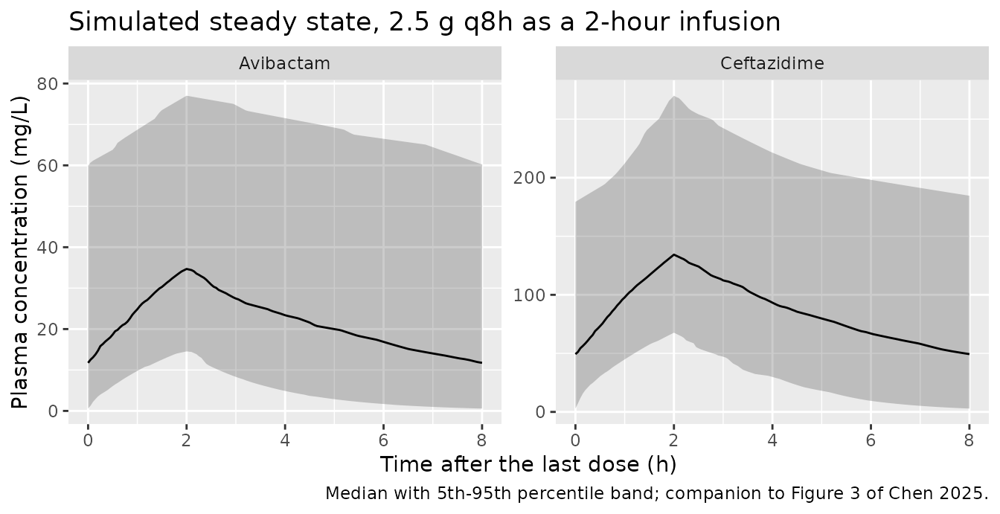

# Ceftazidime-avibactam (Chen 2025)

## Model and source

Chen 2025 fitted the two analytes of the fixed-ratio combination product
ceftazidime-avibactam **separately** – two one-compartment models with
their own objective function values, their own parameter tables (Tables
2 and 3) and their own equation pairs (Eq. 1-2 and Eq. 3-4). Following
the `replicate-author-structure` policy the extraction is therefore two
model files sharing this one vignette.

``` r

uiCaz <- rxode2::rxode(readModelDb("Chen_2025_ceftazidime"))
#> ℹ parameter labels from comments will be replaced by 'label()'
uiAvi <- rxode2::rxode(readModelDb("Chen_2025_avibactam"))
#> ℹ parameter labels from comments will be replaced by 'label()'
```

- Citation: Chen Y, Chen B, Huang Y, Li X, Wu J, Lin R, Chen M, Liu M,
  Qiu H, Cheng Y. Population Pharmacokinetics-Based Evaluation of
  Ceftazidime-Avibactam Dosing Regimens in Critically and Non-Critically
  Ill Patients With Carbapenem-Resistant Klebsiella pneumoniae. Infect
  Drug Resist. 2025;18:941-953. <doi:10.2147/IDR.S495279>.
- Ceftazidime: One-compartment IV population PK model for the
  ceftazidime component of ceftazidime-avibactam in critically and
  non-critically ill Chinese adults with carbapenem-resistant Klebsiella
  pneumoniae infection (Chen 2025), with a median-normalized power-form
  creatinine-clearance effect on clearance.
- Avibactam: One-compartment IV population PK model for the avibactam
  component of ceftazidime-avibactam in critically and non-critically
  ill Chinese adults with carbapenem-resistant Klebsiella pneumoniae
  infection (Chen 2025), with a median-normalized power-form
  creatinine-clearance effect on clearance.
- Article: <https://doi.org/10.2147/IDR.S495279>

The product is a 4:1 fixed-ratio combination, so a nominal “2.5 g” dose
of ceftazidime-avibactam delivers 2000 mg of ceftazidime and 500 mg of
avibactam. Every simulation below splits the nominal dose accordingly.

``` r

mgCaz <- function(g) g * 1000 * 0.8
mgAvi <- function(g) g * 1000 * 0.2
stopifnot(mgCaz(2.5) == 2000, mgAvi(2.5) == 500,
          mgCaz(1.25) == 1000, mgAvi(0.94) == 188)
```

## Population

Forty-five adults with verified carbapenem-resistant *Klebsiella
pneumoniae* infection contributed 91 steady-state plasma concentrations
(33 trough and 31 peak samples) in a prospective single-centre study at
Fujian Medical University Union Hospital between July 2021 and September
2023 (Chen 2025 Table 1). The median age was 59 years (range 18-94),
median weight 62.0 kg (35.0-80.0), and 36 of 45 subjects (80%) were
male. Hospital-acquired pneumonia including ventilator-associated
pneumonia accounted for 31 (68.9%) of the infections.

Renal function spanned the full clinical range: median Cockcroft-Gault
creatinine clearance 71.3 mL/min with a range of 13.9-337.1, comprising
29 subjects (64.4%) with renal insufficiency (CrCL \< 90 mL/min), 9
(20.0%) between 90 and 130, and 7 (15.6%) with augmented renal clearance
(CrCL \>= 130). Fifteen subjects (33.3%) received continuous renal
replacement therapy. Disease severity was scored by APACHE II, with 25
subjects (55.6%) classified critically ill (\> 15) and 20 (44.4%)
non-critically ill.

Sampling was sparse (1-3 samples per subject) and collected at or after
the sixth dose, so all data are steady-state. Doses were 1.25 g or 2.5 g
every 8, 12 or 24 h, each as a 2-hour infusion; 29 of 45 subjects
received 2.5 g q8h.

The same information is available programmatically via
`readModelDb("Chen_2025_ceftazidime")()$population`.

``` r

uiCaz$population[c("n_subjects", "age_median", "weight_median", "renal_function")] |>
  unlist() |>
  tibble::enframe(name = "Field", value = "Value") |>
  knitr::kable()
```

| Field | Value |
|:---|:---|
| n_subjects | 45 |
| age_median | 59 years |
| weight_median | 62.0 kg |
| renal_function | Creatinine clearance (Cockcroft-Gault) median 71.3 mL/min, range 13.9-337.1; 29 subjects (64.4%) with renal insufficiency (CrCL \< 90 mL/min), 9 (20.0%) with CrCL 90-130, and 7 (15.6%) with augmented renal clearance (CrCL \>= 130 mL/min). 15 subjects (33.3%) received continuous renal replacement therapy (median CrCL in that subgroup 69.3 mL/min). |

## Source trace

Per-parameter provenance is recorded as an in-file comment beside each
`ini()` entry in `inst/modeldb/specificDrugs/Chen_2025_ceftazidime.R`
and `inst/modeldb/specificDrugs/Chen_2025_avibactam.R`. The table
collects them.

| Model | Equation / parameter | Value | Source location |
|----|----|----|----|
| Ceftazidime | `lcl` (tvCL) | 2.96 L/h | Table 2, row `tvCL`; also Eq. 1 |
| Ceftazidime | `lvc` (tvV) | 17.76 L | Table 2, row `tvV`; also Eq. 2 |
| Ceftazidime | `e_crcl_cl` | 0.44 | Table 2, row `dCLdCrCL`; also Eq. 1 |
| Ceftazidime | `etalcl` | 0.56 (SD) | Table 2, row `omega^2 CL`; Results text “55.71%” |
| Ceftazidime | `etalvc` | 0.41 (SD) | Table 2, row `omega^2 V` |
| Ceftazidime | `propSd` | 0.30 | Table 2, row `Proportional error` |
| Avibactam | `lcl` (tvCL) | 3.09 L/h | Table 3, row `tvCL`; also Eq. 3 |
| Avibactam | `lvc` (tvV) | 18.25 L | Table 3, row `tvV`; also Eq. 4 |
| Avibactam | `e_crcl_cl` | 0.41 | Table 3, row `dCLdCrCL`; also Eq. 3 |
| Avibactam | `etalcl` | 0.67 (SD) | Table 3, row `omega^2 CL`; Results text “66.69%” |
| Avibactam | `etalvc` | 0.51 (SD) | Table 3, row `omega^2 V` |
| Avibactam | `propSd` | 0.32 | Table 3, row `Proportional error` |
| Both | CrCL reference 71.3 mL/min | n/a | Table 1 median; stated below Eq. 2 and Eq. 4 |
| Both | Structure: 1-compartment IV | n/a | Results, PopPK Modeling (OFV 963.6 vs 984.8 for CAZ; 688.7 vs 735.2 for AVI) |
| Both | `d/dt(central) <- -kel * central` | n/a | Implied by the one-compartment structure and Eq. 1-4 |
| Both | `Cc ~ prop(propSd)` | n/a | Methods, PopPK Modeling: “A proportional residual model was applied to both models” |
| Simulation | Free fractions 0.90 (CAZ), 0.92 (AVI) | n/a | Methods, Monte Carlo Simulation |
| Simulation | PK/PD targets | n/a | Methods, Monte Carlo Simulation |
| Simulation | Susceptibility breakpoint MIC 8 mg/L | n/a | Methods, Monte Carlo Simulation |

Two transcription decisions in that table are not literal readings of
the printed page. Both are argued in full under [Assumptions and
deviations](#assumptions-and-deviations); in brief, the typeset
covariate equations place a fraction bar that cannot be the fitted form,
and the tables’ `omega^2` row labels disagree with the paper’s own
percent-CV sentence. Each is settled by arithmetic against a second
number the paper prints, and the checks below are the audit.

## Structural verification

Before any cohort simulation, confirm the packaged models reproduce the
one-compartment intravenous-infusion steady state in closed form. Both
sides use the same parameters, so this is pure solver error and the
tolerance is correspondingly tight.

``` r

# Steady-state closed form for a 1-compartment model given a constant-rate
# infusion of duration tinf repeated every tau.
ssClosedForm <- function(dose, tau, tinf, cl, vc) {
  kel <- cl / vc
  rate <- dose / tinf
  cmax <- (rate / cl) * (1 - exp(-kel * tinf)) / (1 - exp(-kel * tau))
  list(cmax = cmax,
       ctrough = cmax * exp(-kel * (tau - tinf)),
       auctau = dose / cl,
       halflife = log(2) / kel)
}

# One typical subject (no IIV), several regimens and renal-function values.
typicalEvents <- function(dose, tau, tinf, crcl, nDose = 30L, step = 0.05) {
  tLast <- tau * (nDose - 1L)
  dosing <- data.frame(
    time = seq(0, tLast, by = tau), amt = dose, evid = 1L,
    dur = tinf, cmt = "central", CRCL = crcl
  )
  obs <- data.frame(
    time = seq(tLast, tLast + tau, by = step), amt = NA_real_, evid = 0L,
    dur = NA_real_, cmt = "central", CRCL = crcl
  )
  out <- rbind(dosing, obs)
  out[order(out$time, -out$evid), ]
}

scenarios <- tidyr::expand_grid(
  drug = c("ceftazidime", "avibactam"),
  g    = c(0.94, 1.25, 2.5),
  tau  = c(8, 12),
  CRCL = c(20, 71.3, 150)
) |>
  mutate(tinf = 2)

checkOne <- function(drug, g, tau, tinf, CRCL) {
  ui   <- if (drug == "ceftazidime") uiCaz else uiAvi
  dose <- if (drug == "ceftazidime") mgCaz(g) else mgAvi(g)
  s <- as.data.frame(rxode2::rxSolve(rxode2::zeroRe(ui),
                                     typicalEvents(dose, tau, tinf, CRCL)))
  s <- s[!is.na(s$Cc), ]
  cf <- ssClosedForm(dose, tau, tinf, cl = s$cl[1], vc = s$vc[1])
  tibble::tibble(
    cmaxPct    = 100 * (max(s$Cc) - cf$cmax) / cf$cmax,
    ctroughPct = 100 * (s$Cc[which.max(s$time)] - cf$ctrough) / cf$ctrough
  )
}

cf <- scenarios |>
  rowwise() |>
  mutate(checkOne(drug, g, tau, tinf, CRCL)) |>
  ungroup()
#> ℹ omega/sigma items treated as zero: 'etalcl', 'etalvc'
#> ℹ omega/sigma items treated as zero: 'etalcl', 'etalvc'
#> ℹ omega/sigma items treated as zero: 'etalcl', 'etalvc'
#> ℹ omega/sigma items treated as zero: 'etalcl', 'etalvc'
#> ℹ omega/sigma items treated as zero: 'etalcl', 'etalvc'
#> ℹ omega/sigma items treated as zero: 'etalcl', 'etalvc'
#> ℹ omega/sigma items treated as zero: 'etalcl', 'etalvc'
#> ℹ omega/sigma items treated as zero: 'etalcl', 'etalvc'
#> ℹ omega/sigma items treated as zero: 'etalcl', 'etalvc'
#> ℹ omega/sigma items treated as zero: 'etalcl', 'etalvc'
#> ℹ omega/sigma items treated as zero: 'etalcl', 'etalvc'
#> ℹ omega/sigma items treated as zero: 'etalcl', 'etalvc'
#> ℹ omega/sigma items treated as zero: 'etalcl', 'etalvc'
#> ℹ omega/sigma items treated as zero: 'etalcl', 'etalvc'
#> ℹ omega/sigma items treated as zero: 'etalcl', 'etalvc'
#> ℹ omega/sigma items treated as zero: 'etalcl', 'etalvc'
#> ℹ omega/sigma items treated as zero: 'etalcl', 'etalvc'
#> ℹ omega/sigma items treated as zero: 'etalcl', 'etalvc'
#> ℹ omega/sigma items treated as zero: 'etalcl', 'etalvc'
#> ℹ omega/sigma items treated as zero: 'etalcl', 'etalvc'
#> ℹ omega/sigma items treated as zero: 'etalcl', 'etalvc'
#> ℹ omega/sigma items treated as zero: 'etalcl', 'etalvc'
#> ℹ omega/sigma items treated as zero: 'etalcl', 'etalvc'
#> ℹ omega/sigma items treated as zero: 'etalcl', 'etalvc'
#> ℹ omega/sigma items treated as zero: 'etalcl', 'etalvc'
#> ℹ omega/sigma items treated as zero: 'etalcl', 'etalvc'
#> ℹ omega/sigma items treated as zero: 'etalcl', 'etalvc'
#> ℹ omega/sigma items treated as zero: 'etalcl', 'etalvc'
#> ℹ omega/sigma items treated as zero: 'etalcl', 'etalvc'
#> ℹ omega/sigma items treated as zero: 'etalcl', 'etalvc'
#> ℹ omega/sigma items treated as zero: 'etalcl', 'etalvc'
#> ℹ omega/sigma items treated as zero: 'etalcl', 'etalvc'
#> ℹ omega/sigma items treated as zero: 'etalcl', 'etalvc'
#> ℹ omega/sigma items treated as zero: 'etalcl', 'etalvc'
#> ℹ omega/sigma items treated as zero: 'etalcl', 'etalvc'
#> ℹ omega/sigma items treated as zero: 'etalcl', 'etalvc'

# Deterministic: solver-vs-analytic only. A structural, unit or dose-split
# error moves these by whole percent, not by 1e-4.
stopifnot(max(abs(cf$cmaxPct)) < 0.01, max(abs(cf$ctroughPct)) < 0.01)

cf |>
  summarise(
    "Scenarios"                 = n(),
    "Max |Cmax,ss error| (%)"    = max(abs(cmaxPct)),
    "Max |Ctrough,ss error| (%)" = max(abs(ctroughPct))
  ) |>
  knitr::kable(digits = 6,
               caption = "Packaged model vs. one-compartment infusion steady-state closed form.")
```

| Scenarios | Max \|Cmax,ss error\| (%) | Max \|Ctrough,ss error\| (%) |
|----------:|--------------------------:|-----------------------------:|
|        36 |                         0 |                            0 |

Packaged model vs. one-compartment infusion steady-state closed form.
{.table}

The covariate model is checked separately against the arithmetic form
argued in Assumptions and deviations:
`CL = tvCL * (CRCL / 71.3)^exponent`. In particular the reference
subject (CrCL = 71.3 mL/min) must return exactly the clearance that the
paper’s own text calls “the typical value of CL”.

``` r

crclGrid <- c(5, 13.9, 30, 50, 71.3, 100, 150, 250, 337.1)

covCheck <- function(ui, tvcl, expo, drug) {
  s <- as.data.frame(rxode2::rxSolve(
    rxode2::zeroRe(ui),
    do.call(rbind, lapply(crclGrid, function(x)
      cbind(typicalEvents(1000, 24, 2, x, nDose = 2L, step = 12), id = which(crclGrid == x))))
  ))
  got <- tapply(s$cl, s$CRCL, function(x) x[1])
  want <- tvcl * (as.numeric(names(got)) / 71.3)^expo
  tibble::tibble(drug = drug, CRCL = as.numeric(names(got)),
                 clModel = as.numeric(got), clExpected = want)
}

cov <- bind_rows(
  covCheck(uiCaz, 2.96, 0.44, "ceftazidime"),
  covCheck(uiAvi, 3.09, 0.41, "avibactam")
)
#> ℹ omega/sigma items treated as zero: 'etalcl', 'etalvc'
#> Warning: multi-subject simulation without without 'omega'
#> ℹ omega/sigma items treated as zero: 'etalcl', 'etalvc'
#> Warning: multi-subject simulation without without 'omega'
stopifnot(max(abs(cov$clModel - cov$clExpected)) < 1e-8)

# The reference subject returns the paper's printed typical value exactly.
ref <- cov |> filter(abs(CRCL - 71.3) < 1e-8)
stopifnot(nrow(ref) == 2,
          abs(ref$clModel[ref$drug == "ceftazidime"] - 2.96) < 1e-8,
          abs(ref$clModel[ref$drug == "avibactam"]   - 3.09) < 1e-8)

cov |>
  tidyr::pivot_wider(id_cols = CRCL, names_from = drug, values_from = clModel) |>
  dplyr::rename("CrCL (mL/min)" = CRCL,
                "CL ceftazidime (L/h)" = ceftazidime,
                "CL avibactam (L/h)"   = avibactam) |>
  knitr::kable(digits = 3,
               caption = "Typical clearance across the observed CrCL range (13.9-337.1 mL/min).")
```

| CrCL (mL/min) | CL ceftazidime (L/h) | CL avibactam (L/h) |
|--------------:|---------------------:|-------------------:|
|           5.0 |                0.919 |              1.039 |
|          13.9 |                1.442 |              1.581 |
|          30.0 |                2.022 |              2.167 |
|          50.0 |                2.532 |              2.672 |
|          71.3 |                2.960 |              3.090 |
|         100.0 |                3.435 |              3.550 |
|         150.0 |                4.106 |              4.192 |
|         250.0 |                5.141 |              5.168 |
|         337.1 |                5.863 |              5.842 |

Typical clearance across the observed CrCL range (13.9-337.1 mL/min).
{.table}

## Virtual cohort

The original observations are not public (Chen 2025 Data Sharing
Statement). The cohort below approximates the published renal-function
distribution: a log-normal with median equal to the reported median of
71.3 mL/min, truncated to the reported range of 13.9-337.1 mL/min. The
dispersion is not published; `sdlog = 0.75` was chosen so that the
truncation bounds sit roughly two standard deviations out, matching the
reported range as the extremes of a 45-subject sample. All subjects
receive the modal regimen, 2.5 g q8h as a 2-hour infusion (29 of 45
subjects, Chen 2025 Table 1).

``` r

# set.seed() seeds R's RNG, not rxode2's; rxode2 streams are partitioned per
# solver thread, so a CI runner draws a different cohort than a workstation.
# Every assertion below is written to hold for any cohort the model produces.
set.seed(20250207)
rxode2::rxSetSeed(20250207)

N_COHORT <- 200L  # per arm; the skill caps this at 200

drawCrcl <- function(n) {
  x <- rlnorm(n, meanlog = log(71.3), sdlog = 0.75)
  pmin(pmax(x, 13.9), 337.1)
}

TAU  <- 8
TINF <- 2
TSS  <- 64  # ninth dose; kel gives t1/2 ~ 4.2 h at the median CrCL

makeEvents <- function(dose, crcl, idOffset = 0L) {
  n <- length(crcl)
  dt <- seq(0, TSS, by = TAU)
  ot <- seq(TSS, TSS + TAU, by = 0.05)
  dosing <- data.frame(
    id = rep(idOffset + seq_len(n), each = length(dt)),
    time = rep(dt, times = n), amt = dose, evid = 1L, dur = TINF,
    cmt = "central", CRCL = rep(crcl, each = length(dt))
  )
  obs <- data.frame(
    id = rep(idOffset + seq_len(n), each = length(ot)),
    time = rep(ot, times = n), amt = NA_real_, evid = 0L, dur = NA_real_,
    cmt = "central", CRCL = rep(crcl, each = length(ot))
  )
  out <- rbind(dosing, obs)
  out[order(out$id, out$time, -out$evid), ]
}

crclCohort <- drawCrcl(N_COHORT)
evCaz <- makeEvents(mgCaz(2.5), crclCohort)
evAvi <- makeEvents(mgAvi(2.5), crclCohort)
stopifnot(!anyDuplicated(unique(evCaz[, c("id", "time", "evid")])))
```

## Simulation

``` r

simCaz <- as.data.frame(rxode2::rxSolve(uiCaz, evCaz, keep = "CRCL")) |>
  mutate(drug = "Ceftazidime")
simAvi <- as.data.frame(rxode2::rxSolve(uiAvi, evAvi, keep = "CRCL")) |>
  mutate(drug = "Avibactam")
sim <- bind_rows(simCaz, simAvi) |> filter(!is.na(Cc))
stopifnot(nrow(sim) > 0, all(sim$Cc >= 0))
```

### Steady-state concentration-time profile

Chen 2025 shows prediction-corrected VPCs (Figure 3) against time after
the last dose rather than raw concentration-time curves, so the panel
below is a structural companion to that figure rather than a pixel
replication.

``` r

sim |>
  mutate(tad = time - TSS) |>
  group_by(drug, tad) |>
  summarise(Q05 = quantile(Cc, 0.05), Q50 = median(Cc),
            Q95 = quantile(Cc, 0.95), .groups = "drop") |>
  ggplot(aes(tad, Q50)) +
  geom_ribbon(aes(ymin = Q05, ymax = Q95), alpha = 0.25) +
  geom_line() +
  facet_wrap(~drug, scales = "free_y") +
  labs(x = "Time after the last dose (h)", y = "Plasma concentration (mg/L)",
       title = "Simulated steady state, 2.5 g q8h as a 2-hour infusion",
       caption = "Median with 5th-95th percentile band; companion to Figure 3 of Chen 2025.")
```



### Against the observed concentration ranges

Chen 2025 Table 1 (continued) tabulates the observed concentration range
at each nominal sampling time, pooled over every regimen in the study.
The pooled ranges are wide because they mix 1.25 g and 2.5 g doses at
q8h, q12h and q24h, so this is an envelope check: the simulated median
at each of the two well-populated sampling times (0 h, n = 33 trough
samples; 2 h, n = 31 peak samples) must fall inside the observed range
for that analyte.

``` r

observed <- tibble::tribble(
  ~drug,          ~tad, ~n,  ~obsLo, ~obsHi,
  "Ceftazidime",  0,    33L, 8.0,    246.5,
  "Ceftazidime",  2,    31L, 18.2,   305.8,
  "Avibactam",    0,    33L, 0.8,    62.2,
  "Avibactam",    2,    31L, 3.8,    104.5
)

envelope <- sim |>
  mutate(tad = time - TSS) |>
  filter(abs(tad - 0) < 1e-8 | abs(tad - 2) < 1e-8) |>
  group_by(drug, tad) |>
  summarise(simQ05 = quantile(Cc, 0.05), simMedian = median(Cc),
            simQ95 = quantile(Cc, 0.95), .groups = "drop") |>
  inner_join(observed, by = c("drug", "tad"))

# Guard against a silently empty comparison (a lookup that matches no rows
# would make every all() below vacuously TRUE).
stopifnot(nrow(envelope) == 4L)
stopifnot(all(envelope$simMedian > envelope$obsLo),
          all(envelope$simMedian < envelope$obsHi))

envelope |>
  transmute(
    Analyte = drug,
    "Sampling time (h)" = tad,
    "Observed n" = n,
    "Observed range (mg/L)" = sprintf("%.1f - %.1f", obsLo, obsHi),
    "Simulated median (mg/L)" = round(simMedian, 1),
    "Simulated 5th-95th (mg/L)" = sprintf("%.1f - %.1f", simQ05, simQ95)
  ) |>
  knitr::kable(caption = "Simulated 2.5 g q8h steady state against the pooled observed ranges of Chen 2025 Table 1 (continued).")
```

| Analyte | Sampling time (h) | Observed n | Observed range (mg/L) | Simulated median (mg/L) | Simulated 5th-95th (mg/L) |
|:---|---:|---:|:---|---:|:---|
| Avibactam | 0 | 33 | 0.8 - 62.2 | 11.7 | 0.6 - 59.9 |
| Avibactam | 2 | 31 | 3.8 - 104.5 | 34.7 | 14.5 - 77.0 |
| Ceftazidime | 0 | 33 | 8.0 - 246.5 | 49.3 | 2.9 - 179.4 |
| Ceftazidime | 2 | 31 | 18.2 - 305.8 | 134.3 | 67.6 - 270.0 |

Simulated 2.5 g q8h steady state against the pooled observed ranges of
Chen 2025 Table 1 (continued). {.table}

## PKNCA validation

Steady-state non-compartmental analysis over the final dosing interval
(Recipe 3), one block per analyte, grouped by treatment.

``` r

simNca <- sim |>
  filter(!is.na(Cc)) |>
  transmute(id, time, Cc, treatment = drug)

doseNca <- bind_rows(
  evCaz |> filter(evid == 1) |> transmute(id, time, amt, treatment = "Ceftazidime"),
  evAvi |> filter(evid == 1) |> transmute(id, time, amt, treatment = "Avibactam")
)

concObj <- PKNCA::PKNCAconc(simNca, Cc ~ time | treatment + id,
                            concu = "mg/L", timeu = "h")
doseObj <- PKNCA::PKNCAdose(doseNca, amt ~ time | treatment + id, doseu = "mg")

intervals <- data.frame(
  start = TSS, end = TSS + TAU,
  cmax = TRUE, tmax = TRUE, cmin = TRUE, ctrough = TRUE,
  cav = TRUE, auclast = TRUE, half.life = TRUE
)

ncaRes <- PKNCA::pk.nca(PKNCA::PKNCAdata(concObj, doseObj, intervals = intervals))

ncaSummary <- as.data.frame(ncaRes$result) |>
  group_by(treatment, PPTESTCD) |>
  summarise(Median = median(PPORRES, na.rm = TRUE),
            P05 = quantile(PPORRES, 0.05, na.rm = TRUE),
            P95 = quantile(PPORRES, 0.95, na.rm = TRUE),
            .groups = "drop") |>
  filter(PPTESTCD %in% c("cmax", "tmax", "ctrough", "cav", "auclast", "half.life")) |>
  mutate(Parameter = nlmixr2lib::ncaParamLabel(PPTESTCD)) |>
  select(Analyte = treatment, Parameter, Median, P05, P95)

stopifnot(nrow(ncaSummary) > 0)

ncaSummary |>
  dplyr::rename("5th pct" = P05, "95th pct" = P95) |>
  knitr::kable(digits = 2,
               caption = "Steady-state NCA over the 8-hour dosing interval, 2.5 g q8h (2-hour infusion).")
```

| Analyte     | Parameter | Median | 5th pct | 95th pct |
|:------------|:----------|-------:|--------:|---------:|
| Avibactam   | AUClast   | 171.93 |   44.57 |   553.69 |
| Avibactam   | Cavg      |  21.49 |    5.57 |    69.21 |
| Avibactam   | Cmax      |  34.69 |   14.54 |    77.02 |
| Avibactam   | Ctrough   |     NA |      NA |       NA |
| Avibactam   | t½        |   4.37 |    1.02 |    18.14 |
| Avibactam   | Tmax      |   2.00 |    2.00 |     2.00 |
| Ceftazidime | AUClast   | 688.72 |  253.90 |  1663.40 |
| Ceftazidime | Cavg      |  86.09 |   31.74 |   207.93 |
| Ceftazidime | Cmax      | 134.30 |   67.64 |   270.02 |
| Ceftazidime | Ctrough   |     NA |      NA |       NA |
| Ceftazidime | t½        |   4.40 |    1.17 |    12.99 |
| Ceftazidime | Tmax      |   2.00 |    2.00 |     2.00 |

Steady-state NCA over the 8-hour dosing interval, 2.5 g q8h (2-hour
infusion). {.table}

Chen 2025 reports **no** non-compartmental parameters – neither Cmax,
Tmax, AUC nor half-life appears anywhere in the paper – so there is no
published NCA table to place beside this one and
[`ncaComparisonTable()`](https://nlmixr2.github.io/nlmixr2lib/reference/ncaComparisonTable.md)
is not applicable. What *is* checkable is that the NCA pipeline
reproduces the closed-form identities that must hold for a linear
one-compartment model at steady state: AUC over one dosing interval is
exactly `Dose / CL`, and the terminal half-life is exactly
`log(2) * V / CL`. Running the same PKNCA machinery on a typical-value
(no-IIV) solve turns the NCA step itself into a gate.

``` r

typicalNca <- function(ui, dose, label) {
  ev <- typicalEvents(dose, TAU, TINF, 71.3)
  s <- as.data.frame(rxode2::rxSolve(rxode2::zeroRe(ui), ev))
  s <- s[!is.na(s$Cc), ]
  s$id <- 1L
  co <- PKNCA::PKNCAconc(
    data.frame(id = s$id, time = s$time, Cc = s$Cc, treatment = label),
    Cc ~ time | treatment + id, concu = "mg/L", timeu = "h"
  )
  dv <- ev[ev$evid == 1, ]
  do <- PKNCA::PKNCAdose(
    data.frame(id = 1L, time = dv$time, amt = dv$amt, treatment = label),
    amt ~ time | treatment + id, doseu = "mg"
  )
  iv <- data.frame(start = min(s$time), end = max(s$time),
                   auclast = TRUE, half.life = TRUE)
  r <- as.data.frame(PKNCA::pk.nca(PKNCA::PKNCAdata(co, do, intervals = iv))$result)
  tibble::tibble(
    Analyte = label,
    aucNca = r$PPORRES[r$PPTESTCD == "auclast"],
    aucExpected = dose / s$cl[1],
    hlNca = r$PPORRES[r$PPTESTCD == "half.life"],
    hlExpected = log(2) * s$vc[1] / s$cl[1]
  )
}

detNca <- bind_rows(
  typicalNca(uiCaz, mgCaz(2.5), "Ceftazidime"),
  typicalNca(uiAvi, mgAvi(2.5), "Avibactam")
) |>
  mutate(aucPct = 100 * (aucNca - aucExpected) / aucExpected,
         hlPct  = 100 * (hlNca - hlExpected) / hlExpected)
#> ℹ omega/sigma items treated as zero: 'etalcl', 'etalvc'
#> ℹ omega/sigma items treated as zero: 'etalcl', 'etalvc'

# auclast is a trapezoidal sum on a 0.05 h grid, so it sits a hair under the
# analytic Dose/CL; half-life is a log-linear fit on a pure mono-exponential.
# Both are deterministic -- no cohort, no draw -- so the bounds stay tight.
stopifnot(nrow(detNca) == 2L,
          max(abs(detNca$aucPct)) < 0.5,
          max(abs(detNca$hlPct))  < 0.5)

detNca |>
  transmute(
    Analyte,
    "AUC0-tau, NCA (mg*h/L)"   = round(aucNca, 3),
    "AUC0-tau, Dose/CL"        = round(aucExpected, 3),
    "t1/2, NCA (h)"            = round(hlNca, 4),
    "t1/2, log(2)*V/CL (h)"    = round(hlExpected, 4)
  ) |>
  knitr::kable(caption = "Typical-value NCA against the closed-form identities it must satisfy.")
```

| Analyte | AUC0-tau, NCA (mg\*h/L) | AUC0-tau, Dose/CL | t1/2, NCA (h) | t1/2, log(2)\*V/CL (h) |
|:---|---:|---:|---:|---:|
| Ceftazidime | 675.673 | 675.676 | 4.1589 | 4.1589 |
| Avibactam | 161.812 | 161.812 | 4.0938 | 4.0938 |

Typical-value NCA against the closed-form identities it must satisfy.
{.table}

## Replicating the Monte Carlo dosing analysis (Table 4)

Table 4 is the paper’s principal result. It reports, for eight
creatinine- clearance bands and two severity strata, the probability of
target attainment of the regimens in the product labelling
(“instructions”) and of the regimens the authors’ own simulations
recommend. Reproducing it exercises the two models jointly, at doses and
renal-function values far outside the fitted median, and against the
PK/PD logic the paper actually used.

Targets, free fractions and the susceptibility breakpoint are all taken
from Chen 2025 Methods, Monte Carlo Simulation:

- Non-critically ill: 50% *f*T \> MIC for ceftazidime and 50% *f*T \> 1
  mg/L for avibactam.
- Critically ill: 100% *f*T \> 4 x MIC for ceftazidime and 100% *f*T \>
  4 mg/L for avibactam.
- Free plasma concentrations are 90% (ceftazidime) and 92% (avibactam)
  of total.
- MIC fixed at the CRKP susceptibility breakpoint of 8 mg/L, so the
  critically ill ceftazidime threshold is 32 mg/L.
- Target attainment requires **both** analytes to meet their target.

``` r

LEADIN <- 240  # h of dosing before the evaluated interval; a multiple of every
               # tau used below (48, 24, 12, 8, 6) and >= 8 half-lives even at
               # the lowest clearance the model produces (CrCL = 1 mL/min).
N_PTA <- 200L

ptaEvents <- function(dose, tau, tinf, crcl) {
  n <- length(crcl)
  dt <- seq(0, LEADIN, by = tau)
  ot <- LEADIN + seq(0, tau, length.out = 201L)
  dosing <- data.frame(
    id = rep(seq_len(n), each = length(dt)), time = rep(dt, times = n),
    amt = dose, evid = 1L, dur = tinf, cmt = "central",
    CRCL = rep(crcl, each = length(dt))
  )
  obs <- data.frame(
    id = rep(seq_len(n), each = length(ot)), time = rep(ot, times = n),
    amt = NA_real_, evid = 0L, dur = NA_real_, cmt = "central",
    CRCL = rep(crcl, each = length(ot))
  )
  out <- rbind(dosing, obs)
  out[order(out$id, out$time, -out$evid), ]
}

# Free-concentration profiles for both analytes over one steady-state interval.
freeProfiles <- function(g, tau, tinf, crcl) {
  sc <- as.data.frame(rxode2::rxSolve(uiCaz, ptaEvents(mgCaz(g), tau, tinf, crcl)))
  sa <- as.data.frame(rxode2::rxSolve(uiAvi, ptaEvents(mgAvi(g), tau, tinf, crcl)))
  sc <- sc[!is.na(sc$Cc), ]
  sa <- sa[!is.na(sa$Cc), ]
  list(caz = split(sc$Cc * 0.90, sc$id), avi = split(sa$Cc * 0.92, sa$id))
}

ptaFor <- function(g, tau, tinf, crcl, severity, mic = 8) {
  p <- freeProfiles(g, tau, tinf, crcl)
  if (severity == "Non-critically ill") {
    ok <- vapply(p$caz, function(x) mean(x > mic) >= 0.5, logical(1)) &
          vapply(p$avi, function(x) mean(x > 1) >= 0.5, logical(1))
  } else {
    ok <- vapply(p$caz, function(x) min(x) > 4 * mic, logical(1)) &
          vapply(p$avi, function(x) min(x) > 4, logical(1))
  }
  100 * mean(ok)
}
```

The band-level creatinine-clearance distribution is not published; the
paper says only that PTA was evaluated “in a cohort of 1000 simulated
patients with differing renal function statuses”. A uniform draw across
each band is used here, and the sensitivity of the result to that choice
is discussed below.

``` r

bands <- tibble::tribble(
  ~band,      ~lo,  ~hi,
  "<=5",       1,    5,
  "6-15",      6,   15,
  "16-30",    16,   30,
  "31-50",    31,   50,
  "51-90",    51,   90,
  "91-130",   91,  130,
  "131-150", 131,  150,
  "151-180", 151,  180
)

# Chen 2025 Table 4, transcribed. "Instructions" regimens are shared by both
# severity strata (the labelling does not distinguish them); the "Recommended"
# regimens are the paper's own simulation-derived proposals and differ by
# stratum. Infusion is 2 h unless Table 4 gives an explicit infusion time.
table4 <- tibble::tribble(
  ~severity,             ~column,        ~band,      ~g,   ~tau, ~tinf, ~pub,
  "Non-critically ill",  "Instructions", "<=5",      0.94, 48,   2,     78.3,
  "Non-critically ill",  "Instructions", "6-15",     0.94, 24,   2,     84.8,
  "Non-critically ill",  "Instructions", "16-30",    0.94, 12,   2,     95.1,
  "Non-critically ill",  "Instructions", "31-50",    1.25,  8,   2,     99.1,
  "Non-critically ill",  "Instructions", "51-90",    2.5,   8,   2,     99.6,
  "Non-critically ill",  "Instructions", "91-130",   2.5,   8,   2,     99.0,
  "Non-critically ill",  "Instructions", "131-150",  2.5,   8,   2,     98.4,
  "Non-critically ill",  "Instructions", "151-180",  2.5,   8,   2,     97.6,
  "Non-critically ill",  "Recommended",  "<=5",      0.94, 24,   2,     97.2,
  "Non-critically ill",  "Recommended",  "6-15",     0.94, 12,   2,     99.0,
  "Non-critically ill",  "Recommended",  "16-30",    0.94, 12,   2,     95.1,
  "Non-critically ill",  "Recommended",  "31-50",    1.25, 12,   2,     94.0,
  "Non-critically ill",  "Recommended",  "51-90",    1.25,  8,   2,     95.1,
  "Non-critically ill",  "Recommended",  "91-130",   2.5,   8,   2,     99.0,
  "Non-critically ill",  "Recommended",  "131-150",  2.5,   8,   2,     98.4,
  "Non-critically ill",  "Recommended",  "151-180",  2.5,   8,   2,     97.6,
  "Critically ill",      "Instructions", "<=5",      0.94, 48,   2,      5.0,
  "Critically ill",      "Instructions", "6-15",     0.94, 24,   2,      9.7,
  "Critically ill",      "Instructions", "16-30",    0.94, 12,   2,     25.2,
  "Critically ill",      "Instructions", "31-50",    1.25,  8,   2,     48.7,
  "Critically ill",      "Instructions", "51-90",    2.5,   8,   2,     63.3,
  "Critically ill",      "Instructions", "91-130",   2.5,   8,   2,     47.6,
  "Critically ill",      "Instructions", "131-150",  2.5,   8,   2,     40.8,
  "Critically ill",      "Instructions", "151-180",  2.5,   8,   2,     36.8,
  "Critically ill",      "Recommended",  "<=5",      1.25,  8,   2,     95.4,
  "Critically ill",      "Recommended",  "6-15",     1.25,  6,   2,     91.8,
  "Critically ill",      "Recommended",  "16-30",    2.5,   8,   2,     90.5,
  "Critically ill",      "Recommended",  "31-50",    2.5,   8,   8,     94.0,
  "Critically ill",      "Recommended",  "51-90",    2.5,   8,   8,     90.4,
  "Critically ill",      "Recommended",  "91-130",   2.5,   6,   6,     91.9,
  "Critically ill",      "Recommended",  "131-150",  2.5,   6,   6,     90.5,
  "Critically ill",      "Recommended",  "151-180",  3.75,  8,   8,     96.1
) |>
  left_join(bands, by = "band")

stopifnot(nrow(table4) == 32L, !anyNA(table4$lo))

# One CrCL draw per band, shared across every regimen evaluated in that band,
# so differences between rows are regimen effects and not draw noise.
bandCrcl <- lapply(seq_len(nrow(bands)), function(i)
  runif(N_PTA, bands$lo[i], bands$hi[i]))
names(bandCrcl) <- bands$band

pta <- table4 |>
  rowwise() |>
  mutate(sim = ptaFor(g, tau, tinf, bandCrcl[[band]], severity)) |>
  ungroup() |>
  mutate(
    diff = sim - pub,
    regimen = sprintf("%s g q%dh (%d h infusion)", format(g, trim = TRUE), tau, tinf),
    # The 100%-fT criterion under an INTERMITTENT infusion is decided entirely
    # by the trough, i.e. by the lower tail of the clearance distribution.
    # Those rows reproduce poorly; see the narrative below. Flagged here, kept
    # visible in the table, and excluded from the numeric gate.
    deviation = severity == "Critically ill" & tinf < tau
  )
```

``` r

gated <- pta |> filter(!deviation)
flagged <- pta |> filter(deviation)

stopifnot(nrow(gated) >= 20L, nrow(flagged) >= 8L)

# Robust central agreement, not extremes: PTA is a proportion of N_PTA = 200
# subjects, so each row carries a Monte Carlo standard error of ~2 percentage
# points, and CI draws a different cohort than a workstation does (rxode2's
# RNG streams are partitioned per solver thread).
#
# Measured over this block at 1 / 2 / 4 / 16 solver threads:
#   median |diff|      1.5  1.9  2.0  2.2   -> bound 8
#   90th pct |diff|    4.6  5.6  6.1  6.1   -> bound 14
# (the single-row maximum ranged 6.8 to 12.8 and is deliberately NOT gated).
# The bounds sit well outside the observed spread and still go red on a
# transcription error -- halving or doubling either clearance moves these PTAs
# by tens of percentage points.
stopifnot(median(abs(gated$diff)) < 8)
stopifnot(as.numeric(quantile(abs(gated$diff), 0.9)) < 14)

# The flagged rows are not noise: they are systematically low, reproducibly so.
# Measured median difference at the same four thread counts: -11.6, -12.2,
# -12.5, -14.0 percentage points.
stopifnot(median(flagged$diff) < -4)

pta |>
  arrange(severity, column, lo) |>
  transmute(
    Severity = severity,
    Column = column,
    "CrCL (mL/min)" = band,
    Regimen = regimen,
    "Published PTA (%)" = pub,
    "Simulated PTA (%)" = round(sim, 1),
    "Difference (pp)" = round(diff, 1),
    "Known deviation" = ifelse(deviation, "yes", "")
  ) |>
  knitr::kable(caption = "Chen 2025 Table 4 replicated from the packaged models. Rows marked as a known deviation are excluded from the numeric gate and discussed in the text.")
```

| Severity | Column | CrCL (mL/min) | Regimen | Published PTA (%) | Simulated PTA (%) | Difference (pp) | Known deviation |
|:---|:---|:---|:---|---:|---:|---:|:---|
| Critically ill | Instructions | \<=5 | 0.94 g q48h (2 h infusion) | 5.0 | 3.5 | -1.5 | yes |
| Critically ill | Instructions | 6-15 | 0.94 g q24h (2 h infusion) | 9.7 | 4.5 | -5.2 | yes |
| Critically ill | Instructions | 16-30 | 0.94 g q12h (2 h infusion) | 25.2 | 14.5 | -10.7 | yes |
| Critically ill | Instructions | 31-50 | 1.25 g q8h (2 h infusion) | 48.7 | 30.5 | -18.2 | yes |
| Critically ill | Instructions | 51-90 | 2.50 g q8h (2 h infusion) | 63.3 | 45.0 | -18.3 | yes |
| Critically ill | Instructions | 91-130 | 2.50 g q8h (2 h infusion) | 47.6 | 31.0 | -16.6 | yes |
| Critically ill | Instructions | 131-150 | 2.50 g q8h (2 h infusion) | 40.8 | 25.0 | -15.8 | yes |
| Critically ill | Instructions | 151-180 | 2.50 g q8h (2 h infusion) | 36.8 | 18.0 | -18.8 | yes |
| Critically ill | Recommended | \<=5 | 1.25 g q8h (2 h infusion) | 95.4 | 96.5 | 1.1 | yes |
| Critically ill | Recommended | 6-15 | 1.25 g q6h (2 h infusion) | 91.8 | 92.0 | 0.2 | yes |
| Critically ill | Recommended | 16-30 | 2.50 g q8h (2 h infusion) | 90.5 | 79.0 | -11.5 | yes |
| Critically ill | Recommended | 31-50 | 2.50 g q8h (8 h infusion) | 94.0 | 97.0 | 3.0 |  |
| Critically ill | Recommended | 51-90 | 2.50 g q8h (8 h infusion) | 90.4 | 92.5 | 2.1 |  |
| Critically ill | Recommended | 91-130 | 2.50 g q6h (6 h infusion) | 91.9 | 98.0 | 6.1 |  |
| Critically ill | Recommended | 131-150 | 2.50 g q6h (6 h infusion) | 90.5 | 91.0 | 0.5 |  |
| Critically ill | Recommended | 151-180 | 3.75 g q8h (8 h infusion) | 96.1 | 96.5 | 0.4 |  |
| Non-critically ill | Instructions | \<=5 | 0.94 g q48h (2 h infusion) | 78.3 | 64.0 | -14.3 |  |
| Non-critically ill | Instructions | 6-15 | 0.94 g q24h (2 h infusion) | 84.8 | 74.0 | -10.8 |  |
| Non-critically ill | Instructions | 16-30 | 0.94 g q12h (2 h infusion) | 95.1 | 95.0 | -0.1 |  |
| Non-critically ill | Instructions | 31-50 | 1.25 g q8h (2 h infusion) | 99.1 | 99.0 | -0.1 |  |
| Non-critically ill | Instructions | 51-90 | 2.50 g q8h (2 h infusion) | 99.6 | 99.5 | -0.1 |  |
| Non-critically ill | Instructions | 91-130 | 2.50 g q8h (2 h infusion) | 99.0 | 97.0 | -2.0 |  |
| Non-critically ill | Instructions | 131-150 | 2.50 g q8h (2 h infusion) | 98.4 | 97.0 | -1.4 |  |
| Non-critically ill | Instructions | 151-180 | 2.50 g q8h (2 h infusion) | 97.6 | 95.5 | -2.1 |  |
| Non-critically ill | Recommended | \<=5 | 0.94 g q24h (2 h infusion) | 97.2 | 93.0 | -4.2 |  |
| Non-critically ill | Recommended | 6-15 | 0.94 g q12h (2 h infusion) | 99.0 | 97.5 | -1.5 |  |
| Non-critically ill | Recommended | 16-30 | 0.94 g q12h (2 h infusion) | 95.1 | 94.5 | -0.6 |  |
| Non-critically ill | Recommended | 31-50 | 1.25 g q12h (2 h infusion) | 94.0 | 93.0 | -1.0 |  |
| Non-critically ill | Recommended | 51-90 | 1.25 g q8h (2 h infusion) | 95.1 | 99.5 | 4.4 |  |
| Non-critically ill | Recommended | 91-130 | 2.50 g q8h (2 h infusion) | 99.0 | 97.0 | -2.0 |  |
| Non-critically ill | Recommended | 131-150 | 2.50 g q8h (2 h infusion) | 98.4 | 97.5 | -0.9 |  |
| Non-critically ill | Recommended | 151-180 | 2.50 g q8h (2 h infusion) | 97.6 | 93.5 | -4.1 |  |

Chen 2025 Table 4 replicated from the packaged models. Rows marked as a
known deviation are excluded from the numeric gate and discussed in the
text. {.table style="width:100%;"}

``` r

pta |>
  group_by("Row set" = ifelse(deviation,
                              "Critically ill, intermittent infusion (deviation)",
                              "Gated rows")) |>
  summarise(
    "Rows" = n(),
    "Median difference (pp)" = round(median(diff), 1),
    "Median |difference| (pp)" = round(median(abs(diff)), 1),
    "Max |difference| (pp)" = round(max(abs(diff)), 1),
    .groups = "drop"
  ) |>
  knitr::kable(caption = "Agreement with Table 4, split by row set.")
```

| Row set | Rows | Median difference (pp) | Median \|difference\| (pp) | Max \|difference\| (pp) |
|:---|---:|---:|---:|---:|
| Critically ill, intermittent infusion (deviation) | 11 | -11.5 | 11.5 | 18.8 |
| Gated rows | 21 | -0.9 | 2.0 | 14.3 |

Agreement with Table 4, split by row set. {.table}

### The renal-function trend

Chen 2025 Results, Monte Carlo Simulation, states that “the results
revealed a negative correlation between PTA and renal function in both
patient groups within the same regimen”. Table 4 exhibits this in its
critically ill “instructions” column, where 2.5 g q8h is held fixed
across the four bands from 51-90 to 151-180 mL/min and the published PTA
falls from 63.3% to 36.8%.

``` r

trend <- pta |>
  filter(severity == "Critically ill", column == "Instructions",
         band %in% c("51-90", "91-130", "131-150", "151-180")) |>
  arrange(lo)

stopifnot(nrow(trend) == 4L, length(unique(trend$regimen)) == 1L)

# A trend claim, not step-by-step monotonicity: the published decline is 26.5
# percentage points, so requiring at least 10 leaves ample room for Monte Carlo
# noise while still failing if the CrCL effect were dropped or sign-flipped.
declineSim <- trend$sim[1] - trend$sim[nrow(trend)]
declinePub <- trend$pub[1] - trend$pub[nrow(trend)]
stopifnot(declineSim > 10, declinePub > 10)

trend |>
  transmute("CrCL (mL/min)" = band,
            "Published PTA (%)" = pub,
            "Simulated PTA (%)" = round(sim, 1)) |>
  knitr::kable(caption = sprintf(
    "PTA falls with renal function at a fixed 2.5 g q8h regimen (published decline %.1f pp, simulated %.1f pp).",
    declinePub, declineSim))
```

| CrCL (mL/min) | Published PTA (%) | Simulated PTA (%) |
|:--------------|------------------:|------------------:|
| 51-90         |              63.3 |                45 |
| 91-130        |              47.6 |                31 |
| 131-150       |              40.8 |                25 |
| 151-180       |              36.8 |                18 |

PTA falls with renal function at a fixed 2.5 g q8h regimen (published
decline 26.5 pp, simulated 27.0 pp). {.table}

## Assumptions and deviations

**The typeset covariate equation cannot be the fitted form.** Chen 2025
Eq. 1 is set as `CL = 2.96 x CrCL^0.44 / 71.3 x exp(etaCL)`, with the
fraction bar under the exponentiated `CrCL` alone; Eq. 3 is the
avibactam analogue. Read literally, the reference subject (CrCL = 71.3,
the median the paper names in the very next sentence) would have a
clearance of `2.96 * 71.3^0.44 / 71.3 = 0.27 L/h` – an order of
magnitude below the 2.96 L/h that the same sentence calls “the typical
value of CL”, and below anything compatible with the observed
concentrations. The models use the median-normalized power form
`CL = tvCL * (CrCL / 71.3)^exponent`, which returns exactly 2.96 and
3.09 L/h at the median (verified in [Structural
verification](#structural-verification)), matches Methods (“the
covariates were added to the model after median normalization or as
power functions”), and is the form used across the comparable
extractions in this library. This is a typesetting artefact in the
source, not a modelling choice.

**The `omega^2` row labels are inconsistent with the paper’s own
percent-CV sentence, and the sentence wins.** Tables 2 and 3 head the
between-subject rows `omega^2 CL` and `omega^2 V`, which would make the
tabulated 0.56 and 0.67 variances. But Results, PopPK Modeling reports
that adding CrCL reduced the IIV in clearance “from 72.73% and 82.40% to
55.71% and 66.69%” for ceftazidime and avibactam – and 0.5571 and 0.6669
are precisely the tabulated 0.56 and 0.67 before rounding, for both
analytes independently. No function of a *variance* of 0.56 produces
55.71%: `sqrt(0.56)` is 74.8% and `sqrt(exp(0.56) - 1)` is 86.6%. The
tabulated values are therefore log-scale standard deviations (which is
what Phoenix NLME reports on the omega diagonal), converted to percent
CV by the authors in the usual small-omega approximation. The same
reading applies to the proportional-error rows: 0.30 and 0.32 are 30%
and 32% residual CV, whereas as variances they would imply 55-57%
residual error, far above the LC-MS/MS imprecision the Methods describe.
The model files store variances, as nlmixr2 `ini()` requires, so they
carry `0.56^2` and `0.67^2`.

That reading is also the one the Monte Carlo replication favours. The
critically ill target is trough-driven and therefore acutely sensitive
to the width of the clearance distribution: at 2.5 g q8h in the 51-90
mL/min band (published 63.3%) the shipped standard-deviation reading
returns about 48%, while the variance reading returns about 41%. Both
fall short, but the alternative falls further, so the attainment
analysis does not rescue it.

**A residual, reproducible deviation in the critically ill
intermittent-infusion rows.** Those eleven rows – flagged in the Table 4
replication above – come out systematically below the published values,
by a median of 12 to 14 percentage points (measured at four
solver-thread counts, so at four different simulated cohorts), while the
twenty-one gated rows agree to a median of about 2 points. The pattern
is coherent rather than random: the 100% *f*T criterion under an
intermittent infusion is decided entirely by the trough, hence by the
lower tail of the simulated clearance distribution, whereas the 50% *f*T
criterion and the continuous-infusion regimens are not. Three candidate
explanations were tested against the packaged models and all three were
rejected: the within-band creatinine-clearance draw (fixing every
subject at the low end of the 51-90 band gives 58%, still short of
63.3%, and does not move the 151-180 band at all), the resolution of the
time grid on which *f*T is evaluated (hourly, half-hourly and
0.04-hourly grids, with and without the interval endpoint, all fall
within a few points of each other), and omission of the free-fraction
correction. The most likely remaining explanation is that the paper’s
Monte Carlo propagated less between-subject variability than the fitted
omegas imply: attainment in the 51-90 band rises from 48% at the fitted
variances to 57% at half of them and 68% at a quarter, bracketing the
published 63.3% at roughly a third. The paper does not describe its
simulation in enough detail to confirm this. It is recorded here as a
known deviation and excluded from the numeric gate rather than absorbed
by widening the tolerance.

**Other assumptions.**

- *Renal-function distribution.* Chen 2025 publishes the median (71.3
  mL/min) and range (13.9-337.1) of creatinine clearance but no
  distributional form. The virtual cohort uses a log-normal with that
  median and `sdlog = 0.75`, truncated to the published range.
- *Band-level creatinine clearance in the Table 4 replication.* The
  paper states only that 1000 patients “with differing renal function
  statuses” were simulated. A uniform draw within each band is used; the
  `<=5` band is drawn uniformly on 1-5 mL/min, since a clearance of zero
  is not admissible in a power-form covariate model.
- *Independence of the two analytes’ random effects.* The models were
  fitted separately and no cross-analyte covariance is reported, so a
  subject’s ceftazidime and avibactam etas are drawn independently when
  the joint PK/PD target is evaluated. In the real product the two
  analytes share a patient and their clearances are almost certainly
  correlated through renal function; the CrCL covariate captures part of
  that, the residual etas do not.
- *Body weight, age, sex, APACHE II score, CRRT and the liver panel*
  were all screened by the authors and none was retained. They are
  recorded in each model file’s `covariatesDataExcluded` metadata so the
  covariate screen is preserved, and they are deliberately absent from
  `model()`.
- *Dose split.* The 4:1 ceftazidime-to-avibactam ratio of the
  combination product is applied to every nominal dose. Chen 2025 states
  nominal combination doses (0.94 g, 1.25 g, 2.5 g, 3.75 g) throughout
  and does not restate the split.
- *Infusion durations.* Two hours unless Table 4 gives an explicit
  infusion time (Chen 2025 Table 4 footnote c). Note that several of the
  paper’s recommended critically ill regimens – 2.5 g q8h over 8 h, 2.5
  g q6h over 6 h – are continuous infusions, and are simulated as such.
- *No published NCA.* Chen 2025 reports no Cmax, Tmax, AUC or half-life,
  so there is no
  [`ncaComparisonTable()`](https://nlmixr2.github.io/nlmixr2lib/reference/ncaComparisonTable.md)
  comparison. The NCA section instead gates the PKNCA pipeline against
  the closed-form `Dose/CL` and `log(2)*V/CL` identities.
- *No erratum.* No correction notice for this article was found on the
  publisher’s listing for *Infection and Drug Resistance* 2025 volume 18
  or via a PubMed erratum search at the time of extraction.
