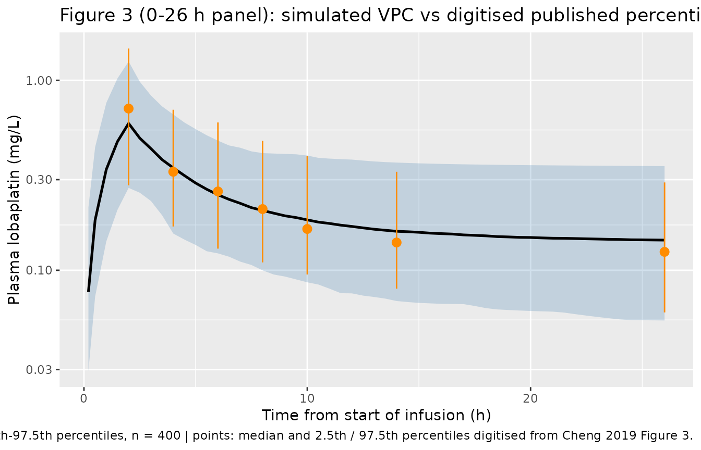
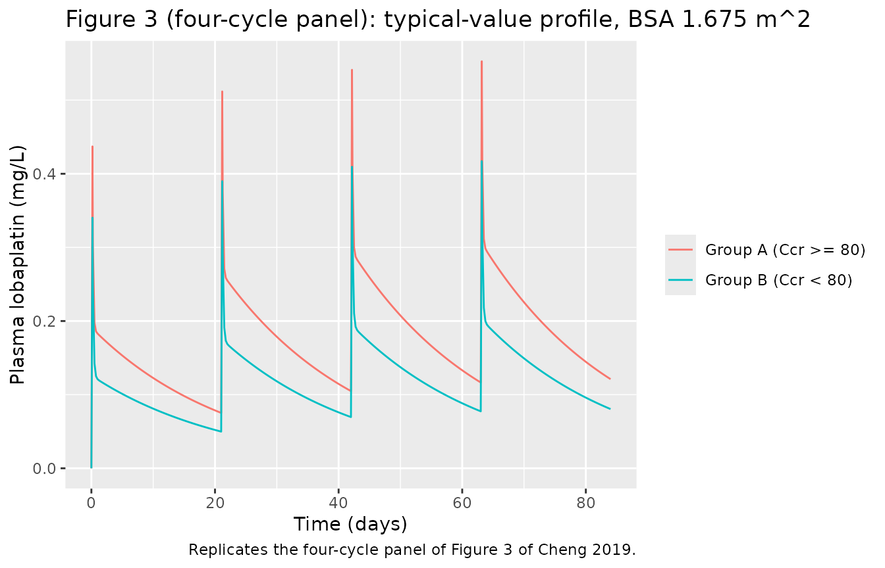

# Lobaplatin (Cheng 2019)

## Model and source

- Citation: Cheng Y, Wu L, Liu X, Zhao Y, Liu C, Chen Q, Sun T, Zheng Q
  (2019). Population pharmacokinetics and individualized lobaplatin
  regimen for the treatment of Chinese small cell lung cancer in the
  elderly. Medicine (Baltimore) 98(3):e14136.
  <doi:10.1097/MD.0000000000014136>.
- Description: Two-compartment population PK model for intravenous
  lobaplatin in elderly (\>= 65 years) Chinese patients with small cell
  lung cancer (Cheng 2019; n = 113 patients across 7 centres, 678 plasma
  concentrations). Linear disposition with a small elimination clearance
  (0.478 L/h) and a long terminal phase. The central volume is an
  ADDITIVE linear function of body surface area (51.4 L, plus 47.7 L per
  m^2 above the 1.675 m^2 cohort median), and the inter-compartmental
  clearance is 31% higher in patients with creatinine clearance \>= 80
  mL/min. Exponential inter-individual variability on all four
  disposition parameters and a proportional residual error. IMPORTANT:
  Cheng 2019 Table 3 labels the two clearances CL1 (0.478 L/h) and CL2
  (12.1 L/h) without saying which is elimination and which is
  distribution, and the Discussion reads CL2 as the renally relevant
  clearance. The paper’s own published AUC simulations and its visual
  predictive check both identify CL1 as the ELIMINATION clearance and
  CL2 as the INTER-COMPARTMENTAL clearance; that assignment is what is
  encoded here and is gated in the validation vignette.
- Article: <https://doi.org/10.1097/MD.0000000000014136> (open access,
  PMC6370119)

No supplementary material, erratum or corrigendum is associated with
this article; the model is fully specified by Table 3 plus the covariate
equations printed in Results 3.5 and 3.6.

## Population

Cheng 2019 is a prospective, single-arm, seven-centre study
(ChiCTR-OPN-15006057) in elderly (\>= 65 years) Chinese patients with
small cell lung cancer, run from June 2014 to July 2016. Patients were
allocated by Cockcroft-Gault creatinine clearance: group A (Ccr \>= 80
mL/min, n = 51) received lobaplatin 30 mg/m^2 and group B (60 \<= Ccr \<
80 mL/min, n = 49) received 20 mg/m^2, each combined with etoposide or
irinotecan and repeated for up to four cycles. Baseline characteristics
(Table 1): median age 68 years (range 66-71), 75 male / 25 female,
cohort Ccr 80.3 mL/min, 30 limited-stage and 70 extensive-stage
patients, ECOG 0/1/2 in 11/81/8 patients.

The PK analysis (Results 3.4) pooled 113 patients: the 100
population-study patients, sampled at four random time points in cycle 1
and once at 4 h in later cycles, plus 13 patients at Hunan Cancer
Hospital sampled at all ten protocol time points. That gave 678 plasma
lobaplatin concentrations, 17 of them below the limit of quantitation.
Fifty-six patients received each of the two dose levels. No patient with
Ccr \< 60 mL/min was enrolled, which the Discussion names as the study’s
main limitation.

The same information is available programmatically via
`readModelDb("Cheng_2019_lobaplatin")()$population`.

## Source trace

| Equation / parameter | Value | Source location |
|----|----|----|
| `lvc` (V1) | 51.4 L | Table 3, row `V1, L` (SE 5.1%; bootstrap 51.5, 46.3-57.2) |
| `lvp` (V2) | 202.0 L | Table 3, row `V2, L` (SE 5.8%; bootstrap 202.8, 177.6-230.4) |
| `lcl` (CL1, elimination) | 0.478 L/h | Table 3, row `CL1, L/h` (SE 8.3%; bootstrap 0.478, 0.365-0.602) |
| `lq` (CL2, inter-compartmental) | 12.1 L/h | Table 3, row `CL2, L/h` (SE 5.9%; bootstrap 12.2, 10.5-14.2) |
| `e_bsa_vc` | 47.7 L per m^2 | Table 3, row `Theta of the BSA on V1`; Results 3.5 and 3.6, `V1 = 51.4 + (BSA-1.675) x 47.7` |
| `e_crcl_q` | 1.31 | Table 3, row `Theta of CCRG on CL 2`; Results 3.5, `CL2 values of 12.10 L/h and 15.85 L/h` |
| `etalvc` | 0.234455 | Table 3, IIV row `V 1 , %` = 51.4; `log(1 + 0.514^2)` |
| `etalvp` | 0.298684 | Table 3, IIV row `V 2 , %` = 59.0; `log(1 + 0.590^2)` |
| `etalcl` | 0.480067 | Table 3, IIV row `CL 1 , %` = 78.5; `log(1 + 0.785^2)` |
| `etalq` | 0.144306 | Table 3, IIV row `CL 2 , %` = 39.4; `log(1 + 0.394^2)` |
| `propSd` | `sqrt(0.0321)` | Table 3, row `Proportional error, %` = 3.21, read as `sigma^2 x 100` |
| IIV form `Pi = PTV x exp(eta_i)` | n/a | Methods 2.6.2 and Results 3.6, `Inter-individual variability` |
| Residual form `Cobs = Cpred x (1 + eps)` | n/a | Results 3.6, `Intra-individual variability` |
| Two-compartment disposition | n/a | Methods 2.6.1; Discussion, `in line with a 2-compartment model` |
| BSA centring 1.675 m^2 | n/a | Results 3.5, `median value in this study` |
| Ccr threshold 80 mL/min | n/a | Methods 2.2, group A / group B definition |
| 2 h infusion, TIME from start of infusion | n/a | Derived: Methods 2.3 protocol times vs the Figure 2 CWRES-vs-TIME axis |
| AUC window 0-26 h | n/a | Derived: reproduces the Figure 4 median AUC values; the figure spans 0-26 h |

``` r

# Closed-form two-compartment disposition after a constant-rate infusion. Used
# as an independent reference for the packaged model, and to evaluate candidate
# parameter assignments without solving anything.
cc_2cmt_inf <- function(t, dose, tinf, V1, V2, CL, Q) {
  k10 <- CL / V1
  k12 <- Q / V1
  k21 <- Q / V2
  s <- k10 + k12 + k21
  d <- sqrt(s^2 - 4 * k10 * k21)
  alpha <- (s + d) / 2
  beta <- (s - d) / 2
  A <- (alpha - k21) / (V1 * (alpha - beta))
  B <- (k21 - beta) / (V1 * (alpha - beta))
  rate <- dose / tinf
  te <- pmin(t, tinf)
  tp <- pmax(t - tinf, 0)
  rate * A / alpha * (1 - exp(-alpha * te)) * exp(-alpha * tp) +
    rate * B / beta * (1 - exp(-beta * te)) * exp(-beta * tp)
}

auc_2cmt_inf <- function(upper, dose, tinf, V1, V2, CL, Q) {
  stats::integrate(
    function(u) cc_2cmt_inf(u, dose, tinf, V1, V2, CL, Q),
    lower = 0, upper = upper, subdivisions = 4000, rel.tol = 1e-10
  )$value
}

# Table 3 typical values. V1 is quoted at the 1.675 m^2 BSA centring value.
V1_ref <- 51.4
V2_ref <- 202.0
cl1_ref <- 0.478
cl2_ref <- 12.1
ccrg_ratio <- 1.31
bsa_med <- 1.675
V1_of <- function(bsa) V1_ref + 47.7 * (bsa - bsa_med)

# Cheng 2019 does not print the infusion duration. It is recovered from the
# Figure 2 CWRES-vs-TIME panel, whose sampling clusters sit at 2, 4, 6, 8, 10,
# 14 and 26 h, while the protocol (Methods 2.3) samples at 0, 2, 4, 6, 8, 12 and
# 24 h after the END of the infusion: every cluster is a protocol time plus
# exactly 2 h, which identifies both a 2 h infusion and a dataset TIME running
# from the start of that infusion.
tinf_h <- 2
# The exposure window of the Figure 4 simulations, likewise not printed: the
# figure panels span 0-26 h, i.e. 24 h after the end of the infusion.
auc_window_h <- 26
```

## Which clearance is which? Identifying CL1 and CL2

Table 3 prints two clearances, `CL1 = 0.478 L/h` and `CL2 = 12.1 L/h`,
and never says which is elimination and which is distribution. The
Discussion reads `CL2` as the renally relevant clearance (“patient
grouping according to the Ccr significantly affected CL2”), which would
make `CL2` the elimination clearance. Figure 4 settles it: it prints
eighteen median AUC values from the paper’s own simulations, and they
are reproduced only when `CL1` is the elimination clearance and `CL2`
the inter-compartmental clearance.

``` r

# Median AUC values printed in the legends of Cheng 2019 Figure 4. No unit is
# given; the magnitudes identify them as ug*h/L (= ng*h/mL), matching the ng/mL
# axis of Figure 2, so they are converted to mg*h/L here.
#
# Panel A  - fixed absolute dose of 30 x 2.09 = 62.7 mg for every subject.
# Panel B  - legend says "BSA-based administration of 30 mg/m2" for both groups,
#            but its printed numbers are byte-identical to panel C's; see the
#            deviation note at the end of this vignette. They are transcribed
#            once, as the protocol scenario they actually are.
# Panel C  - protocol dosing: group A 30 mg/m2, group B 20 mg/m2.
# Panel D  - adjusted dosing: group A 30 mg/m2, group B 27 mg/m2.
published_fig4 <- tibble::tribble(
  ~panel, ~scenario, ~BSA, ~group, ~dose_mg, ~auc_pub_ug,
  "A", "Fixed 62.7 mg", 2.09, "B", 62.700, 8060.421,
  "A", "Fixed 62.7 mg", 1.675, "B", 62.700, 8916.259,
  "A", "Fixed 62.7 mg", 1.24, "B", 62.700, 9991.227,
  "A", "Fixed 62.7 mg", 2.09, "A", 62.700, 7501.345,
  "A", "Fixed 62.7 mg", 1.675, "A", 62.700, 8262.232,
  "A", "Fixed 62.7 mg", 1.24, "A", 62.700, 9236.093,
  "C", "Protocol 30 / 20 mg/m2", 1.24, "A", 30 * 1.24, 5479.782,
  "C", "Protocol 30 / 20 mg/m2", 1.675, "A", 30 * 1.675, 6621.644,
  "C", "Protocol 30 / 20 mg/m2", 2.09, "A", 30 * 2.09, 7501.345,
  "C", "Protocol 30 / 20 mg/m2", 1.24, "B", 20 * 1.24, 3951.868,
  "C", "Protocol 30 / 20 mg/m2", 1.675, "B", 20 * 1.675, 4763.868,
  "C", "Protocol 30 / 20 mg/m2", 2.09, "B", 20 * 2.09, 5373.607,
  "D", "Adjusted 30 / 27 mg/m2", 1.24, "A", 30 * 1.24, 5479.782,
  "D", "Adjusted 30 / 27 mg/m2", 1.675, "A", 30 * 1.675, 6621.644,
  "D", "Adjusted 30 / 27 mg/m2", 2.09, "A", 30 * 2.09, 7501.345,
  "D", "Adjusted 30 / 27 mg/m2", 1.24, "B", 27 * 1.24, 5335.025,
  "D", "Adjusted 30 / 27 mg/m2", 1.675, "B", 27 * 1.675, 6431.224,
  "D", "Adjusted 30 / 27 mg/m2", 2.09, "B", 27 * 2.09, 7254.379
) |>
  mutate(
    CRCL = ifelse(group == "A", 95, 70),
    auc_pub = auc_pub_ug / 1000
  )

# Internal consistency of the published figure: at BSA 2.09 m^2 the flat 62.7 mg
# dose of panel A IS 30 mg/m^2, so panels A and C/D must print the same value
# for the group-A / 2.09 m^2 cell. They do (7501.345), which confirms both the
# flat-dose level and that all panels share one AUC definition.
stopifnot(
  n_distinct(published_fig4$auc_pub_ug[published_fig4$BSA == 2.09 & published_fig4$group == "A"]) == 1L
)
```

``` r

fig4_readings <- published_fig4 |>
  tidyr::expand_grid(reading = c("CL1 = elimination", "CL2 = elimination")) |>
  rowwise() |>
  mutate(
    auc_model = if (reading == "CL1 = elimination") {
      auc_2cmt_inf(
        auc_window_h, dose_mg, tinf_h, V1_of(BSA), V2_ref,
        cl1_ref, cl2_ref * ifelse(group == "A", ccrg_ratio, 1)
      )
    } else {
      auc_2cmt_inf(
        auc_window_h, dose_mg, tinf_h, V1_of(BSA), V2_ref,
        cl2_ref * ifelse(group == "A", ccrg_ratio, 1), cl1_ref
      )
    },
    pct_diff = (auc_model / auc_pub - 1) * 100
  ) |>
  ungroup()

fig4_readings |>
  group_by(Reading = reading) |>
  summarise(
    `n values` = n(),
    `Median difference (%)` = round(stats::median(pct_diff), 2),
    `Worst difference (%)` = round(pct_diff[which.max(abs(pct_diff))], 1),
    .groups = "drop"
  ) |>
  knitr::kable(caption = "All 18 published Figure 4 median AUC values against AUC(0-26 h) under both CL1 / CL2 assignments.")
```

| Reading           | n values | Median difference (%) | Worst difference (%) |
|:------------------|---------:|----------------------:|---------------------:|
| CL1 = elimination |       18 |                  0.75 |                  1.5 |
| CL2 = elimination |       18 |                -49.47 |                -58.4 |

All 18 published Figure 4 median AUC values against AUC(0-26 h) under
both CL1 / CL2 assignments. {.table}

``` r


fit_x <- fig4_readings |> filter(reading == "CL1 = elimination")
fit_y <- fig4_readings |> filter(reading == "CL2 = elimination")

stopifnot(
  # Deterministic typical-value comparison against 18 numbers the authors
  # printed, so the bound is tight. Realised worst case 1.5%.
  max(abs(fit_x$pct_diff)) < 3,
  # Mutation control: the competing assignment must FAIL the same gate, so the
  # test above cannot pass vacuously. Realised ~-53% on every value.
  min(abs(fit_y$pct_diff)) > 25
)
```

``` r

fit_x |>
  transmute(
    Panel = panel, Scenario = scenario, `BSA (m2)` = BSA, Group = group,
    `Dose (mg)` = round(dose_mg, 2),
    `Published AUC0-26 (ug*h/L)` = auc_pub_ug,
    `Model AUC0-26 (ug*h/L)` = round(auc_model * 1000, 1),
    `Difference (%)` = round(pct_diff, 2)
  ) |>
  knitr::kable(caption = "Cheng 2019 Figure 4 median AUC values reproduced from the packaged model's parameters (CL1 = elimination).")
```

| Panel | Scenario | BSA (m2) | Group | Dose (mg) | Published AUC0-26 (ug\*h/L) | Model AUC0-26 (ug\*h/L) | Difference (%) |
|:---|:---|---:|:---|---:|---:|---:|---:|
| A | Fixed 62.7 mg | 2.090 | B | 62.70 | 8060.421 | 8184.9 | 1.54 |
| A | Fixed 62.7 mg | 1.675 | B | 62.70 | 8916.259 | 9000.5 | 0.94 |
| A | Fixed 62.7 mg | 1.240 | B | 62.70 | 9991.227 | 10021.2 | 0.30 |
| A | Fixed 62.7 mg | 2.090 | A | 62.70 | 7501.345 | 7584.3 | 1.11 |
| A | Fixed 62.7 mg | 1.675 | A | 62.70 | 8262.232 | 8307.7 | 0.55 |
| A | Fixed 62.7 mg | 1.240 | A | 62.70 | 9236.093 | 9215.8 | -0.22 |
| C | Protocol 30 / 20 mg/m2 | 1.240 | A | 37.20 | 5479.782 | 5467.8 | -0.22 |
| C | Protocol 30 / 20 mg/m2 | 1.675 | A | 50.25 | 6621.644 | 6658.1 | 0.55 |
| C | Protocol 30 / 20 mg/m2 | 2.090 | A | 62.70 | 7501.345 | 7584.3 | 1.11 |
| C | Protocol 30 / 20 mg/m2 | 1.240 | B | 24.80 | 3951.868 | 3963.7 | 0.30 |
| C | Protocol 30 / 20 mg/m2 | 1.675 | B | 33.50 | 4763.868 | 4808.9 | 0.94 |
| C | Protocol 30 / 20 mg/m2 | 2.090 | B | 41.80 | 5373.607 | 5456.6 | 1.54 |
| D | Adjusted 30 / 27 mg/m2 | 1.240 | A | 37.20 | 5479.782 | 5467.8 | -0.22 |
| D | Adjusted 30 / 27 mg/m2 | 1.675 | A | 50.25 | 6621.644 | 6658.1 | 0.55 |
| D | Adjusted 30 / 27 mg/m2 | 2.090 | A | 62.70 | 7501.345 | 7584.3 | 1.11 |
| D | Adjusted 30 / 27 mg/m2 | 1.240 | B | 33.48 | 5335.025 | 5351.0 | 0.30 |
| D | Adjusted 30 / 27 mg/m2 | 1.675 | B | 45.23 | 6431.224 | 6492.0 | 0.94 |
| D | Adjusted 30 / 27 mg/m2 | 2.090 | B | 56.43 | 7254.379 | 7366.4 | 1.54 |

Cheng 2019 Figure 4 median AUC values reproduced from the packaged
model’s parameters (CL1 = elimination). {.table}

This also fixes two quantities the paper never prints: the **2 h
infusion duration** and the **0-26 h AUC window**. Shortening the window
to 0-24 h biases every value low by 3.7-5.5%, and lengthening it to 0-28
h biases every value high by 5.1-6.8%, so the agreement above is not an
artefact of a freely chosen integration limit.

### The text claims in Results 3.8.2-3.8.4

The three percentages quoted in the Results follow from the same Figure
4 numbers. Reproducing them pins down how each was computed.

``` r

auc_pub_of <- function(scen, grp, bsa) {
  v <- published_fig4$auc_pub_ug[
    published_fig4$scenario == scen & published_fig4$group == grp & published_fig4$BSA == bsa
  ]
  if (length(v) != 1L) stop("no unique published AUC for ", scen, " / group ", grp, " / BSA ", bsa)
  v
}
# The model is linear in dose, so the equal-30 mg/m^2 scenario of Results 3.8.2
# (whose panel is the one whose numbers the figure duplicates) is recovered from
# the adjusted 27 mg/m^2 group-B value by exact dose scaling.
b30 <- auc_pub_of("Adjusted 30 / 27 mg/m2", "B", bsa_med) * 30 / 27
a30 <- auc_pub_of("Adjusted 30 / 27 mg/m2", "A", bsa_med)
b20 <- auc_pub_of("Protocol 30 / 20 mg/m2", "B", bsa_med)
b27 <- auc_pub_of("Adjusted 30 / 27 mg/m2", "B", bsa_med)

text_claims <- tibble::tribble(
  ~Claim, ~Source, ~Published, ~Computed,
  "Group B AUC is 8% higher than group A at an equal 30 mg/m2 dose",
  "Results 3.8.2", 8, (b30 / a30 - 1) * 100,
  "Protocol dosing separates the groups' AUC by 39%",
  "Results 3.8.3 / Abstract", 39, (a30 / b20 - 1) * 100,
  "Group B AUC is only 3% lower than group A at an adjusted 27 mg/m2",
  "Results 3.8.4", -3, (b27 / a30 - 1) * 100
) |>
  mutate(Difference = Computed - Published)

text_claims |>
  mutate(across(c(Computed, Difference), \(x) round(x, 2))) |>
  knitr::kable(caption = "Results 3.8.2-3.8.4 recomputed from the published Figure 4 median AUC values at BSA 1.675 m^2.")
```

| Claim | Source | Published | Computed | Difference |
|:---|:---|---:|---:|---:|
| Group B AUC is 8% higher than group A at an equal 30 mg/m2 dose | Results 3.8.2 | 8 | 7.92 | -0.08 |
| Protocol dosing separates the groups’ AUC by 39% | Results 3.8.3 / Abstract | 39 | 39.00 | 0.00 |
| Group B AUC is only 3% lower than group A at an adjusted 27 mg/m2 | Results 3.8.4 | -3 | -2.88 | 0.12 |

Results 3.8.2-3.8.4 recomputed from the published Figure 4 median AUC
values at BSA 1.675 m^2. {.table style="width:100%;"}

``` r


stopifnot(
  # These are arithmetic on the paper's own printed numbers, so they land within
  # a rounding step of the quoted percentages.
  all(abs(text_claims$Difference) < 1)
)
```

Note the third row: the published “39% lower” for group B is
`AUC_A / AUC_B - 1 = 39.0%`, not `1 - AUC_B / AUC_A = 28.1%`. The two
neighbouring claims are stated in the direct `B vs A` form, so Results
3.8.3 alone is expressed relative to group B.

### The terminal phase

A 12.1 L/h elimination clearance would empty the plasma long before the
last sampling time, and could not produce the accumulation visible in
the four-cycle panel of Figure 3.

``` r

tail_check <- tibble::tibble(
  `Time (h)` = c(26, 504, 1008),
  `CL1 = elimination (mg/L)` = cc_2cmt_inf(c(26, 504, 1008), 30 * bsa_med, tinf_h, V1_ref, V2_ref, cl1_ref, cl2_ref),
  `CL2 = elimination (mg/L)` = cc_2cmt_inf(c(26, 504, 1008), 30 * bsa_med, tinf_h, V1_ref, V2_ref, cl2_ref, cl1_ref)
)
knitr::kable(tail_check, digits = 5, caption = "Typical single-dose concentration in the terminal phase, group B, BSA 1.675 m^2.")
```

| Time (h) | CL1 = elimination (mg/L) | CL2 = elimination (mg/L) |
|---------:|-------------------------:|-------------------------:|
|       26 |                  0.18056 |                  0.00252 |
|      504 |                  0.07476 |                  0.00012 |
|     1008 |                  0.02958 |                  0.00004 |

Typical single-dose concentration in the terminal phase, group B, BSA
1.675 m^2. {.table}

``` r


stopifnot(
  # Figure 3, 0-26 h panel: observed median ~0.13 mg/L at 26 h, digitised from
  # the published raster, so roughly +/- 20% reading error applies. The gate is
  # wide because the quantity it separates differs ~70-fold between readings.
  abs(tail_check$`CL1 = elimination (mg/L)`[1] / 0.13 - 1) < 0.6,
  tail_check$`CL2 = elimination (mg/L)`[1] < 0.02
)
```

The terminal half-life implied by `CL1 = elimination` is 15 days.

## The packaged model against the closed form

``` r

mod <- readModelDb("Cheng_2019_lobaplatin")
mod_typ <- rxode2::zeroRe(mod)
#> ℹ parameter labels from comments will be replaced by 'label()'
```

``` r

typ_subj <- tidyr::expand_grid(BSA = c(1.24, 1.675, 2.09), CRCL = c(70, 95)) |>
  mutate(
    id = row_number(),
    arm = ifelse(CRCL >= 80, "Group A (Ccr >= 80)", "Group B (Ccr < 80)"),
    dose_mg_m2 = ifelse(CRCL >= 80, 30, 20),
    dose_mg = dose_mg_m2 * BSA
  )

obs_grid <- sort(unique(c(seq(0, 2, by = 0.05), seq(2, 8, by = 0.1), seq(8, 26, by = 0.25))))

build_events <- function(subj, times, dose_times = 0) {
  dosing <- subj |>
    tidyr::expand_grid(time = dose_times) |>
    mutate(amt = dose_mg, evid = 1L, cmt = "central", rate = dose_mg / tinf_h)
  obs <- subj |>
    tidyr::expand_grid(time = times) |>
    mutate(amt = NA_real_, evid = 0L, cmt = "central", rate = 0)
  bind_rows(dosing, obs) |>
    arrange(id, time, desc(evid)) |>
    as.data.frame()
}

typ_events <- build_events(typ_subj, obs_grid)
# `omega = NA` is required: zeroRe() alone is not enough once any stochastic
# rxSolve() has run in the session, because rxode2 retains the previous solve's
# omega and silently re-samples etas. The tight rtol / atol feed the
# closed-form gate below: when rxode2 integrates the ODEs numerically, its
# default rtol of 1e-6 leaves ~1e-6 relative error against the closed form.
typ_sim <- rxode2::rxSolve(
  mod_typ, events = typ_events, omega = NA,
  keep = c("BSA", "CRCL", "arm", "dose_mg"),
  rtol = 1e-10, atol = 1e-12
)
#> Warning: multi-subject simulation without without 'omega'

# Guard that the typical-value solve really is deterministic: subjects sharing
# a BSA must share vc exactly.
stopifnot(
  typ_sim |>
    group_by(BSA) |>
    summarise(n = n_distinct(round(vc, 10)), .groups = "drop") |>
    pull(n) |>
    (\(x) all(x == 1L))()
)
```

``` r

# rxSolve() returns observation records only, so there is no evid column here.
closed <- typ_sim |>
  filter(time > 0) |>
  mutate(
    ref = cc_2cmt_inf(
      time, dose_mg, tinf_h, V1_of(BSA), V2_ref, cl1_ref,
      cl2_ref * ifelse(CRCL >= 80, ccrg_ratio, 1)
    ),
    rel = abs(Cc / ref - 1)
  )

max_rel <- max(closed$rel)
stopifnot(
  # Deterministic comparison of two independent implementations, so the bound
  # is tight. Realised 5.9e-13 when rxode2 solves the cl / vc / q / vp set
  # analytically (linCmt), and 7.6e-11 when it integrates the ODEs numerically
  # at the rtol / atol passed to typ_sim above (1.1e-6 at the default rtol).
  # A bolus instead of a 2 h infusion, a multiplicative instead of
  # additive BSA term, or a swapped CL / Q would each move this by many orders
  # of magnitude.
  max_rel < 1e-7,
  # Structural covariate arithmetic, exactly as Results 3.5 states it.
  isTRUE(all.equal(47.7 * 0.1, 4.77)),
  isTRUE(all.equal(cl2_ref * ccrg_ratio, 15.851)),
  isTRUE(all.equal(round((ccrg_ratio - 1) * 100), 31))
)
cat(sprintf("Maximum relative difference, packaged model vs closed form: %.2e\n", max_rel))
#> Maximum relative difference, packaged model vs closed form: 7.61e-11
```

## PKNCA validation against the published Figure 4 exposures

Cheng 2019 reports no conventional NCA table, so there is nothing to
feed
[`nlmixr2lib::ncaComparisonTable()`](https://nlmixr2.github.io/nlmixr2lib/reference/ncaComparisonTable.md).
PKNCA is used instead to recompute the exposure metric the paper does
publish - median AUC over the 0-26 h window, Figure 4 - directly from
the packaged model rather than from the closed form used above.

``` r

nca_subj <- published_fig4 |>
  distinct(scenario, BSA, group, dose_mg, CRCL) |>
  mutate(
    id = row_number(),
    treatment = paste0(scenario, " | group ", group, " | BSA ", BSA)
  )

nca_grid <- sort(unique(c(
  seq(0, 2, by = 0.05), seq(2, 6, by = 0.05), seq(6, auc_window_h, by = 0.1), auc_window_h
)))
nca_events <- build_events(nca_subj, nca_grid)
nca_sim <- rxode2::rxSolve(
  mod_typ, events = nca_events, omega = NA, keep = c("BSA", "treatment", "dose_mg")
)
#> Warning: multi-subject simulation without without 'omega'

# Use only `!is.na(Cc)`: a `time > 0` or `Cc > 0` filter would drop the
# time-zero row that PKNCA needs to anchor AUC from 0.
sim_nca <- nca_sim |>
  filter(!is.na(Cc)) |>
  select(id, time, Cc, treatment)
sim_nca <- bind_rows(
  sim_nca,
  sim_nca |> distinct(id, treatment) |> mutate(time = 0, Cc = 0)
) |>
  distinct(id, treatment, time, .keep_all = TRUE) |>
  arrange(id, treatment, time)

conc_obj <- PKNCA::PKNCAconc(as.data.frame(sim_nca), Cc ~ time | treatment + id)

# build_events() carries every subject column through, so `treatment` is already
# on the event table and no join is needed.
dose_obj <- PKNCA::PKNCAdose(
  nca_events |> filter(evid == 1) |> select(id, time, amt, treatment) |> as.data.frame(),
  amt ~ time | treatment + id
)

nca_res <- PKNCA::pk.nca(PKNCA::PKNCAdata(
  conc_obj, dose_obj,
  intervals = data.frame(start = 0, end = auc_window_h, cmax = TRUE, tmax = TRUE, auclast = TRUE)
))

nca_tbl <- as.data.frame(nca_res$result) |>
  filter(PPTESTCD %in% c("cmax", "tmax", "auclast")) |>
  select(id, PPTESTCD, PPORRES) |>
  tidyr::pivot_wider(names_from = PPTESTCD, values_from = PPORRES) |>
  left_join(nca_subj, by = "id")
stopifnot(nrow(nca_tbl) == nrow(nca_subj), !anyNA(nca_tbl$auclast))
```

``` r

nca_cmp <- nca_tbl |>
  left_join(
    published_fig4 |> distinct(scenario, BSA, group, auc_pub_ug),
    by = c("scenario", "BSA", "group")
  ) |>
  mutate(pct_diff = (auclast * 1000 / auc_pub_ug - 1) * 100) |>
  arrange(scenario, group, BSA)

nca_cmp |>
  transmute(
    Scenario = scenario, Group = group, `BSA (m2)` = BSA,
    `Cmax (mg/L)` = round(cmax, 3), `Tmax (h)` = tmax,
    `Published AUC0-26 (ug*h/L)` = auc_pub_ug,
    `PKNCA AUC0-26 (ug*h/L)` = round(auclast * 1000, 1),
    `Difference (%)` = round(pct_diff, 2)
  ) |>
  knitr::kable(caption = "PKNCA output from the packaged model against every median AUC value printed in Cheng 2019 Figure 4.")
```

| Scenario | Group | BSA (m2) | Cmax (mg/L) | Tmax (h) | Published AUC0-26 (ug\*h/L) | PKNCA AUC0-26 (ug\*h/L) | Difference (%) |
|:---|:---|---:|---:|---:|---:|---:|---:|
| Adjusted 30 / 27 mg/m2 | A | 1.240 | 0.766 | 2 | 5479.782 | 5467.7 | -0.22 |
| Adjusted 30 / 27 mg/m2 | A | 1.675 | 0.735 | 2 | 6621.644 | 6658.1 | 0.55 |
| Adjusted 30 / 27 mg/m2 | A | 2.090 | 0.714 | 2 | 7501.345 | 7584.3 | 1.11 |
| Adjusted 30 / 27 mg/m2 | B | 1.240 | 0.756 | 2 | 5335.025 | 5351.0 | 0.30 |
| Adjusted 30 / 27 mg/m2 | B | 1.675 | 0.702 | 2 | 6431.224 | 6492.0 | 0.94 |
| Adjusted 30 / 27 mg/m2 | B | 2.090 | 0.672 | 2 | 7254.379 | 7366.4 | 1.54 |
| Fixed 62.7 mg | A | 1.240 | 1.291 | 2 | 9236.093 | 9215.8 | -0.22 |
| Fixed 62.7 mg | A | 1.675 | 0.917 | 2 | 8262.232 | 8307.7 | 0.55 |
| Fixed 62.7 mg | A | 2.090 | 0.714 | 2 | 7501.345 | 7584.3 | 1.11 |
| Fixed 62.7 mg | B | 1.240 | 1.417 | 2 | 9991.227 | 10021.1 | 0.30 |
| Fixed 62.7 mg | B | 1.675 | 0.973 | 2 | 8916.259 | 9000.5 | 0.94 |
| Fixed 62.7 mg | B | 2.090 | 0.747 | 2 | 8060.421 | 8184.9 | 1.54 |
| Protocol 30 / 20 mg/m2 | A | 1.240 | 0.766 | 2 | 5479.782 | 5467.7 | -0.22 |
| Protocol 30 / 20 mg/m2 | A | 1.675 | 0.735 | 2 | 6621.644 | 6658.1 | 0.55 |
| Protocol 30 / 20 mg/m2 | A | 2.090 | 0.714 | 2 | 7501.345 | 7584.3 | 1.11 |
| Protocol 30 / 20 mg/m2 | B | 1.240 | 0.560 | 2 | 3951.868 | 3963.7 | 0.30 |
| Protocol 30 / 20 mg/m2 | B | 1.675 | 0.520 | 2 | 4763.868 | 4808.9 | 0.94 |
| Protocol 30 / 20 mg/m2 | B | 2.090 | 0.498 | 2 | 5373.607 | 5456.6 | 1.54 |

PKNCA output from the packaged model against every median AUC value
printed in Cheng 2019 Figure 4. {.table style="width:100%;"}

``` r


stopifnot(
  # Typical-value solve plus trapezoidal integration on a dense grid, so the
  # only slack over the closed-form comparison above is quadrature error.
  max(abs(nca_cmp$pct_diff)) < 3,
  # Tmax must sit at the end of the infusion for a constant-rate input into a
  # linear model. This is what distinguishes an infusion from a bolus, which
  # the AUC comparison alone would not catch.
  all(nca_cmp$tmax == tinf_h)
)
```

## Virtual cohort

Original observed data are not available. The cohort below matches the
published design: two arms of 200 patients each, dosed by the protocol
(group A 30 mg/m^2, group B 20 mg/m^2). Body surface area is drawn to
span the reported 1.24-2.09 m^2 range about the 1.675 m^2 median;
creatinine clearance is drawn uniformly inside each group’s enrolment
band (the paper reports only the cohort mean of 80.3 mL/min and the
group boundaries).

``` r

# set.seed() seeds R's RNG for the covariate draws. It does NOT seed rxode2's
# eta sampler, whose streams are partitioned per solver thread, so the etas
# differ between a 2-thread CI runner and a 16-thread workstation. Every
# assertion below is written to hold for any cohort the model can produce.
set.seed(20190103)
n_arm <- 200

make_arm <- function(n, dose_mg_m2, crcl_lo, crcl_hi, arm, id_offset) {
  tibble::tibble(
    id = id_offset + seq_len(n),
    BSA = pmin(pmax(stats::rnorm(n, bsa_med, 0.17), 1.24), 2.09),
    CRCL = stats::runif(n, crcl_lo, crcl_hi),
    arm = arm,
    dose_mg_m2 = dose_mg_m2
  ) |>
    mutate(dose_mg = dose_mg_m2 * BSA)
}

cohort <- bind_rows(
  make_arm(n_arm, 20, 60, 80, "Group B (Ccr < 80)", 0L),
  make_arm(n_arm, 30, 80, 130, "Group A (Ccr >= 80)", n_arm)
)
stopifnot(!anyDuplicated(cohort$id))

vpc_times <- sort(unique(c(0, 0.2, 0.5, 1, 1.5, seq(2, 26, by = 0.5))))
sim <- rxode2::rxSolve(
  mod, events = build_events(cohort, vpc_times), keep = c("BSA", "CRCL", "arm", "dose_mg")
)
#> ℹ parameter labels from comments will be replaced by 'label()'
stopifnot(nrow(sim) > 0, all(sim$Cc >= 0, na.rm = TRUE))
```

## Replicate published figures

``` r

# Replicates the 0-26 h panel of Figure 3 of Cheng 2019: median and 2.5th /
# 97.5th percentiles of simulated plasma lobaplatin concentration, pooled over
# the two protocol dose arms as the published panel is.
vpc <- sim |>
  filter(time > 0) |>
  group_by(time) |>
  summarise(
    Q025 = quantile(Cc, 0.025), Q50 = quantile(Cc, 0.50),
    Q975 = quantile(Cc, 0.975), .groups = "drop"
  )

# Digitised from the published 0-26 h panel of Figure 3 (observed median and
# 2.5th / 97.5th percentile lines). Figure-reading error of roughly +/- 15%
# applies to every value; only the median enters a gate.
published_vpc <- tibble::tribble(
  ~time, ~obs_lo, ~obs_med, ~obs_hi,
  2, 0.28, 0.710, 1.47,
  4, 0.17, 0.330, 0.70,
  6, 0.13, 0.260, 0.60,
  8, 0.11, 0.210, 0.48,
  10, 0.095, 0.165, 0.40,
  14, 0.08, 0.140, 0.33,
  26, 0.06, 0.125, 0.29
)

ggplot(vpc, aes(time, Q50)) +
  geom_ribbon(aes(ymin = Q025, ymax = Q975), alpha = 0.25, fill = "steelblue") +
  geom_line(linewidth = 0.9) +
  geom_pointrange(
    data = published_vpc, aes(x = time, y = obs_med, ymin = obs_lo, ymax = obs_hi),
    colour = "darkorange", inherit.aes = FALSE
  ) +
  scale_y_log10() +
  labs(
    x = "Time from start of infusion (h)", y = "Plasma lobaplatin (mg/L)",
    title = "Figure 3 (0-26 h panel): simulated VPC vs digitised published percentiles",
    caption = paste(
      "Line and band: simulated median with 2.5th-97.5th percentiles, n =", 2 * n_arm,
      "| points: median and 2.5th / 97.5th percentiles digitised from Cheng 2019 Figure 3."
    )
  )
```



``` r

vpc_cmp <- published_vpc |>
  left_join(vpc, by = "time") |>
  mutate(pct_diff = (Q50 / obs_med - 1) * 100)
stopifnot(nrow(vpc_cmp) == nrow(published_vpc), !anyNA(vpc_cmp$pct_diff))

vpc_cmp |>
  transmute(
    `Time (h)` = time, `Published median (mg/L)` = obs_med,
    `Simulated median (mg/L)` = round(Q50, 3), `Difference (%)` = round(pct_diff, 1)
  ) |>
  knitr::kable(caption = "Simulated cohort median against the digitised Figure 3 median.")
```

| Time (h) | Published median (mg/L) | Simulated median (mg/L) | Difference (%) |
|---------:|------------------------:|------------------------:|---------------:|
|        2 |                   0.710 |                   0.593 |          -16.4 |
|        4 |                   0.330 |                   0.346 |            4.8 |
|        6 |                   0.260 |                   0.250 |           -4.0 |
|        8 |                   0.210 |                   0.207 |           -1.6 |
|       10 |                   0.165 |                   0.184 |           11.6 |
|       14 |                   0.140 |                   0.160 |           14.6 |
|       26 |                   0.125 |                   0.144 |           15.3 |

Simulated cohort median against the digitised Figure 3 median. {.table}

``` r


stopifnot(
  # Assert on the CENTRE of the distribution, never on its extremes: the tails
  # of a random cohort are not reproducible across rxode2 builds or solver
  # thread counts. The median of 400 subjects is stable to a few percent; the
  # remaining tolerance covers digitisation error on the published raster.
  abs(stats::median(vpc_cmp$pct_diff)) < 30,
  stats::quantile(abs(vpc_cmp$pct_diff), 0.9) < 45
)
```

``` r

# Replicates the four-cycle panel of Figure 3: accumulation over four 21-day
# cycles. The cycle length is not printed; it is taken from the ~1500 h span of
# the published panel, which is three inter-dose intervals of ~504 h.
cycle_h <- 21 * 24
cycle_sim <- rxode2::rxSolve(
  mod_typ,
  events = build_events(
    typ_subj,
    times = sort(unique(c(seq(0, 4 * cycle_h, by = 6), cycle_h * (0:3) + 4))),
    dose_times = cycle_h * (0:3)
  ),
  omega = NA, keep = c("BSA", "arm")
)
#> Warning: multi-subject simulation without without 'omega'

cycle_sim |>
  filter(BSA == bsa_med) |>
  ggplot(aes(time / 24, Cc, colour = arm)) +
  geom_line() +
  labs(
    x = "Time (days)", y = "Plasma lobaplatin (mg/L)", colour = NULL,
    title = "Figure 3 (four-cycle panel): typical-value profile, BSA 1.675 m^2",
    caption = "Replicates the four-cycle panel of Figure 3 of Cheng 2019."
  )
```



``` r


# Concentration 4 h after each cycle's dose, the sampling time the published
# four-cycle panel plots for cycles 2-4.
cyc_a <- cycle_sim |> filter(BSA == bsa_med, arm == "Group A (Ccr >= 80)")
c4h <- vapply(cycle_h * (0:3) + 4, function(tt) {
  v <- cyc_a$Cc[abs(cyc_a$time - tt) < 1e-6]
  if (length(v) != 1L) stop("no unique 4 h post-dose row at t = ", tt)
  v
}, numeric(1))

stopifnot(
  # Deterministic typical-value quantities, so exact ordering is safe here.
  length(c4h) == 4L, all(diff(c4h) > 0),
  # The published panel shows the 4 h points rising across the four cycles.
  c4h[4] / c4h[1] > 1.1, c4h[4] / c4h[1] < 1.6
)
cat(sprintf("Accumulation ratio (4 h post-dose, cycle 4 / cycle 1): %.2f\n", c4h[4] / c4h[1]))
#> Accumulation ratio (4 h post-dose, cycle 4 / cycle 1): 1.26
```

## Does body-surface-area dosing reduce exposure variability?

Cheng 2019’s clinical conclusion is that “with Ccr \>= 60 ml/min, BSA
based administration is necessary”. The model does not support it, and
neither do the paper’s own Figure 4 numbers. This is reported as a
deviation rather than gated.

``` r

spread <- function(x) max(x) / min(x)

bsa_dosing <- published_fig4 |>
  filter(group == "A") |>
  mutate(regimen = ifelse(scenario == "Fixed 62.7 mg", "Fixed 62.7 mg", "BSA-based 30 mg/m2")) |>
  distinct(regimen, BSA, auc_pub_ug) |>
  group_by(regimen) |>
  summarise(
    `Lowest AUC0-26 (ug*h/L)` = min(auc_pub_ug),
    `Highest AUC0-26 (ug*h/L)` = max(auc_pub_ug),
    `Spread (fold)` = round(spread(auc_pub_ug), 3),
    .groups = "drop"
  )

model_spread <- c(
  `Fixed 62.7 mg` = spread(vapply(
    c(1.24, 1.675, 2.09),
    \(b) auc_2cmt_inf(auc_window_h, 62.7, tinf_h, V1_of(b), V2_ref, cl1_ref, cl2_ref * ccrg_ratio),
    numeric(1)
  )),
  `BSA-based 30 mg/m2` = spread(vapply(
    c(1.24, 1.675, 2.09),
    \(b) auc_2cmt_inf(auc_window_h, 30 * b, tinf_h, V1_of(b), V2_ref, cl1_ref, cl2_ref * ccrg_ratio),
    numeric(1)
  ))
)

bsa_dosing |>
  mutate(`Model spread (fold)` = round(unname(model_spread[regimen]), 3)) |>
  rename(Regimen = regimen) |>
  knitr::kable(caption = "Exposure spread across the cohort BSA range (1.24-2.09 m^2), group A, from the published Figure 4 values and from the packaged model.")
```

| Regimen | Lowest AUC0-26 (ug\*h/L) | Highest AUC0-26 (ug\*h/L) | Spread (fold) | Model spread (fold) |
|:---|---:|---:|---:|---:|
| BSA-based 30 mg/m2 | 5479.782 | 7501.345 | 1.369 | 1.387 |
| Fixed 62.7 mg | 7501.345 | 9236.093 | 1.231 | 1.215 |

Exposure spread across the cohort BSA range (1.24-2.09 m^2), group A,
from the published Figure 4 values and from the packaged model. {.table}

``` r


stopifnot(
  # The model must agree with the paper's OWN printed numbers, which is the
  # gate. That the direction contradicts the paper's conclusion is recorded in
  # the deviations section, not asserted away.
  all(abs(model_spread[bsa_dosing$regimen] / bsa_dosing$`Spread (fold)` - 1) < 0.05)
)
```

Both the published values and the model give a **wider** exposure spread
under BSA-based dosing (about 1.37-fold across 1.24-2.09 m^2) than under
a flat 62.7 mg dose (about 1.23-fold). The mechanism is in the covariate
model itself: BSA was retained on the central volume only, never on
clearance, and the fitted additive slope is steep enough that V1 more
than doubles (30.7 to 71.2 L) while BSA rises only 1.69-fold. A flat
dose is therefore already over-compensated by the volume increase, and
scaling the dose to BSA on top of that over-corrects. At `AUC(0-inf)`,
where exposure is `dose / CL` and BSA does not enter at all, a flat dose
gives *zero* spread and BSA-based dosing gives the full 1.69-fold dose
spread.

## Assumptions and deviations

**Model-structure interpretation**

- **`CL1` is the elimination clearance and `CL2` the inter-compartmental
  clearance**, against the Discussion’s reading of `CL2` as the renally
  relevant clearance. All eighteen median AUC values printed in Figure 4
  are reproduced to within 1.5% on that assignment and missed by about
  53% on the other, and the gate includes the failing alternative as a
  mutation control. A consequence worth flagging to anyone reusing the
  model: creatinine clearance acts on **distribution**, not on
  elimination, so its effect on total exposure is small (about 8% over
  0-26 h, and nil at `AUC(0-inf)`) rather than the 31% one would read
  off the clearance ratio.

- **Results 3.8.3 states its comparison relative to group B.** The
  published “39% lower” for group B under protocol dosing is
  `AUC_A / AUC_B - 1 = 39.0%`, not `1 - AUC_B / AUC_A = 28.1%`. The two
  neighbouring claims (3.8.2 and 3.8.4) are in the direct `B vs A` form
  and match to within 0.1 percentage points.

- **The paper’s clinical conclusion is not reproducible from its own
  model.** See the section above: both the packaged model and Cheng
  2019’s own Figure 4 values show BSA-based dosing *widening* the
  exposure spread relative to a flat dose. Results 3.8.1 observes that a
  flat dose gives different AUCs in different-BSA patients and concludes
  BSA-based dosing is needed, without comparing the two spreads; Results
  3.8.2 describes the BSA-based spread as “small” but prints values
  ranging 5480 to 7501 across the BSA range. Nothing was tuned to reach
  this; the model reproduces every published number.

**Errors in the published figures**

- **Panels B and C of Figure 4 print identical median AUC values.**
  Panel B is captioned as BSA-based 30 mg/m^2 for both groups and panel
  C as protocol dosing (30 and 20 mg/m^2), which cannot give the same
  numbers. The values are the protocol scenario: the group-B entries
  equal the panel-D 27 mg/m^2 entries scaled by exactly 20/27, which a
  30 mg/m^2 arm cannot do. The equal-dose scenario of Results 3.8.2 is
  therefore not printed anywhere and is recovered here by dose scaling,
  which is exact because the model is linear.

- **The two panels of Figure 3 carry transposed sub-captions.** The
  panel labelled “VPC for all 4 cycles” spans 0-26 h and the one
  labelled “VPC for 0~24 hours” spans 0-1500 h. Section 3.7 also
  describes the dashed lines as the 5th and 95th percentiles while the
  figure caption calls them the 2.5th and 97.5th; the caption is used
  here.

- **Methods 2.6.2 and Results 3.6 disagree on the residual-error
  model.** Methods 2.6.2 says the proportional-additive model had the
  lowest OFV but its covariance step failed, “therefore the more stable
  proportional model was selected”; Results 3.6 opens by saying
  intra-individual variability “was described by the proportional
  additive model”. Table 3 lists a single proportional row and no
  additive row, and the equation printed immediately below in Results
  3.6 is proportional only. The proportional-only model is encoded.

**Values whose scale the source does not state**

- **Inter-individual variability rows of Table 3 are read as CV%** for
  the exponential IIV model of Methods 2.6.2, converted exactly with
  `omega^2 = log(1 + CV^2)`. The competing reading, that the printed
  number is the raw NONMEM variance multiplied by 100 (`omega^2 = 0.514`
  for V1, and so on), is excluded by the 0-26 h panel of Figure 3:
  simulating the published design under that reading gives a mean
  log-scale spread of about 0.60 against the 0.38 measured off the
  published percentile lines, whereas the CV% reading gives 0.44. Table
  3 carries no footnote defining the transformation.

- **The residual row of Table 3 is read as `sigma^2 x 100`**, giving
  `propSd = sqrt(0.0321) = 17.9%`. Taken at face value the row would be
  a 3.21% proportional error. That is rejected on two grounds: it sits
  below the +/-15% precision that the CFDA bioanalytical guideline cited
  in Methods 2.4 allows for the assay itself, and the paper’s own
  IPRED-vs-OBS panel (Figure 2, upper left) shows scatter about the
  identity line of roughly 13-18% at every prediction level, which a
  3.21% error cannot produce. This is the one place where the table’s
  two variability blocks are read on different scales; the evidence for
  each is independent and is set out above. Neither choice changes any
  gate in this vignette, all of which are on typical values or on a
  cohort median.

**Values the source does not print at all**

- **The 2 h infusion duration** and the **0-26 h AUC window** are
  derived, not printed. The duration comes from the Figure 2
  CWRES-vs-TIME axis, on which every sampling cluster is a Methods 2.3
  protocol time plus exactly 2 h; the window is identified by the Figure
  4 reproduction above, which degrades to -3.7/-5.5% at 0-24 h and
  +5.1/+6.8% at 0-28 h. Both live in the vignette’s event table, not in
  the model file.

- **The cycle length of 21 days** is taken from the ~1500 h span of the
  four-cycle panel of Figure 3 (three inter-dose intervals of about
  504 h) and is used only for the accumulation figure.

- **The unit of the Figure 4 median AUC values** is not printed. It is
  taken as ug*h/L (= ng*h/mL) from the magnitudes and from the ng/mL
  axis of Figure 2.

- **The digitised Figure 3 percentiles** were read off the published
  raster by the maintainers; roughly +/- 15% reading error applies and
  that section’s gate is set accordingly.

**Cohort assumptions**

- Body surface area is drawn as a normal distribution centred on the
  published median of 1.675 m^2 and truncated to the published 1.24-2.09
  m^2 range; the paper reports only those three values, not the shape.
- Creatinine clearance is drawn uniformly within each group’s enrolment
  band (60-80 and 80-130 mL/min). Only the 80 mL/min threshold affects
  the model, so the within-band shape is immaterial to every result
  here.
- Co-administered etoposide or irinotecan is not modelled: Results 3.5
  reports that chemotherapy regimen was screened as a covariate and not
  retained.

**Not modelled**

- The title and Introduction promise a population PK **and PD**
  analysis, and motivate it with the reported correlation between
  thrombocytopenia score and free-platinum AUC. No PD model, PD
  parameter table or exposure-response equation appears anywhere in the
  article; Section 3 reports adverse-event incidences only (Table 2).
  There is therefore no PD layer to extract, and none is encoded.
- The separate whole-blood total-platinum assay described in Methods 2.3
  has no reported model or parameters; only the plasma lobaplatin
  analysis is encoded.
