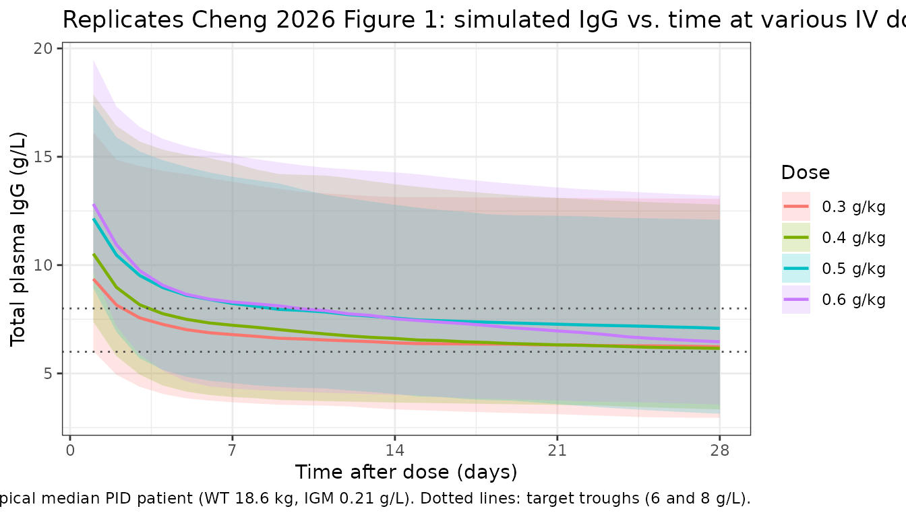
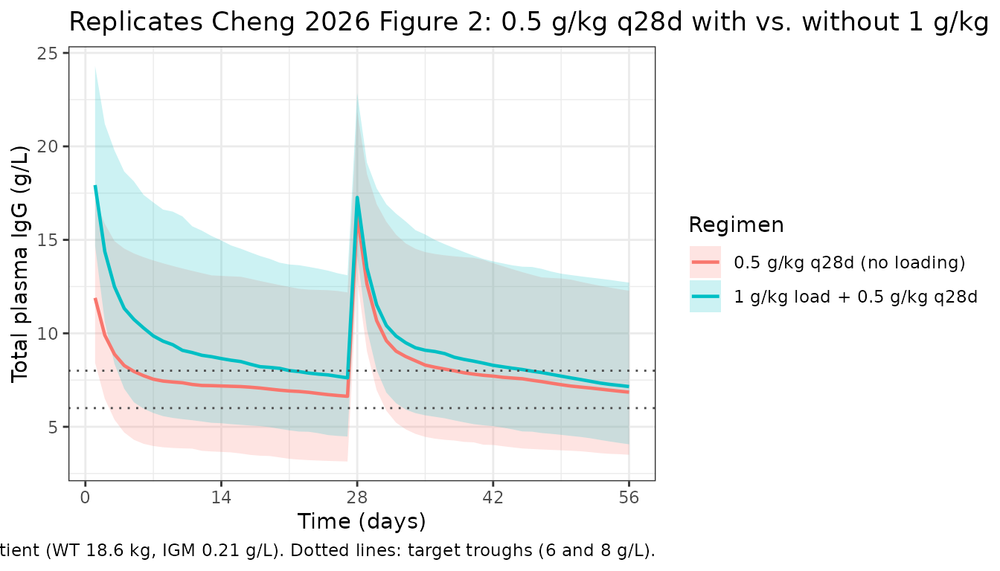

# Immunoglobulin (Cheng 2026)

## Model and source

- Citation: Cheng IL, Huang ZH, Worth A, Booth C, Standing JF.
  Pharmacokinetic modelling of intravenous immunoglobulin in children
  with primary immunodeficiencies and secondary antibody deficiencies.
  Br J Clin Pharmacol. 2025;1-11. <doi:10.1002/bcp.70420>
- Description: Two-compartment population PK model for intravenous
  immunoglobulin (IVIG) replacement therapy in pediatric
  primary-immunodeficiency and secondary-antibody-deficiency patients
  (Cheng 2026)
- Article: <https://doi.org/10.1002/bcp.70420>

## Population

The model was developed from a retrospective single-centre cohort of 64
children treated with intravenous immunoglobulin (IVIG) at a tertiary
paediatric hospital in the United Kingdom between April 2019 and April
2024 (Cheng 2026 Table 2). Forty-four children had primary
immunodeficiency (PID) and twenty had secondary antibody deficiency
(SAD); fifteen of the SAD patients had antibody deficiency following
rituximab and five following CAR-T cell therapy. The cohort spanned a
wide age range (3 weeks to 16.8 years; median 4.08 years) and weight
range (3.15 to 95.3 kg; median 18.6 kg). The median dose was 0.56 g/kg
every 28 days (range 0.24 to 1.38 g/kg). PID patients received 0.3 g/kg
every 3 weeks per local policy; SAD patients received 0.5 g/kg every 4
weeks. The median baseline IgG was 4 g/L (PID baselines were fixed at 4
g/L since these were established long-term IgRT patients), median
absolute CD19+ B cell count was 0.07 × 10^9 cells/L, and median IgM was
0.21 g/L. Plasma IgG samples (n = 444) were predominantly trough
samples; the assay’s lower limit of quantification was 0.07 g/L. Three
IVIG products were used: Privigen (n = 53), Octagam (n = 9), and Gamunex
(n = 2) (Cheng 2026 Table 3).

The same information is available programmatically via
`readModelDb("Cheng_2026_immunoglobulin")$population` after the model is
loaded.

## Source trace

| Equation / parameter | Value | Source location |
|----|---:|----|
| `lcl` (CL for 70 kg PID) | 0.308 L/day | Cheng 2026 Table 4 (page 7) |
| `lvc` (V1 for 70 kg) | 3.59 L | Cheng 2026 Table 4 |
| `lq` (Q for 70 kg) | 1.08 L/day | Cheng 2026 Table 4 |
| `lvp` (V2 for 70 kg) | 7.37 L | Cheng 2026 Table 4 |
| `lcbas` (baseline IgG, PID, IGM = 0.21) | 5.67 g/L | Cheng 2026 Table 4 |
| `e_wt_cl_q` (allometric exponent on CL, Q; fixed) | 0.75 | Cheng 2026 Methods, page 7 (theory-based, fixed in final model) |
| `e_wt_vc_vp` (allometric exponent on V1, V2; fixed) | 1.0 | Cheng 2026 Methods, page 7 (theory-based, fixed) |
| `e_sad_cl` (SAD/PID multiplicative ratio on CL) | 0.542 | Cheng 2026 Table 4 |
| `e_sad_cbas` (SAD/PID multiplicative ratio on CBAS) | 0.541 | Cheng 2026 Table 4 |
| `e_igm_cbas` (power exponent for IgM on CBAS) | 0.11 | Cheng 2026 Table 4 |
| IIV CL (CV%) | 42.7% | Cheng 2026 Table 4 |
| IIV V2 (CV%) | 138.6% | Cheng 2026 Table 4 |
| IIV CBAS (CV%) | 49.3% | Cheng 2026 Table 4 |
| `addSd` (additive residual error) | 0.812 g/L | Cheng 2026 Table 4 |
| `propSd` (proportional residual error) | 0.117 | Cheng 2026 Table 4 |
| Two-compartment ODE structure with first-order elimination | n/a | Cheng 2026 Methods (page 5); confirmed in Results (page 6) |
| Allometric scaling form (`(WT/70)^exp`) | n/a | Cheng 2026 eq. 1 (page 5) |
| Categorical covariate form (`theta^DT`) | n/a | Cheng 2026 eq. 2 (page 5) |
| Continuous covariate power form (`(IGM/0.21)^theta`) | n/a | Cheng 2026 eq. 3 (page 5) |
| Total observed IgG = exogenous + CBAS | n/a | Cheng 2026 Methods (page 5): “measured IgG was assumed to be the sum of endogenous IgG, the baseline IgG (CBAS) level prior to treatment and exogenous therapeutic Ig” |

## Errata

No published erratum or corrigendum was found for this paper as of the
model extraction date. Two notational ambiguities were noted in the
source and are worth flagging for readers:

- The “What this study adds” highlight box and the abstract describe SAD
  patients as having “54% lower clearance” than PID patients. The actual
  parameter estimate (Cheng 2026 Table 4) is `theta_DT_CL = 0.542`,
  which multiplies CL on the SAD branch — i.e., SAD CL is 54.2% **of**
  PID CL, or equivalently 45.8% **lower** than PID CL. The Discussion’s
  phrasing (“the clearance for SAD patients being half that of PID
  patients”) matches the parameter value; the highlight-box “54% lower”
  appears to confuse the multiplier with the percent-change. The model
  file uses the table value (0.542) directly.
- In the Results paragraph describing the final model, the source writes
  “IgM cell count” (page 7); from context this should read “IgM level”
  (IgM is an antibody concentration, not a cell count). The parameter is
  the continuous IgM concentration (g/L) tabulated in Cheng 2026 Table
  2.

## Virtual cohort

Original individual-level IgG data are not publicly available. The
figures below use a virtual cohort whose covariate distributions
approximate the modelled population: weight-by-age sampled from the
published Table 2 medians and ranges, disease type drawn from the 44 PID
/ 20 SAD split, and IgM drawn from the published distribution.

``` r

set.seed(20260428)

n_subj <- 200

# Disease split: 44 PID / 20 SAD per Table 2 (PID = reference, DIS_SAD = 0)
n_pid <- round(n_subj * 44 / 64)
n_sad <- n_subj - n_pid

# Body weight: sample on log scale across the reported pediatric range
# (3.15-95.3 kg). Use a log-uniform distribution truncated to the published
# extremes; this is conservative relative to the actual right-skewed
# weight distribution but gives roughly the published 18.6 kg median.
sample_wt <- function(n) {
  u <- runif(n)
  exp(log(3.15) + u * (log(95.3) - log(3.15)))
}

# IgM: log-uniform across the reported range (0.03-5.61 g/L)
sample_igm <- function(n) {
  u <- runif(n)
  exp(log(0.03) + u * (log(5.61) - log(0.03)))
}

cohort <- data.frame(
  ID      = seq_len(n_subj),
  WT      = sample_wt(n_subj),
  DIS_SAD = c(rep(0L, n_pid), rep(1L, n_sad)),
  IGM     = sample_igm(n_subj)
)

cat(sprintf(
  "Cohort: n=%d, PID=%d, SAD=%d; weight median=%.1f kg, IgM median=%.2f g/L\n",
  nrow(cohort), n_pid, n_sad, median(cohort$WT), median(cohort$IGM)
))
#> Cohort: n=200, PID=138, SAD=62; weight median=16.5 kg, IgM median=0.42 g/L
```

## Simulation — replicate Figure 1

Cheng 2026 Figure 1 shows estimated IgG levels at various dosing
regimens (maintenance doses of 0.3, 0.4, 0.5, 0.6 g/kg) over 28 days.
The paper simulates 1000 virtual patients using the median values of
relevant covariates (weight 18.6 kg, IGM 0.21 g/L, DIS_SAD = 0 for PID).
We replicate the same scenario at the cohort-median typical patient.

``` r

mod <- readModelDb("Cheng_2026_immunoglobulin")

# Typical median PID patient
typical_wt  <- 18.6
typical_igm <- 0.21
typical_dt  <- 0L

# Doses to compare (g/kg) over 28 days
doses_gkg <- c(0.3, 0.4, 0.5, 0.6)

obs_grid <- seq(0, 28, by = 1)

# Build a single multi-cohort event table; one cohort per dose level. Each
# cohort gets a disjoint ID range via id_offset so rxSolve does not collide
# subjects across cohorts.
make_cohort <- function(dose_gkg, n, id_offset) {
  amt <- dose_gkg * typical_wt
  data.frame(
    ID       = id_offset + seq_len(n),
    WT       = typical_wt,
    DIS_SAD  = typical_dt,
    IGM      = typical_igm,
    dose_gkg = dose_gkg,
    amt      = amt
  )
}

n_per <- 200

cohorts <- bind_rows(lapply(seq_along(doses_gkg), function(i) {
  make_cohort(doses_gkg[i], n_per, id_offset = (i - 1L) * n_per)
}))

# Build dosing + observation event table per subject
dose_rows <- cohorts |>
  transmute(
    id   = ID,
    time = 0,
    amt  = amt,
    evid = 1L,
    cmt  = "central",
    WT, DIS_SAD, IGM, dose_gkg
  )

obs_rows <- cohorts[rep(seq_len(nrow(cohorts)), each = length(obs_grid)), ] |>
  mutate(
    id   = ID,
    time = rep(obs_grid, times = nrow(cohorts)),
    amt  = 0,
    evid = 0L,
    cmt  = "central"
  ) |>
  select(id, time, amt, evid, cmt, WT, DIS_SAD, IGM, dose_gkg)

events <- bind_rows(dose_rows, obs_rows) |> arrange(id, time, desc(evid))

stopifnot(!anyDuplicated(events[, c("id", "time", "evid")]))

set.seed(2026)
sim <- rxode2::rxSolve(mod, events = events, keep = c("dose_gkg"))
#> ℹ parameter labels from comments will be replaced by 'label()'
```

``` r

sim |>
  filter(time > 0) |>
  group_by(time, dose_gkg) |>
  summarise(
    Q05 = quantile(Cc, 0.05, na.rm = TRUE),
    Q50 = quantile(Cc, 0.50, na.rm = TRUE),
    Q95 = quantile(Cc, 0.95, na.rm = TRUE),
    .groups = "drop"
  ) |>
  mutate(dose_label = sprintf("%.1f g/kg", dose_gkg)) |>
  ggplot(aes(time, Q50, colour = dose_label, fill = dose_label)) +
  geom_ribbon(aes(ymin = Q05, ymax = Q95), alpha = 0.20, colour = NA) +
  geom_line(linewidth = 0.8) +
  geom_hline(yintercept = c(6, 8), linetype = "dotted", colour = "grey30") +
  scale_x_continuous(breaks = seq(0, 28, by = 7)) +
  labs(
    x = "Time after dose (days)",
    y = "Total plasma IgG (g/L)",
    colour = "Dose",
    fill   = "Dose",
    title  = "Replicates Cheng 2026 Figure 1: simulated IgG vs. time at various IV dose levels",
    caption = "Typical median PID patient (WT 18.6 kg, IGM 0.21 g/L). Dotted lines: target troughs (6 and 8 g/L)."
  ) +
  theme_bw()
```



## Loading-dose comparison — replicate Figure 2

Cheng 2026 Figure 2 compares dosing regimens with and without a 1 g/kg
loading dose on Day 0. Below we simulate 0.5 g/kg every 28 days for two
cycles, with and without the loading dose, in the same typical PID
patient.

``` r

n_per <- 200
duration_days <- 56  # two 28-day cycles
obs_grid_2 <- seq(0, duration_days, by = 1)

# Helper: build events for a regimen
make_regimen <- function(label, dose_gkg, has_loading, n, id_offset) {
  ids <- id_offset + seq_len(n)
  base <- data.frame(
    id    = ids,
    WT    = typical_wt,
    DIS_SAD = typical_dt,
    IGM   = typical_igm,
    regimen = label
  )
  amt_maint <- dose_gkg * typical_wt
  amt_load  <- 1.0 * typical_wt
  doses <- if (has_loading) {
    bind_rows(
      data.frame(id = ids, time = 0,   amt = amt_load,  evid = 1L, cmt = "central"),
      data.frame(id = ids, time = 28,  amt = amt_maint, evid = 1L, cmt = "central")
    )
  } else {
    bind_rows(
      data.frame(id = ids, time = 0,   amt = amt_maint, evid = 1L, cmt = "central"),
      data.frame(id = ids, time = 28,  amt = amt_maint, evid = 1L, cmt = "central")
    )
  }
  obs <- expand.grid(id = ids, time = obs_grid_2) |>
    mutate(amt = 0, evid = 0L, cmt = "central")
  bind_rows(doses, obs) |>
    left_join(base, by = "id") |>
    arrange(id, time, desc(evid))
}

regimens <- bind_rows(
  make_regimen("0.5 g/kg q28d (no loading)", 0.5, FALSE, n_per, id_offset =     0L),
  make_regimen("1 g/kg load + 0.5 g/kg q28d", 0.5, TRUE,  n_per, id_offset = n_per)
)

stopifnot(!anyDuplicated(regimens[, c("id", "time", "evid")]))

set.seed(20262)
sim2 <- rxode2::rxSolve(mod, events = regimens, keep = c("regimen"))
#> ℹ parameter labels from comments will be replaced by 'label()'
```

``` r

sim2 |>
  filter(time > 0) |>
  group_by(time, regimen) |>
  summarise(
    Q05 = quantile(Cc, 0.05, na.rm = TRUE),
    Q50 = quantile(Cc, 0.50, na.rm = TRUE),
    Q95 = quantile(Cc, 0.95, na.rm = TRUE),
    .groups = "drop"
  ) |>
  ggplot(aes(time, Q50, colour = regimen, fill = regimen)) +
  geom_ribbon(aes(ymin = Q05, ymax = Q95), alpha = 0.20, colour = NA) +
  geom_line(linewidth = 0.8) +
  geom_hline(yintercept = c(6, 8), linetype = "dotted", colour = "grey30") +
  scale_x_continuous(breaks = seq(0, duration_days, by = 14)) +
  labs(
    x = "Time (days)",
    y = "Total plasma IgG (g/L)",
    colour = "Regimen",
    fill   = "Regimen",
    title  = "Replicates Cheng 2026 Figure 2: 0.5 g/kg q28d with vs. without 1 g/kg loading dose",
    caption = "Typical median PID patient (WT 18.6 kg, IGM 0.21 g/L). Dotted lines: target troughs (6 and 8 g/L)."
  ) +
  theme_bw()
```



``` r

# Probability of target attainment (PTA) above 6 and 8 g/L per regimen
pta <- sim2 |>
  filter(time > 0, time <= duration_days) |>
  group_by(regimen) |>
  summarise(
    pta_above_6 = mean(Cc > 6, na.rm = TRUE),
    pta_above_8 = mean(Cc > 8, na.rm = TRUE),
    .groups = "drop"
  )

knitr::kable(
  pta,
  digits  = 3,
  caption = "Simulated proportion of post-dose time with total IgG > 6 g/L and > 8 g/L."
)
```

| regimen                     | pta_above_6 | pta_above_8 |
|:----------------------------|------------:|------------:|
| 0.5 g/kg q28d (no loading)  |       0.733 |       0.488 |
| 1 g/kg load + 0.5 g/kg q28d |       0.821 |       0.576 |

Simulated proportion of post-dose time with total IgG \> 6 g/L and \> 8
g/L. {.table}

## PKNCA validation — replicate Cheng 2026 AUC values

Cheng 2026 reports a 28-day AUC of 200.2 (CI 194.4-206.2), 211.5
(205.6-217.5), and 222.4 (216.6-228.5) g/L·day for 0.4, 0.5, and 0.6
g/kg infusions respectively, in the median typical patient. Note that
the model defines `Cc` as **total** IgG (exogenous drug plus the
endogenous CBAS baseline), so the NCA-derived AUC includes the baseline
contribution and is directly comparable to the published AUC values.

``` r

sim_nca <- sim |>
  as.data.frame() |>
  filter(!is.na(Cc), time >= 0, time <= 28) |>
  mutate(treatment = sprintf("%.1f g/kg", dose_gkg)) |>
  select(id, time, Cc, treatment)

dose_nca <- events |>
  filter(evid == 1, time == 0) |>
  mutate(treatment = sprintf("%.1f g/kg", dose_gkg)) |>
  select(id, time, amt, treatment)

conc_obj <- PKNCA::PKNCAconc(sim_nca, Cc ~ time | treatment + id,
                             concu = "g/L", timeu = "day")
dose_obj <- PKNCA::PKNCAdose(dose_nca, amt ~ time | treatment + id,
                             doseu = "g")

intervals <- data.frame(
  start    = 0,
  end      = 28,
  cmax     = TRUE,
  tmax     = TRUE,
  auclast  = TRUE,
  cmin     = TRUE
)

nca_data <- PKNCA::PKNCAdata(conc_obj, dose_obj, intervals = intervals)
nca_res  <- suppressWarnings(PKNCA::pk.nca(nca_data))
#>  ■■■■■■■■■■■■■■■■■                 53% |  ETA:  3s

nca_summary <- summary(nca_res)
knitr::kable(nca_summary,
             caption = "Simulated NCA over the 28-day dosing interval (total IgG, including endogenous baseline).")
```

| Interval Start | Interval End | treatment | N | AUClast (day\*g/L) | Cmax (g/L) | Cmin (g/L) | Tmax (day) |
|---:|---:|:---|:---|:---|:---|:---|:---|
| 0 | 28 | 0.3 g/kg | 200 | 192 \[38.3\] | 11.7 \[21.9\] | 6.13 \[43.0\] | 0.000 \[0.000, 0.000\] |
| 0 | 28 | 0.4 g/kg | 200 | 204 \[38.5\] | 13.8 \[19.3\] | 6.40 \[42.7\] | 0.000 \[0.000, 0.000\] |
| 0 | 28 | 0.5 g/kg | 200 | 205 \[34.7\] | 15.4 \[16.2\] | 6.19 \[40.7\] | 0.000 \[0.000, 0.000\] |
| 0 | 28 | 0.6 g/kg | 200 | 236 \[35.7\] | 18.1 \[15.6\] | 7.04 \[43.0\] | 0.000 \[0.000, 0.000\] |

Simulated NCA over the 28-day dosing interval (total IgG, including
endogenous baseline). {.table}

### Comparison against Cheng 2026

``` r

nca_tbl <- as.data.frame(nca_res$result)

simulated_aucs <- nca_tbl |>
  filter(PPTESTCD == "auclast") |>
  group_by(treatment) |>
  summarise(
    AUC_sim_median = median(PPORRES, na.rm = TRUE),
    AUC_sim_q025   = quantile(PPORRES, 0.025, na.rm = TRUE),
    AUC_sim_q975   = quantile(PPORRES, 0.975, na.rm = TRUE),
    .groups        = "drop"
  )

published <- tibble::tibble(
  treatment      = c("0.4 g/kg", "0.5 g/kg", "0.6 g/kg"),
  AUC_pub_median = c(200.2, 211.5, 222.4),
  AUC_pub_lo     = c(194.4, 205.6, 216.6),
  AUC_pub_hi     = c(206.2, 217.5, 228.5)
)

comparison <- published |>
  left_join(simulated_aucs, by = "treatment") |>
  mutate(pct_diff = 100 * (AUC_sim_median - AUC_pub_median) / AUC_pub_median)

knitr::kable(
  comparison,
  digits  = 1,
  caption = "Simulated vs. published 28-day AUC of total plasma IgG (g/L·day) for the typical median PID patient. The published 95% CIs reflect parameter uncertainty across 1000 NONMEM simulation replicates; the simulated CIs reflect between-subject and residual variability across n = 200 virtual patients per dose level."
)
```

| treatment | AUC_pub_median | AUC_pub_lo | AUC_pub_hi | AUC_sim_median | AUC_sim_q025 | AUC_sim_q975 | pct_diff |
|:---|---:|---:|---:|---:|---:|---:|---:|
| 0.4 g/kg | 200.2 | 194.4 | 206.2 | 207.4 | 100.4 | 434.3 | 3.6 |
| 0.5 g/kg | 211.5 | 205.6 | 217.5 | 204.5 | 111.7 | 387.7 | -3.3 |
| 0.6 g/kg | 222.4 | 216.6 | 228.5 | 235.8 | 123.9 | 444.2 | 6.0 |

Simulated vs. published 28-day AUC of total plasma IgG (g/L·day) for the
typical median PID patient. The published 95% CIs reflect parameter
uncertainty across 1000 NONMEM simulation replicates; the simulated CIs
reflect between-subject and residual variability across n = 200 virtual
patients per dose level. {.table style="width:100%;"}

## Assumptions and deviations

- **IIV correlation structure**: Cheng 2026 reports that IIV was
  parameterised using a “variance-covariance matrix” (i.e., a block
  omega with off-diagonal correlations between etas), but Table 4 only
  lists the diagonal CV% values (CL 42.7%, V2 138.6%, CBAS 49.3%).
  Without the published off-diagonal covariance terms, the etas in the
  packaged model are independent; downstream uncertainty in joint
  parameter draws will therefore be slightly larger than the source.
- **IIV on V1 vs. V2**: Cheng 2026 Methods describes IIV as “for
  clearance, volume of distribution and baseline IgG”, but the
  final-model Table 4 reports IIV on **V2** (peripheral) rather than V1
  (central). This packaged model follows Table 4 (the authoritative
  final-model column) and applies IIV to `vp` (V2), not `vc` (V1).
- **Allometric exponents fixed at theory-based values**: 0.75 (CL/Q) and
  1.0 (V1/V2) per Cheng 2026 Methods, page 7. The base model estimated
  values near these (0.788 for CL, 0.743 for V) but with parameter
  collinearity; the authors fixed the exponents in the final model. The
  packaged model uses `fixed()` to reflect this.
- **Endogenous IgG handling**: Total observed plasma IgG = exogenous
  drug-derived contribution (`central / vc`) + endogenous baseline
  (`cbas`). The CBAS value depends on disease type and IgM level; for
  PID at IgM median (0.21 g/L), CBAS = 5.67 g/L. This means the modelled
  `Cc` is the *total* assayed IgG, not just the drug component, and NCA
  values will include the baseline contribution.
- **Virtual cohort covariate distributions**: The original
  individual-level data are not publicly available. The replicate-figure
  cohorts use the published-table extremes (weight 3.15-95.3 kg, IgM
  0.03-5.61 g/L) and the 44/20 PID/SAD ratio reported in Table 2. Sex is
  not a model covariate (Cheng 2026 Methods: sex did not contribute to
  model improvement); race and ethnicity are not reported in the source.
- **Dosing**: Modelled as IV bolus into the central compartment. Cheng
  2026 describes “intravenous Ig” without specifying infusion duration;
  the paper’s own simulations are reported on the same single-event
  basis.
- **AUC interpretation**: The simulated 28-day AUC includes both the
  exogenous-drug contribution and the endogenous CBAS baseline (5.67 ×
  28 ≈ 158.8 g/L·day for the typical PID patient). The published AUC
  values (200.2-222.4 g/L·day) are consistent with this interpretation;
  comparing drug-only AUC (subtracting the baseline contribution)
  against the published numbers would understate the simulated value.
