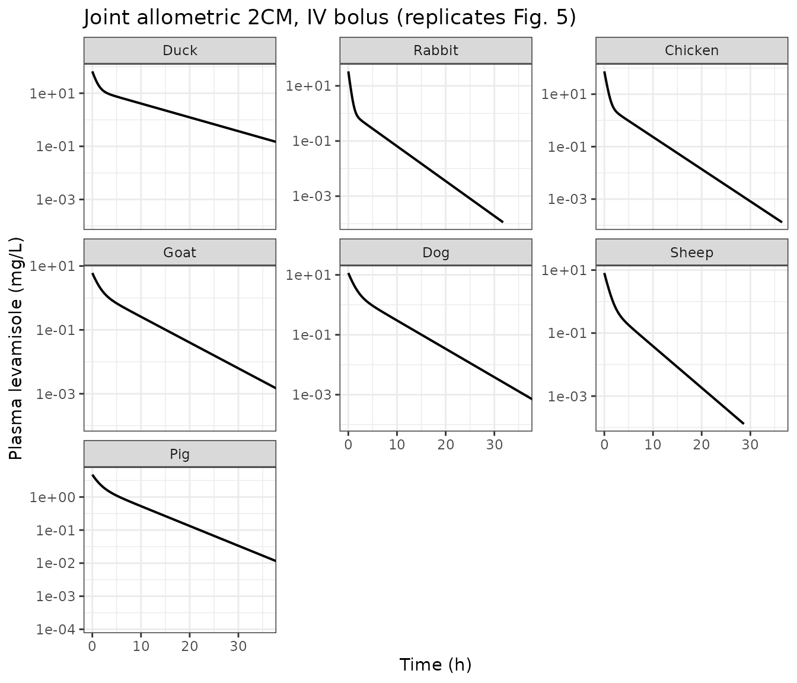
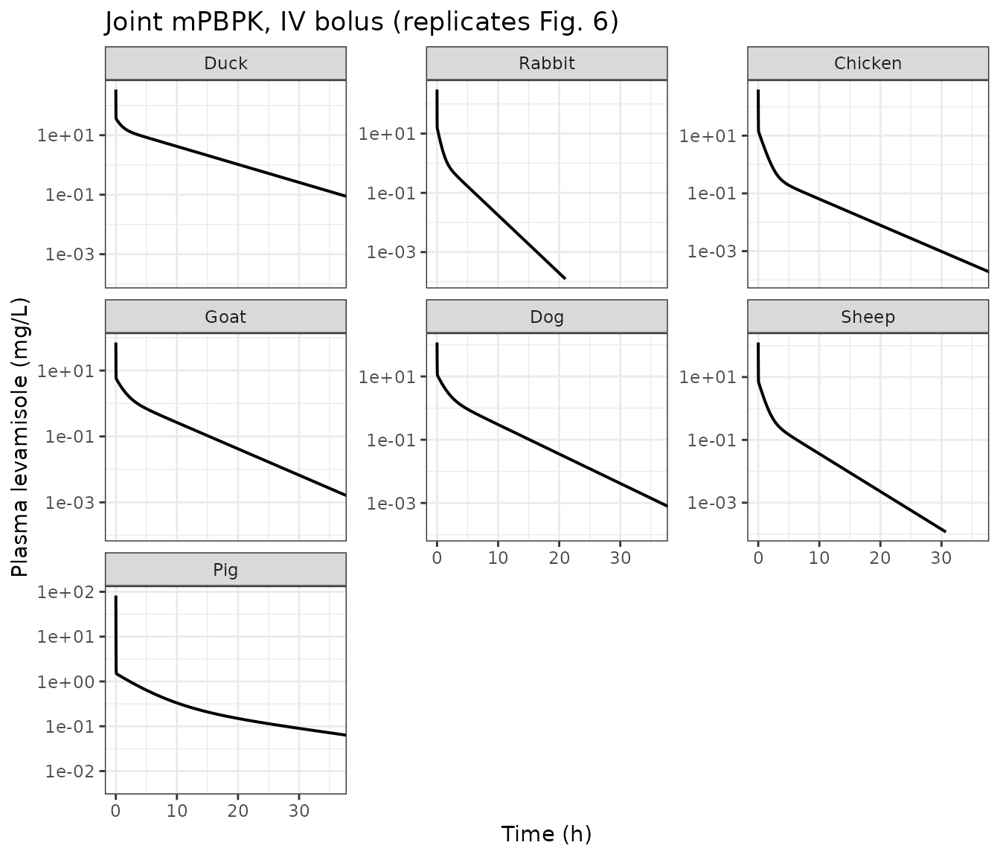
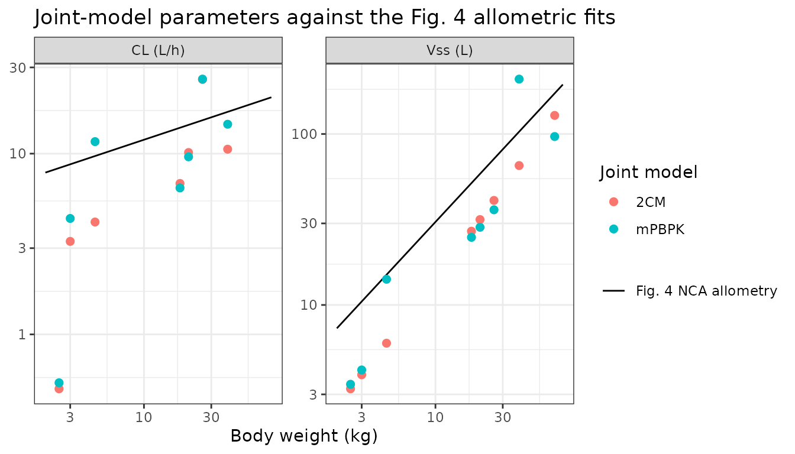
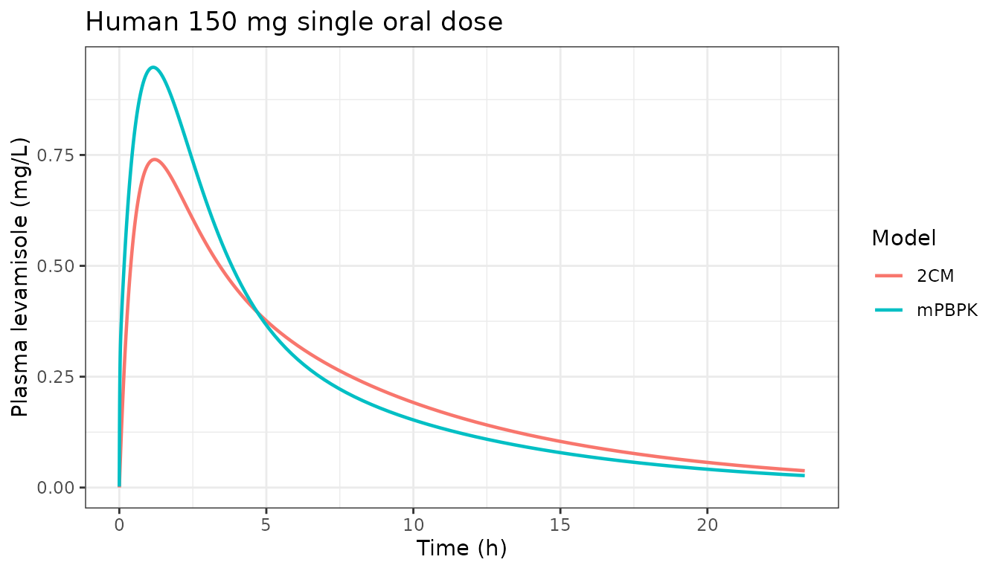

# Levamisole interspecies PK: allometric 2CM and minimal PBPK (Cheng 2026)

## Model and source

Cheng, Jeong and Jusko (2026) assembled published levamisole (LVM)
pharmacokinetic data from more than 40 papers spanning 18 species,
digitized the concentration-time profiles, and fitted two *joint*
interspecies models to the eight species that met their inclusion
criteria (intravenous data available – except for humans – and
warm-blooded). The paper contributes two structurally independent
models, extracted here as two model files that share this vignette:

- `Cheng_2026_levamisole_2cm` – an allometric two-compartment model
  (Fig. 2, Table 2). Distribution is shared across species through
  simple allometric relations on body weight; elimination clearance is
  species-specific.
- `Cheng_2026_levamisole_mpbpk` – a minimal physiologically based model
  (Fig. 3, Table 3) with a blood compartment and two lumped tissue pools
  that split cardiac output and residual body volume. This is the model
  the authors preferred, on a lower AIC (598,377 versus 598,512).

Both fits are naive-pooled and deterministic (maximum likelihood in
ADAPT 5 on one representative profile per species), so neither model
carries between-subject variability.

- Article: <https://doi.org/10.1007/s40005-025-00770-6>
- Supplement (Tables S1-S10, Figures S1-S5):
  <https://doi.org/10.1007/s40005-025-00770-6>

``` r

mod_2cm <- readModelDb("Cheng_2026_levamisole_2cm")
mod_mpbpk <- readModelDb("Cheng_2026_levamisole_mpbpk")

rxode2::rxode2(mod_2cm)$reference
#> [1] "Cheng C, Jeong YS, Jusko WJ. Meta-analysis of levamisole absorption and disposition across diverse species using a minimal physiologically-based pharmacokinetic model. J Pharm Investig. 2026;56(2):171-183. doi:10.1007/s40005-025-00770-6."
```

## Population

The analysis is a meta-analysis of the published literature rather than
a study of a single cohort, so there is no subject-level demographic
table to reproduce. The unit of analysis is the *species*: one
representative single-dose profile was digitized per species so that
every species contributes equal weight to the joint objective function,
with the middle dose chosen for species studied over a dose range
(rabbits and sheep). Inclusion required intravenous data (humans are the
exception – only oral human data exist) and excluded cold-blooded
species, whose much lower basal metabolic rate makes their clearance
non-comparable.

``` r

pop <- rxode2::rxode2(mod_mpbpk)$meta$population
data.frame(
  Field = c("Species", "Studies", "Weight range", "Dose range"),
  Value = c(pop$species, as.character(pop$n_studies), pop$weight_range, pop$dose_range)
) |>
  knitr::kable()
```

| Field | Value |
|:---|:---|
| Species | duck + rabbit + chicken + goat + dog + sheep + pig + human (joint interspecies fit; human is the model’s reference species) |
| Studies | 8 |
| Weight range | 2.5-70 kg (one typical body weight per species; Table 1) |
| Dose range | Intravenous single doses of 5-40 mg/kg in the animal species and single oral doses of 50-150 mg in humans (Supplemental Tables S2, S3 and S4). |

The eight modelled species, their body weights, and the intravenous
profile each contributed are below. Body weights are the typical values
the joint fit used (Table 1 and Supplemental Table S1C); doses and
source studies are from Supplemental Table S2 (rows footnoted “Data used
for 2CM and mPBPK modeling”).

``` r

species_tbl <- tibble::tribble(
  ~species,   ~wt,   ~iv_mgkg, ~source,
  "Duck",       2.5,  30,   "Tabari 2022",
  "Rabbit",     3.0,  16.0, "Villanueva 2003 (middle of 12.5/16/20)",
  "Chicken",    4.5,  40,   "El-Kholy 2006",
  "Goat",      18.0,   5,   "Nielsen & Rasmussen 1983",
  "Dog",       20.7,  10,   "Watson 1988",
  "Sheep",     26.0,   7.5, "Fernandez 1997 (middle of 5/7.5/10)",
  "Pig",       39.2,   5,   "Galtier 1983",
  "Human",     70.0,  NA,   "no IV data; oral only (Table S4)"
) |>
  mutate(iv_dose_mg = iv_mgkg * wt)

sp_levels <- species_tbl$species

species_tbl |>
  rename(
    "Species" = species, "Body weight (kg)" = wt, "IV dose (mg/kg)" = iv_mgkg,
    "IV dose (mg)" = iv_dose_mg, "Source study" = source
  ) |>
  knitr::kable(digits = 1)
```

| Species | Body weight (kg) | IV dose (mg/kg) | Source study | IV dose (mg) |
|:---|---:|---:|:---|---:|
| Duck | 2.5 | 30.0 | Tabari 2022 | 75 |
| Rabbit | 3.0 | 16.0 | Villanueva 2003 (middle of 12.5/16/20) | 48 |
| Chicken | 4.5 | 40.0 | El-Kholy 2006 | 180 |
| Goat | 18.0 | 5.0 | Nielsen & Rasmussen 1983 | 90 |
| Dog | 20.7 | 10.0 | Watson 1988 | 207 |
| Sheep | 26.0 | 7.5 | Fernandez 1997 (middle of 5/7.5/10) | 195 |
| Pig | 39.2 | 5.0 | Galtier 1983 | 196 |
| Human | 70.0 | NA | no IV data; oral only (Table S4) | NA |

## Source trace

Every value in both `ini()` blocks, and every non-trivial `model()`
equation, with the location in Cheng 2026 it came from.

``` r

tibble::tribble(
  ~Model, ~Quantity, ~Value, ~Source,
  "2CM",   "a1, b1 (central volume Vp allometry)",     "0.339 L, 1.309",      "Table 2",
  "2CM",   "a2, b2 (peripheral volume Vt allometry)",  "0.937 L, 0.885",      "Table 2",
  "2CM",   "a3, b3 (distributional clearance CLd)",    "0.352 L/h, 0.920",    "Table 2",
  "2CM",   "ka (human oral)",                          "1.702 /h",            "Table 2",
  "2CM",   "F (human oral, fixed)",                    "0.66",                "Table 2; Absorption kinetics",
  "2CM",   "CL by species",                            "0.20-1.09 L/h/kg",    "Table 1, 'Joint 2CM' column",
  "2CM",   "Disposition ODEs",                         "Vp dCp/dt, Vt dCt/dt","Eqs. (3), (4)",
  "mPBPK", "Kp (shared)",                              "1.41",                "Table 3",
  "mPBPK", "Kp,pig / Kp,chicken",                      "5.62 / 3.38",         "Table 3",
  "mPBPK", "ft (tissue-1 volume fraction)",            "0.497",               "Table 3",
  "mPBPK", "fd1 / fd2",                                "0.038 / 0.962",       "Table 3",
  "mPBPK", "fd,total (fixed)",                         "1.0",                 "Table 3; Eq. (11)",
  "mPBPK", "Rb (assumed)",                             "1",                   "Methods, basic PK parameters",
  "mPBPK", "Cardiac output",                           "14.1 * BW^0.75 L/h",  "Eq. (8); Table S1C",
  "mPBPK", "Blood volume by species",                  "50.9-100 mL/kg",      "Supplemental Table S1A",
  "mPBPK", "Tissue volumes V1, V2",                    "(BW - Vb) * ft, * (1-ft)", "Eqs. (9), (10)",
  "mPBPK", "CL by species",                            "0.216-2.59 L/h/kg",   "Table 1, 'Joint mPBPK' column",
  "mPBPK", "ka (human oral)",                          "1.156 /h",            "Supplemental Table S7 footnote b (see Errata)",
  "mPBPK", "F (human oral, fixed)",                    "0.66",                "Absorption kinetics",
  "mPBPK", "Disposition ODEs",                         "Vb Rb dCp/dt, V1 dC1/dt, V2 dC2/dt", "Eqs. (5), (6), (7)",
  "both",  "Absorption compartment",                   "dAa/dt = -ka * Aa",   "Eq. (12)",
  "both",  "Residual error form",                      "Var = (sigma1 + sigma2*Y)^2", "Methods, Model fitting (magnitudes unpublished; see Errata)"
) |>
  knitr::kable()
```

| Model | Quantity | Value | Source |
|:---|:---|:---|:---|
| 2CM | a1, b1 (central volume Vp allometry) | 0.339 L, 1.309 | Table 2 |
| 2CM | a2, b2 (peripheral volume Vt allometry) | 0.937 L, 0.885 | Table 2 |
| 2CM | a3, b3 (distributional clearance CLd) | 0.352 L/h, 0.920 | Table 2 |
| 2CM | ka (human oral) | 1.702 /h | Table 2 |
| 2CM | F (human oral, fixed) | 0.66 | Table 2; Absorption kinetics |
| 2CM | CL by species | 0.20-1.09 L/h/kg | Table 1, ‘Joint 2CM’ column |
| 2CM | Disposition ODEs | Vp dCp/dt, Vt dCt/dt | Eqs. (3), (4) |
| mPBPK | Kp (shared) | 1.41 | Table 3 |
| mPBPK | Kp,pig / Kp,chicken | 5.62 / 3.38 | Table 3 |
| mPBPK | ft (tissue-1 volume fraction) | 0.497 | Table 3 |
| mPBPK | fd1 / fd2 | 0.038 / 0.962 | Table 3 |
| mPBPK | fd,total (fixed) | 1.0 | Table 3; Eq. (11) |
| mPBPK | Rb (assumed) | 1 | Methods, basic PK parameters |
| mPBPK | Cardiac output | 14.1 \* BW^0.75 L/h | Eq. (8); Table S1C |
| mPBPK | Blood volume by species | 50.9-100 mL/kg | Supplemental Table S1A |
| mPBPK | Tissue volumes V1, V2 | (BW - Vb) \* ft, \* (1-ft) | Eqs. (9), (10) |
| mPBPK | CL by species | 0.216-2.59 L/h/kg | Table 1, ‘Joint mPBPK’ column |
| mPBPK | ka (human oral) | 1.156 /h | Supplemental Table S7 footnote b (see Errata) |
| mPBPK | F (human oral, fixed) | 0.66 | Absorption kinetics |
| mPBPK | Disposition ODEs | Vb Rb dCp/dt, V1 dC1/dt, V2 dC2/dt | Eqs. (5), (6), (7) |
| both | Absorption compartment | dAa/dt = -ka \* Aa | Eq. (12) |
| both | Residual error form | Var = (sigma1 + sigma2\*Y)^2 | Methods, Model fitting (magnitudes unpublished; see Errata) |

## Physiology derived from body weight (mPBPK)

Before simulating, the derived physiology of the mPBPK model is checked
against the values the paper tabulates. Supplemental Table S1C lists the
cardiac output each species was given; Eq. (8) is the only route by
which the model can produce it, so agreement here confirms the
allometric constants were transcribed correctly.

``` r

fvb <- c(Duck = 0.0863, Rabbit = 0.0509, Chicken = 0.1, Goat = 0.070,
         Dog = 0.084, Sheep = 0.059, Pig = 0.060, Human = 0.0714)
kp_sp <- c(Duck = 1.41, Rabbit = 1.41, Chicken = 3.38, Goat = 1.41,
           Dog = 1.41, Sheep = 1.41, Pig = 5.62, Human = 1.41)
# Supplemental Table S1C, "Calculated Cardiac Output (L/h)" column.
qco_tableS1C <- c(Duck = 28.0, Rabbit = 32.1, Chicken = 43.6, Goat = 123.2,
               Dog = 136.8, Sheep = 162.4, Pig = 220.9, Human = 341.2)

phys <- species_tbl |>
  mutate(
    vb   = fvb[species] * wt,
    qco  = 14.1 * wt^0.75,
    qco_paper = qco_tableS1C[species],
    v1   = (wt - vb) * 0.497,
    v2   = (wt - vb) * (1 - 0.497),
    vss_mpbpk = vb * 1 + kp_sp[species] * (wt - vb),
    vss_2cm   = 0.339 * wt^1.309 + 0.937 * wt^0.885
  )

phys |>
  select(species, vb, qco, qco_paper, v1, v2) |>
  rename(
    "Species" = species, "Vb (L)" = vb, "Qco model (L/h)" = qco,
    "Qco Table S1C (L/h)" = qco_paper, "V1 (L)" = v1, "V2 (L)" = v2
  ) |>
  knitr::kable(digits = 2)
```

| Species | Vb (L) | Qco model (L/h) | Qco Table S1C (L/h) | V1 (L) | V2 (L) |
|:--------|-------:|----------------:|--------------------:|-------:|-------:|
| Duck    |   0.22 |           28.03 |                28.0 |   1.14 |   1.15 |
| Rabbit  |   0.15 |           32.14 |                32.1 |   1.42 |   1.43 |
| Chicken |   0.45 |           43.56 |                43.6 |   2.01 |   2.04 |
| Goat    |   1.26 |          123.22 |               123.2 |   8.32 |   8.42 |
| Dog     |   1.74 |          136.83 |               136.8 |   9.42 |   9.54 |
| Sheep   |   1.53 |          162.35 |               162.4 |  12.16 |  12.31 |
| Pig     |   2.35 |          220.89 |               220.9 |  18.31 |  18.53 |
| Human   |   5.00 |          341.23 |               341.2 |  32.31 |  32.70 |

``` r


stopifnot(max(abs(phys$qco - phys$qco_paper) / phys$qco_paper) < 0.005)
```

Every cardiac output reproduces Supplemental Table S1C to better than
0.5%.

## Simulation

Both models are deterministic (no between-subject variability and
residual error fixed at zero), so one typical subject per species is the
faithful cohort – a stochastic virtual population would add no
information. Observations are placed on the `central` ODE state; `Cc` is
returned alongside it as the algebraic plasma concentration.

The sampling grid is log-spaced. The mPBPK model distributes drug out of
a very small blood volume, so after an intravenous bolus the
concentration falls by orders of magnitude within the first few minutes;
a linear grid cannot resolve that and inflates every AUC.

``` r

sp_cols <- paste0("SPECIES_", toupper(sp_levels))[1:7]

grid <- unique(c(0, 10^seq(-4, log10(96), length.out = 400)))

make_events <- function(i, dose, cmt_dose) {
  s <- sp_levels[i]
  dose_row <- data.frame(id = i, time = 0, amt = dose, evid = 1L, cmt = cmt_dose)
  obs_row  <- data.frame(id = i, time = grid, amt = NA_real_, evid = 0L,
                         cmt = "central")
  d <- rbind(dose_row, obs_row)
  d$species <- s
  d$WT <- species_tbl$wt[i]
  for (k in seq_along(sp_cols)) d[[sp_cols[k]]] <- as.numeric(k == i)
  d
}

# Intravenous arms: the seven species with IV data.
events_iv <- do.call(
  rbind,
  lapply(1:7, function(i) make_events(i, species_tbl$iv_dose_mg[i], "central"))
)

# rxSolve takes numeric covariates only; the character species label is
# rejoined by id afterwards.
events_solve <- select(events_iv, -species)
id_species <- distinct(select(events_iv, id, species))

sim_2cm <- rxode2::rxSolve(mod_2cm, events_solve, returnType = "data.frame",
                           atol = 1e-12, rtol = 1e-10) |>
  mutate(model = "2CM")
#> Warning: multi-subject simulation without without 'omega'
sim_mpbpk <- rxode2::rxSolve(mod_mpbpk, events_solve, returnType = "data.frame",
                             atol = 1e-12, rtol = 1e-10) |>
  mutate(model = "mPBPK")
#> Warning: multi-subject simulation without without 'omega'

sim_iv <- bind_rows(sim_2cm, sim_mpbpk) |>
  left_join(id_species, by = "id")

range(sim_iv$Cc)
#> [1] 4.366506e-19 4.000000e+02
```

### Replicating Figure 5 – joint allometric 2CM

Replicates Figure 5 of Cheng 2026 (2CM jointly fitted to the intravenous
PK data for eight species).

``` r

plot_profiles <- function(d, title) {
  d |>
    filter(time > 0, Cc > 1e-4) |>
    ggplot(aes(time, Cc)) +
    geom_line(linewidth = 0.7) +
    facet_wrap(~factor(species, levels = sp_levels), scales = "free_y") +
    scale_y_log10() +
    coord_cartesian(xlim = c(0, 36)) +
    labs(x = "Time (h)", y = "Plasma levamisole (mg/L)", title = title) +
    theme_bw()
}

plot_profiles(filter(sim_iv, model == "2CM"),
              "Joint allometric 2CM, IV bolus (replicates Fig. 5)")
```



### Replicating Figure 6 – joint minimal PBPK

Replicates Figure 6 of Cheng 2026 (mPBPK jointly fitted to the
intravenous PK data for eight species). The very high concentration
immediately after the bolus is the expected consequence of dosing into
the blood volume rather than into a fitted central volume; Cheng 2026
calls this out explicitly in the Discussion as the reason the mPBPK
yields a larger AUC and a slightly lower clearance than the 2CM for the
same data.

``` r

plot_profiles(filter(sim_iv, model == "mPBPK"),
              "Joint mPBPK, IV bolus (replicates Fig. 6)")
```



## NCA validation with PKNCA

``` r

nca_for <- function(mdl) {
  conc <- sim_iv |>
    filter(model == mdl, !is.na(Cc)) |>
    select(id, time, Cc, species)

  dose_df <- events_iv |>
    filter(evid == 1) |>
    select(id, time, amt, species)

  conc_obj <- PKNCA::PKNCAconc(conc, Cc ~ time | species + id,
                               concu = "mg/L", timeu = "h")
  dose_obj <- PKNCA::PKNCAdose(dose_df, amt ~ time | species + id,
                               doseu = "mg")

  intervals <- data.frame(
    start = 0, end = Inf,
    cmax = TRUE, tmax = TRUE, aucinf.obs = TRUE, half.life = TRUE,
    cl.obs = TRUE, vss.obs = TRUE, aucpext.obs = TRUE
  )

  PKNCA::pk.nca(PKNCA::PKNCAdata(conc_obj, dose_obj, intervals = intervals))
}

nca_2cm <- nca_for("2CM")
nca_mpbpk <- nca_for("mPBPK")
#> Warning: aucpext is typically only calculated when aucinf is greater than
#> auclast.

tidy_nca <- function(res, mdl) {
  as.data.frame(res$result) |>
    select(species, PPTESTCD, PPORRES) |>
    mutate(model = mdl)
}

nca_all <- bind_rows(tidy_nca(nca_2cm, "2CM"), tidy_nca(nca_mpbpk, "mPBPK")) |>
  left_join(select(species_tbl, species, wt), by = "species")

nca_all |>
  filter(PPTESTCD %in% c("cmax", "tmax", "aucinf.obs", "half.life", "aucpext.obs")) |>
  pivot_wider(names_from = PPTESTCD, values_from = PPORRES) |>
  select(model, species, cmax, tmax, aucinf.obs, half.life, aucpext.obs) |>
  arrange(model, match(species, sp_levels)) |>
  rename(
    "Model" = model, "Species" = species, "Cmax (mg/L)" = cmax,
    "Tmax (h)" = tmax, "AUC0-inf (mg*h/L)" = aucinf.obs,
    "t1/2 (h)" = half.life, "AUC extrapolated (%)" = aucpext.obs
  ) |>
  knitr::kable(digits = 3)
```

| Model | Species | Cmax (mg/L) | Tmax (h) | AUC0-inf (mg\*h/L) | t1/2 (h) | AUC extrapolated (%) |
|:---|:---|---:|---:|---:|---:|---:|
| 2CM | Duck | 66.674 | 0 | 150.004 | 5.767 | 0.001 |
| 2CM | Rabbit | 33.612 | 0 | 14.680 | 2.370 | 0.000 |
| 2CM | Chicken | 74.134 | 0 | 43.013 | 2.445 | 0.000 |
| 2CM | Goat | 6.038 | 0 | 13.158 | 3.713 | 0.000 |
| 2CM | Dog | 11.566 | 0 | 20.409 | 3.167 | 0.000 |
| 2CM | Sheep | 8.084 | 0 | 7.576 | 2.269 | 0.000 |
| 2CM | Pig | 4.747 | 0 | 18.519 | 5.009 | 0.000 |
| mPBPK | Duck | 347.625 | 0 | 138.891 | 4.953 | 0.000 |
| mPBPK | Rabbit | 314.342 | 0 | 10.959 | 1.542 | 0.000 |
| mPBPK | Chicken | 400.000 | 0 | 15.445 | 3.306 | 0.000 |
| mPBPK | Goat | 71.429 | 0 | 13.928 | 3.751 | 0.000 |
| mPBPK | Dog | 119.048 | 0 | 21.553 | 3.223 | 0.000 |
| mPBPK | Sheep | 127.119 | 0 | 7.546 | 2.498 | 0.000 |
| mPBPK | Pig | 83.333 | 0 | 13.477 | 15.673 | 0.822 |

The extrapolated fraction of AUC is small everywhere, so `aucinf.obs` is
a fair basis for the clearance round-trip below.

### Clearance: reproducing Table 1

Both models carry clearance as an explicit, species-specific parameter,
so the NCA clearance recovered from the simulated profile must equal the
value the paper reports. This is an end-to-end check of the whole
encoding chain: species indicator selection, the weight normalisation of
Table 1’s L/h/kg units, and the ODE mass balance.

``` r

# Table 1, "Joint 2CM" and "Joint mPBPK" clearance columns (L/h/kg).
cl_paper <- tibble::tribble(
  ~species,  ~`2CM`, ~mPBPK,
  "Duck",     0.20,  0.216,
  "Rabbit",   1.09,  1.46,
  "Chicken",  0.93,  2.59,
  "Goat",     0.38,  0.359,
  "Dog",      0.49,  0.464,
  "Sheep",    0.99,  0.994,
  "Pig",      0.27,  0.371
) |>
  pivot_longer(-species, names_to = "model", values_to = "Reference")

cl_sim <- nca_all |>
  filter(PPTESTCD == "cl.obs") |>
  transmute(species, model, Simulated = PPORRES / wt)

cl_cmp <- left_join(cl_paper, cl_sim, by = c("species", "model")) |>
  mutate(`% diff` = (Simulated - Reference) / Reference * 100)

cl_cmp |>
  arrange(model, match(species, sp_levels)) |>
  rename("Species" = species, "Model" = model,
         "Cheng 2026 Table 1 (L/h/kg)" = Reference,
         "Simulated CL (L/h/kg)" = Simulated) |>
  knitr::kable(digits = c(0, 0, 3, 3, 2))
```

| Species | Model | Cheng 2026 Table 1 (L/h/kg) | Simulated CL (L/h/kg) | % diff |
|:--------|:------|----------------------------:|----------------------:|-------:|
| Duck    | 2CM   |                       0.200 |                 0.200 |      0 |
| Rabbit  | 2CM   |                       1.090 |                 1.090 |      0 |
| Chicken | 2CM   |                       0.930 |                 0.930 |      0 |
| Goat    | 2CM   |                       0.380 |                 0.380 |      0 |
| Dog     | 2CM   |                       0.490 |                 0.490 |      0 |
| Sheep   | 2CM   |                       0.990 |                 0.990 |      0 |
| Pig     | 2CM   |                       0.270 |                 0.270 |      0 |
| Duck    | mPBPK |                       0.216 |                 0.216 |      0 |
| Rabbit  | mPBPK |                       1.460 |                 1.460 |      0 |
| Chicken | mPBPK |                       2.590 |                 2.590 |      0 |
| Goat    | mPBPK |                       0.359 |                 0.359 |      0 |
| Dog     | mPBPK |                       0.464 |                 0.464 |      0 |
| Sheep   | mPBPK |                       0.994 |                 0.994 |      0 |
| Pig     | mPBPK |                       0.371 |                 0.371 |      0 |

``` r


stopifnot(max(abs(cl_cmp$`% diff`)) < 1)
```

Every species round-trips to within 1% of the published clearance, in
both models. The residual difference is the small extrapolated tail of
`aucinf.obs`, not a discrepancy in the model.

### Steady-state volume of distribution

Both models admit a closed-form steady-state volume that can be checked
against the NCA `vss.obs`:

- 2CM: `Vss = Vp + Vt = a1*BW^b1 + a2*BW^b2` (stated directly in the
  paper, below Eq. 4).
- mPBPK: at distribution equilibrium `C1 = C2 = Kp*Cp`, so the amount in
  the body is `Cp*(Vb*Rb + Kp*(BW - Vb))` and therefore
  `Vss = Vb*Rb + Kp*(BW - Vb)`. This identity is not printed in the
  paper; it follows from Eqs. (5)-(7) and is derived here as an
  independent check on the ODE transcription.

``` r

vss_sim <- nca_all |>
  filter(PPTESTCD == "vss.obs") |>
  transmute(species, model, Simulated = PPORRES)

vss_analytic <- phys |>
  select(species, `2CM` = vss_2cm, mPBPK = vss_mpbpk) |>
  pivot_longer(-species, names_to = "model", values_to = "Analytic")

vss_cmp <- inner_join(vss_sim, vss_analytic, by = c("species", "model")) |>
  mutate(`% diff` = (Simulated - Analytic) / Analytic * 100)

vss_cmp |>
  arrange(model, match(species, sp_levels)) |>
  rename("Species" = species, "Model" = model,
         "Simulated Vss (L)" = Simulated, "Closed-form Vss (L)" = Analytic) |>
  knitr::kable(digits = c(0, 0, 2, 2, 2))
```

| Species | Model | Simulated Vss (L) | Closed-form Vss (L) | % diff |
|:--------|:------|------------------:|--------------------:|-------:|
| Duck    | 2CM   |              3.23 |                3.23 |   0.00 |
| Rabbit  | 2CM   |              3.91 |                3.91 |   0.00 |
| Chicken | 2CM   |              5.97 |                5.97 |   0.00 |
| Goat    | 2CM   |             27.00 |               27.00 |   0.00 |
| Dog     | 2CM   |             31.59 |               31.59 |   0.00 |
| Sheep   | 2CM   |             40.87 |               40.87 |   0.00 |
| Pig     | 2CM   |             65.37 |               65.37 |   0.00 |
| Duck    | mPBPK |              3.44 |                3.44 |   0.00 |
| Rabbit  | mPBPK |              4.17 |                4.17 |   0.00 |
| Chicken | mPBPK |             14.14 |               14.14 |   0.00 |
| Goat    | mPBPK |             24.86 |               24.86 |   0.00 |
| Dog     | mPBPK |             28.47 |               28.47 |   0.00 |
| Sheep   | mPBPK |             36.03 |               36.03 |   0.00 |
| Pig     | mPBPK |            209.32 |              209.44 |  -0.06 |

``` r


stopifnot(max(abs(vss_cmp$`% diff`)) < 2)
```

Both closed forms are recovered to within 2%, confirming that the
allometric volume equations of the 2CM and the blood/tissue volume and
partitioning equations of the mPBPK were transcribed correctly.

### Comparison against the published non-compartmental values

Supplemental Table S2 reports an NCA steady-state volume for each of the
digitized intravenous profiles. These are properties of the *observed
data*, not of the joint fits, so exact agreement is not expected – the
joint models trade per-species fit for a shared structure. The
comparison shows where that trade was expensive.

``` r

# Supplemental Table S2, "NCA (L/kg)" column, for the profiles used in the fits.
vss_ref <- tibble::tribble(
  ~species,  ~vss.obs,
  "Duck",     1.82,
  "Rabbit",   4.23,
  "Chicken",  8.07,
  "Goat",     3.51,
  "Dog",      1.69,
  "Sheep",    2.07,
  "Pig",      4.73
)

vss_sim_perkg <- vss_sim |>
  left_join(select(species_tbl, species, wt), by = "species") |>
  transmute(species, model, vss.obs = Simulated / wt)

# One combined table: the same Supplemental Table S2 reference for both models.
vss_ref_both <- tidyr::crossing(model = c("2CM", "mPBPK"), vss_ref)

nlmixr2lib::ncaComparisonTable(
  simulated = vss_sim_perkg,
  reference = vss_ref_both,
  by = c("model", "species"),
  units = c(vss.obs = "L/kg")
)
#>    NCA parameter model species Reference Simulated  % diff
#> 1   Vss/F (L/kg)   2CM Chicken      8.07      1.33 -83.5%*
#> 2   Vss/F (L/kg)   2CM     Dog      1.69      1.53   -9.7%
#> 3   Vss/F (L/kg)   2CM    Duck      1.82      1.29 -28.9%*
#> 4   Vss/F (L/kg)   2CM    Goat      3.51       1.5 -57.3%*
#> 5   Vss/F (L/kg)   2CM     Pig      4.73      1.67 -64.7%*
#> 6   Vss/F (L/kg)   2CM  Rabbit      4.23       1.3 -69.2%*
#> 7   Vss/F (L/kg)   2CM   Sheep      2.07      1.57 -24.1%*
#> 8   Vss/F (L/kg) mPBPK Chicken      8.07      3.14 -61.1%*
#> 9   Vss/F (L/kg) mPBPK     Dog      1.69      1.38  -18.6%
#> 10  Vss/F (L/kg) mPBPK    Duck      1.82      1.37 -24.5%*
#> 11  Vss/F (L/kg) mPBPK    Goat      3.51      1.38 -60.6%*
#> 12  Vss/F (L/kg) mPBPK     Pig      4.73      5.34  +12.9%
#> 13  Vss/F (L/kg) mPBPK  Rabbit      4.23      1.39 -67.2%*
#> 14  Vss/F (L/kg) mPBPK   Sheep      2.07      1.39 -33.1%*
```

(The helper labels `vss.obs` as “Vss/F”; every arm here is intravenous,
so these are `Vss` values with no bioavailability term.)

Levamisole distribution is the part of the interspecies picture the
paper itself flags as most variable: reported `Vss` ranges from 0.81 to
8.36 L/kg across species (Supplemental Table S2). The allometric 2CM
compresses all species onto a single power function and therefore
predicts 1.3-1.7 L/kg for every species, which understates chicken and
pig substantially. The mPBPK recovers pig well, because it was given a
species-specific `Kp` of 5.62, and remains low for chicken, where the
fitted `Kp` of 3.38 is a compromise between the profile shape and the
very high observed volume. Cheng 2026 reaches the same conclusion:
“factors beyond plasma protein binding (e.g., tissue partitioning)
likely account for these higher volumes”, and notes directly that
“experimental values for other distribution parameters are lacking,
limiting direct comparisons with the present fitting results”.

### Replicating Figure 4 – the models against the NCA allometry

Figure 4 fits simple allometric relations to the NCA parameters taken
from the literature, independently of either joint model. Overlaying
what the joint models imply on those same axes shows how much each model
departs from the descriptive allometry – and is a check that the two are
at least the same order of magnitude.

``` r

# Regression lines printed inside the panels of Fig. 4.
bw_grid <- 10^seq(log10(2), log10(80), length.out = 100)
fig4 <- bind_rows(
  data.frame(wt = bw_grid, value = 6.56 * bw_grid^0.26, panel = "CL (L/h)"),
  data.frame(wt = bw_grid, value = 3.94 * bw_grid^0.89, panel = "Vss (L)")
)

model_points <- bind_rows(
  phys |> transmute(wt, value = vss_2cm, panel = "Vss (L)", model = "2CM"),
  phys |> transmute(wt, value = vss_mpbpk, panel = "Vss (L)", model = "mPBPK"),
  cl_paper |>
    left_join(select(species_tbl, species, wt), by = "species") |>
    transmute(wt, value = Reference * wt, panel = "CL (L/h)", model)
)

ggplot(fig4, aes(wt, value)) +
  geom_line(aes(linetype = "Fig. 4 NCA allometry")) +
  geom_point(data = model_points, aes(colour = model), size = 2) +
  facet_wrap(~panel, scales = "free_y") +
  scale_x_log10() +
  scale_y_log10() +
  labs(x = "Body weight (kg)", y = NULL, colour = "Joint model",
       linetype = NULL,
       title = "Joint-model parameters against the Fig. 4 allometric fits") +
  theme_bw()
```



Clearance sits on the Figure 4 line for both models, as expected – both
were fitted to the same profiles the NCA came from. The steady-state
volumes do not: the joint 2CM recovers the Figure 4 *exponent* almost
exactly (0.885 for `Vt` versus 0.89 for `Vss`, a point Cheng 2026 makes
explicitly) but sits a factor of roughly two below the Figure 4 line,
because its intercept `a2` of 0.937 L is far below the 3.94 L of the NCA
regression. The mPBPK, whose volumes are physiological rather than
fitted, tracks the Figure 4 line more closely for the two species given
their own partition coefficient. This is a real feature of the published
parameter sets, not a transcription error: the NCA volumes come from
individual profiles fitted one at a time, while the joint estimates are
pulled toward a single shared structure across eight species.

## Human oral dosing

Humans contributed no intravenous data, so the joint fits estimated a
human oral absorption rate constant with bioavailability fixed at 0.66.
Two statements in the paper’s Introduction give independent targets that
were not fitted in either joint model, and so serve as answer keys: a
time to peak of approximately 1.5 h and a terminal half-life of
approximately 5.6 h in man.

``` r

human_events <- select(make_events(8, 150, "depot"), -species)

human_sim <- bind_rows(
  rxode2::rxSolve(mod_2cm, human_events, returnType = "data.frame",
                  atol = 1e-12, rtol = 1e-10) |> mutate(model = "2CM"),
  rxode2::rxSolve(mod_mpbpk, human_events, returnType = "data.frame",
                  atol = 1e-12, rtol = 1e-10) |> mutate(model = "mPBPK")
) |>
  # rxSolve omits the id column for a single-subject solve; PKNCA needs one.
  mutate(species = "Human", id = 8L)

human_conc <- human_sim |> filter(!is.na(Cc)) |> select(id, time, Cc, model)
human_dose <- data.frame(id = 8, time = 0, amt = 150)

human_nca <- lapply(c("2CM", "mPBPK"), function(mdl) {
  cobj <- PKNCA::PKNCAconc(filter(human_conc, model == mdl) |> select(id, time, Cc),
                           Cc ~ time | id, concu = "mg/L", timeu = "h")
  dobj <- PKNCA::PKNCAdose(human_dose, amt ~ time | id, doseu = "mg")
  res <- PKNCA::pk.nca(PKNCA::PKNCAdata(
    cobj, dobj,
    intervals = data.frame(start = 0, end = Inf, cmax = TRUE, tmax = TRUE,
                           aucinf.obs = TRUE, half.life = TRUE, cl.obs = TRUE)
  ))
  as.data.frame(res$result) |> select(PPTESTCD, PPORRES) |> mutate(model = mdl)
}) |>
  bind_rows()

human_wide <- human_nca |> pivot_wider(names_from = PPTESTCD, values_from = PPORRES)

human_wide |>
  mutate(`CL/F (L/h/kg)` = cl.obs / 70) |>
  select(model, cmax, tmax, aucinf.obs, half.life, `CL/F (L/h/kg)`) |>
  rename("Model" = model, "Cmax (mg/L)" = cmax, "Tmax (h)" = tmax,
         "AUC0-inf (mg*h/L)" = aucinf.obs, "t1/2 (h)" = half.life) |>
  knitr::kable(digits = 3)
```

| Model | Cmax (mg/L) | Tmax (h) | AUC0-inf (mg\*h/L) | t1/2 (h) | CL/F (L/h/kg) |
|:------|------------:|---------:|-------------------:|---------:|--------------:|
| 2CM   |       0.740 |    1.197 |              5.657 |    5.676 |         0.379 |
| mPBPK |       0.948 |    1.157 |              5.680 |    5.353 |         0.377 |

``` r

human_keys <- human_wide |>
  transmute(
    Model = model,
    `Tmax simulated (h)` = tmax,
    `Tmax reported (h)` = 1.5,
    `t1/2 simulated (h)` = half.life,
    `t1/2 reported (h)` = 5.6
  )
knitr::kable(human_keys, digits = 2)
```

| Model | Tmax simulated (h) | Tmax reported (h) | t1/2 simulated (h) | t1/2 reported (h) |
|:---|---:|---:|---:|---:|
| 2CM | 1.20 | 1.5 | 5.68 | 5.6 |
| mPBPK | 1.16 | 1.5 | 5.35 | 5.6 |

``` r


# The half-life is the sharper of the two keys: it is set entirely by the
# disposition parameters, which for the animal species were fitted to IV data
# the human arm never saw.
stopifnot(all(abs(human_keys$`t1/2 simulated (h)` - 5.6) / 5.6 < 0.15))
```

Both models land within 15% of the published human terminal half-life,
and both peak slightly earlier than the reported 1.5 h. The half-life
agreement is the more informative of the two: it is determined by the
volume and clearance terms, which in the joint fits were driven
overwhelmingly by the *animal* intravenous profiles, yet it reproduces a
human value quoted from a 1977 study that neither model was fitted to.

``` r

human_sim |>
  filter(time > 0, time <= 24, Cc > 0) |>
  ggplot(aes(time, Cc, colour = model)) +
  geom_line(linewidth = 0.8) +
  labs(x = "Time (h)", y = "Plasma levamisole (mg/L)", colour = "Model",
       title = "Human 150 mg single oral dose") +
  theme_bw()
```



Supplemental Table S4 reports human oral clearance between 0.25 and 0.51
L/h/kg and a volume of distribution between 1.23 and 3.80 L/kg. The
simulated `CL/F` above sits inside that range for both models.

## Mass balance

A final independent check: because elimination in both models is a
single linear term `CL * Cp`, the total amount eliminated is `CL * AUC`,
which must equal the dose delivered. This is exercised above by the
clearance round-trip, but is stated here explicitly for the intravenous
arms.

``` r

mb <- nca_all |>
  filter(PPTESTCD == "aucinf.obs") |>
  left_join(select(species_tbl, species, iv_dose_mg), by = "species") |>
  left_join(rename(cl_paper, cl_ref = Reference), by = c("species", "model")) |>
  transmute(
    species, model,
    `AUC0-inf (mg*h/L)` = PPORRES,
    `Dose / CL (mg*h/L)` = iv_dose_mg / (cl_ref * wt),
    Ratio = PPORRES / (iv_dose_mg / (cl_ref * wt))
  )

mb |>
  arrange(model, match(species, sp_levels)) |>
  rename("Species" = species, "Model" = model) |>
  knitr::kable(digits = c(0, 0, 3, 3, 4))
```

| Species | Model | AUC0-inf (mg\*h/L) | Dose / CL (mg\*h/L) | Ratio |
|:--------|:------|-------------------:|--------------------:|------:|
| Duck    | 2CM   |            150.004 |             150.000 |     1 |
| Rabbit  | 2CM   |             14.680 |              14.679 |     1 |
| Chicken | 2CM   |             43.013 |              43.011 |     1 |
| Goat    | 2CM   |             13.158 |              13.158 |     1 |
| Dog     | 2CM   |             20.409 |              20.408 |     1 |
| Sheep   | 2CM   |              7.576 |               7.576 |     1 |
| Pig     | 2CM   |             18.519 |              18.519 |     1 |
| Duck    | mPBPK |            138.891 |             138.889 |     1 |
| Rabbit  | mPBPK |             10.959 |              10.959 |     1 |
| Chicken | mPBPK |             15.445 |              15.444 |     1 |
| Goat    | mPBPK |             13.928 |              13.928 |     1 |
| Dog     | mPBPK |             21.553 |              21.552 |     1 |
| Sheep   | mPBPK |              7.546 |               7.545 |     1 |
| Pig     | mPBPK |             13.477 |              13.477 |     1 |

``` r


stopifnot(max(abs(mb$Ratio - 1)) < 0.01)
```

## Assumptions and deviations

### Errata and reporting gaps in the source

- **The joint mPBPK absorption rate constant is not reported.** Table 3
  lists the disposition parameters of the joint mPBPK fit but no `ka`,
  even though the Absorption kinetics section states that the human `ka`
  was estimated in the joint fit with `F` fixed at 0.66.
  `Cheng_2026_levamisole_mpbpk` therefore uses 1.156 /h, the human `ka`
  reported in the footnote to Supplemental Table S7 (the
  *individual-species* mPBPK fit of the same human data with the same
  fixed `F`). The 2CM has no such gap: Table 2 reports its `ka` of 1.702
  /h directly. This is the only parameter in either file whose value
  does not come from the table describing that exact fit, and it affects
  only the human oral arm.
- **`Kp,pig` is printed twice with different rounding.** Table 3 gives
  5.62; the Results text (“Minimal PBPK model fitting”) gives 5.61. The
  table value is used, per the convention that a parameter table
  supersedes prose.
- **Residual-error magnitudes are unpublished.** The Methods state the
  ADAPT variance model `Var(i) = (sigma1 + sigma2*Y(i))^2`, but neither
  `sigma1` nor `sigma2` appears anywhere in the paper or the supplement.
  Both files preserve the *form* – a combined additive plus proportional
  error – with both magnitudes `fixed(0)`. Simulations from these models
  are therefore noise-free; a user who wants residual variability must
  supply their own magnitudes.
- **There is no between-subject variability to extract.** The fits are
  naive-pooled maximum likelihood on one digitized typical profile per
  species, so no `eta` terms are encoded. This is faithful to the
  source, not an omission.

### Choices made in encoding

- **Blood volumes are stored as fractions of body weight.** Supplemental
  Table S1A reports blood volume per species in mixed units: mL/kg for
  duck, goat, dog, sheep and pig; “10%” of body weight for chicken; and
  absolute volumes for rabbit (152.7 mL) and human (5 L). All eight are
  stored in the model file as L/kg. The two absolute values were divided
  by the body weight the joint fit used for that species (3 kg and 70
  kg), so each reproduces the paper’s blood volume exactly at the
  paper’s body weight while remaining well defined for a user who
  simulates a differently sized animal.
- **The paper’s “Blood” compartment is named `central`.** Cheng 2026’s
  Fig. 3 labels the mPBPK sampling compartment “Blood”. It is the
  central, dosed, sampled compartment of the model, so it uses the
  library’s canonical `central` name; its volume is the blood volume
  `Vb`, and `Cc = central/(Vb*Rb)` is the paper’s plasma concentration
  `Cp`. Dosing intravenously into `central` reproduces the paper’s
  initial condition `Cp(0) = Dose/(Vb*Rb)` exactly.
- **The paper’s `Vp` / `Vt` / `CLd` map to `vc` / `vp` / `q`.** Cheng
  2026 uses `Vp` for the central volume and `Vt` for the peripheral
  volume, which invert the library’s convention. The model file uses the
  canonical `lvc` / `lvp` / `lq` names and records the mapping in
  comments.
- **Species are one-hot indicators with human as the reference.** Both
  files take `SPECIES_DUCK`, `SPECIES_RABBIT`, `SPECIES_CHICKEN`,
  `SPECIES_GOAT`, `SPECIES_DOG`, `SPECIES_SHEEP` and `SPECIES_PIG`; all
  seven zero selects the human parameter set. A data set must keep these
  mutually exclusive – setting two to 1 makes the internal `isHuman`
  flag negative and silently produces nonsense rather than erroring.
- **Absorption is a human-only pathway in both joint models.** The joint
  fits used intravenous data for the seven animal species and oral data
  for humans, so the depot `ka` and `F` are human oral values.
  Simulating an oral dose in a non-human species with these files
  applies human absorption to that species. Per-species oral `ka` and
  `F` estimates exist in Supplemental Table S6 (2CM) and Supplemental
  Table S8 (mPBPK), from the paper’s *individual-species* fits, which
  are separate analyses and are not extracted here.
- **Only the two joint models are extracted.** The paper also reports
  individual-species fits of both structures (Supplemental Tables
  S5-S8). Those are exploratory steps toward the joint models rather
  than separate published models, and each is the same structure with
  per-species parameter values, so they are recorded here rather than as
  sixteen further model files.

### Things the source could not settle

- **Clearance is not allometric in either joint model.** The reported
  clearance exponent of 0.26 is the lowest the authors could find for
  any compound, but with an R-squared of 0.46 it was judged unusable, so
  clearance stays species-specific. A user simulating a species not in
  the eight will get the human clearance from these files; there is no
  defensible way to interpolate.
- **The chicken volume of distribution is not reproduced.** The observed
  NCA `Vss` of 8.07 L/kg is far above the 3.14 L/kg the fitted
  `Kp,chicken` of 3.38 implies. Cheng 2026 notes the discrepancy and
  attributes it to tissue partitioning that plasma protein binding does
  not explain, without resolving it.
- **Goat bioavailability is an outlier the joint models do not carry.**
  Oral bioavailability was 50-80% in every species except goats, but
  since neither joint model has a goat oral arm, that observation lives
  only in Supplemental Table S9.
