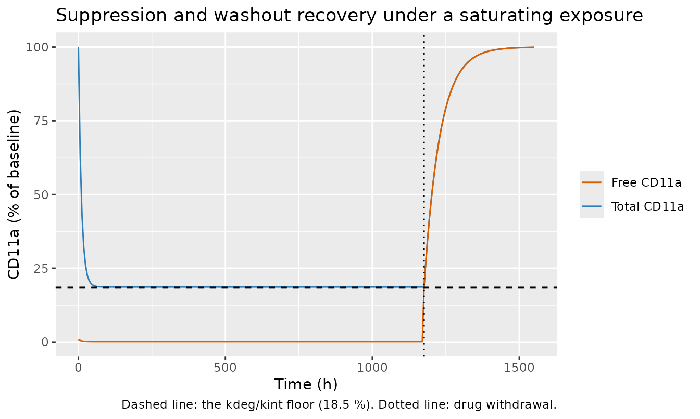
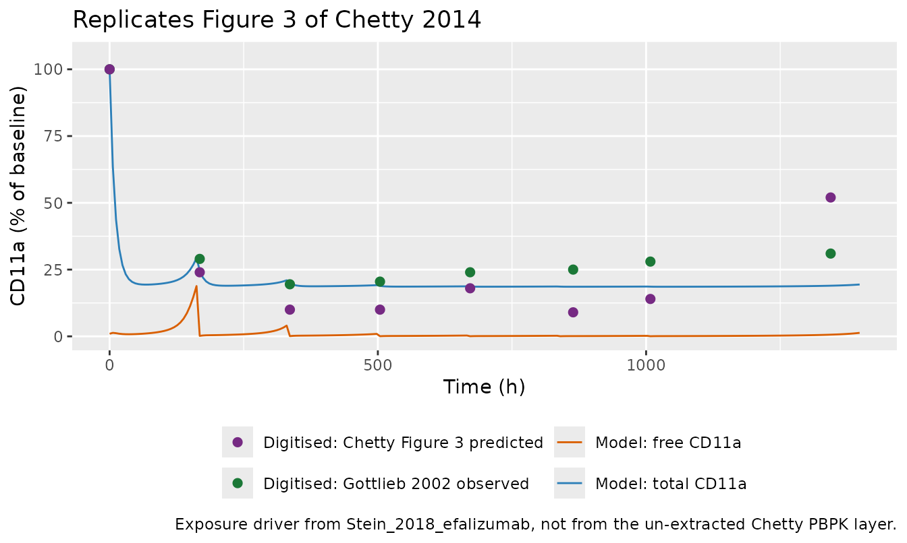
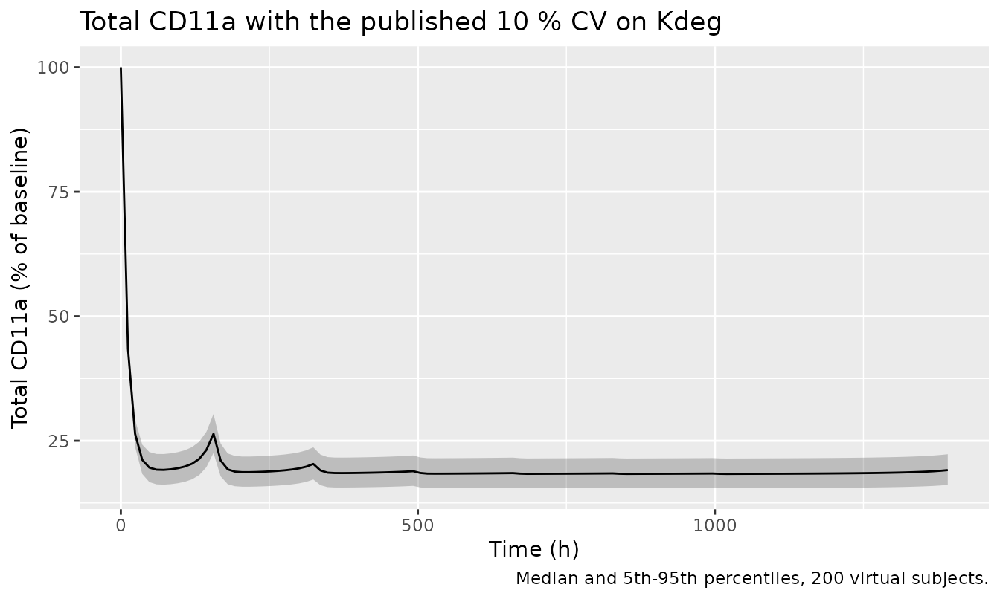
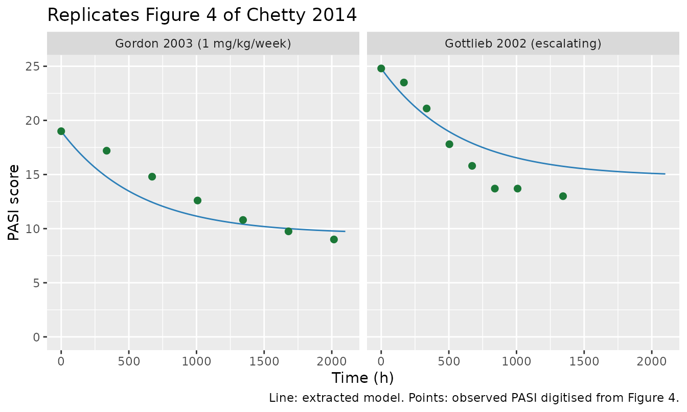
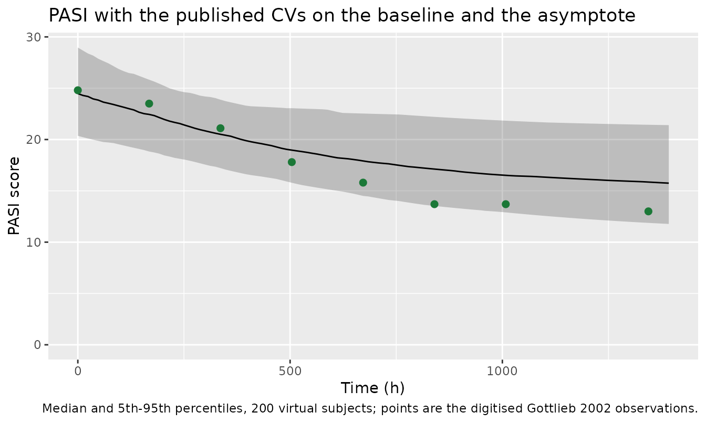

# Efalizumab CD11a target engagement and PASI response (Chetty 2014)

## Models and source

``` r

ui_cd11a <- rxode2::rxode(readModelDb("Chetty_2014_efalizumab_cd11a_qsp"))
ui_pasi  <- rxode2::rxode(readModelDb("Chetty_2014_efalizumab_pasi"))
```

- Citation: Chetty M, Li L, Rose R, Machavaram K, Jamei M,
  Rostami-Hodjegan A, Gardner I. (2015). Prediction of the
  pharmacokinetics, pharmacodynamics, and efficacy of a monoclonal
  antibody, using a physiologically based pharmacokinetic FcRn model.
  Front Immunol 5:670. <doi:10.3389/fimmu.2014.00670>. PMCID PMC4283607.
  Every parameter value is from main-text Table 1. The Michaelis-Menten
  / quasi-steady-state target equations are the form Chetty 2014
  attributes to its reference 23 (Gibiansky L, Gibiansky E, Kakkar T,
  Ma P. Approximations of the target-mediated drug disposition model and
  identifiability of model parameters. J Pharmacokinet Pharmacodyn
  2008;35:573-591), and the paper enumerates their ingredients
  explicitly in the Methods bullet list (kon binding, koff dissociation,
  kint complex internalisation, saturation of binding sites, Ksyn
  synthesis and Kdeg degradation of CD11a, with Km subsuming kon, koff
  and kint). Chetty 2014 has no supplementary material (EuropePMC
  reports hasSuppl = N) and no erratum; the only linked item is a later
  ‘Comment in’ (AAPS J 2016;18:948-59). The companion efficacy model
  from the same paper is modellib(‘Chetty_2014_efalizumab_pasi’).
- Article: <https://doi.org/10.3389/fimmu.2014.00670> (open access;
  PMCID PMC4283607)

Chetty 2014 built a three-layer model of efalizumab, a humanised
anti-CD11a monoclonal antibody once licensed for moderate-to-severe
plaque psoriasis:

1.  a whole-body **Mechanistic FcRn PBPK** disposition model in the
    Simcyp Simulator (Version 13 R1), which produces the efalizumab
    concentration-time profile;
2.  a **CD11a target-turnover and target-engagement** model, written in
    the Michaelis-Menten / quasi-steady-state approximation of
    target-mediated drug disposition of Gibiansky et al. 2008, which
    consumes that concentration and produces the free and total CD11a
    pools; and
3.  a **PASI disease-progression** model, a first-order asymptotic decay
    from the cohort baseline score to a treated steady-state asymptote.

Layers 2 and 3 are extracted here as two model files. Layer 1 is **not**
extracted; the next section says why.

``` r

tibble::tibble(
  Model = c("Chetty_2014_efalizumab_cd11a_qsp", "Chetty_2014_efalizumab_pasi"),
  Layer = c("CD11a target turnover + MM/QSS engagement", "PASI first-order asymptotic progression"),
  State = c("total_target (umol/L)", "pasi (0-72 score)"),
  `Paper figure` = c("Figure 3", "Figure 4")
) |>
  knitr::kable(caption = "The two model files this paper contributed.")
```

| Model | Layer | State | Paper figure |
|:---|:---|:---|:---|
| Chetty_2014_efalizumab_cd11a_qsp | CD11a target turnover + MM/QSS engagement | total_target (umol/L) | Figure 3 |
| Chetty_2014_efalizumab_pasi | PASI first-order asymptotic progression | pasi (0-72 score) | Figure 4 |

The two model files this paper contributed. {.table}

### What is not extracted, and why

The PK layer is a Simcyp platform port. Chetty 2014 Table 1 is the
complete efalizumab compound file, and it contains **no volume term of
any kind**: the only disposition parameter is a systemic clearance of
0.0227 L/h. Every quantity that would be needed to write the disposition
ODEs – per-tissue vascular, endothelial and interstitial volumes, plasma
and lymph flow rates, vascular and lymphatic reflection coefficients,
endothelial uptake and FcRn recycling rate constants, FcRn abundances,
and the endogenous IgG pool that competes for FcRn – is a Simcyp
database output that the paper does not publish. The Methods describe
the structure in prose and a schematic (Figure 1) and cite it to Li et
al. 2014 (the paper’s reference 22); no organ ODEs and no project file
are published. A reconstruction would therefore be sourced from a
software artifact rather than from the paper and could not be audited
against it.

The two PD layers have none of that problem: every constant they need is
printed in Table 1 or in the Methods and Results text. Following the
layer-split convention used by `Zhang_2026_ribociclib_qsp` and
`Liang_2024_osimertinib_qsp`, the efalizumab concentration is
externalised as the canonical time-varying covariate
`CP_EFALIZUMAB_UGML`, which the user supplies.

## Population

``` r

str(ui_cd11a$population)
#> List of 9
#>  $ species       : chr "human (in silico; Simcyp virtual north European Caucasian healthy volunteers, verified against published psoriasis cohorts)"
#>  $ n_subjects    : int 500
#>  $ n_studies     : int 4
#>  $ age_range     : chr "25-50 years (simulated cohort)"
#>  $ sex_female_pct: num 50
#>  $ disease_state : chr "Simulated in healthy volunteers; verified against clinical data from adults with moderate-to-severe plaque psoriasis"
#>  $ dose_range    : chr "Single intravenous doses of 1, 3 and 10 mg/kg (Bauer 1999, Chetty 2014 reference 12); multiple dosing escalatin"| __truncated__
#>  $ regions       : chr "north European Caucasian virtual population"
#>  $ notes         : chr "Chetty 2014 Simulations section: 'Predictive studies used 5 trials with 100 virtual north European Caucasian He"| __truncated__
```

Chetty 2014 simulated 5 trials of 100 virtual north European Caucasian
healthy volunteers each, aged 25 to 50 years, with an equal proportion
of males and females (Methods, “Simulations”). Predictions were verified
against four published clinical datasets in adults with
moderate-to-severe plaque psoriasis: Bauer 1999 (single intravenous
doses of 1, 3 and 10 mg/kg), Gottlieb 2000 and Gottlieb 2002 (an
escalating multiple-dose regimen of 0.3, 0.4 and 0.6 mg/kg in weeks 1 to
3 followed by 1 mg/kg/week for four weeks, each as a 1 h infusion), and
Ng 2005 (1 mg/kg/week).

The PASI cohorts are the two the efficacy model was applied to: Gottlieb
2002 (mean baseline PASI 24.8, CV 10.8 %, falling to approximately 14.8,
CV 22 %, over the last three consecutive weeks of assessment) and Gordon
2003 (mean baseline PASI 19, with the asymptote set to 9.5).

Note a citation slip in the source: the escalating-regimen study is
cited as reference 14 in the Methods and as reference 15 in the Results.
The Figure 3 legend keys the observed series to “Gottlieb 2002”, which
is reference 15 (Arch Dermatol 138:591-600), so reference 15 is the
escalating multiple-dose study and reference 14 (Gottlieb 2000, J Am
Acad Dermatol 42:428-435) is the single-dose study.

## Source trace

``` r

tibble::tribble(
  ~Parameter, ~Value, ~`Source location`,
  "`mw_efa`", "148841 g/mol", "Table 1, row 'MW: molecular weight of efalizumab' (paper's ref 19)",
  "`rbase` (CD11a)", "0.01 umol/L", "Table 1, row 'Rmax: CD11a abundance'; listed as 'Estimated'",
  "`kdeg`", "0.0185 1/h (CV 10 %)", "Table 1, row 'Kdeg: degradation rate of the target ie CD11a' (paper's ref 4)",
  "`kint`", "0.1 1/h", "Table 1, row 'Kint: internalization rate constant for the complex' (paper's ref 18); Table 1 prints 'l/h', corrected per the Figure 1 legend",
  "`km`", "0.000573 umol/L", "Table 1, row 'Km: rate constant for receptor complex internalization and degradation' (paper's ref 20); Table 1 calls it a rate constant but prints a concentration",
  "`ksyn` (derived)", "0.000185 umol/L/h", "Table 1, row 'Ksyn: rate of synthesis of target', defined there as Ksyn = Rmax * Kdeg",
  "d/dt(total_target)", "n/a", "Methods, 'PBPK MODEL TO CHARACTERIZE mAb PK AND TMDD' bullet list; MM/QSS form attributed to the paper's ref 23 (Gibiansky 2008)",
  "`rbase` (PASI)", "24.8 (CV 10.8 %)", "Methods, 'PBPK/PD MODEL TO SIMULATE mAb EFFICACY'; 19 for the Gordon cohort in the following paragraph",
  "Yss", "14.8 (CV 22 %)", "Methods, same paragraph; 9.5 for the Gordon cohort",
  "Tp", "397 h", "Results, 'PBPK LINKED PD MODEL'; the paper's only fitted parameter",
  "d/dt(pasi)", "n/a", "Methods, printed closed form Y(t) = Yss + (Y(0) - Yss) * exp(-ln(2)/Tp * t); form attributed to the paper's ref 24 (Holford 2006)"
) |>
  knitr::kable(caption = "Per-parameter source trace. All values are from Chetty 2014; the paper has no supplement (EuropePMC reports hasSuppl = N) and no erratum.")
```

| Parameter | Value | Source location |
|:---|:---|:---|
| `mw_efa` | 148841 g/mol | Table 1, row ‘MW: molecular weight of efalizumab’ (paper’s ref 19) |
| `rbase` (CD11a) | 0.01 umol/L | Table 1, row ‘Rmax: CD11a abundance’; listed as ‘Estimated’ |
| `kdeg` | 0.0185 1/h (CV 10 %) | Table 1, row ‘Kdeg: degradation rate of the target ie CD11a’ (paper’s ref 4) |
| `kint` | 0.1 1/h | Table 1, row ‘Kint: internalization rate constant for the complex’ (paper’s ref 18); Table 1 prints ‘l/h’, corrected per the Figure 1 legend |
| `km` | 0.000573 umol/L | Table 1, row ‘Km: rate constant for receptor complex internalization and degradation’ (paper’s ref 20); Table 1 calls it a rate constant but prints a concentration |
| `ksyn` (derived) | 0.000185 umol/L/h | Table 1, row ‘Ksyn: rate of synthesis of target’, defined there as Ksyn = Rmax \* Kdeg |
| d/dt(total_target) | n/a | Methods, ‘PBPK MODEL TO CHARACTERIZE mAb PK AND TMDD’ bullet list; MM/QSS form attributed to the paper’s ref 23 (Gibiansky 2008) |
| `rbase` (PASI) | 24.8 (CV 10.8 %) | Methods, ‘PBPK/PD MODEL TO SIMULATE mAb EFFICACY’; 19 for the Gordon cohort in the following paragraph |
| Yss | 14.8 (CV 22 %) | Methods, same paragraph; 9.5 for the Gordon cohort |
| Tp | 397 h | Results, ‘PBPK LINKED PD MODEL’; the paper’s only fitted parameter |
| d/dt(pasi) | n/a | Methods, printed closed form Y(t) = Yss + (Y(0) - Yss) \* exp(-ln(2)/Tp \* t); form attributed to the paper’s ref 24 (Holford 2006) |

Per-parameter source trace. All values are from Chetty 2014; the paper
has no supplement (EuropePMC reports hasSuppl = N) and no erratum.
{.table}

### Dimensional analysis

Mechanistic models mix concentrations and fractional rate constants, so
every term is checked explicitly.

``` r

tibble::tribble(
  ~Term, ~Units, ~Note,
  "`cefa = CP_EFALIZUMAB_UGML / mw_efa * 1000`", "(ug/mL) / (g/mol) * 1000 = umol/L", "1 ug/mL = 1 mg/L; dividing by g/mol gives mmol/L, so the factor 1000 lands on umol/L. Equivalently CP / 148.841.",
  "`foccCd11a = cefa / (km + cefa)`", "unitless", "Both terms umol/L.",
  "`boundCd11a`, `freeCd11a`", "umol/L", "Partition of the umol/L total pool.",
  "`ksyn = rbase * kdeg`", "umol/L * 1/h = umol/L/h", "Matches the printed 0.000185 umol/L/h exactly.",
  "`kdeg * freeCd11a`", "1/h * umol/L = umol/L/h", "Balances d/dt(total_target).",
  "`kint * boundCd11a`", "1/h * umol/L = umol/L/h", "Balances d/dt(total_target).",
  "`kout = ln(2) / Tp`", "1/h", "Tp in h.",
  "`kin = Yss * kout`", "score/h", "PASI is a unitless score, so kin carries score per hour.",
  "`kout * pasi`", "1/h * score = score/h", "Balances d/dt(pasi)."
) |>
  knitr::kable(caption = "Dimensional analysis of every ODE term.")
```

| Term | Units | Note |
|:---|:---|:---|
| `cefa = CP_EFALIZUMAB_UGML / mw_efa * 1000` | (ug/mL) / (g/mol) \* 1000 = umol/L | 1 ug/mL = 1 mg/L; dividing by g/mol gives mmol/L, so the factor 1000 lands on umol/L. Equivalently CP / 148.841. |
| `foccCd11a = cefa / (km + cefa)` | unitless | Both terms umol/L. |
| `boundCd11a`, `freeCd11a` | umol/L | Partition of the umol/L total pool. |
| `ksyn = rbase * kdeg` | umol/L \* 1/h = umol/L/h | Matches the printed 0.000185 umol/L/h exactly. |
| `kdeg * freeCd11a` | 1/h \* umol/L = umol/L/h | Balances d/dt(total_target). |
| `kint * boundCd11a` | 1/h \* umol/L = umol/L/h | Balances d/dt(total_target). |
| `kout = ln(2) / Tp` | 1/h | Tp in h. |
| `kin = Yss * kout` | score/h | PASI is a unitless score, so kin carries score per hour. |
| `kout * pasi` | 1/h \* score = score/h | Balances d/dt(pasi). |

Dimensional analysis of every ODE term. {.table}

Two unit slips in Table 1 are worth stating plainly, because both were
resolved against the paper’s own text rather than silently:

- `Kint` is printed as `0.1 l/h`. A rate constant multiplying a
  concentration cannot carry litres per hour; the Figure 1 legend gives
  the correct reading (“kint - internalization rate constant of
  complex”), so it is read as 0.1 1/h. This is the only unit correction
  applied anywhere in either file.
- `Km` is labelled a “rate constant” in Table 1 but printed in umol/L.
  The Methods define it correctly: “Km … is used in the MM model and
  incorporates kon, koff, and kint”, i.e. Km = (koff + kint) / kon, a
  concentration. Read as 0.000573 umol/L, consistent with efalizumab’s
  reported low-nanomolar CD11a affinity. No correction is needed, only
  the correct interpretation.

The Figure 1 legend also transposes the orders of `Ksyn` (“first-order
synthesis rate constant”) and `Kdeg` (“zero-order degradation rate”)
relative to Table 1, which prints Ksyn in umol/L/h (zero-order) and Kdeg
in 1/h (first-order). Table 1 is dimensionally self-consistent and is
taken as authoritative; the identity `Ksyn = Rmax * Kdeg` only balances
that way.

## Part 1: the CD11a target-engagement model

### Analytic properties used as gates

Under a constant driving concentration `C`, the quasi-steady-state
system has closed-form stationary points that share their parameters
with the ODE, so the agreement below is an exact algebraic identity and
is asserted tightly.

Writing `f = C / (Km + C)` for the occupied fraction, the stationary
total pool is `Rtot_ss = ksyn / (kdeg * (1 - f) + kint * f)` and the
free pool is `(1 - f) * Rtot_ss`. Substituting `ksyn = Rmax * kdeg`
gives the two forms used below:

- free CD11a as a fraction of baseline:
  `1 / (1 + (kint / (kdeg * Km)) * C)`
- total CD11a as a fraction of baseline:
  `kdeg * (Km + C) / (kdeg * Km + kint * C)`

The second has a **saturating floor**: as `C` grows far beyond `Km`, the
total pool tends to `kdeg / kint`, independent of concentration. With
the Table 1 values that floor is 18.5 % of baseline.

``` r

p_cd11a <- ui_cd11a$theta
km    <- exp(p_cd11a[["lkm"]])
kdeg  <- exp(p_cd11a[["lkdeg"]])
kint  <- exp(p_cd11a[["lkint"]])
rbase <- p_cd11a[["rbase"]]
mw    <- p_cd11a[["mw_efa"]]

# ug/mL -> umol/L, the conversion model() applies internally
to_um <- function(ugml) ugml / mw * 1000

pct_free_cf  <- function(ugml) 100 / (1 + kint * to_um(ugml) / (kdeg * km))
pct_total_cf <- function(ugml) {
  cu <- to_um(ugml)
  100 * kdeg * (km + cu) / (kdeg * km + kint * cu)
}

floor_total <- 100 * kdeg / kint
c(km_umol_L = km, kdeg_per_h = kdeg, kint_per_h = kint,
  rbase_umol_L = rbase, ksyn_umol_L_h = rbase * kdeg,
  total_floor_pct = floor_total)
#>       km_umol_L      kdeg_per_h      kint_per_h    rbase_umol_L   ksyn_umol_L_h 
#>        5.73e-04        1.85e-02        1.00e-01        1.00e-02        1.85e-04 
#> total_floor_pct 
#>        1.85e+01
```

`ksyn` derived as `rbase * kdeg` reproduces the printed Table 1 value of
0.000185 umol/L/h exactly.

``` r

stopifnot(isTRUE(all.equal(rbase * kdeg, 0.000185, tolerance = 1e-12)))
```

### Gate 1: drug-free baseline hold

With no drug the system must sit at `Rmax` forever.

``` r

tgrid <- seq(0, 2000, by = 10)
ev_hold <- data.frame(id = 1L, time = tgrid, evid = 0L, amt = NA_real_,
                      cmt = "total_target", CP_EFALIZUMAB_UGML = 0)
s_hold <- rxode2::rxSolve(rxode2::zeroRe(ui_cd11a), ev_hold,
                          returnType = "data.frame")
#> ℹ omega/sigma items treated as zero: 'etalkdeg'

stopifnot(
  max(abs(s_hold$total_target / rbase - 1)) < 1e-8,
  max(abs(s_hold$pctFreeCd11a - 100))       < 1e-6,
  max(abs(s_hold$pctTotalCd11a - 100))      < 1e-6
)
c(max_rel_drift = max(abs(s_hold$total_target / rbase - 1)))
#> max_rel_drift 
#>             0
```

### Gate 2: mass balance

`freeCd11a + boundCd11a` must equal `total_target` at every time, under
drug.

``` r

ev_mb <- data.frame(id = 1L, time = tgrid, evid = 0L, amt = NA_real_,
                    cmt = "total_target", CP_EFALIZUMAB_UGML = 5)
s_mb <- rxode2::rxSolve(rxode2::zeroRe(ui_cd11a), ev_mb,
                        returnType = "data.frame")
#> ℹ omega/sigma items treated as zero: 'etalkdeg'
stopifnot(max(abs(s_mb$sumCd11a - s_mb$total_target)) < 1e-12)
c(max_mass_balance_error = max(abs(s_mb$sumCd11a - s_mb$total_target)))
#> max_mass_balance_error 
#>                      0
```

### Gate 3: stationary points against the closed form

A concentration sweep spanning five orders of magnitude, solved to
stationarity and compared with the algebra above.

``` r

sweep_ugml <- c(0.001, 0.01, 0.1, 1, 10)
ev_sweep <- lapply(seq_along(sweep_ugml), function(i) {
  data.frame(id = i, time = seq(0, 4000, by = 20), evid = 0L, amt = NA_real_,
             cmt = "total_target", CP_EFALIZUMAB_UGML = sweep_ugml[i])
}) |> dplyr::bind_rows()

s_sweep <- rxode2::rxSolve(rxode2::zeroRe(ui_cd11a), ev_sweep,
                           returnType = "data.frame") |>
  dplyr::group_by(id) |>
  dplyr::slice_tail(n = 1) |>
  dplyr::ungroup()
#> ℹ omega/sigma items treated as zero: 'etalkdeg'
#> Warning: multi-subject simulation without without 'omega'

plateau <- tibble::tibble(
  `Efalizumab (ug/mL)`   = sweep_ugml,
  `Free, ODE (% base)`   = s_sweep$pctFreeCd11a,
  `Free, closed form`    = pct_free_cf(sweep_ugml),
  `Total, ODE (% base)`  = s_sweep$pctTotalCd11a,
  `Total, closed form`   = pct_total_cf(sweep_ugml)
)

stopifnot(
  max(abs(plateau$`Free, ODE (% base)`  / plateau$`Free, closed form`  - 1)) < 1e-5,
  max(abs(plateau$`Total, ODE (% base)` / plateau$`Total, closed form` - 1)) < 1e-5
)

knitr::kable(plateau, digits = 4,
             caption = "Stationary CD11a pools: ODE solve against the quasi-steady-state closed form. Both sides share their parameters, so this is an exact identity and is asserted to 1e-5.")
```

| Efalizumab (ug/mL) | Free, ODE (% base) | Free, closed form | Total, ODE (% base) | Total, closed form |
|---:|---:|---:|---:|---:|
| 1e-03 | 94.0398 | 94.0398 | 95.1424 | 95.1424 |
| 1e-02 | 61.2071 | 61.2071 | 68.3838 | 68.3838 |
| 1e-01 | 13.6277 | 13.6277 | 29.6066 | 29.6066 |
| 1e+00 | 1.5533 | 1.5533 | 19.7659 | 19.7659 |
| 1e+01 | 0.1575 | 0.1575 | 18.6284 | 18.6284 |

Stationary CD11a pools: ODE solve against the quasi-steady-state closed
form. Both sides share their parameters, so this is an exact identity
and is asserted to 1e-5. {.table}

### Gate 4: the saturating total-pool floor against the reported clinical plateau

Chetty 2014 Discussion states that clinical studies “have shown a
significant downregulation of CD11a concentrations (typically to about
25% of baseline)”, citing Ng 2005. The model’s saturating floor is
`kdeg / kint`, which is independent of the driving concentration once
that concentration is well above `Km` – so this comparison does not
depend on the accuracy of any exposure profile.

``` r

saturated <- pct_total_cf(100)   # 100 ug/mL is ~150000-fold above Km
stopifnot(
  abs(saturated - floor_total) / floor_total < 1e-3,
  saturated > 12, saturated < 32        # brackets the paper's stated ~25 %
)
c(model_floor_pct = floor_total, saturated_at_100ugml = saturated,
  paper_reported_pct = 25)
#>      model_floor_pct saturated_at_100ugml   paper_reported_pct 
#>             18.50000             18.51286             25.00000
```

### Gate 5: washout recovery

After the drug is removed the total pool must return to `Rmax`. The
relaxation rate constant of the drug-free system is `kdeg`, so ten of
its half-lives is ample.

``` r

t_stop <- 1176                                   # end of the 7-week regimen
t_rec  <- t_stop + 10 * log(2) / kdeg
grid_w <- sort(unique(c(seq(0, t_stop, by = 6), seq(t_stop, t_rec, by = 6), t_rec)))
ev_wash <- data.frame(
  id = 1L, time = grid_w, evid = 0L, amt = NA_real_, cmt = "total_target",
  CP_EFALIZUMAB_UGML = ifelse(grid_w < t_stop, 10, 0)
)
s_wash <- rxode2::rxSolve(rxode2::zeroRe(ui_cd11a), ev_wash,
                          returnType = "data.frame")
#> ℹ omega/sigma items treated as zero: 'etalkdeg'

nadir    <- min(s_wash$pctTotalCd11a)
recovery <- dplyr::last(s_wash$pctTotalCd11a)
stopifnot(
  abs(nadir - floor_total) / floor_total < 0.02,   # driven to its floor
  abs(recovery - 100) < 0.5                        # and fully back
)
c(nadir_pct = nadir, recovered_pct = recovery, recovery_time_h = t_rec)
#>       nadir_pct   recovered_pct recovery_time_h 
#>        18.62839        99.92054      1550.67415
```

``` r

ggplot(s_wash, aes(time)) +
  geom_line(aes(y = pctTotalCd11a, colour = "Total CD11a")) +
  geom_line(aes(y = pctFreeCd11a,  colour = "Free CD11a")) +
  geom_hline(yintercept = floor_total, linetype = "dashed") +
  geom_vline(xintercept = t_stop, linetype = "dotted") +
  scale_colour_manual(values = c("Total CD11a" = "#2c7fb8", "Free CD11a" = "#d95f02"),
                      name = NULL) +
  labs(x = "Time (h)", y = "CD11a (% of baseline)",
       title = "Suppression and washout recovery under a saturating exposure",
       caption = paste0("Dashed line: the kdeg/kint floor (", round(floor_total, 1),
                        " %). Dotted line: drug withdrawal."))
```



### Comparison against Chetty 2014 Figure 3

Chetty 2014 Figure 3 plots CD11a as a percentage of baseline over the
Gottlieb 2002 escalating regimen. Reproducing it needs an efalizumab
exposure profile, which the un-extracted PBPK layer supplied in the
paper. Here it is supplied instead by `Stein_2018_efalizumab`, an
in-registry two-compartment quasi-steady-state TMDD efalizumab PK model
(Stein and Peletier 2018, fitted to the Bauer 1999 data). Only its
**drug concentration** is used: its own target layer is not comparable,
because Stein and Peletier report ke(R) = ke(CR) = 4400 /day as
practically unidentifiable, giving a baseline target pool some 5000-fold
smaller than the Chetty 2014 `Rmax`.

``` r

ui_pk <- rxode2::rxode(readModelDb("Stein_2018_efalizumab"))

# Gottlieb 2002 escalating regimen; Stein 2018 uses days and nmol, with a
# 150 kDa antibody and a 70 kg subject (Stein and Peletier 2018 page 672).
dose_mgkg <- c(0.3, 0.4, 0.6, 1, 1, 1, 1)
tdose_h   <- (0:6) * 168
amt_nmol  <- dose_mgkg * 70 * 1e6 / 150000

ev_pk <- dplyr::bind_rows(
  data.frame(id = 1L, time = tdose_h / 24, evid = 1L, amt = amt_nmol, cmt = "central"),
  data.frame(id = 1L, time = seq(0, 1400, by = 6) / 24, evid = 0L,
             amt = NA_real_, cmt = "central")
) |> dplyr::arrange(time, dplyr::desc(evid))

# Stein 2018 reports total drug in nM; convert to ug/mL on the Chetty MW.
driver <- rxode2::rxSolve(ui_pk, ev_pk, returnType = "data.frame") |>
  dplyr::transmute(time_h = time * 24, cp_ugml = Cc * mw / 1e6)

stopifnot(nrow(driver) > 200, all(is.finite(driver$cp_ugml)),
          max(driver$cp_ugml) > 10, max(driver$cp_ugml) < 100)
range(driver$cp_ugml)
#> [1]  0.0472364 36.8949045
```

This driver runs roughly 1.5 to 2-fold above the profile Chetty 2014
predicts in its own Figure 2C (weekly peaks rising from about 5 to about
30 ug/mL, pre-dose troughs from about 0.5 to about 7 ug/mL). Both are
far above `Km`, which is what matters for the total pool.

``` r

ev_f3 <- data.frame(id = 1L, time = driver$time_h, evid = 0L, amt = NA_real_,
                    cmt = "total_target", CP_EFALIZUMAB_UGML = driver$cp_ugml)
s_f3 <- rxode2::rxSolve(rxode2::zeroRe(ui_cd11a), ev_f3,
                        returnType = "data.frame", covsInterpolation = "linear")
#> ℹ omega/sigma items treated as zero: 'etalkdeg'

# Digitised from Chetty 2014 Figure 3 (values read off the panel; no numeric
# annotations are printed, so these carry digitisation error of a few points).
fig3 <- tibble::tribble(
  ~time, ~observed_gottlieb, ~predicted_chetty,
      0,               100,                100,
    168,                29,                 24,
    336,              19.5,                 10,
    504,              20.5,                 10,
    672,                24,                 18,
    864,                25,                  9,
   1008,                28,                 14,
   1344,                31,                 52
)

fig3_cmp <- fig3 |>
  dplyr::left_join(
    s_f3 |> dplyr::select(time, model_total = pctTotalCd11a,
                          model_free = pctFreeCd11a),
    by = "time"
  )

fig3_cmp |>
  dplyr::rename(
    "Time (h)"                    = time,
    "Observed, Gottlieb 2002"     = observed_gottlieb,
    "Predicted, Chetty Figure 3"  = predicted_chetty,
    "This model, TOTAL CD11a"     = model_total,
    "This model, FREE CD11a"      = model_free
  ) |>
  knitr::kable(digits = 2,
               caption = "CD11a as a percentage of baseline. The two source columns are digitised from Chetty 2014 Figure 3 and carry a few percentage points of reading error; the model columns are driven by the Stein 2018 plasma profile above.")
```

| Time (h) | Observed, Gottlieb 2002 | Predicted, Chetty Figure 3 | This model, TOTAL CD11a | This model, FREE CD11a |
|---:|---:|---:|---:|---:|
| 0 | 100.0 | 100 | 100.00 | 0.97 |
| 168 | 29.0 | 24 | 24.69 | 0.18 |
| 336 | 19.5 | 10 | 19.99 | 0.10 |
| 504 | 20.5 | 10 | 18.92 | 0.05 |
| 672 | 24.0 | 18 | 18.67 | 0.05 |
| 864 | 25.0 | 9 | 18.58 | 0.10 |
| 1008 | 28.0 | 14 | 18.61 | 0.04 |
| 1344 | 31.0 | 52 | 18.96 | 0.63 |

CD11a as a percentage of baseline. The two source columns are digitised
from Chetty 2014 Figure 3 and carry a few percentage points of reading
error; the model columns are driven by the Stein 2018 plasma profile
above. {.table}

Two things follow, and they point in opposite directions.

**The total pool tracks the observed data well for the first three
weeks.** The model returns 24.7 % at 168 h against 29 % observed (and
against 24 % for Chetty’s own predicted series), 20.0 % against 19.5 %,
and 18.9 % against 20.5 %. That agreement is structural rather than
fitted: once the concentration is far above `Km`, the total pool sits on
its `kdeg / kint` floor whatever the exposure. From 672 h onward the
observed series drifts upward, to 31 % by 1344 h, while the model stays
pinned near 18.6 % – the total pool cannot rise while drug is present.

**The free pool is nowhere near Chetty’s predicted series.** Driven by a
plasma concentration, free CD11a falls to 0.04 to 1 % of baseline, one
to two orders of magnitude below the 9 to 24 % of Figure 3. This is
discussed under “Assumptions and deviations” below, together with the
driver concentration the Figure 3 values imply.

``` r

dplyr::bind_rows(
  s_f3 |> dplyr::transmute(time, value = pctTotalCd11a, series = "Model: total CD11a"),
  s_f3 |> dplyr::transmute(time, value = pctFreeCd11a,  series = "Model: free CD11a")
) |>
  ggplot(aes(time, value, colour = series)) +
  geom_line() +
  geom_point(
    data = fig3 |>
      tidyr::pivot_longer(-time, names_to = "series", values_to = "value") |>
      dplyr::mutate(series = dplyr::recode(series,
        observed_gottlieb = "Digitised: Gottlieb 2002 observed",
        predicted_chetty  = "Digitised: Chetty Figure 3 predicted")),
    aes(time, value, colour = series), inherit.aes = FALSE, size = 2
  ) +
  scale_y_continuous(limits = c(0, 105)) +
  scale_colour_manual(values = c(
    "Model: total CD11a" = "#2c7fb8", "Model: free CD11a" = "#d95f02",
    "Digitised: Gottlieb 2002 observed" = "#1b7837",
    "Digitised: Chetty Figure 3 predicted" = "#762a83"), name = NULL) +
  theme(legend.position = "bottom") +
  guides(colour = guide_legend(nrow = 2)) +
  labs(x = "Time (h)", y = "CD11a (% of baseline)",
       title = "Replicates Figure 3 of Chetty 2014",
       caption = "Exposure driver from Stein_2018_efalizumab, not from the un-extracted Chetty PBPK layer.")
```



### Between-subject variability

Chetty 2014 Table 1 attaches a CV to exactly two compound-file entries:
CLiv (30 %), which belongs to the un-extracted PBPK layer, and Kdeg (10
%), which belongs here.

``` r

rxode2::rxSetSeed(20140670)
set.seed(20140670)

n_sub  <- 200L
grid_c <- seq(0, 1400, by = 12)
ev_coh <- do.call(rbind, lapply(seq_len(n_sub), function(i) {
  data.frame(id = i, time = grid_c, evid = 0L, amt = NA_real_,
             cmt = "total_target",
             CP_EFALIZUMAB_UGML = approx(driver$time_h, driver$cp_ugml,
                                         xout = grid_c, rule = 2)$y)
}))

s_coh <- rxode2::rxSolve(ui_cd11a, ev_coh, returnType = "data.frame",
                         covsInterpolation = "linear")

kdeg_i <- s_coh |> dplyr::group_by(id) |> dplyr::summarise(kdeg = dplyr::first(kdeg))
cv_kdeg <- sd(kdeg_i$kdeg) / mean(kdeg_i$kdeg)

# The sampled CV is a cohort statistic, so the bound is wide enough to hold for
# any cohort rxode2 can draw. Realised 9.82 / 9.92 / 10.33 / 10.76 % at 1 / 2 /
# 4 / 16 solver threads; n = 200 gives a standard error near 0.5 points on a
# 10 % CV. The 5-18 % bracket still goes red on a mis-transcribed CV (the next
# plausible mis-readings, 1 % and 30 %, both break it).
stopifnot(cv_kdeg > 0.05, cv_kdeg < 0.18)
c(target_cv = 0.10, realised_cv = cv_kdeg)
#>   target_cv realised_cv 
#>  0.10000000  0.09915155
```

``` r

s_coh |>
  dplyr::group_by(time) |>
  dplyr::summarise(
    Q05 = quantile(pctTotalCd11a, 0.05),
    Q50 = quantile(pctTotalCd11a, 0.50),
    Q95 = quantile(pctTotalCd11a, 0.95),
    .groups = "drop"
  ) |>
  ggplot(aes(time, Q50)) +
  geom_ribbon(aes(ymin = Q05, ymax = Q95), alpha = 0.25) +
  geom_line() +
  labs(x = "Time (h)", y = "Total CD11a (% of baseline)",
       title = "Total CD11a with the published 10 % CV on Kdeg",
       caption = "Median and 5th-95th percentiles, 200 virtual subjects.")
```



The band is narrow because the on-treatment plateau
`kdeg / (kdeg + kint * f)` is dominated by `kint`, which the paper
reports without variability.

## Part 2: the PASI disease-progression model

Chetty 2014 prints the efficacy model as a closed form,

`Y(t) = Yss + (Y(0) - Yss) * exp(-ln(2) / Tp * t)`,

with `Y(0)` and `Yss` read off the clinical study being reproduced and
`Tp` the paper’s only fitted parameter, 397 h. The model file writes the
equivalent indirect-response balance `d(pasi)/dt = kin - kout * pasi`
with `kout = ln(2)/Tp` and `kin = Yss * kout`, using the canonical
turnover parameters; the first gate below confirms the two forms agree.

``` r

ui_pasi_gordon <- ui_pasi |>
  rxode2::ini(lrbase = log(19), lkin = log(9.5 * log(2) / 397))
#> ℹ change initial estimate of `lrbase` to `2.94443897916644`
#> ℹ change initial estimate of `lkin` to `-4.09915740266236`

tp_h  <- 397
grid_p <- seq(0, 2100, by = 6)
ev_p <- data.frame(id = 1L, time = grid_p, evid = 0L, amt = NA_real_, cmt = "pasi")

s_gott <- rxode2::rxSolve(rxode2::zeroRe(ui_pasi),        ev_p, returnType = "data.frame")
#> ℹ omega/sigma items treated as zero: 'etalrbase', 'etalkin'
s_gord <- rxode2::rxSolve(rxode2::zeroRe(ui_pasi_gordon), ev_p, returnType = "data.frame")
#> ℹ omega/sigma items treated as zero: 'etalrbase', 'etalkin'
```

### Gate 6: the ODE against the paper’s printed closed form

``` r

closed_form <- function(t, y0, yss) yss + (y0 - yss) * exp(-log(2) * t / tp_h)

err_gott <- max(abs(s_gott$pasi - closed_form(grid_p, 24.8, 14.8)) /
                  closed_form(grid_p, 24.8, 14.8))
err_gord <- max(abs(s_gord$pasi - closed_form(grid_p, 19.0,  9.5)) /
                  closed_form(grid_p, 19.0,  9.5))

stopifnot(err_gott < 1e-5, err_gord < 1e-5)
c(max_rel_error_gottlieb = err_gott, max_rel_error_gordon = err_gord)
#> max_rel_error_gottlieb   max_rel_error_gordon 
#>           1.136562e-07           1.413623e-07
```

### Gate 7: endpoints and the fitted progression half-life

`pasi(0)` must equal the published baseline, the asymptote must equal
the published `Yss`, and the time at which half the total drop has
occurred must equal the fitted `Tp` of 397 h. The Gordon cohort’s total
improvement must also reproduce the paper’s stated basis for choosing
its asymptote: “a 1 mg/kg/week given by iv infusion usually produces a
change in PASI score from baseline of about 45-50 %”.

``` r

half_time <- function(s, y0, yss) {
  target <- (y0 + yss) / 2
  approx(s$pasi, s$time, xout = target)$y
}

drop_pct <- function(y0, yss) 100 * (y0 - yss) / y0

stopifnot(
  abs(s_gott$pasi[1] - 24.8) < 1e-10,
  abs(s_gord$pasi[1] - 19.0) < 1e-10,
  abs(s_gott$pasiSs[1] - 14.8) < 1e-10,
  abs(s_gord$pasiSs[1] -  9.5) < 1e-10,
  abs(half_time(s_gott, 24.8, 14.8) - tp_h) < 1,
  abs(half_time(s_gord, 19.0,  9.5) - tp_h) < 1,
  drop_pct(19.0, 9.5) >= 44, drop_pct(19.0, 9.5) <= 51
)

tibble::tibble(
  Cohort            = c("Gottlieb 2002 (escalating)", "Gordon 2003 (1 mg/kg/week)"),
  `Y(0)`            = c(s_gott$pasi[1], s_gord$pasi[1]),
  `Yss`             = c(s_gott$pasiSs[1], s_gord$pasiSs[1]),
  `Total drop (%)`  = c(drop_pct(24.8, 14.8), drop_pct(19.0, 9.5)),
  `t to half drop (h)` = c(half_time(s_gott, 24.8, 14.8), half_time(s_gord, 19.0, 9.5))
) |>
  knitr::kable(digits = 3,
               caption = "PASI endpoints. The time to half the total drop recovers the fitted Tp of 397 h by construction; the Gordon total drop of 50.0 % reproduces the paper's stated 45-50 % basis for setting Yss = 9.5.")
```

| Cohort                     | Y(0) |  Yss | Total drop (%) | t to half drop (h) |
|:---------------------------|-----:|-----:|---------------:|-------------------:|
| Gottlieb 2002 (escalating) | 24.8 | 14.8 |         40.323 |            397.004 |
| Gordon 2003 (1 mg/kg/week) | 19.0 |  9.5 |         50.000 |            397.004 |

PASI endpoints. The time to half the total drop recovers the fitted Tp
of 397 h by construction; the Gordon total drop of 50.0 % reproduces the
paper’s stated 45-50 % basis for setting Yss = 9.5. {.table
style="width:100%;"}

### Comparison against Chetty 2014 Figure 4

``` r

# Digitised from Chetty 2014 Figure 4 (observed squares, upper panel; observed
# circles, lower panel). Assessment times are the nominal weekly / two-weekly
# schedules of the two studies. Digitisation error of roughly +/- 0.5 PASI
# units should be assumed.
fig4_gott <- tibble::tibble(
  time     = c(0, 168, 336, 504, 672, 840, 1008, 1344),
  observed = c(24.8, 23.5, 21.1, 17.8, 15.8, 13.7, 13.7, 13.0)
)
fig4_gord <- tibble::tibble(
  time     = c(0, 336, 672, 1008, 1344, 1680, 2016),
  observed = c(19.0, 17.2, 14.8, 12.6, 10.8, 9.75, 9.0)
)

cmp4 <- dplyr::bind_rows(
  fig4_gott |> dplyr::mutate(cohort = "Gottlieb 2002 (escalating)",
                             model = closed_form(time, 24.8, 14.8)),
  fig4_gord |> dplyr::mutate(cohort = "Gordon 2003 (1 mg/kg/week)",
                             model = closed_form(time, 19.0, 9.5))
) |>
  dplyr::mutate(pct_diff = 100 * (model - observed) / observed)

cmp4 |>
  dplyr::rename("Cohort" = cohort, "Time (h)" = time,
                "Observed PASI (digitised)" = observed,
                "Model PASI" = model, "Difference (%)" = pct_diff) |>
  dplyr::relocate(Cohort) |>
  knitr::kable(digits = 2,
               caption = "Extracted PASI model against the observed points of Chetty 2014 Figure 4. Not used as a pass/fail gate: the observed values are digitised, and the systematic tail bias is a real property of the printed equation (see below).")
```

| Cohort | Time (h) | Observed PASI (digitised) | Model PASI | Difference (%) |
|:---|---:|---:|---:|---:|
| Gottlieb 2002 (escalating) | 0 | 24.80 | 24.80 | 0.00 |
| Gottlieb 2002 (escalating) | 168 | 23.50 | 22.26 | -5.29 |
| Gottlieb 2002 (escalating) | 336 | 21.10 | 20.36 | -3.50 |
| Gottlieb 2002 (escalating) | 504 | 17.80 | 18.95 | 6.45 |
| Gottlieb 2002 (escalating) | 672 | 15.80 | 17.89 | 13.25 |
| Gottlieb 2002 (escalating) | 840 | 13.70 | 17.11 | 24.87 |
| Gottlieb 2002 (escalating) | 1008 | 13.70 | 16.52 | 20.59 |
| Gottlieb 2002 (escalating) | 1344 | 13.00 | 15.76 | 21.21 |
| Gordon 2003 (1 mg/kg/week) | 0 | 19.00 | 19.00 | 0.00 |
| Gordon 2003 (1 mg/kg/week) | 336 | 17.20 | 14.78 | -14.05 |
| Gordon 2003 (1 mg/kg/week) | 672 | 14.80 | 12.44 | -15.95 |
| Gordon 2003 (1 mg/kg/week) | 1008 | 12.60 | 11.13 | -11.63 |
| Gordon 2003 (1 mg/kg/week) | 1344 | 10.80 | 10.41 | -3.62 |
| Gordon 2003 (1 mg/kg/week) | 1680 | 9.75 | 10.01 | 2.62 |
| Gordon 2003 (1 mg/kg/week) | 2016 | 9.00 | 9.78 | 8.68 |

Extracted PASI model against the observed points of Chetty 2014 Figure
4. Not used as a pass/fail gate: the observed values are digitised, and
the systematic tail bias is a real property of the printed equation (see
below). {.table}

``` r

sim4 <- dplyr::bind_rows(
  s_gott |> dplyr::transmute(time, pasi, cohort = "Gottlieb 2002 (escalating)"),
  s_gord |> dplyr::transmute(time, pasi, cohort = "Gordon 2003 (1 mg/kg/week)")
)

ggplot(sim4, aes(time, pasi)) +
  geom_line(colour = "#2c7fb8") +
  geom_point(data = dplyr::bind_rows(
    fig4_gott |> dplyr::mutate(cohort = "Gottlieb 2002 (escalating)"),
    fig4_gord |> dplyr::mutate(cohort = "Gordon 2003 (1 mg/kg/week)")
  ), aes(time, observed), size = 2, colour = "#1b7837") +
  facet_wrap(~cohort) +
  expand_limits(y = 0) +
  labs(x = "Time (h)", y = "PASI score",
       title = "Replicates Figure 4 of Chetty 2014",
       caption = "Line: extracted model. Points: observed PASI digitised from Figure 4.")
```



The model reproduces the observed decline closely over the first three
weeks in both cohorts and then sits systematically above the observed
points, by up to about 25 % in the Gottlieb cohort and about 15 % in the
Gordon cohort. That bias is inherent to the printed equation: over the
1176 h treatment period, which is only three progression half-lives, an
exponential retains 12.5 % of the initial gap, so the model cannot reach
`Yss` within the observation window. See below.

### Between-subject variability

Chetty 2014 reports a CV alongside each cohort input it took from
Gottlieb 2002: 10.8 % on the baseline score and 22 % on the asymptote.
Because `kout` is fixed, the variance placed on `kin` transfers
unchanged to `Yss = kin / kout`.

``` r

rxode2::rxSetSeed(20140670)
set.seed(20140670)

ev_pcoh <- do.call(rbind, lapply(seq_len(200L), function(i) {
  data.frame(id = i, time = seq(0, 1400, by = 12), evid = 0L,
             amt = NA_real_, cmt = "pasi")
}))
s_pcoh <- rxode2::rxSolve(ui_pasi, ev_pcoh, returnType = "data.frame")

per_sub <- s_pcoh |>
  dplyr::group_by(id) |>
  dplyr::summarise(base = dplyr::first(pasi), yss = dplyr::first(pasiSs),
                   .groups = "drop")
cv_base <- sd(per_sub$base) / mean(per_sub$base)
cv_yss  <- sd(per_sub$yss)  / mean(per_sub$yss)

# Cohort statistics: bounds are wide enough to hold for any cohort rxode2 can
# draw at n = 200 (standard error near 0.5 and 1.1 points respectively).
# Realised baseline CV 10.61 / 10.70 / 11.15 / 11.63 % and asymptote CV
# 22.23 / 22.15 / 22.32 / 23.10 % at 1 / 2 / 4 / 16 solver threads. Both
# brackets still go red on a mis-transcribed CV.
stopifnot(cv_base > 0.06, cv_base < 0.18,
          cv_yss  > 0.12, cv_yss  < 0.35)
c(target_cv_baseline = 0.108, realised_cv_baseline = cv_base,
  target_cv_yss = 0.22, realised_cv_yss = cv_yss)
#>   target_cv_baseline realised_cv_baseline        target_cv_yss 
#>            0.1080000            0.1070351            0.2200000 
#>      realised_cv_yss 
#>            0.2215072
```

``` r

s_pcoh |>
  dplyr::group_by(time) |>
  dplyr::summarise(
    Q05 = quantile(pasi, 0.05), Q50 = quantile(pasi, 0.50),
    Q95 = quantile(pasi, 0.95), .groups = "drop"
  ) |>
  ggplot(aes(time, Q50)) +
  geom_ribbon(aes(ymin = Q05, ymax = Q95), alpha = 0.25) +
  geom_line() +
  geom_point(data = fig4_gott, aes(time, observed), colour = "#1b7837", size = 2) +
  expand_limits(y = 0) +
  labs(x = "Time (h)", y = "PASI score",
       title = "PASI with the published CVs on the baseline and the asymptote",
       caption = "Median and 5th-95th percentiles, 200 virtual subjects; points are the digitised Gottlieb 2002 observations.")
```



## Assumptions and deviations

**The PBPK layer is not extracted.** Chetty 2014 Table 1 publishes no
volume term of any kind; the Mechanistic FcRn structure and all of its
physiology are Simcyp database outputs. Consequently this vignette
cannot reproduce Figure 2 (concentration-time profiles) or Table 2
(predicted versus observed clearance), and the exposure driver used for
the Figure 3 comparison comes from `Stein_2018_efalizumab`, a different
publication, not from Chetty’s own PBPK model. Its profile runs roughly
1.5 to 2-fold above Chetty’s Figure 2C.

**The two extracted layers are not coupled, because the coupling
constant is unpublished.** Chetty 2014 Methods states that the PASI
baseline `Y(0)` is “modulated in proportion to concentration of bound
CD11a”, and the Discussion repeats that “efalizumab modulates the
baseline PASI score, i.e., Y(0)”. No proportionality constant,
functional form or linking equation is given anywhere in the paper, and
the paper itself supplies both `Y(0)` and `Yss` as inputs read off the
clinical study being reproduced – for the Gordon cohort it sets
`Yss = 9.5` from the prior expectation that “a 1 mg/kg/week given by iv
infusion usually produces a change in PASI score from baseline of about
45-50 %”, not from any simulated CD11a trajectory. The PASI model is
therefore packaged as an on-treatment time course whose magnitude of
benefit is a user input, which is exactly how the paper applied it.
Nothing has been invented to bridge the two.

**Which matrix drives CD11a binding is not stated, and it matters
enormously for the free pool.** Driven by a plasma concentration, this
model predicts free CD11a at 0.04 to 1 % of baseline over the escalating
regimen, against the 9 to 24 % of Chetty’s Figure 3. The discrepancy is
not a transcription error: the free-pool relation
`1 / (1 + (kint / (kdeg * Km)) * C)` falls to half at
`C = kdeg * Km / kint`, which with the Table 1 values is 0.016 ug/mL –
three orders of magnitude below therapeutic plasma concentrations.
Inverting the relation on the Figure 3 values gives the driver those
values imply:

``` r

backsolve_ugml <- function(pct) (kdeg * km / kint) * (100 / pct - 1) * mw / 1000

tibble::tibble(
  `Chetty Figure 3 predicted free CD11a (%)` = c(24, 18, 14, 10, 9),
  `Implied driver (ug/mL)` = backsolve_ugml(c(24, 18, 14, 10, 9))
) |>
  knitr::kable(digits = 4,
               caption = "Efalizumab concentration implied by each of Chetty's own Figure 3 predicted free-CD11a values, obtained by inverting the closed form. Compare with the 0.5 to 30 ug/mL plasma range of the paper's Figure 2C.")
```

| Chetty Figure 3 predicted free CD11a (%) | Implied driver (ug/mL) |
|-----------------------------------------:|-----------------------:|
|                                       24 |                 0.0500 |
|                                       18 |                 0.0719 |
|                                       14 |                 0.0969 |
|                                       10 |                 0.1420 |
|                                        9 |                 0.1595 |

Efalizumab concentration implied by each of Chetty’s own Figure 3
predicted free-CD11a values, obtained by inverting the closed form.
Compare with the 0.5 to 30 ug/mL plasma range of the paper’s Figure 2C.
{.table}

Those implied concentrations, 0.05 to 0.16 ug/mL, are one to two orders
of magnitude below the plasma profile of the paper’s own Figure 2C. The
most likely explanation is that the Simcyp implementation drove target
binding from a tissue interstitial concentration rather than from
plasma: Chetty 2014’s Introduction notes exactly this capability, that
“input to the PD model can be done from a tissue interstitial
compartment and not just from plasma, which is important when modeling
membrane bound receptors”. That interstitial concentration is an
internal output of the un-extracted PBPK layer, so it cannot be
reconstructed here. Users must decide which matrix their
`CP_EFALIZUMAB_UGML` trajectory represents; the total pool, which
saturates at `kdeg / kint` for any driver well above `Km`, is largely
insensitive to that decision, while the free pool is not.

**Chetty’s Figure 3 predicted series is not reproducible as either
pool.** It is non-monotone (24, 10, 10, 18, 9, 14 % at successive
assessments while drug is present and accumulating) and five of its
seven on-treatment points fall below 18.5 %, the total-pool floor
implied by the paper’s own Table 1. No concentration trajectory can
drive the total pool below that floor, and no single trajectory produces
that ordering in the free pool either. The digitisation carries a few
percentage points of error, which does not account for the pattern. The
model’s total pool does track the Gottlieb 2002 observed series well
over the first three weeks (24.7 versus 29 %, 20.0 versus 19.5 %, 18.9
versus 20.5 %) before the observed series drifts upward and the model
stays on its floor.

**The printed PASI equation and the paper’s own Figure 4 curves disagree
in the tail.** The Figure 4 predicted curves fall *below* their stated
asymptotes late in the time course, reaching about 13.9 against `Yss` =
14.8 in the Gottlieb panel and about 8.7 against `Yss` = 9.5 in the
Gordon panel, and they step discontinuously *upward* at the weekly dose
escalations of the Gottlieb regimen. A first-order approach to a fixed
asymptote can do neither: it is monotone and cannot overshoot. Both
features are consistent with the unquantified CD11a-to-`Y(0)` modulation
being active in the Simcyp implementation but absent from the printed
equation. The printed equation tracks the paper’s own predicted curves
to within about 5 % over the first 1000 h and drifts to roughly 12 to 14
% by the end of follow-up.

**No residual error is encoded.** Chetty 2014 is a simulation study and
reports no residual-error model or assay variability for either CD11a or
PASI, so `propSd_total_target` and `propSd_pasi` are `fixed(0)` rather
than invented.

**Unit corrections and interpretations.** `Kint` is printed in Table 1
as `0.1 l/h` and is read as 0.1 1/h per the Figure 1 legend; this is the
only value in either file whose units were corrected. `Km` is labelled a
“rate constant” in Table 1 but printed and used as a concentration, per
the Methods definition. `Ksyn` and `Kdeg` have their orders transposed
between Table 1 and the Figure 1 legend; Table 1 is dimensionally
self-consistent and is taken as authoritative. See the
dimensional-analysis section above.

**Distributional assumptions for the published CVs.** Chetty 2014
reports a CV % for `Kdeg` (10 %), the PASI baseline (10.8 %) and the
PASI asymptote (22 %), but does not state which distribution family the
Simcyp compound file and PD model sampled from. All three are encoded as
log-normal with `omega^2 = log(1 + CV^2)`, the library convention for a
reported CV on a strictly positive quantity. No CV is published for
`Kint`, `Km`, `Rmax` or `Tp`, so those carry no variability – consistent
with the Discussion’s own caveat that disease-progression variability
“could not be accurately assessed”.

**No NCA validation.** Both extracted layers are mechanistic PD models
with no dosing events and no concentration output, so PKNCA is not the
appropriate check; the closed-form, mass-balance, steady-state and
washout gates above replace it, per the endogenous-model validation
pattern. The only NCA-style quantity the paper reports, the clearance
table (Table 2), belongs to the un-extracted PBPK layer.

**Digitised values.** The Figure 3 and Figure 4 comparison points in
this vignette were read off the published panels; neither figure prints
numeric annotations. They are used for display and for the deviation
discussion only, never as the source of a parameter value and never as a
pass/fail gate. Every
[`stopifnot()`](https://rdrr.io/r/base/stopifnot.html) above is anchored
either on a closed-form identity that shares its parameters with the
model or on a value the paper prints in text.
