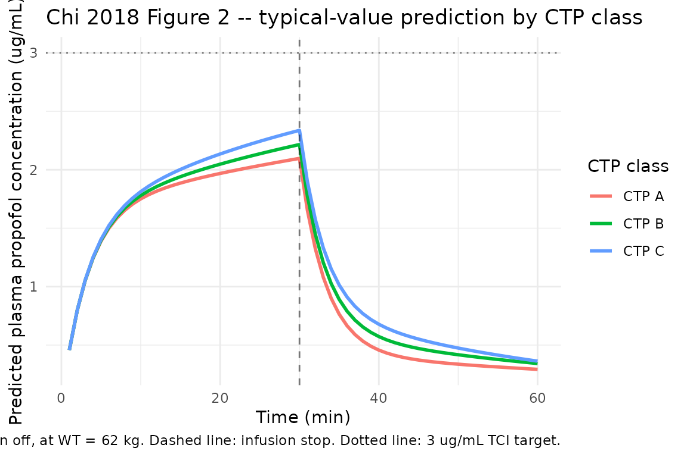

# Propofol (Chi 2018)

## Model and source

- Citation: Chi X, Pan J, Cai J, Luo G, Li S, Yuan D, Rui J, Chen W,
  Hei Z. Pharmacokinetic Analysis of Propofol Target-Controlled Infusion
  Models in Chinese Patients with Hepatic Insufficiency. *Med Sci
  Monit.* 2018;24:6925-6933.
- Article: <https://doi.org/10.12659/MSM.910103>

Chi et al. ran a single-centre prospective observational study at the
Third Affiliated Hospital of Sun Yat-sen University (Guangzhou, China;
ChiCTR-OCH-12002255) in 32 Chinese adults undergoing elective liver
transplantation. Patients were stratified by their preoperative
Child-Turcotte-Pugh (CTP) score into Class A (n = 11), B (n = 10), and C
(n = 11) and induced with propofol via a Diprifusor
target-controlled-infusion (TCI) pump (Marsh parameters) set to a 3
ug/mL plasma target for 30 minutes, followed by 30 minutes of washout
sampling. The published TCI-performance analysis showed that the
Marsh-parameter Diprifusor system was clinically acceptable in CTP A
patients (MDPE 8.0%, MDAPE 23.3%) but accumulated substantial overshoot
in CTP B and C (MDPE 21.8% and 45.5%; MDAPE 33.2% and 50.7%). Alongside
this, the authors fitted a 2-compartment population PK model to the
32-subject cohort using NONMEM Version V with Wings for NONMEM bootstrap
and reported the six final-model THETAs in the text (page 6930):

> CL = `theta_CL` + BW \* `theta_BW` V1 = `theta_V1` Q = `theta_Q` V2 =
> `theta_V2` \* (CTP / 5)^`theta_CTP`

with `theta_CL = 0.737 L/min`, `theta_V1 = 9.94 L`,
`theta_Q = 1.2 L/min`, `theta_V2 = 52.9 L`,
`theta_BW = 0.0163 L/min/kg`, and `theta_CTP = -0.848`. These are the
values packaged in `modellib("Chi_2018_propofol")`.

The paper does NOT report any OMEGA (IIV) or SIGMA (residual error)
values, no goodness-of-fit / VPC plots, and no individual parameter
estimates. Per operator decision (extraction-task sidecar
320-chi_2018_medical_science_monitor request-002, q1 = C) the packaged
model fixes every eta to zero and includes no residual-error term; it is
a deterministic typical-value forward predictor. See the [Assumptions
and deviations](#assumptions-and-deviations) section for the full
provenance discussion and pointers to companion-paper extractions that
DO report a full OMEGA / SIGMA structure for propofol in a Chinese
cohort.

## Population

The fit cohort is 32 Chinese adults (5 women, 27 men) with hepatic
insufficiency scheduled for elective liver transplantation between May
2014 and March 2016. Age 18-65 years (group means 43.7 +/- 7.4, 48.3 +/-
8.5, 46.4 +/- 8.7 across CTP A / B / C). Body weights 58.6 +/- 11.2 kg
(CTP A), 66.1 +/- 16.4 kg (CTP B), 63.1 +/- 8.4 kg (CTP C) per Table 1.
Underlying liver disease: cirrhosis in 18 of 32 (56%); hepatic carcinoma
in 14 of 32 (44%). ASA II-IV. Demographics were comparable across CTP
groups (all P \> 0.05). The packaged metadata
(`readModelDb("Chi_2018_propofol")$population`) carries the per-group
means and pooled cohort summary.

## Source trace

The per-parameter origin is also recorded as an in-file comment next to
each `ini()` entry in `inst/modeldb/specificDrugs/Chi_2018_propofol.R`.
The table below collects them in one place for review.

| Equation / parameter | Value | Source location |
|----|----|----|
| Two-compartment IV linear model | n/a | Chi 2018 Methods, Pharmacokinetics (page 6929) |
| Additive WT effect on CL | structural form | Chi 2018 page 6930 final regression equation |
| Power CTP effect on V2 at CTP=5 | structural form | Chi 2018 page 6930 final regression equation |
| `lcl = log(0.737)` (theta_CL) | 0.737 L/min | Chi 2018 page 6930 prose listing |
| `e_wt_cl` (theta_BW) | 0.0163 L/min/kg | Chi 2018 page 6930 prose listing |
| `lvc = log(9.94)` (theta_V1) | 9.94 L | Chi 2018 page 6930 prose listing |
| `lq = log(1.2)` (theta_Q) | 1.2 L/min | Chi 2018 page 6930 prose listing |
| `lvp = log(52.9)` (theta_V2) | 52.9 L | Chi 2018 page 6930 prose listing |
| `e_ctp_score_vp` (theta_CTP) | -0.848 | Chi 2018 page 6930 prose listing |
| OMEGA (all etas) | NOT REPORTED | \- |
| SIGMA (residual error) | NOT REPORTED | \- |
| GOF / VPC / individual estimates | NOT REPORTED | \- |
| Cohort demographics | \- | Chi 2018 Table 1 (page 6928) |
| TCI MDPE / MDAPE / wobble / divergence | \- | Chi 2018 Figure 4 (page 6930) |
| Linear regression Cm vs Cp by class | per-class slopes | Chi 2018 Results, “Propofol plasma concentration…” (page 6928) |

## Virtual cohort

The packaged model has no IIV and no residual error – the typical-value
forward prediction is the deliverable. The simulation below dosed one
representative typical patient per CTP class (Class A, B, C) at the
cohort-mean body weight 62 kg (the weighted mean of the three group
means in Table 1) with a constant-rate IV infusion at the model-derived
rate that targets a 3 ug/mL steady-state plasma propofol concentration.
The 30-minute-infusion + 30-minute-washout protocol matches Chi 2018
Methods (Anesthesia and Blood sampling).

``` r

mean_wt <- 62               # kg; weighted cohort mean across the three CTP groups

# Representative CTP scores for each class: Class A = 5 (lower bound),
# Class B = 8 (midpoint of 7-9), Class C = 12 (midpoint of 10-15 in the
# cohort range observed up to 14).
class_table <- tibble::tribble(
  ~cohort,  ~ctp_score,
  "CTP A",  5,
  "CTP B",  8,
  "CTP C", 12
)

# Model-derived typical CL at this WT (additive linear in BW, CTP-independent
# per Chi 2018 final equation): CL = 0.737 + 0.0163 * 62 = 1.7476 L/min.
cl_typ_lmin <- 0.737 + 0.0163 * mean_wt

# Maintenance infusion rate to achieve steady-state Cp ~ 3 ug/mL:
# rate (mg/min) = CL (L/min) * Cp_target (mg/L) = 1.7476 * 3 = 5.243 mg/min.
# Convert to mg/h for the rxode2 rate column (rate in dose-units per
# model-time-unit; here dose mg and time minute, so rate is mg/min).
maint_rate_mg_min <- cl_typ_lmin * 3   # mg/min

# 30-minute constant infusion, followed by 30-minute washout. The Chi 2018
# sampling grid (1, 2, 5, 10, 20, 30 min during, then 1, 2, 5, 10, 20, 30
# min after stop) is included in the observation grid plus dense
# intervening times for smooth plotting.
obs_times <- sort(unique(c(
  seq(0, 60, by = 1),
  c(1, 2, 5, 10, 20, 30),           # paper's during-infusion grid
  30 + c(1, 2, 5, 10, 20, 30)       # paper's post-discontinuation grid
)))

make_cohort <- function(i, ctp_score, cohort_label) {
  # Total dose delivered = rate * 30 min; rate is in mg/min so amt is the
  # cumulative bolus equivalent; we use the rate column instead so rxode2
  # treats it as a zero-order infusion. Stop after 30 minutes.
  amt_total <- maint_rate_mg_min * 30   # mg over the 30-min infusion
  dose_row <- tibble::tibble(
    id   = i,
    time = 0,
    cmt  = "central",
    evid = 1L,
    amt  = amt_total,
    rate = maint_rate_mg_min,         # mg/min
    WT   = mean_wt,
    CTP_SCORE = ctp_score,
    cohort = cohort_label
  )
  obs_rows <- tibble::tibble(
    id   = i,
    time = obs_times,
    cmt  = NA_character_,
    evid = 0L,
    amt  = 0,
    rate = 0,
    WT   = mean_wt,
    CTP_SCORE = ctp_score,
    cohort = cohort_label
  )
  dplyr::bind_rows(dose_row, obs_rows)
}

events <- dplyr::bind_rows(
  make_cohort(1L, class_table$ctp_score[1], class_table$cohort[1]),
  make_cohort(2L, class_table$ctp_score[2], class_table$cohort[2]),
  make_cohort(3L, class_table$ctp_score[3], class_table$cohort[3])
)
stopifnot(!anyDuplicated(unique(events[, c("id", "time", "evid")])))
```

## Simulation

``` r

mod <- readModelDb("Chi_2018_propofol")
sim <- rxode2::rxSolve(
  rxode2::rxode2(mod),
  events = events,
  keep   = c("cohort", "WT", "CTP_SCORE")
) |>
  as.data.frame()
#> ℹ omega/sigma items treated as zero: 'etalcl', 'etalvc', 'etalq', 'etalvp'
```

## Replicate Figure 2 – predicted Cc by CTP class

Chi 2018 Figure 2 plots the measured propofol concentration `Cm` for the
three CTP groups across the 60-minute observation period (the first 30
minutes are during TCI to a 3 ug/mL plasma target; the next 30 minutes
are after discontinuation). The packaged model is a population-PK fit to
those same observations under the additive-CL / power-V2 covariate
structure described above; the panel below shows the deterministic
typical-value predictions at the cohort-mean body weight 62 kg, one
representative CTP score per class.

The packaged structural model captures the qualitative pattern shown in
the published figure: Class A converges to the 3 ug/mL target during
infusion and decays after stop, while Class C retains higher
concentrations during the post-infusion phase because its peripheral
volume V2 is smaller (V2 = 52.9 \* (12/5)^(-0.848) = 24.4 L vs Class A’s
52.9 L), leading to slower redistribution. The packaged model cannot
reproduce the *measured* Cm overshoot pattern in Figure 2 because that
pattern reflects the mismatch between the Marsh-parameter Diprifusor TCI
algorithm (which sets dose rates from a population-typical
Caucasian-cohort PK model) and the Chinese hepatic-impairment cohort’s
actual PK – whereas the packaged model is the post-hoc PK fit to the
latter cohort itself.

``` r

sim |>
  dplyr::filter(time > 0) |>
  ggplot2::ggplot(ggplot2::aes(time, Cc, colour = cohort)) +
  ggplot2::geom_line(linewidth = 1) +
  ggplot2::geom_vline(xintercept = 30, linetype = "dashed", alpha = 0.5) +
  ggplot2::geom_hline(yintercept = 3, linetype = "dotted", alpha = 0.5) +
  ggplot2::labs(
    x = "Time (min)",
    y = "Predicted plasma propofol concentration (ug/mL)",
    colour = "CTP class",
    title = "Chi 2018 Figure 2 -- typical-value prediction by CTP class",
    caption = "Constant-rate IV infusion at the model-derived maintenance rate (5.24 mg/min) for 30 min then off, at WT = 62 kg. Dashed line: infusion stop. Dotted line: 3 ug/mL TCI target."
  ) +
  ggplot2::theme_minimal()
```



## Replicate Figure 4 – typical CL by CTP class

Chi 2018 Figure 4 reports the TCI performance summary across CTP A / B /
C (MDPE, MDAPE, wobble, divergence). The packaged model does not include
the Marsh-vs-Chi TCI controller and so cannot reproduce these
system-performance metrics directly. What it CAN show is the underlying
typical-value disposition parameters across the three classes, which is
what drives the published TCI-performance differences.

``` r

cmp_table <- class_table |>
  dplyr::mutate(
    `Typical CL (L/min)` = round(0.737 + 0.0163 * mean_wt, 3),
    `Typical V1 (L)`     = round(9.94, 3),
    `Typical Q  (L/min)` = round(1.2, 3),
    `Typical V2 (L)`     = round(52.9 * (ctp_score / 5)^(-0.848), 3)
  )
knitr::kable(
  cmp_table,
  caption = "Chi 2018 typical-value disposition parameters by CTP class at WT = 62 kg.",
  align   = c("l", "r", "r", "r", "r", "r")
)
```

| cohort | ctp_score | Typical CL (L/min) | Typical V1 (L) | Typical Q (L/min) | Typical V2 (L) |
|:---|---:|---:|---:|---:|---:|
| CTP A | 5 | 1.748 | 9.94 | 1.2 | 52.900 |
| CTP B | 8 | 1.748 | 9.94 | 1.2 | 35.511 |
| CTP C | 12 | 1.748 | 9.94 | 1.2 | 25.179 |

Chi 2018 typical-value disposition parameters by CTP class at WT = 62
kg. {.table}

The CL column is identical across classes because Chi 2018’s final model
does not include CTP on CL; only V2 carries a CTP effect. The
diminishing V2 with worse hepatic function is what drives the higher
persistent concentrations in CTP C after infusion stop.

## PKNCA validation

Run NCA on the simulated typical-value profiles to summarise Cmax (at
the end of the 30-min infusion), AUC over the 60-minute observation
window, and the apparent terminal half-life of the post-infusion decay.
The paper does not publish per-class Cmax / AUC / half-life values (its
published validation is the TCI-performance MDPE / MDAPE / wobble /
divergence table in Figure 4), so this section is a self-consistency
check on the packaged model rather than a comparison against Chi 2018
numbers.

``` r

sim_nca <- sim |>
  dplyr::filter(!is.na(Cc)) |>
  dplyr::select(id, time, Cc, cohort)

# Guarantee a time-zero row per (id, cohort); for IV infusion pre-dose Cc = 0
# is the correct value.
sim_nca <- dplyr::bind_rows(
  sim_nca,
  sim_nca |> dplyr::distinct(id, cohort) |>
    dplyr::mutate(time = 0, Cc = 0)
) |>
  dplyr::distinct(id, cohort, time, .keep_all = TRUE) |>
  dplyr::arrange(id, cohort, time)

conc_obj <- PKNCA::PKNCAconc(sim_nca, Cc ~ time | cohort + id)

dose_df <- events |>
  dplyr::filter(evid == 1) |>
  dplyr::select(id, time, amt, cohort)

dose_obj <- PKNCA::PKNCAdose(dose_df, amt ~ time | cohort + id)

intervals <- data.frame(
  start       = 0,
  end         = 60,
  cmax        = TRUE,
  tmax        = TRUE,
  auclast     = TRUE,
  half.life   = TRUE
)

nca <- PKNCA::pk.nca(PKNCA::PKNCAdata(conc_obj, dose_obj, intervals = intervals))
nca_res <- as.data.frame(nca$result)
knitr::kable(
  nca_res,
  caption = "PKNCA NCA over the 60-minute window for the typical-value profiles, by CTP class."
)
```

| cohort |  id | start | end | PPTESTCD            |    PPORRES | exclude |
|:-------|----:|------:|----:|:--------------------|-----------:|:--------|
| CTP A  |   1 |     0 |  60 | auclast             | 67.5566670 | NA      |
| CTP A  |   1 |     0 |  60 | cmax                |  2.0971803 | NA      |
| CTP A  |   1 |     0 |  60 | tmax                | 30.0000000 | NA      |
| CTP A  |   1 |     0 |  60 | tlast               | 60.0000000 | NA      |
| CTP A  |   1 |     0 |  60 | lambda.z            |  0.0134800 | NA      |
| CTP A  |   1 |     0 |  60 | r.squared           |  0.9999295 | NA      |
| CTP A  |   1 |     0 |  60 | adj.r.squared       |  0.9999154 | NA      |
| CTP A  |   1 |     0 |  60 | lambda.z.time.first | 54.0000000 | NA      |
| CTP A  |   1 |     0 |  60 | lambda.z.time.last  | 60.0000000 | NA      |
| CTP A  |   1 |     0 |  60 | lambda.z.n.points   |  7.0000000 | NA      |
| CTP A  |   1 |     0 |  60 | clast.pred          |  0.2920492 | NA      |
| CTP A  |   1 |     0 |  60 | half.life           | 51.4202562 | NA      |
| CTP A  |   1 |     0 |  60 | span.ratio          |  0.1166855 | NA      |
| CTP B  |   2 |     0 |  60 | auclast             | 72.0600592 | NA      |
| CTP B  |   2 |     0 |  60 | cmax                |  2.2154995 | NA      |
| CTP B  |   2 |     0 |  60 | tmax                | 30.0000000 | NA      |
| CTP B  |   2 |     0 |  60 | tlast               | 60.0000000 | NA      |
| CTP B  |   2 |     0 |  60 | lambda.z            |  0.0195467 | NA      |
| CTP B  |   2 |     0 |  60 | r.squared           |  0.9999433 | NA      |
| CTP B  |   2 |     0 |  60 | adj.r.squared       |  0.9999352 | NA      |
| CTP B  |   2 |     0 |  60 | lambda.z.time.first | 52.0000000 | NA      |
| CTP B  |   2 |     0 |  60 | lambda.z.time.last  | 60.0000000 | NA      |
| CTP B  |   2 |     0 |  60 | lambda.z.n.points   |  9.0000000 | NA      |
| CTP B  |   2 |     0 |  60 | clast.pred          |  0.3419320 | NA      |
| CTP B  |   2 |     0 |  60 | half.life           | 35.4610919 | NA      |
| CTP B  |   2 |     0 |  60 | span.ratio          |  0.2255994 | NA      |
| CTP C  |   3 |     0 |  60 | auclast             | 76.2343889 | NA      |
| CTP C  |   3 |     0 |  60 | cmax                |  2.3370738 | NA      |
| CTP C  |   3 |     0 |  60 | tmax                | 30.0000000 | NA      |
| CTP C  |   3 |     0 |  60 | tlast               | 60.0000000 | NA      |
| CTP C  |   3 |     0 |  60 | lambda.z            |  0.0269544 | NA      |
| CTP C  |   3 |     0 |  60 | r.squared           |  0.9999132 | NA      |
| CTP C  |   3 |     0 |  60 | adj.r.squared       |  0.9999045 | NA      |
| CTP C  |   3 |     0 |  60 | lambda.z.time.first | 49.0000000 | NA      |
| CTP C  |   3 |     0 |  60 | lambda.z.time.last  | 60.0000000 | NA      |
| CTP C  |   3 |     0 |  60 | lambda.z.n.points   | 12.0000000 | NA      |
| CTP C  |   3 |     0 |  60 | clast.pred          |  0.3619669 | NA      |
| CTP C  |   3 |     0 |  60 | half.life           | 25.7155046 | NA      |
| CTP C  |   3 |     0 |  60 | span.ratio          |  0.4277575 | NA      |

PKNCA NCA over the 60-minute window for the typical-value profiles, by
CTP class. {.table}

## Assumptions and deviations

- **No OMEGA / SIGMA / GOF in the source.** Chi 2018 reports the six
  final-model THETAs in the text on page 6930 but provides no
  inter-individual variability values, no residual-error variances, no
  goodness-of-fit plots, and no individual parameter estimates. The
  Methods describe NONMEM final-model estimation with Wings for NONMEM
  bootstrap validation in the 32-patient cohort, so the OMEGA and SIGMA
  values DO exist in the original NONMEM output – they were simply not
  transcribed into the paper. The packaged model is therefore a
  deterministic typical-value predictor; VPC-style validation is not
  possible from the packaged model alone. Operator decision
  (extraction-task sidecar 320-chi_2018_medical_science_monitor
  request-002, q1 = C) is to fix every eta to zero rather than borrow
  from a companion paper or insert placeholders.
- **No `propSd` placeholder.** Operator-specific direction in the
  sidecar response: “do NOT add a propSd placeholder. If the residual
  error is not reported in Chi 2018, leave it out – do not invent a
  value.” The packaged model therefore declares the observation as
  `Cc <- central / vc` with no `Cc ~ prop(...)` line; nlmixr2 / rxode2
  simulation treats `Cc` as a deterministic algebraic output. The Oniki
  2018 NAFLD-risk and Zou 2012 MI-219 entries follow the same
  no-residual-error pattern for typical-value-only forward predictors.
- **No GOF or VPC available.** Without an OMEGA / SIGMA structure,
  neither the packaged model nor the source paper supports a VPC. The
  PKNCA section above is a self-consistency check on the packaged
  structural model rather than a comparison against published
  quantitative summary statistics.
- **CL covariate form: additive linear, not multiplicative.** Chi 2018
  page 6930 reports `CL = theta_CL + BW * theta_BW` (an additive
  equation on the linear scale). This deviates from the nlmixr2lib
  convention of `cl <- exp(lcl + etalcl) * <multiplicative_factor>`. The
  packaged model encodes the additive form as
  `cl <- (exp(lcl) + e_wt_cl * WT) * exp(etalcl)`, faithful to the paper
  but unusual for nlmixr2lib. Precedent for the
  `(exp(lcl) + e_cov_cl * (cov - ref)) * exp(etalcl)` additive-on-linear
  pattern: Royer 2010 HuHMFG1 (AST on CL) and Weatherley 2018
  fosdagrocorat (AGE on CL).
- **CTP score encoded as the continuous canonical `CTP_SCORE`.** This is
  a new canonical covariate registered alongside this extraction in
  `inst/references/covariate-columns.md`. The existing `HEPIMP_SEV`
  (binary Class C indicator) and `HEPIMP_MODSEV` (binary Class B+C
  indicator) entries cannot represent the continuous power-form encoding
  used by Chi 2018 on V2. Scope: general; founding example:
  `Chi_2018_propofol.R`. See `inst/references/covariate-columns.md` for
  the full entry.
- **Companion 3-compartment popPK paper (Ye 2012 / Rui 2012) is on disk
  but not extracted into this entry.** The same first author (Xinjin
  Chi) co-authored a multicenter Chinese-cohort propofol popPK paper
  that DOES report a full OMEGA / SIGMA structure: Ye HB, Li JH, Rui JZ
  et al, “Propofol pharmacokinetics in China: A multicentric study”,
  Indian J Pharmacol 2012; 44(3):393-7 (PMID 22701253). Ye 2012 uses a
  3-compartment model with age and sex on V1 and body weight on Q3 (n =
  220 across four hospitals) and is therefore structurally distinct from
  Chi 2018’s 2-compartment model with body weight on CL and CTP on V2 (n
  = 32, hepatic-insufficiency subgroup of the same Sun Yat-sen
  hospital). Because the two papers describe structurally distinct final
  models, OMEGA / SIGMA values are not directly transferable between
  them; the operator (sidecar request-002, q2 = A) queued Ye 2012 for
  its own standalone extraction rather than treating it as a depends_on
  of this task. Users wanting between-subject variability for propofol
  in a Chinese cohort should consult `modellib("Ye_2012_propofol")` when
  it becomes available.
- **TCI controller not encoded.** Chi 2018’s TCI-performance analysis
  (Figures 2 / 3 / 4 and the published MDPE / MDAPE / wobble /
  divergence summary) compares the Marsh-parameter Diprifusor TCI
  algorithm against the cohort’s measured propofol concentrations. The
  packaged model is the *post-hoc* PK fit to the same measured
  concentrations – it is not a TCI controller. Reproducing Chi 2018’s
  Figure 2 measured-Cm overshoot pattern would require simulating the
  Marsh-TCI algorithm as a forcing function on top of the packaged Chi
  2018 PK model; that is out of scope for this extraction.
- **Representative CTP scores in the simulation.** The packaged
  covariate column `CTP_SCORE` is a continuous integer 5-15; the
  published cohort spanned 5-14. The simulation panel above used
  representative values 5 / 8 / 12 for Classes A / B / C. The model is
  monotonic in `CTP_SCORE` so intermediate values interpolate
  predictably.
- **Cohort-mean body weight 62 kg.** Chi 2018 Table 1 reports group
  means 58.6 / 66.1 / 63.1 kg across CTP A / B / C; their
  weighted-by-group-size mean is 62.5 kg. The simulation panel rounds
  this to 62 kg for the representative patient in each class.
