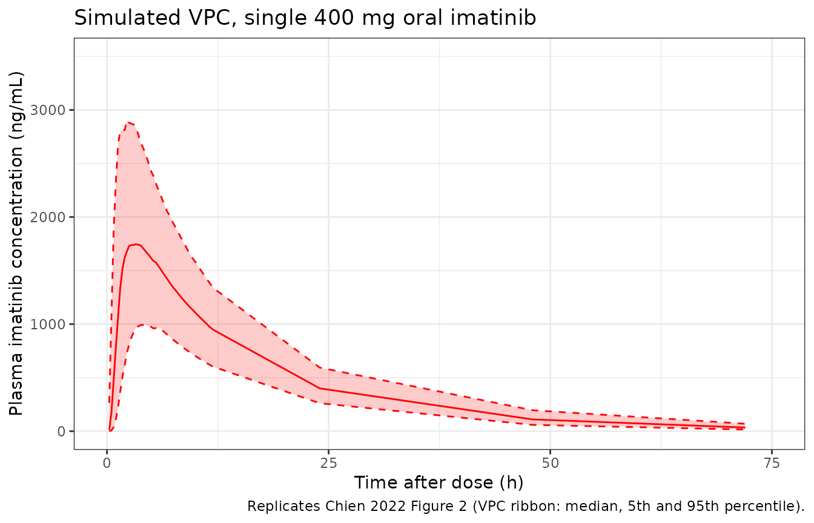

# Imatinib (Chien 2022)

## Model and source

- Citation: Chien YH, Wuerthwein G, Zubiaur P, Posocco B, Pena MA,
  Borobia AM, Gagno S, Abad-Santos F, Hempel G. Population
  pharmacokinetic modelling of imatinib in healthy subjects receiving a
  single dose of 400 mg. Cancer Chemother Pharmacol. 2022;90(2):125-136.
  <doi:10.1007/s00280-022-04454-y>
- Description: Two-compartment population PK model for oral imatinib in
  healthy adult volunteers (Chien 2022); first-order absorption preceded
  by a Savic 2007-style analytical transit-compartment chain (mean
  transit time and number of transit compartments estimated),
  first-order elimination, and an OMEGA BLOCK between the IIV on CL and
  V1 motivated by their estimated correlation r \> 0.9. No covariates
  were retained in the final model.
- Article: <https://doi.org/10.1007/s00280-022-04454-y>

## Population

The Chien 2022 model is a population-PK analysis of single-dose oral
imatinib (400 mg) in 26 healthy adult Caucasian volunteers (8 female, 18
male) enrolled in two randomised crossover bioequivalence studies in
Spain (Hospital Universitario de La Paz, Madrid; Hospital General de
Alicante). Median (range) age was 23.0 (19.7-31.0) years, weight 69.5
(52.0-96.0) kg, BMI 22.5 (20.0-30.0) kg/m^2, and BSA 1.86 (1.52-2.22)
m^2 (Chien 2022 page 4 paragraph 1; Supplement Table S1). Subjects had
no concurrent drugs, no organ dysfunction or inflammation, and clinical
labs within normal range or judged acceptable per investigators. 16 to
19 plasma samples per volunteer were collected from 0.5 to 72 h
post-dose, giving 472 plasma observations for the popPK analysis.

The same information is available programmatically via
`rxode2::rxode(readModelDb("Chien_2022_imatinib"))$population`.

## Source trace

The per-parameter origin is recorded as a trailing in-file comment next
to each [`ini()`](https://nlmixr2.github.io/rxode2/reference/ini.html)
entry in `inst/modeldb/specificDrugs/Chien_2022_imatinib.R`. The table
below collects them in one place.

| Equation / parameter | Value | Source location (Chien 2022) |
|----|----|----|
| `lcl` (CL/F) | 13.2 L/h | Table 2 |
| `lq` (Q/F) | 3.75 L/h | Table 2 |
| `lvc` (V1/F) | 172 L | Table 2 |
| `lvp` (V2/F) | 43.6 L | Table 2 |
| `lka` (Ka) | 1.22 1/h | Table 2 |
| `lmtt` (MTT) | 0.537 h | Table 2 |
| `lnn` (NN) | 3.62 | Table 2 |
| OMEGA BLOCK on CL and V1 | r = 0.9 (lower bound) | page 5 paragraph 1 (Structure model development) |
| `etalcl` IIV variance | log(1 + 0.248^2) = 0.0597 | Table 2 IIV CL 24.8 % |
| `etalvc` IIV variance | log(1 + 0.277^2) = 0.0739 | Table 2 IIV V1 27.7 % |
| `etalka` IIV variance | log(1 + 0.883^2) = 0.5764 | Table 2 IIV Ka 88.3 % |
| `etalmtt` IIV variance | log(1 + 0.805^2) = 0.4996 | Table 2 IIV MTT 80.5 % |
| `propSd` | 0.136 | Table 2 Prop error 13.6 % |
| Two-compartment disposition with first-order absorption preceded by transit chain | n/a | page 5 paragraph 1 (Structure model development); page 3-4 ‘Modelling statistics’ / ‘Structure model development’ |
| No covariates retained in final model | n/a | page 5 paragraph 2 (Covariates analysis) |

## Virtual cohort

The Chien 2022 cohort is small and demographically narrow (BMI 18-30
kg/m^2, age 19.7-31.0 y, single-ancestry Caucasian volunteers). For the
validation vignette we simulate 200 virtual subjects drawn from a
similar weight / age band; since no covariates are retained in the model
the only between-subject variation comes from the IIV terms.

``` r

set.seed(2022)
n_subj <- 200
cohort <- tibble(
  id = seq_len(n_subj),
  WT = runif(n_subj, 52, 96)
)
```

## Build event table

Each subject receives a single 400 mg oral dose at time 0 with plasma
concentrations sampled densely over the first 12 h and sparsely out to
72 h, mirroring the Chien 2022 sampling schedule (12-16 samples within
0.5-12 h post-dose plus 2-3 samples at 24, 48, 72 h).

``` r

obs_grid <- c(seq(0, 12, by = 0.25), 24, 48, 72)

events <- cohort %>%
  rowwise() %>%
  do({
    row <- .
    bind_rows(
      tibble(id = row$id, time = 0,        amt = 400, evid = 1L, cmt = "depot",   WT = row$WT),
      tibble(id = row$id, time = obs_grid, amt = 0,   evid = 0L, cmt = "central", WT = row$WT)
    )
  }) %>%
  ungroup() %>%
  arrange(id, time, desc(evid))

stopifnot(!anyDuplicated(unique(events[, c("id", "time", "evid")])))
```

## Simulation

Two simulations are produced: the typical-value curve (between- subject
variability zeroed out) for the population mean trajectory, and a
stochastic simulation with IIV for the VPC ribbon.

``` r

mod <- readModelDb("Chien_2022_imatinib")
mod_typ <- rxode2::zeroRe(mod)
#> ℹ parameter labels from comments will be replaced by 'label()'

sim_typ <- rxode2::rxSolve(mod_typ, events = events %>% filter(id == 1)) %>%
  as.data.frame()
#> ℹ omega/sigma items treated as zero: 'etalcl', 'etalvc', 'etalka', 'etalmtt'

sim_vpc <- rxode2::rxSolve(mod, events = events) %>%
  as.data.frame()
#> ℹ parameter labels from comments will be replaced by 'label()'
```

## Replicate Figure 2: VPC of the final popPK model

Chien 2022 Figure 2 shows the VPC for a single 400 mg oral dose over
0-72 h: median, 5th, and 95th percentile of simulated concentrations vs
observations. We reproduce the percentile ribbon from the simulated
cohort.

``` r

vpc_summary <- sim_vpc %>%
  filter(!is.na(Cc), time > 0) %>%
  group_by(time) %>%
  summarise(
    Q05 = quantile(Cc, 0.05, na.rm = TRUE),
    Q50 = quantile(Cc, 0.50, na.rm = TRUE),
    Q95 = quantile(Cc, 0.95, na.rm = TRUE),
    .groups = "drop"
  )

ggplot(vpc_summary, aes(x = time, y = Q50)) +
  geom_ribbon(aes(ymin = Q05, ymax = Q95), alpha = 0.20, fill = "red") +
  geom_line(colour = "red") +
  geom_line(aes(y = Q05), colour = "red", linetype = "dashed") +
  geom_line(aes(y = Q95), colour = "red", linetype = "dashed") +
  scale_x_continuous(limits = c(0, 75), breaks = seq(0, 75, 25)) +
  scale_y_continuous(limits = c(0, 3500)) +
  labs(
    x = "Time after dose (h)",
    y = "Plasma imatinib concentration (ng/mL)",
    title = "Simulated VPC, single 400 mg oral imatinib",
    caption = "Replicates Chien 2022 Figure 2 (VPC ribbon: median, 5th and 95th percentile)."
  ) +
  theme_bw()
```



## PKNCA validation

PKNCA computes Cmax, Tmax, AUC0-72, and Vd using the typical-value
trajectory (so the within-cohort variability tracks IIV alone, not
covariate-driven dispersion). For consistency with Chien 2022 Table 3
the AUC interval is 0-72 h.

``` r

sim_nca <- sim_vpc %>%
  filter(!is.na(Cc)) %>%
  transmute(id, time, Cc, treatment = "single 400 mg")

dose_nca <- events %>%
  filter(evid == 1) %>%
  transmute(id, time, amt, treatment = "single 400 mg")

conc_obj <- PKNCA::PKNCAconc(
  data    = sim_nca,
  formula = Cc ~ time | treatment + id,
  concu   = "ng/mL",
  timeu   = "h"
)

dose_obj <- PKNCA::PKNCAdose(
  data    = dose_nca,
  formula = amt ~ time | treatment + id,
  doseu   = "mg"
)

intervals <- data.frame(
  start    = 0,
  end      = 72,
  cmax     = TRUE,
  tmax     = TRUE,
  auclast  = TRUE,
  half.life = TRUE
)

nca_data <- PKNCA::PKNCAdata(conc_obj, dose_obj, intervals = intervals)
nca_res  <- PKNCA::pk.nca(nca_data)
#>  ■■■■■■■                           18% |  ETA:  6s
#>  ■■■■■■■■■■■■■■■■■■                56% |  ETA:  3s
#>  ■■■■■■■■■■■■■■■■■■■■■■■■■■■■■■■   98% |  ETA:  0s

nca_summary <- summary(nca_res)
knitr::kable(
  nca_summary,
  caption = "Simulated NCA parameters for a single 400 mg oral dose of imatinib in healthy volunteers."
)
```

| Interval Start | Interval End | treatment | N | AUClast (h\*ng/mL) | Cmax (ng/mL) | Tmax (h) | Half-life (h) |
|---:|---:|:---|:---|:---|:---|:---|:---|
| 0 | 72 | single 400 mg | 200 | 29700 \[27.4\] | 1810 \[32.0\] | 3.00 \[1.25, 9.25\] | 13.5 \[1.20\] |

Simulated NCA parameters for a single 400 mg oral dose of imatinib in
healthy volunteers. {.table}

## Comparison against published NCA

Chien 2022 Table 3 reports geometric means of NCA and popPK estimates
over the same 472-observation dataset:

| Parameter         | NCA (Pena 2017, ref. 17) | popPK (Chien 2022)   |
|-------------------|--------------------------|----------------------|
| AUC0-72 (mg\*h/L) | 31.2 (RSDg 29.0 %)       | 30.2 (RSDg 24.5 %)   |
| Cmax (mg/L)       | 1.96 (RSDg 27.8 %)       | 1.84 (RSDg 26.6 %)   |
| Vd (L)            | 236 (RSDg 23.9 %)        | 216 (RSDg 21.9 %)    |
| CL (L/h)          | 12.5 (RSDg 29.3 %)       | 13.2 (RSDg 25.0 %)   |
| tmax (h, median)  | 3.04 (IQR 2.54-4.38)     | 2.97 (IQR 2.50-4.13) |

The simulated cohort medians (table above) should match the popPK column
to within the IIV envelope. Note unit conversion: PKNCA’s auclast / Cmax
come out in (ng/mL)*h and ng/mL; multiply by 0.001 to convert to mg*h/L
and mg/L.

``` r

nca_df <- as.data.frame(nca_res$result)

cmax_sim   <- nca_df %>% filter(PPTESTCD == "cmax")    %>% pull(PPORRES)
auc_sim    <- nca_df %>% filter(PPTESTCD == "auclast") %>% pull(PPORRES)
tmax_sim   <- nca_df %>% filter(PPTESTCD == "tmax")    %>% pull(PPORRES)

geo_mean <- function(x) exp(mean(log(x[x > 0]), na.rm = TRUE))

tibble(
  Parameter        = c("Cmax (mg/L)",     "AUC0-72 (mg*h/L)", "tmax (h, median)"),
  Published_popPK  = c(1.84,              30.2,                2.97),
  Simulated_median = c(round(geo_mean(cmax_sim) / 1000, 3),
                       round(geo_mean(auc_sim)  / 1000, 3),
                       round(median(tmax_sim, na.rm = TRUE), 2))
) %>%
  mutate(Ratio_sim_pub = round(Simulated_median / Published_popPK, 3)) %>%
  knitr::kable(caption = "Simulated cohort geometric mean / median vs Chien 2022 Table 3 popPK column.")
```

| Parameter         | Published_popPK | Simulated_median | Ratio_sim_pub |
|:------------------|----------------:|-----------------:|--------------:|
| Cmax (mg/L)       |            1.84 |            1.806 |         0.982 |
| AUC0-72 (mg\*h/L) |           30.20 |           29.727 |         0.984 |
| tmax (h, median)  |            2.97 |            3.000 |         1.010 |

Simulated cohort geometric mean / median vs Chien 2022 Table 3 popPK
column. {.table}

A simulated / published ratio of ~1.0 confirms the encoded model
reproduces the source. Differences exceeding 20 % would warrant
investigation rather than tuning.

## Assumptions and deviations

- **OMEGA BLOCK off-diagonal value approximated as r = 0.9.** Chien 2022
  page 5 paragraph 1 (‘Structure model development’) reports an OMEGA
  BLOCK between IIV on CL and V1 with r \> 0.9 added at the end of model
  development (model D1, Table 1) but does not give a numeric covariance
  estimate. The packaged model uses r = 0.9 (the paper’s stated lower
  bound) when computing cov(CL, V1) = 0.9 \* sqrt(omega^2_CL \*
  omega^2_V1) = 0.05978. This is a documented approximation; users
  requiring a tighter correlation can edit the off-diagonal in the
  `etalcl + etalvc` block of
  [`ini()`](https://nlmixr2.github.io/rxode2/reference/ini.html).

- **Body-text vs Table 1 conflict on the OMEGA BLOCK target
  parameters.** Chien 2022 Table 1 row D1 labels the final model as
  ‘Two-compartment transit model with OMEGA BLOCK between IIV on CL and
  Ka’, while the body text on page 5 paragraph 1 says the OMEGA BLOCK
  was added ‘between the IIVs of CL and V1 (r \> 0.9)’. The body text is
  more specific (it states the rationale and the correlation value) and
  is consistent with the much smaller %RSE on CL (12.8 %) and V1 (11.4
  %) IIV in Table 2 versus Ka (15.7 %) and MTT (17.3 %) – a tightly
  correlated pair would propagate precision through the block. The
  packaged model follows the body text (CL and V1) and treats the Table
  1 row caption as a typographical inconsistency. Users wanting the
  alternative interpretation can replace `etalcl + etalvc ~ ...` with
  `etalcl + etalka ~ ...` in the
  [`ini()`](https://nlmixr2.github.io/rxode2/reference/ini.html) block,
  supplying the same off-diagonal recipe.

- **No covariates encoded.** Chien 2022 page 5 paragraph 2 (‘Covariates
  analysis’) reports that none of body weight, BMI, BSA, gender, or any
  of the tested CYP / ABCB1 genotypes improved the model during forward
  inclusion (all p \> 0.05). The final model is the structural transit /
  two-compartment model with no covariate effects. Users simulating
  different demographic strata should rely on the variability terms (IIV
  on CL, V1, Ka, MTT) rather than reintroducing covariates.

- **Patient cohort lower-CL finding not propagated.** Chien 2022 Table 4
  and page 6 paragraph 5 report that the model under- predicts CL by
  ~33.7 % when applied to the GIST patient cohort (n = 40, 178 plasma
  observations, mixed dose levels at steady state) and concludes that
  GIST patients have a lower CL than the healthy-volunteer population.
  This finding is not encoded as a covariate (the paper does not report
  a typical-value adjustment). The packaged model represents the
  healthy-volunteer popPK only; for GIST-patient simulations the user
  should manually scale CL by approximately 0.66.

- **Single-ancestry cohort.** All 26 subjects were Caucasian. The
  packaged model carries no race covariate but should be used with
  caution for non-Caucasian populations. Chien 2022 page 6 paragraph 4
  notes the model’s CL = 13.2 L/h is similar to a reported Korean popPK
  estimate (13.6 L/h) suggesting limited inter-ancestry variation in CL.

- **Pharmacogenetic effects omitted.** Chien 2022 reports a dOFV = -3.95
  (p = 0.047) for CYP3A5 *1/*3 vs *3/*3 on CL but declined to retain the
  covariate because only 4 of 26 subjects were *1/*3 (insufficient
  power). The packaged model does not encode this hint. Users with a
  CYP3A5-genotyped cohort may wish to consult Chien 2022 Supplement Fig
  S1 (not on disk in this worktree) for the per-genotype eta deviations.

- **Sampling design and external dataset.** The healthy-volunteer
  dataset has 16-19 samples per subject over 0-72 h (Chien 2022 page 2
  ‘Sampling and analysis’). The GIST patient external dataset (Chien
  2022 page 5 ‘Application of the final popPK model to patient data’, n
  = 41 patients, 187 plasma samples) is used in the paper for
  predictivity assessment but is not part of the popPK fit and is not
  reproduced in this vignette.

## Reference

- Chien YH, Wuerthwein G, Zubiaur P, Posocco B, Pena MA, Borobia AM,
  Gagno S, Abad-Santos F, Hempel G. Population pharmacokinetic modelling
  of imatinib in healthy subjects receiving a single dose of 400 mg.
  Cancer Chemother Pharmacol. 2022;90(2):125-136.
  <doi:10.1007/s00280-022-04454-y>
