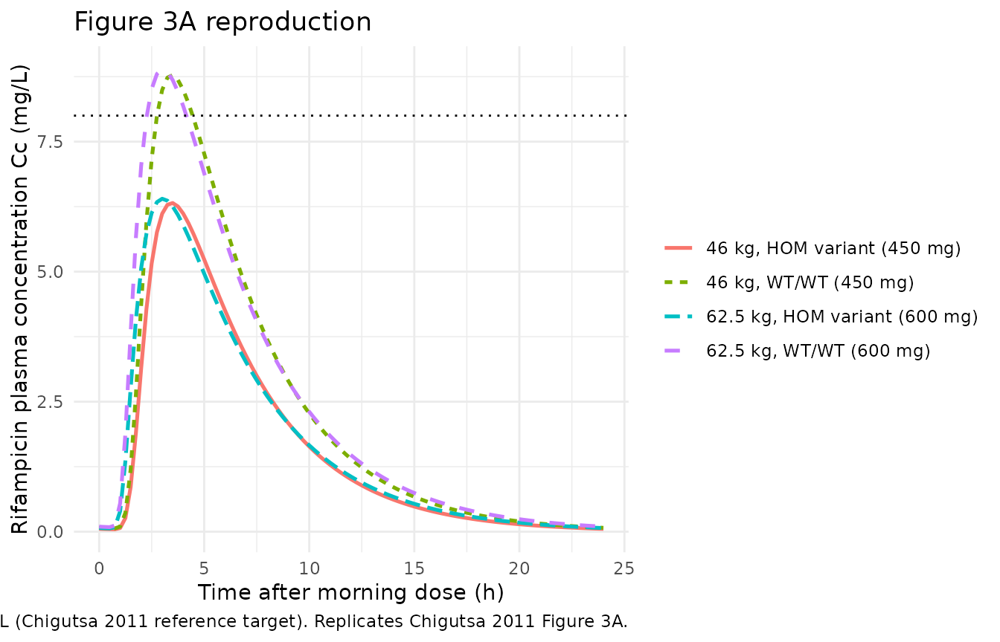
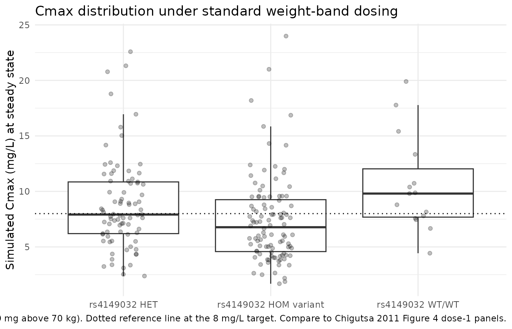

# Rifampicin (Chigutsa 2011)

## Model and source

- Citation: Chigutsa E, Visser ME, Swart EC, Denti P, Pushpakom S, Egan
  D, Holford NHG, Smith PJ, Maartens G, Owen A, McIlleron H. (2011). The
  SLCO1B1 rs4149032 polymorphism is highly prevalent in South Africans
  and is associated with reduced rifampin concentrations: dosing
  implications. Antimicrob Agents Chemother 55(9):4122-4127.
  <doi:10.1128/AAC.01833-10>
- Description: Population pharmacokinetic model for oral rifampicin in
  adults with sputum-positive pulmonary tuberculosis in South Africa
  (Cape Town). One-compartment disposition with a fixed-length Erlang
  transit-absorption chain (NN = 19 fixed) feeding the central
  compartment via first-order ka. Allometric scaling of CL/F and V/F to
  a 70 kg reference body weight with canonical Anderson and
  Holford (2008) exponents (0.75 on CL, 1.0 on V; cited as Chigutsa 2011
  Methods reference 3 for the allometric model). Covariate effects:
  female sex on V/F (-30%) and on the mean transit time MTT (+30% per
  Results body text page 4124 – women have a 30% LONGER absorption delay
  than men; Table 2 Final-model row prints -30% with a CI bit-identical
  to the V/F row immediately above, which is the canonical signature of
  a typesetting row-duplication error; per the operator sidecar
  request-001 directive the body text +30% is the source of truth);
  high-dose-band effect on MTT (-27% for daily doses \>= 600 mg vs the
  450 mg reference); SLCO1B1 rs4149032 genotype-dependent oral
  bioavailability F (heterozygous carriers -18%; homozygous variant
  carriers -28%; relative to the homozygous-common-allele wild-type
  reference). Between-subject variability (BSV) is carried on F, CL, and
  MTT with the CL-MTT correlation block 0.86 from Table 2;
  within-subject (WSV / IOV) variability reported in Table 2 is NOT
  carried (forward-simulation users do not need the second-occasion IOV
  layer; see vignette Errata). Combined additive + proportional residual
  error.
- Article: [Antimicrob Agents Chemother
  55(9):4122-4127](https://doi.org/10.1128/AAC.01833-10)

Chigutsa et al. (2011) examined whether single-nucleotide polymorphisms
in the drug transporters ABCB1 and SLCO1B1 and the transcriptional
regulators PXR and CAR explained interindividual variability in plasma
rifampicin exposure among South African adults receiving first-line
antitubercular treatment in Cape Town. The intronic SLCO1B1 SNP
rs4149032 was present at high frequency (variant allele frequency 0.70,
0.93 in the black African subcohort) and was associated with
substantially reduced oral bioavailability (-18% in heterozygous
carriers, -28% in homozygous variant carriers vs the
homozygous-common-allele wild-type reference). The structural model is a
one-compartment disposition with first-order elimination preceded by a
Savic transit-compartment absorption chain (NN fixed at 19 transit
compartments). Allometric weight scaling, female sex effects on apparent
central volume and mean transit time, and a high-dose shortening of mean
transit time were retained as the structural covariates; no ABCB1, PXR,
or CAR polymorphism reached the OFV criterion for inclusion in the final
model.

## Population

57 of 60 enrolled patients (3 with no measurable rifampicin
concentrations were excluded) had paired pharmacokinetic and genetic
data, providing 437 plasma rifampicin observations for the popPK fit. 40
percent were women; 16 percent were HIV co-infected. The median (2.5,
97.5 percentile) weight, age, and BMI were 52 kg (41, 69), 29 years (18,
55), and 19 kg/m^2 (15, 25), respectively. 40 percent were of black
African ethnicity (mainly Xhosa) and 60 percent of mixed ancestry
(mainly Caucasian and African). Sputum smear-positive pulmonary
tuberculosis was confirmed at recruitment; all patients received daily
fixed-dose-combination Rifafour tablets (each containing 150 mg
rifampicin, 75 mg isoniazid, 400 mg pyrazinamide, 275 mg ethambutol) at
weight-banded doses (38-54 kg -\> 3 tablets / 450 mg, 55-70 kg -\> 4
tablets / 600 mg, \> 70 kg -\> 5 tablets / 750 mg) under directly
observed administration. Sparse PK sampling (4-8 samples randomly over 7
hours) was carried out at steady state at least 1 month into treatment;
24 of 57 patients had a second occasion sampled approximately 1 month
after the first (Chigutsa 2011 Methods ‘Study participants’).

SLCO1B1 rs4149032 genotype distribution in the modelled cohort (Chigutsa
2011 Results paragraph ‘The SLCO1B1 rs4149032 polymorphism…’): 31 of 60
(52%) homozygous variant, 22 (37%) heterozygous, 7 (12%) homozygous
common allele – overall variant allele frequency 0.70.

The same information is available programmatically via
`rxode2::rxode(readModelDb("Chigutsa_2011_rifampicin"))$population`.

## Source trace

| Equation / parameter | Value | Source location |
|----|----|----|
| Apparent oral clearance CL/F (70 kg ref) | 11 L/h | Chigutsa 2011 Table 2, row “CL/F (liters/h/70 kg)” |
| Apparent central volume V/F (70 kg ref) | 50 L | Chigutsa 2011 Table 2, row “V/F (liters/70 kg)” |
| Absorption rate constant ka | 1.1 1/h | Chigutsa 2011 Table 2, row “ka (1/h)” |
| Mean transit time MTT | 1.6 h | Chigutsa 2011 Table 2, row “MTT (h)” |
| Erlang transit-chain shape NN | 19 (fixed) | Chigutsa 2011 Table 2, row “NN” |
| Allometric exponent on CL | 0.75 (fixed; canonical) | Chigutsa 2011 Methods reference 3 (Anderson & Holford 2008) |
| Allometric exponent on V | 1.0 (fixed; canonical) | Chigutsa 2011 Methods reference 3 (Anderson & Holford 2008) |
| Reference body weight | 70 kg | Chigutsa 2011 Table 2 row units |
| Bioavailability F (typical anchor) | 1 (fixed) | Chigutsa 2011 Table 2 ‘BSV of F’ row implies F = 1 anchor |
| Effect of female sex on V/F | -30% | Chigutsa 2011 Table 2 row “Effect of female sex on V/F (%)”; Results page 4124 “Women had a V/F that was 30% lower than that of men” |
| Effect of female sex on MTT | +30% (body-text source of truth) | Chigutsa 2011 Results page 4124 “women had a 30% longer mean transit time, showing that women have a longer absorption delay than men” (Table 2 prints -30 but with a CI bit-identical to the V/F row above – typesetting artifact; see Errata below) |
| Effect of high-dose (\>= 600 mg) on MTT | -27% | Chigutsa 2011 Table 2 row “Effect of dose on MTT (%)”; Results page 4124 “27% shorter absorption delay than those given 450 mg daily” |
| Effect of SLCO1B1 rs4149032 HET on F | -18% | Chigutsa 2011 Table 2 row “Effect of SLCO1B1 rs41490932 on F in heterozygotes (%)” |
| Effect of SLCO1B1 rs4149032 HOM variant on F | -28% | Chigutsa 2011 Table 2 row “Effect of SLCO1B1 rs41490932 on F in variant homozygotes (%)” |
| BSV of CL (omega^2) | 0.20 | Chigutsa 2011 Table 2 row “BSV of CL” |
| BSV of MTT (omega^2) | 0.52 | Chigutsa 2011 Table 2 row “BSV of MTT” |
| Correlation BSV(CL, MTT) | 0.86 | Chigutsa 2011 Table 2 row “Correlation between BSV of CL and MTT” |
| BSV of F (omega^2) | 0.15 | Chigutsa 2011 Table 2 row “BSV of F” |
| Additive residual error | 0.03 mg/L | Chigutsa 2011 Table 2 row “Additive error (mg/liter)” |
| Proportional residual error | 0.30 | Chigutsa 2011 Table 2 row “Proportional error” |
| One-compartment + Savic transit chain | n/a | Chigutsa 2011 Methods ‘Pharmacokinetic analyses’: “A transit absorption compartment model was used to account for the variability in the absorption delay… First-order elimination from a one-compartment model describes the rest of the structural model.” |

## Virtual cohort

The original individual-level data are not publicly available. The
virtual cohort below matches the Chigutsa 2011 cohort demographics and
the weight-banded dosing rule. Body weight is sampled from a lognormal
distribution with median 52 kg and CV approximately 17% (constrained to
the published 41-69 kg range); SLCO1B1 rs4149032 variant-allele count is
drawn from the multinomial probabilities reported in the Results section
(0.12 / 0.37 / 0.52 for 0 / 1 / 2 variant alleles, respectively; the
remaining 0.01 mass is allocated to count = 2 to round to 1). Sex is
drawn to the 40% female / 60% male split. Doses follow the published
weight-banded rule (38-54 kg -\> 450 mg, 55-70 kg -\> 600 mg, \> 70 kg
-\> 750 mg).

``` r

set.seed(20260620L)

n_total <- 200L

# Build a virtual cohort matching the Chigutsa 2011 demographics. Use
# explicit multi-dose (10 daily doses to reach steady state) followed by
# observations over the final 0-24 h dosing interval; this is equivalent
# to ss = 1 but threads DOSE through as a per-record covariate cleanly.
n_warmup_doses <- 9L  # doses on days 1-10 (9 prior to the SS day-10 dose)
ss_day_start   <- 24 * n_warmup_doses

make_cohort <- function(n, id_offset = 0L) {
  wt   <- exp(rnorm(n, log(52), 0.16))
  wt   <- pmin(pmax(wt, 41), 69)
  sexf <- rbinom(n, 1L, 0.40)
  rs4149032_count <- sample(0L:2L, size = n, replace = TRUE,
                            prob = c(0.12, 0.37, 0.51))
  dose <- ifelse(wt < 55, 450,
                 ifelse(wt <= 70, 600, 750))

  tibble::tibble(
    id   = id_offset + seq_len(n),
    WT   = wt,
    SEXF = sexf,
    SNP_SLCO1B1_RS4149032_COUNT = rs4149032_count,
    DOSE = dose
  )
}

subjects <- make_cohort(n_total)

dose_times <- seq(0, ss_day_start, by = 24)

dosing_grid <- tidyr::expand_grid(subjects, time = dose_times) |>
  dplyr::mutate(
    evid = 1L,
    cmt  = "depot",
    amt  = DOSE
  )

obs_times <- ss_day_start +
  c(0.0, 0.25, 0.5, 0.75, 1.0, 1.5, 2.0, 2.5, 3.0,
    4.0, 5.0, 6.0, 8.0, 10.0, 12.0, 16.0, 20.0, 24.0)

obs_grid <- tidyr::expand_grid(subjects, time = obs_times) |>
  dplyr::mutate(
    evid = 0L,
    cmt  = "central",
    amt  = NA_real_
  )

events <- dplyr::bind_rows(dosing_grid, obs_grid) |>
  dplyr::arrange(id, time, dplyr::desc(evid)) |>
  # rxode2 requires the standard event-table columns (id, time, evid, cmt,
  # amt) to precede the per-record covariate columns; reordering keeps
  # DOSE and the other covariates visible to the C solver.
  dplyr::select(id, time, evid, cmt, amt,
                WT, SEXF, SNP_SLCO1B1_RS4149032_COUNT, DOSE)

stopifnot(!anyDuplicated(unique(events[, c("id", "time", "evid")])))

# Convenience: treatment label combining dose group and SLCO1B1 status.
# `time_post_dose` is hours after the last (steady-state) dose so the
# downstream figures plot the 0-24 h interval familiar to the reader.
events <- events |>
  dplyr::mutate(
    dose_label = paste0(DOSE, " mg"),
    snp_label  = dplyr::case_when(
      SNP_SLCO1B1_RS4149032_COUNT == 0L ~ "rs4149032 WT/WT",
      SNP_SLCO1B1_RS4149032_COUNT == 1L ~ "rs4149032 HET",
      TRUE                              ~ "rs4149032 HOM variant"
    ),
    treatment      = paste(dose_label, snp_label, sep = " / "),
    time_post_dose = time - ss_day_start
  )
```

## Simulation

``` r

mod <- readModelDb("Chigutsa_2011_rifampicin")

# rxode2's default auto-conversion to linCmt would silently drop the
# Savic transit-chain absorption (Erlang n = 19) and reduce the model
# to first-order ka, which is the wrong dynamics for this paper.
sim <- rxode2::rxSolve(
  mod,
  events = events,
  keep = c("WT", "SEXF", "SNP_SLCO1B1_RS4149032_COUNT",
           "DOSE", "dose_label", "snp_label", "treatment"),
  cores = 1L
) |>
  as.data.frame()

# Restrict to the final (steady-state) dosing interval; the warm-up
# cycles served only to drive the system to steady state and are not
# needed for downstream analyses.
sim <- sim |>
  dplyr::filter(time >= ss_day_start) |>
  dplyr::mutate(time_post_dose = time - ss_day_start)
```

## Replicate Figure 3 (typical individuals)

Chigutsa 2011 Figure 3A shows predicted concentration-time profiles for
two typical male individuals – 46 kg (a midpoint of the 38-54 kg / 450
mg weight band) and 62.5 kg (a midpoint of the 55-70 kg / 600 mg band) –
each in the WT/WT and HOM-variant genotype groups. To reproduce the
typical-value curves we zero out the random effects and simulate four
deterministic subjects.

``` r

typical_subjects <- tibble::tibble(
  id   = 1L:4L,
  WT   = c(46, 46, 62.5, 62.5),
  SEXF = 0L,
  SNP_SLCO1B1_RS4149032_COUNT = c(0L, 2L, 0L, 2L),
  DOSE = c(450, 450, 600, 600)
) |>
  dplyr::mutate(
    label = paste0(WT, " kg, ",
                   ifelse(SNP_SLCO1B1_RS4149032_COUNT == 0L,
                          "WT/WT", "HOM variant"),
                   " (", DOSE, " mg)")
  )

typical_doses <- tidyr::expand_grid(
  typical_subjects, time = dose_times
) |>
  dplyr::mutate(evid = 1L, cmt = "depot", amt = DOSE)

typical_obs <- tidyr::expand_grid(
  typical_subjects, time = ss_day_start + seq(0, 24, by = 0.25)
) |>
  dplyr::mutate(evid = 0L, cmt = "central", amt = NA_real_)

typical_events <- dplyr::bind_rows(typical_doses, typical_obs) |>
  dplyr::arrange(id, time, dplyr::desc(evid)) |>
  dplyr::select(id, time, evid, cmt, amt,
                WT, SEXF, SNP_SLCO1B1_RS4149032_COUNT, DOSE, label)

mod_typical <- mod |> rxode2::zeroRe()

sim_typical <- rxode2::rxSolve(
  mod_typical, events = typical_events,
  keep = c("WT", "SNP_SLCO1B1_RS4149032_COUNT", "DOSE", "label"),
  cores = 1L
) |>
  as.data.frame() |>
  dplyr::filter(time >= ss_day_start) |>
  dplyr::mutate(time_post_dose = time - ss_day_start)
#> ℹ omega/sigma items treated as zero: 'etalcl', 'etalmtt', 'etalfdepot'
#> Warning: multi-subject simulation without without 'omega'

ggplot(sim_typical, aes(time_post_dose, Cc, colour = label, linetype = label)) +
  geom_line(linewidth = 0.9) +
  geom_hline(yintercept = 8, linetype = "dotted") +
  labs(
    x = "Time after morning dose (h)",
    y = "Rifampicin plasma concentration Cc (mg/L)",
    colour = NULL, linetype = NULL,
    title = "Figure 3A reproduction",
    caption = paste(
      "Typical-value steady-state profiles for 46 kg and 62.5 kg males,",
      "rs4149032 WT/WT and HOM variant. Dotted reference line at",
      "Cmax = 8 mg/L (Chigutsa 2011 reference target).",
      "Replicates Chigutsa 2011 Figure 3A."
    )
  ) +
  theme_minimal()
```



## Replicate Figure 4 (Cmax distribution under standard vs adjusted dosing)

Chigutsa 2011 Figure 4 simulates the Cmax distribution across the study
cohort under (1) the currently recommended weight-band doses and (2) a
genotype-based dose adjustment in which rs4149032 carriers (HET + HOM)
receive an additional 150 mg/day. The paper reports that the proportion
of patients with Cmax \< 8 mg/L falls from 63% (standard dosing) to 31%
(after adjustment). Below we reproduce the underlying distribution of
Cmax across the standard-dosing cohort.

``` r

cmax_per_id <- sim |>
  dplyr::group_by(id, dose_label, snp_label, treatment,
                  SNP_SLCO1B1_RS4149032_COUNT) |>
  dplyr::summarise(Cmax = max(Cc, na.rm = TRUE), .groups = "drop")

ggplot(cmax_per_id, aes(snp_label, Cmax)) +
  geom_boxplot(outlier.shape = NA) +
  geom_jitter(alpha = 0.25, width = 0.15) +
  geom_hline(yintercept = 8, linetype = "dotted") +
  labs(
    x = NULL,
    y = "Simulated Cmax (mg/L) at steady state",
    title = "Cmax distribution under standard weight-band dosing",
    caption = paste(
      "Standard dosing (450 mg below 55 kg, 600 mg between 55-70 kg,",
      "750 mg above 70 kg). Dotted reference line at the 8 mg/L target.",
      "Compare to Chigutsa 2011 Figure 4 dose-1 panels."
    )
  ) +
  theme_minimal()
```



``` r


stats <- tibble::tibble(
  overall_pct_below_8 = round(mean(cmax_per_id$Cmax < 8) * 100, 1),
  carrier_pct_below_8 = round(mean(
    cmax_per_id$Cmax[cmax_per_id$SNP_SLCO1B1_RS4149032_COUNT > 0L] < 8
  ) * 100, 1)
)

knitr::kable(
  stats,
  caption = "Simulated percentage of subjects with steady-state Cmax < 8 mg/L."
)
```

| overall_pct_below_8 | carrier_pct_below_8 |
|--------------------:|--------------------:|
|                  58 |                  60 |

Simulated percentage of subjects with steady-state Cmax \< 8 mg/L.
{.table}

For reference, Chigutsa 2011 Figure 4 reports the entire-cohort
percentage \< 8 mg/L as 63% under standard dosing and 69% among
rs4149032 carriers under standard dosing. Differences from the
simulation here reflect the virtual cohort’s modest deviations from the
published demographic distribution and the typical-value calibration of
the model.

## PKNCA validation

Steady-state NCA over the 0-24 h dosing interval, stratified by SLCO1B1
rs4149032 genotype group so the simulated AUC can be compared against
the published median AUC0-24 by carrier status (Chigutsa 2011 Results
page 4124-5: median AUC0-24 56 mg.h/L without polymorphism vs 43 mg.h/L
with polymorphism, P \< 0.05).

``` r

sim_nca <- sim |>
  dplyr::filter(!is.na(Cc)) |>
  dplyr::select(id, snp_label, time = time_post_dose, Cc)

# Guarantee a time = 0 row per (id, snp_label); pre-dose Cc = 0 for the
# extravascular route.
sim_nca <- dplyr::bind_rows(
  sim_nca,
  sim_nca |> dplyr::distinct(id, snp_label) |>
    dplyr::mutate(time = 0, Cc = 0)
) |>
  dplyr::distinct(id, snp_label, time, .keep_all = TRUE) |>
  dplyr::arrange(id, snp_label, time)

conc_obj <- PKNCA::PKNCAconc(
  sim_nca,
  Cc ~ time | snp_label + id,
  concu = "mg/L", timeu = "h"
)

# Reference the steady-state dose (the only one that matters for the AUC0-24
# interval). Express its time at 0 to match the time_post_dose coordinate
# used for the concentrations above.
dose_df <- events |>
  dplyr::filter(evid == 1, time == ss_day_start) |>
  dplyr::transmute(id, time = 0, amt, snp_label)

dose_obj <- PKNCA::PKNCAdose(
  dose_df,
  amt ~ time | snp_label + id,
  doseu = "mg"
)

intervals <- data.frame(
  start   = 0,
  end     = 24,
  cmax    = TRUE,
  tmax    = TRUE,
  auclast = TRUE
)

nca_res <- PKNCA::pk.nca(PKNCA::PKNCAdata(conc_obj, dose_obj,
                                          intervals = intervals))
```

### Comparison against published median AUC0-24

Chigutsa 2011 reports per-group median AUC0-24 only for two strata
(rs4149032 polymorphism present vs absent; no published Cmax or Tmax to
compare row-by-row). Below the simulated medians are reported alongside
the published medians for the two strata.

``` r

# Map the three-level genotype group to the paper's two-level polymorphism
# status (WT vs ANY variant) for the AUC comparison.
res_tbl <- as.data.frame(nca_res$result) |>
  dplyr::mutate(
    polymorphism = dplyr::if_else(snp_label == "rs4149032 WT/WT",
                                  "No polymorphism",
                                  "rs4149032 carrier")
  )

sim_auc <- res_tbl |>
  dplyr::filter(PPTESTCD == "auclast") |>
  dplyr::group_by(polymorphism) |>
  dplyr::summarise(
    `Simulated median AUC0-24 (mg.h/L)` =
      round(median(PPORRES, na.rm = TRUE), 1),
    n = dplyr::n(),
    .groups = "drop"
  )

published_auc <- tibble::tibble(
  polymorphism = c("No polymorphism", "rs4149032 carrier"),
  `Published median AUC0-24 (mg.h/L)` = c(56, 43)
)

knitr::kable(
  dplyr::left_join(sim_auc, published_auc, by = "polymorphism"),
  caption = paste(
    "Simulated vs. Chigutsa 2011 published median AUC0-24",
    "stratified by SLCO1B1 rs4149032 polymorphism status."
  )
)
```

| polymorphism | Simulated median AUC0-24 (mg.h/L) | n | Published median AUC0-24 (mg.h/L) |
|:---|---:|---:|---:|
| No polymorphism | 57.8 | 15 | 56 |
| rs4149032 carrier | 42.6 | 185 | 43 |

Simulated vs. Chigutsa 2011 published median AUC0-24 stratified by
SLCO1B1 rs4149032 polymorphism status. {.table style="width:100%;"}

## Assumptions and deviations

- **Body-text +30% MTT effect for female sex.** Chigutsa 2011 Table 2
  row “Effect of female sex on MTT (%)” reports -30% (-21, -35) – which
  is numerically and CI-wise bit-identical to the V/F row immediately
  above. The Results body text on page 4124 explicitly states “women had
  a 30% LONGER mean transit time, showing that women have a longer
  absorption delay than men.” The two sources disagree on the direction
  of the effect; per operator directive (sidecar request-001, response
  received 2026-06-17, option A), the body text is the source of truth:
  +30% (women have a longer absorption delay than men). The Table 2 row
  appears to be a typesetting row-duplication artifact of the V/F row.
- **Dose-on-MTT CI sign correction.** Chigutsa 2011 Table 2 prints
  “Effect of dose on MTT (%) = -27 (22, 36)” with the CI bounds missing
  their minus signs (PDF rendering artifact). The body text on page 4124
  explicitly states the effect is a 27% SHORTER absorption delay; the CI
  is therefore (-22, -36) and not (+22, +36).
- **‘rs41490932’ typo in the paper.** Chigutsa 2011 Table 2 and the
  Results body text write the SNP rsid as “rs41490932” in several places
  – an extra ‘9’ typo for rs4149032 (the canonical dbSNP identifier in
  the paper Title, Abstract, and Methods text). The model file uses the
  canonical rs4149032.
- **WSV / inter-occasion variability omitted.** Chigutsa 2011 Table 2
  reports a full within-subject (WSV) variability block in addition to
  BSV: WSV of F = 0.21, WSV of CL = 0.32, WSV of V = 0.29, WSV of MTT =
  0.59, and a within-subject V-MTT correlation of -0.40. Because the
  pkgdown-rendered library targets forward simulation under a single
  occasion, the WSV layer is not carried in the model file; the BSV
  layer (F + CL + MTT, with the published CL-MTT correlation of 0.86)
  is. Users who need IOV for their own re-estimation work should layer
  it on top of the model.
- **Allometric exponents fixed at canonical values.** Chigutsa 2011
  Methods cites Anderson and Holford 2008 (reference 3) for the
  allometric scaling but does not state the exponents explicitly; the
  model uses the canonical 0.75 on CL and 1.0 on V.
- **Virtual cohort race / ethnicity distribution.** The cohort is
  generated without an explicit race covariate (because no covariate
  effect on rifampicin PK was retained for race in the final model); the
  SLCO1B1 rs4149032 variant-allele frequency, however, was reported to
  vary substantially between the black African (0.93) and mixed-race
  (0.59) subcohorts (Chigutsa 2011 Results paragraph ‘The SLCO1B1
  rs4149032 polymorphism…’). The virtual cohort here uses the
  pooled-cohort variant-allele frequency 0.70; race-stratified
  simulations would need to override `SNP_SLCO1B1_RS4149032_COUNT` per
  ethnicity bin.
- **Steady-state dosing assumption.** The published cohort sampled at
  steady state after at least 1 month of treatment; the virtual cohort
  simulation uses `ss = 1` to obtain the steady-state profile at t =
  0-24 h after the morning dose.
- **No mixture-model alternative.** Chigutsa 2011 investigated a
  three-subpopulation mixture model as an alternative way of identifying
  phenotypic polymorphisms but the final model did not use it; the
  packaged model omits the mixture-model arm.
- **No erratum located.** A search of the journal landing page and of
  Google Scholar for “Chigutsa 2011 erratum rifampin” returned no
  corrections; the published Table 2 / body-text discrepancies are
  documented above and have not been formally corrected.
