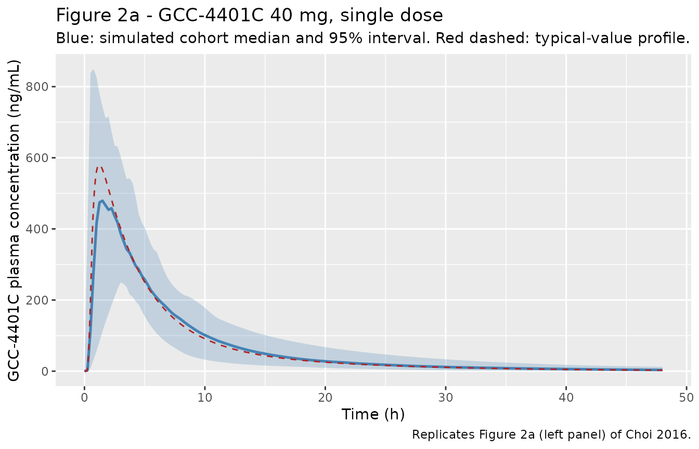
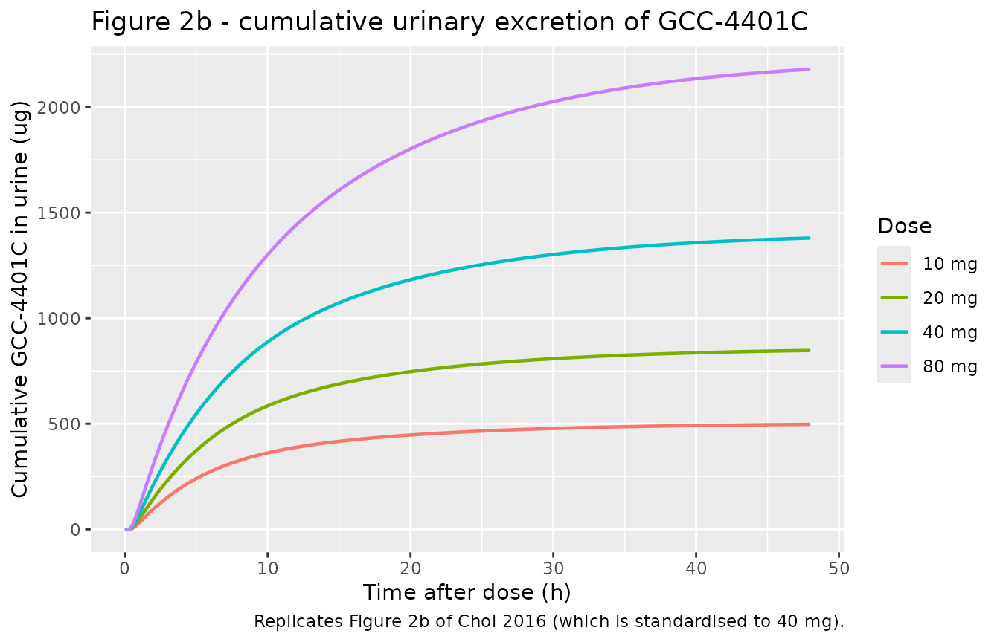
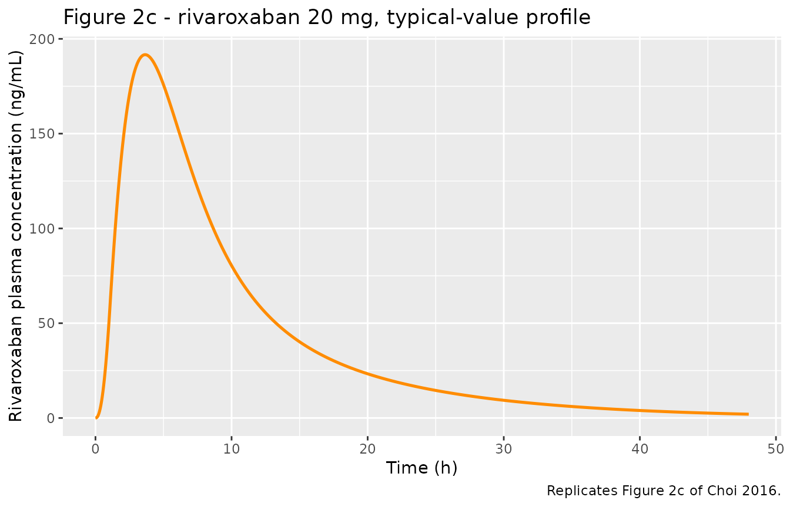
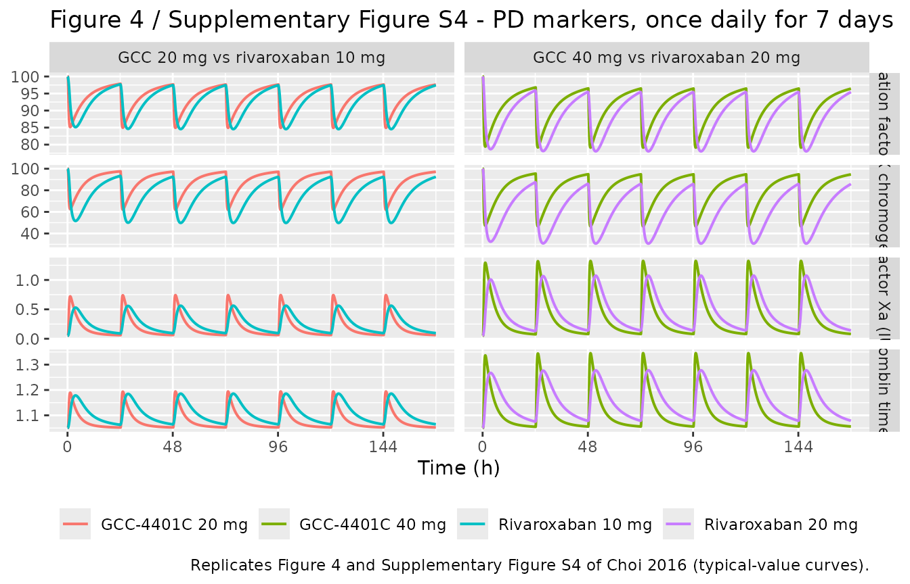

# GCC-4401C and rivaroxaban PK/PD (Choi 2016)

## Models and source

Choi 2016 pooled two phase I trials of the oral direct factor Xa
inhibitor GCC-4401C and fit, side by side, a population PK/PD model for
GCC-4401C and one for the rivaroxaban active-comparator arm. The two
fits share no parameters and were built on different cohorts, so the
paper contributes **two** model files:

``` r

mod_gcc <- readModelDb("Choi_2016_gcc4401c")
mod_riv <- readModelDb("Choi_2016_rivaroxaban")
ui_gcc <- rxode2::rxode(mod_gcc)
#> ℹ parameter labels from comments will be replaced by 'label()'
#> Warning: some etas defaulted to non-mu referenced, possible parsing error: etaiov_d1_1, etaiov_d1_2, etaiov_d1_3, etaiov_d1_4, etaiov_d1_5, etaiov_d1_6, etaiov_d1_7, etaiov_tlag_1, etaiov_tlag_2, etaiov_tlag_3, etaiov_tlag_4, etaiov_tlag_5, etaiov_tlag_6, etaiov_tlag_7, etaiov_hill_cfx_1, etaiov_hill_cfx_2, etaiov_hill_cfx_3, etaiov_hill_ptinr_1, etaiov_hill_ptinr_2, etaiov_hill_ptinr_3, etaiov_hill_ptsec_1, etaiov_hill_ptsec_2, etaiov_hill_ptsec_3, etaiov_hill_aptt_1, etaiov_hill_aptt_2, etaiov_hill_aptt_3
#> as a work-around try putting the mu-referenced expression on a simple line
ui_riv <- rxode2::rxode(mod_riv)
#> ℹ parameter labels from comments will be replaced by 'label()'
#> Warning: some etas defaulted to non-mu referenced, possible parsing error: etaiov_d1_1, etaiov_d1_2, etaiov_d1_3, etaiov_d1_4, etaiov_d1_5, etaiov_d1_6, etaiov_d1_7, etaiov_ec50_cfx_1, etaiov_ec50_cfx_2, etaiov_ec50_cfx_3, etaiov_ec50_fxcaa_1, etaiov_ec50_fxcaa_2, etaiov_ec50_fxcaa_3
#> as a work-around try putting the mu-referenced expression on a simple line
```

- Citation: Choi HY, Choi S, Kim YH, Lim HS. Population pharmacokinetic
  and pharmacodynamic modeling analysis of GCC-4401C, a novel direct
  factor Xa inhibitor, in healthy volunteers. CPT Pharmacometrics Syst
  Pharmacol. 2016 Oct;5(10):532-543. <doi:10.1002/psp4.12103>.
  Structural detail and the plasma/urine NONMEM control stream are taken
  from Supplementary Data file PSP4-5-532-s008 accompanying the article;
  the coagulation-factor-X PD control stream is PSP4-5-532-s009.
- GCC-4401C: Population PK/PD model for GCC-4401C, an oral direct factor
  Xa inhibitor, in healthy male volunteers (Choi 2016; pooled
  first-in-human single-ascending-dose and
  single-and-multiple-ascending-dose phase I studies). Plasma and urine
  data were fit simultaneously with a two-compartment model with
  sequential zero-order release into the depot (D1), an absorption lag
  (ALAG1) and first-order absorption; body weight enters Vc as a power
  function normalised to 75 kg. Elimination is split into a linear
  non-renal clearance and a saturable renal clearance whose magnitude is
  suppressed by an inhibitory Emax function of the plasma concentration.
  A study-specific scaling of the apparent Vc encodes the relative
  accuracy of the two bioanalytical assays. Eight pharmacodynamic
  markers are carried as direct-effect (no-delay) outputs driven by the
  plasma concentration: coagulation factor X activity, factor X
  chromogenic activity, anti-factor Xa activity, prothrombin time in INR
  and in seconds, activated partial thromboplastin time, antithrombin
  III activity and the low-molecular-weight-heparin anti-Xa assay. The
  PD layer was fit sequentially on individual Bayesian PK estimates.
  Baselines for aPTT, AT III and LMWH are not reported anywhere in the
  paper or its supplement, so those three outputs are the drug-induced
  CHANGE from baseline and are named with a \_chg suffix; see the
  vignette Errata. Companion rivaroxaban model:
  modellib(‘Choi_2016_rivaroxaban’).
- Rivaroxaban: Population PK/PD model for rivaroxaban 20 mg once daily
  taken with food in healthy male volunteers, fit as the active
  comparator arm of the GCC-4401C single-and-multiple-ascending-dose
  phase I study (Choi 2016). Disposition is two-compartment with linear
  clearance; absorption is a Weibull-type process (shape gamma) combined
  with zero-order release into the depot over a duration D1, with no
  absorption lag and no retained covariates. Six pharmacodynamic markers
  are carried as direct-effect (no-delay) outputs driven by the plasma
  concentration: coagulation factor X activity, factor X chromogenic
  activity, anti-factor Xa activity, prothrombin time in INR and in
  seconds, and activated partial thromboplastin time. The PD layer was
  fit sequentially on individual Bayesian PK estimates. The baseline
  aPTT is not reported anywhere in the paper or its supplement, so that
  output is the drug-induced CHANGE from baseline and is named with a
  \_chg suffix; see the vignette Errata. Companion GCC-4401C model:
  modellib(‘Choi_2016_gcc4401c’).
- Article: <https://doi.org/10.1002/psp4.12103>
- Supplementary data (open access, includes the plasma/urine and
  coagulation-factor-X NONMEM control streams and the simulation figures
  used below):
  <https://www.ebi.ac.uk/europepmc/webservices/rest/PMC5080649/supplementaryFiles>

## Population

Ninety-four healthy male volunteers took part in the two trials: 48 in
the first-in-human single-ascending-dose study (SAD, NCT01651234; six
dose groups of eight, 2.5 to 80 mg, six active and two placebo per
group) and 46 in the single- and-multiple-ascending-dose study (S&MAD,
NCT01954238; five dose groups of eight, 10 to 80 mg, dosed on day 1 and
on days 3 through 9). Mean (SD) age was 30.3 (8.6) years, weight 76.6
(9.7) kg and height 176.5 (6.7) cm; 43.6% were White, 42.6% African
American, 8.5% Asian and 5.3% other (Choi 2016 Table 1). An extra six
subjects in the 20 mg S&MAD group received rivaroxaban 20 mg 30 minutes
after a standard breakfast and form the entire rivaroxaban cohort.

GCC-4401C was given **fasted** and rivaroxaban **fed**, as its label
recommends. That difference is deliberate and is the reason the paper’s
dose-equivalence conclusions are framed as “20 mg and 40 mg of GCC-4401C
administered under fasted status are comparable to 10 mg and 20 mg of
rivaroxaban under fed status”.

The PK dataset held 1,401 plasma GCC-4401C concentrations, 120 urine
concentrations and 168 plasma rivaroxaban concentrations. The same
metadata is available programmatically:

``` r

str(ui_gcc$population, max.level = 1)
#> List of 13
#>  $ species       : chr "human"
#>  $ n_subjects    : int 94
#>  $ n_studies     : int 2
#>  $ n_observations: int 1689
#>  $ age_range     : chr "mean (SD) 30.3 (8.6) years"
#>  $ weight_range  : chr "mean (SD) 76.6 (9.7) kg"
#>  $ height_range  : chr "mean (SD) 176.5 (6.7) cm"
#>  $ sex_female_pct: num 0
#>  $ race_ethnicity: Named num [1:4] 43.6 42.6 8.5 5.3
#>   ..- attr(*, "names")= chr [1:4] "White" "Black" "Asian" "Other"
#>  $ disease_state : chr "Healthy male volunteers."
#>  $ dose_range    : chr "Single oral doses of 2.5, 5, 10, 20, 40 or 80 mg under overnight fasting (SAD study, 48 subjects, 6 active + 2 "| __truncated__
#>  $ regions       : chr "United States (ClinicalTrials.gov NCT01651234 and NCT01954238)."
#>  $ notes         : chr "Baseline demographics from Choi 2016 Table 1; the two studies did not differ materially. PK dataset: 1401 plasm"| __truncated__
```

## Source trace

Every `ini()` entry carries an in-file comment naming its source
location. The table below collects the structural entries; the
per-parameter table locations are in
`inst/modeldb/specificDrugs/Choi_2016_gcc4401c.R` and
`inst/modeldb/specificDrugs/Choi_2016_rivaroxaban.R`.

| Element | Source location |
|----|----|
| GCC-4401C two-compartment disposition, zero-order depot release (D1) + lag (ALAG1) + first-order absorption | Results “Plasma and urine PK modeling analysis”; supplementary control stream `PSP4-5-532-s008` `$MODEL` / `$PK` / `$DES` |
| `Typical Vc = Vc(75) * (WT/75)^H` | Equation 5; Table 2(a) |
| `CLR = BCLR * (1 - IMAX * Cp / (Cp + IC50))` (saturable renal clearance) | Equation 6; control stream `$DES` `K24 = CLR*(1 - IMX*C2/(C2 + IC50))/V2` |
| `S2 = Vc/1000`, and `S2 = (Vc/1000)/THETA(10)` for the S&MAD study | Equations 7 and 8; Table 2(a) footnote d |
| All GCC-4401C PK point estimates and IIV variances | Table 2(a) |
| Rivaroxaban two-compartment disposition, Weibull absorption + zero-order D1 | Results “For rivaroxaban, a two-compartment, linear model best described the PK in fed status”; Table 2(b) |
| All rivaroxaban PK point estimates and IIV variances | Table 2(b) |
| Direct-effect PD form `E = BASE -/+ Emax * Cc^gamma / (EC50^gamma + Cc^gamma)` | PD control stream `PSP4-5-532-s009` `$ERROR` `CFX = BASE - EMAX*(CP**GAM)/(EC50**GAM+CP**GAM)` |
| Absence of a PD time delay | Results “PK-PD modeling analysis”: no counterclockwise hysteresis; association-dissociation models not superior to direct-effect models |
| All PD point estimates, IIV and IOV variances, residual errors | Table 3(a)-(h) |
| Typical baselines for CFX, FXCAA, AFX, PT (INR) and PT (s) | Digitised from Supplementary Figure S4 (pre-dose median of each panel) – see Errata |
| Occasion structure for IOV | Results “IOVs for D1 and ALAG1 … implemented in every inter-dose interval”; seven `$OMEGA BLOCK(1) SAME` slots in `PSP4-5-532-s008`, three in `PSP4-5-532-s009` |

## Simulation helpers

Both models are multi-endpoint, so observation records carry the
endpoint name in `cmt`. `useLinCmt = FALSE` keeps rxode2 from attempting
an ODE-to-`linCmt()` conversion that would discard the custom absorption
structure.

``` r

# Typical-value (population) profiles: omega = NA suppresses all random effects.
solve_typical <- function(ui, dose, times, extra = list(), addl = NULL, ii = NULL) {
  ev <- rxode2::et(amt = dose, rate = -2, cmt = "depot")
  if (!is.null(addl)) ev <- rxode2::et(amt = dose, rate = -2, cmt = "depot", addl = addl, ii = ii)
  ev <- ev |> rxode2::et(times, cmt = "Cc")
  ev <- as.data.frame(ev)
  for (nm in names(extra)) ev[[nm]] <- extra[[nm]]
  rxode2::rxSolve(ui, ev, omega = NA, useLinCmt = FALSE, returnType = "data.frame")
}

trapz <- function(t, y) sum(diff(t) * (utils::head(y, -1) + utils::tail(y, -1)) / 2)

grid_sd <- seq(0, 168, by = 0.05)
```

### Single-dose typical profiles

``` r

gcc_doses <- c(2.5, 5, 10, 20, 40, 80)

sd_gcc <- lapply(gcc_doses, function(d) {
  solve_typical(ui_gcc, d, grid_sd,
    extra = list(WT = 75, STUDY_SMAD = 0, OCC = 1)
  ) |>
    dplyr::mutate(drug = "GCC-4401C", study = "SAD", dose = d)
}) |> dplyr::bind_rows()

sd_gcc_smad <- lapply(c(10, 20, 40), function(d) {
  solve_typical(ui_gcc, d, grid_sd,
    extra = list(WT = 75, STUDY_SMAD = 1, OCC = 1)
  ) |>
    dplyr::mutate(drug = "GCC-4401C", study = "S&MAD", dose = d)
}) |> dplyr::bind_rows()

sd_riv <- lapply(c(10, 20), function(d) {
  solve_typical(ui_riv, d, grid_sd, extra = list(OCC = 1)) |>
    dplyr::mutate(drug = "Rivaroxaban", study = "S&MAD", dose = d)
}) |> dplyr::bind_rows()

# rxode2 must never return a negative concentration here: there is no
# stiff transient and PKNCA would silently produce NaN AUCs if it did.
stopifnot(
  min(sd_gcc$Cc) >= 0, min(sd_gcc_smad$Cc) >= 0, min(sd_riv$Cc) >= 0,
  !anyNA(sd_gcc$Cc), !anyNA(sd_riv$Cc)
)
```

## Replicate published figures

### Figure 2a – GCC-4401C plasma, single ascending dose

Figure 2a is a prediction-corrected VPC standardised to a 40 mg dose, so
the comparable quantity is the **median of a simulated cohort**, not the
typical-value curve. The paper’s IIV on `Ka` is very large (variance
0.97, CV 128%), which pulls the cohort median below the typical-value
profile.

``` r

# `set.seed()` seeds R's RNG, not rxode2's; rxode2 partitions its streams per
# solver thread, so this cohort differs between a 16-thread workstation and a
# 2-core CI runner. Every assertion below is written to hold for any cohort.
set.seed(20161011)
n_sub <- 100L

cohort <- tibble::tibble(
  id = seq_len(n_sub),
  WT = pmin(pmax(stats::rnorm(n_sub, 76.6, 9.7), 50), 120), # Table 1: 76.6 (9.7) kg
  STUDY_SMAD = 0,
  OCC = 1
)

obs_times <- seq(0, 48, by = 0.25)

ev_vpc <- dplyr::bind_rows(
  cohort |> dplyr::mutate(
    time = 0, evid = 1L, amt = 40, rate = -2, cmt = "depot"
  ),
  tidyr::expand_grid(cohort, time = obs_times) |>
    dplyr::mutate(evid = 0L, amt = NA_real_, rate = NA_real_, cmt = "Cc")
) |>
  dplyr::arrange(id, time, dplyr::desc(evid))
stopifnot(!anyDuplicated(unique(ev_vpc[, c("id", "time", "evid")])))

vpc <- rxode2::rxSolve(ui_gcc, ev_vpc, keep = c("WT"), useLinCmt = FALSE) |>
  as.data.frame()

vpc_q <- vpc |>
  dplyr::group_by(time) |>
  dplyr::summarise(
    Q025 = stats::quantile(Cc, 0.025, na.rm = TRUE),
    Q50 = stats::quantile(Cc, 0.50, na.rm = TRUE),
    Q975 = stats::quantile(Cc, 0.975, na.rm = TRUE),
    .groups = "drop"
  )

typ40 <- sd_gcc |> dplyr::filter(dose == 40, time <= 48)

ggplot(vpc_q, aes(time, Q50)) +
  geom_ribbon(aes(ymin = Q025, ymax = Q975), alpha = 0.25, fill = "steelblue") +
  geom_line(linewidth = 0.9, colour = "steelblue") +
  geom_line(data = typ40, aes(time, Cc), colour = "firebrick", linetype = 2) +
  labs(
    x = "Time (h)", y = "GCC-4401C plasma concentration (ng/mL)",
    title = "Figure 2a - GCC-4401C 40 mg, single dose",
    subtitle = "Blue: simulated cohort median and 95% interval. Red dashed: typical-value profile.",
    caption = "Replicates Figure 2a (left panel) of Choi 2016."
  )
```



``` r

fig2a <- list(
  median_cmax = stats::median(tapply(vpc$Cc, vpc$id, max)),
  median_tmax = vpc_q$time[which.max(vpc_q$Q50)],
  peak_of_median = max(vpc_q$Q50)
)
unlist(fig2a)
#>    median_cmax    median_tmax peak_of_median 
#>       550.9416         1.5000       479.1426
```

### Figure 2b – GCC-4401C cumulative urinary excretion

The saturable renal clearance is the most distinctive feature of this
model, and the cumulative urine curve is the only place it is directly
observable. Figure 2b is standardised to 40 mg and plateaus at roughly
1,400 ug.

``` r

ae_plot <- sd_gcc |>
  dplyr::filter(dose %in% c(10, 20, 40, 80), time <= 48) |>
  dplyr::mutate(Ae_ug = 1000 * Ae, dose_lab = factor(paste(dose, "mg"),
    levels = paste(c(10, 20, 40, 80), "mg")
  ))

ggplot(ae_plot, aes(time, Ae_ug, colour = dose_lab)) +
  geom_line(linewidth = 0.8) +
  labs(
    x = "Time after dose (h)", y = "Cumulative GCC-4401C in urine (ug)",
    colour = "Dose",
    title = "Figure 2b - cumulative urinary excretion of GCC-4401C",
    caption = "Replicates Figure 2b of Choi 2016 (which is standardised to 40 mg)."
  )
```



### Figure 2c – rivaroxaban plasma, 20 mg

``` r

sd_riv |>
  dplyr::filter(dose == 20, time <= 48) |>
  ggplot(aes(time, Cc)) +
  geom_line(linewidth = 0.9, colour = "darkorange") +
  labs(
    x = "Time (h)", y = "Rivaroxaban plasma concentration (ng/mL)",
    title = "Figure 2c - rivaroxaban 20 mg, typical-value profile",
    caption = "Replicates Figure 2c of Choi 2016."
  )
```



### Figure 4 and Supplementary Figure S4 – PD markers over a once-daily week

Figure 4 and Supplementary Figure S4 simulate once-daily dosing for
seven days and overlay GCC-4401C against rivaroxaban. The occasion index
advances one per dosing day, which is how the model’s inter-occasion
variability is indexed.

``` r

grid_md <- seq(0, 168, by = 0.1)
occ_md <- pmin(floor(grid_md / 24) + 1, 7)

solve_md <- function(ui, dose, extra) {
  ev <- rxode2::et(amt = dose, rate = -2, cmt = "depot", addl = 6, ii = 24) |>
    rxode2::et(grid_md, cmt = "Cc")
  ev <- as.data.frame(ev)
  ev$OCC <- pmin(floor(ev$time / 24) + 1, 7)
  for (nm in names(extra)) ev[[nm]] <- extra[[nm]]
  rxode2::rxSolve(ui, ev, omega = NA, useLinCmt = FALSE, returnType = "data.frame")
}

md <- dplyr::bind_rows(
  solve_md(ui_gcc, 20, list(WT = 75, STUDY_SMAD = 1)) |>
    dplyr::mutate(arm = "GCC-4401C 20 mg", pair = "GCC 20 mg vs rivaroxaban 10 mg"),
  solve_md(ui_riv, 10, list()) |>
    dplyr::mutate(arm = "Rivaroxaban 10 mg", pair = "GCC 20 mg vs rivaroxaban 10 mg"),
  solve_md(ui_gcc, 40, list(WT = 75, STUDY_SMAD = 1)) |>
    dplyr::mutate(arm = "GCC-4401C 40 mg", pair = "GCC 40 mg vs rivaroxaban 20 mg"),
  solve_md(ui_riv, 20, list()) |>
    dplyr::mutate(arm = "Rivaroxaban 20 mg", pair = "GCC 40 mg vs rivaroxaban 20 mg")
)

md_long <- md |>
  dplyr::select(time, arm, pair, cfx, fxcaa, afx, ptinr) |>
  tidyr::pivot_longer(c(cfx, fxcaa, afx, ptinr), names_to = "marker", values_to = "value") |>
  dplyr::mutate(marker = factor(marker,
    levels = c("cfx", "fxcaa", "afx", "ptinr"),
    labels = c(
      "Coagulation factor X (%)", "Factor X chromogenic (%)",
      "Anti-factor Xa (IU/mL)", "Prothrombin time (INR)"
    )
  ))

ggplot(md_long, aes(time, value, colour = arm)) +
  geom_line(linewidth = 0.7) +
  facet_grid(marker ~ pair, scales = "free_y") +
  scale_x_continuous(breaks = seq(0, 168, by = 48)) +
  labs(
    x = "Time (h)", y = NULL, colour = NULL,
    title = "Figure 4 / Supplementary Figure S4 - PD markers, once daily for 7 days",
    caption = "Replicates Figure 4 and Supplementary Figure S4 of Choi 2016 (typical-value curves)."
  ) +
  theme(legend.position = "bottom")
```



## PKNCA validation

The paper reports no non-compartmental analysis table, so PKNCA is used
here to derive exposure metrics that can be checked against the two
quantities the paper *does* print: the total clearances (12.0 L/h for
GCC-4401C, 10.1 L/h for rivaroxaban, Results “Monte-Carlo simulation”)
and the split of GCC-4401C clearance into non-renal (11.2 L/h) and renal
(0.78 L/h) arms (Table 2a).

``` r

nca_input <- dplyr::bind_rows(sd_gcc, sd_riv) |>
  dplyr::mutate(arm = paste0(drug, " ", dose, " mg")) |>
  dplyr::filter(!is.na(Cc)) |>
  dplyr::mutate(id = arm) |>
  dplyr::select(id, time, Cc, arm)

# Guarantee a time = 0 record per arm so AUC0-* is anchored (both drugs are
# extravascular, so the pre-dose concentration is exactly 0).
nca_input <- dplyr::bind_rows(
  nca_input,
  nca_input |> dplyr::distinct(id, arm) |> dplyr::mutate(time = 0, Cc = 0)
) |>
  dplyr::distinct(id, arm, time, .keep_all = TRUE) |>
  dplyr::arrange(id, time)
stopifnot(nrow(nca_input) > 0, all(table(nca_input$arm) > 100))

dose_df <- dplyr::bind_rows(sd_gcc, sd_riv) |>
  dplyr::mutate(arm = paste0(drug, " ", dose, " mg")) |>
  dplyr::distinct(id = arm, arm, amt = dose) |>
  dplyr::mutate(time = 0)

conc_obj <- PKNCA::PKNCAconc(nca_input, Cc ~ time | arm + id)
dose_obj <- PKNCA::PKNCAdose(dose_df, amt ~ time | arm + id)

intervals <- data.frame(
  start = 0, end = Inf,
  cmax = TRUE, tmax = TRUE, auclast = TRUE, aucinf.obs = TRUE, half.life = TRUE
)

nca_res <- PKNCA::pk.nca(PKNCA::PKNCAdata(conc_obj, dose_obj, intervals = intervals))

nca_tab <- as.data.frame(nca_res) |>
  dplyr::select(arm, PPTESTCD, PPORRES) |>
  tidyr::pivot_wider(names_from = PPTESTCD, values_from = PPORRES)

nca_tab |>
  dplyr::transmute(
    arm,
    cmax = round(cmax, 1), tmax = round(tmax, 2),
    auclast = round(auclast, 0), aucinf.obs = round(aucinf.obs, 0),
    half.life = round(half.life, 2)
  ) |>
  dplyr::rename(
    "Arm" = arm,
    "Cmax (ng/mL)" = cmax,
    "Tmax (h)" = tmax,
    "AUC0-168 (ng*h/mL)" = auclast,
    "AUC0-inf (ng*h/mL)" = aucinf.obs,
    "t1/2 (h)" = half.life
  ) |>
  knitr::kable(caption = "PKNCA metrics from the typical-value single-dose profiles.")
```

| Arm | Cmax (ng/mL) | Tmax (h) | AUC0-168 (ng\*h/mL) | AUC0-inf (ng\*h/mL) | t1/2 (h) |
|:---|---:|---:|---:|---:|---:|
| GCC-4401C 10 mg | 144.7 | 1.25 | 848 | 848 | 8.92 |
| GCC-4401C 2.5 mg | 36.1 | 1.20 | 210 | 210 | 8.92 |
| GCC-4401C 20 mg | 289.8 | 1.25 | 1709 | 1709 | 8.92 |
| GCC-4401C 40 mg | 580.2 | 1.25 | 3446 | 3446 | 8.91 |
| GCC-4401C 5 mg | 72.3 | 1.20 | 421 | 421 | 8.92 |
| GCC-4401C 80 mg | 1161.3 | 1.25 | 6943 | 6944 | 8.91 |
| Rivaroxaban 10 mg | 95.8 | 3.65 | 990 | 990 | 8.10 |
| Rivaroxaban 20 mg | 191.6 | 3.65 | 1980 | 1980 | 8.10 |

PKNCA metrics from the typical-value single-dose profiles. {.table}

### Closed-form exposure gate

For rivaroxaban the model is linear, so `AUC0-inf` must equal
`Dose / CL` exactly. For GCC-4401C the renal arm saturates, so the
observed clearance must sit **between** the non-renal-only clearance
(11.2 L/h, the limit at concentrations far above IC50) and the total
clearance (11.98 L/h, the limit at concentrations far below it) – and
must approach the lower clearance as the dose rises. That monotone drift
is the signature of Equation 6 and is what this gate protects.

``` r

cl_obs <- nca_tab |>
  dplyr::left_join(dose_df |> dplyr::select(arm, amt), by = "arm") |>
  dplyr::mutate(
    cl_apparent = 1000 * amt / aucinf.obs,
    drug = ifelse(grepl("^GCC", arm), "GCC-4401C", "Rivaroxaban")
  )

cl_obs |>
  dplyr::transmute(arm,
    `Dose (mg)` = amt,
    `Apparent CL from AUC0-inf (L/h)` = round(cl_apparent, 3)
  ) |>
  knitr::kable(caption = "Apparent clearance recovered from the simulated AUC0-inf.")
```

| arm               | Dose (mg) | Apparent CL from AUC0-inf (L/h) |
|:------------------|----------:|--------------------------------:|
| GCC-4401C 10 mg   |      10.0 |                          11.794 |
| GCC-4401C 2.5 mg  |       2.5 |                          11.916 |
| GCC-4401C 20 mg   |      20.0 |                          11.703 |
| GCC-4401C 40 mg   |      40.0 |                          11.608 |
| GCC-4401C 5 mg    |       5.0 |                          11.867 |
| GCC-4401C 80 mg   |      80.0 |                          11.522 |
| Rivaroxaban 10 mg |      10.0 |                          10.100 |
| Rivaroxaban 20 mg |      20.0 |                          10.100 |

Apparent clearance recovered from the simulated AUC0-inf. {.table}

``` r


riv_cl <- cl_obs$cl_apparent[cl_obs$drug == "Rivaroxaban"]
gcc_cl <- cl_obs |>
  dplyr::filter(drug == "GCC-4401C") |>
  dplyr::arrange(amt)

stopifnot(
  # Rivaroxaban: linear, so the recovered CL must be the published 10.1 L/h.
  # Deterministic (omega = NA), so a tight bound is correct here.
  all(abs(riv_cl - 10.1) / 10.1 < 0.01),
  # GCC-4401C: bracketed by CLNR alone and by CLNR + CLR, and monotonically
  # falling toward CLNR as the dose (and so the renal saturation) rises.
  all(gcc_cl$cl_apparent > 11.2), all(gcc_cl$cl_apparent < 11.98 * 1.001),
  all(diff(gcc_cl$cl_apparent) < 0)
)
```

### Renal mass balance

``` r

fe <- sd_gcc |>
  dplyr::group_by(dose) |>
  dplyr::summarise(fe_pct = 100 * max(Ae) / dplyr::first(dose), .groups = "drop") |>
  dplyr::arrange(dose)

fe |>
  dplyr::transmute(`Dose (mg)` = dose, `Fraction excreted unchanged in urine (%)` = round(fe_pct, 2)) |>
  knitr::kable(caption = "Cumulative urinary recovery over 168 h.")
```

| Dose (mg) | Fraction excreted unchanged in urine (%) |
|----------:|-----------------------------------------:|
|       2.5 |                                     6.01 |
|       5.0 |                                     5.62 |
|      10.0 |                                     5.04 |
|      20.0 |                                     4.30 |
|      40.0 |                                     3.51 |
|      80.0 |                                     2.79 |

Cumulative urinary recovery over 168 h. {.table}

``` r


stopifnot(
  # Cannot exceed the unsaturated renal fraction CLR / (CLR + CLNR) = 6.51%.
  all(fe$fe_pct < 100 * 0.78 / 11.98),
  all(fe$fe_pct > 0),
  # Saturation of the renal route makes the excreted fraction fall with dose.
  all(diff(fe$fe_pct) < 0)
)
```

### Study assay-scaling gate

The S&MAD study’s concentrations are scaled by a factor of 0.82 relative
to the SAD study (Table 2a “Assay”; Equations 7-8). The scaling divides
the apparent volume, so – exactly as in the supplementary control
stream, where `S2` is what `$DES` uses to form `C2` – the scaled
concentration is also the one that drives the saturable renal clearance.
The ratio is therefore **not** a flat 0.82: it starts at 0.82 and drifts
slightly below it, because the S&MAD study’s lower apparent
concentration saturates the renal route less and so eliminates a little
faster.

That drift is a feature worth gating rather than an error to tolerate.
It must be small (the renal arm is only `0.78 / 11.98` = 6.5% of total
clearance), it must be one-sided (feedback can only *reduce* the ratio),
and it must **grow with dose**, since higher concentrations mean more
renal saturation in the SAD arm to undo. All three are asserted below.
The solve is deterministic (`omega = NA`), so tight bounds are correct
here.

``` r

ratio <- sd_gcc_smad |>
  dplyr::filter(dose %in% c(10, 20, 40)) |>
  dplyr::select(time, dose, Cc_smad = Cc) |>
  dplyr::inner_join(
    sd_gcc |> dplyr::filter(dose %in% c(10, 20, 40)) |> dplyr::select(time, dose, Cc_sad = Cc),
    by = c("time", "dose")
  ) |>
  dplyr::filter(Cc_sad > 1) |>
  dplyr::mutate(ratio = Cc_smad / Cc_sad)

ratio_by_dose <- ratio |>
  dplyr::group_by(dose) |>
  dplyr::summarise(
    n = dplyr::n(),
    min_ratio = min(ratio),
    max_ratio = max(ratio),
    max_drift = max(0.82 - ratio),
    .groups = "drop"
  ) |>
  dplyr::arrange(dose)

ratio_by_dose |>
  dplyr::transmute(
    `Dose (mg)` = dose,
    `Ratio, min` = round(min_ratio, 6),
    `Ratio, max` = round(max_ratio, 6),
    `Max drift below 0.82` = signif(max_drift, 3)
  ) |>
  knitr::kable(caption = "S&MAD / SAD concentration ratio (nominal assay factor 0.82).")
```

| Dose (mg) | Ratio, min | Ratio, max | Max drift below 0.82 |
|----------:|-----------:|-----------:|---------------------:|
|        10 |   0.817038 |   0.820000 |              0.00296 |
|        20 |   0.816171 |   0.820000 |              0.00383 |
|        40 |   0.815671 |   0.819999 |              0.00433 |

S&MAD / SAD concentration ratio (nominal assay factor 0.82). {.table}

``` r


stopifnot(
  nrow(ratio) > 1000,
  # The scaling is applied: the ratio never leaves a narrow band around 0.82.
  max(abs(ratio$ratio - 0.82)) < 0.01,
  # One-sided: the renal feedback can only pull the ratio down, never above the
  # nominal factor (a tiny numerical margin allows for solver tolerance).
  max(ratio$ratio) <= 0.82 + 1e-9,
  # ...and the unsaturated limit is recovered exactly as the concentration -> 0.
  abs(max(ratio$ratio) - 0.82) < 1e-6,
  # The drift is the signature of Equation 6: more dose -> more renal
  # saturation in the SAD arm -> more for the S&MAD arm to undo.
  all(diff(ratio_by_dose$max_drift) > 0)
)
```

## Comparison against published values and claims

The paper’s quantitative conclusions are in prose and in figures rather
than in a results table, so each is transcribed here as an explicit
claim with the simulated counterpart beside it. Digitised entries are
read off the pre-dose medians and peaks of Supplementary Figure S4 and
of Figure 2, and carry tolerances set by the gridline resolution of
those panels.

``` r

pk <- function(df, dose_mg, col, fn) fn(df[[col]][df$dose == dose_mg])

md_peak <- function(arm_lab, col, fn) {
  v <- md[[col]][md$arm == arm_lab & md$time >= 144]
  stopifnot(length(v) > 0) # a zero-row lookup would make any test pass vacuously
  fn(v)
}

claims <- tibble::tribble(
  ~Claim, ~Source, ~Published, ~Simulated, ~Tolerance, ~Pass, ~Deviation,
  # ---- values the paper prints as numbers ----
  "GCC-4401C total clearance (L/h)", "Results / Table 2a", 12.0,
  exp(ui_gcc$theta[["lcl_nonren"]]) + exp(ui_gcc$theta[["lcl_renal"]]), 0.1, NA, FALSE,
  "Rivaroxaban clearance (L/h)", "Results / Table 2b", 10.1,
  exp(ui_riv$theta[["lcl"]]), 0.05, NA, FALSE,
  "GCC-4401C steady-state volume Vc + Vp (L)", "Results (base model)", 81.5,
  exp(ui_gcc$theta[["lvc"]]) + exp(ui_gcc$theta[["lvp"]]), 1.0, NA, TRUE,
  # ---- quantities digitised from the published figures ----
  "GCC-4401C 40 mg cumulative urine at 48 h (ug)", "Figure 2b", 1400,
  1000 * max(sd_gcc$Ae[sd_gcc$dose == 40 & sd_gcc$time <= 48]), 210, NA, FALSE,
  "Rivaroxaban 20 mg Cmax (ng/mL)", "Figure 2c", 185,
  pk(sd_riv, 20, "Cc", max), 40, NA, FALSE,
  "Rivaroxaban 20 mg Tmax (h)", "Figure 2c", 3.0,
  sd_riv$time[sd_riv$dose == 20][which.max(sd_riv$Cc[sd_riv$dose == 20])], 1.5, NA, FALSE,
  "Rivaroxaban 20 mg C24 (ng/mL)", "Figure 2c", 15,
  sd_riv$Cc[sd_riv$dose == 20 & abs(sd_riv$time - 24) < 1e-9], 5, NA, FALSE,
  "GCC-4401C 20 mg factor X nadir (%)", "Supplementary Figure S4", 83,
  md_peak("GCC-4401C 20 mg", "cfx", min), 5, NA, FALSE,
  "GCC-4401C 40 mg factor X nadir (%)", "Supplementary Figure S4", 80,
  md_peak("GCC-4401C 40 mg", "cfx", min), 5, NA, FALSE,
  "Rivaroxaban 10 mg factor X nadir (%)", "Supplementary Figure S4", 85,
  md_peak("Rivaroxaban 10 mg", "cfx", min), 5, NA, FALSE,
  "GCC-4401C 20 mg chromogenic factor X nadir (%)", "Supplementary Figure S4", 68,
  md_peak("GCC-4401C 20 mg", "fxcaa", min), 10, NA, FALSE,
  "Rivaroxaban 10 mg chromogenic factor X nadir (%)", "Supplementary Figure S4", 50,
  md_peak("Rivaroxaban 10 mg", "fxcaa", min), 10, NA, FALSE,
  "GCC-4401C 40 mg anti-factor Xa peak (IU/mL)", "Supplementary Figure S4", 1.15,
  md_peak("GCC-4401C 40 mg", "afx", max), 0.4, NA, FALSE,
  "Rivaroxaban 20 mg anti-factor Xa peak (IU/mL)", "Supplementary Figure S4", 1.20,
  md_peak("Rivaroxaban 20 mg", "afx", max), 0.4, NA, FALSE,
  "GCC-4401C 20 mg prothrombin time peak (INR)", "Supplementary Figure S4", 1.18,
  md_peak("GCC-4401C 20 mg", "ptinr", max), 0.12, NA, FALSE
) |>
  dplyr::mutate(
    Pass = abs(Simulated - Published) <= Tolerance
  )

claims |>
  dplyr::transmute(
    Claim, Source,
    Published = round(Published, 3),
    Simulated = round(Simulated, 3),
    `Abs. difference` = round(abs(Simulated - Published), 3),
    Tolerance,
    Pass = ifelse(Pass, "yes", "NO"),
    `Known deviation` = ifelse(Deviation, "yes", "")
  ) |>
  knitr::kable(caption = "Published values and figure readings versus the packaged models.")
```

| Claim | Source | Published | Simulated | Abs. difference | Tolerance | Pass | Known deviation |
|:---|:---|---:|---:|---:|---:|:---|:---|
| GCC-4401C total clearance (L/h) | Results / Table 2a | 12.00 | 11.980 | 0.020 | 0.10 | yes |  |
| Rivaroxaban clearance (L/h) | Results / Table 2b | 10.10 | 10.100 | 0.000 | 0.05 | yes |  |
| GCC-4401C steady-state volume Vc + Vp (L) | Results (base model) | 81.50 | 83.500 | 2.000 | 1.00 | NO | yes |
| GCC-4401C 40 mg cumulative urine at 48 h (ug) | Figure 2b | 1400.00 | 1379.636 | 20.364 | 210.00 | yes |  |
| Rivaroxaban 20 mg Cmax (ng/mL) | Figure 2c | 185.00 | 191.645 | 6.645 | 40.00 | yes |  |
| Rivaroxaban 20 mg Tmax (h) | Figure 2c | 3.00 | 3.650 | 0.650 | 1.50 | yes |  |
| Rivaroxaban 20 mg C24 (ng/mL) | Figure 2c | 15.00 | 15.932 | 0.932 | 5.00 | yes |  |
| GCC-4401C 20 mg factor X nadir (%) | Supplementary Figure S4 | 83.00 | 84.923 | 1.923 | 5.00 | yes |  |
| GCC-4401C 40 mg factor X nadir (%) | Supplementary Figure S4 | 80.00 | 79.129 | 0.871 | 5.00 | yes |  |
| Rivaroxaban 10 mg factor X nadir (%) | Supplementary Figure S4 | 85.00 | 84.552 | 0.448 | 5.00 | yes |  |
| GCC-4401C 20 mg chromogenic factor X nadir (%) | Supplementary Figure S4 | 68.00 | 61.962 | 6.038 | 10.00 | yes |  |
| Rivaroxaban 10 mg chromogenic factor X nadir (%) | Supplementary Figure S4 | 50.00 | 49.782 | 0.218 | 10.00 | yes |  |
| GCC-4401C 40 mg anti-factor Xa peak (IU/mL) | Supplementary Figure S4 | 1.15 | 1.324 | 0.174 | 0.40 | yes |  |
| Rivaroxaban 20 mg anti-factor Xa peak (IU/mL) | Supplementary Figure S4 | 1.20 | 1.074 | 0.126 | 0.40 | yes |  |
| GCC-4401C 20 mg prothrombin time peak (INR) | Supplementary Figure S4 | 1.18 | 1.194 | 0.014 | 0.12 | yes |  |

Published values and figure readings versus the packaged models. {.table
style="width:100%;"}

``` r


# The gate: every claim not explicitly recorded as a known deviation must pass.
stopifnot(all(claims$Pass[!claims$Deviation]))
```

### Qualitative claims made in prose

The Discussion makes several comparative statements that render as prose
in the paper and would otherwise never be tested. Each is converted to
an assertion here.

``` r

tmax_gcc <- sd_gcc$time[sd_gcc$dose == 20][which.max(sd_gcc$Cc[sd_gcc$dose == 20])]
tmax_riv <- sd_riv$time[sd_riv$dose == 20][which.max(sd_riv$Cc[sd_riv$dose == 20])]
auc_gcc20 <- trapz(
  sd_gcc$time[sd_gcc$dose == 20],
  sd_gcc$Cc[sd_gcc$dose == 20]
)
auc_riv20 <- trapz(
  sd_riv$time[sd_riv$dose == 20],
  sd_riv$Cc[sd_riv$dose == 20]
)
cfx_gcc20 <- md_peak("GCC-4401C 20 mg", "cfx", min)
cfx_riv10 <- md_peak("Rivaroxaban 10 mg", "cfx", min)
cfx_gcc40 <- md_peak("GCC-4401C 40 mg", "cfx", min)
cfx_riv20 <- md_peak("Rivaroxaban 20 mg", "cfx", min)

prose <- tibble::tribble(
  ~Claim, ~Measured, ~Pass,
  "'GCC-4401C was predicted to reach maximum concentrations ... in shorter times' than rivaroxaban",
  sprintf("Tmax 20 mg: GCC-4401C %.2f h vs rivaroxaban %.2f h", tmax_gcc, tmax_riv),
  tmax_gcc < tmax_riv,
  "'the area under concentration time curves of GCC-4401C and rivaroxaban were predicted to be similar at the same dosage'",
  sprintf("AUC0-168 ratio at 20 mg = %.3f", auc_gcc20 / auc_riv20),
  abs(auc_gcc20 / auc_riv20 - 1) < 0.25,
  "'20 and 40 mg of GCC-4401C are comparable to 10 and 20 mg of rivaroxaban in CFX assay'",
  sprintf(
    "factor X nadir: 20 vs 10 mg = %.1f vs %.1f%%; 40 vs 20 mg = %.1f vs %.1f%%",
    cfx_gcc20, cfx_riv10, cfx_gcc40, cfx_riv20
  ),
  max(abs(cfx_gcc20 - cfx_riv10), abs(cfx_gcc40 - cfx_riv20)) < 5,
  "'most GCC-4401C was eliminated by non-renal routes'",
  sprintf("urinary recovery 2.5-80 mg: %.2f%% to %.2f%%", max(fe$fe_pct), min(fe$fe_pct)),
  all(fe$fe_pct < 10)
)

prose |>
  dplyr::mutate(Pass = ifelse(Pass, "yes", "NO")) |>
  knitr::kable(caption = "Prose claims from Choi 2016 converted to assertions.")
```

| Claim | Measured | Pass |
|:---|:---|:---|
| ‘GCC-4401C was predicted to reach maximum concentrations … in shorter times’ than rivaroxaban | Tmax 20 mg: GCC-4401C 1.25 h vs rivaroxaban 3.65 h | yes |
| ‘the area under concentration time curves of GCC-4401C and rivaroxaban were predicted to be similar at the same dosage’ | AUC0-168 ratio at 20 mg = 0.863 | yes |
| ‘20 and 40 mg of GCC-4401C are comparable to 10 and 20 mg of rivaroxaban in CFX assay’ | factor X nadir: 20 vs 10 mg = 84.9 vs 84.6%; 40 vs 20 mg = 79.1 vs 78.0% | yes |
| ‘most GCC-4401C was eliminated by non-renal routes’ | urinary recovery 2.5-80 mg: 6.01% to 2.79% | yes |

Prose claims from Choi 2016 converted to assertions. {.table}

``` r


# `prose$Pass` is logical: the "yes"/"NO" relabelling above is display-only and
# is not assigned back, so this must not compare against the string.
stopifnot(is.logical(prose$Pass), !anyNA(prose$Pass), all(prose$Pass))
```

## Assumptions and deviations

### Baselines are not part of the published model

The paper states that “baseline PD values of each endpoint were used as
such in each model without parameterization” – that is, each subject’s
own observed pre-dose value entered the NONMEM dataset as a data item
(`IF (TIME.EQ.0.AND. EVID.EQ.0) BASE = DV` in the supplementary control
stream `PSP4-5-532-s009`). No typical baseline is estimated or tabulated
anywhere in the paper.

Five of the eight markers are plotted in Supplementary Figure S4, so
their typical baselines can be read off the pre-dose median of the
simulated curves. Those readings are carried as `fixed()` parameters and
are annotated as figure-derived on the parameter line in the model file:

| Marker | Baseline used | Source |
|----|----|----|
| Coagulation factor X | 100% | Supplementary Figure S4, pre-dose median |
| Factor X chromogenic activity | 100% | Supplementary Figure S4, pre-dose median |
| Anti-factor Xa activity | 0.05 IU/mL | Supplementary Figure S4, pre-dose median (sits on the axis) |
| Prothrombin time (INR) | 1.05 | Supplementary Figure S4, pre-dose median |
| Prothrombin time (seconds) | 12.2 s | Supplementary Figure S4, pre-dose median |

The three remaining markers – **aPTT**, **antithrombin III** and the
**LMWH anti-Xa assay** – are not plotted anywhere and no baseline is
reported. Rather than invent one, those outputs are the drug-induced
**change from baseline** and are named `aptt_chg`, `atiii_chg` and
`lmwh_chg`. Add your own cohort’s observed baseline to recover the
absolute marker value. The naming difference is deliberate: an output
called `aptt` that silently returned a delta in seconds would be a trap.

The figure-read baselines are not free parameters dressed up as data.
Each was checked by substituting it into the published Emax equation and
confirming that the resulting peak matches the peak of the same
Supplementary Figure S4 panel – the checks in the claims table above.

### The rivaroxaban Ka is the Weibull scale, not a rate

Table 2(b) prints “Ka, 1/h 2.24” for rivaroxaban and a footnote
describing gamma as “shape parameter in Weibull-type absorption model”,
but no control stream for the rivaroxaban arm is deposited. Two readings
of 2.24 are possible, and they give very different profiles:

| Reading | Hazard | Typical Tmax | Typical Cmax at 20 mg |
|----|----|----|----|
| Ka is a **rate** (1/h) | `ka*g*(ka*t)^(g-1)` with `ka = 2.24` | 1.5 h | 280 ng/mL |
| Ka is the **scale** (h) | `ka*g*(ka*t)^(g-1)` with `ka = 1/2.24` | 3.6 h | 192 ng/mL |

Figure 2c settles it: the published median prediction peaks at roughly 3
h and about 185 ng/mL, and the 24-hour trough is about 15 ng/mL. Only
the scale reading is compatible with the figure, so the model carries
`lka <- log(1 / 2.24)` with the printed value visible in the expression
and the reasoning recorded on the parameter line. The printed unit “1/h”
is therefore taken to be a transcription error.

### Other deviations

- **Table 2 footnote c names the wrong clearance.** The footnote says
  the inhibitory Emax model describes *non-renal* clearance. The Results
  text (Equation 6, “applying inhibitory Emax model between plasma
  GCC-4401C and CLR”), the Discussion (“the renal elimination of
  GCC-4401C was shown to be saturable … the effect of nonlinear renal
  elimination on the systemic exposure of GCC-4401C would be minimal
  because the fraction of renal elimination is small”) and the
  supplementary `$DES` block (`K24 = CLR*(1 - IMX*C2/(C2 + IC50))/V2`)
  all put it on *renal* clearance. The model follows the three
  concordant sources; the footnote is treated as an error.
- **Steady-state volume.** The Results quote a steady-state volume of
  81.5 L, which is the **base** model’s `Vc + Vp` (55.6 + 25.9). The
  final model’s Table 2(a) values give 55.7 + 27.8 = 83.5 L. The
  final-model values are used and the 81.5 L claim is flagged as a known
  deviation in the claims table.
- **Unpublished IIV covariances.** The supplementary control stream fits
  Vc, CLNR and CLR as an `$OMEGA BLOCK(3)`, but Table 2(a) reports only
  the three diagonal variances. The model therefore carries three
  independent etas; the covariances cannot be recovered from any
  available source. The coagulation-factor-X PD stream `PSP4-5-532-s009`
  likewise fits Emax and EC50 as an `$OMEGA BLOCK(2)` whose off-diagonal
  Table 3(a) does not report, so those two etas are also carried as
  independent.
- **The PD control stream hardcodes the assay factor as 0.8, not 0.82.**
  The sequential PD fit in `PSP4-5-532-s009` sets
  `IF(STUDY.EQ.2) S2 = (V2/1000)/0.8`, whereas the PK stream
  `PSP4-5-532-s008` estimates it as `THETA(10)` and Table 2(a) reports
  the final estimate 0.82. Both models here use 0.82 throughout,
  i.e. the published final estimate rather than the rounded constant the
  PD step happened to be run with. The difference is 2.4% on the
  concentration driving the PD markers and is well inside the tolerances
  of the claims table above.
- **The AFX and FXCAA dose-equivalence sentence is internally
  inconsistent.** The Results state that “10 mg of GCC-4401C was
  comparable to 20 mg of rivaroxaban in AFX assay … whereas 20 mg of
  GCC-4401C was comparable to ~40 mg of rivaroxaban in AFX and PT, and
  80 mg of rivaroxaban in FXCAA” – i.e. GCC-4401C roughly twice to four
  times as potent per mg. The paper’s own Supplementary Figure S4 shows
  the opposite ordering: the GCC-4401C 40 mg and rivaroxaban 20 mg
  anti-factor Xa medians nearly overlap, and rivaroxaban 10 mg drives
  the chromogenic factor X assay *lower* than GCC-4401C 20 mg does. The
  packaged models reproduce the figure (anti-factor Xa peak 1.32 IU/mL
  for GCC-4401C 40 mg versus 1.07 for rivaroxaban 20 mg; chromogenic
  factor X nadir 62.0% for GCC-4401C 20 mg versus 49.8% for rivaroxaban
  10 mg), not the sentence. The coagulation-factor-X equivalence, which
  is the one the Abstract and Conclusion rest on, *is* reproduced. The
  prose sentence is not asserted.
- **Table 3 transcription artefacts.** Table 3(d) prints the rivaroxaban
  `Emax, INR` 95% CI as “104.9-119.1”, which is a duplicate of the Table
  3(b) chromogenic-factor-X row and cannot bracket a point estimate of
  0.71; the point estimate is used and the interval ignored. Table 3(h)
  LMWH carries an `IIV SLOPE` row whose estimate, RSE and CI are
  byte-identical to the Table 3(g) antithrombin III row, although the
  LMWH model is a simple Emax with no slope parameter; it is treated as
  a duplicated row and no IIV on the LMWH Emax is encoded.
- **Table 3(e) header.** The prothrombin-time-in-seconds block is headed
  “GCC4401C from the S&MAD study” but lists study-specific `EC50, SAD`
  and `EC50, SAD/MAD` rows, so it was fit on both studies; the model
  carries both values keyed on `STUDY_SMAD`.
- **Rivaroxaban chromogenic factor X can go negative.** The fitted Emax
  (112.0%) exceeds the 100% baseline, so at concentrations far above
  those studied the model returns a negative activity. This is a
  property of the published fit, not of the encoding, and does not arise
  at the doses simulated here.
- **Ecarin-stimulated thrombin activity is not modelled.** The paper
  measured it but found no PD model could describe it, because the
  observed values were not monotone in dose. It is therefore absent from
  both model files.
- **The assay factor is applied inside the ODE.** The study-specific
  scaling divides the apparent volume, so it also scales the
  concentration driving the saturable renal clearance and every PD
  marker. That is exactly what the supplementary control stream does
  (`S2` is used for `C2` in `$DES`), and it is replicated rather than
  “corrected”.
- **Fasted versus fed.** GCC-4401C was dosed fasted and rivaroxaban fed.
  The paper notes that GCC-4401C bioavailability “could be enhanced by
  taking it shortly after food consumption”, so the comparisons above
  are between the formulations *as studied*, not between equally-fed
  administrations.
- **Simulation regimen for Figure 4.** Figure 4 and Supplementary Figure
  S4 simulate once-daily dosing for seven consecutive days, which is not
  the trial schedule (day 1 then days 3-9). The once-daily regimen is
  reproduced here because that is what the figures show.
