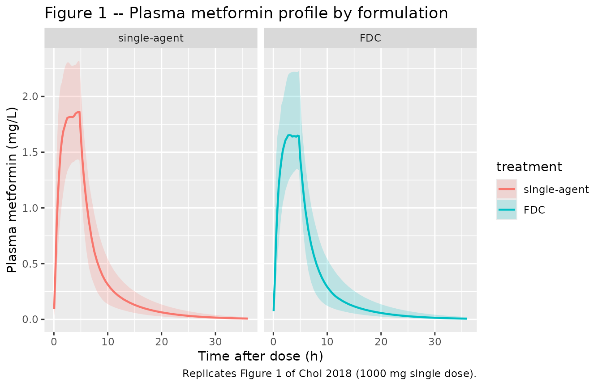
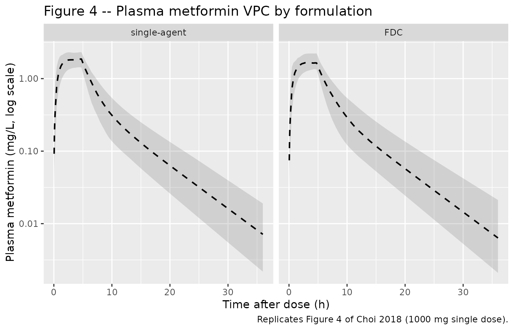
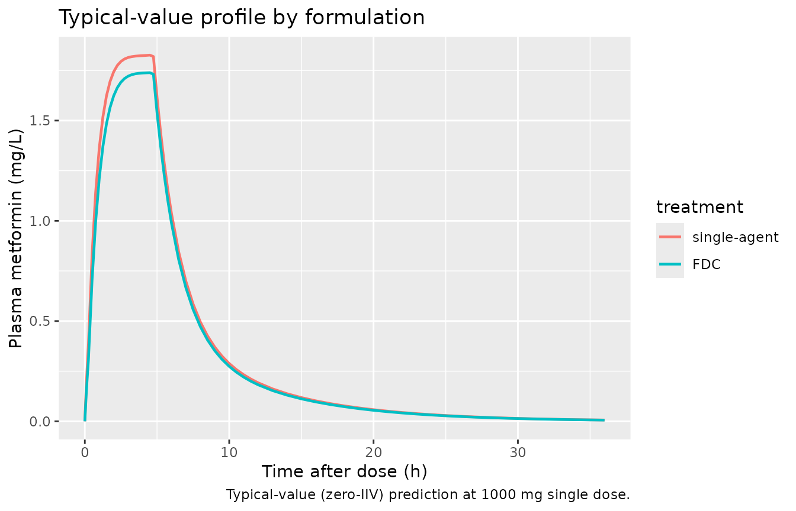

# Metformin (Choi 2018)

## Model and source

- Citation: Choi S, Jeon S, Han S (2018). Population pharmacokinetic
  analysis of metformin administered as fixed-dose combination in Korean
  healthy adults. Transl Clin Pharmacol 26(1):25-31.
  <doi:10.12793/tcp.2018.26.1.25>.
- Description: Two-compartment population PK model for oral metformin in
  36 healthy adult Korean men from a phase I single-dose 2-way crossover
  bioequivalence study comparing a single-agent metformin tablet against
  a metformin-containing fixed-dose combination (FDC) tablet (Choi
  2018). The absorption process is parallel mixed-input: fraction F1 of
  the dose is absorbed first-order from the depot compartment (rate Ka),
  and fraction (1-F1) is absorbed zero-order directly into the central
  compartment over duration D2 with lag time ALAG2. Formulation enters
  as a binary covariate (FORM_FDC) with multiplicative power-style
  effects on Ka (Ka_FDC = 0.83 \* Ka_single-agent) and on relative
  bioavailability F (F_FDC = 0.94 \* F_single-agent = 0.94). IIV on
  CL/F, Vc/F (correlated, rho 0.225), and Ka; proportional residual
  error only.
- Article (open access): <https://doi.org/10.12793/tcp.2018.26.1.25>

## Population

Thirty-six healthy adult Korean men aged 20-42 years (mean 23.9, SD 5.0)
participated in a phase I, open-label, randomized, single-dose, 2-way
crossover bioequivalence study at Seoul St. Mary’s Hospital, Catholic
University of Korea (IRB approval KC14MDSF0913). Mean height was 176.0
cm (SD 3.5; range 169.1-183.5) and mean body weight was 70.9 kg (SD
7.9). Each subject received both a single-agent metformin tablet
(reference) and a metformin-containing fixed-dose-combination (FDC)
tablet (test) across two periods separated by a 1-week wash-out,
administered with 150 mL of water after 10 h of fasting. Plasma
metformin was sampled at 0 (predose), 0.25, 0.5, 0.75, 1, 1.5, 2, 3, 4,
6, 8, 12, and 24 h after each administration, and assayed by LC-MS/MS
(Choi 2018 Methods).

The published Choi 2018 Table 1 reports the demographic summary, but the
row labels for `Weight (kg)` and `Height (cm)` are swapped: the mean +/-
SD pairs printed against `Weight (kg)` (176.0; range 169.1-183.5) are
actually the height values, and those printed against `Height (cm)`
(23.9; range 20.0-42.0) are actually the age values. The correct pairs
reproduced in the paragraph above are taken from the Results “Dataset”
prose narrative. Additionally, the prose narrative prints the weight
units as “cm” rather than “kg”; this is a paper typo since the Table 1
column header clearly states “Weight (kg)”.

The same information is available programmatically via
`rxode2::rxode(readModelDb("Choi_2018_metformin"))$population`.

## Source trace

The per-parameter origin is recorded as an in-file comment next to each
`ini()` entry in `inst/modeldb/specificDrugs/Choi_2018_metformin.R`. The
table below collects them in one place for review.

| Equation / parameter | Value | Source location |
|----|----|----|
| `lcl` (apparent CL/F) | log(76.7 L/h) | Choi 2018 Table 3 |
| `lvc` (apparent Vc/F) | log(180 L) | Choi 2018 Table 3 |
| `lq` (apparent Q/F) | log(21.3 L/h) | Choi 2018 Table 3 |
| `lvp` (apparent Vp/F) | log(109 L) | Choi 2018 Table 3 |
| `lka` (1st-order Ka, single-agent ref) | log(1.19 /h) | Choi 2018 Table 3 (Ka1) |
| `ld2` (zero-order duration D2) | log(4.49 h) | Choi 2018 Table 3 (D2) |
| `lalag2` (zero-order lag ALAG2) | log(0.250 h) | Choi 2018 Table 3 (ALAG2) |
| `logitf1` (fraction first-order) | qlogis(0.289) | Choi 2018 Table 3 (F1) |
| `e_form_fdc_ka` (Ka shift for FDC) | 0.830 | Choi 2018 Table 3 (Influence of formulation on Ka) |
| `e_form_fdc_f` (F shift for FDC) | 0.940 | Choi 2018 Table 3 (Influence of formulation on F) |
| `etalcl` (omega^2) | log(1 + 0.198^2) = 0.03845 | Choi 2018 Table 3: CV% CL/F = 19.8 |
| `etalvc` (omega^2) | log(1 + 0.328^2) = 0.10215 | Choi 2018 Table 3: CV% Vc/F = 32.8 |
| `etalka` (omega^2) | log(1 + 0.636^2) = 0.33967 | Choi 2018 Table 3: CV% Ka = 63.6 |
| `cov(etalcl, etalvc)` | 0.225 \* sqrt(0.03845 \* 0.10215) = 0.01411 | Choi 2018 Table 3: rho(CL/F, Vc/F) = 0.225 |
| `propSd` (proportional residual SD) | 0.259 | Choi 2018 Table 3 (sigma_prop) |
| Parallel mixed absorption (1st-order via depot + zero-order direct to central with lag) | n/a | Choi 2018 Figure 2 / Methods “Population Pharmacokinetic Analysis” |
| Formulation effect: theta_test = theta_ref \* X^formulation | n/a | Choi 2018 Methods Eq. 2 |
| Reference category: formulation = 0 = single-agent metformin tablet | n/a | Choi 2018 Methods Eq. 2 |

## Virtual cohort

Original observed data are not publicly available. The figures below use
a virtual population matched to the Choi 2018 study design (36 subjects
each receiving both single-agent and FDC formulations in a 2-way
crossover), replicated to give a stable VPC envelope. The single-dose
strength is not stated in the paper; 1000 mg is used here as a
representative metformin dose used in commercially marketed metformin
FDC products (e.g. metformin 1000 mg + sitagliptin 50 mg Janumet
50/1000); the choice scales the simulated concentrations proportionally
but does not affect the AUC and Cmax ratios between formulations since
both formulation arms receive the same dose strength.

``` r

set.seed(2018)

n_per_arm <- 100L
dose_mg   <- 1000

arm_def <- tibble::tribble(
  ~treatment,        ~FORM_FDC,
  "single-agent",    0L,
  "FDC",             1L
)

make_cohort <- function(arm_row, id_offset) {
  ids <- id_offset + seq_len(n_per_arm)

  # First-order arm: dose to depot with no special rate.
  dose_first <- expand.grid(id = ids, KEEP.OUT.ATTRS = FALSE,
                            stringsAsFactors = FALSE)
  dose_first$time <- 0
  dose_first$amt  <- dose_mg
  dose_first$evid <- 1L
  dose_first$cmt  <- "depot"
  dose_first$rate <- NA_real_

  # Zero-order arm: dose to central with rate = -2 to invoke the
  # modelled duration dur(central) = D2 (Choi 2018 zero-order arm of
  # duration 4.49 h with 0.25 h lag).
  dose_zero <- dose_first
  dose_zero$cmt  <- "central"
  dose_zero$rate <- -2

  # Observation grid: extends through 36 h to capture the terminal
  # phase beyond the paper's 24 h sampling. Dense early sampling
  # captures the first-order peak; the zero-order infusion ends at
  # ALAG2 + D2 = 4.74 h. Include t = 0 so PKNCA can integrate AUC
  # from the dose time.
  obs_grid <- c(0, 0.05, 0.1, 0.15, 0.25, 0.5, 0.75,
                seq(1, 6, by = 0.25),
                seq(6.5, 12, by = 0.5),
                seq(13, 36, by = 1))
  obs_pk <- expand.grid(id = ids, time = obs_grid,
                        KEEP.OUT.ATTRS = FALSE, stringsAsFactors = FALSE)
  obs_pk$amt  <- NA_real_
  obs_pk$evid <- 0L
  obs_pk$cmt  <- NA_character_
  obs_pk$rate <- NA_real_

  cohort <- dplyr::bind_rows(dose_first, dose_zero, obs_pk)
  cohort$treatment <- arm_row$treatment
  cohort$FORM_FDC  <- arm_row$FORM_FDC
  cohort
}

events <- dplyr::bind_rows(
  make_cohort(arm_def[1, ], id_offset = 0L),
  make_cohort(arm_def[2, ], id_offset = n_per_arm)
)

# Disjoint IDs across cohorts (mandatory).
stopifnot(!anyDuplicated(unique(events[, c("id", "time", "evid")])))
```

## Simulation

``` r

mod <- rxode2::rxode(readModelDb("Choi_2018_metformin"))
#> ℹ parameter labels from comments will be replaced by 'label()'
sim <- rxode2::rxSolve(mod, events = events,
                       keep = c("treatment", "FORM_FDC")) |>
  as.data.frame()
sim$treatment <- factor(sim$treatment, levels = c("single-agent", "FDC"))
```

For a typical-value comparison (no between-subject variability, matching
the structural model’s typical-value profile), zero the omegas:

``` r

mod_typical <- rxode2::zeroRe(mod, which = "omega")
sim_typical <- rxode2::rxSolve(mod_typical, events = events,
                               keep = c("treatment", "FORM_FDC")) |>
  as.data.frame()
#> ℹ omega/sigma items treated as zero: 'etalcl', 'etalvc', 'etalka'
#> Warning: multi-subject simulation without without 'omega'
sim_typical$treatment <- factor(sim_typical$treatment,
                                levels = c("single-agent", "FDC"))
```

## Replicate published figures

### Figure 1 – Individual plasma concentration vs time

Choi 2018 Figure 1 shows individual plasma concentration-versus-time
profiles for (A) single-agent metformin and (B) the FDC, with the median
overlaid in bold red. The simulated profiles below reproduce the median
and 5th-95th percentile envelope by formulation.

``` r

# Replicates Figure 1 of Choi 2018: individual plasma metformin
# concentration profiles by formulation; bold line = median.
sim |>
  dplyr::filter(!is.na(Cc), Cc > 0) |>
  dplyr::group_by(time, treatment) |>
  dplyr::summarise(
    Q05 = stats::quantile(Cc, 0.05, na.rm = TRUE),
    Q50 = stats::quantile(Cc, 0.50, na.rm = TRUE),
    Q95 = stats::quantile(Cc, 0.95, na.rm = TRUE),
    .groups = "drop"
  ) |>
  ggplot2::ggplot(ggplot2::aes(time, Q50, colour = treatment, fill = treatment)) +
  ggplot2::geom_ribbon(ggplot2::aes(ymin = Q05, ymax = Q95),
                       alpha = 0.20, colour = NA) +
  ggplot2::geom_line(linewidth = 0.8) +
  ggplot2::facet_wrap(~ treatment) +
  ggplot2::labs(x = "Time after dose (h)",
                y = "Plasma metformin (mg/L)",
                title = "Figure 1 -- Plasma metformin profile by formulation",
                caption = "Replicates Figure 1 of Choi 2018 (1000 mg single dose).")
```



### Figure 4 – Visual predictive check by formulation

Choi 2018 Figure 4 shows VPCs of plasma metformin concentration for (A)
the single-agent arm and (B) the FDC arm. The dashed line and grey
shading represent the median and 90% prediction interval of the
simulated concentrations, with observed data overlaid.

``` r

# Replicates Figure 4 of Choi 2018: VPC (median + 90% PI) of plasma
# metformin by formulation arm. Observed circles are not reproduced
# here because the underlying subject-level concentrations are not
# distributed with the paper.
sim |>
  dplyr::filter(!is.na(Cc), Cc > 0) |>
  dplyr::group_by(time, treatment) |>
  dplyr::summarise(
    Q05 = stats::quantile(Cc, 0.05, na.rm = TRUE),
    Q50 = stats::quantile(Cc, 0.50, na.rm = TRUE),
    Q95 = stats::quantile(Cc, 0.95, na.rm = TRUE),
    .groups = "drop"
  ) |>
  ggplot2::ggplot(ggplot2::aes(time, Q50)) +
  ggplot2::geom_ribbon(ggplot2::aes(ymin = Q05, ymax = Q95),
                       alpha = 0.25, fill = "grey50") +
  ggplot2::geom_line(linetype = "dashed", linewidth = 0.7) +
  ggplot2::facet_wrap(~ treatment) +
  ggplot2::scale_y_log10() +
  ggplot2::labs(x = "Time after dose (h)",
                y = "Plasma metformin (mg/L, log scale)",
                title = "Figure 4 -- Plasma metformin VPC by formulation",
                caption = "Replicates Figure 4 of Choi 2018 (1000 mg single dose).")
```



### Typical-value profiles (no IIV)

``` r

sim_typical |>
  dplyr::filter(!is.na(Cc)) |>
  ggplot2::ggplot(ggplot2::aes(time, Cc, colour = treatment)) +
  ggplot2::geom_line(linewidth = 0.8) +
  ggplot2::labs(x = "Time after dose (h)",
                y = "Plasma metformin (mg/L)",
                title = "Typical-value profile by formulation",
                caption = "Typical-value (zero-IIV) prediction at 1000 mg single dose.")
```



## PKNCA validation

``` r

# Keep t = 0 with Cc = 0 so PKNCA can integrate AUC from the dose
# time; only filter NAs.
sim_nca <- sim |>
  dplyr::filter(!is.na(Cc)) |>
  dplyr::select(id, time, Cc, treatment) |>
  dplyr::distinct(id, time, .keep_all = TRUE) |>
  as.data.frame()

dose_df <- events |>
  dplyr::filter(evid == 1L, cmt == "depot") |>
  dplyr::select(id, time, amt) |>
  dplyr::left_join(events |> dplyr::select(id, treatment) |>
                     dplyr::distinct(id, treatment),
                   by = "id") |>
  as.data.frame()

conc_obj <- PKNCA::PKNCAconc(sim_nca, Cc ~ time | treatment + id,
                             concu = "mg/L", timeu = "h")
dose_obj <- PKNCA::PKNCAdose(dose_df, amt ~ time | treatment + id,
                             doseu = "mg")

intervals <- data.frame(
  start       = 0,
  end         = 24,
  cmax        = TRUE,
  tmax        = TRUE,
  auclast     = TRUE,
  aucinf.obs  = TRUE,
  half.life   = TRUE
)

nca_res <- suppressWarnings(
  PKNCA::pk.nca(PKNCA::PKNCAdata(conc_obj, dose_obj, intervals = intervals))
)

nca_tbl <- as.data.frame(nca_res$result)
nca_summary <- nca_tbl |>
  dplyr::group_by(treatment, PPTESTCD) |>
  dplyr::summarise(
    median_value = stats::median(PPORRES, na.rm = TRUE),
    q05          = stats::quantile(PPORRES, 0.05, na.rm = TRUE),
    q95          = stats::quantile(PPORRES, 0.95, na.rm = TRUE),
    .groups      = "drop"
  ) |>
  tidyr::pivot_wider(names_from = PPTESTCD,
                     values_from = c(median_value, q05, q95))

knitr::kable(nca_summary,
             caption = "Simulated NCA parameters by formulation (median and 90% PI across 100 virtual subjects per arm).")
```

| treatment | median_value_adj.r.squared | median_value_aucinf.obs | median_value_auclast | median_value_clast.obs | median_value_clast.pred | median_value_cmax | median_value_half.life | median_value_lambda.z | median_value_lambda.z.n.points | median_value_lambda.z.time.first | median_value_lambda.z.time.last | median_value_r.squared | median_value_span.ratio | median_value_tlast | median_value_tmax | q05_adj.r.squared | q05_aucinf.obs | q05_auclast | q05_clast.obs | q05_clast.pred | q05_cmax | q05_half.life | q05_lambda.z | q05_lambda.z.n.points | q05_lambda.z.time.first | q05_lambda.z.time.last | q05_r.squared | q05_span.ratio | q05_tlast | q05_tmax | q95_adj.r.squared | q95_aucinf.obs | q95_auclast | q95_clast.obs | q95_clast.pred | q95_cmax | q95_half.life | q95_lambda.z | q95_lambda.z.n.points | q95_lambda.z.time.first | q95_lambda.z.time.last | q95_r.squared | q95_span.ratio | q95_tlast | q95_tmax |
|:---|---:|---:|---:|---:|---:|---:|---:|---:|---:|---:|---:|---:|---:|---:|---:|---:|---:|---:|---:|---:|---:|---:|---:|---:|---:|---:|---:|---:|---:|---:|---:|---:|---:|---:|---:|---:|---:|---:|---:|---:|---:|---:|---:|---:|---:|
| FDC | 0.9999311 | 11.77236 | 11.55898 | 0.0329996 | 0.0329024 | 1.704277 | 4.933599 | 0.1404953 | 9 | 16 | 24 | 0.9999405 | 1.657120 | 24 | 4.5 | 0.9999005 | 9.292727 | 9.141886 | 0.0132229 | 0.0131617 | 1.374486 | 4.485303 | 0.1194147 | 6 | 11.5 | 24 | 0.9999141 | 0.9723874 | 24 | 1.25 | 0.9999560 | 16.90487 | 16.23595 | 0.0845698 | 0.0843389 | 2.230276 | 5.804637 | 0.1545374 | 14 | 19 | 24 | 0.9999604 | 2.732051 | 24 | 4.75 |
| single-agent | 0.9999315 | 13.56747 | 13.26974 | 0.0365602 | 0.0364473 | 1.901282 | 4.989245 | 0.1389283 | 9 | 16 | 24 | 0.9999389 | 1.676573 | 24 | 4.5 | 0.9999038 | 9.479661 | 9.401161 | 0.0139780 | 0.0138964 | 1.438393 | 4.428262 | 0.1241664 | 7 | 11.0 | 24 | 0.9999130 | 1.1157093 | 24 | 1.25 | 0.9999545 | 18.33756 | 17.65615 | 0.0828569 | 0.0825704 | 2.337367 | 5.582528 | 0.1565281 | 15 | 18 | 24 | 0.9999596 | 2.824724 | 24 | 4.75 |

Simulated NCA parameters by formulation (median and 90% PI across 100
virtual subjects per arm). {.table style="width:100%;"}

### Comparison against published exposure ratios

Choi 2018 does not tabulate per-arm mean Cmax / AUC values, but the
Discussion notes that the geometric mean ratio of AUC_last from NCA (FDC
/ single-agent) was 0.9136. The popPK model’s formulation coefficient on
relative bioavailability F is 0.940 (Table 3 row “Influence of
formulation on bioavailability”). Both quantities describe the same
biological effect (lower extent of absorption with the FDC formulation)
and should agree within a few percent.

``` r

# Geometric mean ratio FDC vs single-agent for AUClast.
auc_arm <- nca_tbl |>
  dplyr::filter(PPTESTCD == "auclast", !is.na(PPORRES)) |>
  dplyr::mutate(treatment = as.character(treatment)) |>
  dplyr::group_by(treatment) |>
  dplyr::summarise(geomean_AUClast = exp(mean(log(PPORRES))),
                   .groups = "drop")

auc_lookup <- setNames(auc_arm$geomean_AUClast, auc_arm$treatment)
sim_ratio  <- unname(auc_lookup[["FDC"]] / auc_lookup[["single-agent"]])

ratio_table <- tibble::tibble(
  source                  = c("Choi 2018 NCA (Discussion)",
                              "Choi 2018 popPK (Table 3)",
                              "Simulated NCA"),
  AUC_ratio_FDC_vs_single = c(0.9136,
                              0.940,
                              sim_ratio)
)

knitr::kable(ratio_table,
             digits  = 3,
             caption = "Geometric-mean AUC_last ratio (FDC / single-agent metformin) from published NCA, Choi 2018 popPK structural coefficient, and the simulated NCA on the packaged model.")
```

| source                     | AUC_ratio_FDC_vs_single |
|:---------------------------|------------------------:|
| Choi 2018 NCA (Discussion) |                   0.914 |
| Choi 2018 popPK (Table 3)  |                   0.940 |
| Simulated NCA              |                   0.916 |

Geometric-mean AUC_last ratio (FDC / single-agent metformin) from
published NCA, Choi 2018 popPK structural coefficient, and the simulated
NCA on the packaged model. {.table}

## Assumptions and deviations

- **Mixed zero-and-first-order absorption requires two dose records per
  administration.** A single oral metformin dose enters the data table
  as (a) one dose to compartment `depot` with no `rate` (the first-order
  absorption arm, scaled by `f(depot) = f_rel * F1`) and
  2.  one dose to compartment `central` with `rate = -2` (the zero-order
      absorption arm, scaled by `f(central) = f_rel * (1 - F1)` and
      infused over `dur(central) = D2` after `lag(central) = ALAG2`).
      The `rate = -2` flag invokes rxode2’s modelled-duration mechanism;
      omitting it collapses the zero-order arm into an instantaneous
      bolus and produces an unrealistically early Cmax. The
      `make_cohort()` helper above shows the canonical pattern.
- **Reference category 0 = single-agent metformin tablet (Choi 2018
  orientation).** The canonical `FORM_FDC` column value semantics (1 =
  FDC, 0 = single-drug tablet) are preserved across all nlmixr2lib
  models, but the typical-value reference category is paper-defined. In
  Choi 2018 the structural Ka and the implicit F = 1.0 are anchored to
  the single-agent arm (FORM_FDC = 0), so the FDC arm (FORM_FDC = 1)
  introduces multiplicative shifts ka_FDC = 0.83 \* ka_ref and F_FDC =
  0.94. This orientation is the opposite of the antitubercular FDC
  precedent (Wilkins 2008 rifampicin, where the FDC arm is the
  typical-value reference and the single-drug-tablet SDC arm introduces
  shifts), but no transformation of the column values is needed –
  FORM_FDC = 1 always means “FDC tablet”. Documented in the canonical
  FORM_FDC entry in `inst/references/covariate-columns.md`
  (general-scope promotion on 2026-05-30 alongside this extraction).
- **Single dose strength not reported.** Choi 2018 Methods describe
  “either a test or reference formulation” but do not state the
  per-occasion mg amount. The vignette uses 1000 mg as a representative
  dose strength of commercially marketed metformin FDC products in
  Korea. The choice of dose strength scales the simulated concentrations
  proportionally but does not affect the formulation AUC and Cmax ratios
  because both arms receive the same nominal amount and the popPK
  parameters are apparent-bioavailability scaled.
- **Specific FDC co-formulant drug not named.** The paper describes
  “metformin administered as fixed-dose combination” without naming the
  specific co-formulated antidiabetic. Korean metformin FDC products
  co-formulate with sitagliptin, glimepiride, vildagliptin, or
  dapagliflozin among others; the formulation-coefficient estimates Ka =
  0.83 and F = 0.94 reflect whichever single FDC product was used in the
  Choi 2018 study and may not generalise to other metformin
  co-formulations.
- **Table 1 typographical errors.** Choi 2018 Table 1 swaps the row
  labels for “Weight (kg)” and “Height (cm)” (the values printed in the
  Weight row are the height values and vice-versa). Additionally, the
  prose narrative “Mean height and weight were 176.0 +/- 3.5 cm and 70.9
  +/- 7.9 cm” prints “cm” rather than “kg” for the weight unit. The
  corrected values used in this vignette and in the packaged
  `population` metadata are taken from the prose narrative, with the
  units corrected to the conventional kg for weight.
- **No additive residual error.** Choi 2018 Table 3 reports only a
  proportional residual error (sigma_prop = 0.259, RSE 2.73%); no
  additive component was retained in the final model. The packaged model
  encodes only `propSd`, matching the source.
- **Multiple peaks during absorption phase.** Choi 2018 Discussion notes
  that the observed concentration profiles in many subjects showed
  multiple peaks during the absorption phase, attributed to
  solubility-limited / site-specific absorption, gastric emptying, and
  gastroduodenal reflux (metformin pharmacology, Choi 2018 refs
  \[6,7,8\]). The dual-arm absorption model (first-order + zero-order)
  captures the broad biexponential absorption envelope but does not
  attempt to reproduce subject-specific multi-peak features, which the
  paper acknowledges as “not well captured by the model”.
- **No covariates other than formulation were retained.** Choi 2018
  Results “Covariate Analysis and Formulation Difference” reports that
  age, weight, height, and creatinine clearance were screened in
  stepwise selection but none reached significance at p \< 0.05; the
  authors attribute the absence of size / renal-function effects to the
  narrow demographic range of the healthy-volunteer cohort.
