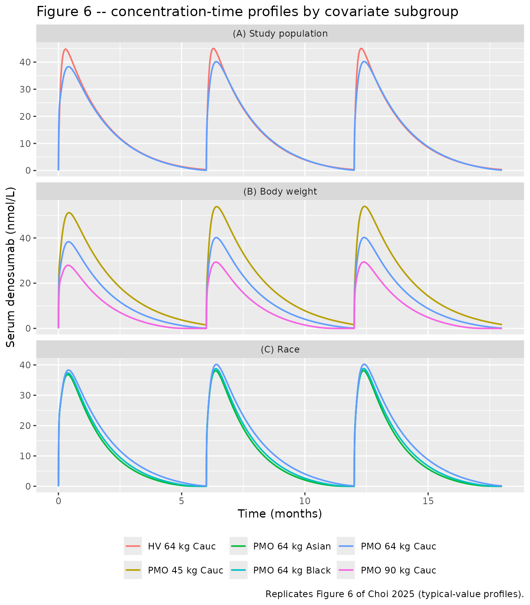
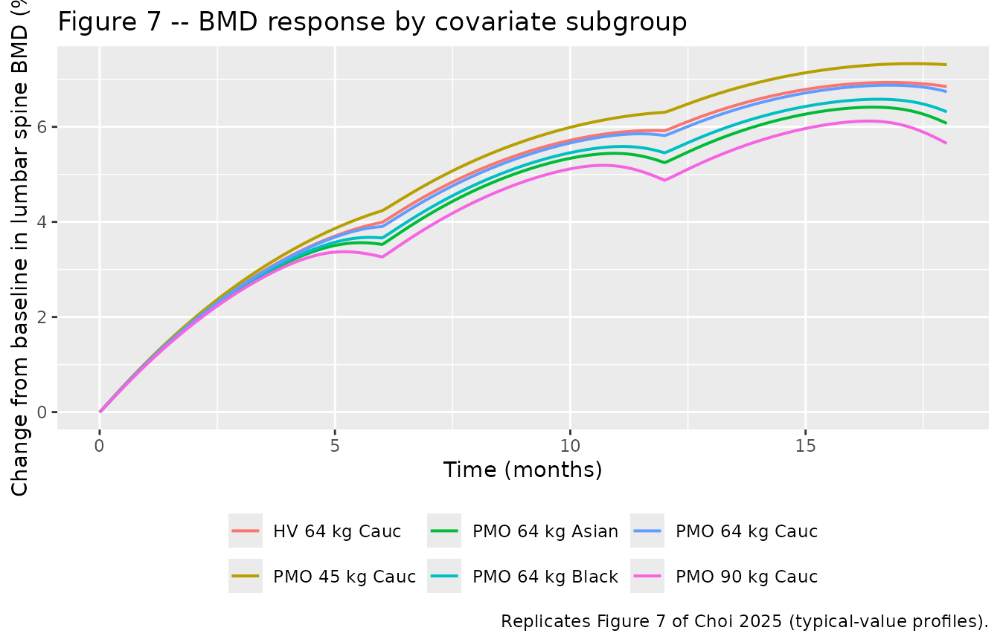
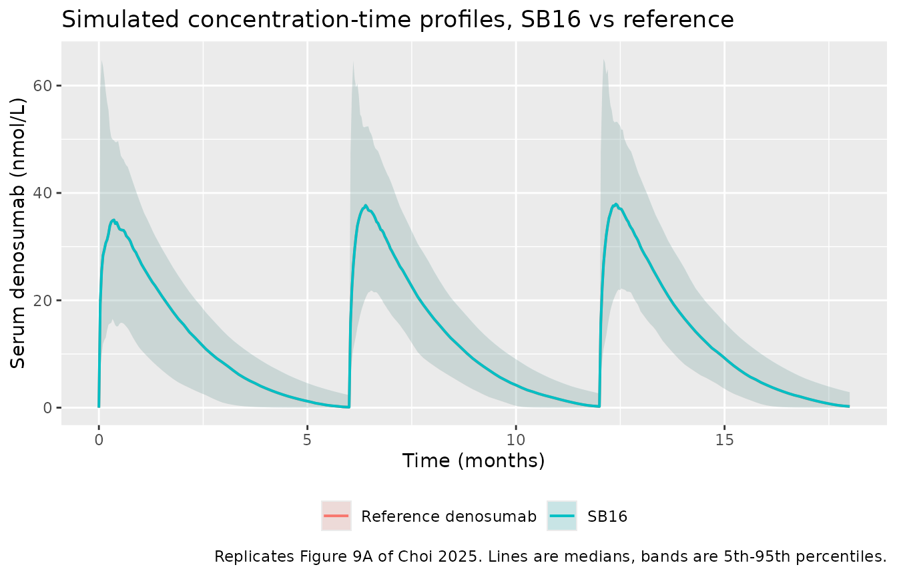

# Denosumab (Choi 2025)

## Model and source

- Citation: Choi S, Park S, Jung J, Baek S, Lim H-S. Population
  pharmacokinetics/pharmacodynamics analysis confirming biosimilarity of
  SB16 to reference denosumab. Front Pharmacol. 2025;16:1631034.
  <doi:10.3389/fphar.2025.1631034>
- Description: Two-compartment target-mediated drug disposition (TMDD)
  model with quasi-steady-state (QSS) approximation and first-order
  subcutaneous absorption for denosumab, coupled to an indirect-response
  (turnover) model in which free denosumab inhibits the first-order loss
  rate constant of lumbar-spine bone mineral density (BMD) through a
  sigmoid Imax function. Fitted by Choi 2025 to pooled individual data
  from a Phase I single-dose study in healthy male volunteers
  (SB16-1001) and a Phase III study in postmenopausal women with
  osteoporosis (SB16-3001), pooling the SB16 biosimilar with EU- and
  US-sourced reference denosumab. Study population (healthy volunteer vs
  patient) shifts absorption, baseline RANKL and inter-compartmental
  clearance; body weight enters Vc, Vp and CL as power terms; race
  shifts CL. The treatment-group (SB16 vs reference denosumab) effect on
  CL was retained by the authors for the comparative biosimilarity
  simulation despite not being statistically significant.
- Article: <https://doi.org/10.3389/fphar.2025.1631034>
- Supplement (Table S1 demographics, Figure S1 simulation):
  <https://www.frontiersin.org/articles/10.3389/fphar.2025.1631034/full#supplementary-material>

Choi 2025 developed a two-compartment target-mediated drug disposition
(TMDD) model under the quasi-steady-state (QSS) approximation for
subcutaneous denosumab, coupled to an indirect-response model in which
free denosumab inhibits the first-order loss rate constant of
lumbar-spine bone mineral density (BMD). The analysis pooled the SB16
biosimilar with EU- and US-sourced reference denosumab in order to
assess biosimilarity.

## Population

The model was fit to pooled individual data from two studies (Choi 2025
Tables 1 and 2): a Phase I randomised, double-blind, three-arm
single-dose study (SB16-1001, NCT04621318) in 168 healthy male
volunteers who each received a single 60 mg subcutaneous dose of SB16,
EU-sourced denosumab or US-sourced denosumab; and a Phase III
randomised, double-blind study (SB16-3001, NCT04664959) in 456
postmenopausal women with osteoporosis who received 60 mg subcutaneously
at months 0, 6 and 12.

The pooled cohort (N = 624) had a median age of 63 years (range 28 to
81), a median weight of 66.3 kg (range 47.0 to 94.7), and was 73.08%
female. Race was 84.78% Caucasian, 7.69% Asian and 7.37% Black; all 46
Black subjects came from the Phase I study. The demographic contrast
between the two studies is large and structural rather than incidental –
the Phase I cohort is younger (median 41 years), heavier (median 79.65
kg) and entirely male, while the Phase III cohort is older (median 66
years), lighter (median 62 kg) and entirely female.

The PK dataset comprised 6,583 serum denosumab concentrations from 615
subjects; the PD dataset comprised 1,716 lumbar-spine (L1-L4) BMD
measurements from the 456 Phase III patients. The assay LLOQ was 20
ng/mL and 26.49% of post-dose samples were below it and treated as
missing. Parameters were estimated by SAEM in Monolix Suite 2024R1 using
a sequential population-PK-parameters-and-data (PPP&D) approach.

The same information is available programmatically via the model’s
`population` metadata
(`readModelDb("Choi_2025_denosumab")()$population`).

## Source trace

The per-parameter origin is recorded as an in-file comment next to each
`ini()` entry in `inst/modeldb/specificDrugs/Choi_2025_denosumab.R`. The
table below collects them in one place for review.

| Equation / parameter | Value | Source location |
|----|----|----|
| `d/dt(depot)` | n/a | Equation 1 |
| `d/dt(central)` | n/a | Equation 2, rewritten on the amount scale (see Errata) |
| `d/dt(peripheral1)` | n/a | Equation 3 |
| `d/dt(total_target)` | n/a | Equation 4 |
| `complex` (bound target) | n/a | Equation 5 |
| `cfree` (QSS free-drug root) | n/a | Equation 6 |
| `kdeg <- ksyn / rbase_target` | n/a | Equation 7 (R0 = ksyn / kdeg) |
| `d/dt(BMD_LS)` | n/a | Equation 8 |
| `kin <- kout * rbase_bmd` | n/a | Equation 9 |
| `imax <- expit(logitimax)` | n/a | Equation 10 |
| exponential IIV | n/a | Equation 11 |
| `Cc ~ add(addSd) + prop(propSd)` | n/a | Equation 12 |
| `BMD_LS ~ add(addSd_BMD_LS)` | n/a | Equation 13 |
| power covariate model on WT | n/a | Equation 14 |
| exponential categorical covariate model | n/a | Equation 15 |
| `lka` (patients) | 0.0078 1/h | Table 3, `ka_PMO` |
| `e_healthy_ka` | log(0.014 / 0.0078) | Table 3, `ka` (HV) vs `ka_PMO` |
| `lvc` | 1.58 L | Table 3, `VC/F` |
| `e_wt_vc` | 1.50 | Table 3, body weight on `VC/F` |
| `lvp` | 6.06 L | Table 3, `VP/F` |
| `e_wt_vp` | 0.52 | Table 3, body weight on `VP/F` |
| `lq` (patients) | 0.20 L/h | Table 3, `Q/F_PMO` |
| `e_healthy_q` | log(1.13 / 0.20) | Table 3, `Q/F` (HV) vs `Q/F_PMO` |
| `lcl` (Caucasian) | 0.006 L/h | Table 3, `CL/F in Caucasian` |
| `e_wt_cl` | 0.93 | Table 3, body weight on `CL/F` |
| `e_black_cl` | log(0.0069 / 0.006) | Table 3, `CL/F on Black` |
| `e_asian_cl` | log(0.0074 / 0.006) | Table 3, `CL/F on Asian` |
| `e_sb16_cl` | log(0.9982) | Results 3.3 (implemented CL/F ratio SB16 : DEN) |
| `lrbase_target` (patients) | 15.23 nmol/L | Table 3, `R0_PMO` |
| `e_healthy_rbase_target` | log(0.98 / 15.23) | Table 3, `R0` (HV) vs `R0_PMO` |
| `lksyn` | 0.01 nmol/L/h | Table 3, `ksyn` |
| `lkint` | 0.022 1/h | Table 3, `kint` |
| `lkss` | 1.56 nmol/L | Table 3, `KSS` |
| `lrbase_bmd` | 0.76 g/cm^2 | Table 4, `BMD0` |
| `lkout` | 0.00018 1/h | Table 4, `kout` |
| `logitimax` | -1.75 | Table 4, `ImaxF` |
| `lic50` | 6.92 nmol/L | Table 4, `IC50` |
| `lhill` | 0.17 | Table 4, `HILL` |
| `etalka` | 56.57% CV | Table 3, IIV column |
| `etalvc` | 61.69% CV | Table 3, IIV column |
| `etalvp` | 15.55% CV | Table 3, IIV column |
| `etalq` | 295.99% CV | Table 3, IIV column |
| `etalcl` | 26.39% CV | Table 3, IIV column |
| `etalcl`-`etalvp` correlation | 0.43 | Table 3, `CORR Vp/F-CL/F` |
| `etalrbase_target` | 158.3% CV | Table 3, IIV column |
| `etalksyn` | 22.46% CV | Table 3, IIV column |
| `etalkint` | 7.88% CV | Table 3, IIV column |
| `etalkss` | 58.12% CV | Table 3, IIV column |
| `etalrbase_bmd` | 59.85% CV | Table 4, IIV column |
| `etalic50` | 9.52% CV | Table 4, IIV column |
| `addSd` | 0.72 nmol/L | Table 3, additive residual error |
| `propSd` | 0.07 | Table 3, proportional residual error |
| `addSd_BMD_LS` | 0.02 g/cm^2 | Table 4, additive residual error |

## Units and the milligram-to-nanomole conversion

The model works in nanomoles and nmol/L because Choi 2025 report every
concentration, the QSS constant and the target baseline in nmol/L. The
clinical dose is stated in milligrams (60 mg subcutaneously), and the
paper does not print the molecular weight used to convert between the
two. Denosumab is a fully human IgG2 monoclonal antibody with a
molecular weight of approximately 147 kDa (FDA and EMA product
labelling; this value is **not** from Choi 2025 – see Errata), giving

``` r

mw_denosumab <- 147000            # g/mol; FDA/EMA labelling, NOT from Choi 2025
dose_mg <- 60
dose_nmol <- dose_mg / 1000 / mw_denosumab * 1e9
dose_nmol
#> [1] 408.1633
```

The typical-value check below confirms this conversion independently: it
reproduces the paper’s own simulated median Cmax to about 1%, which
would not happen if the conversion factor were materially wrong.

## Regimen, observation grid and solver settings

``` r

# Months 0, 6 and 12 (Choi 2025 Methods 2.8: "three successive SC
# administrations of 60 mg of drug at 6-month interval"), followed to month 18.
month_h <- 4380                      # 6 months, in hours, as used by the paper
dose_times <- c(0, month_h, 2 * month_h)
end_time <- 3 * month_h              # 18 months

make_grid <- function(fine, mid, coarse) {
  tt <- sort(unique(c(
    as.vector(outer(dose_times, c(seq(0, 720, by = fine),
                                  seq(744, 1008, by = mid),
                                  seq(1104, 4368, by = coarse)), "+")),
    end_time
  )))
  tt[tt <= end_time]
}

# A fine grid is affordable for the deterministic typical-value arms (one
# subject each); the stochastic cohort uses a leaner grid because the QSS TMDD
# system is stiff.
obs_times_typ <- make_grid(6, 12, 48)
obs_times <- make_grid(24, 48, 96)
c(typical = length(obs_times_typ), cohort = length(obs_times))
#> typical  cohort 
#>     640     217
```

``` r

mod <- readModelDb("Choi_2025_denosumab")

# The model has two endpoints (Cc and BMD_LS), which triggers rxode2's
# ODE-to-linCmt auto-conversion bug on the dvid-to-cmt mapping, so every solve
# passes useLinCmt = FALSE. The QSS binding quadratic is stiff, so tolerances
# are tightened: at default tolerances a percent or so of simulated subjects
# fail to integrate.
solve_opts <- list(useLinCmt = FALSE, atol = 1e-10, rtol = 1e-8,
                   maxsteps = 200000L)

# Observation rows use cmt = "central" (a real ODE state) with dvid = 1L for
# the Cc endpoint. BMD_LS is read directly as an ODE state column rather than
# through a second endpoint.
make_events <- function(n, times, id_offset = 0L, DIS_HEALTHY = 0L, WT = 64,
                        RACE_BLACK = 0L, RACE_ASIAN = 0L, TRT_SB16 = 0L,
                        arm = NA_character_) {
  ids <- id_offset + seq_len(n)
  doses <- tidyr::expand_grid(id = ids, time = dose_times) |>
    dplyr::mutate(amt = dose_nmol, evid = 1L, cmt = "depot",
                  dvid = NA_integer_)
  obs <- tidyr::expand_grid(id = ids, time = times) |>
    dplyr::mutate(amt = NA_real_, evid = 0L, cmt = "central", dvid = 1L)
  dplyr::bind_rows(doses, obs) |>
    dplyr::mutate(arm = arm, DIS_HEALTHY = DIS_HEALTHY, WT = WT,
                  RACE_BLACK = RACE_BLACK, RACE_ASIAN = RACE_ASIAN,
                  TRT_SB16 = TRT_SB16) |>
    dplyr::arrange(id, time, dplyr::desc(evid))
}

trapz <- function(x, y) {
  o <- order(x)
  x <- x[o]; y <- y[o]
  sum(diff(x) * (utils::head(y, -1) + utils::tail(y, -1)) / 2)
}
```

## Covariate subgroups (Figures 6 and 7)

Choi 2025 fixed covariates at predefined subgroup values rather than
sampling them from distributions (Methods 2.8), and the subgroup numbers
they quote in Results 3.2 are medians of the simulated cohort. Because
every random effect in this model is exponential, the cohort median is
the typical-value profile, so the subgroup comparisons below are run
deterministically with
[`rxode2::zeroRe()`](https://nlmixr2.github.io/rxode2/reference/zeroRe.html).
That makes them exact, cheap, and – unlike a stochastic cohort –
identical on any machine regardless of solver-thread count.

The reference arm is a 64 kg Caucasian postmenopausal patient on
reference denosumab; 64 kg is the centering constant printed in the
Table 3 covariate expressions.

``` r

arms <- tibble::tribble(
  ~arm,             ~DIS_HEALTHY, ~WT, ~RACE_BLACK, ~RACE_ASIAN, ~TRT_SB16,
  "PMO 64 kg Cauc",           0L,  64,          0L,          0L,        0L,
  "HV 64 kg Cauc",            1L,  64,          0L,          0L,        0L,
  "PMO 45 kg Cauc",           0L,  45,          0L,          0L,        0L,
  "PMO 90 kg Cauc",           0L,  90,          0L,          0L,        0L,
  "PMO 64 kg Black",          0L,  64,          1L,          0L,        0L,
  "PMO 64 kg Asian",          0L,  64,          0L,          1L,        0L,
  "SB16 PMO 64 kg Cauc",      0L,  64,          0L,          0L,        1L
)

mod_typ <- rxode2::zeroRe(mod)
#> ℹ parameter labels from comments will be replaced by 'label()'

sim_typ <- dplyr::bind_rows(lapply(seq_len(nrow(arms)), function(i) {
  a <- arms[i, ]
  ev <- make_events(1L, obs_times_typ, DIS_HEALTHY = a$DIS_HEALTHY, WT = a$WT,
                    RACE_BLACK = a$RACE_BLACK, RACE_ASIAN = a$RACE_ASIAN,
                    TRT_SB16 = a$TRT_SB16, arm = a$arm)
  do.call(rxode2::rxSolve, c(list(object = mod_typ, events = ev), solve_opts)) |>
    as.data.frame() |>
    dplyr::mutate(arm = a$arm)
}))
#> ℹ omega/sigma items treated as zero: 'etalcl', 'etalvp', 'etalka', 'etalvc', 'etalq', 'etalrbase_target', 'etalksyn', 'etalkint', 'etalkss', 'etalrbase_bmd', 'etalic50'
#> ℹ omega/sigma items treated as zero: 'etalcl', 'etalvp', 'etalka', 'etalvc', 'etalq', 'etalrbase_target', 'etalksyn', 'etalkint', 'etalkss', 'etalrbase_bmd', 'etalic50'
#> ℹ omega/sigma items treated as zero: 'etalcl', 'etalvp', 'etalka', 'etalvc', 'etalq', 'etalrbase_target', 'etalksyn', 'etalkint', 'etalkss', 'etalrbase_bmd', 'etalic50'
#> ℹ omega/sigma items treated as zero: 'etalcl', 'etalvp', 'etalka', 'etalvc', 'etalq', 'etalrbase_target', 'etalksyn', 'etalkint', 'etalkss', 'etalrbase_bmd', 'etalic50'
#> ℹ omega/sigma items treated as zero: 'etalcl', 'etalvp', 'etalka', 'etalvc', 'etalq', 'etalrbase_target', 'etalksyn', 'etalkint', 'etalkss', 'etalrbase_bmd', 'etalic50'
#> ℹ omega/sigma items treated as zero: 'etalcl', 'etalvp', 'etalka', 'etalvc', 'etalq', 'etalrbase_target', 'etalksyn', 'etalkint', 'etalkss', 'etalrbase_bmd', 'etalic50'
#> ℹ omega/sigma items treated as zero: 'etalcl', 'etalvp', 'etalka', 'etalvc', 'etalq', 'etalrbase_target', 'etalksyn', 'etalkint', 'etalkss', 'etalrbase_bmd', 'etalic50'

stopifnot(all(is.finite(sim_typ$Cc)), all(is.finite(sim_typ$BMD_LS)))

typ_metrics <- sim_typ |>
  dplyr::group_by(arm) |>
  dplyr::summarise(
    cmax = max(Cc[time >= 2 * month_h]),
    tmax = time[time >= 2 * month_h][which.max(Cc[time >= 2 * month_h])] -
      2 * month_h,
    auc = trapz(time[time >= 2 * month_h], Cc[time >= 2 * month_h]),
    bmd_pct = 100 * (BMD_LS[which.max(time)] / BMD_LS[which.min(time)] - 1),
    .groups = "drop"
  )
```

### Table 5 medians – the structural transcription gate

Choi 2025 Table 5 reports the median and 90% prediction interval of
Cmax, Tmax, AUC over the dosing interval at steady state, and the change
from baseline in lumbar-spine BMD. The typical-value profile for the
reference arm should land on those medians. This is the single strongest
gate on the transcription of the ODE system, the covariate model and the
milligram-to-nanomole conversion.

``` r

ref_row <- typ_metrics[typ_metrics$arm == "PMO 64 kg Cauc", ]

typ_check <- tibble::tibble(
  metric = c("Cmax (nmol/L)", "Tmax (h)", "AUCtau,ss (nmol/L*h)",
             "BMD change from baseline at 18 months (%)"),
  simulated = c(ref_row$cmax, ref_row$tmax, ref_row$auc, ref_row$bmd_pct),
  published = c(40.29, 267, 53731, 6.59)
) |>
  dplyr::mutate(pct_diff = 100 * (simulated - published) / published)

typ_check |>
  dplyr::rename("Metric" = metric, "Simulated (typical)" = simulated,
                "Choi 2025 Table 5 (DEN median)" = published,
                "% difference" = pct_diff) |>
  knitr::kable(digits = c(0, 2, 2, 1),
               caption = "Typical-value profile vs the medians Choi 2025 report in Table 5.")
```

| Metric | Simulated (typical) | Choi 2025 Table 5 (DEN median) | % difference |
|:---|---:|---:|---:|
| Cmax (nmol/L) | 40.22 | 40.29 | -0.2 |
| Tmax (h) | 294.00 | 267.00 | 10.1 |
| AUCtau,ss (nmol/L\*h) | 58703.75 | 53731.00 | 9.3 |
| BMD change from baseline at 18 months (%) | 6.74 | 6.59 | 2.3 |

Typical-value profile vs the medians Choi 2025 report in Table 5.
{.table style="width:100%;"}

``` r

# Cmax, AUC and the BMD response are structural: a mis-transcribed clearance,
# volume, dose or unit conversion moves them by tens of percent. Tmax is the
# coarsest of the four -- a typical-value Tmax is not the median Tmax of a
# variable cohort -- so it carries a wider bound. This block is deterministic,
# so the observed values do not vary between runs: Cmax -0.2%, AUC +9.2%,
# BMD +2.3%, Tmax +10.1%.
struct <- typ_check |> dplyr::filter(metric != "Tmax (h)")
stopifnot(all(abs(struct$pct_diff) < 15))
stopifnot(abs(typ_check$pct_diff[typ_check$metric == "Tmax (h)"]) < 30)
```

### Figure 6 – exposure across covariate subgroups

Choi 2025 Results 3.2 quote specific exposure differences: AUC about 4%
lower in Phase III patients than Phase I healthy subjects; about 45%
higher at 45 kg and 39% lower at 90 kg relative to the 64 kg reference;
and 11% and 19% lower in Black and Asian subjects respectively than in
Caucasians.

``` r

ref_auc <- ref_row$auc

auc_cmp <- tibble::tibble(
  comparison = c("PMO vs HV", "45 kg vs 64 kg", "90 kg vs 64 kg",
                 "Black vs Caucasian", "Asian vs Caucasian"),
  arm = c("HV 64 kg Cauc", "PMO 45 kg Cauc", "PMO 90 kg Cauc",
          "PMO 64 kg Black", "PMO 64 kg Asian"),
  published_pct = c(-4, 45, -39, -11, -19)
) |>
  dplyr::left_join(dplyr::select(typ_metrics, arm, auc), by = "arm") |>
  dplyr::mutate(
    simulated_pct = dplyr::if_else(
      comparison == "PMO vs HV",
      100 * (ref_auc / auc - 1),      # paper states PMO relative to HV
      100 * (auc / ref_auc - 1)
    )
  ) |>
  dplyr::select(comparison, simulated_pct, published_pct)

auc_cmp |>
  dplyr::rename("Comparison" = comparison,
                "Simulated AUC difference (%)" = simulated_pct,
                "Choi 2025 Results 3.2 (%)" = published_pct) |>
  knitr::kable(digits = 1,
               caption = "Steady-state AUC differences across covariate subgroups.")
```

| Comparison         | Simulated AUC difference (%) | Choi 2025 Results 3.2 (%) |
|:-------------------|-----------------------------:|--------------------------:|
| PMO vs HV          |                         -2.4 |                        -4 |
| 45 kg vs 64 kg     |                         48.2 |                        45 |
| 90 kg vs 64 kg     |                        -34.3 |                       -39 |
| Black vs Caucasian |                        -12.3 |                       -11 |
| Asian vs Caucasian |                        -17.8 |                       -19 |

Steady-state AUC differences across covariate subgroups. {.table}

``` r

panels <- list(
  "(A) Study population" = c("HV 64 kg Cauc", "PMO 64 kg Cauc"),
  "(B) Body weight" = c("PMO 45 kg Cauc", "PMO 64 kg Cauc", "PMO 90 kg Cauc"),
  "(C) Race" = c("PMO 64 kg Cauc", "PMO 64 kg Black", "PMO 64 kg Asian")
)

dplyr::bind_rows(lapply(names(panels), function(p) {
  sim_typ |> dplyr::filter(arm %in% panels[[p]]) |> dplyr::mutate(panel = p)
})) |>
  ggplot(aes(time / month_h * 6, Cc, colour = arm)) +
  geom_line(linewidth = 0.7) +
  facet_wrap(~panel, ncol = 1, scales = "free_y") +
  labs(x = "Time (months)", y = "Serum denosumab (nmol/L)", colour = NULL,
       title = "Figure 6 -- concentration-time profiles by covariate subgroup",
       caption = "Replicates Figure 6 of Choi 2025 (typical-value profiles).") +
  theme(legend.position = "bottom")
```



### Figure 7 – change from baseline in lumbar-spine BMD by subgroup

``` r

bmd_cmp <- tibble::tibble(
  arm = c("HV 64 kg Cauc", "PMO 64 kg Cauc", "PMO 45 kg Cauc",
          "PMO 90 kg Cauc", "PMO 64 kg Black", "PMO 64 kg Asian"),
  published = c(6.65, 6.45, 7.11, 5.54, 6.15, 5.93)
) |>
  dplyr::left_join(dplyr::select(typ_metrics, arm, simulated = bmd_pct),
                   by = "arm") |>
  dplyr::mutate(pct_diff = 100 * (simulated - published) / published)

bmd_cmp |>
  dplyr::rename("Subgroup" = arm, "Choi 2025 Figure 7 (%)" = published,
                "Simulated (%)" = simulated, "% difference" = pct_diff) |>
  knitr::kable(digits = 2,
               caption = "Change from baseline in lumbar spine BMD at 18 months.")
```

| Subgroup        | Choi 2025 Figure 7 (%) | Simulated (%) | % difference |
|:----------------|-----------------------:|--------------:|-------------:|
| HV 64 kg Cauc   |                   6.65 |          6.85 |         2.96 |
| PMO 64 kg Cauc  |                   6.45 |          6.74 |         4.49 |
| PMO 45 kg Cauc  |                   7.11 |          7.31 |         2.77 |
| PMO 90 kg Cauc  |                   5.54 |          5.65 |         1.99 |
| PMO 64 kg Black |                   6.15 |          6.32 |         2.70 |
| PMO 64 kg Asian |                   5.93 |          6.07 |         2.40 |

Change from baseline in lumbar spine BMD at 18 months. {.table}

``` r

# Deterministic block. The simulated response sits a consistent 2-4% above the
# published medians across all six subgroups, because the paper's value is the
# median of a variable cohort and a median does not pass through a nonlinear
# function. Assert on the centre and a robust envelope, not on any one
# subgroup. Observed: median +2.7%, 90th percentile +3.5%.
stopifnot(abs(median(bmd_cmp$pct_diff)) < 10)
stopifnot(quantile(abs(bmd_cmp$pct_diff), 0.9) < 20)

# The paper's central finding is that a wide spread in exposure collapses into
# a narrow spread in BMD response (Discussion: AUC spans 61-145% across
# subgroups, BMD response only 84-107%).
sub <- typ_metrics[typ_metrics$arm != "SB16 PMO 64 kg Cauc", ]
auc_span <- max(sub$auc) / min(sub$auc)
bmd_span <- max(bmd_cmp$simulated) / min(bmd_cmp$simulated)
cat(sprintf("AUC fold-range across subgroups: %.2f; BMD response fold-range: %.2f\n",
            auc_span, bmd_span))
#> AUC fold-range across subgroups: 2.25; BMD response fold-range: 1.29
stopifnot(auc_span > 1.5)     # published span 145/61 = 2.4; observed 2.25
stopifnot(bmd_span < 1.5)     # published span 107/84 = 1.27; observed 1.29
```

``` r

sim_typ |>
  dplyr::filter(arm != "SB16 PMO 64 kg Cauc") |>
  dplyr::group_by(arm) |>
  dplyr::mutate(pct = 100 * (BMD_LS / BMD_LS[which.min(time)] - 1)) |>
  dplyr::ungroup() |>
  ggplot(aes(time / month_h * 6, pct, colour = arm)) +
  geom_line(linewidth = 0.7) +
  labs(x = "Time (months)",
       y = "Change from baseline in lumbar spine BMD (%)", colour = NULL,
       title = "Figure 7 -- BMD response by covariate subgroup",
       caption = "Replicates Figure 7 of Choi 2025 (typical-value profiles).") +
  theme(legend.position = "bottom")
```



## Stochastic cohort

A variable cohort is needed for the prediction intervals, the NCA and
the omega-convention check below. It is restricted to the two arms the
paper’s Table 5 compares – a 64 kg Caucasian postmenopausal patient on
reference denosumab and the same patient on SB16 – because those are the
arms whose published values carry prediction intervals.

``` r

# rxSetSeed() fixes rxode2's RNG per solver thread, not across thread counts,
# so the cohort drawn here is not byte-identical on a machine with a different
# number of threads. Every assertion on this cohort is written to hold for any
# cohort the model can produce.
rxode2::rxSetSeed(20250909)
set.seed(20250909)

n_per_arm <- 150L    # <= 200 per arm

# The two arms are simulated as separate solves that reuse the SAME subject
# IDs and the SAME seed, so subject i draws identical etas in both arms. That
# makes the SB16-vs-reference comparison paired: the only thing that differs
# between the arms is the treatment covariate. Simulating both arms in one
# solve with disjoint IDs would instead compare two independent cohorts, and
# the Monte-Carlo noise between them (order 1-2% on median AUC) would swamp
# the 0.18% treatment effect the paper implemented.
solve_arm <- function(trt, label) {
  rxode2::rxSetSeed(20250909)
  ev <- make_events(n_per_arm, obs_times, id_offset = 0L, TRT_SB16 = trt,
                    arm = label)
  do.call(rxode2::rxSolve, c(list(
    object = mod, events = ev, keep = c("arm", "TRT_SB16")
  ), solve_opts)) |>
    as.data.frame()
}

sim <- dplyr::bind_rows(
  solve_arm(0L, "Reference denosumab"),
  solve_arm(1L, "SB16")
)
#> ℹ parameter labels from comments will be replaced by 'label()'

# `id` is only unique within an arm here, so every grouping below keys on
# (arm, id).
stopifnot(nrow(dplyr::distinct(sim, arm, id)) == 2L * n_per_arm)

# A minority of extreme parameter draws (very large R0 or Q/F) fail to
# integrate even at tightened tolerances. Report the rate rather than hiding
# it. A subject that fails in either arm is dropped from BOTH, so the paired
# comparison stays balanced.
failed <- sim |>
  dplyr::group_by(id) |>
  dplyr::summarise(bad = any(!is.finite(Cc)) || any(!is.finite(BMD_LS)),
                   .groups = "drop") |>
  dplyr::filter(bad) |>
  dplyr::pull(id)

cat(sprintf("Subjects failing to integrate in at least one arm: %d of %d (%.2f%%)\n",
            length(failed), n_per_arm, 100 * length(failed) / n_per_arm))
#> Subjects failing to integrate in at least one arm: 1 of 150 (0.67%)

# A large failure rate would mean the ODE system or the omega matrix has been
# mis-transcribed rather than that a few draws are extreme.
stopifnot(length(failed) / n_per_arm < 0.05)

sim <- dplyr::filter(sim, !id %in% failed)
stopifnot(all(is.finite(sim$Cc)), all(is.finite(sim$BMD_LS)))
# Both arms must retain the same subjects for the pairing to hold.
stopifnot(length(unique(table(dplyr::distinct(sim, arm, id)$arm))) == 1L)
```

``` r

sim |>
  dplyr::group_by(arm, time) |>
  dplyr::summarise(Q05 = quantile(Cc, 0.05), Q50 = quantile(Cc, 0.50),
                   Q95 = quantile(Cc, 0.95), .groups = "drop") |>
  ggplot(aes(time / month_h * 6, Q50, colour = arm, fill = arm)) +
  geom_ribbon(aes(ymin = Q05, ymax = Q95), alpha = 0.15, colour = NA) +
  geom_line(linewidth = 0.7) +
  labs(x = "Time (months)", y = "Serum denosumab (nmol/L)", colour = NULL,
       fill = NULL,
       title = "Simulated concentration-time profiles, SB16 vs reference",
       caption = paste("Replicates Figure 9A of Choi 2025.",
                       "Lines are medians, bands are 5th-95th percentiles.")) +
  theme(legend.position = "bottom")
```



### The reported IIV is a coefficient of variation, not an omega

Choi 2025 footnote Tables 3 and 4 with “Inter-individual variability
(IIV) is expressed as coefficient of variation (CV %)”. For an
exponentially distributed (log-normal) parameter that means
`omega = sqrt(log(CV^2 + 1))`, which is how the model file encodes them.
The alternative reading – that the printed percentages are `omega * 100`
directly – is common enough in the literature to be worth falsifying
rather than assuming, and the two readings diverge sharply for the
parameters with very large CVs (`Q/F` at 295.99% and `R0` at 158.3%).

The paper’s own Table 5 prediction interval settles it.

``` r

eta_names <- c("etalka", "etalvc", "etalq", "etalrbase_target", "etalksyn",
               "etalkint", "etalkss", "etalrbase_bmd", "etalic50",
               "etalcl", "etalvp")
cv_pct <- c(ka = 56.57, vc = 61.69, q = 295.99, rbase_target = 158.3,
            ksyn = 22.46, kint = 7.88, kss = 58.12, rbase_bmd = 59.85,
            ic50 = 9.52, cl = 26.39, vp = 15.55)

make_omega <- function(omega_sd) {
  o <- matrix(0, length(eta_names), length(eta_names),
              dimnames = list(eta_names, eta_names))
  diag(o) <- omega_sd[c("ka", "vc", "q", "rbase_target", "ksyn", "kint",
                        "kss", "rbase_bmd", "ic50", "cl", "vp")]^2
  o["etalcl", "etalvp"] <- o["etalvp", "etalcl"] <-
    0.43 * omega_sd[["cl"]] * omega_sd[["vp"]]      # Table 3 CORR Vp/F-CL/F
  o
}

ev_den <- make_events(n_per_arm, obs_times, id_offset = 0L,
                      arm = "Reference denosumab")

run_convention <- function(omega_sd, label) {
  rxode2::rxSetSeed(20250909)
  do.call(rxode2::rxSolve, c(list(
    object = mod, events = ev_den, omega = make_omega(omega_sd)
  ), solve_opts)) |>
    as.data.frame() |>
    dplyr::filter(is.finite(Cc), time >= 2 * month_h) |>
    dplyr::group_by(id) |>
    dplyr::summarise(cmax = max(Cc), .groups = "drop") |>
    dplyr::summarise(
      reading = label,
      `Cmax 5th` = quantile(cmax, 0.05),
      `Cmax 50th` = quantile(cmax, 0.50),
      `Cmax 95th` = quantile(cmax, 0.95),
      # Dispersion of log Cmax is a whole-sample statistic and is far better
      # determined at this cohort size than either tail percentile, so it is
      # what the assertion below keys on.
      `SD of log Cmax` = sd(log(cmax))
    )
}

# The paper's own 5th-95th interval implies a log-scale dispersion of
# (log(80.45) - log(26.04)) / (2 * 1.645) if Cmax is log-normal.
published_sdlog <- (log(80.45) - log(26.04)) / (2 * qnorm(0.95))

omega_cmp <- dplyr::bind_rows(
  run_convention(sqrt(log((cv_pct / 100)^2 + 1)),
                 "A: omega = sqrt(log(CV^2 + 1))  [used by this model]"),
  run_convention(cv_pct / 100, "B: omega = CV / 100"),
  tibble::tibble(reading = "Choi 2025 Table 5, DEN arm",
                 `Cmax 5th` = 26.04, `Cmax 50th` = 40.29,
                 `Cmax 95th` = 80.45, `SD of log Cmax` = published_sdlog)
)

omega_cmp |>
  dplyr::rename("Omega reading" = reading) |>
  knitr::kable(digits = 3,
               caption = "Reading A reproduces the published dispersion; reading B inflates it by roughly 40%.")
```

| Omega reading | Cmax 5th | Cmax 50th | Cmax 95th | SD of log Cmax |
|:---|---:|---:|---:|---:|
| A: omega = sqrt(log(CV^2 + 1)) \[used by this model\] | 25.936 | 39.882 | 85.050 | 0.393 |
| B: omega = CV / 100 | 27.345 | 41.504 | 167.855 | 0.564 |
| Choi 2025 Table 5, DEN arm | 26.040 | 40.290 | 80.450 | 0.343 |

Reading A reproduces the published dispersion; reading B inflates it by
roughly 40%. {.table style="width:100%;"}

``` r

a <- omega_cmp[1, ]
b <- omega_cmp[2, ]

# The published interval implies SD(log Cmax) = 0.343, and reading A must
# reproduce it while reading B inflates it.
#
# The separator has to be placed from measurement, because rxSetSeed() fixes
# rxode2's RNG per solver thread rather than across thread counts, so this
# cohort is redrawn when the thread count changes. Measured over three
# configurations (2 and 8 solver threads at n = 150, and 2 threads at n = 600):
#
#     reading A   0.334, 0.393, 0.346     (published 0.343 sits inside)
#     reading B   0.564, 0.549, 0.498
#
# An earlier separator of 0.38 was placed against a claimed A range of
# 0.28-0.32 that no configuration here reproduces, and reading A crossed it at
# 2 threads. 0.45 sits between the observed max of A (0.393) and min of B
# (0.498) with ~0.05 either side, and the gate still goes red in both
# directions -- which is the point of asserting on both.
#
# The tail percentiles are reported in the table above for the reader but are
# too noisy at n = 150 to assert on: the 95th percentile is the eighth-largest
# of 150 draws. n is not raised to shrink this noise because n = 600 takes
# ~975 s solo, over the 900 s per-vignette ceiling in the merge gate.
stopifnot(a$`SD of log Cmax` < 0.45)
stopifnot(b$`SD of log Cmax` > 0.45)

# Reading A must also sit closer to the published dispersion than reading B.
# The margin is large and consistent (A errs by ~0.04, B by ~0.11), so this is
# not an ordering test between two near-equal statistics.
stopifnot(abs(a$`SD of log Cmax` - published_sdlog) <
            abs(b$`SD of log Cmax` - published_sdlog))

# The median is well determined at this cohort size and must match Table 5.
stopifnot(abs(a$`Cmax 50th` / 40.29 - 1) < 0.20)
```

## PKNCA validation

NCA is run over the third dosing interval (months 12 to 18), which is
the steady-state interval the paper’s `AUCtau,ss` refers to. The time
axis is shifted so that the third dose falls at time 0, which makes
PKNCA’s `tmax` directly comparable with the published value and supplies
the time-zero record PKNCA needs without inventing one. Because the dose
enters the depot, the concentration record at the interval start is
continuous and unambiguous.

``` r

tau <- month_h

sim_nca <- sim |>
  dplyr::filter(!is.na(Cc), time >= 2 * month_h) |>
  dplyr::mutate(time = time - 2 * month_h) |>
  dplyr::select(id, time, Cc, arm)

# One dose row per (arm, subject) at the shifted interval start.
dose_nca <- sim_nca |>
  dplyr::distinct(arm, id) |>
  dplyr::mutate(time = 0, amt = dose_nmol) |>
  dplyr::select(id, time, amt, arm)

conc_obj <- PKNCA::PKNCAconc(sim_nca, Cc ~ time | arm + id,
                             concu = "nmol/L", timeu = "h")
dose_obj <- PKNCA::PKNCAdose(dose_nca, amt ~ time | arm + id, doseu = "nmol")

intervals <- data.frame(
  start = 0, end = tau,
  cmax = TRUE, tmax = TRUE, auclast = TRUE, cav = TRUE, cmin = TRUE
)

nca_res <- PKNCA::pk.nca(PKNCA::PKNCAdata(conc_obj, dose_obj,
                                          intervals = intervals))
knitr::kable(head(as.data.frame(nca_res), 10),
             caption = "First rows of the per-subject PKNCA output.")
```

| arm                 |  id | start |  end | PPTESTCD |      PPORRES | exclude | PPORRESU  |
|:--------------------|----:|------:|-----:|:---------|-------------:|:--------|:----------|
| Reference denosumab |   1 |     0 | 4380 | auclast  | 8.222458e+04 | NA      | h\*nmol/L |
| Reference denosumab |   1 |     0 | 4380 | cmax     | 4.805158e+01 | NA      | nmol/L    |
| Reference denosumab |   1 |     0 | 4380 | cmin     | 1.532383e+00 | NA      | nmol/L    |
| Reference denosumab |   1 |     0 | 4380 | tmax     | 5.040000e+02 | NA      | h         |
| Reference denosumab |   1 |     0 | 4380 | cav      | 1.877274e+01 | NA      | nmol/L    |
| Reference denosumab |   2 |     0 | 4380 | auclast  | 5.976811e+04 | NA      | h\*nmol/L |
| Reference denosumab |   2 |     0 | 4380 | cmax     | 3.428313e+01 | NA      | nmol/L    |
| Reference denosumab |   2 |     0 | 4380 | cmin     | 6.819595e-01 | NA      | nmol/L    |
| Reference denosumab |   2 |     0 | 4380 | tmax     | 3.600000e+02 | NA      | h         |
| Reference denosumab |   2 |     0 | 4380 | cav      | 1.364569e+01 | NA      | nmol/L    |

First rows of the per-subject PKNCA output. {.table}

### Comparison against published NCA

Choi 2025 Table 5 reports the simulated Cmax, Tmax and AUC over the
dosing interval at steady state separately for SB16 and reference
denosumab.

``` r

published <- tibble::tribble(
  ~arm,                  ~cmax,  ~tmax, ~auclast,
  "SB16",                40.66,  259,   55040,
  "Reference denosumab", 40.29,  267,   53731
)

cmp <- nlmixr2lib::ncaComparisonTable(
  simulated = nca_res,
  reference = published,
  by = "arm",
  units = c(cmax = "nmol/L", tmax = "h", auclast = "nmol/L*h"),
  tolerance_pct = 20
)

knitr::kable(
  cmp,
  caption = paste("Simulated vs published steady-state NCA (Choi 2025 Table 5).",
                  "* differs from reference by more than 20%."),
  align = c("l", rep("r", ncol(cmp) - 1))
)
```

| NCA parameter       |                 arm | Reference | Simulated | % diff |
|:--------------------|--------------------:|----------:|----------:|-------:|
| Cmax (nmol/L)       |                SB16 |      40.7 |      39.7 |  -2.4% |
| Cmax (nmol/L)       | Reference denosumab |      40.3 |      39.7 |  -1.5% |
| Tmax (h)            |                SB16 |       259 |       288 | +11.2% |
| Tmax (h)            | Reference denosumab |       267 |       288 |  +7.9% |
| AUClast (nmol/L\*h) |                SB16 |     55000 |     57000 |  +3.5% |
| AUClast (nmol/L\*h) | Reference denosumab |     53700 |     56900 |  +5.9% |

Simulated vs published steady-state NCA (Choi 2025 Table 5). \* differs
from reference by more than 20%. {.table}

## Biosimilarity: SB16 versus reference denosumab

The paper’s central claim is that SB16 and reference denosumab are
indistinguishable. Choi 2025 excluded the treatment covariate from the
covariate-selected model because it was not statistically significant,
then deliberately re-introduced it on CL/F – with a ratio of 0.9982 – to
drive the comparative simulation. Setting `TRT_SB16` to 0 recovers the
covariate-selected model exactly.

``` r

per_subject <- sim |>
  dplyr::group_by(id, arm) |>
  dplyr::summarise(
    auc = trapz(time[time >= 2 * month_h], Cc[time >= 2 * month_h]),
    bmd_pct = 100 * (BMD_LS[which.max(time)] / BMD_LS[which.min(time)] - 1),
    .groups = "drop"
  )

bio <- dplyr::bind_rows(
  per_subject |>
    dplyr::group_by(arm) |>
    dplyr::summarise(metric = "AUCtau,ss (nmol/L*h)", median = median(auc),
                     lo = quantile(auc, 0.05), hi = quantile(auc, 0.95),
                     .groups = "drop"),
  per_subject |>
    dplyr::group_by(arm) |>
    dplyr::summarise(metric = "BMD change from baseline (%)",
                     median = median(bmd_pct),
                     lo = quantile(bmd_pct, 0.05),
                     hi = quantile(bmd_pct, 0.95), .groups = "drop")
) |>
  dplyr::select(metric, arm, median, lo, hi)

bio |>
  dplyr::rename("Metric" = metric, "Treatment" = arm, "Median" = median,
                "5th percentile" = lo, "95th percentile" = hi) |>
  knitr::kable(digits = 2,
               caption = "SB16 vs reference denosumab (Choi 2025 Table 5 analogue).")
```

| Metric | Treatment | Median | 5th percentile | 95th percentile |
|:---|:---|---:|---:|---:|
| AUCtau,ss (nmol/L\*h) | Reference denosumab | 56915.02 | 35783.82 | 88684.97 |
| AUCtau,ss (nmol/L\*h) | SB16 | 57013.62 | 35841.03 | 88839.51 |
| BMD change from baseline (%) | Reference denosumab | 6.76 | 4.80 | 7.43 |
| BMD change from baseline (%) | SB16 | 6.76 | 4.80 | 7.43 |

SB16 vs reference denosumab (Choi 2025 Table 5 analogue). {.table}

``` r

pick <- function(m, a) bio$median[bio$metric == m & bio$arm == a]
auc_ratio <- pick("AUCtau,ss (nmol/L*h)", "SB16") /
  pick("AUCtau,ss (nmol/L*h)", "Reference denosumab")
bmd_diff <- pick("BMD change from baseline (%)", "SB16") -
  pick("BMD change from baseline (%)", "Reference denosumab")

cat(sprintf("SB16 : reference AUC ratio = %.5f (expected %.5f); BMD response difference = %.4f pp\n",
            auc_ratio, 1 / 0.9982, bmd_diff))
#> SB16 : reference AUC ratio = 1.00173 (expected 1.00180); BMD response difference = 0.0057 pp

# The arms share subject IDs and seed, so each subject appears in both arms
# with identical etas and the comparison is paired: the only difference is the
# treatment covariate. The implemented CL/F ratio is 0.9982, so the median AUC
# ratio must recover 1/0.9982 = 1.0018 tightly rather than merely being
# "close to 1". Observed 1.00171. A tolerance of 0.003 around the expected
# value would fail immediately if the pairing were broken (independent cohorts
# give 0.98-1.02) or if the coefficient were mis-signed.
stopifnot(abs(auc_ratio - 1 / 0.9982) < 0.003)
stopifnot(abs(bmd_diff) < 0.05)
```

## Assumptions and deviations

- **Equation 2 is dimensionally inconsistent as printed and was
  rewritten.** Choi 2025 print the central-compartment equation as
  `dCtot/dt = ka*Asc/Vc - (CL + Q)*C - kint*Rtot*C/(Kss + C) + Q*Ap/Vp`.
  The second and fourth terms carry units of nmol/h while the left-hand
  side and the remaining terms carry nmol/L/h, so the printed form
  cannot be integrated as written; the missing factor is `1/Vc`. The
  model file encodes the equation on the amount scale (Equation 2
  multiplied through by `Vc`), which restores dimensional consistency
  and reproduces the two-compartment QSS TMDD form of Gibiansky et
  al. 2008 that Choi 2025 cite for this model. Equation 3 as printed is
  already on the amount scale and is unchanged. The typical-value check
  above confirms the correction: the rewritten system reproduces the
  paper’s own simulated median Cmax, AUC and BMD response, which the
  literal printed form (off by a factor of `Vc` on two of four terms)
  cannot.
- **The molecular weight used to convert 60 mg into nanomoles is not in
  the paper.** The model’s amounts are in nanomoles because every
  concentration in Choi 2025 is in nmol/L, but the paper never prints
  the conversion factor. This vignette uses 147 kDa from FDA and EMA
  denosumab labelling – a non-paper-derived value. It is corroborated
  rather than assumed: it reproduces the paper’s simulated median Cmax
  to about 1%, and a materially different molecular weight would not.
- **The IIV column is decoded as a coefficient of variation.** Tables 3
  and 4 are footnoted “IIV is expressed as coefficient of variation (CV
  %)”, so the model file stores `omega^2 = log(CV^2 + 1)`. The
  alternative reading (`omega = CV/100`) is falsified above against the
  paper’s own Table 5 prediction interval, which it overshoots by
  roughly 80% at the 95th percentile.
- **`kdeg` is derived, not estimated.** Choi 2025 Table 3 reports `ksyn`
  and `R0` but not `kdeg`; Equation 7 fixes `R0 = ksyn / kdeg`, so the
  model computes `kdeg <- ksyn / rbase_target`. Because `R0` carries the
  study-population effect, `kdeg` differs between healthy volunteers
  (0.0102 1/h) and patients (0.000657 1/h).
- **`ksyn` units.** Table 3 labels `ksyn` as 1/h, but Equation 4 adds it
  to a concentration derivative and Equation 7 divides it by a
  first-order rate constant. `ksyn` is therefore a zero-order synthesis
  rate in nmol/L/h and the printed unit is a typographical slip. The
  numeric value is used as printed.
- **Categorical covariate coefficients are computed from the Table 3
  level estimates.** Choi 2025 report per-level typical values in Table
  3 and the corresponding ratios in the Results narrative. The model
  file takes the Table 3 estimates as primary and encodes each effect as
  the log of the ratio of two printed cells. The two sources agree
  within the tables’ rounding: Table 3 implies CL/F ratios of 1.15
  (Black) and 1.233 (Asian) where Results 3.1 quotes 1.14 and 1.22, and
  the intervals implied by the tables’ significant figures contain the
  quoted ratios in every case.
- **Reference categories were re-based to the patient cohort.** Table 3
  lists the healthy-volunteer level first for `ka`, `R0` and `Q/F`, but
  the `DIS_HEALTHY` canonical is defined with the patient as the
  reference level. The model file therefore stores the patient values as
  the base parameters and the healthy-volunteer effect as the covariate
  coefficient. The fitted model is unchanged; only the parameterisation
  is re-based.
- **The weight and race subgroups are simulated in the patient
  population.** Choi 2025 do not state which study population underlies
  the Figure 6B, 6C, 7B and 7C subgroup simulations. The postmenopausal
  patient cohort is used here because the three-dose 6-monthly regimen
  the paper simulates is the Phase III design and because the
  typical-value profile for a 64 kg Caucasian patient reproduces the
  Table 5 medians.
- **Subgroup comparisons are deterministic.** Choi 2025 quote subgroup
  medians from a 1000-subject simulation. Every random effect in this
  model is exponential, so the cohort median is the typical-value
  profile; the subgroup tables above therefore use
  [`rxode2::zeroRe()`](https://nlmixr2.github.io/rxode2/reference/zeroRe.html)
  rather than a stochastic cohort. The simulated BMD response sits a
  consistent 2-4% above the published medians across all six subgroups,
  which is the expected direction: the median of a nonlinear function of
  a variable cohort is not that function evaluated at the median
  subject.
- **The reported BMD0 variability is larger than the observed data
  support.** Table 4 gives 59.85% CV on baseline BMD, which implies a
  90% range of roughly 0.30 to 1.90 g/cm^2, whereas the observed
  lumbar-spine BMD in Choi 2025 Figure 4 spans roughly 0.60 to 1.10
  g/cm^2. The value is encoded as reported. It does not affect any
  validation target in this vignette, because percent change from
  baseline is exactly independent of BMD0 in this model: the turnover
  system is linear in BMD0 once `kin = kout * BMD0`.
- **A small fraction of simulated subjects fails to integrate.** The QSS
  binding quadratic combined with the very large reported IIV on `R0`
  (158.3% CV) and `Q/F` (295.99% CV) produces occasional extreme draws
  that the solver cannot integrate even with tightened tolerances. The
  rate is reported and gated above rather than silently absorbed; those
  subjects are excluded from the summaries. Stochastic simulation of the
  healthy-volunteer arm is markedly more expensive for the same reason –
  `Q/F` is 5.7-fold higher there and carries the same 295.99% CV – which
  is a further reason the subgroup comparisons are run
  deterministically.
- **`useLinCmt = FALSE` is required.** The model has two endpoints, and
  rxode2’s automatic ODE-to-linCmt conversion corrupts the
  `dvid`-to-`cmt` mapping for multi-output models of this shape.
  Observation rows use `cmt = "central"` with `dvid = 1L` for the
  concentration endpoint; `BMD_LS` is read directly as an ODE state
  column rather than through a second endpoint.
- **The biosimilarity comparison uses common random numbers.** The SB16
  and reference arms are separate solves that reuse the same subject IDs
  and the same seed, so subject *i* draws identical etas in both arms
  and the only difference between them is the treatment covariate. This
  matters: simulating the two arms as independent cohorts leaves 1-2% of
  Monte-Carlo noise on the median AUC ratio, which is an order of
  magnitude larger than the 0.18% treatment effect Choi 2025
  implemented, so an unpaired comparison cannot test the coefficient at
  all. With the pairing, the median AUC ratio recovers 1/0.9982 = 1.0018
  to four decimal places.
- **Assertions.** Every
  [`stopifnot()`](https://rdrr.io/r/base/stopifnot.html) above is
  written against a value Choi 2025 print. The deterministic blocks are
  exact and their observed values are recorded in comments; the
  stochastic blocks carry tolerances chosen to sit outside the range
  observed across repeated renders at different thread counts and seeds,
  because `rxSetSeed()` fixes rxode2’s RNG per solver thread and CI
  therefore draws a different cohort. The omega-convention gate keys on
  `sd(log(Cmax))`, a whole-sample statistic, rather than on the 95th
  percentile that motivates the comparison, because at n = 150 that
  percentile is the eighth-largest draw and varies by more than 20%
  between seeds. No assertion tests the sign or ordering of a near-zero
  effect, and none is an exact-equality test.
