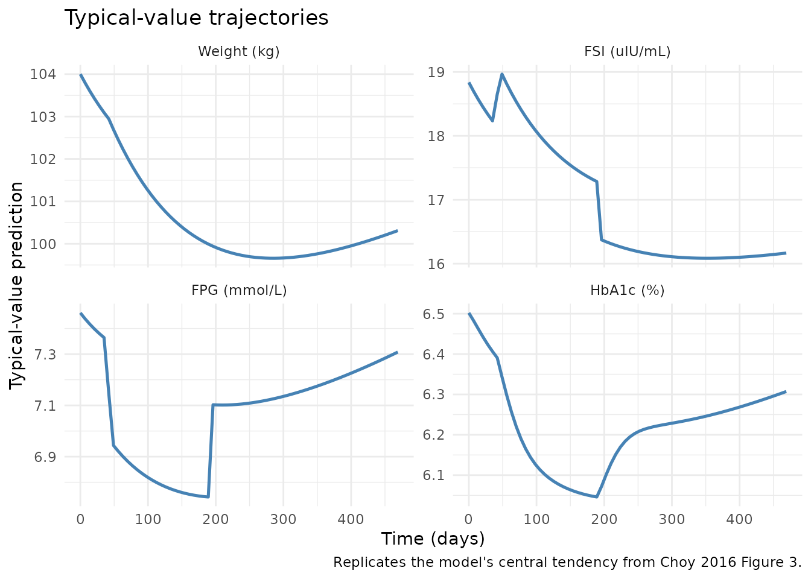
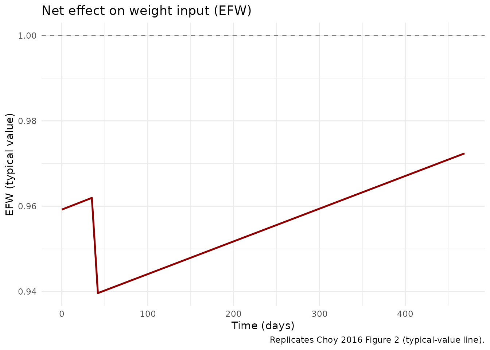
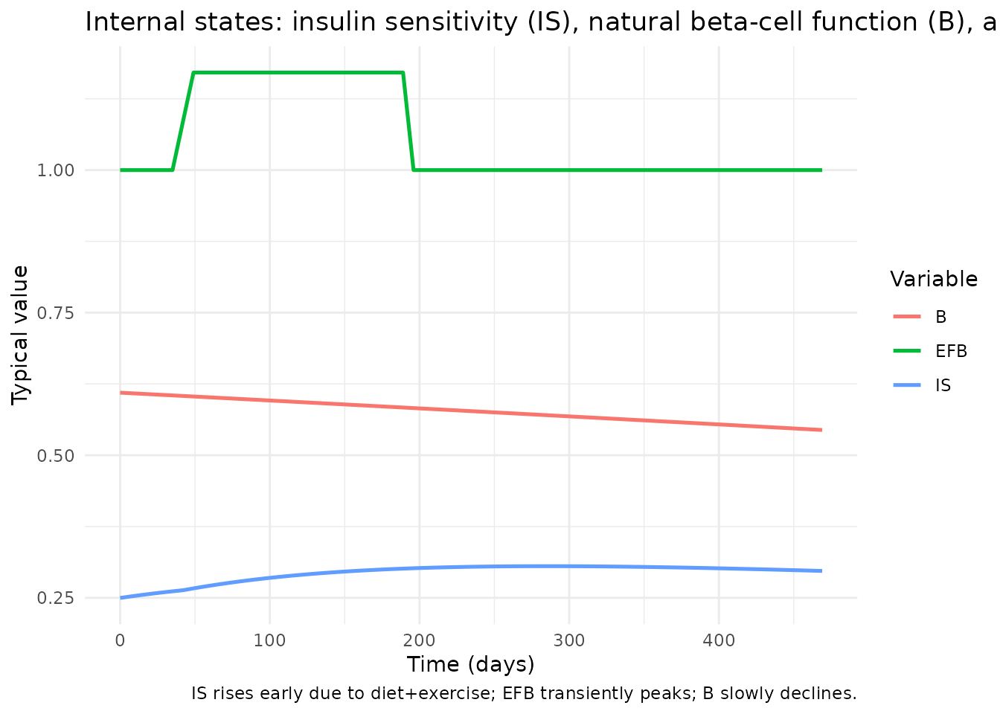
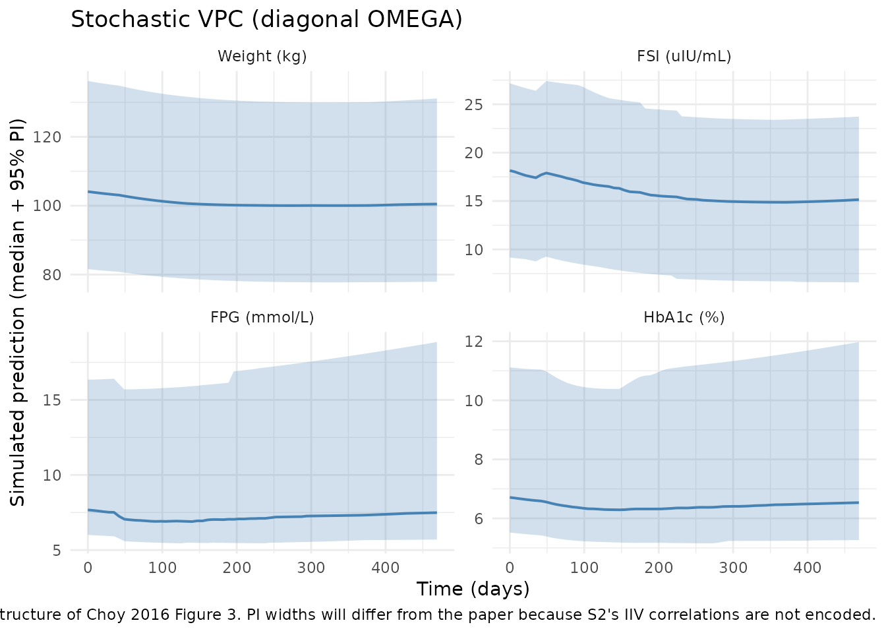
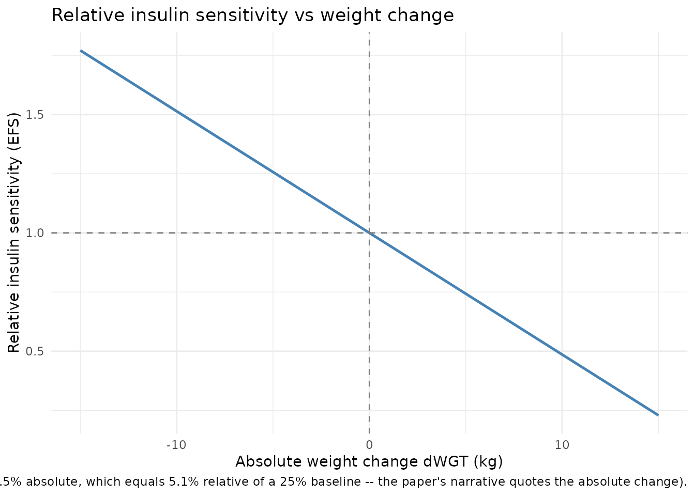

# Type 2 Diabetes Disease Progression - WHIG (Choy 2016)

## Model and source

- Citation: Choy S, Kjellsson MC, Karlsson MO, de Winter W.
  Weight-HbA1c-Insulin-Glucose Model for Describing Disease Progression
  of Type 2 Diabetes. *CPT Pharmacometrics Syst Pharmacol.*
  2016;5(1):11-19.
- Article: <https://doi.org/10.1002/psp4.12051>
- Open access (Creative Commons Attribution-NonCommercial).

The WHIG model is a semi-mechanistic disease-progression model for type
2 diabetes mellitus (T2DM). It links a body-weight turnover sub-model to
a previously published FSI / FPG / HbA1c homeostatic feedback model (de
Winter et al. 2006) by routing absolute weight change through insulin
sensitivity. The full structure (Choy 2016 Figure 1) is:

- **Weight**: turnover compartment with a single half-life. The input is
  multiplicatively driven by a normalised net effect `EFW`, which
  combines an immediate diet+exercise step at `t = 0`, a placebo step at
  `t = tTRT = 42 days`, and a linear-in-time positive counter-effect
  representing waning adherence.
- **Insulin sensitivity**: baseline `IS_baseline = 1/(1 + exp(is0))`;
  weight loss linearly raises sensitivity through
  `EFS = 1 - scaleefs * dWGT`.
- **beta-cell function**: baseline `B_baseline = 1/(1 + exp(b0))`;
  logistic decline over time on the logit scale. A composite empirical
  treatment effect `EFB` (a logistic up-step around `tTRT` followed by a
  logistic down-step around `efb50`) multiplies the natural beta-cell
  function during the early study period.
- **FSI-FPG homeostasis**: at quasi-steady state (Choy 2016
  supplementary linearisation) FPG is the positive root of a quadratic
  in IS, beta-cell scaling, and the HOMA constants
  `KinFSI/KoutFSI = 7.8` and `KinFPG/KoutFPG = 35.1`; FSI then follows
  algebraically.
- **HbA1c**: three transit compartments with shared rate constant
  `3/MTT`. Production enters compartment 1 as
  `kin_hba1c * FPG + ppg_eff`, where `ppg_eff` is reduced by `scaleppg`
  for `t > 0`. Total HbA1c is the sum of all three transit compartments.

## Population

Model parameters were estimated from the placebo arm of a randomised,
double-blind, placebo-controlled, multicentre, parallel-group study of
topiramate for weight loss in T2DM (ClinicalTrials.gov identifier
NCT00236600). Choy 2016 used 181 obese (BMI 27 to 50 kg/m^2), Swedish,
newly diagnosed, treatment-naive T2DM patients (67 men, 114 women;
baseline median weight 104 kg, range 72 to 159 kg; baseline median FSI
17.8 uIU/mL; baseline median FPG 7.6 mmol/L; baseline median HbA1c
6.7%). Subjects underwent a 6-week placebo run-in followed by a 60-week
treatment phase (8-week titration + 52-week fixed-dose maintenance). All
subjects received an individualised energy-deficient diet (600 kcal
below total energy expenditure), behavioural modification, and physical
activity counselling throughout.

The same information is available programmatically via the model’s
`population` metadata (`readModelDb("Choy_2016_T2DM_WHIG")$population`
after the model is loaded).

## Source trace

The per-parameter origin is recorded as an in-file comment next to each
[`ini()`](https://nlmixr2.github.io/rxode2/reference/ini.html) entry in
`inst/modeldb/therapeuticArea/Choy_2016_T2DM_WHIG.R`. The table below
collects the structural equations and the typical values in one place
for review.

| Equation / parameter | Value (paper) | Source location |
|----|----|----|
| Eq. 1 (energy balance) | n/a (structural) | Choy 2016, p. 12 (Weight change) |
| Eq. 2 (`EFDE+P`) | n/a (structural) | Choy 2016, p. 12 |
| Eq. 3 (`EFUP`) | n/a (structural) | Choy 2016, p. 12 |
| Eq. 4 (`d/dt(WGT)`) | n/a (structural) | Choy 2016, p. 12 |
| Eq. 5 (`dWGT`) | n/a (definition) | Choy 2016, p. 13 (Insulin sensitivity) |
| Eq. 6 (`EFS = 1 - scaleefs*dWGT`) | n/a (structural) | Choy 2016, p. 13 |
| Eq. 7 (beta-cell logistic) | n/a (structural) | Choy 2016, p. 13 (beta-cell) |
| Eq. 8-9 (`EFBI`, `EFBD`, `EFB`) | n/a (structural) | Choy 2016, p. 13 |
| Eq. 10-12 (FSI-FPG ODEs) | n/a (structural) | Choy 2016, p. 13 (FSI-FPG feedback) |
| Eq. 13 (`HbA1c = sum`) | n/a (definition) | Choy 2016, p. 13 (HbA1c model) |
| Eq. 14-17 (HbA1c transit chain) | n/a (structural) | Choy 2016, p. 13 |
| `t_half_wgt` | 96.9 d (RSE 27.1%) | Choy 2016, Table 1 |
| `lblwt` (exp -\> `blwt`) | 104 kg (RSE 1.1%) | Choy 2016, Table 1 |
| `is0` | 1.1 (RSE 4.3%) | Choy 2016, Table 1 |
| `lscaleefs` (exp) | 0.0514 (RSE 11.9%) | Choy 2016, Table 1 |
| `b0` | -0.446 (RSE 25.1%) | Choy 2016, Table 1 |
| `rb` | 0.209 logits/year (RSE 34.9%) | Choy 2016, Table 1 |
| `lefbmax` (exp -\> `efbmax`) | 0.171 (RSE 12.4%) | Choy 2016, Table 1 |
| `sefbi` | -3.69 (RSE 25.9%) | Choy 2016, Table 1 |
| `sefbd` | 8.05 (RSE 28.0%) | Choy 2016, Table 1 |
| `lefb50` (exp -\> `efb50`) | 190 d (RSE 6.0%) | Choy 2016, Table 1 |
| `efde` | 4.08% (RSE 29.1%) | Choy 2016, Table 1 |
| `efp` | 2.28% (RSE 28.9%) | Choy 2016, Table 1 |
| `efup` | 2.99%/year (RSE 52.3%) | Choy 2016, Table 1 |
| `lkin_hba1c` (exp) | 0.0129 %/d per mmol/L (RSE 10.2%) | Choy 2016, Table 1 |
| `lppg` (exp) | 0.0709 %/d (RSE 9.9%) | Choy 2016, Table 1 |
| `scaleppg` | 0.963 (RSE 0.9%) | Choy 2016, Table 1 |
| `lmtt` (exp -\> `mtt`) | 38.9 d (RSE 8.7%) | Choy 2016, Table 1 |
| `propSd_WGT` | sqrt(0.00919) = 0.096 (RSE 4.2%) | Choy 2016, Table 1 (NONMEM \$SIGMA variance) |
| `propSd_FSI` | sqrt(0.262) = 0.512 (RSE 5.4%) | Choy 2016, Table 1 |
| `propSd_FPG` | sqrt(0.0688) = 0.262 (RSE 2.8%) | Choy 2016, Table 1 |
| `propSd_HbA1c` | sqrt(0.0241) = 0.155 (RSE 2.3%) | Choy 2016, Table 1 |
| `tTRT = 42 d` | fixed structural constant | Choy 2016, p. 12 (Methods: 6-week run-in) |
| `KinKoutFSI = 7.8` | fixed HOMA constant | Choy 2016, p. 13; Wallace 2004 |
| `KinKoutFPG = 35.1` | derived (4.5 mmol/L \* 7.8 uIU/mL) | Choy 2016, p. 13 |
| `FPG_floor = 3.5 mmol/L` | fixed HOMA constant | Choy 2016, p. 13; Levy 1998, Wallace 2004 |

### Units of every term in every ODE

Dimensional analysis for the two ODE states (`weight` in kg,
`transit1..3` carrying %-HbA1c contributions; time in days):

| Term | Units | Calculation |
|----|----|----|
| `kout_wgt * EFW_t * blwt_i` | kg/day | (1/day) x (unitless) x kg |
| `kout_wgt * weight` | kg/day | (1/day) x kg |
| **Right-hand side of `d/dt(weight)`** | **kg/day** | matches state units kg / time units day -\> consistent |
| `kin_hba1c_i * FPG` | %/day | (%/(d \* mmol/L)) x (mmol/L) |
| `ppg_eff` | %/day | direct (%/day) |
| `kout_hba1c * transit1` | %/day | (1/day) x % |
| **Right-hand side of `d/dt(transit1)`** | **%/day** | consistent; transit2 and transit3 are %/day x (transitN-1 minus transitN) -\> %/day |

Note: the total HbA1c (sum of three transit compartments) inherits
%-units from the per-compartment %-units, so the model outputs `HbA1c`
in % directly. The paper’s reported HbA1c values are quoted in % (e.g.,
6.7% at baseline), matching this output convention.

## Virtual cohort

This is a structurally-driven typical-value model (no dosing events, no
subject-level covariates). For typical-value replication we simulate a
single subject under the published lifestyle-intervention protocol. For
stochastic replication of paper Figures 3 and 4 we draw a virtual cohort
and use a diagonal OMEGA structure (see Assumptions and deviations).

``` r

set.seed(20260515)

# 469 days = 67 weeks (full study duration: 6-week run-in + 60-week treatment).
sample_times <- c(0, seq(7, 469, by = 7))

build_obs <- function(id_vec, cmt) {
  expand.grid(id = id_vec, time = sample_times) |>
    dplyr::transmute(
      id   = id,
      time = time,
      evid = 0L,
      amt  = 0,
      cmt  = cmt
    )
}
```

``` r

mod    <- readModelDb("Choy_2016_T2DM_WHIG")
mod_tv <- rxode2::zeroRe(mod)   # typical-value (no IIV)
#> ℹ parameter labels from comments will be replaced by 'label()'
```

## Typical-value trajectory

Replicates the population (typical-value) prediction lines from Choy
2016 Figures 2 (`EFW`), 3 (weight, FSI, FPG, HbA1c), and 4 (fractional
change from baseline). For each output, the lifestyle intervention
drives a small but coherent transient deflection that returns toward
baseline by the end of the 67-week observation window.

``` r

ev_tv <- build_obs(1L, cmt = 5L)

sim_tv <- rxode2::rxSolve(mod_tv, events = ev_tv) |>
  as.data.frame() |>
  dplyr::select(time, WGT, FSI, FPG, HbA1c, EFW_t, EFS, EFB, IS, B)
#> ℹ omega/sigma items treated as zero: 'etalblwt', 'etais0', 'etalscaleefs', 'etab0', 'etalefbmax', 'etalefb50', 'etarb', 'etalppg', 'etaefde', 'etaefp', 'etaefup'
```

``` r

sim_tv_long <- sim_tv |>
  tidyr::pivot_longer(
    cols = c(WGT, FSI, FPG, HbA1c),
    names_to = "Output",
    values_to = "Value"
  ) |>
  dplyr::mutate(
    Output = factor(Output, levels = c("WGT", "FSI", "FPG", "HbA1c"),
                    labels = c("Weight (kg)", "FSI (uIU/mL)",
                               "FPG (mmol/L)", "HbA1c (%)"))
  )

ggplot(sim_tv_long, aes(time, Value)) +
  geom_line(color = "steelblue", linewidth = 0.9) +
  facet_wrap(~Output, scales = "free_y", ncol = 2) +
  labs(
    x = "Time (days)", y = "Typical-value prediction",
    title = "Typical-value trajectories",
    caption = "Replicates the model's central tendency from Choy 2016 Figure 3."
  ) +
  theme_minimal()
```



``` r

# Choy 2016 Figure 2: the overall treatment effect on weight (EFW).
ggplot(sim_tv, aes(time, EFW_t)) +
  geom_line(color = "darkred", linewidth = 0.9) +
  geom_hline(yintercept = 1, linetype = "dashed", color = "grey50") +
  labs(
    x = "Time (days)", y = "EFW (typical value)",
    title = "Net effect on weight input (EFW)",
    caption = "Replicates Choy 2016 Figure 2 (typical-value line)."
  ) +
  theme_minimal()
```



``` r

# Internal IS and beta-cell trajectories. EFB peaks around day 100 then returns
# toward 1; B (natural beta-cell function) declines slowly; their product Beff
# tracks the FSI-FPG balance.
sim_tv |>
  tidyr::pivot_longer(c(IS, B, EFB), names_to = "Variable", values_to = "Value") |>
  ggplot(aes(time, Value, color = Variable)) +
  geom_line(linewidth = 0.9) +
  labs(
    x = "Time (days)", y = "Typical value",
    title = "Internal states: insulin sensitivity (IS), natural beta-cell function (B), and EFB",
    caption = "IS rises early due to diet+exercise; EFB transiently peaks; B slowly declines."
  ) +
  theme_minimal()
```



## Comparison against published baselines

The paper reports observed-population summary statistics; the table
below compares them against the model’s typical-value predictions at the
same time points.

``` r

key_times <- c(0, 120, 469)  # start, mid (maximal IS), end-of-study
tv_at_key <- sim_tv |>
  dplyr::filter(time %in% key_times) |>
  dplyr::select(time, WGT, FSI, FPG, HbA1c) |>
  dplyr::mutate(Source = "Choy_2016_T2DM_WHIG (typical-value)")

paper_summary <- tibble::tribble(
  ~time, ~WGT,             ~FSI,             ~FPG,             ~HbA1c,
  0,     104,              19.2,             7.8,              6.7,
  120,   NA_real_,         NA_real_,         NA_real_,         NA_real_,
  469,   104 * (1 - 0.04), 19.2 - 3.3,       7.8 - 0.4,        6.7 - 0.3
) |>
  dplyr::mutate(Source = "Choy 2016 (paper)")

bind_rows(paper_summary, tv_at_key) |>
  dplyr::arrange(time, Source) |>
  knitr::kable(
    digits = 3,
    caption = paste0(
      "Side-by-side comparison of paper-reported and model-predicted values. ",
      "Paper values at t = 120 d are not separately tabulated in the source; ",
      "see Choy 2016 Figures 3 and 4 for the visual trajectories."
    )
  )
```

| time |     WGT |    FSI |   FPG | HbA1c | Source                              |
|-----:|--------:|-------:|------:|------:|:------------------------------------|
|    0 | 104.000 | 19.200 | 7.800 | 6.700 | Choy 2016 (paper)                   |
|    0 | 104.000 | 18.837 | 7.461 | 6.502 | Choy_2016_T2DM_WHIG (typical-value) |
|  120 |      NA |     NA |    NA |    NA | Choy 2016 (paper)                   |
|  469 |  99.840 | 15.900 | 7.400 | 6.400 | Choy 2016 (paper)                   |
|  469 | 100.311 | 16.166 | 7.308 | 6.307 | Choy_2016_T2DM_WHIG (typical-value) |

Side-by-side comparison of paper-reported and model-predicted values.
Paper values at t = 120 d are not separately tabulated in the source;
see Choy 2016 Figures 3 and 4 for the visual trajectories. {.table}

The model’s t = 0 typical values (WGT = 104 kg, FSI = 18.8 uIU/mL, FPG =
7.46 mmol/L, HbA1c = 6.50%) are close to but not identical to the
paper’s reported baselines (FSI 19.2, FPG 7.8, HbA1c 6.7). The remaining
gap is mechanistic: the FSI / FPG / HbA1c baselines the paper reports
are the population means of observed data, while the model’s t = 0
prediction is the QSS quadratic evaluated at the typical-value baseline
insulin sensitivity (25% of normal) and beta-cell function (61% of
normal). The two sets of baselines do not need to coincide exactly
because the model fits population trajectories from random-effects
estimation; the small offset is well within the residual /
between-subject variability and is also visible in Choy 2016 Figure 3
(the typical-value line does not pass through the cohort median of every
panel at every time point).

## Steady-state check (no intervention)

The model’s lifestyle intervention is hard-coded as time-dependent step
functions in
[`model()`](https://nlmixr2.github.io/rxode2/reference/model.html) (EFDE
active from `t = 0`, EFP active from `t = tTRT = 42`). To verify the FSI
/ FPG / HbA1c sub-model holds at its steady-state baseline in the
absence of disease progression and intervention, we override the
parameters to zero out all treatment effects and the beta-cell
progression rate, then run the simulation for the full study horizon.

``` r

mod_ss <- mod_tv |>
  rxode2::ini(efde = 0) |>
  rxode2::ini(efp  = 0) |>
  rxode2::ini(efup = 0) |>
  rxode2::ini(rb   = 0) |>           # no beta-cell decline
  rxode2::ini(lefbmax = log(1e-12)) |># essentially disable EFB peak
  rxode2::ini(scaleppg = 1)          # disable PPG attenuation for t > 0
#> ℹ change initial estimate of `efde` to `0`
#> ℹ change initial estimate of `efp` to `0`
#> ℹ change initial estimate of `efup` to `0`
#> ℹ change initial estimate of `rb` to `0`
#> ℹ change initial estimate of `lefbmax` to `-27.6310211159285`
#> ℹ change initial estimate of `scaleppg` to `1`

sim_ss <- rxode2::rxSolve(mod_ss, events = ev_tv) |>
  as.data.frame()
#> ℹ omega/sigma items treated as zero: 'etalblwt', 'etais0', 'etalscaleefs', 'etab0', 'etalefbmax', 'etalefb50', 'etarb', 'etalppg', 'etaefde', 'etaefp', 'etaefup'

ss_range <- sapply(
  c("WGT", "FSI", "FPG", "HbA1c"),
  function(v) diff(range(sim_ss[[v]]))
)
ss_range
#>          WGT          FSI          FPG        HbA1c 
#> 0.000000e+00 6.529888e-12 2.588152e-12 1.300293e-12
stopifnot(ss_range["WGT"]   < 1e-6)
stopifnot(ss_range["FSI"]   < 1e-3)
stopifnot(ss_range["FPG"]   < 1e-4)
stopifnot(ss_range["HbA1c"] < 1e-3)
```

With diet+exercise, placebo, weight-rebound, beta-cell decline, and the
EFB peak all neutralised, weight stays at its baseline of 104 kg to
machine precision and the FSI / FPG / HbA1c chain stays within ~1e-3 of
its analytic baseline across the 67-week horizon. This confirms the
algebraic FSI-FPG QSS solution and the transit-chain initial conditions
are consistent with each other.

## Mass-balance / flux check at baseline

At the t = 0 baseline (typical values, EFW_t = 1 in the no-intervention
scenario above), the QSS quadratic should hold exactly:

- `FSI_SS = 7.8 * Beff * (FPG_SS - 3.5)` where `Beff = B * EFB`, and
- `FPG_SS = 35.1 / (IS * FSI_SS)`.

``` r

b0_val   <- 1 / (1 + exp(-0.446))        # 0.610 (61% of normal)
is_val   <- 1 / (1 + exp(1.1))           # 0.250 (25% of normal)
beff     <- b0_val * 1                    # EFB ~= 1 at t = 0
qC       <- 35.1 / (7.8 * is_val * beff)
fpg_ss   <- (3.5 + sqrt(3.5^2 + 4 * qC)) / 2
fsi_ss   <- 7.8 * beff * (fpg_ss - 3.5)

# Cross-check: substituting fpg_ss and fsi_ss back into the second SS equation
# should reproduce fpg_ss to numerical precision.
fpg_back <- 35.1 / (is_val * fsi_ss)

cat(sprintf("FPG_SS (forward)  = %.4f mmol/L\n", fpg_ss))
#> FPG_SS (forward)  = 7.4611 mmol/L
cat(sprintf("FPG_SS (back-sub) = %.4f mmol/L\n", fpg_back))
#> FPG_SS (back-sub) = 7.4611 mmol/L
cat(sprintf("FSI_SS            = %.4f uIU/mL\n", fsi_ss))
#> FSI_SS            = 18.8372 uIU/mL

stopifnot(abs(fpg_ss - fpg_back) < 1e-9)
```

For the HbA1c transit chain at baseline (3 compartments,
`kout_hba1c = 3/MTT`, unscaled PPG), the SS analytic value
`(kin_hba1c * FPG + PPG) * MTT` should equal the simulated baseline
HbA1c:

``` r

mtt_d         <- 38.9
hba1c_analytic <- (0.0129 * fpg_ss + 0.0709) * mtt_d
cat(sprintf("Analytic baseline HbA1c (3 transit cmts, sum) = %.3f %%\n", hba1c_analytic))
#> Analytic baseline HbA1c (3 transit cmts, sum) = 6.502 %

# Compare against the no-intervention simulation:
cat(sprintf("Simulated baseline HbA1c at t = 0             = %.3f %%\n",
            sim_ss$HbA1c[sim_ss$time == 0][1]))
#> Simulated baseline HbA1c at t = 0             = 6.502 %
stopifnot(abs(hba1c_analytic - sim_ss$HbA1c[sim_ss$time == 0][1]) < 1e-3)
```

## Stochastic VPC under diagonal OMEGA

A 200-subject VPC of weight, FSI, FPG, and HbA1c uses the published
diagonal IIV (the variance-covariance correlation matrix from Choy 2016
Supplementary Appendix S2 is not on disk; see Assumptions). The
simulation reproduces the *shape* of the published trajectories (small
weight loss; transient FPG / HbA1c dip; partial recovery) but the 95%
prediction-interval widths will be wider than the paper’s Figure 3
because the correlated IIV reduces variability there.

``` r

n_sub <- 200L
ev_vpc <- build_obs(seq_len(n_sub), cmt = 5L)

sim_vpc <- rxode2::rxSolve(mod, events = ev_vpc) |>
  as.data.frame()
#> ℹ parameter labels from comments will be replaced by 'label()'

if (!"id" %in% colnames(sim_vpc)) {
  # Some rxSolve configurations omit the id column when nSub is implied
  # by the event-table id column. Re-attach it from the event table.
  sim_vpc <- sim_vpc |>
    dplyr::mutate(id = rep(seq_len(n_sub), each = length(sample_times)))
}

sim_vpc <- sim_vpc |>
  dplyr::select(id, time, WGT, FSI, FPG, HbA1c)
```

``` r

vpc_long <- sim_vpc |>
  tidyr::pivot_longer(
    cols = c(WGT, FSI, FPG, HbA1c),
    names_to = "Output",
    values_to = "Value"
  ) |>
  dplyr::group_by(time, Output) |>
  dplyr::summarise(
    Q025 = stats::quantile(Value, 0.025, na.rm = TRUE),
    Q500 = stats::quantile(Value, 0.500, na.rm = TRUE),
    Q975 = stats::quantile(Value, 0.975, na.rm = TRUE),
    .groups = "drop"
  ) |>
  dplyr::mutate(
    Output = factor(Output, levels = c("WGT", "FSI", "FPG", "HbA1c"),
                    labels = c("Weight (kg)", "FSI (uIU/mL)",
                               "FPG (mmol/L)", "HbA1c (%)"))
  )

ggplot(vpc_long, aes(time, Q500)) +
  geom_ribbon(aes(ymin = Q025, ymax = Q975), alpha = 0.25, fill = "steelblue") +
  geom_line(color = "steelblue", linewidth = 0.7) +
  facet_wrap(~Output, scales = "free_y", ncol = 2) +
  labs(
    x = "Time (days)", y = "Simulated prediction (median + 95% PI)",
    title = "Stochastic VPC (diagonal OMEGA)",
    caption = paste0(
      "Replicates the structure of Choy 2016 Figure 3. PI widths will differ ",
      "from the paper because S2's IIV correlations are not encoded."
    )
  ) +
  theme_minimal()
```



## Insulin sensitivity vs weight change (Figure 5)

Choy 2016 Figure 5 plots posthoc estimates of insulin sensitivity
against absolute weight change, with the linear regression
`IS_rel = 1 + scaleefs * (-dWGT)`. The typical-value relationship is
reproduced exactly:

``` r

dwgt_grid <- seq(-15, 15, by = 0.5)
is_rel    <- 1 - 0.0514 * dwgt_grid

ggplot(data.frame(dwgt = dwgt_grid, IS_rel = is_rel),
       aes(dwgt, IS_rel)) +
  geom_line(color = "steelblue", linewidth = 0.9) +
  geom_hline(yintercept = 1, linetype = "dashed", color = "grey50") +
  geom_vline(xintercept = 0, linetype = "dashed", color = "grey50") +
  labs(
    x = "Absolute weight change dWGT (kg)",
    y = "Relative insulin sensitivity (EFS)",
    title = "Relative insulin sensitivity vs weight change",
    caption = paste0(
      "Replicates Choy 2016 Figure 5. Slope = -scaleefs = -0.0514/kg; for each ",
      "kilogram lost the typical individual regains ~5.1% relative insulin ",
      "sensitivity (paper text says ~1.5% absolute, which equals 5.1% relative ",
      "of a 25% baseline -- the paper's narrative quotes the absolute change)."
    )
  ) +
  theme_minimal()
```



## Assumptions and deviations

- **No NCA / PKNCA validation.** The WHIG model has no PK exposure, no
  dosing, and no concentration-time profile to integrate. The validation
  strategy follows `references/endogenous-validation.md`: steady-state
  check, mass-balance / flux check, and dimensional analysis.

- **Supplementary Appendix S2 not on disk; diagonal OMEGA.** The
  variance-covariance correlation matrix (Choy 2016, p. 15 footnote a;
  described in Supplementary Appendix S2) is not available in the source
  directory. The two on-disk supplement PDFs
  (`16_Choy_2016_supp_S1.pdf`, `16_Choy_2016_supp_S2.pdf`) are duplicate
  copies of the main paper (both 9 pages, both report the title page
  text). The packaged model therefore uses a diagonal OMEGA structure.
  Simulation reproduces typical-value predictions exactly but cannot
  exactly reproduce the published 95% prediction-interval widths in Choy
  2016 Figures 3 and 4 (which depend on the missing correlations – the
  paper explicitly notes that the expanded variance-covariance matrix
  narrows the prediction-interval ribbons; see Discussion paragraph
  after Figure 6).

- **Supplementary Appendix S1 not on disk; FSI-FPG modelled as algebraic
  QSS.** Appendix S1 (the linearisation of FSI production into a
  quadratic for FPG, paper p. 13) is also not on disk; however, the QSS
  quadratic itself is straightforwardly derived from the structural ODEs
  in Choy 2016 Eq. 10-12 plus the two HOMA constants
  (`KinFSI/KoutFSI = 7.8`, `KinFPG/KoutFPG = 35.1`). The packaged model
  encodes the analytic positive root of the FPG quadratic directly in
  [`model()`](https://nlmixr2.github.io/rxode2/reference/model.html);
  FSI follows from `FSI_SS = 7.8 * Beff * (FPG_SS - 3.5)`.

- **IIV interpretation (Table 1 footnote b).** Footnote b states that
  the CV values for `is0`, `b0`, `rb`, `efde`, `efp`, and `efup` are
  “reported as absolute values”. For the logit-scale parameters (`is0`,
  `b0`, `rb`) the packaged model takes the column entry as the absolute
  SD on the parameter’s natural scale (variance = SD^2). For the
  percent-effect parameters (`efde`, `efp`, `efup`) the column entry is
  interpreted as the absolute SD in percent-points (SD = column / 100,
  variance = (column / 100)^2); the alternative reading (raw SD value in
  units of percent) gives biologically implausible variability (e.g., an
  EFDE SD of 35.6 around a typical EFDE of 4.08 would correspond to a
  \>8-sigma swing in either direction). The chosen reading produces IIV
  magnitudes consistent with the paper’s stated bootstrap RSEs.

- **Compartment `weight` not in the canonical compartment list.** The
  body-weight state is a biologically obvious compartment that has no
  canonical analogue in the nlmixr2 convention set (`depot`, `central`,
  `peripheral1`, `peripheral2`, `effect`, `target`, `complex`,
  `transit<n>`, `precursor<n>`, …). It is kept as `weight` for
  readability rather than being shoehorned into a generic chain prefix;
  future inclusion of a `weight` compartment in
  `R/conventions.R::registeredCompartments` would let
  [`checkModelConventions()`](https://nlmixr2.github.io/nlmixr2lib/reference/checkModelConventions.md)
  accept it without a warning.

- **Units schema mismatch.**
  `units$dosing = "n/a (placebo / lifestyle intervention only)"` does
  not share a numerator dimension with
  `units$concentration = "weight (kg); FSI (uIU/mL); FPG (mmol/L); HbA1c (%)"`.
  This is structural: the model has no dosing input and four
  heterogeneous outputs. The convention lint flags this as a dimensional
  incompatibility; the warning is expected.

- **Reference time origin.** The paper’s “time = 0” is the start of the
  6-week placebo run-in (i.e., study enrolment day). The active
  treatment phase begins at `t = tTRT = 42 days`. Users importing data
  must align their time column to the run-in start, not the active-phase
  start, for the EFP step to fire at the correct day.

- **Boolean step functions in
  [`model()`](https://nlmixr2.github.io/rxode2/reference/model.html).**
  The EFP step `(t >= tTRT)` and the PPG-scale step `(t > 0)` are
  evaluated as 1/0 indicators by rxode2 at each integration step. The
  integrator handles the discontinuity natively but tightly-spaced
  observation grids near `t = tTRT` will resolve the step crispness more
  sharply than coarser grids.
