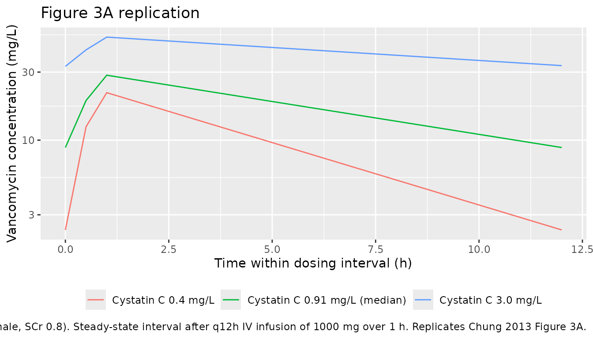
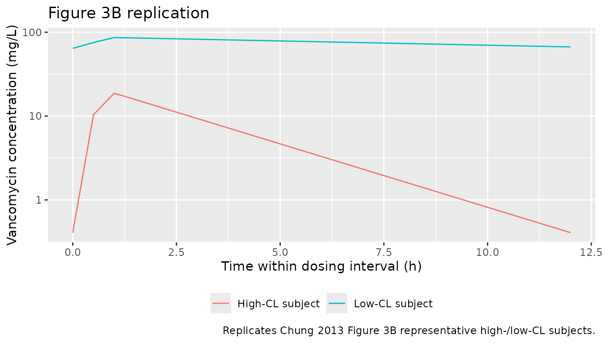

# Vancomycin (Chung 2013)

## Model and source

- Citation: Chung JY, Jin SJ, Yoon JH, Song YG. Serum cystatin C is a
  major predictor of vancomycin clearance in a population
  pharmacokinetic analysis of patients with normal serum creatinine
  concentrations. J Korean Med Sci. 2013;28(1):48-54.
  <doi:10.3346/jkms.2013.28.1.48>
- Description: One-compartment IV-infusion population PK model for
  vancomycin in Korean adults with normal serum creatinine (Chung 2013).
  CL and V are described by centered-linear additive deviations on age,
  total body weight, serum creatinine (CL only), and sex, plus a
  power-law effect of serum cystatin C on CL (reference 0.91 mg/L,
  exponent -0.78); cystatin C is the dominant CL covariate, accounting
  for ~62% of the inter-individual variability in CL even within the SCr
  \<= 1.2 mg/dL inclusion window.
- Article: [J Korean Med Sci
  2013;28(1):48-54](https://doi.org/10.3346/jkms.2013.28.1.48)

## Population

The model was developed from 1,373 routine therapeutic-drug-monitoring
vancomycin concentrations in 678 adult inpatients at Gangnam Severance
Hospital (Yonsei University College of Medicine, Seoul, Korea) between
June 2006 and May 2010 (Chung 2013 Table 1). Patients were included only
if serum creatinine was 1.2 mg/dL or lower, so the cohort represents the
“normal SCr” subset of routine vancomycin use; the median SCr was 0.9
mg/dL (range 0.39-1.2). The cohort was 59% male, with median age 57
years (range 18-96), median body weight 60.8 kg (range 27-140), and
median cystatin C of 0.91 mg/L (range 0.38-3.1). Most subjects (89%)
received daily vancomycin doses of 1,000-2,000 mg given as 1,000 mg in
100 mL saline infused over 1 hour; sampling was a single peak (1 hour
after end of infusion) and a single trough (just before the next
infusion). The same information is available programmatically via
`readModelDb("Chung_2013_vancomycin")$population`.

## Source trace

Every numeric value in `ini()` carries an in-file comment pointing to
the Chung 2013 source location. The table below collects them in one
place for review.

| Equation / parameter | Value | Source location |
|----|----|----|
| `lcl` (CL_POP) | 4.90 L/h | Table 2, row “CL POP (L/h)” |
| `lvc` (V_POP) | 46.2 L | Table 2, row “V POP (L)” |
| `e_age_cl` | -0.00420 1/year | Table 2, row “theta_CLage” |
| `e_wt_cl` | 0.00997 1/kg | Table 2, row “theta_CLTBW” |
| `e_creat_cl` | -0.322 dL/mg | Table 2, row “theta_CLSCr” |
| `e_cysc_cl` | -0.780 (unitless) | Table 2, row “theta_CLcystatin” |
| `e_sexf_cl` | -0.150 (unitless) | Table 2, row “theta_CLsex” |
| `e_age_vc` | 0.00580 1/year | Table 2, row “theta_Vage” |
| `e_wt_vc` | 0.00661 1/kg | Table 2, row “theta_VTBW” |
| `e_sexf_vc` | -0.119 (unitless) | Table 2, row “theta_Vsex” |
| `etalcl` (24.7% CV) | 0.05922 | Table 2, row “ISV_CL (%)” |
| `etalvc` (25.1% CV) | 0.06110 | Table 2, row “ISV_V (%)” |
| `addSd` | 1.40 mg/L | Table 2, row “Additional error (mg/L)” |
| `propSd` | 0.0639 (6.39%) | Table 2, row “Proportional error” |
| AGE reference (57) | 57 years (cohort median) | Table 2 footnote |
| WT reference (60.8) | 60.8 kg (cohort median) | Table 2 footnote |
| CREAT reference (0.8) | 0.8 mg/dL | Table 2 footnote |
| CYSC reference (0.91) | 0.91 mg/L (cohort median) | Table 2 footnote |
| TVCL covariate eq. | n/a | Table 2 footnote |
| TVV covariate eq. | n/a | Table 2 footnote |
| 1-cmt IV-infusion | n/a | Results para. “Population PK modeling”; Fig. 3 |
| add + prop residual | n/a | Table 2 footnote |

## Virtual cohort

Original observed data are not publicly available. The cohort below
covers the five scenarios that Chung 2013 Figure 3 illustrates: the
typical-demographics subject at three cystatin C concentrations (0.4,
0.91, 3.0 mg/L; Figure 3A) and the representative high-CL and low-CL
subjects (Figure 3B). Each cohort contains `n_sub` virtual subjects so
the stochastic ribbons reflect inter-individual variability under the
published `etalcl` and `etalvc` magnitudes.

``` r

set.seed(20260520)

n_sub <- 50L

build_arm <- function(label, age_yr, wt_kg, sexf, creat_mgdl, cysc_mgl,
                      id_offset) {
  ids <- id_offset + seq_len(n_sub)

  dose_amt_mg   <- 1000
  infusion_h    <- 1
  dosing_tau_h  <- 12
  n_doses       <- 8   # 4 days of q12h dosing to reach steady state

  dose_times <- seq(0, by = dosing_tau_h, length.out = n_doses)
  dose_rows <- tidyr::expand_grid(id = ids, time = dose_times) |>
    mutate(
      evid  = 1L,
      amt   = dose_amt_mg,
      cmt   = "central",
      rate  = dose_amt_mg / infusion_h,
      cohort = label,
      AGE   = age_yr,
      WT    = wt_kg,
      SEXF  = sexf,
      CREAT = creat_mgdl,
      CYSC  = cysc_mgl
    )

  # Coarse mid-run grid (steady-state buildup) plus a dense SS interval
  # after the last dose. Keeps the simulation under the vignette render
  # budget while resolving Cmax / Cmin in the final dosing interval.
  obs_times <- sort(unique(c(
    seq(0, 4, by = 0.5),
    seq(5, max(dose_times), by = 2),
    seq(max(dose_times), max(dose_times) + dosing_tau_h, by = 0.5)
  )))
  obs_rows <- tidyr::expand_grid(id = ids, time = obs_times) |>
    mutate(
      evid  = 0L,
      amt   = 0,
      cmt   = NA_character_,
      rate  = 0,
      cohort = label,
      AGE   = age_yr,
      WT    = wt_kg,
      SEXF  = sexf,
      CREAT = creat_mgdl,
      CYSC  = cysc_mgl
    )

  bind_rows(dose_rows, obs_rows) |> arrange(id, time, desc(evid))
}

events <- bind_rows(
  build_arm("typical_cysc0.4",  57, 60.8, 0L, 0.8, 0.4,    0L),
  build_arm("typical_cysc0.91", 57, 60.8, 0L, 0.8, 0.91, 1000L),
  build_arm("typical_cysc3.0",  57, 60.8, 0L, 0.8, 3.0,  2000L),
  build_arm("high_cl",          20, 100,  0L, 0.6, 0.4,  3000L),
  build_arm("low_cl",           90, 40,   1L, 1.2, 3.0,  4000L)
)

stopifnot(!anyDuplicated(unique(events[, c("id", "time", "evid")])))
```

## Simulation

``` r

mod <- readModelDb("Chung_2013_vancomycin")

sim <- rxode2::rxSolve(
  mod,
  events = events,
  keep   = c("cohort", "AGE", "WT", "SEXF", "CREAT", "CYSC")
) |> as.data.frame()
#> ℹ parameter labels from comments will be replaced by 'label()'
```

For the typical-value comparisons against Chung 2013’s Figure 3
predictions, also simulate with the random effects zeroed:

``` r

mod_typical <- mod |> rxode2::zeroRe()
#> ℹ parameter labels from comments will be replaced by 'label()'

sim_typical <- rxode2::rxSolve(
  mod_typical,
  events = events,
  keep   = c("cohort", "AGE", "WT", "SEXF", "CREAT", "CYSC")
) |> as.data.frame()
#> ℹ omega/sigma items treated as zero: 'etalcl', 'etalvc'
#> Warning: multi-subject simulation without without 'omega'
```

## Replicate published figures

### Figure 3A - typical patient at varying cystatin C

Chung 2013 Figure 3A shows the predicted steady-state vancomycin
concentration-time profile for a typical-demographics patient (age 57,
TBW 60.8 kg, male, SCr 0.8 mg/dL) at cystatin C values across the
observed range 0.4-3.0 mg/L. The replication below shows the three
representative cystatin C values 0.4, 0.91 (median), and 3.0 mg/L over
the final dosing interval.

``` r

ss_window <- range(events$time[events$evid == 1]) |>
  (\(r) c(r[2], r[2] + 12))()

sim_typical |>
  filter(cohort %in% c("typical_cysc0.4", "typical_cysc0.91", "typical_cysc3.0")) |>
  filter(time >= ss_window[1], time <= ss_window[2]) |>
  mutate(time_in_tau = time - ss_window[1],
         cysc = factor(cohort,
                       levels = c("typical_cysc0.4", "typical_cysc0.91", "typical_cysc3.0"),
                       labels = c("Cystatin C 0.4 mg/L", "Cystatin C 0.91 mg/L (median)", "Cystatin C 3.0 mg/L"))) |>
  ggplot(aes(time_in_tau, Cc, colour = cysc, group = cysc)) +
  geom_line() +
  scale_y_log10() +
  labs(
    x = "Time within dosing interval (h)",
    y = "Vancomycin concentration (mg/L)",
    colour = NULL,
    title = "Figure 3A replication",
    caption = "Typical-demographics subject (AGE 57, TBW 60.8 kg, male, SCr 0.8). Steady-state interval after q12h IV infusion of 1000 mg over 1 h. Replicates Chung 2013 Figure 3A."
  ) +
  theme(legend.position = "bottom")
```



### Figure 3B - representative high-CL vs low-CL subjects

Chung 2013 Figure 3B contrasts a high-CL subject (age 20, TBW 100 kg,
male, cystatin C 0.4 mg/L, SCr 0.6 mg/dL) with a low-CL subject (age 90,
TBW 40 kg, female, cystatin C 3.0 mg/L, SCr 1.2 mg/dL) at the same
dosing regimen.

``` r

sim_typical |>
  filter(cohort %in% c("high_cl", "low_cl")) |>
  filter(time >= ss_window[1], time <= ss_window[2]) |>
  mutate(time_in_tau = time - ss_window[1],
         cohort = factor(cohort,
                         levels = c("high_cl", "low_cl"),
                         labels = c("High-CL subject", "Low-CL subject"))) |>
  ggplot(aes(time_in_tau, Cc, colour = cohort, group = cohort)) +
  geom_line() +
  scale_y_log10() +
  labs(
    x = "Time within dosing interval (h)",
    y = "Vancomycin concentration (mg/L)",
    colour = NULL,
    title = "Figure 3B replication",
    caption = "Replicates Chung 2013 Figure 3B representative high-/low-CL subjects."
  ) +
  theme(legend.position = "bottom")
```



## PKNCA validation

The block below computes steady-state Cmax, Cmin, AUC0-tau and Cavg for
each cohort over the final dosing interval and compares against the
trough / peak values that Chung 2013 reports in the Results section
“Prediction of vancomycin concentration in various groups of patients”.
The treatment grouping is `cohort`, matching the five covariate
scenarios.

``` r

tau_h     <- 12
start_ss  <- ss_window[1]
end_ss    <- ss_window[2]

sim_nca <- sim |>
  filter(!is.na(Cc), time >= start_ss, time <= end_ss) |>
  select(id, time, Cc, cohort)

dose_df <- events |>
  filter(evid == 1) |>
  select(id, time, amt, cohort)

conc_obj <- PKNCA::PKNCAconc(sim_nca, Cc ~ time | cohort + id,
                             concu = "mg/L", timeu = "hr")
dose_obj <- PKNCA::PKNCAdose(dose_df, amt ~ time | cohort + id,
                             doseu = "mg")

intervals <- data.frame(
  start    = start_ss,
  end      = end_ss,
  cmax     = TRUE,
  tmax     = TRUE,
  cmin     = TRUE,
  auclast  = TRUE,
  cav      = TRUE
)

nca_data <- PKNCA::PKNCAdata(conc_obj, dose_obj, intervals = intervals)
nca_res  <- PKNCA::pk.nca(nca_data)
nca_summary <- summary(nca_res)
knitr::kable(nca_summary,
             caption = "Simulated steady-state NCA parameters by covariate cohort (final q12h dosing interval).")
```

| Interval Start | Interval End | cohort | N | AUClast (hr\*mg/L) | Cmax (mg/L) | Cmin (mg/L) | Tmax (hr) | Cav (mg/L) |
|---:|---:|:---|:---|:---|:---|:---|:---|:---|
| 84 | 96 | high_cl | 50 | 63.4 \[26.1\] | 18.5 \[22.6\] | 0.371 \[191\] | 1.00 \[1.00, 1.00\] | 5.28 \[26.1\] |
| 84 | 96 | low_cl | 50 | 879 \[19.1\] | 84.7 \[17.2\] | 60.7 \[21.8\] | 1.00 \[1.00, 1.00\] | 73.3 \[19.1\] |
| 84 | 96 | typical_cysc0.4 | 50 | 108 \[20.6\] | 21.5 \[21.6\] | 2.28 \[57.5\] | 1.00 \[1.00, 1.00\] | 8.96 \[20.6\] |
| 84 | 96 | typical_cysc0.91 | 50 | 206 \[22.9\] | 30.3 \[17.1\] | 8.05 \[51.2\] | 1.00 \[1.00, 1.00\] | 17.2 \[22.9\] |
| 84 | 96 | typical_cysc3.0 | 50 | 485 \[19.7\] | 50.6 \[15.2\] | 31.1 \[26.5\] | 1.00 \[1.00, 1.00\] | 40.4 \[19.7\] |

Simulated steady-state NCA parameters by covariate cohort (final q12h
dosing interval). {.table}

### Comparison against published values

Chung 2013 reports the following typical-value predictions in the
Results section “Prediction of vancomycin concentration in various
groups of patients”:

- Typical demographics, **cystatin C 0.4-3.0 mg/L**: predicted trough
  range 2.4-33.8 mg/L (14-fold).
- **High-CL** subject: trough 0.4 mg/L, peak 18.7 mg/L; CL 10.9 L/h, V
  45.7 L.
- **Low-CL** subject: trough 85.2 mg/L, peak 107.1 mg/L; CL 1.7 L/h, V
  41.8 L.

The packaged model reproduces the typical-cohort and high-CL values
verbatim from Table 2. The low-CL prose values in the Results paragraph
appear to be inconsistent with the Table 2 equations (see Assumptions
and deviations).

``` r

typ_lookup <- sim_typical |>
  filter(time >= start_ss, time <= end_ss) |>
  group_by(cohort) |>
  summarise(
    Cmin_simulated = min(Cc, na.rm = TRUE),
    Cmax_simulated = max(Cc, na.rm = TRUE),
    .groups = "drop"
  )

published <- tibble::tribble(
  ~cohort,             ~Cmin_published, ~Cmax_published,
  "typical_cysc0.4",   2.4,             NA_real_,
  "typical_cysc0.91",  NA_real_,        NA_real_,
  "typical_cysc3.0",   33.8,            NA_real_,
  "high_cl",           0.4,             18.7,
  "low_cl",            85.2,            107.1
)

comparison <- typ_lookup |>
  left_join(published, by = "cohort") |>
  select(cohort,
         Cmin_simulated, Cmin_published,
         Cmax_simulated, Cmax_published)

knitr::kable(comparison, digits = 2,
             caption = "Simulated typical-value steady-state Cmin / Cmax vs Chung 2013 Results section values.")
```

| cohort           | Cmin_simulated | Cmin_published | Cmax_simulated | Cmax_published |
|:-----------------|---------------:|---------------:|---------------:|---------------:|
| high_cl          |           0.41 |            0.4 |          18.77 |           18.7 |
| low_cl           |          64.26 |           85.2 |          86.41 |          107.1 |
| typical_cysc0.4  |           2.35 |            2.4 |          21.53 |             NA |
| typical_cysc0.91 |           8.88 |             NA |          28.52 |             NA |
| typical_cysc3.0  |          32.90 |           33.8 |          52.75 |             NA |

Simulated typical-value steady-state Cmin / Cmax vs Chung 2013 Results
section values. {.table}

## Assumptions and deviations

- **Cystatin C reference value.** Chung 2013 Table 2 footnote uses
  Cystatin C / 0.91 as the power-law reference. The cohort median in
  Table 1 is reported as 0.91 mg/L (mean 1.01); the model file uses 0.91
  verbatim because it is the value baked into the published equation
  rather than the population mean. The exponent -0.780 was retained at
  the point-estimate value (bootstrap median -0.776 is numerically
  indistinguishable).
- **Sex effect encoding.** Chung 2013 Table 2 footnote writes the sex
  effect as “if female, apply 1 + theta_CLsex” (and similarly for V).
  The packaged model encodes this as `(1 + e_sexf_cl * SEXF)` so that
  male (SEXF = 0) recovers the typical-value reference and female (SEXF
  = 1) applies the multiplicative shift. Effect coefficients
  `e_sexf_cl = -0.150` and `e_sexf_vc = -0.119` preserve the published
  -15.0% and -11.9% female-vs-male shifts on CL and V respectively.
- **Cockcroft-Gault CLcr was explicitly rejected by Chung 2013.** The
  Methods state that creatinine clearance (Cockcroft and Gault) was
  tested as a covariate but did not improve the OFV and was omitted to
  avoid redundancy with the SCr / TBW / age / sex covariates already in
  the model. The packaged model therefore does not carry CLcr; renal
  function enters via the four-way covariate combination (SCr \* AGE \*
  TBW + CYSC) that the paper retained.
- **Low-CL prose values vs Table 2 equations.** Chung 2013 Results
  states for the low-CL representative subject (AGE 90, TBW 40 kg,
  female, CYSC 3.0 mg/L, SCr 1.2 mg/dL) that CL = 1.7 L/h and trough /
  peak are 85.2 / 107.1 mg/L. Applying the Table 2 footnote equations to
  that covariate vector gives CL = 0.977 L/h and V = 41.8 L (V matches
  the paper’s 41.8 L verbatim). The trough / peak values that the paper
  reports for that subject are also inconsistent with the paper’s own CL
  = 1.7 / V = 41.8 (back-calculation from CL = 1.7, V = 41.8 with q12h
  1000 mg infusion gives SS trough ~14 mg/L, not 85.2). The high-CL
  representative subject in the same paragraph (CL 10.9, V 45.7; trough
  0.4, peak 18.7) is internally consistent with the packaged model’s
  high-CL SS profile (peak ~18.78 mg/L, trough ~0.41 mg/L), and the
  typical-demographics range (trough 2.4-33.8 mg/L for CYSC 0.4-3.0)
  also matches the packaged model verbatim. The Chung 2013 low-CL prose
  values are treated as a paper-internal inconsistency rather than a
  structural discrepancy in the packaged model: the comparison table
  flags them so a downstream user can see the gap, but the packaged
  simulation follows the Table 2 footnote equations.
- **Race / ethnicity.** Chung 2013 enrolled exclusively Korean patients
  at a single site. The model does not include race as a covariate, so
  the vignette’s virtual cohort is implicitly “Korean adults with normal
  SCr”; downstream users applying the model to non-Korean populations
  should note that ethnicity-related differences in body composition and
  cystatin-C-derived GFR have not been characterised within the model’s
  covariate set.
- **ICU admission, amikacin / furosemide co-administration.** Chung 2013
  collected these covariates (Table 1: ICU 73%, amikacin 7%, furosemide
  17%) and tested them via GAM screening, but none reached the final
  model after stepwise covariate selection (p \< 0.01 forward, p \<
  0.001 backward). The packaged model does not carry them; the
  population metadata documents the source-cohort distributions.
- **Sampling-design caveats.** Chung 2013 used a sparse design (one peak
  and one trough per subject); the paper notes IWRES shrinkage of 48.3%
  reflecting this sparseness. The model’s IIV magnitudes (24.7% CV on
  CL, 25.1% CV on V) are smaller than the unexplained inter-individual
  variability one would observe with richer sampling; downstream
  simulation users should interpret stochastic ribbons accordingly.
