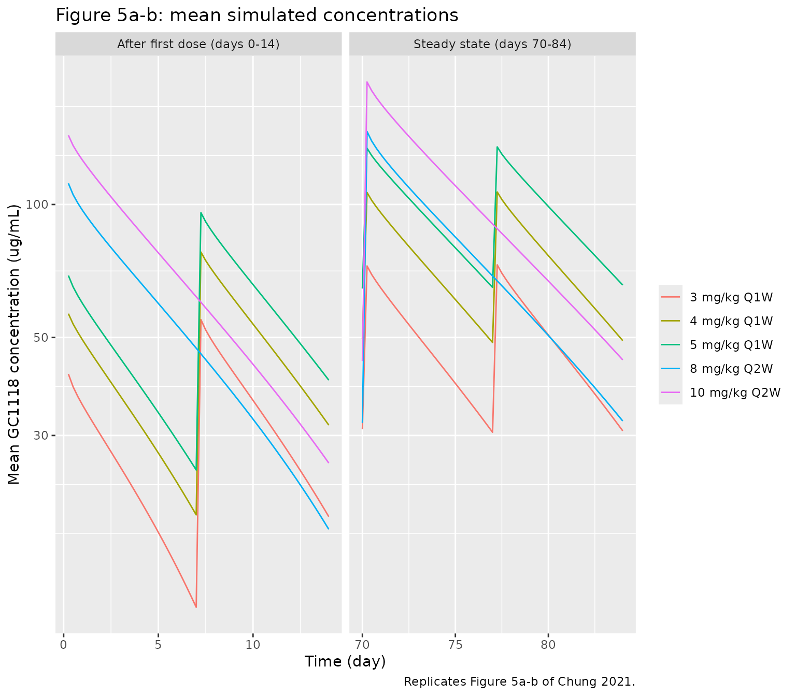
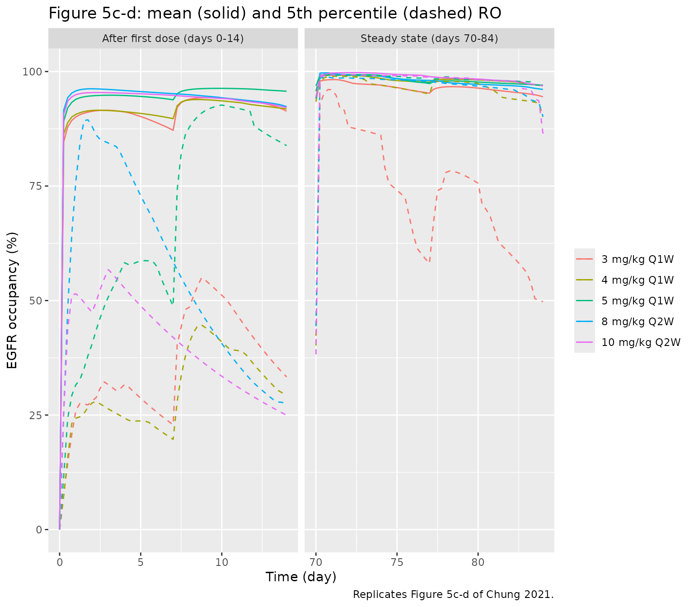

# GC1118 (Chung 2021)

## Model and source

- Citation: Chung TK, Lee HA, Park SI, Oh DY, Lee KW, Kim JW, Kim JH,
  Woo A, Lee SJ, Bang YJ, Lee H (2021). A target-mediated drug
  disposition population pharmacokinetic model of GC1118, a novel
  anti-EGFR antibody, in patients with solid tumors. Clinical and
  Translational Science 14(3):990-1001. <doi:10.1111/cts.12963>. Model
  code from the Supporting Information (NONMEM control stream
  CTS-14-990-s001.docx).
- Description: Two-compartment target-mediated drug disposition (TMDD)
  population PK model for GC1118, a fully human anti-EGFR IgG1
  monoclonal antibody, in adults with advanced solid tumours (Chung
  2021; phase I, n = 32, 2-h IV infusions of 0.3-5 mg/kg once weekly or
  8 mg/kg every two weeks). EGFR is confined to the peripheral
  compartment; drug-EGFR binding is at rapid equilibrium
  (quasi-equilibrium closed form for the complex), the total peripheral
  EGFR pool is constant at VP \* RB / CLB, and the EGFR and complex
  clearances are assumed equal. Linear clearance of free drug scales
  with (WT/70)^0.8. The infusion duration is estimated (D1), a full 9 x
  9 IIV block includes IIV on the residual-error magnitude, and
  inter-occasion variability (two occasions) sits on Q. The peripheral
  EGFR occupancy (RO, %) is returned as a derived output.
- Article: <https://doi.org/10.1111/cts.12963> (open access)
- Supplement: NONMEM control stream (Supporting Information
  `CTS-14-990-s001.docx`), available from the article page and from
  Europe PMC (PMC8212746).

GC1118 is a fully human IgG1 monoclonal antibody against the epidermal
growth factor receptor (EGFR). Chung 2021 fitted a two-compartment
target-mediated drug disposition (TMDD) model to the phase I serum
concentrations and used it to simulate EGFR occupancy (RO) for
once-weekly (Q1W) and every-two-weeks (Q2W) regimens.

## Population

The phase I trial enrolled 32 Korean adults with advanced solid tumours
(Chung 2021 Table 1): 20 men and 12 women, age 56.7 +/- 9.1 years (range
34-72), body weight 63.1 +/- 10.4 kg (range 42.5-89.2). Colorectal
cancer was the primary tumour in 18 patients (56.2%); the remainder had
ampulla of Vater, appendix, breast, biliary, oesophageal, gallbladder,
gastric, nasal cavity, nasopharyngeal, pancreatic or tonsil cancer.
Cohorts 1-5 (n = 24) received a 2-h IV infusion of 0.3, 1, 3, 5 or 4
mg/kg on days 1, 8, 15 and 22; cohort 6 (n = 8) received 8 mg/kg every
two weeks. The analysis used 793 free serum GC1118 concentrations
(ELISA, LLOQ 0.025 ug/mL). All patients had normal renal and hepatic
function and none developed anti-drug antibodies.

The same information is available programmatically via
`readModelDb("Chung_2021_GC1118")()$population`.

## Model structure

EGFR is assumed to be confined to the peripheral compartment, where drug
and receptor bind at rapid equilibrium. The states are the free drug
amount in the central compartment, `central` ($`A_C`$), and the
**total** (free + EGFR-bound) drug amount in the peripheral compartment,
`peripheral1` ($`TA_P`$), both in pmol:

``` math
\frac{dA_C}{dt} = -\frac{Q A_C}{V_C} + \frac{Q A_P}{V_P} - \frac{CL_A A_C}{V_C}
```

``` math
\frac{dTA_P}{dt} = \frac{Q A_C}{V_C} - \frac{Q A_P}{V_P} - \frac{CPLX_P \, CL_C}{V_P}
```

with $`A_P = TA_P - CPLX_P`$ and the quasi-equilibrium complex

``` math
CPLX_P = \frac{(K_D V_P + TA_P + TR_P) - \sqrt{(K_D V_P + TA_P + TR_P)^2 - 4 \, TA_P \, TR_P}}{2}, \qquad TR_P = \frac{V_P R_B}{CL_B}.
```

The total peripheral EGFR pool $`TR_P`$ is constant because the EGFR and
complex clearances are assumed equal ($`CL_B = CL_C`$). Receptor
occupancy is $`RO = 100 \, CPLX_P / TR_P`$. Doses in mg are converted to
pmol with the control stream’s molecular weight (150 kDa, `MWT = 0.15`
ug/pmol), and the observed free serum concentration is
$`0.15 \, A_C / V_C`$ in ug/mL.

## Source trace

| Equation / parameter | Value | Source location |
|----|----|----|
| `d/dt(central)` | n/a | Eq. 1; control stream `DADT(1)` |
| `d/dt(peripheral1)` | n/a | Eq. 2; control stream `DADT(2)` |
| `free_p`, `complex` | n/a | Eqs. 3-4; control stream `FAP`, `CPLXP` |
| `rtot` | `vp * ksyn / cl_complex` | Eq. 5; control stream `TBP` |
| `RO` | `100 * complex / rtot` | Eq. 9; control stream `SAT` |
| `mw`, `f(central)` | 0.15 ug/pmol; `1000 / mw` | control stream `MWT = 0.15`, `F1 = 1/MWT` (stream doses in ug; the library doses in mg) |
| `dur(central)` | `d1` | control stream `D1`; Table 2 |
| `lcl` (CLA) | 16.2 mL/h | Table 2 |
| `e_wt_cl` | 0.8, reference 70 kg | Table 2; Methods Eq. 8; control stream `(WT/70)**THETA(11)` |
| `lvc` (VC) | 3660 mL | Table 2 |
| `lq` (Q) | 627 mL/h | Table 2 |
| `lvp` (VP) | 1180 mL | Table 2 |
| `ld1` (D1) | 2.2 h | Table 2 |
| `lksyn` (RB) | 2390 pmol/h | Table 2 |
| `lcl_complex` (CLB = CLC) | 63.4 mL/h | Table 2 |
| `lkd` (KD) | 0.16 nM, fixed | Table 2; Methods (in vitro value) |
| IIV variances (9) | CV% 36.2, 21.4, 181.4, 58, 6.0, 49.7, 188.1, 227.8, 31.4 | Table 2 IIV column; `omega^2 = (CV/100)^2` (see below) |
| IIV covariances | Table 2 correlation matrix | Table 2 lower panel; order matches control stream `$OMEGA BLOCK(9)` |
| `etaiov_q_1`, `etaiov_q_2` | 261.5% CV, shared | Table 2 IOV column; control stream `$OMEGA BLOCK(1)` + `BLOCK(1) SAME` |
| `propSd` | 0.10 | Table 2 ‘Proportional RUV’ |
| `addSd` | 0.001 ug/mL, fixed | control stream `$THETA (0.001) FIX ; Additive error` |
| `etapropSd` | 31.4% CV | Table 2 RUV IIV; control stream `Y = IPRED + W*EPS(1)*EXP(ETA(9))` |

## Reconstructing the IIV matrix

Table 2 reports each IIV as a CV% and prints the correlation matrix
between the nine IIV terms to three decimals. That printed matrix is
very slightly indefinite, which is what rounding a near-singular 9 x 9
correlation matrix (and taking bootstrap medians element by element, as
the table heading suggests) can produce. The model uses the nearest
positive-definite correlation matrix; the check below shows that no
coefficient moved by more than 0.00075, i.e. by about the size of the
rounding in the printed table.

``` r

cv <- c(CLA = 36.2, VC = 21.4, Q = 181.4, VP = 58, D1 = 6.0, RB = 49.7,
        CLB = 188.1, KD = 227.8, RUV = 31.4) / 100
lower <- list(
  c(1),
  c(0.022, 1),
  c(-0.116, -0.281, 1),
  c(-0.667, 0.272, -0.424, 1),
  c(0.737, 0.218, -0.249, -0.267, 1),
  c(-0.662, 0.649, -0.017, 0.729, -0.268, 1),
  c(-0.311, 0.579, -0.085, 0.642, -0.131, 0.805, 1),
  c(-0.549, 0.333, 0.346, 0.583, -0.364, 0.805, 0.847, 1),
  c(-0.052, -0.317, 0.790, -0.148, 0.027, -0.033, -0.016, 0.414, 1)
)
r_printed <- matrix(0, 9, 9, dimnames = list(names(cv), names(cv)))
for (i in 1:9) r_printed[i, 1:i] <- lower[[i]]
r_printed[upper.tri(r_printed)] <- t(r_printed)[upper.tri(r_printed)]

mod <- readModelDb("Chung_2021_GC1118")
ui <- rxode2::rxode(mod)
#> ℹ parameter labels from comments will be replaced by 'label()'
#> Warning: some etas defaulted to non-mu referenced, possible parsing error: etaiov_q_1, etaiov_q_2
#> as a work-around try putting the mu-referenced expression on a simple line
om <- ui$omega
eta_names <- c("etalcl", "etalvc", "etalq", "etalvp", "etald1", "etalksyn",
               "etalcl_complex", "etalkd", "etapropSd")
om9 <- om[eta_names, eta_names]
r_model <- stats::cov2cor(om9)

data.frame(
  quantity = c("smallest eigenvalue, printed correlation matrix",
               "smallest eigenvalue, model correlation matrix",
               "largest |model - printed| correlation",
               "largest |model SD - Table 2 CV/100|"),
  value = c(min(eigen(r_printed)$values), min(eigen(r_model)$values),
            max(abs(r_model - r_printed)), max(abs(sqrt(diag(om9)) - cv)))
) |>
  knitr::kable(digits = 6)
```

| quantity                                        |     value |
|:------------------------------------------------|----------:|
| smallest eigenvalue, printed correlation matrix | -0.001354 |
| smallest eigenvalue, model correlation matrix   |  0.000407 |
| largest \|model - printed\| correlation         |  0.000755 |
| largest \|model SD - Table 2 CV/100\|           |  0.000001 |

``` r


stopifnot(
  min(eigen(r_printed)$values) < 0,
  min(eigen(r_model)$values) > 0,
  max(abs(r_model - r_printed)) < 0.001,
  max(abs(sqrt(diag(om9)) - cv)) < 1e-5
)
```

### Which CV% convention?

Chung 2021 does not say how CV% was computed from the variance. With CVs
up to 261.5% the two usual readings differ about three-fold:
`omega^2 = (CV/100)^2` (the square-root approximation that NONMEM/PsN
reports print) or `omega^2 = log((CV/100)^2 + 1)` (the exact log-normal
CV). The paper’s own simulation settles it. Figure 5 shows the mean EGFR
occupancy at trough dipping to about 82% after a first 3 mg/kg dose, and
a 5th percentile at steady-state trough of 16.1% for 8 mg/kg Q2W. Only
the square-root reading leaves enough spread in Q, CLB and RB to produce
that; with the log-normal reading, mean trough RO stays above 95% for
every regimen (the comparison below runs both). The model therefore uses
`omega^2 = (CV/100)^2`. That is also the reading closer to the initial
`$OMEGA` estimates printed in the control stream (for example 2.87 and
3.58 on CLB and KD, against 3.54 and 5.19 for the square-root reading
and 1.51 and 1.82 for the log-normal one).

## Virtual cohort and simulation of Figure 5

Chung 2021 simulated 3, 4 and 5 mg/kg Q1W and 8 and 10 mg/kg Q2W (2-h
infusions), with body weight distributed as in the analysis dataset. The
virtual cohort draws weight from a normal distribution with the Table 1
mean and SD, redrawing values outside the observed 42.5-89.2 kg range,
and simulates 200 subjects per regimen for 12 weeks. Figure 5 plots the
first dosing interval (days 0-14) and the steady-state window (days
70-84). The two IOV occasions are assigned to those two windows:
`OCC = 1` until the day-70 dose and `OCC = 2` from then on.

``` r

rxode2::rxSetSeed(20210301)
set.seed(20210301)
n_per_arm <- 200

draw_wt <- function(n) {
  wt <- numeric(0)
  while (length(wt) < n) {
    x <- rnorm(n, 63.1, 10.4)
    wt <- c(wt, x[x >= 42.5 & x <= 89.2])
  }
  wt[seq_len(n)]
}

regimens <- tibble::tribble(
  ~regimen,          ~dose_mgkg, ~tau_h,
  "3 mg/kg Q1W",      3,          168,
  "4 mg/kg Q1W",      4,          168,
  "5 mg/kg Q1W",      5,          168,
  "8 mg/kg Q2W",      8,          336,
  "10 mg/kg Q2W",    10,          336
)

obs_times <- sort(unique(c(
  seq(0, 14 * 24, by = 6), seq(70 * 24, 84 * 24, by = 6),
  7 * 24 - 0.01, 14 * 24 - 0.01, 77 * 24 - 0.01, 84 * 24 - 0.01
)))

make_regimen <- function(k, id_offset) {
  reg <- regimens[k, ]
  ids <- id_offset + seq_len(n_per_arm)
  subj <- tibble(id = ids, WT = draw_wt(n_per_arm))
  dose_times <- seq(0, 12 * 168 - 1, by = reg$tau_h)
  doses <- tidyr::expand_grid(id = ids, time = dose_times) |>
    mutate(evid = 1L, cmt = "central", rate = -2)
  obs <- tidyr::expand_grid(id = ids, time = obs_times) |>
    mutate(evid = 0L, cmt = "central", rate = 0)
  bind_rows(doses, obs) |>
    left_join(subj, by = "id") |>
    mutate(
      amt = ifelse(evid == 1L, reg$dose_mgkg * WT, 0),
      OCC = ifelse(time < 70 * 24, 1L, 2L),
      regimen = reg$regimen
    ) |>
    arrange(id, time, desc(evid))
}

events <- bind_rows(lapply(seq_len(nrow(regimens)), function(k) {
  make_regimen(k, id_offset = (k - 1L) * n_per_arm)
}))
stopifnot(!anyDuplicated(unique(events[, c("id", "time", "evid")])))
```

The IIV and IOV on Q together have a standard deviation of about 3.2 on
the log scale, so an occasional simulated subject has an extreme Q
(10⁵⁻¹⁰6 mL/h) that makes the system stiff. The solver’s step limit is
raised so every subject integrates, and the simulation is checked for
missing values.

``` r

sim <- rxode2::rxSolve(mod, events = events, keep = c("regimen", "WT"),
                       maxsteps = 1e6, returnType = "data.frame")
#> ℹ parameter labels from comments will be replaced by 'label()'
#> Warning: some etas defaulted to non-mu referenced, possible parsing error: etaiov_q_1, etaiov_q_2
#> as a work-around try putting the mu-referenced expression on a simple line
stopifnot(!anyNA(sim$Cc), !anyNA(sim$RO))
sim$regimen <- factor(sim$regimen, levels = regimens$regimen)
```

``` r

sim_win <- sim |>
  filter(time <= 14 * 24 | time >= 70 * 24) |>
  mutate(window = ifelse(time <= 14 * 24, "After first dose (days 0-14)",
                         "Steady state (days 70-84)"),
         day = time / 24)

fig5_conc <- sim_win |>
  group_by(regimen, window, day) |>
  summarise(mean_Cc = mean(Cc), .groups = "drop")
fig5_ro <- sim_win |>
  group_by(regimen, window, day) |>
  summarise(mean_RO = mean(RO), p05 = quantile(RO, 0.05),
            p95 = quantile(RO, 0.95), .groups = "drop")

ggplot(filter(fig5_conc, mean_Cc > 0), aes(day, mean_Cc, colour = regimen)) +
  geom_line() +
  facet_wrap(~window, scales = "free_x") +
  scale_y_log10() +
  labs(x = "Time (day)", y = "Mean GC1118 concentration (ug/mL)",
       colour = NULL,
       title = "Figure 5a-b: mean simulated concentrations",
       caption = "Replicates Figure 5a-b of Chung 2021.")
```



``` r


ggplot(fig5_ro, aes(day, mean_RO, colour = regimen)) +
  geom_line() +
  geom_line(aes(y = p05), linetype = "dashed") +
  facet_wrap(~window, scales = "free_x") +
  coord_cartesian(ylim = c(0, 100)) +
  labs(x = "Time (day)", y = "EGFR occupancy (%)", colour = NULL,
       title = "Figure 5c-d: mean (solid) and 5th percentile (dashed) RO",
       caption = "Replicates Figure 5c-d of Chung 2021.")
```



### Comparison with the published occupancy and trough values

The published values are the Results text (steady-state trough RO 5th
percentiles 87.1%, 99.5%, 16.1% and 41.1% for 4 and 5 mg/kg Q1W and 8
and 10 mg/kg Q2W; mean steady-state trough concentrations 48.57 ug/mL
for 4 mg/kg Q1W and 35.67 ug/mL for 8 mg/kg Q2W, Discussion) and, for
the mean RO and the 3 mg/kg Q1W percentile, values read by the
maintainers from Figure 5c-d.

``` r

trough_times <- c(7 * 24, 14 * 24, 77 * 24, 84 * 24) - 0.01
troughs <- sim |>
  filter(time %in% trough_times) |>
  mutate(
    interval = ifelse(time < 70 * 24, "first", "steady state"),
    is_trough = (grepl("Q1W", regimen) & time %in% (c(7, 77) * 24 - 0.01)) |
      (grepl("Q2W", regimen) & time %in% (c(14, 84) * 24 - 0.01))
  ) |>
  filter(is_trough)

sim_summary <- troughs |>
  group_by(regimen, interval) |>
  summarise(mean_RO = mean(RO), p05_RO = quantile(RO, 0.05),
            mean_Cc = mean(Cc), .groups = "drop")

published <- tibble::tribble(
  ~regimen,        ~interval,       ~pub_mean_RO, ~pub_p05_RO, ~pub_mean_Cc,
  "3 mg/kg Q1W",   "first",          82,          17,           NA,
  "4 mg/kg Q1W",   "first",          90,          33,           NA,
  "5 mg/kg Q1W",   "first",          95,          57,           NA,
  "8 mg/kg Q2W",   "first",          87,          17,           NA,
  "10 mg/kg Q2W",  "first",          91,          24,           NA,
  "3 mg/kg Q1W",   "steady state",   92,          31,           NA,
  "4 mg/kg Q1W",   "steady state",   97,          87.1,         48.57,
  "5 mg/kg Q1W",   "steady state",   99.5,        99.5,         NA,
  "8 mg/kg Q2W",   "steady state",   91.5,        16.1,         35.67,
  "10 mg/kg Q2W",  "steady state",   95,          41.1,         NA
)

cmp5 <- published |>
  mutate(regimen = factor(regimen, levels = regimens$regimen)) |>
  left_join(sim_summary, by = c("regimen", "interval")) |>
  arrange(interval, regimen)

cmp5 |>
  select(regimen, interval, pub_mean_RO, mean_RO, pub_p05_RO, p05_RO,
         pub_mean_Cc, mean_Cc) |>
  rename(
    "Regimen" = regimen, "Trough" = interval,
    "Mean RO, paper (%)" = pub_mean_RO, "Mean RO, sim (%)" = mean_RO,
    "RO 5th pct, paper (%)" = pub_p05_RO, "RO 5th pct, sim (%)" = p05_RO,
    "Mean Cc, paper (ug/mL)" = pub_mean_Cc, "Mean Cc, sim (ug/mL)" = mean_Cc
  ) |>
  knitr::kable(digits = 1,
               caption = "Trough occupancy and concentration: Chung 2021 vs. simulation.")
```

| Regimen | Trough | Mean RO, paper (%) | Mean RO, sim (%) | RO 5th pct, paper (%) | RO 5th pct, sim (%) | Mean Cc, paper (ug/mL) | Mean Cc, sim (ug/mL) |
|:---|:---|---:|---:|---:|---:|---:|---:|
| 3 mg/kg Q1W | first | 82.0 | 87.2 | 17.0 | 22.9 | NA | 12.3 |
| 4 mg/kg Q1W | first | 90.0 | 89.7 | 33.0 | 19.7 | NA | 19.8 |
| 5 mg/kg Q1W | first | 95.0 | 93.8 | 57.0 | 48.8 | NA | 25.1 |
| 8 mg/kg Q2W | first | 87.0 | 92.3 | 17.0 | 27.7 | NA | 18.4 |
| 10 mg/kg Q2W | first | 91.0 | 92.2 | 24.0 | 25.0 | NA | 26.0 |
| 3 mg/kg Q1W | steady state | 92.0 | 95.3 | 31.0 | 58.1 | NA | 30.5 |
| 4 mg/kg Q1W | steady state | 97.0 | 97.7 | 87.1 | 95.1 | 48.6 | 48.7 |
| 5 mg/kg Q1W | steady state | 99.5 | 97.4 | 99.5 | 97.6 | NA | 64.9 |
| 8 mg/kg Q2W | steady state | 91.5 | 96.1 | 16.1 | 90.2 | 35.7 | 32.3 |
| 10 mg/kg Q2W | steady state | 95.0 | 96.9 | 41.1 | 86.5 | NA | 44.5 |

Trough occupancy and concentration: Chung 2021 vs. simulation. {.table
style="width:100%;"}

The mean trough occupancy and the mean steady-state trough
concentrations are reproduced closely. The 5th percentiles are
reproduced roughly for the first dosing interval and for 4 and 5 mg/kg
Q1W at steady state. They are not reproduced for the steady-state
troughs of 3 mg/kg Q1W and of the two Q2W regimens, where the paper
reports a much deeper lower tail (31%, 16.1% and 41.1%) than this
simulation gives. The lower tail comes from the few subjects whose Q is
so small that the peripheral target sink starves. It therefore depends
on how the IOV on Q was assigned to occasions in the paper’s simulation,
which the paper does not describe. When the maintainers kept a single
IOV draw per subject through both windows instead of re-drawing it at
day 70, the steady-state 5th percentiles came out at about 30-45% for
all five regimens. That matched the Q2W and 3 mg/kg values but not 4 and
5 mg/kg Q1W. No single assignment reproduced all five. The 5th
percentile of a bimodal quantity also depends on the paper’s design of
100 replicates of 10 subjects. The gate below is therefore on the means.

``` r

ro_err <- abs(cmp5$mean_RO - cmp5$pub_mean_RO)
cc_err <- with(cmp5[!is.na(cmp5$pub_mean_Cc), ],
               abs(mean_Cc / pub_mean_Cc - 1))
print(round(ro_err, 1))
#>  [1] 5.2 0.3 1.2 5.3 1.2 3.3 0.7 2.1 4.6 1.9
print(round(100 * cc_err, 1))
#> [1] 0.3 9.3
stopifnot(
  # Mean trough RO: centre within 4 percentage points of the paper and every
  # regimen/interval within 10. Seen over three cohort draws while authoring:
  # median 1.3-2.2, range 0.2-7.8. The log(CV^2 + 1) reading misses by up to
  # 12 points.
  median(ro_err) < 4,
  all(ro_err < 10),
  # Mean steady-state trough concentration within 20% (authoring: 0.3-10.3%).
  all(cc_err < 0.20)
)
```

### The alternative variance convention

For contrast, the same simulation is repeated with the IIV and IOV
variances recomputed as `log(CV^2 + 1)` (correlations unchanged). The
mean trough RO then sits above 95% for every regimen, well above the
82-91% the paper plots for the first dosing interval.

``` r

cv_iov <- 2.615
sd_alt <- sqrt(log(cv^2 + 1))
all_etas <- c(eta_names, "etaiov_q_1", "etaiov_q_2")
omega_all <- matrix(0, 11, 11, dimnames = list(all_etas, all_etas))
omega_all[1:9, 1:9] <- diag(sd_alt) %*% r_model %*% diag(sd_alt)
omega_all[10, 10] <- omega_all[11, 11] <- log(cv_iov^2 + 1)
events_first <- events |> filter(time <= 14 * 24)
sim_alt <- rxode2::rxSolve(mod, events = events_first, omega = omega_all,
                           keep = "regimen", maxsteps = 1e6,
                           returnType = "data.frame")
stopifnot(!anyNA(sim_alt$RO))
alt_first <- sim_alt |>
  filter((grepl("Q1W", regimen) & time == 7 * 24 - 0.01) |
           (grepl("Q2W", regimen) & time == 14 * 24 - 0.01)) |>
  group_by(regimen) |>
  summarise(mean_RO_alt = mean(RO), .groups = "drop")

conv_cmp <- cmp5 |>
  filter(interval == "first") |>
  mutate(regimen = as.character(regimen)) |>
  left_join(alt_first, by = "regimen") |>
  select(regimen, pub_mean_RO, mean_RO, mean_RO_alt)
conv_cmp |>
  rename("Regimen" = regimen, "Paper (%)" = pub_mean_RO,
         "omega^2 = CV^2 (%)" = mean_RO, "omega^2 = log(CV^2+1) (%)" = mean_RO_alt) |>
  knitr::kable(digits = 1,
               caption = "Mean first-interval trough RO under the two CV% readings.")
```

| Regimen      | Paper (%) | omega^2 = CV^2 (%) | omega^2 = log(CV^2+1) (%) |
|:-------------|----------:|-------------------:|--------------------------:|
| 3 mg/kg Q1W  |        82 |               87.2 |                      96.5 |
| 4 mg/kg Q1W  |        90 |               89.7 |                      98.6 |
| 5 mg/kg Q1W  |        95 |               93.8 |                      98.6 |
| 8 mg/kg Q2W  |        87 |               92.3 |                      99.3 |
| 10 mg/kg Q2W |        91 |               92.2 |                      99.4 |

Mean first-interval trough RO under the two CV% readings. {.table}

``` r


stopifnot(
  mean(abs(conv_cmp$mean_RO - conv_cmp$pub_mean_RO)) <
    mean(abs(conv_cmp$mean_RO_alt - conv_cmp$pub_mean_RO)) - 2
)
```

## Structural checks

A typical-value solve (no random effects) checks the unit conversion and
the TMDD algebra, using 4 mg/kg in a 70 kg patient (280 mg infused over
D1 = 2.2 h). Fifteen minutes into the infusion, 280 / 2.2 x 0.25 = 31.8
mg has been given and only a few percent of it has left the central
compartment (Q / VC = 0.17 per hour), so the concentration must be close
to 31.8 mg / 3.66 L = 8.69 ug/mL. A wrong molecular-weight conversion
would be off by orders of magnitude. The concentration peaks at the end
of the estimated infusion duration, the complex can never exceed the
total receptor pool, and at high concentrations the occupancy approaches
100%.

``` r

mod_typ <- rxode2::zeroRe(mod)
#> ℹ parameter labels from comments will be replaced by 'label()'
#> Warning: some etas defaulted to non-mu referenced, possible parsing error: etaiov_q_1, etaiov_q_2
#> as a work-around try putting the mu-referenced expression on a simple line
#> Warning: No sigma parameters in the model
#> Warning: some etas defaulted to non-mu referenced, possible parsing error: etaiov_q_1, etaiov_q_2
#> as a work-around try putting the mu-referenced expression on a simple line
ev_typ <- data.frame(
  id = 1, time = c(0, 0.25, seq(0.5, 336, by = 0.1)),
  evid = c(1L, rep(0L, 3357)), cmt = "central",
  amt = c(4 * 70, rep(0, 3357)), rate = c(-2, rep(0, 3357)),
  WT = 70, OCC = 1L
)
typ <- rxode2::rxSolve(mod_typ, events = ev_typ, returnType = "data.frame")
#> ℹ omega/sigma items treated as zero: 'etalcl', 'etalvc', 'etalq', 'etalvp', 'etald1', 'etalksyn', 'etalcl_complex', 'etalkd', 'etapropSd', 'etaiov_q_1', 'etaiov_q_2'
c_15min <- typ$Cc[typ$time == 0.25]
expected_15min <- 280 / 2.2 * 0.25 * 1000 / 3660
tmax_typ <- typ$time[which.max(typ$Cc)]
print(c(Cc_15min = c_15min, expected_no_distribution = expected_15min,
        tmax = tmax_typ))
#>                 Cc_15min expected_no_distribution                     tmax 
#>                 8.505323                 8.693492                 2.200000
stopifnot(
  abs(c_15min / expected_15min - 1) < 0.05,
  abs(tmax_typ - 2.2) < 0.15,
  all(typ$complex <= typ$rtot * (1 + 1e-8)),
  all(typ$RO >= 0 & typ$RO <= 100 + 1e-6),
  max(typ$RO) > 99
)
```

## PKNCA: first-dose dose-nonlinearity

Chung 2021 (Introduction, citing the phase I report) summarises the
observed nonlinearity: from 0.3 to 5 mg/kg, Cmax rose 32-fold and AUC
163-fold, and the mean clearance fell from 322 mL/h at 0.3 mg/kg to 39.3
mL/h at 3 mg/kg and stayed stable above that. The first dose of each
cohort 1-5 dose level is simulated with 200 subjects per dose level and
analysed with PKNCA.

``` r

nca_doses <- c(0.3, 1, 3, 4, 5)
nca_times <- c(0, 1, 2.2, 3, 4, 6, 8, 12, 24, 48, 72, 120, 168, 240, 336,
               504, 672, 1008, 1344)
nca_events <- bind_rows(lapply(seq_along(nca_doses), function(k) {
  ids <- (k - 1L) * n_per_arm + seq_len(n_per_arm)
  wt <- draw_wt(n_per_arm)
  subj <- tibble(id = ids, WT = wt,
                 treatment = paste0(nca_doses[k], " mg/kg"))
  dose <- subj |>
    mutate(time = 0, evid = 1L, cmt = "central", amt = nca_doses[k] * WT,
           rate = -2)
  obs <- tidyr::expand_grid(subj, time = nca_times) |>
    mutate(evid = 0L, cmt = "central", amt = 0, rate = 0)
  bind_rows(dose, obs)
})) |>
  mutate(OCC = 1L) |>
  arrange(id, time, desc(evid))
stopifnot(!anyDuplicated(unique(nca_events[, c("id", "time", "evid")])))

sim_nca_raw <- rxode2::rxSolve(mod, events = nca_events,
                               keep = c("treatment"), maxsteps = 1e6,
                               returnType = "data.frame")
stopifnot(!anyNA(sim_nca_raw$Cc))
```

``` r

# At the low doses the target sink clears the drug completely within the
# first weeks, and the integrator then undershoots zero by a few 1e-10 ug/mL.
# Assert the undershoot is numerical noise, then floor it at zero.
stopifnot(min(sim_nca_raw$Cc) > -1e-6 * max(sim_nca_raw$Cc))
sim_nca <- sim_nca_raw |>
  filter(!is.na(Cc)) |>
  mutate(Cc = pmax(Cc, 0)) |>
  select(id, time, Cc, treatment)
sim_nca <- bind_rows(
  sim_nca,
  sim_nca |> distinct(id, treatment) |> mutate(time = 0, Cc = 0)
) |>
  distinct(id, treatment, time, .keep_all = TRUE) |>
  arrange(id, treatment, time)

dose_df <- nca_events |>
  filter(evid == 1) |>
  select(id, time, amt, treatment)

conc_obj <- PKNCA::PKNCAconc(sim_nca, Cc ~ time | treatment + id,
                             concu = "ug/mL", timeu = "h")
dose_obj <- PKNCA::PKNCAdose(dose_df, amt ~ time | treatment + id,
                             doseu = "mg")
intervals <- data.frame(start = 0, end = 1344, cmax = TRUE, auclast = TRUE)
nca_res <- PKNCA::pk.nca(PKNCA::PKNCAdata(conc_obj, dose_obj,
                                          intervals = intervals))

nca_ind <- as.data.frame(nca_res) |>
  filter(PPTESTCD %in% c("cmax", "auclast")) |>
  select(id, treatment, PPTESTCD, PPORRES) |>
  tidyr::pivot_wider(names_from = PPTESTCD, values_from = PPORRES) |>
  left_join(dose_df |> select(id, amt), by = "id") |>
  mutate(cl_mL_h = amt * 1000 / auclast)

nca_sum <- nca_ind |>
  group_by(treatment) |>
  summarise(mean_cmax = mean(cmax), median_cmax = median(cmax),
            mean_auc = mean(auclast), median_auc = median(auclast),
            mean_cl = mean(cl_mL_h), median_cl = median(cl_mL_h),
            .groups = "drop") |>
  mutate(dose = as.numeric(sub(" mg/kg", "", treatment))) |>
  arrange(dose)

nca_sum |>
  select(treatment, median_cmax, median_auc, mean_cl, median_cl) |>
  rename("Dose" = treatment, "Median Cmax (ug/mL)" = median_cmax,
         "Median AUClast (ug*h/mL)" = median_auc,
         "Mean CL = Dose/AUC (mL/h)" = mean_cl,
         "Median CL = Dose/AUC (mL/h)" = median_cl) |>
  knitr::kable(digits = 1, caption = "First-dose NCA (simulated, 200 subjects per dose).")
```

| Dose | Median Cmax (ug/mL) | Median AUClast (ug\*h/mL) | Mean CL = Dose/AUC (mL/h) | Median CL = Dose/AUC (mL/h) |
|:---|---:|---:|---:|---:|
| 0.3 mg/kg | 3.7 | 76.1 | 1662.9 | 257.7 |
| 1 mg/kg | 12.9 | 690.2 | 327.8 | 93.4 |
| 3 mg/kg | 43.7 | 4833.6 | 44.8 | 39.1 |
| 4 mg/kg | 57.3 | 7261.3 | 36.1 | 34.8 |
| 5 mg/kg | 71.5 | 9894.8 | 135.9 | 33.1 |

First-dose NCA (simulated, 200 subjects per dose). {.table}

``` r

fold <- function(x) x[nca_sum$dose == 5] / x[nca_sum$dose == 0.3]
at_dose <- function(x, d) x[nca_sum$dose == d]
nonlin <- tibble::tibble(
  quantity = c("Cmax fold, 5 vs 0.3 mg/kg", "AUC fold, 5 vs 0.3 mg/kg",
               "CL at 0.3 mg/kg (mL/h)", "CL at 3 mg/kg (mL/h)",
               "CL at 5 mg/kg (mL/h)"),
  published_mean = c(32, 163, 322, 39.3, NA),
  simulated_mean = c(fold(nca_sum$mean_cmax), fold(nca_sum$mean_auc),
                     at_dose(nca_sum$mean_cl, 0.3), at_dose(nca_sum$mean_cl, 3),
                     at_dose(nca_sum$mean_cl, 5)),
  simulated_median = c(fold(nca_sum$median_cmax), fold(nca_sum$median_auc),
                       at_dose(nca_sum$median_cl, 0.3),
                       at_dose(nca_sum$median_cl, 3),
                       at_dose(nca_sum$median_cl, 5))
)
nonlin |>
  rename("Quantity" = quantity, "Phase I (mean)" = published_mean,
         "Simulated (mean)" = simulated_mean,
         "Simulated (median)" = simulated_median) |>
  knitr::kable(digits = 1,
               caption = "Dose nonlinearity: phase I summary quoted by Chung 2021 vs. simulation.")
```

| Quantity | Phase I (mean) | Simulated (mean) | Simulated (median) |
|:---|---:|---:|---:|
| Cmax fold, 5 vs 0.3 mg/kg | 32.0 | 19.7 | 19.3 |
| AUC fold, 5 vs 0.3 mg/kg | 163.0 | 47.1 | 129.9 |
| CL at 0.3 mg/kg (mL/h) | 322.0 | 1662.9 | 257.7 |
| CL at 3 mg/kg (mL/h) | 39.3 | 44.8 | 39.1 |
| CL at 5 mg/kg (mL/h) | NA | 135.9 | 33.1 |

Dose nonlinearity: phase I summary quoted by Chung 2021 vs. simulation.
{.table}

The published numbers are arithmetic means over 3-8 patients per cohort,
and the sampling interval behind them is not stated, so they are
compared descriptively. With the large IIV on CLB, RB, KD and Q, a few
simulated subjects have a target sink so large that their clearance is
many times the typical value, and those subjects dominate the simulated
means. The medians are the robust comparison. On medians, clearance
falls several-fold between 0.3 and 3 mg/kg, lands close to the published
39.3 mL/h at 3 mg/kg, and changes much less above that. AUC rises far
more than the 16.7-fold dose increase. This is the pattern the phase I
report describes. Cmax rises less steeply than the quoted 32-fold: in
this model the nonlinear elimination acts only in the peripheral
compartment, which does little to the end-of-infusion peak. The gate
checks the direction and approximate size of the nonlinearity on the
medians.

``` r

cl_ratio_low_high <- at_dose(nca_sum$median_cl, 0.3) /
  at_dose(nca_sum$median_cl, 3)
cl_ratio_3_5 <- at_dose(nca_sum$median_cl, 3) / at_dose(nca_sum$median_cl, 5)
auc_fold_median <- fold(nca_sum$median_auc)
print(c(cl_ratio_low_high = cl_ratio_low_high, cl_ratio_3_5 = cl_ratio_3_5,
        auc_fold_median = auc_fold_median))
#> cl_ratio_low_high      cl_ratio_3_5   auc_fold_median 
#>          6.589642          1.179731        129.949711
stopifnot(
  # CL falls steeply from 0.3 to 3 mg/kg (published 322 / 39.3 = 8.2-fold;
  # authoring: 5.1- to 6.6-fold on medians over three cohort draws)
  cl_ratio_low_high > 3,
  # and changes far less between 3 and 5 mg/kg (authoring: 1.18-1.34)
  cl_ratio_3_5 > 0.8 && cl_ratio_3_5 < 1.7,
  # AUC rises well beyond the 16.7-fold dose increase (published 163-fold;
  # authoring: 103- to 130-fold on medians)
  auc_fold_median > 50
)
```

## Assumptions and deviations

- **CV% convention.** Table 2 does not state how CV% relates to the
  variance. The model uses `omega^2 = (CV/100)^2`, which reproduces the
  mean trough occupancy of Figure 5; the log-normal reading does not
  (see above).
- **IIV correlations.** The printed correlation matrix is slightly
  indefinite (smallest eigenvalue -0.00135). The nearest
  positive-definite correlation matrix is used; no coefficient changed
  by more than 0.00075.
- **Additive residual error.** Table 2 lists only the proportional
  residual error. The control stream adds a fixed additive term of 0.001
  ug/mL, combined as `sqrt(add^2 + prop^2 * IPRED^2)`, and the model
  keeps it.
- **IIV on the residual error** (Table 2 RUV IIV 31.4%) multiplies both
  residual components, as `W * EPS(1) * EXP(ETA(9))` does in the control
  stream. It is carried by `etapropSd`.
- **Occasions.** The paper does not define an occasion. Two occasions
  are encoded, following the control stream. Users should assign them to
  the two rich-sampling dosing visits of their design (for the trial,
  days 1 and 22 or days 1 and 43). This vignette assigns the Figure 5
  first-dose and steady-state windows to occasions 1 and 2.
- **Covariance between IIV and IOV.** The Methods mention estimating it,
  but the control stream has the IOV in blocks separate from the IIV
  block, so no IIV-IOV covariance is encoded.
- **Weight-effect label.** The control stream comments THETA(11) as ‘wt
  on clb’, but its code applies it to CLA, as do Table 2 and the
  Results. The model follows the code.
- **Units.** The control stream doses in ug and holds amounts in pmol.
  The library model doses in mg and converts with
  `f(central) = 1000 / 0.15`, so its states are in pmol, as in the
  source.
- **Figure 5 simulation design.** The paper simulated 100 replicates of
  10 subjects per regimen with weight distributed as in the dataset.
  This vignette simulates 200 subjects per regimen with weight drawn
  from a truncated normal matching Table 1. The Figure 5 means and
  percentiles used for the comparison were read by the maintainers from
  the published figure.
- **Errata.** No correction notice was found for this article as of
  2026-09-28.
