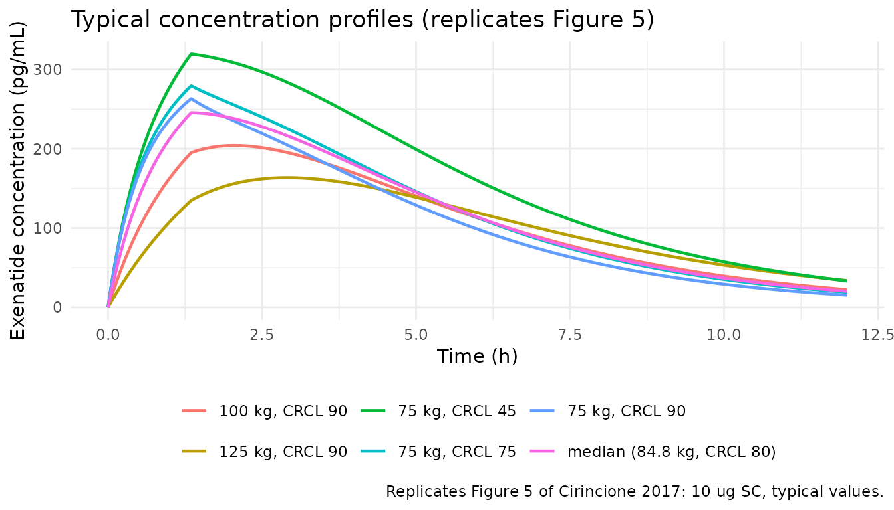
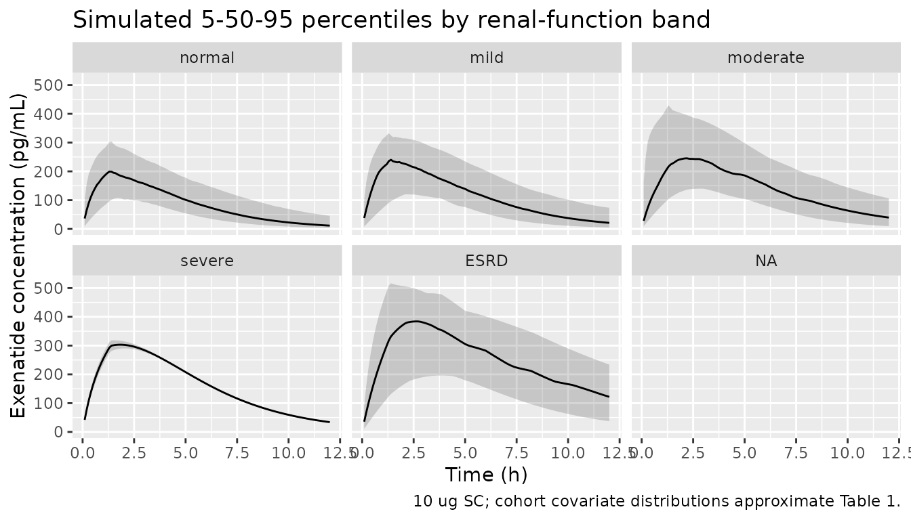

# Cirincione_2017_exenatide

## Model and source

- Citation: Cirincione B, Mager DE. Population pharmacokinetics of
  exenatide. British Journal of Clinical Pharmacology.
  2017;83(3):517-526. <doi:10.1111/bcp.13135>
- Description: Population PK model for exenatide immediate-release
  (Cirincione 2017): two-compartment, parallel linear and
  Michaelis-Menten elimination, sequential zero-order then saturable
  first-order absorption after SC dosing.
- Article: [Br J Clin Pharmacol.
  2017;83(3):517-526](https://doi.org/10.1111/bcp.13135)

## Population

The published analysis pooled 195 subjects from 8 clinical trials,
including both healthy volunteers and patients with type 2 diabetes
mellitus. Baseline demographics from Cirincione 2017 Table 1: 22%
female, 67% Caucasian; age 18-76 years (mean 48, SD 12.9); body weight
52.6-162 kg (mean 86, SD 16.2); MDRD eGFR ranged from 4.1 mL/min/1.73
m^2 (ESRD) to \>= 90 (normal), with a pooled mean of 88.7 (SD 31.4).
Renal-function distribution: 129 normal, 47 mild impairment, 10
moderate, 1 severe, 8 ESRD. Single or repeated SC doses of 2.5-20 ug.

The same information is available programmatically via
`readModelDb("Cirincione_2017_exenatide")$population`.

## Source trace

Per-parameter origin is recorded as an in-file comment next to each
[`ini()`](https://nlmixr2.github.io/rxode2/reference/ini.html) entry in
`inst/modeldb/specificDrugs/Cirincione_2017_exenatide.R`. The table
below collects them for review.

| Equation / parameter | Value              | Source location                                                                                                                                       |
|----------------------|--------------------|-------------------------------------------------------------------------------------------------------------------------------------------------------|
| `lcl` (Cl_int)       | `log(4.58)` L/hr   | Table 2                                                                                                                                               |
| `e_cl_gfr` (Cl_eGFR) | `0.838`            | Table 2                                                                                                                                               |
| `lq` (Cld)           | `log(3.72)` L/hr   | Table 2                                                                                                                                               |
| `lvc` (Vc_int)       | `log(7.03)` L      | Table 2                                                                                                                                               |
| `e_vc_wt` (Vc_wtkg)  | `2.67`             | Table 2                                                                                                                                               |
| `lvp` (Vp)           | `log(7.04)` L      | Table 2                                                                                                                                               |
| `lvmax` (Vmax)       | `log(1.55)` ug/hr  | Table 2                                                                                                                                               |
| `lkm` (Km)           | `log(0.567)` ng/mL | Table 2 (reported 567 pg/mL; expressed in ng/mL for unit-consistency with Cc = central/vc)                                                            |
| `lkamax` (ka_max)    | `log(12.8)` 1/hr   | Table 2 (RSE 42.5%)                                                                                                                                   |
| `lkmka` (Km_ka)      | `log(16.9)` ug     | Table 2                                                                                                                                               |
| `ttau` (tau)         | `fixed(1.35)` hr   | p. 520 Results (zero-order absorption duration fixed)                                                                                                 |
| `fdepot` (F)         | `fixed(1)`         | p. 520 Results (absolute bioavailability not identifiable)                                                                                            |
| `logitfr` (fr)       | `logit(0.628)`     | Table 2                                                                                                                                               |
| `etalcl` IIV         | `log(1 + 0.339^2)` | Table 2: CV Cl_int = 33.9%                                                                                                                            |
| `etalvc` IIV         | `log(1 + 0.805^2)` | Table 2: CV Vc_int = 80.5%                                                                                                                            |
| `etalkm` IIV         | `log(1 + 0.957^2)` | Table 2: CV Km = 95.7%                                                                                                                                |
| `expSdOther`         | `0.373`            | Table 2: residual sigma, pooled other studies                                                                                                         |
| `expSdStudy1`        | `0.39`             | Table 2: residual sigma, Study 1                                                                                                                      |
| `expSdStudy5`        | `0.08`             | Table 2: residual sigma, Study 5                                                                                                                      |
| Structure            | n/a                | p. 519-520 Methods: two-compartment with parallel linear + Michaelis-Menten clearance; sequential zero-order then saturable first-order SC absorption |

## Virtual cohort

Original observed data are not publicly available. The cohort below
approximates the Table 1 demographics: body weight from a truncated
normal centered on 86 kg (SD 16.2), eGFR from a distribution matching
the reported renal-function bands. Only the non-Study-1 / non-Study-5
(pooled “other”) residual group is simulated so that the NCA comparison
uses the largest share of the original cohort. A fixed 10 ug single SC
dose is used to match the paper’s Figure 5 reference dose.

``` r
set.seed(20260418)
n_subj <- 500

renal_bands <- tibble::tibble(
  band       = c("normal", "mild", "moderate", "severe", "ESRD"),
  n_in_paper = c(129, 47, 10, 1, 8),
  egfr_min   = c(90, 60, 30, 15, 4.1),
  egfr_max   = c(140, 89, 59, 29, 14)
)
renal_bands$frac <- renal_bands$n_in_paper / sum(renal_bands$n_in_paper)

sample_band <- sample(renal_bands$band, n_subj, replace = TRUE, prob = renal_bands$frac)
egfr_draws <- vapply(sample_band, function(b) {
  row <- renal_bands[renal_bands$band == b, ]
  runif(1, row$egfr_min, row$egfr_max)
}, numeric(1))

cohort <- tibble(
  id = seq_len(n_subj),
  WT = pmin(pmax(rnorm(n_subj, mean = 86, sd = 16.2), 52.6), 162),
  eGFR = egfr_draws,
  STUDY1 = 0L,
  STUDY5 = 0L,
  treatment = factor(sample_band, levels = c("normal", "mild", "moderate", "severe", "ESRD"))
)

events <- cohort |>
  dplyr::mutate(amt = 10, cmt = "depot", evid = 1L, time = 0) |>
  dplyr::select(id, time, amt, cmt, evid, WT, eGFR, STUDY1, STUDY5, treatment) |>
  dplyr::bind_rows(
    cohort |>
      tidyr::crossing(time = c(seq(0, 4, 0.1), seq(4.2, 12, 0.2))) |>
      dplyr::mutate(amt = 0, cmt = NA_character_, evid = 0L) |>
      dplyr::select(id, time, amt, cmt, evid, WT, eGFR, STUDY1, STUDY5, treatment)
  ) |>
  dplyr::arrange(id, time, dplyr::desc(evid))
```

## Simulation

``` r
mod <- rxode2::rxode2(readModelDb("Cirincione_2017_exenatide"))
#> ℹ parameter labels from comments will be replaced by 'label()'
sim <- rxode2::rxSolve(mod, events = events, keep = c("WT", "eGFR", "treatment"))
```

For deterministic replication (typical-value predictions without
between-subject variability, matching the paper’s Figure 5):

``` r
mod_typical <- mod |> rxode2::zeroRe()
#> Warning: No sigma parameters in the model

typical_scenarios <- tibble::tibble(
  id = 1:6,
  scenario = c("75 kg, eGFR 90", "100 kg, eGFR 90", "125 kg, eGFR 90",
    "75 kg, eGFR 75", "75 kg, eGFR 45", "median (84.8 kg, eGFR 80)"),
  WT = c(75, 100, 125, 75, 75, 84.8),
  eGFR = c(90, 90, 90, 75, 45, 80),
  STUDY1 = 0L,
  STUDY5 = 0L
)

ev_typical <- do.call(rbind, lapply(seq_len(nrow(typical_scenarios)), function(i) {
  ev_i <- rxode2::et(amt = 10, cmt = "depot") |>
    rxode2::et(seq(0, 12, 0.05)) |>
    as.data.frame()
  ev_i$id <- typical_scenarios$id[i]
  ev_i
}))

sim_typical <- rxode2::rxSolve(
  mod_typical, events = ev_typical,
  params = typical_scenarios[, c("id", "WT", "eGFR", "STUDY1", "STUDY5")],
  returnType = "tibble"
) |>
  dplyr::left_join(typical_scenarios[, c("id", "scenario")], by = "id")
#> ℹ omega/sigma items treated as zero: 'etalcl', 'etalvc', 'etalkm'
#> Warning: multi-subject simulation without without 'omega'
```

## Replicate published figures

### Figure 5 — typical concentration by body weight and eGFR

Cirincione 2017 Figure 5 shows simulated typical concentration-time
profiles after a 10 ug SC dose across body weight and eGFR scenarios.
Lower body weight and lower eGFR both increase exposure (lower central
volume and lower linear clearance, respectively).

``` r
sim_typical |>
  ggplot(aes(time, Cc, colour = scenario)) +
  geom_line(linewidth = 0.8) +
  labs(x = "Time (h)", y = "Exenatide concentration (pg/mL)",
    colour = NULL,
    title = "Typical concentration profiles (replicates Figure 5)",
    caption = "Replicates Figure 5 of Cirincione 2017: 10 ug SC, typical values.") +
  theme_minimal() +
  theme(legend.position = "bottom")
```



### Population VPC

VPC-style summary of the simulated cohort, stratified by renal-function
band.

``` r
sim |>
  dplyr::filter(!is.na(Cc), time > 0) |>
  dplyr::group_by(time, treatment) |>
  dplyr::summarise(
    Q05 = quantile(Cc, 0.05),
    Q50 = quantile(Cc, 0.50),
    Q95 = quantile(Cc, 0.95),
    .groups = "drop"
  ) |>
  ggplot(aes(time, Q50)) +
  geom_ribbon(aes(ymin = Q05, ymax = Q95), alpha = 0.2) +
  geom_line() +
  facet_wrap(~treatment) +
  labs(x = "Time (h)", y = "Exenatide concentration (pg/mL)",
    title = "Simulated 5-50-95 percentiles by renal-function band",
    caption = "10 ug SC; cohort covariate distributions approximate Table 1.")
#> `geom_line()`: Each group consists of only one observation.
#> ℹ Do you need to adjust the group aesthetic?
```



## PKNCA validation

Compute Cmax, Tmax, AUC0-last, and terminal half-life using `PKNCA`.
Groups by renal-function band (the treatment stratifier) so the summary
can be compared against the paper’s typical values.

``` r
sim_nca <- sim |>
  dplyr::filter(!is.na(Cc), time > 0) |>
  dplyr::select(id, time, Cc, treatment)

conc_obj <- PKNCA::PKNCAconc(sim_nca, Cc ~ time | treatment + id)

dose_df <- events |>
  dplyr::filter(evid == 1) |>
  dplyr::select(id, time, amt, treatment)

dose_obj <- PKNCA::PKNCAdose(dose_df, amt ~ time | treatment + id)

intervals <- data.frame(
  start      = 0,
  end        = 12,
  cmax       = TRUE,
  tmax       = TRUE,
  auclast    = TRUE,
  half.life  = TRUE
)

nca_res <- PKNCA::pk.nca(PKNCA::PKNCAdata(conc_obj, dose_obj, intervals = intervals))
#> Warning: Requesting an AUC range starting (0) before the first measurement (0.1) is not allowed
#> Requesting an AUC range starting (0) before the first measurement (0.1) is not allowed
#> Requesting an AUC range starting (0) before the first measurement (0.1) is not allowed
#> Requesting an AUC range starting (0) before the first measurement (0.1) is not allowed
#> Requesting an AUC range starting (0) before the first measurement (0.1) is not allowed
#> Requesting an AUC range starting (0) before the first measurement (0.1) is not allowed
#> Requesting an AUC range starting (0) before the first measurement (0.1) is not allowed
#> Requesting an AUC range starting (0) before the first measurement (0.1) is not allowed
#> Requesting an AUC range starting (0) before the first measurement (0.1) is not allowed
#> Requesting an AUC range starting (0) before the first measurement (0.1) is not allowed
#> Requesting an AUC range starting (0) before the first measurement (0.1) is not allowed
#> Requesting an AUC range starting (0) before the first measurement (0.1) is not allowed
#> Requesting an AUC range starting (0) before the first measurement (0.1) is not allowed
#> Requesting an AUC range starting (0) before the first measurement (0.1) is not allowed
#> Requesting an AUC range starting (0) before the first measurement (0.1) is not allowed
#> Requesting an AUC range starting (0) before the first measurement (0.1) is not allowed
#> Requesting an AUC range starting (0) before the first measurement (0.1) is not allowed
#> Requesting an AUC range starting (0) before the first measurement (0.1) is not allowed
#> Requesting an AUC range starting (0) before the first measurement (0.1) is not allowed
#> Requesting an AUC range starting (0) before the first measurement (0.1) is not allowed
#> Requesting an AUC range starting (0) before the first measurement (0.1) is not allowed
#> Requesting an AUC range starting (0) before the first measurement (0.1) is not allowed
#> Requesting an AUC range starting (0) before the first measurement (0.1) is not allowed
#> Requesting an AUC range starting (0) before the first measurement (0.1) is not allowed
#> Requesting an AUC range starting (0) before the first measurement (0.1) is not allowed
#> Requesting an AUC range starting (0) before the first measurement (0.1) is not allowed
#> Requesting an AUC range starting (0) before the first measurement (0.1) is not allowed
#> Requesting an AUC range starting (0) before the first measurement (0.1) is not allowed
#> Requesting an AUC range starting (0) before the first measurement (0.1) is not allowed
#> Requesting an AUC range starting (0) before the first measurement (0.1) is not allowed
#>  ■■                                 3% |  ETA:  1m
#> Warning: Requesting an AUC range starting (0) before the first measurement (0.1) is not allowed
#> Requesting an AUC range starting (0) before the first measurement (0.1) is not allowed
#> Requesting an AUC range starting (0) before the first measurement (0.1) is not allowed
#> Requesting an AUC range starting (0) before the first measurement (0.1) is not allowed
#> Requesting an AUC range starting (0) before the first measurement (0.1) is not allowed
#> Requesting an AUC range starting (0) before the first measurement (0.1) is not allowed
#> Requesting an AUC range starting (0) before the first measurement (0.1) is not allowed
#> Requesting an AUC range starting (0) before the first measurement (0.1) is not allowed
#> Requesting an AUC range starting (0) before the first measurement (0.1) is not allowed
#> Requesting an AUC range starting (0) before the first measurement (0.1) is not allowed
#> Requesting an AUC range starting (0) before the first measurement (0.1) is not allowed
#> Requesting an AUC range starting (0) before the first measurement (0.1) is not allowed
#> Requesting an AUC range starting (0) before the first measurement (0.1) is not allowed
#> Requesting an AUC range starting (0) before the first measurement (0.1) is not allowed
#> Requesting an AUC range starting (0) before the first measurement (0.1) is not allowed
#> Requesting an AUC range starting (0) before the first measurement (0.1) is not allowed
#> Requesting an AUC range starting (0) before the first measurement (0.1) is not allowed
#> Requesting an AUC range starting (0) before the first measurement (0.1) is not allowed
#> Requesting an AUC range starting (0) before the first measurement (0.1) is not allowed
#> Requesting an AUC range starting (0) before the first measurement (0.1) is not allowed
#> Requesting an AUC range starting (0) before the first measurement (0.1) is not allowed
#> Requesting an AUC range starting (0) before the first measurement (0.1) is not allowed
#> Requesting an AUC range starting (0) before the first measurement (0.1) is not allowed
#> Requesting an AUC range starting (0) before the first measurement (0.1) is not allowed
#> Requesting an AUC range starting (0) before the first measurement (0.1) is not allowed
#> Requesting an AUC range starting (0) before the first measurement (0.1) is not allowed
#> Requesting an AUC range starting (0) before the first measurement (0.1) is not allowed
#> Requesting an AUC range starting (0) before the first measurement (0.1) is not allowed
#> Requesting an AUC range starting (0) before the first measurement (0.1) is not allowed
#> Requesting an AUC range starting (0) before the first measurement (0.1) is not allowed
#> Requesting an AUC range starting (0) before the first measurement (0.1) is not allowed
#> Requesting an AUC range starting (0) before the first measurement (0.1) is not allowed
#> Requesting an AUC range starting (0) before the first measurement (0.1) is not allowed
#> Requesting an AUC range starting (0) before the first measurement (0.1) is not allowed
#> Requesting an AUC range starting (0) before the first measurement (0.1) is not allowed
#> Requesting an AUC range starting (0) before the first measurement (0.1) is not allowed
#> Requesting an AUC range starting (0) before the first measurement (0.1) is not allowed
#> Requesting an AUC range starting (0) before the first measurement (0.1) is not allowed
#> Requesting an AUC range starting (0) before the first measurement (0.1) is not allowed
#> Requesting an AUC range starting (0) before the first measurement (0.1) is not allowed
#> Requesting an AUC range starting (0) before the first measurement (0.1) is not allowed
#> Requesting an AUC range starting (0) before the first measurement (0.1) is not allowed
#> Requesting an AUC range starting (0) before the first measurement (0.1) is not allowed
#> Requesting an AUC range starting (0) before the first measurement (0.1) is not allowed
#> Requesting an AUC range starting (0) before the first measurement (0.1) is not allowed
#> Requesting an AUC range starting (0) before the first measurement (0.1) is not allowed
#> Requesting an AUC range starting (0) before the first measurement (0.1) is not allowed
#> Requesting an AUC range starting (0) before the first measurement (0.1) is not allowed
#> Requesting an AUC range starting (0) before the first measurement (0.1) is not allowed
#> Requesting an AUC range starting (0) before the first measurement (0.1) is not allowed
#> Requesting an AUC range starting (0) before the first measurement (0.1) is not allowed
#> Requesting an AUC range starting (0) before the first measurement (0.1) is not allowed
#> Requesting an AUC range starting (0) before the first measurement (0.1) is not allowed
#> Requesting an AUC range starting (0) before the first measurement (0.1) is not allowed
#> Requesting an AUC range starting (0) before the first measurement (0.1) is not allowed
#>  ■■■■                               8% |  ETA: 49s
#> Warning: Requesting an AUC range starting (0) before the first measurement (0.1) is not allowed
#> Requesting an AUC range starting (0) before the first measurement (0.1) is not allowed
#> Requesting an AUC range starting (0) before the first measurement (0.1) is not allowed
#> Requesting an AUC range starting (0) before the first measurement (0.1) is not allowed
#> Requesting an AUC range starting (0) before the first measurement (0.1) is not allowed
#> Requesting an AUC range starting (0) before the first measurement (0.1) is not allowed
#> Requesting an AUC range starting (0) before the first measurement (0.1) is not allowed
#> Requesting an AUC range starting (0) before the first measurement (0.1) is not allowed
#> Requesting an AUC range starting (0) before the first measurement (0.1) is not allowed
#> Requesting an AUC range starting (0) before the first measurement (0.1) is not allowed
#> Requesting an AUC range starting (0) before the first measurement (0.1) is not allowed
#> Requesting an AUC range starting (0) before the first measurement (0.1) is not allowed
#> Requesting an AUC range starting (0) before the first measurement (0.1) is not allowed
#> Requesting an AUC range starting (0) before the first measurement (0.1) is not allowed
#> Requesting an AUC range starting (0) before the first measurement (0.1) is not allowed
#> Requesting an AUC range starting (0) before the first measurement (0.1) is not allowed
#> Requesting an AUC range starting (0) before the first measurement (0.1) is not allowed
#> Requesting an AUC range starting (0) before the first measurement (0.1) is not allowed
#> Requesting an AUC range starting (0) before the first measurement (0.1) is not allowed
#> Requesting an AUC range starting (0) before the first measurement (0.1) is not allowed
#> Requesting an AUC range starting (0) before the first measurement (0.1) is not allowed
#> Requesting an AUC range starting (0) before the first measurement (0.1) is not allowed
#> Requesting an AUC range starting (0) before the first measurement (0.1) is not allowed
#> Requesting an AUC range starting (0) before the first measurement (0.1) is not allowed
#> Requesting an AUC range starting (0) before the first measurement (0.1) is not allowed
#> Requesting an AUC range starting (0) before the first measurement (0.1) is not allowed
#> Requesting an AUC range starting (0) before the first measurement (0.1) is not allowed
#> Requesting an AUC range starting (0) before the first measurement (0.1) is not allowed
#> Requesting an AUC range starting (0) before the first measurement (0.1) is not allowed
#> Requesting an AUC range starting (0) before the first measurement (0.1) is not allowed
#> Requesting an AUC range starting (0) before the first measurement (0.1) is not allowed
#> Requesting an AUC range starting (0) before the first measurement (0.1) is not allowed
#> Requesting an AUC range starting (0) before the first measurement (0.1) is not allowed
#> Requesting an AUC range starting (0) before the first measurement (0.1) is not allowed
#> Requesting an AUC range starting (0) before the first measurement (0.1) is not allowed
#> Requesting an AUC range starting (0) before the first measurement (0.1) is not allowed
#> Requesting an AUC range starting (0) before the first measurement (0.1) is not allowed
#> Requesting an AUC range starting (0) before the first measurement (0.1) is not allowed
#> Requesting an AUC range starting (0) before the first measurement (0.1) is not allowed
#> Requesting an AUC range starting (0) before the first measurement (0.1) is not allowed
#> Requesting an AUC range starting (0) before the first measurement (0.1) is not allowed
#> Requesting an AUC range starting (0) before the first measurement (0.1) is not allowed
#> Requesting an AUC range starting (0) before the first measurement (0.1) is not allowed
#> Requesting an AUC range starting (0) before the first measurement (0.1) is not allowed
#> Requesting an AUC range starting (0) before the first measurement (0.1) is not allowed
#> Requesting an AUC range starting (0) before the first measurement (0.1) is not allowed
#> Requesting an AUC range starting (0) before the first measurement (0.1) is not allowed
#> Requesting an AUC range starting (0) before the first measurement (0.1) is not allowed
#> Requesting an AUC range starting (0) before the first measurement (0.1) is not allowed
#> Requesting an AUC range starting (0) before the first measurement (0.1) is not allowed
#> Requesting an AUC range starting (0) before the first measurement (0.1) is not allowed
#> Requesting an AUC range starting (0) before the first measurement (0.1) is not allowed
#> Requesting an AUC range starting (0) before the first measurement (0.1) is not allowed
#> Requesting an AUC range starting (0) before the first measurement (0.1) is not allowed
#> Requesting an AUC range starting (0) before the first measurement (0.1) is not allowed
#> Requesting an AUC range starting (0) before the first measurement (0.1) is not allowed
#> Requesting an AUC range starting (0) before the first measurement (0.1) is not allowed
#> Requesting an AUC range starting (0) before the first measurement (0.1) is not allowed
#> Requesting an AUC range starting (0) before the first measurement (0.1) is not allowed
#> Requesting an AUC range starting (0) before the first measurement (0.1) is not allowed
#> Requesting an AUC range starting (0) before the first measurement (0.1) is not allowed
#>  ■■■■■                             15% |  ETA: 44s
#> Warning: Requesting an AUC range starting (0) before the first measurement (0.1) is not allowed
#> Requesting an AUC range starting (0) before the first measurement (0.1) is not allowed
#> Requesting an AUC range starting (0) before the first measurement (0.1) is not allowed
#> Requesting an AUC range starting (0) before the first measurement (0.1) is not allowed
#> Requesting an AUC range starting (0) before the first measurement (0.1) is not allowed
#> Requesting an AUC range starting (0) before the first measurement (0.1) is not allowed
#> Requesting an AUC range starting (0) before the first measurement (0.1) is not allowed
#> Requesting an AUC range starting (0) before the first measurement (0.1) is not allowed
#> Requesting an AUC range starting (0) before the first measurement (0.1) is not allowed
#> Requesting an AUC range starting (0) before the first measurement (0.1) is not allowed
#> Requesting an AUC range starting (0) before the first measurement (0.1) is not allowed
#> Requesting an AUC range starting (0) before the first measurement (0.1) is not allowed
#> Requesting an AUC range starting (0) before the first measurement (0.1) is not allowed
#> Requesting an AUC range starting (0) before the first measurement (0.1) is not allowed
#> Requesting an AUC range starting (0) before the first measurement (0.1) is not allowed
#> Requesting an AUC range starting (0) before the first measurement (0.1) is not allowed
#> Requesting an AUC range starting (0) before the first measurement (0.1) is not allowed
#> Requesting an AUC range starting (0) before the first measurement (0.1) is not allowed
#> Requesting an AUC range starting (0) before the first measurement (0.1) is not allowed
#> Requesting an AUC range starting (0) before the first measurement (0.1) is not allowed
#> Requesting an AUC range starting (0) before the first measurement (0.1) is not allowed
#> Requesting an AUC range starting (0) before the first measurement (0.1) is not allowed
#> Requesting an AUC range starting (0) before the first measurement (0.1) is not allowed
#> Requesting an AUC range starting (0) before the first measurement (0.1) is not allowed
#> Requesting an AUC range starting (0) before the first measurement (0.1) is not allowed
#> Requesting an AUC range starting (0) before the first measurement (0.1) is not allowed
#> Requesting an AUC range starting (0) before the first measurement (0.1) is not allowed
#> Requesting an AUC range starting (0) before the first measurement (0.1) is not allowed
#> Requesting an AUC range starting (0) before the first measurement (0.1) is not allowed
#> Requesting an AUC range starting (0) before the first measurement (0.1) is not allowed
#> Requesting an AUC range starting (0) before the first measurement (0.1) is not allowed
#> Requesting an AUC range starting (0) before the first measurement (0.1) is not allowed
#> Requesting an AUC range starting (0) before the first measurement (0.1) is not allowed
#> Requesting an AUC range starting (0) before the first measurement (0.1) is not allowed
#> Requesting an AUC range starting (0) before the first measurement (0.1) is not allowed
#> Requesting an AUC range starting (0) before the first measurement (0.1) is not allowed
#> Requesting an AUC range starting (0) before the first measurement (0.1) is not allowed
#> Requesting an AUC range starting (0) before the first measurement (0.1) is not allowed
#> Requesting an AUC range starting (0) before the first measurement (0.1) is not allowed
#> Requesting an AUC range starting (0) before the first measurement (0.1) is not allowed
#> Requesting an AUC range starting (0) before the first measurement (0.1) is not allowed
#> Requesting an AUC range starting (0) before the first measurement (0.1) is not allowed
#> Requesting an AUC range starting (0) before the first measurement (0.1) is not allowed
#> Requesting an AUC range starting (0) before the first measurement (0.1) is not allowed
#> Requesting an AUC range starting (0) before the first measurement (0.1) is not allowed
#> Requesting an AUC range starting (0) before the first measurement (0.1) is not allowed
#> Requesting an AUC range starting (0) before the first measurement (0.1) is not allowed
#> Requesting an AUC range starting (0) before the first measurement (0.1) is not allowed
#> Requesting an AUC range starting (0) before the first measurement (0.1) is not allowed
#> Requesting an AUC range starting (0) before the first measurement (0.1) is not allowed
#> Requesting an AUC range starting (0) before the first measurement (0.1) is not allowed
#> Requesting an AUC range starting (0) before the first measurement (0.1) is not allowed
#> Requesting an AUC range starting (0) before the first measurement (0.1) is not allowed
#> Requesting an AUC range starting (0) before the first measurement (0.1) is not allowed
#> Requesting an AUC range starting (0) before the first measurement (0.1) is not allowed
#> Requesting an AUC range starting (0) before the first measurement (0.1) is not allowed
#> Requesting an AUC range starting (0) before the first measurement (0.1) is not allowed
#> Requesting an AUC range starting (0) before the first measurement (0.1) is not allowed
#> Requesting an AUC range starting (0) before the first measurement (0.1) is not allowed
#>  ■■■■■■■                           20% |  ETA: 41s
#> Warning: Requesting an AUC range starting (0) before the first measurement (0.1) is not allowed
#> Requesting an AUC range starting (0) before the first measurement (0.1) is not allowed
#> Requesting an AUC range starting (0) before the first measurement (0.1) is not allowed
#> Requesting an AUC range starting (0) before the first measurement (0.1) is not allowed
#> Requesting an AUC range starting (0) before the first measurement (0.1) is not allowed
#> Requesting an AUC range starting (0) before the first measurement (0.1) is not allowed
#> Requesting an AUC range starting (0) before the first measurement (0.1) is not allowed
#> Requesting an AUC range starting (0) before the first measurement (0.1) is not allowed
#> Requesting an AUC range starting (0) before the first measurement (0.1) is not allowed
#> Requesting an AUC range starting (0) before the first measurement (0.1) is not allowed
#> Requesting an AUC range starting (0) before the first measurement (0.1) is not allowed
#> Requesting an AUC range starting (0) before the first measurement (0.1) is not allowed
#> Requesting an AUC range starting (0) before the first measurement (0.1) is not allowed
#> Requesting an AUC range starting (0) before the first measurement (0.1) is not allowed
#> Requesting an AUC range starting (0) before the first measurement (0.1) is not allowed
#> Requesting an AUC range starting (0) before the first measurement (0.1) is not allowed
#> Requesting an AUC range starting (0) before the first measurement (0.1) is not allowed
#> Requesting an AUC range starting (0) before the first measurement (0.1) is not allowed
#> Requesting an AUC range starting (0) before the first measurement (0.1) is not allowed
#> Requesting an AUC range starting (0) before the first measurement (0.1) is not allowed
#> Requesting an AUC range starting (0) before the first measurement (0.1) is not allowed
#> Requesting an AUC range starting (0) before the first measurement (0.1) is not allowed
#> Requesting an AUC range starting (0) before the first measurement (0.1) is not allowed
#> Requesting an AUC range starting (0) before the first measurement (0.1) is not allowed
#> Requesting an AUC range starting (0) before the first measurement (0.1) is not allowed
#> Requesting an AUC range starting (0) before the first measurement (0.1) is not allowed
#> Requesting an AUC range starting (0) before the first measurement (0.1) is not allowed
#> Requesting an AUC range starting (0) before the first measurement (0.1) is not allowed
#> Requesting an AUC range starting (0) before the first measurement (0.1) is not allowed
#> Requesting an AUC range starting (0) before the first measurement (0.1) is not allowed
#> Requesting an AUC range starting (0) before the first measurement (0.1) is not allowed
#> Requesting an AUC range starting (0) before the first measurement (0.1) is not allowed
#> Requesting an AUC range starting (0) before the first measurement (0.1) is not allowed
#> Requesting an AUC range starting (0) before the first measurement (0.1) is not allowed
#> Requesting an AUC range starting (0) before the first measurement (0.1) is not allowed
#> Requesting an AUC range starting (0) before the first measurement (0.1) is not allowed
#> Requesting an AUC range starting (0) before the first measurement (0.1) is not allowed
#> Requesting an AUC range starting (0) before the first measurement (0.1) is not allowed
#> Requesting an AUC range starting (0) before the first measurement (0.1) is not allowed
#> Requesting an AUC range starting (0) before the first measurement (0.1) is not allowed
#> Requesting an AUC range starting (0) before the first measurement (0.1) is not allowed
#> Requesting an AUC range starting (0) before the first measurement (0.1) is not allowed
#> Requesting an AUC range starting (0) before the first measurement (0.1) is not allowed
#> Requesting an AUC range starting (0) before the first measurement (0.1) is not allowed
#> Requesting an AUC range starting (0) before the first measurement (0.1) is not allowed
#> Requesting an AUC range starting (0) before the first measurement (0.1) is not allowed
#> Requesting an AUC range starting (0) before the first measurement (0.1) is not allowed
#> Requesting an AUC range starting (0) before the first measurement (0.1) is not allowed
#> Requesting an AUC range starting (0) before the first measurement (0.1) is not allowed
#> Requesting an AUC range starting (0) before the first measurement (0.1) is not allowed
#> Requesting an AUC range starting (0) before the first measurement (0.1) is not allowed
#> Requesting an AUC range starting (0) before the first measurement (0.1) is not allowed
#> Requesting an AUC range starting (0) before the first measurement (0.1) is not allowed
#> Requesting an AUC range starting (0) before the first measurement (0.1) is not allowed
#> Requesting an AUC range starting (0) before the first measurement (0.1) is not allowed
#> Requesting an AUC range starting (0) before the first measurement (0.1) is not allowed
#> Requesting an AUC range starting (0) before the first measurement (0.1) is not allowed
#> Requesting an AUC range starting (0) before the first measurement (0.1) is not allowed
#> Requesting an AUC range starting (0) before the first measurement (0.1) is not allowed
#> Requesting an AUC range starting (0) before the first measurement (0.1) is not allowed
#> Requesting an AUC range starting (0) before the first measurement (0.1) is not allowed
#>  ■■■■■■■■■                         27% |  ETA: 37s
#> Warning: Requesting an AUC range starting (0) before the first measurement (0.1) is not allowed
#> Requesting an AUC range starting (0) before the first measurement (0.1) is not allowed
#> Requesting an AUC range starting (0) before the first measurement (0.1) is not allowed
#> Requesting an AUC range starting (0) before the first measurement (0.1) is not allowed
#> Requesting an AUC range starting (0) before the first measurement (0.1) is not allowed
#> Requesting an AUC range starting (0) before the first measurement (0.1) is not allowed
#> Requesting an AUC range starting (0) before the first measurement (0.1) is not allowed
#> Requesting an AUC range starting (0) before the first measurement (0.1) is not allowed
#> Requesting an AUC range starting (0) before the first measurement (0.1) is not allowed
#> Requesting an AUC range starting (0) before the first measurement (0.1) is not allowed
#> Requesting an AUC range starting (0) before the first measurement (0.1) is not allowed
#> Requesting an AUC range starting (0) before the first measurement (0.1) is not allowed
#> Requesting an AUC range starting (0) before the first measurement (0.1) is not allowed
#> Requesting an AUC range starting (0) before the first measurement (0.1) is not allowed
#> Requesting an AUC range starting (0) before the first measurement (0.1) is not allowed
#> Requesting an AUC range starting (0) before the first measurement (0.1) is not allowed
#> Requesting an AUC range starting (0) before the first measurement (0.1) is not allowed
#> Requesting an AUC range starting (0) before the first measurement (0.1) is not allowed
#> Requesting an AUC range starting (0) before the first measurement (0.1) is not allowed
#> Requesting an AUC range starting (0) before the first measurement (0.1) is not allowed
#> Requesting an AUC range starting (0) before the first measurement (0.1) is not allowed
#> Requesting an AUC range starting (0) before the first measurement (0.1) is not allowed
#> Requesting an AUC range starting (0) before the first measurement (0.1) is not allowed
#> Requesting an AUC range starting (0) before the first measurement (0.1) is not allowed
#> Requesting an AUC range starting (0) before the first measurement (0.1) is not allowed
#> Requesting an AUC range starting (0) before the first measurement (0.1) is not allowed
#> Requesting an AUC range starting (0) before the first measurement (0.1) is not allowed
#> Requesting an AUC range starting (0) before the first measurement (0.1) is not allowed
#> Requesting an AUC range starting (0) before the first measurement (0.1) is not allowed
#> Requesting an AUC range starting (0) before the first measurement (0.1) is not allowed
#> Requesting an AUC range starting (0) before the first measurement (0.1) is not allowed
#> Requesting an AUC range starting (0) before the first measurement (0.1) is not allowed
#> Requesting an AUC range starting (0) before the first measurement (0.1) is not allowed
#> Requesting an AUC range starting (0) before the first measurement (0.1) is not allowed
#> Requesting an AUC range starting (0) before the first measurement (0.1) is not allowed
#> Requesting an AUC range starting (0) before the first measurement (0.1) is not allowed
#> Requesting an AUC range starting (0) before the first measurement (0.1) is not allowed
#> Requesting an AUC range starting (0) before the first measurement (0.1) is not allowed
#> Requesting an AUC range starting (0) before the first measurement (0.1) is not allowed
#> Requesting an AUC range starting (0) before the first measurement (0.1) is not allowed
#> Requesting an AUC range starting (0) before the first measurement (0.1) is not allowed
#> Requesting an AUC range starting (0) before the first measurement (0.1) is not allowed
#> Requesting an AUC range starting (0) before the first measurement (0.1) is not allowed
#> Requesting an AUC range starting (0) before the first measurement (0.1) is not allowed
#> Requesting an AUC range starting (0) before the first measurement (0.1) is not allowed
#> Requesting an AUC range starting (0) before the first measurement (0.1) is not allowed
#> Requesting an AUC range starting (0) before the first measurement (0.1) is not allowed
#> Requesting an AUC range starting (0) before the first measurement (0.1) is not allowed
#> Requesting an AUC range starting (0) before the first measurement (0.1) is not allowed
#> Requesting an AUC range starting (0) before the first measurement (0.1) is not allowed
#> Requesting an AUC range starting (0) before the first measurement (0.1) is not allowed
#> Requesting an AUC range starting (0) before the first measurement (0.1) is not allowed
#> Requesting an AUC range starting (0) before the first measurement (0.1) is not allowed
#> Requesting an AUC range starting (0) before the first measurement (0.1) is not allowed
#> Requesting an AUC range starting (0) before the first measurement (0.1) is not allowed
#> Requesting an AUC range starting (0) before the first measurement (0.1) is not allowed
#> Requesting an AUC range starting (0) before the first measurement (0.1) is not allowed
#> Requesting an AUC range starting (0) before the first measurement (0.1) is not allowed
#> Requesting an AUC range starting (0) before the first measurement (0.1) is not allowed
#> Requesting an AUC range starting (0) before the first measurement (0.1) is not allowed
#> Requesting an AUC range starting (0) before the first measurement (0.1) is not allowed
#>  ■■■■■■■■■■■                       33% |  ETA: 34s
#> Warning: Requesting an AUC range starting (0) before the first measurement (0.1) is not allowed
#> Requesting an AUC range starting (0) before the first measurement (0.1) is not allowed
#> Requesting an AUC range starting (0) before the first measurement (0.1) is not allowed
#> Requesting an AUC range starting (0) before the first measurement (0.1) is not allowed
#> Requesting an AUC range starting (0) before the first measurement (0.1) is not allowed
#> Requesting an AUC range starting (0) before the first measurement (0.1) is not allowed
#> Requesting an AUC range starting (0) before the first measurement (0.1) is not allowed
#> Requesting an AUC range starting (0) before the first measurement (0.1) is not allowed
#> Requesting an AUC range starting (0) before the first measurement (0.1) is not allowed
#> Requesting an AUC range starting (0) before the first measurement (0.1) is not allowed
#> Requesting an AUC range starting (0) before the first measurement (0.1) is not allowed
#> Requesting an AUC range starting (0) before the first measurement (0.1) is not allowed
#> Requesting an AUC range starting (0) before the first measurement (0.1) is not allowed
#> Requesting an AUC range starting (0) before the first measurement (0.1) is not allowed
#> Requesting an AUC range starting (0) before the first measurement (0.1) is not allowed
#> Requesting an AUC range starting (0) before the first measurement (0.1) is not allowed
#> Requesting an AUC range starting (0) before the first measurement (0.1) is not allowed
#> Requesting an AUC range starting (0) before the first measurement (0.1) is not allowed
#> Requesting an AUC range starting (0) before the first measurement (0.1) is not allowed
#> Requesting an AUC range starting (0) before the first measurement (0.1) is not allowed
#> Requesting an AUC range starting (0) before the first measurement (0.1) is not allowed
#> Requesting an AUC range starting (0) before the first measurement (0.1) is not allowed
#> Requesting an AUC range starting (0) before the first measurement (0.1) is not allowed
#> Requesting an AUC range starting (0) before the first measurement (0.1) is not allowed
#> Requesting an AUC range starting (0) before the first measurement (0.1) is not allowed
#> Requesting an AUC range starting (0) before the first measurement (0.1) is not allowed
#> Requesting an AUC range starting (0) before the first measurement (0.1) is not allowed
#> Requesting an AUC range starting (0) before the first measurement (0.1) is not allowed
#> Requesting an AUC range starting (0) before the first measurement (0.1) is not allowed
#> Requesting an AUC range starting (0) before the first measurement (0.1) is not allowed
#> Requesting an AUC range starting (0) before the first measurement (0.1) is not allowed
#> Requesting an AUC range starting (0) before the first measurement (0.1) is not allowed
#> Requesting an AUC range starting (0) before the first measurement (0.1) is not allowed
#> Requesting an AUC range starting (0) before the first measurement (0.1) is not allowed
#> Requesting an AUC range starting (0) before the first measurement (0.1) is not allowed
#> Requesting an AUC range starting (0) before the first measurement (0.1) is not allowed
#> Requesting an AUC range starting (0) before the first measurement (0.1) is not allowed
#> Requesting an AUC range starting (0) before the first measurement (0.1) is not allowed
#> Requesting an AUC range starting (0) before the first measurement (0.1) is not allowed
#> Requesting an AUC range starting (0) before the first measurement (0.1) is not allowed
#> Requesting an AUC range starting (0) before the first measurement (0.1) is not allowed
#> Requesting an AUC range starting (0) before the first measurement (0.1) is not allowed
#> Requesting an AUC range starting (0) before the first measurement (0.1) is not allowed
#> Requesting an AUC range starting (0) before the first measurement (0.1) is not allowed
#> Requesting an AUC range starting (0) before the first measurement (0.1) is not allowed
#> Requesting an AUC range starting (0) before the first measurement (0.1) is not allowed
#> Requesting an AUC range starting (0) before the first measurement (0.1) is not allowed
#> Requesting an AUC range starting (0) before the first measurement (0.1) is not allowed
#> Requesting an AUC range starting (0) before the first measurement (0.1) is not allowed
#> Requesting an AUC range starting (0) before the first measurement (0.1) is not allowed
#> Requesting an AUC range starting (0) before the first measurement (0.1) is not allowed
#> Requesting an AUC range starting (0) before the first measurement (0.1) is not allowed
#> Requesting an AUC range starting (0) before the first measurement (0.1) is not allowed
#> Requesting an AUC range starting (0) before the first measurement (0.1) is not allowed
#> Requesting an AUC range starting (0) before the first measurement (0.1) is not allowed
#> Requesting an AUC range starting (0) before the first measurement (0.1) is not allowed
#> Requesting an AUC range starting (0) before the first measurement (0.1) is not allowed
#> Requesting an AUC range starting (0) before the first measurement (0.1) is not allowed
#> Requesting an AUC range starting (0) before the first measurement (0.1) is not allowed
#>  ■■■■■■■■■■■■■                     39% |  ETA: 31s
#> Warning: Requesting an AUC range starting (0) before the first measurement (0.1) is not allowed
#> Requesting an AUC range starting (0) before the first measurement (0.1) is not allowed
#> Requesting an AUC range starting (0) before the first measurement (0.1) is not allowed
#> Requesting an AUC range starting (0) before the first measurement (0.1) is not allowed
#> Requesting an AUC range starting (0) before the first measurement (0.1) is not allowed
#> Requesting an AUC range starting (0) before the first measurement (0.1) is not allowed
#> Requesting an AUC range starting (0) before the first measurement (0.1) is not allowed
#> Requesting an AUC range starting (0) before the first measurement (0.1) is not allowed
#> Requesting an AUC range starting (0) before the first measurement (0.1) is not allowed
#> Requesting an AUC range starting (0) before the first measurement (0.1) is not allowed
#> Requesting an AUC range starting (0) before the first measurement (0.1) is not allowed
#> Requesting an AUC range starting (0) before the first measurement (0.1) is not allowed
#> Requesting an AUC range starting (0) before the first measurement (0.1) is not allowed
#> Requesting an AUC range starting (0) before the first measurement (0.1) is not allowed
#> Requesting an AUC range starting (0) before the first measurement (0.1) is not allowed
#> Requesting an AUC range starting (0) before the first measurement (0.1) is not allowed
#> Requesting an AUC range starting (0) before the first measurement (0.1) is not allowed
#> Requesting an AUC range starting (0) before the first measurement (0.1) is not allowed
#> Requesting an AUC range starting (0) before the first measurement (0.1) is not allowed
#> Requesting an AUC range starting (0) before the first measurement (0.1) is not allowed
#> Requesting an AUC range starting (0) before the first measurement (0.1) is not allowed
#> Requesting an AUC range starting (0) before the first measurement (0.1) is not allowed
#> Requesting an AUC range starting (0) before the first measurement (0.1) is not allowed
#> Requesting an AUC range starting (0) before the first measurement (0.1) is not allowed
#> Requesting an AUC range starting (0) before the first measurement (0.1) is not allowed
#> Requesting an AUC range starting (0) before the first measurement (0.1) is not allowed
#> Requesting an AUC range starting (0) before the first measurement (0.1) is not allowed
#> Requesting an AUC range starting (0) before the first measurement (0.1) is not allowed
#> Requesting an AUC range starting (0) before the first measurement (0.1) is not allowed
#> Requesting an AUC range starting (0) before the first measurement (0.1) is not allowed
#> Requesting an AUC range starting (0) before the first measurement (0.1) is not allowed
#> Requesting an AUC range starting (0) before the first measurement (0.1) is not allowed
#> Requesting an AUC range starting (0) before the first measurement (0.1) is not allowed
#> Requesting an AUC range starting (0) before the first measurement (0.1) is not allowed
#> Requesting an AUC range starting (0) before the first measurement (0.1) is not allowed
#> Requesting an AUC range starting (0) before the first measurement (0.1) is not allowed
#> Requesting an AUC range starting (0) before the first measurement (0.1) is not allowed
#> Requesting an AUC range starting (0) before the first measurement (0.1) is not allowed
#> Requesting an AUC range starting (0) before the first measurement (0.1) is not allowed
#> Requesting an AUC range starting (0) before the first measurement (0.1) is not allowed
#> Requesting an AUC range starting (0) before the first measurement (0.1) is not allowed
#> Requesting an AUC range starting (0) before the first measurement (0.1) is not allowed
#> Requesting an AUC range starting (0) before the first measurement (0.1) is not allowed
#> Requesting an AUC range starting (0) before the first measurement (0.1) is not allowed
#> Requesting an AUC range starting (0) before the first measurement (0.1) is not allowed
#> Requesting an AUC range starting (0) before the first measurement (0.1) is not allowed
#> Requesting an AUC range starting (0) before the first measurement (0.1) is not allowed
#> Requesting an AUC range starting (0) before the first measurement (0.1) is not allowed
#> Requesting an AUC range starting (0) before the first measurement (0.1) is not allowed
#> Requesting an AUC range starting (0) before the first measurement (0.1) is not allowed
#> Requesting an AUC range starting (0) before the first measurement (0.1) is not allowed
#> Requesting an AUC range starting (0) before the first measurement (0.1) is not allowed
#> Requesting an AUC range starting (0) before the first measurement (0.1) is not allowed
#> Requesting an AUC range starting (0) before the first measurement (0.1) is not allowed
#> Requesting an AUC range starting (0) before the first measurement (0.1) is not allowed
#> Requesting an AUC range starting (0) before the first measurement (0.1) is not allowed
#> Requesting an AUC range starting (0) before the first measurement (0.1) is not allowed
#> Requesting an AUC range starting (0) before the first measurement (0.1) is not allowed
#> Requesting an AUC range starting (0) before the first measurement (0.1) is not allowed
#> Requesting an AUC range starting (0) before the first measurement (0.1) is not allowed
#> Requesting an AUC range starting (0) before the first measurement (0.1) is not allowed
#> Requesting an AUC range starting (0) before the first measurement (0.1) is not allowed
#>  ■■■■■■■■■■■■■■                    45% |  ETA: 28s
#> Warning: Requesting an AUC range starting (0) before the first measurement (0.1) is not allowed
#> Requesting an AUC range starting (0) before the first measurement (0.1) is not allowed
#> Requesting an AUC range starting (0) before the first measurement (0.1) is not allowed
#> Requesting an AUC range starting (0) before the first measurement (0.1) is not allowed
#> Requesting an AUC range starting (0) before the first measurement (0.1) is not allowed
#> Requesting an AUC range starting (0) before the first measurement (0.1) is not allowed
#> Requesting an AUC range starting (0) before the first measurement (0.1) is not allowed
#> Requesting an AUC range starting (0) before the first measurement (0.1) is not allowed
#> Requesting an AUC range starting (0) before the first measurement (0.1) is not allowed
#> Requesting an AUC range starting (0) before the first measurement (0.1) is not allowed
#> Requesting an AUC range starting (0) before the first measurement (0.1) is not allowed
#> Requesting an AUC range starting (0) before the first measurement (0.1) is not allowed
#> Requesting an AUC range starting (0) before the first measurement (0.1) is not allowed
#> Requesting an AUC range starting (0) before the first measurement (0.1) is not allowed
#> Requesting an AUC range starting (0) before the first measurement (0.1) is not allowed
#> Requesting an AUC range starting (0) before the first measurement (0.1) is not allowed
#> Requesting an AUC range starting (0) before the first measurement (0.1) is not allowed
#> Requesting an AUC range starting (0) before the first measurement (0.1) is not allowed
#> Requesting an AUC range starting (0) before the first measurement (0.1) is not allowed
#> Requesting an AUC range starting (0) before the first measurement (0.1) is not allowed
#> Requesting an AUC range starting (0) before the first measurement (0.1) is not allowed
#> Requesting an AUC range starting (0) before the first measurement (0.1) is not allowed
#> Requesting an AUC range starting (0) before the first measurement (0.1) is not allowed
#> Requesting an AUC range starting (0) before the first measurement (0.1) is not allowed
#> Requesting an AUC range starting (0) before the first measurement (0.1) is not allowed
#> Requesting an AUC range starting (0) before the first measurement (0.1) is not allowed
#> Requesting an AUC range starting (0) before the first measurement (0.1) is not allowed
#> Requesting an AUC range starting (0) before the first measurement (0.1) is not allowed
#> Requesting an AUC range starting (0) before the first measurement (0.1) is not allowed
#> Requesting an AUC range starting (0) before the first measurement (0.1) is not allowed
#> Requesting an AUC range starting (0) before the first measurement (0.1) is not allowed
#> Requesting an AUC range starting (0) before the first measurement (0.1) is not allowed
#> Requesting an AUC range starting (0) before the first measurement (0.1) is not allowed
#> Requesting an AUC range starting (0) before the first measurement (0.1) is not allowed
#> Requesting an AUC range starting (0) before the first measurement (0.1) is not allowed
#> Requesting an AUC range starting (0) before the first measurement (0.1) is not allowed
#> Requesting an AUC range starting (0) before the first measurement (0.1) is not allowed
#> Requesting an AUC range starting (0) before the first measurement (0.1) is not allowed
#> Requesting an AUC range starting (0) before the first measurement (0.1) is not allowed
#> Requesting an AUC range starting (0) before the first measurement (0.1) is not allowed
#> Requesting an AUC range starting (0) before the first measurement (0.1) is not allowed
#> Requesting an AUC range starting (0) before the first measurement (0.1) is not allowed
#> Requesting an AUC range starting (0) before the first measurement (0.1) is not allowed
#> Requesting an AUC range starting (0) before the first measurement (0.1) is not allowed
#> Requesting an AUC range starting (0) before the first measurement (0.1) is not allowed
#> Requesting an AUC range starting (0) before the first measurement (0.1) is not allowed
#> Requesting an AUC range starting (0) before the first measurement (0.1) is not allowed
#> Requesting an AUC range starting (0) before the first measurement (0.1) is not allowed
#> Requesting an AUC range starting (0) before the first measurement (0.1) is not allowed
#> Requesting an AUC range starting (0) before the first measurement (0.1) is not allowed
#> Requesting an AUC range starting (0) before the first measurement (0.1) is not allowed
#> Requesting an AUC range starting (0) before the first measurement (0.1) is not allowed
#> Warning: Too few points for half-life calculation (min.hl.points=3 with only 0 points)
#> Too few points for half-life calculation (min.hl.points=3 with only 0 points)
#> Too few points for half-life calculation (min.hl.points=3 with only 0 points)
#> Too few points for half-life calculation (min.hl.points=3 with only 0 points)
#> Too few points for half-life calculation (min.hl.points=3 with only 0 points)
#> Too few points for half-life calculation (min.hl.points=3 with only 0 points)
#> Too few points for half-life calculation (min.hl.points=3 with only 0 points)
#> Too few points for half-life calculation (min.hl.points=3 with only 0 points)
#> Too few points for half-life calculation (min.hl.points=3 with only 0 points)
#> Too few points for half-life calculation (min.hl.points=3 with only 0 points)
#> Too few points for half-life calculation (min.hl.points=3 with only 0 points)
#> Too few points for half-life calculation (min.hl.points=3 with only 0 points)
#> Too few points for half-life calculation (min.hl.points=3 with only 0 points)
#> Too few points for half-life calculation (min.hl.points=3 with only 0 points)
#> Too few points for half-life calculation (min.hl.points=3 with only 0 points)
#> Too few points for half-life calculation (min.hl.points=3 with only 0 points)
#> Too few points for half-life calculation (min.hl.points=3 with only 0 points)
#> Too few points for half-life calculation (min.hl.points=3 with only 0 points)
#> Too few points for half-life calculation (min.hl.points=3 with only 0 points)
#> Too few points for half-life calculation (min.hl.points=3 with only 0 points)
#> Too few points for half-life calculation (min.hl.points=3 with only 0 points)
#> Too few points for half-life calculation (min.hl.points=3 with only 0 points)
#> Too few points for half-life calculation (min.hl.points=3 with only 0 points)
#> Too few points for half-life calculation (min.hl.points=3 with only 0 points)
#> Too few points for half-life calculation (min.hl.points=3 with only 0 points)
#> Too few points for half-life calculation (min.hl.points=3 with only 0 points)
#> Too few points for half-life calculation (min.hl.points=3 with only 0 points)
#> Too few points for half-life calculation (min.hl.points=3 with only 0 points)
#> Too few points for half-life calculation (min.hl.points=3 with only 0 points)
#> Too few points for half-life calculation (min.hl.points=3 with only 0 points)
#> Too few points for half-life calculation (min.hl.points=3 with only 0 points)
#> Too few points for half-life calculation (min.hl.points=3 with only 0 points)
#> Too few points for half-life calculation (min.hl.points=3 with only 0 points)
#> Too few points for half-life calculation (min.hl.points=3 with only 0 points)
#> Too few points for half-life calculation (min.hl.points=3 with only 0 points)
#> Too few points for half-life calculation (min.hl.points=3 with only 0 points)
#> Too few points for half-life calculation (min.hl.points=3 with only 0 points)
#> Too few points for half-life calculation (min.hl.points=3 with only 0 points)
#> Too few points for half-life calculation (min.hl.points=3 with only 0 points)
#> Too few points for half-life calculation (min.hl.points=3 with only 0 points)
#> Too few points for half-life calculation (min.hl.points=3 with only 0 points)
#> Too few points for half-life calculation (min.hl.points=3 with only 0 points)
#> Too few points for half-life calculation (min.hl.points=3 with only 0 points)
#> Too few points for half-life calculation (min.hl.points=3 with only 0 points)
#> Too few points for half-life calculation (min.hl.points=3 with only 0 points)
#> Too few points for half-life calculation (min.hl.points=3 with only 0 points)
#> Too few points for half-life calculation (min.hl.points=3 with only 0 points)
#> Too few points for half-life calculation (min.hl.points=3 with only 0 points)
#> Too few points for half-life calculation (min.hl.points=3 with only 0 points)
#> Too few points for half-life calculation (min.hl.points=3 with only 0 points)
#> Too few points for half-life calculation (min.hl.points=3 with only 0 points)
#> Too few points for half-life calculation (min.hl.points=3 with only 0 points)
#> Too few points for half-life calculation (min.hl.points=3 with only 0 points)
#> Too few points for half-life calculation (min.hl.points=3 with only 0 points)
#> Too few points for half-life calculation (min.hl.points=3 with only 0 points)
#> Too few points for half-life calculation (min.hl.points=3 with only 0 points)
#> Too few points for half-life calculation (min.hl.points=3 with only 0 points)
#> Too few points for half-life calculation (min.hl.points=3 with only 0 points)
#> Too few points for half-life calculation (min.hl.points=3 with only 0 points)
#> Too few points for half-life calculation (min.hl.points=3 with only 0 points)
#> Too few points for half-life calculation (min.hl.points=3 with only 0 points)
#> Too few points for half-life calculation (min.hl.points=3 with only 0 points)
#> Too few points for half-life calculation (min.hl.points=3 with only 0 points)
#> Too few points for half-life calculation (min.hl.points=3 with only 0 points)
#> Too few points for half-life calculation (min.hl.points=3 with only 0 points)
#> Too few points for half-life calculation (min.hl.points=3 with only 0 points)
#> Too few points for half-life calculation (min.hl.points=3 with only 0 points)
#> Too few points for half-life calculation (min.hl.points=3 with only 0 points)
#>  ■■■■■■■■■■■■■■■■■■                57% |  ETA: 19s
#> Warning: Too few points for half-life calculation (min.hl.points=3 with only 0 points)
#> Too few points for half-life calculation (min.hl.points=3 with only 0 points)
#> Too few points for half-life calculation (min.hl.points=3 with only 0 points)
#> Too few points for half-life calculation (min.hl.points=3 with only 0 points)
#> Too few points for half-life calculation (min.hl.points=3 with only 0 points)
#> Too few points for half-life calculation (min.hl.points=3 with only 0 points)
#> Too few points for half-life calculation (min.hl.points=3 with only 0 points)
#> Too few points for half-life calculation (min.hl.points=3 with only 0 points)
#> Too few points for half-life calculation (min.hl.points=3 with only 0 points)
#> Too few points for half-life calculation (min.hl.points=3 with only 0 points)
#> Too few points for half-life calculation (min.hl.points=3 with only 0 points)
#> Too few points for half-life calculation (min.hl.points=3 with only 0 points)
#> Too few points for half-life calculation (min.hl.points=3 with only 0 points)
#> Too few points for half-life calculation (min.hl.points=3 with only 0 points)
#> Too few points for half-life calculation (min.hl.points=3 with only 0 points)
#> Too few points for half-life calculation (min.hl.points=3 with only 0 points)
#> Too few points for half-life calculation (min.hl.points=3 with only 0 points)
#> Too few points for half-life calculation (min.hl.points=3 with only 0 points)
#> Too few points for half-life calculation (min.hl.points=3 with only 0 points)
#> Too few points for half-life calculation (min.hl.points=3 with only 0 points)
#> Too few points for half-life calculation (min.hl.points=3 with only 0 points)
#> Too few points for half-life calculation (min.hl.points=3 with only 0 points)
#> Too few points for half-life calculation (min.hl.points=3 with only 0 points)
#> Too few points for half-life calculation (min.hl.points=3 with only 0 points)
#> Too few points for half-life calculation (min.hl.points=3 with only 0 points)
#> Too few points for half-life calculation (min.hl.points=3 with only 0 points)
#> Too few points for half-life calculation (min.hl.points=3 with only 0 points)
#> Too few points for half-life calculation (min.hl.points=3 with only 0 points)
#> Too few points for half-life calculation (min.hl.points=3 with only 0 points)
#> Too few points for half-life calculation (min.hl.points=3 with only 0 points)
#> Too few points for half-life calculation (min.hl.points=3 with only 0 points)
#> Too few points for half-life calculation (min.hl.points=3 with only 0 points)
#> Too few points for half-life calculation (min.hl.points=3 with only 0 points)
#> Too few points for half-life calculation (min.hl.points=3 with only 0 points)
#> Too few points for half-life calculation (min.hl.points=3 with only 0 points)
#> Too few points for half-life calculation (min.hl.points=3 with only 0 points)
#> Too few points for half-life calculation (min.hl.points=3 with only 0 points)
#> Too few points for half-life calculation (min.hl.points=3 with only 0 points)
#> Too few points for half-life calculation (min.hl.points=3 with only 0 points)
#> Too few points for half-life calculation (min.hl.points=3 with only 0 points)
#> Too few points for half-life calculation (min.hl.points=3 with only 0 points)
#> Too few points for half-life calculation (min.hl.points=3 with only 0 points)
#> Too few points for half-life calculation (min.hl.points=3 with only 0 points)
#> Too few points for half-life calculation (min.hl.points=3 with only 0 points)
#> Too few points for half-life calculation (min.hl.points=3 with only 0 points)
#> Too few points for half-life calculation (min.hl.points=3 with only 0 points)
#> Too few points for half-life calculation (min.hl.points=3 with only 0 points)
#> Too few points for half-life calculation (min.hl.points=3 with only 0 points)
#> Too few points for half-life calculation (min.hl.points=3 with only 0 points)
#> Too few points for half-life calculation (min.hl.points=3 with only 0 points)
#> Too few points for half-life calculation (min.hl.points=3 with only 0 points)
#> Too few points for half-life calculation (min.hl.points=3 with only 0 points)
#> Too few points for half-life calculation (min.hl.points=3 with only 0 points)
#> Too few points for half-life calculation (min.hl.points=3 with only 0 points)
#> Too few points for half-life calculation (min.hl.points=3 with only 0 points)
#> Too few points for half-life calculation (min.hl.points=3 with only 0 points)
#> Too few points for half-life calculation (min.hl.points=3 with only 0 points)
#> Too few points for half-life calculation (min.hl.points=3 with only 0 points)
#> Too few points for half-life calculation (min.hl.points=3 with only 0 points)
#> Too few points for half-life calculation (min.hl.points=3 with only 0 points)
#> Too few points for half-life calculation (min.hl.points=3 with only 0 points)
#> Too few points for half-life calculation (min.hl.points=3 with only 0 points)
#> Too few points for half-life calculation (min.hl.points=3 with only 0 points)
#> Too few points for half-life calculation (min.hl.points=3 with only 0 points)
#> Too few points for half-life calculation (min.hl.points=3 with only 0 points)
#> Too few points for half-life calculation (min.hl.points=3 with only 0 points)
#> Too few points for half-life calculation (min.hl.points=3 with only 0 points)
#> Too few points for half-life calculation (min.hl.points=3 with only 0 points)
#> Too few points for half-life calculation (min.hl.points=3 with only 0 points)
#> Too few points for half-life calculation (min.hl.points=3 with only 0 points)
#> Too few points for half-life calculation (min.hl.points=3 with only 0 points)
#> Too few points for half-life calculation (min.hl.points=3 with only 0 points)
#> Too few points for half-life calculation (min.hl.points=3 with only 0 points)
#> Too few points for half-life calculation (min.hl.points=3 with only 0 points)
#> Too few points for half-life calculation (min.hl.points=3 with only 0 points)
#> Too few points for half-life calculation (min.hl.points=3 with only 0 points)
#> Too few points for half-life calculation (min.hl.points=3 with only 0 points)
#> Too few points for half-life calculation (min.hl.points=3 with only 0 points)
#> Too few points for half-life calculation (min.hl.points=3 with only 0 points)
#> Too few points for half-life calculation (min.hl.points=3 with only 0 points)
#> Too few points for half-life calculation (min.hl.points=3 with only 0 points)
#> Too few points for half-life calculation (min.hl.points=3 with only 0 points)
#> Too few points for half-life calculation (min.hl.points=3 with only 0 points)
#> Too few points for half-life calculation (min.hl.points=3 with only 0 points)
#> Too few points for half-life calculation (min.hl.points=3 with only 0 points)
#> Too few points for half-life calculation (min.hl.points=3 with only 0 points)
#> Too few points for half-life calculation (min.hl.points=3 with only 0 points)
#> Too few points for half-life calculation (min.hl.points=3 with only 0 points)
#> Too few points for half-life calculation (min.hl.points=3 with only 0 points)
#> Too few points for half-life calculation (min.hl.points=3 with only 0 points)
#> Too few points for half-life calculation (min.hl.points=3 with only 0 points)
#> Too few points for half-life calculation (min.hl.points=3 with only 0 points)
#> Too few points for half-life calculation (min.hl.points=3 with only 0 points)
#> Too few points for half-life calculation (min.hl.points=3 with only 0 points)
#> Too few points for half-life calculation (min.hl.points=3 with only 0 points)
#> Too few points for half-life calculation (min.hl.points=3 with only 0 points)
#> Too few points for half-life calculation (min.hl.points=3 with only 0 points)
#> Too few points for half-life calculation (min.hl.points=3 with only 0 points)
#> Too few points for half-life calculation (min.hl.points=3 with only 0 points)
#> Too few points for half-life calculation (min.hl.points=3 with only 0 points)
#> Too few points for half-life calculation (min.hl.points=3 with only 0 points)
#> Too few points for half-life calculation (min.hl.points=3 with only 0 points)
#> Too few points for half-life calculation (min.hl.points=3 with only 0 points)
#> Too few points for half-life calculation (min.hl.points=3 with only 0 points)
#> Too few points for half-life calculation (min.hl.points=3 with only 0 points)
#> Too few points for half-life calculation (min.hl.points=3 with only 0 points)
#> Too few points for half-life calculation (min.hl.points=3 with only 0 points)
#> Too few points for half-life calculation (min.hl.points=3 with only 0 points)
#> Too few points for half-life calculation (min.hl.points=3 with only 0 points)
#> Too few points for half-life calculation (min.hl.points=3 with only 0 points)
#> Too few points for half-life calculation (min.hl.points=3 with only 0 points)
#> Too few points for half-life calculation (min.hl.points=3 with only 0 points)
#> Too few points for half-life calculation (min.hl.points=3 with only 0 points)
#> Too few points for half-life calculation (min.hl.points=3 with only 0 points)
#> Too few points for half-life calculation (min.hl.points=3 with only 0 points)
#> Too few points for half-life calculation (min.hl.points=3 with only 0 points)
#> Too few points for half-life calculation (min.hl.points=3 with only 0 points)
#> Too few points for half-life calculation (min.hl.points=3 with only 0 points)
#> Too few points for half-life calculation (min.hl.points=3 with only 0 points)
#> Too few points for half-life calculation (min.hl.points=3 with only 0 points)
#> Too few points for half-life calculation (min.hl.points=3 with only 0 points)
#> Too few points for half-life calculation (min.hl.points=3 with only 0 points)
#> Too few points for half-life calculation (min.hl.points=3 with only 0 points)
#> Too few points for half-life calculation (min.hl.points=3 with only 0 points)
#> Too few points for half-life calculation (min.hl.points=3 with only 0 points)
#> Too few points for half-life calculation (min.hl.points=3 with only 0 points)
#> Too few points for half-life calculation (min.hl.points=3 with only 0 points)
#> Too few points for half-life calculation (min.hl.points=3 with only 0 points)
#> Too few points for half-life calculation (min.hl.points=3 with only 0 points)
#> Too few points for half-life calculation (min.hl.points=3 with only 0 points)
#> Too few points for half-life calculation (min.hl.points=3 with only 0 points)
#> Too few points for half-life calculation (min.hl.points=3 with only 0 points)
#> Too few points for half-life calculation (min.hl.points=3 with only 0 points)
#> Too few points for half-life calculation (min.hl.points=3 with only 0 points)
#> Too few points for half-life calculation (min.hl.points=3 with only 0 points)
#> Too few points for half-life calculation (min.hl.points=3 with only 0 points)
#> Too few points for half-life calculation (min.hl.points=3 with only 0 points)
#> Too few points for half-life calculation (min.hl.points=3 with only 0 points)
#> Too few points for half-life calculation (min.hl.points=3 with only 0 points)
#> Too few points for half-life calculation (min.hl.points=3 with only 0 points)
#> Too few points for half-life calculation (min.hl.points=3 with only 0 points)
#> Too few points for half-life calculation (min.hl.points=3 with only 0 points)
#> Too few points for half-life calculation (min.hl.points=3 with only 0 points)
#> Too few points for half-life calculation (min.hl.points=3 with only 0 points)
#> Too few points for half-life calculation (min.hl.points=3 with only 0 points)
#> Too few points for half-life calculation (min.hl.points=3 with only 0 points)
#> Too few points for half-life calculation (min.hl.points=3 with only 0 points)
#> Too few points for half-life calculation (min.hl.points=3 with only 0 points)
#> Too few points for half-life calculation (min.hl.points=3 with only 0 points)
#> Too few points for half-life calculation (min.hl.points=3 with only 0 points)
#> Too few points for half-life calculation (min.hl.points=3 with only 0 points)
#> Too few points for half-life calculation (min.hl.points=3 with only 0 points)
#> Too few points for half-life calculation (min.hl.points=3 with only 0 points)
#> Too few points for half-life calculation (min.hl.points=3 with only 0 points)
#> Too few points for half-life calculation (min.hl.points=3 with only 0 points)
#> Too few points for half-life calculation (min.hl.points=3 with only 0 points)
#> Too few points for half-life calculation (min.hl.points=3 with only 0 points)
#> Too few points for half-life calculation (min.hl.points=3 with only 0 points)
#> Too few points for half-life calculation (min.hl.points=3 with only 0 points)
#> Too few points for half-life calculation (min.hl.points=3 with only 0 points)
#> Too few points for half-life calculation (min.hl.points=3 with only 0 points)
#> Too few points for half-life calculation (min.hl.points=3 with only 0 points)
#> Too few points for half-life calculation (min.hl.points=3 with only 0 points)
#> Too few points for half-life calculation (min.hl.points=3 with only 0 points)
#> Too few points for half-life calculation (min.hl.points=3 with only 0 points)
#> Too few points for half-life calculation (min.hl.points=3 with only 0 points)
#> Too few points for half-life calculation (min.hl.points=3 with only 0 points)
#> Too few points for half-life calculation (min.hl.points=3 with only 0 points)
#> Too few points for half-life calculation (min.hl.points=3 with only 0 points)
#> Too few points for half-life calculation (min.hl.points=3 with only 0 points)
#> Too few points for half-life calculation (min.hl.points=3 with only 0 points)
#> Too few points for half-life calculation (min.hl.points=3 with only 0 points)
#> Too few points for half-life calculation (min.hl.points=3 with only 0 points)
#> Too few points for half-life calculation (min.hl.points=3 with only 0 points)
#> Too few points for half-life calculation (min.hl.points=3 with only 0 points)
#> Too few points for half-life calculation (min.hl.points=3 with only 0 points)
#> Too few points for half-life calculation (min.hl.points=3 with only 0 points)
#> Too few points for half-life calculation (min.hl.points=3 with only 0 points)
#> Too few points for half-life calculation (min.hl.points=3 with only 0 points)
#> Too few points for half-life calculation (min.hl.points=3 with only 0 points)
#> Too few points for half-life calculation (min.hl.points=3 with only 0 points)
#> Too few points for half-life calculation (min.hl.points=3 with only 0 points)
#> Too few points for half-life calculation (min.hl.points=3 with only 0 points)
#> Too few points for half-life calculation (min.hl.points=3 with only 0 points)
#> Too few points for half-life calculation (min.hl.points=3 with only 0 points)
#> Too few points for half-life calculation (min.hl.points=3 with only 0 points)
#> Too few points for half-life calculation (min.hl.points=3 with only 0 points)
#> Too few points for half-life calculation (min.hl.points=3 with only 0 points)
#> Too few points for half-life calculation (min.hl.points=3 with only 0 points)
#> Too few points for half-life calculation (min.hl.points=3 with only 0 points)
#> Too few points for half-life calculation (min.hl.points=3 with only 0 points)
#> Too few points for half-life calculation (min.hl.points=3 with only 0 points)
#> Too few points for half-life calculation (min.hl.points=3 with only 0 points)
#> Too few points for half-life calculation (min.hl.points=3 with only 0 points)
#> Too few points for half-life calculation (min.hl.points=3 with only 0 points)
#> Too few points for half-life calculation (min.hl.points=3 with only 0 points)
#> Too few points for half-life calculation (min.hl.points=3 with only 0 points)
#> Too few points for half-life calculation (min.hl.points=3 with only 0 points)
#> Too few points for half-life calculation (min.hl.points=3 with only 0 points)
#> Too few points for half-life calculation (min.hl.points=3 with only 0 points)
#> Too few points for half-life calculation (min.hl.points=3 with only 0 points)
#> Too few points for half-life calculation (min.hl.points=3 with only 0 points)
#> Too few points for half-life calculation (min.hl.points=3 with only 0 points)
#> Too few points for half-life calculation (min.hl.points=3 with only 0 points)
#> Too few points for half-life calculation (min.hl.points=3 with only 0 points)
#> Too few points for half-life calculation (min.hl.points=3 with only 0 points)
#> Too few points for half-life calculation (min.hl.points=3 with only 0 points)
#> Too few points for half-life calculation (min.hl.points=3 with only 0 points)
#> Too few points for half-life calculation (min.hl.points=3 with only 0 points)
#> Too few points for half-life calculation (min.hl.points=3 with only 0 points)
#> Too few points for half-life calculation (min.hl.points=3 with only 0 points)
#> Too few points for half-life calculation (min.hl.points=3 with only 0 points)
#> Too few points for half-life calculation (min.hl.points=3 with only 0 points)
#> Too few points for half-life calculation (min.hl.points=3 with only 0 points)
#> Too few points for half-life calculation (min.hl.points=3 with only 0 points)
#> Too few points for half-life calculation (min.hl.points=3 with only 0 points)
#> Too few points for half-life calculation (min.hl.points=3 with only 0 points)
#> Too few points for half-life calculation (min.hl.points=3 with only 0 points)
#> Too few points for half-life calculation (min.hl.points=3 with only 0 points)
#> Too few points for half-life calculation (min.hl.points=3 with only 0 points)
#> Too few points for half-life calculation (min.hl.points=3 with only 0 points)
#> Too few points for half-life calculation (min.hl.points=3 with only 0 points)
#> Too few points for half-life calculation (min.hl.points=3 with only 0 points)
#> Too few points for half-life calculation (min.hl.points=3 with only 0 points)
#> Too few points for half-life calculation (min.hl.points=3 with only 0 points)
#> Too few points for half-life calculation (min.hl.points=3 with only 0 points)
#> Too few points for half-life calculation (min.hl.points=3 with only 0 points)
#> Too few points for half-life calculation (min.hl.points=3 with only 0 points)
#> Too few points for half-life calculation (min.hl.points=3 with only 0 points)
#> Too few points for half-life calculation (min.hl.points=3 with only 0 points)
#> Too few points for half-life calculation (min.hl.points=3 with only 0 points)
#> Too few points for half-life calculation (min.hl.points=3 with only 0 points)
#> Too few points for half-life calculation (min.hl.points=3 with only 0 points)
#> Too few points for half-life calculation (min.hl.points=3 with only 0 points)
#> Too few points for half-life calculation (min.hl.points=3 with only 0 points)
#> Too few points for half-life calculation (min.hl.points=3 with only 0 points)
#> Too few points for half-life calculation (min.hl.points=3 with only 0 points)
#> Too few points for half-life calculation (min.hl.points=3 with only 0 points)
#> Too few points for half-life calculation (min.hl.points=3 with only 0 points)
#> Too few points for half-life calculation (min.hl.points=3 with only 0 points)
#> Too few points for half-life calculation (min.hl.points=3 with only 0 points)
#> Too few points for half-life calculation (min.hl.points=3 with only 0 points)
#> Too few points for half-life calculation (min.hl.points=3 with only 0 points)
#> Too few points for half-life calculation (min.hl.points=3 with only 0 points)
#> Too few points for half-life calculation (min.hl.points=3 with only 0 points)
#> Too few points for half-life calculation (min.hl.points=3 with only 0 points)
#> Too few points for half-life calculation (min.hl.points=3 with only 0 points)
#> Too few points for half-life calculation (min.hl.points=3 with only 0 points)
#> Too few points for half-life calculation (min.hl.points=3 with only 0 points)
#> Too few points for half-life calculation (min.hl.points=3 with only 0 points)
#> Too few points for half-life calculation (min.hl.points=3 with only 0 points)
#> Too few points for half-life calculation (min.hl.points=3 with only 0 points)
#> Too few points for half-life calculation (min.hl.points=3 with only 0 points)
#> Too few points for half-life calculation (min.hl.points=3 with only 0 points)
#> Too few points for half-life calculation (min.hl.points=3 with only 0 points)
#> Too few points for half-life calculation (min.hl.points=3 with only 0 points)
#> Too few points for half-life calculation (min.hl.points=3 with only 0 points)
#> Too few points for half-life calculation (min.hl.points=3 with only 0 points)
#> Too few points for half-life calculation (min.hl.points=3 with only 0 points)
#> Too few points for half-life calculation (min.hl.points=3 with only 0 points)
#> Too few points for half-life calculation (min.hl.points=3 with only 0 points)
#> Too few points for half-life calculation (min.hl.points=3 with only 0 points)
#> Too few points for half-life calculation (min.hl.points=3 with only 0 points)
#> Too few points for half-life calculation (min.hl.points=3 with only 0 points)
#> Too few points for half-life calculation (min.hl.points=3 with only 0 points)
#> Too few points for half-life calculation (min.hl.points=3 with only 0 points)
#> Too few points for half-life calculation (min.hl.points=3 with only 0 points)
#> Too few points for half-life calculation (min.hl.points=3 with only 0 points)
#> Too few points for half-life calculation (min.hl.points=3 with only 0 points)
#> Too few points for half-life calculation (min.hl.points=3 with only 0 points)
#> Too few points for half-life calculation (min.hl.points=3 with only 0 points)
#> Too few points for half-life calculation (min.hl.points=3 with only 0 points)
#> Too few points for half-life calculation (min.hl.points=3 with only 0 points)
#> Too few points for half-life calculation (min.hl.points=3 with only 0 points)
#> Too few points for half-life calculation (min.hl.points=3 with only 0 points)
#> Too few points for half-life calculation (min.hl.points=3 with only 0 points)
#> Too few points for half-life calculation (min.hl.points=3 with only 0 points)
#> Too few points for half-life calculation (min.hl.points=3 with only 0 points)
#> Too few points for half-life calculation (min.hl.points=3 with only 0 points)
#> Too few points for half-life calculation (min.hl.points=3 with only 0 points)
#> Too few points for half-life calculation (min.hl.points=3 with only 0 points)
#> Too few points for half-life calculation (min.hl.points=3 with only 0 points)
#> Too few points for half-life calculation (min.hl.points=3 with only 0 points)
#> Too few points for half-life calculation (min.hl.points=3 with only 0 points)
#> Too few points for half-life calculation (min.hl.points=3 with only 0 points)
#> Too few points for half-life calculation (min.hl.points=3 with only 0 points)
#> Too few points for half-life calculation (min.hl.points=3 with only 0 points)
#> Too few points for half-life calculation (min.hl.points=3 with only 0 points)
#> Too few points for half-life calculation (min.hl.points=3 with only 0 points)
#> Too few points for half-life calculation (min.hl.points=3 with only 0 points)
#> Too few points for half-life calculation (min.hl.points=3 with only 0 points)
#> Too few points for half-life calculation (min.hl.points=3 with only 0 points)
#> Too few points for half-life calculation (min.hl.points=3 with only 0 points)
#> Too few points for half-life calculation (min.hl.points=3 with only 0 points)
#> Too few points for half-life calculation (min.hl.points=3 with only 0 points)
#> Too few points for half-life calculation (min.hl.points=3 with only 0 points)
#> Too few points for half-life calculation (min.hl.points=3 with only 0 points)
#> Too few points for half-life calculation (min.hl.points=3 with only 0 points)
#> Too few points for half-life calculation (min.hl.points=3 with only 0 points)
#> Too few points for half-life calculation (min.hl.points=3 with only 0 points)
#> Too few points for half-life calculation (min.hl.points=3 with only 0 points)
#> Too few points for half-life calculation (min.hl.points=3 with only 0 points)
#> Too few points for half-life calculation (min.hl.points=3 with only 0 points)
#> Too few points for half-life calculation (min.hl.points=3 with only 0 points)
#> Too few points for half-life calculation (min.hl.points=3 with only 0 points)
#> Too few points for half-life calculation (min.hl.points=3 with only 0 points)
#> Too few points for half-life calculation (min.hl.points=3 with only 0 points)
#> Too few points for half-life calculation (min.hl.points=3 with only 0 points)
#> Too few points for half-life calculation (min.hl.points=3 with only 0 points)
#> Too few points for half-life calculation (min.hl.points=3 with only 0 points)
#> Too few points for half-life calculation (min.hl.points=3 with only 0 points)
#> Too few points for half-life calculation (min.hl.points=3 with only 0 points)
#> Too few points for half-life calculation (min.hl.points=3 with only 0 points)
#> Too few points for half-life calculation (min.hl.points=3 with only 0 points)
#> Too few points for half-life calculation (min.hl.points=3 with only 0 points)
#> Too few points for half-life calculation (min.hl.points=3 with only 0 points)
#> Too few points for half-life calculation (min.hl.points=3 with only 0 points)
#>  ■■■■■■■■■■■■■■■■■■■■■■■■■■■■      88% |  ETA:  4s
#> Warning: Too few points for half-life calculation (min.hl.points=3 with only 0 points)
#> Too few points for half-life calculation (min.hl.points=3 with only 0 points)
#> Too few points for half-life calculation (min.hl.points=3 with only 0 points)
#> Too few points for half-life calculation (min.hl.points=3 with only 0 points)
#> Too few points for half-life calculation (min.hl.points=3 with only 0 points)
#> Too few points for half-life calculation (min.hl.points=3 with only 0 points)
#> Too few points for half-life calculation (min.hl.points=3 with only 0 points)
#> Too few points for half-life calculation (min.hl.points=3 with only 0 points)
#> Too few points for half-life calculation (min.hl.points=3 with only 0 points)
#> Too few points for half-life calculation (min.hl.points=3 with only 0 points)
#> Too few points for half-life calculation (min.hl.points=3 with only 0 points)
#> Too few points for half-life calculation (min.hl.points=3 with only 0 points)
#> Too few points for half-life calculation (min.hl.points=3 with only 0 points)
#> Too few points for half-life calculation (min.hl.points=3 with only 0 points)
#> Too few points for half-life calculation (min.hl.points=3 with only 0 points)
#> Too few points for half-life calculation (min.hl.points=3 with only 0 points)
#> Too few points for half-life calculation (min.hl.points=3 with only 0 points)
#> Too few points for half-life calculation (min.hl.points=3 with only 0 points)
#> Too few points for half-life calculation (min.hl.points=3 with only 0 points)
#> Too few points for half-life calculation (min.hl.points=3 with only 0 points)
#> Too few points for half-life calculation (min.hl.points=3 with only 0 points)
#> Too few points for half-life calculation (min.hl.points=3 with only 0 points)
#> Too few points for half-life calculation (min.hl.points=3 with only 0 points)
#> Too few points for half-life calculation (min.hl.points=3 with only 0 points)
#> Too few points for half-life calculation (min.hl.points=3 with only 0 points)
#> Too few points for half-life calculation (min.hl.points=3 with only 0 points)
#> Too few points for half-life calculation (min.hl.points=3 with only 0 points)
#> Too few points for half-life calculation (min.hl.points=3 with only 0 points)
#> Too few points for half-life calculation (min.hl.points=3 with only 0 points)
#> Too few points for half-life calculation (min.hl.points=3 with only 0 points)
#> Too few points for half-life calculation (min.hl.points=3 with only 0 points)
#> Too few points for half-life calculation (min.hl.points=3 with only 0 points)
#> Too few points for half-life calculation (min.hl.points=3 with only 0 points)
#> Too few points for half-life calculation (min.hl.points=3 with only 0 points)
#> Too few points for half-life calculation (min.hl.points=3 with only 0 points)
#> Too few points for half-life calculation (min.hl.points=3 with only 0 points)
#> Too few points for half-life calculation (min.hl.points=3 with only 0 points)
#> Too few points for half-life calculation (min.hl.points=3 with only 0 points)
#> Too few points for half-life calculation (min.hl.points=3 with only 0 points)
#> Too few points for half-life calculation (min.hl.points=3 with only 0 points)
#> Too few points for half-life calculation (min.hl.points=3 with only 0 points)
#> Too few points for half-life calculation (min.hl.points=3 with only 0 points)
#> Too few points for half-life calculation (min.hl.points=3 with only 0 points)
#> Too few points for half-life calculation (min.hl.points=3 with only 0 points)
#> Too few points for half-life calculation (min.hl.points=3 with only 0 points)
#> Too few points for half-life calculation (min.hl.points=3 with only 0 points)
#> Too few points for half-life calculation (min.hl.points=3 with only 0 points)
#> Too few points for half-life calculation (min.hl.points=3 with only 0 points)
#> Too few points for half-life calculation (min.hl.points=3 with only 0 points)
#> Too few points for half-life calculation (min.hl.points=3 with only 0 points)
#> Too few points for half-life calculation (min.hl.points=3 with only 0 points)
#> Too few points for half-life calculation (min.hl.points=3 with only 0 points)
#> Too few points for half-life calculation (min.hl.points=3 with only 0 points)
#> Too few points for half-life calculation (min.hl.points=3 with only 0 points)
#> Too few points for half-life calculation (min.hl.points=3 with only 0 points)
#> Too few points for half-life calculation (min.hl.points=3 with only 0 points)
#> Too few points for half-life calculation (min.hl.points=3 with only 0 points)
#> Too few points for half-life calculation (min.hl.points=3 with only 0 points)
#> Too few points for half-life calculation (min.hl.points=3 with only 0 points)
#> Too few points for half-life calculation (min.hl.points=3 with only 0 points)
#> Too few points for half-life calculation (min.hl.points=3 with only 0 points)
#> Too few points for half-life calculation (min.hl.points=3 with only 0 points)
#> Too few points for half-life calculation (min.hl.points=3 with only 0 points)
#> Too few points for half-life calculation (min.hl.points=3 with only 0 points)
#> Too few points for half-life calculation (min.hl.points=3 with only 0 points)
#> Too few points for half-life calculation (min.hl.points=3 with only 0 points)
#> Too few points for half-life calculation (min.hl.points=3 with only 0 points)
#> Too few points for half-life calculation (min.hl.points=3 with only 0 points)
#> Too few points for half-life calculation (min.hl.points=3 with only 0 points)
#> Too few points for half-life calculation (min.hl.points=3 with only 0 points)
#> Too few points for half-life calculation (min.hl.points=3 with only 0 points)
#> Too few points for half-life calculation (min.hl.points=3 with only 0 points)
#> Too few points for half-life calculation (min.hl.points=3 with only 0 points)
#> Too few points for half-life calculation (min.hl.points=3 with only 0 points)
#> Too few points for half-life calculation (min.hl.points=3 with only 0 points)
#> Too few points for half-life calculation (min.hl.points=3 with only 0 points)
#> Too few points for half-life calculation (min.hl.points=3 with only 0 points)
#> Too few points for half-life calculation (min.hl.points=3 with only 0 points)
#> Too few points for half-life calculation (min.hl.points=3 with only 0 points)
#> Too few points for half-life calculation (min.hl.points=3 with only 0 points)
#> Too few points for half-life calculation (min.hl.points=3 with only 0 points)
#> Too few points for half-life calculation (min.hl.points=3 with only 0 points)
#> Too few points for half-life calculation (min.hl.points=3 with only 0 points)
#> Too few points for half-life calculation (min.hl.points=3 with only 0 points)
#> Too few points for half-life calculation (min.hl.points=3 with only 0 points)
#> Too few points for half-life calculation (min.hl.points=3 with only 0 points)
#> Too few points for half-life calculation (min.hl.points=3 with only 0 points)
#> Too few points for half-life calculation (min.hl.points=3 with only 0 points)
#> Too few points for half-life calculation (min.hl.points=3 with only 0 points)
#> Too few points for half-life calculation (min.hl.points=3 with only 0 points)
#> Too few points for half-life calculation (min.hl.points=3 with only 0 points)
#> Too few points for half-life calculation (min.hl.points=3 with only 0 points)
#> Too few points for half-life calculation (min.hl.points=3 with only 0 points)
#> Too few points for half-life calculation (min.hl.points=3 with only 0 points)
#> Too few points for half-life calculation (min.hl.points=3 with only 0 points)
#> Too few points for half-life calculation (min.hl.points=3 with only 0 points)
#> Too few points for half-life calculation (min.hl.points=3 with only 0 points)
#> Too few points for half-life calculation (min.hl.points=3 with only 0 points)
#> Too few points for half-life calculation (min.hl.points=3 with only 0 points)
#> Too few points for half-life calculation (min.hl.points=3 with only 0 points)
#> Too few points for half-life calculation (min.hl.points=3 with only 0 points)
#> Too few points for half-life calculation (min.hl.points=3 with only 0 points)
#> Too few points for half-life calculation (min.hl.points=3 with only 0 points)
#> Too few points for half-life calculation (min.hl.points=3 with only 0 points)
#> Too few points for half-life calculation (min.hl.points=3 with only 0 points)
#> Too few points for half-life calculation (min.hl.points=3 with only 0 points)
#> Too few points for half-life calculation (min.hl.points=3 with only 0 points)
#> Too few points for half-life calculation (min.hl.points=3 with only 0 points)
#> Too few points for half-life calculation (min.hl.points=3 with only 0 points)
#> Too few points for half-life calculation (min.hl.points=3 with only 0 points)
#> Too few points for half-life calculation (min.hl.points=3 with only 0 points)
#> Too few points for half-life calculation (min.hl.points=3 with only 0 points)
#> Too few points for half-life calculation (min.hl.points=3 with only 0 points)
#> Too few points for half-life calculation (min.hl.points=3 with only 0 points)
#> Too few points for half-life calculation (min.hl.points=3 with only 0 points)
summary(nca_res)
#>  start end treatment   N auclast       cmax              tmax    half.life
#>      0  12    normal 333      NC 198 [31.1] 1.40 [1.30, 5.40] 2.41 [0.930]
#>      0  12      mild 111      NC 232 [26.6] 1.50 [1.30, 5.00]  2.77 [1.20]
#>      0  12  moderate  34      NC 261 [30.2] 2.10 [1.30, 4.60]  3.14 [1.34]
#>      0  12    severe   2      NC 315 [20.0] 1.80 [1.40, 2.20] 2.47 [0.484]
#>      0  12      ESRD  20      NC 373 [29.5] 3.15 [1.30, 5.60]  5.87 [4.18]
#>      0  12      <NA> 500      NC 202 [40.4] 1.35 [1.35, 1.35]           NC
#> 
#> Caption: auclast, cmax: geometric mean and geometric coefficient of variation; tmax: median and range; half.life: arithmetic mean and standard deviation; N: number of subjects
```

### Comparison against published Figure 5 values

The paper reports typical Cmax at 75 kg of approximately 287, 273, and
321 pg/mL for eGFR of 90, 75, and 45 mL/min/1.73 m^2, respectively
(Figure 5), and typical terminal half-life of ~2.4 h. A deterministic
(“typical”) check against the simulated cohort:

``` r
nca_typical <- PKNCA::pk.nca(PKNCA::PKNCAdata(
  PKNCA::PKNCAconc(
    sim_typical |>
      dplyr::filter(!is.na(Cc), time > 0) |>
      dplyr::mutate(treatment = scenario) |>
      dplyr::distinct(id, time, treatment, .keep_all = TRUE) |>
      dplyr::select(id, time, Cc, treatment),
    Cc ~ time | treatment + id
  ),
  PKNCA::PKNCAdose(
    typical_scenarios |>
      dplyr::mutate(time = 0, amt = 10, treatment = scenario) |>
      dplyr::select(id, time, amt, treatment),
    amt ~ time | treatment + id
  ),
  intervals = data.frame(start = 0, end = 12, cmax = TRUE, tmax = TRUE, half.life = TRUE)
))

nca_typical_tbl <- as.data.frame(nca_typical$result) |>
  dplyr::filter(PPTESTCD %in% c("cmax", "tmax", "half.life")) |>
  dplyr::select(treatment, PPTESTCD, PPORRES) |>
  tidyr::pivot_wider(names_from = PPTESTCD, values_from = PPORRES)

published <- tibble::tribble(
  ~treatment, ~cmax_pub, ~thalf_pub,
  "75 kg, eGFR 90", 287, 2.4,
  "100 kg, eGFR 90", 237, 2.4,
  "125 kg, eGFR 90", 189, 2.4,
  "75 kg, eGFR 75", 273, 2.4,
  "75 kg, eGFR 45", 321, 2.4,
  "median (84.8 kg, eGFR 80)", NA, 2.4
)

dplyr::left_join(published, nca_typical_tbl, by = "treatment") |>
  knitr::kable(digits = 2,
    caption = "Simulated typical values (cmax, tmax, half.life) vs. Cirincione 2017 Figure 5 / typical half-life.")
```

| treatment                 | cmax_pub | thalf_pub |   cmax | tmax | half.life |
|:--------------------------|---------:|----------:|-------:|-----:|----------:|
| 75 kg, eGFR 90            |      287 |       2.4 | 263.28 | 1.35 |      2.22 |
| 100 kg, eGFR 90           |      237 |       2.4 | 204.10 | 2.05 |      2.50 |
| 125 kg, eGFR 90           |      189 |       2.4 | 163.65 | 2.90 |      3.11 |
| 75 kg, eGFR 75            |      273 |       2.4 | 279.47 | 1.35 |      2.32 |
| 75 kg, eGFR 45            |      321 |       2.4 | 319.54 | 1.35 |      2.60 |
| median (84.8 kg, eGFR 80) |       NA |       2.4 | 245.61 | 1.35 |      2.38 |

Simulated typical values (cmax, tmax, half.life) vs. Cirincione 2017
Figure 5 / typical half-life.

## Assumptions and deviations

- The source column `DVID` (character-valued: `"study1"` / `"study5"` /
  `"otherStudy"`) was split into two binary indicators (`STUDY1`,
  `STUDY5`) per the nlmixr2lib `covariate-columns.md` register.
  `STUDY1 = STUDY5 = 0` selects the pooled-other residual error.
- `Km` was reported in the paper as 567 pg/mL. In the model it is
  encoded in ng/mL (0.567) to remain unit-consistent with
  `Cc = central / vc` (ug/L = ng/mL); the observation is subsequently
  multiplied by 1000 to report in pg/mL.
- The virtual cohort approximates Table 1 demographics. Race
  distribution is not used by the model and therefore is not reproduced.
  eGFR was sampled uniformly within each renal-function band using the
  paper’s per-band counts.
- The IIV variance is encoded as `log(1 + CV^2)` (log-normal variance
  from CV) rather than the shorthand `log(1 + CV)` that a prior version
  of this file used. This matches the standard NONMEM → nlmixr2
  interpretation when the paper reports CV% on log-normal random
  effects.
- Typical-value Cmax agrees with Figure 5 within ~10% across the weight
  and eGFR scenarios; the simulated terminal half-life of ~2.4 h matches
  the published value. Differences were not corrected by tuning
  parameters.
