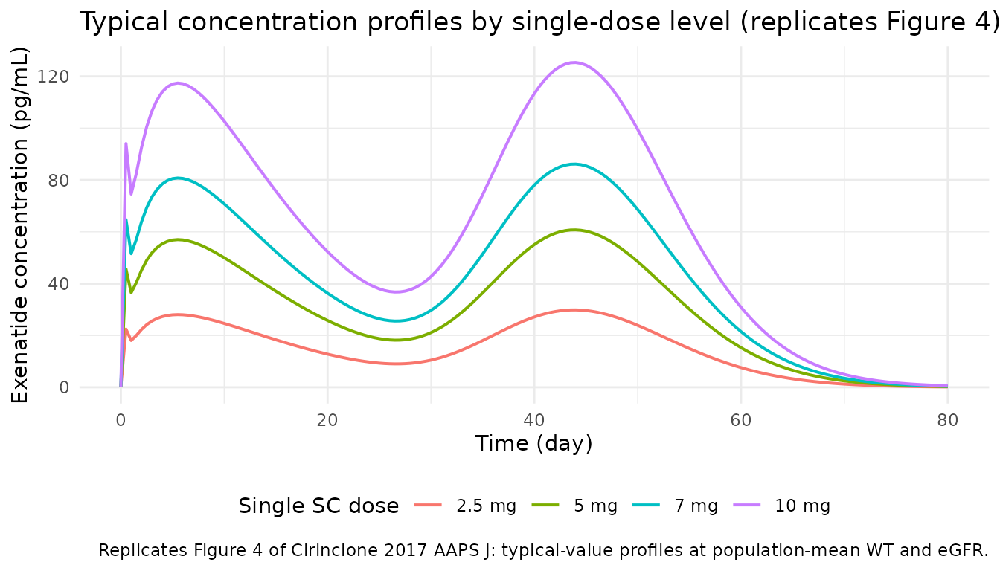
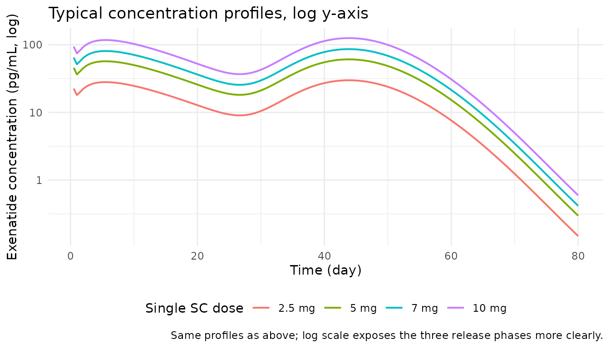
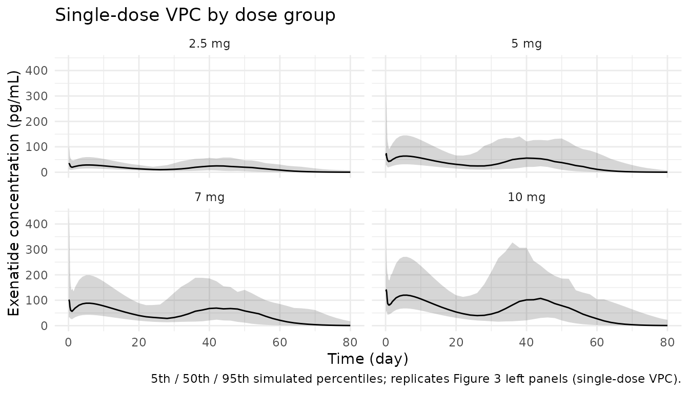

# Exenatide ER (Cirincione 2017 AAPS J)

## Model and source

- Citation: Cirincione B, Edwards J, Mager DE. Population
  Pharmacokinetics of an Extended-Release Formulation of Exenatide
  Following Single- and Multiple-Dose Administration. AAPS J.
  2017;19(2):487-496. <doi:10.1208/s12248-016-9975-1>. Disposition
  parameters (CL_int, Q, Vc_int, Vp, Vmax, Km) and the eGFR-on-CL and
  WT-on-Vc effects fixed from the IR companion model: Cirincione B,
  Mager DE. Population pharmacokinetics of exenatide. Br J Clin
  Pharmacol. 2017;83(3):517-526. <doi:10.1111/bcp.13135>; see
  modellib(‘Cirincione_2017_exenatide’).
- Description: Population PK model for extended-release (ER) microsphere
  SC exenatide in patients with type 2 diabetes (Cirincione 2017 AAPS
  J): two-compartment disposition with three parallel SC-absorption
  processes (initial first-order release plus two Savic 2007 analytical
  transit-compartment chains for the second- and third-phase microsphere
  release) and parallel linear plus saturable Michaelis-Menten
  elimination. Disposition parameters (CL, Q, Vc, Vp, Vmax, Km) and the
  eGFR-on-CL and WT-on-Vc covariate effects are fixed from the IR
  companion model (Cirincione 2017 BJCP).
- Article: [AAPS J.
  2017;19(2):487-496](https://doi.org/10.1208/s12248-016-9975-1)
- IR companion (disposition source): [Br J Clin Pharmacol.
  2017;83(3):517-526](https://doi.org/10.1111/bcp.13135), packaged as
  `modellib("Cirincione_2017_exenatide")`.

## Population

The combined population PK analysis pooled 64 patients with type 2
diabetes mellitus from two phase II clinical trials (Table I). The
single-dose study contributed 41 patients (one 2.5, 5, 7, or 10 mg SC
dose; 887 PK observations over ~12 weeks); the multi-dose study
contributed 23 patients (0.8 or 2 mg SC weekly for 15 weeks; 699 PK
observations over ~27 weeks including a 12-week washout). Pooled
baseline demographics: 42% female; 37.5% White, 37.5% Hispanic, 10.9%
Black, 7.8% Asian; mean age 53.5 years (SD 9.78; range 30-72); mean body
weight 95.7 kg (SD 21; range 59-155); mean eGFR 89.6 mL/min/1.73 m^2 (SD
23.2; range 56-169). Renal-function distribution: 23 normal (eGFR \>=
90), 38 mild impairment (60-89), 3 moderate (30-59). An additional 119
patients (408 observations) enrolled in a phase III study (2 mg ER SC
weekly for 24 weeks) were reserved for external validation.

The same information is available programmatically via
`readModelDb("Cirincione_2017_exenatide_er")$population`.

## Source trace

Per-parameter origin is recorded as an in-file comment next to each
`ini()` entry in
`inst/modeldb/specificDrugs/Cirincione_2017_exenatide_er.R`. The table
below collects them in one place for review.

| Equation / parameter | Value | Source location |
|----|----|----|
| `lka` (ka) | `log(3.85)` 1/day | Table II combined right (RSE 11.2%) |
| `lktr1` (ktr1) | `log(0.105)` 1/day | Table II combined right (RSE 9.50%) |
| `lntr1` (N1) | `log(0.570)` | Table II combined right (RSE 17.2%) |
| `lktr2` (ktr2) | `log(0.591)` 1/day | Table II combined right (RSE 17.9%) |
| `lntr2` (N2) | `log(26.1)` | Table II combined right (RSE 19.6%) |
| `lf1` (f1) | `log(0.0118)` (1.18%) | Table II combined right (RSE 8.56%) |
| `lf2` (f2) | `log(0.480)` (48.0%) | Table II combined right (RSE 8.77%) |
| `f3` (derived) | `1 - f1 - f2` | Methods page 488 (parameterisation: f3 = 1 - (f1 + f2)) |
| `lfrelSD` (f_rel SD) | `log(0.0886)` (8.86%) | Table II combined right (RSE 7.56%) |
| `lfrelMD` (f_rel MD) | `log(0.155)` (15.5%) | Table II combined right (RSE 5.93%) |
| `lcl` (CL_int) | `fixed(log(110))` L/day | Table II combined right (NE, fixed from IR Cirincione 2017 BJCP) |
| `lq` (CLd) | `fixed(log(89.3))` L/day | Table II combined right (NE, fixed from IR) |
| `lvc` (Vc_int) | `fixed(log(7.03))` L | Table II combined right (NE, fixed from IR) |
| `lvp` (Vp) | `fixed(log(7.04))` L | Table II combined right (NE, fixed from IR) |
| `lvmax` (Vmax) | `fixed(log(37.2))` ug/day | Table II combined right (0.0372 mg/day; NE, fixed from IR) |
| `lkm` (Km) | `fixed(log(0.567))` ng/mL | Table II combined right (567 pg/mL; NE, fixed from IR) |
| `e_crcl_cl` (CL_eGFR) | `fixed(0.838)` | Table II combined right (NE, fixed from IR) |
| `e_wt_vc` (Vc_wtkg) | `fixed(2.67)` | Table II combined right (NE, fixed from IR) |
| `etalka` IIV | `0.2551` (CV 53.9%) | Table II combined right; omega^2 = log(1 + 0.539^2) |
| `etalktr2` IIV | `0.0292` (CV 17.2%) | Table II combined right; omega^2 = log(1 + 0.172^2) |
| `etalf1` IIV | `0.3677` (CV 66.7%) | Table II combined right; omega^2 = log(1 + 0.667^2) |
| `etalfrelSD` IIV | `0.1755` (CV 43.8%) | Table II combined right; omega^2 = log(1 + 0.438^2) |
| `expSdSD` | `0.684` (log SD) | Table II combined right (RSE 4.58%) |
| `expSdMD` | `0.376` (log SD) | Table II combined right (RSE 4.57%) |
| Structure: 2-compartment | n/a | Methods page 488 / Fig. 1 / IR companion model |
| Structure: 3 parallel SC absorption | n/a | Methods page 488 / Fig. 1: first-order + 2 transit chains |
| Structure: linear + MM elim | n/a | Methods page 488 / IR companion model |
| Equation: Savic transit input rate | n/a | Methods page 488 (gamma-density input; refs 22, 23) |

## Virtual cohort

Original observed data are not publicly available. The cohort below
approximates the Table I demographics: body weight from a truncated
normal centred on 95.7 kg (SD 21), eGFR from a distribution matching the
reported renal-function bands. All four single-dose levels (2.5, 5, 7,
10 mg SC) are simulated with a 75-day observation window to capture all
three release phases. STUDY_MD = 0 selects the single-dose f_rel and
residual SD.

``` r

set.seed(20260603)
n_per_dose <- 80

renal_bands <- tibble::tibble(
  band       = c("normal", "mild", "moderate"),
  n_in_paper = c(23, 38, 3),
  egfr_min   = c(90, 60, 30),
  egfr_max   = c(150, 89, 59)
)
renal_bands$frac <- renal_bands$n_in_paper / sum(renal_bands$n_in_paper)

draw_egfr <- function(n) {
  bands <- sample(renal_bands$band, n, replace = TRUE, prob = renal_bands$frac)
  vapply(bands, function(b) {
    row <- renal_bands[renal_bands$band == b, ]
    runif(1, row$egfr_min, row$egfr_max)
  }, numeric(1))
}

make_cohort <- function(dose_mg, n, id_offset) {
  tibble::tibble(
    id       = id_offset + seq_len(n),
    dose_mg  = dose_mg,
    WT       = pmin(pmax(rnorm(n, mean = 95.7, sd = 21), 59), 155),
    CRCL     = draw_egfr(n),
    STUDY_MD = 0L
  )
}

doses <- c(2.5, 5, 7, 10)
cohorts <- lapply(seq_along(doses), function(i) {
  make_cohort(doses[i], n_per_dose, id_offset = (i - 1L) * n_per_dose)
})
cohort <- dplyr::bind_rows(cohorts)

# Time grid: rich early sampling (capture process 1), then weekly through ~80 days
obs_times <- c(seq(0, 2, by = 0.1), seq(3, 14, by = 1), seq(16, 80, by = 2))

events <- cohort |>
  dplyr::mutate(amt = dose_mg * 1000, cmt = "depot", evid = 1L, time = 0) |>
  dplyr::select(id, time, amt, cmt, evid, WT, CRCL, STUDY_MD, dose_mg) |>
  dplyr::bind_rows(
    cohort |>
      tidyr::crossing(time = obs_times) |>
      dplyr::mutate(amt = 0, cmt = NA_character_, evid = 0L) |>
      dplyr::select(id, time, amt, cmt, evid, WT, CRCL, STUDY_MD, dose_mg)
  ) |>
  dplyr::arrange(id, time, dplyr::desc(evid))
```

## Simulation

``` r

mod <- rxode2::rxode2(readModelDb("Cirincione_2017_exenatide_er"))
#> ℹ parameter labels from comments will be replaced by 'label()'
conc_unit <- mod$units[["concentration"]]
sim <- rxode2::rxSolve(mod, events = events, keep = c("WT", "CRCL", "STUDY_MD", "dose_mg"))
```

For deterministic replication (typical-value profiles without
between-subject variability, matching the paper’s Figure 4 individual
fits at population-mean covariates):

``` r

mod_typical <- mod |> rxode2::zeroRe()
#> Warning: No sigma parameters in the model

ev_typical <- do.call(rbind, lapply(doses, function(d) {
  ev_i <- rxode2::et(amt = d * 1000, cmt = "depot") |>
    rxode2::et(seq(0, 80, by = 0.5)) |>
    as.data.frame()
  ev_i$id <- match(d, doses)
  ev_i
}))

params_typical <- tibble::tibble(
  id       = seq_along(doses),
  dose_mg  = doses,
  WT       = 95.7,
  CRCL     = 89.6,
  STUDY_MD = 0L
)

sim_typical <- rxode2::rxSolve(
  mod_typical,
  events     = ev_typical,
  params     = params_typical[, c("id", "WT", "CRCL", "STUDY_MD")],
  returnType = "tibble"
) |>
  dplyr::left_join(params_typical[, c("id", "dose_mg")], by = "id")
#> ℹ omega/sigma items treated as zero: 'etalka', 'etalktr2', 'etalf1', 'etalfrelSD'
#> Warning: multi-subject simulation without without 'omega'
```

## Replicate published figures

### Figure 4 – typical concentration profiles by dose

Cirincione 2017 Figure 4 shows the population-mean predicted
concentration-time profile after a single SC dose of ER exenatide across
the four single-dose levels (2.5, 5, 7, 10 mg). Three distinct phases
are visible: an initial first-order release (process 1, peaking within
~1 day), a second peak at ~2-3 weeks (transit chain 1), and a third peak
at ~7 weeks (transit chain 2).

``` r

sim_typical |>
  dplyr::mutate(dose_label = factor(paste(dose_mg, "mg"),
    levels = paste(doses, "mg"))) |>
  ggplot(aes(time, Cc, colour = dose_label)) +
  geom_line(linewidth = 0.7) +
  labs(x = "Time (day)", y = paste0("Exenatide concentration (", conc_unit, ")"),
       colour = "Single SC dose",
       title = "Typical concentration profiles by single-dose level (replicates Figure 4)",
       caption = "Replicates Figure 4 of Cirincione 2017 AAPS J: typical-value profiles at population-mean WT and eGFR.") +
  theme_minimal() +
  theme(legend.position = "bottom")
```



The three release peaks are most clearly visible on a log scale:

``` r

sim_typical |>
  dplyr::filter(Cc > 0) |>
  dplyr::mutate(dose_label = factor(paste(dose_mg, "mg"),
    levels = paste(doses, "mg"))) |>
  ggplot(aes(time, Cc, colour = dose_label)) +
  geom_line(linewidth = 0.7) +
  scale_y_log10() +
  labs(x = "Time (day)", y = paste0("Exenatide concentration (", conc_unit, ", log)"),
       colour = "Single SC dose",
       title = "Typical concentration profiles, log y-axis",
       caption = "Same profiles as above; log scale exposes the three release phases more clearly.") +
  theme_minimal() +
  theme(legend.position = "bottom")
```



### Single-dose population VPC (replicates Figure 3 left panels)

``` r

sim |>
  dplyr::filter(!is.na(Cc), time > 0) |>
  dplyr::mutate(dose_label = factor(paste(dose_mg, "mg"),
    levels = paste(doses, "mg"))) |>
  dplyr::group_by(time, dose_label) |>
  dplyr::summarise(
    Q05 = quantile(Cc, 0.05),
    Q50 = quantile(Cc, 0.50),
    Q95 = quantile(Cc, 0.95),
    .groups = "drop"
  ) |>
  ggplot(aes(time, Q50)) +
  geom_ribbon(aes(ymin = Q05, ymax = Q95), alpha = 0.2) +
  geom_line() +
  facet_wrap(~dose_label) +
  labs(x = "Time (day)", y = paste0("Exenatide concentration (", conc_unit, ")"),
       title = "Single-dose VPC by dose group",
       caption = "5th / 50th / 95th simulated percentiles; replicates Figure 3 left panels (single-dose VPC).") +
  theme_minimal()
```



## PKNCA validation

PKNCA-based Cmax / Tmax / AUC0-last analysis of the simulated
single-dose cohort, grouped by dose level so the per-dose summary can be
compared against the paper.

``` r

sim_nca <- sim |>
  dplyr::filter(!is.na(Cc), time > 0, Cc > 0) |>
  dplyr::mutate(dose_label = paste(dose_mg, "mg")) |>
  dplyr::select(id, time, Cc, dose_label, dose_mg)

conc_obj <- PKNCA::PKNCAconc(sim_nca, Cc ~ time | dose_label + id)

dose_df <- events |>
  dplyr::filter(evid == 1) |>
  dplyr::mutate(dose_label = paste(dose_mg, "mg")) |>
  dplyr::select(id, time, amt, dose_label)

dose_obj <- PKNCA::PKNCAdose(dose_df, amt ~ time | dose_label + id)

intervals <- data.frame(
  start    = 0,
  end      = 80,
  cmax     = TRUE,
  tmax     = TRUE,
  auclast  = TRUE
)

nca_res <- PKNCA::pk.nca(PKNCA::PKNCAdata(conc_obj, dose_obj, intervals = intervals))
#> Warning: Requesting an AUC range starting (0) before the first measurement (0.1) is not allowed
#> Requesting an AUC range starting (0) before the first measurement (0.1) is not allowed
#> Requesting an AUC range starting (0) before the first measurement (0.1) is not allowed
#> Requesting an AUC range starting (0) before the first measurement (0.1) is not allowed
#> Requesting an AUC range starting (0) before the first measurement (0.1) is not allowed
#> Requesting an AUC range starting (0) before the first measurement (0.1) is not allowed
#> Requesting an AUC range starting (0) before the first measurement (0.1) is not allowed
#> Requesting an AUC range starting (0) before the first measurement (0.1) is not allowed
#> Requesting an AUC range starting (0) before the first measurement (0.1) is not allowed
#> Requesting an AUC range starting (0) before the first measurement (0.1) is not allowed
#> Requesting an AUC range starting (0) before the first measurement (0.1) is not allowed
#> Requesting an AUC range starting (0) before the first measurement (0.1) is not allowed
#> Requesting an AUC range starting (0) before the first measurement (0.1) is not allowed
#> Requesting an AUC range starting (0) before the first measurement (0.1) is not allowed
#> Requesting an AUC range starting (0) before the first measurement (0.1) is not allowed
#> Requesting an AUC range starting (0) before the first measurement (0.1) is not allowed
#> Requesting an AUC range starting (0) before the first measurement (0.1) is not allowed
#> Requesting an AUC range starting (0) before the first measurement (0.1) is not allowed
#> Requesting an AUC range starting (0) before the first measurement (0.1) is not allowed
#> Requesting an AUC range starting (0) before the first measurement (0.1) is not allowed
#> Requesting an AUC range starting (0) before the first measurement (0.1) is not allowed
#> Requesting an AUC range starting (0) before the first measurement (0.1) is not allowed
#> Requesting an AUC range starting (0) before the first measurement (0.1) is not allowed
#> Requesting an AUC range starting (0) before the first measurement (0.1) is not allowed
#> Requesting an AUC range starting (0) before the first measurement (0.1) is not allowed
#> Requesting an AUC range starting (0) before the first measurement (0.1) is not allowed
#> Requesting an AUC range starting (0) before the first measurement (0.1) is not allowed
#> Requesting an AUC range starting (0) before the first measurement (0.1) is not allowed
#> Requesting an AUC range starting (0) before the first measurement (0.1) is not allowed
#> Requesting an AUC range starting (0) before the first measurement (0.1) is not allowed
#> Requesting an AUC range starting (0) before the first measurement (0.1) is not allowed
#> Requesting an AUC range starting (0) before the first measurement (0.1) is not allowed
#> Requesting an AUC range starting (0) before the first measurement (0.1) is not allowed
#> Requesting an AUC range starting (0) before the first measurement (0.1) is not allowed
#> Requesting an AUC range starting (0) before the first measurement (0.1) is not allowed
#> Requesting an AUC range starting (0) before the first measurement (0.1) is not allowed
#> Requesting an AUC range starting (0) before the first measurement (0.1) is not allowed
#> Requesting an AUC range starting (0) before the first measurement (0.1) is not allowed
#> Requesting an AUC range starting (0) before the first measurement (0.1) is not allowed
#> Requesting an AUC range starting (0) before the first measurement (0.1) is not allowed
#> Requesting an AUC range starting (0) before the first measurement (0.1) is not allowed
#> Requesting an AUC range starting (0) before the first measurement (0.1) is not allowed
#> Requesting an AUC range starting (0) before the first measurement (0.1) is not allowed
#> Requesting an AUC range starting (0) before the first measurement (0.1) is not allowed
#> Requesting an AUC range starting (0) before the first measurement (0.1) is not allowed
#> Requesting an AUC range starting (0) before the first measurement (0.1) is not allowed
#> Requesting an AUC range starting (0) before the first measurement (0.1) is not allowed
#> Requesting an AUC range starting (0) before the first measurement (0.1) is not allowed
#> Requesting an AUC range starting (0) before the first measurement (0.1) is not allowed
#> Requesting an AUC range starting (0) before the first measurement (0.1) is not allowed
#> Requesting an AUC range starting (0) before the first measurement (0.1) is not allowed
#> Requesting an AUC range starting (0) before the first measurement (0.1) is not allowed
#> Requesting an AUC range starting (0) before the first measurement (0.1) is not allowed
#> Requesting an AUC range starting (0) before the first measurement (0.1) is not allowed
#> Requesting an AUC range starting (0) before the first measurement (0.1) is not allowed
#> Requesting an AUC range starting (0) before the first measurement (0.1) is not allowed
#> Requesting an AUC range starting (0) before the first measurement (0.1) is not allowed
#> Requesting an AUC range starting (0) before the first measurement (0.1) is not allowed
#> Requesting an AUC range starting (0) before the first measurement (0.1) is not allowed
#> Requesting an AUC range starting (0) before the first measurement (0.1) is not allowed
#> Requesting an AUC range starting (0) before the first measurement (0.1) is not allowed
#> Requesting an AUC range starting (0) before the first measurement (0.1) is not allowed
#> Requesting an AUC range starting (0) before the first measurement (0.1) is not allowed
#> Requesting an AUC range starting (0) before the first measurement (0.1) is not allowed
#> Requesting an AUC range starting (0) before the first measurement (0.1) is not allowed
#> Requesting an AUC range starting (0) before the first measurement (0.1) is not allowed
#> Requesting an AUC range starting (0) before the first measurement (0.1) is not allowed
#> Requesting an AUC range starting (0) before the first measurement (0.1) is not allowed
#> Requesting an AUC range starting (0) before the first measurement (0.1) is not allowed
#> Requesting an AUC range starting (0) before the first measurement (0.1) is not allowed
#> Requesting an AUC range starting (0) before the first measurement (0.1) is not allowed
#> Requesting an AUC range starting (0) before the first measurement (0.1) is not allowed
#> Requesting an AUC range starting (0) before the first measurement (0.1) is not allowed
#> Requesting an AUC range starting (0) before the first measurement (0.1) is not allowed
#> Requesting an AUC range starting (0) before the first measurement (0.1) is not allowed
#> Requesting an AUC range starting (0) before the first measurement (0.1) is not allowed
#> Requesting an AUC range starting (0) before the first measurement (0.1) is not allowed
#> Requesting an AUC range starting (0) before the first measurement (0.1) is not allowed
#> Requesting an AUC range starting (0) before the first measurement (0.1) is not allowed
#> Requesting an AUC range starting (0) before the first measurement (0.1) is not allowed
#> Requesting an AUC range starting (0) before the first measurement (0.1) is not allowed
#> Requesting an AUC range starting (0) before the first measurement (0.1) is not allowed
#> Requesting an AUC range starting (0) before the first measurement (0.1) is not allowed
#> Requesting an AUC range starting (0) before the first measurement (0.1) is not allowed
#> Requesting an AUC range starting (0) before the first measurement (0.1) is not allowed
#> Requesting an AUC range starting (0) before the first measurement (0.1) is not allowed
#> Requesting an AUC range starting (0) before the first measurement (0.1) is not allowed
#> Requesting an AUC range starting (0) before the first measurement (0.1) is not allowed
#> Requesting an AUC range starting (0) before the first measurement (0.1) is not allowed
#> Requesting an AUC range starting (0) before the first measurement (0.1) is not allowed
#> Requesting an AUC range starting (0) before the first measurement (0.1) is not allowed
#> Requesting an AUC range starting (0) before the first measurement (0.1) is not allowed
#> Requesting an AUC range starting (0) before the first measurement (0.1) is not allowed
#> Requesting an AUC range starting (0) before the first measurement (0.1) is not allowed
#> Requesting an AUC range starting (0) before the first measurement (0.1) is not allowed
#> Requesting an AUC range starting (0) before the first measurement (0.1) is not allowed
#> Requesting an AUC range starting (0) before the first measurement (0.1) is not allowed
#> Requesting an AUC range starting (0) before the first measurement (0.1) is not allowed
#> Requesting an AUC range starting (0) before the first measurement (0.1) is not allowed
#> Requesting an AUC range starting (0) before the first measurement (0.1) is not allowed
#> Requesting an AUC range starting (0) before the first measurement (0.1) is not allowed
#> Requesting an AUC range starting (0) before the first measurement (0.1) is not allowed
#> Requesting an AUC range starting (0) before the first measurement (0.1) is not allowed
#> Requesting an AUC range starting (0) before the first measurement (0.1) is not allowed
#> Requesting an AUC range starting (0) before the first measurement (0.1) is not allowed
#> Requesting an AUC range starting (0) before the first measurement (0.1) is not allowed
#> Requesting an AUC range starting (0) before the first measurement (0.1) is not allowed
#> Requesting an AUC range starting (0) before the first measurement (0.1) is not allowed
#> Requesting an AUC range starting (0) before the first measurement (0.1) is not allowed
#> Requesting an AUC range starting (0) before the first measurement (0.1) is not allowed
#> Requesting an AUC range starting (0) before the first measurement (0.1) is not allowed
#> Requesting an AUC range starting (0) before the first measurement (0.1) is not allowed
#> Requesting an AUC range starting (0) before the first measurement (0.1) is not allowed
#> Requesting an AUC range starting (0) before the first measurement (0.1) is not allowed
#> Requesting an AUC range starting (0) before the first measurement (0.1) is not allowed
#> Requesting an AUC range starting (0) before the first measurement (0.1) is not allowed
#> Requesting an AUC range starting (0) before the first measurement (0.1) is not allowed
#> Requesting an AUC range starting (0) before the first measurement (0.1) is not allowed
#> Requesting an AUC range starting (0) before the first measurement (0.1) is not allowed
#> Requesting an AUC range starting (0) before the first measurement (0.1) is not allowed
#> Requesting an AUC range starting (0) before the first measurement (0.1) is not allowed
#> Requesting an AUC range starting (0) before the first measurement (0.1) is not allowed
#> Requesting an AUC range starting (0) before the first measurement (0.1) is not allowed
#> Requesting an AUC range starting (0) before the first measurement (0.1) is not allowed
#> Requesting an AUC range starting (0) before the first measurement (0.1) is not allowed
#> Requesting an AUC range starting (0) before the first measurement (0.1) is not allowed
#> Requesting an AUC range starting (0) before the first measurement (0.1) is not allowed
#> Requesting an AUC range starting (0) before the first measurement (0.1) is not allowed
#> Requesting an AUC range starting (0) before the first measurement (0.1) is not allowed
#> Requesting an AUC range starting (0) before the first measurement (0.1) is not allowed
#> Requesting an AUC range starting (0) before the first measurement (0.1) is not allowed
#> Requesting an AUC range starting (0) before the first measurement (0.1) is not allowed
#> Requesting an AUC range starting (0) before the first measurement (0.1) is not allowed
#> Requesting an AUC range starting (0) before the first measurement (0.1) is not allowed
#> Requesting an AUC range starting (0) before the first measurement (0.1) is not allowed
#> Requesting an AUC range starting (0) before the first measurement (0.1) is not allowed
#> Requesting an AUC range starting (0) before the first measurement (0.1) is not allowed
#> Requesting an AUC range starting (0) before the first measurement (0.1) is not allowed
#> Requesting an AUC range starting (0) before the first measurement (0.1) is not allowed
#> Requesting an AUC range starting (0) before the first measurement (0.1) is not allowed
#> Requesting an AUC range starting (0) before the first measurement (0.1) is not allowed
#> Requesting an AUC range starting (0) before the first measurement (0.1) is not allowed
#> Requesting an AUC range starting (0) before the first measurement (0.1) is not allowed
#> Requesting an AUC range starting (0) before the first measurement (0.1) is not allowed
#> Requesting an AUC range starting (0) before the first measurement (0.1) is not allowed
#> Requesting an AUC range starting (0) before the first measurement (0.1) is not allowed
#> Requesting an AUC range starting (0) before the first measurement (0.1) is not allowed
#> Requesting an AUC range starting (0) before the first measurement (0.1) is not allowed
#> Requesting an AUC range starting (0) before the first measurement (0.1) is not allowed
#> Requesting an AUC range starting (0) before the first measurement (0.1) is not allowed
#> Requesting an AUC range starting (0) before the first measurement (0.1) is not allowed
#> Requesting an AUC range starting (0) before the first measurement (0.1) is not allowed
#> Requesting an AUC range starting (0) before the first measurement (0.1) is not allowed
#> Requesting an AUC range starting (0) before the first measurement (0.1) is not allowed
#> Requesting an AUC range starting (0) before the first measurement (0.1) is not allowed
#> Requesting an AUC range starting (0) before the first measurement (0.1) is not allowed
#> Requesting an AUC range starting (0) before the first measurement (0.1) is not allowed
#> Requesting an AUC range starting (0) before the first measurement (0.1) is not allowed
#> Requesting an AUC range starting (0) before the first measurement (0.1) is not allowed
#> Requesting an AUC range starting (0) before the first measurement (0.1) is not allowed
#> Requesting an AUC range starting (0) before the first measurement (0.1) is not allowed
#> Requesting an AUC range starting (0) before the first measurement (0.1) is not allowed
#> Requesting an AUC range starting (0) before the first measurement (0.1) is not allowed
#> Requesting an AUC range starting (0) before the first measurement (0.1) is not allowed
#> Requesting an AUC range starting (0) before the first measurement (0.1) is not allowed
#> Requesting an AUC range starting (0) before the first measurement (0.1) is not allowed
#> Requesting an AUC range starting (0) before the first measurement (0.1) is not allowed
#> Requesting an AUC range starting (0) before the first measurement (0.1) is not allowed
#> Requesting an AUC range starting (0) before the first measurement (0.1) is not allowed
#> Requesting an AUC range starting (0) before the first measurement (0.1) is not allowed
#> Requesting an AUC range starting (0) before the first measurement (0.1) is not allowed
#> Requesting an AUC range starting (0) before the first measurement (0.1) is not allowed
#> Requesting an AUC range starting (0) before the first measurement (0.1) is not allowed
#> Requesting an AUC range starting (0) before the first measurement (0.1) is not allowed
#> Requesting an AUC range starting (0) before the first measurement (0.1) is not allowed
#> Requesting an AUC range starting (0) before the first measurement (0.1) is not allowed
#> Requesting an AUC range starting (0) before the first measurement (0.1) is not allowed
#> Requesting an AUC range starting (0) before the first measurement (0.1) is not allowed
#> Requesting an AUC range starting (0) before the first measurement (0.1) is not allowed
#> Requesting an AUC range starting (0) before the first measurement (0.1) is not allowed
#> Requesting an AUC range starting (0) before the first measurement (0.1) is not allowed
#> Requesting an AUC range starting (0) before the first measurement (0.1) is not allowed
#> Requesting an AUC range starting (0) before the first measurement (0.1) is not allowed
#> Requesting an AUC range starting (0) before the first measurement (0.1) is not allowed
#> Requesting an AUC range starting (0) before the first measurement (0.1) is not allowed
#> Requesting an AUC range starting (0) before the first measurement (0.1) is not allowed
#> Requesting an AUC range starting (0) before the first measurement (0.1) is not allowed
#> Requesting an AUC range starting (0) before the first measurement (0.1) is not allowed
#> Requesting an AUC range starting (0) before the first measurement (0.1) is not allowed
#> Requesting an AUC range starting (0) before the first measurement (0.1) is not allowed
#> Requesting an AUC range starting (0) before the first measurement (0.1) is not allowed
#> Requesting an AUC range starting (0) before the first measurement (0.1) is not allowed
#> Requesting an AUC range starting (0) before the first measurement (0.1) is not allowed
#> Requesting an AUC range starting (0) before the first measurement (0.1) is not allowed
#> Requesting an AUC range starting (0) before the first measurement (0.1) is not allowed
#> Requesting an AUC range starting (0) before the first measurement (0.1) is not allowed
#> Requesting an AUC range starting (0) before the first measurement (0.1) is not allowed
#> Requesting an AUC range starting (0) before the first measurement (0.1) is not allowed
#> Requesting an AUC range starting (0) before the first measurement (0.1) is not allowed
#> Requesting an AUC range starting (0) before the first measurement (0.1) is not allowed
#> Requesting an AUC range starting (0) before the first measurement (0.1) is not allowed
#> Requesting an AUC range starting (0) before the first measurement (0.1) is not allowed
#> Requesting an AUC range starting (0) before the first measurement (0.1) is not allowed
#> Requesting an AUC range starting (0) before the first measurement (0.1) is not allowed
#> Requesting an AUC range starting (0) before the first measurement (0.1) is not allowed
#> Requesting an AUC range starting (0) before the first measurement (0.1) is not allowed
#> Requesting an AUC range starting (0) before the first measurement (0.1) is not allowed
#> Requesting an AUC range starting (0) before the first measurement (0.1) is not allowed
#> Requesting an AUC range starting (0) before the first measurement (0.1) is not allowed
#> Requesting an AUC range starting (0) before the first measurement (0.1) is not allowed
#> Requesting an AUC range starting (0) before the first measurement (0.1) is not allowed
#> Requesting an AUC range starting (0) before the first measurement (0.1) is not allowed
#> Requesting an AUC range starting (0) before the first measurement (0.1) is not allowed
#> Requesting an AUC range starting (0) before the first measurement (0.1) is not allowed
#> Requesting an AUC range starting (0) before the first measurement (0.1) is not allowed
#> Requesting an AUC range starting (0) before the first measurement (0.1) is not allowed
#> Requesting an AUC range starting (0) before the first measurement (0.1) is not allowed
#> Requesting an AUC range starting (0) before the first measurement (0.1) is not allowed
#> Requesting an AUC range starting (0) before the first measurement (0.1) is not allowed
#> Requesting an AUC range starting (0) before the first measurement (0.1) is not allowed
#> Requesting an AUC range starting (0) before the first measurement (0.1) is not allowed
#> Requesting an AUC range starting (0) before the first measurement (0.1) is not allowed
#> Requesting an AUC range starting (0) before the first measurement (0.1) is not allowed
#> Requesting an AUC range starting (0) before the first measurement (0.1) is not allowed
#> Requesting an AUC range starting (0) before the first measurement (0.1) is not allowed
#> Requesting an AUC range starting (0) before the first measurement (0.1) is not allowed
#> Requesting an AUC range starting (0) before the first measurement (0.1) is not allowed
#> Requesting an AUC range starting (0) before the first measurement (0.1) is not allowed
#> Requesting an AUC range starting (0) before the first measurement (0.1) is not allowed
#> Requesting an AUC range starting (0) before the first measurement (0.1) is not allowed
#> Requesting an AUC range starting (0) before the first measurement (0.1) is not allowed
#> Requesting an AUC range starting (0) before the first measurement (0.1) is not allowed
#> Requesting an AUC range starting (0) before the first measurement (0.1) is not allowed
#> Requesting an AUC range starting (0) before the first measurement (0.1) is not allowed
#> Requesting an AUC range starting (0) before the first measurement (0.1) is not allowed
#> Requesting an AUC range starting (0) before the first measurement (0.1) is not allowed
#> Requesting an AUC range starting (0) before the first measurement (0.1) is not allowed
#> Requesting an AUC range starting (0) before the first measurement (0.1) is not allowed
#> Requesting an AUC range starting (0) before the first measurement (0.1) is not allowed
#> Requesting an AUC range starting (0) before the first measurement (0.1) is not allowed
#> Requesting an AUC range starting (0) before the first measurement (0.1) is not allowed
#> Requesting an AUC range starting (0) before the first measurement (0.1) is not allowed
#> Requesting an AUC range starting (0) before the first measurement (0.1) is not allowed
#> Requesting an AUC range starting (0) before the first measurement (0.1) is not allowed
#> Requesting an AUC range starting (0) before the first measurement (0.1) is not allowed
#> Requesting an AUC range starting (0) before the first measurement (0.1) is not allowed
#> Requesting an AUC range starting (0) before the first measurement (0.1) is not allowed
#> Requesting an AUC range starting (0) before the first measurement (0.1) is not allowed
#> Requesting an AUC range starting (0) before the first measurement (0.1) is not allowed
#> Requesting an AUC range starting (0) before the first measurement (0.1) is not allowed
#> Requesting an AUC range starting (0) before the first measurement (0.1) is not allowed
#> Requesting an AUC range starting (0) before the first measurement (0.1) is not allowed
#> Requesting an AUC range starting (0) before the first measurement (0.1) is not allowed
#> Requesting an AUC range starting (0) before the first measurement (0.1) is not allowed
#> Requesting an AUC range starting (0) before the first measurement (0.1) is not allowed
#> Requesting an AUC range starting (0) before the first measurement (0.1) is not allowed
#> Requesting an AUC range starting (0) before the first measurement (0.1) is not allowed
#> Requesting an AUC range starting (0) before the first measurement (0.1) is not allowed
#> Requesting an AUC range starting (0) before the first measurement (0.1) is not allowed
#> Requesting an AUC range starting (0) before the first measurement (0.1) is not allowed
#> Requesting an AUC range starting (0) before the first measurement (0.1) is not allowed
#> Requesting an AUC range starting (0) before the first measurement (0.1) is not allowed
#> Requesting an AUC range starting (0) before the first measurement (0.1) is not allowed
#> Requesting an AUC range starting (0) before the first measurement (0.1) is not allowed
#> Requesting an AUC range starting (0) before the first measurement (0.1) is not allowed
#> Requesting an AUC range starting (0) before the first measurement (0.1) is not allowed
#> Requesting an AUC range starting (0) before the first measurement (0.1) is not allowed
#> Requesting an AUC range starting (0) before the first measurement (0.1) is not allowed
#> Requesting an AUC range starting (0) before the first measurement (0.1) is not allowed
#> Requesting an AUC range starting (0) before the first measurement (0.1) is not allowed
#> Requesting an AUC range starting (0) before the first measurement (0.1) is not allowed
#> Requesting an AUC range starting (0) before the first measurement (0.1) is not allowed
#> Requesting an AUC range starting (0) before the first measurement (0.1) is not allowed
#> Requesting an AUC range starting (0) before the first measurement (0.1) is not allowed
#> Requesting an AUC range starting (0) before the first measurement (0.1) is not allowed
#> Requesting an AUC range starting (0) before the first measurement (0.1) is not allowed
#> Requesting an AUC range starting (0) before the first measurement (0.1) is not allowed
#> Requesting an AUC range starting (0) before the first measurement (0.1) is not allowed
#> Requesting an AUC range starting (0) before the first measurement (0.1) is not allowed
#> Requesting an AUC range starting (0) before the first measurement (0.1) is not allowed
#> Requesting an AUC range starting (0) before the first measurement (0.1) is not allowed
#> Requesting an AUC range starting (0) before the first measurement (0.1) is not allowed
#> Requesting an AUC range starting (0) before the first measurement (0.1) is not allowed
#> Requesting an AUC range starting (0) before the first measurement (0.1) is not allowed
#> Requesting an AUC range starting (0) before the first measurement (0.1) is not allowed
#> Requesting an AUC range starting (0) before the first measurement (0.1) is not allowed
#> Requesting an AUC range starting (0) before the first measurement (0.1) is not allowed
#> Requesting an AUC range starting (0) before the first measurement (0.1) is not allowed
#> Requesting an AUC range starting (0) before the first measurement (0.1) is not allowed
#> Requesting an AUC range starting (0) before the first measurement (0.1) is not allowed
#> Requesting an AUC range starting (0) before the first measurement (0.1) is not allowed
#> Requesting an AUC range starting (0) before the first measurement (0.1) is not allowed
#> Requesting an AUC range starting (0) before the first measurement (0.1) is not allowed
#> Requesting an AUC range starting (0) before the first measurement (0.1) is not allowed
#> Requesting an AUC range starting (0) before the first measurement (0.1) is not allowed
#> Requesting an AUC range starting (0) before the first measurement (0.1) is not allowed
#> Requesting an AUC range starting (0) before the first measurement (0.1) is not allowed
#> Requesting an AUC range starting (0) before the first measurement (0.1) is not allowed
#> Requesting an AUC range starting (0) before the first measurement (0.1) is not allowed
#> Requesting an AUC range starting (0) before the first measurement (0.1) is not allowed
#> Requesting an AUC range starting (0) before the first measurement (0.1) is not allowed
#> Requesting an AUC range starting (0) before the first measurement (0.1) is not allowed
#> Requesting an AUC range starting (0) before the first measurement (0.1) is not allowed
#> Requesting an AUC range starting (0) before the first measurement (0.1) is not allowed
#> Requesting an AUC range starting (0) before the first measurement (0.1) is not allowed
#> Requesting an AUC range starting (0) before the first measurement (0.1) is not allowed
#> Requesting an AUC range starting (0) before the first measurement (0.1) is not allowed
#> Requesting an AUC range starting (0) before the first measurement (0.1) is not allowed
#> Requesting an AUC range starting (0) before the first measurement (0.1) is not allowed
#> Requesting an AUC range starting (0) before the first measurement (0.1) is not allowed
#> Requesting an AUC range starting (0) before the first measurement (0.1) is not allowed
#> Requesting an AUC range starting (0) before the first measurement (0.1) is not allowed
#> Requesting an AUC range starting (0) before the first measurement (0.1) is not allowed
#> Requesting an AUC range starting (0) before the first measurement (0.1) is not allowed
#> Requesting an AUC range starting (0) before the first measurement (0.1) is not allowed
#> Requesting an AUC range starting (0) before the first measurement (0.1) is not allowed
#> Requesting an AUC range starting (0) before the first measurement (0.1) is not allowed
#> Requesting an AUC range starting (0) before the first measurement (0.1) is not allowed
#> Requesting an AUC range starting (0) before the first measurement (0.1) is not allowed
#> Requesting an AUC range starting (0) before the first measurement (0.1) is not allowed
summary(nca_res)
#>  start end dose_label  N auclast        cmax                tmax
#>      0  80      10 mg 80      NC  180 [64.5] 0.300 [0.100, 46.0]
#>      0  80     2.5 mg 80      NC 42.5 [66.2] 0.350 [0.100, 46.0]
#>      0  80       5 mg 80      NC  105 [71.3]  3.15 [0.100, 46.0]
#>      0  80       7 mg 80      NC  136 [78.9] 0.200 [0.100, 46.0]
#> 
#> Caption: auclast, cmax: geometric mean and geometric coefficient of variation; tmax: median and range; N: number of subjects
```

### Comparison against the paper

Cirincione 2017 does not tabulate NCA-style Cmax / AUC for the
single-dose study (only concentration-time figures and BLQ-fraction
figures). For a qualitative check, the table below reports the simulated
typical-subject Cmax and the time at which the largest of the three
release peaks occurs for each single-dose level.

``` r

nca_typical <- PKNCA::pk.nca(PKNCA::PKNCAdata(
  PKNCA::PKNCAconc(
    sim_typical |>
      dplyr::filter(Cc > 0, time > 0) |>
      dplyr::mutate(dose_label = paste(dose_mg, "mg")) |>
      dplyr::select(id, time, Cc, dose_label),
    Cc ~ time | dose_label + id
  ),
  PKNCA::PKNCAdose(
    params_typical |>
      dplyr::mutate(time = 0, amt = dose_mg * 1000, dose_label = paste(dose_mg, "mg")) |>
      dplyr::select(id, time, amt, dose_label),
    amt ~ time | dose_label + id
  ),
  intervals = data.frame(start = 0, end = 80, cmax = TRUE, tmax = TRUE, auclast = TRUE)
))
#> Warning: Requesting an AUC range starting (0) before the first measurement (0.5) is not allowed
#> Requesting an AUC range starting (0) before the first measurement (0.5) is not allowed
#> Requesting an AUC range starting (0) before the first measurement (0.5) is not allowed
#> Requesting an AUC range starting (0) before the first measurement (0.5) is not allowed

nca_typical_tbl <- as.data.frame(nca_typical$result) |>
  dplyr::filter(PPTESTCD %in% c("cmax", "tmax", "auclast")) |>
  dplyr::select(dose_label, PPTESTCD, PPORRES) |>
  tidyr::pivot_wider(names_from = PPTESTCD, values_from = PPORRES)

knitr::kable(
  nca_typical_tbl,
  digits = 1,
  caption = "Typical-subject NCA from the packaged model. Cmax in pg/mL, Tmax in days, AUC0-80d in pg*day/mL. The dominant peak across all four single-dose levels occurs near day 44 (chain 2, ~7 weeks postinjection) -- matching the paper's narrative that the third-phase release dominates the late single-dose concentration profile."
)
```

| dose_label | auclast |  cmax | tmax |
|:-----------|--------:|------:|-----:|
| 10 mg      |      NA | 125.3 |   44 |
| 2.5 mg     |      NA |  29.9 |   44 |
| 5 mg       |      NA |  60.7 |   44 |
| 7 mg       |      NA |  86.1 |   44 |

Typical-subject NCA from the packaged model. Cmax in pg/mL, Tmax in
days, AUC0-80d in pg\*day/mL. The dominant peak across all four
single-dose levels occurs near day 44 (chain 2, ~7 weeks postinjection)
– matching the paper’s narrative that the third-phase release dominates
the late single-dose concentration profile. {.table}

The typical-subject Cmax scales linearly with dose (a property of the
linear absorption and linear-plus-saturable elimination model at the
modest concentrations encountered after single doses below 10 mg), and
the Tmax sits at the chain 2 peak (~7 weeks postinjection) consistent
with the paper’s narrative that the third-phase release dominates the
late single-dose concentration profile.

## Assumptions and deviations

- **Multi-dose limitation of the analytical transit chains.** The two
  Savic 2007 analytical transit-compartment input rates (`in_t1` and
  `in_t2` in the model) use the rxode2 `tad(depot)` and `podo(depot)`
  functions, which are scalars referencing the most recent dose. For
  multi-dose simulations, contributions to the current input rate from
  prior doses’ transit-chain residuals are not summed – only the
  most-recent dose’s transit-chain contribution is captured. The
  first-order absorption process (process 1, via the depot ODE) does
  superpose correctly across doses. Single-dose simulations are exact.
  For weekly multi-dose simulations (as in Figure 5 of the paper) the
  model will under-predict steady-state concentrations because chain 2’s
  mean transit time of ~46 days means earlier doses’ chain-2
  contributions are still active when the next weekly dose is
  administered. The paper handled this in NONMEM using the multiple-dose
  transit-compartment methodology of reference (23); the rxode2
  `transit()` macro family does not currently superpose analytical
  transit contributions across doses. Users running multi-dose
  simulations should be aware of this limitation; an alternative
  parameterisation that uses discrete ODE-based transit chains (rounding
  N1, N2 to integer compartment counts) would handle multi-dose
  superposition correctly but would slightly distort the absorption-rate
  time course (especially for chain 1 where N1 = 0.570 is well below an
  integer chain count).
- **Time-unit conversion to days.** Cirincione 2017 AAPS J Table II
  presents disposition parameters in day units (CL_int = 110 L/day, CLd
  = 89.3 L/day, Vmax = 0.0372 mg/day). The IR companion model packaged
  as `modellib("Cirincione_2017_exenatide")` uses hour units (CL_int =
  4.58 L/hr, CLd = 3.72 L/hr, Vmax = 1.55 ug/hr). The ER model uses day
  units consistent with the AAPS J paper; numerically CL_int = 4.58 L/hr
  \* 24 = 110 L/day (and likewise for CLd, Vmax). The volumes and
  dimensionless effects (Vc, Vp, Km, e_crcl_cl, e_wt_vc) are
  time-unit-invariant. The two models are internally consistent.
- **Units within the model.** Dose in micrograms (1 mg = 1000 ug; single
  doses are 2500 / 5000 / 7000 / 10000 ug; weekly doses are 800 / 2000
  ug); central compartment in ug; Vc in L; concentration `Cc` reported
  in pg/mL after multiplying `central/vc` (= ug/L = ng/mL) by 1000. Km
  is stored as 0.567 ng/mL so it is unit-consistent with `central / vc`,
  and the Michaelis-Menten elimination term is written
  `vmax / (km*vc + central)` so the (km\*vc) product has units of ug
  matching `central`.
- **Study indicator (STUDY_MD).** The covariate `STUDY_MD` is a binary
  indicator (1 = phase II multi-dose study with 0.8 or 2 mg weekly; 0 =
  phase II single-dose study) used to switch between the study-specific
  relative bioavailability (`frelMD` = 15.5% vs `frelSD` = 8.86%) and
  the study-specific log-scale residual SD (0.376 vs 0.684). For the
  phase III external-validation cohort (2 mg weekly for 24 weeks), use
  `STUDY_MD = 1` so the multi-dose values apply. STUDY_MD has no
  analogous column in the source dataset – it is derived per subject
  from the dose-record structure of the original analysis.
- **Disposition parameters fixed from the IR companion model.** All
  disposition parameters (CL_int, CLd, Vc_int, Vp, Vmax, Km) and the
  eGFR-on-CL and WT-on-Vc covariate effects are inherited verbatim from
  the IR Cirincione 2017 BJCP paper
  (`modellib("Cirincione_2017_exenatide")`), per the AAPS J paper
  Methods. They are wrapped in `fixed()` in `ini()` so a downstream user
  can see the provenance and so re-fitting would correctly hold them
  constant. The IIV terms on these parameters are not carried over to
  the ER model – the AAPS J paper does not report IIV on the
  fixed-from-IR parameters in the ER analysis, so only the ER-specific
  IIV (on ka, ktr2, f1, f_rel(SD)) is encoded.
- **Bioavailability fractions.** The paper parameterises three parallel
  absorption fractions with the constraint f3 = 1 - (f1 + f2) (Methods
  page 488) so that the total ER bioavailability across the three
  processes equals f_rel. The model file encodes f1 and f2 as estimated
  `ini()` parameters and derives f3 inside `model()`. The published
  point estimates (f1 = 1.18%, f2 = 48.0%, f3 = 50.8%) sum exactly to
  100%; with log-normal IIV on f1 (CV 66.7%), f3 remains positive for
  plausible eta draws because f2 is fixed and f1 stays small.
- **IIV distribution.** Log-normal IIV is used as the paper describes
  (“Interindividual variability (IIV) was estimated using a log-normal
  distribution model on two of the first-order rate constants (k_a and
  k_tr2) and the fraction of the bioavailable dose in the initial
  release (f_1)”; combined model adds IIV on f_rel). The reported CV%
  values are converted to the log-normal variance via omega^2 = log(1 +
  CV^2). No correlations between IIV terms were reported, so all etas
  are independent in the model.
- **Virtual cohort.** Original observed data are not publicly available.
  The cohort approximates Table I demographics: body weight from a
  truncated normal (mean 95.7, SD 21, clipped to the reported 59-155 kg
  range), eGFR sampled uniformly within each renal-function band using
  the per-band patient counts from the pooled cohort. Sex and race
  distributions are not used by the model and therefore are not
  reproduced.
- **No covariates on absorption parameters.** Methods page 489
  explicitly states “Given the small number of patients relative to the
  complexities of the model, the influence of patient covariates on the
  absorption parameters for the PK model was not assessed.” The model
  therefore carries WT and eGFR only as disposition-side covariates (on
  Vc and CL respectively), inherited from the IR companion. Absorption
  parameters (ka, ktr1, N1, ktr2, N2, f1, f2, f_rel) have no covariate
  effects.
