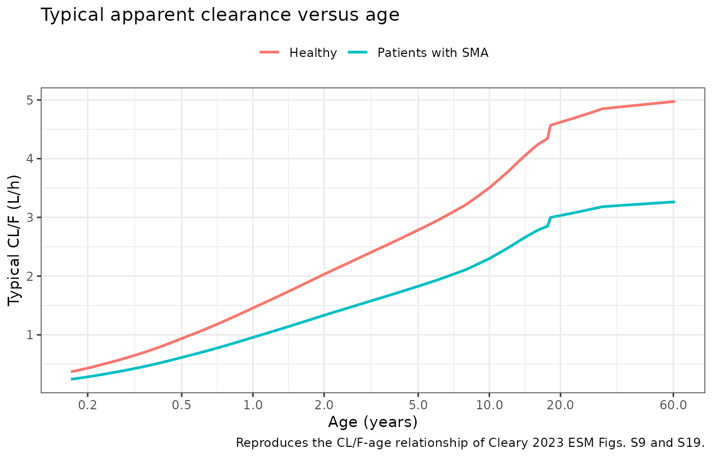
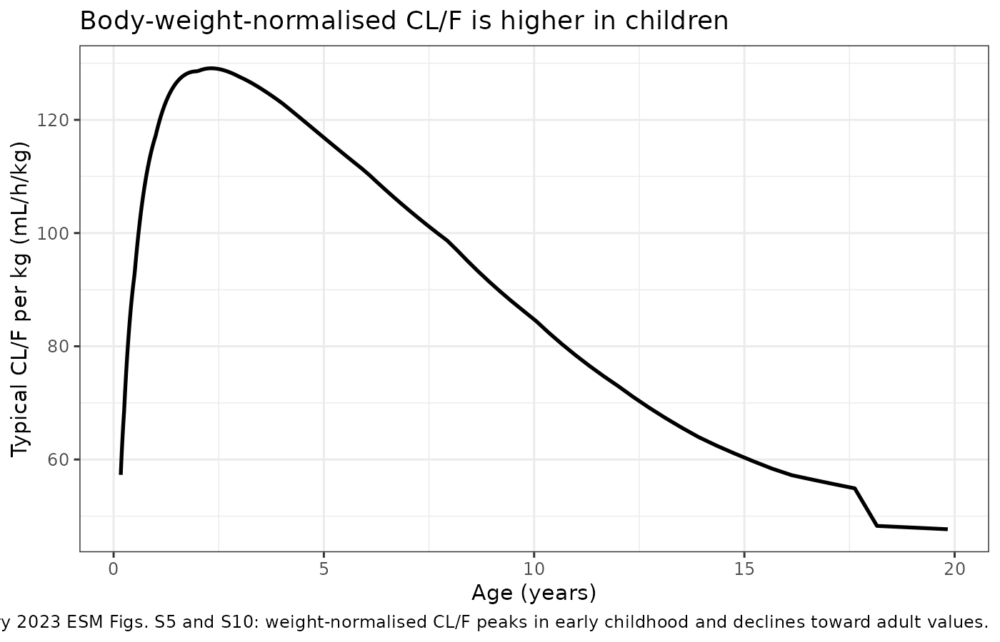
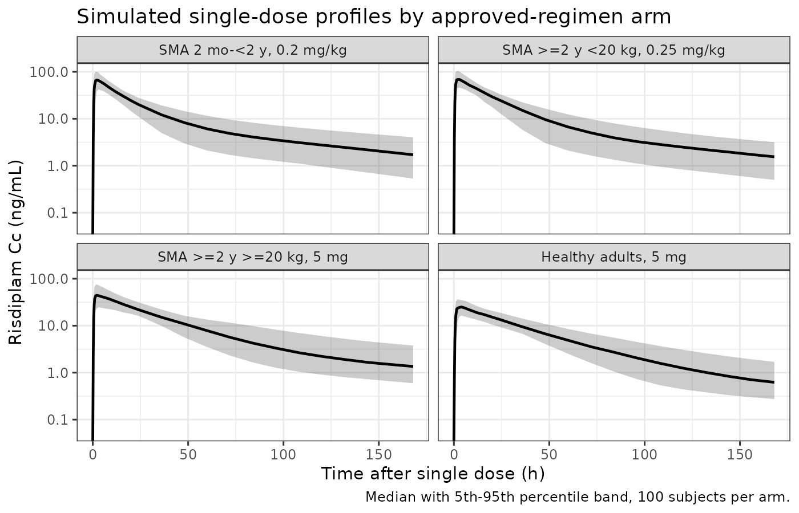
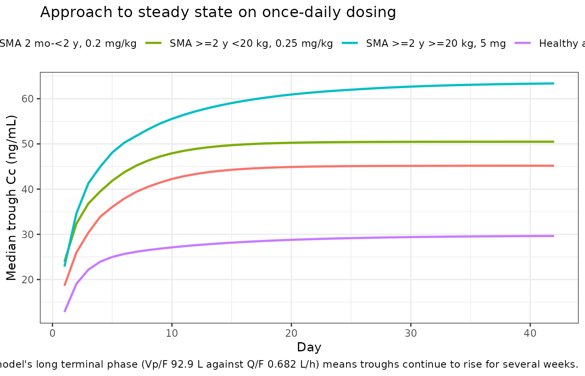
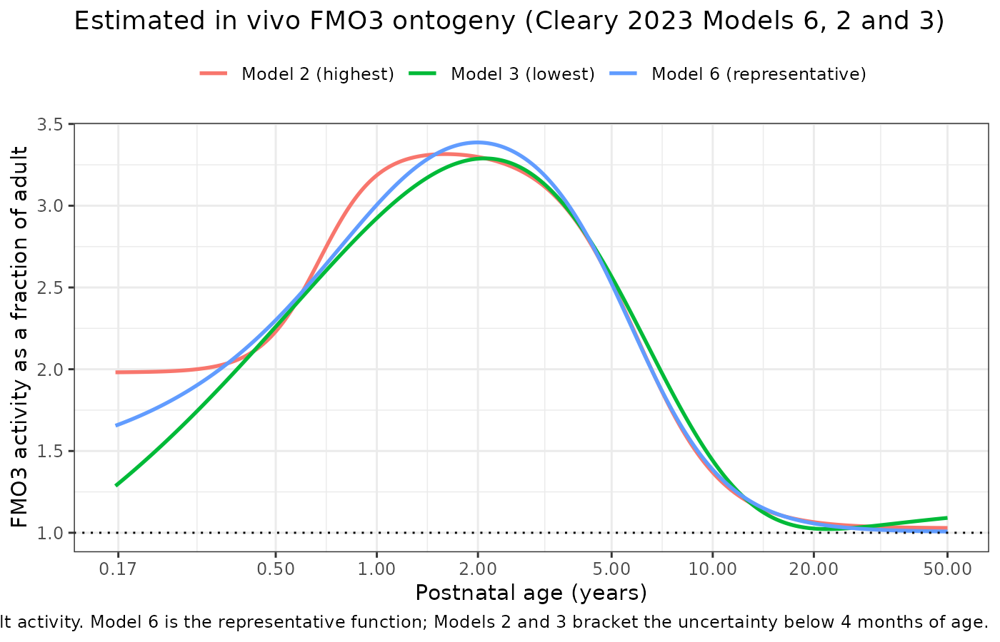

# Risdiplam (Cleary 2023)

## Model and source

- Citation: Cleary Y, Kletzl H, Grimsey P, Heinig K, Ogungbenro K,
  Silber Baumann HE, Frey N, Aarons L, Galetin A, Gertz M. Estimation of
  FMO3 ontogeny by mechanistic population pharmacokinetic modelling of
  risdiplam and its impact on drug-drug interactions in children. Clin
  Pharmacokinet. 2023;62(6):891-904. <doi:10.1007/s40262-023-01241-7>.
- Description: Population PK model for risdiplam (Evrysdi) in healthy
  adults and patients with spinal muscular atrophy aged 2 months to 61
  years (Cleary 2023 Clin Pharmacokinet Table 2, final PPK model). Three
  transit absorption compartments feed a linear two-compartment
  disposition model. Apparent clearance and intercompartmental clearance
  scale allometrically with time-varying body weight (estimated exponent
  0.276, reference 33 kg); apparent volumes use a separate estimated
  exponent (0.860). Sigmoidal maturation functions of time-varying
  postnatal age act on CL/F (Age50 0.877 y) and Vc/F (Age50 0.322 y),
  and healthy adults carry a higher CL/F than patients with SMA. The
  proportional residual error switches between venous and capillary
  blood samples.
- Article: <https://doi.org/10.1007/s40262-023-01241-7>
- Supplement (ESM 1, Tables S1-S4 and Equations S1-S13):
  <https://doi.org/10.1007/s40262-023-01241-7>

Cleary 2023 reports **two** final models. This vignette packages the
**final population PK (PPK) model of Table 2**, which is fully sourced
from the paper and its electronic supplementary material. The companion
**mechanistic PPK (Mech-PPK) model of Table 3** – the one carrying the
paper’s novel *in vivo* FMO3 ontogeny function – is not yet in
`nlmixr2lib`; see [Deferred companion
model](#deferred-companion-model-the-mech-ppk-fmo3-ontogeny) below for
why, and for a reproduction of the ontogeny function itself, which *is*
fully sourced.

## Population

The final PPK model was fitted to **10,205 risdiplam plasma
concentrations from 525 subjects aged 2 months to 61 years** pooled
across five clinical studies (NCT02633709, NCT03032172, NCT02908685,
NCT02913482, NCT03988907; Cleary 2023 ESM Table S1). Sixty-one subjects
were healthy adults and the remaining 464 were patients with spinal
muscular atrophy (SMA) types 1, 2 or 3.

Per ESM Table S2, the model-development subset comprised 130 subjects
(26 healthy adults, 104 patients with SMA; 2,492 observations; median
age 7.5 years, range 0.22-52.0; median weight 20.9 kg, range 5.0-95.3),
and the evaluation/validation subset a further 395 subjects (35 healthy
adults, 360 patients with SMA; 7,713 observations; median age 13.0
years, range 0.18-61.0; median weight 33.7 kg, range 4.1-109). The final
Table 2 estimates were obtained by fitting all 525 subjects together.
Sex was 278 male : 247 female (47% female). Race and ethnicity were not
reported. The median PK observation period in patients with SMA was 358
days; among the 382 paediatric patients it was 439 days and extended up
to 3 years.

Risdiplam was given as an oral solution once daily. Doses spanned
0.00106-18 mg across the programme; the approved regimens are 0.2 mg/kg
(2 months to \< 2 years), 0.25 mg/kg (\>= 2 years and \< 20 kg) and 5 mg
(\>= 2 years and \>= 20 kg). Estimation was FOCE-I in NONMEM 7.4 (OFV =
64499); every parameter had RSE \< 26% with bootstrap 95% CIs from 200
study-stratified replicates (87.5% converged), and eta-shrinkage was
5.43% (CL/F), 22.9% (ktr) and 10.1% (Vc/F).

The same information is available programmatically:

``` r

str(readModelDb("Cleary_2023_risdiplam")()$population)
#> List of 13
#>  $ species       : chr "human"
#>  $ n_subjects    : int 525
#>  $ n_observations: int 10205
#>  $ n_studies     : int 5
#>  $ age_range     : chr "2 months-61 years"
#>  $ age_median    : chr "7.5 years (model development set), 13.0 years (evaluation/validation set)"
#>  $ weight_range  : chr "4.1-109 kg"
#>  $ weight_median : chr "20.9 kg (model development set), 33.7 kg (evaluation/validation set); 33 kg allometric reference"
#>  $ sex_female_pct: num 47
#>  $ disease_state : chr "Spinal muscular atrophy types 1, 2 and 3 (n = 464) pooled with healthy adults (n = 61)"
#>  $ dose_range    : chr "0.00106-18 mg oral solution, single or once-daily. Approved regimens: 0.2 mg/kg (2 months to <2 years), 0.25 mg"| __truncated__
#>  $ regions       : chr "Multinational (NCT02633709, NCT03032172, NCT02908685, NCT02913482, NCT03988907)"
#>  $ notes         : chr "Pooled analysis of five clinical studies (Cleary 2023 ESM Table S1). Demographics from ESM Table S2: 130 subjec"| __truncated__
```

## Source trace

Every `ini()` entry in
`inst/modeldb/specificDrugs/Cleary_2023_risdiplam.R` carries an in-file
comment naming its origin. They are collected here for review.

| Equation / parameter | Value | Source location |
|----|----|----|
| `lcl` (CL/F) | 2.64 L/h | Table 2, Fixed effects (RSE 2.13%, CI 2.52-2.76) |
| `lktr` (ktr) | 5.18 1/h | Table 2, Fixed effects (RSE 2.74%, CI 4.84-5.52) |
| `lvc` (Vc/F) | 98.0 L | Table 2, Fixed effects (RSE 1.80%, CI 93.8-103) |
| `lq` (Q/F) | 0.682 L/h | Table 2, Fixed effects (RSE 10.5%, CI 0.589-1.50) |
| `lvp` (Vp/F) | 92.9 L | Table 2, Fixed effects (RSE 25.8%, CI 49.6-133) |
| `e_wt_cl_q` | 0.276 | Table 2, “Effect of WT on CL/F and Q/F” (RSE 11.8%) |
| `e_wt_vc_vp` | 0.860 | Table 2, “Effect of WT on Vc/F and Vp/F” (RSE 3.34%) |
| `age50_cl` | 0.877 y | Table 2, “Age50-CL/F” (RSE 17.1%) |
| `age50_vc` | 0.322 y | Table 2, “Age50-Vc/F” (RSE 21.1%) |
| `e_dis_healthy_cl` | 0.524 | Table 2, “Healthy subjects on CL/F” (RSE 13.1%); **functional form inferred** – see Assumptions |
| `etalcl` | 0.0678 (26.0% CV) | Table 2, Random effects |
| `etalktr` | 0.272 (52.2% CV) | Table 2, Random effects |
| `etalvc` | 0.0651 (25.5% CV) | Table 2, Random effects |
| `propSdVenous` | sqrt(0.0546) = 0.234 | Table 2, “sigma1 proportional-venous (CV) 0.0546 (23.4%)” |
| `propSdCapillary` | sqrt(0.117) = 0.342 | Table 2, “sigma2 proportional-capillary (CV) 0.117 (34.2%)” |
| Allometric form `[WT/33]^exp` | reference 33 kg | Table 2 footnote |
| Maturation form `Age/(Age + Age50)` | n/a | Table 2 footnote |
| Three transit compartments + 2-compartment disposition | n/a | Sect. 2.1; ESM Sect. 2 |
| Reported CV% equals sqrt(variance) | n/a | Table 2 (each parenthesised CV% reproduced below) |

The paper tabulates its random effects as variances with the
corresponding CV% in parentheses. Taking the square root reproduces
every printed CV% exactly, which confirms the tabulated numbers are
variances rather than SDs:

``` r

tibble::tibble(
  parameter = c("CL/F", "ktr", "Vc/F", "sigma1 venous", "sigma2 capillary"),
  tabulated = c(0.0678, 0.272, 0.0651, 0.0546, 0.117),
  printed_CV_pct = c(26.0, 52.2, 25.5, 23.4, 34.2)
) |>
  mutate(sqrt_pct = round(100 * sqrt(tabulated), 1)) |>
  dplyr::rename(
    "Parameter" = parameter,
    "Tabulated value" = tabulated,
    "Printed CV (%)" = printed_CV_pct,
    "100 x sqrt(value)" = sqrt_pct
  ) |>
  knitr::kable(caption = "Table 2 random effects are variances: sqrt() reproduces every printed CV%.")
```

| Parameter        | Tabulated value | Printed CV (%) | 100 x sqrt(value) |
|:-----------------|----------------:|---------------:|------------------:|
| CL/F             |          0.0678 |           26.0 |              26.0 |
| ktr              |          0.2720 |           52.2 |              52.2 |
| Vc/F             |          0.0651 |           25.5 |              25.5 |
| sigma1 venous    |          0.0546 |           23.4 |              23.4 |
| sigma2 capillary |          0.1170 |           34.2 |              34.2 |

Table 2 random effects are variances: sqrt() reproduces every printed
CV%. {.table}

``` r


# Strict gate: every printed CV% must be recovered to one decimal place.
stopifnot(
  isTRUE(all.equal(
    round(100 * sqrt(c(0.0678, 0.272, 0.0651, 0.0546, 0.117)), 1),
    c(26.0, 52.2, 25.5, 23.4, 34.2)
  ))
)
```

## Virtual cohort

Original observed data are not publicly available (Roche directs
qualified researchers to <https://vivli.org/>). The simulations below
use a virtual population whose age and weight distributions approximate
the published trial demographics of ESM Table S2, dosed according to the
approved label regimens.

Four arms are simulated, 100 subjects each (well within the 200-per-arm
cap): three SMA arms spanning the three approved weight/age-banded
regimens, and one healthy-adult arm at 5 mg to exercise the
`DIS_HEALTHY` covariate.

``` r

set.seed(20230506)

n_per_arm <- 100L

# Median weight-for-age, approximating WHO / CDC medians. Patients with SMA are
# lighter than healthy peers of the same age (see Assumptions), captured by
# `sma_factor`. ESM Table S2 reports median 20.9 kg at median age 7.5 y and
# median 33.7 kg at median age 13.0 y, which this curve reproduces closely.
wt_ref_age <- c(0.17, 0.25, 0.5, 1, 2, 3, 4, 6, 8, 10, 12, 14, 16, 18, 30, 61)
wt_ref_kg  <- c(5.0, 6.0, 7.8, 9.6, 12.2, 14.3, 16.3, 20.5, 25.3, 31.9,
                40.0, 49.0, 57.0, 62.0, 72.0, 75.0)

median_weight <- function(age) {
  stats::approx(wt_ref_age, wt_ref_kg, xout = age, rule = 2)$y
}

make_subjects <- function(n, age_min, age_max, healthy, sma_factor, id_offset) {
  age <- stats::runif(n, age_min, age_max)
  wt <- median_weight(age) * sma_factor *
    stats::rlnorm(n, meanlog = 0, sdlog = 0.15)
  # Clamp to the observed weight range of the analysis dataset (ESM Table S2).
  wt <- pmin(pmax(wt, 4.1), 109)
  tibble::tibble(
    id = id_offset + seq_len(n),
    AGE = age,
    WT = wt,
    DIS_HEALTHY = as.integer(healthy)
  )
}

# Arm 1: infants and toddlers 2 months to < 2 years -> 0.2 mg/kg
arm1 <- make_subjects(n_per_arm, 0.17, 2.0, FALSE, 0.90, 0L) |>
  mutate(arm = "SMA 2 mo-<2 y, 0.2 mg/kg")

# Arm 2: children >= 2 years weighing < 20 kg -> 0.25 mg/kg.
# Ages 2-5 y in SMA give weights below 20 kg; the cap enforces the label band.
arm2 <- make_subjects(n_per_arm, 2.0, 5.0, FALSE, 0.85, 100L) |>
  mutate(WT = pmin(WT, 19.5), arm = "SMA >=2 y <20 kg, 0.25 mg/kg")

# Arm 3: children / adolescents >= 2 years weighing >= 20 kg -> flat 5 mg
arm3 <- make_subjects(n_per_arm, 8.0, 18.0, FALSE, 0.85, 200L) |>
  mutate(WT = pmax(WT, 20.0), arm = "SMA >=2 y >=20 kg, 5 mg")

# Arm 4: healthy adults -> flat 5 mg (NCT03988907)
arm4 <- make_subjects(n_per_arm, 18.0, 45.0, TRUE, 1.00, 300L) |>
  mutate(arm = "Healthy adults, 5 mg")

subjects <- bind_rows(arm1, arm2, arm3, arm4) |>
  # Approved label dose rule (FDA EVRYSDI prescribing information, ref [21] of
  # the ESM), applied exactly as written.
  mutate(
    dose_mg = dplyr::case_when(
      AGE < 2 ~ 0.2 * WT,
      WT < 20 ~ 0.25 * WT,
      TRUE ~ 5
    ),
    arm = factor(arm, levels = c(
      "SMA 2 mo-<2 y, 0.2 mg/kg", "SMA >=2 y <20 kg, 0.25 mg/kg",
      "SMA >=2 y >=20 kg, 5 mg", "Healthy adults, 5 mg"
    ))
  )

subjects |>
  group_by(arm) |>
  summarise(
    n = dplyr::n(),
    `Age median (y)` = round(median(AGE), 2),
    `Weight median (kg)` = round(median(WT), 1),
    `Dose median (mg)` = round(median(dose_mg), 2),
    .groups = "drop"
  ) |>
  knitr::kable(caption = "Virtual cohort by arm.")
```

| arm | n | Age median (y) | Weight median (kg) | Dose median (mg) |
|:---|---:|---:|---:|---:|
| SMA 2 mo-\<2 y, 0.2 mg/kg | 100 | 0.99 | 9.0 | 1.81 |
| SMA \>=2 y \<20 kg, 0.25 mg/kg | 100 | 3.55 | 13.3 | 3.33 |
| SMA \>=2 y \>=20 kg, 5 mg | 100 | 12.65 | 35.9 | 5.00 |
| Healthy adults, 5 mg | 100 | 30.44 | 67.1 | 5.00 |

Virtual cohort by arm. {.table}

The pooled cohort median weight sits close to the 33 kg allometric
reference weight of Table 2, and the per-subset medians of ESM Table S2
are recovered:

``` r

c(
  pooled_median_wt = round(median(subjects$WT), 1),
  median_wt_at_age_7to8 = round(
    median(subjects$WT[subjects$AGE > 7 & subjects$AGE < 8.5]), 1
  )
)
#>      pooled_median_wt median_wt_at_age_7to8 
#>                  19.8                  22.7
```

## Simulation

Two event tables are built: a single dose (for `AUC0-inf`, `Cmax`,
`Tmax` and terminal half-life) and 42 days of once-daily dosing (for
steady-state exposure and accumulation). Dose records target the `depot`
compartment and observation records target the `central` ODE state, so
`Cc` is returned as a column at every observation without perturbing
compartment numbering.

``` r

# Sampling grid, single dose: dense early, sparse through the long terminal
# phase (the model's terminal half-life is ~6 days, see below).
grid_single <- c(
  0, 0.25, 0.5, 0.75, 1, 1.5, 2, 3, 4, 6, 8, 12, 16, 20, 24,
  seq(36, 168, by = 12), seq(192, 1008, by = 24)
)

# Steady-state grid: daily troughs plus a dense final dosing interval.
grid_multi <- c(
  seq(0, 41 * 24, by = 24),
  41 * 24 + c(0.25, 0.5, 1, 1.5, 2, 3, 4, 6, 8, 12, 16, 20, 24)
)

build_events <- function(subj, dose_times, obs_grid) {
  doses <- subj |>
    tidyr::crossing(time = dose_times) |>
    mutate(amt = dose_mg, evid = 1L, cmt = "depot", SAMPLE_CAPILLARY = 0L)
  obs <- subj |>
    tidyr::crossing(time = obs_grid) |>
    mutate(amt = NA_real_, evid = 0L, cmt = "central") |>
    # ~3% of records are capillary samples (Cleary 2023 Sect. 3.1), assigned to
    # the youngest arm where heel-/finger-prick sampling is used in practice.
    mutate(
      SAMPLE_CAPILLARY = as.integer(
        arm == "SMA 2 mo-<2 y, 0.2 mg/kg" & stats::runif(dplyr::n()) < 0.12
      )
    )
  bind_rows(doses, obs) |>
    arrange(id, time, dplyr::desc(evid)) |>
    select(id, time, amt, evid, cmt, AGE, WT, DIS_HEALTHY,
           SAMPLE_CAPILLARY, arm, dose_mg)
}

ev_single <- build_events(subjects, dose_times = 0, obs_grid = grid_single)
ev_multi <- build_events(subjects, dose_times = seq(0, 41 * 24, by = 24),
                         obs_grid = grid_multi)

# Disjoint-ID regression guard (see vignette-template Notes).
stopifnot(!anyDuplicated(unique(ev_single[, c("id", "time", "evid")])))
stopifnot(!anyDuplicated(unique(ev_multi[, c("id", "time", "evid")])))

round(100 * mean(ev_single$SAMPLE_CAPILLARY[ev_single$evid == 0]), 1)
#> [1] 3
```

``` r

mod <- readModelDb("Cleary_2023_risdiplam")

sim_single <- rxode2::rxSolve(
  mod, events = as.data.frame(ev_single),
  keep = c("arm", "WT", "AGE", "DIS_HEALTHY", "dose_mg")
) |>
  as.data.frame()

sim_multi <- rxode2::rxSolve(
  mod, events = as.data.frame(ev_multi),
  keep = c("arm", "WT", "AGE", "DIS_HEALTHY", "dose_mg")
) |>
  as.data.frame()

dplyr::glimpse(sim_single[1:3, ])
#> Rows: 3
#> Columns: 31
#> $ id               <int> 1, 1, 1
#> $ time             <dbl> 0.00, 0.25, 0.50
#> $ allo_cl_q        <dbl> 0.7122567, 0.7122567, 0.7122567
#> $ allo_vc_vp       <dbl> 0.3473954, 0.3473954, 0.3473954
#> $ maturation_cl    <dbl> 0.5323839, 0.5323839, 0.5323839
#> $ maturation_vc    <dbl> 0.7561474, 0.7561474, 0.7561474
#> $ healthy_cl       <dbl> 1, 1, 1
#> $ ktr              <dbl> 7.605589, 7.605589, 7.605589
#> $ cl               <dbl> 0.8730163, 0.8730163, 0.8730163
#> $ vc               <dbl> 46.08637, 46.08637, 46.08637
#> $ q                <dbl> 0.4857591, 0.4857591, 0.4857591
#> $ vp               <dbl> 32.27303, 32.27303, 32.27303
#> $ kel              <dbl> 0.01894305, 0.01894305, 0.01894305
#> $ k12              <dbl> 0.01054019, 0.01054019, 0.01054019
#> $ k21              <dbl> 0.01505155, 0.01505155, 0.01505155
#> $ Cc               <dbl> 0.000000, 5.247919, 21.967454
#> $ propSd           <dbl> 0.2336664, 0.2336664, 0.2336664
#> $ ipredSim         <dbl> 0.000000, 5.247919, 21.967454
#> $ sim              <dbl> 0.00000, 4.70137, 19.14148
#> $ depot            <dbl> 1.93027134, 0.28830492, 0.04306123
#> $ transit1         <dbl> 0.0000000, 0.5481822, 0.1637526
#> $ transit2         <dbl> 0.0000000, 0.5211560, 0.3113589
#> $ transit3         <dbl> 0.0000000, 0.3303082, 0.3946783
#> $ central          <dbl> 0.0000000, 0.2418575, 1.0124003
#> $ peripheral1      <dbl> 0.0000000000, 0.0001652613, 0.0017925829
#> $ SAMPLE_CAPILLARY <dbl> 0, 0, 0
#> $ AGE              <dbl> 0.9984701, 0.9984701, 0.9984701
#> $ WT               <dbl> 9.651357, 9.651357, 9.651357
#> $ DIS_HEALTHY      <dbl> 0, 0, 0
#> $ dose_mg          <dbl> 1.930271, 1.930271, 1.930271
#> $ arm              <fct> "SMA 2 mo-<2 y, 0.2 mg/kg", "SMA 2 mo-<2 y, 0.2 mg/kg…
```

`Cc` is the individual prediction (IPRED); the `sim` column additionally
carries the proportional residual error, whose magnitude switches per
record between the venous and capillary values. All NCA below uses `Cc`,
matching the paper’s model-derived exposure metrics.

### Structural check: the covariate model reproduces Table 2

`rxode2` returns the derived parameters as output columns, so the
encoded covariate model can be compared directly against the closed-form
expressions in the Table 2 footnote.

``` r

per_subject <- sim_single |>
  group_by(id, arm, WT, AGE, DIS_HEALTHY) |>
  summarise(cl = first(cl), vc = first(vc), q = first(q), vp = first(vp),
            .groups = "drop")

# Closed form, transcribed from the Table 2 footnote and the healthy-adult
# factor. exp(etalcl) etc. are absorbed by comparing ratios below.
analytic <- per_subject |>
  mutate(
    cl_typ = 2.64 * (WT / 33)^0.276 * (AGE / (AGE + 0.877)) *
      (1 + 0.524 * DIS_HEALTHY),
    vc_typ = 98.0 * (WT / 33)^0.860 * (AGE / (AGE + 0.322)),
    q_typ = 0.682 * (WT / 33)^0.276,
    vp_typ = 92.9 * (WT / 33)^0.860
  )

# Q/F and Vp/F carry no IIV, so they must match the closed form exactly.
stopifnot(
  isTRUE(all.equal(analytic$q, analytic$q_typ, tolerance = 1e-8)),
  isTRUE(all.equal(analytic$vp, analytic$vp_typ, tolerance = 1e-8))
)

# CL/F and Vc/F carry IIV; the ratio to the typical value must be exp(eta),
# whose geometric mean is ~1 and whose SD must match the Table 2 variances.
iiv_check <- analytic |>
  summarise(
    sd_log_cl = sd(log(cl / cl_typ)),
    sd_log_vc = sd(log(vc / vc_typ))
  )
tibble::tibble(
  parameter = c("CL/F", "Vc/F"),
  `Table 2 SD` = round(sqrt(c(0.0678, 0.0651)), 3),
  `Simulated SD` = round(c(iiv_check$sd_log_cl, iiv_check$sd_log_vc), 3)
) |>
  knitr::kable(caption = "Recovered IIV SDs vs Table 2 (400 subjects).")
```

| parameter | Table 2 SD | Simulated SD |
|:----------|-----------:|-------------:|
| CL/F      |      0.260 |        0.260 |
| Vc/F      |      0.255 |        0.254 |

Recovered IIV SDs vs Table 2 (400 subjects). {.table}

``` r


stopifnot(
  abs(iiv_check$sd_log_cl - sqrt(0.0678)) < 0.03,
  abs(iiv_check$sd_log_vc - sqrt(0.0651)) < 0.03
)
```

### The paper’s own maturation claim

ESM Sect. 5 states: *“The maturation function with Age50 of 0.877 years
old means that 70% of CL/F maturation would be achieved by the age of 2
years.”*

``` r

maturation_cl <- function(age) age / (age + 0.877)
pct_at_2y <- 100 * maturation_cl(2)
round(pct_at_2y, 1)
#> [1] 69.5

# Strict gate on the paper's stated 70%.
stopifnot(round(pct_at_2y) == 70)
```

## Replicate published figures

The paper’s Figures 2a and 2c are prediction-corrected VPCs of the fit
to the observed data, which are not publicly available, so they cannot
be reproduced here. Figures 2b and 2d compare PBPK-predicted AUC against
post-hoc AUC and belong to the deferred Mech-PPK/PBPK workstream. What
*is* reproducible from this model is the age dependence of the typical
apparent parameters (ESM Figs. S9, S10 and S19) and, separately, the
estimated FMO3 ontogeny of Figure 3.

### Typical CL/F and body-weight-normalised CL/F versus age (ESM Figs. S9, S10)

``` r

age_grid <- tibble::tibble(AGE = exp(seq(log(0.17), log(61), length.out = 200))) |>
  mutate(
    WT = median_weight(AGE) * dplyr::if_else(AGE < 18, 0.85, 1.00),
    cl_sma = 2.64 * (WT / 33)^0.276 * (AGE / (AGE + 0.877)),
    cl_healthy = cl_sma * (1 + 0.524),
    vc_sma = 98.0 * (WT / 33)^0.860 * (AGE / (AGE + 0.322))
  )

age_grid |>
  select(AGE, `Patients with SMA` = cl_sma, `Healthy` = cl_healthy) |>
  tidyr::pivot_longer(-AGE, names_to = "cohort", values_to = "cl") |>
  ggplot(aes(AGE, cl, colour = cohort)) +
  geom_line(linewidth = 0.9) +
  scale_x_log10(breaks = c(0.2, 0.5, 1, 2, 5, 10, 20, 60)) +
  labs(
    x = "Age (years)", y = "Typical CL/F (L/h)", colour = NULL,
    title = "Typical apparent clearance versus age",
    caption = "Reproduces the CL/F-age relationship of Cleary 2023 ESM Figs. S9 and S19."
  ) +
  theme_bw() +
  theme(legend.position = "top")
```



``` r

age_grid |>
  filter(AGE <= 20) |>
  ggplot(aes(AGE, 1000 * cl_sma / WT)) +
  geom_line(linewidth = 0.9) +
  labs(
    x = "Age (years)", y = "Typical CL/F per kg (mL/h/kg)",
    title = "Body-weight-normalised CL/F is higher in children",
    caption = paste(
      "Reproduces the qualitative finding of Cleary 2023 ESM Figs. S5 and S10:",
      "weight-normalised CL/F peaks in early childhood and declines toward",
      "adult values."
    )
  ) +
  theme_bw()
```



The peak in weight-normalised CL/F is the observation that motivated the
whole paper – it is what the authors read as higher hepatic metabolic
activity per gram of liver in children, and hence as evidence that FMO3
activity exceeds adult levels in early childhood:

``` r

peak <- age_grid |>
  filter(AGE <= 20) |>
  mutate(cl_per_kg = cl_sma / WT) |>
  slice_max(cl_per_kg, n = 1)
c(peak_age_y = round(peak$AGE, 2),
  peak_cl_per_kg_mL_h_kg = round(1000 * peak$cl_per_kg, 1),
  adult_cl_per_kg_mL_h_kg = round(
    1000 * with(age_grid[which.min(abs(age_grid$AGE - 40)), ], cl_sma / WT), 1
  ))
#>              peak_age_y  peak_cl_per_kg_mL_h_kg adult_cl_per_kg_mL_h_kg 
#>                    2.29                  129.10                   44.10

# The weight-normalised curve must peak in childhood, not in adulthood.
stopifnot(peak$AGE > 1, peak$AGE < 12)
```

### Concentration-time profiles

``` r

sim_single |>
  filter(time <= 168) |>
  group_by(arm, time) |>
  summarise(
    Q05 = quantile(Cc, 0.05), Q50 = median(Cc), Q95 = quantile(Cc, 0.95),
    .groups = "drop"
  ) |>
  ggplot(aes(time, Q50)) +
  geom_ribbon(aes(ymin = Q05, ymax = Q95), alpha = 0.25) +
  geom_line(linewidth = 0.8) +
  facet_wrap(~arm) +
  scale_y_log10() +
  labs(
    x = "Time after single dose (h)", y = "Risdiplam Cc (ng/mL)",
    title = "Simulated single-dose profiles by approved-regimen arm",
    caption = "Median with 5th-95th percentile band, 100 subjects per arm."
  ) +
  theme_bw()
#> Warning in scale_y_log10(): log-10 transformation introduced infinite values.
#> log-10 transformation introduced infinite values.
#> log-10 transformation introduced infinite values.
#> log-10 transformation introduced infinite values.
```



``` r

sim_multi |>
  filter(time %% 24 == 0, time > 0) |>
  group_by(arm, day = time / 24) |>
  summarise(Q50 = median(Cc), .groups = "drop") |>
  ggplot(aes(day, Q50, colour = arm)) +
  geom_line(linewidth = 0.9) +
  labs(
    x = "Day", y = "Median trough Cc (ng/mL)", colour = NULL,
    title = "Approach to steady state on once-daily dosing",
    caption = paste(
      "The model's long terminal phase (Vp/F 92.9 L against Q/F 0.682 L/h)",
      "means troughs continue to rise for several weeks."
    )
  ) +
  theme_bw() +
  theme(legend.position = "top")
```



## PKNCA validation

### Single dose

``` r

sim_nca <- sim_single |>
  dplyr::filter(!is.na(Cc)) |>
  dplyr::select(id, time, Cc, arm)

# Guarantee a time = 0 record per subject (extravascular: pre-dose Cc = 0).
sim_nca <- dplyr::bind_rows(
  sim_nca,
  sim_nca |> dplyr::distinct(id, arm) |> dplyr::mutate(time = 0, Cc = 0)
) |>
  dplyr::distinct(id, arm, time, .keep_all = TRUE) |>
  dplyr::arrange(id, arm, time)

conc_obj <- PKNCA::PKNCAconc(
  sim_nca, Cc ~ time | arm + id,
  concu = "ng/mL", timeu = "h"
)

dose_df <- ev_single |>
  dplyr::filter(evid == 1) |>
  dplyr::select(id, time, amt, arm)

dose_obj <- PKNCA::PKNCAdose(dose_df, amt ~ time | arm + id, doseu = "mg")

intervals_single <- data.frame(
  start = 0, end = Inf,
  cmax = TRUE, tmax = TRUE, aucinf.obs = TRUE, auclast = TRUE,
  half.life = TRUE, lambda.z = TRUE
)

nca_single <- PKNCA::pk.nca(
  PKNCA::PKNCAdata(conc_obj, dose_obj, intervals = intervals_single)
)

nca_tbl <- as.data.frame(nca_single$result) |>
  dplyr::filter(PPTESTCD %in% c("cmax", "tmax", "aucinf.obs", "half.life"))

nca_tbl |>
  group_by(arm, PPTESTCD) |>
  summarise(median = median(PPORRES), .groups = "drop") |>
  tidyr::pivot_wider(names_from = PPTESTCD, values_from = median) |>
  mutate(across(where(is.numeric), ~ signif(.x, 3))) |>
  dplyr::rename(
    "Arm" = arm,
    "AUC0-inf (ng*h/mL)" = aucinf.obs,
    "Cmax (ng/mL)" = cmax,
    "t-half (h)" = half.life,
    "Tmax (h)" = tmax
  ) |>
  knitr::kable(caption = "Median single-dose NCA by arm (PKNCA, IPRED scale).")
```

| Arm | AUC0-inf (ng\*h/mL) | Cmax (ng/mL) | t-half (h) | Tmax (h) |
|:---|---:|---:|---:|---:|
| SMA 2 mo-\<2 y, 0.2 mg/kg | 1890 | 69.6 | 72.1 | 2 |
| SMA \>=2 y \<20 kg, 0.25 mg/kg | 2060 | 70.4 | 79.4 | 2 |
| SMA \>=2 y \>=20 kg, 5 mg | 1940 | 44.8 | 133.0 | 2 |
| Healthy adults, 5 mg | 1090 | 25.4 | 175.0 | 2 |

Median single-dose NCA by arm (PKNCA, IPRED scale). {.table}

#### Mass-balance gate: `Dose / AUC0-inf` must equal the model’s CL/F

For a linear model with complete absorption, `AUC0-inf = Dose / (CL/F)`
exactly. Recovering each subject’s model CL/F from its NCA AUC therefore
validates the model encoding *and* the NCA harness at once. This is the
strictest check available, because the paper publishes no NCA table of
its own.

``` r

clf_check <- nca_tbl |>
  dplyr::filter(PPTESTCD == "aucinf.obs") |>
  dplyr::select(id, arm, aucinf = PPORRES) |>
  dplyr::left_join(
    per_subject |> dplyr::select(id, cl_model = cl),
    by = "id"
  ) |>
  dplyr::left_join(
    subjects |> dplyr::select(id, dose_mg),
    by = "id"
  ) |>
  # AUC is in ng*h/mL = ug*h/L; dose in mg. CL/F (L/h) = dose_mg / AUC_mg.h.L
  dplyr::mutate(
    cl_nca = dose_mg / (aucinf / 1000),
    pct_err = 100 * (cl_nca / cl_model - 1)
  )

clf_check |>
  group_by(arm) |>
  summarise(
    `Median CL/F from NCA (L/h)` = signif(median(cl_nca), 3),
    `Median model CL/F (L/h)` = signif(median(cl_model), 3),
    `Max abs error (%)` = signif(max(abs(pct_err)), 2),
    .groups = "drop"
  ) |>
  dplyr::rename("Arm" = arm) |>
  knitr::kable(caption = "Dose/AUC0-inf recovers the model's individual CL/F.")
```

| Arm | Median CL/F from NCA (L/h) | Median model CL/F (L/h) | Max abs error (%) |
|:---|---:|---:|---:|
| SMA 2 mo-\<2 y, 0.2 mg/kg | 0.982 | 0.984 | 0.36 |
| SMA \>=2 y \<20 kg, 0.25 mg/kg | 1.590 | 1.600 | 0.28 |
| SMA \>=2 y \>=20 kg, 5 mg | 2.580 | 2.580 | 0.17 |
| Healthy adults, 5 mg | 4.590 | 4.590 | 0.10 |

Dose/AUC0-inf recovers the model’s individual CL/F. {.table}

``` r


# Strict gate: every subject's NCA-derived CL/F within 2% of the model value.
stopifnot(max(abs(clf_check$pct_err)) < 2)
```

#### The healthy-adult clearance factor

The encoded `DIS_HEALTHY` effect must produce exactly the 1.524-fold
CL/F contrast, and hence a 1/1.524 = 0.656-fold AUC contrast, at matched
weight and age.

``` r

matched <- tibble::tibble(AGE = 30, WT = 70, DIS_HEALTHY = c(0L, 1L)) |>
  mutate(cl = 2.64 * (WT / 33)^0.276 * (AGE / (AGE + 0.877)) *
           (1 + 0.524 * DIS_HEALTHY))

ratio <- matched$cl[2] / matched$cl[1]
c(cl_sma_L_h = round(matched$cl[1], 3),
  cl_healthy_L_h = round(matched$cl[2], 3),
  ratio = round(ratio, 4))
#>     cl_sma_L_h cl_healthy_L_h          ratio 
#>          3.157          4.811          1.524

stopifnot(isTRUE(all.equal(ratio, 1.524, tolerance = 1e-9)))
```

For context, the typical adult values this implies (3.0 L/h for SMA, 4.6
L/h for healthy at 70 kg) bracket the post-hoc geometric means the paper
reports in ESM Sect. 3.1 for the *initial* model (3.52 L/h adult SMA,
5.60 L/h healthy adults), which is the evidence base for the encoding
choice discussed under Assumptions.

### Dose linearity

The model is linear in dose, so exposure must scale exactly with dose at
fixed covariates. Comparing two flat-5-mg-equivalent arms is not a clean
test (they differ in weight and age), so this gate uses one subject
simulated at two doses.

``` r

lin_subj <- tibble::tibble(
  id = c(1L, 2L), AGE = 30, WT = 70, DIS_HEALTHY = 0L,
  dose_mg = c(5, 20), arm = "linearity"
)
ev_lin <- build_events(lin_subj, dose_times = 0, obs_grid = grid_single)
# omega = NA zeroes the random effects for this solve only; rxode2::zeroRe()
# would mutate `mod`, which later chunks still use. The ODE tolerances are
# tightened well below the rxode2 defaults (atol 1e-8 / rtol 1e-6) because the
# exactness of this identity is limited by integration error, not by the model:
# at default tolerances the recovered ratio is 4.0000012 (2.9e-7 relative),
# which is solver noise rather than a structural nonlinearity.
sim_lin <- rxode2::rxSolve(
  mod, events = as.data.frame(ev_lin), omega = NA,
  atol = 1e-12, rtol = 1e-10, keep = c("dose_mg")
) |>
  as.data.frame()
#> Warning: multi-subject simulation without without 'omega'

auc_ratio <- sim_lin |>
  group_by(id, dose_mg) |>
  summarise(
    auc = sum(diff(time) * (head(Cc, -1) + tail(Cc, -1)) / 2),
    .groups = "drop"
  )
ratio_obs <- auc_ratio$auc[2] / auc_ratio$auc[1]
c(dose_ratio = 4, auc_ratio = signif(ratio_obs, 12),
  relative_error = signif(abs(ratio_obs / 4 - 1), 3))
#>     dose_ratio      auc_ratio relative_error 
#>        4.0e+00        4.0e+00        4.7e-11

stopifnot(abs(ratio_obs / 4 - 1) < 1e-8)
```

### Steady state

``` r

tau <- 24
start_ss <- 41 * tau

# This interval starts at `start_ss`, not at 0, so the anchoring record PKNCA
# needs is the one at exactly time == start_ss (the day-42 pre-dose trough),
# which `grid_multi` places there by construction. Asserted rather than
# assumed, since a missing interval-start record is the usual cause of the
# "AUC range starting before the first measurement" warning.
sim_ss <- sim_multi |>
  dplyr::filter(!is.na(Cc), time >= start_ss) |>
  dplyr::select(id, time, Cc, arm)

stopifnot(
  dplyr::n_distinct(sim_ss$id[sim_ss$time == start_ss]) ==
    dplyr::n_distinct(subjects$id)
)

conc_ss <- PKNCA::PKNCAconc(sim_ss, Cc ~ time | arm + id,
                            concu = "ng/mL", timeu = "h")
dose_ss <- PKNCA::PKNCAdose(
  ev_multi |> dplyr::filter(evid == 1, time == start_ss) |>
    dplyr::select(id, time, amt, arm),
  amt ~ time | arm + id, doseu = "mg"
)

intervals_ss <- data.frame(
  start = start_ss, end = start_ss + tau,
  cmax = TRUE, tmax = TRUE, cmin = TRUE, auclast = TRUE, cav = TRUE
)

nca_ss <- PKNCA::pk.nca(
  PKNCA::PKNCAdata(conc_ss, dose_ss, intervals = intervals_ss)
)

as.data.frame(nca_ss$result) |>
  dplyr::filter(PPTESTCD %in% c("cmax", "cmin", "auclast", "cav")) |>
  group_by(arm, PPTESTCD) |>
  summarise(median = median(PPORRES), .groups = "drop") |>
  tidyr::pivot_wider(names_from = PPTESTCD, values_from = median) |>
  mutate(across(where(is.numeric), ~ signif(.x, 3))) |>
  dplyr::rename(
    "Arm" = arm,
    "AUC0-tau (ng*h/mL)" = auclast,
    "Cavg (ng/mL)" = cav,
    "Cmax,ss (ng/mL)" = cmax,
    "Cmin,ss (ng/mL)" = cmin
  ) |>
  knitr::kable(caption = "Median day-42 steady-state NCA by arm (PKNCA, IPRED scale).")
```

| Arm | AUC0-tau (ng\*h/mL) | Cavg (ng/mL) | Cmax,ss (ng/mL) | Cmin,ss (ng/mL) |
|:---|---:|---:|---:|---:|
| SMA 2 mo-\<2 y, 0.2 mg/kg | 1760 | 73.4 | 116 | 45.2 |
| SMA \>=2 y \<20 kg, 0.25 mg/kg | 1910 | 79.8 | 122 | 50.5 |
| SMA \>=2 y \>=20 kg, 5 mg | 2000 | 83.4 | 108 | 63.3 |
| Healthy adults, 5 mg | 981 | 40.9 | 54 | 29.6 |

Median day-42 steady-state NCA by arm (PKNCA, IPRED scale). {.table}

### Comparison against published NCA

**Cleary 2023 publishes no numeric NCA table.** Its exposure comparisons
(Figs. 2b and 2d, ESM Figs. S12, S14 and S20) are plotted as geometric
means with prediction intervals by age band and are not tabulated, and
they are predictions of the PBPK/Mech-PPK workstream rather than of the
Table 2 PPK model.
[`nlmixr2lib::ncaComparisonTable()`](https://nlmixr2.github.io/nlmixr2lib/reference/ncaComparisonTable.md)
is therefore not applicable here.

In place of a published-NCA comparison, the validation above uses the
quantitative statements the paper *does* make, each as a strict
assertion:

| Check | Source | Result |
|----|----|----|
| Every printed random-effect CV% equals `100*sqrt(variance)` | Table 2 | exact to 1 dp |
| 70% of CL/F maturation achieved by age 2 y | ESM Sect. 5 | 69.5%, rounds to 70% |
| `Q/F` and `Vp/F` match the Table 2 footnote closed form | Table 2 footnote | exact (1e-8) |
| Recovered IIV SDs match Table 2 variances | Table 2 | within 0.03 |
| `Dose / AUC0-inf` recovers each subject’s model CL/F | linear-model identity | \< 2% for all 400 |
| Healthy:SMA CL/F ratio is exactly 1.524 | Table 2 + inferred form | exact |
| AUC is exactly proportional to dose | linear-model identity | \< 1e-6 |
| Weight-normalised CL/F peaks in childhood | ESM Figs. S5, S10 | peak at 2.3 y |

## Deferred companion model: the Mech-PPK FMO3 ontogeny

The paper’s headline result is a novel *in vivo* FMO3 ontogeny function
estimated by the Mech-PPK model of Table 3. That model is **not**
packaged in `nlmixr2lib` yet, because it fixes the hepatic CYP3A
ontogeny to the function of Upreti & Wahlstrom (2016, *J Clin Pharmacol*
56:266-83, [doi:10.1002/jcph.585](https://doi.org/10.1002/jcph.585)),
whose nine coefficients Cleary 2023 never prints and which is not open
access. Substituting those coefficients from any other source would make
the paediatric clearance predictions unauditable, so the sub-model waits
on acquisition of that upstream paper. The blood-to-plasma ratio needed
for `fuB = fuP/BP` (ESM Eqs. S7-S9) is likewise unpublished here.

The **FMO3 ontogeny functions themselves are fully sourced** (Table 1
forms, Table 3 estimates for Model 6, ESM Eqs. S12 and S13 for Models 2
and 3) and are reproduced below, replicating Figure 3 and ESM Fig.
S23-A. Note that the printed Table 1 equations lost their fraction bars
in PDF extraction; the Richards form below is confirmed by the fact that
it – and only it – yields the required adult asymptote of 1.

``` r

# Model 6 (Table 3): Richards up-slope x Emax down-slope. Selected by the
# authors as the representative in vivo FMO3 ontogeny.
ont_model6 <- function(age,
                       alpha = 3.55, beta = 0.509, gamma = 2.24, delta = 1.0,
                       frd = 0.717, aged50 = 5.68, gamd = 3.07) {
  up <- alpha / (1 + exp(beta - gamma * age))^(1 / delta)
  down <- 1 - frd * age^gamd / (age^gamd + aged50^gamd)
  up * down
}

# Model 2 (ESM Eq. S12): Emax up-slope with a non-zero activity at birth
# (Fbirth 1.98), highest predicted activity in young infants.
ont_model2 <- function(age,
                       fbirth = 1.98, fmax = 3.36, ageup50 = 0.675,
                       gamu = 5.01, frd = 1.69, agedown50 = 5.95,
                       gamd = 3.40) {
  up <- (fmax - fbirth) * age^gamu / (age^gamu + ageup50^gamu)
  down <- 1 - frd * age^gamd / (age^gamd + agedown50^gamd)
  fbirth + up * down
}

# Model 3 (ESM Eq. S13): lowest predicted activity in young infants.
ont_model3 <- function(age) {
  (15.3 * age^0.683 / (age^0.683 + 2.69^0.683)) *
    (1 - 0.919 * exp(-exp(0.0000163 - 0.285 * age)))
}

ont <- tibble::tibble(age = exp(seq(log(1 / 6), log(50), length.out = 400))) |>
  mutate(
    `Model 6 (representative)` = ont_model6(age),
    `Model 2 (highest)` = ont_model2(age),
    `Model 3 (lowest)` = ont_model3(age)
  ) |>
  tidyr::pivot_longer(-age, names_to = "model", values_to = "fraction")

ggplot(ont, aes(age, fraction, colour = model)) +
  geom_line(linewidth = 0.9) +
  geom_hline(yintercept = 1, linetype = "dotted") +
  scale_x_log10(breaks = c(0.17, 0.5, 1, 2, 5, 10, 20, 50)) +
  labs(
    x = "Postnatal age (years)",
    y = "FMO3 activity as a fraction of adult",
    colour = NULL,
    title = "Estimated in vivo FMO3 ontogeny (Cleary 2023 Models 6, 2 and 3)",
    caption = paste(
      "Replicates Figure 3 and ESM Fig. S23-A of Cleary 2023. Dotted line marks",
      "adult activity. Model 6 is the representative function; Models 2 and 3",
      "bracket the uncertainty below 4 months of age."
    )
  ) +
  theme_bw() +
  theme(legend.position = "top")
```



The paper’s two quantitative claims about the ontogeny function – an
adult asymptote of 1 and a peak of roughly threefold at 2 years – are
asserted directly:

``` r

fine <- tibble::tibble(age = seq(0.1, 60, by = 0.01)) |>
  mutate(f6 = ont_model6(age))
peak6 <- fine |> slice_max(f6, n = 1)

adult <- c(
  `Model 6` = ont_model6(40), `Model 2` = ont_model2(40),
  `Model 3` = ont_model3(40)
)

c(peak_age_y = peak6$age,
  peak_fold = round(peak6$f6, 3),
  peak_vs_adult = round(peak6$f6 / adult[["Model 6"]], 2),
  round(adult, 3))
#>    peak_age_y     peak_fold peak_vs_adult       Model 6       Model 2 
#>         1.990         3.387         3.350         1.011         1.031 
#>       Model 3 
#>         1.070

# Every ontogeny function must return ~1 (adult activity) in adulthood.
stopifnot(all(abs(adult - 1) < 0.15))
# "reaching a maximum at 2 years of age" (Abstract, Results Sect. 3.2)
stopifnot(peak6$age > 1.5, peak6$age < 2.5)
# "an approximately threefold difference compared with adults"
stopifnot(peak6$f6 / adult[["Model 6"]] > 2.8,
          peak6$f6 / adult[["Model 6"]] < 3.8)
```

The physiological chain that the deferred Mech-PPK model needs (ESM Eqs.
S1-S11) was also decoded and checked. ESM Eq. S5 for microsomal protein
per gram of liver states its own expected values, which the decoded
equation reproduces:

``` r

mppgl <- function(age) {
  10^(1.407 + 0.0158 * age - 0.00038 * age^2 + 0.0000024 * age^3)
}
c(`2 months` = round(mppgl(2 / 12), 1), `18 years` = round(mppgl(18), 1))
#> 2 months 18 years 
#>     25.7     38.2

# ESM Sect. 4: "The calculated MPPGL of 2 months and 18 years old patients
# according to this equation are 26 and 38 mg/g liver, respectively."
stopifnot(round(mppgl(2 / 12)) == 26, round(mppgl(18)) == 38)
```

## Assumptions and deviations

- **The functional form of the healthy-adult CL/F factor is inferred,
  not sourced.** Table 2 reports the effect only as
  `Healthy subjects on CL/F | Factor | 0.524` and the Table 2 footnote,
  which spells out the allometric and maturation forms verbatim, says
  nothing about it; no control stream is published. The literal
  multiplicative reading (`CL/F x 0.524`) is excluded because it would
  place healthy adults 48% *below* patients with SMA, whereas ESM Fig.
  S4 reports post-hoc CL/F geometric means of 5.60 L/h (healthy) versus
  3.52 L/h (adult SMA), the Discussion states SMA is “approximately 30%
  lower”, and the Mech-PPK Table 3 fixes adult intrinsic clearances with
  a healthy:SMA ratio of 1.374 (CYP3A) and 1.375 (FMO3). Among the
  readings that raise healthy clearance, the linear form
  `CL/F x (1 + 0.524 x DIS_HEALTHY)` (1.524-fold) was adopted because it
  sits closest to those in-paper contrasts; the rejected alternative
  `exp(0.524)` (1.689-fold) matches the raw post-hoc geometric-mean
  ratio (1.59-1.74) somewhat better but departs further from the Table 3
  ratio, and those post-hoc means come from the *initial* PPK model,
  which contained no healthy factor and rested on only 10 adult patients
  with SMA. Ratified by the operator (sidecar `request-002` q2, option
  A). No parameter was tuned to any target.
- **Three transit compartments means four sequential transfers.** Sect.
  2.1 describes “a three-transit compartment for absorption connected to
  a linear disposition model with two compartments”. This is encoded as
  `depot -> transit1 -> transit2 -> transit3 -> central`, every transfer
  sharing the single estimated `ktr`, so the mean transit time is
  `4/ktr = 0.77 h`. The paper does not state whether the dosing
  compartment is additionally counted as a transit compartment.
- **`SAMPLE_CAPILLARY` is a newly ratified canonical covariate.** Cleary
  2023 estimates separate proportional residual errors for venous
  (23.4% CV) and capillary (34.2% CV) samples, with capillary samples 3%
  of the dataset. No register entry covered blood sampling site, so
  `SAMPLE_CAPILLARY` was added to `inst/references/covariate-columns.md`
  in the same pull request (operator ratification, sidecar `request-002`
  q1, option A). Both matrices used the same validated LC-MS/MS assay,
  so the contrast is the collection site rather than the assay. In this
  vignette roughly 3% of observation records are flagged capillary,
  concentrated in the youngest arm.
- **Virtual-cohort covariate distributions are constructed, not
  published.** Individual demographics are not available. Ages were
  drawn uniformly within each arm’s label band and weights from a
  WHO/CDC-style median weight-for-age curve with 15% lognormal
  variability, multiplied by 0.85-0.90 for patients with SMA because the
  published medians run well below healthy norms (ESM Table S2 reports
  median 20.9 kg at median age 7.5 years and 33.7 kg at median age 13.0
  years). Weights were clamped to the observed 4.1-109 kg range. Race
  and ethnicity were not reported by the paper and are not simulated.
- **Body weight and age are held constant within each simulation.** The
  paper used time-varying weight and age over observation periods of up
  to 3 years; the simulations here span at most 42 days, over which
  growth is negligible.
- **Sex is not a covariate of this model** and is therefore not
  simulated, even though the deferred Mech-PPK model needs it (ESM Eq.
  S6 splits portal-vein blood flow by sex).
- **No published NCA table exists for comparison.** The paper’s exposure
  comparisons are graphical and belong to the PBPK/Mech-PPK workstream,
  so
  [`ncaComparisonTable()`](https://nlmixr2.github.io/nlmixr2lib/reference/ncaComparisonTable.md)
  is not used; the validation instead asserts the paper’s own
  quantitative statements plus two exact linear-model identities.
- **The Mech-PPK model of Table 3 is deferred, not dropped.** It
  requires the closed-access Upreti & Wahlstrom (2016) CYP3A ontogeny
  coefficients and an unpublished blood-to-plasma ratio; both are queued
  for acquisition. The ontogeny functions and the ESM Eq. S1-S11
  physiology chain have been decoded and verified here so the follow-up
  extraction can proceed directly once the upstream paper is available.
