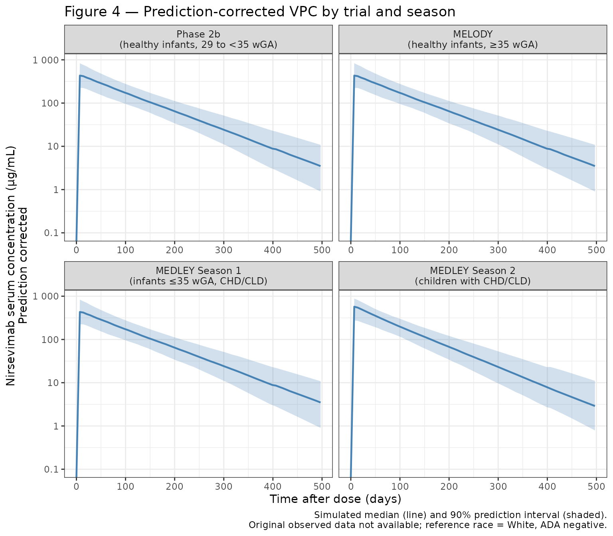
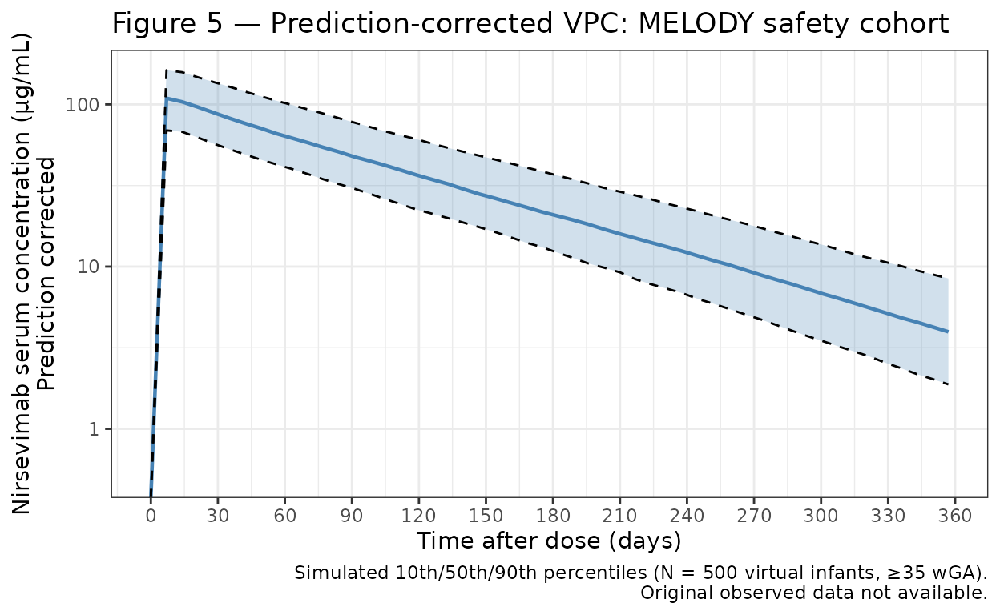
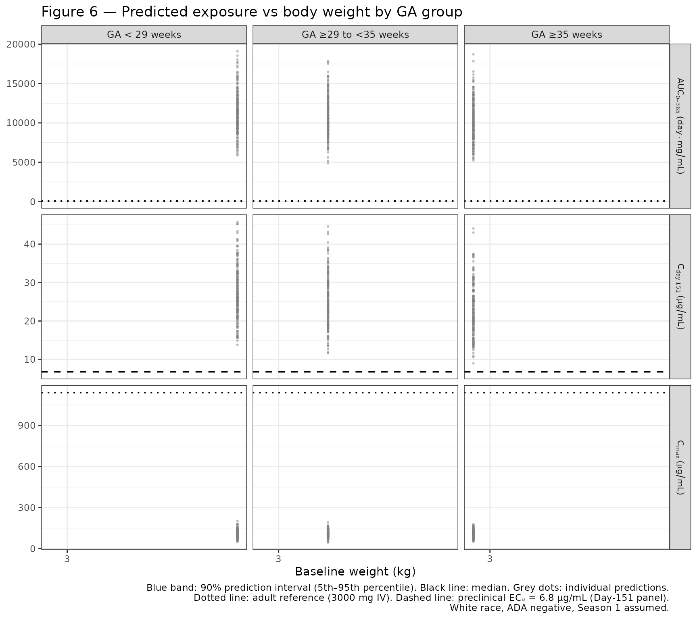

# Clegg_2024_nirsevimab

``` r
library(nlmixr2lib)
library(dplyr)
#> 
#> Attaching package: 'dplyr'
#> The following objects are masked from 'package:stats':
#> 
#>     filter, lag
#> The following objects are masked from 'package:base':
#> 
#>     intersect, setdiff, setequal, union
library(tidyr)
library(ggplot2)
```

## Nirsevimab population PK simulations

Replicate Figures 4, 5, and 6 from Clegg et al. (2024):

- **Figure 4**: Prediction-corrected VPC for the final model, stratified
  by trial and RSV season (Phase 2b, MELODY, MEDLEY Season 1, MEDLEY
  Season 2).
- **Figure 5**: Prediction-corrected VPC for the MELODY safety cohort.
- **Figure 6**: Predicted exposure (AUC₀₋₃₆₅, C_max, and Day-151
  concentration) versus body weight by gestational age (GA) group under
  weight-banded dosing.

Because the original study data are not publicly available, these
figures show simulated prediction intervals from virtual infant
populations whose covariate distributions approximate the published
trial demographics (Table 1, Clegg 2024). Body weight trajectories are
generated using WHO weight-for-age growth standards (combined sex, 0–24
months).

### WHO weight-for-age growth curve helper

WHO weight-for-age LMS parameters for combined sex, 0–24 months (WHO
Multicentre Growth Reference Study Group, 2006). Formula: weight (kg) =
M × (1 + L × S × z)^(1/L)

``` r
who_lms <- data.frame(
  age_mo = 0:24,
  L = c( 0.3487,  0.2297,  0.1970,  0.1738,  0.1553,  0.1395,  0.1257,
         0.1125,  0.0998,  0.0875,  0.0756,  0.0640,  0.0527,  0.0418,
         0.0313,  0.0211,  0.0113,  0.0018, -0.0073, -0.0161, -0.0245,
        -0.0326, -0.0404, -0.0479, -0.0551),
  M = c( 3.3464,  4.4709,  5.5675,  6.3762,  7.0023,  7.5105,  7.9340,
         8.2970,  8.6151,  8.9014,  9.1649,  9.4122,  9.6479,  9.8749,
        10.0953, 10.3108, 10.5228, 10.7319, 10.9385, 11.1430, 11.3462,
        11.5480, 11.7478, 11.9459, 12.1424),
  S = c( 0.14602, 0.13395, 0.12385, 0.11876, 0.11535, 0.11254, 0.11056,
         0.10947, 0.10868, 0.10814, 0.10765, 0.10722, 0.10706, 0.10695,
         0.10695, 0.10700, 0.10710, 0.10723, 0.10737, 0.10754, 0.10773,
         0.10793, 0.10814, 0.10835, 0.10858)
)

# Weight (kg) for postnatal age (months) and individual z-score
who_weight <- function(pna_mo, z) {
  pna_mo <- pmax(0, pmin(pna_mo, 24))
  L <- approx(who_lms$age_mo, who_lms$L, xout = pna_mo)$y
  M <- approx(who_lms$age_mo, who_lms$M, xout = pna_mo)$y
  S <- approx(who_lms$age_mo, who_lms$S, xout = pna_mo)$y
  M * (1 + L * S * z)^(1 / L)
}
```

### Helper: build a virtual cohort dataset

Builds dose + observation records for a virtual cohort of `n` infants.
`ga_range`: gestational age range in weeks. `pna0_range`: postnatal age
at dosing range in months. `max_day`: follow-up duration in days.
`season2`: TRUE for Season 2 (200 mg flat dose, Season 2 CL effect
applied). `obs_days`: observation time points in days.

``` r
make_cohort <- function(n, ga_range, pna0_range, max_day,
                        season2 = FALSE, obs_days = seq(0, max_day, by = 7)) {
  GA    <- runif(n, ga_range[1], ga_range[2])   # weeks
  PNA_0 <- runif(n, pna0_range[1], pna0_range[2]) # months at dosing
  wt_z  <- pmax(-2, pmin(2, rnorm(n, 0, 1)))
  WT_0  <- who_weight(PNA_0, wt_z)
  AMT   <- if (season2) rep(200, n) else ifelse(WT_0 < 5, 50, 100)

  pop <- data.frame(
    ID = seq_len(n), GA, PNA_0, wt_z, WT_0, AMT,
    SEASON2   = as.integer(season2),
    ADA_POS   = 0L,
    # All White/Nat.Haw reference race for simplicity
    BLACK_OTH          = 0L,
    ASIAN_AMIND_MULTI  = 0L
  )

  # Dose records
  d_dose <- pop |>
    mutate(
      TIME = 0, EVID = 1, CMT = "depot", DV = NA,
      PAGE = GA / 4.35 + PNA_0,
      WT   = WT_0
    )

  # Observation records with time-varying WT and PAGE
  d_obs <- pop[rep(seq_len(n), each = length(obs_days)), ] |>
    mutate(
      TIME = rep(obs_days, times = n),
      EVID = 0, CMT = "central", DV = NA, AMT = 0,
      PNA  = PNA_0 + TIME / 30.44,
      PAGE = GA / 4.35 + PNA,
      WT   = who_weight(pmax(0, PNA), wt_z)
    )

  bind_rows(d_dose, d_obs) |>
    arrange(ID, TIME, desc(EVID)) |>
    select(ID, TIME, AMT, EVID, CMT, DV, WT, PAGE,
           BLACK_OTH, ASIAN_AMIND_MULTI, SEASON2, ADA_POS, WT_0)
}
```

### Load model

``` r
mod <- readModelDb("Clegg_2024_nirsevimab")
```

------------------------------------------------------------------------

### Figure 4 — Prediction-corrected VPC by trial and season

Four panels matching the published trials:

| Panel     | Trial                     | GA range | Season | Dose      |
|-----------|---------------------------|----------|--------|-----------|
| Phase 2b  | Healthy preterm infants   | 29–35 wk | 1      | 50/100 mg |
| MELODY    | Healthy term/late-preterm | ≥35 wk   | 1      | 50/100 mg |
| MEDLEY S1 | Preterm + CHD/CLD         | 24–35 wk | 1      | 50/100 mg |
| MEDLEY S2 | CHD/CLD children          | ≥35 wk   | 2      | 200 mg    |

The vignette shows simulated prediction intervals only (no observed
data; original data are not publicly available).

``` r
set.seed(8897)  # MEDI8897 = nirsevimab development code

d_p2b    <- make_cohort(200, c(29, 35), c(0, 3),  400) |> mutate(trial = "Phase 2b\n(healthy infants, 29 to <35 wGA)")
d_melody <- make_cohort(200, c(35, 42), c(0, 3),  500) |> mutate(trial = "MELODY\n(healthy infants, \u226535 wGA)")
d_med_s1 <- make_cohort(200, c(24, 35), c(0, 3),  400) |> mutate(trial = "MEDLEY Season 1\n(infants \u226435 wGA, CHD/CLD)")
d_med_s2 <- make_cohort(100, c(35, 42), c(12, 24), 400,
                         season2 = TRUE)             |> mutate(trial = "MEDLEY Season 2\n(children with CHD/CLD)")

sim_f4 <- bind_rows(d_p2b, d_melody, d_med_s1, d_med_s2)

out_f4 <- rxode2::rxSolve(mod, events = sim_f4) |>
  as.data.frame() |>
  left_join(
    sim_f4 |> select(ID, trial) |> distinct(),
    by = c("id" = "ID")
  )
#> Warning in left_join(as.data.frame(rxode2::rxSolve(mod, events = sim_f4)), : Detected an unexpected many-to-many relationship between `x` and `y`.
#> ℹ Row 1 of `x` matches multiple rows in `y`.
#> ℹ Row 1 of `y` matches multiple rows in `x`.
#> ℹ If a many-to-many relationship is expected, set `relationship =
#>   "many-to-many"` to silence this warning.
```

``` r
d_f4 <- out_f4 |>
  group_by(trial, time) |>
  summarise(
    Q05 = quantile(Cc, 0.05, na.rm = TRUE),
    Q50 = quantile(Cc, 0.50, na.rm = TRUE),
    Q95 = quantile(Cc, 0.95, na.rm = TRUE),
    .groups = "drop"
  ) |>
  mutate(trial = factor(trial, levels = c(
    "Phase 2b\n(healthy infants, 29 to <35 wGA)",
    "MELODY\n(healthy infants, \u226535 wGA)",
    "MEDLEY Season 1\n(infants \u226435 wGA, CHD/CLD)",
    "MEDLEY Season 2\n(children with CHD/CLD)"
  )))
```

``` r
ggplot(d_f4, aes(x = time, y = Q50)) +
  geom_ribbon(aes(ymin = Q05, ymax = Q95), fill = "#4682b4", alpha = 0.25) +
  geom_line(colour = "#4682b4", linewidth = 0.8) +
  facet_wrap(~trial, scales = "free_x", nrow = 2) +
  scale_y_log10(
    limits = c(0.1, NA),
    labels = scales::label_number(drop0trailing = TRUE)
  ) +
  scale_x_continuous(breaks = seq(0, 500, by = 100)) +
  labs(
    x     = "Time after dose (days)",
    y     = "Nirsevimab serum concentration (\u03bcg/mL)\nPrediction corrected",
    title = "Figure 4 \u2014 Prediction-corrected VPC by trial and season",
    caption = "Simulated median (line) and 90% prediction interval (shaded).\nOriginal observed data not available; reference race = White, ADA negative."
  ) +
  theme_bw() +
  theme(strip.text = element_text(size = 9))
#> Warning in scale_y_log10(limits = c(0.1, NA), labels = scales::label_number(drop0trailing = TRUE)): log-10 transformation introduced infinite values.
#> log-10 transformation introduced infinite values.
#> log-10 transformation introduced infinite values.
#> log-10 transformation introduced infinite values.
```



------------------------------------------------------------------------

### Figure 5 — Prediction-corrected VPC for the MELODY safety cohort

Healthy term and late-preterm infants (≥35 weeks GA), Season 1, followed
for 360 days. The paper uses 10th/50th/90th percentiles (rather than the
5th/95th used in Figure 4).

``` r
set.seed(3979)  # NCT03979313 = MELODY trial
d_f5 <- make_cohort(500, c(35, 42), c(0, 3), 360,
                    obs_days = seq(0, 360, by = 7))

out_f5 <- rxode2::rxSolve(mod, events = d_f5) |> as.data.frame()
```

``` r
d_f5_plot <- out_f5 |>
  group_by(time) |>
  summarise(
    Q10 = quantile(Cc, 0.10, na.rm = TRUE),
    Q50 = quantile(Cc, 0.50, na.rm = TRUE),
    Q90 = quantile(Cc, 0.90, na.rm = TRUE),
    .groups = "drop"
  )
```

``` r
ggplot(d_f5_plot, aes(x = time, y = Q50)) +
  geom_ribbon(aes(ymin = Q10, ymax = Q90), fill = "#4682b4", alpha = 0.25) +
  geom_line(colour = "#4682b4", linewidth = 0.8) +
  geom_line(aes(y = Q10), linetype = "dashed", linewidth = 0.5) +
  geom_line(aes(y = Q90), linetype = "dashed", linewidth = 0.5) +
  scale_y_log10(
    limits = c(0.5, NA),
    labels = scales::label_number(drop0trailing = TRUE)
  ) +
  scale_x_continuous(breaks = seq(0, 360, by = 30)) +
  labs(
    x     = "Time after dose (days)",
    y     = "Nirsevimab serum concentration (\u03bcg/mL)\nPrediction corrected",
    title = "Figure 5 \u2014 Prediction-corrected VPC: MELODY safety cohort",
    caption = "Simulated 10th/50th/90th percentiles (N = 500 virtual infants, \u226535 wGA).\nOriginal observed data not available."
  ) +
  theme_bw()
#> Warning in scale_y_log10(limits = c(0.5, NA), labels = scales::label_number(drop0trailing = TRUE)): log-10 transformation introduced infinite values.
#> log-10 transformation introduced infinite values.
#> log-10 transformation introduced infinite values.
#> log-10 transformation introduced infinite values.
#> log-10 transformation introduced infinite values.
#> log-10 transformation introduced infinite values.
```



------------------------------------------------------------------------

### Figure 6 — Predicted exposure versus body weight by GA group

Simulate 3 GA groups (GA \<29 weeks, ≥29 to \<35 weeks, ≥35 weeks),
dosing at birth, with weight-banded dosing (50 mg ≤5 kg, 100 mg \>5 kg).
Compute AUC₀₋₃₆₅ (trapezoidal), C_max, and Day-151 concentration. Use
daily time steps for accurate NCA.

Adult reference lines from the paper (3000 mg IV dose): AUC₀₋₃₆₅ = 57.0
day·mg/mL; C_max = 1140 μg/mL. EC₉₀ (preclinical) = 6.8 μg/mL (for
Day-151 concentration panel).

``` r
set.seed(2024)
n_per_ga <- 200
obs_daily <- seq(0, 365, by = 1)

ga_groups <- list(
  list(label = "GA < 29 weeks",        ga = c(24, 29)),
  list(label = "GA \u226529 to <35 weeks", ga = c(29, 35)),
  list(label = "GA \u226535 weeks",        ga = c(35, 42))
)

sim_f6_list <- lapply(ga_groups, function(g) {
  GA    <- runif(n_per_ga, g$ga[1], g$ga[2])
  PNA_0 <- rep(0, n_per_ga)   # dose at birth
  wt_z  <- pmax(-2, pmin(2, rnorm(n_per_ga, 0, 1)))
  WT_0  <- who_weight(PNA_0, wt_z)
  AMT   <- ifelse(WT_0 <= 5, 50, 100)

  pop <- data.frame(
    ID = seq_len(n_per_ga), GA, PNA_0, wt_z, WT_0, AMT,
    SEASON2 = 0L, ADA_POS = 0L,
    BLACK_OTH = 0L, ASIAN_AMIND_MULTI = 0L
  )

  d_dose <- pop |>
    mutate(TIME = 0, EVID = 1, CMT = "depot", DV = NA,
           PAGE = GA / 4.35, WT = WT_0)

  d_obs <- pop[rep(seq_len(n_per_ga), each = length(obs_daily)), ] |>
    mutate(
      TIME = rep(obs_daily, times = n_per_ga),
      EVID = 0, CMT = "central", DV = NA, AMT = 0,
      PNA  = PNA_0 + TIME / 30.44,
      PAGE = GA / 4.35 + PNA,
      WT   = who_weight(pmax(0, PNA), wt_z)
    )

  d_events <- bind_rows(d_dose, d_obs) |>
    arrange(ID, TIME, desc(EVID)) |>
    select(ID, TIME, AMT, EVID, CMT, DV, WT, PAGE,
           BLACK_OTH, ASIAN_AMIND_MULTI, SEASON2, ADA_POS, WT_0)

  out <- rxode2::rxSolve(mod, events = d_events) |>
    as.data.frame()

  # NCA by individual
  nca <- out |>
    group_by(id) |>
    summarise(
      AUC0_365 = {
        t <- time; c <- Cc
        sum(diff(t) * (c[-length(c)] + c[-1]) / 2) # trapezoid
      },
      Cmax     = max(Cc),
      C_day151 = Cc[which.min(abs(time - 151))],
      WT_base  = WT_0[1],
      .groups  = "drop"
    ) |>
    mutate(ga_group = g$label)
})

d_f6_nca <- bind_rows(sim_f6_list) |>
  mutate(ga_group = factor(ga_group, levels = sapply(ga_groups, `[[`, "label")))
```

``` r
# 90% prediction intervals (5th-95th) by baseline weight bin
wt_bins <- seq(1, 11, by = 0.5)

d_f6_long <- d_f6_nca |>
  pivot_longer(c(AUC0_365, Cmax, C_day151), names_to = "metric", values_to = "value") |>
  mutate(wt_bin = cut(WT_base, breaks = wt_bins, right = FALSE))

d_f6_pi <- d_f6_long |>
  group_by(ga_group, metric, wt_bin) |>
  summarise(
    wt_mid = mean(WT_base),
    Q05    = quantile(value, 0.05, na.rm = TRUE),
    Q50    = quantile(value, 0.50, na.rm = TRUE),
    Q95    = quantile(value, 0.95, na.rm = TRUE),
    .groups = "drop"
  ) |>
  filter(!is.na(wt_bin))

metric_labels <- c(
  AUC0_365 = "AUC[0-365]~(day%.%mg/mL)",
  Cmax     = "C[max]~(mu*g/mL)",
  C_day151 = "C[day~151]~(mu*g/mL)"
)
```

``` r
# Adult reference values (3000 mg IV)
adult_refs <- data.frame(
  metric = c("AUC0_365", "Cmax"),
  yref   = c(57.0, 1140)
)
ec90_val <- 6.8  # preclinical EC90, μg/mL

ggplot(d_f6_pi, aes(x = wt_mid)) +
  geom_ribbon(aes(ymin = Q05, ymax = Q95), fill = "#87ceeb", alpha = 0.6) +
  geom_line(aes(y = Q50), linewidth = 0.8) +
  # Individual posthoc predictions
  geom_point(
    data = d_f6_nca |>
      pivot_longer(c(AUC0_365, Cmax, C_day151), names_to = "metric", values_to = "value"),
    aes(x = WT_base, y = value),
    colour = "grey50", size = 0.5, alpha = 0.4
  ) +
  # Adult reference lines (AUC and Cmax panels only)
  geom_hline(
    data = adult_refs,
    aes(yintercept = yref),
    linetype = "dotted", linewidth = 0.7
  ) +
  # EC90 line (Day-151 panel only)
  geom_hline(
    data = data.frame(metric = "C_day151", yref = ec90_val),
    aes(yintercept = yref),
    linetype = "dashed", linewidth = 0.7
  ) +
  facet_grid(
    metric ~ ga_group,
    scales = "free_y",
    labeller = labeller(metric = as_labeller(metric_labels, label_parsed))
  ) +
  scale_x_continuous(breaks = seq(1, 11, by = 2)) +
  labs(
    x       = "Baseline weight (kg)",
    y       = NULL,
    title   = "Figure 6 \u2014 Predicted exposure vs body weight by GA group",
    caption = paste0(
      "Blue band: 90% prediction interval (5th\u201395th percentile). ",
      "Black line: median. Grey dots: individual predictions.\n",
      "Dotted line: adult reference (3000 mg IV). ",
      "Dashed line: preclinical EC\u2090 = 6.8 \u03bcg/mL (Day-151 panel).\n",
      "White race, ADA negative, Season 1 assumed."
    )
  ) +
  theme_bw() +
  theme(
    strip.text.x = element_text(size = 9),
    strip.text.y = element_text(size = 8)
  )
#> `geom_line()`: Each group consists of only one observation.
#> ℹ Do you need to adjust the group aesthetic?
#> `geom_line()`: Each group consists of only one observation.
#> ℹ Do you need to adjust the group aesthetic?
#> `geom_line()`: Each group consists of only one observation.
#> ℹ Do you need to adjust the group aesthetic?
#> `geom_line()`: Each group consists of only one observation.
#> ℹ Do you need to adjust the group aesthetic?
#> `geom_line()`: Each group consists of only one observation.
#> ℹ Do you need to adjust the group aesthetic?
#> `geom_line()`: Each group consists of only one observation.
#> ℹ Do you need to adjust the group aesthetic?
#> `geom_line()`: Each group consists of only one observation.
#> ℹ Do you need to adjust the group aesthetic?
#> `geom_line()`: Each group consists of only one observation.
#> ℹ Do you need to adjust the group aesthetic?
#> `geom_line()`: Each group consists of only one observation.
#> ℹ Do you need to adjust the group aesthetic?
```



### Notes on the simulation

- **Model**: 2-compartment with first-order IM absorption; published
  parameters are for a 70 kg adult reference, scaled allometrically to
  infant weights.
- **Virtual populations**: Covariate distributions match published trial
  demographics (Table 1). Race is set to the White/Native Hawaiian
  reference and ADA to negative for all simulated subjects to isolate
  weight and maturation effects.
- **Weight trajectories**: WHO weight-for-age LMS growth standards
  (combined sex, 0–24 months), with each infant’s growth percentile
  (z-score) held constant.
- **IIV**: Simulated using published omega² values: CL (26% CV), V2 (43%
  CV), Ka (44% CV; high shrinkage 83%), with correlation r = 0.785
  between CL and V2. Q and V3 have no IIV in the final model.
- **Residual error**: Proportional 21%.
- **Figure 6 NCA**: AUC₀₋₃₆₅ computed by the trapezoidal rule on daily
  simulated concentrations; C_max and Day-151 concentration derived from
  the same densely sampled time course.

### Reference

- Clegg L, Freshwater E, Leach A, Villafana T, Wahlby Hamren U.
  Population Pharmacokinetics of Nirsevimab in Preterm and Term Infants.
  J Clin Pharmacol. 2024;64(5):555-567. <doi:10.1002/jcph.2401>
