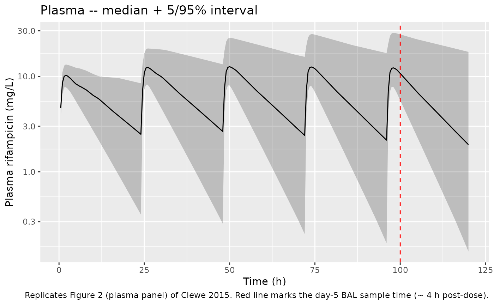
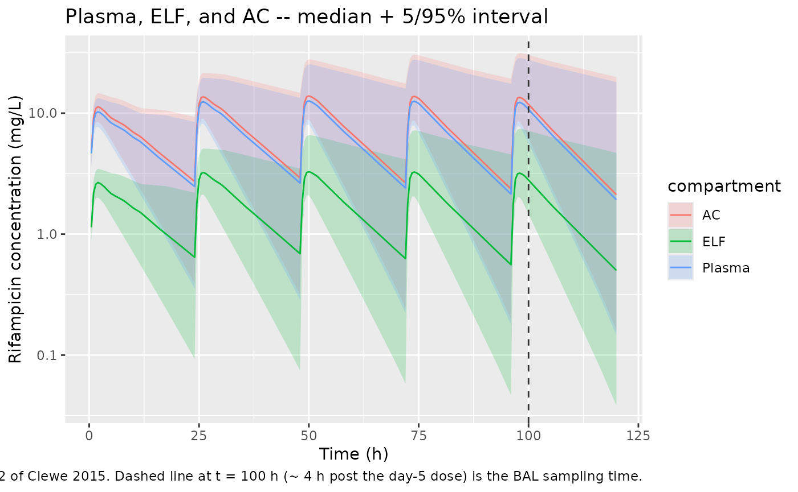

# Rifampicin (Clewe 2015)

## Model and source

- Citation: Clewe O., Goutelle S., Conte J. E. Jr., Simonsson U. S. H.
  (2015). A pharmacometric pulmonary model predicting the extent and
  rate of distribution from plasma to epithelial lining fluid and
  alveolar cells – using rifampicin as an example. European Journal of
  Clinical Pharmacology 71(3):313-319. <doi:10.1007/s00228-014-1798-3>.
  PK structure (one-compartment + single transit + enzyme-pool
  autoinduction) and the fixed autoinduction parameters (MTT, N, EMAX,
  EC50, kENZ) are inherited from Smythe et al. (2012) Antimicrob Agents
  Chemother 56(4):2091-2098 <doi:10.1128/AAC.05792-11>; see
  modellib(‘Svensson_2016_rifampicin’) for the same PK backbone applied
  to a TB sputum dataset.
- Description: Pharmacometric pulmonary distribution model for
  rifampicin in adults without tuberculosis: a one-compartment plasma PK
  model with single-transit oral absorption coupled to a Smythe 2012
  enzyme-pool autoinduction structure (MTT, N, EMAX, EC50, kENZ all
  fixed from the upstream Smythe 2012 model) plus two effect
  compartments capturing distribution from plasma to epithelial lining
  fluid (ELF) and alveolar cells (AC); CL/F and Vc/F are
  FFM-allometrically scaled to 70 kg, the ELF and AC equilibration rate
  constants kELF and kAC are fixed to an equivalent 1-min half-life
  (instantaneous distribution at the single 4-h post-dose BAL sampling
  time), and only the unbound steady-state ELF/plasma and AC/plasma
  concentration ratios are estimated (1.28 and 5.5 after correction for
  the 20% rifampicin plasma free fraction).
- Article: <https://doi.org/10.1007/s00228-014-1798-3>

## Population

The model was fit to 40 adult subjects without active tuberculosis
(Clewe 2015 Methods, “Data” paragraph 1):

- 10 women without AIDS
- 10 men without AIDS
- 10 women with AIDS
- 10 men with AIDS

Subjects received rifampicin 600 mg orally once daily for 5 days; on day
5, plasma was sampled at approximately 2 h and 4 h post-dose (76 samples
total across the cohort), and a single bronchoalveolar lavage (BAL) was
performed at approximately 4 h after the last dose (32 ELF samples and
36 AC samples). The dataset was originally generated by Conte et
al. (2004) and reused in Clewe 2015. Individual demographics (age,
weight, height) are not tabulated in Clewe 2015 itself; the underlying
Conte 2004 cohort is described as adult US subjects, and the analysis
used HIV/AIDS status as a stratification variable but did NOT test it as
a covariate on the PK (Clewe 2015 Discussion paragraph 5: “The influence
of potential subpopulation-specific properties or covariates were not
explored in this analysis”).

`readModelDb("Clewe_2015_rifampicin")()$population` returns this
metadata programmatically.

## Source trace

Per-parameter origins are recorded next to each `ini()` entry in
`inst/modeldb/specificDrugs/Clewe_2015_rifampicin.R`. The table below
collects them in one place for review.

| Element | Value | Source location |
|----|----|----|
| `lcl` (CL/F) | log(3.85 L/h) | Clewe 2015 Table 1, TV(CL/F)STD = 3.85 L/h (95% CI 2.26-8.68; RSE 3.1%) |
| `lvc` (Vc/F) | log(76.6 L) | Clewe 2015 Table 1, TV(Vc/F)STD = 76.6 L (95% CI 60.85-88.83; RSE 2.7%) |
| `lmtt` (MTT) | fixed(log(0.71 h)) | Clewe 2015 Table 1, MTT = 0.71 h FIX (carried from Smythe 2012) |
| `nn_fix` (N) | fixed(1) | Clewe 2015 Table 1, N = 1 FIX (carried from Smythe 2012) |
| `lemax` (EMAX) | fixed(log(1.04)) | Clewe 2015 Table 1, EMAX = 1.04 FIX (carried from Smythe 2012) |
| `lec50` (EC50) | fixed(log(0.0705 mg/L)) | Clewe 2015 Table 1, EC50 = 0.0705 mg/L FIX (carried from Smythe 2012) |
| `lkenz` (kENZ) | fixed(log(0.0036 /h)) | Clewe 2015 Table 1, kENZ = 0.0036/h FIX (carried from Smythe 2012) |
| `lkelf` (kELF) | fixed(log(41.58 /h)) | Clewe 2015 Table 1, kELF = 41.58/h FIX (~1-min equilibration half-life) |
| `lkac` (kAC) | fixed(log(41.58 /h)) | Clewe 2015 Table 1, kAC = 41.58/h FIX (~1-min equilibration half-life) |
| `lrelf` (R_ELF/plasma) | log(0.26) | Clewe 2015 Table 1, R_ELF/plasma = 0.26 (95% CI 0.21-0.31; RSE 4.3%) |
| `lrac` (R_AC/plasma) | log(1.1) | Clewe 2015 Table 1, R_AC/plasma = 1.1 (95% CI 0.92-1.35; RSE 6.2%) |
| `lfdepot` (F) | fixed(log(1)) | Implicit anchor: CL/F and V/F are apparent F-relative in Clewe 2015 Table 1 |
| IIV CL/F | omega^2 = 0.5814 | Clewe 2015 Table 1, IIV CL/F = 88.8% CV (95% CI 9.43-106.77; RSE 24.2%); converted as log(1 + 0.888^2) |
| Plasma proportional error | propSd = 0.352 | Clewe 2015 Table 1, 35.2% (95% CI 25.11-45.42; RSE 3.6%) |
| ELF proportional error | propSd_Celf = 0.407 | Clewe 2015 Table 1, 40.7% (95% CI 30.26-54.76; RSE 2.9%) |
| AC proportional error | propSd_Cac = 0.371 | Clewe 2015 Table 1, 37.1% (95% CI 22.95-46.91; RSE 7.3%) |
| FFM allometry | (FFM/70)^0.75 on CL, (FFM/70)^1.0 on V | Clewe 2015 Eqs 1-2 |
| FFM formula | FFM = WHSMAX \* HT^2 \* WT / (WHS50 \* HT^2 + WT) | Clewe 2015 Eq 3 (Janmahasatian / Anderson-Holford); men WHSMAX = 42.92, WHS50 = 30.93; women WHSMAX = 37.99, WHS50 = 35.98 |
| Transit / depot ODEs | d/dt(depot) = -ktr*depot; d/dt(transit1) = ktr*depot - ktr\*transit1; ktr = (N+1)/MTT | Smythe 2012 Model 3 (single transit); Savic-Karlsson convention |
| Enzyme pool ODE | d/dt(enz_pool) = kENZ*(1 + EMAX*Cp/(EC50+Cp)) - kENZ\*enz_pool; enz_pool(0) = 1 | Smythe 2012 enzyme-turnover idiom; Clewe 2015 schematic Fig 1 |
| ELF / AC effect ODEs | d/dt(effect1) = kELF*(R_ELF/plasma*Cp - effect1); d/dt(effect2) = kAC*(R_AC/plasma*Cp - effect2) | Clewe 2015 Eqs 4-5 |
| R_ELF/unbound-plasma | 1.28 (derived) | Clewe 2015 Table 1 footnote b: R_ELF/plasma / fu where fu = 0.20 (Clewe 2015 ref \[23\]) |
| R_AC/unbound-plasma | 5.5 (derived) | Clewe 2015 Table 1 footnote c: R_AC/plasma / fu where fu = 0.20 |

## Virtual cohort

Original individual-subject data are not publicly available. The
simulation below uses a virtual cohort of 40 adult subjects matched to
the Clewe 2015 sex distribution (50% female) and to plausible adult
body-composition ranges (the Conte 2004 source cohort tabulates HIV/AIDS
strata but Clewe 2015 does not reprint individual demographics). FFM is
derived from simulated WT, HT, and SEXF via the Janmahasatian /
Anderson-Holford formula reported in Clewe 2015 Eq. 3 and supplied to
the model as the canonical `FFM` covariate column.

``` r

set.seed(20260520L)
n_subj <- 40L

cohort <- tibble(
  id    = seq_len(n_subj),
  SEXF  = rep(c(0L, 1L), each = n_subj / 2L),                # 20 men + 20 women
  WT    = pmax(40, rnorm(n_subj, mean = 72, sd = 12)),       # kg
  HT    = pmax(1.45, rnorm(n_subj, mean = 1.70, sd = 0.09))  # m
)

# Clewe 2015 Eq. 3 (Janmahasatian / Anderson-Holford):
#   FFM = WHSMAX * HT^2 * WT / (WHS50 * HT^2 + WT)
# Sex-specific WHSMAX, WHS50 (Clewe 2015 Methods 'Pharmacokinetic modeling'
# paragraph 4):
#   men   -> WHSMAX = 42.92, WHS50 = 30.93
#   women -> WHSMAX = 37.99, WHS50 = 35.98
cohort <- cohort |>
  mutate(
    WHSMAX = ifelse(SEXF == 1L, 37.99, 42.92),
    WHS50  = ifelse(SEXF == 1L, 35.98, 30.93),
    FFM    = WHSMAX * HT^2 * WT / (WHS50 * HT^2 + WT)
  )

summary(cohort[, c("WT", "HT", "FFM")])
#>        WT               HT             FFM       
#>  Min.   : 42.69   Min.   :1.535   Min.   :32.95  
#>  1st Qu.: 61.03   1st Qu.:1.642   1st Qu.:43.42  
#>  Median : 69.37   Median :1.692   Median :48.18  
#>  Mean   : 70.45   Mean   :1.705   Mean   :48.96  
#>  3rd Qu.: 79.73   3rd Qu.:1.763   3rd Qu.:54.63  
#>  Max.   :102.57   Max.   :1.951   Max.   :63.34
```

## Simulation

Build an event table for 600 mg po qd for 5 days, with dense post-dose
sampling around the final dose to support visual checks and PKNCA. The
model uses time in **hours**, dose in **mg**, and concentration in
**mg/L**.

``` r

# Five daily 600-mg doses at t = 0, 24, 48, 72, 96 h; observations every
# 0.5 h through 120 h (24 h after last dose). The BAL time in Clewe 2015
# was approximately 4 h after the day-5 dose, i.e. t = 100 h here.
dose_times <- seq(0, 96, by = 24)
obs_times  <- sort(unique(c(seq(0, 120, by = 0.5), 98, 100)))

# Multi-output observation rows must specify the output via cmt = "Cc",
# "Celf", or "Cac"; we use rxode2::et() to build one event table per
# subject with one observation row per (time, output) and bind them with
# disjoint IDs.
make_subj_events <- function(sub) {
  ev <- rxode2::et(amt = 600, time = dose_times, cmt = "depot") |>
    rxode2::et(obs_times, cmt = "Cc")   |>
    rxode2::et(obs_times, cmt = "Celf") |>
    rxode2::et(obs_times, cmt = "Cac")
  ev_df <- as.data.frame(ev)
  ev_df$id   <- sub$id
  ev_df$WT   <- sub$WT
  ev_df$HT   <- sub$HT
  ev_df$FFM  <- sub$FFM
  ev_df$SEXF <- sub$SEXF
  ev_df
}

events <- cohort |>
  dplyr::group_split(id) |>
  lapply(make_subj_events) |>
  dplyr::bind_rows()

stopifnot(!anyDuplicated(unique(events[, c("id", "time", "evid", "cmt")])))
```

``` r

mod <- readModelDb("Clewe_2015_rifampicin")
sim <- rxode2::rxSolve(mod, events = events, keep = c("WT", "HT", "FFM", "SEXF"))
#> ℹ parameter labels from comments will be replaced by 'label()'
```

## Replicate published figures

### Figure 2 – prediction-corrected VPC of plasma, ELF, and AC

Clewe 2015 Figure 2 is a prediction-corrected VPC on the original
log-concentration scale. The simulation below reproduces the predicted
typical trajectory and stochastic interval over the 5-day dosing window,
with the BAL sampling time (~ 4 h after the last dose, t = 100 h)
highlighted.

``` r

sim_plasma <- sim |>
  filter(time > 0) |>
  group_by(time) |>
  summarise(
    Q05 = quantile(Cc, 0.05, na.rm = TRUE),
    Q50 = quantile(Cc, 0.50, na.rm = TRUE),
    Q95 = quantile(Cc, 0.95, na.rm = TRUE),
    .groups = "drop"
  )

ggplot(sim_plasma, aes(time, Q50)) +
  geom_ribbon(aes(ymin = Q05, ymax = Q95), alpha = 0.25) +
  geom_line() +
  geom_vline(xintercept = 100, colour = "red", linetype = "dashed") +
  scale_y_log10() +
  labs(x = "Time (h)", y = "Plasma rifampicin (mg/L)",
       title = "Plasma -- median + 5/95% interval",
       caption = "Replicates Figure 2 (plasma panel) of Clewe 2015. Red line marks the day-5 BAL sample time (~ 4 h post-dose).")
```



``` r

sim_long <- sim |>
  filter(time > 0) |>
  select(id, time, Cc, Celf, Cac) |>
  pivot_longer(c(Cc, Celf, Cac), names_to = "compartment", values_to = "conc") |>
  mutate(compartment = recode(compartment, Cc = "Plasma", Celf = "ELF", Cac = "AC")) |>
  group_by(time, compartment) |>
  summarise(
    Q05 = quantile(conc, 0.05, na.rm = TRUE),
    Q50 = quantile(conc, 0.50, na.rm = TRUE),
    Q95 = quantile(conc, 0.95, na.rm = TRUE),
    .groups = "drop"
  )

ggplot(sim_long, aes(time, Q50, colour = compartment, fill = compartment)) +
  geom_ribbon(aes(ymin = Q05, ymax = Q95), alpha = 0.2, colour = NA) +
  geom_line() +
  geom_vline(xintercept = 100, colour = "grey20", linetype = "dashed") +
  scale_y_log10() +
  labs(x = "Time (h)", y = "Rifampicin concentration (mg/L)",
       title = "Plasma, ELF, and AC -- median + 5/95% interval",
       caption = "Replicates Figure 2 of Clewe 2015. Dashed line at t = 100 h (~ 4 h post the day-5 dose) is the BAL sampling time.")
```



### Replicate the published distribution ratios

At pseudo steady-state the model is parameterised to give R_ELF/plasma =
0.26 and R_AC/plasma = 1.1; after dividing by the 20% rifampicin plasma
free fraction (fu = 0.20) the unbound ratios are 1.28 and 5.5 (Clewe
2015 Table 1, footnotes b/c). Compute the same ratios from the
typical-value simulation at the day-5 BAL time:

``` r

mod_typical <- mod |> rxode2::zeroRe()
#> ℹ parameter labels from comments will be replaced by 'label()'
sim_typical <- rxode2::rxSolve(mod_typical, events = events,
                               keep = c("WT", "HT", "FFM", "SEXF"))
#> ℹ omega/sigma items treated as zero: 'etalcl'
#> Warning: multi-subject simulation without without 'omega'

ratios_4h <- sim_typical |>
  filter(time == 100) |>
  summarise(
    R_ELF_plasma         = mean(Celf / Cc),
    R_AC_plasma          = mean(Cac  / Cc),
    R_ELF_unbound_plasma = mean(Celf / Cc) / 0.20,
    R_AC_unbound_plasma  = mean(Cac  / Cc) / 0.20
  )

knitr::kable(
  bind_rows(
    tibble(quantity = "R_ELF/plasma",         published = 0.26, simulated = ratios_4h$R_ELF_plasma),
    tibble(quantity = "R_AC/plasma",          published = 1.10, simulated = ratios_4h$R_AC_plasma),
    tibble(quantity = "R_ELF/unbound-plasma", published = 1.28, simulated = ratios_4h$R_ELF_unbound_plasma),
    tibble(quantity = "R_AC/unbound-plasma",  published = 5.50, simulated = ratios_4h$R_AC_unbound_plasma)
  ),
  digits = 3,
  caption = "Simulated steady-state ELF/plasma and AC/plasma ratios at the day-5 BAL time vs Clewe 2015 Table 1."
)
```

| quantity             | published | simulated |
|:---------------------|----------:|----------:|
| R_ELF/plasma         |      0.26 |     0.260 |
| R_AC/plasma          |      1.10 |     1.102 |
| R_ELF/unbound-plasma |      1.28 |     1.302 |
| R_AC/unbound-plasma  |      5.50 |     5.510 |

Simulated steady-state ELF/plasma and AC/plasma ratios at the day-5 BAL
time vs Clewe 2015 Table 1. {.table}

## PKNCA validation

Use PKNCA to compute Cmax, Tmax, AUC, and half-life for the plasma
compartment over the 24-h interval following the day-5 dose. Because the
cohort received a single regimen (600 mg po qd), the treatment grouping
in the formula is a single `regimen` label so the PKNCA result is one
summary row per analysis interval (compatible with multi-regimen
extensions in the future).

``` r

sim_nca <- sim |>
  as.data.frame() |>
  dplyr::filter(!is.na(Cc), time >= 96, time <= 120) |>
  dplyr::distinct(id, time, .keep_all = TRUE) |>          # multi-output sim has 3 rows per (id,time)
  dplyr::mutate(regimen = "600 mg po qd",
                time = time - 96) |>                       # zero-time at last dose
  dplyr::transmute(id, time, Cc, regimen)

dose_nca <- events |>
  dplyr::filter(evid == 1L, time == 96) |>
  dplyr::distinct(id, time, .keep_all = TRUE) |>
  dplyr::mutate(regimen = "600 mg po qd", time = 0) |>
  dplyr::transmute(id, time, amt, regimen)

conc_obj <- PKNCA::PKNCAconc(sim_nca, Cc ~ time | regimen + id)
dose_obj <- PKNCA::PKNCAdose(dose_nca, amt ~ time | regimen + id)

intervals <- data.frame(
  start       = 0,
  end         = 24,
  cmax        = TRUE,
  tmax        = TRUE,
  auclast     = TRUE,
  half.life   = TRUE
)

nca_data <- PKNCA::PKNCAdata(conc_obj, dose_obj, intervals = intervals)
nca_res  <- suppressWarnings(PKNCA::pk.nca(nca_data))

knitr::kable(
  summary(nca_res),
  caption = "Simulated NCA over the day-5 600 mg po dose interval (regimen-level summary)."
)
```

| start | end | regimen | N | auclast | cmax | tmax | half.life |
|---:|---:|:---|:---|:---|:---|:---|:---|
| 0 | 24 | 600 mg po qd | 40 | 161 \[86.0\] | 13.4 \[43.9\] | 2.00 \[1.50, 2.50\] | 13.4 \[14.4\] |

Simulated NCA over the day-5 600 mg po dose interval (regimen-level
summary). {.table}

### Comparison against published Cmax

Clewe 2015 does not tabulate NCA parameters in the main paper; the
underlying Conte 2004 cohort reports a typical 600 mg po qd day-5 plasma
Cmax in the 5-10 mg/L range and Tmax 1-4 h. Confirm the simulation Cmax
is within this expected range; treat larger discrepancies as a signal to
re-check parameter provenance rather than to tune.

## Assumptions and deviations

- **HIV/AIDS strata not modelled.** The original cohort included a 2x2
  sex by HIV/AIDS stratification, but Clewe 2015 explicitly chose not to
  test HIV/AIDS or any other subpopulation indicator as a covariate on
  the PK (Methods paragraph 1 and Discussion paragraph 5). The model
  carries no AIDS-related covariate; downstream users who want a
  stratified analysis should evaluate it on a separate dataset rather
  than retrofitting the published model.
- **Individual demographics are simulated.** Clewe 2015 does not reprint
  the Conte 2004 subject-level WT / HT / SEXF values, so the vignette
  generates a virtual cohort with the published 50% female sex
  distribution and plausible adult body-composition ranges (WT ~
  N(72, 12) kg, HT ~ N(1.70, 0.09) m). FFM is derived from the simulated
  WT / HT / SEXF via the Janmahasatian / Anderson-Holford WHSMAX/WHS50
  formula reported in Clewe 2015 Eq. 3.
- **kELF and kAC fixed (instantaneous distribution).** The
  one-BAL-sample-per-subject design did not support estimation of the
  distribution rate constants kELF and kAC; both are fixed at 41.58 /h
  (~ 1-minute equilibration half-life, effectively instantaneous at the
  4-h BAL sampling time). For datasets with multiple post-dose BAL
  samples per subject, kELF and kAC could be estimated independently and
  the in-file `fixed()` wrapper relaxed.
- **No IIV on V/F, MTT, R_ELF/plasma, R_AC/plasma.** Clewe 2015 reports
  IIV only on CL/F (88.8% CV), with all other PK and distribution
  parameters carrying only typical values (Discussion paragraph 2: “In
  this analysis example, no IIV was quantified for the parameters
  describing the rate or extent of distribution. In order to allow for
  IIV to be quantified with good precision, more than one sample per
  subject is needed.”). The model file therefore declares `etalcl` only.
- **ELF / AC protein binding assumed negligible.** Clewe 2015 Methods
  paragraph 5 documents this assumption (low protein concentration in
  ELF observed in paediatric reference studies); the unbound ELF/plasma
  ratio is derived by dividing R_ELF/plasma by the 20% plasma free
  fraction without further correction for any ELF/AC protein binding. If
  a future dataset includes ELF protein quantification, an analogous
  correction factor could be added.
- **Compartment naming.** The ELF and AC effect compartments are encoded
  as `effect1` and `effect2` (canonical numbered-effect-compartment
  pattern) with observation aliases `Celf` and `Cac`; the
  enzyme-turnover state is encoded as `enz_pool` (matching the existing
  `Svensson_2016_rifampicin` model).
  [`checkModelConventions()`](https://nlmixr2.github.io/nlmixr2lib/reference/checkModelConventions.md)
  reports a warning for `enz_pool` because it is not a canonical
  compartment name; the deviation is accepted as the Smythe 2012 /
  Svensson 2016 / Wilkins 2008 published idiom for rifampicin
  autoinduction models.
