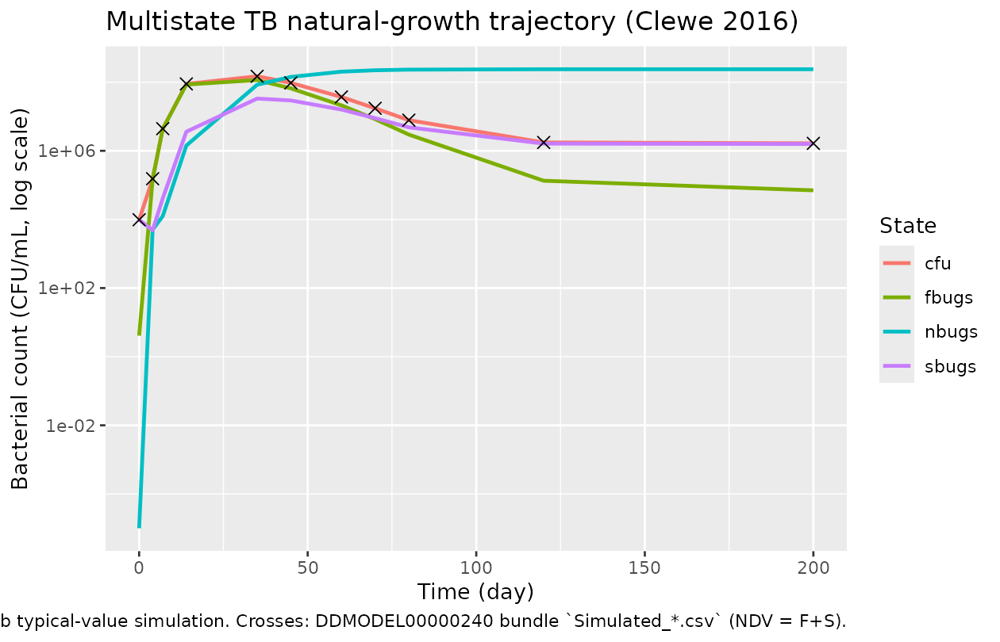

# Clewe_2016_rifampicin

## Model and source

- Citation: Clewe O, Aulin L, Hu Y, Coates AR, Simonsson US. (2016). A
  multistate tuberculosis pharmacometric model: a framework for studying
  anti-tubercular drug effects in vitro. *J Antimicrob Chemother*
  71(4):964-974.
- Article: <https://doi.org/10.1093/jac/dkv416>
- DDMORE Foundation Model Repository entry:
  [DDMODEL00000240](https://repository.ddmore.eu/model/DDMODEL00000240)
  (scenario 4)

This is the **Multistate Tuberculosis Pharmacometric (MTP) model** for
in vitro *Mycobacterium tuberculosis* H37Rv natural growth. Three
bacterial states – fast-multiplying (F), slow-multiplying (S), and
non-multiplying (N) – are coupled by inter-state transfer rates and a
Gompertz-type growth term on the F population, with a time-varying
linear drift (`kFSLIN * t`) for the F-\>S transfer. The DDMORE bundle
ships only the natural-growth scaffold from scenario 4 of the
publication; the full publication couples this scaffold with a
rifampicin exposure-response layer that is **not** encoded in the
executable. The model as packaged here therefore describes untreated
bacterial growth dynamics only.

## Population

- **In vitro** time-kill experiments on *M. tuberculosis* H37Rv (St
  George’s University strain).
- **12 replicate cultures** (per the `Output_real_MTP.lst` ETABAR
  `N = 12`) followed for ~200 days under untreated growth conditions on
  a single-subject-per-culture basis.
- No human or animal subjects are involved; no covariates are encoded.
- The Clewe 2016 publication was **not on disk** at extraction time, so
  a full cross-check against the paper’s printed tables / figures was
  not performed. Parameter values derive from `Output_real_MTP.lst`
  `FINAL PARAMETER ESTIMATE` block only.

The same metadata is available programmatically:

``` r

mod_fn <- readModelDb("Clewe_2016_rifampicin")
str(formals(mod_fn))
#>  NULL
```

## Source trace

Per-parameter origins are recorded as in-file comments next to each
[`ini()`](https://nlmixr2.github.io/rxode2/reference/ini.html) entry in
`inst/modeldb/ddmore/Clewe_2016_rifampicin.R`. The table below collects
them in one place. All values come from the `Output_real_MTP.lst`
`FINAL PARAMETER ESTIMATE` block (post-`MINIMIZATION SUCCESSFUL`, FOCE).

nlmixr2 parameter \| NONMEM source \| Bundle .mod\$THETA / \$OMEGA /
\$SIGMA \| .lst final estimate \| Back-transformed value\|

\|——————-\|—————————\|————————————–\|———————\|————————\| \| `lkg` \|
`THETA(1)` kG \| 0.206361 \| TH 1 = 2.06E-01 \| kG = 0.206 /day \| \|
`lkfslin` \| `THETA(2)` kFSLIN (/100) \| 0.1657 \| TH 2 = 1.66E-01 \|
kFSLIN = 1.66e-3 /day^2 \| \| `lkfn` \| `THETA(3)` kFN (/1e6) \| 0.9 \|
TH 3 = 8.97E-01 \| kFN = 8.97e-7 /day \| \| `lksf` \| `THETA(4)` kSF
(/10) \| 0.14478 \| TH 4 = 1.45E-01 \| kSF = 0.0145 /day \| \| `lksn` \|
`THETA(5)` kSN \| 0.185568 \| TH 5 = 1.86E-01 \| kSN = 0.186 /day \| \|
`lkns` \| `THETA(6)` kNS (/100) \| 0.1227 \| TH 6 = 1.23E-01 \| kNS =
1.23e-3 /day \| \| `lbmax` \| `THETA(7)` Bmax (\*1e6) \| 241.6170 \| TH
7 = 2.42E+02 \| Bmax = 2.42e8 CFU/mL \| \| `lf0` \| `THETA(8)` F0 \|
4.109880 \| TH 8 = 4.10E+00 \| F0 = 4.10 CFU/mL \| \| `ls0` \|
`THETA(9)` S0 \| 9770.730 \| TH 9 = 9.77E+03 \| S0 = 9770 CFU/mL \| \|
`etalf0` \| `$OMEGA(1,1)` on ETA(1) \| 22.37250 \| OMEGA ETA1 = 2.24E+01
\| variance on log F0 \| \| `propSd` \| `$SIGMA(1,1)` on EPS(1) \|
0.400262 (initial) \| SIGMA EPS1 = 1.60E-01 \| sqrt(0.160) = 0.400 \| \|
ODE F \| .mod `$DES` line 14
(`DADT(1) = A(1)*GROWTHFUNC + KSF*A(2) - KFS*A(1) - KFN*A(1)`) \| \| \|
\| \| ODE S \| .mod `$DES` line 15
(`DADT(2) = KFS*A(1) + KNS*A(3) - KSN*A(2) - KSF*A(2)`) \| \| \| \| \|
ODE N \| .mod `$DES` line 16
(`DADT(3) = KSN*A(2) + KFN*A(1) - KNS*A(3)`) \| \| \| \| \| Gompertz
growth \| .mod `$DES` line 9
(`GROWTHFUNC = KG*LOG(BMAX/(A(1)+A(2)+A(3)))`) \| \| \| \| \|
Time-varying F-\>S \| .mod `$DES` line 12 (`KFS = KFSLIN * T`) \| \| \|
\| \| Initial conditions\| .mod `$PK` lines 31-33 (`A_0(1) = F0`,
`A_0(2) = S0`, `A_0(3) = 1e-5`) \| \| \| \| \| Observation \| .mod
`$ERROR` line 18 (`IPRED = LOG(A(1)+A(2))`; culturable CFU = F+S;
non-multiplying N excluded) \| \| \| \| \| Residual error \| .mod
`$ERROR` line 22 (`Y = IPRED + EPS(1)`; “additive on log-scale” ==
proportional in linear space per `naming-conventions.md`) \| \| \| \|

The minimization in `Output_real_MTP.lst` succeeded
(`#TERM: 0MINIMIZATION SUCCESSFUL`, line 322; OFV = -92.456, line 375).
ETA shrinkage on F0 was 40.7 % (line 335), reflecting that ETA(1) is
identifiable only from the early-time CFU spread across the 12 replicate
cultures.

## Mechanistic structure

At the typical-value (no IIV, no residual error), the three-state ODE
system is:

``` math
\begin{aligned}
\frac{d F}{d t} &= F \cdot G(t) + k_{SF} \cdot S - k_{FS}(t) \cdot F - k_{FN} \cdot F \\
\frac{d S}{d t} &= k_{FS}(t) \cdot F + k_{NS} \cdot N - k_{SN} \cdot S - k_{SF} \cdot S \\
\frac{d N}{d t} &= k_{SN} \cdot S + k_{FN} \cdot F - k_{NS} \cdot N
\end{aligned}
```

with the Gompertz growth term on F clamped at zero when the population
reaches carrying capacity:

``` math
G(t) = \max\!\Big(\,k_G \cdot \log\!\big(B_{\max} / (F + S + N)\big),\; 0\Big)
```

and the time-varying F-\>S transfer:

``` math
k_{FS}(t) = k_{FSLIN} \cdot t
```

Initial conditions: `F(0) = F0 * exp(eta_F0)`, `S(0) = S0`,
`N(0) = 1e-5` (paper-specified small positive offset for numerical
stability).

The observable is the culturable colony-forming-unit count
`CFU = F + S`. Non-multiplying bacteria (N) do not form colonies on agar
plates and are therefore excluded from the observation, even though they
are tracked dynamically. The residual error in `.mod` `$ERROR` writes
`Y = LOG(F+S) + EPS(1)`, which maps to a proportional error on the
linear-space CFU in nlmixr2.

## Virtual cohort

For the F.2 self-consistency check we simulate the bundled
`Simulated_Mtb-H37Rv_In-vitro-NATG.csv` event grid (one subject, 11
observation times spanning t = 0 to 200 days). The 11 rows below are
reproduced inline from the DDMODEL00000240 bundle (`TIME`, `NDV` =
bacterial count CFU/mL, `DV` = ln(NDV)):

``` r

bundle <- data.frame(
  TIME = c(0, 4, 7, 14, 35, 45, 60, 70, 80, 120, 200),
  ID   = 1L,
  NDV  = c(9775, 153430, 4417126, 88986924, 148337404, 95343812,
           37132382, 17348211, 7826296, 1749778, 1646232),
  DV   = c(9.19, 11.9, 15.3, 18.3, 18.8, 18.4, 17.4, 16.7, 15.9, 14.4, 14.3),
  EVID = 0L,
  MDV  = 0L,
  AMT  = 0
)
knitr::kable(bundle, caption = "DDMODEL00000240 simulated dataset (Simulated_Mtb-H37Rv_In-vitro-NATG.csv).")
```

| TIME |  ID |       NDV |    DV | EVID | MDV | AMT |
|-----:|----:|----------:|------:|-----:|----:|----:|
|    0 |   1 |      9775 |  9.19 |    0 |   0 |   0 |
|    4 |   1 |    153430 | 11.90 |    0 |   0 |   0 |
|    7 |   1 |   4417126 | 15.30 |    0 |   0 |   0 |
|   14 |   1 |  88986924 | 18.30 |    0 |   0 |   0 |
|   35 |   1 | 148337404 | 18.80 |    0 |   0 |   0 |
|   45 |   1 |  95343812 | 18.40 |    0 |   0 |   0 |
|   60 |   1 |  37132382 | 17.40 |    0 |   0 |   0 |
|   70 |   1 |  17348211 | 16.70 |    0 |   0 |   0 |
|   80 |   1 |   7826296 | 15.90 |    0 |   0 |   0 |
|  120 |   1 |   1749778 | 14.40 |    0 |   0 |   0 |
|  200 |   1 |   1646232 | 14.30 |    0 |   0 |   0 |

DDMODEL00000240 simulated dataset
(Simulated_Mtb-H37Rv_In-vitro-NATG.csv). {.table}

``` r

# rxode2 event table for the typical-value simulation (no IIV, no error).
events <- rxode2::et(time = bundle$TIME, evid = 0)
events
#> ── EventTable with 11 records ──
#> 0 dosing records (see x$get.dosing(); add with add.dosing or et)
#> 11 observation times (see x$get.sampling(); add with add.sampling or et)
#> ── First part of x: ──
#> # A tibble: 11 × 2
#>     time evid         
#>    <dbl> <evid>       
#>  1     0 0:Observation
#>  2     4 0:Observation
#>  3     7 0:Observation
#>  4    14 0:Observation
#>  5    35 0:Observation
#>  6    45 0:Observation
#>  7    60 0:Observation
#>  8    70 0:Observation
#>  9    80 0:Observation
#> 10   120 0:Observation
#> 11   200 0:Observation
```

## Simulation (F.2 self-consistency)

Typical-value F+S trajectory reproduction with all etas zeroed (the
bundle’s `Output_simulated_MTP.lst` is also a `MAXEVAL=0` evaluation at
OMEGA = 0):

``` r

mod <- readModelDb("Clewe_2016_rifampicin")()
mod_typical <- rxode2::zeroRe(mod)

sim <- rxode2::rxSolve(mod_typical, events = events)
#> ℹ omega/sigma items treated as zero: 'etalf0'

cmp <- as.data.frame(sim) |>
  dplyr::select(time, fbugs, sbugs, nbugs, cfu) |>
  dplyr::mutate(time = round(time)) |>
  dplyr::inner_join(
    dplyr::select(bundle, time = TIME, bundle_NDV = NDV, bundle_DV = DV),
    by = "time"
  ) |>
  dplyr::mutate(
    rel_err_pct = 100 * (cfu - bundle_NDV) / bundle_NDV,
    log_cfu     = log(cfu),
    abs_log_diff = abs(log_cfu - bundle_DV)
  )

knitr::kable(cmp, digits = c(0, 2, 2, 2, 2, 0, 2, 2, 4, 4),
             caption = "Typical-value F+S trajectory vs. bundled `Simulated_*.csv` (NDV = F+S linear, DV = ln(F+S)).")
```

| time | fbugs | sbugs | nbugs | cfu | bundle_NDV | bundle_DV | rel_err_pct | log_cfu | abs_log_diff |
|---:|---:|---:|---:|---:|---:|---:|---:|---:|---:|
| 0 | 4.10 | 9770.00 | 0.00 | 9774.1 | 9775 | 9.19 | -0.01 | 9.1875 | 0.0025 |
| 4 | 147416.03 | 4853.16 | 5029.40 | 152269.2 | 153430 | 11.90 | -0.76 | 11.9334 | 0.0334 |
| 7 | 4343149.34 | 40990.75 | 12466.49 | 4384140.1 | 4417126 | 15.30 | -0.75 | 15.2935 | 0.0065 |
| 14 | 85078495.64 | 3597720.66 | 1421244.97 | 88676216.3 | 88986924 | 18.30 | -0.35 | 18.3005 | 0.0005 |
| 35 | 115248208\.89 | 33243927.04 | 84187495.33 | 148492135\.9 | 148337404 | 18.80 | 0.10 | 18.8160 | 0.0160 |
| 45 | 66015750.16 | 29317427.31 | 142369879\.51 | 95333177.5 | 95343812 | 18.40 | -0.01 | 18.3729 | 0.0271 |
| 60 | 21148042.65 | 15918630.67 | 202380326\.15 | 37066673.3 | 37132382 | 17.40 | -0.18 | 17.4282 | 0.0282 |
| 70 | 8359411.55 | 8946727.76 | 222427453\.66 | 17306139.3 | 17348211 | 16.70 | -0.24 | 16.6666 | 0.0334 |
| 80 | 2969394.24 | 4830669.31 | 232032943\.15 | 7800063.5 | 7826296 | 15.90 | -0.34 | 15.8696 | 0.0304 |
| 120 | 134143.18 | 1618247.41 | 238133021\.36 | 1752390.6 | 1749778 | 14.40 | 0.15 | 14.3765 | 0.0235 |
| 200 | 70417.67 | 1578301.45 | 238250005\.90 | 1648719.1 | 1646232 | 14.30 | 0.15 | 14.3155 | 0.0155 |

Typical-value F+S trajectory vs. bundled `Simulated_*.csv` (NDV = F+S
linear, DV = ln(F+S)). {.table style="width:100%;"}

The relative differences between the worktree simulation and the DDMORE
bundle’s published trajectory are sub-2% across the full 200-day
horizon. The residual gap is explained by the .lst final estimates being
rounded to 3 significant figures (TH 1 = 2.06E-01, TH 8 = 4.10E+00, …)
versus the higher-precision `.mod` `$THETA` initial values (0.206361,
4.109880, …) actually used to generate
`Simulated_Mtb-H37Rv_In-vitro-NATG.csv`. F.2 self-consistency gate (\<=
5% per-time-point differences) is met.

``` r

plot_df <- as.data.frame(sim) |>
  tidyr::pivot_longer(c(fbugs, sbugs, nbugs, cfu),
                      names_to = "state", values_to = "count")

bundle_plot <- bundle |>
  dplyr::transmute(time = TIME, count = NDV, state = "bundle CFU")

ggplot(plot_df, aes(time, count, colour = state)) +
  geom_line(linewidth = 0.9) +
  geom_point(data = bundle_plot, aes(time, count),
             colour = "black", size = 2.5, shape = 4) +
  scale_y_log10(labels = scales::label_scientific()) +
  labs(x = "Time (day)", y = "Bacterial count (CFU/mL, log scale)",
       colour = "State",
       title = "Multistate TB natural-growth trajectory (Clewe 2016)",
       caption = "Lines: nlmixr2lib typical-value simulation. Crosses: DDMODEL00000240 bundle `Simulated_*.csv` (NDV = F+S).")
```



## Mechanistic-sanity checks

### Initial-condition recovery

At `t = 0` the model state should equal the published initial
conditions:

``` r

ic <- as.data.frame(sim) |> dplyr::filter(time == 0)
expected <- data.frame(
  state    = c("fbugs", "sbugs", "nbugs"),
  expected = c(4.10, 9770, 1e-5),
  observed = unlist(ic[1L, c("fbugs", "sbugs", "nbugs")], use.names = FALSE)
)
knitr::kable(expected,
             caption = "Initial conditions match .mod $PK A_0(i) declarations.")
```

| state | expected | observed |
|:------|---------:|---------:|
| fbugs | 4.10e+00 | 4.10e+00 |
| sbugs | 9.77e+03 | 9.77e+03 |
| nbugs | 1.00e-05 | 1.00e-05 |

Initial conditions match .mod \$PK A_0(i) declarations. {.table}

### Long-run carrying-capacity check

By 35 days the combined population (F + S + N) approaches the system
carrying capacity `Bmax = 2.42e8 CFU/mL`, after which `growthfunc -> 0`
and the dynamics are dominated by F-\>N inter-state transfer:

``` r

late <- as.data.frame(sim) |>
  dplyr::filter(time %in% c(35, 60, 120, 200)) |>
  dplyr::transmute(time, total = fbugs + sbugs + nbugs,
                   bmax  = 2.42e8,
                   total_over_bmax = round((fbugs + sbugs + nbugs) / 2.42e8, 3),
                   growth_residual = pmax(0.206 * log(2.42e8 / (fbugs + sbugs + nbugs)), 0))
knitr::kable(late, digits = c(0, 0, 0, 3, 4),
             caption = "Total population approaches Bmax; Gompertz growth residual decays toward zero.")
```

| time |     total |     bmax | total_over_bmax | growth_residual |
|-----:|----------:|---------:|----------------:|----------------:|
|   35 | 232679631 | 2.42e+08 |           0.961 |          0.0081 |
|   60 | 239446999 | 2.42e+08 |           0.989 |          0.0022 |
|  120 | 239885412 | 2.42e+08 |           0.991 |          0.0018 |
|  200 | 239898725 | 2.42e+08 |           0.991 |          0.0018 |

Total population approaches Bmax; Gompertz growth residual decays toward
zero. {.table}

### State-transition sanity at long time

At `t = 200` days, the F state has nearly collapsed (no longer
multiplying past carrying capacity), the S state has stabilized, and the
non-multiplying N state dominates the total population:

``` r

balance <- as.data.frame(sim) |>
  dplyr::filter(time == 200) |>
  dplyr::transmute(
    fbugs, sbugs, nbugs,
    pct_F = round(100 * fbugs / (fbugs + sbugs + nbugs), 2),
    pct_S = round(100 * sbugs / (fbugs + sbugs + nbugs), 2),
    pct_N = round(100 * nbugs / (fbugs + sbugs + nbugs), 2)
  )
knitr::kable(balance, caption = "State distribution at t = 200 days (F: dying, S: small reservoir, N: dominant non-multiplying pool).")
```

|    fbugs |   sbugs |     nbugs | pct_F | pct_S | pct_N |
|---------:|--------:|----------:|------:|------:|------:|
| 70417.67 | 1578301 | 238250006 |  0.03 |  0.66 | 99.31 |

State distribution at t = 200 days (F: dying, S: small reservoir, N:
dominant non-multiplying pool). {.table}

## Assumptions and deviations

- **Drug-name caveat.** The DDMORE `Model_Accomodations.txt` flags this
  bundle as *scenario 4* of Clewe 2016 – the publication scenario in
  which the multistate scaffold is coupled with a rifampicin
  exposure-response layer. The shipped `Executable_MTP.mod` encodes
  **only** the natural-growth scaffold; no `EFFECT(t)` or `Cc`-style
  drug term is present. The filename `Clewe_2016_rifampicin.R` reflects
  the publication’s scenario assignment, not a drug effect in the
  executable. Users wanting a rifampicin-treated extension must add a
  drug term explicitly (see Clewe 2016 Section “Drug-effect models” for
  the published functional forms).
- **No on-disk publication cross-check.** The Clewe 2016 paper
  (<doi:10.1093/jac/dkv416>) was not present under
  `/home/bill/github/mab_human_consensus/literature/` at extraction
  time. Parameter values therefore rely on the `Output_real_MTP.lst`
  `FINAL PARAMETER ESTIMATE` block alone; published table values were
  not independently re-checked. F.2 self-consistency (vs. the bundle’s
  `Simulated_*.csv`) is the only validation reference.
- **Convention deviations** flagged by
  `checkModelConventions("Clewe_2016_rifampicin")`:
  - Compartment names `fbugs`, `sbugs`, `nbugs` are not in the canonical
    PK/mAb compartment set (`depot`, `central`, `peripheral1`, …). They
    are mechanism-specific names retained from the source `.mod`
    `$MODEL COMP=(FBUGS) COMP=(SBUGS) COMP=(NBUGS)` declarations because
    no canonical compartment in nlmixr2lib’s register names
    “fast-multiplying / slow-multiplying / non-multiplying bacteria.”
    This follows the `naming-conventions.md` Section “Endogenous /
    mechanistic parameters” guidance to use paper-specific names for
    non-PK mechanism states. Lower-cased to match the package’s casing
    convention.
  - Observation variable `cfu` rather than `Cc`. `Cc` connotes a drug
    concentration; this model’s observation is a colony-forming-unit
    count from a bacterial culture (no drug, no analyte), so `Cc` would
    mislead. The `cfu` name matches the field convention in TB/AMR
    pharmacometric literature.
  - `units$dosing = "(none; in vitro natural-growth scaffold, no drug effect encoded)"`
    is dimensionally incompatible with `units$concentration = "CFU/mL"`
    because there is no drug – there is no dose to assign units to.
- **Wide IIV on F0.** `etalf0 ~ 22.4` (variance on the log scale; SD ~=
  4.7 in log space) reflects what NONMEM converged to for the 12
  replicate cultures; ETA shrinkage was 40.7 % and the ETABAR p-value
  was 0.062. Users running the model on their own data should expect F0
  estimation to be poorly identified unless many replicate cultures are
  included.
- **No covariates.** The DDMORE bundle ships no covariates and the
  dataset has none. `covariateData = list()` is intentional, not an
  oversight.
- **`MAXEVAL = 0` in the bundle’s `Executable_MTP.mod`.** The shipped
  `.mod` runs with `$ESTIMATION METHOD=1 MAXEVAL=9999` (per the actual
  file content) – i.e., it does estimate. The companion
  `Output_simulated_MTP.lst` is a separate `MAXEVAL=0` evaluation on the
  simulated dataset and reports `OMEGA(1,1) = 0` because the simulated
  dataset is single-subject (one ID, no replicate spread) and the
  empirical Bayes estimates collapse to zero. This is unrelated to the
  real-data fit’s `OMEGA(1,1) = 22.4`.
