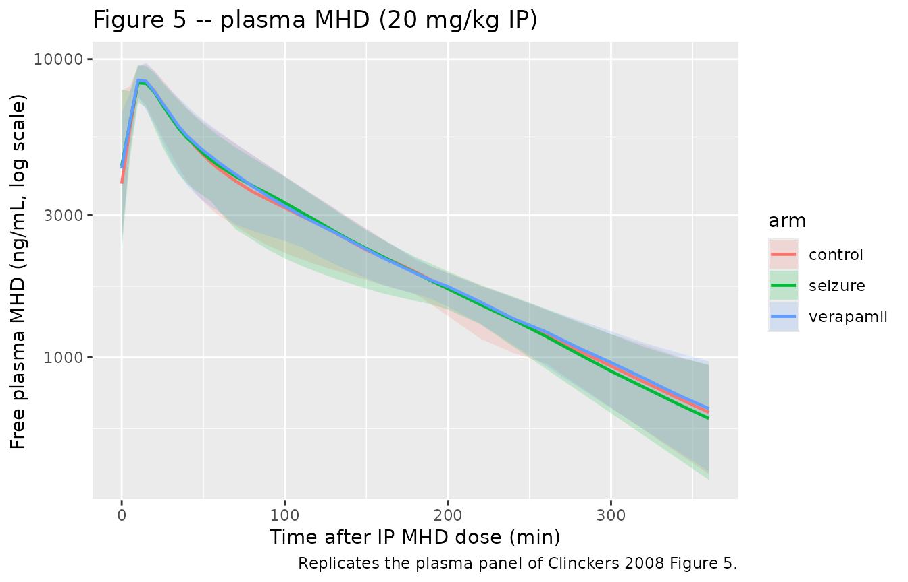
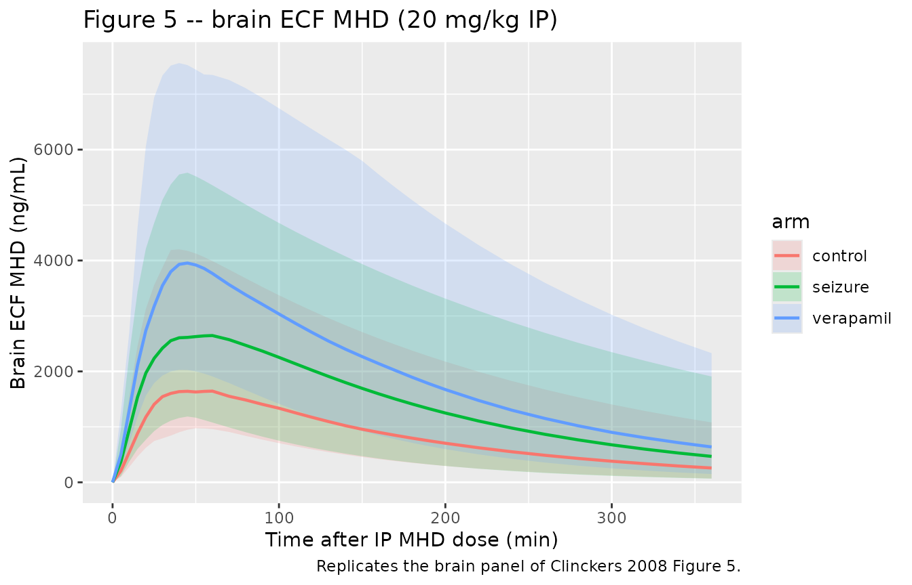
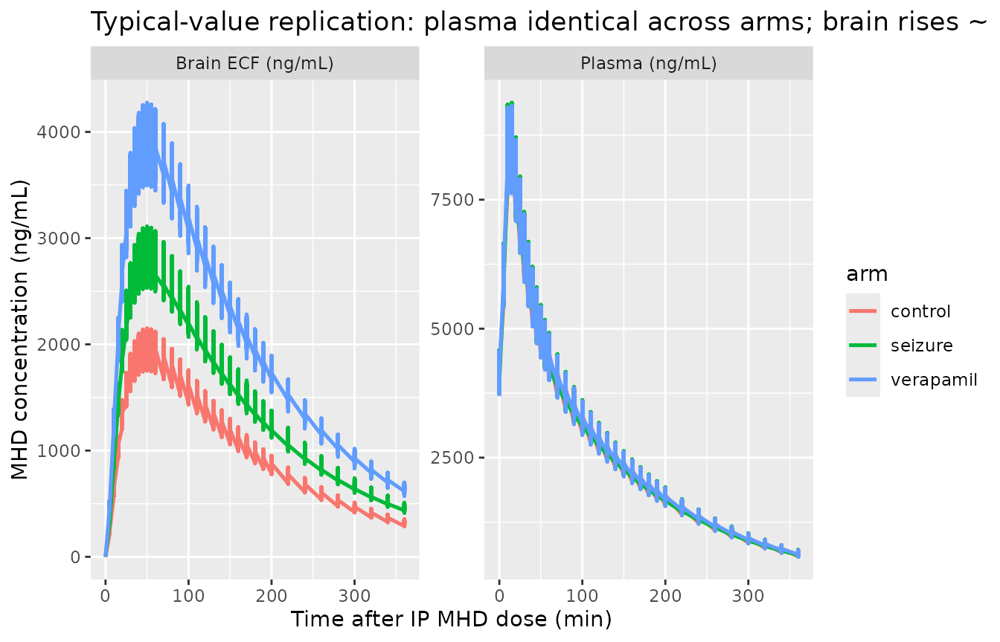

# MHD (oxcarbazepine metabolite) in rat plasma and brain (Clinckers 2008)

## Model and source

- Citation: Clinckers R, Smolders I, Michotte Y, Ebinger G, Danhof M,
  Voskuyl RA, Della Pasqua O. Impact of efflux transporters and of
  seizures on the pharmacokinetics of oxcarbazepine metabolite in the
  rat brain. Br J Pharmacol. 2008;155(7):1127-1138.
  <doi:10.1038/bjp.2008.366>
- Description: Preclinical (rat). Population PK model for
  10,11-dihydro-10-hydroxy- carbamazepine (MHD), the active metabolite
  of oxcarbazepine, in male Wistar rat plasma and hippocampal
  extracellular fluid (Clinckers 2008). One-compartment central
  disposition (V2) with combined zero-order (fraction F1 of dose over
  duration D2) and lagged first-order (1 - F1, ka with lag ALAG1)
  absorption after intraperitoneal bolus, coupled to a biophase / effect
  compartment (V3) reached via inter-compartmental rate constants k23
  and k32. Acute focal pilocarpine-induced seizure activity and local
  intrahippocampal verapamil (efflux-transporter blockade) each shrink
  the biophase volume (V3a -\> V3b under seizure; V3a -\> V3c under
  verapamil); plasma kinetics are unaffected.
- Article: <https://doi.org/10.1038/bjp.2008.366>

## Population

Clinckers et al. (2008) studied 32 male Wistar albino rats (Iffa Credo,
Brussels; 260-320 g) instrumented with a chronically implanted
hippocampal CMA/12 microdialysis cannula and an arterial cannula in the
right femoral artery, then allocated to one of three experimental
conditions:

- **control** – intrahippocampal vehicle perfusion (modified Ringer’s
  solution with the internal-reference standard mCBZ);
- **acute seizure** – intrahippocampal 10 mM pilocarpine perfused for 40
  min starting 30 min after the IP MHD dose, to evoke focal
  pilocarpine-induced limbic seizures during the modelled observation
  window;
- **efflux-transporter blockade** – continuous intrahippocampal 5 mM
  verapamil (P-glycoprotein / multidrug-transporter inhibitor)
  co-perfused at the brain probe, with the contralateral hippocampus
  serving as a paired non-blocked control via a dual-probe design.

Single intraperitoneal doses spanned 20, 40, 60, 80, 100, and 150 mg/kg
of MHD suspended in propylene glycol / ethanol / saline (6:2:2). The
20-60 mg/kg range is sub-therapeutic; 80-150 mg/kg fully blocks the
pilocarpine-induced seizures. Free plasma concentrations were obtained
from arterial blood by ultrafiltration (\>=96% recovery); brain
extracellular MHD concentrations were obtained from hippocampal
dialysates via the internal-reference (Larsson 1991 / Scheller and Kolb
1991) technique. Both matrices were quantified by LC-UV with a 5 ng/mL
lower limit of quantification (Clinckers 2008 Methods, “Animals” through
“Drug analysis”; Table 1).

The same information is available programmatically via
`readModelDb("Clinckers_2008_MHD_rat")$population`.

## Source trace

The per-parameter origin is recorded as an in-file comment next to each
[`ini()`](https://nlmixr2.github.io/rxode2/reference/ini.html) entry in
`inst/modeldb/specificDrugs/Clinckers_2008_MHD_rat.R`. The table below
collects the references for review.

| Equation / parameter | Value | Source location |
|----|----|----|
| ka (absorption rate) | 0.22 /min | Table 2 |
| k (elimination) | 0.0114 /min | Table 2 |
| k23 (central -\> biophase) | 0.0203 /min | Table 2 |
| k32 (biophase -\> central) | 0.0306 /min | Table 2 |
| V2 (central volume) | 484 mL = 0.484 L | Table 2 |
| V3a (biophase, control) | 813 mL = 0.813 L | Table 2 |
| V3b (biophase, seizure) | 563 mL = 0.563 L (P \< 0.05 vs V3a) | Table 2 |
| V3c (biophase, verapamil) | 407 mL = 0.407 L (P \< 0.05 vs V3a) | Table 2 |
| ALAG1 (first-order lag) | 3.23 min | Table 2 |
| F1 (zero-order fraction) | 0.347 | Table 2 |
| D2 (zero-order duration) | 12.6 min | Table 2 |
| WT (residual weighing factor) | 0.0782 | Table 2 |
| Inter-individual variance omega^2(k23) | 0.14 | Table 2 |
| omega^2(k32) | 0.153 | Table 2 |
| omega^2(V3a) | 0.078 | Table 2 |
| omega^2(V3c) | 0.0187 | Table 2 |
| omega^2(F1) | 0.0975 | Table 2 |
| omega^2(D2) | 0.0575 | Table 2 |
| Plasma residual: proportional sigma^2 | 0.0256 | Table 2 |
| Plasma residual: additive sigma^2 | 13.0 | Table 2 |
| Brain residual: proportional coefficient | 0.605 | Table 2 |
| Brain residual: additive coefficient (WT) | 0.0782 | Table 2 |
| Combined zero + first-order absorption equations | – | Results “Population PK model selection” (page 1132); Figure 3 schematic |
| Covariate equation for V3: P = theta \* A^thetaA \* B^thetaB (A/B flags) | – | Methods, Data analysis (equation block following “stepwise covariate inclusion”) |
| Residual error model (plasma combined prop + add) | – | Methods, Data analysis equation: C_obs = C_pred \* (1 + eps1) + eps2 |
| Residual error model (brain proportional with WT weighing factor) | – | Methods, Data analysis equation: W = sqrt(prop \* F^2 + WT), Y = F + W \* eps2 |

## Virtual cohort

Original animal-level data are not publicly available. The figures below
use a virtual cohort that mirrors the Clinckers 2008 design at the 20
mg/kg sub- therapeutic dose level (the dose for which the paper shows
the side-by-side control / seizure / verapamil comparison in Figure 5):

``` r

set.seed(20080366L) # bjp.2008.366

# Per-animal body weight in kg (uniform across the source 260-320 g window).
# Each rat is allocated to exactly one experimental condition.
n_per_arm <- 60L

make_arm <- function(n, arm_label, sza, ei, dose_mgkg, id_offset = 0L) {
  bw_kg <- runif(n, min = 0.260, max = 0.320)
  tibble(
    id            = id_offset + seq_len(n),
    arm           = arm_label,
    WT_kg         = bw_kg,
    SEIZURE_ACUTE = sza,
    EFFLUX_INHIB  = ei,
    dose_mg       = dose_mgkg * bw_kg
  )
}

cohort <- bind_rows(
  make_arm(n_per_arm, "control",   sza = 0, ei = 0, dose_mgkg = 20, id_offset =          0L),
  make_arm(n_per_arm, "seizure",   sza = 1, ei = 0, dose_mgkg = 20, id_offset =   n_per_arm),
  make_arm(n_per_arm, "verapamil", sza = 0, ei = 1, dose_mgkg = 20, id_offset = 2*n_per_arm)
)

# Build the event table. Each animal gets two simultaneous dose records at
# t = 0: one to depot (lagged first-order fraction 1 - F1) and one to central
# (zero-order fraction F1 over duration D2). The model's f(depot) / lag(depot)
# / f(central) / dur(central) handle the actual split.
sample_times <- c(seq(0, 60, by = 5), seq(70, 200, by = 10), seq(220, 360, by = 20))

events <- cohort |>
  group_by(id) |>
  reframe(
    arm           = arm,
    WT_kg         = WT_kg,
    SEIZURE_ACUTE = SEIZURE_ACUTE,
    EFFLUX_INHIB  = EFFLUX_INHIB,
    dose_mg       = dose_mg,
    rec = list(
      bind_rows(
        # depot dose (first-order portion)
        tibble(time = 0, evid = 1L, amt = unique(dose_mg), cmt = "depot",
               DV = NA_real_),
        # central dose (zero-order portion); rxode2 dur(central) applies
        tibble(time = 0, evid = 1L, amt = unique(dose_mg), cmt = "central",
               DV = NA_real_),
        # plasma observations (Cc)
        tibble(time = sample_times, evid = 0L, amt = NA_real_, cmt = "Cc",
               DV = NA_real_),
        # brain observations (Cbrain)
        tibble(time = sample_times, evid = 0L, amt = NA_real_, cmt = "Cbrain",
               DV = NA_real_)
      )
    )
  ) |>
  tidyr::unnest(rec)

# Sanity: ids are disjoint across arms.
stopifnot(!anyDuplicated(unique(cohort$id)))
```

## Simulation

``` r

mod <- readModelDb("Clinckers_2008_MHD_rat")

# Stochastic simulation (full IIV + residual error) for the VPC-style overlays.
sim <- rxode2::rxSolve(
  mod, events,
  keep = c("arm", "WT_kg", "SEIZURE_ACUTE", "EFFLUX_INHIB")
) |> as.data.frame()
#> ℹ parameter labels from comments will be replaced by 'label()'
```

For the typical-value replication of Figure 5, suppress between-subject
variability:

``` r

mod_typical <- mod |> rxode2::zeroRe()
#> ℹ parameter labels from comments will be replaced by 'label()'
sim_typical <- rxode2::rxSolve(
  mod_typical, events,
  keep = c("arm", "WT_kg", "SEIZURE_ACUTE", "EFFLUX_INHIB")
) |> as.data.frame()
#> ℹ omega/sigma items treated as zero: 'etalk23', 'etalk32', 'etalv3a', 'etalv3c', 'etalfr', 'etald2'
#> Warning: multi-subject simulation without without 'omega'
```

## Replicate published figures

``` r

# Replicates the plasma panel of Clinckers 2008 Figure 5: 20 mg/kg IP MHD,
# plasma free concentration vs time in control / seizure / verapamil arms.
plasma_vpc <- sim |>
  filter(!is.na(Cc)) |>
  group_by(time, arm) |>
  summarise(
    Q025 = quantile(Cc, 0.025, na.rm = TRUE),
    Q50  = quantile(Cc, 0.50,  na.rm = TRUE),
    Q975 = quantile(Cc, 0.975, na.rm = TRUE),
    .groups = "drop"
  )

ggplot(plasma_vpc, aes(time, Q50, color = arm, fill = arm)) +
  geom_ribbon(aes(ymin = Q025, ymax = Q975), alpha = 0.18, color = NA) +
  geom_line(linewidth = 0.8) +
  scale_y_log10() +
  labs(
    x = "Time after IP MHD dose (min)",
    y = "Free plasma MHD (ng/mL, log scale)",
    title = "Figure 5 -- plasma MHD (20 mg/kg IP)",
    caption = "Replicates the plasma panel of Clinckers 2008 Figure 5."
  )
```



``` r

# Replicates the brain panel of Clinckers 2008 Figure 5: hippocampal ECF MHD
# (microdialysis-derived) vs time. The seizure and verapamil arms should sit
# above the control arm because V3 shrinks (V3b ~ -30%, V3c ~ -50% vs V3a).
brain_vpc <- sim |>
  filter(!is.na(Cbrain)) |>
  group_by(time, arm) |>
  summarise(
    Q025 = quantile(Cbrain, 0.025, na.rm = TRUE),
    Q50  = quantile(Cbrain, 0.50,  na.rm = TRUE),
    Q975 = quantile(Cbrain, 0.975, na.rm = TRUE),
    .groups = "drop"
  )

ggplot(brain_vpc, aes(time, Q50, color = arm, fill = arm)) +
  geom_ribbon(aes(ymin = Q025, ymax = Q975), alpha = 0.18, color = NA) +
  geom_line(linewidth = 0.8) +
  labs(
    x = "Time after IP MHD dose (min)",
    y = "Brain ECF MHD (ng/mL)",
    title = "Figure 5 -- brain ECF MHD (20 mg/kg IP)",
    caption = "Replicates the brain panel of Clinckers 2008 Figure 5."
  )
```



``` r

# Typical-value (zero-eta, zero-residual) overlay showing that plasma kinetics
# do NOT change with experimental condition (the central panel of the paper's
# narrative: 'no significant effect of treatment was observed on the remaining
# model parameters'), while brain kinetics scale ~ 1/V3 across conditions.
typical_long <- sim_typical |>
  pivot_longer(c(Cc, Cbrain), names_to = "matrix", values_to = "conc") |>
  filter(!is.na(conc))

ggplot(typical_long, aes(time, conc, color = arm)) +
  geom_line(linewidth = 0.9) +
  facet_wrap(~matrix, scales = "free_y",
             labeller = labeller(matrix = c(Cc = "Plasma (ng/mL)",
                                            Cbrain = "Brain ECF (ng/mL)"))) +
  labs(
    x = "Time after IP MHD dose (min)",
    y = "MHD concentration (ng/mL)",
    title = "Typical-value replication: plasma identical across arms; brain rises ~ 1/V3"
  )
```



## PKNCA validation

PKNCA is run on the stochastic simulation, one block per output (plasma
`Cc` and brain `Cbrain`). Each PKNCA formula stratifies by experimental
arm so the condition-specific NCA can be compared against the paper’s
narrative on biophase exposure changes.

``` r

# rxode2 returns Cc and Cbrain on every observation row, regardless of which
# cmt the row requested; deduplicate so PKNCA sees one (id, time) row per arm.
plasma_nca <- sim |>
  filter(!is.na(Cc)) |>
  distinct(id, time, .keep_all = TRUE) |>
  select(id, time, Cc, arm)

dose_df <- events |>
  filter(evid == 1, cmt == "depot") |>
  select(id, time, amt, arm)

conc_obj <- PKNCA::PKNCAconc(plasma_nca, Cc ~ time | arm + id)
dose_obj <- PKNCA::PKNCAdose(dose_df, amt ~ time | arm + id)

intervals <- data.frame(
  start       = 0,
  end         = Inf,
  cmax        = TRUE,
  tmax        = TRUE,
  aucinf.obs  = TRUE,
  half.life   = TRUE
)

nca_plasma <- PKNCA::pk.nca(
  PKNCA::PKNCAdata(conc_obj, dose_obj, intervals = intervals)
)
#>  ■■■■■■■■■■■■■                     41% |  ETA:  3s

plasma_summary <- as.data.frame(nca_plasma$result) |>
  filter(PPTESTCD %in% c("cmax", "tmax", "aucinf.obs", "half.life")) |>
  group_by(arm, PPTESTCD) |>
  summarise(
    median_value = median(PPORRES, na.rm = TRUE),
    .groups = "drop"
  ) |>
  tidyr::pivot_wider(names_from = PPTESTCD, values_from = median_value)

knitr::kable(
  plasma_summary,
  caption = "Plasma PKNCA medians at 20 mg/kg IP, by experimental arm. Units: Cmax ng/mL, Tmax min, AUCinf.obs ng/mL*min, t1/2 min."
)
```

| arm       | aucinf.obs |     cmax | half.life | tmax |
|:----------|-----------:|---------:|----------:|-----:|
| control   |    1051666 | 8455.082 |  114.2046 |   15 |
| seizure   |    1048096 | 8429.565 |  111.6625 |   10 |
| verapamil |    1056769 | 8526.755 |  112.0767 |   10 |

Plasma PKNCA medians at 20 mg/kg IP, by experimental arm. Units: Cmax
ng/mL, Tmax min, AUCinf.obs ng/mL\*min, t1/2 min. {.table}

``` r

brain_nca <- sim |>
  filter(!is.na(Cbrain)) |>
  distinct(id, time, .keep_all = TRUE) |>
  select(id, time, Cbrain, arm) |>
  rename(Cc = Cbrain) # PKNCA needs the same conc name; rename in this block

conc_obj_b <- PKNCA::PKNCAconc(brain_nca, Cc ~ time | arm + id)

nca_brain <- PKNCA::pk.nca(
  PKNCA::PKNCAdata(conc_obj_b, dose_obj, intervals = intervals)
)
#>  ■■■■■■■■■■■■■■■■■■■■■■■           72% |  ETA:  1s

brain_summary <- as.data.frame(nca_brain$result) |>
  filter(PPTESTCD %in% c("cmax", "tmax", "aucinf.obs", "half.life")) |>
  group_by(arm, PPTESTCD) |>
  summarise(
    median_value = median(PPORRES, na.rm = TRUE),
    .groups = "drop"
  ) |>
  tidyr::pivot_wider(names_from = PPTESTCD, values_from = median_value)

knitr::kable(
  brain_summary,
  caption = "Brain ECF PKNCA medians at 20 mg/kg IP, by experimental arm."
)
```

| arm       | aucinf.obs |     cmax | half.life | tmax |
|:----------|-----------:|---------:|----------:|-----:|
| control   |   458806.3 | 1914.443 |  115.5705 |   50 |
| seizure   |   600212.2 | 2772.538 |  113.0780 |   50 |
| verapamil |   880581.3 | 4148.356 |  113.3982 |   50 |

Brain ECF PKNCA medians at 20 mg/kg IP, by experimental arm. {.table}

### Comparison against the published narrative

Clinckers 2008 does not tabulate per-arm NCA parameters explicitly; the
paper’s quantitative claims are (Results, “Population PK model
selection”):

- Plasma kinetics are **unchanged** across arms. In the table above the
  plasma `Cmax` and `AUCinf.obs` should be effectively identical across
  `control`, `seizure`, and `verapamil` (a small Monte-Carlo jitter from
  the residual error simulation is expected).

- Brain exposure rises with seizure activity (“`V3b` decreased by about
  30%”) and rises further with verapamil (“`V3c` decreased by about
  50%”). At quasi-steady state in the biophase the concentration scales
  as ~ 1 / V3, so the table above should show roughly brain
  Cmax(seizure) / Cmax(control) ~ 813 / 563 = 1.44 and brain
  Cmax(verapamil) / Cmax(control) ~ 813 / 407 = 2.00.

## Assumptions and deviations

- **Rate-constant parameterisation preserved from the source.** The
  Clinckers 2008 NONMEM ADVAN6 model parameterises in rate constants
  (`k`, `k23`, `k32`) rather than the nlmixr2lib-canonical CL / Q
  parameterisation. Because the biophase distribution has asymmetric
  inter-compartmental rates (`k23 != k32`) and three condition-specific
  biophase volumes (`V3a`, `V3b`, `V3c`), there is no single equivalent
  `Q` that captures the paper’s structure. The non-canonical
  log-parameter names (`lkel`, `lk23`, `lk32`, `lv3a`, `lv3b`, `lv3c`,
  `lalag`, `lfr`, `ld2`) reproduce the paper’s THETA values 1:1 at the
  cost of
  [`checkModelConventions()`](https://nlmixr2.github.io/nlmixr2lib/reference/checkModelConventions.md)
  flagging them as outside the canonical `lcl` / `lq` / `lvp` set.

- **Brain residual encoding.** The paper’s brain residual is a
  proportional error with an additive weighing factor written in NONMEM
  W-variable form (`W = sqrt(THETA_prop * F^2 + THETA_WT)`, with the
  proportional coefficient reported as `0.605` and the additive `WT`
  coefficient as `0.0782` in Table 2). Algebraically this is equivalent
  to a standard combined proportional + additive error on the brain
  output:

  - `propSd_Cbrain = sqrt(0.605) = 0.778` (77.8% CV) on the proportional
    component;
  - `addSd_Cbrain = sqrt(0.0782) = 0.280` ng/mL on the additive
    component.

  Bootstrap CV% of these two terms is large (101.3% and 122.3%
  respectively), consistent with the paper noting that `WT` was the only
  structural parameter not estimated with CV% \< 15% (at 59.6%).

- **Plasma residual encoding.** Table 2 reports SIGMA-style variances
  for the plasma proportional (`0.0256`) and additive (`13.0`)
  components. These convert to standard deviations via `sqrt`:
  `propSd = sqrt(0.0256) = 0.160` (16% CV) and
  `addSd = sqrt(13.0) = 3.606` ng/mL.

- **Covariate encoding (A / B -\> SEIZURE_ACUTE / EFFLUX_INHIB).** The
  paper uses two flags `A` and `B` where `A = B = 1` is control, `A = 0`
  flags seizing animals, and `B = 0` flags verapamil animals. The
  canonical covariates in `inst/references/covariate-columns.md`
  (`SEIZURE_ACUTE`, `EFFLUX_INHIB`) flip this polarity so that `1`
  always means “the experimental condition is active.” Data assemblers
  translating from the source dataset should set `SEIZURE_ACUTE = 1 - A`
  and `EFFLUX_INHIB = 1 - B`.

- **IIV allocation per experimental condition.** The paper reports an
  `omega^2` for `V3a` (control / shared with seizure arm in the original
  fit) and a separate `omega^2` for `V3c` (verapamil), but no `omega^2`
  for `V3b` (seizure). In the model file each rat is allocated to
  exactly one arm, so the three per-condition V3 components are computed
  on separate lines (`v3a`, `v3b`, `v3c`) and the mutually-exclusive
  switch on `SEIZURE_ACUTE` / `EFFLUX_INHIB` selects the relevant one.
  The seizure arm carries `etalv3a` (the IIV the paper reports for
  control + seizure pooled) implicitly because the seizure V3b in this
  implementation has no IIV slot; this matches the paper’s Table 2
  footnote that `V3b` was not reported with a separate variance term.

- **Parallel absorption encoding requires two simultaneous dose
  records.** The IP bolus is split between (a) a lagged first-order
  portion (fraction `1 - F1`, delivered via `depot` with
  `lag(depot) = ALAG1` and rate `ka`) and (b) a zero-order portion
  (fraction `F1`, delivered as a `dur(central) = D2`-minute infusion
  directly into `central`). The user data must therefore supply two
  `evid = 1` rows per dose event, one to `depot` and one to `central`,
  both with the full IP `amt`; the model’s `f(depot) = 1 - fr` and
  `f(central) = fr` perform the actual fractional split. The vignette’s
  cohort chunk shows the pattern.

- **Pilocarpine-induced seizures are modeled as a time-fixed
  indicator.** The source paper’s seizures are induced 30 minutes after
  the IP MHD dose by intrahippocampal pilocarpine perfusion and subside
  towards the end of sampling, so the paper’s “A” flag is in principle a
  time-varying covariate over the seizure interval. The model file
  treats `SEIZURE_ACUTE` as time-fixed per animal (matching the original
  per-condition NONMEM allocation). Users who need to gate the seizure
  effect to a specific time window can supply a time-varying
  `SEIZURE_ACUTE` column in the event table without changing the model
  code.

- **Single-arm verapamil cohort, paired dual-probe design.** The paper’s
  verapamil arm uses a dual-probe design where the same rat has a
  verapamil- perfused ipsilateral hippocampus and a vehicle-perfused
  contralateral hippocampus. In the present implementation the
  contralateral control side is not separately tracked; each rat in the
  virtual cohort is treated as receiving the verapamil condition
  uniformly.

## References

- Clinckers R, Smolders I, Michotte Y, Ebinger G, Danhof M, Voskuyl RA,
  Della Pasqua O. Impact of efflux transporters and of seizures on the
  pharmacokinetics of oxcarbazepine metabolite in the rat brain. Br J
  Pharmacol. 2008;155(7):1127-1138. <doi:10.1038/bjp.2008.366>
