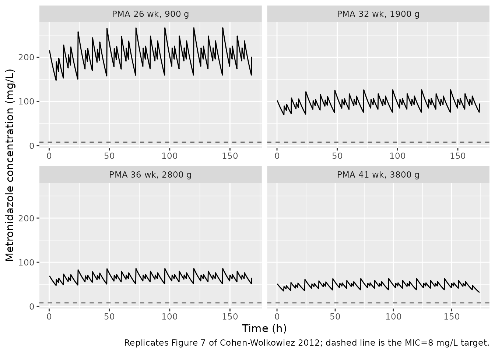
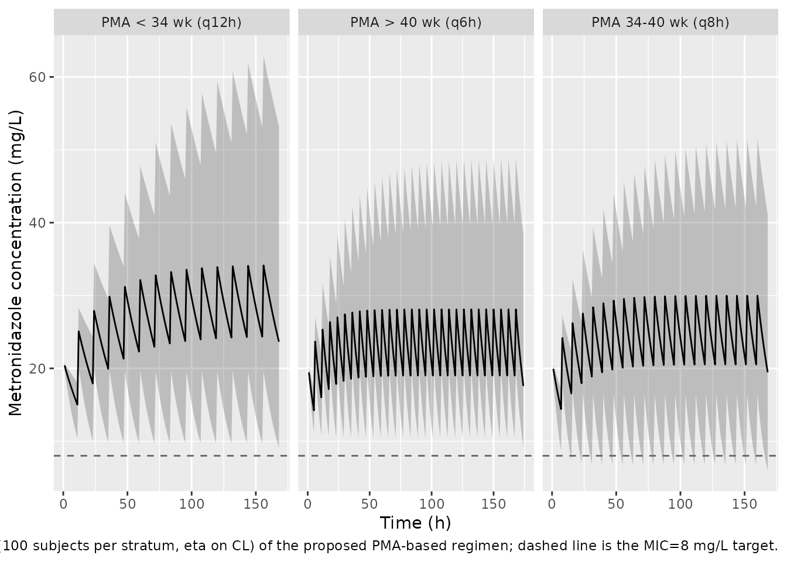

# Metronidazole (Cohen-Wolkowiez 2012)

## Model and source

- Citation: Cohen-Wolkowiez M, Ouellet D, Smith PB, et al. Population
  pharmacokinetics of metronidazole evaluated using scavenged samples
  from preterm infants. Antimicrob Agents Chemother.
  2012;56(4):1828-1837. <doi:10.1128/AAC.06071-11>
- Description: One-compartment IV population PK model for metronidazole
  in preterm infants (Cohen-Wolkowiez 2012). Clearance scales linearly
  with body weight (reference 1.5 kg) and as a power function of
  postmenstrual age (reference 32 weeks); central volume scales linearly
  with body weight.
- Article: <https://doi.org/10.1128/AAC.06071-11>

## Population

The model was built from a 5-center prospective open-label PK study (the
Antimicrobial PK in High-Risk Infants trial, sponsored by the Pediatric
Pharmacology Research Unit). Thirty-three subjects were enrolled and 32
were included in the analysis after one subject was excluded for
during-infusion-only sampling; one further subject was excluded from the
PK data set due to outlier-related issues, leaving 32 subjects with 116
plasma metronidazole concentrations used in the model build. Cohort
demographics (Cohen-Wolkowiez 2012 Tables 1 and 2):

- Gestational age at birth: median 27 weeks (range 22-32).
- Postnatal age: median 41 days (range 0-97).
- Postmenstrual age: median 32 weeks (range 24-43).
- Weight: median 1495 g (range 678-3850 g).
- Sex: 17 of 32 (53 percent) female.
- Race: 16 of 32 (50 percent) White; 4 of 32 (9 percent recorded as
  Hispanic ethnicity).
- Serum creatinine: median 0.5 mg/dL (range 0.1-4.7).
- Metronidazole dose: median 8 mg/kg (range 4-15) given as an
  intravenous infusion at clinician-prescribed intervals (median 12 h,
  range 5.9-48 h).

Of the 116 concentrations used in the analysis, 104 (90 percent) were
scavenged from discarded clinical specimens and 12 were obtained from
study-specific timed blood draws. The same information is available
programmatically via the model’s `population` metadata
(`readModelDb("CohenWolkowiez_2012_metronidazole")$population`).

## Source trace

The per-parameter origin is recorded as an in-file comment next to each
`ini()` entry in
`inst/modeldb/specificDrugs/CohenWolkowiez_2012_metronidazole.R`. The
table below collects them in one place for review.

| Equation / parameter | Value | Source location |
|----|----|----|
| Structural model: 1-compartment IV | n/a | Results, “Population PK model building”; Table 3 final-model row |
| `lcl = log(0.0397)` (theta_CL, L/h) | 0.0397 | Table 4, “CL (liters/h)” (RSE 10.9 percent) |
| `lvc = log(1.07)` (theta_V, L) | 1.07 | Table 4, “V (liters)” (RSE 15.0 percent) |
| `e_wt_cl = fixed(1)` | 1 | Table 3 final-model row: linear `(wt/1.5)` scaling; estimated body-size exponent excluded for lack of fit improvement (Results) |
| `e_wt_vc = fixed(1)` | 1 | Table 3 final-model row: linear `(wt/1.5)` scaling on V |
| `e_page_cl = 2.49` (theta_CL-PMA) | 2.49 | Table 4, “CL,PMA” (RSE 29.8 percent) |
| `etalcl` variance 0.16608 | omega^2 = log(1 + 0.425^2) | Table 4, “Interindividual variance CL (CV%) = 42.5” (RSE 28.5 percent) |
| `propSd = 0.135` | 13.5 CV percent | Table 4, “Residual variance (CV%) Blood draws sigma_1^2 = 13.5” (RSE 24.5 percent) |
| `d/dt(central) = -kel * central` | n/a | Results, “Population PK model building”: 1-compartment model |
| Concentration `Cc = central / vc` | n/a | 1-compartment IV; observation is plasma metronidazole concentration |

## Virtual cohort

Original observed concentrations are not publicly available. The
simulations below use virtual cohorts whose covariate distributions
approximate the published trial demographics. We build one cohort per
PMA stratum, matching the published BGA-group structure in Table 2.

``` r

set.seed(1128)

# Helper: build one cohort as a self-contained event table.
# - dose_mg_per_kg sets the maintenance dose; loading_mg_per_kg sets the
#   first-dose loading amount (set to NA for no loading dose).
# - tau_h is the dosing interval used by the PMA-based regimen.
# - WT (kg) and PAGE (months) are drawn from a per-stratum truncated
#   uniform on the published PMA week range; weight covers each
#   stratum's reported weight range.
# - id_offset shifts subject IDs so multiple cohorts stay disjoint.
make_cohort <- function(n, pma_week_lo, pma_week_hi,
                        wt_kg_lo, wt_kg_hi,
                        dose_mg_per_kg, loading_mg_per_kg,
                        tau_h, n_doses, obs_every_h,
                        treatment, id_offset = 0L) {
  ids <- id_offset + seq_len(n)
  wt   <- runif(n, wt_kg_lo, wt_kg_hi)
  pma_weeks <- runif(n, pma_week_lo, pma_week_hi)
  page <- pma_weeks / 4.35

  subj <- tibble::tibble(
    id        = ids,
    WT        = wt,
    PAGE      = page,
    treatment = treatment
  )

  loading_amt <- subj$WT * loading_mg_per_kg
  maint_amt   <- subj$WT * dose_mg_per_kg

  load_rows <- tibble::tibble(
    id        = subj$id,
    time      = 0,
    amt       = loading_amt,
    evid      = 1L,
    cmt       = "central",
    WT        = subj$WT,
    PAGE      = subj$PAGE,
    treatment = subj$treatment
  )

  maint_times <- seq(tau_h, by = tau_h, length.out = n_doses - 1L)
  maint_rows <- tibble::tibble(
    id        = rep(subj$id, each = length(maint_times)),
    time      = rep(maint_times, times = n),
    amt       = rep(maint_amt,   each = length(maint_times)),
    evid      = 1L,
    cmt       = "central",
    WT        = rep(subj$WT,  each = length(maint_times)),
    PAGE      = rep(subj$PAGE, each = length(maint_times)),
    treatment = rep(subj$treatment, each = length(maint_times))
  )

  end_time <- tau_h * n_doses
  obs_times <- seq(0, end_time, by = obs_every_h)
  obs_rows <- tibble::tibble(
    id        = rep(subj$id, each = length(obs_times)),
    time      = rep(obs_times, times = n),
    amt       = NA_real_,
    evid      = 0L,
    cmt       = "central",
    WT        = rep(subj$WT,  each = length(obs_times)),
    PAGE      = rep(subj$PAGE, each = length(obs_times)),
    treatment = rep(subj$treatment, each = length(obs_times))
  )

  dplyr::bind_rows(load_rows, maint_rows, obs_rows) |>
    dplyr::arrange(id, time, dplyr::desc(evid)) |>
    as.data.frame()
}

# Published PMA-based dosing regimen (Cohen-Wolkowiez 2012 Table 1):
# 15 mg/kg loading, then 7.5 mg/kg every 12 h (PMA < 34 wk) / 8 h (34-40 wk) / 6 h (> 40 wk).
events <- dplyr::bind_rows(
  make_cohort(n = 100, pma_week_lo = 24, pma_week_hi = 29,
              wt_kg_lo = 0.7, wt_kg_hi = 1.5,
              dose_mg_per_kg = 7.5, loading_mg_per_kg = 15,
              tau_h = 12, n_doses = 14L, obs_every_h = 1,
              treatment = "PMA < 34 wk (q12h)", id_offset =   0L),
  make_cohort(n = 100, pma_week_lo = 30, pma_week_hi = 33,
              wt_kg_lo = 1.2, wt_kg_hi = 2.5,
              dose_mg_per_kg = 7.5, loading_mg_per_kg = 15,
              tau_h = 12, n_doses = 14L, obs_every_h = 1,
              treatment = "PMA < 34 wk (q12h)", id_offset = 100L),
  make_cohort(n = 100, pma_week_lo = 34, pma_week_hi = 40,
              wt_kg_lo = 1.8, wt_kg_hi = 3.5,
              dose_mg_per_kg = 7.5, loading_mg_per_kg = 15,
              tau_h = 8,  n_doses = 21L, obs_every_h = 1,
              treatment = "PMA 34-40 wk (q8h)", id_offset = 200L),
  make_cohort(n = 100, pma_week_lo = 41, pma_week_hi = 43,
              wt_kg_lo = 2.5, wt_kg_hi = 3.9,
              dose_mg_per_kg = 7.5, loading_mg_per_kg = 15,
              tau_h = 6,  n_doses = 29L, obs_every_h = 1,
              treatment = "PMA > 40 wk (q6h)", id_offset = 300L)
)

stopifnot(!anyDuplicated(unique(events[, c("id", "time", "evid")])))
```

## Simulation

``` r

mod <- readModelDb("CohenWolkowiez_2012_metronidazole")

sim <- rxode2::rxSolve(
  mod,
  events = events,
  keep   = c("treatment", "WT", "PAGE")
) |>
  as.data.frame() |>
  dplyr::filter(time > 0)
#> ℹ parameter labels from comments will be replaced by 'label()'
```

## Replicate published figures

### Figure 7-style simulated time-concentration profiles in typical subjects

Cohen-Wolkowiez 2012 Figure 7 shows simulated time-concentration
profiles for four typical subjects (PMA 26, 32, 36, 41 weeks; weights
900, 1900, 2800, 3800 g) receiving the proposed PMA-based dosing
regimen. We reproduce the figure with
[`rxode2::zeroRe()`](https://nlmixr2.github.io/rxode2/reference/zeroRe.html)
to remove between-subject variability:

``` r

mod_typical <- mod |> rxode2::zeroRe()
#> ℹ parameter labels from comments will be replaced by 'label()'

typical_specs <- tibble::tibble(
  treatment = c("PMA 26 wk, 900 g",
                "PMA 32 wk, 1900 g",
                "PMA 36 wk, 2800 g",
                "PMA 41 wk, 3800 g"),
  pma_weeks = c(26, 32, 36, 41),
  wt_kg     = c(0.9, 1.9, 2.8, 3.8),
  tau_h     = c(12,  12,  8,   6),
  n_doses   = c(14L, 14L, 21L, 29L)
)

build_typical <- function(spec) {
  page <- spec$pma_weeks / 4.35
  load_amt  <- spec$wt_kg * 15
  maint_amt <- spec$wt_kg * 7.5
  maint_times <- seq(spec$tau_h, by = spec$tau_h, length.out = spec$n_doses - 1L)
  obs_times   <- seq(0, spec$tau_h * spec$n_doses, by = 0.25)
  data.frame(
    id        = 1L,
    time      = c(0, maint_times, obs_times),
    amt       = c(load_amt, rep(maint_amt, length(maint_times)),
                  rep(NA_real_, length(obs_times))),
    evid      = c(1L, rep(1L, length(maint_times)),
                  rep(0L, length(obs_times))),
    cmt       = "central",
    WT        = spec$wt_kg,
    PAGE      = page,
    treatment = spec$treatment
  )
}

typical_events <- do.call(rbind, lapply(seq_len(nrow(typical_specs)),
                                        function(i) build_typical(typical_specs[i, ])))

sim_typical <- rxode2::rxSolve(
  mod_typical,
  events = typical_events,
  keep   = c("treatment")
) |>
  as.data.frame() |>
  dplyr::filter(time > 0)
#> ℹ omega/sigma items treated as zero: 'etalcl'

ggplot(sim_typical, aes(time, Cc)) +
  geom_line() +
  geom_hline(yintercept = 8, linetype = "dashed", colour = "grey40") +
  facet_wrap(~ factor(treatment, levels = typical_specs$treatment), scales = "free_x") +
  labs(x = "Time (h)", y = "Metronidazole concentration (mg/L)",
       caption = "Replicates Figure 7 of Cohen-Wolkowiez 2012; dashed line is the MIC=8 mg/L target.")
```



### VPC of the PMA-based regimen

``` r

sim |>
  dplyr::group_by(time, treatment) |>
  dplyr::summarise(
    Q05 = quantile(Cc, 0.05, na.rm = TRUE),
    Q50 = quantile(Cc, 0.50, na.rm = TRUE),
    Q95 = quantile(Cc, 0.95, na.rm = TRUE),
    .groups = "drop"
  ) |>
  ggplot(aes(time, Q50)) +
  geom_ribbon(aes(ymin = Q05, ymax = Q95), alpha = 0.25) +
  geom_line() +
  geom_hline(yintercept = 8, linetype = "dashed", colour = "grey40") +
  facet_wrap(~ treatment, scales = "free_x") +
  labs(x = "Time (h)", y = "Metronidazole concentration (mg/L)",
       caption = "Stochastic simulation (100 subjects per stratum, eta on CL) of the proposed PMA-based regimen; dashed line is the MIC=8 mg/L target.")
```



## PKNCA validation

PKNCA is used to compute Cmax, Cmin, AUC over the last dosing interval,
and apparent half-life on the simulated cohort. The terminal dosing
interval is selected per treatment so steady state is approached.

``` r

last_interval <- sim |>
  dplyr::group_by(treatment) |>
  dplyr::summarise(
    end_time = max(time),
    tau      = dplyr::case_when(
      treatment[1] == "PMA < 34 wk (q12h)" ~ 12,
      treatment[1] == "PMA 34-40 wk (q8h)" ~ 8,
      treatment[1] == "PMA > 40 wk (q6h)"  ~ 6
    ),
    .groups = "drop"
  ) |>
  dplyr::mutate(
    start_ss = end_time - tau,
    end_ss   = end_time
  )

sim_nca <- sim |>
  dplyr::filter(!is.na(Cc)) |>
  dplyr::select(id, time, Cc, treatment) |>
  as.data.frame()

dose_df <- events |>
  dplyr::filter(evid == 1) |>
  dplyr::select(id, time, amt, treatment) |>
  as.data.frame()

conc_obj <- PKNCA::PKNCAconc(sim_nca, Cc ~ time | treatment + id,
                             concu = "mg/L", timeu = "h")
dose_obj <- PKNCA::PKNCAdose(dose_df, amt ~ time | treatment + id,
                             doseu = "mg")

# Steady-state interval per treatment (last dosing interval).
intervals_ss <- dose_df |>
  dplyr::group_by(treatment, id) |>
  dplyr::summarise(start = max(time), .groups = "drop") |>
  dplyr::left_join(last_interval |> dplyr::select(treatment, tau),
                   by = "treatment") |>
  dplyr::mutate(end = start + tau,
                cmax = TRUE, cmin = TRUE,
                auclast = TRUE, cav = TRUE) |>
  dplyr::select(-tau) |>
  as.data.frame()

# Terminal half-life on the post-final-dose decay phase.
intervals_thalf <- dose_df |>
  dplyr::group_by(treatment, id) |>
  dplyr::summarise(start = max(time), .groups = "drop") |>
  dplyr::mutate(end = Inf, half.life = TRUE) |>
  as.data.frame()

intervals <- dplyr::bind_rows(intervals_ss, intervals_thalf) |>
  dplyr::mutate(
    cmax      = !is.na(cmax)      & cmax,
    cmin      = !is.na(cmin)      & cmin,
    auclast   = !is.na(auclast)   & auclast,
    cav       = !is.na(cav)       & cav,
    half.life = !is.na(half.life) & half.life
  )

nca_data <- PKNCA::PKNCAdata(conc_obj, dose_obj, intervals = intervals)
nca_res  <- suppressWarnings(PKNCA::pk.nca(nca_data))

res_tbl <- as.data.frame(nca_res$result)
```

### Comparison against published half-life (Table 5)

Cohen-Wolkowiez 2012 Table 5 reports median individual empirical
Bayesian half-life by gestational-age-at-birth group: 20.5 h (less-than
26 weeks), 18.6 h (26-29 weeks), 16.7 h (30-32 weeks), 19.1 h overall.
The simulated half-life from the packaged model is below; differences
are driven by the BGA-to-PMA mapping in the virtual cohorts and by the
different stratification axis (PMA vs BGA), so a one-to-one match is not
expected.

``` r

half_life_simulated <- res_tbl |>
  dplyr::filter(PPTESTCD == "half.life") |>
  dplyr::group_by(treatment) |>
  dplyr::summarise(
    median_thalf_h = median(PPORRES, na.rm = TRUE),
    q05_thalf_h    = quantile(PPORRES, 0.05, na.rm = TRUE),
    q95_thalf_h    = quantile(PPORRES, 0.95, na.rm = TRUE),
    .groups = "drop"
  )

knitr::kable(half_life_simulated, digits = 2,
             caption = "Simulated terminal half-life by PMA stratum (median, 5th, 95th percentile across 100 virtual subjects per stratum). Published reference: Table 5 of Cohen-Wolkowiez 2012 reports 16.7-20.5 h across BGA strata.")
```

| treatment           | median_thalf_h | q05_thalf_h | q95_thalf_h |
|:--------------------|---------------:|------------:|------------:|
| PMA 34-40 wk (q8h)  |          12.84 |        5.46 |       24.47 |
| PMA \< 34 wk (q12h) |          22.68 |       10.83 |       49.74 |
| PMA \> 40 wk (q6h)  |           8.87 |        5.47 |       17.15 |

Simulated terminal half-life by PMA stratum (median, 5th, 95th
percentile across 100 virtual subjects per stratum). Published
reference: Table 5 of Cohen-Wolkowiez 2012 reports 16.7-20.5 h across
BGA strata. {.table}

### Steady-state Cmax / Cmin / Cavg by PMA stratum

``` r

ss_nca <- res_tbl |>
  dplyr::filter(PPTESTCD %in% c("cmax", "cmin", "auclast", "cav")) |>
  dplyr::group_by(treatment, PPTESTCD) |>
  dplyr::summarise(
    median = median(PPORRES, na.rm = TRUE),
    q05    = quantile(PPORRES, 0.05, na.rm = TRUE),
    q95    = quantile(PPORRES, 0.95, na.rm = TRUE),
    .groups = "drop"
  ) |>
  dplyr::mutate(PPTESTCD = factor(PPTESTCD, levels = c("cmax", "cmin", "cav", "auclast")))

knitr::kable(ss_nca, digits = 2,
             caption = "Simulated steady-state NCA parameters (Cmax, Cmin, Cavg, AUClast) over the last dosing interval. Units: concentrations in mg/L; AUC in mg*h/L.")
```

| treatment           | PPTESTCD | median |    q05 |    q95 |
|:--------------------|:---------|-------:|-------:|-------:|
| PMA 34-40 wk (q8h)  | auclast  | 194.69 |  82.77 | 368.78 |
| PMA 34-40 wk (q8h)  | cav      |  24.34 |  10.35 |  46.10 |
| PMA 34-40 wk (q8h)  | cmax     |  29.97 |  16.48 |  51.52 |
| PMA 34-40 wk (q8h)  | cmin     |  19.46 |   5.97 |  41.07 |
| PMA \< 34 wk (q12h) | auclast  | 342.84 | 164.32 | 694.98 |
| PMA \< 34 wk (q12h) | cav      |  28.57 |  13.69 |  57.92 |
| PMA \< 34 wk (q12h) | cmax     |  34.13 |  19.62 |  62.89 |
| PMA \< 34 wk (q12h) | cmin     |  23.65 |   9.10 |  53.21 |
| PMA \> 40 wk (q6h)  | auclast  | 134.60 |  83.04 | 260.01 |
| PMA \> 40 wk (q6h)  | cav      |  22.43 |  13.84 |  43.34 |
| PMA \> 40 wk (q6h)  | cmax     |  28.10 |  19.76 |  48.80 |
| PMA \> 40 wk (q6h)  | cmin     |  17.58 |   9.24 |  38.29 |

Simulated steady-state NCA parameters (Cmax, Cmin, Cavg, AUClast) over
the last dosing interval. Units: concentrations in mg/L; AUC in mg\*h/L.
{.table}

Predicted steady-state trough concentrations (`cmin`) at the proposed
PMA-based regimen are well above the MIC=8 mg/L target across strata,
consistent with the paper’s reported greater-than-90 percent target
attainment in simulated subjects (Figure 5C and Figure 6).

## Assumptions and deviations

- **Scavenged-sample bias term omitted.** The published final model
  (Cohen-Wolkowiez 2012 Table 4) reports a multiplicative scavenged-
  sample bias factor `theta_SCAV = 0.713` (95 percent CI 0.581-0.899),
  representing a 30 percent underestimation of metronidazole
  concentrations in scavenged versus blood-draw samples, plus an
  elevated proportional residual error for scavenged samples (29.0 CV
  percent vs 13.5 CV percent for blood draws). These are artifacts of
  the scavenged sampling design (delayed centrifugation, uncertain
  documentation, sample-handling variability) rather than features of
  the underlying drug PK. The packaged model retains only the blood-draw
  residual error (`propSd = 0.135`) so that simulations represent the
  true drug concentration time-course; downstream users who explicitly
  want to simulate a scavenged-sample mixture can apply
  `theta_SCAV * Cc` and the elevated 29 percent CV residual outside the
  packaged model. The omitted parameters are recorded in
  `covariatesDataExcluded$SCAV` of the model file.
- **Univariable serum-creatinine effect omitted.** Cohen-Wolkowiez 2012
  Table 3 reports a `(0.5/SCR)^theta_CL_SCR` effect on CL in the
  univariable step (OFV drop 14.3), but the final multivariable model
  excluded it because (i) the association was driven by a single outlier
  with SCR=4.7 mg/dL, and (ii) SCR is strongly correlated with PMA in
  preterm infants and did not improve fit beyond PMA. The packaged model
  follows the published final model and excludes SCR.
- **PNA / BGA covariate effects omitted.** Both were screened
  univariably and excluded from the final model in favor of PMA.
- **PMA versus PAGE units.** The paper uses postmenstrual age in weeks
  with a 32-week reference; the nlmixr2lib canonical covariate `PAGE` is
  in months. The model reparameterises internally as
  `(PAGE * 4.35 / 32)^theta_CL_PMA` so the published 32-week reference
  is preserved without changing the canonical covariate unit.
- **Allometric body-size scaling.** Both CL and V scale linearly with
  body weight at the reference 1.5 kg (Cohen-Wolkowiez 2012 Table 3:
  `theta * (wt/1.5)`). An estimated body-size exponent was tested by the
  authors but excluded for lack of improvement; the packaged model
  encodes these as `fixed(1)` exponents so the fixed status is visible
  in `ini()`.
- **No IIV on V.** After body weight was incorporated as a covariate for
  V, the V-IIV nonparametric estimate was close to zero and the
  parameter was excluded from the final model. The packaged model
  follows that decision and carries IIV on CL only.
- **Race / ethnicity distribution.** The published cohort was 50 percent
  White with 9 percent Hispanic ethnicity; the model does not carry a
  race covariate, so race-balanced virtual cohorts are not required for
  the simulations above.
- **PMA strata in virtual cohorts.** Paper Table 5 stratifies by
  birth-gestational-age (BGA) group, but the model uses PMA as the
  CL-maturation covariate; the validation virtual cohorts above are
  stratified by PMA (matching the proposed dosing-regimen strata in
  Table 1) rather than by BGA, so the half-life comparison is
  qualitative.
