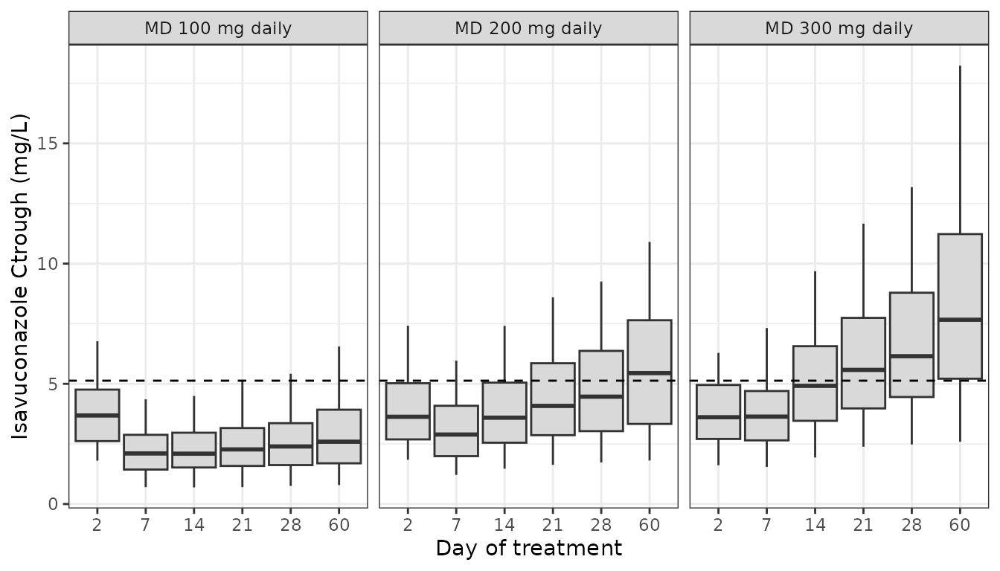

# Isavuconazole (Cojutti 2021)

## Model and source

- Citation: Cojutti PG, Carnelutti A, Lazzarotto D, Sozio E, Candoni A,
  Fanin R, Tascini C, Pea F. Population Pharmacokinetics and
  Pharmacodynamic Target Attainment of Isavuconazole against Aspergillus
  fumigatus and Aspergillus flavus in Adult Patients with Invasive
  Fungal Diseases: Should Therapeutic Drug Monitoring for Isavuconazole
  Be Considered as Mandatory as for the Other Mold-Active Azoles?
  Pharmaceutics. 2021;13(12):2099. <doi:10.3390/pharmaceutics13122099>.
  PMCID PMC8708495.
- Description: Two-compartment population PK model for isavuconazole
  (dosed as the prodrug isavuconazonium sulfate, doses expressed as
  isavuconazole) in hospitalized adults treated for invasive fungal
  disease, mostly invasive pulmonary aspergillosis, with first-order
  oral absorption, oral bioavailability, 1-h intravenous infusion into
  the central compartment, and linear elimination (Cojutti 2021). No
  covariates were retained. Fitted non-parametrically with the NPAG
  algorithm in Pmetrics; the Table 3 medians are encoded as lognormal
  medians and the tabulated CV percentages as independent lognormal
  marginal variances.
- Article: <https://doi.org/10.3390/pharmaceutics13122099> (PMC8708495;
  open access, CC BY)

Isavuconazole is a second-generation triazole approved for invasive
aspergillosis and, in Europe, invasive mucormycosis. Cojutti and
colleagues fitted a population PK model to routine therapeutic drug
monitoring (TDM) data from 50 hospitalized adults at Udine, Italy, using
the non-parametric adaptive grid (NPAG) algorithm in Pmetrics. They then
ran Monte Carlo simulations of a 200 mg every 8 h loading dose for two
days followed by 100, 200 or 300 mg once daily. The simulations report
the probability that the trough falls below 1 mg/L or above the 5.13
mg/L toxicity threshold, and the probability of attaining AUC24h/MIC \>
33.4 against *Aspergillus fumigatus* and *A. flavus*. The final model is
a two-compartment model with first-order oral absorption, oral
bioavailability and linear elimination. It has no covariates.

No erratum or correction was found on the journal landing page or in
Europe PMC (checked 2026-09-30).

## Population

``` r

knitr::kable(
  data.frame(
    Characteristic = c(
      "Patients", "Age (years)", "Male / female", "Body weight (kg)",
      "Albumin (g/L)", "Total bilirubin (mg/dL)", "Invasive pulmonary aspergillosis",
      "Oncohaematological malignancy", "Oral administration",
      "Troughs / peaks", "Observed Ctrough (mg/L)", "Observed Cpeak (mg/L)",
      "Treatment duration (days)"
    ),
    Value = c(
      "50", "61.5 (IQR 51.3-72.0)", "31 / 19", "65.0 (IQR 55.5-71.5)",
      "35.0 (IQR 28.4-40.0)", "0.28 (IQR 0.2-0.4)", "40 (80%)", "25 (50%)",
      "38 (76%)", "175 / 24", "3.68 (IQR 2.07-5.38)", "4.67 (IQR 3.78-5.96)",
      "48 (IQR 19-91)"
    )
  ),
  caption = "Cojutti 2021 Table 1 and Results."
)
```

| Characteristic                   | Value                |
|:---------------------------------|:---------------------|
| Patients                         | 50                   |
| Age (years)                      | 61.5 (IQR 51.3-72.0) |
| Male / female                    | 31 / 19              |
| Body weight (kg)                 | 65.0 (IQR 55.5-71.5) |
| Albumin (g/L)                    | 35.0 (IQR 28.4-40.0) |
| Total bilirubin (mg/dL)          | 0.28 (IQR 0.2-0.4)   |
| Invasive pulmonary aspergillosis | 40 (80%)             |
| Oncohaematological malignancy    | 25 (50%)             |
| Oral administration              | 38 (76%)             |
| Troughs / peaks                  | 175 / 24             |
| Observed Ctrough (mg/L)          | 3.68 (IQR 2.07-5.38) |
| Observed Cpeak (mg/L)            | 4.67 (IQR 3.78-5.96) |
| Treatment duration (days)        | 48 (IQR 19-91)       |

Cojutti 2021 Table 1 and Results. {.table}

All patients received the labelled regimen of 200 mg every 8 h for 48 h
followed by 200 mg once daily, orally or as a 1-h intravenous infusion.
Troughs were drawn about 5 min before the daily dose, from at least 72 h
after the start of therapy. Peaks were drawn 2 h after an oral dose or
0.5 h after the end of an infusion. No patient received a strong CYP3A4
inhibitor or inducer. Ten received mild or moderate CYP3A4 inhibitors.
Race and ethnicity are not reported.

## Source trace

``` r

knitr::kable(
  data.frame(
    Item = c(
      "lka", "lcl", "lvc", "lq", "lvp", "lfdepot",
      "etalka / etalcl / etalvc / etalq / etalvp",
      "IIV on Fos (not encoded)",
      "addSd", "propSd", "combined1()",
      "Two-compartment ODE, first-order oral input",
      "1-h intravenous infusion into central",
      "Cc = central / vc",
      "AGE, CONMED_CYP3A4_INH (excluded)",
      "WT, SEXF, ALB, TBILI, ALT, AST, GGT (excluded)"
    ),
    Value = c(
      "log(22.64) 1/h", "log(1.33) L/h", "log(102.58) L", "log(5.08) L/h",
      "log(385.93) L", "log(1.00)",
      "0.02423 / 0.3436 / 0.2023 / 0.7867 / 0.5558",
      "CV 7.42%",
      "0.012 mg/L", "0.378", "linear sum of SDs",
      "depot -> central <-> peripheral1",
      "dosing only", "mg / L = mg/L",
      "tested on CL, not retained",
      "Ctrough regression only"
    ),
    Source = c(
      rep("Table 3, Median row", 6),
      "Table 3, CV (%) row, omega^2 = log(CV^2 + 1)",
      "Table 3, CV (%) row; see Assumptions",
      "Methods 2.2: C0 = 0.006 x G = 2",
      "Methods 2.2: C1 = 0.189 x G = 2",
      "Methods 2.2: SD = C0 + C1 x C (Pmetrics polynomial)",
      "Methods 2.2; Results 3.2",
      "Methods 2.1 ('0.5 h after a 1 h intravenous infusion')",
      "Units declaration",
      "Results 3.2",
      "Table 2 (mixed-effect regression on Ctrough)"
    )
  )
)
```

| Item | Value | Source |
|:---|:---|:---|
| lka | log(22.64) 1/h | Table 3, Median row |
| lcl | log(1.33) L/h | Table 3, Median row |
| lvc | log(102.58) L | Table 3, Median row |
| lq | log(5.08) L/h | Table 3, Median row |
| lvp | log(385.93) L | Table 3, Median row |
| lfdepot | log(1.00) | Table 3, Median row |
| etalka / etalcl / etalvc / etalq / etalvp | 0.02423 / 0.3436 / 0.2023 / 0.7867 / 0.5558 | Table 3, CV (%) row, omega^2 = log(CV^2 + 1) |
| IIV on Fos (not encoded) | CV 7.42% | Table 3, CV (%) row; see Assumptions |
| addSd | 0.012 mg/L | Methods 2.2: C0 = 0.006 x G = 2 |
| propSd | 0.378 | Methods 2.2: C1 = 0.189 x G = 2 |
| combined1() | linear sum of SDs | Methods 2.2: SD = C0 + C1 x C (Pmetrics polynomial) |
| Two-compartment ODE, first-order oral input | depot -\> central \<-\> peripheral1 | Methods 2.2; Results 3.2 |
| 1-h intravenous infusion into central | dosing only | Methods 2.1 (‘0.5 h after a 1 h intravenous infusion’) |
| Cc = central / vc | mg / L = mg/L | Units declaration |
| AGE, CONMED_CYP3A4_INH (excluded) | tested on CL, not retained | Results 3.2 |
| WT, SEXF, ALB, TBILI, ALT, AST, GGT (excluded) | Ctrough regression only | Table 2 (mixed-effect regression on Ctrough) |

## Choice of typical values

Table 3 prints the mean, SD, CV and median of each parameter’s NPAG
distribution, and the two columns differ a lot for the two distribution
parameters. For Q the mean is 16.78 L/h and the median 5.08 L/h. For Vp
the mean is 735 L and the median 386 L. The text uses both columns. The
Discussion quotes the mean CL (1.52 L/h) as “the median CL estimate”. It
also quotes “the wide median volume of distribution (488.51 L)”, which
is the sum of the two medians (102.58 + 385.93) and not of the two means
(824.74 L).

The paper’s own Monte Carlo output decides which column to use. Below,
the Table 4 simulation is re-run with each column. The CV is the same in
both runs, because Table 3’s CV is SD / mean for every row. The residual
error is left out, because the paper’s Table 4 describes true troughs.
The oral route is used, because Methods does not give the simulation
route and F is 1 at the median.

``` r

md_levels <- c(100, 200, 300)
days <- c(2, 7, 14, 21, 28, 60)
# AUC24 needs a within-day grid; the trough is the value at the day's end
# (24 * day h), which is also the time of the next oral dose. An oral dose
# enters the depot, so Cc at that instant is still the pre-dose trough.
grid <- sort(unique(c(0, unlist(lapply(days, function(d) {
  24 * (d - 1) + c(0, 0.25, 0.5, 1, 1.5, 2, 3, 4, 6, 8, 12, 16, 20, 24)
})))))

make_events <- function(md) {
  rxode2::et(amt = 200, ii = 8, addl = 5, cmt = "depot") |>
    rxode2::et(time = 48, amt = md, ii = 24, addl = 60, cmt = "depot") |>
    rxode2::et(grid, cmt = "central")
}

n_per_arm <- 200
simulate_arms <- function(model, label) {
  bind_rows(lapply(md_levels, function(md) {
    s <- rxode2::rxSolve(model, make_events(md), nSub = n_per_arm,
                         returnType = "data.frame")
    # A single event table replicated with nSub returns the subject index as
    # sim.id rather than id.
    if (!"id" %in% names(s)) s$id <- s$sim.id
    s$md <- md
    s$column <- label
    s
  }))
}

# The mean column. Fos mean 0.95; no IIV on Fos in either run.
mod_mean <- mod |>
  ini(lka = log(22.64), lcl = log(1.52), lvc = log(89.50), lq = log(16.78),
      lvp = log(735.24), lfdepot = log(0.95))
#> ℹ parameter labels from comments will be replaced by 'label()'
#> ℹ change initial estimate of `lka` to `3.11971825333498`
#> ℹ change initial estimate of `lcl` to `0.418710334858185`
#> ℹ change initial estimate of `lvc` to `4.49423862528081`
#> ℹ change initial estimate of `lq` to `2.82018770103906`
#> ℹ change initial estimate of `lvp` to `6.60019697652556`
#> ℹ change initial estimate of `lfdepot` to `-0.0512932943875506`

rxode2::rxSetSeed(20211206)
sim_med <- simulate_arms(mod, "Median (encoded)")
#> ℹ parameter labels from comments will be replaced by 'label()'
rxode2::rxSetSeed(20211206)
sim_mean <- simulate_arms(mod_mean, "Mean")
sim_all <- bind_rows(sim_med, sim_mean)
```

``` r

troughs <- sim_all |>
  filter(time %in% (24 * days)) |>
  mutate(day = time / 24)

sim_t4 <- troughs |>
  group_by(column, md, day) |>
  summarise(
    lt1 = 100 * mean(Cc < 1),
    mid = 100 * mean(Cc >= 1 & Cc <= 5.13),
    gt5 = 100 * mean(Cc > 5.13),
    .groups = "drop"
  )

# Cojutti 2021 Table 4. The Day 2 (end of loading) column is common to all
# three maintenance doses.
pub_t4 <- tibble::tribble(
  ~md, ~day, ~lt1_pub, ~mid_pub, ~gt5_pub,
  100, 2, 1.7, 85.2, 13.1,
  100, 7, 21.7, 76.4, 1.9,
  100, 14, 16.4, 81.5, 2.1,
  100, 21, 12.9, 84.6, 2.5,
  100, 28, 12.0, 83.8, 4.2,
  100, 60, 11.7, 81.1, 7.2,
  200, 2, 1.7, 85.2, 13.1,
  200, 7, 4.1, 84.3, 11.6,
  200, 14, 1.8, 80.4, 17.8,
  200, 21, 1.3, 73.6, 25.1,
  200, 28, 1.0, 71.3, 27.7,
  200, 60, 1.1, 59.7, 39.2,
  300, 2, 1.7, 85.2, 13.1,
  300, 7, 0.8, 76.9, 22.3,
  300, 14, 0.2, 60.6, 39.2,
  300, 21, 0.2, 48.6, 51.2,
  300, 28, 0.1, 46.9, 53.0,
  300, 60, 0.1, 26.6, 73.2
)

t4 <- sim_t4 |>
  left_join(pub_t4, by = c("md", "day")) |>
  mutate(abs_diff = (abs(lt1 - lt1_pub) + abs(mid - mid_pub) + abs(gt5 - gt5_pub)) / 3)

knitr::kable(
  t4 |>
    filter(column == "Median (encoded)") |>
    transmute(md, day,
              lt1 = sprintf("%.1f (%.1f)", lt1, lt1_pub),
              mid = sprintf("%.1f (%.1f)", mid, mid_pub),
              gt5 = sprintf("%.1f (%.1f)", gt5, gt5_pub)) |>
    dplyr::rename("MD (mg/day)" = md, "Day" = day,
                  "Ctrough < 1 mg/L, % (published)" = lt1,
                  "1-5.13 mg/L, % (published)" = mid,
                  "> 5.13 mg/L, % (published)" = gt5),
  caption = paste("Replicates Table 4 of Cojutti 2021 with the encoded (median)",
                  "parameters; published values in parentheses.")
)
```

| MD (mg/day) | Day | Ctrough \< 1 mg/L, % (published) | 1-5.13 mg/L, % (published) | \> 5.13 mg/L, % (published) |
|---:|---:|:---|:---|:---|
| 100 | 2 | 0.5 (1.7) | 80.0 (85.2) | 19.5 (13.1) |
| 100 | 7 | 14.0 (21.7) | 84.5 (76.4) | 1.5 (1.9) |
| 100 | 14 | 12.5 (16.4) | 83.5 (81.5) | 4.0 (2.1) |
| 100 | 21 | 12.0 (12.9) | 83.0 (84.6) | 5.0 (2.5) |
| 100 | 28 | 12.0 (12.0) | 82.0 (83.8) | 6.0 (4.2) |
| 100 | 60 | 8.5 (11.7) | 81.0 (81.1) | 10.5 (7.2) |
| 200 | 2 | 0.0 (1.7) | 76.0 (85.2) | 24.0 (13.1) |
| 200 | 7 | 3.5 (4.1) | 82.5 (84.3) | 14.0 (11.6) |
| 200 | 14 | 1.5 (1.8) | 76.0 (80.4) | 22.5 (17.8) |
| 200 | 21 | 1.0 (1.3) | 66.0 (73.6) | 33.0 (25.1) |
| 200 | 28 | 1.0 (1.0) | 59.5 (71.3) | 39.5 (27.7) |
| 200 | 60 | 1.0 (1.1) | 44.5 (59.7) | 54.5 (39.2) |
| 300 | 2 | 1.5 (1.7) | 78.5 (85.2) | 20.0 (13.1) |
| 300 | 7 | 0.5 (0.8) | 81.0 (76.9) | 18.5 (22.3) |
| 300 | 14 | 0.5 (0.2) | 51.0 (60.6) | 48.5 (39.2) |
| 300 | 21 | 0.5 (0.2) | 42.5 (48.6) | 57.0 (51.2) |
| 300 | 28 | 0.5 (0.1) | 36.5 (46.9) | 63.0 (53.0) |
| 300 | 60 | 0.5 (0.1) | 23.5 (26.6) | 76.0 (73.2) |

Replicates Table 4 of Cojutti 2021 with the encoded (median) parameters;
published values in parentheses. {.table}

``` r


fit_summary <- t4 |>
  group_by(column) |>
  summarise(
    mean_abs_diff = mean(abs_diff),
    lt1_end_of_loading = mean(lt1[day == 2]),
    .groups = "drop"
  )
knitr::kable(
  fit_summary |>
    dplyr::rename("Table 3 column" = column,
                  "Mean |difference| from Table 4 (points)" = mean_abs_diff,
                  "Ctrough < 1 mg/L at end of loading, % (published 1.7)" = lt1_end_of_loading),
  digits = 1,
  caption = "Agreement of each Table 3 column with the published Monte Carlo output."
)
```

| Table 3 column | Mean \|difference\| from Table 4 (points) | Ctrough \< 1 mg/L at end of loading, % (published 1.7) |
|:---|---:|---:|
| Mean | 7.8 | 17.3 |
| Median (encoded) | 4.4 | 0.7 |

Agreement of each Table 3 column with the published Monte Carlo output.
{.table}

The median column reproduces Table 4 closely. Both the fraction of
troughs below 1 mg/L at the end of loading and the build-up of troughs
above 5.13 mg/L over two months come out close to the published values.
The mean column puts many more troughs below 1 mg/L at the end of
loading, because its larger Vp and Q move more drug into the peripheral
compartment during loading. So the medians are encoded.

``` r

fs <- setNames(fit_summary$mean_abs_diff, fit_summary$column)
lt <- setNames(fit_summary$lt1_end_of_loading, fit_summary$column)
stopifnot(
  # Centre of agreement over all 18 cells. Realised 3.0-5.1 over seven seeds
  # and at 1 and 4 threads (the mean column gives 7.8-9.9), so 7 leaves room
  # for the draw.
  fs[["Median (encoded)"]] < 7,
  # End of loading, Ctrough < 1 mg/L: realised 0.2-1.5 percent with the
  # median column and 17-20 percent with the mean column over the same runs.
  # The 8 percent split sits well clear of both.
  lt[["Median (encoded)"]] < 8,
  lt[["Mean"]] > 8
)
```

## Replicate Figure 4

``` r

fig4 <- troughs |>
  filter(column == "Median (encoded)") |>
  group_by(md, day) |>
  summarise(
    q05 = quantile(Cc, 0.05), q25 = quantile(Cc, 0.25), q50 = median(Cc),
    q75 = quantile(Cc, 0.75), q95 = quantile(Cc, 0.95), .groups = "drop"
  ) |>
  mutate(day = factor(day), md = paste("MD", md, "mg daily"))

ggplot(fig4, aes(x = day)) +
  geom_boxplot(aes(ymin = q05, lower = q25, middle = q50, upper = q75, ymax = q95),
               stat = "identity", fill = "grey85") +
  geom_hline(yintercept = 5.13, linetype = "dashed") +
  facet_wrap(~md) +
  labs(x = "Day of treatment", y = "Isavuconazole Ctrough (mg/L)") +
  theme_bw()
```



Replicates Figure 4 of Cojutti 2021: boxes are the median and 25th-75th
percentiles, whiskers the 5th-95th percentiles, and the dashed line is
the 5.13 mg/L toxicity threshold. Troughs build up over the whole two
months, as the paper reports. The typical terminal half-life of this
parameter set is about 300 h, so steady state is reached only after
several weeks.

## Probability of target attainment

Figure 5 reports that the standard 200 mg maintenance dose “achieved
optimal PTAs” (at least 90%) at the 1 mg/L EUCAST breakpoint on Day 7,
for a target of AUC24h/MIC \> 33.4. The Table 5 cumulative fractions of
response need the EUCAST MIC distributions, which the paper does not
tabulate, so they are not recomputed here.

``` r

nca_in <- sim_med |>
  filter(!is.na(Cc)) |>
  mutate(treatment = paste("MD", md, "mg"), id = paste(md, id)) |>
  select(id, time, Cc, treatment)

# Dose records per subject: LD at 0, 8, ..., 40 h, then MD every 24 h from 48 h.
dose_times <- c(seq(0, 40, by = 8), seq(48, 48 + 24 * 60, by = 24))
doses <- nca_in |>
  distinct(id, treatment) |>
  tidyr::crossing(time = dose_times) |>
  mutate(amt = ifelse(time < 48, 200, as.numeric(sub("MD ([0-9]+) mg", "\\1", treatment))))

conc_obj <- PKNCA::PKNCAconc(nca_in, Cc ~ time | treatment + id)
dose_obj <- PKNCA::PKNCAdose(doses, amt ~ time | treatment + id)
intervals <- data.frame(
  start = 24 * (days - 1), end = 24 * days,
  auclast = TRUE, cmax = TRUE, cmin = TRUE
)
nca_res <- PKNCA::pk.nca(PKNCA::PKNCAdata(conc_obj, dose_obj, intervals = intervals))

nca_tab <- as.data.frame(nca_res$result) |>
  filter(PPTESTCD %in% c("auclast", "cmax", "cmin")) |>
  mutate(day = end / 24)

pta <- nca_tab |>
  filter(PPTESTCD == "auclast") |>
  group_by(treatment, day) |>
  summarise(
    median_auc24 = median(PPORRES),
    pta_mic1 = 100 * mean(PPORRES / 1 > 33.4),
    .groups = "drop"
  )
knitr::kable(
  pta |>
    dplyr::rename("Regimen" = treatment, "Day" = day,
                  "Median AUC24 (mg*h/L)" = median_auc24,
                  "PTA at MIC 1 mg/L (%)" = pta_mic1),
  digits = 1,
  caption = "Simulated AUC24 and PTA of AUC24/MIC > 33.4 at MIC = 1 mg/L."
)
```

| Regimen   | Day | Median AUC24 (mg\*h/L) | PTA at MIC 1 mg/L (%) |
|:----------|----:|-----------------------:|----------------------:|
| MD 100 mg |   2 |                   87.4 |                  99.5 |
| MD 100 mg |   7 |                   58.6 |                  86.5 |
| MD 100 mg |  14 |                   61.3 |                  87.5 |
| MD 100 mg |  21 |                   63.6 |                  87.5 |
| MD 100 mg |  28 |                   65.8 |                  87.0 |
| MD 100 mg |  60 |                   69.0 |                  89.0 |
| MD 200 mg |   2 |                   84.9 |                 100.0 |
| MD 200 mg |   7 |                   83.6 |                  99.0 |
| MD 200 mg |  14 |                   99.9 |                 100.0 |
| MD 200 mg |  21 |                  112.4 |                 100.0 |
| MD 200 mg |  28 |                  122.8 |                 100.0 |
| MD 200 mg |  60 |                  148.7 |                 100.0 |
| MD 300 mg |   2 |                   84.3 |                  98.5 |
| MD 300 mg |   7 |                  111.1 |                  99.5 |
| MD 300 mg |  14 |                  140.8 |                  99.5 |
| MD 300 mg |  21 |                  161.7 |                  99.5 |
| MD 300 mg |  28 |                  175.5 |                  99.5 |
| MD 300 mg |  60 |                  210.8 |                  99.5 |

Simulated AUC24 and PTA of AUC24/MIC \> 33.4 at MIC = 1 mg/L. {.table}

``` r


pta200 <- pta$pta_mic1[pta$treatment == "MD 200 mg" & pta$day == 7]
# Figure 5: at least 90 percent at MIC 1 mg/L with 200 mg on Day 7. Allow
# 3-4 Monte Carlo SE at n = 200 below the claim.
stopifnot(pta200 > 85)
```

The simulated PTA at 1 mg/L on Day 7 with 200 mg daily is 99.0%, in line
with the paper’s statement that the standard dose reaches at least 90%
at the breakpoint.

### Comparison with observed TDM values

The paper reports no NCA of its own. The nearest thing is the Table 1
summary of observed TDM concentrations under 200 mg daily, which pools
troughs and peaks drawn at different times from Day 3 to several months.
The table below compares these with the simulated Day 14 dosing interval
under 200 mg daily. For an oral dose absorbed with a half-life of about
2 minutes, the 2-h post-dose peak is close to Cmax. This is a
descriptive check and is not used as a gate.

``` r

published_tdm <- data.frame(
  treatment = "MD 200 mg",
  cmin = 3.68,
  cmax = 4.67
)
sim_day14 <- nca_res
sim_day14$result <- sim_day14$result |>
  filter(end == 24 * 14, PPTESTCD %in% c("cmin", "cmax"))

knitr::kable(
  nlmixr2lib::ncaComparisonTable(
    simulated = sim_day14,
    reference = published_tdm,
    by = "treatment",
    units = c(cmin = "mg/L", cmax = "mg/L"),
    tolerance_pct = 20
  ),
  caption = paste("Simulated Day 14 cmin / cmax (200 mg daily) against the observed",
                  "Table 1 TDM medians. * differs by >20%.")
)
```

| NCA parameter | treatment | Reference | Simulated | % diff |
|:--------------|:----------|:----------|:----------|:-------|
| Cmax (mg/L)   | MD 200 mg | 4.67      | 5.42      | +16.1% |
| Cmin (mg/L)   | MD 200 mg | 3.68      | 3.49      | -5.2%  |

Simulated Day 14 cmin / cmax (200 mg daily) against the observed Table 1
TDM medians. \* differs by \>20%. {.table}

### Steady-state closed-form check

For a linear model the steady-state AUC over a dosing interval equals F
x Dose / CL. The typical patient is run for 150 days of 200 mg daily,
which is more than 10 terminal half-lives, and PKNCA is applied to the
last interval.

``` r

ev_ss <- rxode2::et(amt = 200, ii = 24, addl = 149, cmt = "depot") |>
  rxode2::et(c(0, 24 * 149 + c(0, 0.25, 0.5, 1, 2, 4, 8, 12, 16, 20, 24)), cmt = "central")
ss <- rxode2::rxSolve(rxode2::zeroRe(mod), ev_ss, returnType = "data.frame") |>
  filter(!is.na(Cc)) |>
  mutate(id = 1, treatment = "200 mg daily, typical")
#> ℹ parameter labels from comments will be replaced by 'label()'
#> ℹ omega/sigma items treated as zero: 'etalka', 'etalcl', 'etalvc', 'etalq', 'etalvp'
ss_dose <- data.frame(id = 1, treatment = "200 mg daily, typical",
                      time = seq(0, 24 * 149, by = 24), amt = 200)
ss_nca <- PKNCA::pk.nca(PKNCA::PKNCAdata(
  PKNCA::PKNCAconc(ss, Cc ~ time | treatment + id),
  PKNCA::PKNCAdose(ss_dose, amt ~ time | treatment + id),
  intervals = data.frame(start = 24 * 149, end = 24 * 150, auclast = TRUE)
))
auc_ss <- as.data.frame(ss_nca$result)$PPORRES[1]
auc_closed <- 1.00 * 200 / 1.33
c(PKNCA = auc_ss, closed_form = auc_closed)
#>       PKNCA closed_form 
#>    150.2819    150.3759
# Deterministic; the only difference is trapezoidal error on the fast
# absorption peak and the few percent of steady state not yet reached.
stopifnot(abs(auc_ss / auc_closed - 1) < 0.05)
```

## Assumptions and deviations

- **Median column encoded.** Table 3 gives both a mean and a median for
  each parameter. The medians are encoded because they reproduce the
  paper’s own Table 4 Monte Carlo output and the means do not (see
  “Choice of typical values”). The Discussion’s “median CL (1.52 L/h)”
  is the Table 3 mean.
- **Lognormal marginals for a non-parametric fit.** NPAG estimates a
  discrete joint distribution. The CV column is carried as independent
  lognormal marginals with omega^2 = log(CV^2 + 1), because covariances
  are not reported. Any multimodality in the NPAG distribution cannot be
  recovered from Table 3. The simulated trough distribution builds up a
  little faster than Table 4 after Day 21 (for example, 200 mg Day 60
  above 5.13 mg/L). This is the expected sign of lognormal tails on Q
  and Vp. It is not a transcription error.
- **No IIV on bioavailability.** Fos has median 1.00, mean 0.95 and CV
  7.42%. With the median at the upper bound of 1, a lognormal marginal
  would give F \> 1 to half of the patients, and a logit-normal marginal
  is undefined. Bioavailability is therefore fixed at its typical value
  of 1 for every simulated patient. The Table 3 column header says “Fos
  (%)”, but the values are fractions.
- **Ka.** Table 3 gives the same mean and median for Ka (22.64 1/h, an
  absorption half-life of about 2 minutes). The data were troughs and a
  few 2-h peaks, so they carry almost no information on absorption. The
  value is encoded as printed.
- **Residual error.** Methods gives the assay polynomial SD = 0.006 +
  0.189 x C and a gamma of 2. Pmetrics multiplies the assay SD by gamma,
  so the encoded residual is 0.012 mg/L + 37.8% with the two parts
  summed linearly (`combined1()`). The 0.189 slope is larger than the
  “\< 10%” inter-assay CV that Methods quotes. The paper does not say
  whether C1 absorbs extra variability, and the value is encoded as
  printed.
- **Monte Carlo settings.** Methods does not give the route or the error
  model of the Table 4 simulation. Here the simulation is oral with no
  residual error, and the trough is taken at the end of each named day
  (24 x day h). Troughs with added residual error fit Table 4 worse; for
  example, they put about 5% below 1 mg/L at the end of loading against
  the published 1.7%.
- **Covariates.** The population model retained none. Age and mild or
  moderate CYP3A4 inhibitors were tested on CL and did not improve the
  fit. The other Table 2 variables come from a separate mixed-effect
  regression on Ctrough and were never part of the PK model. All of them
  are listed in `covariatesDataExcluded`.
- **Dose units.** Doses are isavuconazole equivalents (200 mg
  isavuconazole = 372 mg isavuconazonium sulfate), as in the paper.
