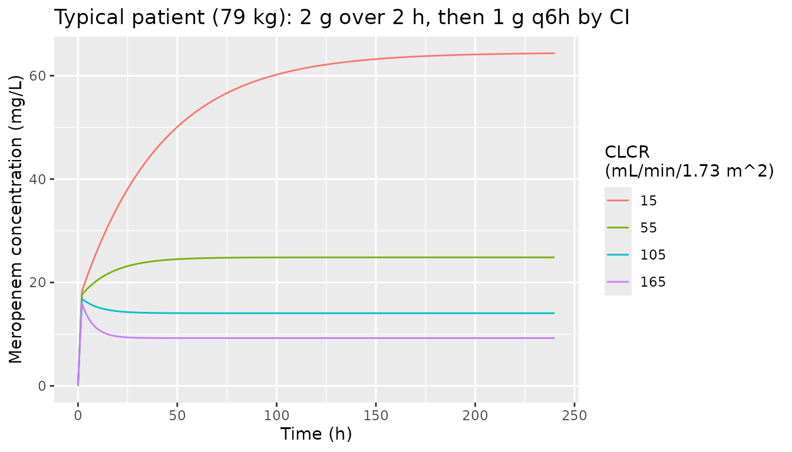
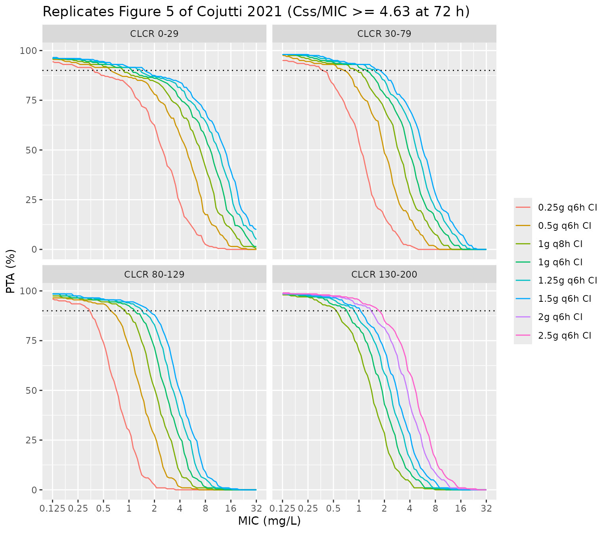

# Meropenem (Cojutti 2021)

## Model and source

- Citation: Cojutti PG, Gatti M, Rinaldi M, Tonetti T, Laici C, Mega C,
  Siniscalchi A, Giannella M, Viale P, Pea F. Impact of Maximizing
  Css/MIC Ratio on Efficacy of Continuous Infusion Meropenem Against
  Documented Gram-Negative Infections in Critically Ill Patients and
  Population Pharmacokinetic/Pharmacodynamic Analysis to Support
  Treatment Optimization. Front Pharmacol. 2021;12:781892.
  <doi:10.3389/fphar.2021.781892>. PMCID: PMC8694396. Structural and
  variability estimates are Table 4 (‘Final model’ columns); the
  covariate equations are printed in Section 3.3; the residual-error
  polynomial and gamma are in Section 2.4. No supplement was published
  and no erratum was found (Europe PMC search, 2026-09-30).
- Description: One-compartment population PK model for meropenem given
  by continuous intravenous infusion to 74 critically ill adults (one
  adolescent) with Gram-negative infections at a tertiary hospital in
  Bologna, Italy, fitted non-parametrically with the NPAG algorithm in
  Pmetrics 1.5.0 to 183 steady-state therapeutic-drug-monitoring
  concentrations. Clearance is ADDITIVE in an intercept and an arm
  linear in CKD-EPI creatinine clearance (CL = theta1 + theta2 \* CLCR),
  and volume is a power function of absolute total body weight (V =
  theta3 \* BW^theta4). All four thetas carry inter-individual
  variability taken from the CVs of the NPAG marginal distributions,
  including the body-weight exponent. Residual error is the Pmetrics
  assay-error polynomial (0.0798 + 0.0927 \* C) multiplied by the gamma
  factor of 2.
- Article: <https://doi.org/10.3389/fphar.2021.781892> (open access,
  PMC8694396)

## Population

Cojutti et al. analysed 74 critically ill patients who received
continuous-infusion (CI) meropenem at the IRCCS Azienda
Ospedaliero-Universitaria di Bologna, Italy, with real-time therapeutic
drug monitoring (Table 1). Age was 60.1 +/- 15.0 years (range 12-86), 52
were male and 22 female, body weight had a median of 79.0 kg (IQR
68.5-89.5; range 50-160), and CKD-EPI creatinine clearance (CLCR) had a
median of 91.5 mL/min/1.73 m^2 (IQR 51.2-114.9; range 7-192). Ten
patients (13.5%) had augmented renal clearance. Patients on renal
replacement therapy were excluded. The main indications were hospital-
or ventilator-acquired pneumonia (50%) and bloodstream infection
(25.7%). Treatment started with a 2 g loading dose over 2 h, followed by
1 g q6h (CLCR \>= 60) or 0.5 g q6h (CLCR \< 60), each infused over 6 h
so that the infusion is continuous. Doses were then adjusted by TDM. The
population model was fitted to 183 steady-state concentrations.

The same information is available programmatically via
`readModelDb("Cojutti_2021_meropenem")()$population`.

## Source trace

The per-parameter origin is also recorded as an in-file comment next to
each `ini()` entry in
`inst/modeldb/specificDrugs/Cojutti_2021_meropenem.R`.

| Equation / parameter | Value | Source location |
|----|----|----|
| Structure: one compartment, zero-order input, first-order elimination | – | Section 2.4 |
| `CL = theta1 + theta2 * CLCR` | – | Section 3.3 equation; Table 4 header |
| `V = theta3 * BW^theta4` (absolute BW, theta3 = V at BW = 1) | – | Section 3.3 equation and text |
| `lcl_nonren` (theta1) | log(1.040) L/h | Table 4, mean |
| `e_crcl_cl_renal` (theta2) | 0.103 L/h per mL/min/1.73 m^2 | Table 4, mean |
| `lvc` (theta3) | log(7.343) L | Table 4, mean |
| `e_wt_vc` (theta4) | 0.612 | Table 4, mean |
| `etalcl_nonren` | log(0.77016^2 + 1) = 0.4657 | Table 4, CV 77.016% |
| `etae_crcl_cl_renal` | log(0.66074^2 + 1) = 0.3623 | Table 4, CV 66.074% |
| `etalvc` | log(0.46824^2 + 1) = 0.1982 | Table 4, CV 46.824% |
| `etae_wt_vc` | log(0.59146^2 + 1) = 0.3000 | Table 4, CV 59.146% |
| `addSd` | 2 x 0.0798 = 0.1596 mg/L | Section 2.4, assay polynomial C0 and gamma = 2 |
| `propSd` | 2 x 0.0927 = 0.1854 | Section 2.4, assay polynomial C1 and gamma = 2 |
| `combined1()` error | SD = gamma \* (C0 + C1 \* C) | Section 2.4 (Pmetrics error model) |

``` r

mod <- readModelDb("Cojutti_2021_meropenem")
ui <- rxode2::rxode2(mod)
#> ℹ parameter labels from comments will be replaced by 'label()'
# The explicit ODE is kept (no automatic linear-compartment conversion).
stopifnot(is.null(ui$linCmt))
mod_typ <- rxode2::zeroRe(ui)
```

## Typical-value behaviour

The typical values below use the Table 4 means. At the cohort’s median
weight of 79 kg the typical volume is `7.343 * 79^0.612` = 106.5 L, and
the typical clearance at the median CLCR of 91.5 is
`1.040 + 0.103 * 91.5` = 10.46 L/h. The volume is discussed under
*Assumptions and deviations*.

``` r

crcl_levels <- c(15, 55, 105, 165)
rate_1g_q6h <- 1000 / 6 # mg/h

ev_typ <- bind_rows(lapply(seq_along(crcl_levels), function(i) {
  bind_rows(
    data.frame(id = i, time = 0, amt = 2000, rate = 1000, evid = 1L, cmt = "central"),
    data.frame(id = i, time = 2, amt = rate_1g_q6h * 238, rate = rate_1g_q6h, evid = 1L, cmt = "central"),
    data.frame(id = i, time = seq(0, 240, by = 1), amt = NA_real_, rate = NA_real_, evid = 0L, cmt = "central")
  ) |>
    mutate(CRCL = crcl_levels[i], WT = 79)
})) |>
  arrange(id, time, desc(evid))

sim_typ <- rxode2::rxSolve(mod_typ, ev_typ, returnType = "data.frame",
                           rtol = 1e-10, atol = 1e-12, maxsteps = 1e6) |>
  select(id, time, Cc) |>
  left_join(distinct(ev_typ, id, CRCL), by = "id")
#> ℹ omega/sigma items treated as zero: 'etalcl_nonren', 'etae_crcl_cl_renal', 'etalvc', 'etae_wt_vc'
#> Warning: multi-subject simulation without without 'omega'

ggplot(sim_typ, aes(time, Cc, colour = factor(CRCL))) +
  geom_line() +
  labs(x = "Time (h)", y = "Meropenem concentration (mg/L)",
       colour = "CLCR\n(mL/min/1.73 m^2)",
       title = "Typical patient (79 kg): 2 g over 2 h, then 1 g q6h by CI")
```



At the end of a long infusion the concentration approaches `rate / CL`.
This closed form depends only on clearance, so it checks the clearance
equation and its units directly.

``` r

css_check <- sim_typ |>
  filter(time == 240) |>
  mutate(
    cl_typ = 1.040 + 0.103 * CRCL,
    v_typ = 7.343 * 79^0.612,
    # Remaining non-steady-state fraction of the constant-rate input at 240 h
    # plus the leftover of the 2 g loading dose, both from the one-compartment
    # closed form.
    k = cl_typ / v_typ,
    css_expected = rate_1g_q6h / cl_typ * (1 - exp(-k * 238)) +
      2000 / cl_typ * (exp(-k * 238) - exp(-k * 240)) / 2,
    rel_err = Cc / css_expected - 1
  )
knitr::kable(
  css_check |>
    select(CRCL, cl_typ, css_expected, Cc, rel_err) |>
    dplyr::rename(
      "CLCR" = CRCL, "Typical CL (L/h)" = cl_typ,
      "Closed form at 240 h (mg/L)" = css_expected, "Simulated (mg/L)" = Cc,
      "Relative error" = rel_err
    ),
  digits = c(0, 2, 3, 3, 8)
)
```

| CLCR | Typical CL (L/h) | Closed form at 240 h (mg/L) | Simulated (mg/L) | Relative error |
|---:|---:|---:|---:|---:|
| 15 | 2.58 | 64.332 | 64.332 | 0 |
| 55 | 6.70 | 24.857 | 24.857 | 0 |
| 105 | 11.86 | 14.059 | 14.059 | 0 |
| 165 | 18.03 | 9.241 | 9.241 | 0 |

``` r

# Same parameters on both sides: only integrator error separates them.
stopifnot(max(abs(css_check$rel_err)) < 1e-6)
```

## PKNCA validation

The paper reports no NCA. As a structural check, a single 2 g dose
infused over 2 h is given to typical patients at four CLCR values.
`AUC0-inf` must equal `Dose / CL` and the terminal half-life must equal
`log(2) * V / CL`.

``` r

ev_sd <- bind_rows(lapply(seq_along(crcl_levels), function(i) {
  bind_rows(
    data.frame(id = i, time = 0, amt = 2000, rate = 1000, evid = 1L, cmt = "central"),
    data.frame(id = i, time = c(0, 0.5, 1, 2, 3, 4, 6, 8, 12, seq(24, 480, by = 24)),
               amt = NA_real_, rate = NA_real_, evid = 0L, cmt = "central")
  ) |>
    mutate(CRCL = crcl_levels[i], WT = 79, treatment = paste0("CLCR ", crcl_levels[i]))
})) |>
  arrange(id, time, desc(evid))

sim_sd <- rxode2::rxSolve(mod_typ, ev_sd, returnType = "data.frame",
                          rtol = 1e-10, atol = 1e-12, maxsteps = 1e6) |>
  select(id, time, Cc) |>
  left_join(distinct(ev_sd, id, CRCL, treatment), by = "id")
#> ℹ omega/sigma items treated as zero: 'etalcl_nonren', 'etae_crcl_cl_renal', 'etalvc', 'etae_wt_vc'
#> Warning: multi-subject simulation without without 'omega'

# At high CLCR the 480 h grid runs dozens of half-lives past the dose, where
# the ODE solution is integrator noise around zero. Assert the undershoot is
# noise, floor it, and drop the numerically-zero tail after the peak so the
# log-down trapezoid and the half-life fit see only real decay.
stopifnot(all(sim_sd$Cc >= -1e-6 * max(sim_sd$Cc, na.rm = TRUE), na.rm = TRUE))
conc_sd <- sim_sd |>
  filter(!is.na(Cc)) |>
  mutate(Cc = pmax(Cc, 0)) |>
  group_by(id) |>
  filter(time <= time[which.max(Cc)] | Cc >= 1e-6 * max(Cc)) |>
  ungroup() |>
  select(id, time, Cc, treatment)
dose_sd <- ev_sd |>
  filter(evid == 1) |>
  select(id, time, amt, treatment)

o_conc <- PKNCA::PKNCAconc(conc_sd, Cc ~ time | treatment + id)
o_dose <- PKNCA::PKNCAdose(dose_sd, amt ~ time | treatment + id)
intervals <- data.frame(start = 0, end = Inf, cmax = TRUE, tmax = TRUE,
                        aucinf.obs = TRUE, half.life = TRUE)
nca <- PKNCA::pk.nca(PKNCA::PKNCAdata(o_conc, o_dose, intervals = intervals))

nca_wide <- as.data.frame(nca$result) |>
  filter(PPTESTCD %in% c("cmax", "aucinf.obs", "half.life")) |>
  select(treatment, PPTESTCD, PPORRES) |>
  pivot_wider(names_from = PPTESTCD, values_from = PPORRES) |>
  mutate(
    CRCL = as.numeric(sub("CLCR ", "", treatment)),
    cl_typ = 1.040 + 0.103 * CRCL,
    v_typ = 7.343 * 79^0.612,
    auc_expected = 2000 / cl_typ,
    thalf_expected = log(2) * v_typ / cl_typ
  ) |>
  arrange(CRCL)

knitr::kable(
  nca_wide |>
    select(treatment, cmax, aucinf.obs, auc_expected, half.life, thalf_expected) |>
    dplyr::rename(
      "Arm" = treatment, "Cmax (mg/L)" = cmax, "AUC0-inf PKNCA (mg*h/L)" = aucinf.obs,
      "Dose/CL (mg*h/L)" = auc_expected, "t1/2 PKNCA (h)" = half.life,
      "log(2)*V/CL (h)" = thalf_expected
    ),
  digits = 2
)
```

| Arm | Cmax (mg/L) | AUC0-inf PKNCA (mg\*h/L) | Dose/CL (mg\*h/L) | t1/2 PKNCA (h) | log(2)\*V/CL (h) |
|:---|---:|---:|---:|---:|---:|
| CLCR 15 | 18.34 | 773.67 | 773.69 | 28.55 | 28.55 |
| CLCR 55 | 17.65 | 298.23 | 298.28 | 11.01 | 11.01 |
| CLCR 105 | 16.84 | 168.61 | 168.71 | 6.23 | 6.23 |
| CLCR 165 | 15.93 | 110.76 | 110.90 | 4.09 | 4.09 |

``` r

# The trapezoidal AUC on this grid and the log-linear half-life fit carry a
# little numerical error; 2% is far below the tens-of-percent shift a
# mis-transcribed theta would cause.
stopifnot(
  max(abs(nca_wide$aucinf.obs / nca_wide$auc_expected - 1)) < 0.02,
  max(abs(nca_wide$half.life / nca_wide$thalf_expected - 1)) < 0.02
)
```

## Replicating Figure 5: probability of target attainment

Section 3.4 simulated 1,000 patients per CLCR class (0-29, 30-79, 80-129
and 130-200 mL/min/1.73 m^2, CLCR uniform within each class) and
computed the probability that the concentration at 72 h reached at least
4.63 x MIC. It tested several CI regimens. Here 200 virtual patients are
drawn per CLCR class, and every regimen in the class is given to the
same patients. The random effects are drawn in base R with a fixed seed
and passed to the typical-value model as data, so the cohort is
identical on every machine. Body weight, which the paper does not
describe for the simulation, is drawn log-normally around the cohort
median of 79 kg (log-scale SD 0.198, from the Table 1 IQR). Weights
outside the observed 50-160 kg range are redrawn, not clamped. Each
regimen starts with the institutional 2 g loading dose over 2 h,
followed by the regimen’s continuous infusion. The loading dose is an
assumption; see below.

``` r

set.seed(20211208)
n_per_class <- 200
crcl_classes <- data.frame(
  panel = c("CLCR 0-29", "CLCR 30-79", "CLCR 80-129", "CLCR 130-200"),
  lo = c(0, 30, 80, 130), hi = c(29, 79, 129, 200)
)
draw_wt <- function(n) {
  wt <- exp(rnorm(n, log(79), 0.198))
  bad <- wt < 50 | wt > 160
  while (any(bad)) {
    wt[bad] <- exp(rnorm(sum(bad), log(79), 0.198))
    bad <- wt < 50 | wt > 160
  }
  wt
}
omega <- c(etalcl_nonren = 0.465711, etae_crcl_cl_renal = 0.362263,
           etalvc = 0.198235, etae_wt_vc = 0.299975)
cohort <- bind_rows(lapply(seq_len(nrow(crcl_classes)), function(i) {
  data.frame(
    panel = crcl_classes$panel[i],
    CRCL = runif(n_per_class, crcl_classes$lo[i], crcl_classes$hi[i]),
    WT = draw_wt(n_per_class),
    etalcl_nonren = rnorm(n_per_class, 0, sqrt(omega[["etalcl_nonren"]])),
    etae_crcl_cl_renal = rnorm(n_per_class, 0, sqrt(omega[["etae_crcl_cl_renal"]])),
    etalvc = rnorm(n_per_class, 0, sqrt(omega[["etalvc"]])),
    etae_wt_vc = rnorm(n_per_class, 0, sqrt(omega[["etae_wt_vc"]]))
  )
})) |>
  mutate(subj = row_number())
# Individual volumes implied by the drawn random effects (used in the text).
cohort_v <- with(cohort, 7.343 * exp(etalvc) * WT^(0.612 * exp(etae_wt_vc)))

regimens <- data.frame(
  regimen = c("0.25g q6h CI", "0.5g q6h CI", "1g q8h CI", "1g q6h CI",
              "1.25g q6h CI", "1.5g q6h CI", "2g q6h CI", "2.5g q6h CI"),
  rate = c(250 / 6, 500 / 6, 1000 / 8, 1000 / 6, 1250 / 6, 1500 / 6, 2000 / 6, 2500 / 6)
)
# Figure 5 shows 0.25-1.5 g in the three lower classes and 1-2.5 g in the top class.
panel_regimens <- bind_rows(
  expand.grid(panel = crcl_classes$panel[1:3], regimen = regimens$regimen[1:6],
              stringsAsFactors = FALSE),
  expand.grid(panel = crcl_classes$panel[4], regimen = regimens$regimen[3:8],
              stringsAsFactors = FALSE)
) |>
  left_join(regimens, by = "regimen")

css72 <- function(model, loading_dose) {
  ev <- panel_regimens |>
    inner_join(cohort, by = "panel", relationship = "many-to-many") |>
    mutate(id = row_number())
  doses <- bind_rows(
    if (loading_dose > 0) {
      transmute(ev, id, time = 0, amt = loading_dose, rate = loading_dose / 2, evid = 1L)
    },
    transmute(ev, id, time = if (loading_dose > 0) 2 else 0,
              amt = rate * 100, rate = rate, evid = 1L)
  )
  obs <- transmute(ev, id, time = 72, amt = NA_real_, rate = NA_real_, evid = 0L)
  events <- bind_rows(doses, obs) |>
    mutate(cmt = "central") |>
    left_join(select(ev, id, CRCL, WT, starts_with("eta")), by = "id") |>
    arrange(id, time, desc(evid))
  sim <- rxode2::rxSolve(model, events, returnType = "data.frame", maxsteps = 1e6)
  stopifnot(nrow(sim) == nrow(ev), !anyNA(sim$Cc))
  ev |>
    select(id, panel, regimen, rate) |>
    mutate(Css72 = sim$Cc[match(id, sim$id)])
}
pta_ld <- css72(mod_typ, loading_dose = 2000)
#> ℹ omega/sigma items treated as zero: 'etalcl_nonren', 'etae_crcl_cl_renal', 'etalvc', 'etae_wt_vc'
#> Warning: multi-subject simulation without without 'omega'
```

``` r

mic_grid <- 2^seq(log2(0.125), log2(32), length.out = 97)
pta_curves <- pta_ld |>
  group_by(panel, regimen) |>
  reframe(MIC = mic_grid,
          PTA = sapply(mic_grid, function(m) 100 * mean(Css72 / m >= 4.63))) |>
  mutate(panel = factor(panel, levels = crcl_classes$panel),
         regimen = factor(regimen, levels = regimens$regimen))

ggplot(pta_curves, aes(MIC, PTA, colour = regimen)) +
  geom_line() +
  geom_hline(yintercept = 90, linetype = "dotted") +
  scale_x_continuous(trans = "log2", breaks = 2^(-3:5), labels = c(0.125, 0.25, 0.5, 1, 2, 4, 8, 16, 32)) +
  facet_wrap(~panel) +
  labs(x = "MIC (mg/L)", y = "PTA (%)", colour = NULL,
       title = "Replicates Figure 5 of Cojutti 2021 (Css/MIC >= 4.63 at 72 h)")
```



The paper’s curves were digitized from Figure 5. The digitization
located the plot’s axis ticks and traced each curve by colour. For each
curve it recorded the MIC at which PTA crosses 50%, which equals the
median Css divided by 4.63, and the MIC at which PTA crosses 90%. The
same quantities are computed from the simulation.

``` r

fig5 <- tribble(
  ~panel,         ~regimen,       ~mic50_paper, ~mic90_paper,
  "CLCR 0-29",    "0.25g q6h CI",  2.771, 1.043,
  "CLCR 0-29",    "0.5g q6h CI",   5.057, 1.747,
  "CLCR 0-29",    "1g q8h CI",     7.282, 2.511,
  "CLCR 0-29",    "1g q6h CI",     9.671, 3.177,
  "CLCR 0-29",    "1.25g q6h CI", 11.707, 3.775,
  "CLCR 0-29",    "1.5g q6h CI",  14.019, 4.590,
  "CLCR 30-79",   "0.25g q6h CI",  1.235, 0.534,
  "CLCR 30-79",   "0.5g q6h CI",   2.368, 1.026,
  "CLCR 30-79",   "1g q8h CI",     3.321, 1.509,
  "CLCR 30-79",   "1g q6h CI",     4.596, 1.969,
  "CLCR 30-79",   "1.25g q6h CI",  5.630, 2.395,
  "CLCR 30-79",   "1.5g q6h CI",   6.525, 2.916,
  "CLCR 80-129",  "0.25g q6h CI",  0.733, 0.318,
  "CLCR 80-129",  "0.5g q6h CI",   1.413, 0.628,
  "CLCR 80-129",  "1g q8h CI",     2.042, 0.955,
  "CLCR 80-129",  "1g q6h CI",     2.794, 1.246,
  "CLCR 80-129",  "1.25g q6h CI",  3.373, 1.590,
  "CLCR 80-129",  "1.5g q6h CI",   4.048, 1.894,
  "CLCR 130-200", "1g q8h CI",     1.431, 0.633,
  "CLCR 130-200", "1g q6h CI",     1.836, 0.874,
  "CLCR 130-200", "1.25g q6h CI",  2.355, 1.070,
  "CLCR 130-200", "1.5g q6h CI",   2.825, 1.256,
  "CLCR 130-200", "2g q6h CI",     3.656, 1.750,
  "CLCR 130-200", "2.5g q6h CI",   4.713, 2.141
)
sim_mic <- pta_ld |>
  group_by(panel, regimen, rate) |>
  summarise(mic50_sim = median(Css72) / 4.63,
            mic90_sim = unname(quantile(Css72, 0.10)) / 4.63, .groups = "drop")
cmp <- fig5 |>
  left_join(sim_mic, by = c("panel", "regimen")) |>
  mutate(pct50 = 100 * (mic50_sim / mic50_paper - 1),
         pct90 = 100 * (mic90_sim / mic90_paper - 1))
stopifnot(nrow(cmp) == 24L, !anyNA(cmp$mic50_sim))
knitr::kable(
  cmp |>
    select(panel, regimen, mic50_paper, mic50_sim, pct50, mic90_paper, mic90_sim, pct90) |>
    dplyr::rename(
      "CLCR class" = panel, "Regimen" = regimen,
      "MIC at 50% PTA, Figure 5" = mic50_paper, "MIC at 50% PTA, simulated" = mic50_sim,
      "Diff 50% (%)" = pct50,
      "MIC at 90% PTA, Figure 5" = mic90_paper, "MIC at 90% PTA, simulated" = mic90_sim,
      "Diff 90% (%)" = pct90
    ),
  digits = 2
)
```

| CLCR class | Regimen | MIC at 50% PTA, Figure 5 | MIC at 50% PTA, simulated | Diff 50% (%) | MIC at 90% PTA, Figure 5 | MIC at 90% PTA, simulated | Diff 90% (%) |
|:---|:---|---:|---:|---:|---:|---:|---:|
| CLCR 0-29 | 0.25g q6h CI | 2.77 | 2.50 | -9.93 | 1.04 | 0.39 | -62.45 |
| CLCR 0-29 | 0.5g q6h CI | 5.06 | 4.79 | -5.22 | 1.75 | 0.63 | -63.98 |
| CLCR 0-29 | 1g q8h CI | 7.28 | 6.97 | -4.27 | 2.51 | 0.87 | -65.42 |
| CLCR 0-29 | 1g q6h CI | 9.67 | 9.09 | -5.96 | 3.18 | 1.11 | -65.18 |
| CLCR 0-29 | 1.25g q6h CI | 11.71 | 11.29 | -3.58 | 3.78 | 1.34 | -64.43 |
| CLCR 0-29 | 1.5g q6h CI | 14.02 | 13.48 | -3.84 | 4.59 | 1.58 | -65.59 |
| CLCR 30-79 | 0.25g q6h CI | 1.24 | 1.05 | -14.80 | 0.53 | 0.39 | -26.82 |
| CLCR 30-79 | 0.5g q6h CI | 2.37 | 1.97 | -16.93 | 1.03 | 0.69 | -33.18 |
| CLCR 30-79 | 1g q8h CI | 3.32 | 2.91 | -12.40 | 1.51 | 0.96 | -36.63 |
| CLCR 30-79 | 1g q6h CI | 4.60 | 3.87 | -15.90 | 1.97 | 1.23 | -37.53 |
| CLCR 30-79 | 1.25g q6h CI | 5.63 | 4.77 | -15.19 | 2.40 | 1.50 | -37.19 |
| CLCR 30-79 | 1.5g q6h CI | 6.53 | 5.69 | -12.81 | 2.92 | 1.80 | -38.19 |
| CLCR 80-129 | 0.25g q6h CI | 0.73 | 0.71 | -2.89 | 0.32 | 0.34 | 7.75 |
| CLCR 80-129 | 0.5g q6h CI | 1.41 | 1.36 | -3.74 | 0.63 | 0.60 | -5.00 |
| CLCR 80-129 | 1g q8h CI | 2.04 | 2.02 | -1.11 | 0.96 | 0.89 | -6.32 |
| CLCR 80-129 | 1g q6h CI | 2.79 | 2.68 | -3.94 | 1.25 | 1.16 | -6.75 |
| CLCR 80-129 | 1.25g q6h CI | 3.37 | 3.34 | -0.96 | 1.59 | 1.43 | -10.23 |
| CLCR 80-129 | 1.5g q6h CI | 4.05 | 3.98 | -1.70 | 1.89 | 1.70 | -10.20 |
| CLCR 130-200 | 1g q8h CI | 1.43 | 1.40 | -1.85 | 0.63 | 0.55 | -12.77 |
| CLCR 130-200 | 1g q6h CI | 1.84 | 1.86 | 1.54 | 0.87 | 0.71 | -18.32 |
| CLCR 130-200 | 1.25g q6h CI | 2.36 | 2.32 | -1.31 | 1.07 | 0.88 | -18.12 |
| CLCR 130-200 | 1.5g q6h CI | 2.83 | 2.78 | -1.43 | 1.26 | 1.04 | -16.82 |
| CLCR 130-200 | 2g q6h CI | 3.66 | 3.71 | 1.55 | 1.75 | 1.39 | -20.42 |
| CLCR 130-200 | 2.5g q6h CI | 4.71 | 4.63 | -1.75 | 2.14 | 1.74 | -18.70 |

``` r

# The median Css of 200 draws has a sampling SE of about 1.25 * 0.85 / sqrt(200)
# = 7.5% (log-scale SD of Css ~0.85). The draw is fixed by the base-R seed. A
# mis-transcribed theta, dose or unit shifts every cell by tens of percent.
stopifnot(
  abs(median(cmp$pct50)) < 10,
  quantile(abs(cmp$pct50), 0.9) < 20
)
```

The centre of every curve is reproduced: the median difference in the
MIC at 50% PTA is -3.8% across the 24 curves. The simulated MIC at 90%
PTA is systematically lower than the paper’s, by a median of -24%
overall. The gap is largest in the CLCR 0-29 class (median -65%). The
simulated left tail of Css is heavier than the paper’s because of how
the NPAG result has to be encoded (see *Assumptions and deviations*).
The gap is widest at low CLCR because there a patient drawn with a very
large volume is still far from steady state at 72 h.

### The loading dose, and why the volume is large

Section 2.5 does not say whether the simulated regimens began with a
loading dose. For a linear model the concentration at 72 h is exactly
proportional to the infusion rate if there is no loading dose, and so is
the MIC at 50% PTA. Figure 5 is **not** proportional in the lowest CLCR
class. The paper’s MIC at 50% PTA per unit infusion rate is 18.6% higher
for 0.25 g q6h than for 1.5 g q6h. This is the signature of a fixed
loading dose that has not yet washed out at 72 h. A loading dose can
only persist that long if the half-life is long, which requires a large
volume.

The table repeats the lowest-CLCR panel in three ways: as above; without
a loading dose; and with the loading dose but the volume replaced by 20
L. 20 L is the paper’s median individual (Bayesian posterior) V.

``` r

mod_v20 <- mod_typ |>
  rxode2::ini(lvc = log(20), e_wt_vc = 0)
#> ℹ change initial estimate of `lvc` to `2.99573227355399`
#> ℹ change initial estimate of `e_wt_vc` to `0`
pta_nold <- css72(mod_typ, loading_dose = 0)
#> ℹ omega/sigma items treated as zero: 'etalcl_nonren', 'etae_crcl_cl_renal', 'etalvc', 'etae_wt_vc'
#> Warning: multi-subject simulation without without 'omega'
pta_v20 <- css72(mod_v20, loading_dose = 2000)
#> ℹ omega/sigma items treated as zero: 'etalcl_nonren', 'etae_crcl_cl_renal', 'etalvc', 'etae_wt_vc'
#> Warning: multi-subject simulation without without 'omega'

prop_ratio <- function(d, panel_name = "CLCR 0-29") {
  m <- d |>
    filter(panel == panel_name) |>
    group_by(regimen, rate) |>
    summarise(mic50 = median(Css72) / 4.63, .groups = "drop")
  lo <- m[m$regimen == "0.25g q6h CI", ]
  hi <- m[m$regimen == "1.5g q6h CI", ]
  (lo$mic50 / lo$rate) / (hi$mic50 / hi$rate)
}
ratio_tab <- data.frame(
  scenario = c("Figure 5 (digitized)", "Model, 2 g loading dose (as simulated above)",
               "Model, no loading dose", "2 g loading dose, V fixed at 20 L"),
  ratio = c((2.771 / (250 / 6)) / (14.019 / (1500 / 6)), prop_ratio(pta_ld),
            prop_ratio(pta_nold), prop_ratio(pta_v20))
)
knitr::kable(
  ratio_tab |>
    dplyr::rename("Scenario" = scenario,
                  "Rate-normalized MIC50, 0.25 g vs 1.5 g q6h (CLCR 0-29)" = ratio),
  digits = 3
)
```

| Scenario | Rate-normalized MIC50, 0.25 g vs 1.5 g q6h (CLCR 0-29) |
|:---|---:|
| Figure 5 (digitized) | 1.186 |
| Model, 2 g loading dose (as simulated above) | 1.111 |
| Model, no loading dose | 1.000 |
| 2 g loading dose, V fixed at 20 L | 1.000 |

``` r

# Without a loading dose the ratio is exactly 1 (linearity). With V = 20 L the
# loading dose has washed out by 72 h, so the ratio is also 1. The printed V
# with the loading dose reproduces the paper's departure from proportionality.
stopifnot(
  abs(ratio_tab$ratio[3] - 1) < 1e-3,
  abs(ratio_tab$ratio[4] - 1) < 0.01,
  ratio_tab$ratio[2] > 1.08
)
```

## Assumptions and deviations

- **Volume of distribution.** Evaluated at the Table 4 means,
  `V = 7.343 * BW^0.612` gives 106 L at 79 kg. The Results report a
  median individual (Bayesian posterior) V of 20.0 L (IQR 17.16-23.59).
  The two are not contradictory under a non-parametric fit. The four
  thetas are means of marginal support-point distributions, the exponent
  itself is random (CV 59%), and V is a strongly non-linear function of
  it. The posterior values also shrink toward the data, and steady-state
  CI data carry little information on V. The model encodes the equation
  and values exactly as printed. The loading-dose analysis above shows
  that Figure 5 reproduces only with the large printed volume; a 20 L
  volume removes the departure from dose proportionality that the figure
  shows. Clearance, not volume, sets every steady-state concentration.
- **Loading dose in the simulations.** Section 2.5 does not state one.
  The institutional 2 g over 2 h (Section 2.1) was assumed because it
  reproduces Figure 5, and the alternative without a loading dose does
  not.
- **NPAG to log-normal.** Table 4 gives only the mean and CV% of each
  marginal distribution. The means are used as typical (median) values
  of independent log-normal random effects, with
  `omega^2 = log(CV^2 + 1)`. This is the convention used by the other
  Pmetrics models in the library. The NPAG joint density, including the
  intercept-slope and theta3-theta4 correlations, is not published. The
  independent log-normal tails are wider than the bounded NPAG support.
  This is why the simulated MIC at 90% PTA falls below Figure 5, while
  the median is reproduced. The volume tail is the extreme case. With
  independent random effects on theta3 and on the exponent, 14% of the
  simulated Figure 5 cohort has a volume above 1,000 L (median 110 L).
  The paper’s posterior V IQR of 17-24 L suggests that theta3 and theta4
  are strongly negatively correlated in the NPAG joint density.
  Stochastic simulations from this model therefore understate the lower
  percentiles of concentration before steady state, most of all in renal
  impairment. Typical-value and steady-state results are unaffected.
- **Random effect on an exponent.** Theta4 is a random parameter in the
  NPAG fit, so its CV is carried as `etae_wt_vc`, a log-normal
  multiplier on the exponent. This keeps the exponent positive, as the
  paper describes it (‘the positive exponent estimate’).
- **Residual error.** Section 2.4 gives the assay polynomial
  `0.0798 + 0.0927 * C` (C2 = C3 = 0) and ‘a gamma model (gamma = 2)’.
  Pmetrics multiplies the polynomial SD by gamma, which gives an
  additive SD of 0.1596 mg/L plus a proportional SD of 0.1854, summed on
  the SD scale (`combined1()`). The text does not say whether 2 is the
  final estimate of gamma or its starting value; it is taken as printed.
- **Body weight in the simulations.** The paper does not describe the
  weight distribution used in its Monte Carlo simulation. A log-normal
  around 79 kg matching the Table 1 IQR, truncated by redrawing to
  50-160 kg, was used.
- **Figure 5 digitization.** Performed by the maintainers from the
  published figure image by colour-tracing each curve against the axis
  ticks. The reading uncertainty is small next to the 200-subject
  sampling error.
- **Clinical-outcome analysis not encoded.** The CART and
  logistic-regression analysis of clinical cure against Css/MIC \>= 4.63
  (Section 3.2, Table 3) is a threshold classification, not a dynamic
  model. The 4.63 threshold is used above only as the PTA target.
