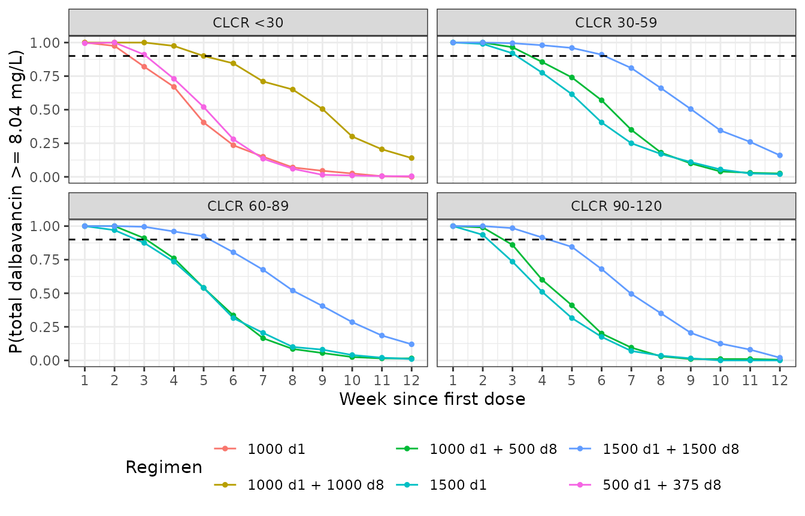
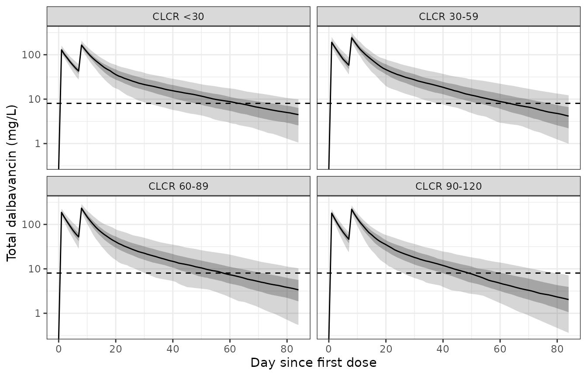

# Dalbavancin (Cojutti 2022)

## Model and source

- Citation: Cojutti PG, Tedeschi S, Gatti M, Zamparini E, Meschiari M,
  Siega PD, Mazzitelli M, Soavi L, Binazzi R, Erne EM, Rizzi M, Cattelan
  AM, Tascini C, Mussini C, Viale P, Pea F. Population Pharmacokinetic
  and Pharmacodynamic Analysis of Dalbavancin for Long-Term Treatment of
  Subacute and/or Chronic Infectious Diseases: The Major Role of
  Therapeutic Drug Monitoring. Antibiotics (Basel). 2022;11(8):996.
  <doi:10.3390/antibiotics11080996>
- Description: Two-compartment intravenous population PK model for
  dalbavancin in adults receiving long-term,
  therapeutic-drug-monitoring-guided dalbavancin for subacute or chronic
  Gram-positive infections (mostly bone and joint infections, plus
  endocarditis and endovascular prosthetic infections). Dalbavancin
  clearance rises exponentially with CKD-EPI creatinine clearance; the
  effect is UNCENTERED, so exp(lcl) is the clearance intercept
  extrapolated to CLCR = 0, not a clearance at any physiological renal
  function.
- Article: <https://doi.org/10.3390/antibiotics11080996>
- Supplement (Tables S1-S4, model building):
  <https://www.mdpi.com/article/10.3390/antibiotics11080996/s1>

Cojutti 2022 fitted 289 total plasma dalbavancin concentrations from 69
adults who received long-term, therapeutic-drug-monitoring (TDM) guided
dalbavancin, mostly for bone and joint infections. The final model is a
two-compartment intravenous model in which creatinine clearance
(CKD-EPI, mL/min/1.73 m^2) is the only covariate, acting on clearance.

The covariate effect is **uncentered and exponential**,
`CL = 0.029 x exp(0.0043 x CLCR)`, although Methods 4.2 describes
continuous-covariate effects as a “power function”. The paper’s own
numbers decide between the two: the exponential form gives
`0.029 x exp(0.0043 x 93) = 0.0433` L/h at the cohort median CLCR,
against the median individual clearance of 0.043 L/h reported in Results
2.2 and the Discussion. A power term with an exponent of 0.0043 would
hold CL at about 0.029 L/h for every CLCR. The same group’s later
dalbavancin analysis prints this exponential form verbatim (see
`modellib("Cojutti_2024_dalbavancin")`). The target-attainment durations
below, which the paper reports for four renal-function classes, are
reproduced under the exponential reading.

## Population

    #> ℹ parameter labels from comments will be replaced by 'label()'

| Field | Value |
|:---|:---|
| Subjects | 69 |
| Observations | 289 total dalbavancin plasma concentrations (Results 2.2); median 3 (range 1-19) TDM samples per patient |
| Age | 62 years (range 19-90 years) |
| Weight | 75 kg (range 42-143 kg) |
| Female (%) | 36.2 |
| Renal function | CKD-EPI CLCR median 93.0 mL/min/1.73 m^2, IQR 72.0-104.0, range 3.0-141.0 (Results 2.1, Table 1). |
| Disease | Adults with documented or suspected Gram-positive infections treated with dalbavancin as second-line, long-term therapy. Table 1: prosthetic joint infection 26 (37.7%), osteomyelitis 11 (15.9%), endovascular prosthetic infection 9 (13.0%), endocarditis 7 (10.1%), spondylodiscitis 5 (7.2%), infected pseudoarthrosis non-unions 4 (5.8%), septic arthritis 1 (1.5%), and 6 patients with two infection sites. 63/69 (91.3%) had a microbiological isolate; MRSA and methicillin-resistant S. epidermidis made up 55/74 isolates. |
| Dosing | All patients started with two intravenous doses on days 1 and 8 of 1000 mg or 1500 mg (Methods 4.1); 32/69 received exactly two doses (27 of them 1500 mg one week apart), 17 received three and 20 received 4-14 doses (Results 2.1). Infusion duration is not stated. |
| Regions | Italy (Bologna, Modena, Udine, Padua, Bergamo, Bolzano) |

Cojutti 2022 study population (Results 2.1, Table 1, Methods 4.1).
{.table}

The cohort was 44 men and 25 women, median age 62 years (IQR 51-73),
median weight 75 kg (IQR 62-88) and median CKD-EPI creatinine clearance
93.0 mL/min/1.73 m^2 (range 3.0-141.0). Every patient started with two
doses one week apart (days 1 and 8) of 1000 or 1500 mg; 37 of the 69
went on to receive three or more doses (Results 2.1).

## Source trace

| Element | Value | Source |
|----|----|----|
| Structural model | 2-compartment, IV, linear elimination | Results 2.2; Supplement Table S1 |
| `lcl` | CL = 0.029 L/h (intercept at CLCR = 0) | Table 2, Final Model |
| `e_crcl_cl` | 0.0043 per mL/min/1.73 m^2 | Table 2, Final Model (beta CLcr-CL) |
| `lvc` | V1 = 6.14 L | Table 2, Final Model |
| `lq` | Q = 0.026 L/h | Table 2, Final Model |
| `lvp` | V2 = 9.52 L | Table 2, Final Model |
| `etalcl` | 26.44 %CV -\> log(1 + 0.2644^2) = 0.0676 | Table 2, Final Model |
| `etalvc` | 16.10 %CV -\> 0.0256 | Table 2, Final Model |
| `etalq` | 50.90 %CV -\> 0.2304 | Table 2, Final Model |
| `etalvp` | 37.15 %CV -\> 0.1293 | Table 2, Final Model |
| `propSd` | 0.3392 | Table 2, Final Model (b, proportional) |
| CLCR on CL, exponential and uncentered | `cl = exp(lcl + etalcl) * exp(e_crcl_cl * CRCL)` | Results 2.2 (median CL 0.043 L/h); Supplement Tables S2-S4 |
| CLCR estimating equation | CKD-EPI | Methods 4.1; Supplement Table S2 |
| PK/PD target | total dalbavancin \>= 8.04 mg/L | Methods 4.1, 4.4 |

## Virtual cohort

Methods 4.4 simulated 1000 subjects per scenario in four renal-function
classes (CLCR \< 30, 30-59, 60-89 and 90-120 mL/min/1.73 m^2) with the
approved and the doubled dosing regimens. Here each class-by-regimen arm
has 200 subjects, with CLCR drawn uniformly within the class.

``` r

# set.seed() seeds the covariate draws below. It does not fix rxode2's
# simulation RNG across machines (its streams are partitioned per solver
# thread), so every assertion in this vignette is written to hold for any
# cohort the model can produce.
set.seed(20220724)
rxode2::rxSetSeed(20220724)

n_per_arm <- 200L

# Renal-function classes of Results 2.3. The lowest class is drawn on [5, 29]
# (the cohort minimum was 3.0 mL/min/1.73 m^2).
crcl_classes <- tibble(
  crcl_class = c("CLCR <30", "CLCR 30-59", "CLCR 60-89", "CLCR 90-120"),
  lo = c(5, 30, 60, 90),
  hi = c(29, 59, 89, 120)
)

# Regimens of Methods 4.4: day-1 and day-8 doses (mg). The approved regimens
# are 1000 mg or 500 + 375 mg for CLCR < 30, and 1500 mg or 1000 + 500 mg for
# CLCR >= 30; the doubled regimens are 1000 + 1000 mg and 1500 + 1500 mg.
regimens <- tribble(
  ~regimen,              ~renal,  ~d1,  ~d8,
  "1000 d1",             "low",  1000,    0,
  "500 d1 + 375 d8",     "low",   500,  375,
  "1000 d1 + 1000 d8",   "low",  1000, 1000,
  "1500 d1",             "high", 1500,    0,
  "1000 d1 + 500 d8",    "high", 1000,  500,
  "1500 d1 + 1500 d8",   "high", 1500, 1500
)

arms <- crossing(regimens, crcl_classes) |>
  filter((renal == "low") == (crcl_class == "CLCR <30")) |>
  mutate(arm = row_number())

subjects <- arms |>
  rowwise() |>
  reframe(
    arm = arm, regimen = regimen, crcl_class = crcl_class, d1 = d1, d8 = d8,
    CRCL = runif(n_per_arm, lo, hi)
  ) |>
  mutate(id = row_number())

# Day 1 is time 0. The infusion duration is not stated in the paper; the
# labelled 30 min is used (immaterial on a terminal half-life above 200 h).
doses <- bind_rows(
  subjects |> mutate(time = 0, amt = d1),
  subjects |> mutate(time = 168, amt = d8)
) |>
  filter(amt > 0) |>
  mutate(evid = 1L, cmt = "central", dur = 0.5)

obs <- subjects |>
  crossing(time = seq(0, 12 * 168, by = 24)) |>
  mutate(evid = 0L, cmt = "central", amt = NA_real_, dur = NA_real_)

events <- bind_rows(doses, obs) |>
  select(id, time, evid, cmt, amt, dur, CRCL, regimen, crcl_class) |>
  arrange(id, time, desc(evid))

stopifnot(length(unique(events$id)) == nrow(arms) * n_per_arm)
```

## Simulation

``` r

mod <- readModelDb("Cojutti_2022_dalbavancin")

sim <- rxode2::rxSolve(mod, events = events, keep = c("regimen", "crcl_class")) |>
  as.data.frame() |>
  mutate(week = time / 168)
#> ℹ parameter labels from comments will be replaced by 'label()'
```

## Probability of target attainment (Figure 3)

The paper calculates the probability that total plasma dalbavancin is at
least 8.04 mg/L at each week from week 2 to week 12, and calls a PTA of
at least 90% optimal (Methods 4.4). The comparison below uses the
individual predictions (`Cc`, without residual error).

``` r

pta <- sim |>
  filter(time %% 168 == 0, week >= 1) |>
  group_by(regimen, crcl_class, week) |>
  summarise(pta = mean(Cc >= 8.04), .groups = "drop")

ggplot(pta, aes(week, pta, colour = regimen)) +
  geom_line() +
  geom_point(size = 1) +
  geom_hline(yintercept = 0.9, linetype = "dashed") +
  facet_wrap(~crcl_class) +
  scale_x_continuous(breaks = 1:12) +
  labs(x = "Week since first dose", y = "P(total dalbavancin >= 8.04 mg/L)",
       colour = "Regimen") +
  theme_bw() +
  theme(legend.position = "bottom")
```



*Replicates Figure 3 of Cojutti 2022 (PTA over time by renal-function
class).*

Results 2.3 and the Abstract state how many weeks each regimen keeps the
PTA at or above 90%. “Approved dosage” there is read as the single doses
(1000 mg for CLCR \< 30, 1500 mg otherwise), which the Abstract names
explicitly for severe renal dysfunction. The split 1000 + 500 mg regimen
gives a simulated PTA of 0.91 at week 3 in CLCR 60-89, against 0.88 for
the single 1500 mg dose.

``` r

paper_weeks <- tribble(
  ~regimen,             ~crcl_class,    ~paper_weeks,
  "1000 d1",            "CLCR <30",      2,
  "1500 d1",            "CLCR 30-59",    3,
  "1500 d1",            "CLCR 60-89",    2,
  "1500 d1",            "CLCR 90-120",   2,
  "1000 d1 + 1000 d8",  "CLCR <30",      5,
  "1500 d1 + 1500 d8",  "CLCR 30-59",    6,
  "1500 d1 + 1500 d8",  "CLCR 60-89",    5,
  "1500 d1 + 1500 d8",  "CLCR 90-120",   4
)

sim_weeks <- pta |>
  filter(week >= 2) |>
  group_by(regimen, crcl_class) |>
  summarise(sim_weeks = max(c(1, week[pta >= 0.9])), .groups = "drop")

# The same durations computed on `sim` (individual prediction plus the 33.9%
# proportional residual error), for comparison.
sim_weeks_ruv <- sim |>
  filter(time %% 168 == 0, week >= 2) |>
  group_by(regimen, crcl_class, week) |>
  summarise(pta = mean(sim >= 8.04), .groups = "drop") |>
  group_by(regimen, crcl_class) |>
  summarise(sim_weeks_ruv = max(c(1, week[pta >= 0.9])), .groups = "drop")

duration_check <- paper_weeks |>
  left_join(sim_weeks, by = c("regimen", "crcl_class")) |>
  left_join(sim_weeks_ruv, by = c("regimen", "crcl_class")) |>
  left_join(pta |> rename(pta_at = pta), by = c("regimen", "crcl_class", "paper_weeks" = "week")) |>
  left_join(pta |> mutate(week = week - 1) |> rename(pta_after = pta),
            by = c("regimen", "crcl_class", "paper_weeks" = "week"))

duration_check |>
  dplyr::rename(
    "Regimen" = regimen, "Renal class" = crcl_class,
    "Weeks with PTA >= 90% (paper)" = paper_weeks,
    "Weeks with PTA >= 90% (simulated)" = sim_weeks,
    "Weeks, with residual error" = sim_weeks_ruv,
    "Simulated PTA at that week" = pta_at,
    "Simulated PTA one week later" = pta_after
  ) |>
  knitr::kable(digits = 3, caption = "Duration of optimal target attainment: Results 2.3 and Abstract vs. simulation.")
```

| Regimen | Renal class | Weeks with PTA \>= 90% (paper) | Weeks with PTA \>= 90% (simulated) | Weeks, with residual error | Simulated PTA at that week | Simulated PTA one week later |
|:---|:---|---:|---:|---:|---:|---:|
| 1000 d1 | CLCR \<30 | 2 | 2 | 2 | 0.975 | 0.820 |
| 1500 d1 | CLCR 30-59 | 3 | 3 | 2 | 0.920 | 0.775 |
| 1500 d1 | CLCR 60-89 | 2 | 2 | 2 | 0.970 | 0.875 |
| 1500 d1 | CLCR 90-120 | 2 | 2 | 1 | 0.935 | 0.735 |
| 1000 d1 + 1000 d8 | CLCR \<30 | 5 | 5 | 4 | 0.900 | 0.845 |
| 1500 d1 + 1500 d8 | CLCR 30-59 | 6 | 6 | 5 | 0.910 | 0.810 |
| 1500 d1 + 1500 d8 | CLCR 60-89 | 5 | 5 | 4 | 0.925 | 0.805 |
| 1500 d1 + 1500 d8 | CLCR 90-120 | 4 | 4 | 3 | 0.915 | 0.845 |

Duration of optimal target attainment: Results 2.3 and Abstract
vs. simulation. {.table}

``` r

# Each row: PTA is close to or above 90% at the paper's last optimal week and
# has fallen below 90% one week later. A 200-subject PTA near 0.9 carries a
# binomial SE of about 0.02, so the bounds sit about 4 SE from 0.9. A clearance
# or volume off by 20% moves the crossing by a full week and fails this.
stopifnot(
  all(duration_check$pta_at > 0.82),
  all(duration_check$pta_after < 0.95)
)
```

## Concentration percentiles (Figure 4)

``` r

double_arms <- c("1000 d1 + 1000 d8", "1500 d1 + 1500 d8")
pct <- sim |>
  filter(regimen %in% double_arms) |>
  group_by(crcl_class, regimen, day = time / 24) |>
  summarise(
    p05 = quantile(Cc, 0.05), p25 = quantile(Cc, 0.25), p50 = median(Cc),
    p75 = quantile(Cc, 0.75), p95 = quantile(Cc, 0.95), .groups = "drop"
  )

ggplot(pct, aes(day)) +
  geom_ribbon(aes(ymin = p05, ymax = p95), alpha = 0.2) +
  geom_ribbon(aes(ymin = p25, ymax = p75), alpha = 0.3) +
  geom_line(aes(y = p50)) +
  geom_hline(yintercept = 8.04, linetype = "dashed") +
  facet_wrap(~crcl_class) +
  scale_y_log10() +
  labs(x = "Day since first dose", y = "Total dalbavancin (mg/L)") +
  theme_bw()
#> Warning in scale_y_log10(): log-10 transformation introduced infinite values.
#> log-10 transformation introduced infinite values.
#> log-10 transformation introduced infinite values.
#> log-10 transformation introduced infinite values.
#> log-10 transformation introduced infinite values.
```



*Replicates Figure 4 of Cojutti 2022: median, 25th-75th and 5th-95th
percentiles of the doubled regimens (1000 mg one week apart for CLCR \<
30, 1500 mg one week apart otherwise).*

Results 2.3 quotes the range covering 90% of the simulated
concentrations at the last week of optimal attainment in each class.

``` r

paper_ranges <- tribble(
  ~crcl_class,    ~week, ~p05_paper, ~p95_paper,
  "CLCR <30",         5,        7.9,       36.0,
  "CLCR 30-59",       6,        8.6,       44.8,
  "CLCR 60-89",       5,        6.9,       39.0,
  "CLCR 90-120",      4,        7.6,       43.7
)

range_check <- paper_ranges |>
  left_join(
    sim |>
      filter(regimen %in% double_arms, time %% 168 == 0) |>
      group_by(crcl_class, week) |>
      summarise(p05_sim = quantile(Cc, 0.05), p95_sim = quantile(Cc, 0.95), .groups = "drop"),
    by = c("crcl_class", "week")
  ) |>
  mutate(
    mid_paper = sqrt(p05_paper * p95_paper),
    mid_sim = sqrt(p05_sim * p95_sim),
    mid_pct_diff = 100 * (mid_sim / mid_paper - 1)
  )

range_check |>
  select(crcl_class, week, p05_paper, p95_paper, p05_sim, p95_sim, mid_pct_diff) |>
  dplyr::rename(
    "Renal class" = crcl_class, "Week" = week,
    "5th pct (paper, mg/L)" = p05_paper, "95th pct (paper, mg/L)" = p95_paper,
    "5th pct (simulated)" = p05_sim, "95th pct (simulated)" = p95_sim,
    "Geometric midpoint difference (%)" = mid_pct_diff
  ) |>
  knitr::kable(digits = 1, caption = "90% concentration range at the last optimal week: Results 2.3 vs. simulation.")
```

| Renal class | Week | 5th pct (paper, mg/L) | 95th pct (paper, mg/L) | 5th pct (simulated) | 95th pct (simulated) | Geometric midpoint difference (%) |
|:---|---:|---:|---:|---:|---:|---:|
| CLCR \<30 | 5 | 7.9 | 36.0 | 6.9 | 33.4 | -9.6 |
| CLCR 30-59 | 6 | 8.6 | 44.8 | 7.0 | 34.5 | -20.8 |
| CLCR 60-89 | 5 | 6.9 | 39.0 | 6.1 | 40.6 | -3.9 |
| CLCR 90-120 | 4 | 7.6 | 43.7 | 7.0 | 39.3 | -9.2 |

90% concentration range at the last optimal week: Results 2.3
vs. simulation. {.table}

``` r

# The geometric midpoint of the 5th-95th range is a robust centre of the
# distribution. A 2-fold transcription error in CL or a volume moves it by
# far more than these bounds. The CLCR 30-59 row gets a wider bound because its
# printed range disagrees with the paper's own PTA statement (see below).
consistent <- range_check$crcl_class != "CLCR 30-59"
stopifnot(
  all(abs(range_check$mid_pct_diff[consistent]) < 20),
  abs(range_check$mid_pct_diff[!consistent]) < 40
)
```

The CLCR \< 30, 60-89 and 90-120 classes agree within 10% on the
geometric midpoint. The CLCR 30-59 class at week 6 sits 21% lower than
the paper’s range (8.6-44.8 mg/L). That printed range is itself hard to
reconcile with the paper’s Figure 3: a 5th percentile of 8.6 mg/L means
more than 95% of subjects are above 8.04 mg/L at week 6, yet the paper
places the end of optimal attainment for this class at week 6, so a 7th
week above 90% would be expected. The simulated PTA crosses 90% at week
6 as the paper states.

## Non-compartmental analysis

The paper reports the median individual CL (0.043 L/h) and the total
volume `V1 + V2` (15.66 L, Discussion) and states an elimination
half-life above 180 h. The NCA below is the typical-value profile after
a single 1500 mg dose at the cohort median CLCR of 93 mL/min/1.73 m^2
and at the midpoints of the four renal-function classes.

``` r

nca_arms <- tibble(
  treatment = c("CLCR 15", "CLCR 45", "CLCR 75", "CLCR 93 (cohort median)", "CLCR 105"),
  CRCL = c(15, 45, 75, 93, 105)
) |>
  mutate(id = row_number())

nca_times <- sort(unique(c(seq(0, 4, by = 0.1), seq(4, 48, by = 0.5),
                           seq(48, 24 * 120, by = 6))))

nca_events <- bind_rows(
  nca_arms |> mutate(time = 0, amt = 1500, evid = 1L, cmt = "central", dur = 0.5),
  nca_arms |> crossing(time = nca_times) |>
    mutate(cmt = "central", amt = NA_real_, evid = 0L, dur = NA_real_)
) |>
  arrange(id, time, desc(evid))

nca_sim <- rxode2::rxSolve(rxode2::zeroRe(mod), nca_events, keep = "treatment") |>
  as.data.frame()
#> ℹ parameter labels from comments will be replaced by 'label()'
#> ℹ omega/sigma items treated as zero: 'etalcl', 'etalvc', 'etalq', 'etalvp'
#> Warning: multi-subject simulation without without 'omega'

stopifnot(all(nca_sim$Cc >= 0))

sim_nca <- nca_sim |>
  filter(!is.na(Cc)) |>
  select(id, time, Cc, treatment)

sim_nca <- bind_rows(
  sim_nca,
  sim_nca |> distinct(id, treatment) |> mutate(time = 0, Cc = 0)
) |>
  distinct(id, treatment, time, .keep_all = TRUE) |>
  arrange(id, treatment, time)

conc_obj <- PKNCA::PKNCAconc(sim_nca, Cc ~ time | treatment + id)
dose_obj <- PKNCA::PKNCAdose(
  nca_events |> filter(evid == 1) |> select(id, time, amt, treatment),
  amt ~ time | treatment + id
)
intervals <- data.frame(
  start = 0, end = Inf,
  cmax = TRUE, tmax = TRUE, aucinf.obs = TRUE,
  half.life = TRUE, cl.obs = TRUE, vss.obs = TRUE, aucpext.obs = TRUE
)
nca_res <- PKNCA::pk.nca(PKNCA::PKNCAdata(conc_obj, dose_obj, intervals = intervals))
```

``` r

nca_wide <- as.data.frame(nca_res) |>
  select(treatment, PPTESTCD, PPORRES) |>
  tidyr::pivot_wider(names_from = PPTESTCD, values_from = PPORRES) |>
  left_join(nca_arms |> select(treatment, CRCL), by = "treatment") |>
  mutate(cl_closed = 0.029 * exp(0.0043 * CRCL))

nca_wide |>
  select(treatment, cmax, tmax, aucinf.obs, half.life, cl.obs, cl_closed, vss.obs, aucpext.obs) |>
  dplyr::rename(
    "CLCR arm" = treatment, "Cmax (mg/L)" = cmax, "Tmax (h)" = tmax,
    "AUC0-inf (mg*h/L)" = aucinf.obs, "t1/2 (h)" = half.life,
    "CL by NCA (L/h)" = cl.obs, "CL closed form (L/h)" = cl_closed,
    "Vss by NCA (L)" = vss.obs, "AUC extrapolated (%)" = aucpext.obs
  ) |>
  knitr::kable(digits = 3, caption = "NCA of the typical-value 1500 mg single-dose profile.")
```

| CLCR arm | Cmax (mg/L) | Tmax (h) | AUC0-inf (mg\*h/L) | t1/2 (h) | CL by NCA (L/h) | CL closed form (L/h) | Vss by NCA (L) | AUC extrapolated (%) |
|:---|---:|---:|---:|---:|---:|---:|---:|---:|
| CLCR 105 | 243.589 | 0.5 | 32931.67 | 435.798 | 0.046 | 0.046 | 15.667 | 0.501 |
| CLCR 15 | 243.734 | 0.5 | 48490.54 | 537.108 | 0.031 | 0.031 | 15.658 | 1.487 |
| CLCR 45 | 243.692 | 0.5 | 42623.19 | 498.354 | 0.035 | 0.035 | 15.661 | 1.040 |
| CLCR 75 | 243.644 | 0.5 | 37465.49 | 464.846 | 0.040 | 0.040 | 15.664 | 0.723 |
| CLCR 93 (cohort median) | 243.612 | 0.5 | 34675.39 | 446.957 | 0.043 | 0.043 | 15.666 | 0.580 |

NCA of the typical-value 1500 mg single-dose profile. {.table}

``` r


published_nca <- tibble::tribble(
  ~treatment,                 ~cl.obs, ~vss.obs,
  "CLCR 93 (cohort median)",    0.043,    15.66
)

knitr::kable(
  nlmixr2lib::ncaComparisonTable(
    simulated = nca_res,
    reference = published_nca,
    by = "treatment",
    units = c(cl.obs = "L/h", vss.obs = "L"),
    tolerance_pct = 20
  ),
  caption = paste("Simulated vs. Cojutti 2022 (Results 2.2 median CL; Discussion V).",
                  "* differs from reference by >20%."),
  align = c("l", "l", "r", "r", "r")
)
```

| NCA parameter | treatment               | Reference | Simulated | % diff |
|:--------------|:------------------------|----------:|----------:|-------:|
| CL/F (L/h)    | CLCR 93 (cohort median) |     0.043 |    0.0433 |  +0.6% |
| Vss/F (L)     | CLCR 93 (cohort median) |      15.7 |      15.7 |  +0.0% |

Simulated vs. Cojutti 2022 (Results 2.2 median CL; Discussion V). \*
differs from reference by \>20%. {.table}

``` r

# Dose / AUCinf of a linear model is CL exactly; the residual is truncation of
# the 120 day window.
stopifnot(max(abs(nca_wide$cl.obs / nca_wide$cl_closed - 1)) < 0.02)
stopifnot(max(nca_wide$aucpext.obs) < 5)
# Vss of a two-compartment model is V1 + V2 = 15.66 L.
stopifnot(max(abs(nca_wide$vss.obs / 15.66 - 1)) < 0.02)
# Discussion: elimination half-life above 180 h.
stopifnot(all(nca_wide$half.life > 180))
```

[`ncaComparisonTable()`](https://nlmixr2.github.io/nlmixr2lib/reference/ncaComparisonTable.md)
labels the rows “CL/F” and “Vss/F”; dalbavancin is given intravenously,
so F = 1. The typical CL at the median CLCR and the total volume both
reproduce the paper’s values.

## Assumptions and deviations

- **Covariate functional form.** Methods 4.2 calls the
  continuous-covariate model a “power function”, but the estimated
  coefficient (0.0043) only makes sense as an uncentered exponential
  effect, `CL = 0.029 x exp(0.0043 x CLCR)`. That form reproduces the
  reported median CL (0.043 L/h), every PTA duration in Results 2.3, and
  the form printed verbatim in this group’s later dalbavancin model. The
  supplement (Tables S1-S4) documents the covariate search but does not
  print the equation.
- **IIV scale.** Table 2 heads its random effects “Inter-patient %CV”.
  They are converted to log-scale variances with
  `omega^2 = log(1 + CV^2)`. The alternative reading (that the column is
  100 x omega) changes the variances by 1-12% (largest for Q, 0.259 vs
  0.230) and cannot be told apart with the information in the paper,
  which reports RSEs but no confidence intervals.
- **CLCR within class.** Drawn uniformly within each renal-function
  class; the paper does not state the distribution. The lowest class is
  drawn on \[5, 29\].
- **Infusion duration.** Not stated; 30 min is used.
- **Residual error is not applied to the PTA.** Methods 4.4 does not say
  whether Simulx added residual error. The PTA durations reproduce
  without it. With the 33.9% proportional error added, 6 of the eight
  durations come out shorter than the paper’s (see the “Weeks, with
  residual error” column), so the paper’s PTA is read as computed on the
  individual predictions.
- **Week convention.** “Week n” is taken as n x 168 h after the first
  dose.
- **CLCR 30-59 range at week 6.** See the Figure 4 section: the printed
  range is internally inconsistent with the paper’s own PTA statement
  and is not reproduced; nothing was adjusted.
- **Covariates screened but not retained** (age, sex, weight, height,
  albumin, serum creatinine) are documented in the model’s
  `covariatesDataExcluded`.
