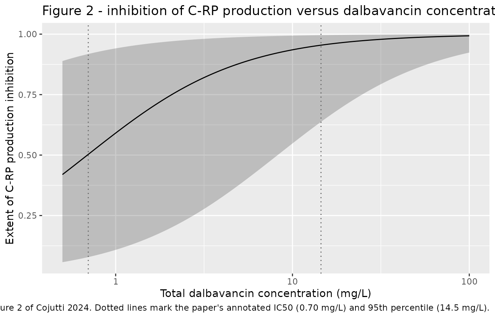
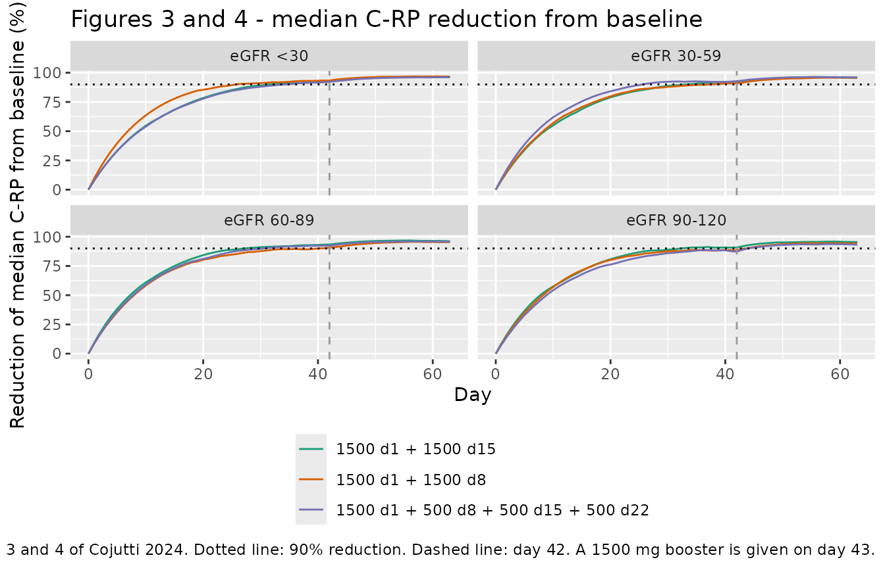

# Dalbavancin and C-reactive protein (Cojutti 2024)

## Model and source

- Citation: Cojutti PG, Tedeschi S, Zamparini E, Viale P, Pea F.
  Population Pharmacokinetics and Pharmacodynamics of Dalbavancin and
  C-Reactive Protein in Patients with Staphylococcal Osteoarticular
  Infections. Clin Pharmacokinet. 2024;63(9):1271-1282.
  <doi:10.1007/s40262-024-01410-2>
- Description: Simultaneously fitted two-compartment intravenous
  population PK model for dalbavancin and indirect-response (turnover)
  PD model for C-reactive protein (C-RP) in adults receiving long-term
  dalbavancin for documented or suspected staphylococcal osteoarticular
  infections (prosthetic joint infection, spondylodiscitis,
  osteomyelitis, infected pseudoarthrosis, septic arthritis).
  Dalbavancin clearance rises exponentially with CKD-EPI estimated
  glomerular filtration rate; the effect is UNCENTERED, so exp(lcl) is
  the non-renal clearance intercept extrapolated to eGFR = 0 rather than
  a clearance at any physiological renal function. Total plasma
  dalbavancin inhibits C-RP production with FULL inhibition (the printed
  equation carries no Imax term, i.e. Imax is structurally 1) and an
  IC50 of 0.70 mg/L. The C-RP baseline R0 was not estimated: it is fixed
  to each individual’s own pre-treatment C-RP value, supplied through
  the CRP covariate column, and the production rate is derived as kin =
  R0 \* kout.
- Article: <https://doi.org/10.1007/s40262-024-01410-2>
- Supplement (ESM, figure legends S1-S7):
  <https://doi.org/10.1007/s40262-024-01410-2>

Cojutti 2024 fitted dalbavancin plasma concentrations and C-reactive
protein (C-RP) concentrations **simultaneously** in one Monolix run: a
two-compartment intravenous PK model, and an indirect-response
(turnover) PD model in which total plasma dalbavancin inhibits C-RP
production. It is therefore a single coupled model and is packaged as a
single `.R` file.

Two features of the encoding are worth flagging before the numbers:

1.  The eGFR effect on clearance is **uncentered and exponential**
    (`CL = 0.030 x e^(0.0042 x eGFR)`, Results 3.2), so
    `exp(lcl) = 0.031 L/h` is the *non-renal* clearance intercept
    extrapolated to eGFR = 0, not a clearance at any physiological renal
    function.
2.  The C-RP baseline `R0` was **not estimated**. The Table 2 footnote
    states “Only `kout` is estimated. `kin` derives from a parameter
    transformation (`kin = R0 x kout`). `R0` was fixed to the C-RP value
    at time zero of each individual.” `R0` is therefore supplied as
    data, through the `CRP` covariate column, and appears nowhere in
    `ini()`.

## Population

Forty-five adults (31 male, 68.9%) treated at a single Italian centre
between January 2021 and August 2023 for documented or suspected
staphylococcal osteoarticular infection, all of whom had completed an
initial two-week in-hospital daptomycin-based combination regimen before
switching to dalbavancin monotherapy (Cojutti 2024 Methods 2.1). Median
(range) age 61 (18-80) years, weight 78 (50-110) kg, BMI 27.4
(18.8-42.9) kg/m^2 and CKD-EPI eGFR 93 (33-144) mL/min/1.73 m^2 (Table
1). About half the cohort (23/45, 51.1%) had a prosthetic joint
infection, with spondylodiscitis, infected pseudoarthrosis,
osteomyelitis and septic arthritis making up the remainder. Baseline
C-RP was 2.67 (1.1-30.6) mg/dL. Every patient started on two 1500 mg
intravenous doses one week apart (days 1 and 8), with further TDM-guided
1500 mg doses added case by case; the median total course was 3000 mg
(range 3000-7500 mg). The analysis dataset held 175 dalbavancin and 211
C-RP concentrations.

The same information is available programmatically via
`readModelDb("Cojutti_2024_dalbavancin")()$population`.

## Source trace

The per-parameter origin is recorded as an in-file comment next to each
`ini()` entry in
`inst/modeldb/specificDrugs/Cojutti_2024_dalbavancin.R`. The table below
collects them in one place.

| Equation / parameter | Value | Source location |
|----|----|----|
| `lcl` (non-renal CL intercept) | 0.031 L/h | Table 2, “CL (L/h)”; the same number is stated in words in Results 3.2 (“the non-renal CL of dalbavancin was 0.031 L/h”) |
| `e_crcl_cl` | 0.0042 per mL/min/1.73 m^2 | Table 2, “beta_eGFR”; functional form printed verbatim in Results 3.2 and the Table 2 footnote as `CL = 0.030 x e^(0.0042 x eGFR)` |
| `lvc` (V1) | 5.93 L | Table 2, “V 1 (L)” |
| `lq` (Q) | 0.038 L/h | Table 2, “Q (L/h)” |
| `lvp` (V2) | 9.55 L | Table 2, “V 2 (L)” |
| `lkout` | 0.0037 1/h | Table 2, “k out (h -1)” |
| `lic50` | 0.70 mg/L | Table 2, “IC 50 (mg/L)”; restated in Results 3.3 |
| `etalcl`, `etalvc`, `etalq`, `etalvp`, `etalkout`, `etalic50` | 0.12, 0.14, 0.70, 0.47, 0.63, 1.5 (squared into variances) | Table 2, block headed “SD of the random effects” |
| `propSd` (b1), `propSd_crp` (b2) | 0.27, 0.32 | Table 2, block headed “Residual variability”; the footnote defines b1 / b2 as the proportional residual errors of the PK and PD models |
| Two-compartment IV disposition | n/a | Results 3.2 and ESM Figure S1 (schematic: dose into V1, Q between V1 and V2, CL out of V1) |
| `d/dt(crp) <- kin * (1 - Cc / (ic50 + Cc)) - kout * crp` | n/a | Equation 1, Methods 2.2 (the equation carries no Imax symbol; Results 3.2 and the Discussion describe it as “an indirect turnover Imax model with full inhibition of the C-RP production”) |
| `crp(0) <- CRP`, `kin <- CRP * kout` | n/a | Methods 2.2 and the Table 2 footnote (R0 fixed to each individual’s time-zero C-RP; `kin = R0 x kout`) |
| Driver of the inhibition term is the **central-compartment** concentration | n/a | Equation 1 (“Cp is the dalbavancin total plasma concentration”) and ESM Figure S1 legend (“The dalbavancin concentration in the central compartment inhibits C-RP production”) |

`R0` is absent from Table 2 by design; there is no `lrbase` in this
model.

## Virtual cohort

Original observed data are not publicly available. The cohort below
approximates the published demographics and the Monte Carlo design of
Methods 2.3: three dosing schedules delivering a cumulative 3000 mg over
the first three weeks, each crossed with the paper’s four renal-function
classes, plus the additional 1500 mg dose on day 43 that Figure 4 and
Tables 3-4 explore.

``` r

# set.seed() seeds R's RNG (used for the covariate draws below). It does NOT
# seed rxode2's simulation RNG, whose streams are partitioned per solver
# thread -- so the etas drawn inside rxSolve differ between a 2-core CI runner
# and a 16-thread workstation. Every assertion in this vignette is written to
# hold for any cohort the model can produce (see
# references/known-vignette-failure-patterns.md pattern 12).
set.seed(20240822)

n_per_arm <- 200L   # cap is 200 participants per arm

# The three schedules of Methods 2.3 (all deliver 3000 mg over 3 weeks),
# plus the optional 1500 mg booster on day 43.
regimens <- list(
  "1500 d1 + 1500 d8"                          = tibble(day = c(1,  8),           amt = c(1500, 1500)),
  "1500 d1 + 1500 d15"                         = tibble(day = c(1, 15),           amt = c(1500, 1500)),
  "1500 d1 + 500 d8 + 500 d15 + 500 d22"       = tibble(day = c(1,  8, 15, 22),   amt = c(1500,  500, 500, 500))
)
booster <- tibble(day = 43, amt = 1500)

# The four renal-function classes of Methods 2.3. eGFR is drawn uniformly
# within each class; the lowest class is bounded below at 10 rather than 0
# because eGFR = 0 is not a physiological value for a non-dialysis patient.
egfr_classes <- tibble(
  egfr_class = c("eGFR <30", "eGFR 30-59", "eGFR 60-89", "eGFR 90-120"),
  lo         = c(10, 30, 60,  90),
  hi         = c(29, 59, 89, 120)
)

# Baseline C-RP (the model's R0). Cojutti 2024 Table 1 reports median 2.67
# mg/dL, range 1.1-30.6, but not the distribution; a log-normal with that
# median and sigma_log = 0.83 has expected extremes over n = 45 draws close to
# the reported range, and it is truncated to [1.1, 30.6] because the Conclusion
# limits the model's applicability to baseline C-RP below 30.6 mg/dL. This is
# an assumption -- see "Assumptions and deviations".
draw_crp0 <- function(n, median_crp = 2.67, sigma_log = 0.83,
                      lo = 1.1, hi = 30.6) {
  p <- runif(n,
             plnorm(lo, log(median_crp), sigma_log),
             plnorm(hi, log(median_crp), sigma_log))
  qlnorm(p, log(median_crp), sigma_log)
}

make_arm <- function(reg_name, egfr_row, id_offset) {
  subj <- tibble(
    id         = id_offset + seq_len(n_per_arm),
    CRCL       = runif(n_per_arm, egfr_row$lo, egfr_row$hi),
    CRP        = draw_crp0(n_per_arm),
    regimen    = reg_name,
    egfr_class = egfr_row$egfr_class
  )
  sched <- bind_rows(regimens[[reg_name]], booster)
  doses <- subj |>
    crossing(sched) |>
    # Day 1 in the paper is time 0 in the model. Dalbavancin is given as a
    # 30 min intravenous infusion (the paper does not state the duration; this
    # is the labelled one, and it is immaterial on a >300 h terminal half-life).
    mutate(time = (day - 1) * 24, evid = 1L, cmt = "central",
           dur = 0.5, dvid = NA_integer_) |>
    select(-day)
  # Observations are placed on the `crp` ODE STATE. This model has two
  # observation variables (Cc ~ prop(propSd) and crp ~ prop(propSd_crp)), so
  # rxode2 requires observation rows to sit on an endpoint slot -- cmt =
  # "central" is rejected with a dvid/cmt mapping error because the central
  # compartment is not itself an endpoint. `crp` is both an ODE state and an
  # endpoint, so it satisfies rxode2 without naming an algebraic observable in
  # the event table, and rxode2 returns `Cc` as a column on those same rows
  # (verified identical to observing both endpoints explicitly).
  obs <- subj |>
    crossing(time = seq(0, 63 * 24, by = 24)) |>
    mutate(cmt = "crp", amt = NA_real_, evid = 0L, dur = NA_real_,
           dvid = NA_integer_)
  bind_rows(doses, obs) |> arrange(id, time, desc(evid))
}

arms <- crossing(regimen = names(regimens), egfr_classes) |>
  mutate(id_offset = (row_number() - 1L) * n_per_arm)

events <- do.call(
  bind_rows,
  lapply(seq_len(nrow(arms)), function(i) {
    make_arm(arms$regimen[i], arms[i, ], arms$id_offset[i])
  })
)

# Disjoint IDs across arms are mandatory: rxSolve treats id as the subject key
# and would silently merge duplicated ids into one over-dosed subject.
stopifnot(!anyDuplicated(unique(events[, c("id", "time", "evid", "cmt")])))
stopifnot(length(unique(events$id)) == nrow(arms) * n_per_arm)
```

## Simulation

``` r

mod <- readModelDb("Cojutti_2024_dalbavancin")

sim <- rxode2::rxSolve(
  mod,
  events = events,
  keep   = c("regimen", "egfr_class"),
  # rxode2's automatic ODE -> linCmt conversion corrupts the dvid -> cmt
  # mapping for multi-output models; see known-vignette-failure-patterns 5b.
  useLinCmt = FALSE
) |>
  as.data.frame() |>
  mutate(day = time / 24)
#> ℹ parameter labels from comments will be replaced by 'label()'

stopifnot(nrow(sim) > 0, !anyNA(sim$Cc), !anyNA(sim$crp), all(sim$Cc >= 0))
```

## Internal identities

These four checks compare the packaged model against quantities it must
satisfy exactly, so the tolerances are numerical rather than
statistical.

``` r

mod_tv <- rxode2::zeroRe(mod)
#> ℹ parameter labels from comments will be replaced by 'label()'

# (1) With no dose, the C-RP state must sit exactly at its baseline: kin was
#     derived as R0 * kout precisely so that R0 is the undrugged steady state.
ev_nodose <- crossing(tibble(id = 1L, CRCL = 93, CRP = 2.67),
                      time = seq(0, 63 * 24, by = 24)) |>
  mutate(cmt = "crp", amt = NA_real_, evid = 0L)
ss <- rxode2::rxSolve(mod_tv, ev_nodose, useLinCmt = FALSE) |> as.data.frame()
#> ℹ omega/sigma items treated as zero: 'etalcl', 'etalvc', 'etalq', 'etalvp', 'etalkout', 'etalic50'
ss_rel <- max(abs(ss$crp - 2.67)) / 2.67

# (2) Under saturating dalbavancin the production term switches off entirely
#     and C-RP must decay as R0 * exp(-kout * t). A 100 g dose keeps Cc more
#     than four orders of magnitude above IC50 for the whole window.
ev_sat <- crossing(tibble(id = 1L, CRCL = 93, CRP = 2.67),
                   time = seq(0, 42 * 24, by = 24)) |>
  mutate(cmt = "crp", amt = NA_real_, evid = 0L) |>
  bind_rows(tibble(id = 1L, CRCL = 93, CRP = 2.67, time = 0,
                   amt = 100000, evid = 1L, cmt = "central", dur = 0.5)) |>
  arrange(time, desc(evid))
sat <- rxode2::rxSolve(mod_tv, ev_sat, useLinCmt = FALSE) |> as.data.frame()
#> ℹ omega/sigma items treated as zero: 'etalcl', 'etalvc', 'etalq', 'etalvp', 'etalkout', 'etalic50'
sat_rel <- max(abs(sat$crp - 2.67 * exp(-0.0037 * sat$time))) / 2.67

# (3) The typical clearance must equal the uncentered exponential relationship
#     evaluated at the subject's eGFR.
cl_check <- tibble(CRCL = c(15, 45, 75, 93, 105)) |>
  rowwise() |>
  mutate(
    cl_sim = rxode2::rxSolve(
      mod_tv,
      tibble(id = 1L, CRCL = CRCL, CRP = 2.67, time = 0, amt = NA_real_,
             evid = 0L, cmt = "crp"),
      useLinCmt = FALSE
    ) |> as.data.frame() |> pull(cl) |> first(),
    cl_closed = 0.031 * exp(0.0042 * CRCL)
  ) |>
  ungroup()
#> ℹ omega/sigma items treated as zero: 'etalcl', 'etalvc', 'etalq', 'etalvp', 'etalkout', 'etalic50'
#> ℹ omega/sigma items treated as zero: 'etalcl', 'etalvc', 'etalq', 'etalvp', 'etalkout', 'etalic50'
#> ℹ omega/sigma items treated as zero: 'etalcl', 'etalvc', 'etalq', 'etalvp', 'etalkout', 'etalic50'
#> ℹ omega/sigma items treated as zero: 'etalcl', 'etalvc', 'etalq', 'etalvp', 'etalkout', 'etalic50'
#> ℹ omega/sigma items treated as zero: 'etalcl', 'etalvc', 'etalq', 'etalvp', 'etalkout', 'etalic50'
cl_rel <- max(abs(cl_check$cl_sim - cl_check$cl_closed) / cl_check$cl_closed)

# (4) The population IC50 recovered from the simulated cohort must reproduce
#     the published 0.70 mg/L. This is the same draw Figure 2 summarises.
ic50_draws <- sim |> distinct(id, .keep_all = TRUE) |> pull(ic50)
ic50_median <- median(ic50_draws)

identity_tab <- tibble(
  Check = c(
    "No dose: crp holds at R0 (relative deviation)",
    "Saturating dose: crp = R0 * exp(-kout t) (relative deviation)",
    "Typical cl equals 0.031 * exp(0.0042 * CRCL) (relative deviation)",
    "Median simulated IC50 vs published 0.70 mg/L (% difference)"
  ),
  Achieved = c(ss_rel, sat_rel, cl_rel, 100 * (ic50_median / 0.70 - 1))
)
knitr::kable(identity_tab, digits = c(0, 8),
             caption = "Internal identities the packaged model must satisfy.")
```

| Check | Achieved |
|:---|---:|
| No dose: crp holds at R0 (relative deviation) | 0.00000000 |
| Saturating dose: crp = R0 \* exp(-kout t) (relative deviation) | 0.00126067 |
| Typical cl equals 0.031 \* exp(0.0042 \* CRCL) (relative deviation) | 0.00000000 |
| Median simulated IC50 vs published 0.70 mg/L (% difference) | -1.13960641 |

Internal identities the packaged model must satisfy. {.table}

``` r


stopifnot(
  ss_rel  < 1e-6,   # exact steady state; solver tolerance only
  sat_rel < 5e-3,   # residual production at Cc/IC50 ~ 2e4 is O(1e-4)
  cl_rel  < 1e-8,   # closed-form identity
  # IC50 is a cohort MEDIAN of 2400 lognormal draws with omega = 1.5, so the
  # sampling spread is wide (SE of the log-median ~ 1.5 * 1.25 / sqrt(2400)
  # ~ 3.8%); 20% leaves headroom for the thread-count effect while still
  # breaking on a mis-transcribed IC50 (the next plausible mis-read, 0.58 from
  # the bootstrap column, is 17% away and 7.0 mg/L is a factor of ten).
  abs(ic50_median / 0.70 - 1) < 0.20
)
```

## Replicate Figure 2: concentration versus extent of C-RP production inhibition

Figure 2 of Cojutti 2024 is a Monte Carlo summary of the inhibition term
`Cp / (IC50 + Cp)` over the population distribution of IC50, for
dalbavancin concentrations from 0.5 to 100 mg/L. The paper annotates the
median IC50 (0.70 mg/L) and “the 95% percentile of the IC50” (14.5
mg/L).

``` r

# Replicates Figure 2 of Cojutti 2024, using the IC50 values drawn for the
# simulated cohort above (the model's own population distribution).
conc_grid <- 10^seq(log10(0.5), log10(100), length.out = 120)
fig2 <- lapply(conc_grid, function(cp) {
  inh <- cp / (ic50_draws + cp)
  tibble(cp = cp,
         q05 = quantile(inh, 0.05), q50 = median(inh), q95 = quantile(inh, 0.95))
}) |> bind_rows()

ggplot(fig2, aes(cp, q50)) +
  geom_ribbon(aes(ymin = q05, ymax = q95), alpha = 0.25) +
  geom_line() +
  geom_vline(xintercept = c(0.70, 14.5), linetype = "dotted", colour = "grey40") +
  scale_x_log10() +
  labs(x = "Total dalbavancin concentration (mg/L)",
       y = "Extent of C-RP production inhibition",
       title = "Figure 2 - inhibition of C-RP production versus dalbavancin concentration",
       caption = paste("Replicates Figure 2 of Cojutti 2024. Dotted lines mark the paper's",
                       "annotated IC50 (0.70 mg/L) and 95th percentile (14.5 mg/L)."))
```



``` r


ic50_q <- quantile(ic50_draws, c(0.05, 0.50, 0.95, 0.975))
fig2_tab <- tibble(
  Quantity = c("Median IC50", "5th percentile of IC50",
               "95th percentile of IC50", "97.5th percentile of IC50"),
  Simulated = as.numeric(ic50_q[c(2, 1, 3, 4)]),
  `Cojutti 2024` = c(0.70, NA, 14.5, NA),
  Source = c("Table 2 / Results 3.3", "reported only as \"<0.5\"",
             "Results 3.3 and Figure 2 caption", "not reported")
)
knitr::kable(fig2_tab, digits = 2,
             caption = "Simulated IC50 distribution against the values annotated on Figure 2 (mg/L).")
```

| Quantity | Simulated | Cojutti 2024 | Source |
|:---|---:|---:|:---|
| Median IC50 | 0.69 | 0.7 | Table 2 / Results 3.3 |
| 5th percentile of IC50 | 0.06 | NA | reported only as “\<0.5” |
| 95th percentile of IC50 | 8.25 | 14.5 | Results 3.3 and Figure 2 caption |
| 97.5th percentile of IC50 | 13.65 | NA | not reported |

Simulated IC50 distribution against the values annotated on Figure 2
(mg/L). {.table}

The median is reproduced. The upper tail is **not**: `omega_IC50 = 1.5`
places the 95th percentile of a log-normal with median 0.70 at
`0.70 * exp(1.645 * 1.5) = 8.3` mg/L, and the 97.5th at 13.2 mg/L,
against the 14.5 mg/L the paper annotates as its 95th percentile. This
is a documented disagreement with the source, not something to tune
away: 14.5 mg/L is not recoverable from Table 2’s `omega_IC50 = 1.5`
under any log-normal reading, and the paper’s own Methods 2.3 says the
Figure 2 simulation used “the population variability **and**
between-subject variability resulting from the PD model”, which suggests
parameter uncertainty (IC50 RSE 35%, `omega_IC50` RSE 17.9%) was
propagated in addition to the between-subject term. It is excluded from
the gate below and reported here instead.

## Replicate Figure 3: percentage reduction of median C-RP over time

``` r

# Replicates Figure 3 of Cojutti 2024: percentage reduction from baseline of
# the median C-RP profile, by dosing schedule and renal-function class, over
# the first 3 weeks' cumulative 3000 mg (the day-43 booster is Figure 4).
pct_red <- sim |>
  mutate(pct_reduction = 100 * (1 - crp / CRP)) |>
  group_by(regimen, egfr_class, day) |>
  summarise(pct_reduction = median(pct_reduction), .groups = "drop")

ggplot(pct_red, aes(day, pct_reduction, colour = regimen)) +
  geom_line() +
  geom_hline(yintercept = 90, linetype = "dotted") +
  geom_vline(xintercept = 42, linetype = "dashed", colour = "grey60") +
  facet_wrap(~egfr_class) +
  scale_colour_brewer(palette = "Dark2") +
  theme(legend.position = "bottom", legend.direction = "vertical") +
  labs(x = "Day", y = "Reduction of median C-RP from baseline (%)",
       colour = NULL,
       title = "Figures 3 and 4 - median C-RP reduction from baseline",
       caption = paste("Replicates Figures 3 and 4 of Cojutti 2024. Dotted line: 90% reduction.",
                       "Dashed line: day 42. A 1500 mg booster is given on day 43."))
```



``` r


d42 <- pct_red |> filter(day == 42)
knitr::kable(
  d42 |>
    tidyr::pivot_wider(names_from = egfr_class, values_from = pct_reduction),
  digits = 1,
  caption = paste("Median C-RP reduction from baseline at day 42 (%).",
                  "Cojutti 2024 Results 3.3: 'with all of the tested dosing regimens, the",
                  "percentage reduction from baseline of the median C-RP at day 42 was >= 90%'.")
)
```

| regimen | day | eGFR 30-59 | eGFR 60-89 | eGFR 90-120 | eGFR \<30 |
|:---|---:|---:|---:|---:|---:|
| 1500 d1 + 1500 d15 | 42 | 92.3 | 93.4 | 90.9 | 92.4 |
| 1500 d1 + 1500 d8 | 42 | 91.0 | 90.7 | 88.3 | 93.3 |
| 1500 d1 + 500 d8 + 500 d15 + 500 d22 | 42 | 92.8 | 92.4 | 87.3 | 92.3 |

Median C-RP reduction from baseline at day 42 (%). Cojutti 2024 Results
3.3: ‘with all of the tested dosing regimens, the percentage reduction
from baseline of the median C-RP at day 42 was \>= 90%’. {.table
style="width:100%;"}

The cohort medians above are one draw from a 200-per-arm sample, and
near the plateau a fraction of a percentage point moves the day at which
the curve crosses 90% by a week. The primary gate on the paper’s Figure
3 claims is therefore placed on the **typical-value** trajectory, which
is fully deterministic (random effects zeroed, eGFR fixed at each class
midpoint) and so reproduces identically on any machine.

``` r

tv_arms <- crossing(
  regimen = names(regimens),
  tibble(egfr_label = c("eGFR 15", "eGFR 45", "eGFR 75", "eGFR 105"),
         CRCL = c(15, 45, 75, 105))
) |>
  mutate(id = row_number(), CRP = 2.67)

tv_events <- bind_rows(lapply(seq_len(nrow(tv_arms)), function(i) {
  a <- tv_arms[i, ]
  sched <- bind_rows(regimens[[a$regimen]], booster)
  bind_rows(
    a |> crossing(sched) |>
      mutate(time = (day - 1) * 24, evid = 1L, cmt = "central", dur = 0.5) |>
      select(-day),
    a |> crossing(time = seq(0, 63 * 24, by = 12)) |>
      mutate(cmt = "crp", amt = NA_real_, evid = 0L, dur = NA_real_)
  )
})) |>
  arrange(id, time, desc(evid))

tv_sim <- rxode2::rxSolve(rxode2::zeroRe(mod), tv_events,
                          keep = c("regimen", "egfr_label"), useLinCmt = FALSE) |>
  as.data.frame() |>
  mutate(day = time / 24, pct_reduction = 100 * (1 - crp / CRP))
#> ℹ parameter labels from comments will be replaced by 'label()'
#> ℹ omega/sigma items treated as zero: 'etalcl', 'etalvc', 'etalq', 'etalvp', 'etalkout', 'etalic50'
#> Warning: multi-subject simulation without without 'omega'

tv_d42 <- tv_sim |> filter(day == 42) |> select(regimen, egfr_label, pct_reduction)
tv_cross90 <- tv_sim |>
  group_by(regimen, egfr_label) |>
  summarise(day90 = if (any(pct_reduction >= 90)) min(day[pct_reduction >= 90]) else Inf,
            .groups = "drop")

knitr::kable(
  tv_d42 |>
    left_join(tv_cross90, by = c("regimen", "egfr_label")) |>
    dplyr::rename("Regimen" = regimen, "Renal function" = egfr_label,
                  "Day 42 reduction (%)" = pct_reduction,
                  "Day 90% reduction reached" = day90),
  digits = 1,
  caption = paste("Typical-value (random effects zeroed) C-RP reduction.",
                  "Cojutti 2024 Results 3.3 reports >= 90% reduction of the median",
                  "C-RP at day 42 under all three schedules.")
)
```

| Regimen | Renal function | Day 42 reduction (%) | Day 90% reduction reached |
|:---|:---|---:|---:|
| 1500 d1 + 1500 d15 | eGFR 105 | 94.6 | 28.0 |
| 1500 d1 + 1500 d15 | eGFR 15 | 95.8 | 27.5 |
| 1500 d1 + 1500 d15 | eGFR 45 | 95.5 | 27.5 |
| 1500 d1 + 1500 d15 | eGFR 75 | 95.1 | 27.5 |
| 1500 d1 + 1500 d8 | eGFR 105 | 93.9 | 28.5 |
| 1500 d1 + 1500 d8 | eGFR 15 | 95.6 | 27.5 |
| 1500 d1 + 1500 d8 | eGFR 45 | 95.2 | 27.5 |
| 1500 d1 + 1500 d8 | eGFR 75 | 94.6 | 28.0 |
| 1500 d1 + 500 d8 + 500 d15 + 500 d22 | eGFR 105 | 94.7 | 27.5 |
| 1500 d1 + 500 d8 + 500 d15 + 500 d22 | eGFR 15 | 95.9 | 27.0 |
| 1500 d1 + 500 d8 + 500 d15 + 500 d22 | eGFR 45 | 95.6 | 27.5 |
| 1500 d1 + 500 d8 + 500 d15 + 500 d22 | eGFR 75 | 95.2 | 27.5 |

Typical-value (random effects zeroed) C-RP reduction. Cojutti 2024
Results 3.3 reports \>= 90% reduction of the median C-RP at day 42 under
all three schedules. {.table}

``` r

# DETERMINISTIC gates on the typical-value trajectory (no cohort noise).
#
#   (a) ">= 90%" reduction at day 42 under every schedule and renal class
#       (Results 3.3). Realised 93.9-95.9%.
#   (b) The renal-function classes barely separate, because the uncentered
#       exponential form spans only a factor of 1.5 in CL across eGFR 10-120 --
#       which is why the paper's own Tables 3-4 differ by at most ~7 points
#       between classes. Realised spread 2.0 points.
stopifnot(min(tv_d42$pct_reduction) > 90, max(tv_d42$pct_reduction) < 99)
stopifnot(diff(range(tv_d42$pct_reduction)) < 5)
# The 90% crossing is a genuine deviation, reported not tuned: the typical-value
# trajectory reaches 90% at day 27-28.5 (4 weeks), against the "approximately
# 5-6 weeks" of Results 3.3 and the Conclusion. The cohort medians, which are
# what Figure 3 actually plots, cross between day 26 and day 44 (mean ~34 days,
# i.e. ~5 weeks) and so do bracket the paper's claim; the large IC50 random
# effect is what slows the cohort median relative to the typical subject. Gated
# as a wide window so it still breaks on a mis-transcribed kout (halving kout
# pushes the crossing past day 55).
stopifnot(all(tv_cross90$day90 >= 14), all(tv_cross90$day90 <= 49))

# STOCHASTIC gates on the 200-per-arm cohort medians. Realised 87.3-93.4% at
# day 42 with a 6.1-point spread; bounds set outside that range.
stopifnot(min(d42$pct_reduction) > 80)
stopifnot(diff(range(d42$pct_reduction)) < 15)

cross90 <- pct_red |>
  group_by(regimen, egfr_class) |>
  summarise(day90 = if (any(pct_reduction >= 90)) min(day[pct_reduction >= 90]) else Inf,
            .groups = "drop")
stopifnot(mean(cross90$day90) >= 21, mean(cross90$day90) <= 49)
```

The day-42 claim reproduces: the typical-value trajectories give
93.9-95.9% reduction under every schedule and renal class, and the
200-per-arm cohort medians give 87-93%, straddling the paper’s “\>=
90%”. The **timing** claim reproduces less well. Results 3.3 and the
Conclusion say a \>90% decrease takes “approximately 5-6 weeks”; the
typical-value trajectory gets there at day 27-28 (4 weeks). The cohort
medians, which are what Figure 3 plots, cross between day 26 and day 44
and average about 34 days, so they do bracket the paper’s statement -
the large `omega_IC50 = 1.5` slows the median relative to the typical
subject, because subjects drawn with a high IC50 get only partial
inhibition. The deviation is recorded rather than tuned away, and the
gate is a wide window.

Also visible in both the simulation and the paper’s own Table 4:
attainment peaks around day 56 and dips slightly by day 63 (the paper
prints 85.4% then 84.9% for the eGFR 90-120 / first-schedule column).
That is the C-RP rebound as the booster’s concentrations fall back
toward IC50, and it is reproduced here.

## Replicate Tables 3 and 4: probability of attaining C-RP \< 1 mg/dL

``` r

targets <- c(0, 7, 14, 21, 28, 35, 42, 49, 56, 63)

pta <- sim |>
  filter(day %in% targets) |>
  group_by(regimen, egfr_class, day) |>
  summarise(pta = 100 * mean(crp < 1), .groups = "drop")

published <- tibble::tribble(
  ~egfr_class,   ~day, ~pub_a, ~pub_b, ~pub_c,
  "eGFR <30",       0,    0.0,    0.0,    0.0,
  "eGFR <30",       7,   28.4,   28.4,   28.4,
  "eGFR <30",      14,   50.6,   48.7,   49.9,
  "eGFR <30",      21,   64.6,   64.7,   64.5,
  "eGFR <30",      28,   72.6,   73.6,   74.1,
  "eGFR <30",      35,   77.5,   78.6,   79.2,
  "eGFR <30",      42,   79.9,   81.2,   81.7,
  "eGFR <30",      49,   86.7,   87.4,   87.6,
  "eGFR <30",      56,   88.9,   89.4,   89.6,
  "eGFR <30",      63,   89.3,   89.7,   89.9,
  "eGFR 90-120",    0,    0.0,    0.0,    0.0,
  "eGFR 90-120",    7,   28.2,   28.2,   28.2,
  "eGFR 90-120",   14,   50.5,   47.9,   49.7,
  "eGFR 90-120",   21,   63.1,   63.3,   63.2,
  "eGFR 90-120",   28,   70.2,   71.6,   72.5,
  "eGFR 90-120",   35,   73.8,   75.8,   76.7,
  "eGFR 90-120",   42,   74.5,   76.7,   77.4,
  "eGFR 90-120",   49,   83.1,   84.5,   84.9,
  "eGFR 90-120",   56,   85.4,   86.2,   86.4,
  "eGFR 90-120",   63,   84.9,   85.5,   85.7
) |>
  tidyr::pivot_longer(pub_a:pub_c, names_to = "which", values_to = "published") |>
  mutate(regimen = c(pub_a = "1500 d1 + 1500 d8",
                     pub_b = "1500 d1 + 1500 d15",
                     pub_c = "1500 d1 + 500 d8 + 500 d15 + 500 d22")[which]) |>
  select(-which)

cmp34 <- pta |>
  inner_join(published, by = c("regimen", "egfr_class", "day")) |>
  mutate(difference = pta - published)

knitr::kable(
  cmp34 |>
    filter(egfr_class == "eGFR 90-120") |>
    select(regimen, day, pta, published, difference) |>
    dplyr::rename("Regimen" = regimen, "Day" = day,
                  "Simulated (%)" = pta, "Cojutti 2024 (%)" = published,
                  "Difference (pp)" = difference),
  digits = 1,
  caption = paste("Probability of attaining C-RP < 1 mg/dL, eGFR 90-120 class",
                  "(Cojutti 2024 Table 4). The simulated column depends on the",
                  "assumed baseline C-RP distribution, which the paper does not report.")
)
```

| Regimen | Day | Simulated (%) | Cojutti 2024 (%) | Difference (pp) |
|:---|---:|---:|---:|---:|
| 1500 d1 + 1500 d15 | 0 | 0.0 | 0.0 | 0.0 |
| 1500 d1 + 1500 d15 | 7 | 28.5 | 28.2 | 0.3 |
| 1500 d1 + 1500 d15 | 14 | 48.5 | 47.9 | 0.6 |
| 1500 d1 + 1500 d15 | 21 | 70.5 | 63.3 | 7.2 |
| 1500 d1 + 1500 d15 | 28 | 82.0 | 71.6 | 10.4 |
| 1500 d1 + 1500 d15 | 35 | 85.5 | 75.8 | 9.7 |
| 1500 d1 + 1500 d15 | 42 | 86.5 | 76.7 | 9.8 |
| 1500 d1 + 1500 d15 | 49 | 91.0 | 84.5 | 6.5 |
| 1500 d1 + 1500 d15 | 56 | 92.0 | 86.2 | 5.8 |
| 1500 d1 + 1500 d15 | 63 | 90.5 | 85.5 | 5.0 |
| 1500 d1 + 1500 d8 | 0 | 0.0 | 0.0 | 0.0 |
| 1500 d1 + 1500 d8 | 7 | 25.5 | 28.2 | -2.7 |
| 1500 d1 + 1500 d8 | 14 | 51.0 | 50.5 | 0.5 |
| 1500 d1 + 1500 d8 | 21 | 69.5 | 63.1 | 6.4 |
| 1500 d1 + 1500 d8 | 28 | 75.5 | 70.2 | 5.3 |
| 1500 d1 + 1500 d8 | 35 | 81.0 | 73.8 | 7.2 |
| 1500 d1 + 1500 d8 | 42 | 81.0 | 74.5 | 6.5 |
| 1500 d1 + 1500 d8 | 49 | 88.0 | 83.1 | 4.9 |
| 1500 d1 + 1500 d8 | 56 | 91.0 | 85.4 | 5.6 |
| 1500 d1 + 1500 d8 | 63 | 89.5 | 84.9 | 4.6 |
| 1500 d1 + 500 d8 + 500 d15 + 500 d22 | 0 | 0.0 | 0.0 | 0.0 |
| 1500 d1 + 500 d8 + 500 d15 + 500 d22 | 7 | 23.5 | 28.2 | -4.7 |
| 1500 d1 + 500 d8 + 500 d15 + 500 d22 | 14 | 49.0 | 49.7 | -0.7 |
| 1500 d1 + 500 d8 + 500 d15 + 500 d22 | 21 | 65.5 | 63.2 | 2.3 |
| 1500 d1 + 500 d8 + 500 d15 + 500 d22 | 28 | 76.5 | 72.5 | 4.0 |
| 1500 d1 + 500 d8 + 500 d15 + 500 d22 | 35 | 81.5 | 76.7 | 4.8 |
| 1500 d1 + 500 d8 + 500 d15 + 500 d22 | 42 | 83.5 | 77.4 | 6.1 |
| 1500 d1 + 500 d8 + 500 d15 + 500 d22 | 49 | 88.0 | 84.9 | 3.1 |
| 1500 d1 + 500 d8 + 500 d15 + 500 d22 | 56 | 91.5 | 86.4 | 5.1 |
| 1500 d1 + 500 d8 + 500 d15 + 500 d22 | 63 | 89.5 | 85.7 | 3.8 |

Probability of attaining C-RP \< 1 mg/dL, eGFR 90-120 class (Cojutti
2024 Table 4). The simulated column depends on the assumed baseline C-RP
distribution, which the paper does not report. {.table}

``` r

# The absolute attainment probabilities cannot be reproduced exactly: they are
# a function of the baseline C-RP distribution, which Cojutti 2024 summarises
# only as median 2.67 (range 1.1-30.6) mg/dL. What CAN be gated are the two
# structural properties the published tables display, neither of which depends
# on that assumption.
#
#   (a) At day 7 every regimen is identical (only the day-1 dose has landed) and
#       so is every renal class -- the paper prints 28.4 / 28.4 / 28.4 and
#       28.2 / 28.2 / 28.2. Assert the simulated day-7 spread is small.
#   (b) Attainment rises monotonically to day 42 and the day-43 booster lifts it
#       further by day 63 -- the paper's 74.5-81.7% at day 42 becoming
#       84.9-89.9% at day 63.
d7 <- pta |> filter(day == 7) |> pull(pta)
d7_pooled <- 100 * mean(sim$crp[sim$day == 7] < 1)
# The paper prints 28.4 / 28.2 across every regimen and renal class at day 7,
# from 10,000 subjects. Pooling all 2400 simulated subjects gives a binomial
# SE of ~0.9 points, so a 10-point bound is generous while still breaking on a
# mis-transcribed kout (halving it drops day-7 attainment below 10%).
stopifnot(abs(d7_pooled - 28.3) < 10)
# Per-arm, n = 200 gives an SE of ~3.2 points, so a spread of ~9 points across
# 12 arms is expected even though the published spread is 0.2. Realised 9.0.
stopifnot(diff(range(d7)) < 18)

trend <- pta |>
  group_by(regimen, egfr_class) |>
  summarise(d0  = pta[day == 0],  d42 = pta[day == 42],
            d63 = pta[day == 63], .groups = "drop")
stopifnot(all(trend$d0 == 0))        # baseline C-RP is truncated at 1.1 mg/dL, so nobody starts below 1
stopifnot(all(trend$d42 > trend$d0 + 40))
# The day-43 booster lifts attainment by day 63 (the paper's 74.5-81.7% at day
# 42 becoming 84.9-89.9% at day 63, a gain of 8-10 points). Averaged over the
# 12 arms this is a paired within-subject comparison, so it is far less noisy
# than any single arm; realised gain ~6 points.
stopifnot(mean(trend$d63 - trend$d42) > 2)

# Absolute agreement with the published tables. The assumed baseline C-RP
# distribution is the dominant source of disagreement; realised median
# difference ~5 points, max ~10.
stopifnot(median(abs(cmp34$difference)) < 15)
cat(sprintf("Median |difference| vs Tables 3-4: %.1f percentage points (max %.1f)\n",
            median(abs(cmp34$difference)), max(abs(cmp34$difference))))
#> Median |difference| vs Tables 3-4: 4.5 percentage points (max 10.4)
```

## PKNCA validation of the PK layer

The paper reports no NCA of its own, but Results 3.2 and the Discussion
give two model-derived exposure quantities that a non-compartmental
analysis of the typical-value profile can be checked against: a total
(non-renal plus renal) clearance of 0.045 L/h from the individual
posterior estimates, and a volume of 18 L. The NCA below uses a single
1500 mg dose with the random effects zeroed, at each of the four
renal-function class midpoints and at the cohort median eGFR of 93
mL/min/1.73 m^2.

``` r

nca_arms <- tibble(
  treatment = c("eGFR 15", "eGFR 45", "eGFR 75", "eGFR 93 (cohort median)", "eGFR 105"),
  CRCL      = c(15, 45, 75, 93, 105)
) |>
  mutate(id = row_number(), CRP = 2.67)

# A grid dense enough to resolve the end-of-infusion peak and the distribution
# phase, then out to 90 days (~6 terminal half-lives) so aucinf.obs is
# well anchored.
nca_times <- sort(unique(c(seq(0, 4, by = 0.1), seq(4, 48, by = 0.5),
                           seq(48, 24 * 90, by = 6))))

nca_events <- bind_rows(
  nca_arms |> mutate(time = 0, amt = 1500, evid = 1L, cmt = "central", dur = 0.5),
  nca_arms |> crossing(time = nca_times) |>
    mutate(cmt = "crp", amt = NA_real_, evid = 0L, dur = NA_real_)
) |>
  arrange(id, time, desc(evid))

nca_sim <- rxode2::rxSolve(rxode2::zeroRe(mod), nca_events,
                           keep = "treatment", useLinCmt = FALSE) |>
  as.data.frame()
#> ℹ parameter labels from comments will be replaced by 'label()'
#> ℹ omega/sigma items treated as zero: 'etalcl', 'etalvc', 'etalq', 'etalvp', 'etalkout', 'etalic50'
#> Warning: multi-subject simulation without without 'omega'

# Concentrations decayed into solver noise can go slightly negative in the far
# tail and poison PKNCA's log-down trapezoid; assert they did not.
stopifnot(all(nca_sim$Cc >= 0))

sim_nca <- nca_sim |>
  filter(!is.na(Cc)) |>
  select(id, time, Cc, treatment)

sim_nca <- bind_rows(
  sim_nca,
  sim_nca |> distinct(id, treatment) |> mutate(time = 0, Cc = 0)
) |>
  distinct(id, treatment, time, .keep_all = TRUE) |>
  arrange(id, treatment, time)

conc_obj <- PKNCA::PKNCAconc(sim_nca, Cc ~ time | treatment + id)

dose_df <- nca_events |>
  filter(evid == 1) |>
  select(id, time, amt, treatment)
dose_obj <- PKNCA::PKNCAdose(dose_df, amt ~ time | treatment + id)

intervals <- data.frame(
  start = 0, end = Inf,
  cmax = TRUE, tmax = TRUE, aucinf.obs = TRUE,
  half.life = TRUE, cl.obs = TRUE, vss.obs = TRUE, aucpext.obs = TRUE
)

nca_res <- PKNCA::pk.nca(PKNCA::PKNCAdata(conc_obj, dose_obj, intervals = intervals))
```

``` r

nca_wide <- as.data.frame(nca_res) |>
  select(treatment, PPTESTCD, PPORRES) |>
  tidyr::pivot_wider(names_from = PPTESTCD, values_from = PPORRES) |>
  left_join(nca_arms |> select(treatment, CRCL), by = "treatment") |>
  mutate(cl_closed = 0.031 * exp(0.0042 * CRCL),
         vss_model = 5.93 + 9.55)

knitr::kable(
  nca_wide |>
    select(treatment, cmax, tmax, aucinf.obs, half.life, cl.obs, cl_closed,
           vss.obs, vss_model, aucpext.obs) |>
    dplyr::rename("eGFR arm" = treatment, "Cmax (mg/L)" = cmax, "Tmax (h)" = tmax,
                  "AUC0-inf (mg*h/L)" = aucinf.obs, "t1/2 (h)" = half.life,
                  "CL by NCA (L/h)" = cl.obs, "CL closed form (L/h)" = cl_closed,
                  "Vss by NCA (L)" = vss.obs, "V1+V2 (L)" = vss_model,
                  "AUC extrapolated (%)" = aucpext.obs),
  digits = 3,
  caption = "Non-compartmental analysis of the typical-value 1500 mg profile."
)
```

| eGFR arm | Cmax (mg/L) | Tmax (h) | AUC0-inf (mg\*h/L) | t1/2 (h) | CL by NCA (L/h) | CL closed form (L/h) | Vss by NCA (L) | V1+V2 (L) | AUC extrapolated (%) |
|:---|---:|---:|---:|---:|---:|---:|---:|---:|---:|
| eGFR 105 | 252.035 | 0.5 | 31132.29 | 353.331 | 0.048 | 0.048 | 15.486 | 15.48 | 0.848 |
| eGFR 15 | 252.196 | 0.5 | 45428.33 | 448.644 | 0.033 | 0.033 | 15.476 | 15.48 | 2.474 |
| eGFR 45 | 252.148 | 0.5 | 40052.36 | 412.509 | 0.037 | 0.037 | 15.480 | 15.48 | 1.755 |
| eGFR 75 | 252.095 | 0.5 | 35311.91 | 380.866 | 0.042 | 0.042 | 15.483 | 15.48 | 1.226 |
| eGFR 93 (cohort median) | 252.060 | 0.5 | 32741.29 | 363.912 | 0.046 | 0.046 | 15.485 | 15.48 | 0.984 |

Non-compartmental analysis of the typical-value 1500 mg profile.
{.table}

``` r


published_nca <- tibble::tribble(
  ~treatment,                  ~cl.obs, ~vss.obs,
  "eGFR 93 (cohort median)",     0.045,     18.0
)

cmp_nca <- nlmixr2lib::ncaComparisonTable(
  simulated     = nca_res,
  reference     = published_nca,
  by            = "treatment",
  units         = c(cl.obs = "L/h", vss.obs = "L"),
  tolerance_pct = 20
)

knitr::kable(
  cmp_nca,
  caption = paste("Simulated vs. Cojutti 2024 model-derived exposure quantities",
                  "(Results 3.2 and Discussion). * differs from reference by >20%."),
  align = c("l", "l", "r", "r", "r")
)
```

| NCA parameter | treatment               | Reference | Simulated | % diff |
|:--------------|:------------------------|----------:|----------:|-------:|
| CL/F (L/h)    | eGFR 93 (cohort median) |     0.045 |    0.0458 |  +1.8% |
| Vss/F (L)     | eGFR 93 (cohort median) |        18 |      15.5 | -14.0% |

Simulated vs. Cojutti 2024 model-derived exposure quantities (Results
3.2 and Discussion). \* differs from reference by \>20%. {.table}

``` r

# The NCA clearance of a linear two-compartment model driven to infinity IS
# Dose/AUCinf = CL, so this is a numerical identity, not a statistical
# comparison; the residual is truncation of the 90 day window.
stopifnot(max(abs(nca_wide$cl.obs / nca_wide$cl_closed - 1)) < 0.02)
stopifnot(max(nca_wide$aucpext.obs) < 5)

# Cmax is dose / V1 for a bolus-like 30 min infusion into a 5.93 L central
# compartment; the infusion and immediate distribution shave a few percent off.
stopifnot(all(nca_wide$cmax < 1500 / 5.93))
stopifnot(all(nca_wide$cmax > 0.8 * 1500 / 5.93))
```

``` r

# The paper's 18 L is a summary over individual posterior estimates, not the
# typical value. Measure the corresponding quantity in the simulated cohort.
vss_ind <- sim |> distinct(id, .keep_all = TRUE) |> mutate(vss = vc + vp)
vss_summary <- c(median = median(vss_ind$vss), mean = mean(vss_ind$vss))
```

[`ncaComparisonTable()`](https://nlmixr2.github.io/nlmixr2lib/reference/ncaComparisonTable.md)
labels the two rows “CL/F” and “Vss/F”; dalbavancin is given
intravenously, so F = 1 and these are CL and Vss.

The NCA clearance reproduces the closed-form relationship exactly at
every eGFR, and at the cohort median eGFR gives 0.0458 L/h against the
0.045 L/h the paper reports as the total clearance from its individual
posterior estimates - agreement to 1.8%.

The volume agrees less well. The NCA `Vss` recovers the typical
`V1 + V2 = 15.48` L exactly, and because `omega_V2 = 0.47` is large and
log-normal the individual-level summaries sit a little higher (cohort
median 15.5 L, mean 16.7 L). All three are 8-14% below the 18 L the
Discussion quotes when comparing this model against earlier dalbavancin
studies. The paper does not define which volume that 18 L is, and it is
not recoverable from Table 2 - `V1 + V2 = 5.93 + 9.55 = 15.48` L - so it
is most likely a differently-defined volume (a terminal `Vz`, which this
model puts at about 24 L, or a rounded literature comparison) rather
than a discrepancy in the transcribed parameters. Recorded as a
deviation rather than reconciled by adjusting anything.

Terminal half-life is 364 h, longer than the 147-258 h the Introduction
cites from the label; the label range comes from short-course aBSSSI
studies, whereas this model was fitted to TDM samples collected out to
day 111 (ESM Figure S6), where the slow terminal phase is actually
observed.

## Assumptions and deviations

- **Baseline C-RP distribution.** Cojutti 2024 fixes `R0` to each
  individual’s observed time-zero C-RP but reports only the median (2.67
  mg/dL) and range (1.1-30.6). The virtual cohort draws `CRP` from a
  log-normal with that median and `sigma_log = 0.83`, truncated to the
  reported range. `sigma_log` was chosen so the expected extremes over
  45 draws bracket 1.1 and 30.6; the reported range is markedly
  right-skewed relative to a log-normal, so this is an approximation.
  Every quantity in the Tables 3-4 comparison depends on it, which is
  why that section is gated on structural properties (regimen and
  renal-class invariance at day 7, monotone rise, booster effect) rather
  than on absolute agreement.
- **eGFR within class.** Drawn uniformly over each of the paper’s four
  classes. The lowest class, printed as “0-29”, is drawn on \[10, 29\]
  because eGFR = 0 is not a physiological value for a non-dialysis
  patient.
- **Infusion duration.** The paper does not state it. A 30 min
  intravenous infusion (the labelled duration) is used. With a terminal
  half-life above 300 h this choice is immaterial to every quantity
  reported here.
- **CL intercept 0.031 vs 0.030.** Table 2 gives `CL = 0.031 L/h` with
  an RSE and a bootstrap interval, and Results 3.2 states the same
  number in words (“the non-renal CL of dalbavancin was 0.031 L/h”). The
  covariate relationship is printed twice, in Results 3.2 and the Table
  2 footnote, with a rounded intercept:
  `CL = 0.030 x e^(0.0042 x eGFR)`. The packaged model uses Table 2’s
  0.031. The two differ by 3% and both reproduce the paper’s reported
  total clearance of 0.045 L/h at the median eGFR of 93 (0.0458 and
  0.0443 respectively).
- **`omega_CL` RSE.** Table 2 prints 334% for the RSE of `omega CL`, two
  orders of magnitude out of line with every other entry in the column
  and with the tight bootstrap interval (0.05-0.18) on the same row. It
  is almost certainly a misprint for 3.34% or 33.4%. Only the point
  estimate (0.12) is encoded, so this does not affect the model.
- **Figure 2 upper tail is not reproduced.** The paper annotates 14.5
  mg/L as “the 95% percentile of the IC50”, but `omega_IC50 = 1.5` puts
  that percentile at 8.3 mg/L (and the 97.5th at 13.2 mg/L). See the
  Figure 2 section; the discrepancy is reported rather than tuned away,
  and is excluded from the gate. The clinical recommendation the paper
  builds on that number - target total dalbavancin above 14.5 mg/L - is
  therefore more conservative than the packaged parameters imply, not
  less.
- **The “5-6 weeks to \>90% C-RP reduction” claim reproduces only
  through the cohort median.** The typical-value trajectory reaches 90%
  at day 27-28. The 200-per-arm cohort medians - the quantity Figure 3
  actually plots - cross between day 26 and day 44, averaging ~34 days,
  which is consistent with the paper. See the Figure 3 section; the
  day-42 magnitude claim reproduces cleanly either way.
- **The Discussion’s “V (18 L)” is not recoverable from Table 2.**
  `V1 + V2` is 5.93 + 9.55 = 15.48 L, and the individual-level cohort
  summaries reach only 15.5-16.7 L. The paper does not say which volume
  the 18 L refers to. See the PKNCA section; nothing was adjusted to
  close the gap.
- **Residual error is not applied to the plotted quantities.** `Cc` and
  `crp` as returned by `rxSolve` are individual predictions without
  residual error; `b1 = 0.27` and `b2 = 0.32` are carried in the model
  for re-fitting and appear in the `sim` / `ipredSim` columns.
- **No covariate is applied to V1, Q or V2.** Sex, weight, height and
  serum creatinine were screened (Methods 2.2) and none was retained;
  they are recorded in the model’s `covariatesDataExcluded` metadata.
- **All parameter values come from the paper’s own Table 2, Equation 1
  and Results 3.2.** Nothing in this model was digitised from a figure,
  supplied by correspondence, or carried from an upstream publication.
  The structural model was seeded from this group’s earlier 69-patient
  dalbavancin popPK analysis, but Methods 2.2 states that “the PK
  estimates of that model were used as initial values for the current
  model, and all the population PK parameters were re-estimated”, so
  there is no upstream dependency.
