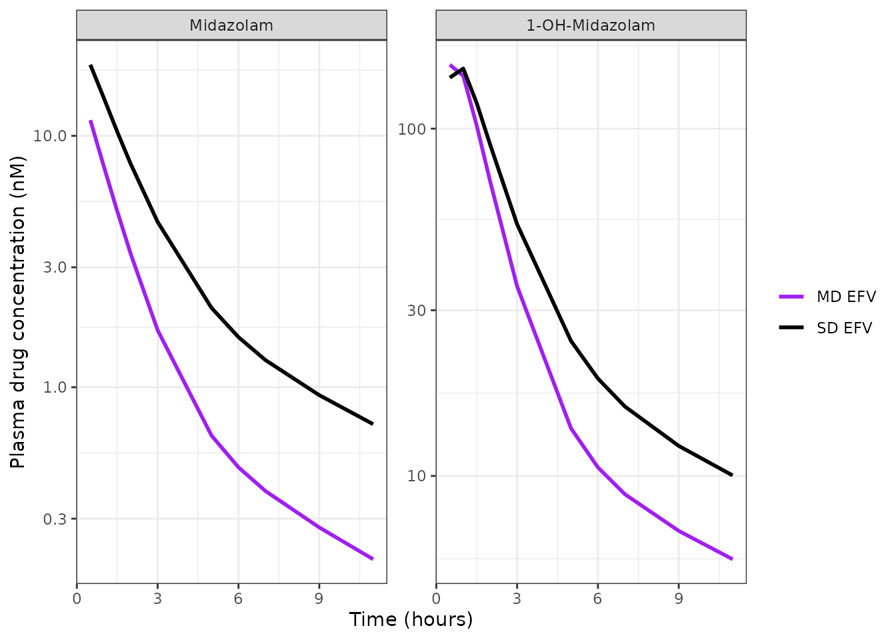
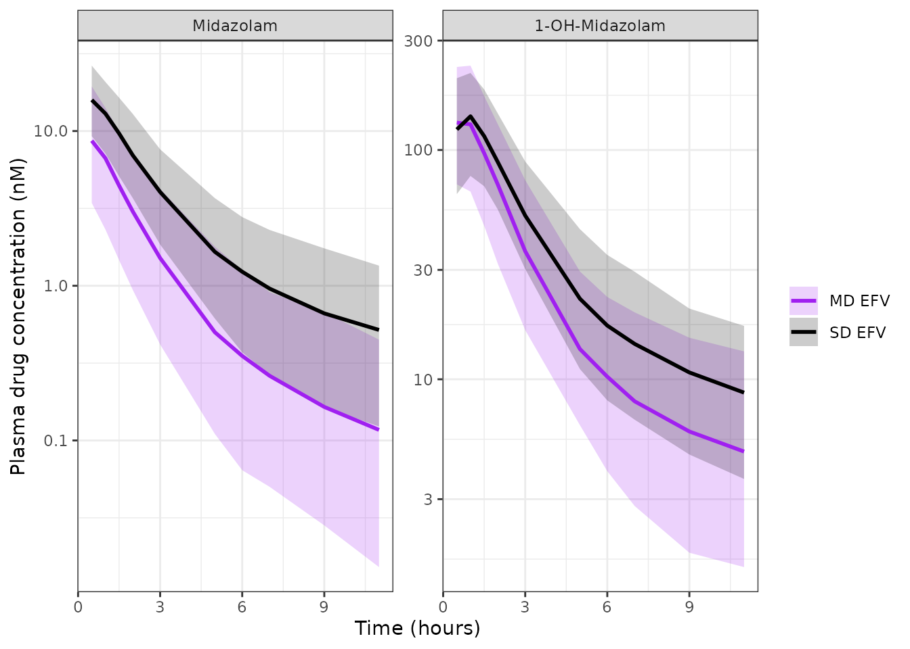

# Midazolam and 1-OH-midazolam with efavirenz (Collins 2025)

``` r

ui <- rxode2::rxode(readModelDb("Collins_2025_midazolam"))
#> ℹ parameter labels from comments will be replaced by 'label()'
```

## Model and source

- Citation: Collins KS, Aruldhas BW, Metzger IF, Lu JBL, Heathman MA,
  Quinney SK, Desta Z. A Population Pharmacokinetic Approach to
  Understand the Effect of Efavirenz on CYP3A Activity in Healthy
  Volunteers Using Midazolam as a Probe. CPT Pharmacometrics Syst
  Pharmacol. 2025;14:2095-2106. <doi:10.1002/psp4.70116>. Parameter
  values from Supporting Information File S5 (final NONMEM control
  stream).
- Article: <https://doi.org/10.1002/psp4.70116>
- Description: Joint parent-metabolite population PK model for oral
  midazolam and its 1-OH-midazolam metabolite in 72 healthy volunteers
  given a 1 mg oral midazolam CYP3A probe on two occasions - once with a
  single 600 mg dose of efavirenz and again after 17 days of efavirenz
  600 mg/day (Collins 2025). Both analytes have two-compartment
  disposition; midazolam is absorbed first-order from a depot and a
  fixed fraction (0.7) of the midazolam elimination flux forms
  1-OH-midazolam. Chronic (multiple-dose) efavirenz is a covariate on
  midazolam clearance, on the absorption rate constant, and on
  bioavailability; CYP3A5 expresser status, CYP3A4\*22 carriage, and
  female sex are covariates on midazolam clearance. All clearances and
  volumes carry fixed allometric scaling on body weight (0.75 and 1)
  referenced to 73 kg. Amounts are nmol and concentrations nM, as
  fitted. Parameter values are taken from the deposited final NONMEM
  control stream (Supporting Information File S5), which for six
  parameters disagrees with the back-transformed values printed in Table
  2 - see the vignette Assumptions and deviations section.

Collins 2025 used oral midazolam as a CYP3A probe to quantify how much
efavirenz induces CYP3A *in vivo*. Healthy volunteers received a 1 mg
oral midazolam dose on two occasions: on Day 1, one hour after a
**single** 600 mg efavirenz dose, and again on Day 24, after efavirenz
600 mg once daily on Days 7-23. Midazolam and 1-OH-midazolam were fitted
jointly as a parent-metabolite system, and the single-dose occasion is
the model’s reference state.

The design point that matters for interpreting every coefficient below
is that **both arms are efavirenz-exposed**. The contrast is
induction-established versus induction-not-yet-established, not
efavirenz versus no efavirenz, which is why the model uses the
`CONMED_EFV_MD` covariate rather than `CONMED_EFV`. The paper is
explicit that this understates the full effect: “Our study design did
not include a midazolam-alone arm (without efavirenz), which would have
provided a baseline CYP3A activity for comparison … the true magnitude
of this change may be underestimated.”

## Population

``` r

pop <- ui$population
tibble::tibble(Field = names(pop),
               Value = vapply(pop, function(x) paste(
                 if (is.null(names(x))) x else paste0(names(x), " ", x, "%"),
                 collapse = "; "), character(1))) |>
  knitr::kable(caption = "Population metadata (Collins 2025 Table 1 and Methods).")
```

| Field | Value |
|:---|:---|
| species | human |
| n_subjects | 72 |
| n_studies | 1 |
| age_range | 18-50 years |
| age_median | 25 years |
| weight_range | 53-104 kg |
| weight_median | 73 kg |
| sex_female_pct | 37.5 |
| race_ethnicity | White 72%; Black 21%; Other 7% |
| disease_state | healthy volunteers |
| dose_range | Midazolam 1 mg oral syrup as a single CYP3A probe dose on each of two occasions, given one hour after efavirenz. Efavirenz 600 mg oral: a single dose on Day 1 and 600 mg once daily on Days 7-23 with a final dose on Day 24. |
| regions | United States (Indiana CTSI Clinical Research Center, Indianapolis) |
| notes | Demographics from Table 1 (single-dose efavirenz column, n = 72). All 72 subjects completed the Day 1 (single-dose efavirenz) session; 58 completed both sessions, so the multiple-dose efavirenz occasion has n = 58. Body mass index 20-32 kg/m^2 was an eligibility criterion (Table 1 median 24, range 18-32). The probe cocktail also contained 150 mg caffeine, 250 mg tolbutamide and 20 mg omeprazole; only midazolam and 1-OH-midazolam are modelled here. Plasma was assayed after beta-glucuronidase deconjugation, so the 1-OH-midazolam measurements are total (free plus glucuronide) metabolite. Dataset: 2309 plasma concentrations (1153 midazolam, 1156 1-OH-midazolam); 33% of midazolam and 0.2% of 1-OH-midazolam concentrations were below the 0.3 ng/mL limit of quantification and were retained uncensored under the Keizer ‘all data’ approach. Estimation used SAEM followed by importance sampling in NONMEM 7.4 with PsN 4.9.01. Base model OFV 9166.31. CYP2B6 genotype was assayed but deliberately not carried into the model (Methods ‘Model Development’). ClinicalTrials.gov NCT00668395. |

Population metadata (Collins 2025 Table 1 and Methods). {.table}

Seventy-two healthy volunteers (Table 1) completed the single-dose
efavirenz occasion; 58 of them also completed the multiple-dose
occasion. Median age 25 years (18-50), median weight 73 kg (53-104),
median BMI 24 kg/m^2 (18-32); 37.5% female; 72% White, 21% Black, 7%
Other. Ninety-four percent were CYP3A4 normal metabolizers (*1/*1) and
75% were CYP3A5 non-expressers. The analysis dataset held 2309 plasma
concentrations (1153 midazolam, 1156 1-OH-midazolam). Plasma was assayed
after beta-glucuronidase deconjugation, so the 1-OH-midazolam
measurements are total (free plus glucuronide) metabolite, which is why
metabolite concentrations run an order of magnitude above parent.

## Source trace

Every value in the model file comes from **Supporting Information File
S5**, the deposited final NONMEM control stream (`$PROBLEM Final`). The
table below gives the File S5 location, the value it implies, and the
corresponding Table 2 entry. Six rows disagree; the “Assumptions and
deviations” section resolves them against the paper’s own Figure 4.

``` r

tibble::tribble(
  ~Parameter,             ~`File S5 location`,        ~`Model value`,          ~`Table 2 (Final model estimate)`,
  "lka",                  "$THETA(1) = -0.303",       "ka = 0.7386 1/h",       "0.77  (disagrees)",
  "lcl",                  "$THETA(2) = 3.38",         "CL = 29.370 L/h",       "29.37",
  "lvc",                  "$THETA(3) = 1.67",         "Vc = 5.3122 L",         "5.31",
  "lvp",                  "$THETA(4) = 4.42",         "Vp = 83.096 L",         "83.10",
  "lq",                   "$THETA(5) = 2.73",         "Q = 15.333 L/h",        "15.33",
  "lcl_1ohm",             "$THETA(6) = 0.451",        "CLm = 1.5699 L/h",      "1.57",
  "lvc_1ohm",             "$THETA(7) = -0.416",       "Vcm = 0.65965 L",       "0.66",
  "lvp_1ohm",             "$THETA(8) = 3.02",         "Vpm = 20.492 L",        "20.49",
  "lq_1ohm",              "$THETA(9) = -0.494",       "Qm = 0.61019 L/h",      "0.61",
  "logitfdepot_mdefv",    "$THETA(10) = -0.511",      "F(MD) = expit = 0.3749", "0.60  (disagrees)",
  "e_conmed_efv_md_cl",   "$THETA(11) = 0.652",       "CL x 1.652",            "1.92  (disagrees)",
  "e_snp_cyp3a4_rs35599367_cl", "$THETA(12) = -0.117", "CL x 0.883",           "0.89  (disagrees)",
  "e_cyp3a5_expr_cl",     "$THETA(13) = 0.254",       "CL x 1.254",            "1.29  (disagrees)",
  "e_sexf_cl",            "$THETA(14) = 0.199",       "CL x 1.199",            "1.22  (disagrees)",
  "e_conmed_efv_md_ka",   "$THETA(15) = 0.255",       "ka x 1.255",            "1.29  (disagrees)",
  "lfdepot_sdefv",        "$PK F1 = 0.5",             "F(SD) = 0.50 fixed",    "0.50 (fixed)",
  "lfm",                  "$PK FMET = 0.7",           "fm = 0.70 fixed",       "Results text",
  "e_wt_cl_q",            "$PK LOG(WT/73)*(3/4)",     "0.75 fixed",            "Methods",
  "e_wt_vc_vp",           "$PK LOG(WT/73)",           "1 fixed",               "Methods",
  "etalka .. etalq_1ohm", "$OMEGA (9 variances)",     "log-scale variances",   "all 9 %CV match",
  "etalogitfdepot_mdefv", "$OMEGA = 0.134",           "logit-scale variance",  "37.9% CV matches",
  "propSd",               "$SIGMA = 0.0779",          "SD = 0.2791",           "27.9% CV",
  "propSd_1ohm",          "$SIGMA = 0.0688",          "SD = 0.2623",           "26.2% CV"
) |>
  knitr::kable(caption = "Source trace: File S5 (deposited final control stream) vs Table 2.")
```

| Parameter | File S5 location | Model value | Table 2 (Final model estimate) |
|:---|:---|:---|:---|
| lka | $`THETA(1) = -0.303   |ka = 0.7386 1/h        |0.77  (disagrees)              |
|lcl                        |`$THETA(2) = 3.38 | CL = 29.370 L/h | 29.37 |
| lvc | $`THETA(3) = 1.67     |Vc = 5.3122 L          |5.31                           |
|lvp                        |`$THETA(4) = 4.42 | Vp = 83.096 L | 83.10 |
| lq | $`THETA(5) = 2.73     |Q = 15.333 L/h         |15.33                          |
|lcl_1ohm                   |`$THETA(6) = 0.451 | CLm = 1.5699 L/h | 1.57 |
| lvc_1ohm | $`THETA(7) = -0.416   |Vcm = 0.65965 L        |0.66                           |
|lvp_1ohm                   |`$THETA(8) = 3.02 | Vpm = 20.492 L | 20.49 |
| lq_1ohm | $`THETA(9) = -0.494   |Qm = 0.61019 L/h       |0.61                           |
|logitfdepot_mdefv          |`$THETA(10) = -0.511 | F(MD) = expit = 0.3749 | 0.60 (disagrees) |
| e_conmed_efv_md_cl | $`THETA(11) = 0.652   |CL x 1.652             |1.92  (disagrees)              |
|e_snp_cyp3a4_rs35599367_cl |`$THETA(12) = -0.117 | CL x 0.883 | 0.89 (disagrees) |
| e_cyp3a5_expr_cl | $`THETA(13) = 0.254   |CL x 1.254             |1.29  (disagrees)              |
|e_sexf_cl                  |`$THETA(14) = 0.199 | CL x 1.199 | 1.22 (disagrees) |
| e_conmed_efv_md_ka | $`THETA(15) = 0.255   |ka x 1.255             |1.29  (disagrees)              |
|lfdepot_sdefv              |`$PK F1 = 0.5 | F(SD) = 0.50 fixed | 0.50 (fixed) |
| lfm | $`PK FMET = 0.7       |fm = 0.70 fixed        |Results text                   |
|e_wt_cl_q                  |`$PK LOG(WT/73)\*(3/4) | 0.75 fixed | Methods |
| e_wt_vc_vp | $`PK LOG(WT/73)       |1 fixed                |Methods                        |
|etalka .. etalq_1ohm       |`$OMEGA (9 variances) | log-scale variances | all 9 %CV match |
| etalogitfdepot_mdefv | $`OMEGA = 0.134       |logit-scale variance   |37.9% CV matches               |
|propSd                     |`$SIGMA = 0.0779 | SD = 0.2791 | 27.9% CV |
| propSd_1ohm | \$SIGMA = 0.0688 | SD = 0.2623 | 26.2% CV |

Source trace: File S5 (deposited final control stream) vs Table 2.
{.table}

The eight structural typical values, all ten omegas and both sigmas
agree exactly between File S5 and Table 2, which is what establishes
File S5 as the final model rather than a stale draft.

## Virtual cohort

``` r

MW_MIDAZOLAM <- 325.77                      # g/mol; 1 mg oral dose -> nmol
DOSE_NMOL    <- 1e-3 / MW_MIDAZOLAM * 1e9   # 3069.6 nmol

# Reference subject of the paper's Results sentence: 73 kg male, CYP3A4 *1/*1,
# CYP3A5 non-expresser.
REFERENCE_COVARIATES <- list(
  WT = 73, SEXF = 0, CYP3A5_EXPR = 0, SNP_CYP3A4_RS35599367 = 0
)

#' Build a single-subject event table: one oral midazolam dose into `depot`
#' plus observation rows on the `central` ODE state.
#'
#' The model declares two endpoints (`Cc` and `Cc_1ohm`), so observation rows
#' need a `dvid`. `dvid = 1L` is sufficient: rxode2 returns BOTH observables as
#' columns on every observation row, so one series yields both analytes.
make_events <- function(times, md, covariates = REFERENCE_COVARIATES, id = 1L) {
  dose <- data.frame(id = id, time = 0, amt = DOSE_NMOL, cmt = "depot",
                     evid = 1L, dvid = NA_integer_)
  obs  <- data.frame(id = id, time = times, amt = NA_real_, cmt = "central",
                     evid = 0L, dvid = 1L)
  ev <- rbind(dose, obs)
  for (nm in names(covariates)) ev[[nm]] <- covariates[[nm]]
  ev$CONMED_EFV_MD <- md
  ev[order(ev$time, -ev$evid), ]
}

#' Typical-value solve (IIV suppressed via omega = NA).
solve_typical <- function(events) {
  rxode2::rxSolve(ui, events, omega = NA, useLinCmt = FALSE,
                  keep = c("CONMED_EFV_MD", "WT", "SEXF", "CYP3A5_EXPR",
                           "SNP_CYP3A4_RS35599367"),
                  returnType = "data.frame")
}
```

`useLinCmt = FALSE` is required: rxode2’s default ODE-to-`linCmt()`
auto-conversion corrupts the dvid mapping on multi-endpoint models.

## Replicate Figure 4

Figure 4 of Collins 2025 plots simulated midazolam (panel A) and
1-OH-midazolam (panel B) concentration-time curves after single-dose
(black) and multiple-dose (purple) efavirenz, over the study’s 0.5-11 h
sampling window. This is the paper’s only published quantitative
simulation output, and it is the evidence that decides the File S5 /
Table 2 conflict.

``` r

FIG4_TIMES <- c(0.5, 1, 1.5, 2, 3, 5, 6, 7, 9, 11)

fig4 <- bind_rows(
  solve_typical(make_events(FIG4_TIMES, md = 0)),
  solve_typical(make_events(FIG4_TIMES, md = 1))
) |>
  mutate(occasion = ifelse(CONMED_EFV_MD == 1, "MD EFV", "SD EFV"))

fig4_long <- fig4 |>
  select(time, occasion, Midazolam = Cc, `1-OH-Midazolam` = Cc_1ohm) |>
  pivot_longer(c(Midazolam, `1-OH-Midazolam`), names_to = "analyte",
               values_to = "conc") |>
  mutate(analyte = factor(analyte, levels = c("Midazolam", "1-OH-Midazolam")))

ggplot(fig4_long, aes(time, conc, colour = occasion)) +
  geom_line(linewidth = 1) +
  facet_wrap(~analyte, scales = "free_y") +
  scale_y_log10() +
  scale_colour_manual(values = c("SD EFV" = "black", "MD EFV" = "purple")) +
  labs(x = "Time (hours)", y = "Plasma drug concentration (nM)", colour = NULL) +
  theme_bw()
```



Replicates Figure 4 of Collins 2025. Both analytes sit **lower** after
multiple-dose efavirenz. For midazolam that is expected (clearance is
induced); for the metabolite it is the diagnostic result, because total
1-OH-midazolam exposure over all time is `fm * F * Dose / CLm` and
depends on bioavailability but **not** on parent clearance. A metabolite
curve that falls under multiple-dose efavirenz therefore says F went
*down*.

### Scoring the two readings of the source against Figure 4

Panel A of the published figure was digitised from the article’s own
figure file (three evenly-spaced decade labels give an exact 135.5
px/decade calibration, so the parent-panel numbers below are accurate to
the line width). The MD/SD **ratio** is used rather than absolute
concentrations because the ratio is insensitive to whether the authors
plotted a typical-value curve or a median across simulated subjects.

``` r

# Operator-digitised from the Collins 2025 Figure 4 image file
# (psp470116 figure g005; panel A, log axis calibrated on the 10.0 / 1.0 / 0.1
# tick labels). Not a value published in numeric form by the authors.
fig4_digitised <- tibble::tribble(
  ~time, ~sd_obs, ~md_obs,
   0.5,  14.782,   8.582,
   1.0,  11.073,   5.708,
   1.5,   7.950,   3.669,
   2.0,   5.659,   2.359,
   3.0,   3.176,   1.126,
   5.0,   1.324,   0.383,
   6.0,   1.009,   0.289,
   7.0,   0.775,   0.220,
   9.0,   0.542,   0.157
) |>
  mutate(ratio_published = md_obs / sd_obs)

# Reading 1 (encoded): File S5 verbatim -- CL x 1.652, ka x 1.255, F = 0.3749.
ratio_fileS5 <- fig4 |>
  select(time, occasion, Cc) |>
  pivot_wider(names_from = occasion, values_from = Cc) |>
  transmute(time, ratio_fileS5 = `MD EFV` / `SD EFV`)

# Reading 2 (rejected): Table 2 back-transforms -- CL x 1.92, ka x 1.29,
# F = 0.60. Built by overriding the ini() values on the same model.
alt <- ui |>
  rxode2::ini(e_conmed_efv_md_cl = 0.92,   # 1.92 = Table 2
              e_conmed_efv_md_ka = 0.29,   # 1.29 = Table 2
              logitfdepot_mdefv = rxode2::logit(0.60))  # F = 0.60 = Table 2
#> ℹ change initial estimate of `e_conmed_efv_md_cl` to `0.92`
#> ℹ change initial estimate of `e_conmed_efv_md_ka` to `0.29`
#> ℹ change initial estimate of `logitfdepot_mdefv` to `0.405465108108164`

ratio_table2 <- bind_rows(
  rxode2::rxSolve(alt, make_events(FIG4_TIMES, 0), omega = NA,
                  useLinCmt = FALSE, keep = "CONMED_EFV_MD",
                  returnType = "data.frame"),
  rxode2::rxSolve(alt, make_events(FIG4_TIMES, 1), omega = NA,
                  useLinCmt = FALSE, keep = "CONMED_EFV_MD",
                  returnType = "data.frame")
) |>
  mutate(occasion = ifelse(CONMED_EFV_MD == 1, "MD", "SD")) |>
  select(time, occasion, Cc) |>
  pivot_wider(names_from = occasion, values_from = Cc) |>
  transmute(time, ratio_table2 = MD / SD)

scoring <- fig4_digitised |>
  left_join(ratio_fileS5, by = "time") |>
  left_join(ratio_table2, by = "time") |>
  mutate(err_fileS5 = abs(log(ratio_fileS5 / ratio_published)),
         err_table2 = abs(log(ratio_table2 / ratio_published)))

scoring |>
  transmute(`Time (h)` = time,
            `Published MD/SD` = round(ratio_published, 3),
            `File S5 reading` = round(ratio_fileS5, 3),
            `Table 2 reading` = round(ratio_table2, 3)) |>
  knitr::kable(caption = paste(
    "Midazolam multiple-dose / single-dose concentration ratio: digitised from",
    "Collins 2025 Figure 4 panel A, versus the two readings of the source."))
```

| Time (h) | Published MD/SD | File S5 reading | Table 2 reading |
|---------:|----------------:|----------------:|----------------:|
|      0.5 |           0.581 |           0.602 |           0.865 |
|      1.0 |           0.515 |           0.535 |           0.754 |
|      1.5 |           0.462 |           0.483 |           0.670 |
|      2.0 |           0.417 |           0.439 |           0.598 |
|      3.0 |           0.355 |           0.371 |           0.489 |
|      5.0 |           0.289 |           0.311 |           0.388 |
|      6.0 |           0.286 |           0.304 |           0.375 |
|      7.0 |           0.284 |           0.301 |           0.369 |
|      9.0 |           0.290 |           0.298 |           0.361 |

Midazolam multiple-dose / single-dose concentration ratio: digitised
from Collins 2025 Figure 4 panel A, versus the two readings of the
source. {.table}

``` r


fit_summary <- c(
  `File S5 (encoded)` = max(scoring$err_fileS5),
  `Table 2 back-transform` = max(scoring$err_table2)
)
round(fit_summary, 3)
#>      File S5 (encoded) Table 2 back-transform 
#>                  0.071                  0.399
```

``` r

# The File S5 reading must reproduce every digitised ratio within 10% and must
# beat the Table 2 reading at every one of the nine time points.
stopifnot(
  max(scoring$err_fileS5) < log(1.10),
  all(scoring$err_fileS5 < scoring$err_table2)
)
```

The File S5 reading matches every digitised point to within 7.3%; the
Table 2 back-transform is off by up to 49%, systematically in one
direction. The model file therefore encodes File S5.

## Structural checks

### The reference clearance the paper states in the text

Collins 2025 Results: “The clearance (CL/F) of midazolam for a 73 kg
male with normal CYP3A4 expression and reduced CYP3A5 expression after a
single dose of efavirenz was estimated at 29.37 L/h.”

Clearance is read back out of the solved model rather than recomputed
here, so these checks test the model file itself and not a second
transcription of it.

``` r

#' Typical-value clearance the model produces for a given covariate set.
cl_of <- function(md = 0, sexf = 0, expr = 0, s22 = 0, wt = 73) {
  ev <- make_events(1, md = md, covariates = list(
    WT = wt, SEXF = sexf, CYP3A5_EXPR = expr, SNP_CYP3A4_RS35599367 = s22))
  unique(solve_typical(ev)$cl)
}
stopifnot(abs(cl_of() - 29.37) < 0.005)
```

Note that despite the paper’s “CL/F” wording this is a **true**
clearance, not an apparent one: File S5 codes bioavailability explicitly
(`F1 = 0.5`), and 29.4 L/h is the expected value for systemic midazolam
clearance in healthy adults, whereas an oral CL/F at F = 0.5 would be
near 59 L/h.

### Covariate multipliers

``` r

tibble::tribble(
  ~Covariate,                       ~`File S5 THETA`, ~`Model multiplier`,   ~`Table 2`, ~`Figure 5 forest (bootstrap)`,
  "Multiple-dose efavirenz (CL)",   0.652,  cl_of(md = 1)   / cl_of(), 1.92, 1.92,
  "CYP3A4*22 carrier (CL)",        -0.117,  cl_of(s22 = 1)  / cl_of(), 0.89, 0.940,
  "CYP3A5 expresser (CL)",          0.254,  cl_of(expr = 1) / cl_of(), 1.29, 1.27,
  "Female (CL)",                    0.199,  cl_of(sexf = 1) / cl_of(), 1.22, 1.30
) |>
  mutate(`Model multiplier` = round(`Model multiplier`, 3)) |>
  knitr::kable(caption = paste(
    "Covariate multipliers on midazolam clearance. The model uses the File S5",
    "coded (1 + THETA) form; Table 2 and Figure 5 report exp(THETA) and the",
    "bootstrap median respectively."))
```

| Covariate | File S5 THETA | Model multiplier | Table 2 | Figure 5 forest (bootstrap) |
|:---|---:|---:|---:|---:|
| Multiple-dose efavirenz (CL) | 0.652 | 1.652 | 1.92 | 1.92 |
| CYP3A4\*22 carrier (CL) | -0.117 | 0.883 | 0.89 | 0.94 |
| CYP3A5 expresser (CL) | 0.254 | 1.254 | 1.29 | 1.27 |
| Female (CL) | 0.199 | 1.199 | 1.22 | 1.30 |

Covariate multipliers on midazolam clearance. The model uses the File S5
coded (1 + THETA) form; Table 2 and Figure 5 report exp(THETA) and the
bootstrap median respectively. {.table}

``` r


stopifnot(
  abs(cl_of(md   = 1) / cl_of() - 1.652) < 1e-9,
  abs(cl_of(s22  = 1) / cl_of() - 0.883) < 1e-9,
  abs(cl_of(expr = 1) / cl_of() - 1.254) < 1e-9,
  abs(cl_of(sexf = 1) / cl_of() - 1.199) < 1e-9,
  # Allometry: doubling weight multiplies CL by 2^0.75.
  abs(cl_of(wt = 146) / cl_of() - 2^0.75) < 1e-9
)
```

### Bioavailability carries between-subject variability on one occasion only

File S5 puts `ETA(10)` inside the `IF(EFV.EQ.0)` branch, so single-dose
bioavailability is a fixed 0.5 with no IIV while the multiple-dose value
is drawn per subject. This is unusual enough to be worth asserting
directly.

`rxSolve()` returns the model’s derived `fdepot` as a column, so this
can be checked exactly rather than through a sampling statistic.

``` r

set.seed(20250321)
N_F <- 200
f_cohort <- function(md) {
  do.call(rbind, lapply(seq_len(N_F), function(i) make_events(1, md = md, id = i)))
}
f_sd <- rxode2::rxSolve(ui, f_cohort(0), useLinCmt = FALSE,
                        returnType = "data.frame")$fdepot
f_md <- rxode2::rxSolve(ui, f_cohort(1), useLinCmt = FALSE,
                        returnType = "data.frame")$fdepot

# Typical values, IIV suppressed.
f_typ <- vapply(c(0, 1), function(md) unique(solve_typical(make_events(1, md))$fdepot),
                numeric(1))

tibble::tibble(
  Occasion            = c("SD EFV", "MD EFV"),
  `Typical F`         = round(f_typ, 4),
  `Distinct F values` = c(length(unique(f_sd)), length(unique(f_md))),
  `F range`           = c(sprintf("%.4f", unique(f_sd)),
                          sprintf("%.3f - %.3f", min(f_md), max(f_md)))
) |>
  knitr::kable(caption = paste(
    "Bioavailability across", N_F, "simulated subjects per occasion."))
```

| Occasion | Typical F | Distinct F values | F range       |
|:---------|----------:|------------------:|:--------------|
| SD EFV   |     0.500 |                 1 | 0.5000        |
| MD EFV   |     0.375 |               200 | 0.182 - 0.581 |

Bioavailability across 200 simulated subjects per occasion. {.table}

``` r


stopifnot(
  # Single-dose F is a fixed 0.5 for every subject: no between-subject spread.
  all(f_sd == 0.5),
  length(unique(f_sd)) == 1L,
  # Multiple-dose F is drawn per subject and stays inside (0, 1) by construction
  # of the logit transform.
  length(unique(f_md)) == N_F,
  all(f_md > 0 & f_md < 1),
  # Typical values are exactly the File S5 constants.
  abs(f_typ[1] - 0.5) < 1e-12,
  abs(f_typ[2] - 1 / (1 + exp(0.511))) < 1e-9
)
```

## PKNCA validation

The paper reports no non-compartmental analysis, so there is no
published NCA table to compare against. Instead the NCA is scored
against the model’s own closed-form exposure identities, which are exact
for a linear system:

- parent: `AUC(0-inf) = F * Dose / CL`
- metabolite: `AUC(0-inf) = fm * F * Dose / CLm` – independent of parent
  clearance, because every molecule of midazolam that is cleared has
  already had its chance to become 1-OH-midazolam.

``` r

NCA_GRID <- sort(unique(c(seq(0, 12, by = 0.05), seq(12, 48, by = 0.25),
                          seq(48, 240, by = 1))))

nca_sim <- bind_rows(
  solve_typical(make_events(NCA_GRID, md = 0)),
  solve_typical(make_events(NCA_GRID, md = 1))
) |>
  mutate(treatment = ifelse(CONMED_EFV_MD == 1, "MD EFV", "SD EFV"),
         id = 1L)

run_nca <- function(conc_col, concu) {
  sim_nca <- nca_sim |>
    dplyr::filter(!is.na(.data[[conc_col]])) |>
    transmute(id, time, Cc = .data[[conc_col]], treatment)

  # Guarantee a time-zero row so PKNCA does not warn about an AUC range
  # starting before the first measurement (pre-dose oral concentration is 0).
  sim_nca <- bind_rows(
    sim_nca,
    sim_nca |> distinct(id, treatment) |> mutate(time = 0, Cc = 0)
  ) |>
    distinct(id, treatment, time, .keep_all = TRUE) |>
    arrange(treatment, id, time)

  dose_df <- data.frame(id = 1L, time = 0, amt = DOSE_NMOL,
                        treatment = c("SD EFV", "MD EFV"))

  conc_obj <- PKNCA::PKNCAconc(sim_nca, Cc ~ time | treatment + id,
                               concu = concu, timeu = "h")
  dose_obj <- PKNCA::PKNCAdose(dose_df, amt ~ time | treatment + id,
                               doseu = "nmol")
  intervals <- data.frame(start = 0, end = Inf, cmax = TRUE, tmax = TRUE,
                          aucinf.obs = TRUE, half.life = TRUE)
  PKNCA::pk.nca(PKNCA::PKNCAdata(conc_obj, dose_obj, intervals = intervals))
}

nca_parent <- run_nca("Cc", "nM")
nca_metab  <- run_nca("Cc_1ohm", "nM")
```

``` r

F_SD <- 0.5
F_MD <- 1 / (1 + exp(0.511))          # expit(-0.511)
CL_SD <- 29.370; CL_MD <- CL_SD * 1.652
CLM   <- 1.5699; FM <- 0.7

expected <- tibble::tibble(
  treatment  = c("SD EFV", "MD EFV"),
  parent_auc = c(F_SD * DOSE_NMOL / CL_SD, F_MD * DOSE_NMOL / CL_MD),
  metab_auc  = c(FM * F_SD * DOSE_NMOL / CLM, FM * F_MD * DOSE_NMOL / CLM)
)

grab <- function(res, code) {
  as.data.frame(res$result) |>
    dplyr::filter(PPTESTCD == code) |>
    dplyr::select(treatment, value = PPORRES)
}

nca_tbl <- expected |>
  left_join(grab(nca_parent, "aucinf.obs") |> rename(parent_nca = value),
            by = "treatment") |>
  left_join(grab(nca_metab, "aucinf.obs") |> rename(metab_nca = value),
            by = "treatment") |>
  left_join(grab(nca_parent, "cmax") |> rename(parent_cmax = value),
            by = "treatment") |>
  left_join(grab(nca_parent, "half.life") |> rename(parent_thalf = value),
            by = "treatment")

nca_tbl |>
  transmute(
    Occasion                      = treatment,
    `Midazolam Cmax (nM)`         = round(parent_cmax, 2),
    `Midazolam t1/2 (h)`          = round(parent_thalf, 2),
    `Midazolam AUCinf, NCA`       = round(parent_nca, 2),
    `Midazolam AUCinf, F*Dose/CL` = round(parent_auc, 2),
    `1-OH AUCinf, NCA`            = round(metab_nca, 1),
    `1-OH AUCinf, fm*F*Dose/CLm`  = round(metab_auc, 1)
  ) |>
  knitr::kable(caption = paste(
    "PKNCA output versus the model's closed-form exposure identities.",
    "AUC in nM*h."))
```

| Occasion | Midazolam Cmax (nM) | Midazolam t1/2 (h) | Midazolam AUCinf, NCA | Midazolam AUCinf, F\*Dose/CL | 1-OH AUCinf, NCA | 1-OH AUCinf, fm*F*Dose/CLm |
|:---|---:|---:|---:|---:|---:|---:|
| SD EFV | 20.21 | 5.74 | 52.21 | 52.26 | 684.3 | 684.4 |
| MD EFV | 13.53 | 4.95 | 23.68 | 23.72 | 513.2 | 513.2 |

PKNCA output versus the model’s closed-form exposure identities. AUC in
nM\*h. {.table style="width:100%;"}

``` r

# Per-occasion identity: PKNCA AUCinf must reproduce the closed form to 1%.
stopifnot(
  all(abs(nca_tbl$parent_nca / nca_tbl$parent_auc - 1) < 0.01),
  all(abs(nca_tbl$metab_nca  / nca_tbl$metab_auc  - 1) < 0.01)
)

# Metabolite exposure is set by bioavailability alone, so its MD/SD ratio must
# equal F_MD / F_SD exactly -- the identity that makes Figure 4 panel B a
# bioavailability read-out.
metab_ratio <- nca_tbl$metab_nca[nca_tbl$treatment == "MD EFV"] /
  nca_tbl$metab_nca[nca_tbl$treatment == "SD EFV"]
stopifnot(abs(metab_ratio - F_MD / F_SD) < 0.005)

# Parent exposure falls by the induction factor divided by the F change.
parent_ratio <- nca_tbl$parent_nca[nca_tbl$treatment == "MD EFV"] /
  nca_tbl$parent_nca[nca_tbl$treatment == "SD EFV"]
stopifnot(abs(parent_ratio - (F_MD / F_SD) / 1.652) < 0.005)
```

    #> Metabolite AUC ratio (MD/SD) = 0.750, equals F_MD/F_SD = 0.750
    #> Parent AUC ratio (MD/SD) = 0.454

Multiple-dose efavirenz lowers total 1-OH-midazolam exposure by 25%,
exactly tracking the drop in bioavailability from 0.50 to 0.375, and
lowers midazolam exposure by 55% – the combined effect of a 65%
clearance increase and the 25% bioavailability decrease.

## Between-subject variability

``` r

set.seed(70116)
N_PER_ARM <- 100     # 100 subjects per efavirenz occasion
VPC_TIMES <- c(0.5, 1, 1.5, 2, 3, 5, 6, 7, 9, 11)

vpc_cohort <- function(md, id_offset) {
  wt <- stats::runif(N_PER_ARM, 53, 104)          # Table 1 weight range
  sexf <- stats::rbinom(N_PER_ARM, 1, 0.375)      # Table 1: 37.5% female
  expr <- stats::rbinom(N_PER_ARM, 1, 0.25)       # Table 1: 25% CYP3A5 expressers
  s22 <- stats::rbinom(N_PER_ARM, 1, 0.06)        # Table 1: 6% CYP3A4 IM
  do.call(rbind, lapply(seq_len(N_PER_ARM), function(i)
    make_events(VPC_TIMES, md = md, id = id_offset + i,
                covariates = list(WT = wt[i], SEXF = sexf[i],
                                  CYP3A5_EXPR = expr[i],
                                  SNP_CYP3A4_RS35599367 = s22[i]))))
}

vpc <- bind_rows(
  rxode2::rxSolve(ui, vpc_cohort(0, 0), useLinCmt = FALSE,
                  keep = "CONMED_EFV_MD", returnType = "data.frame"),
  rxode2::rxSolve(ui, vpc_cohort(1, 1000), useLinCmt = FALSE,
                  keep = "CONMED_EFV_MD", returnType = "data.frame")
) |>
  mutate(occasion = ifelse(CONMED_EFV_MD == 1, "MD EFV", "SD EFV"))

vpc_long <- vpc |>
  select(time, occasion, Midazolam = Cc, `1-OH-Midazolam` = Cc_1ohm) |>
  pivot_longer(c(Midazolam, `1-OH-Midazolam`), names_to = "analyte",
               values_to = "conc") |>
  mutate(analyte = factor(analyte, levels = c("Midazolam", "1-OH-Midazolam"))) |>
  group_by(analyte, occasion, time) |>
  summarise(p05 = quantile(conc, 0.05), p50 = median(conc),
            p95 = quantile(conc, 0.95), .groups = "drop")

ggplot(vpc_long, aes(time, p50, colour = occasion, fill = occasion)) +
  geom_ribbon(aes(ymin = p05, ymax = p95), alpha = 0.2, colour = NA) +
  geom_line(linewidth = 1) +
  facet_wrap(~analyte, scales = "free_y") +
  scale_y_log10() +
  scale_colour_manual(values = c("SD EFV" = "black", "MD EFV" = "purple")) +
  scale_fill_manual(values = c("SD EFV" = "black", "MD EFV" = "purple")) +
  labs(x = "Time (hours)", y = "Plasma drug concentration (nM)",
       colour = NULL, fill = NULL) +
  theme_bw()
```



Median and 5th-95th percentile individual predictions for 100 simulated
subjects per occasion, with covariates drawn from the Table 1 marginal
distributions. Compare with Figure 3 of Collins 2025 (visual predictive
checks stratified by single- and multiple-dose efavirenz). The very wide
midazolam band reflects the 117% CV on central volume reported in Table
2, which dominates the early distribution phase.

## Assumptions and deviations

### 1. Parameter values are taken from File S5, not from Table 2

This is the one substantive decision in the extraction, and it changes
six numbers, including the paper’s headline result.

The deposited final control stream (Supporting Information File S5) and
Table 2 agree exactly on all eight structural typical values, all ten
omegas and both sigmas – 20 of 21 comparable quantities. They disagree
on the five covariate coefficients and the multiple-dose
bioavailability, and the disagreement has a single, coherent
explanation: **Table 2 reports `exp(THETA)` for every THETA**, which is
the correct back-transformation for the MU-referenced log-scale typical
values but the wrong one for the six parameters that File S5 codes
differently.

| File S5 coded form           | THETA  | Correct value | Table 2 = exp(THETA) |
|------------------------------|--------|---------------|----------------------|
| `(1 + L0*THETA(11))` on CL   | 0.652  | 1.652         | 1.92                 |
| `(1 + M1*THETA(12))` on CL   | -0.117 | 0.883         | 0.89                 |
| `(1 + N1*THETA(13))` on CL   | 0.254  | 1.254         | 1.29                 |
| `(1 + K0*THETA(14))` on CL   | 0.199  | 1.199         | 1.22                 |
| `(1 + L0*THETA(15))` on Ka   | 0.255  | 1.255         | 1.29                 |
| `EXP(LF1)/(1+EXP(LF1))` on F | -0.511 | 0.3749        | 0.60                 |

The “Replicate Figure 4” section above scores both readings against the
paper’s own simulated profiles and the File S5 reading wins at every
time point, by a wide margin. Two independent strands support it:

- **The metabolite direction.** Total 1-OH-midazolam exposure is
  `fm * F * Dose / CLm` and does not involve parent clearance, so the
  metabolite panel of Figure 4 is a direct read-out of bioavailability.
  The published metabolite curve is clearly *lower* after multiple-dose
  efavirenz, which requires `F < 0.5`. Table 2’s `F = 0.60` would put it
  about 60% higher than the single-dose curve.
- **The parent ratio.** The digitised midazolam MD/SD ratio runs 0.58 at
  0.5 h down to 0.28 in the tail; the File S5 reading predicts 0.60 to
  0.29, the Table 2 reading 0.54 to 0.22.

Consequences for anyone reading the paper alongside this model:

- The **abstract, Discussion, Conclusion and Figure 5 forest plot all
  state that multiple-dose efavirenz raises midazolam clearance
  1.92-fold.** The deposited control stream gives **1.652-fold**. The
  paper’s own Study Highlights section independently states “1.64-fold”,
  which agrees with File S5 and not with the abstract.
- The paper’s Discussion devotes a paragraph to explaining why
  bioavailability appeared to *increase* with chronic efavirenz (“The
  reason for this observation remains unclear … we speculate that the
  apparent increase in oral midazolam bioavailability … reflects a
  scenario where intestinal CYP3A remains uninduced”). Under File S5,
  bioavailability **decreased**, from 0.50 to 0.375. That removes the
  puzzle entirely and is consistent with the Kharasch et al. result the
  paper itself cites, in which alfentanil bioavailability fell after 14
  days of efavirenz.
- The abstract’s covariate values (1.27 CYP3A5, 0.94 CYP3A4, 1.30
  female) are the **bootstrap medians** from Table 2’s third column, not
  the final-model estimates, so they differ from Table 2’s second column
  as well.

This has not been raised with the authors and no erratum was found; a
reader who needs the published numbers rather than the deposited ones
can recover them by overriding the six `ini()` entries as the scoring
chunk above does.

### 2. Table 2’s Ka does not reconcile with File S5 under either reading

`THETA(1) = -0.303` gives `ka = exp(-0.303) = 0.7386 1/h`, but Table 2
reports 0.77 (bootstrap median also 0.77, 95% CI 0.71-0.84). `ka` is a
plain MU-referenced log-scale typical value, so
[`exp()`](https://rdrr.io/r/base/Log.html) is the right transform here
and the two sources simply disagree by 4%. This is the only quantity
that neither hypothesis explains. The model uses File S5 for internal
consistency; 0.7386 lies inside the published bootstrap interval, and
the difference is immaterial to exposure.

### 3. Values digitised from a figure

The nine midazolam concentration pairs in the scoring chunk were read
off the Collins 2025 Figure 4 image file by the extractor; they are not
published in numeric form. They are used only to adjudicate between two
published parameter sets, never to fit or tune anything. The panel A log
axis carries three evenly-spaced decade labels, giving an exact
pixel-per-decade calibration.

### 4. Covariate encoding

- `CONMED_EFV_MD` is a newly registered canonical covariate for this
  extraction. Both of its levels are efavirenz-exposed, so it is
  deliberately *not* `CONMED_EFV` (which contrasts efavirenz against a
  non-efavirenz comparator) and *not* `MULTI_DOSE_PT` (which flags the
  multiple-dose phase of the analyte, whereas here the analyte is
  single-dosed on both occasions and the perpetrator’s dosing history is
  what changes).
- Two source columns are polarity-inverted relative to their canonical
  form and are transformed in `covariateData`: `SEXF = 1 - SEX` (the
  paper’s `SEX` is 0 = female) and `CONMED_EFV_MD = 1 - EFV` (the
  paper’s `EFV` is 0 = multiple dose). Both inversions are stated
  explicitly in the paper’s Results text and in File S5’s inline
  comments, so neither is inferred.
- The paper’s “CYP3A4 intermediate metabolizer” stratum is exactly the
  `SNP_CYP3A4_RS35599367` carrier stratum: genotyping was for *22
  (rs35599367) and the cohort contained only* 1/*1 and* 1/\*22 subjects.

### 5. Not represented in the model

- **CYP2B6 genotype** was assayed but deliberately excluded by the
  authors (“Incorporation of CYP2B6 genotype was deemed unnecessary,
  given the low frequency of poor metabolizers in the study cohort”), so
  it is not a covariate here.
- **Race, age and BMI** were collected (Table 1) but not carried into
  the final model; they are documented in `population` rather than
  `covariateData`.
- **Occasion structure.** 58 of the 72 subjects contribute both
  efavirenz occasions, and File S5 has no inter-occasion variability
  terms – the disposition etas are subject-level and shared across a
  subject’s two occasions. Simulating an occasion at a time, as this
  vignette does, matches the fitted model; simulating a crossover would
  additionally require holding each subject’s etas fixed across their
  two records.
- **Below-quantification-limit data.** 33% of midazolam concentrations
  were below the 0.3 ng/mL limit of quantification and were retained
  uncensored under the Keizer “all data” approach. A simulation model
  has no BLQ, so nothing is encoded; but the parent parameters –
  particularly the 117% CV on central volume – carry the influence of
  that choice.
- **The other three cocktail probes** (caffeine, tolbutamide,
  omeprazole) were co-administered but are outside this model. \`\`\`
