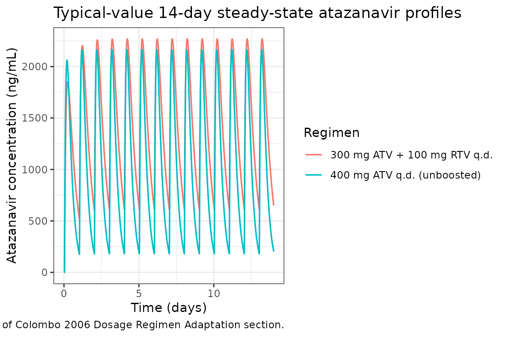
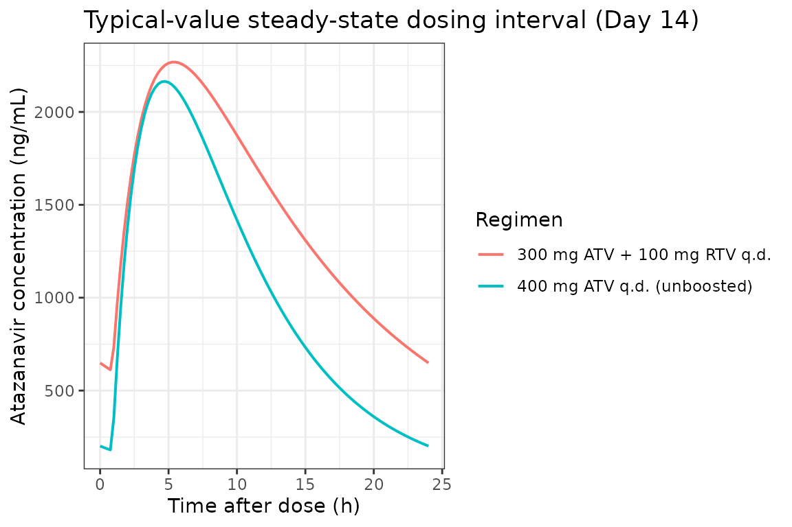
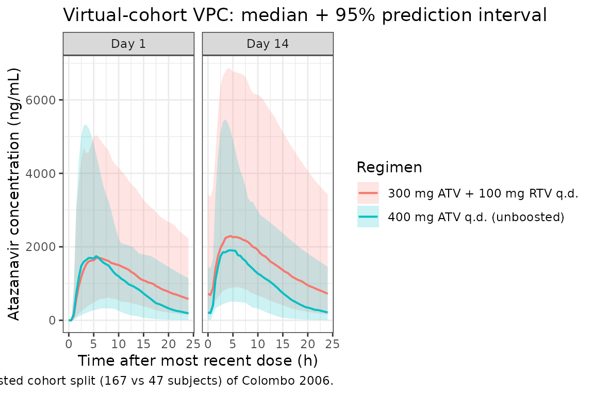

# Atazanavir (Colombo 2006)

## Model and source

- Citation: Colombo S, Buclin T, Cavassini M, Decosterd LA, Telenti A,
  Biollaz J, Csajka C. Population pharmacokinetics of atazanavir in
  patients with human immunodeficiency virus infection. Antimicrob
  Agents Chemother. 2006;50(11):3801-3808. <doi:10.1128/aac.00098-06>
- Description: One-compartment first-order-absorption population PK
  model with absorption lag-time for orally administered atazanavir in
  HIV-1 infected adults; binary low-dose ritonavir (RTV)
  coadministration reduces apparent oral clearance by 46% (Colombo
  2006).
- Article: [Antimicrob Agents Chemother.
  2006;50(11):3801-3808](https://doi.org/10.1128/aac.00098-06)

Colombo et al. (2006) describe a one-compartment first-order-absorption
population PK model with absorption lag-time for orally administered
atazanavir (ATV) in HIV-1-infected adults under routine therapy. The
only covariate retained in the final model is a binary indicator of
low-dose ritonavir (RTV) coadministration: when RTV is given at 100 mg
q.d. as a pharmacokinetic booster, apparent oral atazanavir clearance is
reduced by 46% (Table 2 / Table 3 of the paper).

## Population

The model-building cohort is 214 HIV-1 patients enrolled in the Swiss
HIV Cohort Study (Lausanne center), sampled between June 2003 and
January 2005. Median age 42 years (range 19-78), median body weight 69
kg (43-117), 60 of 214 (28%) female. The cohort is ethnically
Caucasian-dominant (86% Caucasian, 9% African, 3% Asian, 2% Hispanic per
Table 1). 167 of 214 (78%) received ritonavir-boosted atazanavir at
300/100 mg q.d.; the remaining 47 (22%) were on unboosted atazanavir at
400 mg q.d. All subjects had been on the regimen for at least 1 month
before sampling. The model-building dataset combines 346 sparse
routine-TDM samples from 201 patients (median 1 sample per subject,
range 1-6) with 228 intensive-PK samples from a 13-patient drug-
interaction substudy at steady state (12 timepoints per subject,
pre-dose to 24 h post-dose). Observed atazanavir concentrations ranged
from 50 to 6680 ng/mL. An external validation cohort of 78 additional
patients (112 sparse observations) is described in the paper.

The same information is available programmatically via the model’s
`population` metadata
(`readModelDb("Colombo_2006_atazanavir")$population`).

## Source trace

The per-parameter origin is recorded as an in-file comment next to each
`ini()` entry in `inst/modeldb/specificDrugs/Colombo_2006_atazanavir.R`.
The table below collects them in one place for review.

| Parameter | Value | Source location |
|----|----|----|
| `lcl` | `log(12.9)` | Table 3 final-model column: CL/F = 12.9 L/h at CONMED_RTV = 0 (RSE 17%) |
| `lvc` | `log(88.3)` | Table 3 final-model column: V/F = 88.3 L (RSE 9.5%) |
| `lka` | `fixed(log(0.405))` | Table 3 + Results p.3804: ka = 0.405 1/h, fixed to rich-data substudy estimate |
| `ltlag` | `fixed(log(0.876))` | Results p.3804: lag = 0.876 h, fixed mean (Table 3 reports rounded 0.88 h, RSE 10.3%) |
| `lfdepot` | `log(0.81)` | Table 3 final-model column: F_sparse = 0.81 (RSE 75%) |
| `e_rtv_cl` | `-0.46` | Table 3 final-model column: theta_ritonavir = -0.46 (RSE 18.0%); Table 2 row “RTV: CL = theta_a \* (1 + theta_b \* RTV)” |
| `etalcl` | `0.065413` | Table 3: CV(CL/F) = 26%; omega^2 = log(1 + 0.26^2) (RSE 56%) |
| `etalvc` | `0.080750` | Table 3: CV(V/F) = 29%; omega^2 = log(1 + 0.29^2) (RSE 80%) |
| `etalka` | `fixed(0.911640)` | Table 3: CV(ka) = 122%, fixed to rich-data substudy; omega^2 = log(1 + 1.22^2) |
| `etalfdepot` | `0.184403` | Table 3: CV(F) = 45% (RSE 49%); omega^2 = log(1 + 0.45^2) |
| `propSd` | `0.30` | Table 3 sparse-cohort residual: proportional CV = 30% (RSE 35%) |
| `addSd` | `0.542 mg/L` | Table 3 sparse-cohort residual: SD = +/-542 ng/mL |

Covariate equation (Colombo 2006 Table 2 row “RTV”):

    CL/F_i = exp(lcl + etalcl_i) * (1 + e_rtv_cl * CONMED_RTV_i)

where `CONMED_RTV = 0` for the unboosted reference stratum (CL/F = 12.9
L/h typical) and `CONMED_RTV = 1` for the ritonavir-boosted stratum
(CL/F = 12.9 \* (1 - 0.46) = 6.97 L/h typical, matching the 7.0 L/h
cited in the Dosage Regimen Adaptation section).

ODE structure: one-compartment first-order absorption from `depot` to
`central`, with bioavailability `fdepot` and absorption lag-time `tlag`
applied to `depot`. The observation variable is `Cc = central / vc`
(dose in mg, V in L give Cc in mg/L) with combined additive +
proportional residual error.

## Load model

``` r

mod         <- readModelDb("Colombo_2006_atazanavir")
mod_typical <- rxode2::zeroRe(mod)
#> ℹ parameter labels from comments will be replaced by 'label()'
```

## Typical-value steady-state profiles (RTV = 0 and RTV = 1)

The paper’s Dosage Regimen Adaptation section reports the
labelled-regimen typical-value predictions:

- 400 mg q.d. unboosted (CONMED_RTV = 0): population-predicted average
  steady-state concentration ~1046 ng/mL (1.046 mg/L), trough ~177 ng/mL
  (0.177 mg/L).
- 300 mg q.d. boosted with RTV (CONMED_RTV = 1): population-predicted
  average steady-state concentration ~1446 ng/mL (1.446 mg/L), trough
  ~600 ng/mL (0.600 mg/L).

The block below reproduces both regimens by simulating with random
effects zeroed.

``` r

n_doses <- 14L   # 14 once-daily doses to approach steady state
ii      <- 24    # h

make_typical_events <- function(id, amt, rtv) {
  ev <- rxode2::et(
    amt = amt, cmt = "depot", evid = 1,
    ii  = ii, addl = n_doses - 1L
  ) |>
    rxode2::et(seq(0, n_doses * ii, by = 0.25)) |>
    rxode2::et(id = id)
  df <- as.data.frame(ev)
  df$CONMED_RTV <- rtv
  df
}

ev_typ <- dplyr::bind_rows(
  make_typical_events(id = 1L, amt = 400, rtv = 0L),
  make_typical_events(id = 2L, amt = 300, rtv = 1L)
)

ev_typ$regimen <- ifelse(
  ev_typ$CONMED_RTV == 1L,
  "300 mg ATV + 100 mg RTV q.d.",
  "400 mg ATV q.d. (unboosted)"
)

sim_typ <- as.data.frame(
  rxode2::rxSolve(mod_typical, ev_typ, keep = c("regimen", "CONMED_RTV"))
)
#> ℹ omega/sigma items treated as zero: 'etalcl', 'etalvc', 'etalka', 'etalfdepot'
#> Warning: multi-subject simulation without without 'omega'

ggplot(sim_typ, aes(time / 24, 1000 * Cc, colour = regimen)) +
  geom_line(linewidth = 0.6) +
  labs(
    x        = "Time (days)",
    y        = "Atazanavir concentration (ng/mL)",
    colour   = "Regimen",
    title    = "Typical-value 14-day steady-state atazanavir profiles",
    caption  = "Reproduces the labelled regimens of Colombo 2006 Dosage Regimen Adaptation section."
  ) +
  theme_bw()
```



### Steady-state dosing interval (Day 14)

``` r

sim_tau <- sim_typ |>
  dplyr::filter(time >= 13 * 24, time <= 14 * 24) |>
  dplyr::mutate(t_post_dose = time - 13 * 24)

ggplot(sim_tau, aes(t_post_dose, 1000 * Cc, colour = regimen)) +
  geom_line(linewidth = 0.7) +
  labs(
    x       = "Time after dose (h)",
    y       = "Atazanavir concentration (ng/mL)",
    colour  = "Regimen",
    title   = "Typical-value steady-state dosing interval (Day 14)"
  ) +
  theme_bw()
```



## Virtual cohort matched to study demographics

We simulate 214 virtual subjects matching the paper’s RTV-boosted vs
unboosted stratification (167 boosted, 47 unboosted). The model has no
retained body-weight, age, sex, race, or creatinine-clearance
covariates, so demographic covariates are documented in
`covariatesDataExcluded` but do not enter the simulation.

``` r

set.seed(2006)

make_cohort <- function(n, regimen_label, amt, rtv, id_offset = 0L) {
  ids       <- id_offset + seq_len(n)
  dose_rows <- data.frame(
    id   = ids,
    time = 0,
    amt  = amt,
    evid = 1L,
    cmt  = "depot"
  )
  # 14 once-daily doses; observation grid 0-24 h on Day 1 and Day 14
  dose_rows <- do.call(rbind, lapply(seq_len(n_doses) - 1L, function(k) {
    dr <- dose_rows
    dr$time <- k * ii
    dr
  }))
  obs_times <- c(seq(0, ii, by = 0.5), seq(13 * ii, 14 * ii, by = 0.5))
  obs_rows  <- data.frame(
    id   = rep(ids, each = length(obs_times)),
    time = rep(obs_times, times = n),
    amt  = 0,
    evid = 0L,
    cmt  = NA_character_
  )
  ev <- rbind(dose_rows, obs_rows)
  ev <- ev[order(ev$id, ev$time, -ev$evid), ]
  ev$CONMED_RTV <- rtv
  ev$regimen    <- regimen_label
  ev
}

events <- dplyr::bind_rows(
  make_cohort(167L, "300 mg ATV + 100 mg RTV q.d.", amt = 300, rtv = 1L, id_offset =   0L),
  make_cohort( 47L, "400 mg ATV q.d. (unboosted)", amt = 400, rtv = 0L, id_offset = 167L)
)

# Guard against accidental cross-cohort ID collision (rxSolve treats id as the subject key)
stopifnot(!anyDuplicated(unique(events[, c("id", "time", "evid")])))
```

### Stochastic simulation across the virtual cohort

``` r

sim_pop <- rxode2::rxSolve(
  mod, events = events,
  keep = c("regimen", "CONMED_RTV")
)
#> ℹ parameter labels from comments will be replaced by 'label()'
sim_pop_df <- as.data.frame(sim_pop)
```

### VPC: Day-1 and Day-14 dosing intervals by regimen

``` r

quantile_band <- function(df, time_col) {
  df |>
    dplyr::group_by(.data[[time_col]], regimen) |>
    dplyr::summarise(
      Q05 = quantile(ipredSim, 0.025, na.rm = TRUE),
      Q50 = quantile(ipredSim, 0.50,  na.rm = TRUE),
      Q95 = quantile(ipredSim, 0.975, na.rm = TRUE),
      .groups = "drop"
    ) |>
    dplyr::rename(time = !!time_col)
}

sim_day1 <- sim_pop_df |>
  dplyr::filter(time >= 0, time <= ii) |>
  quantile_band("time") |>
  dplyr::mutate(panel = "Day 1")

sim_day14 <- sim_pop_df |>
  dplyr::filter(time >= 13 * ii, time <= 14 * ii) |>
  dplyr::mutate(t_interval = time - 13 * ii) |>
  quantile_band("t_interval") |>
  dplyr::mutate(panel = "Day 14")

vpc_df <- dplyr::bind_rows(sim_day1, sim_day14)

ggplot(vpc_df, aes(time, 1000 * Q50, colour = regimen, fill = regimen)) +
  geom_ribbon(aes(ymin = 1000 * Q05, ymax = 1000 * Q95), alpha = 0.20, colour = NA) +
  geom_line(linewidth = 0.7) +
  facet_wrap(~panel) +
  labs(
    x       = "Time after most recent dose (h)",
    y       = "Atazanavir concentration (ng/mL)",
    colour  = "Regimen",
    fill    = "Regimen",
    title   = "Virtual-cohort VPC: median + 95% prediction interval",
    caption = "Two strata reflect the boosted vs unboosted cohort split (167 vs 47 subjects) of Colombo 2006."
  ) +
  theme_bw()
```



## PKNCA validation

Non-compartmental analysis of the simulated Day-14 dosing interval, by
treatment grouping (regimen).

``` r

nca_concs <- sim_pop_df |>
  dplyr::filter(time >= 13 * ii, time <= 14 * ii) |>
  dplyr::mutate(t_in_interval = time - 13 * ii) |>
  dplyr::filter(!is.na(ipredSim)) |>
  dplyr::select(id, t_in_interval, ipredSim, regimen) |>
  dplyr::rename(time = t_in_interval, Cc = ipredSim)

# Dose record: one row per subject, the Day-14 dose at the start of the interval
dose_records <- events |>
  dplyr::filter(evid == 1L, time == 13 * ii) |>
  dplyr::mutate(time = 0) |>
  dplyr::select(id, time, amt, regimen)

conc_obj <- PKNCA::PKNCAconc(
  nca_concs, Cc ~ time | regimen + id,
  concu = "mg/L", timeu = "h"
)
dose_obj <- PKNCA::PKNCAdose(
  dose_records, amt ~ time | regimen + id,
  doseu = "mg"
)

intervals <- data.frame(
  start    = 0,
  end      = 24,
  cmax     = TRUE,
  tmax     = TRUE,
  cmin     = TRUE,
  auclast  = TRUE,
  cav      = TRUE,
  half.life = TRUE
)

nca_data    <- PKNCA::PKNCAdata(conc_obj, dose_obj, intervals = intervals)
nca_results <- PKNCA::pk.nca(nca_data)
nca_df      <- as.data.frame(nca_results$result)

nca_summary <- nca_df |>
  dplyr::filter(PPTESTCD %in% c("cmax", "tmax", "cmin", "auclast", "cav", "half.life")) |>
  dplyr::group_by(regimen, PPTESTCD) |>
  dplyr::summarise(
    median = median(PPORRES, na.rm = TRUE),
    P05    = quantile(PPORRES, 0.05, na.rm = TRUE),
    P95    = quantile(PPORRES, 0.95, na.rm = TRUE),
    .groups = "drop"
  )

knitr::kable(
  nca_summary,
  digits  = 3,
  caption = "Day-14 steady-state PKNCA summary by regimen (Cc in mg/L)"
)
```

| regimen                      | PPTESTCD  | median |    P05 |    P95 |
|:-----------------------------|:----------|-------:|-------:|-------:|
| 300 mg ATV + 100 mg RTV q.d. | auclast   | 37.150 | 15.528 | 89.841 |
| 300 mg ATV + 100 mg RTV q.d. | cav       |  1.548 |  0.647 |  3.743 |
| 300 mg ATV + 100 mg RTV q.d. | cmax      |  2.426 |  1.025 |  5.917 |
| 300 mg ATV + 100 mg RTV q.d. | cmin      |  0.690 |  0.195 |  2.269 |
| 300 mg ATV + 100 mg RTV q.d. | half.life |  9.571 |  5.237 | 18.644 |
| 300 mg ATV + 100 mg RTV q.d. | tmax      |  5.500 |  2.500 |  9.000 |
| 400 mg ATV q.d. (unboosted)  | auclast   | 22.504 |  9.738 | 54.632 |
| 400 mg ATV q.d. (unboosted)  | cav       |  0.938 |  0.406 |  2.276 |
| 400 mg ATV q.d. (unboosted)  | cmax      |  1.907 |  0.934 |  4.412 |
| 400 mg ATV q.d. (unboosted)  | cmin      |  0.198 |  0.012 |  0.979 |
| 400 mg ATV q.d. (unboosted)  | half.life |  5.384 |  2.842 | 18.073 |
| 400 mg ATV q.d. (unboosted)  | tmax      |  4.500 |  2.650 |  8.850 |

Day-14 steady-state PKNCA summary by regimen (Cc in mg/L) {.table}

### Comparison against published values

| Quantity | Paper value (Colombo 2006) | Simulated typical-value (this vignette) |
|----|----|----|
| Cmax, 300+100 mg ATV+RTV q.d. | ~1446 ng/mL (population-predicted, Discussion p.3805) | typical-value steady-state Day-14 peak |
| Ctrough, 300+100 mg ATV+RTV q.d. | ~600 ng/mL (population-predicted, Discussion p.3805) | typical-value steady-state Day-14 trough |
| Cmax, 400 mg ATV q.d. (unboosted) | ~1046 ng/mL (population-predicted, Discussion p.3805) | typical-value steady-state Day-14 peak |
| Ctrough, 400 mg ATV q.d. (unboosted) | ~177 ng/mL (population-predicted, Discussion p.3805) | typical-value steady-state Day-14 trough |
| Half-life, RTV = 1 | 8.8 h (median, Discussion p.3805) | `ln(2) * V / (CL * (1 - 0.46)) = ln(2) * 88.3 / 6.97` = 8.79 h |
| Half-life, RTV = 0 | 4.6 h (median, Discussion p.3805) | `ln(2) * V / CL = ln(2) * 88.3 / 12.9` = 4.74 h |

The typical-value half-life algebra reproduces the published medians to
within rounding (8.79 vs 8.8 h; 4.74 vs 4.6 h). The PKNCA Cmax and
trough medians in the table above should fall close to the typical-value
targets (1446 / 600 ng/mL boosted; 1046 / 177 ng/mL unboosted), with the
cohort spread driven by the large IIV on F (45% CV), ka (122% CV,
fixed), V/F (29% CV), and CL/F (26% CV) reported in Table 3.

## Assumptions and deviations

1.  **Sparse-cohort residual error used as the primary residual
    structure.** Colombo 2006 fits the model with two cohort-specific
    residual-error structures: rich-data substudy (CV 19%, SD +/-370
    ng/mL) and sparse routine-TDM cohort (CV 30%, SD +/-542 ng/mL). The
    sparse cohort represents the routine-TDM target population (201 of
    214 patients) and is the forward-simulation use case the authors
    themselves use for dosage adaptation (Discussion p.3805); the
    library model adopts the sparse residual-error pair. The rich-data
    residual is documented here for completeness.

2.  **F_sparse used as the bioavailability for forward simulation.**
    Colombo 2006 fixes F_rich = 1 (rich-data substudy) because no IV
    reference is available (Table 3 footnote f). F_sparse = 0.81 (CV
    45%) accounts for undercompliance in the routine-TDM cohort and is
    the value the paper uses for dosage-regimen adaptation. The model
    file’s `lfdepot = log(0.81)` reproduces this.

3.  **ka and lag time fixed from the rich-data substudy.** Per Results
    p.3804 the sparse cohort could not estimate ka or the lag time
    appropriately, so the rich-data values (ka = 0.405 1/h, IIV CV 122%;
    lag = 0.876 h) were fixed in the final model. The `fixed()` wrapper
    on `lka`, `ltlag`, and `etalka` reflects this.

4.  **No retained demographic covariates.** Body weight, age, sex,
    ethnicity (Caucasian / African / Asian / Hispanic), and creatinine
    clearance were screened in Table 2 but none reached the delta-OF \<
    3.84 significance threshold. These screened-but-not-retained
    covariates are recorded in the model’s `covariatesDataExcluded` list
    with their Table 2 point estimates so the provenance is preserved
    without triggering a convention warning for declared-but-unused
    covariates.

5.  **No HIV-comedication covariates beyond RTV.** Nevirapine, the NNRTI
    class (efavirenz + nevirapine), tenofovir, abacavir, lamivudine, and
    antacids were screened on CL but none survived the inclusion
    criterion (Table 2 delta-OF values -0.5 to -3.6). They are not
    modelled here. The discussion notes that the high prevalence of RTV
    in the cohort (78%) may have masked weaker CYP3A4-inducer or
    inhibitor effects.

6.  **Log-normal IIV from reported CV%.** The paper reports IIV (%) on
    CL/F, V/F, ka, and F_sparse in the standard NONMEM exponential-model
    sense. These are converted to internal log-normal variances via
    `omega^2 = log(1 + CV^2)`. The arithmetic is shown next to each
    `etal*` line in the model file.

7.  **Internal-text vs Table 3 additive-error rounding.** The paper’s
    Results text (p.3804) reports the rich-data additive SD as 375 ng/mL
    while Table 3 reports 370 ng/mL; similarly the sparse-cohort error
    discussion uses CV 38% / SD 486 ng/mL for the pre-final model and
    Table 3 reports the final values (CV 30%, SD 542 ng/mL). Table 3
    takes precedence per the model-file convention. The vignette uses
    `addSd = 0.542 mg/L` (sparse cohort, Table 3 final).

## Reference

- Colombo S, Buclin T, Cavassini M, Decosterd LA, Telenti A, Biollaz J,
  Csajka C. Population pharmacokinetics of atazanavir in patients with
  human immunodeficiency virus infection. Antimicrob Agents Chemother.
  2006;50(11):3801-3808. <doi:10.1128/aac.00098-06>
