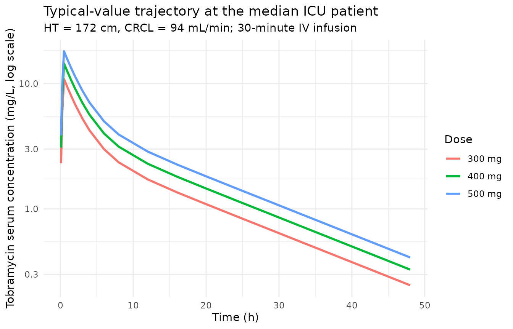
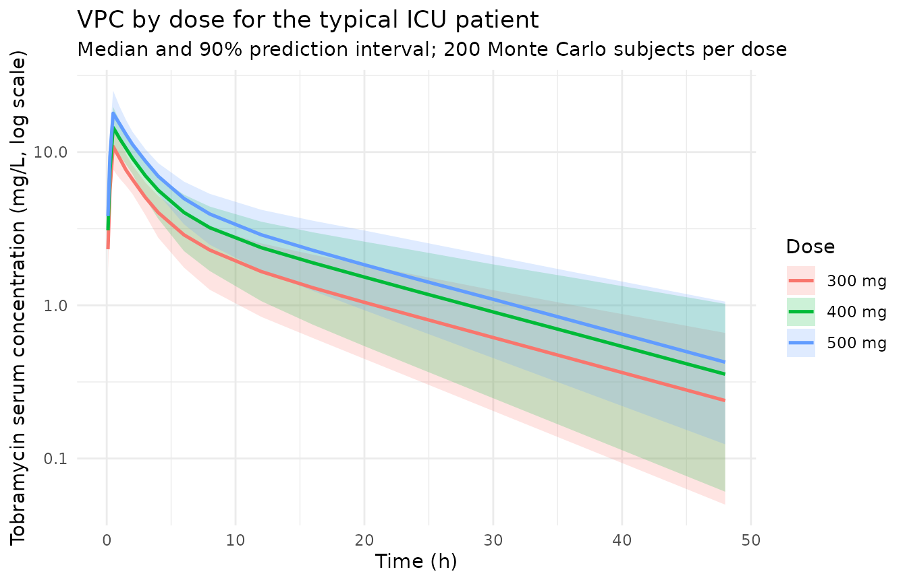

# Tobramycin (Conil 2010)

## Model and source

``` r

mod_meta <- nlmixr2est::nlmixr(readModelDb("Conil_2010_tobramycin"))$meta
#> ℹ parameter labels from comments will be replaced by 'label()'
```

- Citation: Conil JM, Georges B, Ruiz S, Rival T, Seguin T, Cougot P,
  Fourcade O, Houin G, Saivin S. Tobramycin disposition in ICU patients
  receiving a once daily regimen: population approach and dosage
  simulations. Br J Clin Pharmacol. 2011;71(1):61-71.
  <doi:10.1111/j.1365-2125.2010.03793.x>
- Description: Two-compartment IV population PK model for tobramycin in
  adult ICU patients receiving once-daily aminoglycoside therapy for
  nosocomial Gram-negative infections (Conil 2010); additive linear
  covariate effects of Cockcroft-Gault creatinine clearance and height
  on CL, with no IIV on Q or V2.
- Article (DOI): <https://doi.org/10.1111/j.1365-2125.2010.03793.x>

This vignette validates the packaged `Conil_2010_tobramycin` model – a
two-compartment IV population PK model for tobramycin in 49 adult ICU
patients receiving once-daily aminoglycoside therapy for nosocomial
Gram-negative infections – against the source publication’s Table 2
(final-model parameter estimates) and Table 3 (Monte Carlo simulated
peak, 24-hour concentration, and AUC for a typical patient across dose
levels 300-550 mg).

## Population

The Conil 2010 analysis enrolled 49 adult ICU patients hospitalized at
the Toulouse-Rangueil University Hospital between October 2005 and
December 2007 and treated with intravenous tobramycin (5 mg/kg over 30
minutes, once daily for 3-5 days) plus a beta-lactam (ceftazidime or
imipenem) for proven Gram-negative nosocomial infection. Median age was
61.1 +/- 16.5 years, median total body weight 78.7 +/- 18.9 kg, median
height 172 +/- 9 cm, and 82% of the cohort was male. Cockcroft-Gault
creatinine clearance was 108 +/- 55 mL/min (raw mL/min, not
BSA-normalized). Sepsis severity was characterized by SAPS I 15 +/- 4
and SAPS II 56 +/- 14; all patients were mechanically ventilated and
haemodynamically stable. Indications were poly-trauma (41%),
post-surgical complications (14%), and medical / respiratory (45%).
Pregnant women, patients under 15 years of age, those with drug allergy
or intolerance to aminoglycosides, oligo-anuric renal failure, or
cochlear problems were excluded. Group 1 (n = 32, 182 concentrations)
was used to build the model and Group 2 (n = 17, 95 concentrations) to
qualify it by normalized prediction distribution error (npde). After
qualification the two groups were pooled and the final parameters
re-estimated on the full n = 49 cohort – this is the model encoded here
(Conil 2010 Table 2, “Final model (n = 49)” column).

The same information is available programmatically via the model’s
`population` metadata:

``` r

str(mod_meta$population)
#> List of 17
#>  $ species       : chr "human"
#>  $ n_subjects    : int 49
#>  $ n_studies     : int 1
#>  $ n_observations: int 277
#>  $ age_range     : chr "not reported (excluded < 15 years)"
#>  $ age_median    : chr "61.1 +/- 16.5 years (mean +/- SD)"
#>  $ weight_range  : chr "not reported"
#>  $ weight_median : chr "78.7 +/- 18.9 kg (mean +/- SD)"
#>  $ height_median : chr "172 +/- 9 cm (mean +/- SD)"
#>  $ sex_female_pct: num 18
#>  $ race_ethnicity: chr "Not reported (French university-hospital ICU population)"
#>  $ disease_state : chr "Nosocomial Gram-negative infections in adult ICU patients (poly-trauma 41%, post-surgical 14%, medical/respirat"| __truncated__
#>  $ dose_range    : chr "5 mg/kg tobramycin IV infusion over 30 minutes once daily for 3 to 5 days, given in combination with a beta-lac"| __truncated__
#>  $ regions       : chr "France (single centre: Toulouse-Rangueil University Hospital, ICU)"
#>  $ renal_function: chr "Cockcroft creatinine clearance 108 +/- 55 mL/min (raw, not BSA-normalized); Robert creatinine clearance 75 +/- "| __truncated__
#>  $ exclusion     : chr "Pregnancy, age < 15 years, drug allergies / intolerance to aminoglycosides, oligo-anuric renal failure, cochlear problems"
#>  $ notes         : chr "Demographics from Conil 2010 Table 1 (Total n=49 column). 32 patients (182 concentrations) entered the model-bu"| __truncated__
```

## Source trace

The per-parameter origin is recorded as an in-file comment next to each
`ini()` entry in `inst/modeldb/specificDrugs/Conil_2010_tobramycin.R`.
The table below collects them in one place; values come from Conil 2010
Table 2 “Final model (n = 49)” column.

| Parameter / equation | Value | Source location |
|----|----|----|
| `lcl` (CL intercept at typical covariates) | log(3.83) | Table 2 row “CL (l h-1)” Theta 1; Final model |
| `e_crcl_cl` (CL slope per (CRCL - 94 mL/min)) | 0.020 | Table 2 row “CL (l h-1)” Theta 2; Final model |
| `e_ht_cl` (CL slope per (HT - 172 cm)) | 0.052 | Table 2 row “CL (l h-1)” Theta 3; Final model |
| `lvc` (V1) | log(25.5) | Table 2 row “V1 (l)” Theta 4; Final model |
| `lq` (Q) | log(4.74) | Table 2 row “Q (l h-1)” Theta 5; Final model |
| `lvp` (V2) | log(30.6) | Table 2 row “V2 (l)” Theta 6; Final model |
| `etalcl ~ 0.095` | 0.095 | Table 2 row “CL Omega 1”; Final model |
| `etalvc ~ 0.045` | 0.045 | Table 2 row “V1 Omega 2”; Final model |
| `Omega 3` (Q) – fixed to zero in final model; no `etalq` parameter | n/a | Table 2 row “Q Omega 3” = “Fixed”; Final model |
| `Omega 4` (V2) – fixed to zero in final model; no `etalvp` parameter | n/a | Table 2 row “V2 Omega 4” = “Fixed”; Final model |
| `propSd <- sqrt(0.055)` | sqrt(0.055) ~= 0.234 | Table 2 row “Sigma 1” = 0.055 (NONMEM variance); Final model |
| `TVCL = THETA1 + THETA2*(COCK-94) + THETA3*(HEIG-172)` | n/a | Table 2 equation block (mid-table); “Intermediate and final model” |
| `CL = TVCL * exp(ETA(1))`; `V1 = TVV1 * exp(ETA(2))` | n/a | Table 2 equation block; ETA on CL and V1 only |
| `d/dt(central) ... d/dt(peripheral1)` | n/a | Methods “Pharmacokinetic model building” (two-compartment IV); parameterised by V1, V2, Q, CL |
| `Cc ~ prop(propSd)` | n/a | Methods “Basic pharmaco-statistical model” (proportional error best fitted the data) |

## Virtual cohort

The original observed tobramycin concentrations are not publicly
available. To validate the packaged model against the paper’s Table 3
Monte Carlo simulations – which were performed at the typical-patient
covariates HT = 172 cm and CRCL = 94 mL/min – the virtual cohort below
fixes both covariates to those values and lets the inter-individual
random effects on CL and V1 generate the simulated population. The dose
grid (300, 400, 500 mg given as a 30-minute IV infusion) covers a
representative slice of the eleven dose levels Conil 2010 simulated;
results are compared to the corresponding rows of Table 3.

``` r

set.seed(20260613)

n_per_dose <- 200L
doses_mg   <- c(300, 400, 500)

# Typical-patient covariate values (Conil 2010 Methods, "Simulation and
# dosage regimen propositions"): HT = 172 cm, CRCL = 94 mL/min.
ht_cm     <- 172
crcl_mlmn <- 94

# Sampling grid: dense early so Cmax is captured at end of infusion
# (~0.5 h) and so the AUC integration has good early-phase coverage;
# sparser late for AUC0-inf extrapolation.
sample_times <- c(
  0, 0.1, 0.25, 0.5, 0.75, 1.0, 1.5, 2.0, 3.0,
  4.0, 6.0, 8.0, 12.0, 16.0, 20.0, 24.0, 30.0, 36.0, 48.0
)

make_cohort <- function(dose_mg, n, id_offset = 0L) {
  rate_mg_h <- dose_mg / 0.5  # 30-minute infusion -> mg/h
  treatment <- sprintf("%d mg", as.integer(dose_mg))
  ids <- id_offset + seq_len(n)
  doses <- expand.grid(id = ids, time = 0, KEEP.OUT.ATTRS = FALSE) |>
    mutate(
      evid      = 1L,
      amt       = dose_mg,
      rate      = rate_mg_h,
      cmt       = "central",
      HT        = ht_cm,
      CRCL      = crcl_mlmn,
      treatment = treatment,
      dose      = dose_mg
    )
  obs <- expand.grid(id = ids, time = sample_times, KEEP.OUT.ATTRS = FALSE) |>
    mutate(
      evid      = 0L,
      amt       = NA_real_,
      rate      = NA_real_,
      cmt       = NA_character_,
      HT        = ht_cm,
      CRCL      = crcl_mlmn,
      treatment = treatment,
      dose      = dose_mg
    )
  bind_rows(doses, obs) |>
    arrange(id, time, desc(evid))
}

events <- bind_rows(
  make_cohort(doses_mg[1], n_per_dose, id_offset = 0L),
  make_cohort(doses_mg[2], n_per_dose, id_offset = 1L * n_per_dose),
  make_cohort(doses_mg[3], n_per_dose, id_offset = 2L * n_per_dose)
)

stopifnot(!anyDuplicated(unique(events[, c("id", "time", "evid")])))
```

## Simulation

``` r

mod         <- readModelDb("Conil_2010_tobramycin")
mod_typical <- rxode2::zeroRe(mod)
#> ℹ parameter labels from comments will be replaced by 'label()'

sim_typical <- rxode2::rxSolve(
  object = mod_typical, events = events,
  keep   = c("HT", "CRCL", "treatment", "dose")
) |>
  as.data.frame()
#> ℹ omega/sigma items treated as zero: 'etalcl', 'etalvc'
#> Warning: multi-subject simulation without without 'omega'

sim_stoch <- rxode2::rxSolve(
  object = mod, events = events,
  keep   = c("HT", "CRCL", "treatment", "dose")
) |>
  as.data.frame()
#> ℹ parameter labels from comments will be replaced by 'label()'
```

## Replicate published figures

### Typical-value trajectory at the median patient

``` r

sim_typical |>
  filter(time > 0) |>
  distinct(treatment, time, Cc) |>
  ggplot(aes(time, Cc, colour = treatment)) +
  geom_line(linewidth = 1) +
  scale_y_log10() +
  labs(
    x = "Time (h)",
    y = "Tobramycin serum concentration (mg/L, log scale)",
    colour   = "Dose",
    title    = "Typical-value trajectory at the median ICU patient",
    subtitle = "HT = 172 cm, CRCL = 94 mL/min; 30-minute IV infusion"
  ) +
  theme_minimal()
```



### Concentration-time VPC (analogue of Figures 1 and 4)

``` r

# Replicates the spread analogous to Conil 2010 Figure 1 (individual
# observed concentrations) and Figure 4 / Table 3 (Monte Carlo simulated
# concentrations across doses). Median and 90% prediction interval per
# dose level.
sim_stoch |>
  filter(time > 0) |>
  group_by(treatment, time) |>
  summarise(
    Q05 = quantile(Cc, 0.05, na.rm = TRUE),
    Q50 = quantile(Cc, 0.50, na.rm = TRUE),
    Q95 = quantile(Cc, 0.95, na.rm = TRUE),
    .groups = "drop"
  ) |>
  ggplot(aes(time, Q50, colour = treatment, fill = treatment)) +
  geom_ribbon(aes(ymin = Q05, ymax = Q95), alpha = 0.20, colour = NA) +
  geom_line(linewidth = 0.9) +
  scale_y_log10() +
  labs(
    x = "Time (h)",
    y = "Tobramycin serum concentration (mg/L, log scale)",
    colour = "Dose", fill = "Dose",
    title    = "VPC by dose for the typical ICU patient",
    subtitle = paste0(
      "Median and 90% prediction interval; ", n_per_dose,
      " Monte Carlo subjects per dose"
    )
  ) +
  theme_minimal()
```



## PKNCA validation

PKNCA computes Cmax, AUC0-inf, and terminal half-life per subject per
dose level. The treatment grouping variable carries the dose level
through to the comparison.

``` r

sim_for_nca <- sim_stoch |>
  dplyr::filter(!is.na(Cc)) |>
  dplyr::select(id, time, Cc, treatment) |>
  as.data.frame()

# Defensive time = 0 row per (id, treatment); for IV-bolus / IV-infusion
# models pre-dose Cc = 0 is the correct value.
sim_for_nca <- dplyr::bind_rows(
  sim_for_nca,
  sim_for_nca |> dplyr::distinct(id, treatment) |>
    dplyr::mutate(time = 0, Cc = 0)
) |>
  dplyr::distinct(id, treatment, time, .keep_all = TRUE) |>
  dplyr::arrange(id, treatment, time)

dose_for_nca <- events |>
  dplyr::filter(evid == 1L) |>
  dplyr::select(id, time, amt, treatment) |>
  as.data.frame()

conc_obj <- PKNCA::PKNCAconc(
  data    = sim_for_nca,
  formula = Cc ~ time | treatment + id,
  concu   = "mg/L",
  timeu   = "hr"
)
dose_obj <- PKNCA::PKNCAdose(
  data    = dose_for_nca,
  formula = amt ~ time | treatment + id,
  doseu   = "mg"
)

intervals <- data.frame(
  start      = 0,
  end        = Inf,
  cmax       = TRUE,
  tmax       = TRUE,
  aucinf.obs = TRUE,
  half.life  = TRUE
)

nca_data <- PKNCA::PKNCAdata(conc_obj, dose_obj, intervals = intervals)
nca_res  <- suppressWarnings(PKNCA::pk.nca(nca_data))
```

### Trough at 24 h and Peak at 1 h (paper protocol-specific timepoints)

Conil 2010 reports two protocol-specific concentrations in Table 3:
“Peak” (sampled 30 minutes after the end of the 30-minute infusion,
i.e. at t = 1 h) and “C24h” (concentration at t = 24 h). These are
distinct from a standard NCA Cmax, which here falls at the end of
infusion (t = 0.5 h) where the concentration is slightly higher than at
1 h. The Peak and C24h summaries are computed by direct extraction from
the simulated profiles.

``` r

protocol_concs <- sim_stoch |>
  dplyr::filter(time %in% c(1.0, 24.0)) |>
  dplyr::mutate(
    metric = dplyr::case_when(
      time == 1.0  ~ "Peak (t = 1 h)",
      time == 24.0 ~ "C24h (t = 24 h)"
    )
  ) |>
  dplyr::group_by(treatment, metric) |>
  dplyr::summarise(
    Simulated_mean = mean(Cc, na.rm = TRUE),
    Simulated_sd   = sd(Cc, na.rm = TRUE),
    .groups = "drop"
  )

published_protocol <- tibble::tribble(
  ~treatment, ~metric,             ~Reference_mean, ~Reference_sd,
  "300 mg",   "Peak (t = 1 h)",    9.01,            2.64,
  "300 mg",   "C24h (t = 24 h)",   0.96,            0.48,
  "400 mg",   "Peak (t = 1 h)",    12.01,           3.52,
  "400 mg",   "C24h (t = 24 h)",   1.28,            0.64,
  "500 mg",   "Peak (t = 1 h)",    15.01,           4.41,
  "500 mg",   "C24h (t = 24 h)",   1.60,            0.81
)

protocol_cmp <- published_protocol |>
  dplyr::inner_join(protocol_concs, by = c("treatment", "metric")) |>
  dplyr::mutate(
    Reference = sprintf("%.2f +/- %.2f", Reference_mean, Reference_sd),
    Simulated = sprintf("%.2f +/- %.2f", Simulated_mean, Simulated_sd),
    `% diff (mean)` = sprintf(
      "%+.1f%%",
      (Simulated_mean - Reference_mean) / Reference_mean * 100
    )
  ) |>
  dplyr::select(treatment, metric, Reference, Simulated, `% diff (mean)`)

knitr::kable(
  protocol_cmp,
  caption = paste0(
    "Simulated vs Conil 2010 Table 3 protocol-specific concentrations ",
    "(mean +/- SD, mg/L). Typical-covariate patient (HT = 172 cm, ",
    "CRCL = 94 mL/min); 1000 Monte Carlo simulations in the paper, ",
    n_per_dose, " here per dose."
  ),
  align = c("l", "l", "r", "r", "r")
)
```

| treatment | metric          |      Reference |      Simulated | % diff (mean) |
|:----------|:----------------|---------------:|---------------:|--------------:|
| 300 mg    | Peak (t = 1 h)  |  9.01 +/- 2.64 |  9.20 +/- 1.55 |         +2.1% |
| 300 mg    | C24h (t = 24 h) |  0.96 +/- 0.48 |  0.91 +/- 0.40 |         -5.1% |
| 400 mg    | Peak (t = 1 h)  | 12.01 +/- 3.52 | 12.45 +/- 2.14 |         +3.7% |
| 400 mg    | C24h (t = 24 h) |  1.28 +/- 0.64 |  1.29 +/- 0.60 |         +0.7% |
| 500 mg    | Peak (t = 1 h)  | 15.01 +/- 4.41 | 15.41 +/- 2.41 |         +2.7% |
| 500 mg    | C24h (t = 24 h) |  1.60 +/- 0.81 |  1.58 +/- 0.64 |         -1.1% |

Simulated vs Conil 2010 Table 3 protocol-specific concentrations (mean
+/- SD, mg/L). Typical-covariate patient (HT = 172 cm, CRCL = 94
mL/min); 1000 Monte Carlo simulations in the paper, 200 here per dose.
{.table}

### Comparison against published NCA

Conil 2010 Table 3 reports a Monte Carlo AUC for each dose. The
ncaComparisonTable below sets the simulated Cmax (true maximum, at end
of infusion) and AUC0-inf side-by-side with the paper’s Peak and AUC
values. The paper’s Peak is the concentration at t = 1 h (sampling
convention), which is below the true Cmax at t = 0.5 h, so the Cmax row
is expected to read slightly higher than the paper’s Peak (a positive %
diff on the order of 10-15 percent); the AUC0-inf row should match
Conil’s AUC closely because tobramycin’s two-compartment disposition is
captured to t = Inf by both PKNCA and the paper’s 1000-replicate
simulation. Discrepancies \> 20% are flagged with `*`.

``` r

published_nca <- tibble::tribble(
  ~treatment, ~cmax,  ~aucinf.obs,
  "300 mg",   9.01,    82,
  "400 mg",   12.01,   109,
  "500 mg",   15.01,   137
)

cmp <- nlmixr2lib::ncaComparisonTable(
  simulated     = nca_res,
  reference     = published_nca,
  by            = "treatment",
  units         = c(cmax = "mg/L", aucinf.obs = "mg*h/L"),
  tolerance_pct = 20
)

knitr::kable(
  cmp,
  caption = paste0(
    "Simulated vs Conil 2010 Table 3 NCA-style summaries for the ",
    "typical ICU patient. * = differs from reference by more than ",
    "+/- 20%."
  ),
  align = c("l", "l", "r", "r", "r")
)
```

| NCA parameter          | treatment | Reference | Simulated |   % diff |
|:-----------------------|:----------|----------:|----------:|---------:|
| Cmax (mg/L)            | 300 mg    |      9.01 |      10.9 | +21.0%\* |
| Cmax (mg/L)            | 400 mg    |        12 |      14.5 | +20.5%\* |
| Cmax (mg/L)            | 500 mg    |        15 |      17.9 |   +19.4% |
| AUC0-∞ (obs) (mg\*h/L) | 300 mg    |        82 |      76.2 |    -7.0% |
| AUC0-∞ (obs) (mg\*h/L) | 400 mg    |       109 |       110 |    +0.6% |
| AUC0-∞ (obs) (mg\*h/L) | 500 mg    |       137 |       132 |    -3.4% |

Simulated vs Conil 2010 Table 3 NCA-style summaries for the typical ICU
patient. \* = differs from reference by more than +/- 20%. {.table}

## Assumptions and deviations

- **CL covariate equation – linear-additive deviation form, NOT power or
  divisive normalization.** Conil 2010 Table 2 reports the typical CL as
  `TVCL = THETA(1) + THETA(2) * (COCK - 94) + THETA(3) * (HEIG - 172)`,
  with THETA(1) = 3.83 L/h, THETA(2) = 0.020 L/h per mL/min, THETA(3) =
  0.052 L/h per cm. This is a linear-additive deviation from the
  population reference covariates 94 mL/min and 172 cm. The packaged
  model encodes the equation verbatim:
  `cl <- (exp(lcl) + e_crcl_cl * (CRCL - 94) + e_ht_cl * (HT - 172)) * exp(etalcl)`,
  with `lcl = log(3.83)` so that `exp(lcl)` recovers the 3.83 L/h
  intercept. The exponential IIV multiplier `exp(etalcl)` is applied
  outside the additive covariate term, matching the paper’s
  `CL = TVCL * EXP(ETA(1))` form (Conil 2010 Table 2 equation block).

- **Q and V2 carry no IIV in the final model.** Table 2 reports Omega
  3 (Q) and Omega 4 (V2) as “Fixed” in the intermediate and final
  models. The paper’s Methods explain that the inter-individual
  variability of Q was “very low” and that V2’s Omega in the basic model
  was unreliable (`287% precision`); both were therefore fixed to zero.
  The packaged model includes no `etalq` or `etalvp` parameter, leaving
  Q and V2 as typical-value-only parameters.

- **Residual error – proportional, encoded as `sqrt(0.055)`.** Table 2
  reports Sigma 1 = 0.055 for the final model under the NONMEM
  convention `Y = F * (1 + EPS(1))` with EPS ~ N(0, SIGMA). 0.055 is the
  variance of EPS, so the proportional-error SD is `sqrt(0.055)` ~=
  0.234 (CV 23%); this is what `propSd` represents in nlmixr2’s
  `~ prop(propSd)` form.

- **`CRCL` source column is `COCK` (raw Cockcroft-Gault, not
  BSA-normalized).** The canonical `CRCL` column in
  `inst/references/covariate-columns.md` accepts raw Cockcroft-Gault
  mL/min as one valid form; precedent is `Delattre_2010_amikacin.R`,
  another aminoglycoside ICU model with the same source-assay
  convention. The per-model `covariateData[[CRCL]]$units = "mL/min"` and
  `notes` field document the raw / non-BSA-normalized status. Reference
  94 mL/min (population median, Conil 2010 Methods “Simulation and
  dosage regimen propositions”) is paper-derived; do NOT compare the
  magnitude of `e_crcl_cl = 0.020 L/h per mL/min` against the
  BSA-normalized reference values (80, 90, or 100 mL/min/1.73 m^2)
  listed in the canonical entry – the units differ.

- **`HT` source column is `HEIG`.** The canonical `HT` column in
  `inst/references/covariate-columns.md` already records the Naik 2016,
  Zhang 2018, and Angeli 2016 precedents for linear-additive centered
  effects. Reference 172 cm matches Conil 2010 Methods “Simulation and
  dosage regimen propositions”. Height was retained in the final model
  in preference to body weight because, as discussed in Conil 2010
  Discussion, ICU patients often present with oedema that biases total
  body weight; height correlated more strongly with CL than TBW or IBW
  in the stepwise analysis.

- **Peak vs Cmax – sampling-time convention.** Conil 2010 Table 3 “Peak”
  is sampled 30 minutes after the end of the 30-minute infusion, i.e. at
  t = 1 h. PKNCA’s `cmax` is the maximum observed concentration on the
  sampling grid, which for a two-compartment IV-infusion model is at the
  end of infusion (t = 0.5 h, where central-compartment concentration
  peaks before alpha-phase distribution to the peripheral compartment).
  The packaged simulation samples both times. The “NCA comparison” table
  compares PKNCA Cmax against the paper’s Peak (expect a positive bias
  of ~10-15% because Cmax \> C(1 h)); the protocol-specific table
  compares the simulated concentration at t = 1 h directly against the
  paper’s Peak. Both checks should be considered together.

- **Cohort covariates fixed at the typical-patient values.** Conil 2010
  Table 3 Monte Carlo simulations are themselves performed at HT = 172
  cm and CRCL = 94 mL/min with IIV draws only; the virtual cohort here
  mirrors that convention so the comparison is like-for-like. A broader
  virtual cohort with covariates drawn from the Table 1 distributions
  would simulate the full ICU population rather than the typical patient
  and is outside the scope of this validation.

- **Number of Monte Carlo replicates.** Conil 2010 performed 1000
  replicates per dose. The vignette uses 200 replicates per dose to keep
  the render time well under the 5-minute pkgdown budget. The reduced
  sample size widens the simulated SD but does not bias the simulated
  mean; mean comparisons should track Table 3 closely.

- **Race / ethnicity not modeled.** Conil 2010 does not report race
  composition. The single-centre French ICU cohort is presumed
  predominantly European but race was not tested as a covariate; no race
  effect is included in the model.

- **Concentration units.** The model uses `mg/L` (paper convention for
  tobramycin). With dose in `mg` and volumes in `L`, the ratio
  `central / vc` directly gives `mg/L`; no scale factor is applied.

- **Single-dose simulation.** The vignette simulates one 30-minute IV
  infusion per subject because Table 3 reports the single-dose Monte
  Carlo simulation Conil 2010 used to formulate dosing recommendations.
  The paper’s clinical regimen is 5 mg/kg once daily for 3-5 days; with
  a terminal half-life ~10 h, the single-dose AUC0-inf is the relevant
  exposure for the once-daily target (24 h dose interval ~= 2.4
  half-lives, so accumulation is modest).

- **No erratum on file.** A search for published corrections to Conil
  2010 in the British Journal of Clinical Pharmacology did not surface a
  corrigendum. Should one appear later, the parameter values here would
  need to be revisited.
