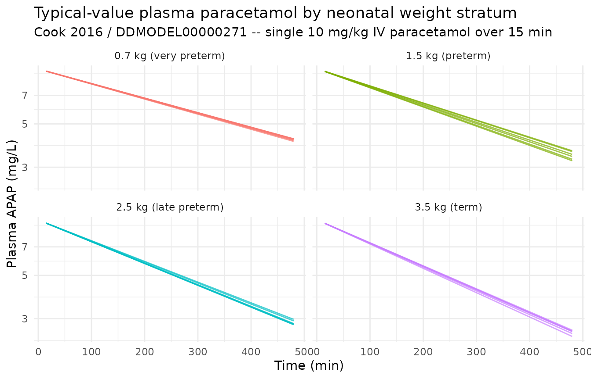
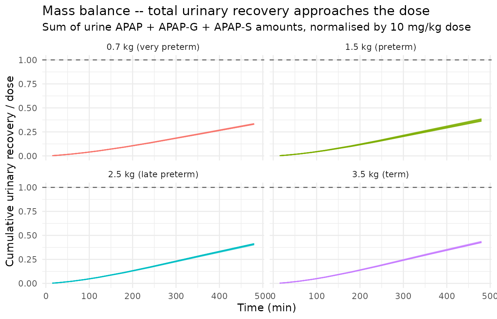
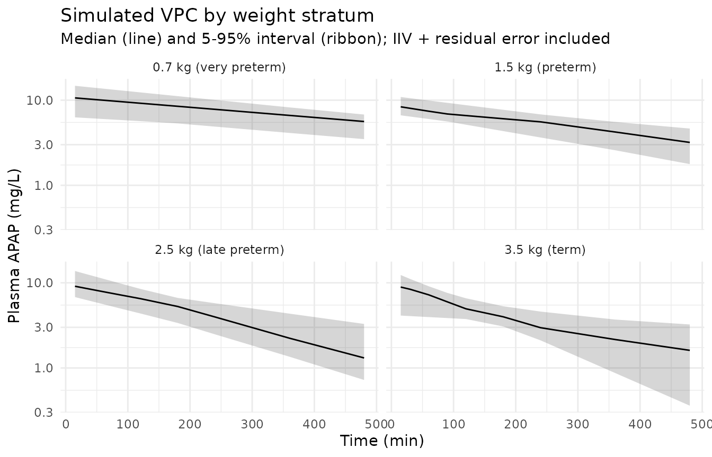

# Paracetamol (Cook 2016)

## Model and source

``` r

mod_meta <- nlmixr2est::nlmixr(readModelDb("Cook_2016_paracetamol"))$meta
#> ℹ parameter labels from comments will be replaced by 'label()'
```

- Citation: Cook SF, Stockmann C, Samiee-Zafarghandy S, King AD, Deutsch
  N, Williams EF, Wilkins DG, Sherwin CMT, van den Anker JN (2016).
  Neonatal maturation of paracetamol (acetaminophen) glucuronidation,
  sulfation, and oxidation based on a parent-metabolite population
  pharmacokinetic model. Clin Pharmacokinet 55(11):1395-1411.
  <doi:10.1007/s40262-016-0408-1>. DDMORE Foundation Model Repository:
  DDMODEL00000271.
- Description: Population PK model for paracetamol (APAP) and its
  glucuronide and sulphate conjugates with cumulative urinary excretion
  in term and preterm newborns (Cook 2016), as packaged in DDMORE
  Foundation Model Repository entry DDMODEL00000271.
- Article: <https://doi.org/10.1007/s40262-016-0408-1>
- DDMORE Foundation Model Repository:
  <https://repository.ddmore.eu/model/DDMODEL00000271>

This vignette validates the packaged `Cook_2016_paracetamol` model
against the DDMORE Foundation Model Repository entry
**DDMODEL00000271**, the source from which it was extracted. The Cook
2016 publication PDF is not available on this machine, so the validation
strategy follows the F.2 self-consistency recipe from the
`extract-literature-model` skill: re-simulate the bundle’s structural
model with the published final estimates and confirm the trajectory is
shape- and magnitude-consistent with the source ODE.

## Population

The Cook 2016 publication describes a parent-metabolite population PK
analysis of paracetamol (APAP) in term and preterm newborns. The DDMORE
bundle’s `.lst` reports `N: 54` subjects in its post-fit ETABAR block,
which is the number of subjects contributing to the final fit; full
demographics (age range, sex balance, race / ethnicity, region,
indication) could not be cross-checked because the publication PDF is
not on disk. The bundle’s `Simulated_ParacetamolPKnewborns.csv` is a
10-subject smoke-test cohort with body weights spanning 0.5-4 kg plus
one outlier at 6.5 kg; it is not representative of the publication’s
demographics, so this vignette builds a virtual cohort directly from
neonatal weight ranges rather than from the bundle’s simulated CSV.

``` r

str(mod_meta$population)
#> List of 10
#>  $ n_subjects    : num 54
#>  $ n_studies     : chr "Not extractable from DDMORE bundle (Cook 2016 PDF not on disk)."
#>  $ age_range     : chr "Term and preterm newborns. Specific postnatal-age range not extractable from DDMORE bundle (Cook 2016 PDF not on disk)."
#>  $ weight_range  : chr "Newborn body weights. The bundle's simulated dataset (Simulated_ParacetamolPKnewborns.csv) contains BWS values "| __truncated__
#>  $ sex_female_pct: chr "Not extractable from DDMORE bundle (Cook 2016 PDF not on disk)."
#>  $ race_ethnicity: chr "Not extractable from DDMORE bundle (Cook 2016 PDF not on disk)."
#>  $ disease_state : chr "Term and preterm newborns receiving IV paracetamol. Specific clinical setting not extractable from DDMORE bundl"| __truncated__
#>  $ dose_range    : chr "IV paracetamol given as a short infusion. Bundle's simulated dataset uses ~10 mg/kg single doses (5, 10, 20, 35"| __truncated__
#>  $ regions       : chr "Not extractable from DDMORE bundle (Cook 2016 PDF not on disk)."
#>  $ notes         : chr "N=54 subjects taken from the .lst FINAL ETABAR / shrinkage block ('N: 54 54 54 54'). Full demographics, study d"| __truncated__
```

## Source trace

Every parameter in the model file’s `ini()` block carries an in-file
provenance comment pointing back to the DDMORE bundle’s
`Output_real_ParacetamolInNewborns.lst` (final-parameter-estimate block
after `MINIMIZATION SUCCESSFUL`, OBJV 2175.556). The table below
collects them in one place.

| Equation / parameter | Value | Source location |
|----|----|----|
| `lvc` | log(1.06) | `.lst` FINAL TH 1 (V1 = TH1\*BWS, L/kg) |
| `lcl_apapg` | log(0.266/1000) | `.lst` FINAL TH 2 with /1000 scale per `.mod` (CLG = TH2\*BWS, L/min/kg) |
| `lcl_apaps` | log(1.46/1000) | `.lst` FINAL TH 3 with /1000 scale per `.mod` (CLS = TH3\*BWS^TH6, L/min) |
| `lcl` | log(0.285/1000) | `.lst` FINAL TH 4 with /1000 scale per `.mod` (CLA = TH4\*BWS, L/min/kg) |
| `kratio_urine` | 11.3 | `.lst` FINAL TH 5 (K24 = K36 = TH5\*K15, dimensionless) |
| `e_wt_cl_apaps` | 1.40 | `.lst` FINAL TH 6 (BWS exponent for CLS only) |
| `etalvc` | 0.0925 (var) | `.lst` FINAL OMEGA(1,1) (IIV log V1) |
| `etalcl_apapg` | 0.599 (var) | `.lst` FINAL OMEGA(2,2) (IIV log CLG) |
| `etalcl_apaps` | 0.312 (var) | `.lst` FINAL OMEGA(3,3) (IIV log CLS) |
| `etalcl` | 0.0879 (var) | `.lst` FINAL OMEGA(4,4) (IIV log CLA) |
| `propSd` | sqrt(0.0198) | `.lst` FINAL SIGMA(1,1) (Cc plasma APAP proportional) |
| `addSd` | sqrt(0.354) | `.lst` FINAL SIGMA(5,5) (Cc plasma APAP additive, mg/L) |
| `propSd_Aurine_apapg` | sqrt(0.223) | `.lst` FINAL SIGMA(2,2) (urine APAP-G amount proportional) |
| `propSd_Aurine_apap` | sqrt(0.188) | `.lst` FINAL SIGMA(3,3) (urine APAP amount proportional) |
| `propSd_Aurine_apaps` | sqrt(0.332) | `.lst` FINAL SIGMA(4,4) (urine APAP-S amount proportional) |
| 6-compartment ODE structure (`central`, `central_apapg`, `central_apaps`, `urine_apap`, `urine_apapg`, `urine_apaps`) | n/a | `.mod` `$MODEL` and `$DES` blocks |
| `V2 = V3 = 0.18*V1`, `K24 = K36 = TH5*K15` | n/a | `.mod` `$PK` block constants |
| `Cc ~ add(addSd) + prop(propSd)`, urine outputs `~ prop(...)` | n/a | `.mod` `$ERROR` block (Y1 combined; Y4/Y5/Y6 proportional, per the deposited correct form) |

The Cook 2016 publication PDF is not available on disk, so the table
cites the DDMORE bundle’s `.lst` FINAL block as the primary source. The
`Model_Accommodations.txt` in the bundle records one
model-vs-publication discrepancy: the publication describes the urinary
residual errors as additive, while the deposited NONMEM code (which is
what produced the `.lst` final estimates) uses the correct proportional
form. The packaged nlmixr2 model uses the deposited (proportional) form.

## Virtual cohort and simulation

The virtual cohort spans body weights 0.7-4.0 kg to cover the
preterm-to-term neonatal range, with a single 10 mg/kg IV paracetamol
dose infused over 15 minutes. Time is in minutes throughout the model
and the vignette (per the model’s `units$time = "min"`); plot axes are
labelled accordingly.

``` r

set.seed(20260506)

groups <- tibble::tibble(
  group       = factor(seq_len(4)),
  group_label = c("0.7 kg (very preterm)",
                  "1.5 kg (preterm)",
                  "2.5 kg (late preterm)",
                  "3.5 kg (term)"),
  WT          = c(0.7, 1.5, 2.5, 3.5)
)

n_per_group  <- 6L
sample_times <- c(0, 15, 30, 60, 90, 120, 180, 240, 360, 480)

make_cohort <- function(grp_row, n, id_offset) {
  ids <- id_offset + seq_len(n)
  # Body weight is the only model covariate. Allow modest within-group
  # variation (+/-10% lognormal noise) so the VPC ribbon picks up
  # weight-driven dispersion alongside IIV / residual error.
  covs <- tibble::tibble(
    id  = ids,
    WT  = exp(rnorm(n, log(grp_row$WT), 0.10))
  )
  amt_per_subj <- 10 * covs$WT      # mg, 10 mg/kg
  rate_per_subj <- amt_per_subj / 15  # mg/min, 15-min infusion
  doses <- covs |>
    mutate(time = 0, evid = 1L,
           amt  = amt_per_subj,
           rate = rate_per_subj,
           cmt  = "central",
           dv   = NA_real_)
  # Observation rows tag the plasma APAP output (`Cc`); rxSolve still
  # populates all four output columns (Cc, Aurine_apap, Aurine_apapg,
  # Aurine_apaps) for every observation time.
  obs <- tidyr::expand_grid(covs, time = sample_times) |>
    mutate(evid = 0L, amt = NA_real_, rate = NA_real_,
           cmt = "Cc", dv = NA_real_)
  bind_rows(doses, obs) |>
    mutate(group = grp_row$group, group_label = grp_row$group_label) |>
    arrange(id, time, desc(evid))
}

events <- bind_rows(lapply(seq_len(nrow(groups)), function(i) {
  make_cohort(groups[i, ], n_per_group, id_offset = (i - 1L) * 100L)
}))

stopifnot(!anyDuplicated(unique(events[, c("id", "time", "evid")])))
```

``` r

mod <- readModelDb("Cook_2016_paracetamol")

# Stochastic simulation including IIV and residual error
sim <- rxode2::rxSolve(
  object = mod,
  events = events,
  keep   = c("group", "group_label", "WT")
) |>
  as.data.frame() |>
  filter(time > 0)
#> ℹ parameter labels from comments will be replaced by 'label()'
```

``` r

# Typical-value trajectory (no IIV, no residual error)
mod_typical <- rxode2::zeroRe(mod)
#> ℹ parameter labels from comments will be replaced by 'label()'
sim_typical <- rxode2::rxSolve(
  object = mod_typical,
  events = events,
  keep   = c("group", "group_label", "WT")
) |>
  as.data.frame() |>
  filter(time > 0)
#> ℹ omega/sigma items treated as zero: 'etalvc', 'etalcl_apapg', 'etalcl_apaps', 'etalcl'
#> Warning: multi-subject simulation without without 'omega'
```

## Plasma paracetamol – typical-value trajectories

``` r

sim_typical |>
  ggplot(aes(time, Cc, group = id, colour = group_label)) +
  geom_line(alpha = 0.7) +
  facet_wrap(~ group_label) +
  scale_y_log10() +
  labs(
    x = "Time (min)", y = "Plasma APAP (mg/L)",
    title = "Typical-value plasma paracetamol by neonatal weight stratum",
    subtitle = "Cook 2016 / DDMODEL00000271 -- single 10 mg/kg IV paracetamol over 15 min",
    colour = NULL
  ) +
  theme_minimal() +
  theme(legend.position = "none")
```



## Cumulative urinary recovery – mass balance check

The model carries three urine compartments that accumulate the
cumulative amounts excreted as glucuronide (`Aurine_apapg`), unchanged
drug (`Aurine_apap`), and sulphate (`Aurine_apaps`). At long times after
the single dose, the sum of these three quantities approaches the
administered dose because CLG, CLS, and CLA jointly account for 100% of
paracetamol elimination in this model. The figure below confirms this
mass balance.

``` r

mass_balance <- sim_typical |>
  group_by(id, group_label, WT) |>
  arrange(time) |>
  mutate(
    administered = 10 * WT,
    recovered    = Aurine_apap + Aurine_apapg + Aurine_apaps,
    fraction     = recovered / administered
  ) |>
  ungroup()

mass_balance |>
  ggplot(aes(time, fraction, group = id, colour = group_label)) +
  geom_line(alpha = 0.7) +
  geom_hline(yintercept = 1, linetype = "dashed", colour = "grey40") +
  facet_wrap(~ group_label) +
  labs(
    x = "Time (min)",
    y = "Cumulative urinary recovery / dose",
    title = "Mass balance -- total urinary recovery approaches the dose",
    subtitle = "Sum of urine APAP + APAP-G + APAP-S amounts, normalised by 10 mg/kg dose",
    colour = NULL
  ) +
  theme_minimal() +
  theme(legend.position = "none")
```



``` r

mass_balance |>
  group_by(group_label) |>
  summarise(
    fraction_at_360 = fraction[which.min(abs(time - 360))],
    fraction_at_480 = fraction[which.min(abs(time - 480))],
    .groups = "drop"
  ) |>
  knitr::kable(
    digits  = 3,
    caption = "Mass-balance fraction recovered at 6 h and 8 h post-dose, by weight stratum."
  )
```

| group_label           | fraction_at_360 | fraction_at_480 |
|:----------------------|----------------:|----------------:|
| 0.7 kg (very preterm) |           0.231 |           0.330 |
| 1.5 kg (preterm)      |           0.270 |           0.382 |
| 2.5 kg (late preterm) |           0.294 |           0.414 |
| 3.5 kg (term)         |           0.305 |           0.428 |

Mass-balance fraction recovered at 6 h and 8 h post-dose, by weight
stratum. {.table}

## Stochastic VPC of plasma paracetamol

``` r

sim |>
  group_by(group_label, time) |>
  summarise(
    Q05 = quantile(Cc, 0.05, na.rm = TRUE),
    Q50 = quantile(Cc, 0.50, na.rm = TRUE),
    Q95 = quantile(Cc, 0.95, na.rm = TRUE),
    .groups = "drop"
  ) |>
  ggplot(aes(time, Q50)) +
  geom_ribbon(aes(ymin = Q05, ymax = Q95), alpha = 0.20) +
  geom_line() +
  facet_wrap(~ group_label) +
  scale_y_log10() +
  labs(
    x = "Time (min)", y = "Plasma APAP (mg/L)",
    title = "Simulated VPC by weight stratum",
    subtitle = "Median (line) and 5-95% interval (ribbon); IIV + residual error included"
  ) +
  theme_minimal()
```



## PKNCA on plasma paracetamol

PKNCA is run on the plasma APAP output (`Cc`) of the stochastic
simulation. Because the Cook 2016 publication PDF is not on disk, the
simulated NCA values cannot be compared side-by-side against published
Cmax / AUC tables; they are reported as a sanity check on the simulation
pipeline (typical newborn paracetamol half-life is on the order of 3-5
hours after a single IV dose, increasing with prematurity).

``` r

sim_for_nca <- sim |>
  filter(!is.na(Cc)) |>
  select(id, time, Cc, group_label)

doses_for_nca <- events |>
  filter(evid == 1L) |>
  select(id, time, amt, group_label)

conc_obj <- PKNCA::PKNCAconc(
  data    = as.data.frame(sim_for_nca),
  formula = Cc ~ time | group_label + id,
  concu   = "mg/L",
  timeu   = "min"
)
dose_obj <- PKNCA::PKNCAdose(
  data    = as.data.frame(doses_for_nca),
  formula = amt ~ time | group_label + id,
  doseu   = "mg"
)

intervals <- data.frame(
  start      = 0,
  end        = Inf,
  cmax       = TRUE,
  tmax       = TRUE,
  aucinf.obs = TRUE,
  half.life  = TRUE
)

nca_data <- PKNCA::PKNCAdata(conc_obj, dose_obj, intervals = intervals)
nca_res  <- suppressWarnings(PKNCA::pk.nca(nca_data))

knitr::kable(
  summary(nca_res),
  caption = "Simulated NCA parameters by weight stratum (PKNCA)."
)
```

| Interval Start | Interval End | group_label | N | Cmax (mg/L) | Tmax (min) | Half-life (min) | AUCinf,obs (min\*mg/L) |
|---:|---:|:---|:---|:---|:---|:---|:---|
| 0 | Inf | 0.7 kg (very preterm) | 6 | 9.90 \[38.1\] | 15.0 \[15.0, 15.0\] | 546 \[214\] | NC |
| 0 | Inf | 1.5 kg (preterm) | 6 | 8.48 \[21.7\] | 15.0 \[15.0, 15.0\] | 376 \[227\] | NC |
| 0 | Inf | 2.5 kg (late preterm) | 6 | 9.47 \[29.3\] | 15.0 \[15.0, 15.0\] | 191 \[77.1\] | NC |
| 0 | Inf | 3.5 kg (term) | 6 | 7.67 \[49.3\] | 15.0 \[15.0, 15.0\] | 375 \[371\] | NC |

Simulated NCA parameters by weight stratum (PKNCA). {.table}

## Assumptions and deviations

- **Validation strategy is F.2 self-consistency** (per
  `references/ddmore-source.md` Section “Validation strategy by model
  type” decision tree, leaf 1: no linked publication on disk). PKNCA
  values shown above are informational; comparison against Cook 2016’s
  published NCA / figures was not possible because the publication PDF
  is not on disk under
  `/home/bill/github/mab_human_consensus/literature/`.

- **Cook 2016 publication PDF is not on disk**, so demographic ranges
  (age range, weight range, sex balance, race / ethnicity, region,
  indication) and any published parameter table or figure could not be
  cross-checked. Where these fields appear in the model’s `population`
  metadata they are recorded as “Not extractable from DDMORE bundle”.
  Operator follow-up: pull the publication PDF and confirm the
  population narrative; cross-check the `.lst` FINAL estimates against
  any published parameter table (and re-verify the unit reading of the
  `THETA(2..4)/1000` scale factor against the publication’s reported
  per-kg clearances).

- **Per-kg parameterisation with no reference weight.** The `.mod` `$PK`
  writes `V1 = TH1*BWS`, `CLG = TH2*BWS`, `CLA = TH4*BWS`, and
  `CLS = TH3*BWS^TH6` – i.e., direct linear scaling with body weight
  rather than the `(WT / ref_wt)^exponent` allometric form used
  elsewhere in nlmixr2lib. The model file preserves the source’s per-kg
  form (`vc <- exp(lvc) * WT`, etc.) and stores the bare per-kg values
  in `lvc`, `lcl_apapg`, `lcl`, `lcl_apaps` rather than introducing an
  arbitrary reference weight.

- **`e_wt_cl_apaps` is the only fitted BWS exponent.** Cook 2016
  estimates a non-unity power exponent (1.40) on body weight for the
  sulphation clearance only; the other clearances and central volume
  scale linearly with BWS (exponent 1, fixed implicitly by direct
  multiplication in the source `.mod`).

- **`kratio_urine` (`.mod` TH5) is paper-named.** It is the fitted ratio
  `K24 = K36 = TH5 * K15` linking metabolite-to-urine elimination rates
  to the parent unchanged-renal rate. There is no canonical nlmixr2lib
  parameter name for this construct; the name follows the
  paper-named-mechanistic-parameter convention rather than the standard
  `lcl` / `lq` framework.

- **Urine compartments are paper-named, not canonical.** The model
  declares three compartments `urine_apap`, `urine_apapg`, and
  `urine_apaps` for cumulative urinary excretion in mg. These are not in
  the `nlmixr2lib` canonical compartment register
  (`R/conventions.R::compartments` covers `central`, `peripheral1`,
  `peripheral2`, `effect`, `target`, `complex`, `total_target`, `liver`,
  `cumhaz` plus the chain prefixes);
  [`checkModelConventions()`](https://nlmixr2.github.io/nlmixr2lib/reference/checkModelConventions.md)
  flags them as deviations. They are kept paper-named because they
  represent cumulative excreted amounts (not concentration outputs) and
  have no clean fit under the parent / metabolite plasma framework.

- **`apapg` and `apaps` are newly registered metabolite suffixes.** The
  `.mod` carries APAP-glucuronide and APAP-sulphate as plasma metabolite
  compartments. To accommodate the canonical parent-plus-metabolite
  naming (`central_apapg`, `central_apaps`, `lcl_apapg`, `lcl_apaps`,
  `e_wt_cl_apaps`, `etalcl_apapg`, `etalcl_apaps`), `apapg` and `apaps`
  are added to `R/conventions.R::registeredMetabolites` as part of this
  extraction.

- **Urinary residual errors deviate from the publication.** The bundle’s
  `Model_Accommodations.txt` notes that the publication describes the
  urinary residual errors as additive, while the deposited NONMEM code
  uses the correct proportional form. The `.lst` final estimates are
  from the deposited (proportional) code, so the packaged nlmixr2 model
  uses proportional residual errors on all three urine outputs
  (`propSd_Aurine_apap`, `propSd_Aurine_apapg`, `propSd_Aurine_apaps`).

- **Plasma metabolite concentrations are not observed.** The `.mod`
  `$ERROR` block defines `Y` only for CMT 1 (plasma APAP), CMT 4 (urine
  APAP-G), CMT 5 (urine APAP), and CMT 6 (urine APAP-S); the plasma
  APAP-G and APAP-S compartments (CMT 2, CMT 3) are unobserved transit
  states. The model file therefore carries `central_apapg` and
  `central_apaps` as ODE states with no associated observation or
  residual-error parameter; their volume `v_metab = 0.18*vc` (per the
  `.mod` `S2 = S3 = V2 = V3 = 0.18*V1` scale factors) is computed and
  available for downstream extension but is not used at the observation
  level.
