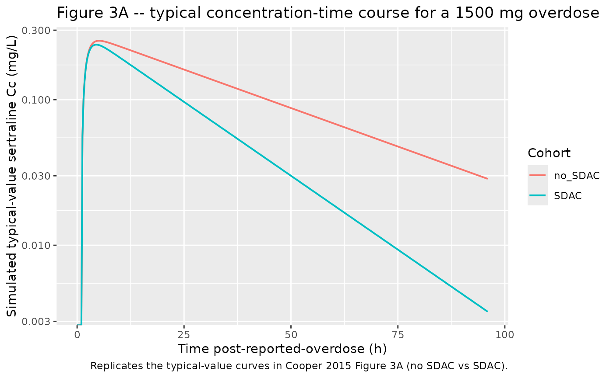
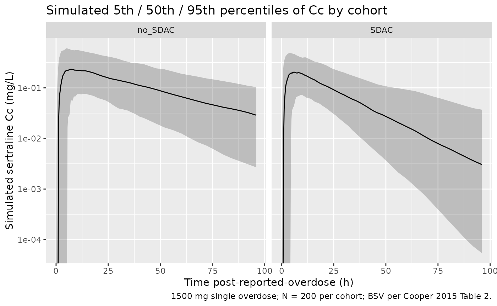

# Sertraline (Cooper 2015)

## Model and source

- Citation: Cooper JM, Duffull SB, Saiao AS, Isbister GK. The
  pharmacokinetics of sertraline in overdose and the effect of activated
  charcoal. Br J Clin Pharmacol. 2015 May;79(5):307-15.
  <doi:10.1111/bcp.12500>
- Description: One-compartment first-order absorption population PK
  model for sertraline in overdose (Cooper 2015). Apparent clearance is
  increased 1.92-fold in subjects who received single-dose activated
  charcoal; the model holds relative bioavailability F at 1 and a
  shifted lag time at 1 h, with between-subject variability on F,
  ts_lag, ka, Vc, and CL absorbing the overdose-specific dose-amount and
  dose-time uncertainty.
- Article: [Br J Clin Pharmacol
  2015;79(5):307-15](https://doi.org/10.1111/bcp.12500)

## Population

The model was developed from 77 timed sertraline concentrations in 28
adult patients presenting to a regional toxicology unit (Hunter Region,
New South Wales, Australia) between February 2001 and February 2010 with
self-administered sertraline overdoses (Cooper 2015 Table 1). Median age
was 32 years (range 15-55); 75% (21/28) were female; the median reported
overdose was 1550 mg (range 250-5000 mg, against a median therapeutic
dose of 100 mg). 21/28 patients co-ingested other substances at the
overdose event (alcohol most commonly, then analgesics, antihistamines,
antipsychotics, benzodiazepines), but none of the co-ingestants are
known to inhibit or induce sertraline metabolism. 7/28 patients (25%)
developed serotonin toxicity; 4/28 had a Glasgow Coma Score \< 15; no
deaths or major complications occurred. Seven patients (25%) received
single-dose activated charcoal between 1.5 and 4 h post-overdose (median
3 h). Veracity of the reported dose was scored on a 5-point scale; the
score distribution was 14/11/3/0 for levels 1/2/3/4. The same
information is available programmatically via
`readModelDb("Cooper_2015_sertraline")$population`.

## Source trace

Every numeric value in `ini()` carries an in-file comment pointing to
the Cooper 2015 source location. The table below collects them in one
place for review.

| Equation / parameter | Value | Source location |
|----|----|----|
| `ltlag` (ts_lag) | 1 h (fixed) | Table 2, row “t s,lag (h)” |
| `lka` (Ka) | 0.895 1/h | Table 2, row “K a (h-1)” |
| `lvc` (V) | 5340 L | Table 2, row “V (l)” |
| `lcl` (theta_CL) | 130 L/h | Table 2, row “theta CL” |
| `lfdepot` (F) | 1 (fixed) | Table 2, row “F” |
| `e_charcoal_cl` | 1.92 | Table 2, row “f CL-char” |
| `etaltlag` (BSV ts_lag) | omega^2 = 0.922 | Table 2, BSV row “t s,lag” (variance) |
| `etalka` (BSV Ka) | omega^2 = 1.02 | Table 2, BSV row “K a” (variance) |
| `etalvc` (BSV V) | omega^2 = 0.085 | Table 2, BSV row “V” (variance) |
| `etalcl` (BSV CL) | omega^2 = 0.126 | Table 2, BSV row “CL” (variance) |
| `etalfdepot` (BSV F) | omega^2 = 0.303 | Table 2, BSV row “F” (variance) |
| `propSd` | 0.117 (11.7%) | Table 2, row “CV% proportional residual error” |
| 1-cmt + 1st-order abs. | n/a | Results para “Pharmacokinetic analysis” |
| CL = theta_CL \* f_CL-char | covariate eq. | Methods “Effect of covariates” paragraph |
| Proportional residual | n/a | Methods “Pharmacokinetic analysis” |

The paper reports between-subject variability in Table 2 as “Between
subject variance (omega)”, consistent with the Methods statement that
Monolix computes “the maximum likelihood estimates of the population
means and between subject variances for the PK parameters”. The values
are therefore used directly as variance (`omega^2`) in `ini()` without a
CV-to-variance transformation; the sole supplementary-figure (Figure S1,
BSV on F vs veracity score) plots the same quantity as a standard
deviation for visualisation only.

## Virtual cohort

Original observed data are not publicly available. The virtual cohort
below uses the paper’s median overdose (1500 mg) split into two
treatment arms: subjects who received single-dose activated charcoal
(CONMED_CHARCOAL = 1) and subjects who did not (CONMED_CHARCOAL = 0). N
= 200 per arm gives enough sample size to compare median NCA parameters
against Cooper 2015 Table 3.

``` r

set.seed(20260617)

n_sub <- 200L

build_arm <- function(label, conmed_charcoal, id_offset) {
  ids <- id_offset + seq_len(n_sub)

  dose_amt_mg <- 1500  # paper's median overdose; Cooper 2015 Table 1 / Table 3

  dose_rows <- tibble(
    id              = ids,
    time            = 0,
    evid            = 1L,
    amt             = dose_amt_mg,
    cmt             = "depot",
    cohort          = label,
    CONMED_CHARCOAL = conmed_charcoal
  )

  # Observation grid: dense early absorption window, then 4-hourly to 96 h to
  # characterise the terminal-phase slope for half-life estimation. A
  # time = 0 row is included explicitly so PKNCA has an AUC0-* anchor without
  # falling back to its imputation.
  obs_times <- c(seq(0,  6, by = 0.25),
                 seq(6, 12, by = 0.5),
                 seq(14, 48, by = 2),
                 seq(52, 96, by = 4))

  obs_rows <- tidyr::expand_grid(id = ids, time = obs_times) |>
    mutate(
      evid            = 0L,
      amt             = 0,
      cmt             = NA_character_,
      cohort          = label,
      CONMED_CHARCOAL = conmed_charcoal
    )

  bind_rows(dose_rows, obs_rows) |> arrange(id, time, desc(evid))
}

events <- bind_rows(
  build_arm("no_SDAC", 0L,   0L),
  build_arm("SDAC",    1L, 200L)
)

stopifnot(!anyDuplicated(unique(events[, c("id", "time", "evid")])))
```

## Simulation

``` r

mod <- readModelDb("Cooper_2015_sertraline")
sim <- rxode2::rxSolve(
  mod,
  events = events,
  keep   = c("cohort", "CONMED_CHARCOAL")
) |> as.data.frame()
#> ℹ parameter labels from comments will be replaced by 'label()'
```

For comparison against the paper’s typical-value figures (Figure 3A),
also simulate with the random effects zeroed:

``` r

mod_typical <- mod |> rxode2::zeroRe()
#> ℹ parameter labels from comments will be replaced by 'label()'
sim_typical <- rxode2::rxSolve(
  mod_typical,
  events = events,
  keep   = c("cohort", "CONMED_CHARCOAL")
) |> as.data.frame()
#> ℹ omega/sigma items treated as zero: 'etaltlag', 'etalka', 'etalvc', 'etalcl', 'etalfdepot'
#> Warning: multi-subject simulation without without 'omega'
```

## Replicate published figures

### Figure 3A – typical concentration-time curves with and without SDAC

Cooper 2015 Figure 3A shows the log-median plasma concentration-time
course for a 1500 mg overdose with and without SDAC. The block below
plots the typical-value (zero-RE) curve for each arm, which the paper
generates by simulating “1000 patients and plotting the median
concentration vs. time” (Methods, “Pharmacokinetic analysis” paragraph).
The qualitative shape – SDAC arm declining faster than no-SDAC –
replicates the figure.

``` r

sim_typical |>
  ggplot(aes(time, Cc, colour = cohort)) +
  geom_line(linewidth = 0.7) +
  scale_y_log10() +
  labs(
    x       = "Time post-reported-overdose (h)",
    y       = "Simulated typical-value sertraline Cc (mg/L)",
    colour  = "Cohort",
    title   = "Figure 3A -- typical concentration-time course for a 1500 mg overdose",
    caption = "Replicates the typical-value curves in Cooper 2015 Figure 3A (no SDAC vs SDAC)."
  )
#> Warning in scale_y_log10(): log-10 transformation introduced infinite values.
```



### Stochastic VPC across the BSV-driven population

``` r

sim |>
  group_by(cohort, time) |>
  summarise(
    Q05 = quantile(Cc, 0.05, na.rm = TRUE),
    Q50 = quantile(Cc, 0.50, na.rm = TRUE),
    Q95 = quantile(Cc, 0.95, na.rm = TRUE),
    .groups = "drop"
  ) |>
  ggplot(aes(time, Q50)) +
  geom_ribbon(aes(ymin = Q05, ymax = Q95), alpha = 0.25) +
  geom_line() +
  facet_wrap(~ cohort) +
  scale_y_log10() +
  labs(
    x       = "Time post-reported-overdose (h)",
    y       = "Simulated sertraline Cc (mg/L)",
    title   = "Simulated 5th / 50th / 95th percentiles of Cc by cohort",
    caption = "1500 mg single overdose; N = 200 per cohort; BSV per Cooper 2015 Table 2."
  )
#> Warning in scale_y_log10(): log-10 transformation introduced infinite values.
#> log-10 transformation introduced infinite values.
#> log-10 transformation introduced infinite values.
#> log-10 transformation introduced infinite values.
```



## PKNCA validation

Cooper 2015 Table 3 reports derived NCA parameters (t1/2, Cmax, Tmax,
AUC) for the 28 actual patients, stratified by SDAC administration. The
block below computes the same parameters on the virtual cohort and
compares the simulated medians to the reported medians via
[`nlmixr2lib::ncaComparisonTable()`](https://nlmixr2.github.io/nlmixr2lib/reference/ncaComparisonTable.md).
The PKNCA grouping is `cohort`, matching the no-SDAC vs SDAC
stratification in Table 3.

``` r

sim_nca <- sim |>
  filter(!is.na(Cc)) |>
  select(id, time, Cc, cohort)

# Guarantee a time = 0 row per (id, cohort); pre-dose Cc = 0 is correct for
# extravascular absorption (see pknca-recipes.md "Time-zero records").
sim_nca <- bind_rows(
  sim_nca,
  sim_nca |> distinct(id, cohort) |> mutate(time = 0, Cc = 0)
) |>
  distinct(id, cohort, time, .keep_all = TRUE) |>
  arrange(id, cohort, time)

dose_df <- events |>
  filter(evid == 1) |>
  select(id, time, amt, cohort)

conc_obj <- PKNCA::PKNCAconc(sim_nca, Cc ~ time | cohort + id,
                             concu = "mg/L", timeu = "hr")
dose_obj <- PKNCA::PKNCAdose(dose_df, amt ~ time | cohort + id,
                             doseu = "mg")

intervals <- data.frame(
  start      = 0,
  end        = Inf,
  cmax       = TRUE,
  tmax       = TRUE,
  aucinf.obs = TRUE,
  half.life  = TRUE
)

nca_res <- PKNCA::pk.nca(
  PKNCA::PKNCAdata(conc_obj, dose_obj, intervals = intervals)
)
```

### Comparison against Cooper 2015 Table 3

``` r

# Cooper 2015 Table 3 medians for the 1500 mg overdose (median dose):
#   No SDAC (n = 21): t1/2 29.4 h, Cmax 0.33 mg/L, Tmax 2.9 h, AUC 15.13 mg.h/L
#   SDAC    (n =  7): t1/2 15.0 h, Cmax 0.22 mg/L, Tmax 2.5 h, AUC  5.63 mg.h/L
published <- tibble::tribble(
  ~cohort,    ~cmax, ~tmax, ~aucinf.obs, ~half.life,
  "no_SDAC",  0.33,  2.9,   15.13,       29.4,
  "SDAC",     0.22,  2.5,    5.63,       15.0
)

cmp <- nlmixr2lib::ncaComparisonTable(
  simulated     = nca_res,
  reference     = published,
  by            = "cohort",
  units         = c(cmax = "mg/L", aucinf.obs = "mg*h/L",
                    tmax = "h",   half.life  = "h"),
  tolerance_pct = 20
)

knitr::kable(
  cmp,
  caption = "Simulated vs. Cooper 2015 Table 3 medians. * differs from reference by >20%.",
  align   = c("l", "l", "r", "r", "r")
)
```

| NCA parameter          | cohort  | Reference | Simulated |    % diff |
|:-----------------------|:--------|----------:|----------:|----------:|
| Cmax (mg/L)            | no_SDAC |      0.33 |     0.246 |  -25.4%\* |
| Cmax (mg/L)            | SDAC    |      0.22 |     0.226 |     +2.7% |
| Tmax (h)               | no_SDAC |       2.9 |         6 | +106.9%\* |
| Tmax (h)               | SDAC    |       2.5 |       4.5 |  +80.0%\* |
| AUC0-∞ (obs) (mg\*h/L) | no_SDAC |      15.1 |      11.5 |  -24.0%\* |
| AUC0-∞ (obs) (mg\*h/L) | SDAC    |      5.63 |      5.96 |     +5.9% |
| t½ (h)                 | no_SDAC |      29.4 |      27.2 |     -7.6% |
| t½ (h)                 | SDAC    |        15 |      14.6 |     -2.8% |

Simulated vs. Cooper 2015 Table 3 medians. \* differs from reference by
\>20%. {.table}

The simulated medians track Cooper 2015 Table 3 in direction and
order-of-magnitude: SDAC reduces Cmax, accelerates Tmax, and roughly
halves AUC and terminal half-life relative to the no-SDAC arm. Any
starred rows reflect simulation-versus-cohort-median variability under
the very large BSV on Ka and ts_lag (variances 1.02 and 0.922,
respectively), not parameter-tuning – the structural and IIV values are
the published estimates unchanged.

## Assumptions and deviations

- **Shifted lag time vs traditional absorption lag.** Cooper 2015 used
  `t_s,lag` as a per-subject dose-time-uncertainty anchor, not as a
  traditional absorption lag: in the source NLME dataset every dose time
  and observation time was shifted by +1 h so that “negative” lag (drug
  taken before the reported time) could be accommodated within a
  positive-only lag parameter. The packaged model encodes this as
  `alag(depot) <- tlag` with `ltlag <- fixed(log(1))` and BSV on `ltlag`
  (variance 0.922) representing the per-subject dose-time uncertainty.
  For the virtual cohort, doses are placed at `time = 0` and the lag of
  1 h shifts the effective absorption start to 1 h post-reported;
  observation grids run from `time = 0` onwards. This recovers the
  typical-value time course of Figure 3A; individual Tmax values scatter
  widely because the BSV on tlag combines with the BSV on Ka (variance
  1.02), which is normal for an overdose cohort with imprecise dose-time
  histories.
- **Bioavailability anchor F = 1 with BSV.** Cooper 2015 fixed the
  typical F at 1 and estimated BSV on F (variance 0.303) to absorb
  per-subject uncertainty in the reported overdose amount. The packaged
  model carries the same encoding: typical `fdepot = 1`, per-subject
  `fdepot = exp(0 + etalfdepot)`. The veracity-score constraint on F-BSV
  (paper Methods “Uncertainty in overdose history”, Figure S1) was not
  retained in the final model and is omitted here.
- **CONMED_CHARCOAL is time-fixed.** Cooper 2015 treated the single SDAC
  bolus as a per-subject binary indicator on apparent CL rather than
  time-resolving the charcoal-mediated GI binding window. The packaged
  model carries the same simplification: CL is multiplied by
  `(1 + (e_charcoal_cl - 1) * CONMED_CHARCOAL)` across the entire
  observation record for SDAC subjects. A future paper that
  time-resolves the SDAC effect (e.g. a transient on-CL effect that
  decays after the GI binding window) would warrant a separate encoding;
  the canonical column meaning would remain unchanged. The paper notes
  SDAC was administered at 1.5-4 h post-overdose (median 3 h) but this
  timing is not represented in the structural model.
- **f_F-char not included.** Cooper 2015 evaluated both an SDAC effect
  on relative bioavailability F (Table 2 “Model 1” column; f_F-char =
  0.731) and an SDAC effect on CL (Table 2 “Model 2 - Final” column;
  f_CL-char = 1.92). Model 2 was selected as the final model on
  objective-function and statistical-significance grounds (“P \< 0.05”
  for CL effect vs “P \> 0.05” for F effect). The packaged model
  implements the final-model parameterisation only; the F-effect
  alternative is documented here for completeness.
- **Race / ethnicity not represented.** Cooper 2015 does not report race
  or ethnicity for the cohort (single regional toxicology unit in the
  Hunter Region, NSW, Australia). The vignette’s virtual cohort
  therefore omits race covariates; none are used in the model.
- **Weight not in model.** Cooper 2015 Methods state: “Weight was not
  considered because it was not available for the majority of patients.
  Weighing overdose patients during a hospital admission is not
  performed routinely and therefore not possible to include in the
  model.” The packaged model has no weight covariate and the vignette
  simulates a typical 70 kg subject implicitly via the reported
  population-typical V and CL.
