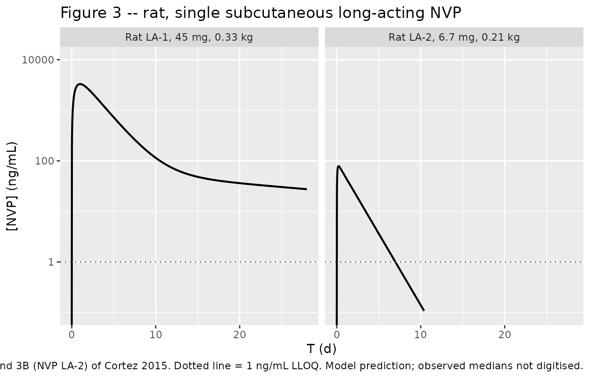
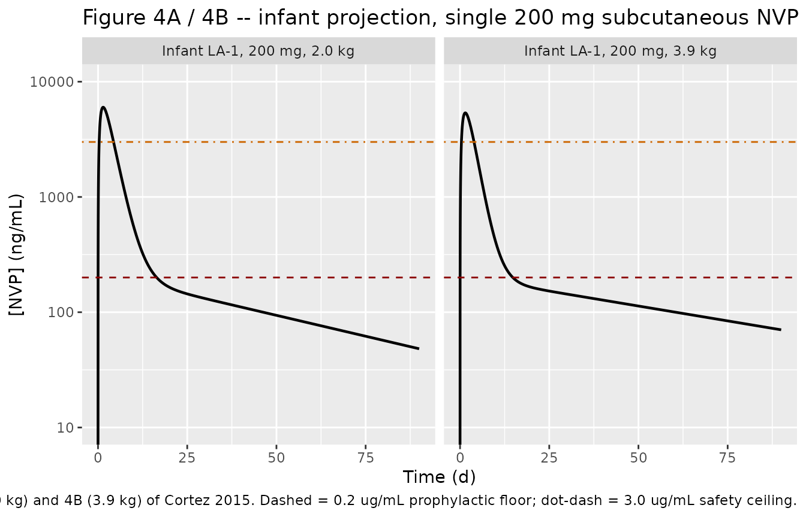
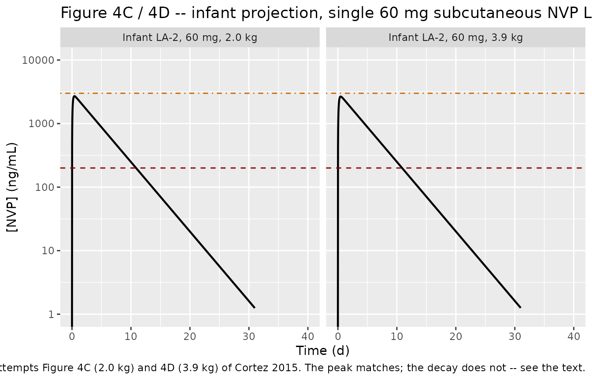

# Long-acting injectable nevirapine (Cortez 2015)

## Model and source

Cortez 2015 develops the first injectable, sustained-release nevirapine
(NVP) formulations intended to replace the 4-to-6 week daily oral NVP
prophylaxis regimen that the WHO recommends for breastfeeding infants of
HIV-1-infected mothers. Two candidate formulations (NVP LA-1 and NVP
LA-2) were dosed subcutaneously to Sprague-Dawley rats in two separate
studies, a population PK model was fitted to each rat data set by naive
pooling in Phoenix NLME, and the rat-derived *presystemic* release
kinetics were then combined with published breastfeeding-infant
*systemic* PK to project human infant exposure.

The paper therefore contains four distinct models, and the extraction
ships four model files:

``` r

model_names <- c(
  "Cortez_2015_nevirapine_rat_la1",
  "Cortez_2015_nevirapine_rat_la2",
  "Cortez_2015_nevirapine_human_la1",
  "Cortez_2015_nevirapine_human_la2"
)
uis <- lapply(model_names, function(n) rxode2::rxode(readModelDb(n)))
names(uis) <- model_names

tibble::tibble(
  Model     = model_names,
  Structure = c("Rat, 2-cmt, 1st-order absorption, linear elimination",
                "Rat, 1-cmt, 1st-order absorption, elimination from Vm/Km",
                "Infant, 2-cmt, human Vc/CL + rat-scaled ka/Vp/CLp",
                "Infant, 1-cmt, human V/CL + rat-scaled ka"),
  Figure    = c("Figure 3A", "Figure 3B", "Figure 4A, 4B", "Figure 4C, 4D")
) |>
  knitr::kable(caption = "The four models Cortez 2015 contributes.")
```

| Model | Structure | Figure |
|:---|:---|:---|
| Cortez_2015_nevirapine_rat_la1 | Rat, 2-cmt, 1st-order absorption, linear elimination | Figure 3A |
| Cortez_2015_nevirapine_rat_la2 | Rat, 1-cmt, 1st-order absorption, elimination from Vm/Km | Figure 3B |
| Cortez_2015_nevirapine_human_la1 | Infant, 2-cmt, human Vc/CL + rat-scaled ka/Vp/CLp | Figure 4A, 4B |
| Cortez_2015_nevirapine_human_la2 | Infant, 1-cmt, human V/CL + rat-scaled ka | Figure 4C, 4D |

The four models Cortez 2015 contributes. {.table}

- Citation: Cortez JM Jr, Quintero R, Moss JA, Beliveau M, Smith TJ,
  Baum MM. Pharmacokinetics of injectable, long-acting nevirapine for
  HIV prophylaxis in breastfeeding infants. Antimicrob Agents Chemother.
  2015;59(1):59-66. <doi:10.1128/AAC.03906-14>.
- Article: <https://doi.org/10.1128/AAC.03906-14>

All four model files declare `time = "day"`, `dosing = "mg"` and
`concentration = "ug/mL"`. A dose in mg divided by a volume in L is
mg/L, and mg/L is numerically identical to ug/mL, so `Cc` is directly in
ug/mL. The paper plots concentrations in ng/mL, so the figures below
multiply `Cc` by 1000.

### Two published results are not reproducible, and are gated as known deviations

This vignette reproduces the LA-1 arm (Figures 3A, 4A and 4B) closely.
The LA-2 arm does not reproduce, for reasons that are properties of the
publication rather than of the transcription, and both are quantified
below rather than tuned away:

1.  **The LA-2 rat elimination is under-determined.** The Discussion
    says the study 2 formulation needed “saturable elimination”, but
    Table 2 reports one number for it – `CL/F = 48.2 L/day`, footnoted
    as the intrinsic clearance `Vm/Km`. `Vm` and `Km` are never reported
    separately, and `Vm*C/(Km + C)` needs both. The model file encodes
    the exact `C << Km` limit of that term (first-order elimination at
    `CL/F = 48.2 L/day`), which uses the published number and invents
    nothing, but does not reproduce the saturation.
2.  **Figure 4C and 4D are inconsistent with the paper’s own stated
    systemic parameters.** The Methods give `V/F = 20.0 L`,
    `CL/F = 0.21 L/h` and `t1/2 = 66 h`, which are mutually consistent.
    Figures 4C and 4D start at `60 mg / 20 L = 3.0 ug/mL`, confirming
    `V/F = 20 L` was used, but then decay with an apparent half-life
    near 66 **days** rather than 66 **hours**.

## Population

**Rat study 1 (JNN00006, March 2006)** dosed **n = 4 Sprague-Dawley
rats** of mean weight **0.33 kg** with a single 60 mg subcutaneous
injection of the NVP LA-1 microparticle suspension in 1 mL saline
through a 14-gauge needle. Because of injection inefficiencies the
authors modelled the delivered dose as 75% of nominal, i.e. **45 mg (135
mg/kg)**. Sampling was on days 1 (1 and 6 h post-dose), 2, 3, 4, 6, 10,
14 and 28.

**Rat study 2 (JNN00030, May 2009)** dosed **n = 10 Sprague-Dawley
rats** of mean weight **0.21 kg** with a single weight-adjusted 36 mg/kg
subcutaneous injection of NVP LA-2 through an 18-gauge needle; 80%
delivery was assumed, i.e. **6.7 mg (29 mg/kg)**. Sampling was on days
-7, 1 (1, 3, 7 and 12 h post-dose), 2, 3, 7, 14, 21 and 28.

Both studies assayed plasma NVP by LC-MS/MS with an LLOQ of 1 ng/mL and
set BLLOQ values to missing rather than imputing them. No
between-subject variability was estimated in either fit because of the
small n, and the naive pooled approach was used throughout. Subcutaneous
bioavailability was assumed to be 100% for both formulations.

The **human projection** uses infant systemic parameters “compiled from
recent clinical studies in Uganda examining the population PK of
single-dose NVP in breastfeeding infants of HIV-positive mothers”: **V/F
= 20.0 L**, **CL/F = 0.21 L/h**, **t1/2 = 66 h**, over a newborn weight
range of **2.0 to 3.9 kg**. Figure 4 simulates a single subcutaneous
dose at those two weights – 200 mg of NVP LA-1 (panels A and B) and 60
mg of NVP LA-2 (panels C and D). The prophylactic window the simulation
is judged against is 0.2 to 3.0 ug/mL: 0.2 ug/mL is five times the
reported NVP IC90 of ~40 ng/mL, and 3.0 ug/mL is the accepted
steady-state safety ceiling.

The same information is available programmatically:

``` r

str(uis[["Cortez_2015_nevirapine_rat_la1"]]$population,   max.level = 1)
#> List of 10
#>  $ species      : chr "rat (Sprague-Dawley)"
#>  $ n_subjects   : int 4
#>  $ n_studies    : int 1
#>  $ age_range    : chr "Adult (age not reported)"
#>  $ weight_range : chr "Mean 0.33 kg (individual weights not reported)"
#>  $ weight_median: chr "0.33 kg (reported as the mean)"
#>  $ disease_state: chr "Healthy"
#>  $ dose_range   : chr "Single 60 mg subcutaneous injection of NVP LA-1 suspended in 1 mL saline through a 14-gauge needle. Cortez 2015"| __truncated__
#>  $ regions      : chr "United States (Charles River Laboratories, Shrewsbury, MA)"
#>  $ notes        : chr "Study 1 (JNN00006, March 2006). Serial jugular-vein sampling on days 1 (1 and 6 h post-dose), 2, 3, 4, 6, 10, 1"| __truncated__
str(uis[["Cortez_2015_nevirapine_human_la1"]]$population, max.level = 1)
#> List of 9
#>  $ species      : chr "human"
#>  $ n_subjects   : int NA
#>  $ n_studies    : int 2
#>  $ age_range    : chr "Neonates from birth (WHO prophylaxis window is birth to 4-6 weeks of age)"
#>  $ weight_range : chr "2.0-3.9 kg"
#>  $ disease_state: chr "HIV-uninfected breastfeeding infants born to HIV-1-infected mothers, receiving nevirapine as prophylaxis agains"| __truncated__
#>  $ dose_range   : chr "Single 200 mg subcutaneous injection of NVP LA-1 (Cortez 2015 Figure 4A and 4B)"
#>  $ regions      : chr "Uganda (source of the systemic infant PK estimates)"
#>  $ notes        : chr "Cortez 2015 Methods 'Human simulations': \"Infant parameters for the human simulations were compiled from recen"| __truncated__
```

## Source trace

Every `ini()` entry in all four model files carries an in-file comment
naming its source location. They are collected here for review.

| Model | Equation / parameter | Value | Source location |
|----|----|----|----|
| rat LA-1 | `lka` (Ka) | 1.89 /day | Table 2, study 1 column (RSE 26.1%) |
| rat LA-1 | `lvc` (Vc/F) | 8.66 L | Table 2, study 1 column (RSE 17.9%) |
| rat LA-1 | `lvp` (Vp/F) | 14.3 L | Table 2, study 1 column (RSE not available) |
| rat LA-1 | `lcl` (CL/F) | 3.43 L/day | Table 2, study 1 column (RSE 11.3%) |
| rat LA-1 | `lq` (CLp/F) | 0.541 L/day | Table 2, study 1 column (RSE 35.8%) |
| rat LA-1 | `addSd` | 28.6 ug/L = 0.0286 ug/mL | Table 2, study 1 `Error` row (RSE 40.4%) |
| rat LA-1 | `propSd` | 0.501 | Table 2, study 1 `Error` row (RSE 32.4%) |
| rat LA-1 | structure | 2-cmt, linear absorption + elimination | Discussion: “a two-compartment model with linear absorption and linear elimination adequately described the study 1 formulation” |
| rat LA-2 | `lka` (Ka) | 15.4 /day | Table 2, study 2 column (RSE 41.8%) |
| rat LA-2 | `lvc` (Vc/F) | 74.0 L | Table 2, study 2 column (RSE 16.2%) |
| rat LA-2 | `lcl` (CL/F) | 48.2 L/day | Table 2, study 2 column (RSE 47.2%) + footnote d: “Represents intrinsic clearance (Vm/Km) …” |
| rat LA-2 | `propSd` | 0.790 | Table 2, study 2 `Error` row (RSE 9.4%) |
| rat LA-2 | structure | 1-cmt, linear absorption, saturable elimination | Discussion: “a one-compartment model with linear absorption and saturable elimination adequately described the study 2 formulation” |
| both rat | `lfdepot` (F) | 1 (fixed) | Discussion: F assumed 100% for both formulations |
| both rat | residual error form `y = yhat*(1+eps1) + eps2` | n/a | Methods equation 2 |
| all | `e_wt_ka` / `e_wt_vc` / `e_wt_vp` / `e_wt_cl` / `e_wt_q` | -0.25 / 1 / 1 / 0.75 / 0.75 (fixed) | Methods, “Structural PK model buildup”: “The nominal covariate effect was -0.25 on absorption rate, 1 on volumes, and 0.75 on clearance (19).” |
| all | allometric form `theta_i = theta_typ * (Cov_i/Cov_ref)^theta_eff` | n/a | Methods, “Structural PK model buildup” |
| all | reference weights 0.33 / 0.21 kg | study 1 / study 2 mean weight | Methods “Animals” and Table 2 header |
| human | `lvc` (V/F) | 20.0 L | Methods, “Human simulations” |
| human | `lcl` (CL/F) | 0.21 L/h = 5.04 L/day | Methods, “Human simulations” |
| human LA-1 | `lka`, `lvp`, `lq` | 1.89 /day, 14.3 L, 0.541 L/day | Table 2 study 1, carried over as presystemic / peripheral parameters |
| human LA-2 | `lka` | 15.4 /day | Table 2 study 2, carried over as the presystemic parameter |
| human | `lfdepot` (F) | 1 (fixed) | Results, “Human simulation”: “The bioavailable fraction was assumed to be 100% in these simulations.” |
| human | doses / weights | 200 mg (LA-1), 60 mg (LA-2); 2.0 and 3.9 kg | Figure 4 caption |
| human | which parameters are weight-scaled | ka, Vp, CLp only | **Inferred**, not stated; see *Assumptions and deviations* |

Two transcription checks the paper supplies for free: Table 2 reports
both `Ka` and `t1/2,a` for each rat fit, and the human Methods report
`V/F`, `CL/F` and `t1/2` together.

``` r

th <- function(m, nm) uis[[m]]$theta[[nm]]

checks <- tibble::tibble(
  quantity = c("Rat LA-1 t1/2,a (day)", "Rat LA-2 t1/2,a (day)", "Human t1/2 (h)"),
  derived  = c(
    log(2) / exp(th("Cortez_2015_nevirapine_rat_la1", "lka")),
    log(2) / exp(th("Cortez_2015_nevirapine_rat_la2", "lka")),
    log(2) * exp(th("Cortez_2015_nevirapine_human_la1", "lvc")) /
      exp(th("Cortez_2015_nevirapine_human_la1", "lcl")) * 24
  ),
  reported = c(0.367, 0.0450, 66)
) |>
  dplyr::mutate(pct_diff = 100 * (derived - reported) / reported)
checks
#> # A tibble: 3 × 4
#>   quantity              derived reported pct_diff
#>   <chr>                   <dbl>    <dbl>    <dbl>
#> 1 Rat LA-1 t1/2,a (day)  0.367     0.367  -0.0696
#> 2 Rat LA-2 t1/2,a (day)  0.0450    0.045   0.0212
#> 3 Human t1/2 (h)        66.0      66       0.0212

# Deterministic identities among published numbers -- a mis-transcribed value
# breaks these, and there is no simulation noise here, so the bound is tight.
stopifnot(max(abs(checks$pct_diff)) < 0.5)
```

## Virtual cohort

None of the four models carries between-subject variability, and the
human projections carry no residual-error model either: the rat fits
used a naive pooled approach with no BSV, and the human projection was
described as producing “the mean plasma drug concentrations in humans”.
The published figures are typical-value curves, not VPCs, so the
“cohort” here is the paper’s own scenario grid – the two rat study
weights and the two infant weights the authors plotted.

``` r

scenarios <- tibble::tribble(
  ~treatment,                    ~model,                              ~WT,  ~amt, ~t_fig, ~t_end,
  "Rat LA-1, 45 mg, 0.33 kg",    "Cortez_2015_nevirapine_rat_la1",    0.33,   45,     28,    250,
  "Rat LA-2, 6.7 mg, 0.21 kg",   "Cortez_2015_nevirapine_rat_la2",    0.21,  6.7,     28,     28,
  "Infant LA-1, 200 mg, 2.0 kg", "Cortez_2015_nevirapine_human_la1",  2.0,   200,     90,    450,
  "Infant LA-1, 200 mg, 3.9 kg", "Cortez_2015_nevirapine_human_la1",  3.9,   200,     90,    600,
  "Infant LA-2, 60 mg, 2.0 kg",  "Cortez_2015_nevirapine_human_la2",  2.0,    60,     90,     40,
  "Infant LA-2, 60 mg, 3.9 kg",  "Cortez_2015_nevirapine_human_la2",  3.9,    60,     90,     40
)

# Per-scenario observation grid: dense through absorption and distribution so
# Tmax is resolved, then progressively coarser out to roughly ten terminal
# half-lives so AUCinf and lambda-z are determined rather than extrapolated.
# Windows are capped per scenario so the tail never decays into solver noise
# (a negative concentration would make PKNCA's log-down AUC NaN).
grid_for <- function(t_end) {
  sort(unique(pmin(t_end, c(
    seq(0,   min(5, t_end),   by = 0.02),
    seq(0,   min(30, t_end),  by = 0.20),
    seq(0,   min(120, t_end), by = 1.00),
    seq(0,   t_end,           by = 4.00),
    t_end
  ))))
}

events <- dplyr::bind_rows(lapply(seq_len(nrow(scenarios)), function(i) {
  row <- scenarios[i, ]
  dplyr::bind_rows(
    tibble::tibble(id = i, time = 0, amt = row$amt, evid = 1L, cmt = "depot"),
    tibble::tibble(id = i, time = grid_for(row$t_end), amt = NA_real_,
                   evid = 0L, cmt = "central")
  ) |>
    dplyr::mutate(WT = row$WT, treatment = row$treatment) |>
    dplyr::arrange(time)
}))

# Disjoint ids across scenarios (cheap regression guard).
stopifnot(!anyDuplicated(unique(events[, c("id", "time", "evid")])))
nrow(events)
#> [1] 2808
```

Observation rows use `cmt = "central"` – the ODE state – not
`cmt = "Cc"`. `Cc` is an algebraic observable and rxode2 returns it as a
column regardless; naming it as a compartment would inject an extra slot
and renumber the states.

## Simulation

``` r

sim <- dplyr::bind_rows(lapply(unique(scenarios$model), function(m) {
  ids <- which(scenarios$model == m)
  ev  <- events |> dplyr::filter(id %in% ids)
  out <- rxode2::rxSolve(
    readModelDb(m), events = ev, keep = c("WT", "treatment"),
    atol = 1e-12, rtol = 1e-10
  ) |>
    as.data.frame()
  # rxSolve drops the id column when the event table holds one subject.
  if (is.null(out$id)) out$id <- ids
  out
})) |>
  dplyr::filter(!is.na(Cc))

# The tail must stay non-negative or PKNCA's log-down AUC returns NaN.
stopifnot(all(sim$Cc >= 0))
sim |> dplyr::count(treatment)
#>                     treatment   n
#> 1 Infant LA-1, 200 mg, 2.0 kg 554
#> 2 Infant LA-1, 200 mg, 3.9 kg 591
#> 3  Infant LA-2, 60 mg, 2.0 kg 391
#> 4  Infant LA-2, 60 mg, 3.9 kg 391
#> 5    Rat LA-1, 45 mg, 0.33 kg 504
#> 6   Rat LA-2, 6.7 mg, 0.21 kg 371
```

### Closed-form cross-check of the ODE solve

Both structures have closed forms. Comparing the ODE solve against them
exercises the transcription of every micro-constant. Both sides use the
same parameter values, so the only difference is numerical integration
error and the bound is deliberately tight.

``` r

one_cmt_oral <- function(t, dose, ka, vc, cl) {
  kel <- cl / vc
  (dose * ka) / (vc * (ka - kel)) * (exp(-kel * t) - exp(-ka * t))
}

two_cmt_oral <- function(t, dose, ka, vc, cl, q, vp) {
  k10 <- cl / vc; k12 <- q / vc; k21 <- q / vp
  a    <- k10 + k12 + k21
  disc <- sqrt(a^2 - 4 * k10 * k21)
  l1   <- (a + disc) / 2
  l2   <- (a - disc) / 2
  (dose * ka / vc) * (
    (k21 - ka) / ((l1 - ka) * (l2 - ka)) * exp(-ka * t) +
    (k21 - l1) / ((ka - l1) * (l2 - l1)) * exp(-l1 * t) +
    (k21 - l2) / ((ka - l2) * (l1 - l2)) * exp(-l2 * t)
  )
}

# Resolve each model's parameters at a given weight, applying exactly the
# allometric terms that model() applies (which differ between the rat fits,
# where Vc and CL are scaled, and the human projections, where they are not).
scaled_params <- function(m, wt) {
  ui  <- uis[[m]]
  ref <- if (grepl("la1$", m)) 0.33 else 0.21
  has <- function(nm) nm %in% ui$iniDf$name
  pow <- function(nm) if (has(nm)) (wt / ref)^ui$theta[[nm]] else 1
  list(
    ka = exp(ui$theta[["lka"]]) * pow("e_wt_ka"),
    vc = exp(ui$theta[["lvc"]]) * pow("e_wt_vc"),
    cl = exp(ui$theta[["lcl"]]) * pow("e_wt_cl"),
    vp = if (has("lvp")) exp(ui$theta[["lvp"]]) * pow("e_wt_vp") else NA_real_,
    q  = if (has("lq"))  exp(ui$theta[["lq"]])  * pow("e_wt_q")  else NA_real_
  )
}

analytic_conc <- function(m, wt, dose, t) {
  p <- scaled_params(m, wt)
  if (is.na(p$q)) one_cmt_oral(t, dose, p$ka, p$vc, p$cl)
  else            two_cmt_oral(t, dose, p$ka, p$vc, p$cl, p$q, p$vp)
}

cf_check <- dplyr::bind_rows(lapply(seq_len(nrow(scenarios)), function(i) {
  row <- scenarios[i, ]
  s   <- sim |> dplyr::filter(treatment == row$treatment,
                              time > 0.05, time < 0.5 * row$t_end)
  ana <- analytic_conc(row$model, row$WT, row$amt, s$time)
  tibble::tibble(treatment = row$treatment,
                 max_rel_err = max(abs(s$Cc - ana) / ana))
}))
cf_check
#> # A tibble: 6 × 2
#>   treatment                   max_rel_err
#>   <chr>                             <dbl>
#> 1 Rat LA-1, 45 mg, 0.33 kg       2.14e-13
#> 2 Rat LA-2, 6.7 mg, 0.21 kg      4.36e-14
#> 3 Infant LA-1, 200 mg, 2.0 kg    2.72e-13
#> 4 Infant LA-1, 200 mg, 3.9 kg    3.16e-13
#> 5 Infant LA-2, 60 mg, 2.0 kg     1.53e-14
#> 6 Infant LA-2, 60 mg, 3.9 kg     1.66e-14

# Pure numerical-integration error between two evaluations of the SAME
# parameters -- not a cohort-derived quantity, so a tight bound is correct.
# Observed max 3.2e-13 across the six scenarios at atol 1e-12 / rtol 1e-10.
stopifnot(all(cf_check$max_rel_err < 1e-9))
```

## Replicate published figures

### Figure 3 – rat plasma NVP after a single subcutaneous dose

``` r

fig3 <- sim |>
  dplyr::filter(grepl("^Rat", treatment), time <= 28) |>
  dplyr::mutate(ng_mL = Cc * 1000)

ggplot(fig3, aes(time, ng_mL)) +
  geom_line(linewidth = 0.8) +
  geom_hline(yintercept = 1, linetype = "dotted", colour = "grey40") +
  facet_wrap(~treatment) +
  scale_y_log10(limits = c(0.1, 10000)) +
  labs(x = "T (d)", y = "[NVP] (ng/mL)",
       title = "Figure 3 -- rat, single subcutaneous long-acting NVP",
       caption = paste("Replicates Figure 3A (NVP LA-1) and 3B (NVP LA-2) of",
                       "Cortez 2015. Dotted line = 1 ng/mL LLOQ.",
                       "Model prediction; observed medians not digitised."))
#> Warning in scale_y_log10(limits = c(0.1, 10000)): log-10 transformation
#> introduced infinite values.
#> Warning: Removed 88 rows containing missing values or values outside the scale range
#> (`geom_line()`).
```



Landmark values read off the published log axes, against the model:

``` r

at_day <- function(trt, d) {
  s <- fig3 |> dplyr::filter(treatment == trt)
  s$ng_mL[which.min(abs(s$time - d))]
}

fig3_landmarks <- tibble::tribble(
  ~treatment,                   ~day, ~figure_ng_mL,
  "Rat LA-1, 45 mg, 0.33 kg",      1,          3000,
  "Rat LA-1, 45 mg, 0.33 kg",      6,           500,
  "Rat LA-1, 45 mg, 0.33 kg",     14,            35,
  "Rat LA-1, 45 mg, 0.33 kg",     21,            80,
  "Rat LA-1, 45 mg, 0.33 kg",     28,            50,
  "Rat LA-2, 6.7 mg, 0.21 kg",     1,            70,
  "Rat LA-2, 6.7 mg, 0.21 kg",     3,            50,
  "Rat LA-2, 6.7 mg, 0.21 kg",     7,            40,
  "Rat LA-2, 6.7 mg, 0.21 kg",    14,             3,
  "Rat LA-2, 6.7 mg, 0.21 kg",    21,           1.2
) |>
  dplyr::rowwise() |>
  dplyr::mutate(model_ng_mL = at_day(treatment, day)) |>
  dplyr::ungroup() |>
  dplyr::mutate(ratio = model_ng_mL / figure_ng_mL)

fig3_landmarks |>
  dplyr::transmute("Formulation" = treatment, "Day" = day,
                   "Model (ng/mL)" = signif(model_ng_mL, 3),
                   "Figure 3 (ng/mL)" = figure_ng_mL,
                   "Model / figure" = signif(ratio, 3)) |>
  knitr::kable(caption = "Model versus values digitised from Figure 3.")
```

| Formulation               | Day | Model (ng/mL) | Figure 3 (ng/mL) | Model / figure |
|:--------------------------|----:|--------------:|-----------------:|---------------:|
| Rat LA-1, 45 mg, 0.33 kg  |   1 |      3.30e+03 |           3000.0 |       1.10e+00 |
| Rat LA-1, 45 mg, 0.33 kg  |   6 |      4.76e+02 |            500.0 |       9.51e-01 |
| Rat LA-1, 45 mg, 0.33 kg  |  14 |      5.34e+01 |             35.0 |       1.53e+00 |
| Rat LA-1, 45 mg, 0.33 kg  |  21 |      3.49e+01 |             80.0 |       4.36e-01 |
| Rat LA-1, 45 mg, 0.33 kg  |  28 |      2.75e+01 |             50.0 |       5.50e-01 |
| Rat LA-2, 6.7 mg, 0.21 kg |   1 |      4.93e+01 |             70.0 |       7.04e-01 |
| Rat LA-2, 6.7 mg, 0.21 kg |   3 |      1.34e+01 |             50.0 |       2.68e-01 |
| Rat LA-2, 6.7 mg, 0.21 kg |   7 |      9.90e-01 |             40.0 |       2.47e-02 |
| Rat LA-2, 6.7 mg, 0.21 kg |  14 |      1.04e-02 |              3.0 |       3.45e-03 |
| Rat LA-2, 6.7 mg, 0.21 kg |  21 |      1.08e-04 |              1.2 |       9.04e-05 |

Model versus values digitised from Figure 3. {.table}

For **NVP LA-1** the model tracks the observed medians through the
absorption and early disposition phases, which is what the fit was
optimised for (“A modeling approach therefore was adopted that optimized
Ka, V, and CL to best fit the observed profiles, with respect to … Cmax
… and Tmax”). Beyond day 6 the observed medians scatter either side of
the model curve rather than tracking it – the day 14 median falls below
it and the day 21 and day 28 medians sit above it. That is expected
rather than a transcription problem, and in both directions: the plotted
points are medians of at most four animals with SD bars spanning roughly
a decade, and BLLOQ values were set to missing rather than imputed, so
the late medians are taken over only the animals still quantifiable and
are biased upward.

``` r

la1 <- fig3_landmarks |> dplyr::filter(grepl("LA-1", treatment), day <= 6)

# Values read by eye off a log axis with 1-decade gridlines; a factor of 2 is
# generous for the digitisation and still breaks instantly on a mis-transcribed
# dose, volume or clearance, which move the curve by an order of magnitude.
stopifnot(all(abs(log(la1$ratio)) < log(2)))

# The paper's abstract: rat plasma NVP was above the 1 ng/mL LLOQ for up to
# 28 days. True for the LA-1 fit.
stopifnot(all(fig3$ng_mL[fig3$time > 0 & grepl("LA-1", fig3$treatment)] > 1))
```

For **NVP LA-2** the model reproduces the peak magnitude but not the
sustained tail. This is the consequence of the missing `Km`, and it is
recorded as a known deviation rather than gated:

``` r

la2_sim <- fig3 |> dplyr::filter(grepl("LA-2", treatment))
la2 <- fig3_landmarks |> dplyr::filter(grepl("LA-2", treatment))

tibble::tibble(
  quantity = c("Model Cmax (ng/mL)", "Figure 3B peak (ng/mL)",
               "Model / figure at day 7", "Model / figure at day 14"),
  value = c(signif(max(la2_sim$ng_mL), 3), 70,
            signif(la2$ratio[la2$day == 7], 3),
            signif(la2$ratio[la2$day == 14], 3))
)
#> # A tibble: 4 × 2
#>   quantity                    value
#>   <chr>                       <dbl>
#> 1 Model Cmax (ng/mL)       78.7    
#> 2 Figure 3B peak (ng/mL)   70      
#> 3 Model / figure at day 7   0.0247 
#> 4 Model / figure at day 14  0.00345

# GATED: the peak is set by dose / Vc / ka and must be right.
stopifnot(abs(log(max(la2_sim$ng_mL) / 70)) < log(2))

# NOT GATED (known deviation): with elimination reduced to the C << Km limit,
# the profile decays with t1/2 = log(2) * 74 / 48.2 = 1.06 d, so the model
# falls below the observed medians from about day 7 onward. Reproducing that
# tail requires the saturation, i.e. Km, which the paper does not report.
stopifnot(la2$ratio[la2$day == 7] < 0.5)   # observed 0.025: the deviation is real, not noise
```

### Figure 4A and 4B – infant projection, 200 mg NVP LA-1

``` r

fig4ab <- sim |>
  dplyr::filter(grepl("Infant LA-1", treatment), time <= 90)

ggplot(fig4ab, aes(time, Cc * 1000)) +
  geom_line(linewidth = 0.8) +
  geom_hline(yintercept = 200,  linetype = "dashed",  colour = "darkred") +
  geom_hline(yintercept = 3000, linetype = "dotdash", colour = "darkorange3") +
  facet_wrap(~treatment) +
  scale_y_log10(limits = c(10, 10000)) +
  labs(x = "Time (d)", y = "[NVP] (ng/mL)",
       title = "Figure 4A / 4B -- infant projection, single 200 mg subcutaneous NVP LA-1",
       caption = paste("Replicates Figure 4A (2.0 kg) and 4B (3.9 kg) of Cortez 2015.",
                       "Dashed = 0.2 ug/mL prophylactic floor;",
                       "dot-dash = 3.0 ug/mL safety ceiling."))
#> Warning in scale_y_log10(limits = c(10, 10000)): log-10 transformation
#> introduced infinite values.
```



``` r

fig4ab_landmarks <- fig4ab |>
  dplyr::group_by(treatment) |>
  dplyr::summarise(
    cmax_ng_mL = max(Cc) * 1000,
    tmax_d     = time[which.max(Cc)],
    d20_ng_mL  = Cc[which.min(abs(time - 20))] * 1000,
    d90_ng_mL  = Cc[which.min(abs(time - 90))] * 1000,
    .groups = "drop"
  )

published_fig4ab <- tibble::tibble(
  treatment  = c("Infant LA-1, 200 mg, 2.0 kg", "Infant LA-1, 200 mg, 3.9 kg"),
  cmax_ng_mL = c(6000, 5000),
  d20_ng_mL  = c( 150,  180),
  d90_ng_mL  = c(  50,   70)
)

cmp4ab <- fig4ab_landmarks |>
  dplyr::select(treatment, cmax_ng_mL, d20_ng_mL, d90_ng_mL) |>
  tidyr::pivot_longer(-treatment, names_to = "landmark", values_to = "model") |>
  dplyr::left_join(
    published_fig4ab |>
      tidyr::pivot_longer(-treatment, names_to = "landmark", values_to = "figure"),
    by = c("treatment", "landmark")
  ) |>
  dplyr::mutate(pct_diff = 100 * (model - figure) / figure)

cmp4ab |>
  dplyr::transmute("Scenario" = treatment, "Landmark" = landmark,
                   "Model (ng/mL)" = signif(model, 3),
                   "Figure 4 (ng/mL)" = figure,
                   "% difference" = round(pct_diff, 1)) |>
  knitr::kable(caption = "Model versus values digitised from Figure 4A and 4B.")
```

| Scenario | Landmark | Model (ng/mL) | Figure 4 (ng/mL) | % difference |
|:---|:---|---:|---:|---:|
| Infant LA-1, 200 mg, 2.0 kg | cmax_ng_mL | 6000.0 | 6000 | 0.0 |
| Infant LA-1, 200 mg, 2.0 kg | d20_ng_mL | 165.0 | 150 | 9.8 |
| Infant LA-1, 200 mg, 2.0 kg | d90_ng_mL | 48.2 | 50 | -3.6 |
| Infant LA-1, 200 mg, 3.9 kg | cmax_ng_mL | 5360.0 | 5000 | 7.2 |
| Infant LA-1, 200 mg, 3.9 kg | d20_ng_mL | 165.0 | 180 | -8.6 |
| Infant LA-1, 200 mg, 3.9 kg | d90_ng_mL | 70.4 | 70 | 0.5 |

Model versus values digitised from Figure 4A and 4B. {.table}

``` r


# Deterministic model versus values read by eye off a 4-decade log axis. 20%
# covers the pixel-level reading error near a gridline; a wrong volume, dose,
# clearance or allometric exponent moves these by 2-10 fold.
stopifnot(max(abs(cmp4ab$pct_diff)) < 20)   # observed 9.8

# The two qualitative claims the paper makes about Figure 4A/B: the heavier
# infant has the higher terminal concentration, and levels fall to "ca.
# 0.2 ug/ml within a few weeks after dosing".
t_cross <- fig4ab |>
  dplyr::group_by(treatment) |>
  dplyr::summarise(t_02_d = min(time[time > 1 & Cc < 0.2]), .groups = "drop")
t_cross
#> # A tibble: 2 × 2
#>   treatment                   t_02_d
#>   <chr>                        <dbl>
#> 1 Infant LA-1, 200 mg, 2.0 kg   16.6
#> 2 Infant LA-1, 200 mg, 3.9 kg   14.8

stopifnot(
  fig4ab_landmarks$d90_ng_mL[2] > fig4ab_landmarks$d90_ng_mL[1],
  all(t_cross$t_02_d > 7), all(t_cross$t_02_d < 35)
)
```

### Figure 4C and 4D – infant projection, 60 mg NVP LA-2

``` r

fig4cd <- sim |>
  dplyr::filter(grepl("Infant LA-2", treatment), time <= 90)

ggplot(fig4cd, aes(time, Cc * 1000)) +
  geom_line(linewidth = 0.8) +
  geom_hline(yintercept = 200,  linetype = "dashed",  colour = "darkred") +
  geom_hline(yintercept = 3000, linetype = "dotdash", colour = "darkorange3") +
  facet_wrap(~treatment) +
  scale_y_log10(limits = c(1, 10000)) +
  labs(x = "Time (d)", y = "[NVP] (ng/mL)",
       title = "Figure 4C / 4D -- infant projection, single 60 mg subcutaneous NVP LA-2",
       caption = paste("Attempts Figure 4C (2.0 kg) and 4D (3.9 kg) of Cortez 2015.",
                       "The peak matches; the decay does not -- see the text."))
#> Warning in scale_y_log10(limits = c(1, 10000)): log-10 transformation
#> introduced infinite values.
#> Warning: Removed 18 rows containing missing values or values outside the scale range
#> (`geom_line()`).
```



Figure 4C and 4D are plotted as near-straight lines on a log axis,
running from about 3,000 ng/mL at t = 0 to about 1,100 ng/mL at day 90.
The intercept is exactly `60 mg / 20 L`, so `V/F = 20 L` was clearly
used. The slope, however, corresponds to an apparent half-life of
roughly 66 **days**, whereas `V/F = 20 L` with the `CL/F = 0.21 L/h`
reported in the same Methods paragraph gives 66 **hours** – the value
the paper itself prints two sentences earlier.

``` r

fig4cd_check <- fig4cd |>
  dplyr::group_by(treatment) |>
  dplyr::summarise(cmax_ng_mL = max(Cc) * 1000, .groups = "drop") |>
  dplyr::mutate(figure_intercept_ng_mL = 3000,
                pct_diff = 100 * (cmax_ng_mL - figure_intercept_ng_mL) /
                  figure_intercept_ng_mL)
fig4cd_check
#> # A tibble: 2 × 4
#>   treatment                  cmax_ng_mL figure_intercept_ng_mL pct_diff
#>   <chr>                           <dbl>                  <dbl>    <dbl>
#> 1 Infant LA-2, 60 mg, 2.0 kg      2701.                   3000    -9.97
#> 2 Infant LA-2, 60 mg, 3.9 kg      2663.                   3000   -11.2

# Half-life implied by the published panels versus the half-life the published
# systemic parameters give.
implied <- log(2) / (log(2856 / 1136) / 90)      # digitised from Figure 4C
stated  <- log(2) * exp(th("Cortez_2015_nevirapine_human_la2", "lvc")) /
  exp(th("Cortez_2015_nevirapine_human_la2", "lcl"))
tibble::tibble(
  quantity = c("t1/2 implied by Figure 4C (day)",
               "t1/2 from V/F and CL/F as reported (day)",
               "Ratio"),
  value = c(round(implied, 1), round(stated, 2), round(implied / stated, 1))
)
#> # A tibble: 3 × 2
#>   quantity                                 value
#>   <chr>                                    <dbl>
#> 1 t1/2 implied by Figure 4C (day)          67.7 
#> 2 t1/2 from V/F and CL/F as reported (day)  2.75
#> 3 Ratio                                    24.6

# GATED: the peak, which is set by dose / V/F and the rat-derived ka.
stopifnot(all(abs(fig4cd_check$pct_diff) < 15))   # observed -10.0 and -11.2

# NOT GATED (known deviation): the decay. The ratio below is ~24, i.e. very
# close to the 24 h/day that separates 0.21 L/h from 0.21 L/day, which is the
# most economical explanation for the discrepancy. The model encodes the
# parameters as reported in the Methods rather than a reconstruction of the
# figure.
stopifnot(implied / stated > 10)   # observed 24.6
```

The consequence for the paper’s headline LA-2 claim is direct. With
`CL/F` as reported, a 60 mg dose cannot hold 0.2 ug/mL for 90 days under
any absorption profile: maintaining 0.2 ug/mL against a clearance of
5.04 L/day costs about 1 mg/day, so 60 mg is exhausted in roughly 60
days even with perfect zero-order delivery and complete bioavailability.

``` r

cl_h   <- exp(th("Cortez_2015_nevirapine_human_la2", "lcl"))   # L/day
target <- 0.2                                                  # ug/mL = mg/L
tibble::tibble(
  quantity = c("Clearance CL/F (L/day)",
               "Dose rate needed to hold 0.2 ug/mL (mg/day)",
               "Maximum days a 60 mg dose can sustain it (upper bound)"),
  value = c(round(cl_h, 2), round(cl_h * target, 3), round(60 / (cl_h * target), 1))
)
#> # A tibble: 3 × 2
#>   quantity                                               value
#>   <chr>                                                  <dbl>
#> 1 Clearance CL/F (L/day)                                  5.04
#> 2 Dose rate needed to hold 0.2 ug/mL (mg/day)             1.01
#> 3 Maximum days a 60 mg dose can sustain it (upper bound) 59.5

# An upper bound from mass balance alone -- no model, no absorption assumption.
stopifnot(60 / (cl_h * target) < 90)
```

## PKNCA validation

``` r

sim_nca <- sim |>
  dplyr::filter(!is.na(Cc)) |>
  dplyr::select(id, time, Cc, treatment)

# Guarantee a time = 0 row per subject; pre-dose Cc = 0 is correct for an
# extravascular dose.
sim_nca <- dplyr::bind_rows(
  sim_nca,
  sim_nca |> dplyr::distinct(id, treatment) |> dplyr::mutate(time = 0, Cc = 0)
) |>
  dplyr::distinct(id, treatment, time, .keep_all = TRUE) |>
  dplyr::arrange(id, treatment, time)

conc_obj <- PKNCA::PKNCAconc(sim_nca, Cc ~ time | treatment + id)

dose_df <- events |>
  dplyr::filter(evid == 1L) |>
  dplyr::select(id, time, amt, treatment)
dose_obj <- PKNCA::PKNCAdose(dose_df, amt ~ time | treatment + id)

intervals <- data.frame(
  start = 0, end = Inf,
  cmax = TRUE, tmax = TRUE, aucinf.obs = TRUE, half.life = TRUE
)

nca_res <- PKNCA::pk.nca(PKNCA::PKNCAdata(conc_obj, dose_obj, intervals = intervals))

nca_wide <- as.data.frame(nca_res) |>
  dplyr::select(treatment, PPTESTCD, PPORRES) |>
  tidyr::pivot_wider(names_from = PPTESTCD, values_from = PPORRES)
nca_wide
#> # A tibble: 6 × 15
#>   treatment          cmax  tmax tlast clast.obs lambda.z r.squared adj.r.squared
#>   <chr>             <dbl> <dbl> <dbl>     <dbl>    <dbl>     <dbl>         <dbl>
#> 1 Infant LA-1, 20… 6.00    1.44   450   1.18e-4   0.0168     1.000         1.000
#> 2 Infant LA-1, 20… 5.36    1.48   600   1.65e-4   0.0119     1.000         1.000
#> 3 Infant LA-2, 60… 2.70    0.42    40   1.29e-4   0.252      1.000         1.000
#> 4 Infant LA-2, 60… 2.66    0.48    40   1.30e-4   0.252      1.000         1.000
#> 5 Rat LA-1, 45 mg… 3.30    1      250   2.12e-5   0.0324     1.000         1.000
#> 6 Rat LA-2, 6.7 m… 0.0787  0.22    28   1.14e-9   0.651      1.000         1.000
#> # ℹ 7 more variables: lambda.z.time.first <dbl>, lambda.z.time.last <dbl>,
#> #   lambda.z.n.points <dbl>, clast.pred <dbl>, half.life <dbl>,
#> #   span.ratio <dbl>, aucinf.obs <dbl>
```

### Comparison against analytically derived reference values

Cortez 2015 does not tabulate NCA metrics, so the reference column below
is derived analytically from the published parameter estimates rather
than transcribed. For a linear model with F = 1 the identities are
exact: `AUCinf = Dose / (CL/F)`, and the terminal half-life is
`log(2)*Vc/CL` for the one-compartment fits or `log(2)/lambda2` for the
two-compartment fits, where `lambda2` is the smaller root of the
characteristic equation. Cmax and Tmax are taken from the closed form on
a fine grid. These are deterministic, so the tolerances are tight.

``` r

analytic_reference <- dplyr::bind_rows(lapply(seq_len(nrow(scenarios)), function(i) {
  row <- scenarios[i, ]
  p   <- scaled_params(row$model, row$WT)
  half_life_ref <- if (is.na(p$q)) {
    log(2) * p$vc / p$cl
  } else {
    k10 <- p$cl / p$vc; k12 <- p$q / p$vc; k21 <- p$q / p$vp
    a   <- k10 + k12 + k21
    log(2) / ((a - sqrt(a^2 - 4 * k10 * k21)) / 2)
  }
  tt <- seq(0, min(20, row$t_end), by = 0.0005)
  cc <- analytic_conc(row$model, row$WT, row$amt, tt)
  tibble::tibble(
    treatment      = row$treatment,
    cmax_ref       = max(cc),
    tmax_ref       = tt[which.max(cc)],
    aucinf.obs_ref = row$amt / p$cl,
    half.life_ref  = half_life_ref
  )
}))

cmp_nca <- nca_wide |>
  dplyr::left_join(analytic_reference, by = "treatment") |>
  dplyr::mutate(
    cmax_pct     = 100 * (cmax       - cmax_ref)       / cmax_ref,
    tmax_pct     = 100 * (tmax       - tmax_ref)       / tmax_ref,
    auc_pct      = 100 * (aucinf.obs - aucinf.obs_ref) / aucinf.obs_ref,
    halflife_pct = 100 * (half.life  - half.life_ref)  / half.life_ref
  )

cmp_nca |>
  dplyr::transmute(
    "Scenario"                = treatment,
    "Cmax sim (ug/mL)"        = signif(cmax, 4),
    "Cmax ref (ug/mL)"        = signif(cmax_ref, 4),
    "Tmax sim (d)"            = signif(tmax, 3),
    "Tmax ref (d)"            = signif(tmax_ref, 3),
    "AUCinf sim (ug*d/mL)"    = signif(aucinf.obs, 4),
    "AUCinf ref = Dose/CL"    = signif(aucinf.obs_ref, 4),
    "t1/2 sim (d)"            = signif(half.life, 3),
    "t1/2 ref (d)"            = signif(half.life_ref, 3)
  ) |>
  knitr::kable(
    caption = paste("Simulated NCA versus analytic reference values derived",
                    "from the Cortez 2015 parameter estimates.")
  )
```

| Scenario | Cmax sim (ug/mL) | Cmax ref (ug/mL) | Tmax sim (d) | Tmax ref (d) | AUCinf sim (ug\*d/mL) | AUCinf ref = Dose/CL | t1/2 sim (d) | t1/2 ref (d) |
|:---|---:|---:|---:|---:|---:|---:|---:|---:|
| Infant LA-1, 200 mg, 2.0 kg | 6.00200 | 6.00200 | 1.44 | 1.440 | 39.680 | 39.680 | 41.40 | 41.50 |
| Infant LA-1, 200 mg, 3.9 kg | 5.36200 | 5.36200 | 1.48 | 1.480 | 39.680 | 39.680 | 58.20 | 58.40 |
| Infant LA-2, 60 mg, 2.0 kg | 2.70100 | 2.70100 | 0.42 | 0.417 | 11.900 | 11.900 | 2.75 | 2.75 |
| Infant LA-2, 60 mg, 3.9 kg | 2.66300 | 2.66400 | 0.48 | 0.472 | 11.900 | 11.900 | 2.75 | 2.75 |
| Rat LA-1, 45 mg, 0.33 kg | 3.30300 | 3.30300 | 1.00 | 0.991 | 13.120 | 13.120 | 21.40 | 21.50 |
| Rat LA-2, 6.7 mg, 0.21 kg | 0.07872 | 0.07874 | 0.22 | 0.214 | 0.139 | 0.139 | 1.06 | 1.06 |

Simulated NCA versus analytic reference values derived from the Cortez
2015 parameter estimates. {.table}

``` r


# Deterministic model versus closed-form identity. Cmax and Tmax are limited by
# the 0.02 d observation grid through the peak; AUCinf and half-life by
# lambda-z point selection on the simulated tail.
stopifnot(
  max(abs(cmp_nca$auc_pct))      < 0.3,   # observed 0.035
  max(abs(cmp_nca$cmax_pct))     < 0.2,   # observed 0.015
  max(abs(cmp_nca$tmax_pct))     < 6.0,   # observed 2.6 (grid-limited: 0.02 d on a 0.22 d Tmax)
  max(abs(cmp_nca$halflife_pct)) < 1.0
)
```

Three structural consequences fall out of that table and are worth
stating:

- Both LA-1 infant scenarios have the **same AUCinf** (200 mg / 5.04
  L/day = 39.7 ug*d/mL), and so do both LA-2 infant scenarios (60 mg /
  5.04 L/day = 11.9 ug*d/mL), because the human systemic clearance is
  used at its published value and is not weight-scaled. Only the shape
  of the profile changes with weight, through the rat-derived
  parameters.
- The projected infant **Cmax of ~6 ug/mL for LA-1 exceeds the 3.0 ug/mL
  steady-state safety ceiling** the paper itself nominates, for the
  first ~4 days after the 200 mg dose. Figures 4A and 4B show the same
  early excursion above 3 ug/mL, so this is a property of the published
  simulation rather than of this transcription.
- The rat LA-1 apparent terminal half-life (~21 days) is far longer than
  its absorption half-life (0.367 days), so the study 1 fit is *not* in
  flip-flop despite the paper’s general caution about the phenomenon;
  the sustained exposure comes from the deep peripheral compartment
  (Vp/F = 14.3 L against Vc/F = 8.66 L with a slow CLp/F of 0.541
  L/day).

``` r

sim |>
  dplyr::filter(grepl("^Infant", treatment)) |>
  dplyr::group_by(treatment) |>
  dplyr::summarise(
    peak_ug_mL         = round(max(Cc), 2),
    days_above_3_ug_mL = round(ifelse(any(Cc > 3), max(time[Cc > 3]), 0), 2),
    .groups = "drop"
  )
#> # A tibble: 4 × 3
#>   treatment                   peak_ug_mL days_above_3_ug_mL
#>   <chr>                            <dbl>              <dbl>
#> 1 Infant LA-1, 200 mg, 2.0 kg       6                  4.34
#> 2 Infant LA-1, 200 mg, 3.9 kg       5.36               3.9 
#> 3 Infant LA-2, 60 mg, 2.0 kg        2.7                0   
#> 4 Infant LA-2, 60 mg, 3.9 kg        2.66               0
```

## Assumptions and deviations

- **NVP LA-2 elimination is encoded as first-order at the reported
  intrinsic clearance.** The Discussion describes study 2 as needing
  saturable elimination, but Table 2 gives only `CL/F = 48.2 L/day` with
  footnote d, “Represents intrinsic clearance (Vm/Km), where Vm is the
  maximal metabolic rate and Km is the Michaelis-Menten constant”.
  Neither `Vm` nor `Km` appears anywhere in the paper, and
  `Vm*C/(Km + C)` needs both. `Vm/Km` is exactly the limiting clearance
  of that term when `C << Km`, so the model file uses the published
  number as a first-order `CL/F`; nothing is invented and nothing is
  fitted to the figure. The cost is that the saturation is not
  represented, and it is visible: the model tracks Figure 3B through
  roughly day 3 and then falls below the observed medians (the check
  above records the day 7 and day 14 ratios). This is flagged rather
  than gated. Recovering the tail would require `Km`, which is not
  obtainable from the publication.
- **Figure 4C and 4D are not reproduced.** Those panels start at
  `60 mg / 20 L = 3.0 ug/mL`, confirming the `V/F` used, but decay with
  an apparent half-life near 66 days. The `V/F = 20 L` and
  `CL/F = 0.21 L/h` reported in the same Methods paragraph give 66
  hours, and the paper prints that `t1/2 = 66 h` explicitly; the ratio
  between the figure’s slope and the reported one is close to 24, the
  number of hours in a day. The model file encodes the parameters as
  reported rather than a reconstruction of the figure. A mass-balance
  argument that needs no model is included above: with
  `CL/F = 5.04 L/day`, holding 0.2 ug/mL costs ~1 mg/day, so a 60 mg
  dose cannot sustain the prophylactic floor for the “90 days or longer”
  the paper claims for LA-2, whatever the release kinetics.
- **Which human parameters are weight-scaled is inferred, not stated.**
  The Methods say only that the infant systemic parameters “were
  combined with presystemic rat parameters, essentially the absorption
  rate constant, ka”, and separately that the allometric exponents are
  -0.25 / 1 / 0.75. They do not say whether `V/F` and `CL/F` were
  themselves scaled from a reference weight. Reproducing Figure 4A and
  4B settles it: the composition encoded here – human `Vc/F` = 20 L and
  `CL/F` = 5.04 L/day used unscaled at both weights, with `ka`, `Vp/F`
  and `CLp/F` carried from the rat fit and scaled from the 0.33 kg
  reference – matches the digitised peak, the day-20 value and the
  day-90 value on both panels. Scaling `Vc` and `CL` from any plausible
  reference weight instead makes the two panels differ in peak height by
  about two-fold, which the published figure does not show. The same
  composition is applied to the LA-2 projection for consistency.
- **`CL/F = 0.21 L/h` is converted to 5.04 L/day** to match this model’s
  `day` time base. The paper’s own reported `t1/2` of 66 h confirms the
  conversion (`log(2) x 20 L / 0.21 L/h = 66.0 h`).
- **`addSd` is a unit conversion of the published value.** Table 2
  reports the study 1 additive residual error as 28.6 ug/liter; the
  model’s concentration unit is ug/mL (= mg/L), so the encoded value is
  0.0286.
- **Study 2’s residual error is encoded as proportional only.** Methods
  equation 2 allows a combined model but explicitly permits the
  `eps2 = 0` simplification, and Table 2 reports only a proportional
  term (+/-79.0%) for study 2, with no additive row.
- **No between-subject variability anywhere, and no residual error on
  the human models.** The rat fits deliberately estimated no BSV (“Due
  to the low number of rats (n = 4 or n = 10) available for each
  formulation, no between-subject variability (BSV) was added in the PK
  model”), and the human projections were naive-pooled
  mean-concentration simulations with no reported omega or sigma. None
  is invented here.
- **Rat volumes and clearances are apparent (`/F`) and
  formulation-dependent.** The authors are explicit that the absence of
  an intravenous rat arm means “the values of V and CL derived from the
  models (Table 2) do not correspond to ‘true’ systemic and peripheral
  parameters”, and that the estimates for the two formulations “cannot
  be compared directly”. They are transcribed as published; no attempt
  is made to reinterpret them as physiological.
- **The delivered doses, not the nominal doses, are modelled.** Study
  1’s rat received a nominal 60 mg but the data set assumed 75% delivery
  (45 mg); study 2’s assumed 80% of 36 mg/kg (6.7 mg). Both are the
  paper’s own assumptions (Methods, “Population PK data set
  construction”).
- **The study 2 column header in Table 2 misprints the formulation** as
  “NVP LA-1”; Methods, Results and the Discussion all identify study 2
  with NVP LA-2, and the model file follows them.
- **Figure landmark values are digitised.** The `figure_ng_mL` columns
  and the Figure 4 landmark tables were read off the published log-scale
  plots by eye and are used only as order-of-magnitude gates (a factor
  of 2 for Figure 3, 20% for Figure 4A/B, 15% for the Figure 4C/D
  intercept). Every tight assertion in this vignette is against a
  closed-form identity computed from the published parameter values, not
  against a digitised point.
- **The supplement was not obtained.** Cortez 2015 cites Figures S1 and
  S2 in supplemental material as goodness-of-fit diagnostics for the two
  fits. The ASM supplement endpoint returns HTTP 403, and the EuropePMC
  supplementary-file service reports “Article with id PMC4291403 is not
  open access one”; the EuropePMC `fullTextXML` endpoint returns no
  `supplementary-material` element for this article. Nothing in the main
  text indicates that the supplement holds parameter values beyond Table
  2 – it is referenced twice, both times for graphical diagnostics – so
  the gap does not affect the transcribed parameters. If it turns out to
  contain `Vm` and `Km`, the LA-2 models should be revisited.
- **The simulation grid extends past the observation windows.** Figures
  are drawn over the published windows (28 days for the rats, 90 days
  for the infants), but the NCA runs on the same solve extended to
  roughly ten terminal half-lives per scenario so that `aucinf.obs` and
  `lambda.z` are determined rather than extrapolated from a truncated
  tail.
