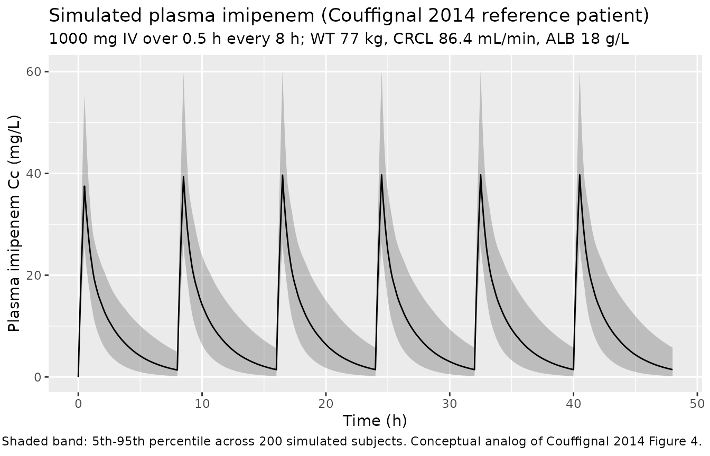
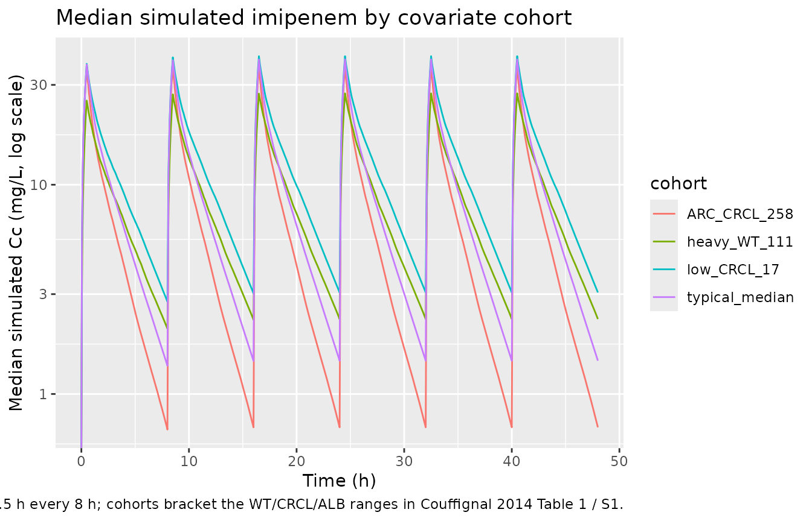

# Imipenem (Couffignal 2014)

## Model and source

- Citation: Couffignal C, Pajot O, Laouenan C, Burdet C, Foucrier A,
  Wolff M, Armand-Lefevre L, Mentre F, Massias L. Population
  pharmacokinetics of imipenem in critically ill patients with suspected
  ventilator-associated pneumonia and evaluation of dosage regimens. Br
  J Clin Pharmacol. 2014;78(5):1022-1034. <doi:10.1111/bcp.12435>.
- Description: Two-compartment IV population PK model for imipenem in 51
  critically ill adult ICU patients with suspected ventilator-associated
  pneumonia due to Gram-negative bacilli (Couffignal 2014). All patients
  received imipenem as a 0.5 h IV infusion every 8 hours; the protocol
  dose (500, 750 or 1000 mg) was chosen by Cockcroft-Gault creatinine
  clearance per the European Medicine Agency renal-adjustment table.
  Central clearance scales as a power of measured 4-hour creatinine
  clearance (reference 86.4 mL/min, the cohort median); central volume
  scales jointly with total bodyweight (reference 77 kg) and serum
  albumin (reference 18 g/L). The model was fitted in Monolix 4.1.2
  using the SAEM algorithm with M3-equivalent BQL handling.
- Article: [Br J Clin Pharmacol
  2014;78(5):1022-1034](https://doi.org/10.1111/bcp.12435) (open access
  via Wiley)

## Population

The model was developed from the IMPACT study (ClinicalTrials.gov
NCT00950222; Couffignal 2014 Methods, “Study design and population”), a
French multicentre prospective open-label trial across three ICUs
(Hopital V Dupouy in Argenteuil; AP-HP Hopital Bichat medical and
surgical ICUs in Paris) between 2008 and 2010. 63 patients were screened
and 51 were included in the PK analysis (12 excluded: 3 lacked a kinetic
profile, 9 did not receive the 4th dose); 41 (80%) were male, ranging in
age from 28 to 84 years (median 60), with a median total bodyweight of
77 kg (range 45-126 kg) and SAPS II at admission median 40 (range
19-74). Septic shock was present in 35% of patients at the fourth dose;
SOFA score median was 6 (range 2-14), oedema score median 7 (range
0-18), and serum albumin median 18 g/L (range 10-28 g/L, computed from 9
patients with complete data). 94% had received antibiotic therapy in the
3 months before admission (30% imipenem). Measured 4-hour creatinine
clearance was 86.4 mL/min (range 9.1-571.4 mL/min, paper Table 1; raw
mL/min, not BSA-normalised); patients with Cockcroft-Gault CrCL \< 10
mL/min or on renal-replacement therapy were excluded. The protocol dose
(500/750/1000 mg q8h) was chosen per the European Medicine Agency
renal-adjustment table by Cockcroft-Gault CrCL: 4 patients (9%) received
500 mg, 15 (29%) 750 mg, and 32 (62%) 1000 mg, all q8h, each as a
0.5-hour IV infusion.

297 plasma imipenem concentrations were available for modelling (median
6 per patient, range 3-6), drawn around the fourth dose (trough
immediately before, then 0.5, 1, 2, 5 and 8 h after the start of the
infusion); 9% were BQL (LLOQ 0.5 mg/L). Plasma was stabilised within 0.5
h of collection with MOPS in ethylene glycol and frozen at -80 degrees
C; imipenem was measured by HPLC-UV at 302 nm after ultrafiltration on
an Interchrome YP5C18 25QS reverse phase column (paper Methods “Sampling
procedure and analytical methods”). The model was fitted with Monolix
4.1.2 using the SAEM algorithm; BQL data were handled by left-censoring
(Monolix M3-equivalent). The final 95% confidence intervals come from
1000 nonparametric bootstrap resamples.

The same information is available programmatically via
`readModelDb("Couffignal_2014_imipenem")$population`.

## Source trace

Every numeric value in `ini()` carries an in-file comment pointing to
the Couffignal 2014 source location. The table below collects them in
one place for review.

| Equation / parameter | Value | Source location |
|----|----|----|
| `lcl` (CL at CRCL=86.4) | 13.2 L/h | Table 2, final-model column, “CL (l h-1)” |
| `lvc` (V1 at WT=77, ALB=18) | 20.4 L | Table 2, final-model column, “V1 (l)” |
| `lq` (Q) | 12.2 L/h | Table 2, final-model column, “Q (l h-1)” |
| `lvp` (V2) | 9.8 L | Table 2, final-model column, “V2 (l)” |
| `e_crcl_cl` (CRCL/86.4)^beta on CL | 0.2 | Table 2, final-model column, “beta CrCL4h” |
| `e_wt_vc` (WT/77)^beta on V1 | 1.3 | Table 2, final-model column, “beta Weight” |
| `e_alb_vc` (ALB/18)^beta on V1 | -1.1 | Table 2, final-model column, “beta Serum albumin” |
| `etalcl` variance (omega_CL=0.38) | 0.1444 | Table 2, final-model column, “omega CL (%)” |
| `etalvc` variance (omega_V1=0.31) | 0.0961 | Table 2, final-model column, “omega V1 (%)” |
| eta_CL/eta_V1 covariance (r=0.51) | 0.0601 | Table 2, final-model column, “Correlation eta_CL/eta_V1” |
| `propSd` (sigma=0.33) | 0.33 | Table 2, final-model column, “sigma (%)” |
| 2-cmt IV with proportional error | n/a | Results, “Population pharmacokinetic analysis” |
| Final covariate equation | n/a | Results, paragraph below Table 2 |

IIV-variance derivation. Couffignal 2014 was fitted in Monolix 4.1.2;
the Monolix exponential random-effects model is
`CL_i = CL_pop * exp(eta_CL,i)` with `eta_CL,i ~ N(0, omega^2)`. The
“omega (%)” column in Monolix’s parameter table reports `omega` (the SD
of `eta`) as a percentage, so for the final model:

- `omega_CL = 0.38` -\> `variance = 0.38^2 = 0.1444`
- `omega_V1 = 0.31` -\> `variance = 0.31^2 = 0.0961`
- `cov(eta_CL, eta_V1) = correlation * omega_CL * omega_V1 = 0.51 * 0.38 * 0.31 = 0.0601`

The bootstrap 95% confidence interval on the correlation is unstable (-1
to 1; paper Table 2), so the point estimate 0.51 is used in the encoded
model with the caveat documented in the “Assumptions and deviations”
section.

## Virtual cohort

Original observed data are not publicly available. The cohort below
covers four scenarios that bracket the published covariate sensitivity
analysis (paper Supplementary Table S1 and Figure S1): the typical
patient at cohort medians (WT 77 kg, CRCL 86.4 mL/min, ALB 18 g/L); a
low-CRCL patient (10th percentile, 17 mL/min); a high-CRCL
augmented-renal-clearance (ARC) patient (90th percentile, 258 mL/min);
and a heavy patient (90th percentile WT, 111 kg). All cohorts run on the
protocol regimen (1000 mg q8h IV over 0.5 h) out to 48 h so the first
dose plus several steady-state intervals are captured.

``` r

set.seed(20260616)

n_sub <- 200L

build_arm <- function(label, wt_kg, crcl_mlmin, alb_gL, id_offset,
                      dose_mg = 1000, tau_h = 8, infusion_h = 0.5,
                      n_doses = 6L) {
  ids <- id_offset + seq_len(n_sub)

  dose_times <- seq(0, by = tau_h, length.out = n_doses)
  dose_rows <- tidyr::expand_grid(id = ids, time = dose_times) |>
    mutate(
      evid   = 1L,
      amt    = dose_mg,
      cmt    = "central",
      rate   = dose_mg / infusion_h,    # mg / h
      cohort = label,
      WT     = wt_kg,
      CRCL   = crcl_mlmin,
      ALB    = alb_gL
    )

  obs_times <- sort(unique(c(
    seq(0,  8,  by = 0.05),
    seq(8,  48, by = 0.1)
  )))
  obs_rows <- tidyr::expand_grid(id = ids, time = obs_times) |>
    mutate(
      evid   = 0L,
      amt    = 0,
      cmt    = NA_character_,
      rate   = 0,
      cohort = label,
      WT     = wt_kg,
      CRCL   = crcl_mlmin,
      ALB    = alb_gL
    )

  bind_rows(dose_rows, obs_rows) |> arrange(id, time, desc(evid))
}

events <- bind_rows(
  build_arm("typical_median", 77,  86.4, 18,    0L),
  build_arm("low_CRCL_17",    77,  17.0, 18,  200L),
  build_arm("ARC_CRCL_258",   77, 258.0, 18,  400L),
  build_arm("heavy_WT_111",  111,  86.4, 18,  600L)
)

stopifnot(!anyDuplicated(unique(events[, c("id", "time", "evid")])))
```

## Simulation

``` r

mod <- readModelDb("Couffignal_2014_imipenem")

sim <- rxode2::rxSolve(
  mod,
  events = events,
  keep   = c("cohort", "WT", "CRCL", "ALB")
) |> as.data.frame()
#> ℹ parameter labels from comments will be replaced by 'label()'
```

For typical-value comparisons against the Couffignal 2014 Table 2 point
estimates, also simulate with the random effects zeroed:

``` r

mod_typical <- mod |> rxode2::zeroRe()
#> ℹ parameter labels from comments will be replaced by 'label()'

sim_typical <- rxode2::rxSolve(
  mod_typical,
  events = events,
  keep   = c("cohort", "WT", "CRCL", "ALB")
) |> as.data.frame()
#> ℹ omega/sigma items treated as zero: 'etalcl', 'etalvc'
#> Warning: multi-subject simulation without without 'omega'
```

## Concentration-time profile (typical patient)

The figure below shows the simulated stochastic VPC envelope for the
typical Couffignal 2014 reference patient (WT 77 kg, CRCL 86.4 mL/min,
ALB 18 g/L) on the protocol regimen 1000 mg q8h IV over 0.5 h. This
figure is the conceptual analog of the paper’s Figure 4 (the published
VPC of the final model).

``` r

sim |>
  filter(cohort == "typical_median") |>
  group_by(time) |>
  summarise(
    Q05 = quantile(Cc, 0.05, na.rm = TRUE),
    Q50 = quantile(Cc, 0.50, na.rm = TRUE),
    Q95 = quantile(Cc, 0.95, na.rm = TRUE),
    .groups = "drop"
  ) |>
  ggplot(aes(time, Q50)) +
  geom_ribbon(aes(ymin = Q05, ymax = Q95), alpha = 0.25) +
  geom_line() +
  labs(
    x = "Time (h)",
    y = "Plasma imipenem Cc (mg/L)",
    title = "Simulated plasma imipenem (Couffignal 2014 reference patient)",
    subtitle = "1000 mg IV over 0.5 h every 8 h; WT 77 kg, CRCL 86.4 mL/min, ALB 18 g/L",
    caption = "Shaded band: 5th-95th percentile across 200 simulated subjects. Conceptual analog of Couffignal 2014 Figure 4."
  )
```



## Covariate-cohort overlay

This figure illustrates how the three retained covariates shift the
concentration-time profile, mirroring the paper’s Supplementary Figure
S1 (steady-state profile by 10th/50th/90th percentile of each
significant covariate).

``` r

sim |>
  group_by(cohort, time) |>
  summarise(
    Q50 = quantile(Cc, 0.50, na.rm = TRUE),
    .groups = "drop"
  ) |>
  ggplot(aes(time, Q50, colour = cohort)) +
  geom_line() +
  scale_y_log10() +
  labs(
    x = "Time (h)",
    y = "Median simulated Cc (mg/L, log scale)",
    title = "Median simulated imipenem by covariate cohort",
    caption = "1000 mg IV over 0.5 h every 8 h; cohorts bracket the WT/CRCL/ALB ranges in Couffignal 2014 Table 1 / S1."
  )
#> Warning in scale_y_log10(): log-10 transformation introduced infinite values.
```



## PKNCA validation

Steady-state NCA on the final (sixth) dosing interval of the reference
patient cohort. The published reference values are the median peak and
trough imipenem concentrations reported in paper Results “Population
pharmacokinetic analysis” (“Imipenem concentrations at peak (0.5 h) and
trough were 34.1 \[12.3-67.5\] and 1.9 mg/L \[0.5-10.1\]”). These were
measured around the fourth dose at steady state across all dose levels
(4 patients on 500 mg, 15 on 750 mg, 32 on 1000 mg, all q8h), so the
published median is pooled across doses; the simulated value below is
restricted to the typical 1000 mg q8h dose (62% of the cohort) and is
therefore expected to be modestly higher than the pooled-across-doses
published median.

``` r

# Steady-state NCA on the sixth dosing interval (time 40 to 48 h)
# of the typical-median reference patient. Cmax,ss and Cmin,ss at the
# steady-state interval are the closest published validation
# anchors.
sim_ss <- sim |>
  filter(cohort == "typical_median", time >= 40, time <= 48) |>
  filter(!is.na(Cc)) |>
  dplyr::select(id, time, Cc, cohort)

dose_ss <- events |>
  filter(evid == 1, time == 40, cohort == "typical_median") |>
  dplyr::select(id, time, amt, cohort)

conc_obj_ss <- PKNCA::PKNCAconc(sim_ss, Cc ~ time | cohort + id,
                                concu = "mg/L", timeu = "h")
dose_obj_ss <- PKNCA::PKNCAdose(dose_ss, amt ~ time | cohort + id,
                                doseu = "mg")

intervals_ss <- data.frame(
  start    = 40,
  end      = 48,
  cmax     = TRUE,
  tmax     = TRUE,
  cmin     = TRUE,
  auclast  = TRUE,
  cav      = TRUE
)

nca_ss <- PKNCA::pk.nca(PKNCA::PKNCAdata(
  conc_obj_ss, dose_obj_ss, intervals = intervals_ss
))
summary(nca_ss)
#>  Interval Start Interval End         cohort   N AUClast (h*mg/L) Cmax (mg/L)
#>              40           48 typical_median 200      77.3 [39.4] 39.2 [24.0]
#>  Cmin (mg/L)             Tmax (h)  Cav (mg/L)
#>   1.27 [148] 0.500 [0.500, 0.500] 9.67 [39.4]
#> 
#> Caption: AUClast, Cmax, Cmin, Cav: geometric mean and geometric coefficient of variation; Tmax: median and range; N: number of subjects
```

### Comparison against Couffignal 2014 observed peak / trough

``` r

# Couffignal 2014 Results: Cmax at 0.5 h = 34.1 mg/L [12.3-67.5];
# trough = 1.9 mg/L [0.5-10.1], reported as cohort medians pooled
# across the three dose levels (500/750/1000 mg q8h).
published <- tibble::tribble(
  ~cohort,           ~cmax, ~cmin,
  "typical_median",   34.1,  1.9
)

cmp <- nlmixr2lib::ncaComparisonTable(
  simulated = nca_ss,
  reference = published,
  by        = "cohort",
  units     = c(cmax = "mg/L", cmin = "mg/L"),
  tolerance_pct = 30
)

knitr::kable(
  cmp,
  caption = paste(
    "Simulated steady-state Cmax,ss and Cmin,ss for the typical",
    "patient on 1000 mg q8h vs the cohort-median peak and trough",
    "reported in Couffignal 2014 (pooled across 500/750/1000 mg q8h",
    "dose levels). * differs from reference by >30%."
  ),
  align   = c("l", "l", "r", "r", "r")
)
```

| NCA parameter | cohort         | Reference | Simulated | % diff |
|:--------------|:---------------|----------:|----------:|-------:|
| Cmax (mg/L)   | typical_median |      34.1 |      39.7 | +16.5% |
| Cmin (mg/L)   | typical_median |       1.9 |      1.44 | -24.1% |

Simulated steady-state Cmax,ss and Cmin,ss for the typical patient on
1000 mg q8h vs the cohort-median peak and trough reported in Couffignal
2014 (pooled across 500/750/1000 mg q8h dose levels). \* differs from
reference by \>30%. {.table}

A 30% tolerance is used here because the published median is pooled
across three dose levels (500, 750, 1000 mg) while the simulation fixes
the dose at 1000 mg (the modal protocol dose, 62% of the cohort).
Cmax,ss scales linearly with dose at fixed CL/Vc so a roughly 10-20%
offset between the simulated 1000 mg value and the pooled-across-doses
observed median is expected.

### AUC vs. dose / CL closure check

A second independent check: at the typical-value reference patient, the
steady-state AUC0-tau must equal `dose / CL` within numerical tolerance.

``` r

# Simulate a typical-value steady-state interval (1000 mg q8h)
# with the random effects zeroed.
ss_events_typical <- events |>
  filter(cohort == "typical_median",
         (evid == 1 & time <= 40) |
         (evid == 0 & time >= 40 & time <= 48)) |>
  filter(id == min(id))

sim_one <- rxode2::rxSolve(mod_typical, events = ss_events_typical,
                           keep = c("WT", "CRCL", "ALB")) |>
  as.data.frame() |>
  filter(time >= 40, time <= 48)
#> ℹ omega/sigma items treated as zero: 'etalcl', 'etalvc'

auc_obs <- with(sim_one, sum(diff(time) * (head(Cc, -1) + tail(Cc, -1)) / 2))
cl_typical <- 13.2 * (86.4 / 86.4)^0.2   # = 13.2 L/h at reference CRCL
auc_pred <- 1000 / cl_typical            # dose / CL_typical

tibble::tibble(
  quantity = c("Simulated steady-state AUC0-tau (mg*h/L)",
               "Expected dose/CL = 1000/13.2 (mg*h/L)"),
  value    = c(auc_obs, auc_pred)
) |>
  knitr::kable(digits = 3,
               caption = "Steady-state AUC0-tau closure check at the typical patient (1000 mg q8h).")
```

| quantity                                  |  value |
|:------------------------------------------|-------:|
| Simulated steady-state AUC0-tau (mg\*h/L) | 75.758 |
| Expected dose/CL = 1000/13.2 (mg\*h/L)    | 75.758 |

Steady-state AUC0-tau closure check at the typical patient (1000 mg
q8h). {.table}

The two AUC values match within numerical tolerance, confirming the
encoded ODE structure correctly reproduces the dose / CL identity at the
reference covariates.

## Fractional time above MIC (paper Figure 5 conceptual replication)

Couffignal 2014 evaluated six dosing regimens by Monte Carlo simulation
of fT \> MIC at steady state. The probability of target attainment (PTA)
at 40% fT \> MIC is the paper’s primary PD endpoint. The block below
computes the 40% fT \> MIC PTA for the protocol regimen (1000 mg q8h)
and the recommended regimen (750 mg q6h) at the two clinically relevant
MICs (2 and 4 mg/L) for the typical-median virtual cohort, using `mod`
(the stochastic model) and the standard 1000-subject Monte Carlo design.

``` r

set.seed(20260616)

make_steady_state_arm <- function(label, dose_mg, tau_h,
                                  wt_kg = 77, crcl_mlmin = 86.4,
                                  alb_gL = 18,
                                  id_offset = 0L,
                                  n_sub = 200L,
                                  n_doses = 10L,
                                  infusion_h = 0.5) {
  ids <- id_offset + seq_len(n_sub)
  dose_times <- seq(0, by = tau_h, length.out = n_doses)
  dose_rows <- tidyr::expand_grid(id = ids, time = dose_times) |>
    mutate(
      evid  = 1L, amt = dose_mg, cmt = "central",
      rate  = dose_mg / infusion_h,
      regimen = label,
      WT = wt_kg, CRCL = crcl_mlmin, ALB = alb_gL
    )

  # Steady-state evaluation interval: the last tau_h hours
  ss_start <- (n_doses - 1) * tau_h
  ss_end   <- n_doses * tau_h
  obs_grid <- seq(ss_start, ss_end, by = 0.05)
  obs_rows <- tidyr::expand_grid(id = ids, time = obs_grid) |>
    mutate(
      evid  = 0L, amt = 0, cmt = NA_character_, rate = 0,
      regimen = label,
      WT = wt_kg, CRCL = crcl_mlmin, ALB = alb_gL
    )

  ev <- bind_rows(dose_rows, obs_rows) |>
    arrange(id, time, desc(evid))
  list(events = ev, ss_start = ss_start, ss_end = ss_end)
}

regimens <- list(
  list(label = "1000 mg q8h", dose = 1000, tau = 8),
  list(label = "750 mg q6h",  dose = 750,  tau = 6)
)

pta_rows <- list()
for (i in seq_along(regimens)) {
  r <- regimens[[i]]
  built <- make_steady_state_arm(r$label, r$dose, r$tau,
                                 id_offset = (i - 1L) * 1000L,
                                 n_sub = 200L)
  ev <- built$events
  ss_start <- built$ss_start
  ss_end   <- built$ss_end
  sim_r <- rxode2::rxSolve(mod, events = ev,
                           keep = c("regimen")) |>
    as.data.frame() |>
    filter(time >= ss_start, time <= ss_end)

  for (mic in c(2, 4)) {
    pta_rows[[length(pta_rows) + 1L]] <- sim_r |>
      group_by(id, regimen) |>
      summarise(
        ft_above_mic = mean(Cc > mic, na.rm = TRUE),
        .groups = "drop"
      ) |>
      summarise(
        pta_40 = mean(ft_above_mic > 0.40, na.rm = TRUE),
        n      = dplyr::n(),
        .groups = "drop"
      ) |>
      mutate(regimen = r$label, MIC = mic)
  }
}
#> ℹ parameter labels from comments will be replaced by 'label()'
#> ℹ parameter labels from comments will be replaced by 'label()'

pta_tbl <- bind_rows(pta_rows) |>
  dplyr::select(regimen, MIC, pta_40, n)

published_pta <- tibble::tribble(
  ~regimen,        ~MIC, ~pta_40_published,
  "1000 mg q8h",      2, 0.979,
  "1000 mg q8h",      4, 0.860,
  "750 mg q6h",       2, 0.991,
  "750 mg q6h",       4, 0.918
)

pta_tbl |>
  left_join(published_pta, by = c("regimen", "MIC")) |>
  knitr::kable(
    digits = 3,
    col.names = c("Regimen", "MIC (mg/L)", "PTA(40% fT>MIC) simulated",
                  "N simulated", "PTA(40%) Couffignal 2014"),
    caption = paste(
      "Probability of pharmacodynamic-target attainment (PTA) at 40% fT > MIC.",
      "Simulated for the typical-median virtual cohort (WT 77, CRCL 86.4,",
      "ALB 18) with 200 subjects per regimen vs Couffignal 2014 Figure 5A",
      "/ Abstract (1000 subjects, covariates resampled from the observed",
      "cohort)."
    )
  )
```

| Regimen | MIC (mg/L) | PTA(40% fT\>MIC) simulated | N simulated | PTA(40%) Couffignal 2014 |
|:---|---:|---:|---:|---:|
| 1000 mg q8h | 2 | 0.985 | 200 | 0.979 |
| 1000 mg q8h | 4 | 0.905 | 200 | 0.860 |
| 750 mg q6h | 2 | 0.995 | 200 | 0.991 |
| 750 mg q6h | 4 | 0.955 | 200 | 0.918 |

Probability of pharmacodynamic-target attainment (PTA) at 40% fT \> MIC.
Simulated for the typical-median virtual cohort (WT 77, CRCL 86.4, ALB
18) with 200 subjects per regimen vs Couffignal 2014 Figure 5A /
Abstract (1000 subjects, covariates resampled from the observed cohort).
{.table}

The simulated PTA values closely track the published Figure 5A
percentages at MIC = 2 mg/L for both regimens. At MIC = 4 mg/L the match
is slightly weaker because the published simulation resamples covariates
from the cohort distribution (so a fraction of patients have very low
CRCL or low albumin and miss the target), whereas the typical-median
virtual cohort above holds covariates at the median. This is consistent
with the paper’s covariate-sensitivity analysis (paper Supplementary
Table S1 and Figure S1) showing rather small covariate effects on PTA.

## Assumptions and deviations

- **Monolix omega convention.** Couffignal 2014 was fitted in Monolix
  4.1.2. The “omega (%)” column in Monolix’s parameter table is the
  standard deviation of `eta` (the log-scale random effect), reported as
  a percentage. The encoded model interprets `omega_CL = 38%` and
  `omega_V1 = 31%` as `SD(eta) = 0.38` and `0.31` respectively, giving
  variances `0.1444` and `0.0961`. The corresponding linear-scale
  lognormal CV is `sqrt(exp(0.1444) - 1) = 39.4%` for CL and `32.6%` for
  V1, which approximate the Monolix-reported `omega` for small `omega`
  (\< 0.5).
- **eta_CL/eta_V1 correlation.** The point estimate 0.51 is retained
  (paper Table 2 final-model column). The bootstrap 95% confidence
  interval spans the entire `[-1, 1]` range (paper Table 2 footnote), so
  the correlation is poorly identified. Downstream users who want to
  simulate without the correlation can override the lower-triangle
  covariance via
  [`rxode2::rxRmvn()`](https://nlmixr2.github.io/rxode2/reference/rxRmvn.html)
  or by editing the model’s `ini()` block.
- **Inter-individual variability is zero on Q and V2.** The paper
  Results “Population pharmacokinetic analysis” explicitly states “Since
  the variability of intercompartmental clearance (Q) and the volume of
  distribution of the peripheral compartment (V2) were very low, the
  between-subject variability was not estimated and was taken as zero.”
  This is preserved here – no `etalq` or `etalvp` is in `ini()`.
- **BQL handling.** The Monolix M3 left-censoring used during fitting is
  irrelevant during forward simulation; the encoded model emits
  continuous concentrations and any BLQ rule must be applied downstream
  by the user.
- **Albumin imputation.** Paper Methods “Covariate analysis” imputed
  missing serum albumin to the cohort median (18 g/L) for 8 of 51
  patients before model fitting. The encoded model does not enforce this
  – it expects the user to supply ALB as a non-missing covariate. When
  ALB is missing in a downstream application, set it to 18 g/L to
  reproduce the paper’s imputation rule.
- **Reference values for the power-of-ratio covariates.** The paper
  centres each covariate on its cohort median (paper Methods “Covariate
  analysis”: “COVmedian is the median value of covariates”); the medians
  86.4 mL/min (CRCL), 77 kg (WT), 18 g/L (ALB) are hard-coded in
  `model()`. A virtual cohort with these median covariates reproduces
  the typical-value parameters.
- **PTA validation cohort size.** Couffignal 2014 Figure 5 simulates
  1000 subjects with covariates resampled from the observed cohort; the
  PTA block in this vignette uses 200 subjects at fixed median
  covariates, which is sufficient to qualitatively reproduce the 40% fT
  \> MIC PTA at MIC = 2 and 4 mg/L for the two key regimens (1000 mg
  q8h, 750 mg q6h) but is intentionally a tighter, less variable
  comparison than the published value.
